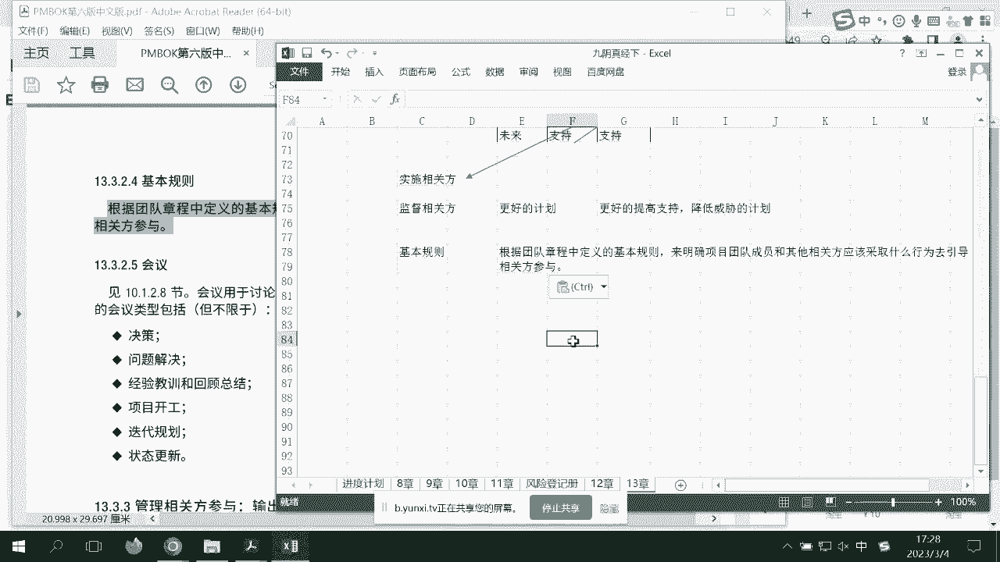

# PMP考前强化记忆串讲 - P7：PMBOK12-13章考前强化记忆视频 - 交大慧谷PMP培训 - BV1yg4y157ux

如果有一天啊你在职场上感觉到，无论是硬技能还是软技能方面有所缺失，都可以让我睡觉，为企业提升，自会鼓让梦想有回响，我们来到第12章采购知识领域，那么所所有的大家记住你们的知识领域当中，你都是以乙方视角。

乙方式要是什么，你带着团队为甲方去做某些事情，但是采购知识领域突然之间又第一次带入了你，进入了甲方视角，而在甲方视角里面，你你你你注意啊，你不是采购经理啊，你是甲方的一个，项目经理，没权限签订合同的。

你只是跟采购部一起可能有一些意见，来确定供应商血型，所以说呢在这里面呢，其实你们会看到三个子过程，第一个规划采购，明确采购方法，和目标，第二个呢叫做实施采购，就是在众多的供应商里面。

选择一家作为你的供应商，第三个叫做控制采购，或者有的地方叫做监督采购，其实这就是当它成为你供应商之后，你如何去管理它啊，首先我们先来来来一个流程图，先把这三个的作用给他说清楚。

比方说我们在实时采购的时候，我们来一个个的往下看啊，呃这样就不用那个了哦，这也不行，因为里面要讲到七大合同，那我们我们先讲流程流程吧，先讲各种各样的一些文档，比方说你需要有采购计划。

就是我们采购生命期怎么怎么怎么管，第二个重要文档就是采购策略的，当然签怎么样是合同，第三个重要文档我们叫做采购的啊，工作说明书，就是我要采购的这样东西的描述，包括还有我们比较那个的。

像官方的选择标准等等，是怎么样的人，能成为我的供应商，甚至你要给他发采购的邀请邀标书，叫p r f q q f i等等啊，没关系，待会这些文档我们到的时候再细说。

我们只是知道我们上手要搭一个采购体系出来，啊我们要搭一个采购体系出来，那么这时候呢作为乙方啊，其实最早介入采购的应该是他们的销售部，呃拿到了甲方的这些应该不是所有的部分文档。

比方说啊这些文档应该是可以拿到的对吧，拿到之后呢，他们就可以考虑是不是需要招投标了，那么当然了，作为我们企业里面来说，诶诶诶诶大哥你怎么你怎么啊，大哥大哥大哥大哥哎呀算了，我把他先删了啊。

所以呢作为乙方来说，一定要确定这个项目是否值得立项，所以呢他们做的第一件事情，就是这个项目的可行研究，或者我们叫做商业论证，当商业论证ok以后啊，我们觉得怎么样ok的，所以呢他们就会做第二件事情。

就是向甲方投标，那这时候我们可能会有商务技术和投标文件啊，很多，那么这时候其实你要知道，你是若干加乙方中的111方，那么经过了甲方可能在实时采购的时候，他们会用加权评分啊，可能会请一些怎么样我们的呃。

采购部可能项目经理你会参与，可能专家专家进行，对于乙方的怎么样让乙方来讲标，所以说呢这时候如果说诶，恰巧你最终怎么样报价也ok，当然你知道中国很多项目都是低价中标的呀，你报价也ok，因为对于采购部来说。

它的kpi就是什么价格要最低，所以呢双方呢就会对跟对诶，接下来就会跟你怎么样签协议，当然签协议之前，我们可能要做做怎么样协议内容的谈判，那么没有问题之后呢，我们就签了协议了，至此你就成为他们家的供应商。

不好意思，作为偏僻来说，你还要有一个怎么样事业环境，还要组织过程，所以呢你有了这些，你就可以立项了，而这时候你应该是制定项目章程的，输入你的项目章程就有了你的项目被启动了，这就是你的启动过程中。

那么我们再来看甲方，如果在协议签订之后，如何控制采购，你可以看到控制采购的输入是协议，他就拿着整个协议怎么样呢，来管理起你这家供应商了啊，算了，不要画得这么复杂呃，我想看有有什么图形可以让我解释一下。

这个图可以看，啊就这样吧，就可以去管理起你整个乙方的过程了，那么首先作为乙方来说，你在启动的时候，除了制定项目章程以外呢，你还要识别相关方，那么这时候呢，如果说将来有一个工具就对你来说很重要。

就是权利利益方格，我们会去识别那些怎么样横轴是利益，左低右高，纵轴是权力上高下低的相关方面的，所以识别相关方应该在这个位置，对吧，那你看到了甲方的项目经理骗权利很高，利益很高，甲方的采购权力高。

但是对于他来说，整个项目就完了，所以他的利益不高，对于甲方的这些项目的user用户，他的利益很高，但是权力不高，甲方还有个前台，所以呢这时候你的识别相关方的相关方，登记册就出来了。

好那么继续我们来看一下知识领域，这一部分人走的应该是什么知识领域，你不要切别，无影无填充线条是给它虚线，好各位老铁们，看一下他们属于什么知识领域，走的是相关方知识领域，因为他们的啊走的是沟通知识领域。

不好意思，说错了，你要经常跟甲方的pm，甲方的用户怎样设计他们的怎样沟通模式，给他们工作绩效报告，而这条，你会发觉你应该走的是什么模式，相关方支持领域，你公司里面有了公司的礼品，你应该送送的是谁。

甲方的采购，甲方的pm，而不是甲方的用户，所以有了它，我们的项目的六要素，有了有了它，我知道如何去处理相关方，那么我们接下来的项目的怎么样规划，就可以有了，对于项目经理来说。

项目最规划最重要的事情是什么，是我们的项目管理计划啊，项目管理计划，所以呢我们要收集需求，我问你收集谁的，然后甲方的呀，要定义范围谁呢，我们项目的，所以呢我们要有w p s，而这些到底是找谁。

你看你要去根据相关化去找的，所以我们正在制定项目管理计划呃，这时候我们的范围的第一基准，有了我们的范围基准，第二个我们怎么样定义活动，我们排序活动，我们估算实践，我们输出进度计划。

这就是我们上节课讲的反应，对不对，这时候你看甲方在哪里，甲方依然还在控制采购，所以你会发觉他就是爸爸，所以我希望你能够真正的去理解，pmbok在讲什么，诶没有，他就是爸爸，好的，那么继续啊，那行吧。

那么我们估算，钱的估算活动的费用成本，指定预算，所以这时候我们的范进程三个铁三角都有了，而我你要你要知道，你真正的项目的估算和运作或者规划，你是离不开相关方面的，所以一手拿章程。

一手看相关方能够确定项目的三个边角好，那么继续呃，范进程有了以后，我们考虑规划质量，今天我们说的出现质量管理计划和呃，质量非常指标啊，我们要干嘛把人给拉出来，所以规划人力资源，估算资源出r b s。

接下来我们要考虑范进程，指资源o沟通，看跟谁沟通，甲方的pm和甲方的用户，我们要规划风险识别并性定量应对风险，我问你甲方在哪里，800亿人在控制采购好吧，那行吧，风险弄完以后呢，我们就规划采购。

你有可能也要采购啊，你的原材料，嗨呀，爸爸依然在空气采购，所以我们算了，我们要做一个怎么样规划，相关方希望提高buff的支持，降低buff的威胁，所以你会发觉这是我们的规划，所以你在乙方市场好。

那么接下来呢我们计划有了，别忘记我们要开一个会议，就是启动会，我们的kick off meeting，kick off meeting，这个考点就是很清楚，你要求的是呃参加的team member啊。

呃团队发起人相关方面，你要告诉大家项目的目标，重要里程碑边界等等，而不是叉叉某些没有用的什么范围计划啊，质量情况这些东西他们并不一定希望了解，所以我们要给他们看到实质好继续，那么启动会议开了以后呢。

我们就要考虑怎么样项目的执行了，诶大家注意一下，启动会议是规划最后执行之前，那么这时候我会发觉范进程这里面都是空的，执行靠谁执行，靠团队，一个有力的团队，团队在哪里，团队在这，我们要组建组团队。

建设团队，管理团队，然还记得吗，就是第九章，我们也要怎么样让qg去管理质量，要怎么样过程检查，我们可能也要怎么样管理沟通，把一些项目信息发送给相关方面，我们可能也要实施风险应对啊，对risk来了以后。

我不干他怎么办，然后呢，我们要实施采购管理项管理，相关方，哦所以这才是真正的执行，那我问你，你在执行，你弄阶段，甲方在哪里，依然在控制裁，这就是采购知识领域的魅力，好那么继续呃，我们到了监控过程组。

监控过程组呢应该是在哪里呢，在这在监控过程中，你比较关注的两件事情，一个是什么监控工作，还有一件事情就是我们的实施整体变更控制，就是我们要有cgb了，那么继续我们在执行执行之前执行。

突然之间有一有一天我们要出来一样东西，是什么呢，可交付成果，啊近一点我就写在这儿吧，所以你害怕这个东西是不好的，所以你一定是先给谁，先给质量团队的控制质量，所以呢你会发现有这根瘤可交付成果。

先给qc内部内测，qc测下来没问题，叫核实的，但是你又觉得这不够用户体验啊，所以你要给用户去看，怎么看就到了这儿确认范围用的工具叫检查，那么对于甲方来说它是什么呢，各位老铁，你看啊，我们看一下控制采购。

依然有一个很逼格很高的工具叫做什么呢，也叫检查，所以大家的视角不一样，你是确认范围减小，它是作为甲方叫控制，控制采购依然有一个工具叫检查，好我们到了，所以你可以快速的看到，你看在pmbok的498页。

你看有一个工具叫检查，其实你要知道看的是乙方的可交付成果好，那么继续呃，在执行的时候，你除了可交付成果之外，你还有一个东西叫做工作绩效数据对吧，就是我们的p v e v a t就是项目最原始的。

我经过了所有的分析呢，把它变成了一个叫做工作绩效，信息就是我们的怎么样，spi e p i等等，我就简简述一下，因为有的同学可能这些都已经忘记了，没关系啊，那么这时候呢作为你来说啊。

你要把它汇总会组成一个叫做什么呢，项目里面能流转的叫做工作绩效报告，怎么经过呢，经过了监控项目工作，把每条数据流变成周报呢叫做工作好报告，那么大家还记得吧，工作绩效报告这个东西是根据沟通管理计划。

确定的方式和频率发送给谁，发送给相关方面，而甲方也属于相关方，所以我们来看一下甲方有个工具叫叫什么呢，叫做数据分析，数据分析，而这个工具呢就是来检查乙方的，我们的工作绩效报告的情况。

到底乙方项目做得怎么样，其实也并且向甲方汇报的，而且如果你检查通过了，那可交付成果就叫做什么叫做验收的可交付，那最终可以怎么样进行项目收尾，那么为什么在我们的监控过程中，还有一些工具，比方说像嗯叫审计。

你可以请第三方审计团队，甚至你可以经常怎么样到甲方公司去巡检，甲方好像也有两个地方叫审计，第一个地方叫做什么叫质量审计，你也可以过去，还有一个叫做风风险审计，你也可以用来怎么样通过审计这个工具。

去检查乙方的很多很多的信息，所以各位老铁们啊，我们回忆一下，我们想象一下，作为一个怎么样牛逼的甲方，他其实你有没有发觉，用一个子过程管了乙方这么多次过程，直至乙方最后的收尾，啊所以我们要知道它的数据流。

而在甲方里面可能只有三个三个计划，一个叫做规划，一个叫做实施采购，一个叫做监督采购，或者现在叫做啊或者叫监控采购，好的，所以我们知道它的原理，大家可以想象一下，我是用这样子一个图表。

帮大家回忆起了我们九阴真经上，到现在所有的子过程工具，包括他的原因好，那么我们继续，既然我们知道这些东西以后，那么它里面更细的知识领域是什么呢，大家请跟我重新翻阅一下我们的，第12章采购好。

那么我们来做采购的笔记了，第一个叫规划采购管理，就明确采购方法来注意一下，回到12章采购的笔记，啊放过来一点，规划采购的作用就是明确采购方法，决策，等等，而这里面会出现一个非常重要的文档。

一会我们可以看到叫采购管理计划，但是我们讲这个之前他会讲七大合同，我知道你们对于这个七大合同，还是非常非常的模糊，甚至有的同学忘记了，七大合同分三类，第二合同分三类，一类叫总价类和。

那么这种合同一般用在哪里呢，用在范围明确，确定你看确定需求是范围明确的情况，下面我们用总价类的比较多，而且呢未来范围不太变更，那么这种合同呢相对来说是什么呢，甲方有理，因为这样我说的清楚啊。

我有这么多乙方让我选了，你肯定选一个质量高，报价低的了，就像阿珍爱上了阿强，他要的范围很清楚，就是阿强呀，对不对，ok所以呢哎这就是我们的总价量，那么d总价里面呢其实是有三个，大家可以记一下。

第一个叫做固定总价啊，这个是最最明确的，如果说你要改，那不好意思，要么签新合同，要么怎么样，我们要增加合同金额，第二个叫做总价加激励，好注意一下，他呢应该会出来计算题。

但是我不想浪费时间给大家做采购的计算题，因为不会考虑，但是我们要知道这个作用在哪里，它呢有一个价格上限，我们叫天花板，我们约定允许绩效偏离，就是说我们最终的成交价，价格可能会跟当时的总价。

就是当时的总包合同不一样，哎如果你便宜了，那么大家一起怎么样享受便宜的红利咯，如果你贵了，大家一起贵，但是我们有一个天花板来保护自己，最贵我只能付到70万啊，这就是我的上封顶，这个叫总价加激励。

而第三个呢叫总价加经济调整，这种合同一般用在哪里呢，虽然范围也明确，但是跨度时间很长，用的货币啊可能会存在一定的贬值，所以这种跨度上货币贬值呢，我除了总价以外，我可能还给你一定的补偿，这就是我们的总裁。

这就是我们的总算，那么除了这个总三以外呢，我们还有一些合同，我把它放大一点，有的同学我估计现在还在用手机看眼，无珠都看掉了，另外三种呢我们叫做成本补偿，那么成本补偿的反之就是说什么呢，你们的。

工作范围有很大变更，就是范围不明确，那么不好意思，你们先签着，我们到时候再来，这个那么成本补偿，其实它它里面介绍也是三个，我们来对比一下，第一个叫做成本加，阿基利，也不是说不过第一个就不。

我班主偏偏颇的篇幅来这个比较好的那个，他呢跟总加加激励正好相反，相反在哪里呢，曲，绩效天理无天花板哦，就是那个总的70万是没有的，所以这两个合同啊很像，一个是有天花板，一个是没有天花板，都是玩绩效的。

第二个呢叫做成本加奖励，什么什么什么什么情况呢，成本时报，奖励主观笼统，就是很简单，我帮你实报实销所有的项目费用，你发生费用我全报，但是是不是有奖金，我要看你表现，而这种我们称为叫做成本加奖励。

好第三种叫做成本加固定费用，哎对啊，这个合同其实我们讲叫保大洋的，什么意思呢，就是成本实报实销，固定费用也给给多少呢，当时你看啊初始成本的百分比，我举个最简单的例子啊，我们看成本加固定费用。

一个项目成本是10万，然后呢那个给10%作为固定费用，那么如果说他花10万做完呢，我们就给，我给11万，那如果说他花100万作文呢，要注意一下，不是110万，是当时初始成本10万的10%，还是1万。

就是给101万，所以这种合同叫什么，叫保大洋的合同，你肯定得，所以各位老铁要明白每个合同的特性是什么，一般总结下来，他们用在范围明确，打方划算，这个范围不明确，乙方划算，那么中间还有一个什么合同呢。

叫做工料合同，注意下，请个阿姨什么的，你看啊，那个一般会聘用专家或者是外部知识，我们叫做人间合同，那么如果说说到这里呢，大家去切记，没有什么甲方乙方什么划算不划算的，啊不能叫风险最低最平均。

如果说以后考考你唉，我想签一个合同，希望双方风险最平均，其实是公认的，好所以呢知道一下这些合同好，那么接下来我们可以看到啊，数据收集做市场调研对吧，数据分析做r i m p v，这个没问题。

然后呢我们可以考虑什么攻方选注，注意这种已经不太会考虑了啊，公方选择到底是什么样子的，大家知道这个大方向就好了，最终的输出这个东东东东西就重要了，输出什么呢，采购，计划大家可以看到采购管理计划里面啊。

其实就是我的整个采购的方法论，好就我的整个采购的方法论，我就给大家结在这里了，那么其实包括我们的采购流程是什么，如何去评选供应商，是要三方报价还是五方报价，所有的采购的方法论都在里面。

那么第二个呢我们叫采购策略，它的偏向是不同的，我看到刚才同学有在问他的偏向是什么呢，偏向是合同类型，怎么支付，用什么合同，刚就刚才我们所谓的这七大合同是怎么样子，所以这两个是有点不一样的。

所以如果说在考试的时候啊，考试的时候就是考你哎，我们在签合同之前问你怎么办，基本上你的回答应该看的是采购采购管理计划，那么这时候我们正要签合同，或者是要选择某种合同，问你用什么。

那么这就是我们的采购策略，所以我记得有一道题，后来我看悟了，一开始是选那个采购策略，后来仔细一看，发现怎么样还没到签合同呢，他只是给了你一个报价而已，所以呢不好意思，我们应该明确的是，我们的采购流程。

好的，那么继续呃，我们的招标文件一般是指r p r q q f啊，这个知道一下就是我们的招标文件，他不太会问这些都是什么，这些都是基本上都差不多呀，ok了，招标文件，就这些我们的投标邀请书。

q fi就是邀请乙方来招投标的文书，好继续往下，那么这时候呢采购sow就很重要了，是什么，你作为甲方来说，他是最清楚自己想要一个什么东西，所以对你对采购的可交付成果啊，描述啊，要采购的服务啊，成果。

或者是产品啊，这就是我们的采购s o w好继续往下，那么包括官方选择标准，我就不细细讲了啊，我们可以做一些加权，然后呢包括一些东西就独立成本核算也有了，那么接下来我们来看到的是实时采购。

其实实施采购的作用是什么呢，获得卖方应答并授予合同，就是我们怎么样选一家作为我们的供应商，并且授予合同的过程好，那么怎么获取呢，因为你发了邀请函啊，那么接下来呢我们就要做采购的很多工具了。

那么这里的工具呢，其实呢卖方建议书指的就是乙方的标书啊，就是指的是乙方的标书，这个ok的，然后呢呃工具广告什么不会考，你考投标人会这肯定会考呃，注意一下投标人会议的时间，它是什么呢。

投标之前的记者招待会，或者是投标之前的答疑会，所以呢你要有公开公正的原则，要告知我们招投标原，原则答疑的一个过程啊，注意一下，不是之后的，那么另外呢我们会做一个谈判，谈判是不一样的，ipad是什么。

谈的是双方的合同，到最后大家觉得ok这就是所谓的财务量大，所以呢它输出会是什么呢，叫做选in的麦，我们就出来了啊，这这就是一个怎么样它的一个流程好，那么继续再往后呢，我们可以看到双方已经签到了协议了。

好协议内容我们稍微截一下，大概就是我们的我们的哎，其实就我们平时平平常签的甲方，某某乙方，某某乙方为甲方，但是注意一下，你会发觉一个很小的细节，协议是一份商务文件，在这里的协议啊。

你会发觉诶里面的第一个就是采购s o w，那么什么意思呢，就是说呃协议是商务文件，我将来的采购了，当时的那个就是工作说明书，会作为协议的附件或者是技术文件一起存放啊，这是我们要明白的好，那么到了最后呢。

我们可以看到啊，所谓的控制采购，其实控制采购的输入就是协议，一切按照协议为主，那么注意一下，这里面我们会有几个工具会比较拗口，拗口输入不用看了，输入主要就是协议呃，拗口第一个叫索赔管理。

我主要讲的就是这个工具，很多人认为索赔管理就是一定要大家赔钱，不好意思，不是的，在第六版里面，索赔管理写的很清楚，如果双方发生争议，首先都是一谈，所以我们双向双方都都坐下来谈。

第二要考虑dr叫替代争议解决法，那就像好比你跟公司里面有劳动关系的纠纷，那先跟hr谈接下来怎么样，我们叫劳动仲裁，第三才是怎么样上诉，我们去法院起诉，这就是我们索赔管理层，所以如果说题目里面发生了。

你是作为甲方跟供应商，出现了一些合同上的异议或者纠纷，永远选择大家坐下来谈，ok啊，站起来坐下来谈，如果谈下来不行，那可能选择a d r，再不行就选择上车好，这里面的工具呢都讲过了，数据分析。

看乙方的检查，看乙方的审计，审乙方的啊，最后呢我们就会关闭某个乙方采购，那么注意一下，采购的发票不是pm管理的，虽然有的题目里面出现的，其实pm是负责监督采购，哦应该由谁采购布局来触发这个流程。

这就是我们12章采购知识领域，大家要知道的一些主体条件和命脉了，好话不多说，我们来看第13章，也就是今天的最后一个章节13章，那么相关方知识领域，我们首先来翻译一下相关方知识领域呃。

我觉得这个知识领域可以很快的强调，很多人认为啊这个知识点很复杂，并不复杂，首先什么是相关方，相关方式，他们能够影响项目或者项目影响到了他们的这，所以作为我们来说，第一件事情要做的是识别相关方。

而且他们的权利作用职位对不对，也就是我们上海人就要能看山水，并且呢输出一个文档，叫做相关方登记册，第二件事情呢叫做规划，相关方参与干嘛呢，要写一个计划，提高支持这样的威胁，这个就叫做相关方管理计划。

或者有的时候翻译叫香果和干系人参与，好那么再来一个叫做管理相关方，那什么意思，就是读读什么计划，doing，i n g了，就不一定计划去做呀，什么叫做监督相关方，一个确定按计划了吗。

第二个能不能有更好的计划，ok，按计划了吗，有没有更好的计划呀，好那么继续，所以说呢我们要知道它的几大要点，其他要点，好那么我们一个个的来看，可能会考到你的地方，或者说我们去理解它在哪些是比较重要的。

前面我们可以裁剪掉了，不用不用不用了，了解了，首先呢我们说识别相关方的工具，前面几个都都羞羞啦，这种问卷啊，头脑大家都知道，那第一个工具叫相关方分析，这个工具考的很多，但是其实是有前后关系的。

还是前后关系，他分析的是什么，这些相关方的兴趣权利，所有权知识等等等等，就是这个这个人到底是谁，然后呢根据这个人到底是谁呢，其实再把它放到下面一个叫数据表现呢，我们叫做权利利益方格。

我们来一个权利方格吧，找一个比较nice一点的，把它就放到这个格子里面去，对一对比一比能够确定诶，这个人我将来应该怎么去对他，注意一下，我们这里有口诀的，我觉得什么呢，权力高，密一让他爽。

选择我们所谓的运气满意，权利的利益就是横向的权力很低，力很高呢，要经常说说要怎么样随时告知权利，利益都很高，重点管理很重要，就右上角重点管理驼人一般只监督，所以这里面可能会出现一两道题呢。

比方说一个非常位高的一个ceo，他非常关注项目状态，因为项目会影响他的kpi，那么这种人肯定是怎么样重点管理，因为权利又高，利又高，那项目的普通员工他权利不高，但是你要随时告知他利益很高。

所以呢我们背出这个口诀来回答答题啊，真的是很有帮助的，好那么继续好，那么继续，那么这时候呢我们再往下看看篇幅啊，看看篇幅，所以呢这里面就要去另一方，再再再有一个，他说啊，大家注意一下。

小型项目在书上有的，大项目呢，用凸显模型这三维的啊，比方说权利利益作用，因为我们这儿踩的是二维的，或者这里面也讲了很多，ok都没有问题，那么最后呢我们就会生成一个相关方的登西特。

你就把它认为就是相关方名单，你可以有他的姓名，联系方式，职位对吧，然后对项目的需求它是对内，对外的等等一些细节都可以把它们怎么样呢，一个个的列清楚了哦，甚至还有什么权力，对吧，所以呢这时候他的细节结构。

细节结构你可以是一张表，也可以是无数张表，那举个例子，姓名呃，王总，联系方式，139，你这个对吧，我就随便写一个，那职位呢总经理需求项目要成功啊，队内的权利很高，b很高。

那这种人其实肯定是属于重点管理的对象对吧，那么接下来呢我们就要考虑，下面一个叫做规划相关方管理了，我们叫规划相关方参与，那么这时候呢其实就是根据不同的人，我们再来看一下啊，小马，呃联系方式啊。

11380011了多少，对不对啊，他是公司的前台呃，需求没有对应，对内权力第密d对吧，这是两个不同的小办法，好的，那么继续我们看到下面呢，我们往后啊，这个叫做规划相关方参与，这个就可以很快的过去。

你没有什么东西，我们呢希望怎么样呢，唉这个是很重要的，作为相关方管理啊，我们希望每个人都达到共赢的效果，所以我都希望他们这些人呢能够给我提供支持，降低威胁，而这个举证呢我们叫做相关方参与举证啊。

比方说我们再给它加一个，希望这两个呢呃王总是开始是呃，当前未来好，当前呢我们希望他嗯当前的是，不知晓啊，当前是中立，未来呢知晓未来支持，而小马呢当前是不知晓未来是支持诶，大家可以看一下啊。

这什么就这个东西当前怎么样，未来怎么样，所以呢我们可能会涉及一个方案，去提高王总支持，或者是提高小马支持，那么这个方案是什么呢，我们就不不用细去讨论和考虑了对吧，可能我们经常要请王总呢。

参加我们的我们的团队的team building，团队的这个叫做团建，那么这时候你可以把这个参加团建，作为我们的相关方参与计划哎，准备读研i n g了，所以你首先要识别它们。

才可能会产出怎么样相应的计划，不然的话你乱铲呢，ok那么这就是我们的所谓的规划，那么什么是执行，其实就是怎么样读音我们的计划了，那么什么是监控我们的相关方呢，其实你可能会有怎么样更好的计划。

因为你得到了怎么样跟他们团建以后，你发现怎么样，他们团建，因为王总呢又是老总，不可能跟大家玩在一起，小马玩呢又嘻嘻哈哈的，所以呢可能会产出更好的提高支持，降低威胁的计划，这就是我们13章的具体的作用。

因为后面的很多工具什么都是很扯淡，也不能说很扯淡，没办法去考你们，好那么最后呢看一下一个工具，这玩意比较重要，基本规则，特别是在敏捷项目当中，基本规则或者是团队章程是蛮重要的一个考点。

引导参与就知道一些好，那么，后面呢我觉得没有什么特别特别重要。

