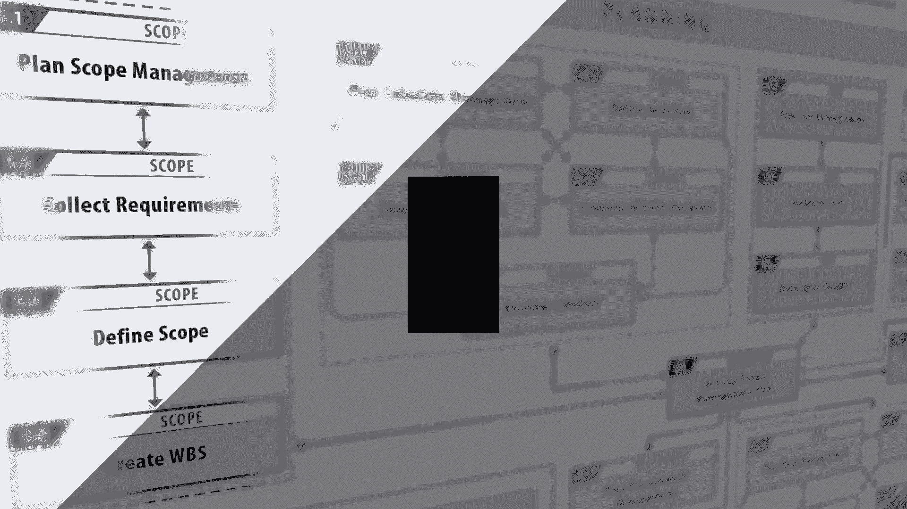
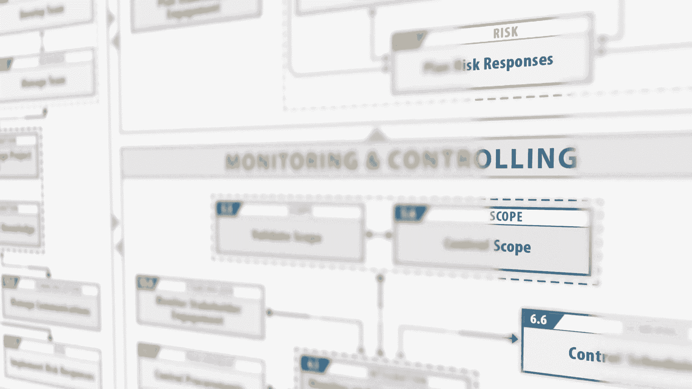
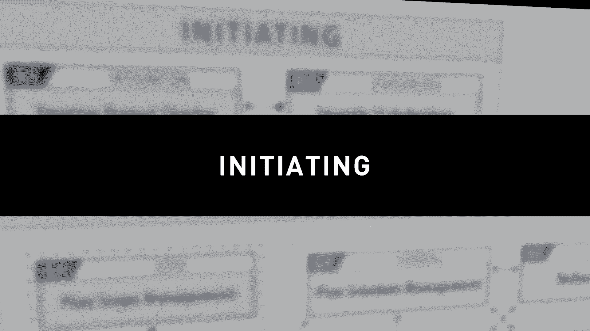
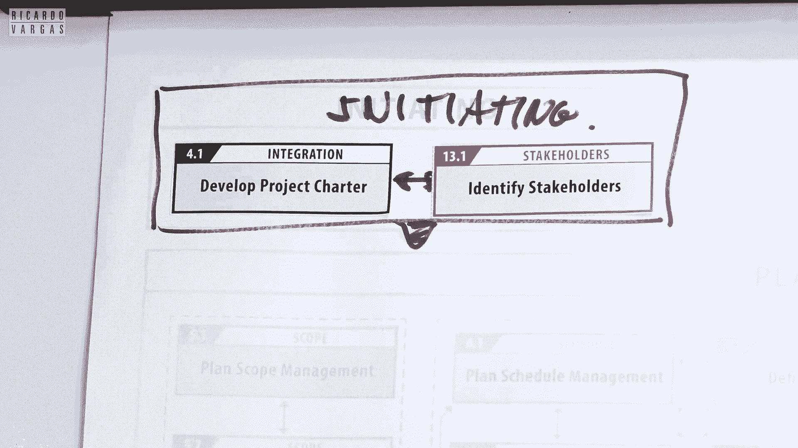
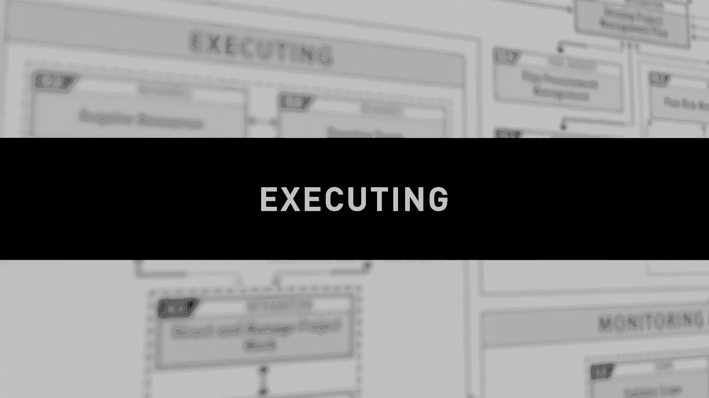
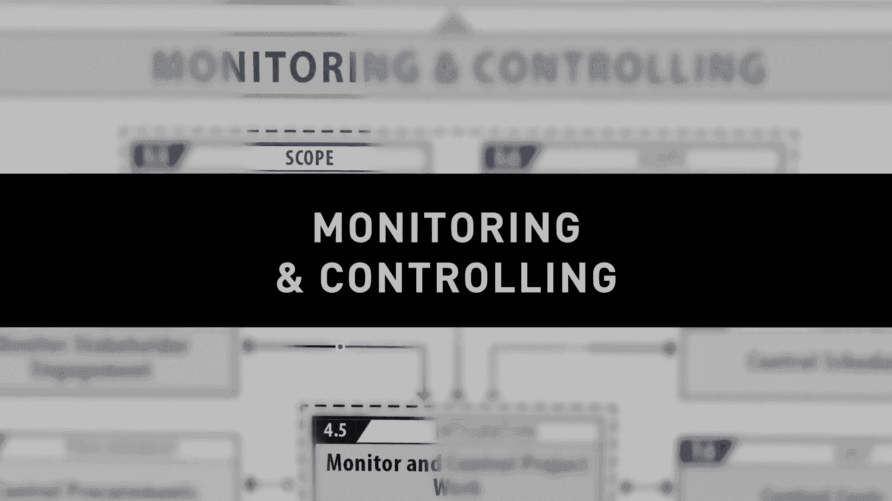
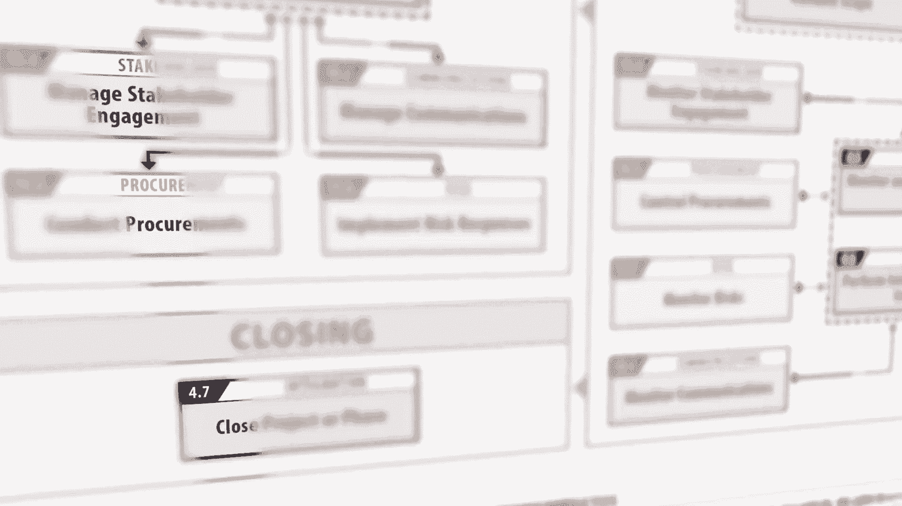
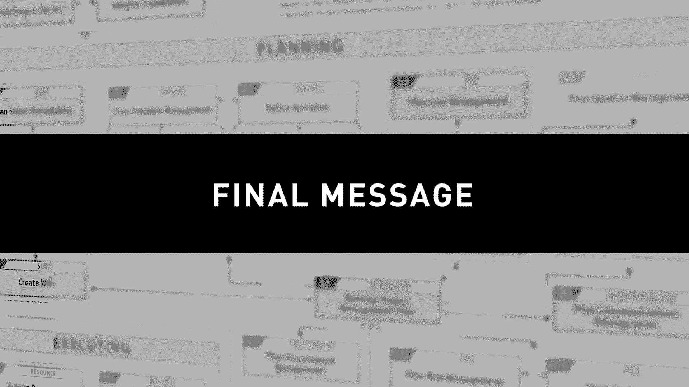

# PMP考证｜PMBOK® 指南第6版 - ITTO的49项目管理流程教学 - P1 - 沈悦熙 - BV1qM4y1Q7ny

[音乐]。

今天我想和你谈谈。

第 6 版的 PM 盒子，如果你还记得四，年前我，为 PM 盒子第 5 版做了非常非常相似的事情所以，我今天要做的是我，将从第一个过程开始 你，应该在你的项目中做到最后，为什么。

我这样做我这样做的一个关键，原因是，如果你，看 PMO 指南非常厚，有，6700 页，你的第一反应是哇，这是一个 很多东西要学它是一个，非常强大的身体，它，不是很容易理解 peermark。

指南它主要是一个参考指南所以，我在这里要做的是阅读，PMBOK 指南，但以不同的方式，这基本上是第二部分 该，指南因为在下午的第六版， 巴赫第一部分有 12 13 章，前三章，是一般概念，什么是项目。

什么是项目管理，第二，章更多的是关于组织结构，结构如何变化取决于，你给项目多少影响力，第三章 这是一篇，关于项目经理的新文章，主要是关于 PMI 人才三角，在第。

4 章到第 13 章之间更多地讨论了项目经理的能力，我们讨论了十个，知识领域，然后在第二部分，是标准 ansi，项目管理标准，这曾经是，以前版本的第三章，这是我现在正在谈论的第二部分的核心，因为大多数。

时候当你阅读例如范围时，你会阅读范围的，所有过程，但它是 不是，你做项目的方式，因为你做项目的方式不同，你做项目，的方式更加相互关联，这就是我，今天要教给你的 要做到这一点。

您需要做的第一件事就是这张纸，这样您就可以在下面的链接，上下载它，这样您就可以下载它，您，可以下载流程，然后在这里放，一些蓝色或胶带，将其用作，参考，所以我今天会做这个来。

向你展示一个项目是如何构建的所以看，这里我们有一个浅灰色的只是为了，帮助我向你展示一个结果来指导，你完成这个过程所以，我们首先需要了解的是，每个项目都从我们，所说的启动过程开始，所以启动。

过程基本上当你开始一个，项目时，无论，你说的是哪种项目，你都是通过，制定项目章程开始的，项目，章程向你解释的最佳方式，是 出生证明为什么我这么说，是因为它是，承认项目存在的东西所以在这里。

你给自己一个名字项目经理，一些基本条件它是一个一页或两，页的文件只是为了强调什么，是意图和 d 为什么这个项目，与你做一个，利益相关者过程的同时存在，这个过程是为了识别，利益相关者所以让我解释一下。

利益相关者是什么，利益相关者是，对你的项目有任何兴趣的任何人或实体，可能是积极的，也可能是，消极的，所以 供应商客户，在您组织的另一个领域，他们都是，利益相关者，如果您看到这里 4。1 分钟，我们正在。

谈论下午的第四章，那么看起来很重要。犹豫第一个过程第四章是，整合，这是第十三，点，第 13 点是利益相关者管理，所以我们几乎一起做这件事一个非常。

重要的一点是，很多人，不理解这个，双向的箭头，为什么这是因为你不，先做这个，然后再做这个，你们，几乎一起做这个，这个箭头，可以让你返回，因为当你，确定了一些利益，或者你可能需要。

重新访问你的项目 chartres，反之亦然，所以这样做就是你，在开始时建立的 一个非常重要的，观点，如果你阅读下午。 从第 1 页，回到你阅读的结尾，然后你。

阅读 5 6 7 8 9 10 11 12 和 denry 13 所以，我告诉你阅读 4。1 然后转到第，13 点并看一看，因为事情就是这样 发生在，现实中，所以当你启动时，你会获利绘制这个非常。

轻薄的文件，只，说明你的项目将做什么，然后，列出谁是我的利益相关者这，就是启动后的项目，[音乐]。

的启动 我们，需要做计划的开始，这正是，为了试图了解我们计划，如何进行我们的项目，所以我们将基本上，了解我们需要到位的这些部分，以确保，这里的这个想法将满足人们的兴趣，这些利益相关者并将提供。

您想要的东西请记住，我们不是在生活和，创建项目时尊重流程，流程必须反映，我们所做工作的现实，并且基本上要做到这一点我们，从这里开始通过整合我们，需要做什么她 e 我们需要，通过集成开始规划。

集成是集成的第二个过程，称为制定，项目管理计划，所以让我，向您解释一下集成集成，只是，连接订单九个领域的粘合剂，集成存在 为了避免范围，压倒风险，风险压倒成本，所以，整合是为了确保，一切都平衡，产生。

项目的利益和，你想要的结果，所以制定项目，计划然后你需要做很多事情，并在 不同的领域，你需要开始工作的第一个，是范围领域，你需要计划，如何管理你的，项目范围 你会在这里看到很多次。

计划范围管理 计划进度，管理 每次你看到这个，词 计划和管理我们正在，谈论游戏规则，那么什么是，计划范围管理，您需要在此处定义您计划，如何管理范围 o 如果你的项目，让我们假设有人想在。

你的项目中添加工作你会接受它，不接受它它必须批准它什么，是批准级别所以这是，我喜欢使用类比的路线想象一场，足球比赛一场足球比赛 你有，一些规则，例如有 11，名球员，目标只有当球，完全越过线时。

所以你有一些，规则，因为，当你在项目写作中很敏锐时，你无法定义规则，需要就规则达成一致，这 是规则，这可能是一组项目，符号，可能是一个小文件，也，可能是您的项目办公室，将创建的东西，但它。

描述了您计划如何，管理范围的规则，然后，您需要做的第二件事是 收集，需求 所以现在我需要了解，我需要做的工作 然后我，需要先收集需求，什么是需求 需求是，我需要做的事情来交付，我想要，的东西 例如。

需求可以是，功能需求，例如我，想要的，例如我车上的电动门，这是功能需求，技术需求是什么，它的尺寸和特性是什么，以支持自动打开车门，然后你 有引擎，活动的范围和要求，安装引擎，测试引擎 所以这是你。

收集的地方，大多数时候你，通过与，一些利益相关者交谈并试图，了解你将如何构建方式来收集这些需求，在收集了这些需求之后，你现在的位置和你想要的位置之间，你必须塑造，你的项目范围，基本上你需要结合这些。

需求功能技术和，活动以及部分工作，你定义范围基本上你，制作一个文件 我不喜欢，文件这个词，因为它看起来像，官僚主义，但你产生的东西，反映了 ts 你的项目的范围，我们称之为范围说明书，所以。

范围说明书将定义好，你想如何处理你的项目，之后你将创建工作，分解结构或 WBS 记住，WPS 是它看起来像一个旧图表，拆分项目，将项目分解成更小、，更易于管理的工作块，在你知道你想做什么之后。

这将是你项目计划的一部分，你需要，了解你计划了多少时间，然后你进行计划的进度，管理，你将按照，时间表工作 请记住为什么要花一些时间，解释范围因为 这，与计划范围管理完全相同，但在这里我关心的是。

日程安排，例如如果，某些测试延迟我会怎么做我打算，如何计算持续时间我会做，类比 w 这种工具和计划，在设置活动持续时间时使用我需要多精确，所以，这些基本上是游戏规则，当游戏在某一点上谈论日程安排时。

您可能会注意到，那些来自 来自下午，第五版通常可以称为，时间，现在称为进度表，因为我们正在，谈论这个时间以及时间，在您的项目中如何流动之后您将，在这里定义非常非常重要的活动在这里您创建一个 WBS。

您正在定义活动 你，需要完成才能，在你的 WBS 上交付这个词包所以让我给你举，个例子，是，你创造你的序列和，持续时间的根源所以你需要有这种，毛细管作用你需要了解，哪种活动然后了解好。

多少时间和我需要先做什么，然后看看一件事你在，看我 做了很多箭头为什么，我要花时间做所有这些，箭头组这是因为我想，弄清楚最大的，错误即使人们谈论 k 并，使用瀑布的概念，你知道，当你使用瀑布时，当。

水流下时，水不会再，回来，所以从技术上讲，这不能被，视为有水，因为我说我们，一直在回去重新审视，因为，也许你 在这里停留了一段时间，你看哦，天哪，我忘记了另一项，活动，然后你需要，在大部分时间回来。

你可能会回到，这里，这是一个流动的过程，它是，流动的，如果它是僵硬的，它就不是僵硬的，这是，错误的，报酬 注意，如果准备好了，那就，错了，所以这只是一个心理模型，可以，帮助您了解应，该如何做。

在完成所有这些，操作之后，您将发展自己的丑闻，很多人问我好吧，什么是，丑闻 甘特图是，网络图是是还有更多的，时间表是任何一种显示，你的项目将如何随着时间的推移放置它，当然最常见的因为，工具是甘特图网络。

图但你需要开发 你的，日程安排，所以这里的日程安排会让，你知道你需要多少时间，来执行所有的事情来执行和，交付这个代码，所以这是第二，组，你看到了吗，我要带来这个，我要再次带来这个。

范围规模之后的项目计划 我有，成本方面，因为现在我有，活动 我知道范围 现在我可以，开始考虑我的，项目成本和我做的第一件事，我，会重复很多次 我需要，计划 成本，管理 你看到事情是如何开始重复的吗？

一种材料或一种资源的成本，超出预算，谁有权批准，我做什么，这些是游戏规则，当游戏谈论成本时，然后如果我知道活动我将估算成本，和我  清楚地，了解我的范围 我可以估算成本，然后在估算成本后知道。

我有我的时间表 我可以做我可以做的事，制定我的预算 我可以了解我的，S 曲线 我可以了解我打算，如何花钱和 这三个任务，是与范围相关的计划过程的一部分，之后我需要再次计划，质量管理，记住当计划和。

管理这个词结合在一起时我们只，在这里改变什么知识领域所以，我在这里想要什么你可以回答 和我一起，我，想知道哪些质量，令人惊讶我需要遵守该，项目在这种情况下对我来说什么是质量，我希望在质量方面交付什么。

这也，将与我之后的项目计划一起，我需要开始记住看，八七六这些是章节所以，对于那些，不习惯 PM 书的人来说这很常见，当我们说第 6 章时我们说第 6 章是很常见的我们。

在谈论 sche  dule 所以这就是，为什么我们从 4 开始，为什么不从 3、2，或 1 开始，因为第一章、第二章和第三章，有定义，这就是为什么我们从第四开始，所以，现在我需要向你介绍一个新的。

知识领域，但是 一个旧的新知识，领域，它以前被称为人力，资源，但现在它只是资源，为什么因为现在我在，这个领域合并了材料设备和人力，资源，所以现在这个知识领域被，称为资源，第一个是，计划资源管理。

所以每一个，它的计划管理游戏规则之一是，我如何计划，以一种非常简单的方式管理我的资源，那么我如何计划，招聘我是否能够招聘人员或，我是否需要使用内部资源我是否，能够购买东西或 我需要，使用采购区域吗。

所以，这些都在这里这些是规则记住，大部分时间如果你有任何，支持你的项目的区域，比如项目，管理办公室或 PMO，大部分，已经完成了你有 制定了一些规则和，政策，这些规则和政策规定了。

作为项目管理人员您可以做的事情以及您不能做的事情，之后，您需要，估算活动资源哎呀让我们，理解这一点让我们理解这一点，因为我们，在过去的活动资源中有一些新的东西或者 估计，资源曾经是。

现在这个新资源区域的时间，它正在，转移到资源，但我希望你，注意这个项目 9。2 好的，这个项目六四六点四他们，是兄弟他们是双胞胎更好他们，是他们 他们不能没有，另一个，为什么因为我需要知道。

我有哪些资源 2 倍，我会花多少时间让我给你一个非常，简单的例子让我们拿这堵墙来说，让我说一个工人可以建造，这堵墙在 10 天内可以合理地，说，两个工人可以在，五天内完成，所以这正是我在这里所说的。

因为，当我说四个时，大多数任务我没有说全部都是第四个驱动，驱动 我是说如果你添加，更多的资源，你可以将时间减少到，一定程度，所以这就是为什么它，曾经在一起，现在它在两个不同的，领域，这是否意味着你。

需要单独做，不，从来没有，想过，所以 这个过程是，与资源相关的过程记住一件事，成本与资源，和时间密切相关所以你看到事情，是如何在一起的所以如果你正在阅读，PM 书你应该尝试遵循，类似的东西你不应该阅读。

9。3 在 9。2 之后，我建议你阅读，Y 10。1 中的 10。1，因为这是你，在计划阶段应该做的，然后你，进行沟通管理，就像我，在这里所说的那样，范围规则，计划成本，质量资源，这里是沟通。

这就像这个，计划不同 沟通管理，这里的关键之一是你将制定你的，沟通计划，所以基本上你，知道你想沟通什么你想和谁，沟通你想和什么地方沟通，你想交流 你想什么时候交流 你想，交流多少 这一次交流你想如何。

交流 所以这些基本信息 所以，如果你有一个会议 如果你正在，计划一个例外会议 如果你，只有在，事情发生时才开会 错误超出，界限所以你可以把它放在这里，因为这会规范你的，沟通所以这是非常非常。

重要的我稍后会谈到这个，当我在，这里谈论利益相关者时所以在这样，做之后就会谈到另一个非常重要的问题 大，知识领域几乎与，范围和进度一样大它是风险管理，为什么因为风险是项目的固有部分。

所以你需要做的第一件事，就是计划你想要如何进行，风险管理，让我在这里基本上解释，你想给你的唯一答案，是超级相关的是你的，容忍度为什么让我们假设我邀请，你跳银行也许对我来说这。

非常 有风险也许对你来说它不是，那么宽容，它正是定义什么，对你的组织中的团队，有风险以及什么对你的组织中的团队没有风险，因为如果你不，知道你的容忍度是多少也许一切，都可能是风险或，在知道你或你的风险。

承受能力之后，没有什么是风险然后你来到这里并，开始识别你的风险所以，与你的利益相关者你的团队一起你，开始识别好吧，我在这个项目中有哪种风险，哪种陷阱 和我，需要管理的机会让我们假设你。

在这里确定让我猜猜，你的项目中可能发生的 300 件积极，和消极的事情之后你需要做，什么你不能说哦我会，回答大部分时间，它是 根本不可能，所以你做了什么，你做了两件事你做了定性，风险分析和定量风险。

分析所以你都做了这两个项目之间的区别是什么，我使用的定性 比例低中，高绿色黄色红色，所以我使用某种标准，某种比例。

当我使用数学计算，概率和影响时什么是定量风险分析例如，假设我有一个六面骰子并且 我，想，知道掷骰子的机会是多少，它是 1/6，所以这是计算出来的，这是，定量的，很多次，定量，很好，但很多次，定量。

更难获得，所以这正是为了，理解所识别的每个风险，他们很大 他们是非常大的风险还是，不相关的风险 这将帮助，我做这将帮助我计划，对死亡风险的潜在反应 所以，我需要在这里做什么 我需要计划 我。

需要确定 我可以做什么，保护我的项目免受这种风险然后，也许我会说我会购买保险，或者我会说我会改变，我的范围的某些部分也许我会投入更多的，财务储备所以这取决于，你计划这个和这五个过程 esses。

他们再次合作 看箭头，他们前进和后退 为什么因为，也许你正在做定量，分析，突然你发现了，另一个风险，你不能说所有的，风险都已经完成了 我不能回去，如果你这样做是不好的 它 将是错误的。

完全错误然后你回到这里，也许你不回去只回到这里你，看看计划以了解，你的反应的综合影响以，了解好吧我需要投入更多，钱所以记住这一切都是流动的，看起来所有的过程只是为了，支持你理解你需要，做什么。

所以现在在，采购计划上，所以你需要，基本上理解你需要，做什么，以及你需要做，什么我需要做什么 购买我需要，做的东西，所以制造或购买的决定，就在这里，所以，我将如何处理我的采购。

将喜欢在内部做或不做所有事情，除非但绝对不是最不重要的，是尝试和利益相关者参与 t，这是什么，请记住在这里识别利益相关者，所以现在我也需要了解，我的利益相关者，例如影响力，和权力，我需要将他们分组并。

了解我将在这里做什么现在我，想给你另一个建议，记住 我在这里说的是持续时间和资源之间的双胞胎，我想向您介绍，另一组双胞胎计划沟通，记得我介绍并计划，利益相关者参与为什么我告诉，这两个也是双胞胎因为。

大部分沟通将恰好是为了，加强利益相关者的参与所以 我，需要一起做这件事，例如，让我们假设你这里有一个，利益相关者，你需要，某种特殊的沟通，然后你来到，这里，你创造了这种，沟通，这就是为什么他们是双胞胎。

他们，一起工作，所以这就是计划，过程，最后一切都，整合在这个项目管理，计划中好吧，这会让你，知道你打算如何做到这一点 项目，这个我正在研究什么，这里是如何，所以这是我对这个，项目的方法，稍后我们将讨论。

我们如何执行、监控和，控制我们的项目，[音乐]。

在我们的计划准备好之后我们将，开始这个 accusin 和监视，和控制过程，所以我现在，当然要解释第一个基本的 ution，但我现在想强调，执行和监视，以及为什么我，想同时强调这个过程。

因为它们一起工作，你不 执行所有操作以检查是否，一切正常所以，这是一个非常流畅的过程所以你，执行一个新的检查一切都很好，然后你可以重新种植看起来，你制作的这个箭头真的很可爱所以这是一个。

非常非常流畅的过程当然，计划，的中心是整合启动，的中心是整合这个，等式的中心恰好是一次，整合所以第三个整合，过程第二个是计划 转向，直接和管理项目工作，这里重要的不是说。

在项目中是敏锐的为什么因为所有这些流程，都是你将如何管理项目而，现在你作为项目经理或，团队成员你通常不是，资源是敏锐的 大部分时间都在工作中，所以您需要做什么，您可以，指导并管理正在完成的工作。

这些工作是，由您为活动定义的资源完成的，所以这，正是这个想法，现在有一个，新事物 下午 Bach，引渡是一个新的集成，过程，称为，以非常简单的方式管理项目知识，你可以将其，理解为经验教训，所以。

你需要什么来注册，你从项目工作中学到的东西，什么是有效的，什么是无效的，什么是有效的。做得不好，你，注册了这个，因为这个知识，非常重要，它非常有价值，所以你，需要学习这个课程，所以。

这个要处理的是这个等式的两个核心，过程，但是这个要，处理的过程得到所有这个订单，过程的支持让我们 看到他们第一个是，管理质量记住一件事在这里，计划质量你在这里设置，你的质量你正在。

管理我从这里得到的结果，在质量方面是合理的，现在与你，将获得的资源相关 此处的资源是，您将雇用新团队成员的地方，购买，材料，购买东西，这个过程，是这个场合的中心过程，连同这个是 因为。

工作将由这些资源来完成，这很重要，为什么我们在，这里而不是在计划，中这样做，因为我总是尽可能晚地做这件事，因为这是钱，所以，资源我总是等到最后，当然，这不是，数学，这是项目管理，所以有时，您获得。

资源的时间和资源，可供您使用的时间之间会有延迟，因此您需要，多次预测任何开始的，采购流程和一些收购，当然，出于显而易见的原因，在这里进行流程，然后，当然，对于，您获得的人力资源，您将开发，一个团队。

同时管理这个，团队另一个问题，您可能会问我，开发，和管理开发团队之间的区别是，什么，剩下的就是 你，带到项目中的人力资源作为一个团队一起工作，其中 1+1 不仅仅是管理一个团队，它更侧重于运营。

方面什么是歌剧，有人需要请假的人，生病不能来所以你管理，团队的日常工作所以这是一个非常，非常重要的过程在这个过程中，会发生在这个场合，他们将成为，中央的支柱 产品流程，然后我需要做的 我需要管理。

我的沟通 这，是你的计划的执行 所以记住你建立了一个，基于你想要参与的利益相关者的计划，这里是，你召开会议的时间 所以当你 说，状态报告在哪里开会 它就，在这里 在管理，通信中支持你的。

执行 然后之后你需要，实施风险应对 哇这是新的，- 这是新的因为我在，这里学习风险应对 我正在 实施，让我们在这里假设我计划在这里购买，保险我购买危险品我，计划在范围内更改某些内容。

这是我更改内容的地方所以，这是与 th 相关的操作 计划，和一件事连同项目，知识让我在这里做个标记这，是下午的两个新流程。böck guide six edition after I。

will conduct procurement by things，remember here you made a decision of。

making buy if it's buy you need to come，here and buy it so you conduct all the。

procurement processes based on，it is what is it is exactly on your how 你做了采购的决定 计划你的，采购 我。

在这里说过关于双胞胎的一件重要事情 请记住这里的，活动持续时间和资源，双胞胎之间的利益相关者管理和，沟通计划 现在我有，第三对双胞胎进行采购和，获取资源 为什么因为，大多数时候你获取资源的方式。

将需要一个采购流程，因此以两种不同的方式呈现，但实际上它们都是同一，件事，因为您需要购买一种材料，然后您需要进行采购，以购买该材料，因此这个 r2，流程最后连接得非常好 但重要的是，在 SIQ 中。

您负责，管理利益相关者的参与，所以，让我们了解确定我的，利益相关者 在这里我计划我了解，他们的力量他们影响他们的，利益然后我制定了一个，沟通计划来管理我，与他们的沟通在这里我正在，管理这是我让这些。

利益相关者参与工作的过程或者我是否需要，改变让我们假设我有一个小组，这对我的项目非常不利这，是我与他们合作的方法，或者我是否应该改变我应该改变我的，方法也许我发送好的写一份，书面报告也许我应该打电话我。

不知道但是在这里你需要 看看，利益相关者的参与发生了，什么，这里有什么变化吗，例如有人正在失去权力，所以你在这里管理你的利益相关者，这些是 Disick yueshen 流程，然后我们转向监控和。

控制流程，它将，与你一起工作 在。

监视和控制上显示 我，在这里并行做事 我在这里做，工作并确保，我在这里做的工作没问题 记住我，开始 w  ith 集成 集成和，集成 我将在这里开始，什么 集成以及我要做什么，我将监视和控制工作 所以。

在这里我正在管理并直接，分配任务 与资源一起运行，到这里的结果 我，说的是它 一切都好 这是，我在计划，表上计划的时间 它是否有效，第二我需要执行集成，控制更改 这是一个非常非常。

非常非常重要的过程 为什么，这个过程如此重要 因为，您的项目将面临变化，百分百确定，你估计这里，发生的事情不可能完美发生，因为这个词有，太多的变化，这是，不可能的，所以你需要什么，你，需要管理这些变化。

你需要，理解，第二个词是 这是，非常重要的，这是，集成的，集成意味着我，不仅在工作范围时间成本质量我，正在处理所有事情，如果有，变化 h 现在我可以以这样的方式进行更改，这对，项目来说很好。

例如对范围来说不是很好，但对整个项目来说很好，然后我需要做的是我需要做，一系列的工作第一项工作 我，需要做的基本上基本上我需要，验证范围然后控制，范围所以我需要验证和人们，这里有什么区别，它只是检查我。

检查这里的范围在范围，声明中定义它是否已交付以及是否有什么，是不同的 我需要控制范围，请记住所有这些以 control 开头的词，都是 disintegrated 的子集，所以在这里我关心。

项目范围的变化，例如我，正在盖房子，当我看到我，没有盖房子时 房子了，我正在建一家餐厅哎呀，这里发生了什么第二个当然，很明显让我离开这里让，这个小组在范围内并将其，附加到集成然后第二，个是控制丑闻。

有什么问题吗 我迟到了 是否有，任何准时问题 记住我有一个，时间表 但也许事情并不，完美 所以我不记得，这里 重点是准时 范围控制，范围控制分散 这将是，添加到这个集成的变更控制中。

然后我需要控制成本所以，看看你看到了吗你看到一件事，在不同的领域有很多重复，所以当你阅读时你，需要理解因为如果你，理解了一个你就理解了哦因为，它们只是不同的主题，所以在这里，让我们假设让我们举个例子。

让我们假设你估计，成本看起来有，七点基于资源，然后你做了 12 点到，采购流程来雇用或购买，这个资源然后资源，比你预期的要贵得多，然后你开始超出，预算然后你需要控制这个，成本所以这正是事情。

在这里运作的方式它是一个非常非常流畅的，过程 那么你需要控制质量，所有与质量变化相关的，任务都在这里 大部分的全面质量，管理任务都在这里，大多数统计过程都在这里 所以你，需要正确地控制质量。

因为当你在这里管理，质量时 他们 与，您对质量，管理计划的期望不同，所以看起来它非常，流畅然后您需要，为那些拥有 PMBOK 第五版的人控制资源操作，这是一个新流程好的，新流程以及实施风险。

响应和管理项目知识所以，文化资源我的意思，是什么我需要添加更多我们，需要减少的资源，是我想要的资源执行水平，之后我需要监控沟通，记住让我们去沟通，了解沟通过程，看这里我有 计划 10。1。

基于特定的利益相关者，参与 13。2 然后在我管理的过程中，我发布报告，会议 无论电话如何，然后我管理这个利益相关者，但也许，我需要改变然后我监控因为，这我可能会更新我的计划或者我可能。

会更新我的管理方式所以这，正是我在这里看到的然后，并行这一切发生，同时以一种非常流畅的，方式监控风险，为什么因为有些，风险我认为哦他们不存在，例如在这里我对十一点三进行了定性风险，分析说它。

很低但是发生了一些事情并且风险，变得非常非常高让 我给你举一个，非常简单的例子让我们假设，我正在进口一些产品并且让我们，假设这些产品将在，接近年底到达，并且让我们假设我的国家的海关，决定说我将关闭我的。

业务 12 月，15 日和 1 月 15 日，这将，大大增加您，延迟交付产品的可能性，因此您需要进行监控，因为他们改变一切的风险，看起来就像电视上发生的事情一样。在电视上的一天，当我们谈论监控风险时。

事情发生了变化，然后，我们需要控制我的采购这，是什么这是我付款的地方我，收到货物我接受服务所以所有，的过程都是基于，我所做的采购 这次所以，这是一起工作，当然，非常密切地监控沟通，非常密切地监控沟通。

项目十点三我需要监控，利益相关者的参与，为什么因为利益相关者可能会改变所以，我正在管理和改变并，再次查看这个以处理他们，几乎在同一时间以非常，综合的方式发生 请记住我可能，会回来 所以。

当我教这个的时候我非常担心的一件事是，人们认为这，是你知道的写在石头上的错误想法 当，你这样做时，你永远不会再回头，看一遍这是错误的，这就是为什么，我要告诉你，尽管有几种常见的这是，非常。

孩子 2 这是绝对的 它是如此敏捷，以至于 PM 上的 TMI bak 将它与，敏捷实践一起发布，以，展示敏捷组件如何在这里使用它，可以在这里使用它但是当然，如果你认为你写了一个。

需求然后它就结束了或者，这只是写在纸上，然后，你就有麻烦了，但要明白一件事，这些非常，流畅，不需要，非常正式，但这更像是一个心理，过程，例如，我只是在和你说话，并展示这个和 这。

在我看来是非常合乎逻辑的，所以我启动了一个，计划作为一个队列来监控，然后我，进入关闭过程所以在这样做之后。

让我们假设我的项目已经，结束我交付所以利益相关者，客户收到了产品所以现在，怎么办 我需要做 我需要进入，收尾流程 收尾，流程是一个集成，流程的基础，即已关闭的项目或阶段，Y 项目或阶段，因为我可以将。

其用于项目或仅用于项目的，一部分 管道 我可以，像滚动波浪一样对每一件作品都这样做，在这里我将包括我，需要做的所有工作 我需要庆祝 我，需要分发文件 这是，非常非常重要的是。

过去它 过去在这里有另一个过程，称为关闭采购，这个，过程消失了，并在，这里合并，所以关闭只是这个，阶段的关闭项目，以简化和，统一，在这里你基本上关闭了，所有东西，所以如果你看到，旧的 47。

47 盒子现在变成了 49 y 49 47 加上，三个新的 50 减去这个，49 所以这是完整的 PM BOC，指南 现在我想建议你 所以。

你如何以一种非常简单，和直接的方式学习它 我想邀请你，请到我的网站，下载这个链接，在下方 BOC，指南在你手中你可以说计划，采购管理我的意思，是不确定你可以去多读，一点你会理解。

逻辑和我今天向你展示的一切，它的逻辑它的敏捷它是，一个孩子它是 不幸的是，很多人误解了这一点，他们，一直把时间花在制作，它上，这就像一种意识形态，忘记，了相关的是你交付你的，项目我使用了。

敏捷的数百个方面，这取决于它的数百个方面，我正在做的项目 我正在做的项目，有时我会做所有的部分 有时我会，做的更少 但这是一个指导方针 它，正是你开始你计划你执行，控制并且你以一种非常。

简单的方式接近但是你 不需要说哦，我没有遵循 PM bak 正确，因为我没有做项目 94。4 不要，那样做 不要浪费你的时间，去想记住框架的存在是，为了支持你的项目而不是你的。

生活 存在 ts 来支持框架，想想玩得开心，测试一下，然后你可以阅读和理解 PM，Bach 以及所有这些流程，以一种非常，非常简单的方式最后一件事记住，这就是双方的，原因，这就是为什么我 不想让你。

考虑，这个瀑布，因为落下的水不会回到，这里，正如我告诉你的，ANSI，告诉你的，P，一切都可以回来，大多数，时候一切都会回到 修复它，因为，你的项目不存在完美的条件，考虑一下。

