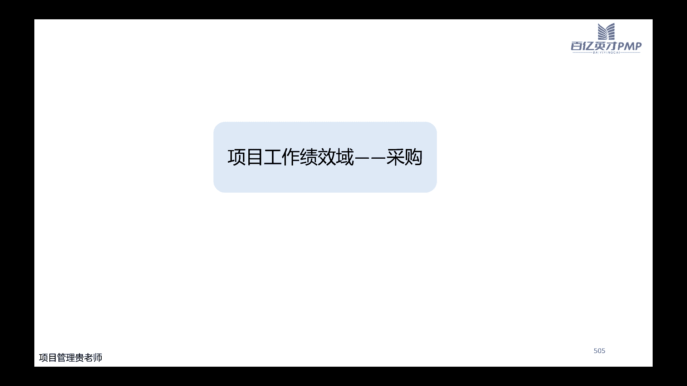

# PMP考试培训课程最新完整版项目管理认证第七版教材新版考纲自学教程 - P10：10.工作绩效域(二) - PMP专家 - BV1rM4y1Y79x

诶我刚刚我刚刚掉了一下，我也不知道为什么掉了，我这网络显示还是挺稳定的，嗯听到声音ok吧，ok，好的，啊刚刚那我再讲一下这一页吧，就是使团队保持专注哈，是团队保持专注的，这个话呢好像说起来很容易。

但是做起来有点困难，为什么呢，因为我们一般情况下，就是进入到啊团队的工作任务之后，很少去关注团队成员，他的状态啊，我们前面讲原则都讲过，要给我们的项目团队给他以关心啊，给他以帮助，对不对。

那这个时候我们啊比如说在做的过程当中啊，你因为一个近期因为一个项目的延期，已经让咱们的团队连续加了两个周末的包啊，结果到第三个星期的时候呢，突然有一个团队成员，他可能做的不是特别好啊。

你自己也加了很长时间，把你很你也很累啊，你你就没忍住啊，对他态度不是特别好，批评了他，然后这个时候你就发现这个团队成员很难过，很伤心，很愤怒啊，那为什么呢，因为你你判断的是这个团队成员。

他平时脾气还是挺好的啊，那为什么出现这样的一个错误，出现了一个不该出现的错误，同时呢你今天去批评他的时候，他还是这种反感的态度，其实是因为我们忽略了，他已经连续两个周末去加班了啊。

他的这个身体可能有一些这个承受不住，然后你可能还会想，那别人都是这样的，为什么就他承受不住呢，然后你你在意啊，去找找原因，发现哦，原来是他家里面家人生病了啊，母亲生病了。

这两周刚好在医院里面需要有人陪啊，所以当他遇到家庭的这种压力比较大，然后工作压力也比较大的时候，所以他啊有一种发泄，所以呢你批评他之后，他很不满，很愤怒，不仅不单单哈。

不单单是因为咱们这个工作上面的问题，是因为他整个人的状态而爆发出来的一种情绪，所以呢我们在工作，尤其是如果说你想把这个团队管好啊，我们说的管好呢，更更更准确的说，应该说咱们为了把这个团队带好。

那么光让人家干活是不太行的，尤其啊又讲到我们现在这些，这个九零后和零零后的这些小朋友啊，零零后的这些小朋友们，你想让他一心一意的什么也不想给你干活，那是行不通的啊，人家得愿意给你干活，看你很爽。

看你很痛快，人家才愿意把活也干得很痛快，所以呢啊去怎么样去平衡他们的工作量，或者评估啊，团队成员本身是否对这个工作满意，是我们要做的一个重点工作，不光光是我们要评估他的工作，也要评估一下，站在他的角度。

评估一下他对这个工作是不是满意，又卡了吗，又卡了吗，没有啊，哦那没没卡，我没卡，我继续吧，我看到好的，那我接着讲哈，所以呢这个前面讲过了哈，我们还要评估一下这个团队成员啊。

反过来对我们的工作是否是满意的，同时呢他对我们的这种任务安排，以及呢对咱们实施这个项目管理的啊，这样的一个方法是不是满意，没有全屏，稍等我看一下，然后沟通和参与呢啊，是因为我们大部分的工作他都要。

大部分工作他都要沟通和参与哈，特别是与项目团队成员和其他干涉人，始终要参与相关的这些工作啊，这里面有几个关键的点啊，关键那里呢都是我们在沟通的时候啊，要去啊掌握的一些点，首先沟通的这个胜任力啊。

它主要体现在我们的沟通的技能啊，沟通技能上面，沟通的技能和适当的去检查呢，有助于明确关键信息他的一个目的，然后呢建立有效的关系，实施实现信息的一些共享，然后呢，你才能更好地采取咱们的这种领导的行为。

这个是沟通胜任你哈，这里呢可以因为之前有小伙伴推荐这个，就是问嘛问有没有什么提高沟通的，这个这个啊书啊，嗯我只能说呢就是确实是有一些书，它是有一些用的，大家可如果说感兴趣的，也可以自己去看一看这个啊。

有一本叫沟通圣经，沟通圣经可以去看看，然后那个嗯还有拖布花，应该也有一些这个系列的跟沟通相关的啊，然后网上还有一些比较网红的，比如说这个什么什么高情商回复呀啊，啊这些相关的书如果大家有空的话。

可以自己去买来去看一看，然后呢，你像这种这个比较比较，这个在表面上做功夫的这些话语，我觉得平时用一用也没有什么坏处哈，如果说能够掌握，能够背一背啊，并且呢这个在沟通的时候能够反应比较快。

还是比较有帮助的，然后反馈啊，关于沟通的可交付成果，和这个情况的反映信息啊，互动沟通，这个也是我们在沟通的时候，要尽可能去引导团队成员去做的啊，我们用良好的沟通力，也要也要让。

也要让这个团队成员能够拥有较好的沟通能力，沟通能力不一定就是说哎我们沟通技巧好不好，沟通的这个这个这个经验丰不丰富，沟通的这个胜任力强不强，而是你在沟通的这个动作有没有做到位，有没有及时的反馈啊。

我前面不是讲过执行鸿沟和评估鸿沟嘛，你的反馈不到位，那么啊评估的鸿沟也就这个会比较大，还有一些呢是非口头的技能啊，就是虽然说这个人呢说话他可能啊这个语句啊，好像这个一般这个组织能力一般。

但是呢他这个人唉很会活跃气氛，这个就是团队的开心果啊，那其实也是他的一种能力之一啊，所以咱们作为项目经理呢，除了前面的这些沟通生日礼之外，也要适当的去训练一下自己的语调，和一些面部表情，那比如说在啊。

比如说在讲课的时候啊，像这个呃有一些比较好的一些这个老师，那它确实啊整个这个语调啊，啊特别的这个有激情，大家一听呢听了也不打瞌睡啊，就觉得很有意思啊，面部表情呢也都非常的这个到位啊。

像我们的一些新闻主播啊，人家面部表情都是经过专业训练的啊，这种也是我们在沟通当中，可以去刻意训练的一些东西，然后也是啊，那比如说咱们在讲课的时候，肯定有这样的一个课件的演示，效果要来的好啊。

那有一些情况呢没有办法演示，那怎么办啊，所以说如果能够争取到演示，是能够从某一种角度上面，能够辅助我们更好的去传达信息，更好的帮助我们倾听的对象去理解信息的啊，这些句子的技能呢嗯良好的倾听啊。

人家说的时候你好好听啊，给予足够大的听，给予足够大的这个尊重啊，听好了，也许这场这个沟通也就到位了，对方也就满意了，还要这个省事啊，时不时的观察一下这个整个沟通，整个谈判的这个局势啊。

更重要的是要关注一下对方啊，表达你自己表白手那积极的反馈啊，做好演示，或者有一些这个非语言非语言的，有一些这个眼神的交流啊，有一些这个肢体的这个配合的动作都ok，那在我们的这个呃实际的项目当中呢。

我们比如说给项目方提供这个项目的进度，报告呀，啊或者一些信息的更新啊，然后或者给我们领导去反馈一些问题的时候啊，我们把这个问题的背景把它说清楚啊，这个以帮助领导选择最合适的那个解决方案。

或者是呢唉我们提供项目或者及其目标的一些，通用的一些信息啊，然后呢就是给项目包装包装，这样的话整个项目团队的形象在老板面前，或者在我们的这个客户面前更加的高大上，或者更加的专业，还有提供一些具体信息啊。

以帮助呢团队成员，或者该系人对我们整个项目的工作和目标，更加的理解，支持力度更大啊，这个是讲我们该系人的，这个都是我们掌握沟通技能之后，要做的几个部位不同维度的一些事情，然后后面有gt的这个积极倾听啊。

这个怎么说，这些这些都是理论上面的，就是大家看一看吧，高效沟通三个原则啊，谈论行为，不谈论个性，这个跟前面的旧事不丢人是一个这个意思哈，一个一脉相承的文学沟通的目的啊，积极的这个倾听啊。

有的时候你可能比如说你要去跟啊，比如说你们的项目吧，嗯对这个社区有一些影响，那么你现在要跟这个社区的负责人，或者社区群众选出来的代表人去跟他去谈判，因为你的目的肯定是这个项目，他还是要继续做呀。

对不对啊，那现在群众在闹怎么办呢，哎你去跟他去聊的时候，你要知道你的目的是什么呢，你的目的是啊，让他们的情绪能够稳定下来啊，能够支持我们这个项目继续做，对不对啊，那这个时候呢。

你上来之后就跟他巴拉巴拉说一堆，哎我们这个项目有多好，你们这个项目虽然说前期有一点啊，有有一点噪音啊，或者说有一点呃这个不同的一些这个污染，但是呢后期建完了之后，对我们本地发展有多好啊。

这个给大家创造多少的，这个这个给这个社区创了多少的这个收益，说了一堆，然后等你发现当你还没说完的时候，人家就已经很耐不住性子了，拍着桌子都要走人了，那你无疑，你这个沟通肯定是肯定是没有达到你的。

效果的啊，所以这个时候呢哎上来先安抚一下对方的情绪，嗯如果啊你比如说你试着说，如果啊咱们站在他的这个角度，也能够理解他的这个想法啊，如果有家人在这，我们也觉得很吵啊，你觉得前期会有一些影响。

怎么怎么样啊，然后再说一下啊，这个项目如果说不做，那维持当前的状态，这个社区10年后或者5年后，会是会是一个什么样的一个这个发展趋势，然后到时候的话，这个大家这个跟隔壁社区比起来，会有哪些落后对吧。

先安抚情绪，然后再晓之以理，动之以情啊，然后到最后的时候，他有可能认可咱们哎，这个项目确确实实可能是需要干的，然后再由他回去之后，怎么样去说服这个群众啊，那你这个不就达到你的目的了吗。

然后聆听的时候出现了一些问题哈，这些被动的聆听啊，听而不闻或者有所不闻啊，这个被动的聆听，比如说经常有一些领导开大会啊，开一些例会，开一些跟咱们没有什么实际的项目，没有什么实际的用处的这个会议啊。

经常在洗脑，那咱们也是一种悲痛的聆听，对不对，注意力分散，被动的听当然会注意，你就容易注意力分散，他在上面讲，你们在下面玩手机，或者是呢哎这个有一些偏见和一些估值啊，老板说到啊。

员工这个啊今天争取给大家多发点奖金的时候，很高兴听，然后其他的时候说，员工哎，应该在工作上面有一些什么样的一些态度，秉持什么文化的时候就不愿意听了，然后基于得出结论，基于得出结论。

就是没有听明白就发表稿件，这个都是我们常常在倾听的时候可能会犯的哈，有意识犯的，或者无意识犯的这些毛病，这些毛病要不得要改行，要不得的，嗯后面的这些大家自己去看看吧，怎么样，木工接触啊，哎怎么样。

这个暂时性的点点头啊，我感觉讲这些好像好像在教小学生一样，这个大家自己去看吧，然后人际关系技能，人际关系和团队技能呢它嗯有很多种哈，这些都叫做人际关系，你积极的倾听也好，你沟通风格去评估啊。

风富管理文化意识，还有情商，这些都是人际关系和这个团队技能，我给大家列了一张表，我给大家列了一张表，然后对这些这个有一些具体的阐述哈，啊积极的倾听很简单，我们前面详细讲了倾听哈，沟通的风格评估。

沟通风格评估呢，主要是了解他不同的人所喜欢的沟通风格啊，比如说嗯嗯啊，比如说这个我们前面讲过啊，你跟一个啊这个控制欲比较强的领导，他喜欢的沟通风格啊是什么样子啊，你跟一个这个放任型的这种领导风格的人。

去汇报工作，那你又是保持什么样的频率，这肯定是不一样的，然后冲突的管理，冲突的管理呢主要是团队或者是团队之间，或者团队与外部之间发生了一些，意见的一些冲突啊，或者是这个不是意见，就个人性的冲突。

那咱们作为啊管理者吧，作为项目管理者吧，项目经理嘛怎么去协调这个，后面讲这个讲团队管理的时候，我会再具体的跟大家讲一讲这个冲突管理，他怎么这个怎么去应对啊，有几种应对的办法，还有政治意识和文化意识。

政治意识，文化意识前面也讲过哈啊这个首先政治要正确，然后呢还要理解一下这个不同的项目，尤其是一些跨国性的文化差异，是一定是不一样的，那么基于这些不同的文化差异，咱们怎么去应对啊，就包括咱们的pmp考试。

其实到后期大家做题的时候就有可能发现啊，这个很多翻译出来的这些问题啊，嗯多多少少它翻译出来的嘛，这个对译出来的中文，多多少少会有一点点的这个问题，然后嗯大家可能就会这个有一些，这个因为文化差异。

这可能是因为技术还有语言上的一些这个差异，然后导致的一些实际理解的问题，或者是呢唉老美出题，他为什么是那样的一个思路啊，即使翻译没问题，也可能有思路的这个理解，大家有网上。

就是我之前有看到的小伙伴就有吐槽的哈，一个吐槽的说，我明明看着按照我们中国人的理解，按照中国的文化和特色，他就是应该选a，但是呢按照老美的这个啊这一套思路，或者p m p出题的这个思路。

他就是应该先选b，所以这个就是一些文化的一些这个差异嗯，决策，决策就是通过谈判或者实战影响力，来制定决策啊，情商情商后面也会具体跟大家讲，情商是包括什么哈，然后引导引导的。

主要就是大家引导大家产生一致的意见啊，影响力啊，借助咱们非正式的权利，不是因为我是项目经理，我让你听我的，而是说我因为啊咱们谈判的时候哎，这个比较好或者是相处的比较好，让你愿意跟我一起来干这个项目啊。

用我们的非政治权力来影响别人，然后领导力激发别人分享知识，贡献力量啊，机密啊，就是用各种这个有形的或无形的方式，去激励团队成员，让他每天就像打了鸡血一样好好干活，谈判讲了啊，人际交往啊。

就是主动跟人打交道，团队建设就是开展一些团建的一些活动，开展团建的活动，主要就是为了提高团队的一些活力，管理实务资源呢，如果说啊咱们项目涉及的比较少啊，就几台设备，几台电脑，这没啥好管的，对不对。

就是无非是啊日常的这个使用啊，有什么需要注意的啊，或者是呢这个电脑，可能他就是公司里面有一些统一的，这种物资管理啊，要贴标签啊，要登记，这个相对好解决，那么如果说是咱们管理的这种项目，规模特别大啊。

这个啊这个以亿以亿元啊，我说的是这个e哈啊，以亿元为单位的这样的量级，那么涉及到非常多的一些食物的资源啊，最好还是要有一个啊，这个集成化的一个物流系统，这样会比较方便一些。

那么从这个角度我们说管理实务资源，管理实务资源到底是做什么事呢，啊具体是做这这么几个类型的事哈，首先减少或者消除现场的这个材料，搬运或者存储，为什么呢，如果说我们有一堆货完全堆在这个现场。

那么肯定会有这个现场的美观性啊，或者存储的有一些成本，对不对，所以我们管理实务资源，最好的管理方式当然是我用多少啊，我来多少，对不对，零存储，零存储是每个就是生产实物的，这种产品的公司都追求的一种状态。

然后第二类呢是消除材料的等待时间啊，这个跟我们前面的材料搬运和存储是一样的哈，材料在那个地方存储的越久，它等待的时间越久，那么其实你造成的这个资源浪费也是越久的哈，出门嗯，管公司的这种角度来说的话。

你先花了钱去把这个成本买了，堆在这里，那对于我们这个项目经理而言，你可能觉得你可能觉得材料反正都在这里啊，仓库你不用也是不用，他也这个钱你花了多少钱，你现在买和后来买都是这么多钱啊，啊这个有什么关系呢。

对不对，但是站在公司财务部的角度，他不这样看，你在一个月之前你花100万去买这个材料，和你在啊两个月之后你花100万去买这个材料，那占用的这个这个周期和这个现金流的成本，是完全不一样的。

所以我们要尽可能的消除他的等待时间啊，第三类呢是啊尽可能最小化的，它的报废很浪费哈，这个是在我们选材料或者在使用材料啊，以及我们在研发的过程当中啊，可能要深入到这个要涉及到比较多的一些工作。

要加入大量的工作啊，尽量的避免，尽量的避免将来做完了之后有一些报废啊，这个报废它产生的这个成本，就是我们的这个内部的失败成本嘛，对不对，他也很高好，第四类呢就是要促进安全的工作环境啊，安全的工作环境。

这也是我们在管理实务资源的时候啊，需要去保证的，因为我们说你这个食物它既然在这个地方，那比如说啊你这个弓箭，它涉及到比较一些微这个危化品吧，啊这是我们的这个材料原材料之一，那你这个危化品啊。

既然他有危化品在项目当中，那么你就要做好危化品的和人，员的这个安全管理，对不对，安全与环境是必不可少的，一定要做好啊，这个是管理实务的这个角度来看，至少要做的四方面的事情。

当然以后可能还有其他的一些类别，这几个例子我看看时间啊，正好把这几个例题给大家讲完嗯，第一题是物业管理团队通知他们，现有办公大楼已经达到容量了，什么意思啊，就是说我装不进人了，我容量已经饱和了。

但是呢现在你已经开始招新的呃人了，包括外部的供应商和这个承包商，那现在应该怎么办呢，这个是不是我们前面讲过的啊，大家在不同的地点，对不对，不同的地点也能一块儿工作呀，对不对，也能一块儿为这个团队。

为这个项目效力啊，这个是虚拟团队，所以a是b的哈，b呢是说允许团队成员在远程地点工作，c呢是说安排团队成员在不同班次，时间或者日期工作，这个呢说的都是一些具体的点哈，嗯说的都是第一。

他说的是一些具体的一些点，然后呢他是虚拟团队当中可能呈现的一种方式，但是是不是一定是在这个啊这个远程办公，远程地点和这个多个地点呢，还是略微有一点区别好，c呢是说不同班次，那是不是你外部的这些工艺差。

一定要是不同班次呢，这个不是特别好说哈，然后d呢是说提交一个变更请求，提交一份请求，重新安排项目团队的工作地啊，这个b c d的答案呢，其实有一个比较好的排除办法，因为我们说的也包括一些外部的这些人。

那么b c d呢嗯犯犯懒的这种做法，就是他都是在强调我们的团队，成员团队怎么办啊，这个时候其实我们的团队倒无所谓啊，团队本身他可能在这个物业大楼里面，已经有位子了，而是说我现在新的资源怎么办啊。

第二期呢是说这个专家提了一个建议啊，可以节省时间，这个专家有时间来支持这个项目，但是呢没有计划参与到当前的迭代当中来啊，怎么办呢，a呢是说立即让他加入进来，并在以后讨论倾向。

他没有计划参与到当前的迭代当中来，你你立即让他加入，你怎么样让他加入呢，啊这个这个就是a啊，说的太绝对啊，并且这个立即，你相当于是没有给这个主题专家啊，没有考虑他的实际情况啊，b呢是说要求线路团队啊。

去这个主题专家合作，并且完成这些项目，那这个时候呢他强调的是，也是我们在虚拟团队当中可能会比较合适哈，你没有你有时间，但是你没有计划，你不想到我这个项目的迭代当中来，那没有关系啊，对不对。

你们说了剧烈的迭代，它是专注于开发团队，专注于自己的工作，你不用参加到剧的迭代啊，你只要在我需要你提意见的时候，给予我这个项目相关的一些知识也是ok的，对不对，所以啊要求我们的团队跟他来合作完成啊。

把它纳入到我们的虚拟团队当中去，这个是可行的，c呢是说要求他这个专家完成所有必要的修改，这样可以节省时间，修改什么没有没有说什么修改，他只是提了一个建议啊，你你他提了一个建议，你说你必须完成所有的修改。

这样以后的话主题专家再也不给你听讲，d呢是说只是团队成员忽略了专家的修改，因为他们不是计划中的，这肯定是不合适的，第三题呢是说嗯一个建造发电站的项目，在自然保护区附近进行，然后呢。

这个活动团体啊对项目的必要性提出质疑啊，啊客户呢就说啊，你不要理会这个团队，因为他们不支持，现在怎么办呢，诶那是说客户请客户与团队联系，让他们知道项目的状态和完成任期，那你相当于是这个客户已经告诉你。

不要你回答，你说那客户你自己去跟他们联系去吧，这显然这样做的话，把客户也得罪了，对不对，不能解决问题，客户的态度已经很明确了，客户说不要你会，那你能不能真的不理会呢，不冷对不对。

因为这些受影响的人也是我们的团队相关方，b呢是说在利益相关者名单当中增加他们，然后并分析他们对项目可交付成果产生的影响，b肯定是对的，对不对啊，所以这个实际在过程当中，我们不要为客户师尊哈啊。

我们知道客户的态度就行了，但是我们对于我们而言，我们要纳入这些新的相关方啊，要去做一些调解，做一些谈判啊，做一些高校前面讲过的高效沟通的那个案例，c呢是说服从客户的指示，因为他们为客户提供资金啊。

c肯定不对啊，为客户师尊，那客户说了不不理会，不理会一定是不对的，因为不理会他，很有可能将来在你们项目当中的某一个时刻啊，这一部分的群体就有可能做出来，很危害我们这个项目的一些动作出来，具体是啥。

我们也不好说，d呢是说要求项目组，不理会来自积极分子团体的所有沟通啊，这个也不对，第四题呢是说这个全球项目的项目，团队来自不同文化啊，生的也是不同时代，这个时候呢他发现会议和任务耗时超时，怎么办呢。

a呢是说进行积极倾听啊，确定团队了解各项任务，并一定并确确认团队了解任务，然后嗯一并消除障碍，挺好的，挺理想的，说的没什么毛病，但是呢他跟题目没有关系，b的是践行文化意识。

确保在文化差异的情况下积极沟通啊，b说的他就很扣题名，题目说不同文化不同时代对不对，所以这些人这些团队成员他一定是不同的文化，你要用这个考虑文化意识，然后才能保证咱们良好的沟通。

所以呢是说辅导项目团队成员在会议中表达时，做到言简意赅，并提供有消息，要有效信息，虽说的也挺好，但是他跟题干没关系，d呢是说确保所有团队啊，会议都有清晰的议程啊，这个也挺好的，但是也跟我们替代没有关系。

好今天先讲到这里哈，下次我们再讲这个接着讲采购和其他的嗯，还剩几分钟的时间，看看大家有没有什么问题呢，吸取上次的教训哈，上次我等了两三分钟，没有问题，我结束直播了，后面有小伙伴反映好，我看到题目了哈。

什么时候整体刷题呀，整体刷题呃，一般会在课程全部结束之后，在我们讲串讲之前整体刷，因为你整体刷嘛，整体是什么意思，整体就是题目当中，是包含了全过程的知识体系的，现在咱们全过程知识已经还没讲完呢。

所以这个阶段我建议大家针对于讲课的内容，然后做专项的题啊，核心的目的就是了解这个专项的知识点理解，加深，然后我刚刚我刚刚讲沟通的时候，我看到张彩玲说，很多单位没有老师讲的这么体贴。

入围一个人都进去多个像模式的，确确实实，即使没有兼顾多个项目的时候，你你哪怕只管一个项目也没有办法做到啊，说你实际去关心项目团队成员，他的生活啊，他的工作的这个进步的平衡性，嗯但是从理论上讲呢。

我们这个点是比较重要的，为什么说有些人的管理哈啊，一旦做了管理者，百分之八九十的时间都是在沟通，这些沟通呢，有些沟通他是因为实际的一些问题要沟通，那有一些呢啊，他确确实实是因为嗯有一些个人的这个关心。

需要存在的这个沟通啊，所以这个只能靠自己，多去在尽可能能够兼顾的情况下，多去关心关心团队，分析题还是很抓马，哈哈刚刚真的觉得都对，抓马是什么意思，抓马就是抓狂的意思吗，刚刚的真的觉得都对。

刚刚的是哪一个钱，我看看，刚刚的题我想想刚刚的题是不是讲那个嗯，讲那个沟通的，是不是啊，这个时候也是我们做题的一个思路哈，就是要看要扣题干，就是你可以说，你可以说他四个选项都没有什么毛病。

而且都说的还挺好，但是呢你要看一下题目当中，他强调的是什么字眼啊，对关键词就不同，文化不同食欲啊，不同这个时代是在不同时代的，那一定是文化背景差异不一样的。

好看看大家还有没有什么问题，如果没有什么问题的话，我们今天晚上的这个课程就先结束吧。

