# PMP考试培训课程最新完整版项目管理认证第七版教材新版考纲自学教程 - P11：11.工作绩效域(二)-2 - PMP专家 - BV1rM4y1Y79x

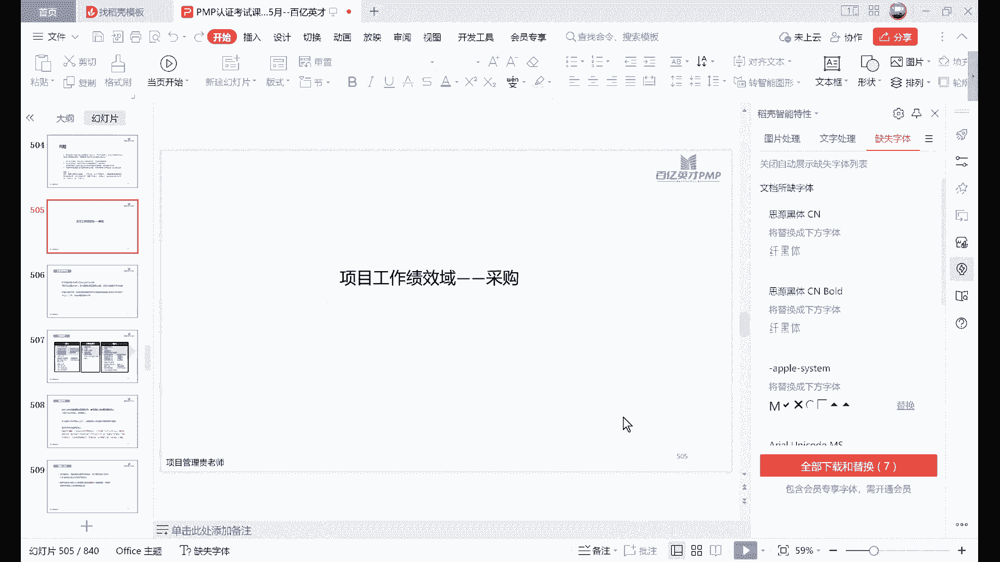

好各位同学晚上好，可以听到声音的话，看到课件的话，敲一个111哈，好的，我看到今天有学员陆陆续续的在进来哈，但是现在人员不是特别多哦，是因为今天要放假了，放假我就假了，所以大家都去happy去了吗。

好进来的学员如果说能够听见的话，帮我敲一个111哈，声音和课件的屏幕没有什么问题的话，啊我看到了哈，OK好收到收到了不少人敲幺幺。

那我们开始上课哈。

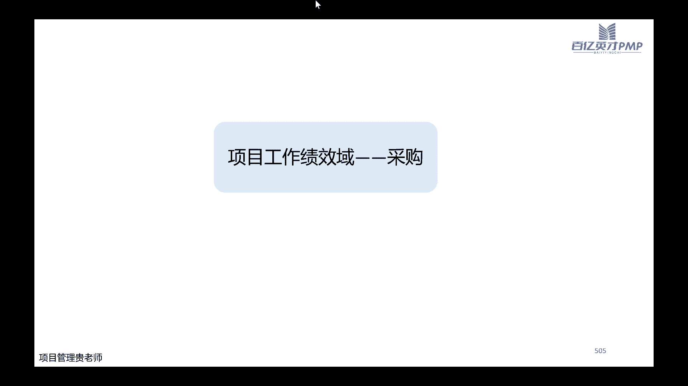

今天晚上我们讲，今天晚上我们讲工作绩效率的第二次课哈，第二次课讲完了之后呢，那我们的工作绩效率这一个章节也就结束了，重点在于采购的实施和变更啊，这两个呢也是考试当中比较重要的章节，尤其是我们的变更哈。

在历年来的考试当中，变更的题目出错率比较高啊，因为各种场景不太一样，所以呢今天晚上咱们把重心放在采购里面，采购里面主要是合同的选择，合同的类型，合同的签订哈，以及我们的变更的这个这个程序如何去控制。

OK我们开始哈。

第一个呢是我们要处理采购事宜，因为之前在讲规划寓的时候，我们提到了要规划采购啊，因为我们要有一些食物的资源，这些食物的资源呢咱们不管是自制啊，还是说外购啊，或者是说这个租用。

那么啊需要不管是需要哪一种方式，我们需要把这个资源把它啊，弄到我们项目当中来的话，那么在工作的绩效率，我们就要开始做处理采购事宜的这个事，那么具体的这个项目呢，它就包括了我们的这个合同签订啊。

或者说呢我们直接把它说采购也都OK，那通常说的采购呢它其实是涵盖了从材料啊，或者是资本的这个设备或者是用品啊，到他具体的这个解决方案啊，或者是啊，根据我们的这个设备要配备的一些服务。

以及一些劳动力所包含的全过程，这个都是属于我们采购的整个这个工作内容哈，所以呢在进行采购之前，那我们项目经理啊，和拥有相关技术资质的项目团队成员呢，哎会一起在跟这个相关的一些专家去合作。

制定我们的整个这个招标程序啊，应该是招标程序，当然这个招标程序呢，一般公司采购部分都会有自己的一些约定啊，那我们重点要做的是，把相应的一些招标的一些文件啊，包括前面说的这个啊采购说明书啊。

提交给这个部门，提交给我们的采购部，那采购部呢根据我们的要求啊，在相应的给我们后续的一些采购的程序的指导，比如说后续的程序与指导，第一个就是我们要负责把这个招标文件，把它编制出来，然后呢。

采购部门再配合我们，根据招标文件去发这个标啊，在网上搜寻啊，或者在我们常用的这些招标网站上面去上传，我们的这个招标的信息，然后看到的这个供应商呢，潜在的供应商呢，他再来做相应的一些投标啊。

然后我们再做这评选的过程啊，最后确定中标人，有了中标人之后呢，哎我们在签订合同，签订合同之后，唉就开始在这个旅行，履行合约啊，合约里面就包括我们提供的要求的这个服务，或者是产品是整个这样的一个流程哈。

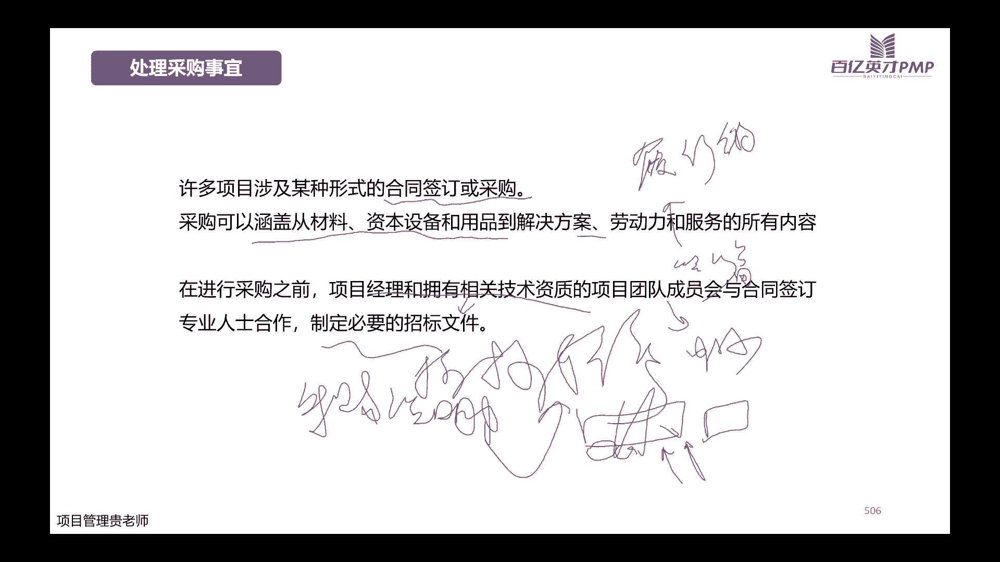

那实时采购呢它有它的子过程的输入和输出，是这样子的，首先呢嗯项目管理计划，肯定我们要核心的参考一下他的，采购管理计划啊，财务管理计划里面会列明我们具体的采购，实施这个工作啊，由谁来做啊。

他的程序指导指南是什么样子，工具和技术呢，哎我们可能会发送一些广告啊，传播我们的这个采购的信息啊，会举办投标人的一些会议啊，会做建议书的一些评价，然后同时呢有一些招标的这个过程，最后在签订合同的时候。

我们也会涉及到跟中标方去进行一，个啊细节的一些谈判，这是我们用到的工具和技术，那么输出呢当然啊选定的这个中标人，也就是我们选定的卖方啊，跟他的之间的这个合作的协议。

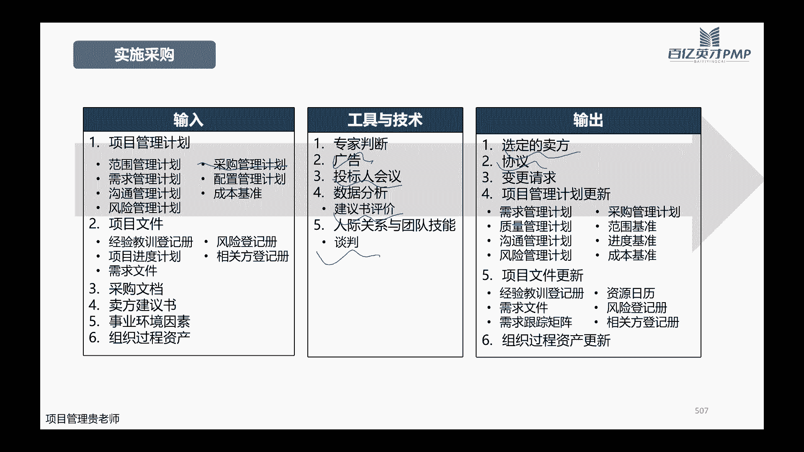

这是我们核心的实时采购这个子过程的输出，整个招标的过程呢，它其实啊这个前面大概讲了一下，就是我们要制定啊招标文件，制定完了之后呢，要公布招标文件，公布招标文件之后呢，有一些这个图标的人，潜在的供应商。

潜在的合作伙伴，他有可能对我们招标文件里面，有一些匿名的信息不太清晰的，他可能会询问，那我们有必要举行投标人的会议，给他们进行阐述，最后呢再通过我们的评标的标准，去选择我们的投标人啊。

选择这个最最后再确定我们的中标人，一般情况下呢才那个采购的这个方式哈，分为公开招标和邀请招标啊，一般是这两种，那有的呢他可能是这个政府在采购哈，那么政府的采购呢，他除了公开招标和邀请招标之外呢。

他可能还有一些这个竞争性的一些谈判啊，因为他的资金是国有资金啊，所以呢他可能会有竞争性的这个谈判啊，或者是一些单一来源采购，啊这个都是有可能的，但是我们一般说的啊，没有特殊针对于政府采购啊。

这说的是常规性的这种采购，那么一般是公开招标和邀请招标，其中的绝大部分用公开招标的，这种会比较多一些，那么啊招标文件发出去之后呢，唉我们要举行投标人的会议，投标人的会议呢。

主要是解决投标人他们的一些问题，并且呢他们不太明白的啊，或者是我们没有阐述清楚的，或者是我们已经阐述清楚了，但是呢他们的理解还是有一些困难，有一些误区的，我们再提供一些双面性的一些信息。

那这个选择的时候呢，它有很多种标准哈，以下给大家列的一些标准呢都是可以去参考的，比如说诶我们潜在的这个投标人，他的能力啊和潜能，以及呢他响应我们这个标书，它的产品的成本和生命周期的成本，交付的日期啊。

能不能满足我们的要求，他有没有一些技术的专长啊，方法有没有具体的做过类似的一些业绩啊，相关的一些经验啊，用于响应我们采购工作说明书的工作方法，工作计划有没有有没有关键一些员工的资质好。

这些资质他们的这个本来的经验怎么样啊，比如说咱们学PMP之后，考了p mp证书之后，那么将来可能嗯甲方有一个这个招标的信息，上面就可能列举哎，比如说这个项目团队需要有一名成员，持有这个p mp证书啊。

同时呢需要有一名成员，比如说持有这个敏捷AAACP的这个证书啊，他就有可能这样有不同的一些要求，那到时候咱们证书到手，就可能满足这样的一个资质哈，那么他的财务的稳定性啊，管相应的管理经验啊。

这是转移教啊啊，甚至包括整个这个项目，他的一些培训的一些计划呀，这个都是我们选择合适的，这个投标方啊可以去参考的用的一些标准，那么具体的这个标准呢，是根据每个项目自己去约定一些比重的。

一般情况下比较核心的啊，成本这个价格啊和他的技术，还有这个资质啊，不仅仅是员工呢，还有组织，还有公司它本身的一些资质，这个都是一些核心的，招标文件里面要重点考虑到好投标人会议。

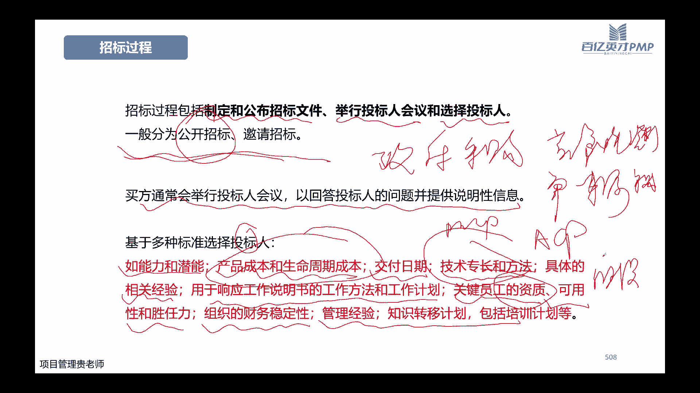

投标上会议呢，它主要是哎比如说有一些承包商的一些会呀啊，或者是供应商或者是投标之前的这个会议，图片上会议呢他一定是在大家提交啊，我们的建议书或者是我们的这个标书啊。

他一定是在投标啊之前开的这样的一个会议，他的要求啊，他的目的呢，就是要让这些投标人对采购的要求，都有清楚且一致的这样的一个理解的啊，比如说啊有时候呢咱们会遇到一种情况，是咱们的这个，招标文件啊公布之后。

网上会有很多人看呀，对不对啊，会有A啊，会有B会有C，也可能有D，还有更多的啊这些满足要求的这些客户企业，他们看到了我们的招标信息，那么其中有一个啊A客户啊，或者说它是客观，应该说A供应商。

他对我们招标文件当中提到某一个这个需求，他不太理解，那么他可能会打电话去询问啊，这个是具体的有没有什么啊，具体的这个指标的一些要求，他可能会问，那这个时候呢我们不能说哎，你单独的去跟A做解答。

这样的话对于BCD来说都是不太公平的，因为我们这个时候基于他们的问题，我们要对所有的啊这些啊，这个潜在投标的这些人啊，都要给他们共同的去共享，其中的某一个人问出来的，某一个供应商问出来的这样的问题啊。

要让大家都清楚，并且呢对它的理解都是一致的，这样的话你在后面的嗯中标啊，比如说我们确定了最后A中标，那么BCD呢他就不会说哎呀，你这个整个这个招标的这个过程不合规，为什么呢，因为你对A有优待。

你单独跟A阐述了更多的一些信息，那这样是不合规的哈，所以它的核心呢这个是为了防止啊，有任何的这个投标人会觉得啊，其他的这个投标方被特别优待了啊，所以投标人会议哈是他的目的。

以及他的这个嗯是为了规避什么问题，这个大家要理解哈，这个有可能考试当中他也有可能会考，考的时候呢，他就会给你一些这个场景啊，比如说就像我刚刚列举的啊，其中有一个会议上不太清楚。

那么你生的供应商应该怎么办啊，或者是呢啊这个发出来之后啊，你或者是给他们开会，或者是呢你在做一些这个补充的这种说明，公开性的说明也都是OK的，招标文件的类型呢我们前面讲了哈啊。

一般它是有公开公开招标和邀请招标啊，这是我们招标的两种类型，所以呢它对应的这个招标文件也不太一样哈，一般情况呢我们公开招标常用的啊，就是我们的这个招标啊，这个这个常用的招标文件，就是我们的这个标书。

这个标书呢它一般情况下主要是要考虑价格，比如说我们要去购买一些啊标准的这些产品，那这些产品在市场上，它相对来说它是比较成熟的了，只不过说呢每一个企业，它可能啊给的报价不太一样。

因为企业各自的生产的成本也不太一样，那所以呢我们这个时候用标书呢，其实是比较好用的，但有的时候我们如果说啊这是一个服务型的啊，以服务为主啊，或者是呢这个产品它不太标准。

它是需要有一些定制化研发的过程在里边的，那么有定制化的研发就比较考验我们供应商，它的技术能力和技术方法，说白了就是比较考验他们的这个研发水平啊，如果说他的研发水平特别重要的话。

那这个时候我们就使用啊建议书是比较合适，那整个这个招标文件呢，它的这个分类呢有三种哈，这是这这也是这个公认的三种，第一个呢是叫做信息的邀请书，就比如说哎我现在我需要啊。

几个不同的这个供应商给我提供更多啊，我现在需要采购的这个这个商品，这个产品或者这个服务，我需要更多的信息，但是这些信息呢毕竟我不是供应商啊，我们不是供应商，我们不是生产这些提供这个服务。

生产这个产品呢有很多细节我不太清楚，但是呢在项目当中，这些细节对我来说非常重要，那这个时候呢我用信息的邀请书啊，这些卖方呢他提交的就是组织信息的这个邀请，说去响应他的一些要求，一些需求。

那么第二种呢有可能是A我需要这些供应商啊，来提交一下，为了满足我们这些需要啊需求，尤其是一些不太啊标准的这个定制化的需求，定制化的一些服务，你大概需要多少成本啊，因为我们自己在做招标的时候。

我们也会核算一下，核算一下均价啊，评估一下它的底价，对不对，那这个时候有很多细节我也不太清楚啊，那我可能就用我希望我的这个供应商提供啊，这个报价类的这个邀请书啊，是比较合适的。

那么他们就提供这个报价类的，相关的这个建议数去响应，我在里面提到一些价格，一些成本的一些核算的一些细节，那么还有一种呢，就是哎比如说我们在做项目的时候，我们这些项目啊需要一些解决办法。

但是呢解决办法呢嗯不太确定，之前没有人去尝试过啊，我们在这个地方呢基本上是一个盲区，或者基本是一个无人区，那怎么办呢，那这个时候我们也需要在这方面比较有经验，或者比较有见解。

或者比较有技术能力的这些供应商啊，去给他提供一些我们的这个标准的这个，解决办法或者解决方案，那这个时候呢，我们就可能发一些这个建议的邀请书，然后呢相应的一些供应商，他们就提供他们的这个针对于建议。

针对于解决方案的这些呃建议书就OK了。

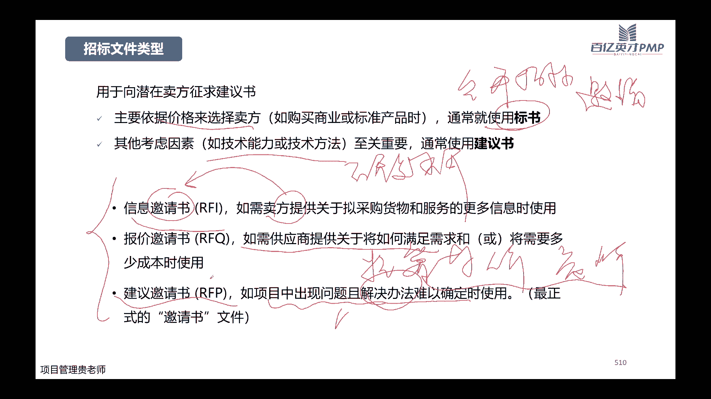

它的内容呢，一般情况下，招标文件至少要包括以下的这些内容，比如说好投标人须知肯定是要有的啊，这个须知的一些啊，比如说啊本次招标啊，怎么怎么样，是从嗯什么时候开始截止到什么时候嗯，要这个提供要关闭啊。

要提供我们的这个投标文件啊，投标人需要遵守什么什么样的一些这个约定啊，一般情况下，最开始的时候会有一些投标人须知啊，一些相当一些公开的一些声明，然后第二个呢是我们啊现在要招的这个项目，它的性质啊。

数量也就是说主要是这个项目哈，这个项目跟我们它不是我们做的项目哈，它是我们采购的采购这个本身这个项目啊，他是要采购一些什么东西，就把说清楚，我们想要什么啊，是想要比如说提供几个芯片吗，啊什么规格的呀。

啊多少片啊，什么数量啊啊，或者是提供什么样的服务啊，这些服务呢需要满足什么样的这个要求，什么样的水平啊，有没有一些技术的规格，同时呢这个价格啊有什么样的一些要求啊。

你价格你在计算的时候有什么样的计算方式啊，比如说我要求你列明啊原材料的啊，它的这个种类啊，数量成本啊，我要求你列明这些，同时呢我还要求你列明啊，生产性的成本啊是多少啊，水电呀，无聊的损耗呀。

设备的折旧呀，我要求你啊把这些都列名，还有我们评标的这个标准和方法啊，在我们的招标文件里面也会有一个比较公正，公开的这样的一个标准和方法，同时呢唉我要求你，比如说你提供的这个前面讲过的啊。

你提供这个芯片来了哈，我要求你嗯比如说三个月要交货啊，或者是呢你提供了什么服务啊，我在9月份之前啊，9月30号之前嗯，要这个嗯完成合同的这个约定的内容，并且呢你有没有相关的一些资格和资讯的一些。

证明的一些文件啊，比如说啊数字经济的或者这个信息安全呢，有没有相关的一些资质啊，芯片的生产的，那你有没有一些啊，这个相关的一些这个质量保证体系，ISO9001有没有相关的一些认证啊。

如果说给军工提供一些服务的话，尤其是一些这个保密性呢，那是不是这个保密资质啊，然后军工的这个三证都相应的是具备的啊，同时呢保证金的数额或者是其他的刑事担保，一般情况下都是这个保证金哈，比如说啊1万块钱。

1万5，2万5是你的投标的保证金，这投标保证金啊，一般情况下啊，这个如果说要投标的话，是要缴纳这个保证金的，没有中标的时候，他会把这个保证金退给你啊，啊中标之后呢，哎可能这个就转为别的这个履约保证金啊。

就有这样的一个形式，然后第九点呢是我们招标文件的编制要求啊，什么意思呢，它可能汇率啊，汇率迷你招标文件啊，前面有一个这个封面是用什么样的格式啊，招标文件里面包含几部分内容啊，然后技术部分啊啊怎么去响应。

然后最后呢，唉还要有一些这个其他的一些特殊性的，一些附件，说明它都会有一些这个具体的编制要求，然后第十呢哎我们嗯提交这个投标文件的方式，地点和截止时间啊，就是说你这个标注截止到比如说今天是6月诶。

今天是多少号诶，我也我看看今天6月21号诶，他比如说我现在截止到7月21号的时候啊，我这个照片文件我必须要发送到啊，或者说这个手动承包低调到什么现场啊，什么办公室什么地址啊。

截止到这个7月21号的这个下午，下班之前啊，下午五点前他都会念得非常详细，然后呢还会有开播啊，开标和评标的后面的这个日程安排啊，比如说我们接触这个文件之后啊，我们在这个7月30号。

我们会统一的这个进行开标评标，开标的时候需要供应商啊，需要我们的投一投标人怎么怎么样，有一些要求，还有呢我们后面涉及到主要的合同的条款，可能会有哪些内容，这个都是在我们的招标文件里面啊。

会包括的一些核心的内容哈，基本上我不知道大家有没有，不知道大家有没有这个做过这种，这个投标文件哈，图片文件基本上除了它里面的这个核心内容，自己取消的，自己需要提供的这个价格呀，然后技术呀啊。

然后资质啊啊，基本上就是按照他的这个招聘文件，整套模板，整套格式去把相应的内容填进去，相应的内容准备出来啊，然后格式做的好看一点，最后把它装订就基本上还OK哈。

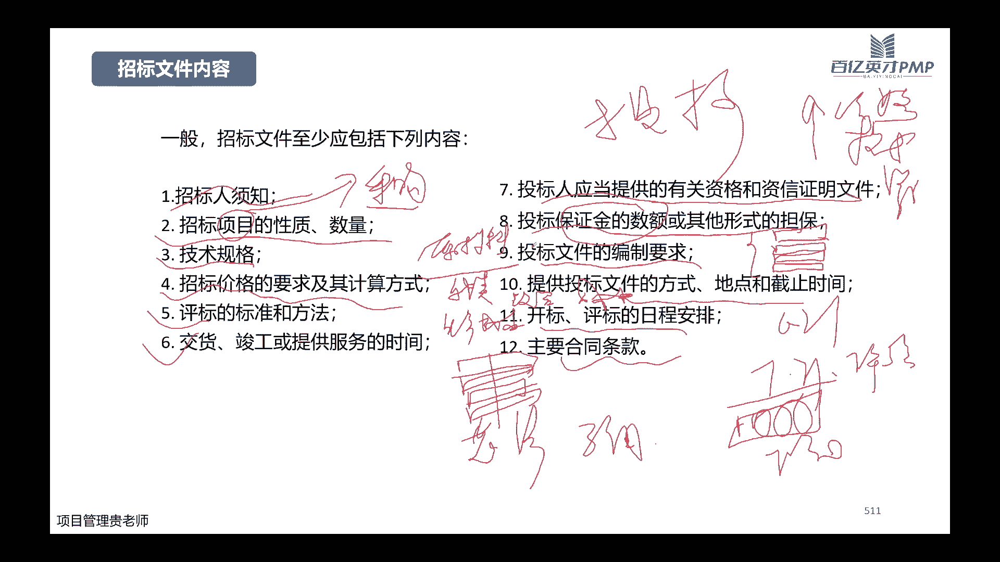

然后呢，这呢这个有一个招标文件的一些，具体的一些案例啊，可以这只是部分，它主要是这个合同啊，和我们的这个技术的规格嗯，需要大家重点去关注的啊，你看他投标文件的格式啊，比如说你啊这个有图标函。

然后有分项的报价表啊，或者是有交货的这个一览表啊，比如说你到时候交的啊，比如说我们这个芯片，你不可能只是交付芯片本身，对不对，那芯片是如何包装呀，包装的时候你是怎么去这个交付啊。

是用什么样的这个盒子的这个外包装啊，快递的运输啊，这些都是嗯这个呃特别就是要把它列明的，那除了它本身产品本身之外，是不是有一些这个啊这个质量检测的这个啊，合格合格书啊或者是什么的，啊。

或者是类似于一些这个其他的什么使用手册，之类的啊，这些都是我们的交货的一览表，然后还有我们这个图标的产品的品牌啊，还有我们的相应的一些这个技术规格啊，商务条款偏离的表，偏离表就是啊。

我们比如说这个提了一些技术的规格，诶，它是嗯它是能够响应，比如说这个芯片，然后激光芯片，比如说它是嗯要求是800NM诶，那我可能在做出来的时候，我可能是800A这个正五有一定的偏离度，它会有一些要求。

然后呢好副业的保证金啊，有关那些回执啊，资质证明，营业执照啊，税务证金证啊，资质证书啊，这些都是相应的，我们要根据这些招标文件，去提供相应的资质文件，去把营业执照附在里边，把社会登记证啊。

自证出来都附在里边，还有法人的一些证件啊，相关的一些这个按照他的要求一个一个来啊。

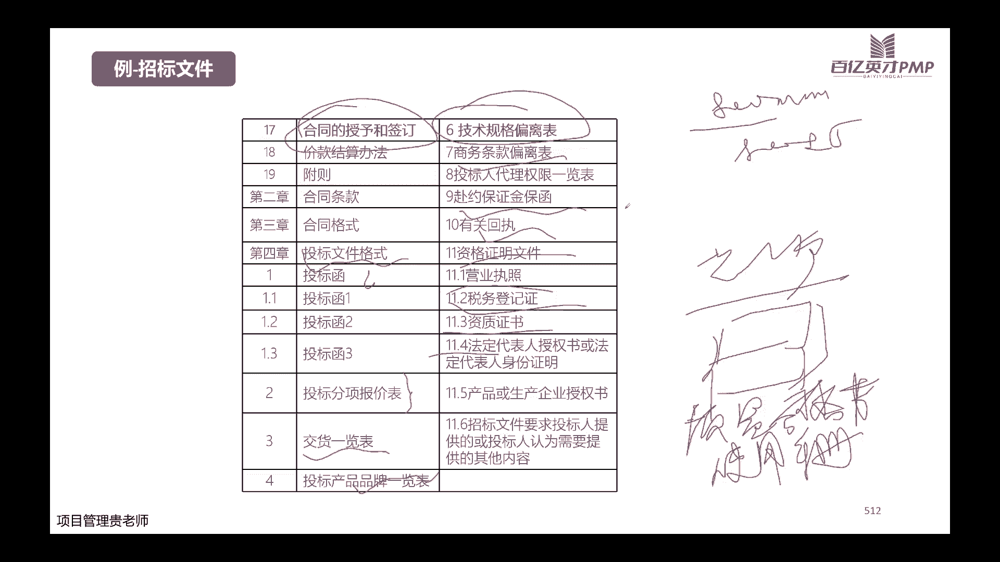

不能少也不能太多，然后呢，这下面呢是一个我们建议邀请书的一个模板啊，你看建议邀请书的模板他也会有，首先诶我们这个出建议书，它的这个目的是什么啊，我们为什么要出这样的建议邀请书，我们是希望针对于什么啊。

什么问题，希望得到一个解决方案，我前面讲了建议邀请说主要是针对于某些问题，某些项目的解决方案啊，然后呢他有什么样的基本要求啊，有没有什么软件和硬件的一些环境，哎这个重复了哈。

然后呢有没有他的这个整个这个这个啊，邀请书的嗯，到提供建议书的整个这个流程，整个这个过程，然后呢整个我们这个工作和进度的一些安排，可能会有的一些这个附件啊，比如说现在系统的情况啊。

那我们系统应该要达到什么要求啊，现在有没有一些规模性的一些数据啊，而我们希望你提供什么样的解决方案啊，哎如果说你中标的话，我们将来合同啊，他大概会是什么样的一个这个模板的，一个这个示例呀。

这个是我们的建议邀请书的一些模板，大家可以去参考哈。

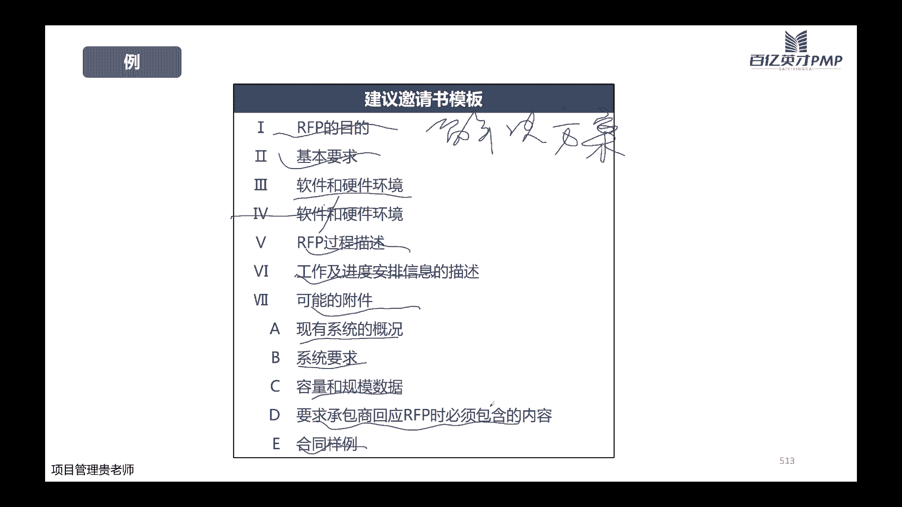

然后合同管理啊，既然我们前面说了啊，我们这个招标文件啊，做好了投标文件，这个也相应的收到了，收到了之后，那我们要评标啊，对不对，评标选出了中标人之后，那我们要签订合同，那么合同管理呢合既然签订合同。

那么就包括了合同管理，合同管理呢它是有从合同签订开始，然后到后面的合同的这个纽约啊，合同，如果说因为有一些什么根源性的一些问题啊，或者是一些临时性的一些问题，客观性的主观性的都OK，但只要它是合理的。

它会有一些变更，那合同变更怎么管，那合同的本身的这个文本啊，down还怎么管，以及呢，如果说供应商没有达到我们的这个要求，没有达到我们的这个验收标准，那么有没有涉及到一些索赔啊。

或者是一些唯一的这个管理啊，这个是我们合同管理的这个重点内容哈，那么我们在项目管理当中呢，重点去掌握它的这个签订管理，就OK合同的主要的这个内容呢，大家也可以简单看一看，比如说哎我们这个项目的名称啊。

我们要啊这个服务的内容和范围是什么，有没有指南要求，然后呢核心的计划精度低点嗯，然后建设过程当中有没有啊一种期限，然后技术或者资料，有没有一些保密性的一些这个条款啊，相应的有没有一些这个嗯风险承担。

责任的承担啊，然后呢以及我们知识产权啊，或者是说我们技术成果的一些归属，最后验收的时候呢，唉是怎么交货呀，是怎么验收呀，然后这个合同啊，我采购这些服务，我要多少钱啊，或者是我的这个报酬啊，或者服务费啊。

以及我是怎么支付啊，是这个签完合同之后三个工作日就支付吗，还是说最后验收之后三个工作日支付呀，十个工作日支付呀，还是说这个几比几啊，1331啊，各种方式，然后呢以及我们如果说违约之后。

那么相应的一些违约金啊，以及呢，我们如果说这个合同存在一些什么样的争议，那么去怎么去仲裁啊，争议解决的办法，以及呢合同当中提到的一些这个专业的，一些术语，怎么去解释啊，包括合同有没有一些附件呀。

附近是不是跟合同是同等的法律效益啊，这个都是常见的一个合同的内容哈，合同我相信啊，如果说这个前面说招标文件，大家不一定去做过投标啊，或者说招标文件不一定会做过，但是合同的这些范本啊，或者合同的文本。

大家如果说做项目管理的话，应该多多少少的兼顾合同吧，应该多多少少的欠款，我还之前还问过我们有一些学员，他这个他们公司做需求的收集的时候，都是对着合同去去理需求，都没有直接收集需求这个动作。

啊看到有学员问一个问题啊，说嗯这几份招标文件有关系吗，比如说某个阶段先用这个信息，然后再用这个报价，是的嗯，他们之间本身的这个呃用途是不太一样的，但是一般情况下呢，最后都会用到这个价格的邀请书。

因为嗯既然是服务嘛，不管是我要求你提供解决方案啊，还是说我想从你这儿得到更多的一些，基础的一些细节啊，还有成本的核算，最后我既然要用啊，咱们要合作，那么就避不开钱哈。

所以说一般啊最后都会再配上这个报价的，这个邀请书，价格的邀请书。

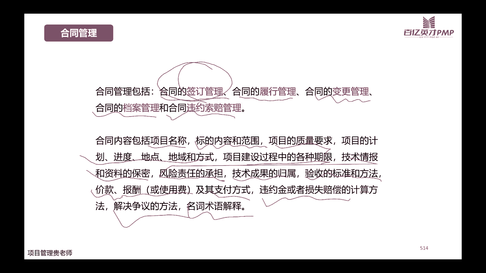

好签订合同呢，它主要取决于我们的这个采购规模呀，啊工作范围呀，以及各组织的这个风险承受能力啊，这是我们在选择签订什么样的合同的时候，会考虑的一些因素，那一旦我们选择了这个供应商之后呢。

就会对我们本身的这个项目文件或者项目计划，有一些更新啊，什么意思呢，比如说我们前面这是这这个项目，就不是采购项目了哈，这个项目是我们本身做的这样的一个项目，那我们做的这个项目本身。

比如说哎列了这个建筑计划是已经列好的，那么根据我们这个供应商，他提供的一些日期啊或资源会的一些成本好，或者是质量要求呢，我们肯定要对我们之前做的这个进度啊，和相应的一些这个资源哪啊。

这个成本呢会有一些更新，这个可以理解，对不对，比如说我们之前做的这个进度啊，是从6月21号到7月21号，要完成一个内容，这个完成内容所需要的资源呢，是需要有供应商来提供的，那现在我们去跟这个供应商啊。

去具体去谈签的时候，供应商发现诶，我去月21号的时候，我没有办法提供你所想要的这些东西，我得到8月21号，对不对，那可能你的这个进度计划就要有一些这个啊，调整进度里面包括所需要的这个资源啊。

所需要的这个成本，前面我们在核酸的时候，都是按照我们既往的这些理解去类比估算啊，或者三点估算呢都去推算出来的，那么现在有详细的信息之后，我们要做一些优化，做一些更新好，对于呃可交付成果。

如果说它采用的是一些嗯适应性的方法，其他的这些呢就是采用的预测性的方法，这种项目也就是说啊是一些这个混合型的，如果说是一些混合型的项目的话，那么我们在选取合同的时候，我们就可以用啊这个总体的合同。

用这个主协议，然后呢，这个适应性的部分就是敏捷的这一部分啊，再用这个附录或者一些增补啊，这个怎么说呢，就因为我们预测性的项目啊，它是范围是比较确定的，那既然范围是比较确定的话，那我们比较好估价。

对不对啊，这个价格是相对而言是比较好确定的，合同上面有一个明确的这个价格，但是呢嗯他既有预测，他又有他又有适应性的，适应性的项目呢，我们说它的范围是不确定的，对不对，需求不明确，需求不明确的话。

那么我们在做的过程当中，诶，到底需要这个满足的需求是什么样子啊，最后我们这些用了多少的资源，投入了多长的时间，到最后可能随着这个项目做完，我们才能够有一个明确的一个嗯，这个信息和数据出来。

那么根据这些明确的这些数据呢，我们才能核算出来他的这个成本到底收多少，那这个时候呢我们就没有办法在前期的合同啊，做一个对这一块的，做一个明确的这种价格的估算，那这种情况呢我们就可以有一个主体的协议。

做这个啊，总价是多少，然后对于我们适应部分的环节，我们采用什么样的方法去核算，我们的这个这个成本怎么样，到时候去结算我们的这个货款啊，只要说清楚就OK了，它是表达的是这个意思哈，嗯合同的类型呢。

首先按照项目的范围来划分的话，我们可以分为三种哈，一般情况下，比如说项目的总承包合同啊，总承包合同这个很简单，就是比如说咱们发出去一个包啊，发出去一个这个啊这个招标信息，然后呢嗯这个工程量比较大。

由其中的一个供应商A他总体来承包，为什么呢，因为他的资质比较全啊，他的业绩的要求比较好，他从各方面来说呢，它整体的评分是最好最高的，我们选择了A啊，这个供应商去跟他去合作，那么对于他来，对于A而言呢。

我们相当于是把整个这个项目由他来总承包了，签订的是一个这个总体的这个合同，当然这个A呢啊我们也允许他再去啊，在一些这个条件合适的情况下，去把它分包出去啊，所以第二个呢项项目的单项承包合同。

单项承包合同呢，它跟这个总承包合同的形式有点不一样哈，总承包是我们啊，我们比如说这个时候是甲方，甲方跟啊A签订了合同，然后A呢再有可能去跟这个C啊啊，这个D啊啊一啊，有可能再去跟这些签分包合同。

但是我们如果说是单向承包合同的，是我在发包的时候，我就不仅仅发了这一个包啊，我有可能发了1234，我把整个这个项目拆分了，拆分成了四个部分啊，我四个部分分别发送我的这个招标的信息。

那么分别对应的有A来响应，B来响应啊，C来响应啊，D来响应他们成为我们最终的每个对应的啊，这种中标人，那么我们甲方分别跟N签合同，甲方分别跟B甲方跟C甲方跟D啊，这是单向承包合同啊，分包合同前面讲了哈。

不说了。

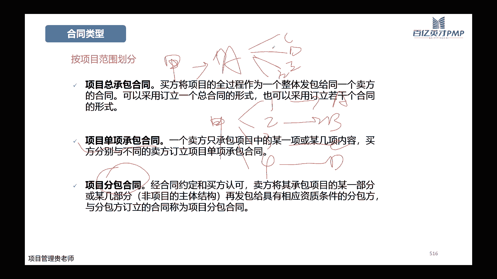

那如果说按照付款的方式划分呢，唉我们又可以把合同分为总价类的合同，成本补偿类的合同和混合类的合同哈，嗯合同的按付款方式划分呢，这个是咱们考试的一个重点哈，这个是项目管理当中要求要掌握的考试的重点。

前面按照项目的范围划分呢，大家作为补充的知识去了解啊就可以，然后总价内的合同呢它又分了几个不同的哈，第一个呢是就是固定总价，相当于是哎比如说我这个合同是1000万嗯，那么无论发生什么情况。

我这个合同啊只要是验收通过的，那它的这个价款就是1000万，而第二种呢是总价加激励费用合同，总价加激励费用合同呢是说哎，比如说我这个合同仍然它的总价是1000万，但是呢如果说供应商啊。

你在这个整个这个项目的过程当中，表现的特别好啊，帮我发现了一些新的一些这个啊商机啊啊，或者是说这个节约了新的一些这个啊，这个成本啊，资源啊啊都可以哈，只要我认为你做的比较好诶，我规定一部分的这个费用。

作为你到时候的这个激励的费用，好比如说到时候可能是1000万加啊，当然如果说你这个时候做的不好啊，比如说这个你在里面有一些恶性的一些，这个资源的一些浪费啊啊或者怎么样的啊。

对我这个公司整体的这些文化造成一些影响，那么也有可能有一些惩罚啊，惩罚之后呢，我们就用总价啊去把这个惩罚的部分把它剪掉，就OK，那还有一种呢是我们总价加上经济价格调整啊。

这种的一般就是说咱们的周期啊特别长，比如说跨个3年，那3年我这个合同1000万，我现在看起来这3年啊，这个合同1000万确实还挺高的，但是呢我要考虑到这3年期间啊，会不会有一些通货膨胀啊。

那你到时候啊这个比如说付款方式啊，如果说你都是等到验收之后再付的话，那么现在的1000万到三天之后的这个1000万，他可能就贬值的比较厉害，那么经济的一些因素是不是要考虑进去，这个是总价合同。

他又根据不同的情况有一些细分哈，成本补偿内的合同呢它也有三个分类，第一个分类呢就是说啊，我成本加上固定费用合同啊，什么意思呢，就是说哎我现在用成本补偿那个合同，我不用总价啊，啊我用成本补偿。

首先我给你这个允许你的，有一个这个实际的成本，因为项目做完了啊，这个卖房他提供服务或者提供成本，它一定会有一个实际成本的一个核算，对不对，那OK没问题啊，你的成本我都给你报销了，然后呢。

我给你一部分的这个固定费用，作为你的利润，对不对，因为我们不可能只干活，不可能只考虑成本啊，对不对，我们要考虑利润部分，那OK啊，我约定了实际的成本是多少，就是多少，然后固定费用呢，比如说是好5万块钱。

啊这个就作为你的利润啊，或者是呢唉成本加上激励费用费用，成本加上激励费用，合同呢啊是也是根据这个卖方啊，或者是我们的供应商都OK哈，看大家怎么叫，那么在我们项目整个实施的过程当中啊。

也有可能是因为整体的这个管理水平比较高，配合的比较好，所以呢替咱们这个项目降本增效，节约了成本啊，也有可能造成超支，当然管理的好，节约成本，管理不好就长成一些超支，那么嗯如果说好诶。

我有一部分激励费用给到你啊，如果说不好，我也有一部分激励费用，但是呢这个激励费用呢，他有可能就是一个这个负的超值之后呢，咱们也是共同的，你承担一部分，我承担一部分，相应的会有一个激励的比例。

一般情况下呢啊这个是按八二区分，还就是买方，和卖方上照八二的比例，当然这个在合同里面，既然签了成本补偿内的合同的话，那么这个比例一定会在合同里面去把它匿名啊，7382都OK，那这个八二什么意思呢。

就比如说现在成本超支了，成本超支之后呢，哎我买房，因为我是甲方，我必须要承担，对不对，但是我不承担所有的，我只承担超支的80%，剩的20%呢啊是因为你这个卖方，你你在做服务的时候，或者你在做产品的时候。

你自己没做好啊，因为你的原因导致超支，所以你要承担20%，那如果说是节约了呢，哎节约了成本，那相当于是我甲方要付给你的成本是不是更少，那但是呢这个时候诶我为了奖励你啊，为了激励你，帮我节约了成本。

哎我有20%拿出来在单独的作为经历，作为奖励给到你卖房，他是这个意思哈，然后第三种呢是成本加上奖励费用，这个奖励费用呢，一般情况下我们会用的比较少哈，因为奖励它是它跟激励是不一样。

激励呢是一种大家双方认可的，谈好的，可以捏在合同里面的，一种经济的方式和经营的比例，但是奖励了他完完全全是由甲方的主观意识，啊有假官的主观主观意识去决定的啊，我觉得你做得好，我愿意给你2万块钱。

就给你2万块钱啊，我愿意给你3万就3万，我觉得你做的不好，我扣你2万块钱啊，对对他，他是这个意思哈，但你想在实际的过程当中，如果说是按照这种推行的话，会有乙方跟你签合同吗，可能会很少，对不对。

除非这乙方真的活不下去了，急需要这笔资金啊，急需要这个业务订单，要不然一般的话会可能会很少，选用这个奖励的这个费用，这个合同啊主观意识太强，然后第三个大类呢叫做混合类的合同啊。

我们常用的就是一些公立合同，这种合同呢啊，就是它一般就是啊对应的你的单价是多少，然后呢我们最后核算的时候，这个数量是多少，那不用我们谈好的固定的这种单价啊，再乘以我们实际上是核算出来的这种数量。

使用的这个数量是多少钱啊，就给你多少钱啊，啊就OK当然我们有可能在这个单价里面，就是卖方，他已经把他的这个成本加利润，都已经核算进去了都行哈，这个是我们的这个工价合同嗯。

总价类的合同呢它是啊这有具体的这个表述哈，就跟我刚刚说的是一样的，就是确定一个总价，然后呢固定总价呢，就是一开始就确定不允许这个改变了啊，加激励费用呢前面讲过了哈，就是激励有一定的灵活性啊。

有一些绩效偏离啊，就是有一些这个成本，或者是一些精度的一些超值啊，有些偏离啊，或者是有一些精度的节约啊，成本的节约啊，我们呢啊会有一些相应的一些财务的奖励，然后加经济价格调整，前面也讲过了哈。

要跨时间比较长，有一些这个货币型的一些因素，它的使用范围呢啊，它的适用范围呢，首先如果说你要确定用总将来的合同啊，他的需求肯定是比较明确的，明确的，我们才会有总价类的合同。

并且呢一般情况下不会出现重大的这个需求，或者范围的这个变更啊，这个时候我没有总价，至于你用总价的时候，你到底是用固定还是用激励费用，还是用基地价格调整费用呢，哎那我们再看一下这个具体的啊。

这些啊这个项目的类型，项目的情况，如果说哈，如果说啊，你必须要把这个采购的这个服务或产品，把它去确定下来啊，后面变更呢会导致合同的一个价格有一些提高，那这个时候呢啊为了考虑啊，这个是不是有一些这个避免。

因为咱们是甲方嘛，咱们要避免合同价格提高呀，啊然后呢，我又知道这个可能它会有一点点小变更，那这个时候呢，我们一般倾向于选择固定总价合同啊，如果说有的时候有一些变更的话，就让这个卖方啊。

让固定商自己去承担就好了，好常见的，比如说嗯比如说我们去装修吧啊装修一栋楼啊，或者我小时候说装修一个，这个咱们一个小房子吧，装修一个房子啊，你肯定希望跟这个装修方签订一些，嗯这个固定的合同啊。

固定总价合同，这样的话万一诶我们在装修的过程当中，突然发现啊，阳台外面啊突然多多出来一块，它地面没有找平，那你需要这个装修的这个队伍，施工队伍把这个地面先找平，然后再给你去啊，做水泥铺瓷砖。

什么时什么什么，但是这个找平的这个工作哈，在最开始签订合同的时候，其实并没有识别出来，但是呢我们为了防止这样多余的一些小范围的，一些动作啊，一些工作会出现，那这个时候呢哎我们就更倾向于去跟装修工啊。

一开始说好，比如说啊30万，我要给我把这个房子装修好，那一旦出现这样的问题啊，施工方他是没有权利去找你多要钱，他说啊这个地面没找平，你还得再给我多补点钱啊，一般情况下不会这样子啊，总价加加激励费用呢。

是诶我们有一个这个价格的一个上限，你必须要啊，这供应商必须要完成我们所有要求的这个工作，并且呢啊如果说超过我们的这个价格上限，那你就要承担它的一些这个成本啊，经济价格前面刚刚说了，成本补偿类的合同呢。

首先啊你的所有的这个合法成本，我都要给你报销啊，就是实际成本都要给你报销，然后还要考虑到你的卖房利润1200，大家想想哈啊，既然我们的成本补偿合同他是这样定义的，那你想作为一个甲方。

你希望用成本补偿合同吗，大家觉得如果你现在啊，你是蔡文经理，你要去采购，你愿意主动的去使用成本补偿类的合同吗，你肯定是不愿意的，对不对，为什么，因为你首先啊他的全部的合法的实际成本，你都要去给它囊括。

去把他全部的成本去给他报销了，然后还要给他做利润，所以一般呢我们是不太愿意，但是乙方呢供应商呢他就相当于愿意了啊，他非常愿意说啊，你你反正我不管做多少钱，不管是超市还是这个节约。

无非就是我承担的这个比例不一样，但是只要是我的实际成本，哪怕是我超了，你都得给我报销啊，无非就是抄的这种利润少一点，对不对，所以对于乙方而言，对供应商而言，他一定是希望多签一些成本补偿类的合同。

那成本补偿类的合同呢，我们刚刚讲了，它也有三种啊，固定费用啊，精力费用和这个奖励费用啊，具体就不解释了，前面已经解释过了嗯。

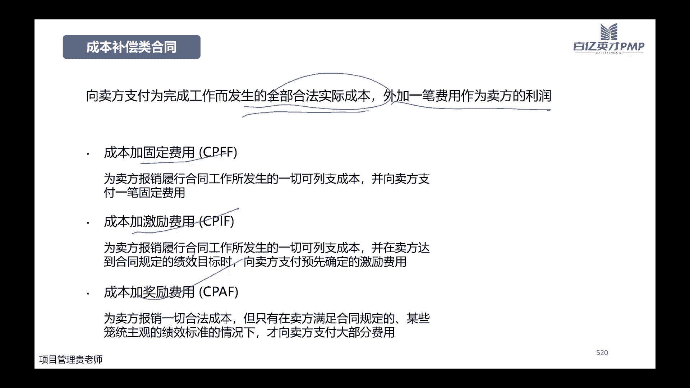

但是其中有一个点哈，它的这个适用范围啊，可以去看一看，比如说加固定费用的话，固定费用他就是说哎你的绩效如果是你做的好，做的坏，反正我不考虑了，我说了3万块钱就是3万块钱，5万块钱就是5万块钱。

这个就是你的这个啊这个利润，其他的我没有啊，加激励费用呢啊，这个就是按照一定的比例去承担，既然说按照一定的比例的话，那么这个就会有一些这个考点哈，大家要记住这个公式，这个公式呢一般情况下它可能会考啊。

比如说他会考啊，我们签的是成本加经济费用合同啊，然后这个时候成本是多少，实际成本是多少，目标成本是多少，目标费用是多少啊，这个问你到最后的时候，到底应该付给供应商多少钱，那这个时候呢我们要支付的金额。

就等于实际成本加上卖方利润啊，为什么是实际成本价，卖方利润，因为我们前面讲的成本补偿类的合同，就是要报销他所有的这个合法的成本，然后呢还要给他一部分钱，当他的利润对不对，那问题来了，卖方的利润怎么算呢。

那卖方利润就等于我们的目标费用，加上我们的惩罚或者是奖励啊，这一部分有可能是负数，有可能是正数都OK，所以他在啊场景当中，或者是我们签这项合同的时候，他一定会约定啊，我们的这个目标费用到底是多少哦。

为什么呢，您约定之后，我最后才能考核你对于这个目标费用，你到底啊这有没有参考价值，有没有一些上限和一个下限的一些突破，奖励费用，前面讲了，因为他这个主观判断啊，所以你卖房还没有办法去申诉。

所以一般实际当中使用的比较少啊。

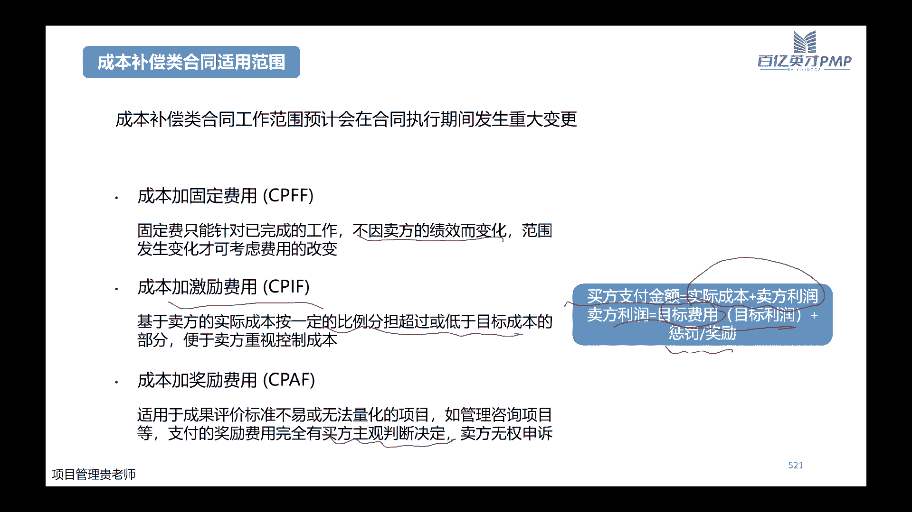

它其实它相对而言呢，他成本补偿的合同和总价合同的这个特点，它其实都啊优点都有哈，些，工量合同相当于说哎，比如说还是我们讲这个，前面这个装修的这个案例吧，哎我现在跟你签的不是总价，我不是说30块让你保管。

你全给我包了，而是说我给你签过尿啊，比如说啊你用了多少吨水泥啊，不想那么细吧，我就说原材料，哎你的原材料啊，基础的这种水泥啊，这个土啊，这种原材料是多少钱啊，你给我报个价啊，你这种报价呢。

一般市场会有一个这个通用的这个价格好，我允许你自己往这个通用的价格里面，稍微高一点，作为你的利润都OK啊，比如说你报的是这1000块钱，好美灯或者每立方，然后呢有一些这个软装的部分啊。

比如说这个灯饰还有多少啊，只是用到原材料的这个数量啊，加上这个单价，然后最后呢还会有的人工啊，人工我给你报的是现在，比如说哎我300块钱，哎我签的是这样的一个合同啊，单价是比较明确的，那最后我算出来诶。

比如说做了三个月啊，终于装修好了，那我在一个亿的核算，这三个月内啊，你这个材料用了多少啊，乘以五的单价，好装饰用了多少成果的单价啊，人300块钱一天，你用了多少个人啊，多少天。

然后最后算出来总的这个金额是多少啊，我就给你支付多少钱就OK了，这是国内合同啊，所以大家想想供电合同呢，它其实比较适用于这些小的一些项目，因为小的项目啊，我核算起来比较简单。

但是呢如果说一旦这个项目特别特别复杂啊，我前面我原材料啊，我我这个灯饰啊，我人工啊，我芭芭拉我有好几百项，那这个用跟用单用过量合同就相对来说的话，计算起来非常复杂，所以一般如果说啊这个范围他嗯不太明确。

但是呢这个整个这个项目的这个复杂度特别高，我们这个嗯范围还相对，这个这个单价相对于比较明确啊，范围可以不明确，但是单价可以明确啊，同时呢整个这个项目不是很复杂啊，这个规模呢还相对比较小。

这种合同一般用工量合同是相当是相当合适的，包括我们平时在做，比如说做软件项目比较多的话，那我们有一些这个外包出来的一些软件服务啊，这个时候用供电合同也是比较合适的，因为软件当中人就是工程师。

每天的这个价格报价，其实市场上还是比较公开透明的，那么唉我们做这样的一个这个软件的这个外包，就做完，做完服务之后，哎我们核算一下一共有多少个人天，唉就知道这个价格是多少了，那像这种比较啊小而精的。

大家有比较明确的，比较透明化的这种用过量合同就相当合适哈，那合同的整个这个风险对比呢，啊我们按照啊这个总价类的合同啊，和成本补偿类合就是3+3加一啊，就三个大类，每个前面两个大类。

每个大类里面有三个小类啊，一共是3+3加一啊，按照这种七个不同的合同类型，它的风险而言的话，对于我们自己这个甲方啊，对于我们买方而言，成本啊，成本补偿类的合同显然风险还是比较高的。

固定总价呢它是相对来说风险是比较低的啊，因为我万一有一些变更，那这些承担损失的人不是我啊，是买房，是这个卖房他自己在包啊，如果说是成本的话，我要报销他的一切合法成本，那相当于风险基本上都在我买房啊。

都在甲方这，那对于工料合同呢，公交合同也是一样哈，估量合同你做多少啊，做的时间长，这个呢如果说我甲方不是专业的啊，我也没有办法去评估，你说一天还是说两天一天的活，你给我做成十天。

那我也没有相对比较专业的一些评估，或者一些证据证明你确实在那磨洋工啊，所以他的这个对于我们自己而言的，风险是逐步的在增高的，嗯这有几个例题，还是针对于我们的这个成本激励费用的合同，的一些这个计算啊。

这些计算我应该是列了好几个不同的这个场景，设计的这个题目，嗯如果说大家能够算这些的话，那么我们说明这个成本补偿内的合同，嗯应该都没有什么问题啊，因为固定的这个总价类的合同很简单。

总价类的合同一般就固定总价，这个相对比较比较容易哈，嗯难点就是很多人在算那个激励费用的时候，可能会有一些卡壳，但是呢这个又必须得掌握，因为考试有可能他会考好，我们继续看看这个案例哈。

这个案例呢他就是说啊这个买房和卖房，他签订了一个成本精力费用的合同，这个合同呢告诉你了，目标成本是30万美元，目标的这个费用，目标费用的利润哈，目标利润呢是诶，我到时候给你这个4万美元，什么意思呢。

也就是说如果说一切都是非常啊完美的，按照我们的计划在执行的话，好你的成本控制在30万不多也不少，那么你将得到4万块钱的利润啊，不多也不少，但实际不会是这样的，实际会有一定会有变动，一定会有偏差的。

对不对，所以我们约定了分段的比例是八二啊，今天的费用的上限呢为6万美元，下限为1万美元，什么意思呢，为什么会有上限和下限呢，因为哎我们既然说有一些激励的这个分摊比例。

我们也不能说按照这个比例源源不断的啊，你到时候这个啊这个设置一些这个经历，没有没有这个痛，没有这个叫什么，没有节制点，没有控制点，那也是不行的，对不对，所以呢我们有一个这个上限和一个下限啊。

现在呢告诉你我们这个项目做完了，卖方它的实际成本呢是38万美元啊，那问你现在是买方应该支付的激励费用是多少，他问的是应该支付的机密费用哈，那我们来看一下他38万美元的实际成本啊。

是不是你我们的目标成本已经超了8万块钱，超了8万美元，对不对，那超了8万美元，哎我们看一下它的分摊比例是8282，也就是说这超支的这8万块钱啊，啊我买房我只承担80%，我只承担886 140000啊。

6。4万相当，还有你的这个2。4万呢，212。6万呢是你自己要去承担的，对不对，那现在OK了，我的目标的利润是我要给你4万块钱啊，然后呢啊现在是你整个我承担的是6。4万。

那么减去你的这个目标的利润这一部分，剩的作为你的激励费用啊，所以激励的费用应该是2。4万元，就这样算出来的哈，2。4万元，他正好是在我们的这个金利费用的，区间范围之内，他没有少于1万块钱。

他也没有突破6万块钱啊，所以这个时候呢我应该支付的这个激励费，就是2万4哈，就是这样算出来的，还有一种简单的办法哈，就是说哎我我这个时候281啊，这是写错了，281 16，还有个简单办法呢。

就是说哎我超支了这8万块钱，然后呢我自己啊，因为是嗯咱们这个故意杀马是卖房，他自己不小心啊，没管好，或者是因为其他的一些原因，我造成了有8万块钱超值，我承担20%的这个啊超值的这个部分。

也就是说我要承担281 16啊，我要承担1。6万块钱啊，这样的一个这个超支的一个成本，那我现在呢，唉你本来是我目标利润要有4万块钱了，但是因为不好意思，超了1。6啊，那剩下的这个2。4才是我能得的。

所以这个这种方式也是可以的哈，看大家觉得哪一种好理解一点，如果觉得第二种好理解呢，就按照第二种去念啊，我本来要得4万块钱利润，现在因为我自己的原因，我超支了啊，我要扣1。6万，所以我只能得2。

4万的这个基金费用，这个嗯这样算大家看不看得懂啊，评论区如果说有小伙伴看不懂的话，可以敲一下哈，好我们接着看，又卡了，好我们接着看第二种情形啊，第二种情形呢还是这个案例啊，我是根据这一个案例。

我改的不同的数据，这个案例呢是说嗯谁认识这么多30万，然后目标利润4万块钱，现在呢是嗯改了下限为3万块钱啊，现在还是说你实际成本为8万块钱，那么我们刚刚算了38万的这个实际成本，你超了8万块钱。

你超了8万块钱呢，那么对于你自己来说，你要承担20%啊，你要承担1。6万的这个损失啊，那目标本来利润是4万块钱，你现在自己要承担1。6，所以你只能得2。4万的这个利润，就是我的这个激励费用。

但是呢现在他约定了激励费用的下限为3万，也就是说你现在只得2。4，太少了，我要给你兜底，兜底是最少3万，所以这个时候呢，他应该只能付的这个基金费用就是3万，他就是这么来的话，就不是2万4了。

而是3万块钱，我们上一个题呢，它的场景支持依据选择2万4呢，是因为他的下限当时是给了1万，是约定的是1万，对不对，好第三种情形啊，还是这个案例，这个案例呢唉我们说不能老是超支啊，对不对。

我们卖房也要表现好的时候，那表现好呢，他现在实际成本是25万啊，我们的目标成本是30万，他只花了25万，说明他给你节约了，5万对不对，诶，那我们看节约的分摊比例也是百分之，也是八二比例啊。

啊现在你节约了5万块钱，也就是说相当于是你节约了5万块钱啊，一部分是帮助卖方在节约好，一部分是帮助买房的节约，你帮助买方节约的啊，这个万块钱80%呢啊，就比如说4万块钱，百分44万啊。

4万的是我买房不用去支付的，然后还有1万块钱呢，是我拿出来单独作为你节约的这个奖励，对不对，那我现在好了啊，你的这个目标的这个利润是4万啊，现在我还给你1万块钱的单独的奖励啊。

那么他的这个正常奖励费用就应该是5万啊，吉利费用就应该是5万块钱，但是我这说了啊，吉利费用上限为四，你就是我最多我就只能给你4万5，那不好意思，你现在激励费呢也是4万5哈，就是这么来的。

大家要知道怎么算哈，如果说现在问你，他问的不是说买方应该支付的激励费啊，要问你买房应该支付的这个总价，问你买方应该支付的总价格是多少诶，那我们前面讲了，是报销他的一切的这个合法的实际成本。

然后再加上我们的基金费用，对不对啊，就是说25万你是对你的实际成本，我要给你的，然后再加上我现在激励费用是4万5啊，那我以后要支付你29万5啊，还是很简单哈，好一般的采购步骤呢。

哎首先准备采购工工作说明书啊，这个时候我们在规划采购的时候，就已经做好了啊，准备高层次的一些成本的一些估算啊，发布我们的这个招标广告，从这开始就是我们具体的实时采购的内容，然后确定了合格卖方啊。

准备发布招标文件，然后呢再给一定的时间，让卖方去提交他们的标书或者建议书啊，根据他们提供的这个建议书呢，我们在开展一些评估啊，包括质量的技术的这个成本呢都行，评估好了之后呢。

还在准备最后的一个这个评估的这个报告啊，选出是谁来中标，中标完了之后呢，哎我们有一些细节可能要进行一些谈判，谈判完了之后再签订合同，签订合同就用我们前面讲过的，这些签订合同的一些选择的一些方法。

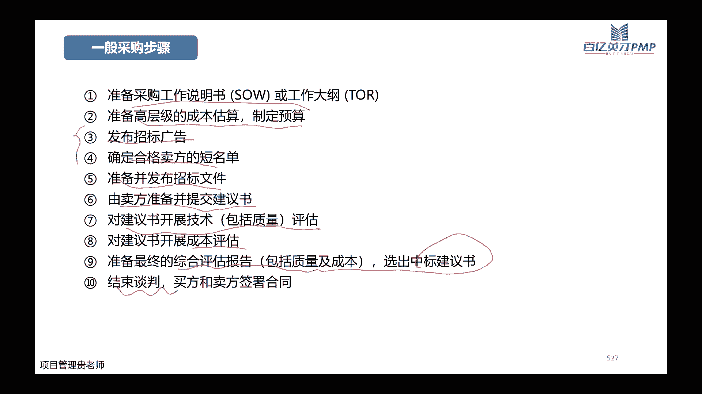

嗯它的全流程呢大家也可以自己去看一看哈，啊从我们的这个先做资质和外购分析，然后同意啊，这个同意采购，同意我们不要自制去外面采，OK来自学校供应商，然后审批筛选啊，过去啊。

排序当然是我们这个招标的这个过程当中，会有一些这个他的这个啊评选的一些标准，然后确定授权合同，执行合同啊，内部呢在核实他们根据合同交付的，可交付成果啊，然后呢看他们在交付，在验收啊，在合同收尾啊。

行政收尾的过程，资产资产过程资产更更新啊归档，然后呢再把它分发给相应的一些这个相关方。

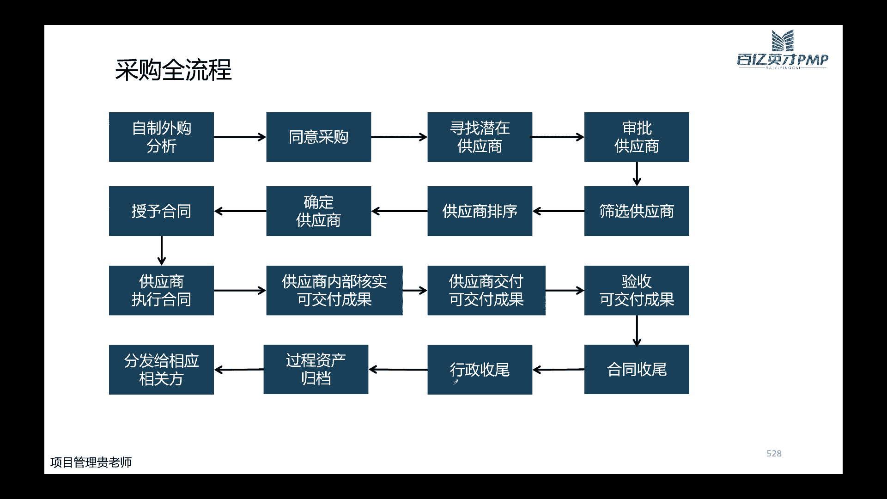

这是我们采购的全流程哈，然后这呢还有一个例题啊，例题呢是就是让我们根据不同的情形去选择啊，什么样的合同，这个题相当简单啊，这个题啊只要是前面的内容，听了这个题，闭着眼睛也能选出来，他是说啊。

你混凝土呢啊，通知你说材料要比预定的时间晚三个星期，那你现在要晚了呀，你就要更新你的经济计划，那这个时候呢问你，哪种合同类型承担的风险最小，那对于咱们而言，哪种风险承担的风险。

哪种合同承担的风险就小了啊，哪种哪种啊，就我们前面有个表哈，从总价类的啊，到成本类的啊，到公交类的风险对于我们来说啊，是不是越来越高的，所以哪种对象肯定是固定总价是最小的。

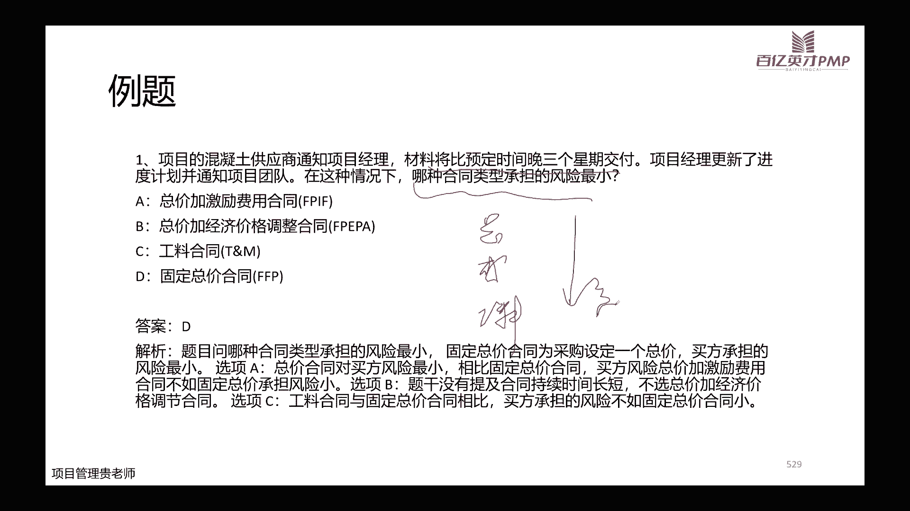

然后第二题呢他是说啊，现在用的是成本加激励费用合同，然后呢A是卖的啊，B是买的，也就是说B是甲方必要付钱哈，并付钱啊，你搞清楚，问你呢，现在是比目标的成本要大一些，也就是超支了，对不对。

那A公司得到的付款总数是什么呢，也就是说B应该付多少钱，对不对，那这个时候呢我们前面讲了啊，成本奖励，激励费用呢，它是用于报销你的一切的合法的实际成本，加上你的这个激励费用，对不对。

那激励费用怎么算的呢，激励费用你超之后是用你的目标费用，减去你超值之后自己，也就是说我们卖方要承担的那一部分，对不对，但现在我们看了所有的选项当中，它没有实际成本，它只有一个目标成本，那怎么算呢。

唉这是我们算的第二种公式哈，算总价，总付款的这个第二个公式是用我们的目标成本，用目标成本加上我们的目标费用啊，也就是说目标的这个成本，加上你目标本来给的利润，再加上啊我买方我应该负担的这个成本超支。

这个就是说啊，A公司一共要得到的这个付款的总数，这两个公式哈，这个公式啊，以及我们前面讲训练的时候，都是讲的是这个公式，大家选择哪一个都OK，但是实际上一般选择这种呢，就是它会更加的准确一点好。

第三题呢是说根据供方的选择标准，选择最合适的供方，这是属于什么阶段的工作呢，你都把供应商选出来，这肯定在实施采购啊，对不对，好长变更哈，因为在整个项目期间呢，它会发生很多很多的变更。

那我们要采取相应的一些这个流程啊，变更的流程谁来控制变更好，变更第一步怎么办，第二步怎么办啊，最后不同的级别的这个人或者组织或者部门，他对于变更的内容，他审批的权限是什么，好啊，并购控制流程啊。

重新确定代办事项列表的这个优先级啊，啊，这个，这句话主要是针对我们适应性项目来说的哈，因为适应性项目它一般它可能用的不是变更啊，他用的不是变更这个字眼，但它实际的这个内涵是一样的。

因为我们说了优先级它不断的在变，对不对，不断的在变，我们不断的重新排序啊，这个就是适应它的一种变化，那变更确定一些，重新确定一些项目的一些这个基准啊，这个都是我们说的这个变更哈，那在适应性项目当中呢。

唉他这也是因为工作一定会有所变化和调整，为什么呢，如果说没有变化和调整，那么就不会是用顺应景的项目了，对不对，所以，产品负责人会持续的对我们的PP2啊，PPL就是产品代表事项列表，对它的优先级进行排序。

排了之后呢，哎我们保证下次进入迭代的时候，是选择的是排在最前面，优先级比较高的那些事项在做，那对于预测性的项目呢，哎我们做的范围它会有范围基准，有监督基准，有成本基准，对不对，我们有三大基准啊。

那既然它是有基准，我们是尽可能的按照基准去控制，去管控我们的项目，但是如果说啊往往在实际的情况当中，会有一些不确定性的因素，会引起我们这些基准的这些变化啊，或者是它不影响基准。

但是呢它影响到我们具体的实施啊，这也是存在一种变化，那么这个时候就要走变更的程序，所以我们可以理解成预测性的项目，它是有严格的变更控制的啊，它是有严格的变更控制程序，并且呢这个既然它涉及到一个程序。

那他就不是说一个人啊，能够去完成独立的去完成这个变更的，他一定是有人提出啊，有人评估影响，有人去审批，那对于我们适应性项目呢，主要就是在产品负责人，他去评估优先级就OK。

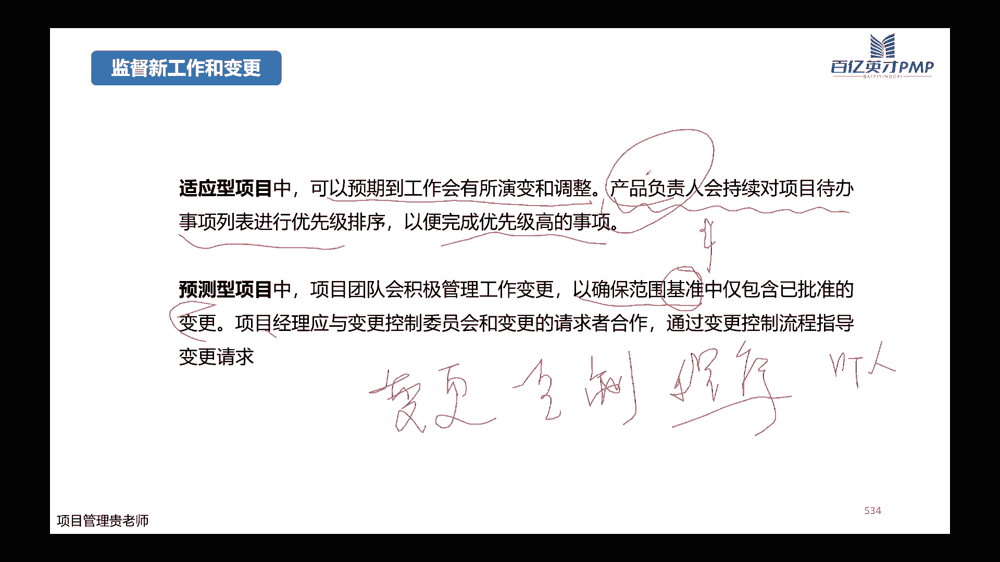

所以这是两者之间的区别，适应性的项目呢啊我们更关注的是客户满意，尽早交付和持续持续交付，所以呢你不断的变啊，哪怕是我马上要交了，你客户提出新的变化，我都是啊非常欣然的去接受的。

欣然接受这些面对和嗯这个变化，所以呢啊对于适应性来说，我们的这个变化没有，没有去那么严格的要求啊，我一定要有这个变革的程序啊，没有那么多的障碍，对于预测性的这个项目呢，哎我们就是项目经理。

你既然去管理整个项目嘛，那么变更如果说没有处理好的话，项目经理肯定是要承担最终的一个责任，并且呢在整个项目期间啊，任何时间啊，任何相关方，他都是有权利提出一个辩证请求的哈，他只要觉得这个项目跟他的预想。

或者说他有一些新的一些想法，他是有这个权利提交变更请求的啊，注意我是说的有权利提出变更请求哈，至于说批不批，那么我们后面还有程序变更呢，可以口头提出，但是呢所有的变更请求，都必须以书面的形式去记录。

并且呢啊纳入到我们的这个变更管理的，或者是配置管理的系统当中，在基准确定之前呢变更，那无序正式受困于啊，整个实施过程什么意思呢，就是说啊比如说我现在还在做计划啊，这个也是大家考试难度常踩的坑哈。

我现在正在做计划啊，但是呢这个时候突然有相关方发现，有一些新的问题要调整我们的计划，那这个时候要不要走变更请求呢，不用啊，因为我们还在做计划，还在规划阶段，基础还没有确定，所以在基准确定之前啊。

变更不需要走这个程序，对配置要素的任何变革呢，啊都需要提出变更请求，并经过这个正式的控制，就一旦进入到正式的实施啊，哪怕是我们配置里面的社工库里面的这些，你要变更，那么一定要提交一些变更的请求。

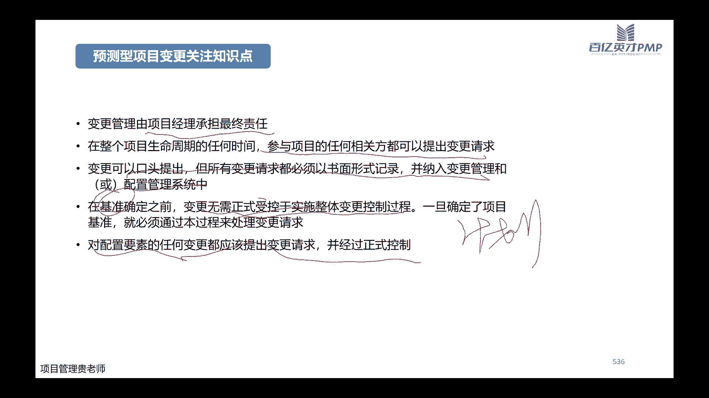

变更的请求啊，修改任何文件，修改可加入成果啊，修改基准啊，你只要是正式提出，都叫做变更哈，都是要求提交变更请求，变更请求里面呢，它又分了几种这个不同的这个嗯，这个来源应该说哈，那比如说第一种啊。

纠正措施，纠正措施呢是我为了让现在的工作绩效，跟我的管理计划一致啊，我要采取一些行动，采取一些计划，现在已经走偏了啊，进度已经超了啊，或者说这个成本已经超了，进度已经延迟了。

那这个时候呢我是因为延什么延迟呢，我识别到啊，这个延迟是因为有一些这个啊这个资源的评估，评估少了啊，导致于说这个进度的计划它本身是不合理的，我现在要把进度基准调一调啊。

那这个时候呢我要用一些这个纠正措施，那什么是预防措施呢，唉预防措施呢是为了确保你未来的这个工作，绩效是符合工作管理计划的，所以呢我要进行一些这个活动啊，这个叫预防措施，什么意思呢。

那比如说哎我们前面要讲啊，比如说发现进度超了，哎，我现在一找原因呢啊，发现啊原来是这个技能不太好啊，新来了两个人技能不太好，那我赶紧去加一些培训的一些动作啊，在里边那培训那些活动呢。

是为了避免我将来这个啊这个技巧啊，继续的进度，继续的去抄，对不对，我都我不仅培训啊，我同时呢还做一些这个赶工的计划，把时间追回来，那缺陷补救呢它主要是针对一些这个产品啊。

缺陷补救呢也是说哎我发现这些产品，或者说这个产品的某一些过程性的一些组件，一些部件他有一些需要返工的啊，或者他有一些质量不合格要求的，那这个时候呢我为了将来诶，他做成一个成品的时候，它能够满足质量标准。

那在这个过程当中啊，我做一些区间补救的一些动作，什么叫更新呢，更新是说哎，我真是受控的这些项目文件或者计划，那我做了变更请求之后，诶，我要对他做一些新的一些更新啊，更新之后呢，用新的这些来同步。

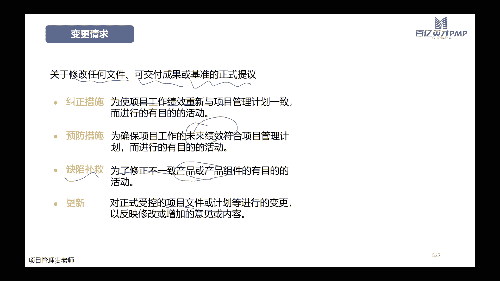

后面我给大家只是列了一些，纠正措施和预防措施哈，啊，当然这个也顺便把这个纠正他们那些区别，给大家列了一下哈，因为不少人在嗯就是做题不一定他会讲这两个，他会考大家这两个区别而已嗯。

他一般会给你具体的这些场景啊，这个选项当中他有可能会说啊，这是纠正措施还是预防措施啊什么的，所以我把这个不同点也跟大家去列了一下，纠正纠正措施呢，它主要是A已经发生了这个不合格。

那我去把它采取一些这个纠正的一些这个措施，然后呢来消除你产生这个不合格的这个原因啊，比如说我们刚刚说了进度的延期，我们发现是因为技能的不合格，那我现在技能的不合格呢，唉我现在去采取一些这个办法嗯。

把这个技能不合格，这个把它啊我做一些培训，然后这样的话让他的这个技巧在合格，再偏差偏回来，在追赶回来，这个是我做的纠正措施，那我预防措施呢它是针对于潜在的不合格啊，如果说按照我现在的这个。

我现在我发现了我我这两个人心来了，我不担心他的能力不太好啊，技能不太娴熟啊，所以呢我预判了未来，我担心它影响我的进度，那现在呢唉我消除产生不合格的这些这个原因，应该是消除，可能，可能产生不合格的原因哈。

因为他这还没有不合格，他只是说针对于潜在的不合格啊，所以他的要求应该是消除，可能才是不合格的医学原因啊，那比如说我现在发现技能不足诶，我觉得技能不足，他有可能会造成我进度的一些延期。

那我现在给他做一些培训啊，消除我可能才是一些不合格的一些原因，这个他两的区别哈，就是已经一个是已经发生了啊。

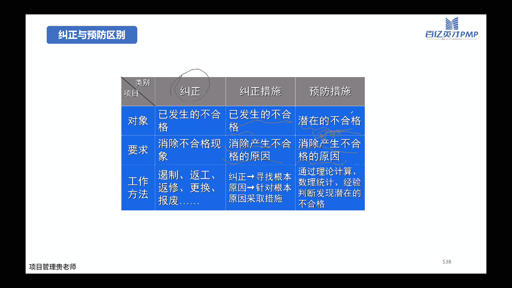

一个是他还没有发生，啊变更请求呢这有一些具体的一些事例哈，就是我们变更请求里面，它要标包含的一些核心的内容啊，比如说啊前面这个项目名称和准备日期肯定有，然后需要什么样的变更，变更是第几次。

有没有相应的编号啊，具体辨识要变范围，还是要编进度啊，还是要变具体的这个文档啊，有一些具体的这个描述，为什么要做这样的一个变更啊，做了这个变更之后，对效果本身对它的范围有什么影响啊，是增加还是减少。

还是修正了，对质量有什么影响啊，对本身这个文档有什么同样的一些这个影响，对进度啊，对成本啊，对需求啊，这后面都有一些这个详细的一些描述啊，同时呢还有一些这个嗯这个理由啊。

或者是我变革委员会我提交上去之后，由谁来签字啊，一般变革委员会是代表签字吗，还是说变革委员会的所有的权利成员啊，他是什么样的这个这个分管哪一块啊，什么角色，他要负责签字，签完了之后呢。

说明我这个变更他是被批准了。

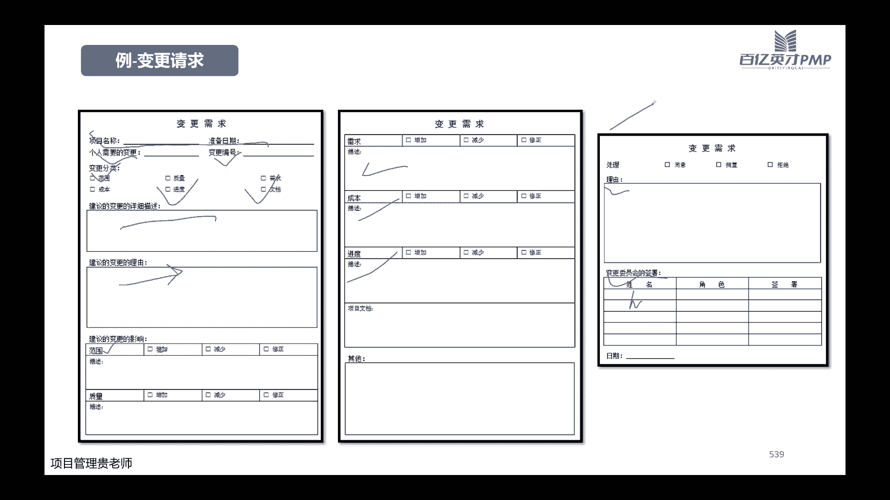

这里呢给大家画了一张，这个整体变更的控制的流程哈，这个流程呢嗯带着大家过一遍啊，大家看仔细了啊，因为考试很多的问题都会围绕这个流程来，首先呢啊是由变更的法，注意这是变更发起人哈，不是项目的发起人。

是变更发起人，我们前面讲了，在项目的任何时间，任何相关方他都有权利发起变更请求，对不对，变更发起人在这儿，他提出他的变更请求，口头或者书面的都OK，那不管它是口头的还是书面的，那对于我们项目经理。

项目团队而言，你要书面记录它的病根请求，记录之后呢，哎你要录入到变更的这个控制系统，让团队先了解团队内部，先评估一下这个变更啊，是不是有什么影响，是不是影响到基准，那如果说啊影响到基准。

那我们需要上报到这个，如果说他确实是需要变更啊，并且呢它影响到这个基准，那影响到基准呢，我们就要向这个CCB，CCB指的就是变更控制委员会，需要向CCB提交并的申请，提交变更申请之后呢。

啊到这儿变更控制委员会他可以选择接受啊，他也会有一个正式的啊真实的评估影响，啊前面我们团队是内部评估，这里呢是变更控制委员会，因为他站的层面更高啊，他考虑的问题更全面，他会有一个正式的评估啊。

他可以选择接受，他可以选择这个不接受，如果他批准，那么批准变更之后，哎我们对于项目团队而言，就要开始更新相应的啊管理计划，然后呢再通知我们的项目相关方，还说我们的这个呃有相应的一些变更啊。

大家按照新的这个变更来执行啊，我们来执行变更啊，并且呢做好变更的日志啊，根据这次变更把变更的一些内容啊，为什么要做这个变更，把它录入到我们的这个经验教训登记册，更新组织过程资产，然后结束，这个是他啊。

这个如果说他不不接受批准啊，这个cc b与评估说啊，这个变更影响太大了啊，要花更多的钱，现在呢整个组织从嗯从公司的层面来考虑啊，这个变更我们是没有办法接受的，那OK他不批准不批准呢，哎那我们也要记录哈。

注意这个变更日志，你批还是不批，我都要把它记录在变更日志里面，记录记录什么呢，记录啊是谁谁谁谁，因为什么，提出来一个什么样的类型的这个变更啊，这个变更呢基因CCB啊。

及我们的变更控制委员会认证的考虑评估啊，不予批准，然后呢不予批准，为什么不予批准，他也有一些经验教训，然后再更新组织过程，资产啊，都是这一套的，那OK我们这是讲的涉及基准，那如果说不涉及到基准呢。

不涉及到基准就直接不用到CCB了哈，如果说不涉及到基准，直接啊项目经理或者是由项目发起人，那批准就OK了啊，他批准，那么我们就按照批准之后的啊去更新管理计划，通知相关方在执行变更啊。

相应的做记录的这个变更好，如果说啊我们评估之后诶，你也可以选择不批准，那不批准的话，同样的啊，这应该有一个这个这应该有一个，他也应该是一个菱形哈，有一个不批准，那不批准呢，哎你也是到记录到变更日志啊。

编个日志里面记住什么呢，记录A我这一次的变更啊，不影响基准由啊，项目经理或者发起人来批啊，项目经理和发起人进评估之后呢，不予批准，也是记录在这里边儿，所以整个这个流程哈。

流程大家自己下去之后再把它过一遍哈，先提出请求，然后呢项目团队有一个内部的一个评估，第一项评估完了之后呢，诶评估是不是需要变更，当然如果说你直接从这评估就不需要变更啊，这你提的乌七八糟的瞎八唠，相互说。

那OK如果说不需要变更的话，那也是要记录到变更日志里边啊，更新组织过程资产如果说需要变更，那OK我有权利去自己啊，不影响基准，我就自己决定批还是不批，影响几种，我想CCB提到注意这里面的区别哈。

这个考试有很多人会犯迷糊，好变更控制系统和委员会呢，它变更系统就相当于是哎，我前面讲的这个基于变更的一切管理的话，它的这个程序啊，一个集合包括呢啊程序之外，包括我所需要什么样的一些文档。

后面他的变更如何去跟踪啊，如何有这个设计一些审批的这个层次啊，什么样的情况，有谁审批变更控制委员会呢，嗯他一般是由主要的相关方，正式的安排人员去参加，它里面有人说哈。

这个变更互助委员会会不会有项目经理呢，可以有啊，但是呢项目经理一般情况下他不会是啊，这个不会是主任，什么意思呢，他不会是CCB变更委员会的负责人，为什么呢，因为如果说这个项目经理他负责项目本身。

他也负责变更控制委员会本身的话，那么相当于你在变更的时候啊，你无论涉不涉及到基准，你只要项目经理说了算就OK对不对，所以就没必要设计不同的审批层次了，那这些变更控制委员会一般会包括谁呢。

啊一般啊如果是有客户的，可能会有客户在里边啊，可能会有项目的发起人在里边啊，也有可能会有这个啊这个项目，比如说质量的这个负责人呐，啊这个财务的负责人呢啊，有可能会有这些啊。

就包括这个pm空天猫项目办公室的这些，这个比较有经验的人啊，一般都是这些人在里边，然后变更日志，我们前面不断的提到所有的情况，所有的变更请求啊，他无论是，变还是不变啊，批还是不批啊。

通过CCB还是不通过CCB，他一定会经过这个流程之后，决策之后记录了变更日志里面的前面讲了，所以最后汇集都汇集在编的日志里面，那所以变的日志呢，它就是正式记录我啊，变更的这个过程和变更请求的。

这样的一个文档啊，比如说变更的编号啊，因为前面讲变更请求，它不是都有设计的编号吗，那么OK编号啊，这个是什么类型的变更啊，编个具体的描述啊，什么时候提交的啊，是否已经提交，提交给谁了，什么时候提交的。

然后他的状态是什么样的，他目前的这个状他是怎么去处理的，这是我们的变更日志里面，要记录的一些核心的一些要素和情况，那么变更控制工具呢，嗯首先这个变更控制哈它是嗯它有两种，一种是这个变更，一种是变更控制。

然后变更控制里面呢啊比较重要的，也有这个配置控制，好先讲变更控制，变更控制呢它分了五个大的步骤哈，这五个大的步骤呢，首先啊要从源头上面去识别变更啊，具体怎么说，马上来给大家讲，第二呢。

你要有一个正式的记录，辩证请求和提交辩证请求的这个过程，那既然你提交的请求，那你要评审啊，做出决定，批还是不批，不管批还是不批，那么你后面呢要跟踪我们变更执行的情况啊，如果说没有批。

那么就跟踪变更不批执行的情况，最后要总结经验教训，从源头上管理，变更呢嗯又分了两个大的方面可以去做工作哈，这个呢在实际的工作当中，我们经常不是说哎呀这个变更太多或者怎么样，很烦吗。

哎我们是有一些原著上面可以去做的一些工作，首先呢要主动应对，你可能会引发变更的各种因素，进而呢对这种因素去施加一些影响啊，以避免不必要的一些变更啊，什么意思呢，啊，比如说哎我们尽可能的。

比如说收集需求的时候啊，比如说我们收集需求的时候，唉我们就尽可能的给他安排多一点的时间啊，啊安排多一点的专业一点的人员，尽可能的把我们甲方，或者说呢把我们这个项目涉及到的相关方呢啊，都去调研一下。

我们前面不是讲过收集需求有很多种工具吗，啊还要学会正确的去理解需求，对不对，那OK如果说你的需求收集的比较好，尽可能详细，那么是不是意味着我们后面需求，至少需求和范围，这一层次的这个变更会尽可能的少。

对不对，所以啊啊还有啊就比如说这个成本的估算啊，成本的估算呢它也很难，但是呢如果说我们在做成本估算的时候，哎我们尽量的不要去评估，去猜测，我们尽量的找搜集更多的一些数据去佐证，佐证我们的这些估算依据。

那么是不是就意味着我们将来在做这个呃，成本基准的这个突破，成本基准的病人也会尽可能的去会少一些，对不对，那第二个方面呢，还是说要主动对导致人们规避控制，变更的这些因素施加影响。

防止人们有意无意的规避对变更的综合评审啊，这个是说的什么意思呢，前面我们这些是这个客观性的，啊后面这个是主观性的，要去从源头上面去管理，什么意思呢，好比如说我们现在这个项目啊，有一些这个进度上面的。

有一些这个延迟，那我们进度延迟了，是不是要啊尽量的去赶工，或者说这个，快速跟进，是不是前面讲过啊，我们可能做赶工或者快速跟进的这样的动作，来追一点进度回来，那对于项目团队成员而言的话。

你赶工是不是意味着还要加班啊，赶工一般情况下，虽然说我们说赶工还是这个投入更多的资源，但是企业呢它往往没有临时给你那么多的资源，给你投入，那怎么办呢，那就加时间呗，啊所以呢很大程度就变成了要加班啊。

要加要加时间，那对于这个项目团队成员而言，谁都不喜欢加班，对不对，所以呢好假如说我们在啊评估这个影响，在内部评估的时候啊，有一个这个就是关于对进度啊，或者呢有一个这个新的范围要影响这个进度啊。

要增加新的工作，那我们内部在评估这些影响的时候，项目团队就很有可能齐刷刷的，因为大家都不想加班啊，能不做就不做啊，所以大家是不是经常觉得诶，好像需求人员跟开发人员就是一个天敌，对不对。

需求人员老在提携一求，开发人员呢老是在加班，然后呢其中提到一些老师在变，对不对，老师给咱们排活儿进来，有一些这个天然敌对，那它是一样的哈，就是我们要主动的去规避一些这种因素，怎么去规避呢，怎么去规避呢。

啊就尽可能的啊，比如说我们范围啊要增加，所以呢进度有可能去延迟啊，有可能会做一些新的一些工作，或者现在我们进度已经延迟了，那我们对项目的一些危害是什么，尽可能的去跟我们的团队去啊。

阐述清楚它的利弊关系啊，让团队成员呢尽可能的去，客观的去看待这样的一些事情，第二个呢它是第二个步骤呢，是说要提出变更请求，提出变更请求呢，哎我们前面说了啊，你这个任何人他都是可以提变更请求的。

我们当然首先鼓励他们是以书面方式，为什么呢，因为啊无论它是以什么方式提出来，对于我们项目团队而言啊，啊项目经理而已啊，是不是你都要记录呀，那你既然要记录别人用书面的方式提出来，对你而言。

记录的工作是不是就减轻了很多，如果说别人有口头的话，我们还得再把口头的这个转速成好，书面的这种记录，但是特殊情况你有口头也行啊，你事后一定要有记录啊，有一定要有书面的记录，把它沉淀下来。

同时呢嗯提出变更的这些请求者，你既然要变更，你必须要清楚的说明你要变什么，为什么要变啊，变了之后呢，他可能会产生什么样的一些这个后果啊，好的影响是什么，不好的影响是什么，你用什么方式来实现这个变更好。

为什么要这样做呢，就是为什么一定要希望变更提请求，是他必须要说清楚这些东西呢，就是为了防止有些人，他随意的随随便便就提一些病跟那些请求，哪怕它只是一个项目文档，我们前面说了，项目文档在预测型的项目当中。

他要变更的话，他也是要走变革程序的，对不对，只不过说项目文档它不涉及到基准，他有可能不是不用提交到变更控制委员会那去，但是项目经理他也得决策它是变还是不变啊，啊就是为了防止有人提出来啊。

说我这个项目文档，我发现哪哪哪有一个方式挺好的，那个格式啊，看起来好像很好，你我们咱们就变成那种吧，对不对，那你就要说清楚为什么变啊，这个用什么变，我们用什么技术支撑人家用的什么系统，人家用的什么技术。

我没有什么系统，什么技术啊，有没有人去这个去跟踪这个方案去执行啊，说清楚，免得呢，大家想一出是一出，好第三个呢是说我们要评审变更的请求啊，任何的辩证请求都必须要提交给项目经理，项目经理审查后记录。

然后再由这些项目经理再往上去啊，提报啊，遵循我们的这个评审流程，不影响基准的变更呢，由他来批，影响基准的呢，他就没有权限了，他应该上报给变更控制委员会，紧急情况下哈，紧急情况下项目经理也可以先做啊。

但是做完之后呢也得走神秘的人选，这个叫做先斩后奏，先斩后奏，在紧急情况下，在特殊情况下，就是你来不及去给变更控制委员会，去走这样的程序了啊，客户那边非常着急要处理，那这个时候呢先斩后奏也是允许的哈。

所以有的时候呢，他也可能题目当中给你一种场景说啊，就是客户啊，这个已经非常非常生气了，那要求你怎么怎么样，那项目经理呢，嗯这个为了不得罪客户啊，为了这个啊，客户说你不这样，我就马上取消合同。

嗯那项目经理就先做了，那问你项目经理下一步应该怎么办呢，他既然已经先做了，那他下一步一定要是走边的程序，对不对啊，先斩后奏，这个程序的补起来，然后有一些变更呢，它是特别大的。

他不是说简简单单的给你增加范围啊，或者说呢这个修改你的质量标准，它是可能要提前终止这个项目，这种特别大的变更呢，一般情况下是由发起人来审批哈，因为我们说了，项目的章程是由发起人类偏偏批的。

所以涉及到项目做还是不做啊，整个这个取消还是终止，一般情况下是由发起人来审批啊，有人会问，那一般情况下是有不一般的情况，不一般情况下，那我们项目经理他肯定是没有权限的，他还是要上报给项目的控制委员会。

由控制委员会集体来决决策，然后第四个步骤呢是实施和跟踪，我们批准的变更，只有经过批准的变更，才能实施跟踪和考核，报告被批准之后呢，要及时的更新我们的项目文件和项目管理计划，为什么呢。

因为啊我们被批准之后，那么你要去同步我们的更新之后的项目文件和，更新之后的项目管理计划是什么，不然你不更新的话，那大家还是按照之前的管理计划，之前的项目文件在做他们的工作。

那咱们这个变更相当于是没有任何意义，对不对，那怎么样保证大家都按照我们更新之后的啊，变更之后的这些要求去做，去参与到我们项目当中去呢，啊，我们要及时的通知，会受到一些变更影响的相关方啊。

告诉他我们这个啊交付的这个日期啊已经变了，从6月21号变成了7月21号，你通知他啊，不通知他，他可能还是按照6月21号在做他的工作啊，同时呢要及时的付诸实施啊，并通过指导和管理项目的工作过程。

以及控制质量过程，来跟踪我们整个实施的情况啊，变更虽然说我们前面评估的影响哎，觉得综合情况他确实应该得变，但是我们变了之后，你在做，你还得跟踪它到底啊这个变更的方案，变更的这个实施。

它是不是达到了我们的理想的效果，对不对，好最后一步呢就是我们要总结经验教训，任何的变更完了之后呢，啊都要及时的去考察你变更的效率和效果，来总结一下经验教训，并且呢唉哪些变更它执行的效果不错，哪些变更呢。

哎还是没有执行到位啊，为什么没有执行到位，主要原因是什么，这些呢都是啊可以沉淀，成为我们的组织过程资产，我们看到前面讲了，除了变更控制，还有配置公式，配置控制，它的核心呢。

就是我要确定哪些是核心的技术参数，并且呢在以一定的这个程序啊，往往这个程序是比较严格的，这种要求来控制这些技术参数，确保会制配置的变更，它可控啊，并且在控啊，并且呢也可以追踪它呢也分了啊四个这个步骤。

这四个步骤呢，首先哎我们要识别并且记录它的，重要的这个功能，以及呢要实现这些功能所需要的，核心的技术参数是什么，同时呢，你既然确定了它的核心的技术参数是什么，那么我们要跟踪这些技术参数控制。

对这些技术参数的这个变更啊，有什么中途有什么变化啊，变化我们要把它记录情况，把它情况变更情况，把它记录好，然后第三步呢是按照我们啊约定好的啊，哪怕是你变更之后的，这也叫我们约定好的啊。

按照我们既定的这个参数来执行项目啊，并且呢他按照这个参数执行项目，它的实际情况是怎么样的，也得记录好啊，最后呢按照我们这些技术参数啊，这个产品做好了，做好了之后呢，我们还要去审计一下啊。

审查一下这个项目产品，它是不是按照我的所有的参数都已经达标了，并且呢按照我的参数来的话，它是不是能够发现发挥我们既定的这些功能啊，这个应该也好理解，配置控制一般软件里面都用的比较多啊。

比如说我们在写代码的时候，那么会有我们自己的这个开发库啊，也有这个数控库啊，也有这个发布的这个产品库，对不对。

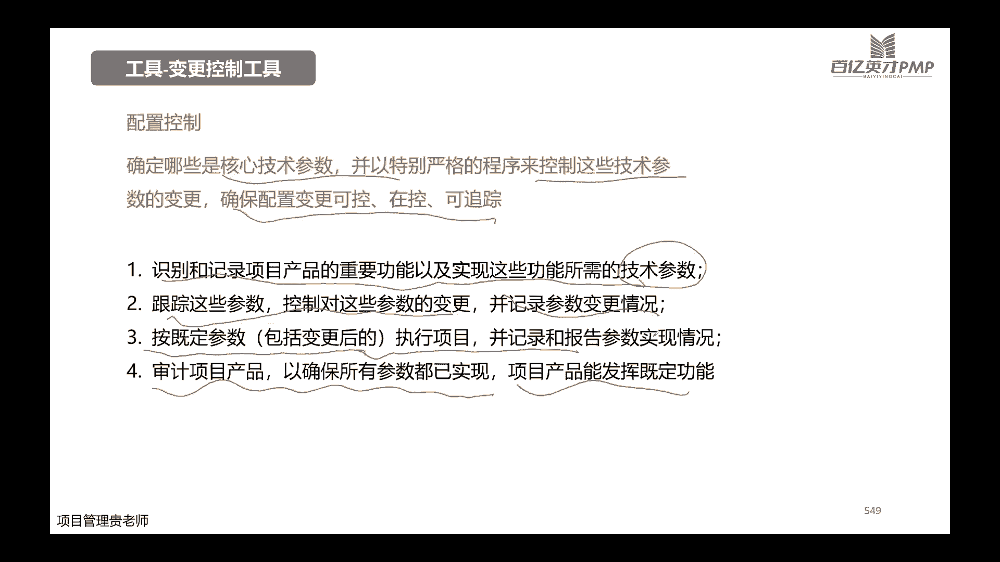

好这也有几个例题哈，这个例题呢第一题是说嗯，发起人希望删除一些需求来减少预算啊，你看在规划阶段，现在应该怎么做呢，啊应该签变钢气球还要切吗，签不签，他在规划阶段签不签不签哈，C呢是说要更新计划。

仅包含新的需求集，那包含新政局新的需求及之前，我们是不是要先确认它的这个发行的这个希望，它是不是合理的，对不对，所以应该是先做A哈，发起人说希望减少需求，少做点活就能少花点钱，那我们要跟相关方讨论的。

因为需求是来自于相关方的呀，对不对，还要确认一下这个范围，这样变行不行，如果说像刚刚觉得OK啊，行啊行，那我们就变就行了哈，D呢是说执行成本效益分析，以确定实际可以删除哪些需求，应该是先做了A哈。

先做能不能行，然后呢能行能能减范围，我们再减到底咱减哪些，所以先做了A然后再做点，嗯第二题呢是说在一次项目的会议期间，团队得知呢项目所需要的一台设备成本降低了，成本关系化以后批准现在怎么办呢。

相当于是成本的管理计划，他已经获批准了，然后你现在又知道啊，有设备的成本降低了，那么你是不是要更新啊，更新的这个成本基准，对不对啊，A是说继续执行项目而不通知，相当于你没有响应这个变化。

并到是说遵循变更管理计划，并要求变更控制委员会批准成本变更，你是不是首先要提请求啊，问的是项目经理对不对，你直接要求他批准吗，这个未免好像没有这么大的权利，对不对，未免有点太过了。

所以呢是更新变更管理计划，这个不需要更新变更管理计划哈，D呢是说将该成本降低的是已通知CCB，然后呢并且去执行项目，你这个时候啊你成本降低了，那么你肯定是要把这个事告诉，变更控制委员会啊，他说的通知哈。

其实跟严格来说，你应该是走一个这个变量请求啊，说我们这个现在成本有所降低，那现在我们要要求啊，或者说请求更新我们的成本基准啊，问CCB同不同意啊，CCB一般情况下这种肯定会同意啊。

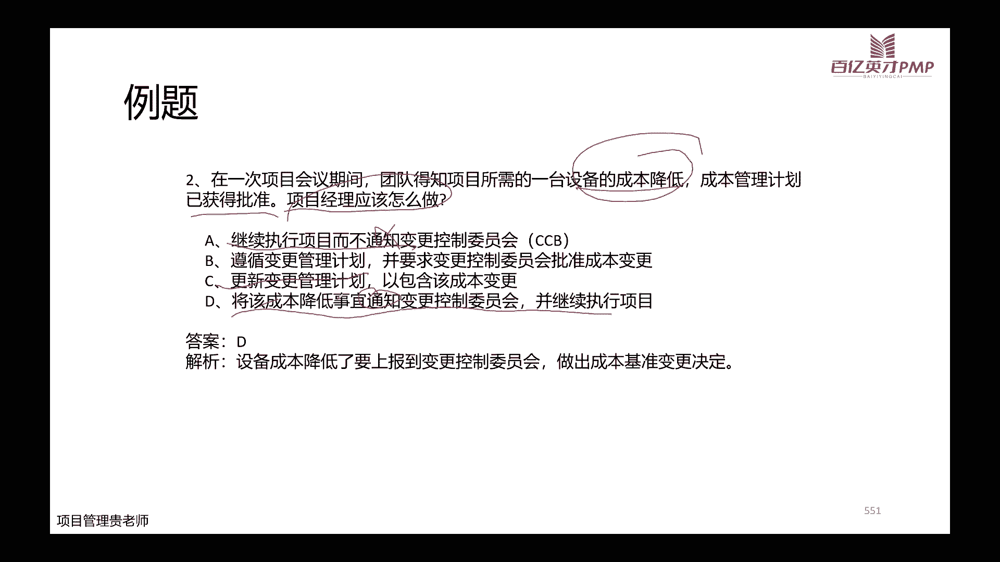

第三题呢是说不涉及项目约定哈，不涉及项目批准的变更，可以由项职能经理签订设计基准的啊，这个是应该是基准的话，写错了，设计基准的呢由CCB来修订，然后CCB每个月开一次会，负责供水项目的项目经理呢。

必须使用应急储备的授权并开始项目，什么意思，也就是说他比较好的这个事儿还比较紧急，对不对，那我们看一下哈，A是说获得管理层的授权，已更新成本基准，我们看一下它是要干什么。

它是要使用应急储备的授权并开展项目，对不对，我们前面讲过了使用应急储备，应急储备是符合，是包含在我们的项目预算之类的，对不对啊，在在成本基准之类的，我没有突破这个基准，我只是使用我的应急储备，对不对。

使用应急储备没有突破基准，我需要啊，设计基准采用cc b，这就是没有涉及到基准的突破，没有变更，我需要通知cc b吗，不需要，对不对啊，所以呢嗯这个获得管理层的授权，已更新成本基准，这个肯定是不对的。

B呢是相似CB提交的也不对，所以呢是说像企业相应的职能经理啊，批准对不对呢，对是不是，因为不涉及到基础的，可以由职能经理来签订，那我们就直接找职能经理，电脑是将问题升级上报啊，这个没有什么上报的。

这个已经约定好了，有相应的处理政策。

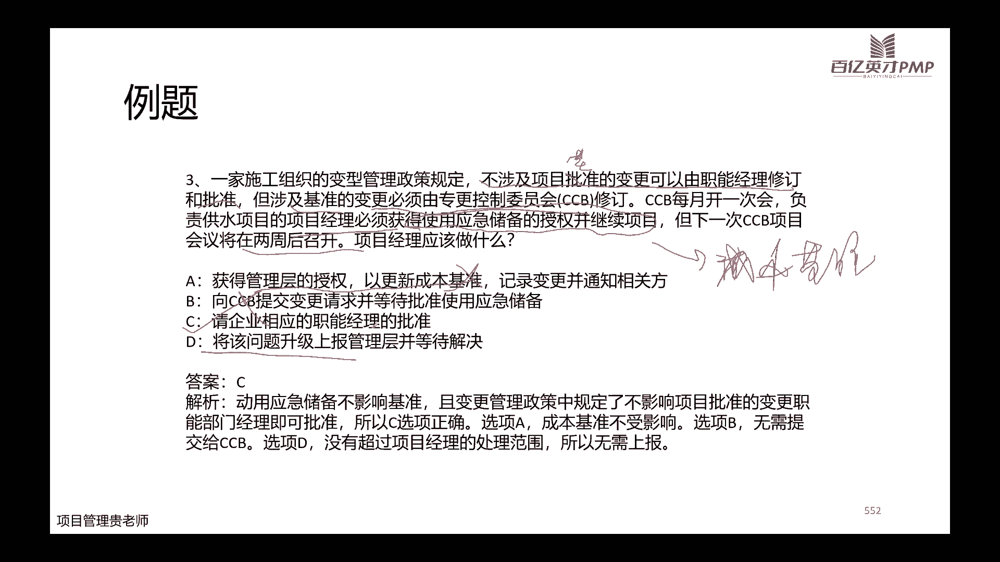

你还上报给谁呢，第四题呢是说这个项目经理的视图啊，给他建立第一个基线的时候，职能经理发出了一个变更请求，现在应该怎么做呢，啊A是说与该职能经理有关，与该职能经理和有关方面的讨论这个问题。

然后呢B是说立即拒绝啊，B肯定是不对，C呢说分析该变更请求对项目的影响啊，D呢是说申请正式的cc b的审批，还在建立第一个这样的一个机械，也就是说机械还没见，对不对，所以说这时候也不涉及到CCB。

那么A和C大家看起来好像A都还比较合适，那到底选哪个呢，啊A呢是说与该职能部门进行讨论啊，C呢是说分析该变量进球跟对项目的一些影响，我们是不是，首先职能经理他发了一个变量请求之后，对于我们而言。

项目经理他应该先分析一下影响，对不对，基于你分析的影响，你再去你决定变还是不变，你再去跟职能经理去讨论啊，会会会合适一点，所以呢先做C然后再做A会比较合适一点，第五题呢是说啊这个敏捷项目哈。

敏捷项目的组织的战略目标发生了变化，项目经理接下来应该怎么做呢，项目经理应该怎么做呢，啊，A是说A是说在准备一个用户故事，来处理这个变化，并把它分配给下一个迭代啊，项目经理他有这个权利吗，他没有。

对不对，这个要分啊，这个第一是由我们的这个产品负责人啊，由产品负责人基于这些变化好来列出新的用户，不是不是一个用户故事来列出新的啊，系列的用户故事，产品蛋白石项列表来支撑这个变化。

并且呢它是不是分一定到下一个迭代，那不一定哈，根据我们的优先级重新排B呢，是说向产品所有者报告，并取消即将来到的即将到来的这个迭代啊，这个产品所有者，他想表达的应该是我们的产品负责人PO哈啊。

也就是说项目经理跟PO说一说这个事儿，然后呢说你这个取消嗯，马上那个下个迭代就就就取消，就开始做这些，这也不是合适的办法哈，合适的办法也是跟我刚刚说的一样，要整体纳入我们PPL之后再排序。

C呢是说用战略上的改变来更新，优先更新风险优先级的blog，不是更新风险优先级的这个blog哈，D呢是说安排一次与团队的会议，来评估变化的影响啊，D肯定是对的，那你这个时候。

既然说组织层面的战略目标发生了变化，那对于敏捷的项目而言啊，这个时候也是先内部要评估一下啊，评估一下这些变化对我们接下来的这个工作啊，有什么样的一些影响，并且呢这个时候最好是拉上我们的PO。

拉上我们的产品负责人和团队一起开会，第六题呢是说在一次迭代的会议上面，团队同意对某种特性进行某些变更，来增加产品价值，但是呢这些变更要做额外的工作，影响进度怎么办呢，问你的是敏捷怎么办呢。

嗯A呢是说与产品负责人讨论，这些变更的影响啊，然后继续执行，A是不是就很好，因为我们说既然你要增加额外的工作，在我们的敏捷当中啊，额外的工作啊，这些肯定都是我们PO说了算，B呢是说包含尽可能多的变更啊。

敏捷团队领导是不是包含他得遵循PO的意见，C呢是说使用初始计划完成，你相当于没有，你没有响应这个没有响应这个变化，没有响应这个特性能够增值的，对不对，D呢是说形成一份新的项目的重新的估算啊。

这个也不是敏捷项目，没有什么重庆的这个估算啊，没有这个估算的，这个这个这个不知道他说要估算什么好，这是变更哈，嗯变更的例题讲的讲的有点多，是因为变更在考试当中占的比重也比较大，好我们项目工作绩效应呢。

还有最后一个知识点就是我们的知识管理啊，知识管理为什么他在工作绩效里面呢，其实我们知识管理，他应该贯彻在我们所有的绩效里面，因为所有的绩效率，他到最后他都会有相应的经验教训啊。

都会沉淀我们的组织过程资产，那这个时候呢都会涉及到我们的这个知识管理，知识管理呢其中有几个点有大家要注意的哈，就是说啊，我们知识它是分了显性的知识和隐性知识，显性的知识呢。

就是说A这是它可以显现出来的啊，比如说我们沉淀出来的这些项目的管理，计划的模板啊，或者像那些文档啊啊，或者是诶这个优化出来一些，比较好看的一些图片啊啊，或者是得出来的一些这个数字啊。

这是显而易见能够得到的就叫显性的知识，那隐性的知识呢，哎一般就是大家根据个人的经验一些见解啊，或者实践得出来的一些这个智能技能或者知识，那大家想想显性的知识显然很容易得到。

那隐性的知识相对而言就不太容易能够发觉，不太容易能够得到哈，所以我们做知识管理的核心啊，不仅仅要把显性的知识把它收集归纳好，更重要的是能够把团队以及我们相关方的，它们的隐性知识被挖掘出来。

并且呢能够以一种有形的方式，把它转化为显性的知识，能够沉淀，对不对，好比如说一些人际交往访谈工作啊，这个跟随啊啊这个讨论的研讨会呀，或者这就是鼓励大家来分享啊分享，并且呢这个分享的过程当中。

大家就能够把啊自己脑子里面的，那些还没有成文的那些东西，把他的思想把它表露出来，表露出来，我们就有办法去记录，对不对，你看像我们敏捷啊，迭代当中，每一个迭代最后都有一个回顾会，对不对。

这个回顾会它的最核心啊，就是我们要尽可能的去做好一。

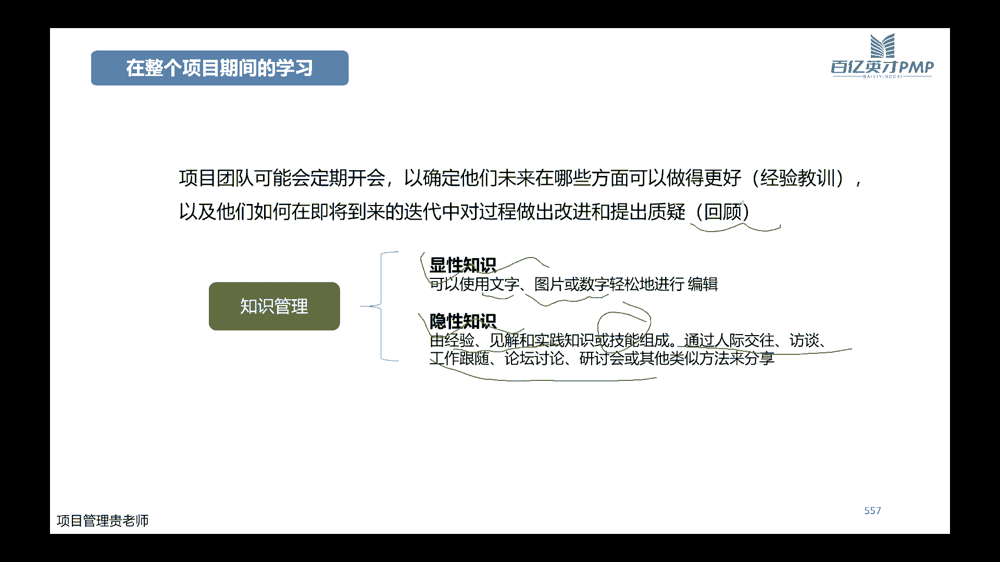

些知识的一些管理，啊显性知识和隐性知识呢，他们的这个定义和特点哈，嗯这儿呢给大家列了一个表啊，这个表呢帮助大家去区分，首先啊他们的定义刚刚已经说了，特点呢就是显性知识呢，它一般的就是嗯因为是看得见的。

但是看得见的，如果说缺乏一些具体的一些场景啊，比如说哎我觉得这个女孩很漂亮啊，那我如果说不说场景的话，那不同的人理解起来这个很漂亮，她的感觉她的理解就不一样，对不对，那女生看起来很漂亮啊。

就觉得诶她的脸蛋很干净啊，她的气质很好啊，男生看起来就是哎觉得她的身材非常不错，对不对啊，并且呢写信知识是可以去很好的去分享的，但是隐含这个隐性的知识呢，它是不太好编辑出来的啊，不太好编辑出来的。

一般就是通过我们啊组织，经常的这种交流的活动啊，能够让大家能够有互动啊，能够激发大家更多的去说。

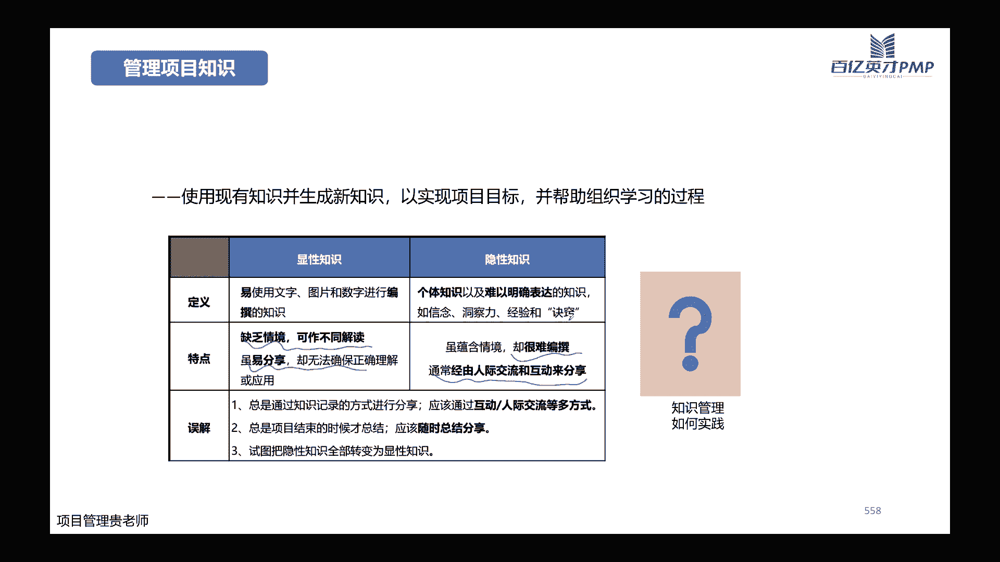

这里呢有一些具体的做知识管理，可以做的一些这个活动哈，这个活动呢是嗯大家在实际的工作啊，或者在我们的管理过程当中可以去尝试的啊，比如说啊我们做一些非正式，一些社交的一些活动啊。

或者是嗯就是因为线下成本比较高嘛，交流成本比较高，如果说成这个线下比较高的话，我们可以在线上啊，组织一些线上的一些腾讯的会议啊啊都OK，做这样的一些社交的一些活动，尽可能去多跟人家去交流啊。

多跟专家去去请教一些经验啊，同时呢我们有一些这个啊，现在各种类型的这种这个社区啊，或者是专业的社区啊，或者是一些新奇小组出的也比较多啊，经常参加一些会议啊，啊或者是这个有一些这个跟随性的一些指导啊。

或者一对一的这些辅导啊，私教啊，包括给顾老师本身的这个私教课呀，还有我们参加一些论坛呢，然后以及公司内部，经常组织一些知识分享的这个活动啊，茶话会呀啊，或者是我们在解决问题的时候。

有一些问题的解决会议呀，那么在这些不同的会议上面唉，我们其实也可以收获到不少的一些知识，并且呢去沉淀出来一些不少的知识，还包括我们听一些这个故事会啊啊啊，听这个激发一些这个创造力。

或者创意的这种这个技术啊，啊这个展会呀，插座呀或者交互式的一些培训啊，这其实都是我们在具体的工作当中，可以做好知识管理的一些具体的方式啊，所以我们前面讲了讲这个项目管理的啊，它的意义和价值的时候。

其中最后一条是一定要保证团队，他的持续的成长和过程的改进，对不对，那怎么样保证团队的成长和过程的改进呢。

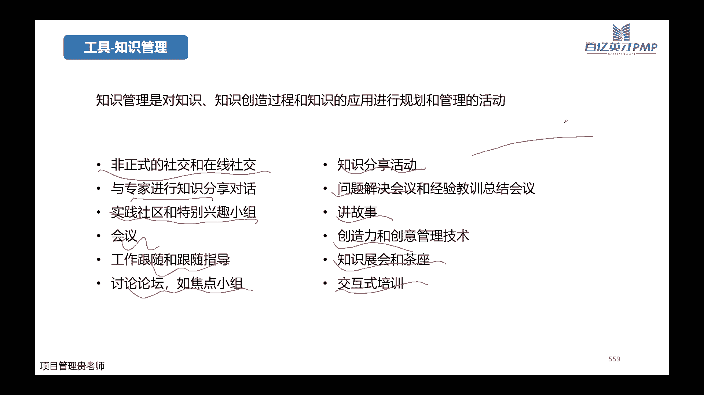

就是通过我们的知识管理哈，当然知识管理他他说起来比较容易，实际做起来呢他还是非常非常困难的哈，这个因为啊这取决于人性啊，一般人呢可能在公司里面啊，更愿意自己闷头去干，闷头去成长啊。

生怕教会了徒弟饿死师傅，对不对，同时呢嗯就算他没有这种担心，那对于知识分享而言的话，他也要花时间去准备啊，也要去无私的把自己东西把它弄出来，它需要花精力啊，所以花了精力呢，那如果说又没有很好的回报啊。

没有很好的一些激励，那很少有人愿意主动去做这样的一些事情哈，嗯这个例子呢是给大家举的，是我们之前做啊做咨询的一家公司，他的知识管理其实像做的相当好的，他做了一个这个系统，他做的这个系统呢。

它的这个知识语言啊，知识语言就是知识从哪来，有个人的知识啊，有组织的知识，还有一些外部的一些知识，个人的知识呢就包括了A有做什么工作，他的一些经验啊啊，或者是哪怕是你参加什么样的会啊。

跟什么样的类型的这个客户去交流，还有一些这个心得啊，对公司什么项目或者什么创意啊，有没有什么一些这个提案啊，组织呢是我们日常办公的一些业务交流啊，工作流程啊，还有项目实施啊。

啊这些有没有什么样的一些这个知识，或者一些这个模板啊，或者一些资产的一些沉淀好，他们老板呢就做了这样的一个系统，那么每一个啊这个员工都可以在这个系统上面，上传他的一些自有的一些知识。

那上传之后呢会有一些积分的奖励，这个积分的奖励呢，到最后的时候是可以以一种这个啊实体的这个，商品去做一些兑换的哈，这个积分兑换啊，相当于有一些具体的一些这个激励和回报，他们这个老板自己出去见了什么人。

这个有什么样的收获，每天都会更新在这个系统里边，所以他们的这个，他们整个这个团队文化氛围非常好啊，就是大家一般啊，就是因为嗯这个个人知识嘛，然后对于组织的日常办公呢这种啊。

比如说看到看到有什么地方的这个墙壁啊，有一点点的小的这个破损啊，就马上去这个上传，并且呢同步去跟相应的这个综合部啊，跟他们的这个行政部门去沟通啊，去提醒一下，所以整个这个嗯当然有一些好的一些建议啊。

比如说他们的是一个食堂啊，对这个饭菜有什么样的一些建议呀，大家都愿意去说啊，愿意去啊，分享他们在其他的这个公司看到的，食堂是怎么做的，这个需要长期的从上往下，老板有这个意识。

然后呢并且人家还有这个系统去支撑，需要从上往下嗯，统一这样的认知，才能够共同的把知识管理去把它做好，愿意在这方面花成本。

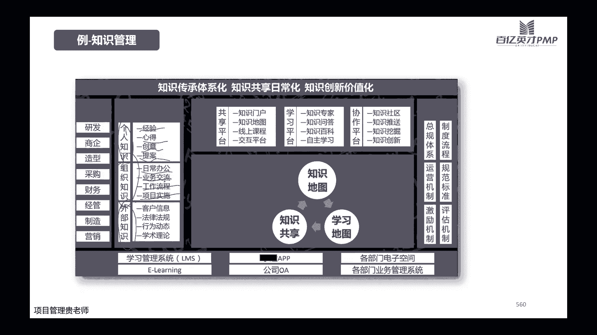

好还有一个工具呢，做知识管理的是我们这个信息管理哈，这般呢就是有成熟一点的项目管理体系，成熟一点的公司会有自己的项目管理的，新系统啊，用信息系统记录呢，其实是最好沉淀一些显性那些知识的啊。

因为信息系统里边，它相应的这个嗯项目的一些过程中的，一些数据啊，啊一些文件啊，一些格式啊，全部都在里边了，所以呢它显性的知识相当好沉淀的，那对于隐性的知识呢，这信息系统就没办法了啊。

除非我们像刚刚前面那个例子一样，那个老板一样自己开发一套啊，专门去挖掘大家显性知识的这个系统。

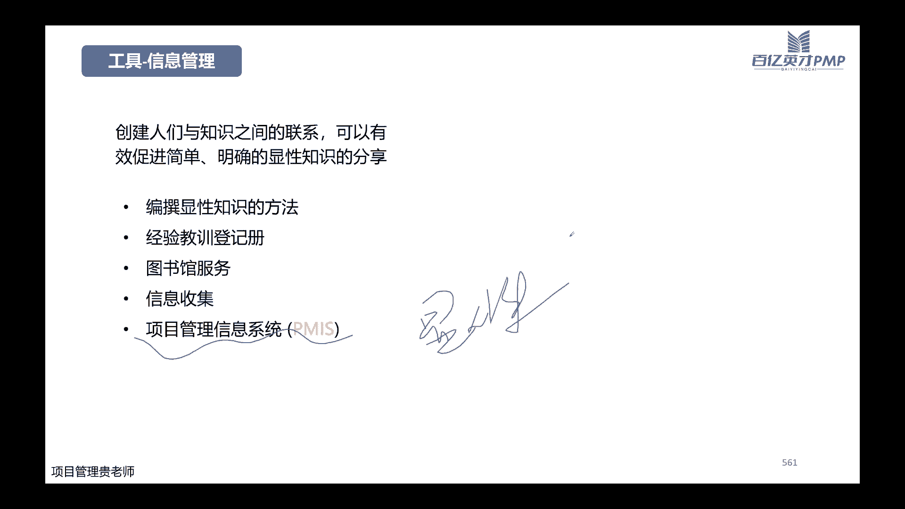

这也行哈，知识管理呢也有相应的一个例题哈，你看一下他是说这个项目落后进度了啊，并且没有存储项目的文件，那这个时候呢，新的项目经理认识到需要遵守法规，并且呢为将来的审计做好准备。

但是项目团队现在呢他只关心交付最终成果，也就是说嗯也就是说要项目团队只在干活啊，没有注重积累，没有注重存储，但这个新的项目经理呢啊，就是认识到必须要为将来的审计做好准备，那你没有过程资料。

你怎么接受审计呢，所以项目经理怎么解决这个冲突啊，A呢是说嗯，要求团队为将来的审计保留大量文档，他现在几乎没有存储，所以你现在直接去要求呢，可能这个工作比较难，B呢是说嗯与将使用该技术的人员开会啊。

没有使用该技术的文文员，可没有使用这个该基础的人员开会啊，这个这个这个选项跟题干的场景没有扣起来，C呢是说保留风险登记，社会问题日志和质量检测指标的文件，你保留哪些文件，你得看看我们的这个配置管理计划。

对不对，他约定了哪些文件是这个过程呢，是这个项目的过程必须要存储的啊，你要遵循一下我们的这个配置管理，有计划表约定，D呢是说咨询内部归档专家啊，以产品组织内的归档政策，并且将这些政策应用于各项目啊。

这个D呢就是相对于它，它比A直接直接就说啊，为江南时你保留大量文档，保留哪些文档你也不知道，D就是比较好，你先咨询一下内部归档专家，我们可以理解为如果你没有做配置管理计划，那么你就咨询一下内部的。

比如说一般的这个综合部啊，行政部啊或者档案部啊，来看看我们相应的这个项目，它的归档到底是怎么样子的，要要归哪些啊，怎么归啊，归的程序是什么，然后呢把这些政策应用到我们的项目当中来。

啊好了，今天晚上呢我们啊时间也差不多哈。

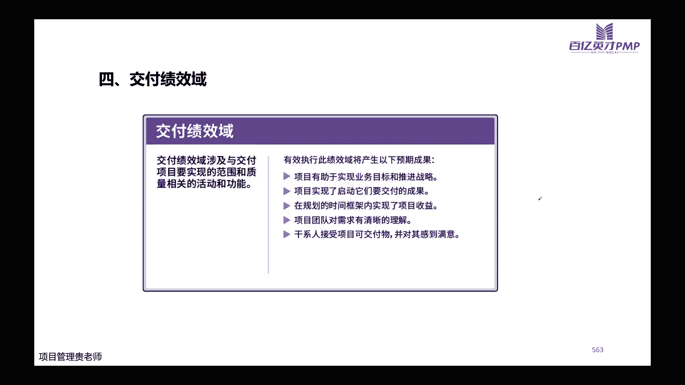

今天晚上把这个工作绩效率这一部分的，这个内容给大家讲完了哈，嗯还有几分钟的时间看大家有没有什么问题啊，啊看到了大家的评论区的问题哈，第二种豪赌第二种活动啊，张晓玲说第二种活动我也有点。

我没太明白你说的第二种是哪个了，因为我现在才统一的把大家的互动版调出来，然后刘玉峰说经验教训库长啥样，经验教训库呢，后面我给大家在那个交付的绩效域里边，有一个组织过程，资产它的分类哈。

经验交金库呢一般它有不同的分类啊，比如说我们啊有一些工作的一些模板呢啊，有一些工作沉淀下来的一些这个数据库呀，然后有一些这个啊沉淀下来，这些固定的这个流程程序啊，啊有我们过往的这些问题的日志的记录呀。

这些都是我们经验教训库里面的内容哈，所以他经验教训库它不是这个库长啥样，应该问经验教训库，它里面包含哪些东西，嗯张长林说应该不完全一样，我之前有的发现问题所处阶段，问题描述解决了根本问题，分析解决措施。

解决效关闭时间，你所在项目信息嗯，张巧玲，你说的应该是是变更的日志里面记录的东西吗，你说的是不是变更里面记录的这些东西，我感觉听你的描述问题发现时间所处阶段，问题描述解决人跟美云分析好像是问题日志的。

它的核心的内容，然后照会明问质量改进的工具有哪些，质量改进的工具，上节课讲过了我们的pd c的循环啊，然后这个六西格玛呀，这都是我们质量改进的一些这个循环的工具，然后具体质量控制的一些会有一些工具。

质量控制的一些工具呢，后面的时候会再跟大家再讲，前面讲质量管理的时候也讲过质量审计啊，是工具啊，然后我们的这个因果图啊，还跟大家说的鱼骨图啊，四川图啊，这些都是我们的质量的管理的工具。

李易峰说前面学的又忘了，前面学的又忘了，怎么办哈，前面学的又忘了，那么嗯第一呢通过你你得知道你忘了是什么，对不对，我们也说了，首先发现问题嘛，你得你得知道你忘了是什么，你才能够知道你再去回顾听什么啊。

重点补什么，那怎么知道你前面忘了是什么呢，可以通过做题的时候去回顾一下，检验一下自己的知识点，检验一下自己哪些已经掌握了，哪些没掌握没掌握的，在返回去再听一听，第二种好的，上面还有一个问题。

上面还有什么问题啊，哦那个张晓玲，我我翻一翻，你上面还有什么问题啊，你上面没有别的问题了，你两个问题我都我都我都回答了呀，一个问题两个问题，两个问题我都回答了呀，这个问题我也回答了呀。

你说你问的是这个几个招标文件之间的关系呀，这个我在讲的时候，应该讲完那几个招标文件，我就已经回答你了，信息的信息的邀请书，然后价格的邀请书，还有我们的这个建议的邀请书，他们本身文件之间啊。

各自侧重点是不一样的，所以你可以理解他们的文件本身没有关系，但是一般在使用的时候啊，比如说我们想了解他的这个信息邀请书，想了解记者的信息，那我们先用信息邀请书，然后最后呢。

如果说信息邀请说相关的信息已经了解到了，那我们确定合作了，那我们再用价格的邀请书啊，这个我应该我应该在中间，我很早就已经回答过你了，嗯这会明说项目结束时，需要更新的组织过程资产，包括经验教训登记车吗。

包括呀，当然包括呀，而且不仅仅是项目结束的时候，更新组织过程资产哈，在我们啊整个项目的这个生命阶段，生命周期啊，哪怕是你做规划，哪怕是你做执行啊，做监控都OK，在任何一个过程。

如果说你有新的经验教训出来，那么你更新的经验教训登记册里面，这个经验教训登记册，它就是包含在你的组织过程资产里边儿的，好的，估计高铁上信号不好，没听到，没关系，看看大家还有没有什么问题，没有问题了。

敲一是代表没有问题了啊，今天我看到苏苏老师说，我们8月份考试的时间确定了，应该是8月19号，好像是好像是8月19号吧，大家好像要提前准备报名，英文报名和中文报名应该都要做，具体的可以问一下苏苏老师。

报名的时间应该会有要求好吧，如果今天晚上课程没有什么问题的话，我们今天晚上就先结束了。

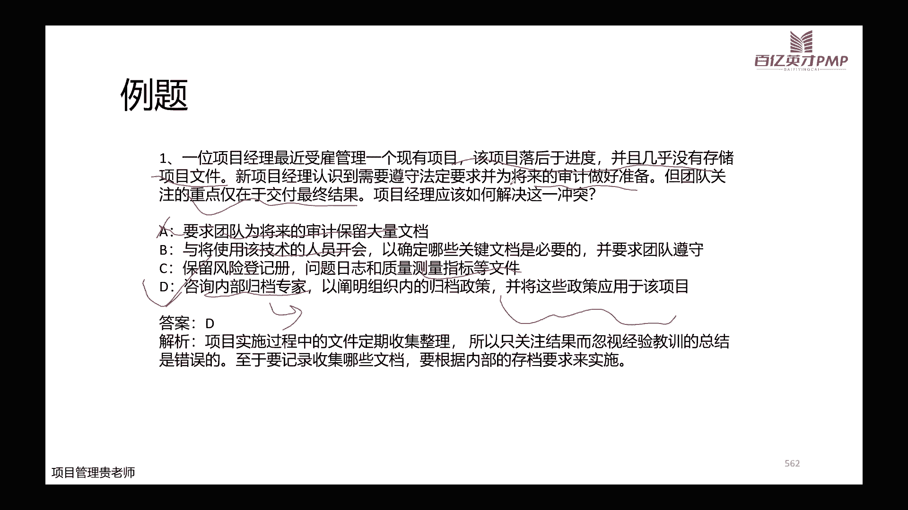