# PMP考试培训课程最新完整版项目管理认证第七版教材新版考纲自学教程 - P12：12.交付绩效域(一） - PMP专家 - BV1rM4y1Y79x

四，可以了可以了，我就给拜拜，你说的什么呀，根本不够的，等你有钱了，就是一堆啊，好各位同学啊，已经进入到直播间，能够看到课件，听到声音的，帮我在评论区敲个111哈，对啊。

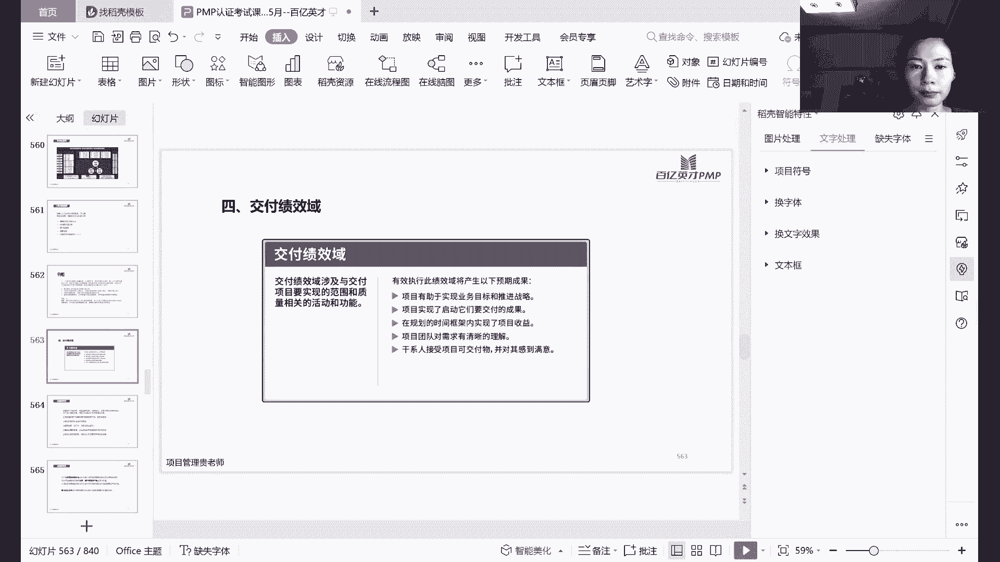

真的吗，我不知道什么。

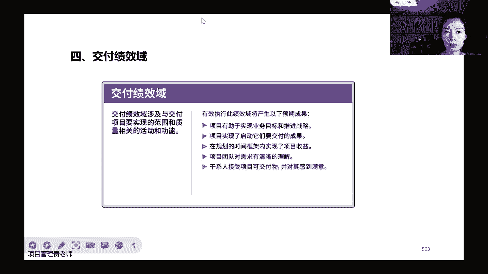

嗯好的收到谢谢，07：30了哈，我们准时开始今天晚上的呃授课，今天晚上呢我们要开始换一个绩效率了，要开始讲交付的绩效率哈，大家可以在上课之前呢，先回顾一下咱们嗯之前讲过的规划。

绩效与和工作绩效与重点设计的内容是哪些，嗯如果说呃这个手敲字敲的比较快的，可以在我们评论区去敲一下哈，敲一下咱们的这个呃，工作绩效与主要重点包含的内容是啥，大家如果说有敲的一边敲。

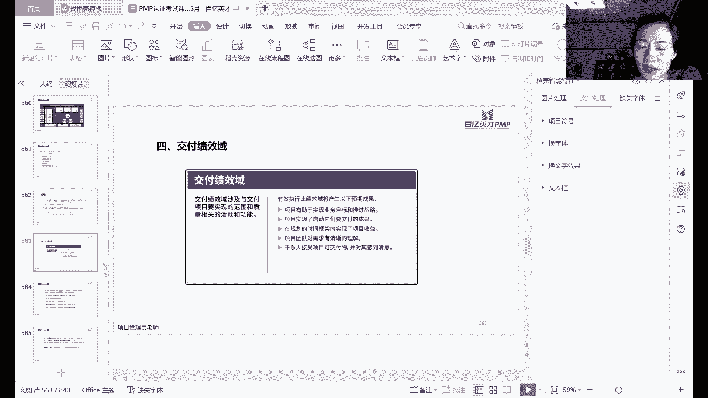

然后我也一边带着大家一块来回顾哈，啊我们之前在讲工作，绩效率的时候啊，重点讲了，我们既然是有规划，那么规划完了之后肯定有执行的这个动作，对不对，执行的动作是在我们的工作绩效域里边儿，去体现的。

那既然有啊这个工作的动作，它就有绩效，就会有绩效体现，对不对啊，还会出现各种各样的一些问题，同时呢啊还要获取一些资源啊，涉及到采购，采购里面的一重点，签订合同，worm的核心，同时呢啊还会有源源不断的。

或者比较多的一些变更啊，我们讲的变更的流程场景，同时呢唉我们还要引导，相关方，或者是团队哈，啊引导他们多多的参与其中呢，重点的就是包括了我们啊沟通应该怎么去做，是不是再回想的同学啊，再回想的学。

而我们啊这个顺着老师对的思路是不是这样的，这样子的啊，从绩效如何体现啊，如果绩效不好，那是有什么问题啊，出现了这些问题，我们是不是需要去变更，那在这个过程当中呢，我们怎么样去按照我们规划的。

把我们的资源弄到位啊，让我们资源尽可能都参与到我们的项目当中来，啊，涉及到采购，同时呢我们在整个沟通的过程当中，遵循什么样的原则，怎么样让我们的团队啊，让我们的相关方，都能够专注于我们的项目目标上面。

是不是嗯如果说尽情的简单的这样回顾之后呢，哎大家开始进入今天晚上的正题哈，今天晚上我们讲的呢是咱们的啊，第七版教材里边儿啊，非常重要的八大技效益之中的交付绩效应，交付期教育呢。

唉它主要是涉及到跟交付相关的这些范围，还有质量跟他有关的一些词过程啊，具体活动或者是一些功能哈，所以它聚焦的是确认范围好，控制质量，这样的一个这个两个大的这个领域的事情，那么交付绩效育。

我们是希望通过这个教育，能够关注到哪些内容哈，首先有助于实现业务目标和推进的战略啊，这个很好理解，对不对，因为我们说了，做任何一个项目，它一定是有它的价值，一定是有他的目标的。

那OK我们既然这个既然在讲交付，那么围绕着这个价值和围绕着项目的目标啊，我们能不能达到我们预期的这种效果，能不能啊收到我们想要的一些成果，能不能在合适的这些项目的框架之内啊，不仅仅他说的是时间框架。

其实不仅仅是时间框架哈，好在我们的成本框架，时间框架之内能够实现我们项目啊，按照我们的这个收益计划实现它的收益，并且呢在交付的过程当中，我们也能够验证所有参与的这些项目团队成员，对我们的需求的响应。

对我们范围的啊，这些工作内容，是不是达到了一个清晰的一个认知啊，什么意思呢，因为很有可能我们做的时候，和我们最后教的东西他完全是不太一样的，或者有一点偏差啊，所以交付的过程当中，我们要重点去评估一下。

我们团队对我们最开始约定的这个需求，和由需求衍生出来的一些工作内容，是不是真正的做到位啊，执行是不是一致，同时呢哎既然是交付交给谁呀，交给我们的客户呀，交给我们的相关方啊。

这个干系人他是不是接受我们给他教的，这个可交付成果，接受了之后，他的满意度是高还是不高啊，就决定了将来还有没有继续合作，这些项目的机会，这些是我们在交付绩效里面要重点关注的哈。

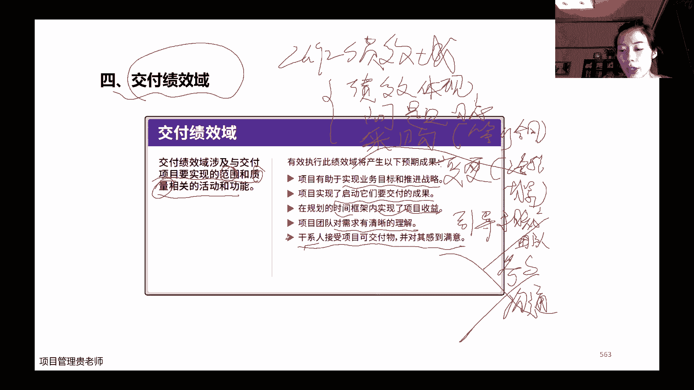

那既然提到了，我们说基本教材里面说，项目的定义是要围绕产生它的这个商业价值来，然后呢也带大家再复习一遍哈，我们当时讲的时候，项目它是一定要创造价值，但是呢价值呢它这个词儿哈，价值这个词它的范围很广很泛。

那我们怎么样去把价值给他做一些定义，或者说给他做一些归类呢，嗯教材改动当中给他列了，给大家列了几个嗯常见的这种场景哈，首先第一个场景呢啊，这个是之前课堂上讲过的啊，再带大家复习一遍。

第一个场景呢就是严格按照我们啊，PBPMBOK的这个600的定义，是说，项目要最终围绕我们的产品服务或者成果啊，或者这个结果要交付这些东西，那OK这是一类啊非常常见的啊，以预测以预测型项目为主的。

这种项目类型啊是我要有有形的东西啊，或者我要有解决方案或者服务的水平，我要出来，这个是我们做的一类的项目，它是产生价值的，或者是呢，我这个项目呢我能够给咱们这个社会啊，或者给一些这个环境做出一些贡献啊。

比如说常见的一些政府项目呀，把公益项目啊，这些项目啊，这项目它不一定是啊能够为他的这个假发，或者我能够为一些公众去提供一些产品出来，但是呢他做了这些项目之后啊，有一些这个民生工程啊，非常好。

能够给我们的生活，给我们的环境带来一些积极的一些影响，这个也是说这个项目是非常有价值的，当然这一类项目大部分的这个资金来源啊，可能是有一些这个政府里面的资金，第三类呢是能够提高效率生产力啊。

或者是响应的me的一些项目，那这些项目呢一般一起嗯，企业或者是一些机构科研院所都OK，我们把它叫组织应该更加的合理一点，企业或者组织内部，那为了提升组织类的集体的这个生产效率，降本增效啊。

啊上一些这个智能化的这些系统啊，诶他这也是他没有产品出来，对不对，但是呢，它能够提升我们的整个这个生长的效率啊，我们响应的速度更快了，那么这个也是说我们这个项目给企业，给组织类创造了一些价值。

那么第四呢是A，我为了能够让我们这个组织目前的这种状态啊，能够有一些改善，哪怕这个改善很小，但是呢我围绕这些改善组织的一些啊，这个小型的这个项目或者是大型的项目，也都OK啊，我们做了一些变革。

前面也跟大家讲过变革的一些模型哈，变更的模型应该都还记得吧，不记得自己下去之后再听听回放哈，那我做的一些变革啊，做的一些转型，做了一些升级的这些项目啊，这个也叫做我创造的价值，然后还有一类比较常见的。

就是虽然说按照目前啊，按照目前的这些规划，我这些项目做了之后呢，并没有带来新增的一些收益，但是呢在一些环境比较艰苦啊，就像就像疫情，或者就像经营这个整体的营商环境啊，整体的这个社会环境。

经济环境不是特别好的这种大背景趋势下嗯，企业呢还是能够维持在疫情之前的，这种收益的水平啊，至少能够保证大家这个不降工资啊，不裁员，那这个呢为了不降工资，不裁员，保证之前的收益。

我们做了一些抵抗风险的一些动作，一些项目啊，维持以前的这些，这个呢也叫做我们做了项目，是实现了它的一些价值哈，嗯这个是相当于是大家带大家回顾了一下，我们价值所谓的这个价值。

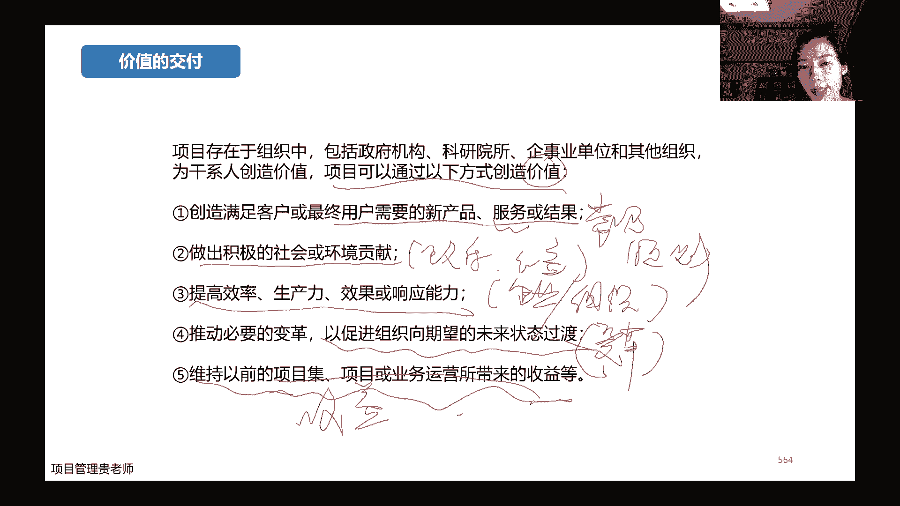

它的背后到底有哪些类型的一些项目哈，那既然提到价值的交付的话，唉我们也提到了讲开发方法和生命周期的时候，那讲那个呃绩效益的时候也跟大家讲过，那不同的可交付成果，他的交付的方式。

就决定了我们合适采用什么样的开发方法啊，什么样的开发方法就对应着什么样的生命周期，是不是再带大家回顾一下哈，一般呢我们假如说这个项目，它是一次性的交付啊，我统一的来验收，那么通常对应的它是预测性的。

也叫做传统，或者瀑布，新的这种项目，那这种项目呢它一般对应的生命周期，就是我们预测性的生命周期，那还有我们讲过啊，它是需要这个多次的交付啊，多次的交付呢，它就有可能涉及到我们使用的增量。

或者是迭代的开发方法，当然它对应的生命周期啊，就是我们增量型的或者是迭代型的生命周期，那如果说啊它是持续性的交付，持续的交付也是跟大家讲过，也是多次交付的一种类型啊。

只不过它的交付的频率啊是比较有规律性的，那么它既有增量的特征，又有迭代特征，哎我们把它叫做敏捷的开发方法，对应的是我们的这个敏捷的生命周期啊，我们在新的教材里面，把它叫做适应性的这种项目啊。

这个是带大家回顾了一下哈，那么我们在项目期间呢要向哪些人啊，前面是讲的是通过什么样的开发方法去交付，去实现我们的这些可交付物，那第二点呢，他讲的是我们这些可交付成果出来之后啊，交付价值是向谁交付价值呢。

像我们的发起人啊，项目的发起人交付价值，因为发起人他是发起这个项目的，那谁是发起人呢，啊一般情况下我们啊由业务涉及到的业务方，客户啊，或者是我们组织内部的这些项目啊，是由这个啊某某分管的这个领导啊。

或者是呢为了提高人力资源的绩效，就是人力资源部来提升的啊，或者是我们这个呃数字化的，信息化的这一部门提出来的项目需求，那OK他们也就是我们的这个发起人，是给他们交付这些价值，同时呢交付之后啊。

肯定是在这个要初步的部署，尤其是我们这些软件项目哈，软件项目它一定是要部署，部署之后它才会产生一些价值，当然如果说你是一些食物的一些产品，那样的产品，可能就是产品在使用的过程当中产生它的价值。

那这些价值怎么去给它做一定的量化呢，啊我们前面也讲过，在任何一个项目开始之前，会有商业论证的这个过程，商业论证的过程呢，它简单的理解就是告诉我们，这个项目到底值不值得做啊，值不值得做呢。

体现在我们的商业文件里边，一般情况下是我们的这个嗯可行性，研究报告和我们的，效益管理计划，啊一般情况下这两个文件，那么这两个文件呢，哎就会对我们整个项目有一个预估的，它的一个收益可行性。

研究报告里面又分了他的啊，这个财务是不是可行，什么意思，就是说我们从这个资金投入方面啊，是不是呃能够有相应的资金去匹配我们的项目，那又涉及到我们的技术可行性，这个项目挺好的啊，有它的背景和必要性。

但是呢技术方面咱们达不达标啊，有没有这个实力去做，同时呢组织的可行性啊，我们整个公司的这些架构啊，这些人员资源的匹配嗯，够不够能不能支撑，有没有这个能力啊等等，还有其他的一些方面。

这是我们可行性研究报告里面要去论证的，那么教育管理计划呢是我论证了这个项目，它是能够实现这些效益之后，那我效益到底怎么去实现呢，哎比如说我一个一年期的这种项目，啊我可能前前八个月吧。

前八个月都是它的这个核心的这个研发期，那我研发期的时候，我实现的效益我没有办法以资金的形式体现，对不对，那我可能以他的是不是出来一些知识产权，啊我是不是能够以知识产权的形式去体现。

我这个项目的它的一个效益，那我从第12个月啊，第十个月开始交付啊，12月开始这个部署啊，客户开始回款的时候，我是不是资金就开始他的这个回报啊，就开始有体现了，所以说效益管理计划呢，啊。

它简单理解是相当于我这个实现已经论证，可以实现的效益到底怎么实现的一个计划哈。

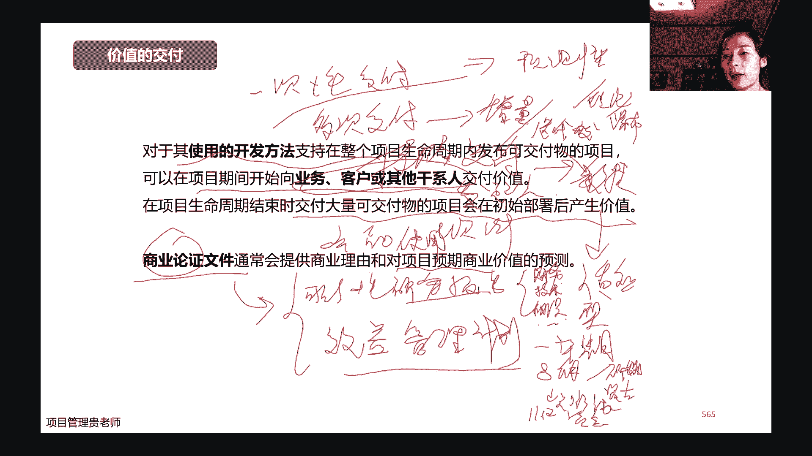

嗯针对主要相关方是我们要讲啊，在实现这个交付的过程当中啊，我们要首先要明确，我们的这个价值是针对于什么相关方啊，比如说你针对于这个客户啊，你做啊，你因为客户的一个合同的订单啊，要做一个这个软件的项目。

人家开发的一个项目，那么你对于客户而言，你交付的价值是什么呢，你交付的价值首先是这个软件诶，部署之后，它能够啊能够使用功能需求都非常的好啊，达到了他们的一些要求，使用的时候呢稳定性还比较好，对不对。

这是基本的要求啊，那对于我们这是客户相关方，那我们说了呀，跟我们这个项目相关的，他都是我们的相关方，对不对，所以相关方除了客户，还有别人啊，有谁呢，比如说这个软件哈，他有一些啊相应的一些监管的部门。

这一类相关方来说的话，那他关心的是什么呢，他关心的是你这个软件啊，是不是实现了你们客户的功能需求吗，啊是不是你们客户在使用的时候非常稳定啊，他关心这个吗，他不关心，他关心的是你们哎。

比如说这个软件啊有没有备案的啊，程序上面是不是合规呀，他关心的是这些，对不对，那再换一个，假如说这个相关方哎是我们内部的啊，比如说是这个分管的领导啊，这个，他关心什么呢，有人说他也很关心客户的反映。

客户的满意度对他是很关心客户的满意度，但是站在您那的角度，他更关心什么呢，他更关心你啊，回款没有啊，啊这个业务的业绩啊，有没有实质的提升啊，啊团队有没有进步呀，对不对，所以我们在讲一个项目在交付的时候。

它的价值是多维度的，这些维度取决于谁呢，是我们要根据相关方来，不同的相关方关心的点是不一样的啊，这个是第一个是针对人，那第二个呢哎我们还要约定好这个时间，准确来说应该是时间段哈，什么意思呢。

啊我们说价值的体现，它并不是说这个项目做完了啊，就没有价值了，或者说这个项目做只有在交付的那一刻，他才产生价值，前面没有交付的时候没有价值，或者交付之后呢也没有价值，不是这个意思，为什么呢。

因为很多项目啊，它往往都是在项目的运营过程当中，啊产生一些收益，对不对，他在运营过程当中产生收益，但是我们讲啊项目是项目，运营是运营，虽然说运营跟项目都非常的对，组织来说都非常的重要，都是我们交质。

都是我们价值的交付啊，这个链条当中的环节啊，但是呢啊从理论上面来讲，项目是有一个这个交付的一个节点啊，交付之后才转向运营，那既然如此的话，那项目的价值一般情况下哈大，甚至大多数情况下。

都是在运营的过程当中才会产生的它的价值，那我们去评估这个项目的价值的时候，到底是怎么取舍时间段呢，啊我们是比如说这个项目还研发周期一年啊，运营的时候啊，我预估这个产品由于市场的一些这个迭代啊。

一些啊这个啊新的一些需求点啊，我预计它运营的这个高峰期啊，可能是在两年啊，两年之后呢可能要这个产品啊，他可能要进入一个这个衰退期，那么我现在评估这个项目价值的时候，我是以第一年啊。

以第一年为时间段去评估它的价值呢，还是说我是以后面两年呢，还是说我整个哎我把它拉通，比如说拉通了10年，我来评估它的价值呢，啊这个是根据每个项目它的特点，我们既然如果说要评估它的价值啊，要去测量的话。

那么就要把测量的这个时间段去把它约定好啊，这个是时间段，然后第三个呢是量化，虽然说我们项目的价值是很虚的一个概念哈，但是呢我们要尽可能的，尽可能的去给他做量化啊，一定程度的量化百分之百啊。

有可能比较困难，但是呢我们不能说因为价值比较虚啊，所以说我咱们做这个项目吧，反正这个项目肯定是做得好啊，这个好哪里好，怎么好啊，有收益大概是多少收益啊，如果说对我们的这个价值，对我们的效率有提升。

那么效率的提升是有没有一些数据的一些指标，反映出来啊，劳动生产率有没有提高啊，这个呃资源的浪费率，资源的利用率啊，这个资产的周转率这些东西，有没有具体的财务诉讼的一些支撑。

这个是要求我们在做价值交付的时候，尽可能去做量化的哈，这有一些具体的动作，比如说我们在做商业论证的时候，不管是对价值啊，还是对这个项目的基本框架，都会有一些高层次的描述，对不对。

这个之前讲少于认真的时候讲过，同时呢唉我们在效益管理计划的时候，也会对我们的这个价值如何去实现啊，整个这个它的实现的这个计划管理计划是如何，同时呢它以实现的这个回报啊，或者说其他的这个不以货币为体现的。

其他的一些价值，在我们的章程里面也会有一些简单的一些匿名，甚至呢有一些它还会体现在我们的这个，项目管理计划当中啊，所以从商业论证到效益管理计划，到章程到我们的项目管理计划，在这个过程当中啊。

我们的这些效益也好，价值也好，它是逐步量化的一个过程啊，这是原则性的东西哈。

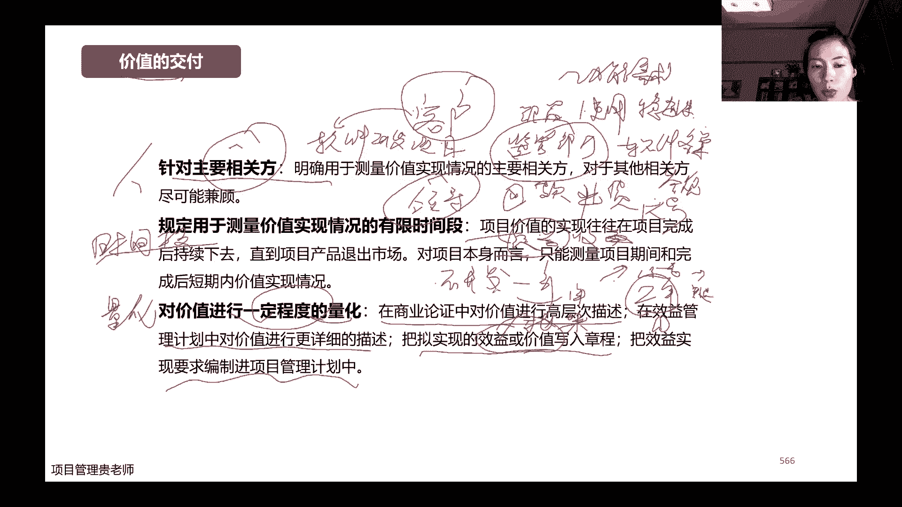

项目管理计划呢，嗯我把这个主要的内容给大家列了一下哈，因为一般对于我们来讲，就是如果咱们将来参与的项目越来越多啊，越来越多呢，一个是项目本身的这个规模是越来越大。

然后另外一个呢是项目本身的数量会越来越多，还有一点非常重要的是，咱们管的这个项目，参与的这个，周期或者生命周期，越来越长越来越长是什么意思呢，也就是说更多的参与到了前面的商业论证。

啊和后面的交付之后的这个运营的反馈啊，或者说咱们统称为这个运营，这是从项目本身的这个周期幅度上面啊，从前啊去延伸，从后去延伸，这也是咱们作为项目管理对自己的一些要求哈。

那有的人说我参与商业论证有什么用呢，大家想啊，商业那这有什么用啊，商业，那这是评估这个项目到底是能做还是不能做，当你在有决定权啊，可以去决策这个项目做还是不做的成，显然我们的权利在组织的权利是被放大了。

对不对啊，所以跟大家讲了几个这个作为项目经理哈，不同的项目经理，他的这个权力的大小是不一样的，那有几种不同的路径哈，那我们现在讲的是往前拓，那你要做商业论证啊，你肯定要做效益管理计划。

那你要做效益管理计划呢，它核心要掌握哪些东西哈，首先啊目标的收益这个一定是有的，不管是有形还是无形的，然后同时呢诶我们做这个项目，跟我们整个这个组织它的战略目标啊，是怎么样去响应他的战略目标的。

比如说现在啊领导说了，或者说大老板说了，我们这个组织，这个公司现在要统一的开始组织上画的路线啊，那你做了你去市场上找了一个比较好的项目啊，圈子比较广，找了一个比较好的项目，你在项目立项的时候。

你是不是能够保证我们这个项目，它是跟我们大老板想的，整个组织要开始走智能化的路线，它的战略是匹配的啊，同时呢实现效益的这个实现啊，阶段的短期的长期的都OK啊，校园的负责人，每一个阶段的这个实践诶。

他的或者说每一个阶段不同的这种效益，由谁去监督啊，比如说技术方面，这个要产生多少的知识产权，申请多少的发明专利啊，这个由谁啊，可能技术研发总监或者研发的这个负责人啊，由他来负责。

那比如说这个啊这个资金的这个收益，那我要是回款多少啊，或者是这个自己的项目，那运营之后啊，你的这个运营收入是多少，哎那我这个负责人可能是由我们的这个销售啊，或者是商务。

啊或者是我们的这个运营产品经理都OK啊，去由他们来负责，那最后还要体现我们的这个测量指标，就是效益管理计划里面核心的几个大的内容哈，如果大家有涉及到，可以在研究这些框架。

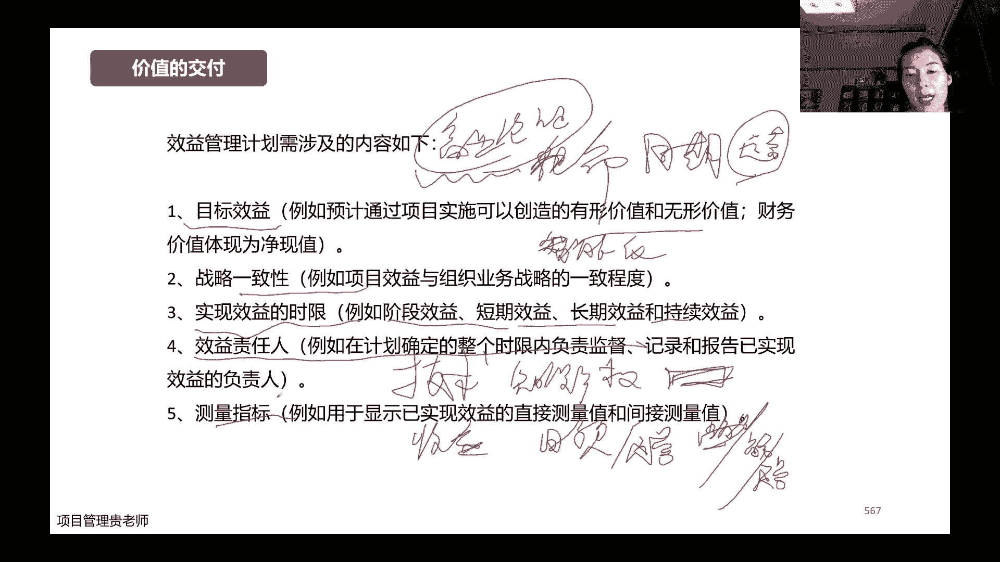

继续徐小梅在细化啊，这给大家举了一些这个例子哈，就是主要是举的是华为啊，为什么举华为这个不用去解释哈，因为华为显然是在我们国内做项目管理的，整个这个体系，从0~1搭建项目管理体系。

并且呢嗯由他们的这个整套完整体系啊，接受了各种各样的项目，是对相对来说相对其他企业来说是最完善的啊，他们的整个这个项目管理的啊，这个围绕我们的价值交付呢啊，分了三个大的阶段，第一个阶段就是。

首先啊我们说定方向做正确的事情啊，定方向做正确的事情呢，啊一般我们是如果大家要学这个项目管理，学的比较就是深海啊，我们前面讲过项目的组合嗯，项目的组合呢他就是在有限的资源，要选择更加适合我们组织发展的。

这些项目去做啊，所以要做正确的事儿啊，项目管理的模式啊，啊该系人啊，这些都是一些具体的啊，他到底怎么去定的啊，我们这个管理的办法，管理的流程，然后同时呢哎我们要找方法正确的做事啊。

这个是咱们在项目的管理里边，项目或者项目级的管理里边儿，啊要去掌握的内容，项目管理和项目级的管理，就是要把事情做对做正确啊，最后看结果就是强调的是，我们交付的时候要把事情做正确啊。

这个是更注重的是人和团队哈。

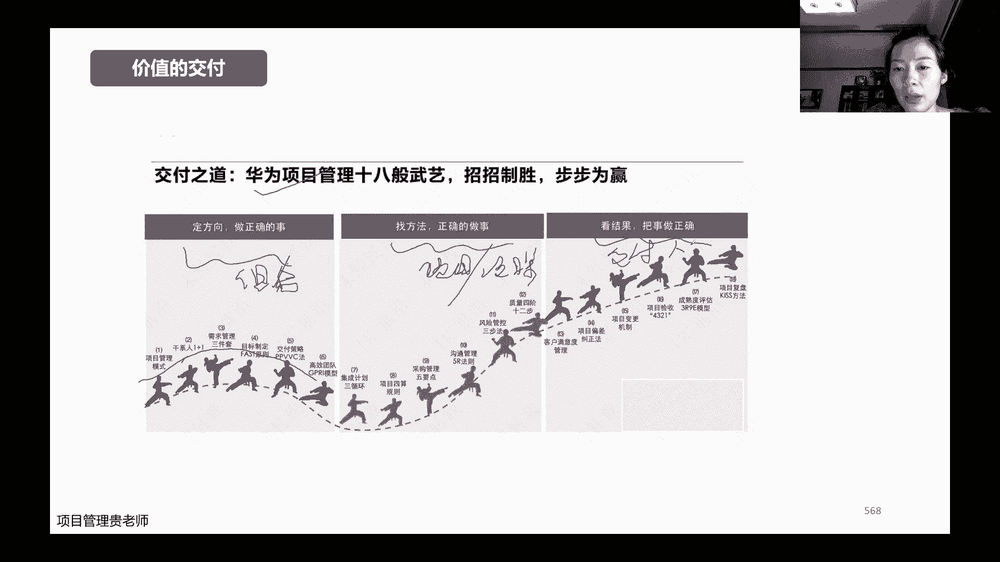

后面这个呢是给大家列的，就是华为从嗯到法术啊，气人啊，从五个不同的维度，全方位的它的一个项目管理的整个这个体系，那咱们现在重点啊掌握的要学的，或者说p mp的这个课程，重点是要求大家掌握的是具体的气。

也就是说啊工具，和技术的这个层面，你看它里面就是进度管理啊，啊这都是这个华为礼拜的他具体的作业平台啊，有相应的对应的管理系统，那么的进度怎么管啊，成本怎么管风险啊，涉及到哪些步骤，质量啊，工时变更采购。

还有我们的这个知识管理啊，上节课才跟大家讲过，这些呢都是它具体的一个一个子系统，那么啊我们我们也讲了啊，这个工具和技术它这是第六版的核心啊，去要求大家掌握的，但是我们现在呢是以第七版的。

这个教材的框架为核心，再跟大家讲，第七版呢啊它更重要的是从这个道啊，就是讲项目管理的这个文化范围，价值观啊，原则啊，还有一些方法论指导方向，嗯第七版更重要的是从这些指导方向，原则上面去跟大家讲。

项目管理到底应该怎么去啊，怎么去管，怎遵循什么样的这个方向，遵循什么样的这个价值观啊，遵循什么样的一些原则，所以这也正是为什么有些人自己去看一七版的，啊，这个p bk并不自己去看第七版。

觉得好像都说的是正确的，废话啊，说完之后让你去操作什么也不知道，那有些人说唉我们可能在这个今天之前，在8月份之前，那些学员呢哎学的都是第七版啊，学的都是第六版的这个教材。

TV版就学的就是具体器的这个层面啊，学的是工具，学的是技术啊，有些人个人觉得那他们运气很好呀，对不对，因为他们学的都是具体的工具和技术啊，但是行不行呢啊也不行，为什么呢，因为第六版呢，它更适应的是A。

我们自己做预测型项目做的比较好的，但是现在尤其是疫情这种黑天鹅的事件啊，这么大环境的变化也非常的快啊，人工智能也不知道，对我们各行各业会有怎样的一些迭代，那会有怎样的一些这个呃影响或者颠覆。

那在这么不确定的这种环境之下，我们预测型的项目啊，他可能嗯是一种还是一种比较主流的，但是更多呢我们还要掌握一些适应性的，这些项目，要来应对这些变化，所以单纯的掌握这些具体的工具和技术啊，有没有用呢。

有用，但是呢你不知道怎么去用啊，对不对，你必须要在啊原则，在指导方向之下才能够很好的去用这些，选择合适的工具，选择合适的技术去把我们的项目管理好，对不对，所以是咱们啊8月份的这个小伙伴哈。

也是比较呃这个运气比较好的，是咱们讲课的时候都是从啊从道和术的层面，然后呢再一个一个气到具体的这个气啊，工具和基础的层面啊，所以咱们不要觉得就是因为我之前听，就是有的小伙伴会有会有担忧哈。

就觉得我们是不是这次听了这个课件啊，还要自己去吧，第六版学一学不会哈，为什么呢，因为我在客栈里面啊，基本上这个从第七版的原则框架，到第六版的这些怎么选择，然后具体工具和技术都已经讲到了哈。

所以大家第一呢啊不用去担心这个啊，第二呢也不要觉得自己运气很差啊，前两年没考p mp，现在科技去改版了，去升级了，然后去考这个觉得自己的难度更大，不要有这种心理压力哈。

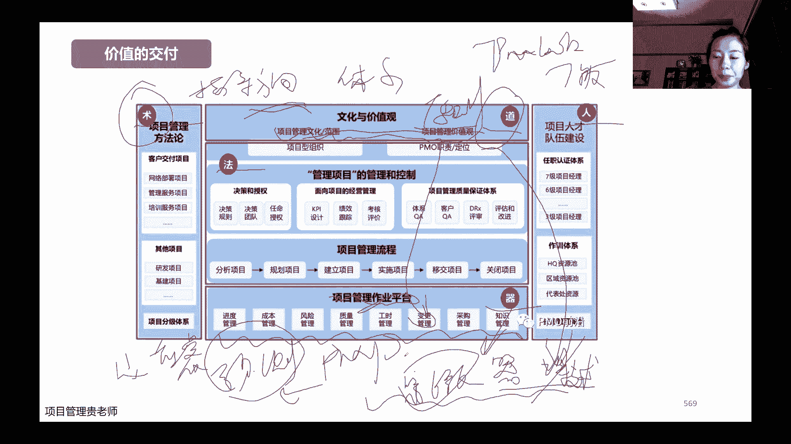

好可交付，那我们说了交付啊，这个绩效与前面说了这个要交付价值，那除了价值之外呢，我们还有一些有形的呀，就是可交付可将复合呢，重点是反映了该系人他的需求范围和质量啊，以及后面的这些啊利润的一些这个要求啊。

啊包括一些这个人员的一些提升啊，啊包括对环境的一些积极的一些影响啊，好后面的我们不做重点哈，重点是看他的需求啊，范围和质量需求我们前面讲过哈，需求是说根据我们的这些项目的一些要求啊。

他的可交付物必须要满足的啊，必须要具备的，他的这些条件或者这些功能，而这些范围呢是我为了具备他的这些需求，而必须要做的工作，嗯质量呢是说我这个可交付成果啊，在满足这些前面的这些范围和需求的时候啊。

他必须要遵循的它的这个质量的一些标准啊，所以这个需求和范围啊，可能嗯做过项目的人应该非常清楚，但是如果说就平时做过项目比较少的啊，可能会把需求和范围把它混为一谈哈，这里就跟大家讲清了。

需求是我们要满足要响应的啊，要去要，必须使我们的这个可教父具备的一些条件，而这些范围的是为了支撑需求的，就是我为了支撑而无，为了满足你这些条件，我必须要做哪些工作啊，什么意思呢，比如说嗯举个简单例子吧。

嗯举个做菜例子吧是吧，我们做一盘做一个红烧肉吧，我需求是我想做一盘，我想我想吃红烧肉，我希望你给我做一盘红烧肉出来啊，那范围是什么呢，范围是我要去买肉啊，我做我做的工作呀，我去买肉啊，啊买调料啊，啊。

当然还要有这个具备厨房的，这个这个做菜的条件呀，对不对，然后我还要安排人去去炒，对不对啊，去烹饪，烹饪怎么写的，当然不会写烹饪的哈，去烹饪去做这道菜啊，还要有这个比较好的这个就餐的，用餐的这个环境啊。

对不对，这是我们的这个范围范围，是为了满足我们这个需求所要做的一些工作，那什么是质量呢，质量是我这个红烧肉做一做，做出来肉都烧糊了，烧成黑的啦，还是说非常标准啊，这个切块大小非常标准啊。

颜色上色也非常的均匀，所以这几个的区别。

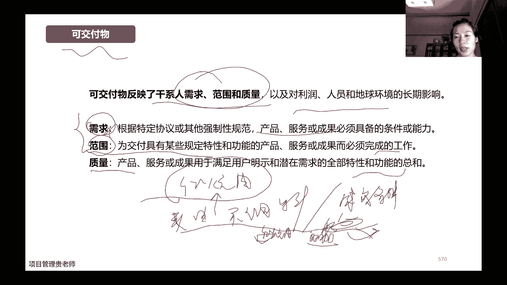

大家首先要理解为什么理解这些呢，因为我们啊今天晚上讲交付的时候，有两个重要的子过程，一个就是他啊我们在交付的过程当中，要重点确认我们这些项目的它的范围，另外一个呢是我们在交付的过程当中。

要重点的去做好质量控制啊这两个字，过程，这个呢大家看一看需要交付内容啊，绩效水平啊，这个需求呢它可能会体现在质量的这个需求，可能会体现在我们的这个标准啊，或定啊，这个大家看一看就好了哈。

重要的是我们质量啊，既然说控制质量，是我们这个交付期教育的一个重点啊，而控制质量的时候呢，我们在前面跟大家讲过一个工具啊，叫做质量成本，质量成本不知道大家还记不记得啊，啊如果不记得。

也带大家回顾一下质量成本，首先是一致性的成本和非一次性的成本，这是两个大的分类啊，这是两个大的分类，一次性的成本呢是我还没有失败，非一次性的是我已经失败了，对不对啊，没有失败的，我又分为预防成本。

和评估成本，比如说我做的培训预防啊，我做个测试评估，那非议之间的成本呢，哎也分了，有内部失败，就是我自己在完成之后我检修啊，发现了一些不合格品，还有一种叫外部失败啊，就是已经到客户那去了之后才发生的。

才发现的一些这个呃缺陷，这个质量成分啊，带大家回顾了一下，那可教父里面有两个比较重要的一个概念哈，首先大家要明白一种场景啊，这个是起码教材里面给大家举了一个，开发智能手表的场景，什么意思呢。

哎按照我们原先的这种计划，可能到12个月的时候，到12个月的时候，我们要完成一个智能手表的啊，这个基本的功能啊，它能够嗯比如说能够打电话，那当然看时间啊，这些都是都是最基本的，这个都没啥好说诶。

他们打电话啊，能够这个发语音啊，啊发短信发这个消息，啊这个是我们最基本的啊，这是原先定的12个月，要完成这样的一个这个核心的一些功能，但是呢在做的过程当中，哈哈突然发现诶现在AI来了，我发现呢。

哎市场上已经有智能手表，开始出现一种新的一种应用，它这种应用呢他因为加入了一些啊，AI的这个插件在里面，它可以给你实现实现智能对话啊，不仅仅是你通过这个手表，去跟你想要的联系人对话。

而是说这个手表本身啊类似于苹果的SIRI一样啊，它可以跟你实现一些智能对话，同时呢哎他还有具备深度学习啊，自我学习的这些功能，那既然市场上面有这种比较好的一些应用啊，技术是能够支撑的。

那我们在开发这款智能手表的时候，我们就有可能去把这些功能，我们也把AI的功能去把它做啊，揭露是不是接入之后，那你这个手表面向市场，它就是一个全新的，非常有竞争力的这样的一个产品，对不对。

所以你的目标啊是从原来的啊，这些基础的到我们发作的过程当中有一些升级，当于你相应的你的做的时间啊，可能我12个月就不太能够够了，我可能还要多花两个的时间做AI的这个介入，做AI的一些调试，做一些测试。

对不对，所以这个时候就会出现一种结果，就是我们的项目目标啊，其实它是完成了，他是在做一个偏移啊，就是在我们原来的基础上面啊，又实现了一点点的这个增加，那为了完成我们的这个偏移呢，哎我们有可能增加两个月。

甚至是这个到十五十六增加四个月的这些工，这些工作都是有可能的哈，这个叫做啊完成漂移这个概念，大家要知道，因为这个概念是第七版里面新增的啊，同时呢它这个概念也是非常符合，我们现在的这些这个大的嗯行业环境。

啊适合符合现在大的行业环境的，前两天我看一个报告哈，啊整个这个开发一款新的一个产品哈，这个产品不一定是说软件哈，是比较就是有新技术在里面的这种产品，那以前呢可能周期啊是在这个啊3年啊，两年。

当然跟过去的时候更早上5年，但现在呢平均可能这个半年啊，最多一年的时间，它就有一个新的一个产品的迭代，所以它的整个这个产品迭代，需要研发的这个周期，它是呈一个指数啊，是这样一个上升的一个趋势。

那这样它是一个上升的趋势，意味着我们对外部环境的响应啊，为什么我们现在这个假项目经理，要有这个敏锐的商业敏锐利，啊因为新产品的这种研发的周期嗯，通用型的这个不是对大家的要求哈，这个是通用的行业的。

它的周期确实是越来越赶了，所以既然越来越大，那要求我们啊这个比较好的能够察，能够察觉到市场的一些需求的一些动态啊，能够比较好的紧跟我们一些前沿的一些，这个发展，那这个时候呢我们做的过程当中。

那难免会对我们的这些项目的成果，有一些新的项目的目标，有一些新的一些要求，有一些新的想法，所以完成漂移不仅是从概念上面，而是从我们实践的这个做项目的，这个过程当中啊，都要去啊去掌握，或者说呢去嗯响应啊。

响应我们完成漂移的这样的一个动作，那还有一个呢也是我们在交付的时候啊，完成漂移，是我们进入新市场啊啊去主动做的一些啊，主动做的一些工作，主动做的目标的一些这个呃变化，或者产品范围的一些新增。

但是自由结果是什么意思呢，啊自由结果呢是跟我们完成漂移，它是一个补充性的，它是说我们没有在理想的情况下面啊，只能够追求的次优的自选的一个，第二好的一个结果，什么意思呢，啊。

比如说我们前面讲的那个智能手表的那个案例，啊比如说我们智能手表的啊这个开发场景，这个案例我们比较理想的是啊，我想完成漂移啊，是能够成功的把我们的这个AI把它接入，进入之后呢，哎比如说我除了质量对话之外。

哎我还能够，啊我还能够实现啊，类似于china GPT一样的啊，这个问答基本的相当于我的这个百科全书，一样啊，聊天是OK的，但是呢我问他其他方面的一些领域的一些知识，他也能够给我说出答案。

诶我我比较理想的是，我希望开发一款智能手表是具备这样的功能的，但是实际上呢啊我因为一些其他的一些条件，比如说这个智能手表我最多啊，原来是12给我最多给你演三个月的时长啊，时间有限制，那怎么办呢。

时间有限制，我没有办法去把这个签的GBT的这些功能啊，就把它做介入啊，这是毕竟是外国的一些这个存在很多啊，这个存在很多问题哈，那国内的一些软件呢，可能现在还不太还不太成熟。

那无论是从技术上还是从时间上面，我都有一些限制啊，怎么办呢，唉没办法啊，最好结果我达不到啊，时间也不够啊，技术也不够，那怎么办呢，哎我还是优先的把这个功能把它质量，对话的功能把它去保住啊。

这个是我们做的一个次要的一个结果啊。

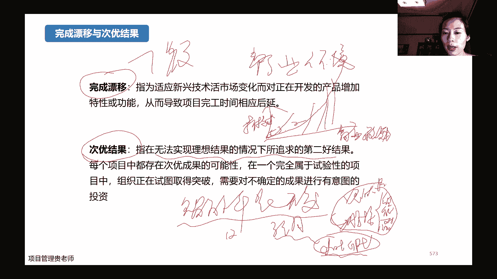

这是他的这个概念和具体的这个使用，大家理解了哈，等确认范围，确认范围，确认范围呢他的意思就是说我们的这个客户啊，或者是发起人，其实嗯一般来讲就是发起人发起的，他就是包含了我们的这个客户的啊，发起人。

这是验收项目可交付成果的这样的一个过程，它是通过验收的，可交付成果，这是我们确认范围，有一个输出，如果说你yes啊，可以验收，那很好，我们发起人签字确认，如果说哎确认范围的时候发现有一点问题。

或者说在确认范围的时候，这个翻新人啊，他突然有一些新的一些想法，那我们就要走一些变革的一些请求，所以它对应的是两种不同的情形哈，那这个时候有人会问，什么叫合适的可交付成果呢。

合适的可交付成果它其实是我们控制质量，啊它是我们控制质量的这样的一个这个输出，也就是说我核实了这个可交付成果，它的质量是OK的，是符合我的质量测量标准的，然后我才会去走确认范围的，这样的一个子过程啊。

看看这么好的，这么符合质量标准的，这些成果是不是在我的范围之内的，他所以他的输出是验收的，可交不成功，后面呢会再跟大家讲一讲，就是有一个这个给大家列了一个表哈，这个表是对比控制质量和确认范围。

它之间的区别是什么啊。

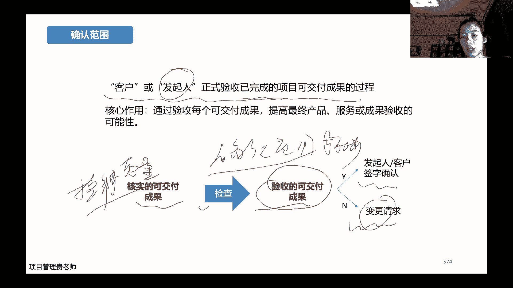

这你看验收的可交付成果啊，这个前面有一些范围基准，这是它的输入啊，最重要的是合适的可交付成果。

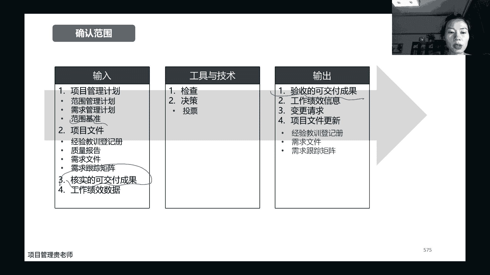

那不控制范围会怎么样呢，会发生范围蔓延啊，号卖淫呢也是我们在这个范围里边，非常重要的一个这个概念哈，什么意思，范围蔓延，也就是说诶我没有做好一些控制啊，结果呢就导致我的项目范围扩大了，蔓延了。

蔓延呢一般情况下它会有两种情形，第一种情形呢是我们叫镀金啊，第二种情形呢叫做范围浅变，镀金是什么意思呢，啊镀金一般情况下是讲的是A项目的团队成员，为了讨好打引号的讨好哈，为了讨好客户而做的啊。

就不解决实际问题的，没有应用价值的一些项目活动，举个例子大家就明白了哈，比如说我们现在在参加啊，在这个呃比比如说在甲方项目现场吧，在筑巢哈，然后拍了十个人的这个开发团队，在甲方项目的现场去驻场啊。

那甲方呢啊比如说我们这个时候啊，这个甲方是政策市政府，政府比较讲究形式上的一些东西哈，啊比如说经常这个开会啊啊干啥的，诶要缺乏一些这个帮手啊，那我们这十个人为了让甲方更好的满意啊。

还每一场活动我们就来给你当义工吧，就来帮忙吧，那这个你做的这些事情啊，或者是帮他写报告啊，或者是帮他做其他一些，你跟我们项目本身他的目标是没有关系的啊，这个叫做镀金啊，你为了讨好客户而做的这个叫镀金。

一般情况下我们这个是镀金，都是因为项目团队，项目团队的内部有些问题没有处理好，所以发生的一些事，那还有一种呢叫做方法简便方法，前面呢还是说唉客户不断的提出小的，不易察觉的这些范围的变化啊。

比如说天天说哎，你帮我把这个报告整理一下吧，写一下吧，我明天急着要，你又不好意思拒绝，对不对啊，不好意思拒绝，那就做呗，结果过了两周，哎，你这个报告还要修改一下啊。

我需要什么样的调整一个这个不同的这个格式，不同的版本啊，这个也是我们啊，比如说在做政府项目的时候，经常遇到的一些问题，对不对，那OK啊，因为这些小的一些问题呢，啊每次做的时候都觉得没有什么啊。

加个班顶多一个小时就解决了，但是时间久了之后，或者次数多了之后呢，他其实就已经很偏离了，我们本身的这些项目范围，那个这个呢叫做项目的范围简便方法简便，一般情况下啊，是由项目的外部的一些这个原因产生的。

这种概率会比较大一些哈。

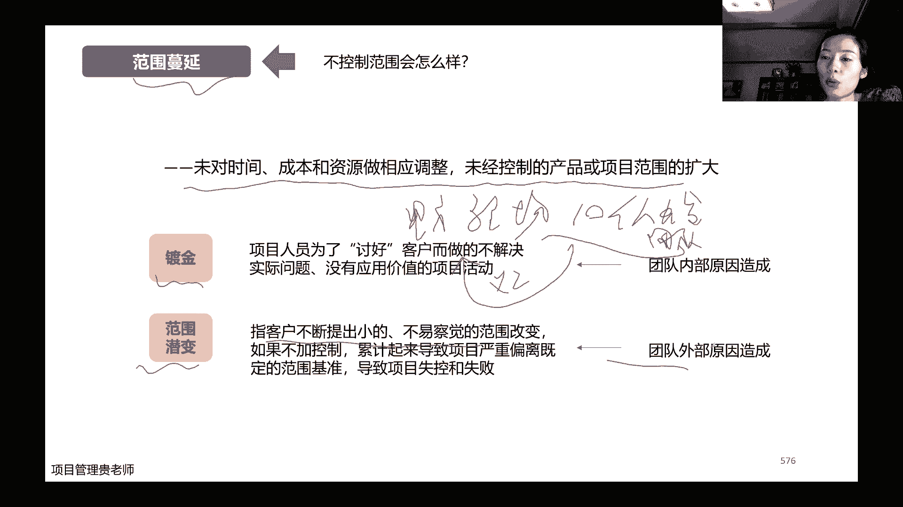

啊完成漂移和项目范围啊，这个蔓延有什么区别呢，完成漂移更重要的是我们为了适应环境的变化，所以做的主动的去把我们的这些范围，或者这些需求做一些变动，做一些新增啊，所以他应该是他既然是主动的。

那他肯定是经过批准的啊，他是它不，它不仅是不能降低项目的价值，它是重要的是，它完成漂移是为了做提升整个项目的价值的，那分为蔓延，我们前面讲啊，放慢蔓延，你要镀金啊，啊你要做蔓延，它蔓延是什么意思。

蔓延一般哈它都是发生在预测好的，因为只有预测好的预测性的项目，我们是把范围确定的，确定的范围，我在做的过程当中，我才知道哪些是啊，这个嗯发生蔓延了啊，超出了我原先的这个预测的这个标准，对不对。

所以它一般情况下它发生在预测性的项目当中，他只能去通过一些辩证的一些控制，去加以预防啊，这个要镀金啊，我们尽可能去内部的去这个约定一下，大家要遵守一定的原则啊，因为一些外部的这种范围的这种浅变啊。

客户提的，那我们啊如果说是需求上的啊，来尽可能的要求客户，或者请求客户去帮我们配合，把这个变更控制过程去把它走一下，用变更控制过程来约束一下，这种随机的这种变更请求，所以他既然是蔓延蔓延。

肯定是没有经过批准的，如果经过批准走了变更程序，就不会说它是范围蔓延了哈，所以我们在做的时候，最好就是不要求啊范围蔓延，你可以放为变更啊，我们只要走变更程序就可以，但是呢你不能是啊。

自己自发的去做一些项目的方法卖淫，因为从项目本身来说，即使你做了给甲方做了很多的工作呀，啊这个很讨好甲方呀，啊给甲方镀金啊，甲方看着很满意，但是对于实际项目本身的成果而言。

那你其实是降低了项目本身的价值。

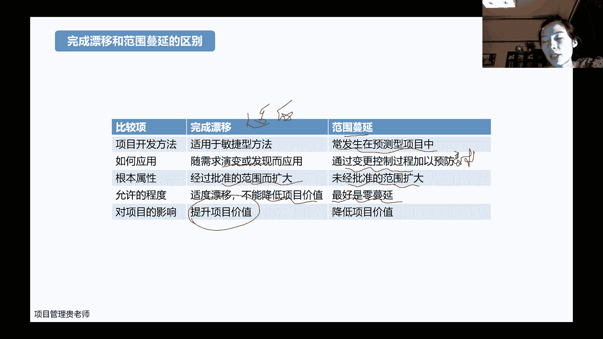

为什么呢，因为浪费公司资源，浪费的项目本身的资源时间，对不对，好可交付成果最终报告哈，这个有一个总结的绩效报告啊，里面有一些这个核心内容，比如说我们啊项目的描述啊，啊这个放在评估啊，质量啊。

还有这个成本的这个目标啊，比如说我们咱们这个项目啊，预计的是花多少成本，然后呢啊允许多少的这个偏差，我实际呢啊花了80万啊，我允许的是这个90啊，我实际只花了80万，哎呀我节约10万块钱。

是因为我在管理的这个过程当中啊，咱们啊去积极的避免了什么样的一些问题，最终呢哎我们这个产品做好了，客户非常的满意啊，客户也接受了这个验收啊，然后呢，诶我们客户也是按照我们的这个合同条款啊。

按时的去给我们做了一个回款，回款也回来了，那最终呢我们这个项目它是啊，对我们自己本身而言，它除了满足客户的要求，对我们本身公司的在这方面产品上面啊，是不是有一些新增的一些业绩啊。

是不是又给我们这个啊这个案例方面啊，又是天生加瓦了，同时呢哎整个这个过程啊，整个这个项目非常成功，但是呢在这个过程当中，也遇到了一些什么样的风险，或者是什么样的一些问题啊，在面对这些风险和问题的时候。

我们团队啊是经过嗯怎么样的一个过程，采取什么样的一些这个办法，去把这些风险去规避了，或者风险减少了啊，或者出现了什么问题，我们是怎么样积极去解决的，这是讲的是一个比较好的一个项目成果哈。

这是我们总结绩效报告应该怎么去写，这个思路和套路当然也有这个不好的，不好的也是按照这种思路，只是说他不好的时候也是态度诚恳的，客观的去分析一下，这样给大家列了一个绩效的报告的案例哈。

这个是参考的一个提纲啊，大家自己去看一看就好了，基本上是围绕前面的这些重点内容来的好，第二个呢，我们说哎比较重要的一个这个过程叫控制质量，我们前面讲确认范围，现在讲控制质量哈，控制质量是从质量。

从单独的这个质量的嗯，知识领域来讲，他应该是，他应该是先做规划质量管理，那输出我们的这个质量管理计划，和质量测量指标，然后呢我们再啊在工作的绩效域里边，还要去做管理质量啊，啊这个是在工作的机效率啊。

这个是在规划的绩效与，那我们现在交付的时候呢，啊有重点的讲控制质量，控制质量，控制质量什么意思呢，啊，控制量是为了能够满足我们客户希望监督，记录质量的整个执行结果的这样的一个过程啊。

主要的目的就是核实我们做的这些科，交付成果和工作达到了质量要求，能够满足你的验收标准啊，就OK所以这个敏捷项目哈，比如说上一期项目前面讲了，是由全部的团队成员，并且呢在我整个这个迭代和生命周期当中。

我都要去执行控制质量的这样的一个过程，为什么呢，因为我们每一个迭代它都有评审会，对不对，每一个P社会它都有啊，我们的这个DOD啊，都要有我们的这个是不是完成了这个定义，完成了这个标准。

那在我们的预测性项目当中呢，唉前面也跟大家讲过哈，一般呃不管是管理质量，我们的审计部门啊，还是说我们控制质量，也是由我们专门的测试部门啊，去做的时候都是一般情况都是有特定的成员啊，在特定的时间段啊。

比如说中期啊啊，或者是我们约定好的，每个这个项目的这个阶段呢，或者是有的项目为了啊为了这个啊，节约控制质量的这种成本，那约定只是在项目结束，在项目的交付阶段啊，才做质量控制的这样的一个动作。

这都是嗯OK的，这都是实际存在的一种情况。

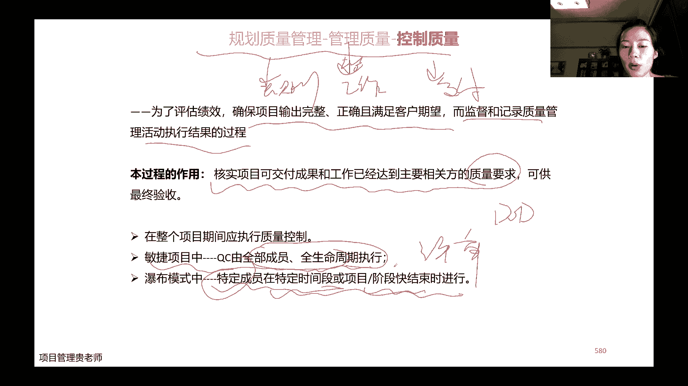

它的输入和输出子过程啊，输入大家基本上这个看一看哈，比如说啊可交付成果到底是什么，这个肯定是重点要输入的，对不对，那他输出呢就是A，我经过了控制质量的工具和技术位，验收了之后啊，我测试了之后。

我发现啊是经过核实的啊，控制结果是什么啊，这个是已经核实过的可交付成果啊，可以来进行确认范围这个动作了啊，确认范围如果OK的话，可以进行最终的一个验收的一个动作，它重点需要掌握的呢是我们的这些工具哈。

核对答案统计抽样问卷调查，以及呢我们这些数据如何去展现因果图，直方图，还有控制头三点图，这个是控制质量里面的核心的这个，工具和技术哈，呃因果图前面跟大家讲的，还记不记得因果图是什么样子的。

因果图又叫我们的石川图，又叫我们的鱼骨图，还记不记得呀，之前带着大家反映这个一起啊，这个鱼骨头啊，比如说出现了什么样的质量问题啊，可能是因为什么样的方面的原因啊，设备方面的呀啊技术方面的呀啊。

人员方面的呀啊，环境方面的呀啊这个管理方面的呀，然后设备又分了好几种原因，技术又分了好几种原因，人员又分了好几种原因，对不对啊，这个是之前讲管理质量的时候，就跟大家讲过这个因果图。

为什么当时要讲因果图呢，是因为在管理质量的过程当中啊，我们通过质量审就会发现很多的问题，那发现问题之后呢，我们就要去啊评估啊，就要找根本的一些原因啊，识别问题之后，就要找个他根本的原因是什么。

找到根本的原因，我们才能够去做一些这个解决方案，所以呢因果图在控制在管理质量的过程当中，用的是更多的，所以把放在我们的这个工作，绩效率是跟大家讲的，那我们在控制质量的时候呢，哎它更多的是一些这个反应。

我们控制质量的一些结果啊，统计啊，所以呢直方图，散点图和控制图都是放在控制质量里边。

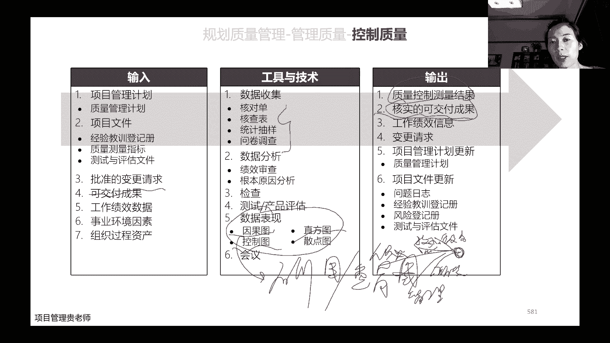

跟大家讲，这个是为什么做这样的一个安排，跟大家解释哈，控制质量，我们前面讲了，控制质量呢是说哎你要确定这个结果，它的这个符合我们的质量标准，符合我们的质量要求，然后才可以进入到确认发育的过程。

所以从我们的嗯可交付成果出来之后，它的一个流程哈啊，通过我们啊整个这个工作出来的一个，可交付成果或者系列的可交付成果，那么他先要经过控制质量的动作啊，来验证我的质量是否符合标准的，是否合格啊。

合格了之后呢，才是我合适的可交付成果输出来的，输出来的之后是合格的，那我才经历确认范围，这个动作确认范围之后呢，我才能够啊说这个成果它是可以经过验收的啊，经过验收，那我能够验收。

我当然可以进入到项目的结束啊，这个阶段，所以他是有这样的一个这个呃流程，这个流程呢大家了解一下，因为嗯感觉PMP就是，在往常的PMP的考题当中好像没有出现过呃，你具体的这个合适的可交付成果。

和验收的可交付成果，它是呃输入和输出的关系好像考的比较少，反而是软考里面考的也比较躲，他经常会觉得大家把合适的可交付成果，和晏殊的可交付成果弄不明白啊，所以呢他会好，他会他会去这个考大家哈。

这是确认范围，他啊需要什么东西啊，需要输入什么东西啊，很多人不知道，就选输入验收的科学成果。

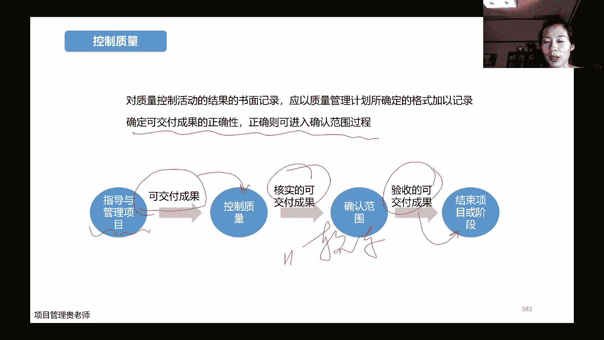

好控制起来我们讲完啊，那控制质量跟确认范围有什么区别呢，啊控制质量这样我给大家列了一个表哈，控制质量它主要是说你这个事做的对还是不对，确认范围主要是可不可以接受你这个事儿啊，你这个成果他做的是对的。

非常好，但是呢不在我的范围之内，不好意思，那我没有办法去验收啊，所以他们俩之间的区别哈，那实施方案刚刚讲了，控制质量是由我们的这个控制质量部门来进行，然后确认范围呢是由我们的这个发起人，发行的时候。

主要是包含了这个客户啊，或者其他的一些主要的这个干洗的，跟他们核心相关的，他们自己提出的需求，是需要他们来确认这些范围的，一般情况下控制量是要先做啊，控制质量做完了之后你才去验收。

才去这个看看他是不是可以接受的依据呢，控制质量的依据当然是我们的质量测量指标，而确认范围呢是我们的这个验收标准，验收标准里面包含了只拿测量指标，它是包含了质量测量指标的啊，也包含其他的内容。

那么交付我刚才讲了，一个是核实的可交付成果，一个是验收的可交付成果，实质动作英文不用看诶，我看到评论区有学员说人机料法环嗯，人尽量你是想说，是不是我们前面讲那个，讲那个出现问题的时候啊，讲那个鱼骨图嗯。

找根本原因的时候，一般会从人的因素啊，机器的因素啊，量反完原材料啊。

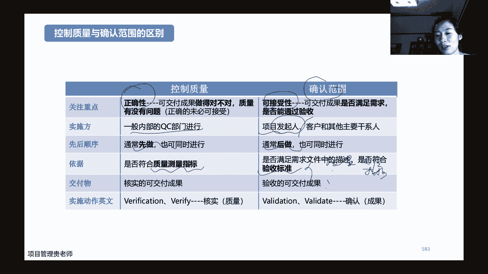

法律环境啊，是从这几个维度去找对的哈，好既然讲过了控制质量跟确认范围的这些区别，大家清楚了，那我们还要讲一讲啊，前面跟大家说了，我们据说在工作的过程当中啊，在工作绩效与我们要做质量保证啊。

那在交付的质量，交付的这个技巧，与我们要做控制质量的这个动作啊，那控制质量跟这个质量保证到底有什么区别呢，唉我也给大家列了一张表哈，这个表呢呃我们PMP就考的会比较多啦。

他也会考大家的这个对这两个动作啊，它发生的阶段，这个它代表的意思啊，区别到底是啥，也会出这样的类似的场景哈，好我们讲讲质量保证呢，它其实就是做的是质量管理啊，或者是管理质量这样的一个动作。

他主要强调的是我们在做项目的过程当中啊，过程当中做一些质量审计，做一些质量控制的这些动作，然后呢质量控制的主要是在事后啊，一般是我们有一定的阶段性的成果出来之后，我们去检查它的质量。

还是在事后再做角色啊，既然是在市中做管理指导这个动作，那我们肯定是边执行边开展，然后既然是事后，那一般情况下是由专门的质量控制人员，在事后进行开展，控制质量，管理质量它主要是哎我发生一些原因之后。

导致了一些偏差，我要根据这些偏差，我要采取一些预防的措施或者改进的一些措施，而控制质量呢是我因为发生了这些原因之后，我要纠正啊，我要纠正纠正是说这个问题就已经发生了，所以他关注的啊管理质量。

你在市中是要关注，我要预防，重点是预防，然后控制呢是在事后，那他重点关注的是事后嘛，我当然是要发现把那些啊这个不好的，我把它发出来啊，不合格的我发现了之后，我看看能不能做一些补救，做一些缺陷补救的。

这些动作啊，所以我们说好的质量一定是预防剩余检查，啊预防生理检查，所以呢我们肯定是重点要做好质量管理的，这个动作，从整体着眼啊，从整体的这个角度去提升公司，提升组织的质量管理水平。

而不是说重点放在啊从局部上面啊，从具体问上面啊，发现不合格啊，我在解决这些不合格的问题啊。

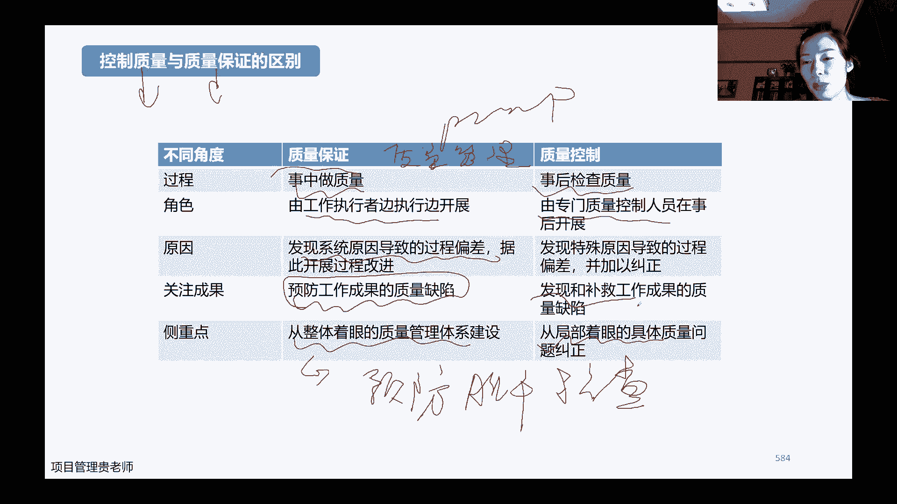

啊工具呢跟大家讲了啊，工具首先核对答案呀，这跟大家举了一个例子哈，嗯核对呢那是相当简单，就是说哎比如说咱们做一个偏僻的考试，你要准备哪些东西啊，还要戴好口罩，这是疫，这是疫情之前的哈。

啊疫情之间的戴口罩啊，啊这个身份证准考证，这肯定是大家现在也都的健康声明坐标，然后健康码呀，这些都是疫情期间的工作证明啊，啊包括其他的，我看啊，这两天群里苏苏老师也在啊，也在跟大家提醒我要开始报名。

对不对，那还是不是还要增加哎，比如说这个是否已经成功的这个中英文报名啊，是否成功啊等等一系列的，然后呢对照我们的这个合理端啊，我们再去看看一个一个对比，这个达到要求没有，这个做对了没有。

这个有没有这个有没有啊，所以核对单的这个好处呢，就是我们遗漏的这个概率会比较小，遗漏的概率会比较小，当然它对应的劣势呢，就是前面的这个核对单的内容和清单啊，这要求嗯比较高，为什么呢。

因为你这个清单如果没有列好，你后面核对的时候，你清单如果列了，你后面核对的时候自然会遗忘一些东西，所以核对单比较适合，比较适合公司啊，有非常好的知识积累和组织过程，资产，啊比较适合公司的这个案例啊。

知识库啊，数据库啊，非常丰富的这种情况有核对。

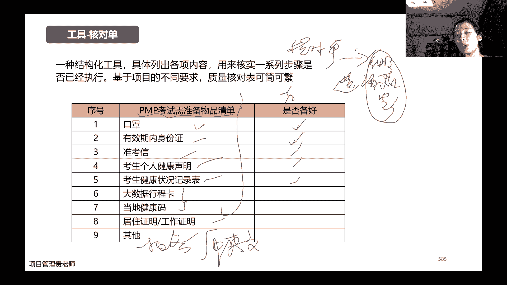

但是相当好的，第二种工具呢叫做统计抽样，统计抽样呢啊我相信大家应该都听过哈，都听过统计抽样，统计抽样，它主要是哎我们在整体当中选一批出来，选一批样本啊，这个样本哪嗯哪一部分是合格的。

哪一部分是不合格的啊，这个嗯去做一些定性，然后呢，它里面统计抽样呢，又分了属性抽样和变量的抽样，属性抽样呢它是控制的偏差力啊，比如说啊我定了你这个东西嗯，一批啊一批这个比如说一批弓箭出来。

一批零部件出来，合格就是合格，不合格就是不合格，我是给你递信的变量抽样的啊，也是我从整体当中啊，比如说整体当中是10万件啊，我现在抽了1万件啊，来进行统计抽样的这样的一个动作来进行测试，变量。

抽样呢是诶我从量的这个角度推断一整体啊，比如说合格的程度啊，比如说这1万我我200件啊，不合格，剩的9800呢唉都是合格的，那我可以推断出来A这1万件当中，它的合格率98%，那么我预测我整批这个零部件。

它的合格率是98%，它是从一部分的啊，能够推断出整体的啊，这个叫做变量的重要啊，再举一个例子哈，比如说啊这个商场，他现在呢他想增加一些儿童设施啊，今天儿童设施干什么呢，现在儿童设施之后呢。

希望这个商场能够来更多的孩子，孩子来了之后，家长就来了，家长来了之后，这消费的流量就来了，对不对，消费的流量来了，那商家的入住啊，入住的这个商家就来了，入驻商家来了之后，那对于商家而言。

它的租金就有保障，对不对，那OK他回到这，他增加一个儿童设施之后呢，诶他要调研一下，他增加这个儿童设施到底有没有用，吸引的群体是哪一部分啊，对不对，所以呢唉他根据来定性，14岁以下的叫儿童。

十岁以上的就不叫儿童，叫成年人啊，所以他调研呢发现诶14岁以下呢啊，100个人当中，十岁以下的有38个人，所以呢哎我来推断他的这个呃儿童的比例，占了38%啊，占了38%啊，这是38，是儿童。

这是属于我们的这个，属性，抽样，那什么是变量抽样呢，他还是这样的一个动作哈，他现在就发现了A我分区了啊，我分的14岁以下呢，这个太笼统啊，我只能给他做一些定性啊，只能叫做笼统的叫做儿童。

但是呢我还是不太能够区分，这，毕竟14岁的孩子跟一岁的孩子玩的东西，我们就不一样，对不对啊，我要更追求一些细节，那OK在这里面呢，哎我看到了啊，对这些嗯38个人里边啊，1~3岁呢占18%。

3~6岁呢占56%啊，六岁以上的占26%，诶那我亏，那我能够推断出来，我将来这个商场啊，他将来的这个1~3岁的，这个儿童比例是18%，3~6岁的儿童比例是56%，六岁以上的。

六岁到14岁的是26%的这个比例，那我为了精细化的管理我啊，18%嗯，更好的是说，我这个18的和56的和26的，我分别建不同的这种儿童设施，对不对，建档案是更好的，但是为了考虑我资金的啊。

这个优先的投入，那我更多的是满足啊，这个3~6岁的，因为来的最多啊，我满足这一部分群体的，他们更适合玩的一些设施，对不对，所以呢这个叫做这是变量的出演哈。

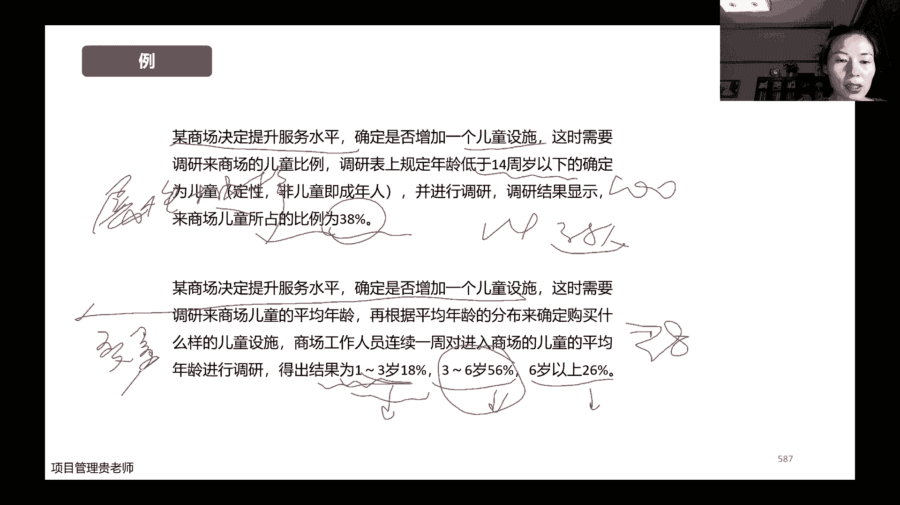

这两个有一些区细微的区别哈，体会一下，好在下一个工具呢叫做直方图啊，这个直方图呢其实也是相当简单啊，我也相信每个人应该都见过直方图啊，考试出来了，啊三啊，现在都是3A了啊，原来是5A啊，3A的多少人啊。

比如说这个啊，就咱们班啊，比如说这个60啊，60个学，啊3A的50个好不好，然后2A的2A加1B的啊，两个人啊，这个ea啊，向量B的啊，这个五个人啊，这个fail的，这是这是还剩几个50个还剩三个啊。

就一个一个列出来，简单吧，就是直方图哈，直方图没什么好讲的，我也没给大家举个例子，还有帕雷托土，帕累托图呢，这个考的也会比较多啊，为什么呢，看帕列托图呢，它其实是找主要的哈。

大多数问题或者主要的一些问题，他追求的是一个八二的一个原则，80%都聚焦在于哪里，这是我们用帕雷托图可以去显示的啊，比如说我们现在用一台机器，然后呢这个机器发现嗯有一些故障啊。

这些故障呢我们就统计了一下，发现诶它转动不正常，出现的这个次数是30多次啊，因为出现噪音啊，可能是个20多啊，有抖动也是20多啊，有这个压力不平衡啊，或者是有一些缝隙啊，有一些颤动等等啊。

把这些统计的次数都把它列出来，列出来之后呢，我发现偶转动不正常啊，出现的次数最高，甚至呢这个噪音出现的次数也很高，那我在资金允许的情况下，我重点去检修啊，它转动不正常啊。

是因为什么是他的这个呃这个发动机问题啊，还是说因为他的这个啊传送带呀啊都OK，那噪音啊，噪音是因为什么问题呢，噪音是因为啊这个摩擦太大啊，时间用久了之后啊，哪个这个啊肘啊，哪个这个零部件啊。

哪个这个螺丝孔没有对上啊，所以导致有摩擦比较大，所以噪音比较大，还是因为其他的一些什么原因，我因为资金有限啊，我因为人员有限啊，我因为时间有限，我没有办法每一个问题啊，每一个统计出来的问题我都去检修。

我只能聚焦于主要的这些问题啊，我去找原因啊，再去重点的去解决啊，这个叫做帕累托图，这个呢考试考的频率还比较高啊，但是有的时候大家要注意一个问题，你看帕累托图跟前面直方图长得像不像，是不是也很像啊。

所以帕累托图它就是一种，它其实它就是一种直方图哈，它就是一种特殊的直方图，所以万一考试给我们一种场景啊，大家觉得啊他是谁，让我们选择聚焦在主要的问题上面，但是呢选项当中又没有帕雷托，但是它有直方图啊。

我们也可以选择直方图哈。

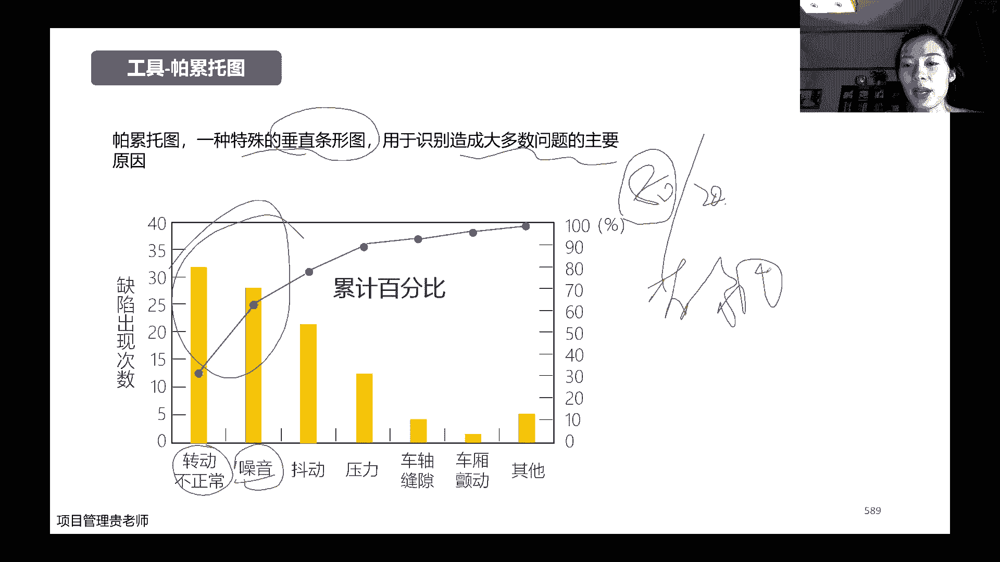

好三点图，三点图呢它是啊，就是表示我们来验证一个事情，他两个变量之间是不是有一定的逻辑关系啊，一般呢，一般呢它的两个轴，一般呢啊它的两个轴啊，一个就是表示我们整个这个啊工作的这个过程。

或者说项目的整个这个过程啊，或是环境啊，或者是这个活动，或者是你觉得会影响它变化的一些，其他的一些要素都OK，然后另外一条轴呢A是表示的我质量的缺陷，他想验证的就是说哎我这个项目管理的过程啊。

或者是我不同的这些环境啊，或者是我不同的其他类的活动，跟我们的质量缺陷，到底有没有什么线性的一些关系，逻辑的一些关系啊，如果说有诶，那我们可以去控制这些因素，如果说完全没有关系。

那我们证明这个音这个因素找错了，跟他完全没有关系，那我们就放弃。

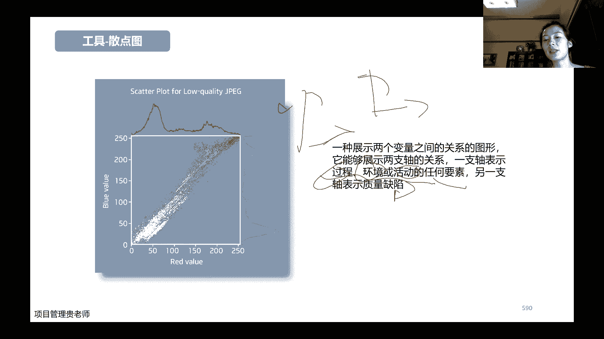

就这个，所以散点图呢它会出现啊，几个不同的逻辑关系哈，正相关，负相关无关，无相关，还指数，还有这个指数相关还是看图哈，这相关啊，比如说唉我这儿这个啊质量缺陷，我们用纵坐标来表示质量缺陷哈。

因为合同坐标也行哈，逻辑说得通就OK好，表示的是量缺陷，然后我我横坐标呢，比如说我用这个团队的技能啊，操作工作这个熟练程度，熟练程度越来越弱吧，啊用这个这个最高这个钟啊，这个低。

然后我发现呢在我们操作的这个过程当中，诶，我发现我用的这个啊工人啊，或者是这个工程师，他的工作的年限越久啊，说明他的这个技能越高啊，然后呢出现质量缺陷越小，它呢上机啊，上这个生产线的这个时间越短啊。

说明他的这个技能啊程度水平越低，那出现的质量缺陷越高诶，不同的工作连线啊，不同的这个工作连线，对应的出现的这个质量缺陷啊，对应的每个点啊，这个都不太一样，但是呢整体这些点呢。

唉我发现它都是有一定的规律的，那么我基本上可以得到一个结论，是不是基本上得到的结论是诶，咱们的这些工作年限啊，跟我们的质量缺陷还是有一定的这个正相关啊，同样的负相关也是一样的负相关。

你就把他的逻辑换一下就好了啊，就把他的这个工作年限，这个是从高到低，你就把它换成从低到高啊，完全不相关，什么意思呢，A啊，比如说我这纵坐标哈，我都是用质量缺陷来表示，然后我混坐标要换一个换一个。

比如说嗯啊换一个其他的因素嘛，换一个其他的因素，比如说我这个原材料，啊原材料一次投料的多少啊，我以为啊一次原材料投太多了，它容易出现质量问题啊，一次投的比较少，因为比较精准，所以它质量视线会比较少啊。

我以为是这样，然后但是我验证的时候发现好，我这个原材料啊，头100克诶，出现指南出现的问题是这么多啊，头1000克是这么多，投10kg啊，投20kg好像也都是这样，就是两个之间没有关系，并没有说。

因为我原材料投的越来越多啊，质量缺陷出现的概率越来越大，出现的这个频次越来越高，不是这种关系，对不对，所以他不相关啊，当然还有这个现象，就是正相关和负相关，它其实都是这个线性关系的一种哈。

还有就是我们呈指数关系诶，就是我前面跟大家讲，比如说我们现在啊开发一个新的产品，开发一个新的项目啊，一般来算通用型的，它的这个周期原来是10年啊，现在这个5年啊，现在啊一年半年，六个月甚至两个月。

甚至一个月都有新的传媒出来啊，市场更新太快，那它有一些指数相关的啊，还有一些这个U型相关的，这个是讲的是我们的这个关系哈，那么既然有关系了，还有相关性的这个强度啊，比如说我前面讲的这个工作技能啊。

尤其是这种啊传统的任务，工厂工人的这个技能，他肯定是要求比较紧密的，我不仅是正相关啊，同时呢我这些点，我我这些点我基本上分布的是非常紧密的，那说明他是相关性非常强，那还有一种呢比如说除了工作技能之外。

哎我跟他的这个啊工人的这个奖金绩效啊，我也做了一个统计，然后我就发现这个奖金需要也有一定的影响啊，但是呢有些人他素质比较好，你只是给他奖金比较少，他也是尽职尽责，能够把这个事儿啊。

把他手头上的这个活儿把它做好啊，所以呢我发现呢他也基本上是有正相关，但是呢它的相关性程度比较多，相对来说啊，比跟这个技能相比，它会稍微弱一点，当然如果说你这个点完全散落，到处都是，那就是不相关里面。

而且相关性程度特别弱，所以三点图哈，三点图其实嗯考试的时候倒还好，我感觉嗯出现的这个概率可能百分，没有前面的party的话，他也会他也有可能出现，但是没有帕拉托呀，这根本原因啊，鱼骨头啊。

没有他们出现的概率高，但是呢三点图在实际的工作当中啊，非常好用，尤其是我们验证两个变量之间，到底有没有关系的时候，非常好用，好控制图，控制呢，这个也是嗯实际在考试当中出现的概率，非常高的一种工具。

控制的话主要是啊确定这个过程是不是稳定，是不是有一些超出我们控制之外的这些现象，这些问题出现，所以大家要学会判断控制图，控制图它的这个什么情况下，也是代表它失控了啊，一般呢我们在控制图的时候。

会有出现这样的一个一条平均线，然后呢和一个控制的，写啊控制线之外呢，还有它的这个基准线，然后我们也会根据我们控制的这个结结果，对不对，测量的这个结果啊，去把这些结果啊，对它有一个这个统计。

那什么情况下代表啊，我们在这个过程当中我们失控了呢，嗯一种情况是我们超出了控制线啊，超出了控制线他肯定失控了，对不对啊，失控了之后我们就要采取一定的措施啊，所以它超出控制线呢，他一定是失控了。

然后第二种情况呢是啊这些样本的啊，我连续测连续测结果呢发现啊，连续七个点在同一侧啊，都在下边，连续七个点它它都在这个下边啊，这个也代表要失控了，因为正常他应该在均线的啊，成一个这个上上下下的。

这样的一个分布是比较正常的，但是我现在连续七个点我都已经在一侧啊，在这个控制线的一侧，那代表他也要失控，然后还有一种情况呢，那是第三种情况，我把它写在一块了哈，他没有在一侧啊，它它它上上下下都有。

但是呢它基本上啊有线性关系了啊，连续七个点有线性关系了，那是不是代表我后面十个点，11个点就有可能超出控制线了啊，所以说这七个点没有在一侧，但是呢能够成一条这个线性关系的，也代表他要失控了哈。

所以他失控的几种不同的场景，这个大家要了解啊，要不仅要了解要掌握，那么考试当中他有可能还会换一种场景去考，大家他怎么考呢，他说诶超出了控制线啊，问你现在这个项目是不是啊失败了呀。

啊是不是要走一些编程程序呀，不一定哈，为什么呢，因为他失控啊，代表我们要采取一些预防措施，但是呢他没有突破我们的基准线啊，所以这儿有一个坑啊，大家注意一下就OK嗯，在实际的过程当中呢。

我也给大家列了一下，因为我们控制图呢，其实教材上面因为只是讲了这个概念啊，只是讲了概念和教大家怎么去判断它失控，但是并没有讲在实际的这个控制，在实际工作当中，我们做质量控制的时候。

控制图到底应该怎么使用哈，所以我把步骤给大家列了，首先啊，你肯定是要这个确定你控制的对象是什么，对不对，你确定控制控制是啊他的这个稳定性吗，啊还是控制它的这个合格的这个数量啊，合格的程度啊。

确定控制对象，然后呢确定对象之后啊，你再选择你控制图的类型，控制图的类型之后，你还要去收集器的数据，数据来了之后，你才能啊就根据啊我们前面讲的一个中心线啊，平均线和上面的控制线啊，以及这个基准线。

这其实都是根据我们收集来的，实际测量的这个工具，实际测量的这个数据去测算出来的哈，一般情况下啊，这里平均线啊，比如说我们测量的一堆数据啊，我们取一个平均数啊作为平均线，然后呢。

然后呢上下会有一些这个标准差啊，比如说这个一个标准差啊，正一个标准差，这个是正，这个是正，这个是负啊，一个标准差，然后呢这是三个标准差，啊我超过三个标准差的啊，我就判定为他就是失败啊，它超出了极限。

然后呢我在一个标准差之类的呢，我基本上就默认它都是可控的啊，都是可控的，因为我们前面讲过啊，跟大家讲那个呃正态分布的时候，基本上他是在正三个标准差之类的，概率是99%点几，对不对，所以也就意味着。

你只要是没在这个范围之内的啊，那么你超标啊，超基准的这个概率0%点几的概率非常小，我基本上可以不用管它，对不对，而且呢基本上在我们的这个嗯标准里边，也已经约定的是允许这个偏差范围之类的，对不对。

所以我们重点是控制好这部分的正负，三个标准差之类的，所以我只是说跟大家讲啊，一般情况下，它的上下基准会有正三个标准差啊来表示，但是呢也不排除一些例外哈，看我们具体公司的要求好。

那OK你计算出来的中心线啊，和他的这个上线了控制线之后，我是不是这些数据我就能给我排了呀，啊我就把我统计出来的这些数据，我把它排上去啊，排上去之后排在控制图上面，然后根据我的这个图形来判断诶，哪些数据。

它是其实是已经不在我的控制点之内了，已经失控了，那么我针对那一点的这个数据做生的这些要求，做生的这些研究啊，做我们不良率的整体的这个判断，这是我们整个这个控制图哈，在实际的工作当中使用的这个步骤。

质量过程的工具讲完了讲完了之后呢，帮大家梳理一下整个质量管理过程的，它的前后的这个逻辑关系，首先啊肯定要做的是肯定要做的是规划，质量管理，规划质量管理之后呢，就会出现质量管理策划。

质量管理计划和我们的质量测量指标，然后我们在做的过程当中，我们要做管理质量的这样的一个动作，那管理质量的动作好，我们出现，既然他是在工作绩效应要做的，那他就可能有一些变更请求啊，有质量报告出来。

根据我们的变更请求呢，再去做其他的一些相应的一些这个调整，可能会回到其他的一些这个过程，做完质量管理呢，我们再做质量控制，质量控制呢会出现合适的可交付成果，合适的可交付成果在做确认范围啊。

确认范围呢在做这个验收的可交付成果，那在做夜视的可加复成果这样的一个动作，那同时呢我们在控制质量的时候，还会依据一些啊这个工作绩效的一些数据啊，比如说我们在做项目的指导的时候，诶。

会有一些工作绩效数据出来，那我们在做控制质量的时候呢，也会有一些这个控制测量的结果，测量结果呢，它也会反映到我们实际在管理质量的过程当中，可能会有什么样的一些遗漏啊，所以他是嗯前后会有逻辑顺序。

但是呢互相会有补充，互相会有支撑哈，收尾会议，那这也是我们在交付的这个过程当中，把两个大头解决了哪两个大头啊，控制，然后确认范围是不是两个大的解决之后呢，哎我们还有一些这个要锦上添花的东西啊。

就是要做好收尾的会议，为什么要收尾呢，因为我们讲了嗯漂亮的收尾啊，我们这个不能什么这个小说写作文，老师都跟大家讲不了农村首尾啊，对不对，所以说啊漂亮的收尾也是非常重要的。

收尾呢包括了我们的收尾的这个报告会啊，客户的总结会啊，以及我们内部的这个经验教训总结会，还有我们团队之间的这个庆国卫这些会呢，看起来好像嗯都这个不是特别重要，但其实呢每一个会都非常的有价值哈。

收尾的报告会啊，你比如说你这个报告啊，你给公司的领导做啊，做一个这个整体的这个项目绩效报告，你做了报告的好坏，即使你有一些问题啊，即使项目本身出现了一些问题，但是呢经过你的啊这个良好的一些管理。

能够去妥善的处理这些问题啊，那么对于领导而言，他是不是就看到了唉，你作为项目经理，你的能力其实是非常优秀的。

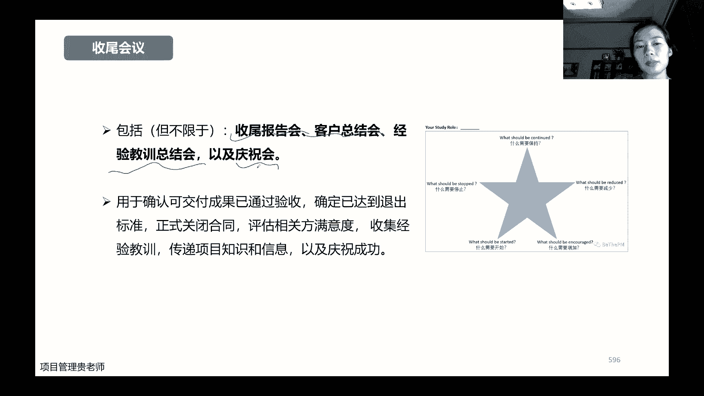