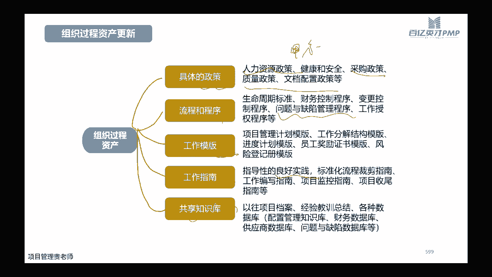

# PMP考试培训课程最新完整版项目管理认证第七版教材新版考纲自学教程 - P13：13.交付绩效域(二) - PMP专家 - BV1rM4y1Y79x

好刚刚断了一下哈。

好现在我重新那个了，我在群里跟大家说一下哈，现在大家OK吗，能够看到屏幕吗，OK哈可以哈。

那我继续了，刚刚莫名其妙断了，好我们嗯接着讲哈，前面讲了这个收尾的报告会啊，给我们公司的领导产生什么样的，这个价值和影响，那么同时呢我们给客户开这样的总结会，那么客户对我们这个项目非常满意。

那很有可能下一个同类型的这个项目，就有可能继续给我们做，或者是呢给客户的朋友也会推荐我们啊，这个服务，那经验教训总结会，当然前面讲知识管理的人就跟大家讲过，经验教训总结会非常重要，对不对。

因为我们在做这个项目啊，总有一些经验，总有一些教训要出现好，最后这个庆功会，庆功会呢啊一般情况据我了解哈，跟学员聊天的时候发现嗯开的也不太多啊，基本上就开成了这个形式化的，表彰大会。

表彰谁基本上也都已经内定好了，这种比较多哈，但是作为项目经理而言啊，作为我们一个优秀的管理者而言，其实我们是有必要在整个项目的过程当中去发，掘，在整个项目当中表现特别好的啊。

这些团队成员我说的表现特别好的团队成员，不是说哪一个或者哪几个团队成员表现的很好，而是说每一个团队成员，他表现得好的方面是哪一些啊，一定每个团队成员它综合来讲啊，有些团队成员他可能绩效差一点。

但是呢他一定会有他表现非常好的那一部分啊，那如果说我们能够花一点时间啊给他予以肯定，那么在下一次的这个项目当中啊，如果说有幸还是咱们在管着那一批的团队成员，那么很有可能他的啊。

这个工作的积极性就会很不一样啊，这个大家可以自己去试这几个会哈，嗯我们在开经验总结教学会的时候呢，有一个这个五角原则哈，五角原则啊，比如说A1般如果大家不知道怎么开的话，就围绕这五个框架啊。

围绕这五个原则去引导大家引导成员哈，就是什么啊，需要保持，就是我们在这次的项目过程当中，大家都觉得哪方面做的比较好，我们下次还可以去保持哪方面做的不好啊，需要减少哪方面做的不够，需要增加啊。

增加了这些从什么时候开始啊，现在就开始，还是下一次这个项目开始，还是说等到以后有什么资源支撑的时候，再开始啊，什么时候需要停止，哪些要减少，减少之后，什么时候需要停止，大家可以围绕这样的框架啊。

去引导我们的团队成员去集思广益啊，我相信能够得到大家觉得比较理想。

比较意外或者比较精细的一些答案，好今天教训等级测，今天作业登记册呢，是我们啊在整个这个过程当中啊，因为要不断去识别对啊，整个这个组织啊，对一对未来的这些项目，对将来的这些项目有价值的这些经验啊。

识别出来，光识别不行啊，我们说了要做好啊这个显性知识的这个记录啊，做好记录之后呢，还要分析和整理成可应用的一些成果啊，光记录不行，光记录说哎呀，我们比如说在跟甲方去沟通的时候啊，甲方是处于什么情况。

他一般什么样的回复代表这公司可能没钱了，或者说他说什么样的话，意味着他有一些新的一些需求的一些动态啊，这个只是简单的记录，那么我们还要分析分析，下次遇到这样之后，哎我们应该采取怎么样的一种话术啊。

去引导客户啊，比如说客户提了一些需求的一些新增一些变化，那我们诶采用什么样的方法去告诉客户，新增需求是OK的，完全没问题呀，啊先稳定客户，然后再提提，为了响应这些需求，我们时间可能有所延迟。

成本可能有所增加，这个是不是啊，客户能够考虑一下，对不对啊，所以呢分析和整理成可用的这种成果，然后呢在在存储在我们的这个经验教训库里边，然后在将来我们其他的这个团队成员，或者说你在做其他这些项目中。

我们就可以去应用了，这是整个我们经验教训登记册的，它的一个这个核心的一个步骤，大家可以去了解一下哈，最多的就更多的是一些这个实践啊，这些时间呢不仅仅是我们在团队当中啊，在项目管理的重要时间。

更重要的是我们在个人的这种工作，和生活的场景当中啊，这个大家都是吃一堑长一智啊，所以到底怎么去用啊，这个经验教训登记册到底怎么去给自己，不断的去啊复盘，啊总结啊，这都是非常关键的字啊。

啊这个相信对大家个人是非常有用的。

而组织过程资产更新，组织过程资产更新，我们更新的经验教训登记册，当然就意味着整个组织的过程资产可以有更新，组织过程资产更新呢，哎首先好它是有我们的这些运营的文件啊，项目的一些文件啊。

比如说我们的这个啊范围啊啊需求啊，进度啊啊，或者是我们相关的一些这个变更的，一些这个需求的这些文件啊，都是作为我们的沉淀下来的过程的，这些项目的文件，那以后再做同类型项目的时候，我是不是就有所参考啊。

最简单我们前面不是刚讲过核对代码，我如果这个项目我出现一些问题啊，我记录下来，那么下一次我是不是可以根据这些问题，是指我整理成一些核对单啊，那么我在这次做项目的时候，我是不是可以核对单里面的要素更丰富。

我能去规避或者减少的一些问题就更少，对不对，还有运营和知识类的文件啊，比如说啊在为了维护为了知识的一个项目啊，比如说我们采购啊，这个采购会说我们给他提工作说明书的时候，要拿一个正式的函。

那OK什么样的含呢，哎我们这个含的这个模板是什么样子，之前没有经过我们这个项目啊，我们总结了一个比较好用的，比较简单明了的这个模板，OK那也行啊，甚至是我们收尾的时候啊，比如说给客户写的这个报告呀。

哎这报告除了项目本身的这个内容之外，可交付成果的内容之外啊，它的整体的这个格式啊，我总觉得其他的项目的可交付成果之外的，这些经验啊，啊这些分析啊，啊这些数据啊啊包括给客户的这些建议呀。

诶跟客户开这个总结会的时候，客户相当满意，那OK这个报告格式我把它固化下来啊，同时呢啊相应的一些其他的一些这个啊，问题日志啊，啊这个啊因果图啊啊分析出来这些案例啊，这都可以积累啊。

这都可以归类在我们的这个经验教训，知识库里边。

所以它具体的这个分类哈，这是给大家画的这个啊图啊，比如说嗯有人会问组织过程资产具体指什么呀，那有一些政策呀，比如说我们这个啊，一般公司内部的这个人力资源政策，就基本上没什么没什么那个哈。

主要是我们面向的客户群体，他们的这些你还是人力资源的一些政策，如果我们能够通过做项目的时候，能够了解到的话，也可以去做一些积累，因为同类型的同行业的细分的行业内的，他们的这个好人力资源的啊。

最简单来说他们的这个需求点啊。

或者他们的薪资水平可能是区别不是特别大啊，那这个呢也可以作为我们的一种储备啊，一种数据库。

然后采购的一些要求啊，质量和文档的一些这个具体的一些要求点啊，公司内部的一些程序啊，一些流程好，比如说出现小问题之后怎么去上报啊，出现重大问题之后，怎么去解决工作的整个这个授权程序啊，出现了一些模板啊。

你不能说出现了一些模板，应该说我们总结出来的，或者体验出来的一些模板，和一些良好的这个啊指导的实践，那工作指南，档案呐啊经验的教训呐，还有数据库呀啊供应商的这个合作情况呀。

还问题出现问题和这个缺陷的这个原因啊，这些是统统都称为我们的组织过程资产哈，所以这张图相当于是嗯非常全面的去回应了，我们当时群里的那个小伙伴的啊，就是遇到那个问题哈，领导让你整这个经验教训，德内库啊。

让你组整这个组织过程，资产库的时候，你到底要从哪方面去考虑，这些方面都是哈都是。

好这有几个例题哈，第一个呢是说这个公司，它正在部署一个新的解决方案，然后呢嗯就发现安全审计结果，违法安全的行为以及不合规的这问题，那问项目经理应该怎么做，A那是说组织团队开会啊，来执行根本原因分析。

并且呢定义纠正措施计划啊，那他现在现在已经发现了这样的一个这个啊，审计结果发现了一个不合格的一些问题啊，问题出现了，我们肯定要是这个纠正，对不对，找到原因，然后并做纠正措施计划，哎呀A没什么毛病。

并不是说审查质量管理计划，已确认是否包含安全需求啊，可能有不少人呢也会选择B啊，觉得B好像没有问题啊，那我们当然要看看是不是包含了，那你想如果你做的质量计划，质量管理计划里面连基本的安全需求。

安全运车都没有办法，说明你质量管理计划没有做好，对不对，C呢是说与安全审计院协商，降低引力发生问题的重要性，问题的重要性是你能够协商出来的嘛，它是一个事实，对不对。

D呢是说验证指南要求与解决方案是否一致，并更新质量管理计划，那首先应该是要出解决方案，对不对，你有了解决方案，你才能够去验证它啊，这个解决方案是不是可行，然后更新一下我们质量管理计划。

所以首先应该是找到根本原因啊，来做一下纠正措施计划，第二题是说啊这个期限啊很短的一个项目，关键的相关方希望避免质量控制，什么意思呢，就是说啊时间紧张，你这质量控制的工作是不是少做一做啊，不做最好啊。

但是项目经理呢又知道啊，你作为项目经理，知道必须要保证最低的质量水平，也就是说你你这个质量控制的动作，做多还是做少都是次要，但关键是你要保证这样水平，你怎么保证质量水平呢，啊对不对，你你通过什么动作呢。

现在问你，你到底应该怎么使用什么工具和技术哈，嗯A统计抽样B啊，A标杆对照，B统计抽样，C实验设计啊，D成本效益分析，看起来呢都是我们做质量控制的啊，这样的一些这个工具，这个答案的选择D为什么。

是因为现在是你啊，作为项目经理，你跟这个关键相关方，你对于做不做质量控制这件事情，这个活动产生了分歧啊，这个活动做不做，我们说质量控制这个小活动，他也是一个小的项目啊，评判一个事情做不做。

我们用成本效益分析啊，要做商业论证啊，对不对，好，要看看它性价比高不高啊，我们做质量控制要花一个月的时间啊，还是花两天的时间，它能产生的效果啊，他需要的质量成本，它能规避的一些问题。

带来的规避的一些损失是多大啊，所以要做成本效益分析啊，来说服这个关键相关方到底是啊这个质量控制，为了达到最低的帧数，实质量水平到底应该怎么做啊，做不做和怎么做，第三题，第三题呢是说。

在最终产品获批之前举行的相关方会上，那有个相关方就说，你这个产品缺了一个重要的功能啊，问你现在应该先怎么做呢，啊先说第一讨论这个问题啊，并让该相关方相信增加更多功能已经为时已晚，哼就是我们讨论讨论。

那你反正这个工程现在已经来不及了，显然是比较消极的，不解决任何问题，对不对，B呢是说估算增加该功能的成本啊，B让相关方予以批准，这ab是两个极端哈，A呢是说就是我相当于是我你虽然说缺了。

但是我就不管你了，你你现在已经满了啊，这个态度过于消极B了，态度又过于积极啊，你增加先增加了，增加了，我们看看有多少成本啊，对不对，所以AB是两个极端啊，C呢是不是根据定义的验收标准。

核实该工作是否属于项目范围啊，这就是标准的动作，既然他说了，他在抱怨，那我们首先要看一下这个功能，它是不是在我们的项目范围之内的，如果是在内的，我们又缺失了，那赶紧去补，对不对。

如果说他不是在我们项目范围之内的，那我们心里去拒绝他的时候，有没有底气，也有底气了，对不对啊，D根据该相关方的要求提交变更请求，提交辩证请求，也是你要先评估一下它是不是属于项目范围。

如果是属于我们又遗漏了啊，那你就要做相应的变更请求啊，来增加我们的这个啊这个工作内容啊。

增加我们的这个时间啊，增加我们的这个成本。

好啊，以上是我们今天晚上讲的这个交付的技巧语哈。

然后我看看大家有没有什么问题啊，嗯有些人问说，经验教训登记册和经验教训知识库的关系，可以讲解一下吗，之前有个题说经验要登记测试项目文件，教训库是组织过程资产，嗯组织过程资产里面也有项目文件。

你想问的是呃，项目文件和经验教训知识库之间的这个区别吗，应该说啊最大的就是我们的组织过程资产，然后组织过程资产里边呢，它包括了经验教训的这个知识库，知识库里边呢，它又包含了我们所有的这个项目文件。

然后经验教训登记册呢，它是我们记录经验教训的一些具体的这些文件，所以他这三个哈是从大到小，有一个有一个这个逻辑顺序在里边，看看大家还有没有其他的一些问题哈，今天晚上的这个嗯正课的内容已经讲完了。

给大家留几分钟的时间嗯，看看有没有什么不理解的，或者是有什么问题的，可以问一下，没有其他问题了吗，还是说有延迟呢，我等再等2分钟哈，如果没有什么问题的话，那今天晚上的这个课程我就结束了哟，好没问题啊。

没问题诶，嗯没错，嗯那个巧克力的理解是对的哈，你的理解是对的嗯，然后看大家还有没有其他问题，不客气，好如果说没有其他问题的话，我们今天晚上课程就先到这儿哈。

