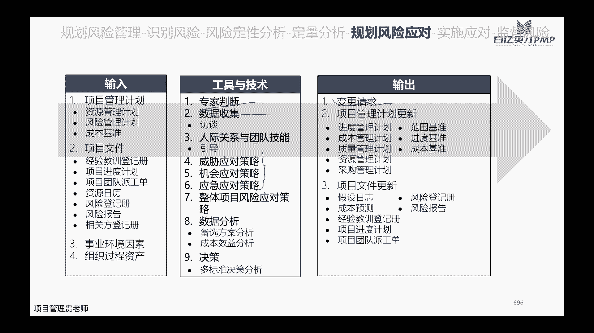
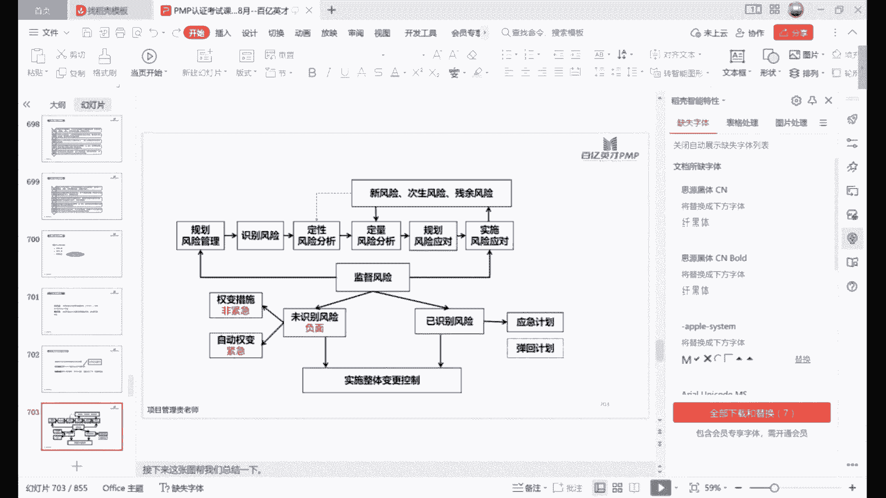

# PMP考试培训课程最新完整版项目管理认证第七版教材新版考纲自学教程 - P15：15.不确定绩效域 - PMP专家 - BV1rM4y1Y79x

好我们今天晚上讲不确定绩效率哈，嗯不确定绩效与之前呢，我们还是花一点点的时间，先把上一节课讲的测量的绩效与回顾一下哈，我不知道大家下去之后，有没有再去回顾一下自己的测量，绩效率那一块的核心的重点内容。

相应的题目有没有去练习哈，嗯如果说掌握的还不错的，可以自己在心里面默默的回顾一下，如果掌握不太好的，也可以跟着我的思路，咱们再一起回顾一下哈，我们上节课讲的这个啊测量最效率，重点呢是要讲测量什么东西呢。

唉测量内容比如说啊测量资源，它的使用率啊，实物资源的使用率，以及呢它的成本跟我们计划的啊，相对比有哪些偏差，当然也包括了我们人力资源，有没有正常的去使用，有没有人员的一些闲置资源的优化，做的怎么样。

同时呢我们还要测量一下啊，干系人测量干系人呢又分了几个维度，测量它的净推荐值啊，就是说这个项目做完了之后，他愿不愿意帮我们把我们这个团队，把我们的产品和服务向第三方去推荐。

然后呢还要测量他们的整个这个情绪，测量团队的士气啊，测量团队的离职率，这都是一些具体的可以实操的一些指标，同时呢我们还有啊测量交付成可交付物，那具体呢是它的范围，是否是满足我们的验收标准。

它的质量呢是否是啊，确认是合格的，在交付的整个过程当中呢，啊这吃的就多了，我们要测量整个在制品是不是合理的，是不是可持续发展的啊，整个过程的这个优化，啊等等一系列内容哈，一系列的内容。

那最重要的是我们还要测量基准的绩效，基准的绩效里面呢，哎这个时候有人如果说学过第六版的话，就比较熟悉了，我们第六版讲过的费用的偏差，CV进度的偏差，SV啊，以及跟它对应的CPI费用的绩效指数。

和进度的绩效指数，然后同时呢我们还要知道BAC几个输入的，然后呢PV啊计划的价值，因为震动的价值，AC实际的花的成本，根据这几个输入呢，我们可以得到前面的这几个简单的公式，算出来就可以得到这几个数值。

当然还有其他的这个etc啊，剩余完工的这估算啊，EAC完工的估算，包括DC完工的工期的一个估算，是不是上节课其实主要讲的内容就是这些，对不对啊，如果说还不太熟悉的，或者还没有来得及听回放的啊。

可以在嗯根据我的思路下去之后再巩固一下，好今天晚上讲的不确定绩效率呢，他主要是跟我们的风险啊，和我们为什么会有这样的风险，因为不确定性，所以呢会有一些风险，那为什么项目会有一些不确定性呢。

而是因为我们的整个技术在不断的更新迭代啊，整个社会的环境，政治文化市场啊，包括经济都有，都是处于，都是处于变动的啊，都是处于动态的，所以呢这是因为它是动态的，而我们在做项目的这个过程当中呢。

它是随着这个动态会有一些变动存在，所以呢我们在做项目的过程当中，要积极的去探索，并且呢去应对不确定性哈，所以呢并不是说诶我们做这个项目的过程当中，明明已经花了很长的时间做了规划，但是呢在做的过程当中啊。

又发生了很多的不确定性，觉得好烦啊啊好，这个项目做的好郁闷啊，不能这样想，为什么呢，因为我们做规划本来就不是说，为了让我们执行的动作，跟我们规划动作一模一样，这显然也是不可能的，对不对。

我们做规划本来就是提前的去啊去探索一下，看看我们这个项目过程当中，有哪些是确定性的啊，有哪些可能的不确定性，然后呢我们在执行的过程当中再去验证啊，这项目当中具体到底是哪一些不确定性的。

是我们已经感知到的啊，是哪一些是完完全全没有被我们意料到的，这种补贴类型，那随着这样啊，我们做规划做的越来越多，验证的越来越多啊，我们自己面对同类型的各种项目，我们所谓的啊所谓的这个经验也就丰富了。

所以什么是经验呢，啊做过项目不能单纯叫做做个项目就叫经验，而是说你通过做项目，你得到了什么啊，你沉淀下来什么，对不对，同时呢还要了解啊，既然说我们项目的这些啊技术啊，社会啊，政治文化市场的这个环境啊。

经济的因素啊都在变，那么不同的这些变量之间呢，它到底会怎么样影响我们的项目，影响我们的项目范围，影响我们项目质量啊，影响我们交付的一些成本啊，影响我们项目执行的这些团队成员啊，那这些变量之间。

它们之间的相互关系依赖性是如何的，这也是我们不确定，就像里面啊要重点关注的同时呢，这些不确定性它会给我们项目带来怎样的啊，这个风险啊，我们说风险在这里要跟大家说一下。

这个风险不能大家就认为啊风险啊糟糕糟糕，有风险，不能一味的认为风险是坏的哈，风险呢它既有啊威胁，这个是代表性的这个负面影响，也有好的影响，我们叫做机会哈，所以不要觉得不确定性就很烦。

因为不确定性它是有威胁，它同时也会赋予我们更多的一些机会哈，所以呢是预测威胁和机会，同时呢啊，这个威胁呢代表他受到的一些负面的一些影响，然后机会呢代表他可以去啊，咱们可以去改进项目的哪些迹象啊。

可以去优化他的哪些的这个成果，这是我们整个不确定性绩效里面要重点关注的，所以有些人他可能会问他说啊，老师啊，这个不确定教育是不是就是我们第六版学习的，这个风险呀，啊不能完全对等啊。

只能说风险是其中的一块啊，并且是核心的一块内容，但是呢不确信技巧与不，完完全全就只等于风险哈。

好那不确定教育他除了他的整个这个逻辑呢，是因为啊我们现在应该大家都听过一个词，对不对，叫做无卡时代，对不对啊，正是因为有乌卡时代的存在，所以呢VUCA这是因为存在不卡这个时代啊，动态变化太快了。

所以呢现在敏捷这种理念，提倡的也是越来越多啊，所以呢咱们的PMP的考试，加入了这么多的敏捷的内容，所以呢咱们整个这个PBOOK的第七版的，教材的更新也是啊从实操啊，从完完全全固定性的预测性的。

这种实操性的这种这个知识理论，上升到了原则性的指导性的方向性的哈，这一切的一切都是因为时代在变化啊，这个乌卡时代，我相信大家应该嗯只要是做过项目，应该多多少少都听过这个词吧。

那么啊乌卡时代呢它的几个代表性哈，就是第一啊，整个这个项目本身的背景它是比较模糊的啊，它是有一定的模糊性，同时呢它还有异变性，而且呢它还有一些复杂性，因为它模糊，因为它一变啊，因为它很复杂。

所以呢导致了非常非常多的不确定性，有了这些不确定性的，所以我们的目标没有办法，事先的是完完全全百分之百的去把预估，如果说有正面的一些影响啊，那我们叫做风险的机会，如果说有负面的影响啊。

我们叫做风险的一些威胁，如果没有影响，那说明这个项目没什么风险，但是很显然啊，这个无影响，只能说个别性的因素，它可能对咱们这个项目没有风险，没有影响，但是大多数还是多多少少会有一点风险，会有一点影响哈。

那不确定性啊，这个模糊性复杂性，有些人一听就觉得这不都一样吗，啊有一点区别哈，这个我是有一点区别的，首先不确定性呢是因为我们不确定啊，不了解的各种各样的情况都叫做不确定性啊，我也不确定性啊。

下一秒咱们这个直播会不会，平台会不会有所卡啊，咱们现在在听直播的这些小伙伴，你也不确定下一下一秒啊，这个嗯你的这个家人或者是你的这个同伴啊，会不会突然叫你出去啊，去喝个茶，喝个咖啡啊。

会影响你模糊性呢是不清晰的状态啊，不清晰的状态呢是你了解这些状态，但是呢你又不是那么的了解啊，处于了解不了解的中间啊，它有一定的模糊的状态，复杂性呢是说啊这个项目各个要素之间，他们的关系错综复杂。

很多种多样啊，甚至呢说千变万化啊，动一发，这叫什么呃，这个动牵一发而动全身啊，知识复杂，同时呢异变性啊，异变呢，就是说它很容易发生不可预测的一些变化，那风险呢是说一旦发生啊，会对我们项目目标啊。

记住它一定是对项目目标产生了影响的，不确定事件才叫风险，所以呢啊比如说咱们现在啊这个举个例子啊，咱们现在在上直播课，这是一个今天晚上的这样的一个项目哈，一个短期的一个项目，那么嗯下不下雨。

这是一个不确定性的事件，对不对，晚上会不会下雨，那晚上会不会下雨，这个对，咱们今天晚上直播这个项目是有风险的吗，大概率是没有，对不对，因为下雨不下雨，它不影响我们直播，不直播。

他对我们做直播这个项目没有产生影响啊，所以风险它一定是跟项目的目标去挂钩的。

所有的项目当中都会有一些不确定性哈，都会有一些不确定性嗯，这个大家可以嗯自己去思考思考哈，我们自己在目前在经手的或者在正在管理的，或者正在参与的这些项目啊，如果说之前在项目开始的时候。

咱们已经做过这种风险的识别啊，已经识别过或者说提前的探索过风，整个项目的过程当中会有哪些不确定性啊，这个很好，当然如果说咱们在最开始的时候做这个项目，并没有做这个风险的识别。

或者不确定性因素的一些这个整理，没有做这个动作也没有关系哈，那么今天晚上的课程之后，咱们可以自己给自己提要求啊，自己去试着拉几个同事一块儿来研究研究啊，看看咱们这些项目有哪些不确定性。

然后呢你在之后的这个过程当中，你可以去验证一下，你们当时啊当初讨论的这些不确定性，它是否发生了啊，这个很锻炼人啊。

那是不是面对这项不确定性，我们就啊说这个项目本身有很多不确定性啊，所以我们束手无策啊，就认这个不确定性去带着我们项目去飞啊，走到哪儿算哪儿，是不是这样子的，不是哈不是，虽然说项目都会存在一些不确定性。

但是呢我们可以做一些动作，去尽量的去减少一些不确定性哈，首先我们可以在项目早期的时候啊，就研究一些多种一些多种方案，做一些备选方案出来，这个相信大家也都听过哈，永远有一个plan b啊。

永远有一个B计划，这个显然啊做起来可能比较困难，但是呢这是一种思路，是一种方法哈，一旦发生这个不确定性，产生影响比较大的时候呢，那我们还有一个B方案啊，我们还有一个B方案去应对它，然后呢第二个呢是啊。

尽可能多的去收集一些信息，尽可能的去收集市场上面的一些数据，竞争对手的一种状态啊，如果说没有竞争对手啊，那当然更好，那就去观察一下你潜在的用户，去探索一下潜在的用户，他们的兴趣点，他们的消费习惯。

或者他们的使用习惯是什么样子的啊，同时呢既然我们做了多种方案，那么就会存在多种结果，那多种结果呢啊，它对应的这个啊多种方案对应的这个结果，他可能是不太一样的，那么产生了不同的结果。

我们是不是能够很好的去应对啊，当然这个结果如果说是很好的啊，我们啊这个坐着坐着，突然发现哎呀公司招了一个特别厉害的，这个有类似于项目经验的，会使用AI的这种团队成员，一下子给我们结了很多时间啊。

那这个显然这是好的结果，大家都能接受哈，那如果说是不好的结果啊，做着做着发现啊，突然这个厉害的大刘他走了啊，我们的整个团队工作的效率一下子降低了，非常非常多好，最后项目延迟了，奖金没有了。

那这个结果咱们能不能去接受啊，这是举了一个大家比较关心的这种结果哈，当然实际的如果说只是影响团队内部的结果呢，他可能并不是说特别大的影响啊，站在公司的角度来讲，站在公司的角度来讲呢。

他最担心的是影不影响这个项目交付啊，影不影响这个客户的回款，你不影响这个客户将来的维护关系维护，对不对，还有一种呢是尽可能的去增加韧性哈，这个主要是指的团队成员的韧性。

因为是我们项目的团队成员在做项目呀，啊所以我们团队成员本身抗打击能力怎么强啊，强不强啊，这个对环境的适应能力和对这种变化的响，应能力啊，快不快，迅不迅速，敏不敏捷，这个也是一种办法哈。

一般常见呢可以有一些动作去增加啊，增加团队的他的适应性和韧性能力，这是我给大家列的哈，这个教材里面应该没有，但是呢我觉得这个大家实际当中，尤其是你在带团带团队的话啊，这些方法都很有用哈，都很有用。

首先啊第一条呢，你可以采用一些较短的反馈路径，什么意思呢，你看咱们做预测性的项目一般是周期性的啊，阶段性的去啊汇报啊，但是呢我们说了做适应性的项目呢，我们是尽可能短的反馈啊，一周或者两周。

最多两周有一个迭代，并且呢在每一个迭代的过程当中，我们每一天都要开展，会每天都会同步一下大家的进展状况，对不对啊，有问题每一天都会发现，那其实适应性的状态，适应性的项目。

它就是遵循了一个非常短的这种反馈路径，对不对，因为我们为什么要采用脚本的反馈路径啊，因为我们要增强适应性啊，上一期为什么要增加深一些，是因为变化太快了，变化太大了，如果你一个星期你才问一下啊。

问一次大家的一些动态，那么很显然在这个过程当中可能会发生一些，这一周会发生很多的事情啊，有可能等你听汇报的时候，等你的团队成员再给你反馈的时候，这黄花菜都已经凉了，对不对，第二个呢是持续学习和改进。

这个没什么好讲的，大家都知道对不对，学习和改进提升自己的能力，当然你解决问题，处理问题的这个能力就有所提升，你的适应能力，韧性当然就增强，第三个呢是你自己要去有意识的，去培养多样性的一些技能啊。

去接触不同的一些文化，去包容他们啊，去积累不同的一些经验啊，在这个过程当中呢，你也可以去这个多跟一些主题专家去交流啊，听听他们的一些意见，听他们的意见，长自己的知识，丰富自己的一些知识框架啊。

还有呢要定期的去检查和调整项目的工作啊，这个主要是针对于对象的管理上面哈，近近定期的去跟项目团队成员去多沟通沟通啊，看看他们在工作的这个过程当中，有没有什么样的一些问题啊，有没有提升的一些办法。

同时呢在招募团队的时候啊，尤其是我们组建团队的时候，尽可能的去选一些比较丰富经验的，这种项目团队，这个当然我相信所有人都愿意选这种闲人哈，所有人都愿意把闲人选到自己的项目当中来，对不对，因为一个人啊。

他如果足够优秀，那可以为咱们整个项目省很多力，但是往往在实际过程当中，我们发现啊，我们做这些项目都是来的都是一些闲人，尤其是你找职能部门要的这些人啊，职能部门往派给你都是一些闲人啊，很恼火啊，对不对。

所以没办法，但是呢我们还是要把这个原则啊要保持住，一旦我们有机会自己去选择的时候，那你就尽量的去选择学习能力比较强啊，经验本身比较丰富，比较能够上进的这些团队，同时呢要创造一种开放透明的。

这种项目的团队的文化，让我们在做项目的过程当中呢，不管是内部的这些团队成员，还是说外部的这些干系人，都能够很愿意参与到我们这个团队当中来，很愿意跟我们去沟通啊，去讨论啊，去一起探索。

这些不确定性可能会造成一些影响，然后呢唉我们应该怎么去应对，同时呢，唉第七点是要鼓励一些小规模的一些原心法，或者试验，尝试一些新的办法，能遇到问题，遇到困难，卡壳了怎么办，卡壳了不能干，等着啊，对不对。

卡壳了，我们要尽可能的去找原因，有的原因找不出来，找不出来，我们就聚焦一些主要的原因，针对主要的原因去探索一些解决方法，并且呢再一个一个去尝试，对不对，尝试下来，总有可能去找到一个最终的解决问题的办法。

第八点呢是充分用新的思考方式和工作方式啊，这个时候就是为什么提到有的团队说啊，死气沉沉，大家工作经验都非常丰富了啊，这个老气横秋的都不愿意用一些新的方法，一出问题呢就是123步啊，123步。

那这个时候呢，我们可能团队有一些新鲜的血液啊，有一些思维比较活跃的人啊，他的工作方式啊，工作理念都超前于我们啊，我们还在苦于去网上各种搜资料的时候，人家已经用AI软件。

把自己所有的这些信息都已经查到位了，那这种就是一些很好的一些实践，第九点呢是要平衡工作速度和需求，的一些稳定性啊，这个主要是通过我们限制一些，在制品的一些数量啊，啊，这个尽可能的不要嗯。

让团队成员过分的去加班啊，追求一种可持续的发展，第四点呢是鼓励在组织内的一些开放式的对话，这个如果说啊，大家处的这种团队文化是比较扁平化的啊，氛围是比较好的，那显然这个应该不难。

但是呢如果说是在一些这个团队的氛围比较啊，这个层级比较比较分明啊，这个尤其是很多体制内的啊，这种职场的政治文化比较浓郁的，这种呢可能开放式的对话有点难哈，大家都在做表面功夫，那这种显然都在做表面功夫。

是不太利于我们整个团队，去适应整个环境的变化的，第11点呢，是要充分理解类似工作当中所学习的，这个学习成果，这点没什么好讲的，然后第12点前面跟前面是一样的哈，积极预测多种潜在的情景。

然后并且为多种可能情况做好准备，其实这个呢说起来很简单，但做起来呢其实有点难哈，但是我还是比较建议大家，尤其是尤其是当你跟，当你刚刚接触一个新的项目之前，从来没有接触过的这种，那你在心里面可以去先预测。

那预测的时候你有了预测，你在做的过程当中，你就有验证，有了验证，那么你就可以更好的积累，你在这方面的一些经验，你下次再提的时候，你所拥有的确定性就越来越多，而相反你所拥有的不确定性就会越来越少哈。

这个是非常值得大家去实践的，这一点，包括你去找甲方的客户，你去聊啊，你去谈判也是的，你提前预估一下甲方会有怎样的一些，应对办法啊，那么甲方怎么应对你，他出什么招，你也出什么招啊。

第13点呢是尽量的延迟决策，将决策推迟到最后时刻，那这一点呢其实并不绝对哈，并不绝对，这个呢主要是啊应对一种，这个这个说风就是雨的，主要是应对这种场景，但是并不是说那这个老师有人就说啊，老师讲过了。

我们尽可能延迟决策，有一个事情很紧急了啊，不决定不决定不决定，等到最后都已经着火了才开始决策，不是这个意思啊，所以13点不要给大家有些误解，第14点呢获得管理层的支持，这个很好理解，对不对。

你不管是采用了什么样的一些办法，能够啊，想象的是可以提高团队的韧性，和这个适应能力的，那么最终你肯定是在执行的过程当中，你要获得管理层的支持，对不对，除非你这个事情。

你只在自己心里面默默的自己一个人做啊，自己默默的提升，让别人把别人都甩在甩在身后，那除非你是这种想法，对不对，但很显然我们说了，做项目啊，尤其是作为项目经理，你一个人能力再强不行啊，因为大家是一个团队。

你得带着大家一起抢啊，一起写作，我估计呢它分了两类哈，第一类呢是概念的模糊，然后第二类呢是情境的模糊啊，概念性的模糊呢，嗯这个解决办法一般就是你去啊，这个概念如果模糊的话。

你就把这个概念尽可能去把它这个啊约定下来，给他一些规定一些术语，这些术语呢有可能是这个行业通用的啊，你如果说这个行业里面没有，那么咱们也可以约定咱们客户之间的啊，或者是咱们团队内部的这些。

只要大家达成共识的都OK啊，把尽可能的把这个概念的模糊性把它降低啊，比如说我们现在说到了这个P啊，pm啊，简单的说pm pm，不管是这个行业还是说非这个行业的人，我相信大家应该都能默认啊。

pm就是我们的这个项目经理啊，我们说CV啊，那大家都能够默认CV代表就是这个费用偏差，对不对啊，不会有人说啊，CV是其他的一个什么东西，奢侈品嘛，品牌吗，什么不会有这种这个概念上的一些模糊，对不对。

第二个呢是情境的一些模糊，情境的一些模糊呢，这个主要是说我们在做项目的过程当中啊，这个需求啊啊或者是这个环境啊，对应的这些情景，他不太能够准确地被估算出来啊，所以这个时候呢。

第一个办法就是我们做规划的时候啊，或者做项目的过程当中，本身项目本身的特点也是渐渐明晰的，随着啊项目做的越来越多，你交付的东西越来越多，那么你掌握的信息也是越来越多，你估算的当初估算的这些。

不管是进度也好呀，还是成本也好呀，还是资源也好啊，那在验证的过程当中也是越来越准确了哈，第二个呢是可以通过做一些实验，尤其是做一些科研项目，做一些科研项目呢，那么如果这个时候啊有一些情景不太模糊。

那么最好的办法就是你做实验设计啊，做了实验设计，然后再去验证啊，验证完了之后再去改参数，改参数的时候再去做实验啊，直到你最后得出啊，这两个参数之间到底有什么关系，对不对，那第三个呢就是我们做软件当中。

经常提到原心法啊，客户自己也描述不出来，他具体啊，他只能说大概的需求啊，我想要一个这个软件啊，这个软件呢当我这个我可以用这个软件呢，大家都把这个工作的一些信息啊，啊都上传到这个软件上面啊，有什么汇报啊。

流程啊，我都去这个软件去完成啊，我不需要人，那么它只能描述出来这种高层次的一些需求，但是里面具体有什么功能呢，啊他也说不清楚啊，登录之后啊，是需要几个号登录，支持几种登录方式，邮箱登录还是账号登录。

还是手机验证码登录啊，这些具体的方式呢他可能不知道，那么就要基于我们做过类似项目的一些经验，我们用做一个这个demo做一个原型啊，给他去确认，看看你是不是要的是这种去引导他，对不对。

所以这些都是应对情景模糊性的啊一些办法，然后复杂性复杂性呢啊它有几种哈，首先人本身它就是一个很复杂的一个高级动物，今天想的跟明天想的他可能他就不太一样啊，今天大家觉得啊这个听完老师讲的。

觉得这个PMP也太有前景了吧，啊这个尤其是会用AI软件的这个pm，将来那在市场上一定是吃香的，一辈子都不会失业，可能刚听完觉得很兴奋啊，那明天自己一做题夸错了很多，就觉得这个PMP。

然后和这个pm还是太难了啊，pm就是背锅侠，对不对，所以人本身就是他的这个行为，他的心态啊就是很复杂的，第二个呢是我们做的这个项目本身，它的系统是很复杂的，所以呢我们啊基于人的复杂，基于系统的复杂。

所以呢基于整个项目的过程的复杂，所以咱们无论是项目还是项目集，它都是存在各种各样的这个复杂，然后基于系统的复杂性呢，有一些应对办法解耦啊，啊有一些这个模拟呀，基于重新构建了这个去制造一些这个啊。

去容纳它，包拉它它的一些功能，包容他的一些多样性，去寻求一些平衡点，基于过程的这些复杂性呢，啊我们尽可能去这个缩短一些反馈啊，因为一些迭代尽可能的去让您领导，我们的这个相关方，该新人尽可能多的去参与。

还有在这个过程当中，如果出现了一些故障啊，那我们怎么样采取一些故障的一些保障措施，那针对易变性呢啊，易变性我们要准备一些这个备选的一些方案啊，同时呢还要有一些这个储备，包括前面讲的我们有应急储备啊。

有管理储备啊，大家还记不记得我们在讲这个预算的时候，啊预算它是包括了成本基准，和管理储备的，成本机制里面呢，它又包括了应急储备，和这个工作包的成本，预算，好风险呢也是风险呢，他是说前面讲过了。

会对我们的项目的目标产生积极或者影响啊，这个目标呢一个目标，两个目标，三个目标啊，多个目标都OK，只要产生影响，那么这些我们叫做风险，消极的呢叫做威胁啊，积极的叫做机会。

所以我们在啊整个这个项目的过程当中呢，因为项目都有不确定性啊，都有可能有风险，所以呢这个时候应该主动去识别风险，尽可能的去规避，或者是呢尽可能去减小他带来的一些，负面的一些影响嗯。

组织或者相关方的因素呢，它主要是受这个三类哈影响，就是我们说的常说的这个风险偏好，风险承受力和风险临界值啊，风险偏好呢他就是说啊这个组织啊，或者说这个人他愿意承担啊，这种不确信的程度啊。

比如说嗯不知道大家炒不炒股啊，啊买不买基金啊，买基金或者炒股之前，不是都有一个这个你的风险评估，都有一个风险评估吗，那么你是愿意啊去买这个啊，正常的最基本的这种理财，或者是更愿意更稳固一点，放到银行啊。

追求2%或者3%的这种年化，还是说啊你的这个风险偏好更强一点，你愿意承担更大的一些风险，你追求可能更高的一些回忆啊，去炒股，这个亏个20%能接受啊，当然你也是为了追求20%，至30%的这种收益。

那这个呢就是反映的是风险的偏好，那风险承受力呢是说这个组织啊，这个公司或者是个人他能够承受的风险的程度，数量或者是容量啊，什么意思呢，你能够承受啊，比如说你投了100万在股票里面啊，在股市里面。

那么你承受的这个最低啊，你承受的是10%的损失啊，-十十万%块钱的损失啊，这个是你的承受力哈，那么呃风险临界值呢是说你要在这个临界值啊，是你超过了这个临界值之后，你开始关注，开始采取措施。

那比如说还是同样的这个炒股的这个例子哈，你投了100万在股市里面啊，然后呢啊你的承受力是啊负10%，当然有些这个风险管控能力比较好的，正负10%，我盈利10%之后，我也收手啊，我也这个呃这个空仓也OK。

那么临界值是什么意思呢，临界值是说你超过多少之后，你开始采取动作啊，比如说你的戒指是支付5%，当然一般情况下可能是负5%啊，他跌到5%之后，我就换仓啊，我就采取动作好，所以呢对于组织来说。

低于风险临界值的时候，我就接受啊，你没超过5%的时候，没有跌到50%，我无所谓对吧，有风险我接受，我认可，但是你要是超过了之后，哎我就不能撤出了，我要采取措施了，所以这几个这个这个词儿哈。

偏好承受力跟临界值它是不一样的，这个概念，当然任何一个组织呢啊，他如果他愿意承受不同的这个风险，意味着我们在做这个项目的过程当中啊，他整个这个组织当然尤其是这些高层哈，就是对这些项目有决策权的这些人。

他对这个项目它是进取型的还是保守型的啊，这个就取决于它的风险偏好，以及这个组织的这种风险承受力哈，有人说这有这跟我有什么关系啊，这当然有关系，对不对，这意味着我们的风险的应急储备能够储备多少。

以及呢管理层给我们多少的这个管理储备啊，第一个是啊意味着这些我们能有多少，除非能有多少，第二个点呢是意味着这个项目啊，在中间如果他的这个进度啊，或者是成本啊，或者是范围它超多少，组织是可以接受。

是不会叫停，不会终止这个项目的，不会让你丢饭碗的。

好既然讲到风险呢，啊我们就要讲讲这个风险的分类，这张图呢很重要啊，这张图呢大家也把它理清楚，首先呢啊我们，已经识别啊，并且分析过的这个风险呢，我们叫做已知的风险，那像跟它对应的哈，如果说没有识别。

没有分析过的风险，那么就找好位置的风险，显然没有识别过，也没有分析过这些位置风险，我们是没有办法主动去管你的，对不对，因为你都不知道这有什么风险，你也没有去想他，这个是未知的风险啊。

那么已知和未知的风险啊，因为我们项目，它是一个随着时间在动态的变化的，所以呢又存在一种这个基于这两个基本的概念，又存在了叫已知未知的风险，已知未知的风险是什么意思呢。

已知未知的风险是我们在做规划的时候啊，我们已经预判到了，可能会有这样的风险啊，但是目前是不是真的要发生呢，我们不知道啊，正是因为不知道，所以我们没有办法主动去管理，那我们就安排一部分的这个费用啊。

比如说假如啊我这个预判这个风险将来发生了，我就用这一部分的这个费用啊，我们叫应急储备，我们就用这一部分的应急储备啊，来实施我的这样的一个应对的计划，这个叫已知的位置的风险，那什么叫未知未知的风险呢。

未知未知的风险就是啊我我事先我是未知的，事先我是没有识别到这样的一个风险的啊，我也不知道它发生的概率是多大，也不知道他会有什么样的影响啊，所以呢他将来万一发生了，我也没有办法啊，我我因为没有应对计划。

没有应急储备，那发生了怎么办呢，我只能动用我的管理储备啊，走一些变更的一些流程，所以啊已知和已知未知风险和未知未知风险，它是完完全全两个不一样的这个概念哈，给大家举个例子吧，比如说你去啊旅游哈。

你去旅游，那么嗯你是一个比较谨慎的人啊，你是带着家人啊，尤其是家里这个有媳妇有小孩子的，那你这个时候呢你做了充分的准备啊，你觉得你去旅游，你查了天气预报，你觉得那几天呢有可能啊这个有下雨啊。

可能天气这个温度变化的会比较快，有可能会感冒啊，有可能会着凉，那么这是一个你是已经识别到的，已知的这个风险，但这个风险他是不是将来一定会下雨了，咱们还不知道，那你如果说下雨了，这个温度有啊，周将啊。

那怎么办呢，你准备了啊这个厚的外套啊，你准备了厚的外套，准备了感冒药啊，以至于呢你将来如果说真的发生了这样的一个，这个这个温度骤降的这样的一个情况，你可以穿上后卫套，对不对，如果已经感冒了。

那你可以喝感冒药啊，这个就是针对这个，就是典型的已知未知的风险啊，你有应对的计划，那什么叫未知未知的风险呢，它同样你是去旅游啊，你也没看天气预报啊，你也不知道，或者说你看了天气预报。

天气预报播的特别好啊，这几天都是晴天啊，大太阳特别好，但是你去了之后呢，突然来了一阵台风啊，你这个大家都没有预料到啊，那这个时候温度突然满30-15，那很显然这个温度骤降啊，这个孩子感冒了。

那这个就只显然位置位置的风险，就是你完全没有应对的一些计划，这个是未知未知风险，所以举个例子大家应对起来啊。

大家理解起来就比较简单了哈，嗯一般情况在我们项目当中会有哪些风险呢，我们用可以用风险的分解结构哈，这个也是一个工具啊，这个层级用风险分级结构呢，它一般啊，可能会比如说根据我们的项目的这个啊。

不同的这个维度啊，它有技术上的一些风险，比如说范围定义的明不明确，需求收集的啊，合不合理，需求评审有没有人有没有相关方还没有签字，整个技术啊，它的知识产权归属权有没有一些风险啊，有没有一些纠纷啊。

技术的成熟性稳定性啊，是不是OK啊，管理上面呢啊，项目管理是不是成熟组织的项目管理体系嗯，是不是合理的，是不是这个跟我们运营上面啊，包括我们的这个运营管理是不是非常的流畅，整个组织能够提供的资源。

是不是能够暗示的到位啊，组织的沟通是不是非常的顺畅啊，商业上会有什么风险呢，啊合同条款有没有一些这个隐形的一些坑，合同条件是不是非常苛刻啊，是不是完全的这个制约太大，我们可能有可能没有办法达到啊。

内部采购上面有没有牛市上面那些卡壳啊，采购起来有没有一些困难啊，供应商提供他的这个服务或者产品的时候，有没有这个打折扣啊，会不会有这种可能性啊，客户稳定性怎么样啊，这个客户稳定性啊。

比如说我们我我我最近在咨询的一个这个公司，他们就遇到了他们做会展，然后就遇到了一个这个合作方法，是给他们做，是给他们做具体的这个会务服务的，结果呢，这个会展公司的一把手年纪轻轻突然挂了。

整个这个服务公司呢群龙无首，然后整个这个会展会定在7月啊，定在7月中旬啊，现在搞的这个这个我们这个客户呢他也很被动，因为他们自己没有会误导这些经验，所以呢你的客户的稳定性，包括你的供应商的这个稳定性。

这也是商业上当中可能存在的一些这个风险，然后呢包括你的合伙企业，然后他们的资质啊，啊这些都有没有什么一些风险，同时呢外部风险啊，法律会不会突然来了来了，来了一个新的一个这个变动啊。

比如说这个前两年突然1~7的这个K12，说切就切对吧，你再好的项目啊，再好的这个公司，再好的运营的这个业务，说切就切不行就不行啊，妇女有没有一些变动啊，地点或者设施啊，是不是突然来了一阵暴风雨啊。

这民事大的这个这个场地啊被摧毁了，那环境天气呢啊，这个竞争性的还包括一些监管的一些这个条件，这都是我们的这个外部因素哈，其实这张图呢它不仅是一个示例，不仅是展示我们的风险分解结构。

它是怎么样分一级二级三级啊，不仅是展示的给大家这个这个目的哈，更重要的其实我觉得这个是从不同的维度啊，技术的管理的，商业的，外部的，当然还有可能有其他的啊，比如说啊这个人员啊，咱们按照人员分也可以啊。

按照人员分的，那么团队内部的，团队内部的，然后呢啊组织管理的，管理层的，把客户的把供应商了啊，监管方等，啊你按照这种人员去分也是OK的哈，啊不同的人他可能会掉什么链子，可能会有什么样的一些风险啊。

或者是呢你按照项目本身的它的这种特性区分，这都是非常实用的哟，小伙伴们啊，这都是非常实用的，哪一天你的项目领导说，你先给我来一张风险识别的这个风险登记册吧，那我们刚接触这个项目的时候，可能一下子懵了啊。

前面如果没有什么资料去参考啊，我们相当于从0~1，要把可能的风险列出来，怎么念啊，这给大家一个参考，一个呢是按照这种例子上的维度，一个呢是按照我们不同的人员的维度好，还有一个是按照我们项目的特性。

比如说这个项目的啊，这个独特性啊，啊创新性啊，啊稳定性啊，按照它的特性来啊，你去看看他在独特性上面会有什么风险，创新性稳定性上面会有什么样的风险，或者也可以按照项目的多目标，啊什么意思啊。

比如说项目它的范围要达标呀，进度有要求呀，啊成本也有要求呀，资源也有也有限制呀，按这种多目标去分啊，范围方面可能有什么样的风险，建筑方面可能有什么风险啊，成本方面可能有什么风险，资源方面啊。

质量方面等等啊，干线的这个沟通上面，可能会有什么样的一个风险，按照他的多目标去分，也是OK的哈，也是OK的，这几种方式呢啊每一种方式可以单独用，也可以叠加在一块啊，用因为我们风险只要说这个组织他愿意啊。

他的风险偏好这个啊，比较的这个风险偏好比较的低啊，他不愿意承担过多的风险，但是呢他愿意花更多的时间和精力，去识别更多的风险啊，那这个时候呢我们识别到的风险，肯定是多多益善，对不对，先多然后再去优化。

再去精简。

好大家在做题的时候呢，常常会遇到一些问题啊，常常会分不清楚什么是风险啊，什么是问题嗯，说起来非常简单哈，这个没有发生的是风险，已经发生的呢是问题哈，哈对不对，这说起来非常简单。

但是呢很多时候在做题的时候啊，他比如说啊啊，因为出现了一个啊这个天气的原因导致呢，哎现在项目的这个团队与评估说呢，他可能啊可能会延迟进度，啊天气变化，所以呢选项当中啊，有说啊针对这个问题怎么怎么样的啊。

有说啊这个我们要马上赶工啊，做做这个，因为他进度可能延迟嘛，所以要赶工啊，啊有说呢啊这个要更新风险登记册啊，我这是随便举个例子哈，好很多人这个时候就会选B啊，因为说了可能延迟，那我们延迟了之后。

我们说了超越进度基准的，我们就要这个组变更啊，采取一些措施啊，对不对，这个时候呢就不对，为什么呢，因为天气变化是一个问题，它已经发生了，但是我们解决了，他问的是基于这个项目的进度，你应该怎么办，对不对。

现在我问你进度延迟了吗，还没有，他只是说，因为天气变化可导致项目的进度可能延迟，对不对，所以进度的延迟他是还没有发生的，这个是风险啊，所以这个大家一定一定考试的时候眼睛要放亮，不要掉到他的坑里去了。

要分清楚哪个是问题，哪个是风险，好风险里面呢它有一些啊这个过程啊，没有子过程还挺多的，首先呢是规划风险管理，规划风险管理呢主要是啊我们要确定整个风险，它的这个偏好啊，啊整个组织风险管理的这个水平啊。

啊出现的风险，它的啊这种响应的流程是怎么样子的，然后呢啊组织里面它针对于风险，它的整个这个啊可见度，风险程度啊，它的影响重要性的这个匹配，有没有组织内部的一些约定啊，我们啊风险发生了之后啊。

识别风险应该按照哪种方式去识别啊，那登记册的风险登记册采用什么样的一些啊，模板啊，发生不同的类型的风险，由谁去负责跟踪，这个是在我们规划风险管理的时候，要去约定好的，所以呢它的核心的这个输出啊。

就是我们的风险管理计划，风险管理计划里面包括了哎我们风险管理的啊，整个这个战略大战略是什么样子啊，整个相关方的风险编号，这个相关方包括了公司内部的，也包括了咱们的客户的哈，他的风险偏好到底怎么样啊。

我们识别方识别这个风险啊，或者是采取一些风险应对措施的时候，用什么样的方法论啊，风险概率和影响的定义，什么样的风险发生的概率啊，这个我们把它定义为啊，它的影响它的概率很高啊，影响很大，怎么定义的。

界限在哪里啊，有没有参考，有没有依据，依据是什么，然后呢角色啊，不同的人他负责什么类型的风险啊，他的职责是什么，风险报告，他的格式风险怎么去跟踪啊，风险应对的一些资金好，比如说每个活动包啊。

给他安排个5%或者1%，作为他的风险的这个储备金啊，风险怎么去跟踪时间安排啊，风险的类别，这个是在我们的风险管理计划里面会列出来的，这个嗯再带大家复习一下，我们之前讲过范围管理计划里面。

有没有具体的范围啊，啊小伙伴们，范围管理计划里面有没有具体的范围没有，对不对，风险管理计划里面也没有具体的风险啊，他只是告诉我们风险管你的这一个动作啊，这个过程他的行动指南好。

他具体的这些啊事例呢大家去看一看哈，这个方法呀，工具技术啊，角色风险分类啊，干性的风险承受力，这个就是我们前面的这些内容，只不过说呢他这是以一个这个啊这个表格，图文的这个格式给大家。

把核心内容把它框出来了。

那第二个呢规划风险啊，完了之后，我们就要开始做识别风险的这个动作了，识别风险是，在我们还没有开始执行这个项目的时候，就要识别啊，就要识别，当然在整个过程当中呢，我们也要不断的去识别。

因为它有可能会有一些新的风险产生，所以识别风险呢它是一个迭代的过程哈，它是一个迭代的过程啊，我们在做项目之前，我们识别了还有很多很多清单，那随着项目的进展，是不是清单里面就有很多A他已经验证了。

没有发生，对不对，同时呢在这个过程当中，也有很多新的这个风险啊，因为环境在变，所以有很多新的风险参与进来，所以识别风险他一定是整个生命周期都要做的。

它是一个迭代的一个过程，它的整个这个子过程输入和输出呢啊，重点看它的工具哈，重点的看待工具啊，头脑风暴啊，核对单啊，然后数据分析的时候根本原因分析啊，sword分析啊，文件分析啊。

这个都是我们在识别风险的时候，会用到的一些工具和技术，那当然它核心的输出就是我们的风险等预测啊，你既然识别的风险，那风险出来这个总有一个清单吧，对不对，这个清单啊叫做风险登记册。

同时还对应的有一些更详细的一些风险的报告。

风险登记册是什么意思呢，风险登记呢，它是把记录已经识别到的每个项目风险，它的详细信息的，至少呢它会包括唉已经识别的风险的，这个具体的这个清单啊，他的描述，然后呢这些风险由不同的风险。

有哪个团队成员去负责责任人，并且呢这些风险啊。

它对应的应对办法措施是什么样子，给大家列了一个这个详细的例子哈，比如说啊我们这个什么项目啊，日期这都是通用的一些信息哈，啊风险的这个编号啊，风险的这个说明书啊，风险发生的概率手段呢80%啊。

10%破解产生的影响啊，对范围的影响是什么，对质量对进度，对成本它的影响是什么，风险的等级是一级还是二级还是三级啊，风险的整个响应的措施啊是什么样子，同时呢这个前面的这些是基础的信息。

基础的信息出来之后呢，还有可能根据我们把组织里面的啊，一些过程资产，就是组织里面他的一些约定，风险管理计划里面的约定约定了啊，什么样的情况，他就80%啊对吧，80%不是你拍脑袋说的。

10%也不是你拍脑袋说的啊，你去看看，根据组织里面过往的这些信息，同时呢这些等级也不是说啊，你说80%就是一等于风险吗，啊10%就是啊，就是这个最最差的，就是二种风险或者是四种风险嘛，就这样吧。

也不一定要看组织是怎么约定的哈，一般情况下组织会根据概率和影响综合来评估，后面会跟大家讲到啊。

今天这节课就会跟大家讲到，然后风险的信息调查表呢，这有一个实际的这个例子哈，风险的这个动因，风险的这个录音描述一下风险，它的具体表现是什么，然后呢导致风险发生的这个因素，这个不是独立哈，这是风险。

然后呢分析的多音啊，发生的这个可能性好技高啊，还是说一般还是低啊，当然这个时候我们最好的是量化，怎么去量化啊，根据我们以往的这些数据库来量化，比如说我说哎今天晚上，那咱们这个卡啊。

直播平台卡的这个概念嗯，一般啊一般那说一般好不好呢，唉我们可能说，如果前面咱们没有这些直播的这个过程啊，我们说一般啊只能这样略微的去估计一下，但是呢根据咱们以往直播的这些啊，这个数据。

咱们至少至少已经上了十次课了吧，上了十次课哎呦，我们统计一下这十次课里面发生卡顿的，超过卡顿超过五秒的啊，这个次数有多少啊，比如说超过五秒的有两次啊，那我们评估一下啊，这十次里面啊。

有这个十次课里面有两次是超过卡顿五秒的，那么百分之啊20%的概率那还是挺高的，对不对，我们就约定了啊，超过20%的我们就要提高啊，10%的啊，我们叫做高啊，10%以下的啊，5%以上的啊，我们叫做一般啊。

这个是可以约定的，约定了之后，我们按照这个约定的去减20%，原来不是一般啊，我填错了，我应该填高天极高啊，是这样子的，然后呢风险发生后，他可能的这个影响是什么，应对措施是什么，应对方案的一些建议啊。

涉及到的一些其他的一些这个啊这个一些因素。

一些组织的一些知识都OK哈，然后是工具方面呢，还有这个数据收集，数据收集呢嗯主要是头脑风暴，头脑风暴呢嗯大家不要觉得哎，头脑风暴就是把一群人组织在一块，大家你你说我说啊乱七八糟的说不是哈。

头脑风暴还是要有比较好的一些引导的啊，比如说啊你让大家组织，现在组织这个十个团队成员，十个小伙伴啊，你说你们来讨论一下，这个项目可能有什么风险吧，那么很有可能他到最后出现的一些这个清单啊。

啊它的质量呢可能并不是特别高，但是如果说你这个作为一个优秀的，头脑风暴的主持人啊，你给他按照我们刚刚前面给大家列了啊，我现在要求大家谈的声音，按照我们项目多目标去讨论啊，按照我们的范围进度。

成本质量风险啊，这个这个质量还有这个采购啊，我们按照这些领域不同的领域去嗯，讨论一下项目分别可能会有什么风险，那么你出来最后这个清单，他很显然会比你综合的一个清单的，质量会高一些哈，然后同时呢要反弹啊。

主要是一些就是不太好公开去说的啊，或者说呢这个嗯会有一些比较隐含的一些，这种信息啊，需要主动去挖掘的，那这个时候呢我们去通过访谈的形式啊，多去问问人家，问我们的客户呀，啊问我们的这些专家呀。

啊问我们这些前辈啊，当时他们做这个类似的项目的时候，或者说他们没有做过，但是依他们的这个高渐啊，那我们今后的这个走势会是什么样子的，同时呢还有啊核对单，核对单位主要是来自于啊组织里面啊。

一般是来自于组织里面已经有的，这个经验教训库里面的哈，它是基于类似的一些项目或者一些其他信息，编制成了一个可以去参考的这个核对单啊，这个核电站呢，其实对我们风险管理器其实是很有用的。

前面跟大家列举的不同的识别风险的这些方法，大家可以组织团队去啊头脑风暴啊，去想一想，去列一列，列出来这些综合的清单呢啊越多啊，其实是比较好的，它就可以作为你公司，或者说作为你项目管理的这样的一个核对单。

将来你做其他项目的时候，在那里做其他项目的时候啊，要一说到要识别风险啊，那我可以参考这个核对单里边啊，我一个一个对照啊，这个项目发生1234561百个啊，100个清单发生A发生一的概率大不大。

发生二的概率大不大，好最后我挑出来20个诶，是相对来说概率比较大，影响力较大的啊，作为我这个项目的重点要管理的，所以核对答案其实很好用，但是核对答案，得看我们公司有没有这样的积累啊，如果没有，那挺好的。

没有我们可以跟领导去建议啊，去建议，那你相当于在领导这个地方又立了一个功，对不对，好，还有常见的这个工具呢，数据分析的，比如说我们根本原因分析，那根本原因分析，前面跟大家讲过，用我们的鱼骨图试穿图啊。

用我们的图形去做，第二个呢是假设条件和质因素的分析啊，比如说假设条件，它本身这个项目一开始，他肯定会有一些假定的一些条件，那么假定既然是假定的条件，那他肯定是有不确定性和稳定不稳定性。

那么根据他的这个假定条件啊，不同的情况他可能会有什么样的一些风险存在，还有就是文件分析啊，对文件本身项目文件进行一些审查，看看哎，通过这个文件，比如说我们审审合同啊，深圳供应商这个合同。

深圳客户的合同判断一下，将来可能会不会有啊回款的风险呀，啊供应商服务一般的风险呀，供应商资质不够的这个风险呀，还有这个sword分析啊，所有的分析主要是识别出来这个项目本身啊，我们基于我们这个组织。

据这个项目本身而言，它的优劣势，所有分析给大家举了一个具体的一个案例哈，因为这个在实际的工作当中，还是用的比较多的啊，SWATER呢这几个这个词大家自己去看哈，啊S嗯这个WOT分别它的英文原文是什么啊。

代表的意思是什么，大家这个这个都不用讲，这个太基础了，那么举一个句子的案例哈，比如说啊你现在单位啊，大多数的这种单位，尤其是一些这个体制内的这种单位哈，他们都愿意去返聘一些退休人员。

那返返聘退休人员这个项目，它到底是好还是不好呢，它有没有风险呢，它一定是有风险的，对不对，但是他是不是完全就不好呢，那也不是对不对啊，所以我们采用这个所谓的分析去啊去评估一下，看看首先它有哪些优势呢。

啊它有哪些优势呢，退休的人员他工作经验非常丰富啊，他在这个单位他已经待了非常多年了，他对组织的文化，对业务流程非常熟悉，所以呢他的工作能力比较强，经验比较丰富，同时呢退休人员的这些薪资啊。

这个相对来说呢，你可以采用较低的一点的这个水平特征而言，多年在公司里面去干，那他的工作态度呢比现在的一些新人，他要认真一点啊，这是他的优势，那么整个它的这个劣势是什么呢，劣势是哎退休人员稳定性比较差。

为什么，因为退休人员年纪大了啊，尤其是等到将来这些将来这个九零后，那你可能啊这个上一周上五天班，有三天在医院里面跑，对不对，所以稳定性也比较差啊，毕竟你也高强度做不了啊，创新能力也比较弱啊，这个是事实。

这是他的一些劣势，那么有没有一些机会呢啊有没有一些机会呢，有啊，现在退休人员越来越多了，所以你筛选的这个空间，筛选的这个基数大了，那有没有威胁呢，有，威胁是什么呢，威胁是国家对退休返聘人员的保障。

还不太完善啊，有可能是没有办法去这个认定为他的这个啊，有可能有时候被他认定为一个，正常的劳动关系啊，所以呢你正常劳动关系，那么你的这个用户成本，他可能就会按照你自己没预想的这种成本低。

他可能就不太能够实现啊，所以呢嗯这是我们用word分析去识别出来，假如你这个单位要退，要返聘退休人员，他他各种点它优势在哪里，劣势在哪里啊，机会在哪里，威胁在哪里，然后呢谁得出来这些风险之后好。

我们可能采取一些应对的一些措施啊，比如说啊这个反面而言，他的技能和条件都都还不错，那我们怎么把他技能和条件把它发挥到最大啊，跟一般的员工怎么样去分类的一些管理啊，给予一些特殊的身体上面的一些照顾。

不要给他安排高强度的一些工作，尽量的给他安排一些这个只用费脑子的同时呢，来给他买一些这个必要的一些商业保险啊，然后呢再让人事去了解一下当地啊，用人的一些政策，尤其是反用聘用返聘的这些退休人员啊。

具体是什么样的一些政策啊，这些都是可以去做的一些措施，还有一种工具呢叫做嗯提示清单，提示清单呢，嗯他其实跟我们的这个核对单有点类似哈，有点类似，它也是呢就是有一个这个类似于这种单子哈。

我们风险分别是什么，风险的要素影响因素啊，具体的这个描述，这举的例子呢是这个税收方面的，增值税方面的，那么不同的增值税，那么你到后面它可能会产生什么样的一些，具体的一些这个风险，那针对这些风险。

我们应该怎么样采取一些措施啊，所以提示清单也是一个，然后还有一种工具呢啊它的类型哈，叫做会议哈，首先叫做会议，或者是机会的一个措施，一个来源啊，因为我们前面说了，然后呢要看看有没有什么问题。

问题要抛出来，对不对，所以既然抛出来问题，我们就可能基于这个问题想想，这个问题，可能会给我们项目带来什么样的一些风险，还有呢频繁的演示啊，比如说我们这个评审会迭代的说，每次评审会为什么要做这么频繁的啊。

这么多次的这种也是呢也是因为我们担心啊，一次做了十个可交付服务，但是呢这十个当中呢，可能他们之间的关联性比较强啊，其实你第一个最核心的一个就已经错了啊，那你意味着你后面这十个都会有影响，对不对。

所以我们频繁的也是，也可能去识别一些这个风险和机会，然后呢当然除了频繁的演示以外，每周的状态会议啊，比如说开个例会呀，也是为什么公司都要开例会啊，为什么啊，有些项目啊他也是按照这种立绘的方式去开。

也是因为在这个例会的过程当中，我们要同步一下大家的进展，看看有什么问题啊，这些问题呢当然实际当中大家开例会啊，可能就开始了这个形式化的啊，有什么问题啊啊有什么进展啊，这些问题呢说两句也就过了。

但其实呢我们看例会啊是为了同步，然后找这些问题之后，问题评估问题的影响，以及找这些问题的根本原因，找到解决方案哈，啊，同时呢还有我们的这个回顾会议和经验，教训总结会，这都是可以去识别出来。

更好的一些肤浅的一些会议，一些办法好识别风险，做完了之后呢，我们要做风险的定性分析，风险的定性分析呢啊它主要是要关注啊，要关注高优先级的一些风险啊，主要是给它定性它的概率是多大，一小时多大。

然后其他的一些特征是什么样子。

是给它做定性它的啊，核心的这个工具和技术呢，就是我们的这个概率和影响的啊，举证啊，包括我们的这个层级型的这个数据表现的图，然后输出来的就是我们的风险登记册和，风险的报告的一个更新。

用几位说识别风险的时候，你就有风险登记册了，对不对，那么风险定性完了之后呢，会在原来的这个风险登记册上面啊，去给他的概率和影响做一些定义。

做一些增加，所以是更新哈，具体来说的话风险的概率和影响的定义，它主要是根据我们组织的，前面也是讲偏好和连接值去定义，定义它的概率和影响啊，比如说啊我这个很高啊，我们说很高啊高啊，或者说那什么叫很高呢。

唉我们说约定好，对于项目它本身这个风险发生的概念，如果是大于70%，我们叫它很高啊，对时间的影响超过了六个月啊，我们叫做很大的影响，很高的影响，对成本超支了500万，我们叫做很高的影响啊。

质量呢对整体功能啊都影响非常大，功能都不能正常使用，我们叫做很高啊，同理的啊，50%到70%，我们叫做高啊，时间的影响呢是3~6个月了，我们叫做A是这个对时间进度有高的影响，同类型的哈。

比如说A它发生的这个概率是十，到30%之间啊，时间的只有可能推迟1~4周啊，这个我们叫做低风险啊，或者是呢它发生的这个概率少于10%啊，我们叫做很低的风险啊，时间影响不超过一周，不用管它很低啊，对不对。

所以呢风险和概率影响的定义，这个是在我们的这个风险管理计划里面，就要去约定好的，你约定好了之后。

你后面才能有具体的这种量化的东西哈，啊，这也有一个这个具体的风险和概率和影响的，这个矩阵表哈，这个矩阵表呢就是按照我们具体的，我们前面说了，既要考虑它的啊，这个概率，又要考虑它的影响，对不对。

单独说它的概率高80%的概率，那是不是这个风险等级很高呢，不一定对不对，因为他也许它发生的概率是很大，但是它没有什么影响，像今天晚上天气预报说了，要下雨了，他是有可能下雨。

但是他对我们做这个直播课程有没有影响呢，影响非常小，对不对，那这个概率这个要下雨，这个这个风险他是不是等级特别高呢，啊，不一定对不对，所以我们一定是综合考虑它的概率和影响，那既然综合考虑了哎。

他就有一些综合的一些数值啊，比如说他这个按照概率啊，这个从低到高，然后呢按照我们的威胁也是从低到高啊，每一个不同的风险去给它综合评估啊，用一些数值，然后我们再约定以这些综合评估之后的数值啊。

比如说我啊约定颜色最深的这一部分，它的等级是一等啊，颜色第二呢这个是这个是一等最高的啊，这个是二等，然后这些呢是三等啊，这些很小的这个白色的，我们是四等和线啊，然后呢组织说了四等分也不用管它，对不对。

一等目前我们重点的去控制。

好嗯还有一个工具呢，这个叫做气泡图啊，这是我们定型当中的气泡图，气泡图呢，它比我们前面的风险的这个概率和影响体重啊，这个考虑的要素不一样哈，考虑的要素不太一样，它是根据我们的第一个是连接性啊。

也就是说这个项目是不是马上就要发啊，这个风险是不是马上就要发生了，他的年纪是怎么样，然后第二个呢是考虑它的这个可监测性啊，是不是能够被我们识别的出来啊，是不是能够监测的到啊，第三个呢还要考虑这个风险。

它本身的这个影响，它本身的这个影响怎么样，它的影响值，所以气泡图对比前面的概率和这个影响图，矩阵图来说的话，它可以考虑三个方面的要素哈，三个方面要素不仅仅只是说啊概率怎么样，影响怎么样啊。

而是加入临近性和这个可监测性，那么在这个图里面呢，啊这个越靠近它的可监测性越来越越低，然后呢连接性也是越低，但是风险本身呢它非常小了，那这个是的，我们啊这个影响比较小，我们可以接受。

那同时如果他的可监测性啊高啊，连接性呢这个也比较高，但是呢它同时它的影响又比较大，那么这个区域里面的这个大气泡，这个风险我们就不能接受啊，这个是也是一种这个数据展现的一种方式，好讲完了定性呢。

哎风险还有定量啊，我们说了尽可能的去量化，对不对，那现在尽可能量化，我们就要有一些定量分析的一些动作，但是定量分析呢啊，它不一定是所有的项目都要做定量哈啊，一般的项目的风险他都要做定性分析。

但是呢不是所有的项目的风险都要做定量，为什么不是所有的项目都要做定量分析呢，是因为第一这个风险做定量分析要花时间啊，要花资源，要花成本，第二呢有些项目它的风险本身比较小，你做冰量没有意义啊，没有价值。

所以呢一般大型的复杂的本身比较重要的啊，或者是合同约定的必须要做定量分析的啊，或者是你主要的这个客户谈要求要做定量分析，主要是这些项目要求啊，要做定量分析了。

我们才给他做定量分析，那为什么说的定量分析它的这个成本比较高哈，一会我讲工具的时候，大家就知道了啊，为什么它的成本比较高，它的工具呢主要是这些啊，模拟敏感性分析和决策树分析啊，以及这个敏感敏感图。

这是定量分析所用到的一些工具。

电量呢这里面啊首先这个评估结果呀，然后这个嗯详细的概率分析的结果呀，啊优先级的这个清单呀，啊，这些都是我们做定量分析，这个动作会得到的一些啊，具体的一些这个信息啊，这个信息也会更新在我们的风险报告。

和我们的风险登记册里边，嗯重点看看它的工具哈，第一个工具呢叫做蒙特卡洛分析啊，蒙特卡洛分析呢啊它主要是啊去评估一下啊，这个因为我们说了项目，它可能啊这个像本身啊，我们预估了前面评估它的。

每一个活动的时间的时候，或者每一个活动的成本的时候啊，我们基本上就是是估算的，对不对啊，都是一个估算的值，这个估算的有可能是我们用的类比估算，有可能是用我们用的三点估算，但既然是估算啊。

比如说这个周期是60天啊，这个成本是100万，但是呢他估算它总有一个区间啊，它比如说大多数时候它是一个正态分布啊，中间值它可能是60天，这也是一个正态分布，中间值它可能是啊100万。

但是不是他这个项目就一定会到，最后结束的时候，是花了60天啊的时间和100万的这个成本呢，它不一定对不对，他有可能有非常非常多的一些结果啊，他有可能是61天花了101万，有可能是61天花了99万。

对不对，它有非常非常多的这种可能的这个因素和结果，那OK那这个风险怎么算呢，还有我们蒙特卡洛分析，它是一种软件哈，它是有专门的这种软件，软件呢是把我们具体的可能的，每一种组合的数据多去模拟一遍啊。

多去模拟，退一点，我用61天买，用99万到底还推算出来的，这个项目的这个这个这个曲线啊，这个商业项目对应的这些嗯，实际的走线应该是什么样子，他有可能会有哪些风险，对不对，那我模拟个几千次。

他就能够得到项目最接近的，最接近真实情况的那一条曲线，好我们就能够知道哦，项目在啊，比如说在220万美元啊，这里发生的概率大概是多少，项目在二百二百四十五万之间发生的，这个概率大概是多少啊。

所以呢成本知道了，同时呢我概率哎，我这个项目在60天之内发生的概率是多少啊，65天之内发生的这个概率是多少，所以它是基于庞大的啊，这种模拟和演示和推算，才能得到的一些具体的一些数据。

所以用蒙特卡洛分析他得到的指标精不精准的，肯定比我们直接估算要精准一些，对不对，但是他要钱呀，软件要钱呀，第二个工具呢叫做敏感性分析啊，敏感性分析呢，它是指的是我们啊，前面蒙特卡洛分析是分析出来了。

这个不同的组合的因素，变量，因素对我们项目整体还会有什么样的一些影响，而敏感性分析呢是单个的，单个的这种影响的因素，对项目本身的这些活动，它到底会有什么样的一些影响，那么在敏感性分析的这个图里边呢。

我们把它还有正影响，还有负影响，好比如说我们取它跟时间的相关性，那么每一个不同的这个活动啊，他可能会节约时间会多少啊，他可能会推迟多长的时间，每一个单独的这种变量的因素。

它都会有一些确定的摩托卡洛分析出来，都会有一些确定的一些数值，那么整体排列下来，它就是这样的一张图，这个图呢啊因为像这边列的很少啊，所以大家看着不太像，但是如果说他列了非常非常多的时候。

它可能啊他就是这样一个螺旋的结构，所以呢它的这个图又称龙卷风，所以呢如果考试当中给你一个场景哈，这个场景说啊，这个现在呢我们要用这个这个龙卷风图啊，来预估一下，判断一下哪些核心的要素。

对项目影响是比较大的，我们要核心的控制啊，问现在项目做的是什么动作啊，做的是定量分析哈，好蒙诺卡拉跟敏感性分析呢，我给大家列了它们的区别哈，蒙诺卡拉分析呢主要是模拟多个随机的变量，随机的变量。

因为它是一种组合，那么这种组合生成大量可能的这种结果，而敏感性分析呢，它具体关注的是单独的每个变量，对项目影响的这种大小，而我们知道了每个单独的种变量，影响的这种大小之后。

当然会聚焦于影响最大的那几个关键的变量哈，好hi入模具呢叫做决策树的分析啊，决策树的分析其实就相当简单了，而且这个我相信大家实际当中应该也会用过哈，比如说你要啊这个现在要去有一个新的厂房啊。

你需要用一个新的厂房，那你到底是新建一个呢，唉还是说这个把这个厂房去改造一下，以满足你的要求呢，好那我们不知道怎么算呀，那我们来看一看吧，如果你新建你要花多少钱啊，如果你改造你要花多少钱。

当然新建花的钱肯定要多一些，但是新建呢，哎你可能会有一些比较好的一些这个反响啊，那么这个需求场景啊，比如说60%是得到什么样的反馈，40%得到什么样的反馈改正呢，哎60%什么反馈，4%是什么反馈。

最后呢啊你得到每一种情况的综合，算出来它的这个数值是多少，最后在一对比，你觉得哪个更合适，就选择哪个就好啦，所以决策树分析呢是相对来说，定量分析的几个工具当中成本最低的啊。

也是用的最多的，好影响图，影响图其实没什么好说的，影响就是说啊比如说你这个风险发生的条件，他对可交付成果有什么样的一些活动，有什么样的一些影响，进而呢啊这个项目活动怎么去影响啊。

又怎么去影响到这个项目估算啊，这个就是一个一个因素影响到第二个因素，第二个因素又怎么影响到第三个因素，第三个因素怎么啊，志愿第一个因素这个没什么好讲的，好规划风险应对啊，前面做了这么多动作，又是识别。

又是定性，又是定量，都是为了规划我们的风险应对，规划风险应对呢，主要就是说诶我要针对每个风险，要制定它的风险，那对应对的计划啊，要评估我们的这个科学的方案。

他的核心的这个工具呢输入输出呢是哎，首先啊看看它的工具专家判断数据分析，然后呢风险的应对，机会的应对啊，应急的一些应对啊，输出呢可能有变更请求。

可能有项目管理的计划，我们重点还是看它的工具和技术这一块哈，啊首先了解一下措施是什么意思吧，啊措施首先啊要跟风险的重要性相匹配啊，你不能说啊，我这个今天晚上要下雨，这个相对来说比较低的这样的一个风险啊。

我为了抵御这个风险呢，哎咱们采取了把大家都弄到线下啊，来自线下的这个课程，免得下雨的影响我们的直播，这显然就没必要，对不对，所以呢风险的应对措施，他一定是跟我们风险重要性相匹配的，而且你要有钱。

有钱去做这样的应对措施也才行哈，要不然你几个措施如果提出来，你其实是没有资源去执行的，没有钱去支撑的，那相当于是没有提议的措施哈，要现实可行，要得到大家同意，要由具体的负责人去跟进。

他去负责，嗯应对策略呢这也是一个重点哈，嗯这个考试也经常考，应对策略呢针对于，威胁啊，针对威胁来说呢，我们有五种应对的办法，分别是上到上报规避转移，减轻和接受，那这种办法之间呢它都是有区别的啊。

有区别的，首先啊我们一个一个从从下往上说吧，首先接受啊，是说我接受这个风险啊，我不主动采取一些措施啊，这个风险它发生的概率比较低，影响也比较低，我OK你发生了就发生了啊，我接受啊，今天晚上下雨，我接受。

第二个呢是减轻，也就是说这个发生的概率和影响，综合评估下来呢，它可能风险的等级相对来说呢，它处于一个中等的动物等级嗯，不采取措施呢会有一定的影响啊，那我要提前采取一些措施来减轻他的一些影响。

好来减轻他的一些影响啊，比如说哎今天晚上我遇过到我有可能会卡顿啊，那为了避免或者是为了减轻这个直播的这个，平台的卡顿啊，我把其他的这个啊这个音乐我都关掉啊，我在这个楼道间，我做一个这个搭桥。

做一个线搭桥，这样网络能够更稳定，对不对，这样的话减小它卡顿的这种情况啊，这叫减轻，那什么叫转移呢，转移是说哎我把我发生之后，他应对的这些责任转移给第三方啊，比如说哎我现在我买个保险。

万一我啊意外摔伤了，我虽然要付钱，但是呢有保险公司来给我承担啊，比如说我们开车买车险也是一样的哈，他是已经发生在自己身上了之后，然后我把风险转移给第三方，把责任转移给第三方，这个是转移哈。

还有一种呢就是说哎我能规避啊，规避呢就是说我采取了一些措施，我完完全全让这些让这个风险不发生，比如说咱们团队之间，咱们项目需要一个啊非常厉害的，非常牛的这样的一个人啊，来参与到我们这个项目当中来。

但是呢这个牛人呢啊，他现在呢他在国外啊，时差会有影响，将来呢我也担心他对咱们项目当中，大家沟通上面会有一些啊这个障碍，那现在怎么办呢，我我算了，我评估一下，我我不采用这个海外的这个专家了。

我就在国内找专家啊，我减我，我规避这个海外的这个沟通障碍，文化障碍的影响这个风险啊，我规避了，那什么上报呢，上报一般情况下是，你现在这个应对措施太大了啊，这个完完全全我项目经理。

我没有办法决定是是做还是不做，那怎么办呢，上报给管理层啊，你们来决定吧，好比如说现在客户说啊，你要新加一个啊，这个这个这个发生了一个事儿啊，你们现在整个这个项目暂停一周啊，暂停一周呢。

那项目经理你一评估啊，说这个暂停一周呢会对项目产生很大的影响啊，你的所有的资源啊，这些都已经到位了，那暂停一周呢可能对于客户的影响比较小，但是对你的影响超级大，你怎么办呢，你要接受吗。

还是想办法去减轻啊，啊你也没办法，你上报给你的管理层，让管理层去决策啊，其实还是很简单的，对不对，所以他每一种这个应对办法之间的这种区别，大家要掌握到哈，因为考试经常会给你会考，然后他怎么考呢。

它就会给你不同的一些场景，然后这些场景呢让你去判断，基于这种场景最合适的，这种风险的应对措施到底是什么啊，是转移啊还是减轻啊，还是接受还是怎么着。

那当然我们说了风险，他既然有威胁，他有机会，对不对，对于机会啊，我们也是有五种应对的办法，也是从下往上数哈，第一个呢是说哎接受啊，也就是说我主动承认这个机会的存在，但是不主动采取措施，什么意思呢。

啊咱们在这个项目的执行的过程当中啊，这个甲方那边换了一个，换了一个跟我们这个项目的行业非常匹配的，这样的一个甲方啊，这个甲方人很nice，打听到了人非常nice，那么他很有可能在我们项目的这个沟通上面。

更加的顺畅啊，他有专业背景，那这个风险好不好，这是个很好的机会，对不对，我们当然接受啊，这么好听当然接受啊，啊第二个呢叫做提高，好提高的是说这个风险呢它不一定会发生，但是呢我做出一些动作，做出一些措施。

能够增加这个风险啊，这个机会发生的概率，那同样的比如说诶听说甲方要买一个啊，要调一个这个比较好的，专业对口的这样的一个负责人对接人过来，但是现在还没有对，还没有确定，那怎么办呢，啊还没有确定。

那我呢啊去跟甲方那边的领导去沟通沟通，哎呀说说哎，我们这个项目沟通起来还是比较困难啊，如果说啊他们那边能有更高的，或者说能够有专业对口的这种人啊，那我们项目可能会怎么怎么样啊，你去做这样的一些动作。

他有可能就会增加这个人他到来的这种概率，对不对，所以这个提高，然后什么叫分享呢，分享是说唉我想说这样的好处啊，这个机会我抓住了，并且呢，我还想把这个机会的责任转移给第三方啊，比如说现在我们在跟项目。

在跟甲方合作的过程当中啊，很愉快很愉快，甲方突然啊说我们在经新增一个新的范围，然后呢我给你新的费用啊，这个范围不走，你原来合同再签一个附加的这个合同吧，还多给你一些订单，那多好，对不对啊。

那显然也是一个比较好的机会，但是很不好意思啊，你这个团队现在嗯资源有限，时间有限，承接不了啊，那怎么办呢，我们找一个其他的这个分包商啊，让他一块来做钱，给他也分点，对不对，分享，然后再一个往上的是开拓。

开拓呢是说哎比如说我们在做项目的过程当中，我们就发现了，有一个非常好的一个项目的机会啊，我们呢这个项目，比如说哎他这个一个非常好的一个这个啊，就比如说现在出现的这个AI，这个工具吧。

如果说大家都使用AI的话，如果大家都使用AI的话，可以让我们这个项目本身啊，这个效率尽可能的这个去提高很多啊，或者说已经验证了其他同行用的这个AI软件，他们做项目的整个效率啊大大的提升啊。

我们也要用这个软件啊，它的成本也很低，那怎么办，我们去开拓百分之百的啊，去把这个AI软件买过来用，还有一个是上报上报，同样的啊，就是说这个机会，他完完全全超出了项目经理的这个决策啊。

这个比如说啊还是甲方给你丢了一个新的单子，这个新单子，你你也没有办法说接受还是不接受啊，因为可能存在一些其他原因，那你就上报给管理层，让管理层来决策就OK哈，所以你看风险啊，他这个不管是威胁负面的。

还是说机会正面的，它都有五种应对的方式，这五种应对的方式呢其实都是对应性的哈，都是对应性的，你看另外一个他一个他一直上报哦，这边是好的，是开拓，他那边是规避对应性的去理解哈，这边是分享，那边是转移啊。

这个是提纲，那个是减轻啊，最后一个也都是接受啊，对应的理解就很好理解了哈，好在我们执行应对策略的时候呢，啊这个还会有几种不同的情况哈，第一种情况呢是我们针对已知未知的这种计划。

我们啊这个风险我们已经规划好了应对的措施，那么这个风险发生之后，我们就按照我们的应对计划，按照我们的措施去执行就OK了哈，那这个时候执行的呢叫做应对的，叫做应急的计划，那当你应急的计划不管作用啊。

不起作用的时候，我们用弹回的计划，那比如说我们刚刚举的啊，你去用啊温度降低的这样的一个例子，那你的应急计划是你啊带了厚衣服啊，现在发现穿厚衣服还是不行，还是感冒了，那我们用弹回去的话。

我们第二方案是我们还带了感冒药啊，如果说你穿厚衣服嗯，这个不起作用啊，我们喝点感冒药预防一下，这个叫弹回计划，那什么叫全面措施呢，全面措施是针对于未知未知的风险而采取行动。

也就是说就是因为我们的这个完全没有预判啊，完全没有预判的这个风险啊，完全没有预估到他空气啊，天气会骤降，我问你会骤降，那怎么办呢，那发生了啊，现场这个满30-15的这个台风来了，那怎么办呢。

哦我在家里不出门了，我改变一下我的金融计划，这个时候我们全面措施哈，所以全面措施是针对的是未知未知的风险啊，这几个区别大家要记住，应急计划是针对我们的应对的措施，执行的动作。

谈回计划是我们的主应对方案不起作用的时候，选择的第二方案，这两个都是针对已针对未知已知啊，这对已知位置说法，针对已知位置，然后全面措施只针对于位置位置哈，这个考试也有可能去考，给你场景。

让你问你说现在采取的是什么应对策略，好，还有一些其他风险，这个啊一个叫次生风险，次生风险呢，也就是说我为了采取啊这个风险啊的应对，而产生的新的风险，比如说我们前讲了，那我现在啊这为了应对这个大风雨。

大暴雨，为了不感冒，那我不出门了，那你产生次生风险是什么呢，刺身风险是你不出门了，你今天的行动计划取消，OK那你今天的这个活动安排啊给取消了，你的孩子不满意啊，你的家人不满意啊，不高兴给你甩脸子。

这次生方向就是由一个风险产生的另一个风险，那么什么叫残余风险呢，啊残余风险是你执行风险应对计划之后，仍然残留的风险啊，当然这些残留的风险是你已经采取了应对计划，之后，还有的一点点风险。

通常这些风险都是啊这个可以接受的，比如说啊我们前面讲了，你带了厚衣服啊，你现在你穿了厚衣服之后，但是你发现你头还是有点疼啊，但是呢没有感冒哈，只是头微微有点疼，那没关系，你多喝点热水就好了，对不对。

所以呢这个是残余的风险，还有工具呢叫做管理储备和应急储备，其实前面已经讲过了哈，应急储备呢是针对我们啊，可能发生的这个已知的未知的风险，我们给他提供了一些一级储备啊，叫做硬啊，给他留了一部分钱啊。

以防他真的发生这些风险之后，我有资金去应对哈，比如说你现在要请一个朋友吃饭啊，这个朋友呢你你知道他这个朋友，他是他是不太能考虑别人的经济情况的，所以呢你预估的是啊，两个人吃个300块钱啊。

结果这个时候呢，你为了防止你挑的一个地方比较好，那万一他点了很多菜呢，对不对，你多加个200块钱，那万一他多点菜的时候，你还有多余的钱啊，去支撑去支付，对不对，所以这个是应急储备。

管理储备是针对位置位置是节能好，你现在啊你300块钱，你觉得已经够了啊，甚至你留了这个200块钱的一只手，本就不够快钱，怎么着，两个人也够了吧，啊结果呢啊他在这个时候呢就请了这个人，他他开了一瓶红酒。

看来朋友就2000块钱啊，那怎么办，那你没办法，没这个钱，资金不够啊，去回去找你媳妇去申请，说要多赚点钱，对不对，那这个是管理储备，针对位置位置风险的哈，好再给大家总结一下嗯，讲了这么多的风险。

给大家讲解一下，首先我们风险要做规划风险管理，然后呢要做识别风险啊，识别风险有具体的，有这个核对答案啊，有所有的分析啊，有不同的工具，那识别完了之后呢，我们要做风险的定期分析，定义它的概率。

定义它的影响啊，同时呢有的风险比较复杂的这个项目，我们还需要做定量的分析，做完之后呢，唉我们要做规划风险的应对啊，具体盘的应对措施是什么，然后在执行过程当中要做实施的应对，那你说针对已经识别到的风险了。

哎我们要做应急的计划，如果应急的计划不起作用啊，我们用第二方案，用弹回计划啊，当然如果说我们在风险的过程当中，这些应对措施已经完完全全操控了，对他的影响，已经完完全全不在我们的掌控范围之内了。

超出基准了，我们还要实施整体变更控制啊，这就是整个风险管理的。

这就是整个风险管理的，啊他的所有的这个流程哈，好看看几个例题吧，第一个例题呢是说在项目开始的时候啊，一名关键的因为关键的资源的退休，然后项目经理应该怎么做啊，这个这个是不是就是前面跟大家讲过的。

这个例子啊。

啊前面跟大家讲过例子，这个关键资源退休，那现在是让你干什么呢。

第一个呢是说啊修订理的工作分解结构，关键资源退休啊，它跟我们项目本身的范围有没有关系呢，不确定对不对啊，第二个呢是说与发行人合作，寻找合适的这个替代资源，这个替代资源是我们具体的啊，一个印度的办法之一。

对不对，C呢是说与职能经理协商，获得一名同等相关的一些资源啊，D呢是说更新风险登记册，那有些人呢就觉得诶，我的BCD好像都没有问题啊，都对啊啊，那这个时候呢应该先更新我们的风险登记册哈。

因为关键资源退休了啊，这是一个问题，这是一个事实，那么他退休了之后，对我们项目具体会有什么样的影响呢，对不对，我们是基于这些影响再去做他的印度的计划哈。

嗯第二题呢是说由于，由于不可测的这些啊，复杂性的和资源可循可用性，导致了项目发生了激素的超支，那现在呢啊为了满足期限，职能经理就说啊，你没有测试，你直接上线吧，好那这个时候为了避免这种情况。

项目经理应该事先做什么呢，啊应该事先做什么呢，A呢是说管理进度偏差，B呢是说管理风险，C呢是说识别风险，D呢看不到题目了吗，看看咋回事儿。

看到了吗，现在看到了吗，嗯OK好好啊，那那我是没有看到第二题吧，第一题看到了吗，第一题第一题，反正刚才刚才在课上也讲过了，第一题，大家下去看，我们再看一下第二题啊，第二题是说。

你由由于现在的不可测的一些，复杂性和资源的可用性，所以呢才导致项目的进度超支，我要把大家的互动面板调出来，然后现在是啊你导致的进度超支之后啊，结果现在只能经理说你不测试直接上线吧。

他问的是如果要避免这种情况下，你应该事先做什么啊，避免哪种情况呢，你因为它复杂，因为资源的可用性，所以才导致项目进度超市，现在问你的是，你如果说要避免，因为这些问题导致了进度超支啊。

这样的影响你事先应该做什么呢，那如果说你事先识别到了这样的一个风险啊，识别到资源可用性，识别到了整合的复杂性的这个风险，你就能够采取相应的应对措施，对不对，你采取的应对措施。

你就有可能去避免进度超支这个问题的发生，对不对，所以啊项目经理事先应该做什么，事先应该识别这个风险管理风险呢说的太泛了，第三题啊，第三点呢是说在风险管理的会议期间啊，一个团队成员识别到一个关键供应上。

可能失业啊，如果说实际这个供应商呢还挺严重的，你可能导致项目本身的这个产品，没有办法去交付，所以现在问了说，团队审查并更新必要的关键规格，用于替代，而用于评估替代供应商是否合格，现在采现在问你啊。

采用的是什么样的一个战略，这题呢也是大家啊，就是之前的学员做题的时候，会做错的一个问题啊，首先回避啊，你规避了吗，你没有回避，你接受吗，你也没有完全接受你采取的措施，对不对，那么到底是减移啊。

这到底是转移还是减轻呢啊，有很多人就想我这个东西我找的是供应商做呀，又不是我自己做，那就是转移个供应商的呗，那这肯定是转移，但是这个情况是不是转移呢，不是转移，为什么不是转移。

因为你本来你就选定了供应商啊，你现在你要是你是要评估替代的供应商，是否符合资格，对不对，你已经有你已经有关键供应商了，然后你还有替代的供应商，你现在关键供应商出现了问题，掉链子了啊。

你现在来准备把替代的供应商补上来，看看替代的供应商，能不能满足咱们项目的本身的要求，所以呢这个是减轻哈，这个并不是说，我这个时候我原本是打算自己做啊，现在发生了这个问题，自己的团队出问题了。

我要找一个供应商来做啊，我转一个给这个供应商啊，不是这种情况哈，所以转移跟减轻在这个时候这种情况它是减轻，它不是专一哈，第四题呢是说啊一个跨国公司啊，他开展了一个项目，然后但是呢这个项目呢。

它是以当地的货币进行结算，但是呢现在呢货币不稳定啊，货币不稳定，预算了就就就可能会受影响，对不对，那现在是要你干什么呢，A是说与团队一起评估评估情况，B呢是说将风险上报啊。

C呢是说啊接受用这个风险的应急储备，D呢是说啊向客户要求一些额外的一些预算啊，那么我们根据题目的这种这个推测应该知道啊，你所有的业务事项都以当地的这个货币去进行，那么你既然已经知道这样的一个事实。

那么货币本身他肯定是不稳定的，它汇率一定会波动的，所以这个是我们已经能够预判到的一些风险，针对已知未知的风险，我们是有应急储备的啊，是有应急储备的好，第五题，第五题呢是说。

这个公司正在启动一个有严格期限的关键项目，然后在第一次计划会议上，团队意识到需求清单的项目太多了，没有办法按时交付啊，那现在应该怎么办呢，好严格期限A呢是说更新风险登记表，提出一个应急计划。

以满足最后的这个期限啊，你现在是风险还没有发生，所以你啊体型几句话，你满足这个不太现实，B呢是说向客户建立减少积压的项目，以满足17小九，他并没有积压项目，对不对，他只是说你这个项目的需求清单啊。

这个太多，C呢是说增加团队的能力，以按时完成项目，这当然很好，但是很显然这不太现实，对不对，不是你说增加能力就增加能力的，D呢是说要求团队提出一个最小核心产品，来满足日期要求啊，只能这样了哈。

D就相当于是啊我接受了这样的一个风险，这是一个事实，而且这个事实呢，是不太能够被我们自己去改变的，对不对啊，这个期限严格啊，我们团队本身来说，只有想办法去响应啊，去响应这样的制约因素。

所以我们做一个最小可行性产品啊，来验证一下，好第六题，第六题呢是说啊，这个某些人把生活费拿去炒股，结果被套牢了，他们的错误在于什么，他们的错误在于他们的风险偏好太大了，太愿意承担风险了。

太想追求高收益了，但是风险承受力太小了，拿着生活费去去炒股，是不是，所以显然是风险偏好大于了，他们的风险承受逆行，今天晚上的这个正课的内容就讲完了哈，啊看看大家对于今天晚上的这个课程内容。

有没有什么问题，权变措施，全面措施就是说你这个风险啊，你没有去提前的识别到，然后呢，但是在执行的过程当中，这个风险它发生了，它变成了一个事实啊，你变成事实之后，然后你采取的一些措施，这个叫全面措施。

这是未识别的风险，我看刘夏飞说刘向飞说我该我该换换，快带了，就不在你的网，因为是在楼下，其实宽带还是挺那个的，有1000兆，但是因为我在我在楼上，在楼上的说法，所以呢网络可能会稍微有一点不稳定。

然后我在我在我在楼梯间，我做了一个无线的接洽，后面网络稳定了不少，但是这个钉钉直播上面他还是偶尔会卡，看看大家还有什么其他的问题啊，楼上没有没有网口，这个课你可以试一试，好如果说大家没有什么问题的话啊。

我们今天晚上的正课就先结束，大家下去之后还是要做题啊，都在群里面去交流，穿墙厉害的路由器有吗，你路由器不是一般穿墙都都会收水吗，后面的课程是不是都复习了什么意思，是不是都复习了是什么意思。

后面的课程我不是都还没讲吗，呃那个周德国学，你说后面的课程是不是都复习了，是什么意思，我没有理解到你的意思，对呀，还有好多内容没讲呢，我还有干系人的绩效率和团队的绩效率没有讲。

这两个技效率讲完了才是把八大绩效率讲完，八大技效率讲完，我还要跟大家讲讲呃，项目不同的项目怎么去裁剪，到底裁剪什么东西啊，然后还要带大家回顾一下整个项目当中，项目管理当中会用到的一些模型，工件和工具。

应该还有嗯12344次的政课要讲，讲完了之后才是串讲，串讲相当于是给大家复习，然后串一遍整体的这个框架啊，讲完串讲还要讲模考，考试是纸质考试吗，是的，在国内都是纸质考试，现场考试在国外可以即考。

都是选择题，180道选择题，然后有啊，有五道题是随机给你抽掉，不计分的，都是选择题，但是大家不要觉得选择题很简单哦，因为啊选择题它是每一个选项都是给你提的，不同的场景啊，基于不同的场景。

你采取什么样的措施，所以我个人觉得这个PMB的考试，还是还是比较的有水准的哈，至少我觉得比比国内的，比这些软考要有水准一些，因为他考的都是场景，你基于不同的场景到底应该怎么做。

那实际上我们学项目管理不就学这个吗，好没有其他问题的话。

