# PMP考试培训课程最新完整版项目管理认证第七版教材新版考纲自学教程 - P16：16.干系人绩效域 - PMP专家 - BV1rM4y1Y79x

我带着大家一起回顾哈，上节课呢我们讲的不确定性的绩效语言，那不确定的绩效语言里面的核心内容呢，哎首先我们给不确定性做了一些定义，所有的项目都会面临一些不确定性，那么不确定性是由于什么。

是由哪些特性造成的呢，首先是由于啊有复杂性，人很复杂，系统本身也很杂，项目的过程也很复杂，然后呢有模糊性概念很模糊，情景也非常模糊啊，还有异变性，同时呢啊有不确定性，当然这三个呢。

他更重要的是造成不确定性的一个因素哈，那这是因为有很多不确定性的啊，所以对项目有影响，一定要注意是项目目标有影响的，积极的影响呢，哎我们把它叫做机会啊，负面的一些影响呢，我们把它叫做一些威胁。

威胁跟机会呢统称为啊这个风险，而这个时候如果不确定性跟目标啊不相关啊，那我们就认为他在这方面没有风险，对不对，是不是讲的这样的内容，然后讲风险呢，哎我们又讲到了风险的整个管理的过程，规划风险管理一样。

需要我再写出来吗，规划风险管理做完了之后呢，要做识别风险，识别风险的时候呢，我们说了好用的工具有核对单，有所有的分析啊，核对单我也跟大家讲过了，我们识别风险有几种不同的方式，按照技术的商业的啊。

按照这个管理方面的呀，也可以按照角色来自于我们内部的团队的呀，领导的呀啊外部的这个客户啊，供应商啊都可以，那识别完了之后呢，我们要给风险做定性的分析啊，电线的分析呢，就是说这个风险给他评估一下。

它发生的概率和这个风险发生之后它的影响啊，做完风险呢啊，根据需要还要做一些定量的分析，定量的分析呢因为我们讲过哈，定量的分析比较复杂啊，比较花钱，所以呢今天的分析不是所有的项目都需要做。

定量分析里面的工具呢啊，又有蒙特卡洛分析啊，有敏感数分析啊，决策树分析，还有敏感性分析，敏感性分析呢哎它又叫做龙卷风图，做完了定量之后，哎，我们这个时候就对风险相对来说还比较了解了。

我们就开始规划他的应对，规划应对的时候，我们讲过对于积极的风险啊，有五种应对的办法，对于消极的威胁也有五种应对的办法，如果说我们觉得这个风险比较小，我们就接受，如果说做了一定的措施啊，去改变它的概率。

那么可以叫做提升，或者说完了叫做减轻啊，如果说我们是跟第三方共同的来承担，那么威胁叫做转移，机会叫做分享啊，如果说是做了非常多的这个嗯，让百分之百这个风险不发生啊，甭管是好的还是坏的。

那么好的我们叫做百分之百的让它发生啊，我们叫做开拓啊，如果说不好的，我们百分之百让它不发生，我们叫做规避，如果说超越项目经理权限的，我们是上报好，所以过完做完风险的规划应对之后呢，我们就是具体的实施。

啊监控风险啊，是讲了这样的一些过程哈，好今天晚上呢我们讲该系人的技巧与呃，下一节课呢会跟大家讲团队的绩效与，团队的绩效率和干系人绩效力呢，这两个部分的内容，对于我们考纲当中的人员哈。

考纲最开始跟大家说过，考纲我们分三块，一块是人员，一块是过程，一块是它的这个商业，环境，人员占了42%的比例，过程占了50%的比例，商业环境占了8%的比例啊，所以我们前面讲的啊。

开发方法和生命周期讲的规划绩效率啊，讲的啊这个交付的绩效与啊，讲的工作绩效率，这些都是围绕项目的过程来的，那我们今天晚上讲的该性绩效率，和下节课讲的团队绩效率呢，是围绕我们整个人员来讲的哈。

所以你别看它只有两个技效应，他考试占比的内容还是挺多的，42%的这样的一个比重，那干系人呢他涉及到的就是，所以干洗人应该没有人不了解吧，干系人就是但凡是跟我们这个项目相关联的啊，所有有关系的这些人员。

这些对象都叫做我们的干系人哈，当然该系人呢这个词啊，在五版教材的时候，他叫该系人，在六版的时候变成了相关方啊，到七级到第七版的时候呢，他改是改成了这个该系人这个定义哈，所以呢大家在看到。

无论是我的课件或者是考试的这个翻译，他不管是表示的是该系人还是说相关方，是一个意思哈，是一个意思，所以我们这一节课的绩效率呢啊，这一部分的技巧与关注的就是跟关系相关的，所有的这些活动和它的功能啊。

那我们要重点关注哪些预期的成果呢，首先在整个项目期间，我们要跟该系人建立，比较良好的这种工作关系哈，这个干系人包括内部的啊，包括我们团队之间的啊，包括我们跟职能部门之间的这种评级的。

也包括我们跟内部的这种对上的啊，项目的管理层，当然这是内部的话，那么外部的包括我们跟供应商之间的合作啊，包括我们跟用户之间的，跟客户之间的，都是要建立一种比较合理的，比较良好的。

比较可持续的这种工作的关系，同时呢所有的干系人对项目的目标啊，他们要是认可的这个项目标，有人会说啊，那不认可呀，我们前面不是讲过不同的干系人，不同的相关方，他们对于项目的价值，他的理解是不一样的嘛。

对不对，前面是讲过这个对不对，那啊我们说了，举的例子是说哎比如说这个订单是来自客户的，客户呢对项目标是想让它的功能啊非常好用啊，领导对他的目标是希望这个客户啊，希望这个项目能够交付了之后能够正常的回款。

顺利的回款，对不对，那有人就会说啊，你这个目标不统一啊，不一致啊，不是这个意思哈，我们干县人对项目的目标是要表示同意，是说他对他认可的那一部分价值，和对项目本身的一级目标和和这个二级目标啊。

对当然对于他们来说，就是最重要的和最重要的，都是要达到一致的意见，为什么达到一致的意见，达到一致意见，显然他们才能够更好的去关注，更好的去支持，更好的去参与我们这个项目，对不对啊，所以呢啊这是个受益的。

这些干系人呢他们要啊能够支持并感到满意，并且呢对项目的可交付成果啊，如果说有一些潜在的这种反对的这些干系人呢，我们还要做一些措施，做措施干什么呢，做措施，防止这些可能反对的干系人。

会对我们的项目产生一些负面的一些影响哈，比如说啊最直接的啊，比如说咱们的竞争对手啊，在做的过程当中，竞争对手会不会啊，给我们有一些这个不太好的一些行为啊，不合规的一些行为啊。

这些都是我们尽可能的要去避免的哈。

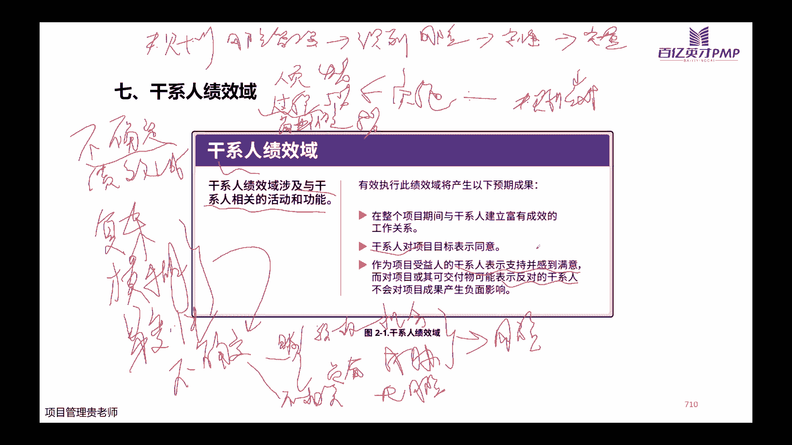

那干系人的分类呢啊他是这有一个定义，还是直接或者间接啊，接受项目的一些影响的这些人或者群体啊，或者说呢这个在这个项目当中有能力的项目，结果产生一些影响的这些人或者群体，叫做干系人。

那么这儿有一个简单的一个分类哈，这个分类呢就是按照我们的首先啊，项目的这个核心的，最核心的就是有项目经理，带领着项目的团队成员去干这个项目，那么同时呢跟我们这个项目配合的，还有我们的管理团队。

比如说啊这个相应的这个项目管理小组啊，或者是权利稍微低一点，PMO啊都可以哈，当然权利高一点，PMO呢也可能在这哈，也可能在第二层，跟我们整个公司的这个治理层啊，跟高层，比如说分管的这个副总啊啊。

分管的一些这个领导啊，或者是总裁啊啊，跟他们相关的，还有我们的一些指导委员会啊，比如说专家呀啊，这些是我们内部的啊，但是外部呢前面讲过哈，供应商客户，包括竞争对手，包括这个行业内。

同行业内其他的在观望的这些潜在的这些角色，都有可能是我们的干系人哈，其实这个讲讲理论，该系统这部分的理论并不难，很简单哈，只是说在实际过程当中呢，可能识别感性的时候啊。

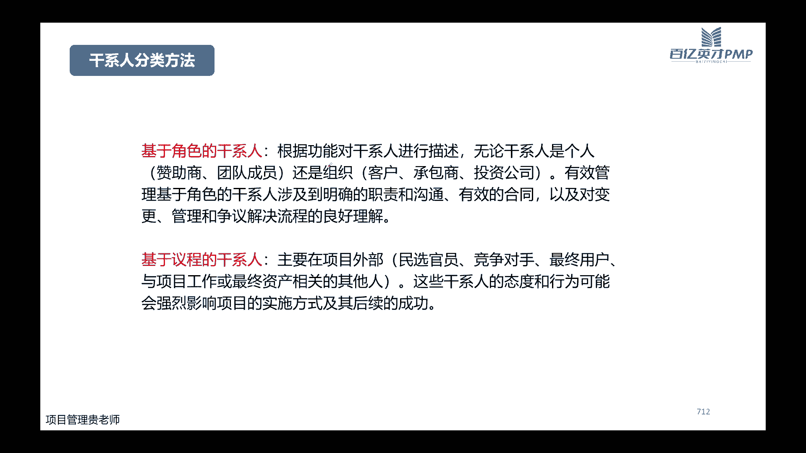

有很多人可能会漏掉一些啊，当然漏掉之后就会受它的影响会比较大一些，好该线人的怎么去分类呢，啊前面我们是按照内部和外部的啊，这种角色去分，那么它其实呢第一种就是按照这个角色哈，比如说哎我们是说他是赞助商。

是web的还是组织类的啊。

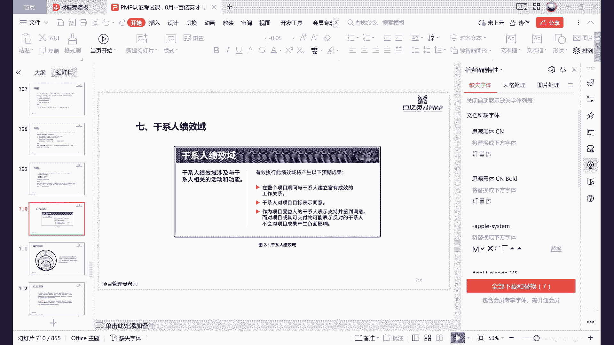

这个是客户啊，或者是这个承包商啊，还是其他的，也可以基于说项目的，这个基于整个项目的这个议程，项目的外部有啊，比如说一些官员啊，一些竞争对手，最终用户或者是呢跟这个项目，最终他投入到运营使用的时候。

会影响到的那部分人啊，都OK哈，都OK这两种方法都可以看看，大家实际在使用的过程当中呢，啊觉得用哪种比较的通用啊，我一般认为这个还是我们前面画的那张图，就基于角色去识别干系，人是用的最多的。

也是最好用的，好这是常见的肝性的分类啊，也可以大家列举的这些例子，其实列举的这些例子呢嗯讲起来也并不困难哈，大家看一看也就明白，主要是呢在实际我们做项目的过程当中，能不能去把这些人正确的把它识别出来。

并且呢识别出来之后能不能很好的去给他做啊，这些干细胞的分析啊，这个才是重点，后面才是重点，所以该系统的分类啊，啊你看首先内部有哪些啊，刚刚说了，我就不再具体说了，那么外部呢有哪些，啊社区啊。

一些地方政府和非营利组织，还有市民，还有相关的一些这个行业协会呀，他把这些都已经列进去了哈，这些都列进去了，有些人可能会觉得啊，我做一个项目有必要弄那么多的干系人嘛，啊那么多的干系人我都要去做管理嘛。

是的啊，为什么为什么，是的是因为我们现在做的项目哈，当然你前提是你做的这个项目，还是比较能够代表公司的这种战略性方向的啊，是比较重要的一些项目，那么你必须要跟这个项目。

它相关的一些行业和一些市场去紧密的去接触，那么相关的一些协会呀，啊一些这个非营利的这种组织啊，联盟啊啊包括这个地方分管的这种部门，还是这个商务分管呀，还是工信分管啊，啊，肯定也要去跟他做好一些沟通啊。

所以呢这个表放在这儿，大家应该之前的课题里面还没有这一章内容，回头嗯这个课程会再给大家发，这个会再给大家发，那么大家可以把这张表再看一看，以后做项目的时候呢啊识别干系人，如果有困难。

就对着这张表一个一个去对应，看看自己识别的时候哪一方便缺失了啊，好整个肝性人参与的过程呢，啊就是首先我们前面讲识别，识别完了之后呢，你还要去做理解和分析哈，理解分析，其实它可以融入在一个过程里面去做啊。

我们不是说把这个相关方啊识别了，说啊这个是啊哪个领导分管我们这个项目啊，识别出来了，OK啊那就行了，不是啊，识别只是第一步，识别只是第一步，我们的目的就是为了做给他做理解，理解这个干系人，理解他诶。

他对项目的整体的目标是什么，他对项目的希望是什么，他对项目的需求是什么，他啊对项目的一些不理解，或者是一些制约啊是什么，然后做完了理解了分析之后呢，啊要做优先级的排序，为什么要做建筑排序呢。

因为我们讲啊，项目你竟然这个内外部都有那么多的干系人，我们总不能说每一个干系人，或者说每一类干系人啊，都去同样的做这个应对，都去做同样的去做处理，那肯定没有时间啊，也没有这么多资源去做，对不对。

比如说我们跟团队成员天天要开会，天天去开会嘛，也没时间，人家也不搭理我们，对不对啊，所以该线呢一定要有一个优先级的分析哈，优先级的排序怎么排，今天晚上会讲工具谈完了之后呢，是要按照他们不同的这些优先级。

去引导他们来参与啊，不同的阶段需要什么类型的相关方重点参与，那么我们怎么样去引导他们来支持我们的项目，同时呢还要监督啊，这个监督干系人呢，这个监督这个词啊，可能大家会有所误解，说。

诶好像这个监督是一个比较比较不太好的词儿，说起来对不对，那他在这里的监督呢，他不是说啊，我我要时时刻刻派人盯着你监控，你不是这个意思哈，他的意思呢是说啊，我在整个相关方参与我们项目的过程当中呢，要去啊。

时刻的去评估一下我们跟他的这种沟通方式啊，啊让他来参与项目的这种办法是不是合适的啊，并且呢随着项目的进展和变化，它原来的这种方法是不是需要调整啊，按照我们这种方法呢，该显得自己有没有什么意见啊。

是这个意思啊，好那它涉及到的啊，就是这个600里面的这个过程哈，识别相关方，识别相关方的这个目的呢，就是要进入他们的利益啊，参与度啊啊跟我们项目的依赖性啊，他们对项目的影响力啊。

以及呢他们对项目潜在的一些影响到底是什么，所以呢这里更重要的就是跟大家提出来了，识别相关方，千万别理解成了，我们就是把相关方找出来就行啊，不是这么肤浅的哈，所以它的过程的作用呢。

就是让每一个相关方啊都能够得到适度的关注，是适度哈。

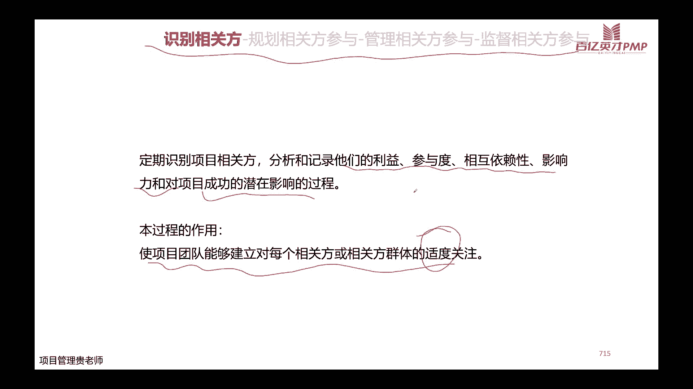

输入呢就是啊有我们的商业文件啊，有我们的这个相关方的沟通计划和参与计划，然后输出就是相关方登记册啊，核心都是相关方登记册，数据的这个工具和技术呢是相关方的分析，还有我们的这个啊他的数据表现。

这是它的一些重点内容哈，好我们来一个一个看相关方分析。

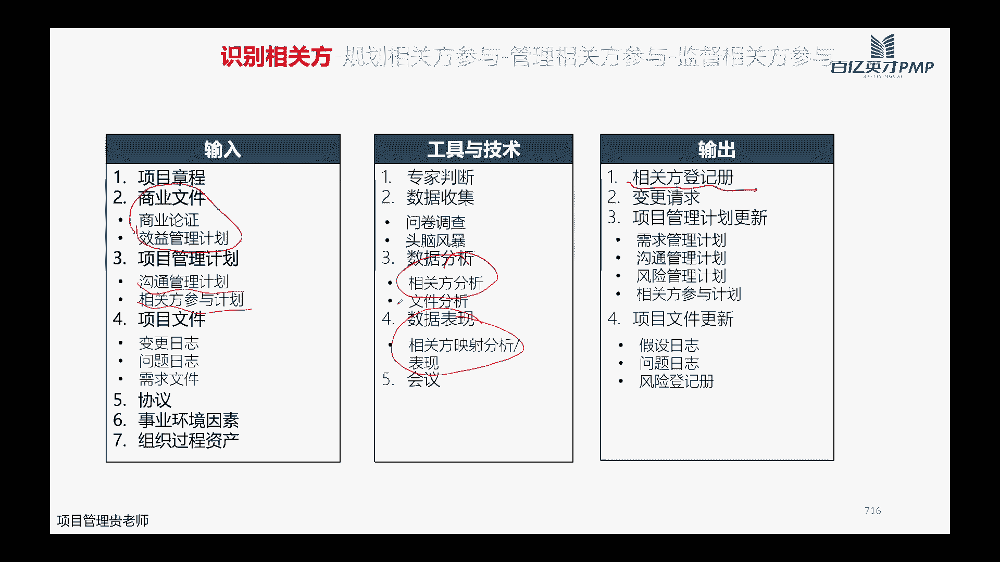

相关方分析呢啊它主要第一分析什么东西哈，我们要搞清楚，第一呢是分析他在组织内的位置，比如说我们现在内部的都好，说内部的大家都清楚，那么外部的呢，比如说我们现在是面对客户啊，客户他啊派来一个对接人。

那这个对接人呢我们知道他的title，知道他的职位是什么，但是呢我们知道的职位只是他表面上面，他名片上面给的啊，或者是这个项目介绍的时候，他的职位他实际在甲方的啊，内部的这个话语权到底有多大啊。

它能够调动的资源到底有多少啊，他的过往的这种啊这个工作的机密，工作的风格是什么样，所以呢啊角色这个位置啊，我们要把它搞清楚，还有呢项目的利害关系啊，包括他的性取权利，所有权知识和贡献啊。

等会儿下面再具体讲这些，讲这个部分啊，我们先把整体看完，然后呢他对我们整个项目的啊，这个期望，以及呢对我们项目团队的期望是什么样子，他是希望我们尽可能的快的把这个项目完成。

还是说啊尽可能的去啊响应他的这种需求啊，他的需求呢不管是跟这个项目核心相关，还是说跟这个项目不不太核心相关的啊，你能想你能想应，他就觉得啊这个项目团队表现特别好，还有呢他对这个项目的支持程度啊。

这个尤其重要，他对这个项目的知识程度，取决于我们后面怎么样去用他的资源啊，内部的web都是一样的，还有呢他对项目信息的兴趣啊，是大还是小啊，如果说换一个这个放任性的领导，他的项目的细节根本就不感兴趣。

那我们后面在规划他的管理办法的时候，可能就不要那么频繁的去打扰它，会比较好一些，对不对。

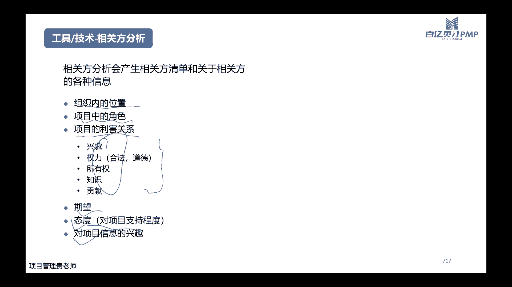

兴趣权利所有权和知识呢，这跟大家单独列出来了哈，因为觉得有必要，第一个呢兴趣兴趣呢是说嗯，就是不管是这个相关方的个体，还是说这一类啊，比如说一个用户，一类用户啊，这个群体他可能会跟项目有关的一些决策。

或者成果的一些这个影响啊，这个取决于他对项目的兴趣大还是小啊，是决定直接决定权哈，比如说咱们做一个项目啊，这个项目呢是能够改善民生的，改善社区工作环境或者社区生活环境的啊，是做智慧社区的。

那么这些社区的居民啊，他对这个项目的兴趣大还是小，如果跟他核心相关的，显然是很大，对不对，现在就是有一些社区都在搞这个惠民食堂，都在搞啊这个老年人的这种服务中心啊，做一些食堂，那么很显然。

老年人群体对这个项目就会非常的关心，对不对，因为有这样的一些食堂之后，他们啊在家里啊，这个嗯缺人照顾的这种这个困扰，可能就会减轻不少，那年轻人对他关不关心呢啊，年轻人可能也比较关心啊，因为觉得啊。

如果说有这样的这个食堂这种项目出现的话，那么啊他可能就不用操心他的父母，他是不是能够按时吃到这个好吃的这个饭菜，营养的饭菜，对不对，那中间群体更不关心呢啊中间群体他可能关心，也可能不关心。

当然大部分可能他都会关心啊，但是呢群体可能跟老年人的这种关心程度啊，兴趣程度不太一样，第二个呢权利，权利呢是说哎国家法律的框架，或者是一些社会的一些准则啊，就已经已经就这个相关方的一些合法的一些权。

利做出了一些规定啊，比如说做一个项目，你要做环评啊，你要做环评，那么环保部门对这个项目的影响大不大大啊，为什么，因为你环评如果没有通过，那么意味着你这个项目在建设的时候啊，可能前面前置审批就通不过。

对不对，所以呢一般情况下是指的是这个啊法律啊，或者是市场准则赋予他们的，一些合法的一些权益哈，当然这个权益也可以指我们这个啊，非国家法律层面的，比如说啊这个啊投资人项目的这个股东啊，公司的股东啊。

公司的股东，那他有没有权利知道这个项目，或者否定这个项目呢，当然有权利，对不对，因为他是这个他是股东，他可以参加股东大会，股东大会呢，他也可以参加这个这个派董事代表来哈，对整个这个项目的调调做一些定性。

对不对，那什么所有权呢，所有权是说啊，这些个人或者是一些群体，对项目的一些资产或者财产，拥有的法定的所有权啊，比如说我们现在要给要做一个项目，要做一个工程项目啊，做一个园区的整个这个啊。

大的这种规划和建设啊，那么这个园区的所有权是谁呢，园区的所有权啊，市政府啊，或者是当地的这个国有的建设公司，平台公司啊，那么他们呢就对这个园区本身，对这个项目本身的这个所有权是他们所拥有的。

那既然他们所拥有这个所有权啊，不管他将来是交给谁运营，那么对于这个所有权的人来说啊，我们是不是要遵守一下，他对这个园区本身的发展的一些想法，建设的一些想法，建设的一些意见，是不是要去重点的去关注一下啊。

知识知识呢，那当然专业的知识呢是嗯，对我们项目目标和组织的一些成果是更好的，那么这个相关方啊，它有如果说它具备相关的行业知识的话，当然啊跟我们跟我们的项目本身，如果比较匹配啊，那当然我们是非常欢迎啊。

所以说相关方或者干系人他的背景啊，专业背景，从业背景，项目背景，管理背景啊，这些背景符不符合他给我们的这个目标，跟我们的项目类型是不是一致，这个也直接决定了，我们后面再跟这些相关方去沟通啊。

去管理他们的时候，用的办法有什么区别，那比如说啊是这个相关方，他是啊，这个该新人，他现在分管我们这个项目，那我们显然在跟他汇报的时候，可能技术方面他比较关注，那跟他这个多说一些技术方面的一些问题。

会引起他的一些兴趣，对不对，那同样的如果说是另外一个这个领导，他是他不是技术方面的啊，你跟他说太多技术的一些术语，他可能听到10分钟他就已经很烦了，对不对，你让他来参与技术讨论，他也觉得很为难啊。

是不是还有贡献贡献呢，主要是说这个提供资金和资源啊，比如说我们的这个人力资源呐，实物资源啊常常提到的，那么我们的采购部啊，也是我们的啊相关方啊，职能部门，人力资源部也是我们的相关方啊。

你如果说啊这个人事经理那边没有搞定，那么他招人的时候，他也不说不给你招，对不对，明面上还得配合，但是呢他给你招的人啊，就是很久都招不来你，你想的你想要的啊，对不对，那也很恼火，那也很烦。

实物资源也是一样的啊，采购部分它有一些这个啊，比如说有一些自己的这个关系比较好的，这些关系户啊，那么他在啊整个这个采购的过程当中啊，有一些不好的一些操作，那么也直接可能影响到我们这个项目的。

这些食物的资源，它将来好用还是不好用，使用的成本还是高还是低，对不对啊，所以相关方的这些不同的这些维度的这些啊，兴趣也好，权力也好，所有权也好，知识和贡献也好，都是我们去做相关方分析不同的这些维度哈。

基本上这五个大的这些方面呢，是能够是比较，能够代表绝大部分的这个维度的哈，所以呢大家可以按照这五个维度直接去套啊，直接去一个一个去套是OK的。

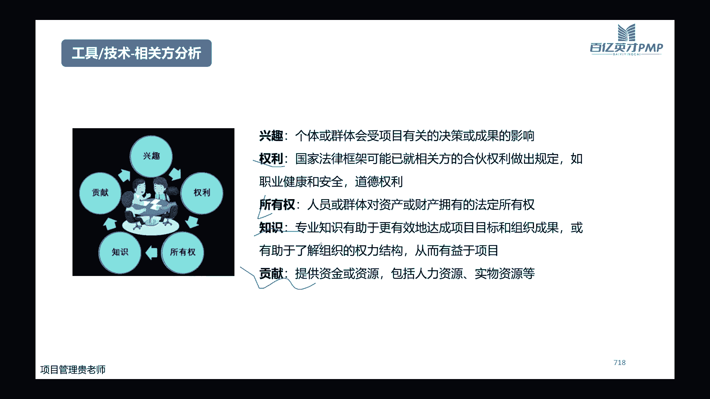

那分析完了之后呢，我们要用一种形式把它表现出来啊，用一种形式把它展现出来啊，这个相关方分析那么多，怎么展现呢，首先啊有权利利益方格，然后或者是权利影响风格，或是作用以下方格，这些方格呢都是二维的方格哈。

都是一些二维的，那么除了二维的二维，就是说可以考虑两个因素，X轴代表什么，Y轴代表什么，对不对，那么除了一些二维的呢，还有一些啊这个三维的立方体，立方体呢它就是考虑综合考虑，比如说考虑他的权利啊。

考虑他的权力的影响啊，啊考虑他的一些这个这个作用啊，还有一些凸显的这个模型啊，凸显的模型呢也是考虑它的不同的多维度，考虑它的权利啊，啊考虑它的这个需求的紧迫性啊，考虑他的这个权利或者需求的这个合法性啊。

还有呢就是影响方向啊，是向往上怎么去影响，向下会怎么影响向外啊，或者横向平级的会怎么影响啊，最后一种工具呢直接用优先级排序的方法啊，这个排出一张表啊，这张表一级的重点的管理的这些优先级，哪些排在二级。

哪些排在三级啊，直接用这种方式也是OK的哈，OK那我们就一个一个来了解一下，首先二维的权利率以权利利益方格为代表哈啊，相关方呢我们用横坐标代表相关方的利益，相关方的利益。

也就是说他这个项目对于他来说影响的啊，他能够获利的大还是少啊，或者说高还是低，纵坐标呢，用他的权利啊，就是他影响这个权利，是影响这个项目的权利是高还是低，那么既然有这样的一张横坐标和纵坐标。

那么我们就会有下限，不同的下限，如果说相关方他的权利很低啊，利益也很低啊，就在这个位置的时候，那我们就重点的用监督的办法举个例子哈，比如说嗯比如说我们去做一些啊，做一个这个项目。

还是举刚刚那个社区的那个项目吧，啊做社区的那个项目，那么做社区来说啊，对于一些这个老年人啊，这个老年人我们说他很直接，这直接关系了他将来的一些核心的一些权益，对不对，但是呢它影响这个项目的这个权利。

是大还是小呢，肯定是比较低，对不对，因为他是最终是收益的这个方，他也没有参与建设，对不对，他的权利很低，但是呢他的利益高不高呢，他的利益其实很高的，因为直接面向的群体就是这一部分是惠民食堂，对不对。

所以他的权利很高，他应该是在他应该是在这个地方，他既然权利很高，那他一定很关心这个项目的实施进展啊，今天开不开业呀，今天建的怎么样了呀，啊下个月开不开呀，啊这个费用高不高呀，啊什么门槛能进来吃啊。

这个是是跟我们社区，跟我们小区配套的吗，有没有覆盖的小区啊，啊所以我们要时随时告知哈，时不时的告知他的一些进展，那哪些人是权利和利益都比较低的呢，啊比如说嗯比如说这个小孩子啊。

小孩子他在这一部分群体里面，社区的惠民市场对于他来说，他也没有什么权利来啊，去这个去去管控这个项目啊，他也不关心这个项目什么时候能够投入使用，对不对，因为这不是面向他的啊，所以这种呢我们要做什么呢。

我们要监督啊，防止防止呢它啊，这一部分的群体，可能会出现什么不好的一些行为，会影响到我们这样的一个项目，对不对，那比如说我们做这个项目，做这个建设的时候，小孩子经常在周边玩耍啊，出现了一些安全事故。

那造成一些很不好的影响，对不对，好这些都是权利比较低的一类哈，那么对于权力比较高的一类呢，首先权力高，如果说他的利益比较低啊，只是权利比较高而已啊，那我们应该怎么办呢，比如说这个项目的啊。

这个啊是有一些公益的投资人啊，有一些这个民间的这个投资方啊，他只是为了做公益，那么对于他来说，他是给钱的，他权利高不高，他一定是很高的，对不对，他的利益高不高呢啊。

有人会觉得他是从这里面这个能够收益的呀，但是呢他做的是公益项目啊，它更多的是抱着为民服务的这种态度，所以呢他的权利相，他的利益相对来说是稍微低一点的，权利是比较高给钱的，所以这时候呢我们让他满意就好了。

就问问这个投资者啊，你也参与到我们这个项目当中来，愿意投钱啊，你对这个项目的期望是什么啊，只是做好老年人的服务就OK了吗，啊做好老年人的服务，我们这个菜品呀，环境呀啊这个价格定定位呀。

有没有什么一些这个要求啊，你你去根据他的一些想法，去把这个项目掌握下来，那什么是权利高哈，利益也很高的呢，比如说这个社区的管理人员，或者说这个项目本身的直接负责的项目经理，他一定是权力很大的，对不对。

因为他直接只管一个项目啊，他是不是逆也很高，那当然了，社区的领导和项目的本身的这个啊锦鲤也好啊，他是带头做这个项目的，社区的领导呢也是直接这个项目做好了之后，关乎到项目的整个这个啊民生的工程。

做得好不好，面子有没有光啊，对不对，所以他们这种呢就是逆也很高的，那这种逆也很高呢，我们叫这个重点管理哈，他说啥，哎我们要去遵守他希望怎么去给他汇报啊，他需要这个项目的方向是怎么样子的。

他觉得这个项目有哪些不足，对不对，所以呢这个是重点管理哈，我们之前做嗯，做具体的这个咨询项目的时候，也是跟大家讲这个权利一方格啊，让大家去念一念啊，念一念我们这项目嗯。

实际在操作的这些项目当中有哪一些相关方，然后并且呢我们也让大家把这个相关方，按照权利率，一个权利利益方格去分类哈，分类之后呢啊也会让大家写出来他的管理策略，然后很多人就写了啊，这个权利高考第一题啊。

比如说我们说的啊这个甲方的甲方的对接人啊，他权利很高啊，你也很高，然后呢啊是属于重点管理啊，侧面就是重点管理，然后如果是甲方的这个分管领导呢，唉我们也觉得他的权利一定是高的，对不对。

但是呢他的利益是不是一定非常高呢，不一定哈，我们呢主要是练习满意，很多就直接写重点管理啊，逆期满意策略就是这个这一点呢大家在实操的，在考试是这样是OK的，理解到这儿就OK了。

但是我们在实际操作的过程当中啊，实际做相关方管理过程当中，这只是原则指导方向哈，重点管理定期满意，随时告知监督，这只是指导方向啊，具体我们要讲啊，要去探索重点管理，如何去重点管理，什么叫重点管理啊。

天天给他汇报，是重点管理吗啊，还是怎么样是重点管理，令其满意，怎么样令其满意啊，给他这个送点礼就是念情满意了吗，还是说怎么样就具体措施哈，这是对他的期望，所以大家千万不要觉得哎呀重点管理。

觉得pp讲的课程不落地不实用，哈哈不是这个意思啊，因为他讲的就是具体的实操的方法论啊，所以呢大家如果有心去探讨权利益方格的话，可以去跟小伙伴们去跟自己的团队的成员啊。

去跟下面的这节课的同学一起去讨论一下，如果说啊，比如说针对这些重点管理的甲方对接人，那么你具体的这种啊响应的策略到底是什么，比如说他是不是是不是针对他的一些啊，工作上面的一些这个需求啊。

尽可能的去响应啊，响应的这个速度啊是什么，然后呢，如果说对他这个工作对接起来有什么意见的话，怎么样去跟他提平时的时候工作之余的时候啊，自己团队聚餐要不要请他一块啊，过年过节的时候啊。

需不需要对他有所表示，这个看自己的这个项目本身哈，然后呢他对这个项目的期许啊是什么样子的，我们怎么样去配合他，达到他的一些期许啊，是这个意思，所以这些策略呢根据项目本身的这个不同。

所以呢重点管理的这些对象和重点管理的办法，都是有不同的哈，大家可以自己去讨论，当然也可以在群里面，就是那个考过了之后，可以在群里面，这个再跟跟跟老师一块讨论也OK哈，好那讲完了二维呢。

我们说了还有三维的啊，三维呢主要是考虑它的这个啊，这个三个方面的多要素的啊，这呢是考虑它的一个要素，是考虑它的作用大啊，作用比如说好，我们前面讲的是这个权利啊，和他的一些这个啊。

那么我们现在同样考虑他的这个权利，同时呢还要考虑它对我们整个项目的这个作用，大不大，还要考虑它对我们这个项目的影响是大还是小，那么是一个三维的图，我们可以根据每一个或者说每一类相关方。

它的不同点给他做一些，他一定是在这个三维的这个象限里面啊，是乘这个空间里面是有一定的这个分布，那么按照它的不同的分布，我们去具体的响应他的一些措施，响应他的一些办法，当然最应该重点管理的就是权利诱大啊。

对我们项目本身的这个影响也很大啊，同时呢它能够给我们项目带来的支持啊，带来的这个资源带来的这个作用也非常大，这一类肯定是相当要重要管理重点管理的，对不对，好凸显模型啊。

凸显模型呢也是考虑它的三个维度哈啊，第一个呢是考虑相关方的权利的大小，第二个呢是考虑这个相关方，他的这个需求的紧迫性啊，紧迫性啊到底是比较紧急，还是说啊三个月之后的事。

再一个第三个维度呢是要考虑它的合法性啊，他提他的这个需求，或者他来管控我们这个项目，他有没有这个权利啊，我们说了，比如说前面讲的这个环评的项目，环保的部门啊，环保局肯定是非常重要啊。

那么现在呢来了一个他来了另外一个部门啊，来了一个发给发给的啊，他相对来说的话，他的权利就没那么大，没有环保局那么大，对不对，所以合法性呢也是要考虑的一个维度哈，那么这三个维度呢不是说单方面的。

它就是哪一个哈，往往是交叠的，所以呢这改的给大家展示了一个图哈，就是这个三个圆圈，三个圆圈呢它其实分出来了，有至少有七个区域，考虑到它重叠了交叉的一部分啊，这种项目呢一般用凸显模型的。

都是那种项目特别复杂，涉及到的这个该系人特别特别多啊，这个关系网特别方，特别这个关系网特别复杂，不太方便，直接用简单的这种权利，一方格或者用一张excel表就能够解决的啊，一般是用于这种项目。

我们用凸显模型哈，那么凸显模型里面呢，我们讲它有七个不同的区域，这七个不同的区域呢，它代表的这个类型啊都是不太一样的，我们一个一个来说一下哈，首先啊在这个区域里面，比如说这个第一个区域。

一个区域呢只是权力比较大，只是权力比较大，它也不紧迫啊，他也没有合法性啊，那么这一类相关的呢，我们把它叫做啊休眠型潜伏性，也就是说呢他既没啥不紧迫的需求，又没啥合法的这种权利管啊，又没有这个什么合法性。

但是呢他的权力实际上是很大啊，实际上是非常大，那这种呢我们就要做一个啊预判啊，预判如果说哪一天踩了他的这个雷，那么他拥有这么大的权利，他会怎么样啊，他会对我们这个项目产生可能致命性的影响。

平时没有什么影响，但是一旦他发飙，那项目可能就是致命性的影响，第二类呢是在这，第二类呢是完全就是只有合法性，却没什么权利啊，也不太紧迫啊，那这种呢我们把它叫做自主型的，或者叫做随意型的一些相关方啊。

他就是有资格管，但是呢他的权力又很小啊，你说他有资格吧，他权利又很小，管又管不上啊，并且呢他的一些需求又不太着急，那这种我们又去怎么样去应对，第三类呢啊是只有紧迫性很强很强，猴急猴急的。

但是呢他又没有权利去管，他们又没有什么资格去管，比如说你在做一个项目的时候啊，来了一个人，他天天问你这个项目怎么样啦，怎么样啦，怎么样啦，怎么样啦啊，问的你也很烦，对不对，他很着急这个项目。

但是他又没有什么权利，又会有什么资格，这类就很烦，是不是，然后第四类，第四类呢它是既有权利啊，又有合法啊，所以这一类呢我们把它叫做支配型啊，一个叫做权贵型，就是他有这个权力管他，并且他有资格和啊。

但是呢它的紧迫性不太那么强啊，紧迫性不太那么强，他的需求他不太那么着急啊，那这个时候呢，我们就要去主动的这个去关注一下，他对项目的核心的关注点到底在什么地方，在什么时间段会进入到他重点关注的那一段啊。

第五个类型呢啊我们第五个类型是在这儿啊，第五个类型是权力和紧迫性都有，但是呢没什么合法性，就是说这种的一般就很危险哈，有权利，然后呢又挺着急，但是没资格管啊，比如说你这个公司的其他的这个领导啊。

一个副总他没有权利分管这个人啊，他们他们他是没有权利去，没有资格去管我们这个项目的基础这个团队，但是呢他是因为公司的副总啊，你说他有没有权啊，他也有权啊，对不对，他有权利去调动你配合这个项目的这些资源。

但是他没有资格直接管我们这个项目，他也很着急，那这种其实也挺危险的，对不对，如果这种这种，我们看起来跟项目好像离得比较远啊，没有重点的去管理，但是呢如果说他从侧面去给我们做一些这个，不好的一些限制。

那对我们项目的影响也是比较大，所以这类其实往往也比较危险，然后第六类第六类呢是啊又很合法，然后又很紧迫啊，但是呢权力呢嗯可能站的边就比较小了啊，这种的，一般就是我们把它叫做依赖型的相关方啊。

也叫做从众型的相关方，这类相关方的典型代表就是权力比较小啊，但是你有资格又很着急，但是你权利比较小啊，比如说咱们甲方啊拍了一个小喽啰啊，拍了一个啊，这个刚工作没两年的人来对接我们这个项目。

他有没有资格对我们这个项目提意见了，他当然有资格，对不对，他也很着急啊，也很想把这个项目做好，但他的权利太小了，他完全调动不动啊，甲方那边需要的这个嗯，需要配合我们的这些资源支撑，对不对。

好第七类呢就是啊三种都有，他又有权利，又有资格，也很着急，那这种相关方就绝对是最核心的啊，我们叫做决定性的相关方，又叫做统治性的相关方哈，比如说啊甲方拍甲方拍了一个这个啊。

这个技术总监直接来负责我们这个项目，对不对，那这个技术总监显然他又有权利有资格，而且呢他也他的需求也是相当紧迫的，那这种他的这个需求啊，他的一些想法，他的一些建议，我们肯定是要是第一时间去响应。

好影响方向呢我们说了向上向下，向内和向外和横向向上呢，主要是我们这个客户的一些领导呀，啊或者是我们内部的这个发起人，外部的发起人，或者是我们公司内部的这些高级管理层啊，这个是影响肯定是我们要向上。

怎么去影响他们啊，向下呢主要是我们的项目的这个团队成员啊，啊以及呢是跟我们项目紧密配合的这些专家啊，这些专家注意专家也是啊，跟我们的团队成员一视同仁啊，是放是这个向下管理的一部分哈，那校外呢。

就主要是指的是我们团队外部的这些供应商啊，政府部门啊，公众啊啊这些怎么管团项目的，主要是指的是跟我们项目经理本身啊，跟我们自己是评级的这些职能经理们啊，采购部门啊啊采购部门经理呀。

人事经理啊啊行政经理呀，跟他们啊我们怎么去管，怎么去分，优先级排序呢啊很简单，优先分优先级排序的这个工具，就是根据我们前面的不同的维度综合来权衡，综合有一个计算的得分，那得分高的排在前面。

得分低的排在后面啊，就这么简单，它整体的这些工具啊都用上了，用上来之后核心的是要输出什么，输出一个干线的登记册，这些干线的登记册呢啊重点分了，有三个大类的信息哈，首先第一个是跟他的基础的身份相关的。

比如说啊这个姓名姓名组织职位，这些都不用说了，地点联系方式啊，这个都是最基础的啊，在项目中扮演的角色啊，这个有时候可能会打一点磕哈，这个在实践当中啊，可能会大一点课，我们只知道他是什么职位啊。

但是呢他在我们心目当中，具体扮演的角色到底是什么啊，有人说啊，这角色也很清楚呀，啊他就是来顾问来支持的，那OK那我再问你，他作为顾问，作为支持方啊，他支持的是哪一方面，支持的维度。

支持的深度到底是什么啊，所以这个才是隐形的观点哈，还有呢评估的信息啊，技术信息有的还要评估评估评估什么呢，评估他的需求，他的期望它能够影响项目成果的这种啊，作用的大小啊。

以及呢他在哪一个阶段最关心这个项目哈，比如说啊你人是最关心最能够接触这个项目的，肯定是在我们县前期，这个项目获取资源的时候啊，以及我们项目在嗯做团队的绩效评估啊，要开始发奖金的时候。

这个时候人事部门肯定就比较关心了，对不对，那在中间项目交付啊，项目执行啊，项目工作的时候，人事关不关心这些，他不关心对不对，跟他有没有什么核心关系，好相关方分类哈，相关分类呢啊。

就是用我们前面讲的这些权利也好，这个逆也好啊，作用也好，或者是按照我们的影响方向，它是我们上级，下级或者是外围的，或者横向的给它做一些分类的一些结构哈，所以呢这些信息前面做的。

这些信息都是要记在我们的项目方，登记册里边的啊。

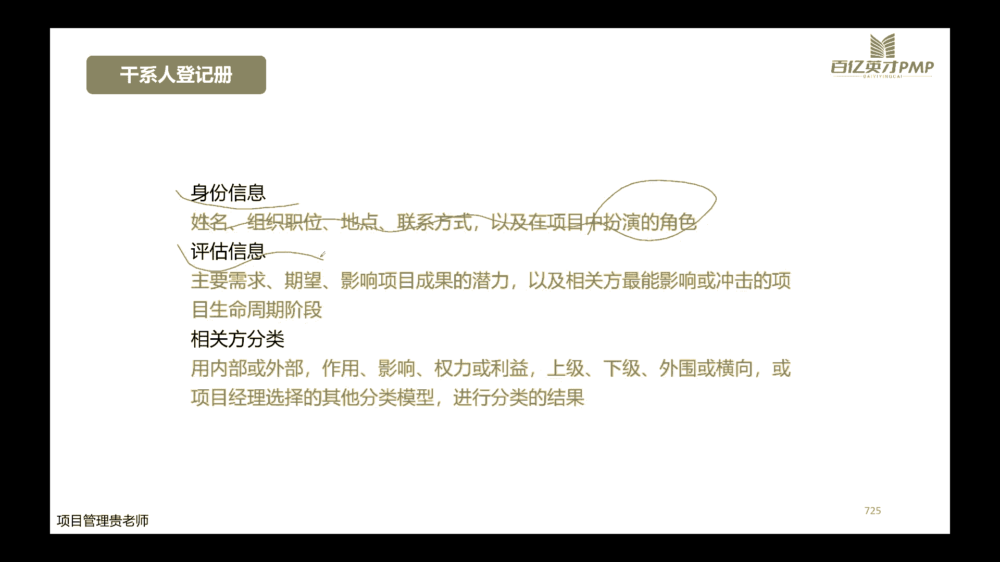

我给大家列了一个啊实际的一个案例哈，实际的一个这个列表，这个列表呢就是啊，比如说我们要做一个这个呃项目，然后这个项目呢是做一些这个样机啊，是做一些机器，那么做机器呢唉我们根据项目的不同的阶段。

会有不同的一些这个相关方啊，他们来参与，那么我们就讲比如说啊这个在详细设计阶段啊，这些有哪些相关方啊，当然它这个表面的比较简单哈，应该是有很多个，应该是有很多很多个在详细设计阶段啊。

当然最重要的可能是这个礼仪啊，所以把它列出来了，他是项目的执行经理，然后基本信息就不用说了，它主要的需求及关注点是什么，比如说啊他主要是要制定业务的计划，然后呢要组织监控计划的运作啊，要跟投资嗯。

评审委员会的要及时沟通，项目的一些重大的一些问题，还要负责整个项目成员的考评啊，然后他的期望是期望项目能够按时能够保持，两个完成啊，影响力大不大呢，一般项目的执行经理，他的影响力还是挺大的啊。

权利啊是多少，这个利益等级作用等级啊，他对项目的整个这个知识的态度啊，他的这个沟通的方式，然后呢到药剂生产的阶段，哎我们有哪些感性人，重点的是哪些啊，他担任的角色是什么啊，基本信息什么关注点和期望。

比如说研发的这个代表，他肯定关注总体研发的这个框框架，然后呢关注这个项目外部的一些技术水平啊，看看能不能对我们内部的这些啊，这个技术有一些迭代产品，能够性能，能够去优化知识产权啊，是不是及时的申请。

他肯定关心这些，对不对，那他的期望是什么呢，他的期望当然他是研发代表嘛，肯定重点的期望是，希望这个项目没有什么大的技术风险啊，他的影响力啊，后面权利利益啊作用啊，按照我们约定的这种等级的。

这个性质去给他列啊，列出来再算一个这个综合的得分啊，到了逆向阶段呢，哎核心的相关方有哪些需求分析阶段啊，有哪些啊等等啊，一个一个列下去就OK哈，是这样的一个示例，如果说没有做过啊。

咱们没有做过相关方的这个登记册的，这些小伙伴可以按照这个事例自己去移葫芦。

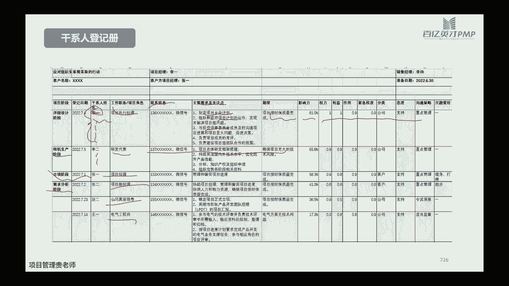

画瓢去试一试哈，那做完了这个相关方登记册之后呢，我们要根据这些相关方，他的一些权利利益大小啊，去规划，去治理相关方参与项目的整个这个办法，所以这个办法这个过程叫做规划相关方参与啊。

他重点就是提供跟相关方进行有效互动的。

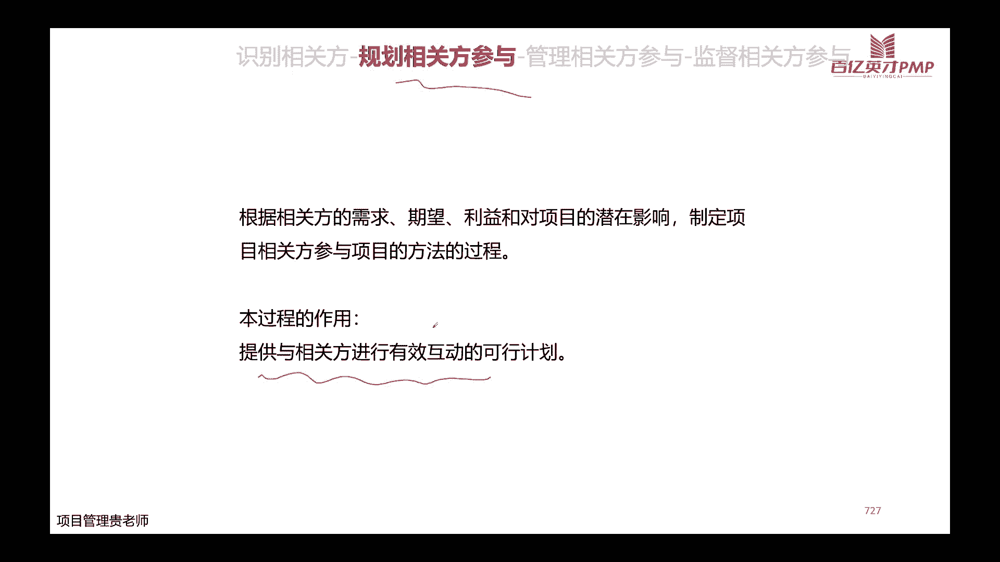

可行性的一些计划，输出就是相关方的参与计划。

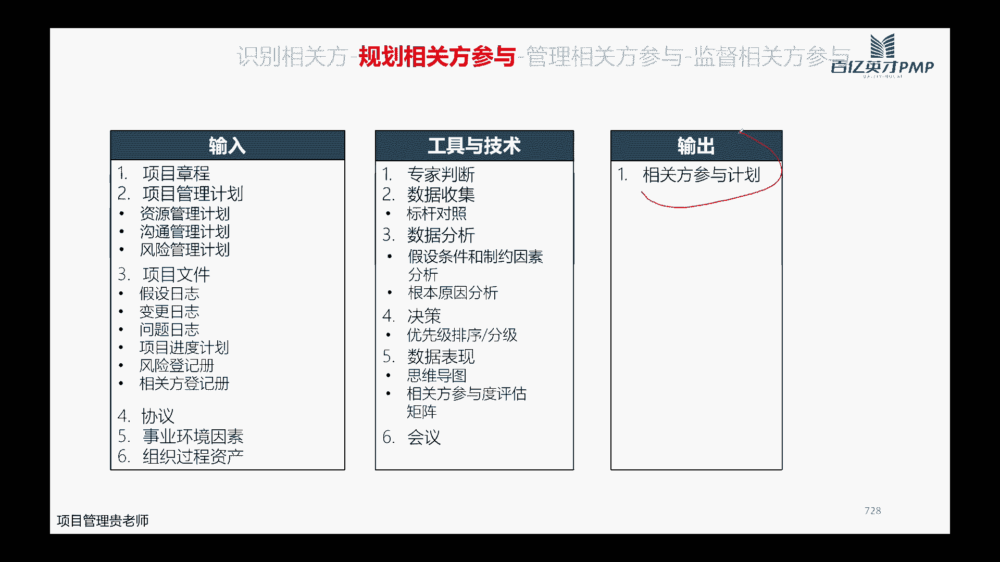

常见的参与办法呢啊核心的这些要点啊，肯定是要启发需求啊，你期望解决问题啊，要跟他谈判啊，要跟他这个做优先级排序，要处理难题啊，最后再做出决策，这都是核心的这些套路，但是具体要怎么做呢。

首先我们举一个这个以沟通哈，当然沟通跟参与办法它不完全对等哈，考试的时候经常会有这样的坑，考试的时候，很多人都搞不清楚这种场景到底是选择A，是选择沟通领域的啊，这个沟通管理计划呢。

还是选择相关方参与计划呢，很多人搞不清楚哈，这个嗯相信大家练题的时候，应该也会遇到很多类似的问题，到时候咱们遇到题的时候，再来重点的讨论讨论什么情况下优先选择嗯，相关方或者是干系人的管理办法。

什么时候优先选择沟通管理办法哈，好这呢，我们也是以一个啊沟通的这种方式来举例子哈，来举例子，举例子来列名，相关方常见的参与我们项目的一些办法啊，比如说啊口头方面的，那要要非正式一点的。

就是口头上面跟他聊聊天啊，啊这个甚至发个朋友圈让他看一看呀，啊甚至这个转播相关的新闻，这个艾特他呀啊去沟通一下都是OK的啊，非正式的这种对话呀，一些讨论啊，这种都是口头上面的。

那么正式呢我们比如说做演示啊，做项目成果的演示，做项目进展的一些这个呃，这个口头上的一些沟通，或者是项目的做一些审查啊，介绍情况，产品也是啊，头脑风暴啊等等，这些都是口头上的，那么书面的呢。

唉我们说了有进展报告啊，计算报告啊，政治报告啊，对不对，风险包工啊，哎这些报告形式的，还有我们整个这个项目文件啊，比如说出来的这些问题日志啊，啊当然他需要指导我们就跟他沟通，还有一些商业论证啊。

然后非正式的书面的还给他贴个便条，提醒他一下，给他发个电子邮件啊，给大家及时的发一条微信啊，或者是其他的一些社交媒体啊，这个是书面的非正式的啊，都是常见的一些方法，不知道大家有没有其他的一些办法。

我我估计应该如果说涉及到相关方的沟通的话，应该多多少少可能都逃不出来这些吧，还有人可能会讲唉我们在计算上沟通啊，有人会想我们通过钉钉沟通啊，有人会觉得我们通过微信或者企业微信啊。

这个都是在我们的社交媒体上面哈，好规划相关方讲，其实讲理论他没有什么好讲的啊，这个嗯重点就是就是具体在做啊，做的时候沟通，因为是一个大难题哈哈，很多人沟通的时候都觉得嗯太困难了，当然一个项目当中。

项目经理的八九十%的时间都是在沟通啊，不是在做书面沟通，就是在做口头沟通啊，不是在对外几条，就在队列几条，这个没办法啊，好沟通完了之后呢，我们要重点的去管理相关方的参与，管理相关方的参与呢啊。

他主要是说，能够尽可能得到相关方的一些支持啊，能够尽可能的降低他们的一些抵制啊，所以呢并不是说有的相关方他刚开始诶，我们识别出来他的这个项目应该是积极程度，参与程度应该是很高的啊。

但就意味着他在实际执行的过程当中，他真的很会参与，很愿意参与我们这个项目，不是这样哈，没有这么理想，同时呢这个相关方他在合作的过程当中，他也有可能会有一些变动，对不对啊。

刚开始的时候他觉得他挺看好你的啊，你给他承诺了一些东西嗯，他挺支持这个项目的，结果呢到中国做的时候，他发现成龙东西兑现不了，然后他就开始有一些这个不太好的啊，有一些使绊子，那这也是有可能的，对不对。

所以呢管理相关方的参与，还是尽可能的让他按照我们的参与计划，去支持我们的这个项目，第一啊是要调动他，要适时的参与啊，在合适的时间，合适的办法来参与到我们的项目当中来，并且呢能够缓解他的期望啊。

我们说刚刚说了，期望一直在变啊，对不对，刚开始的时候可能对他期望很高啊，刚过了一段时间，可能对他的期望慢慢的降低了，那我们在这个过程当中，如何避免它期望降低之后会撤回一些资源啊，会降低一些资源，对不对。

还有呢处理跟相关方有关的任何风险，或者是潜在的一些关注点，那比如说嗯比如说这个嗯，比如说做政府类项目吧，不知道大家有没有关注过哈，做政府类项目最怕什么，最怕换人，就怕政府那边的部门领导换了，对不对。

那工作风格啊就完全换了，要求的点也不一样啊，这个喜欢工作的这个方式也不一样啊，对不对，所以这个也是我们管理相关方的过程当中，要重点去关注的，还有呢要澄清或者解决，已经识别出来的一些问题啊。

这个主要是说跟我们相关方相关的一些问题，那比如说哎现在相关方要从我们的小伙伴啊，这个每天晚上半夜的时候，给我们小伙发发需求啊，让他每天早上都要啊，那这个怎么办啊，这个团队成员已经反馈到你这儿来了。

再这样就辞职不干了，那你怎么去协调啊，团队内部跟前官方之间的这些冲突怎么去弄。

好他的重点呢这种嗯，重点的这个呃工具和技术呢主要是冲突管理啊，就像我刚刚前面说的啊，内部跟小宝宝之间产生了这些了，这个工作方面的一些冲突，那你怎么去冲突管理，然后呢文化意识啊。

文化意识前面讲人际关系和团队技能的时候，把这些其实都讲过文化意识和政治意识啊，这个时候啊，相关方假如说是一些我们做政府类的项目，那么客户那边是政府部门啊，他的政治意识当然是比较强的啊。

这个但是我们团队成员呢可能重点是，比如说互联网公司的啊，那你在沟通的时候，这个人家就想讲的很黄啊，讲的很红，然后呢这个，整个这个沟通呢也是比较的官方啊，比较的书面，那我们呢就是可能平时随意惯了啊。

这个嗯特别特别扁平，也没有那么严格的一些层级的一些这个借分啊，做去开会的时候，坐座位也都是随便一做啊，也没有说讲究嗯，比较严谨的这种作词的顺序啊，那这个怎么办啊，对不对。

输出呢就是输出我们的相关方的一些啊，参与计划的一些更新啊，前面我们讲规划相关方参与的时候，已经有参与计划了，那我们在管理相关方参与的时候，就要有一些更新，只要有一些更新出现的这些冲突，或者是相关方。

他的一些这个需求产生的一些变化，那么我们怎么样调整它。

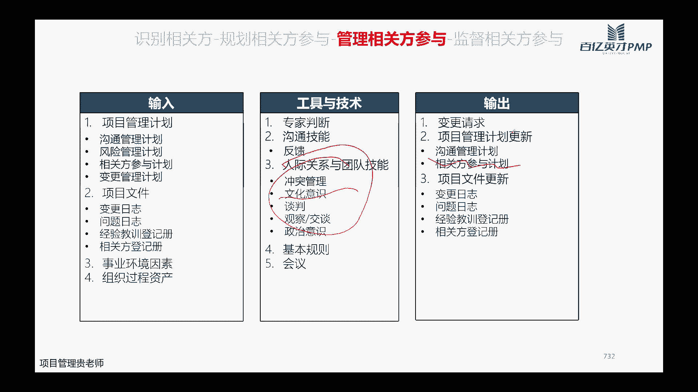

参与到我们项目当中的一些办法，参与度呢它有三重制约哈，啊三重制约呢是哪三重呢，第一个呢是这个一致性项目的干系人啊，包括我们这个团队，他跟项目本身来说啊，他对项目的这个目标是不是价值，是不是认可的啊。

是不是众志成城，一心想把这个项目啊把它做好，这个呢是直接决定了他参与的程度高啊，意愿性大还是不大啊，第二个呢是他能够投入的，比如说现在唉，我们是为这个项目招的百分之百啊，投到这个项目当中的这些团队成员。

那么他肯定是非常想把这些项目做好，对不对啊，他能够百分之百的投入，他也愿意，也必须百分之百的投入，那如果说换一个啊，这个人事部门派了一个人来协助我们这个项目，他从这个投入上面。

他没有办法百分之百的投入到我们项目当中来，对不对，因为他只是写作，他还有七八十%的工作要做人事的工作，甚至呢他的这个考评，都是绝大部分都是来自于部门，那这个时候你想让它核心投入吗，这个显然是不太啊。

显然是不太现实的，所以说这个也是直接就决定了他的他们，他的投入的时间和他能偷的这个时间，直接决定了他对我们这个项目的参与度，是高还是低哈，然后第三个这个制约因素呢是他呃的认可。

这个认可不仅仅是对项目本身，对项目目标的认可，更重要的还是对我们整个项目团队的啊，整个项目的这个文化，项目的前景这方面的认可哈，当然也包括他们都记得认可，他们觉得在这个项目当中自己能发挥价值啊。

觉得自己是充当着这个核心的这个角色啊，除了他这个项目可能很麻烦，那么他自然而然的人的这种这个潜能，或者说他的一些这个愿意去付出的这种性啊，这种积极性就被调动起来了啊，当然如果说他觉得他觉得自己。

在这个项目当中啊，是一个小喽啰，无足轻重啊，这个项目少了，他有他没他，他感觉都一样，没什么价值的这种认同感，那很显然他也就慢慢的对这个项目的态度，他会比较消极啊，会比较懈怠哈。

所以参与度的三重制约三重约束呢，为什么讲这个啊，这个是帮助大家在实际的工作当中，实际的团队管理当中去用的啊，去用的啊，考虑它的一致性，考虑他时间投入，然后增加他的啊。

对这个参与项目的一些这个价值的一些认可啊，会尽可能的会有效的提高他们对，我们项目的参与程度哈，参与程度里面有一个重要的工具，这个工具呢叫做参与度的评估举证，这个评估举证呢也是考试啊，考的概率相当高的哈。

这个苹果矩阵是什么意思呢，苹果矩阵就是说啊，我期望他是，怎么样参与到我们这个项目当中来的，但是呢实际当中他不可能完完全全，按照我期望的那样去做，对不对，所以呢实际跟我期望的会有一些冲突啊。

所以呢我们要用一张表，要一张去中表去把这种冲突把它展现出来啊，所以呢这个表就叫参与的评估矩阵，一般啊，一般我们会把它的参与的程度，分为五个大的类型啊，首先就是不了解型，不了解型什么意思呢。

就是说他对这个项目进展如何，目标如何啊，完完全全不了解啊，比如说这个我们做一个项目，然后呢这个项目的这个嗯公司的啊，比如说这个保安人员啊，他才不管你这个项目公司做什么业务，做什么项目，对不对。

完全不了解，那还有一种呢叫做抵制型啊，抵制型的，这项官方呢，就意思就是说他不太支持你这个项目，甚至呢他有一些言行啊，有一些行为啊，他会抨击，会阻碍我们这些项目的一些进行哈，所以呢这个叫抵制型。

什么叫中立呢，中立是说他知道这个项目，但是呢嗯既不给资源支持，然后呢啊当然也不会说像抵制型那样，想方设法的去阻碍这个项目，那知识性和领导性啊，这两个呢大家也是小伙伴们容易弄混的哈，什么叫支持行啊。

他不反对他不反对啊，他没有说什么坏话，你找他的时候，他能够给你帮助，你，不找他的时候，他也不管不问的，这种就已经算是很支持他，大家千万不要觉得哎呀我我不找他，他就他就对这个项目不闻不问的。

他对这个项目没有很支持啊，他就是中立，不是这样子哈，你只要找他，他没有拒绝，他就已经是已经算作很支持这个项目了，那什么是领导呢，领导是说啊，他不仅有这个资格，有这个权利支持我们这个项目。

并且呢他还花了很多的时间，投入到我们这个项目当中来啊，所以呢这种叫做领导，这种领导呢一般就是积极参与了哈，好知道了这五种不同的参与程度呢，哎我们就讲每个相关问我不是说了吗啊。

他既他这个参与程度跟我们期望的。

不是不太一样的呀，所以在这张表里面呢，我们一般用的这个C和D是代表哈。

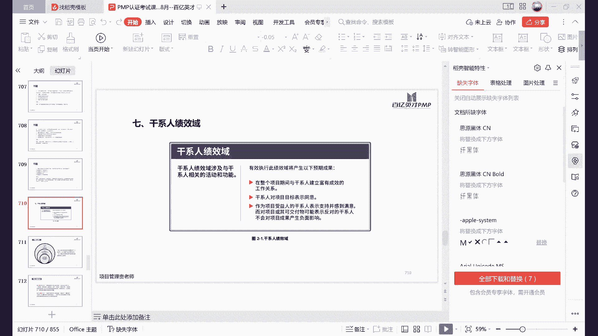

这个C呢是代表他当前的实际的参与的程度，然后D呢代表是我们需要他参与的这个程度，比如说相关方二还有这样一个干系人啊，我们呢他当前呢，他其实只是一个中立的这种态度，但是呢我们其实是希望他能够。

支持我们这个项目的。

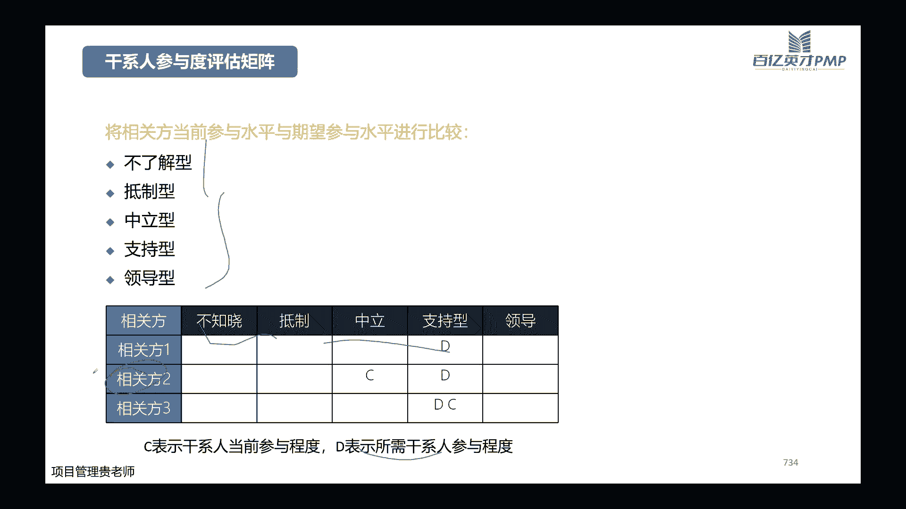

比如说你去找他，要一些数据库的一些资料的时候啊，那么要这些数据库的资料的时候呢，唉他应该是很积极的啊，当天当时或者第二天的时候，就把这个资料啊给我们调出来，对不对，但实际呢。

但实际呢他并没有把这个数据给到我们。

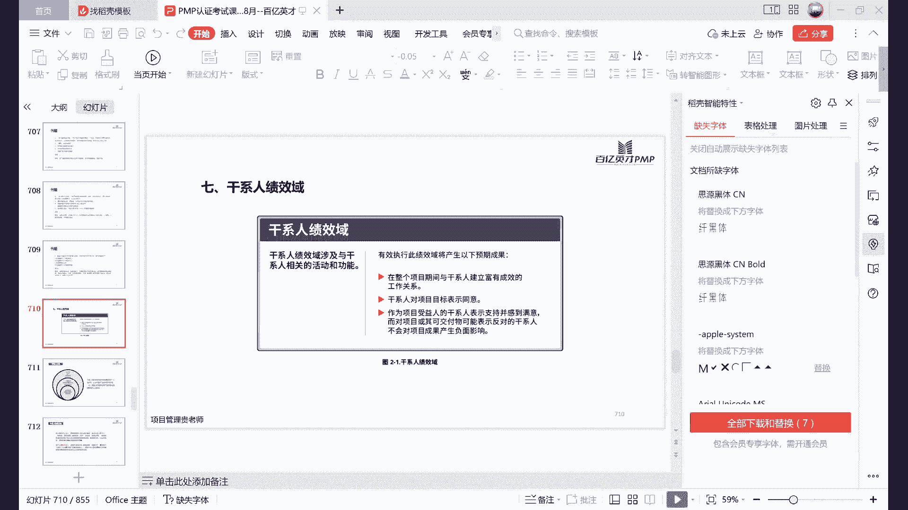

那很显然跟我们期望的有一些冲突啊，同样的如果说啊举个例子，如果说这个相关方三诶，我们希望是他非常支持我们这个项目啊，希望我们开会的时候，他能够积极的按时的参与，能够发表自己的意见，而实际在做的时候呢。

他真的是这样做了，他真的是啊这个有问题就提出自己的一些建议，如果觉得好的诶，他就觉得哎非常认可，那也有这种啊，这种当然是非常理想的，对不对，最后一个过程呢叫做监督相关方参与，监督相关方参与呢。

它的主要的目的还是要修订我们的参与办法啊，如果说发现在这个过程当中，我们对他制定的这个参与办法是没有效果的啊，是不太符合实际情况的，那么我们调整我们的创业计划。

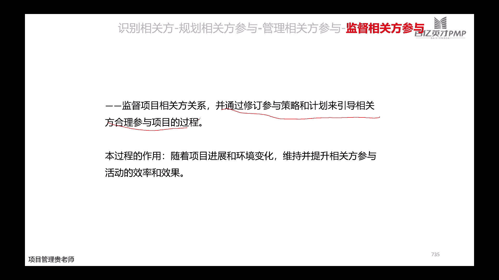

做一些更新就OK了，它的核出你看既然要做更新，就是管理计划的更新啊，有的时候更新呢，尤其是在预测性项目当中，我们做更新还要走变更请求，还要提变更啊，所以呢输出第一可能有变更进球。

第二呢啊是参与计划的更新。

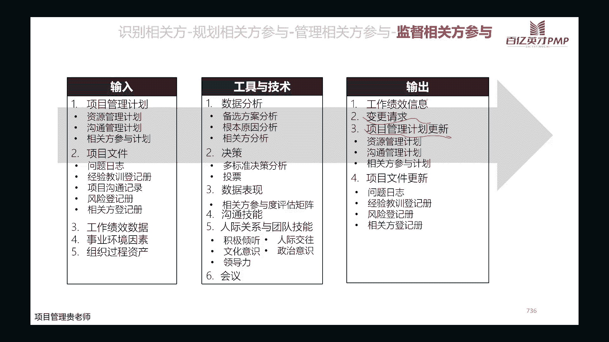

重点参与的重点监督的是什么，监督的是啊相关方的一些这个呃数量和有效性，前面讲的呢就是更多的是有效性哈，就是说他对我们这个相关方啊，到底他的参与策略是不是有用的，是不是有一些变动的。

那同时呢还要重点关注相关方的一些数量啊，数量有增有减啊，有一些新的一些相关方可能会出现，比如说哎我们在做这个项目过程当中啊，做做做的，突然发现甲方那边啊，当然旧的领导如果说他完全不管这个项目了。

那么相应的旧的这个领导的这个干系人啊，就要做一些删减，对不对，所以呢监督啊，第一个是相关方的这个登记册，本身的这个人员会有一些变动，同时呢消防方他的人没有变，但是呢他的态度有所变化。

态度呢前面举的例子是说啊，可能他对这个项目的期望，觉得没有达到他的一些期望啊，你渐渐的就失去了他的一些性质啊，或者是他的权利也可能会发生一些变化啊，原来呢它是一个啊。

这个只是一个项目经理的助理在对接我们，但是后面呢随着他做的过程当中啊，这个项目呢他在甲方那边啊，升职升的特别快啊，一下子升到了这个项目总监啊，那我们是不是对他说话，或者是跟他去啊，控项目进展的时候。

要更加的去更加的这个更加的礼貌一点啊，更加的准备充足一点，更加尊重人家一点，对不对，所以他的态度和权利也都在发生变化，再一个呢是他的参与办法，因为前面都在变，那么后面我们评估一下它的参与办法。

是不是还是有效的，是否需要调整的啊，你原来呢你觉得他只是一个项目经理的助理啊，来对接我们啊，所以你有什么事的时候呢，你随便在微信里面，你可能就艾特他一下，跟他说一声也就OK了啊，甚至呢他给你说一些需求。

或者说一些他的一些建议的时候呢，你响应的也不是很及时啊，那么在这个过程当中，两个月过去了，人家已经生成了项目总监啊，人家权利这个一下子非常大了，你还跟他称兄道弟的，随便吆喝人家一声行吗，当然是不行的。

对你要给他给予他足够的尊重，为什么呢，因为他的权利提升了啊，他如果说你还是按照之前的那种办法哈，那显然如果不小心得罪他了，那他的这个态度肯定会发生陡然的这个变化。

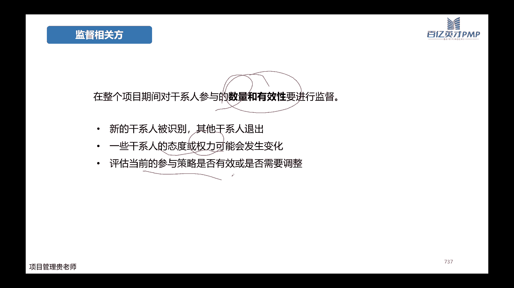

好这儿给大家举了一个例子哈，这个例子呢是这个嗯，澳大利亚悉尼的一个跨越隧道的一个项目，这个项目就是典型的一个干性，管理不善的一个案例啊，为什么取这样的一个案例呢，举了案例大家能够实实在在的能够感受一下。

为什么我们说啊，该系人的理论好像讲起来没有什么觉得很简单，但是该系人实际的啊，项目过程当中它是那么的重要，好，这个项目呢，它本身是说项目，它就是做着做着已经发生了很大的成本超支了。

但是呢嗯成本超市之后呢，最开始的时候也是说的这建一个隧道嘛，这是政府牵头的这样的一个大项目，最开始说的是不用政府的钱，不需要政府来投资，那现在怎么办，你项目本身又超支了呀，成本超支了呀，那怎么办。

那就既然是隧道嘛，那你就找通行的这些用户去收通行费啊，结果呢啊这个这个这收通讯费，导致这什么机构呢，导致结果是很多人都不愿意走这个隧道，原有的这个你建这个隧道啊，你要投多少钱啊，你预计能够收多少钱啊。

你是有一些经济模型的，对不对，做商业论证的时候肯定是做过的啊，但是你现在呢通行这个隧道的这些车辆，减少了啊，所以你的通信费收不回来，原来的经济模型都行不通了，结果现在呢啊这个审计长就不太看好这个项目。

他是说你现在如果说按照目前的这种收费的话，每周的通讯费都已经要达到35欧元了啊，也就是说你很多你设想的这些潜在的这些用户，潜在的这些车辆，它可能就不会成为你的用户，那这样的话你原来做的这些隧道。

你肯定是他的这个目标啊，你就不能达成，你建这个隧道，你不是为了收钱呀，对不对，你最开始你建这个隧道肯定是首先的目的，他是为了去缓解交通的压力，然后其次呢啊能够有一些微博的一些盈利，对不对。

一般政府项目都会这样，对不对啊，但是现在呢你不仅没有微博的隐匿啊，你还有可能没有办法缓解地面交通的压力，因为你建了隧道，人家都不愿意走啊，所以这就是一个典型的，他们是保护了谁的利益呢。

保护了保护了政府的利益啊，说了我不像你啊，做这个费用的这个开支，我不让你投钱啊，从表面上面看好像是嗯，好像是这个没有让政府掏钱啊，但实际上呢你增加了你的这个另一类干性的，也是非常核心的。

就是你增加的这个用户啊，你增加了他们的一些使用的成本，所以你从表面上看到，你好像是啊舍得这个舍得用户保障政府，但其实从长远来看啊，政府呢，你他他你觉得他没有给你这个项目去投资啊，没有用他的钱。

但实际上呢这个政府啊，尤其是跟交通部门啊，这跟这个运输管理局跟他相关的，他们没有很好的去解决地面交通的这些压力，该堵的地方还是堵啊，该车流量大的地方还是车流量啊，所以呢我们尽可能的时候啊。

尽可能的时候在做项目的过程当中，不要单方面的去以牺牲某一个相关方，某一类相关和利益，然后去换取另外一个相关方的利益哈，一定要做最后的评估，综合的评估做完了之后，然后再去选择更合适一些。

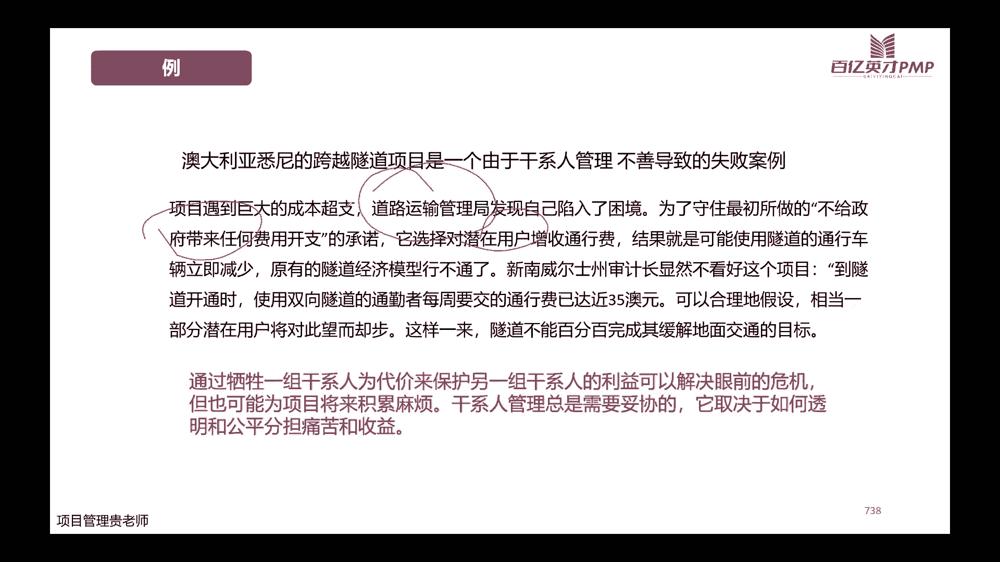

能更合适一些办法和解决方案哈，嗯那么整个关系人的这一个部分呢，关注的几个重点哈，第一个呢是项目有多少个改写的，然后第二个呢是你能不能确定啊，能不能确定可能让项目失败的，主要的关键方法是哪些啊。

主要的阻力来自于哪些，怎么样去解决这些问题啊，能不能够利用哪些能够重要的这些支持者，还能增加一些项目的一些知识度啊，比如说你在做项目的时候，肯定很多人都希望自己做项目的时候，自己的这个啊更高一点。

领导能够核心的参与，对不对，他也参与啊，你旁边支持的那些职能部门，都开始扒着扒着跟着过来了，对不对，那他能不能呢，能不能核心的参与到这个项目当中来呢，对不对，他能不能帮你站台呢。

啊最后呢是唉怎么样调整不同的干性的策略，去适应不同的阶段哈，这这这个问题其实就是，整个我们在做项目的过程当中啊，你说该新人啊有哪些过程啊，啊这些过程分别用什么工具啊，这都是我们考试用的。

那实际用的其实重点把这四个理解哈，把这四个理解理解就好了啊，第一个识别出来有哪些关键的，第二个呢，等会可能会让我们项目失败或者有负面影响的，主要是哪些，怎么去解决啊，第三个呢啊找哪些人来给我们站台啊。

来支撑，然后第四个呢不同的阶段怎么去适应，关注这些就OK哈，就相当于是给大家实际工作偷了个懒，嗯有一些例题哈，啊这个例题呢我们都来看一下吧，第一个例题呢是说在每周一次的项目会议上面，啊。

这个团队成员说嗯修订这个可交付成果的时候，这个销售经理对客户服务的过程中，想出一个变更的讨论，会影响到整个项目，然后项目经理对销售参与到项目的，这个可交付成果感到吃惊啊，事先他应该做什么去阻止这种情况。

看懂这个题目没有啊，题目前面都是给的你场景哈，给你场景是说嗯销售经理啊提出来了很多问题，但是项目经理就感到很诧异，对对这个销售经理参与到项目和交付成果，感到吃惊，也就是说他原本认为这个销售。

他不会关心这个项目的啊，对不对，你现在怎么还还提出这么多的意见呀，啊那如果说你最开始你对他啊，你识别到这样的一个销售经理，这个相关方，你认识到他的需求啊，你理解到他其实对项目的可交付成果，还是很关心的。

那么啊能够做一些相应的一些管理，让他积极的参与到我们这个项目的成果当中的，来啊，让他提需求，是不是就有可能去啊避免或者减轻这种现象，所以呢A是说改善风险，回顾会及完善风险，那它不是一个风险。

这个风险完全没有关系哈，B呢执行相关分析并完善相关分公测，这个是对的哈，这个显然它的重点是在是这一句哈，是销售，是这个项目经理感到诧异，说你销售怎么还管着这个事儿来了，对不对，所以相关的分析没有做好。

所以呢是说将职能团队流程放入到问题日志，这不是不是说把他的这个职能团队的，这个流程哈，D呢是说识别项目范围，这跟项目范围也没有什么关系，第二题，第二题呢是说，项目经理正在制定相关方的参与计划啊。

并且呢识别了一位权力等级较高，但是呢在项目当中兴趣较低的这个相关方诶，应该怎么管理，那我讲了他权利好，权利高，然后呢啊兴趣利益较低啊，我们说权利高，利益低的是要令其满意，对不对啊，所以是令其满意啊。

考试考这个考全力，一方面他就这么考哈，好第三题，第三题呢是说嗯这个项目的干系人正在讨论，如何在一个新的应用程序当中，增加用户的体验啊，那现在呢敏捷团队呢，就提出来各种各样的方法呀。

但是这个方法呢大家的想法都不一样，有分歧，现在这个冲突更多是集体分析，而不是直接的冲突，A呢是说运用适当的冲突解决技术，来解决这个问题啊，B呢是说召开团队会议，对该问题，对该问题进行正式讨论啊。

C呢是说允许团队自己解决这个问题，除非需要帮助啊，D呢是说与每个团队成员进行单独的谈话啊，这题这题的例题他问的是什么，我没搞清楚，这个大家去大家去看一看，大家觉得呢。

我我还没有搞清这个团队这个题目问的是什么，这个题，这个题目应该是想问项目经理应该干什么，从他的这些这个答案来看的话，应该是问的项目经理应该干什么，诶，那是说运用适当的冲突，解决技术来解决这个问题啊。

这个是OK的，B呢是说开团队会议，对该问题进行正式的讨论，这次好像一般是没什么必要哈，在敏捷当中啊，一般这个正式讨论的这种必要性是比较小的，大家如果有方法不一致不一致，那就继续讨论，直到一致为止。

C呢是说允许团队自己解决这个问题，除非需要帮助嗯，现在他已经在方法上面存在分歧了，还是要这个引导他们来来共同面对，来共同面对这个重复，D呢是说与每个团队成员进行单独谈话，敏捷当中。

我们也不提倡对每个团队成员单独谈话，提倡的是大家共同来解决，共同来讨论，第四题第四题呢是说这个项目经理呢，他刚刚收到一个业务职能经理的通知啊，说他要他完成一个几周前，这是结束的这个项目的额外的啊。

这个额外范围的项目范围看起来非常小啊，相对较小，而作为日常运营的部分啊，可以简单处理，那这个时候啊问干什么，第一呢是提交一个变更请求，并分配执行所需要的一些预算和资源。

B呢是确认预测的资源可以用于执行该需求，C呢是检查组织当中可用于该请求的替代资源，D呢是做评估请求的性质，并制定相应的沟通管理计划啊，这个呢我相信如果说让小伙伴自己去做的话，很多人可能会选错哈。

很多人可能会选到A啊，因为觉得啊是一个项目的，这个嗯额外的一个这个范围的项目啊，所以呢就觉得你现在要做的话，肯定要提一个变更的一个请求，然后呢再开始给他分配一些啊，具体的这个资源和预算。

很多人可能会选到A啊，但是呢这题的答案是优先选择D，为什么，因为你现在这个啊，业务职能经理去跟你提这样的一个要求之后，那么你应该先评估一下，他这个请求是合理还是不合理，然后呢。

看看怎么去跟他去做一些相应的一些沟通，并且呢啊这个业务经理他有没有，他他到底有没有权利给你起这样的一些要求，对不对，如果说他真的是有权利提这样的一些要求，它是非常重要的。

一些相关方这个业务也是非常紧急的，那么你可以考虑去提一个辩论请求，然后去做相应的一些措施，当然如果说这个业务经理，他他可能就是事儿比较多啊，事儿比较多的那一类，那么你也有可能去采用一种其他的办法。

去给他婉拒啊，所以说这种情况先因为优先选择D哈，D是D做完了之后，然后A是基于地之下的可能的一种解决办法，好今天晚上的这个政课内容就讲完了哈，讲了嗯，干系人因为相对比较少。

所以呢讲的这个嗯时间也还比较OK啊，现在才现在才九点不到，看看大家有什么问题，看看大家有没有什么问题哈，哈是这种好容易出错，是的，那我刚刚讲的这种思路，你你不理解呢。

因为我们说那就是嗯变更管理过程的第一步啊，是别人提了需求之后，然后我们内部要做评估的，对不对啊，做了评估，你才能够评估他是不是真的需要走，变更的一些请求啊，因为不是所有，虽然说我们说所有人都有资格啊。

都有这个权力题变更进球，但是呢并不是所有的变更进球，他都是值得变更的，沟通中除了正式场合的沟通，其他都可以理解为非正式的吗，嗯应该是嗯怎么说呢，应该是你看怎么去给它分类哈。

嗯如果说按照正式和非正式的这种角度的话，那它只有两种两个维度，正式和非正式，然后这些非正式还是还是正式，就是并不是说我们说写了报告，他一定是正式的，然后或者是发了邮件，他一定是非正式的。

不一不一定是这个意思哈，就是你可以跟客户约定好啊，什么样的信息啊，什么类型的这种，这个嗯这个报告用什么样的方式去给他发送啊，哪一种是属于比较正式的啊，要正式沟通，哪一种是啊，不用正式的，直接打个电话啊。

这个微信一下就OK，然后甚至发邮件发邮件，我们在课件讲的讲的是，发邮件是属于非正式的一种这个书面沟通，但是呢我们也可以约定啊，这个比较正式的，或者说要留恒的来发邮件啊，来留恒啊。

这个作为正式沟通也OK哈，看我们实际怎么去约定，但是呢如果说你按照正式和非正式的程度的话，它它就是你可以按照你的说的，除了正式的，那就是非正式的，那正式非正式这些管理计划嗯。

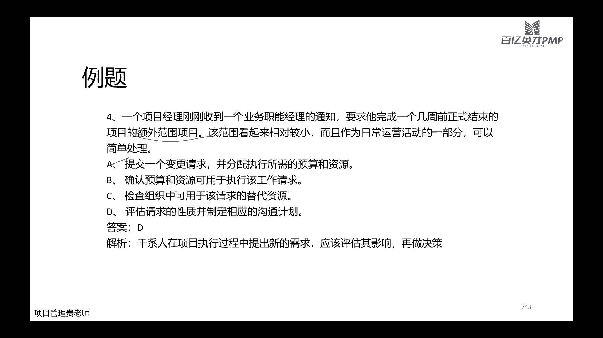

等一下我调一，这些约定在沟通管理计划里面，还是在哪里，在沟通管理计划里边，是的，沟通管理计划里面的哈乔丽，大家都是聚焦在沟通嘛，大家的问题都是聚焦在沟通吗，我们说到相关方的这个参与计划。

不仅仅只是沟通哈，除了沟通，你还有怎么去找他要资源啊，他如果说权利有变化，或者是说对这个相关方有期望有变化，那我们怎么去啊，把他的这种变化去把它识别出来啊，去提前监测，对不对。

当然嗯这个沟通是一种方式吗，沟通是你获取信息的一种方式，对不对，所以你看大家问的问题哈，沟通的场合，然后沟通是方式，是这个记录在哪里。

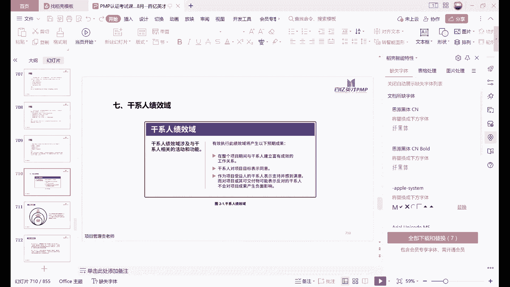