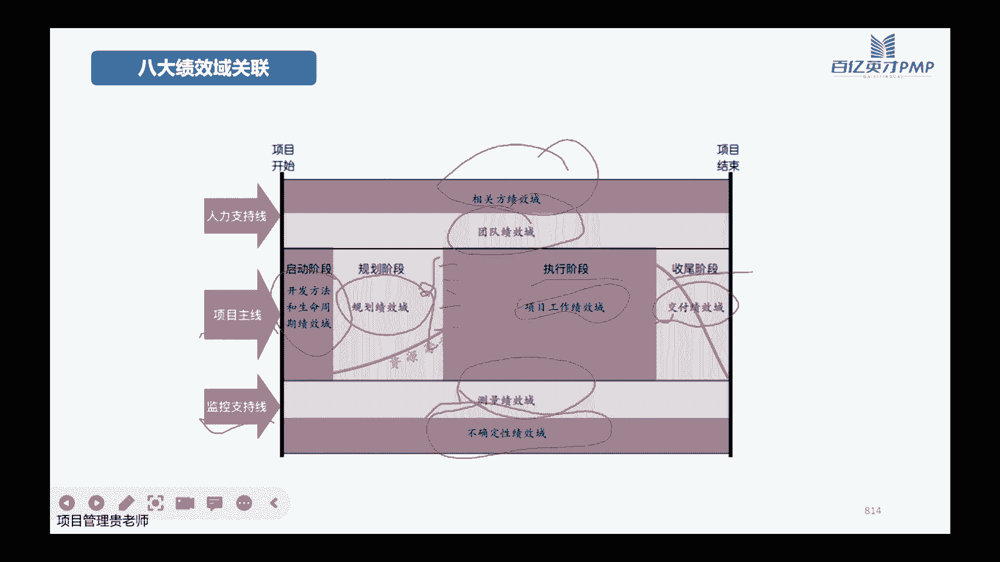

# PMP考试培训课程最新完整版项目管理认证第七版教材新版考纲自学教程 - P17：17.团队绩效域 - PMP专家 - BV1rM4y1Y79x

好已经在直播间的小伙伴，如果能看到课间听到声音的话，帮我敲个111哈，OK谢谢感谢大家看到了，我们还稍微等一分钟哈，等到07：30，好我们开始今天晚上的课程哈，今天晚上讲我们的团队绩效与，还是老规矩哈。

讲团队绩效率之前呢，我们先把上一个绩效率的内容回顾一下，上一节课呢我们讲了该写人的技巧与嗯，如果说大家在脑子转的比较快的话，也可以跟我一块回顾一下该写的技巧语，讲的什么内容。

那么该性教育呢大家一边回想啊，我一边带着大家一块儿回顾，首先呢我们讲了干系人呢，要有不同的一些分类啊，对不对，所以说一上来跟大家讲了，不同的干系人怎么去分类啊，一般情况下我们可以用这样的一个这个啊。

三幅图，核心内部的项目团队项目经理，然后呢公司的治理层的项目管理委员会，项目管理办公室，还有我们外围的这些客户啊啊供应商啊，还有一些监管机构啊等等，为什么了解项目的该学的分类呢。

是因为我们要在项目的初期，就要把这些项目的相关方干系人把它识别出来，所以呢整个干系人的管理分为了识别的动作，识别完了之后要做理解，分析为什么要做理解分析呢，是因为要知道他对这个项目的期望是什么。

他有什么样的权利啊，他的兴趣有多大啊，他跟这个项目之间的关系，所有权关联性依赖关系，对不对，做完理解和分析呢，我们要做该型的优先级的排序，因为一个项目当中的干系人中毒，所以呢那么多干系人都识别出来。

我们不可能说所有的关系人，都去重点的去管理啊，对不对，所以呢有一个优先级排序，那么优先级的排序之后呢，去引导他们的参与，并且呢要做好整个过程的监督的工作，是整个这样的一些流程啊，对不对。

所以这节课呢我们接着讲啊，讲团队吉祥语，其实从翻译上面讲的，团队成员本身他也是干系人的一个类别哈，是细分出来的，只不过说呢团队它包含的内容太多啊，也是我们在做项目管理的过程当中。

最重要要hold住的那一部分群体啊，记住哈，最重要hold住的那一部分群体不是客户，而不是甲方爸爸，是我们的团队本身好，所以呢不论是第七第六版，还是我们第七版的教材，把团队跟开心人都是把它分开。

再跟大家讲好，那我们团队的啊，这个技巧与他注定的设计的内容呢，就是跟我们的这个项目啊，跟他相关的这些人员的活动和功能啊，不是跟我们的干系人是有一点区别，该系人是跟我们的项目本身的目标有关系的，这些活动。

而项目的团队绩效力呢，是负责生成这些可交付物的啊，人员一个是负责做成这些事的，一个呢是负责跟这些成果有关联的一些人啊，所以两个不一样，那既然说我们团队是要负责生成这个项目的，可教服务，他要干活，对不对。

那我们要有哪些预期的一些成果呢，首先你既然要干活，每个人都有任务，那每个人都有任务，那每个人都有他的责任啊，都有在我们项目当中的一些职责，对不对，既然有职责，那我们说了一个团队就是一个整体。

所以呢项目经理在管理的过程当中，重要的是要达到一个高效的团队，这个很难啊，这个很难，但是呢这是我们的目标，同时呢我们还要引导所有的相关方的，这些团队成员啊，都能够展现出来的他们的一个领导力哈。

这一点呢是跟我们第六版的区别比较大，第六版的讲p mi的这个人才三角，讲项目经理人才三角的时候，重点是说啊，项目经理他要有领导力，要让团队成员愿意跟着他干活，但是第七版呢，第七版是说的是项目经理啊。

他就把这儿的一个从领导力改成了影响力啊，他不仅要自己有引导力，他还要去影响他的团队成员，拥有自己的领导力哈，所以这一点其实改的还是挺大的，不再是讲究一个优秀的领导，是能够发挥优秀的领导力。

让大家带着他干，不仅仅满足于此的是一个优秀的领导者，要让团队成员都发挥自己的领导力啊，那既然我们要讲团队的这个绩效率的话，我们就要知道团队的构成是什么哈，团队的构成就是我们前面讲的。

干系人里面最核心的那个圈啊，有三个大的类型的角色，第一个呢当然就是咱们在座的，在学的这些所有的小伙伴啊，我们将来是要奔着这个优秀的项目经理去的，那OK第一类角色呢就是我们项目经理本人啊。

本身第二个呢是项目的管理团队，就是直接管我们这个项目的啊，这些团队成员啊，有的呢是只管的这些PO也算啊，有的呢是分管我们这个项目团队的啊，这些这个紧密配合的这个团队也都OK，第三类呢就是要开始啊。

这个负责给我们生产这些项目可交付成果的啊，说白一点就是要负责具体来执行，做干活的啊，来做嗯，这个活动的这些团队本身，在了解项目的团队构成之后呢，我们要分一下哈，因为预测性的项目跟适应性的项目呢。

它的玩法和团队的构成呢区别还是比较大的啊，我们先来讲一下适应性的项目，适应性的项目的团队呢，首先啊我们讲他最核心的就是，用我们scram的框架去推进每一个迭代啊，推进我们的发布成果出来，对不对。

所以呢在适应性项目团队里边儿啊，一般是我们把它叫做scrum团队啊，叫做这个嗯，scrum团队呢，它一般都是一些小规模跨职能的自主之团队哈，这三个词儿都很重要，今天晚上都会讲到它们的含义是什么。

小规模一般啊5~8个人是比较合适，为什么5~8个人是比较合适呢，因为我们讲啊适应性的项目，他要有这个比较敏锐的反应能力，他每天要开战会，那这个人太多了之后，他协调不过来，他敏锐不起来，对不对。

所以一般呢这种是5~8人是比较理想的，然后跨指龙为什么是跨职能，因为一个适应性的团队，他需要发生问题之后，首先由这个团队本身啊，大家群策群力，能够把这些问题解决，那所以呢这个团队里面。

如果说啊各个专业的角色啊，各个这个擅长的啊这种不同的经验的人构成，那大家能够一起讨论啊，能够发挥一个三个臭皮匠，顶个诸葛亮的这个功能，但如果说他不是跨职能的，比如说都是啊都是负责这个软件开发的啊。

都是工程师，那可能他擅长的一个点，那都是做前端的，那如果说有一些后端的事，他可能就处理不了啊，所以呢这个也不能叫做一个很优秀的这个团队，自主这个团队呢是说自主的，意思是说他们的工作任务。

计划基本上是由团队自己来安排啊，团队自己为这一次的迭代啊，为整个框架当中的这些项目的成果去负责任啊，是这个意思，那么了解的SRAM团队之后呢，我们还要注意一点哈，注意一点，有的项目呢它是非常大。

它里面包含了好几个民间啊，比如说一个啊做一个这个的整个这个系统集成，系统集成的这个大项目，它里面有很多个分的软件啊，有几个不同的这些软件，那么这些不同的软件呢，他可能都需要一个小团队在做啊。

这个时候呢每一个团队他都是一个小gram啊，写法C他都是一个小scrum团队啊，所以呢当它由多个scream团队共同来构成的时候，我们可以把它叫做SOS，就scramble scrams，这个有可能啊。

有一有一次的这个考试，他就考到这一题啊，所以呢这一点要跟大家讲一下嗯，如果说一个团队当中，它涉及了两个或者以上的敏捷团队，共同来构成的话，那么它就叫SOSR嗯，跟大家提前的这个说一下好适应性的项目。

他的团队角色呢，我们之前讲这个SWM框架的时候啊，跟大家讲过，swan合金框架要掌握的是3355啊，大家还记不记得我们前面讲过三呢是三类工件，然后讲过一个五呢是讲过五个事件啊。

今天晚上呢就要讲剩余的一个三和，剩余的这个五到底是什么意思，如果说了解过敏捷啊，看过敏捷实践指南的，就会知道我们适应性的项目呢，说的这个三是指我们的项目有三类角色，其实我之前讲课也讲到啊。

只不过是没有深讲，不知道有新的小伙伴记得的，然后另外最后一个五呢是讲的是价值观啊，讲的是五类价值观，这个都是我们团队绩效益的内容，三类角色是什么角色呢，嗯哎这讲之前讲过这个三个，这个五大家还知道吧。

三个弓箭和这个五个会议，大家还记得，不应该在这不需要回顾了吧，这三类角色呢啊首先啊要了解一下相位，角色当中最重要的由我们团队本身啊，叫developers，就是我们做这做开发，做执行的这个团队成员。

那这些团队成员呢，他所需要的技能通常是很广泛的啊，无名我们要实现跨职能，并且呢随着他们工作的项目的，成果的领域不一样嗯，他们的工作的职责会发生一些变化，那他具体负责干什么呢，啊就是我们每一个迭代开始了。

我们说了每一个具体的迭代，他的这个呃任务的这些拆分啊，故事点的估算好，包括呢这一次迭代当中具体的工作任务，安排的这些执行的计划，这些其实都是由我们团队本身自己来负责的啊，自己来负责的。

所以呢他的第一个任务是要给每个迭代，创建具体的工作计划啊，这有这个跟我们预测型项目有所区别哈，预测性的项目，我们说了，工作计划呢是项目经理带着团队成员来做，是以项目经理为主，但是呢适应性的项目。

具体的工作计划是由团队自己来做啊，那么第二个呢，是我们之前讲实验级项目的时候啊，这个完成的定义对不对，完成的定义呢啊有一些标准啊，有一些标准，这些标准呢是需要团队自己去负责，他的质量的管理。

也就是确保我们做的工作做的这个迭代啊，做的每一次这个嗯，过程和结果都能够符合我们DOD的标准啊，所以呢质量管控是由团队本身来做的，这个也是区别于我们的预测型项目，之前讲质量控制的时候，质量管理的时候。

我们说过预测型的项目啊，质量控制或者是质量管理，是不是一般是由专门的一个小团队来做啊，但是呢适应性的项目质量控制，质量管理的这些动作，是我们团队成员本身在做啊，所以这是第二个区别，那么第三个呢是啊。

既然这个计划迭代的这些具体的工作计划，是他团队本身自己做的，那么根据具体的实施的内容去调整，具体的这个计划啊，比如说今天做的故事点啊，这个啊用户故事一，明天做用户故事二，那之间的顺序呢。

这些安排是团队成员自己可以，根据实际的情况去调整的，同时呢，最后一点啊，作为专业人士，当然要对彼此负责，这个是第一类哈，这区别啊一定要弄清楚了，因为考试往往会给你很多场景啊。

这个场景呢大家首先要区分出来，这个场景到底是咱们的预测型项目，还是适应性项目，同时呢啊预测型的项目当中呢，他这个呃具体这个过程应该是谁来负责，做适应性项目当中的具体事情，具体这些动作应该是谁来负责。

谁来做哈，这是区别，第二类角色呢我们叫做啊简称，就是一直在跟大家说的POPOPO是什么，PO就是我们的产品owner，owner是所有者，产品所有者啊，就是产品的最终负责人，他呢一般情况他是一个人哈。

他不是一个委员会啊，一般情况都是这样，这个呢会跟我们，比如说比如说预测型的项目都有发起人，对不对，那前面跟大家讲过发起人是一个人吗，发起人啊他不一定是一个人，他也有可能是一个委员会。

也有可能是一个部门啊，甚至也有可能是一个公司都有可能，对不对，但是在我们适应性项目当中呢，这个产品的这个负责人啊，他也是负责定这些产品的方向，定这些产品的目标啊，定这些产品需求的。

他呢一般情况是一个人哈，是一个人，他的任务就是按照产品的价值最大化，为什么呢，因为他负责产品，产品要达到功能，产品有时间的价值，对不同的改写人到底应该是什么价值，这些是要产品负责人去负责去把它搞定的啊。

同时呢还有一个非常非常重要的，就是我们的这个PP2产品待办事项的列表，这个是一定是有产品负责人来负责生成，来负责整理，来负责增加，来负责减少，来负责调整它的一些优先级的顺序的啊，所以他的具体任务呢。

第一个是要啊，明确的去沟通他的这个产品的目标啊，项目的目标，产品的目标到底是什么，然后第二个呢他还要能够沟通沟通清楚，他负责的这个PB2好PPL，一般我就简称说啊。

大家要知道pp2指的就是project的嗯，backlog就是产品贷款事项列表，他要负责向他的团队成员去沟通清楚，这些产品代办事项列表当中，到底对应的需求和拆分出来的诱惑，故事应该是什么样子的。

而要沟通清楚，沟通清楚之后，团队成员本身才能够好好的去做故事点的估算，才能够去评估在这一个迭代里面，它能够完成多少个故事点，能够完成多少个用户故事啊，同时呢它的排序刚刚讲过了啊。

确保这个产品代办事项列表是透明的，可见的，可以理解的，所以你看产品负责人，他的核心都是围绕这个产品的目标，和产品的代办事项列表，虽然她列了这么多条，但是核心其实就是产品，第三类角色呢。

宋是我们的这个square master，square master呢，他的这个严格的这个翻译，应该叫做这个啊敏捷的教练啊，啊敏捷的引导这个领导者，嗯一般呢在项目当中这个大家如何做题哈。

题目当中会给你啊这个项目的负责人啊，或者敏捷的教练呀，啊或者是SM呀，square master到底应该干什么呀，啊大家都默认的哈，嗯这个square master呢从很大的概率上面来讲。

他的职责是有点等同于这个pm，有点等同于这个pm哈，但是呢它实际上嗯是把SM啊和这个PO啊，包括这个，团队本身其实它的这个三个功能哈，都是预测型项目当中的项目经理在完成啊，所以他的职责期有点在分流。

分流到他们负责具体任务执行计划，他负责产品的目标方向需求啊，他负责引导整个团队当中的这些，具体的这些日程的推进，项目的推进迭代的这些眼镜，所以呢他其实是一些真正的一个领导者啊，有人会说。

为什么他还是真正的领导者呀，他又不负责产品，对吧啊，这个需求他好像也不是他说了算嗯，具体的这些工作任务计划也不是他安排，为什么他是真正的领导者呀，那是因为在适应性的项目当中，领导者他做的是啊。

不是带领团队去干这些活，他更重要的是仆人式的领导，他是做服务的哈，他像一个管家一样，他给你做服务啊，什么意思呢，也就是说你做计划的时候啊，你有什么阻碍，你有什么困难需要跟组织沟通。

SM来团队本身遇到什么样的不能协调的问题，SM来团队本身觉得设备哪里卡壳了，SM来给他解决啊，他是不认识领导是服务的，所以呢他的职责第一个呢是啊，既然我们说了USQUENT的这个一些规章啊，一些制度。

那他OK他要验沿着这个啊一些规则，来把这个ROM团队把它建立起来，并且呢这个团队成员当中，如果有哪些人他不清楚，具体的就是ram他推行的这种框架，它服他推行的价值观啊。

他的团队成员各写各个人的这个角色的承诺，到底应该怎么办，那会SM来给你负责培训啊，给你负责把这些理论和实践的，这些经验给你灌输到位，最后呢是为团队的项目负责，团队需要他来协助的，他无义无啊，他无条件啊。

有百分之百的这个义务，去负责给这些团队提供他的帮助，好OK那集团团队就像你从过程里面讲呢，我们首先要把这个团队建设起来啊，建设团队的核心的啊，是要改进增强他们的人际关系，改进他们之间的团队协作啊。

最重要的目的是说，要让团队之间能够形成一股很高绩效的啊，这种工作的效率形成高绩效的团队，它的整个这个输入和输出的过程呢啊，首先输入有一些这个项目的这个资源，管理计划啊，尤其是人力资源管理计划。

然后呢有啊团队的派工单，团队的资源日历，团队的一些章程啊，工具的比较多，集中办公，虚拟团队沟通啊，人际关系技能上次也说了，认可啊啊培训啊啊个人团队和评估啊这一块，这一部分的工具和技术比较多啊。

这也是今天晚上讲的一个重点，那说出来呢重点就是团队绩效的一个评价，团队发展的共同方面呢，大家要理解哈，首先呢嗯大家每个人在这个项目当中，肯定要理解项目的他的愿景是什么，他的目标是什么，然后呢。

要清楚自己在你那个角色啊和职责是什么样子，如果有些人他可能不太清楚自己的职责，那么作为啊我们项目经理啊，要通过各种方式哈，培训也好，辅导也好，或者教练也好，来去解决他们一些知识。

或者技能方面的一些差距哈，嗯同时呢在团队本身的这个沟通之间啊，我们前面说了，项目经理八九十%的时间都是在沟通，OK那么沟通呢啊，项目经理要花功夫去协调团队成员之间的，他们的工作的任务，工作的冲突啊。

去帮助他们解决一些问题，给他们每个人呢有一些正确的一些引导啊，让他们能够把自己的一些经验和一些技能，能够发挥在我们的项目当中去，从而实现项目本身的成功，以及他们团队个人的一个成长。

高绩效团队呢我们说啊做好请团队的建设，重点是要打造好高绩效团队，那什么是高绩效团队，高绩效团队要展现出来哪些特点，他才能够被叫做一个高绩效团队呢，首先啊是要既然是高技巧，那么是一定要开诚布公的去沟通啊。

要有一个开放透明的这样一个团队文化，才能够有助于打造高绩效啊，这个应该很好理解，如果大家有什么建议都不跟我说，那可能我的这个授课的方式啊，风格大家不喜欢，但是呢我不知道，那我就一直按照这种风格讲啊。

那导致于大家最后就觉得A好像感觉不太好，那这就是一个很低效的一个行为，对不对啊，第二个呢是共识，故事呢，嗯就是跟前面的这个愿景和目标是一样的，愿景目标以及这些目标带来的收益，大家是不是能够达成共识。

如果大家对这个项目的这些目标都是一样的，就是都能够达到共识啊，我们说了，今天啊这个月啊一定要冲刺什么什么目标，大家众志成城，那显然效率一定会高一些哈，责任这个责任没什么好说的，是个人都要有责任。

无论你这项目还是在生活当中啊，要信任啊，要协作，还有呢适应性，前面也跟大家重点讲过，有哪些具体的工作方式啊，和一些工作的这个办法和一些活动，能够去提升团队本身的一些韧性，对不对啊。

提高它的韧性和它的适应性是一块讲的，如果不记得的学员呢可以再回过去再看一下，然后再一个就是赋能啊，团队成员呢我们要给他赋能啊，给他赋能之后呢，要让他自己觉得有能力，并且呢啊还有给他授权。

让他有能力有权利去给他自己做的那些工作啊，能够勇于承担他自己的工作上面那些职责啊，同时呢还要去充分的去认可，一旦他们有一些比较好的一些技巧，那我们要去充分的认可并且鼓励他这种行为。

项目团队文化呢啊打造高绩效团队，还要有一个比较好的一个项目的团队文化啊，这个透明啊，啊，就是主要是指的是，我们在处理项目的一些工作啊，一些信息上面要保持一些透明哈，啊，比如说项目做了一个什么样的一个。

新的一个决策啊，这个决策呢，不要是指这个跟一些核心的人员说啊，其他的一些团队成员的觉得他不重要啊，就不让他知道，那么这个其实是一个很伤人心的，这样的一个动作哈，这个不要有好诚信，没什么好说的啊。

尊重尊重每个人的他们的思维方式，他们的工作方式，尊重他们的经验啊，哪怕是有些人觉得哎，觉得这个可能可能我们在工作当中，也经常碰到哈，觉得有些人他的这个理解能力，或者他的这个技能跟我们团队不太匹配啊。

就觉得跟他聊天啊，跟他布置任务太费劲，嗯就就可能会表现的有一些啊，无论是言行上面的呀，还是工作的这个安排上面就会有一些区别对待，不要有这种行为哈，尤其是我们自己作为项目经理，作为一个优秀的管理者。

要去知道每个人他有他自的长处啊，他也会有他自己的短处，那么我们重点还是要怎么样去扬长避短，要再一个呢是要积极地引导他们的去讨论，在讨论意见的时候也是一样的哈，每个人他擅长的领域不一样。

所以在不同的这种场合呢，他们提出来的比较有效的这种解决方式也好啊，或者是啊一些想法和建议也好啊，其实都是不太一样的，那么我不要说哎他提的想法比较好，哎呀我就觉得哎呀这个挺好挺好。

我会让他的想法一直讨论啊，有些人觉得他提的这个想法多好呢，我们就把它忽略了啊，这个也没有鼓励啊，也没有任何方式啊，不要这样哈，这样的话你等到下一次轮到他擅长的领域，再让他提意见，提想法的时候。

可能他就不太乐意了啊，他就不太愿意说了，再一个呢是要支持啊，一旦我们的团队成员啊，他有什么样的一些这个想法啊，我们要积极的去听一听，了解一下他为什么有这样的想法啊，即使他的想法。

你觉得站在你的这么多年的工作经验上，你觉得他的想法非常幼稚，没关系啊，你星星听听人家是为什么会这样想啊，他所处的这个环境是什么样子啊，情绪是什么样子，为什么会出现，他当时提出来的那个想法和建议啊。

进而呢你了解这些之后，才能够有效的去解决，帮助他解决，排除一些障碍，解决一些问题，无论是他个人上的还是一些工作上的，当然我们优先肯定是讲的是工作上的哈，啊要有勇气提出一些建议啊和一些意义。

这个呢其实在实践当中呢非常关键哈，当然我相信大家应该也都知道，只不过说呢觉得做起来比较难啊，这为什么难呢，有两大难，第一个向上比较难，第二个呢向下也比较难啊，向上为什么难。

向上难的是因为领导说了一些想法，我们有想法的时候，我们有不同意见的时候，不太敢提，这个很正常，对不对，因为谁都不想活着，领导的面子向下比较困难，但是啊有些团队成员你可能看着他比较积极，不同的人。

不同领导风格，那么对于一些性子啊，性格比较随和的这种领导啊，这种项目经理可能就觉得，这个怕把别人的意见都否了，觉得不太好啊，觉得伤别人面子，我们说了要积极心，要支持啊，那就不跟别人说一些不好的。

这样也不是哈，不是说不好的，而是说要以一种更好的方式去把它表达出来啊，最后呢一个好的团队文化是要勇于去庆祝，团队当中取到的任何一个哪怕很小的一个进展，哪怕很小的一个成果，比如说我们团队啊开会的时候。

原来可能大家都不愿意说话，经过你的一些动作，一些鼓励，大家现在能够在PV上面，勇于提出自己的一些想法和一些建议，那么这就是一个很明显的一个啊，比较好的一个进步啊，认可庆祝啊。

不要忽略任何一个小的这个成功点，这个跟我们原来讲啊，第一节课的时候，第一节第二节课的时候跟大家讲过变革啊，讲过变革这个原则，变革也几个不同的这个模型啊，所以刚开始的时候呢可能混乱啊，抵触啊都是正常的。

但是呢大家总有一个接受的阶段，在接受了之后呢，会有一些小的一些动作是正常动作，一旦有正向动作，我们要就要有四个档的去认可啊，去奖励啊，有这样的动作之后，才能够鼓励大家继续的去推行变革的这些行为，对不对。

大家还记不记得好团队计算模型啊，有七个大的步骤，首先啊第一个步骤呢是确定方向，确定方向呢，这个就是说，首先我们啊既然是这个要打造高质量团队，那么团队的方向一定是一致的啊，比如说我们说了啊。

这个月要好好的冲刺，达到什么样的一个目标，而这个目标呢是为了大家以后能够做成，什么样的一些事情啊，能够积累经验做铺垫啊，同时呢能够把这个项目的那哪一部分的成果，好好的去交付。

是能够让大家第一都能够知道目标是什么，第二呢能够知道大家围绕这个目标，各自能够配合的一些动作啊是什么，第二步呢是要建立信任啊，这个呢建立信任呢，嗯首先我们不仅是我们自己，要信任项目团队本身。

而且呢还要引导项目团队本身能够互相信任哈，不要出现今天呢有一个人跟你告状啊，说那谁谁谁他不太看好啊，明天又换了另外一个人，说谁谁谁，我也不太看好，我觉得跟他工作起来沟通起来比较困难啊，不要有这种哈。

一定要鼓励把我们的这种信任机制啊，要传播到项目团队的成员身上，要让他们能够互相的去信任啊，信任他们是一定能够在承诺之内把这些任务，把他的职责去把它完成啊，能够我能够去跟他有一些比较紧密的。

一些观念的时候，不受他的一些影响啊，第三个呢是要澄清他们的目标，这个目标呢主要是具体的这些工作，任务的一些目标，第四个呢是要获得他们的一些承诺，获得他们的承诺，是我承诺我负责的这一部分。

我会认真的啊仔细的去准备啊，按时保质保量的去把它完成，不因为我的一些个人的一些因素，去拖团队的后腿啊，那OK大家都认可这个事，并且获得大家承诺之后啊，要进入到这个实施结束，做动作的这些行为。

那做动作的这些行为之后呢，他其实也有一个啊质量控制的过程，PDC的一个过程啊，实施的过程当中有什么不好的啊，去改进去循环啊，再计划啊，在动作啊，再改进啊，在循环，OK循环经过有一定的这种循环之后呢。

渐渐的有一些高技巧去体现，有些高技巧体现之后呢，哎又进入了反复的循环，重新开始哈，团队绩效评价分了几个不同的这个板块，首先是个人的技能的一些改进啊，这个当然是因为我们跟项目的团队绩效。

跟项目的绩效评价有所区别哈，我们前面讲项目的绩效评价的时候，大家还记得吧，我们重点是关注项目的啊，他的这些正直啦，好偏差分析啊，啊观察它的趋势呀，这个是项目哈，这个是项目本身的绩效评价。

大家不要弄混了哈，企业在旁边不要弄混了，所以他关注的是项目本身的进度怎么样，成本怎么样，质量怎么样啊，项目的成果怎么样，但是我们现在讲的团队绩效评价呢，它关注的首先第一个是团队绩效。

跟个人的这种技能有核心的相关性，强相关性，那OK个人技能啊，他有什么问题啊，他高效高效在哪里，值得我们大家去学习，它低效呢，哪里低效，我们应该帮助他怎么去改进，那同时呢由个人发挥到上市呢，团队本身。

团队集体集体的能力有哪些需要改进的啊，大家的这个反馈能力啊，反应能力，团结能力，沟通能力怎么样，然后呢团队成员的离职率啊，它是否能够降低凝聚力，是否能够加强，这个呢，都是反映我们团队绩效本身的。

一些不同的一些维度哈，好在讲团队构成的时候呢，我们要了解一个啊这个模型啊，也叫做一个理论，这个理论呢叫做啊塔克曼阶梯理论啊，什么意思呢，就是任何一个团队他在形成的时候，他分了五个不同的阶段啊。

五个不同的阶段，首先呢是啊团队刚开始的时候，他有一个形成的阶段啊，嗯比如说呢举个例子哈，啊比如说这个大家是第一次听我的直播课啊，那最最开始的时候咱们也是一个团队，咱们的目标呢啊。

就是帮助大家能够拿到PMP的这些认证，那OK最开始的时候哎我们也是一个行程啊，也是一个形成的阶段，那形成阶段过了之后呢，有一些正当的阶段，在整档阶段的时候呢，大家会啊，团队成员之间会有一些摩擦啊。

比如说我不喜欢大家这个这个啊，解题或者问问题的一些方式啊，大家不喜欢我授课的一些方式啊等等啊，不太习惯，因为大家都听过直播啊，我也带过一些学，我也带过一些学员啊，我清楚他们的一些训练方式。

上课方式对不对，所以在这个时候呢，因为跟之前的一些过往的经验，过往的一些文化可能有一点点的不太一样，有一点点冲突啊，有一些震荡，这个是非常正常的哈，那么我们共同的目标呢，是要一起扛过这些不适应的点啊。

疫情过渡到规范的阶段，到了规范的阶段呢，诶就大家开始彼此的熟悉，大家的一些这个方式，熟悉之后呢，诶就能大家听啊，也觉得听起来比较舒服，哎我上课也上课的比较舒服，大家学呢也是渐入佳境啊，问问题呢。

哎也能够能够得到自己想要的一些答案，最后呢到了规范之后呢，就进入到一个成熟的阶段，到这个成熟阶段的时候呢，啊基本上这个团队已经啊非常完美了，不需要外人去提什么意见，他本身就能够展现出来一些非常高技巧的。

一些特点和一些行为啊，到最后呢项目结束了，团队呢要进入到一个解散的一个阶段，这不同的阶段啊，项目经理，他需要的这种领导的风格都是不太一样的哈，都是不太一样的啊，后面啊一个一个再跟大家去讲一讲哈。

因为这个每个人他在管理的时候，他都会遇到，看这张图呢会更加的直观一点哈，就是在不同的啊这个不同的阶段嗯，具体要干什么，首先刑侦阶段大家互相认识啊，了解各自负责什么啊，了解苏苏老师负责什么啊。

了解郭老师负责什么啊，了解大家自己要负责什么，然后呢各自其实刚形成的时候，因为还在官场嘛，还在观望，就像大家刚入职一个新公司，刚加入一个新的团队的时候也是一样的，对不对啊，你刚开始的时候。

大家都说哎呀少看啊，要多看多听少说话，对不对，大家都在互相了解啊，所以这个时候呢他一定啊，不是说他他不是说这个一来我就夸夸夸，把自己的三张底牌全交出来，不是这样子的，对不对，那在诊断的时候呢。

开始干活了啊，自己做自己擅长的一些事情，然后跟其他的这些新的同事啊啊，或者是老头身碰到新的一些流程啊，啊有一些碰撞啊，有些碰撞，这个时候团队文化你想让它非常顺畅，那是不太现实的，不太可能，对不对啊。

就像你在所有的这个人入职一个新的这种单位，都会遇到新的这种环境的适应啊，肯定会有一些不一样的这些点啊，所以如果说考试的时候啊，当然实际工作也是这样的，告诉你一个场景，这个场景呢是说大家正在长大啊。

不太信任啊，有一些磨合，有一些冲突，这是不是好事呢啊这不见得是坏事啊，这不见得是好坏事，因为这是一个非常正常的一个阶段啊，到了规范阶段呢，唉大家开始协同啊，开始调整各自的工作习惯了啊。

这个行为有哪些不太合适了，习惯有哪些不太合适了，没关系，大家是一个团队，那一个团队我们就要互相信任，互相包容，对不对，互相认可啊，开始学习，互相信任，到陈述的时候呢，就是组织很有序，也相互依靠啊。

能够平稳高效解决问题啊，最后呢结算阶段，就是团队完成了一些项目的任务，这个其实嗯项目也是一样，两个人在一起组建家庭，谈恋爱都是这种状态而形成，然后刚开始有些不太适应，最后呢大家配合还比较默契。

开始去认可啊，然后最后呢这个这个如果说话好，当然这家庭不好啊，可能两个人分手拜拜，团队绩效的这个评价啊，有一些输出来的啊，比如说啊团队的这个技术怎么样啊，质量怎么样啊。

他给这个他负责的这个具体的这个工作点啊，他的进度啊，成本啊，人际关系技能怎么样，他跟其他人的这个合作怎么样，他的冲突管理能力啊，决策制定能怎么样啊，他的优势怎么样，劣势怎么样，这都是团队。

你前面是团队技巧，后面是团队成员的一些绩效评估，是给大家一个参考哈，大家如果说实际工作当中要做的话，可以按照这种核心的内容去评估啊，去年内容好，塔克曼阶梯理论呢还给大家嗯说了。

不同的阶段是面临的这个领导风格不太一样啊，那么这领导风格呢首先形成阶段啊，因为在形成阶段我们讲了行政阶段，大家还在互相认识啊，如果在互相认识的时候，你这个领导你放任型可以吗，不太行啊。

这个时候呢最好是指导型的啊，最好是指导型的，就是我让你做啥，你做啥，因为现在有团队，我还不能放手啊，我还不能放手，比如说咱们团队新来的一个，新来了一个这个人啊，这个开发团队开发这个工程师，他新来了。

那么这个时候啊，你是不是要安排大家怎么样跟他去认识，安排他怎么样做自我介绍啊，安排他接下来的工作任务是什么，对不对，一定是指导啊，一定是指导到了诊断节，到了诊断阶段了，你再去一个一个去指导。

那么嗯不太啊，这个不太合适，为什么呢，因为诊断阶段，大家每个人都会有自己的一些冲突点啊，那这个时候你去一个一个去说呢，啊有点费力不讨好啊，有点费力不讨好，同时呢啊也不容易得到一些好的一些结果啊。

所以这个时候呢采取一些教练式领导风格，比较好啊，就你让他们有冲突，没关系啊，让冲突让子弹再飞一会儿啊，让冲让冲突再演进一会儿啊，你在暗中观察，你当你需要你去协调的时候，你再站出来啊，去协调啊。

作为一个顾问啊，让他们自己能够核心的去度过这样的一个阶段，让他们自己能够度过这样的一个阶段，才能够有助于团队自己本身啊，能够过渡到规范的阶段，但是如果说你这个时候不是教练车，你还是指导师的话啊。

你命令他必须要怎么怎么样，那么团队本身他是没有办法自行的自己去过渡，它是在你的强制的压制下面去接受了别人，而不是自发性的接触别人，接受了别人哈，到规范阶段呢，就是参与项目领导风格了啊。

你就是啊这个需要你知道意见的时候，知道以下意见啊，让团队本身呢，他们已经在开始公开始互相信任了，已经在开始自己想办法去提高工作效率了啊，那这个时候呢你在你适当的时候去参与就OK，到成熟阶段呢。

我们说成熟阶段，就是团队本身的配合已经非常默契了啊，基本上是一个自自组织的这样的一个团队了，那你这个时候就要开始充分的给他们授权，你既然有这个团队能力，那OK让你们自己做啊，让你们说自由发挥啊。

到了结算阶段了啊，就是这个时候就强调的是要凝聚人心了啊，这个一般的比较大的一些企业家，他应该是啊人之分，应该说过啊，聚是一颗星，散是聚是一条龙，散是满颗星，对不对，满天星，所以说即使团队解散了。

但是也是满天开花，满天星星啊，所以团队的凝聚力是不会散，这个也是一个很好的，这个收获人心的一个行为哈，所以大家嗯这也是提醒大家啊，有些团有些团队，比如说在我们项目当中，他结束了，他要解散了啊。

或者是他干脆去离职了，你不要觉得大家以后老死不相往来啊，以后再也没跟你没什么瓜葛啊，一同坏话乱说，不要这样哈，因为大家都还在一个圈子里面啊，无论以后还有没有机会去碰面啊，啊去共同的去参与到一个项目当中。

那么正确的去评价别人，去认可别人的优秀的一面啊，这个是作为一个管理者基本的一些素养哈，那么具体的工具当中呢，首先集中办公啊，集中办公呢它其实可以做一个工具哈，就是说哎这段时间。

比如说大家有没有经常遇到那种这个啊，比如说三天闭门工作会啊，或者是呢嗯大家这个嗯有一些这个年会，然后要集中安排到一个新的地方，因为年会一般就是总结工作嘛，然后增加大家的聚力嘛，然后一般会让啊行政啊。

或者让人生去找一个比较好的一些啊地点啊，这些地点呢，让大家能够全身心的去投入到，这次的活动当中来啊，集中办公呢它其实也是这个意思啊，他就是把团队成员安排在同一个地点来啊，办公啊。

这样即使大家有一些不太理解的点，或者之前沟通起来比较复杂的这些方方面面，通过我们集中办公呢，大家能够加强沟通啊，能够增进一些互相之间的一些认识啊，以前只是听说听说他这个人很难相处。

结果结束之后发现这个人他其实不难相处，对不对，他其实说的宇宙他就是说话比较直，但是呢这个人他工作能力很强，很佩服他，对不对啊，所以呢如果他集集中办公，也可以叫做啊搞个作战室，有的说呢。

如果说这个啊场景跟场景当中告诉你啊，说这个团队呢感觉大家嗯您聚力不是很强啊，或者这工作任务特别紧，那怎么办呢，现在啊领导说想让你想个办法，这个弄个作战室，让大家一块儿啊，看看能不能提高一点工作效率啊。

增加团队的绩效啊，那这个用的什么工具呢，用的是形容办公这个工具哈，那有集中办公，就有虚拟团队啊，这两个对应的虚拟团队呢就是你在不同的地点，但是呢我也把你拉进一个团队啊，那进行一个团队。

但是呢既然他不在一个点，我们管理起来肯定是相对比较困难啊，相对要困难不少，那这个时候呢啊，一些软硬件的一些知识就非常非常的重要了，比如说我们现在我们咱们也是一个团队啊，但是呢因为咱们只能没有在一个地方。

咱们只能通过钉钉直播这种方式去建立，跟大家之间的一些联系，那OK这个直播的平台啊，就是我们啊核心的这个联系点啊，它就比较重要啊，首先要分析一下，我们如果说在管一些虚拟团队的话。

那么虚拟团队他们的一些具体的需求啊，我们要知道，并且呢要调研一下不同的这些团队成员，他参与到我们这个项目当中，他的方案是不是合适啊，如果说方案不合适，那怎么办啊，比如说我们在开这些直播之前。

那我们跟苏苏老师，我们也在去测试钉钉直播的这个平台，它到底好不好用啊，也会给大家做一些测试，如果不好用啊，有没有什么这个备选的方案，一些计划都会做这样的一些测试工作，然后呢啊既然这个有备选方案。

我们就肯定要是也会有最好的一些方案，对不对，选择一些最佳的这种这个配合这个工作的方案，最后呢还要评估我们这些虚拟团队成员，参与到项目当中啊，有效性怎么样，集中和虚拟的使用场景呢。

啊一般我们在适应性方法下面呢，还是优先的鼓励大家去集中办公哈，因为适应性的项目大家每天都在讨论工作啊，讨论工作的这个配合是比较多啊，医务人员啊，开发人员都参与的比较多。

那这个时候呢面对面的沟通效率是最高的啊，所以这个时候呢虚拟团队就不太适合，当然嗯大家说啊这个啊疫情啊，那怎么办，那没办法了呀，那那怎么办，那这个时候呢啊如果说因为一些外界条件，必须要使用虚拟团队。

没法在意画办公，那也有一些办法应该有一些措施去嗯，尽量的去减轻他的沟通不畅啊，减轻这些风险啊，具体呢比如说追逐太阳鱼缸窗口啊，或者是远程结对啊，都是一些具体方式哈。

我就担心呢有的时候考试他可能给你场景说嗯，现在大家要注意太阳的这种方式，来增加一下这个大家工作的这些效率啊，问你这个具体是什么样的，这个啊团队的这个项目的这个嗯开发方法啊，我就担心大家想不出来。

所以呢我专门给大家列了一下哈，就是太阳鱼窗窗，鱼缸窗口和远程结对，他们具体是什么意思呢，追逐太阳啊，简单理解追着太阳跑嘛，也就是说啊，如果你在下班的时候，你一定要把你的工作移交移交给。

尤其是不同时区之外的，比如说上下夜班要交接，对不对，你要交接好啊，以便呢他们在上班之后啊，他们能够无缝的连接上来，因为本来是大家面对面的，我跟你说一句就OK了，但是现在不得已虚拟。

那我也要确保我把这个工作做到位了，交接做到位了，鱼缸窗口是什么意思呢，啊鱼缸窗口是啊，就是鱼缸嘛，因为很透明，对不对，所以呢如果大家不得已啊，一个敏捷的团队，它分散在不同地点了。

那么我们最好是上下班的时候啊，没有办法面对面，那就以直播的方式啊，以视频的方式，能够让大家时时刻刻想说话的时候说了出来，大家都能够听得见啊，能够有这样的一些保证的一些措施，那远程阶段啊是什么意思呢。

远征结队啊，就是大家都知道这个电脑设置一些远程，对不对，远程协助，那也是这个意思哈，就是分散在不同的这些团队成员呢，能够共享电脑屏幕啊，开展一些结对编程，你看我们在做这个编程的时候。

有可能一个代码都要讨论，对不对，那这个时候啊必要的时候去做一些远程的啊，这种绝对是OK的，当然如果说能够集中办公啊，能够不用虚拟团队敏捷，还是优先提倡集中办公哈，好认可和奖励，认可和奖励呢。

首先我们的奖励计划的任何计划，肯定是在编制人力资源管理过程的时候，就已经有了啊，比如说我们这个项目团队成员，而项目本身达到什么目标，给我们团队成员什么样的奖励，而不同的人他达到什么样的效果啊。

给他不同的怎么奖励区分啊，同时呢啊奖励的方式，你是以正式的方式还是非正式的方式，你是啊这个给人家正式的去讲点儿发点奖金啊，还是说啊以口头方式去奖励，还是说给别人啊，这个以聚餐的方式啊啊。

或者是给别人升职的方式啊等等啊，通常金钱是奖励制度当中的有形奖励，那当然啊金钱呢我们说谈钱比较俗，虽然说钱比较实际，但是呢光谈钱是不行啊，还要谈点情怀，还要谈谈无心奖励，对不对，谈到无形奖励了。

我们就能够实现在整个项目生命周期当中，不断的去啊这个去奖励，而不是等到项目完成的时候啊，所以嗯完成的时候一评估啊，大家该有多少奖金就有多少奖金啊，怎么怎么样，不是这个意思哈。

所以大家不要觉得奖励就是奖钱啊，这个太狭义了，最后一点呢是我们定的认可和奖励计划，应该是应该是大家公平的哈，公平是什么意思呢，就是每个人拟定的这种奖励机制，每个人都有可能去达到啊，每个人都有可能去达到。

而不是说啊这个嗯就就就那么核心的几个人，他满足这些条件，他有可能拿到奖金，那这个显然不公平哈，好在下一个工具呢是培训啊，培训呢这个很简单哈，如果说我们团队成员，在某些能力上面有一些差异。

那就采取一些必要的培训计划啊，采取一些必要的培训计划，去帮助他提高管理的技能啊，技术的技能都行啊，都行啊，培训的成本呢我们前面讲过啊，培训它是属于哪个成本，培训是为了预防，对不对，它是属于预防成本啊。

预防成本是什么成本呢，这个是带着大家复习，预防成本是属于我们的工具，有个工具叫质量成本，它叫质量成本哈，预防成本是属于质量成本里边的，然后培训呢他可以从外面去请一些啊，外部的培训师来啊。

比如说经常有公司可能会找我们做，他们的这个培训做培训，那OK这是从外部请啊，当然了，他们也可以从内部内部哪些人做项目的，比较有经验啊，做项目管理的有自己的一些见解，那OK内部的培训也是OK的哈。

那OK下面进入到经历的这个方式，激励的各种理论哈，经理呢有有非常非常多啊，这个呢也是我们考试的一个重点，一个一个来讲，首先呢是我们的XYZ理论啊，不知道大家听过没有，XYZ1呢，嗯首先呢是XY理论。

然后现在多了一个Z1个，这个XY0呢是dog啊，道格拉斯啊，他提出来的主要是从企业的人心念开始，在研究啊，研究基于人性，那么到底应该怎么去激励啊，怎么去激励X你的呢啊，大家简单，你打个叉嘛。

你就人性丑恶啊，人性丑恶具体展示的是没有人喜欢工作啊，工作是为了赚钱啊，你发生的这个你你给他安排多点活，他不愿意啊，发生了一些这个问题呢，他只喜欢逃避啊，所以这个时候你雇主，你经常花了钱找这些人来干活。

你就要严苛的去监护他们，监督他们，然后使用一些比较强硬的手段去对付他们，那这个是X里的倡导的一些啊，这个激励方式，有些人听到这可能会觉得不太爽哈，因为大家只要你不是老板，你都有被管理的啊。

这种这个权利在里面啊，对不对，你上面都有老板，那么有老板，一旦老板你这样去管理，你肯定都觉得不舒服，对不对，所以大家有之前有很多小伙伴听到X0的，就是X型的，好不好用啊，谁用X理论来管理者。

但实际上站在管理者的角度，大家可以自己去回想一下，有些人你自己的团队，如果他很不听话啊，他的这个自觉性很差，你是不是也想强迫他命令他做一些事情，所以大家不要觉得X理论啊很不好听，很不好用。

但实际上X里呢也很好用哈，也很好用，它只是跟万里呢是两个不同的啊，倡导的方向而已，那么万宁呢就倡导的是人性本善，也就是说啊，人们他其实每个人都想做好自己的工作啊，每个人他都是啊能够愿意去承担自己。

该承担的那一部分责任呢，所以呢我们只要去把他的热情啊，把他的这个主观能动性去把它激发出来，他就一定能够做得好啊，所以呢这个万一的呢也是啊，通常在管理当中用精力用的比较好的哈。

就看看大家在比较倾向于哪种经济方式，同时呢这两种经济方式呢也是可以通用的哈，就是也是可以共同用的，在同一个团队当中都可以用，那么这里面呢这里是威廉大类提出来的，他是把人看作一个整体啊。

既然看作一个整体呢，大家就是强调的是嗯共同啊，这个项目的目标是共创的，是共同去承担的啊，所以呢你个人有什么动机呢，都是取决于团队本身的这些项目的目标啊，它是什么样的一个东西，所以呢他的这女人创造的是。

既然你来了啊，那你就是一家人啊，不管你工作多久，我们就是一家人啊，这个项目是你的也是我的啊，这公司是你的，也是我的啊，就是这种哈，这俗称画饼嗯，第二个名字呢，第二个经济你呢叫期望理论啊。

期望理论呢是说啊工作啊，首先他既然是期望，那么就是工作，能够给他们提供真正需要的东西啊，他们想要的东西，只要他们努力工作，就能够达到他们的一些绩效，所以呢希望呢我们说他得到了精力。

等于他的他做这些事情啊，你给他开了这个价码，它能够达到的一些概率乘以它的这个期望值啊，具体来举个例子大家就懂了哈，比如说啊，今天这个公司的销售经理跟他的销售员说，如果你今年能够完成100万的销售额。

公司就奖励你去泰国旅游一次啊，但对于他这个他对于这个啊笑价来说呢，就是对应的是销售员啊，听到你这个经历，他可能有一些什么样的一些效果啊，比如说不同的人他可能不同的想法啊，第一个人说哇去泰国呀，去东南亚。

这简直太好了啊，东南亚是他这个嗯，这个泰国是他梦寐以求想去的地方啊，去吃榴莲，然后第二个人他可能觉得哎呀，前两天刚看了一个电影啊，这个叫摄像师的理由啊，消失了他泰国不敢去，你还不如直接放下奖金呢。

所以你看你你出的这样的一个经营的方式，经营的措施，对于不同的人啊，他反应他得到反应他是不一样的，也就是说不同的人他的效价是不一样的，那什么是期望值呢，期望值是我期我达到这个期望的这个值。

这个数值有多少概率有多大，那不同的人呢他也有可能有不同的反应啊，比如说第一个人他就说100万呀，我往年好像妥妥的八九十万，没有什么问题，100万不是小case吗，我电边讲就能够完成啊，但第二个人就知道。

我以往每年最多做10万块钱的业绩，你让我做100万，你简直是在天方夜谭吧，怎么可能实现啊，他的期望值就是非常低的，也就是你提的这个措施啊，你提的这个要求对于他来说我根本就达不到，对不对，那既然达不到。

那你对他的经历也是一点都没有，对不对，因为他他认为这个经历根本就不是针对他的，那他的激励力呢啊就是比如说针对M1啊，针对这个第一个员工来说，他就是哎我泰国是我想去的地方，激励方式第一有效。

第二呢啊我能不能完成呢，我踮踮脚能够完成啊，所以我对于这个机密我要完成啊，我要努力啊，对于第二个人来说呢，我又去过泰国，你这个经历对我来说没什么效益，然后同时呢我又觉得你提的要求太难了，不容易达到啊。

这两个呢素质成了之后就对应的结构是啊，反正我也不想去，反正我也达不到，随便你提呗，完不成就完不成呗，啊所以你这个经历对于这个啊第二个人，第二个员工来说就一点用都没有啊。

啊双因素理的双因素经理的双因素经理的呢，哪双因素呢，一个是保健因素啊，一个是这个激励因素，保健因素呢它基本上是啊，比如说咱们在工作的时候啊，发工资啊啊，或者是跟你说好的。

有一些这个项目的一些奖金啊啊有一些交通啊，餐补啊，好这些通常是一些保健的因素，那什么是经济因素呢，激励因素啊，一般是说啊，没有事先没有跟你说的这个这个比较多的，但是呢在你做的过程当中啊。

临时给你加的那些经历啊，你觉得是让你觉得哎呀太好了吧，有一点额外的惊喜哈，这个是经济因素啊，比如说给你额外的一些奖金呢，啊额外的一些升值的一些这个奖励啊，啊额外的这个出国游的这样的一些这个机会啊。

啊这些都是激励因素，那有人说啊，这个是不是保健因素永远是保健因素，经济因素永远是经济因素呢，不是这样哈，不是这样，比如说你给他工资5000块钱啊，他刚开始觉得诶他从一个3000的工作变成5000。

他觉得很开心啊，这个工资涨工资啊，趁着激励，但是他工作一年之后，你再给他5000，他就觉得啊母亲已经变成了他的保健因素啊，已经没法给他产生紧密行为了，所以呢保健因素和经济因素。

具体的这个事件它是一个动态变化的啊，同时保健因素呢大家可以简单理解，就是保健技术，如果没有，如果没有，那我是很不满意的，我不高兴的，你不给我发工资，你不给我发工资，我肯定不高兴的啊，什么激励因素呢。

激励因素是往往是让我感觉很满意的，你明明没有说有餐补，我进来之后一个月干完了，你给我1000块钱餐补啊，开心死了，你觉得我一点没有迟到，你给我全心点啊，开心死了啊，所以呢他是让你有一些额外的一些。

这个满意度的啊，这些因素，保健因素和经济因素，也是我们在管理的过程当中，在制定一些激励办法的时候，可以配合着去使用的，成就虚伪成就需要你了啊，也是经理，你看我们经理里面的理论因素有很多，理论有很多。

然后成就需要理论，首先他分了三类啊，成就全力亲和，成就需要呢他讲的是啊，一个人他他特别追求成就感啊，你说这个事儿啊，你干完了之后，能够给他的整个职业生涯带来什么，记什么样的一笔啊，带着什么样的光辉历史。

他觉得啊太好，这项目太好了，我一定要努力做，你说啊这个项目能给他2万块钱啊，他家里他是个富二代，他很有钱，这2万块钱他觉得没有什么，那个他看到的是成就，不看重这些金钱，对不对，那第二个呢是权力需要。

权力需要就是跟人有关了，有的人就看着他控制欲特别强啊，他让你干啥你就干啥，他觉得特别爽啊，一旦你忤逆他，哪怕这个你提的意见是对的，他就得特别不爽啊，这个是也是因为有的人他有这种权利的需要啊。

所以一般啊大家都说什么新官上任三把火，那是因为他刚当上这个官，刚升职啊，他有一种强烈的这种权力施展的这种需要啊，这是一种人性哈，第三个呢是亲和需要，亲和需要呢是说的是人。

他啊希望能够被别人去喜爱去接纳啊，比如说在社交的时候，在大家参加一场陌生人的聚会啊，参加一场论坛，参加一个峰会的时候，那么你去主动去跟别人交流，你肯定是希望别人能够认可你，能够啊通过这样的一次交流之后。

能够给别人留下比较好的一个印象啊，这是大家的一个亲和需要，这个学校也是不同的人不一样啊，有些人他可能觉得好，他没有社交，他就活不下去，他是一个社交宠儿，社交牛人，社交达人啊，有些人他觉得有社恐啊。

你来多一个人，陌生的人跟他讲话，他就觉得哎呀浑身不自在，浑身不舒服啊，这也是因为每个人他的需要不一样啊，在下面一种他的这个经历呢，叫做啊内在的动机和外在的动机，内在动机和外在动机呢。

一般我们是要想办法把它的外在动机，外在动机也就是从外面施加给他的啊，我给你2万块钱，你好好干吧啊，这是我从外面施加给你的啊，你如果说想好好干的话，那么你可以通过这个项目练练手，练手了之后呢。

那么你将来哎可以啊独立的去承担一些工作啊，能够有能力去啊，实现更大的一些发挥更大的一些价值，实现更大的一些这个人生的意义啊，所以呢他你你这样说了之后啊，调动起了他的内在的一些啊这个这个鸡血啊。

给他打了鸡血，他说嗯我一定要好好把这个项目做好，你看前面一种和后面一种是不一样的，前面一种是说我给你安排，你好好做，是我从外面给你施加的一些动力，不是你内心的一些东西。

所以呢我们重点是要让人家通过内在动机，转化为一些内在的一些动机哈，那么内在冻结的单位拼课一个非常著名的一个，大家就说有三种啊，自主专精和目的，自主呢是指引他，指引他，你通过做这件事情。

你能够去实现自己对于生活上面的一些愿景，和一些愿望啊，同时呢啊专精专精呢是说能够啊，你通过你的这些训练啊，通过你的一些努力，通过你的一些实施，你能够让自己变得更加的专业啊，能够精通于这一行业啊。

这个目的啊，目的是产生一些影响，最后能够达到什么样的目的啊，这呢啊有一个具体的案例哈，这个案例呢比较有意思，我估计有一些人可能听过哈，啊犹太人呢他在做生意，结果呢每天都有几个小青年来骚扰他。

然后呢他就想出了一个办法哈，想出这个办法呢，第一天他给那些详情页美人一块一美元啊，你生日我太高兴了，我给你一美元吧，啊这个小精灵就觉得这人脑子有毛病，那还挺好的呀，管他呢，反正有钱拿。

第二天继续来骚扰你，这个刘太人还是给一块，到第三天的时候，犹太人就说这些钱我给不了，你们只要每个人给50分啊，一下降了50%，这小金人觉得怎么怎么，前两天还给你1亿美元，现在只有50美分啊，算了算了。

有钱就行啊，还是可以接受，第四天继续来，结果犹太人说你每人只能15美分，然后那些小青年就很生气，15美分还想让我们来骚扰你，还想让我们每天过来打扰你，我们还不是要花时间的，她想的太美了。

所以以后再也不来了，呵呵犹太人的目的就达到了，对不对，在这个案例呢，其实典型的就是反应啊，犹太人本来是很苦恼这些小青年来骚扰的，但是呢他给这些钱让他们来骚扰，是让他们把这些事情呢。

相当于用一个外在的动机啊，去引导他们来做这个事情啊，进而呢转变出来了，转变成了他们的内在动机，其实就变成了啊，你让我来骚扰才是我的，才是我的这个内在，然后呢我不骚扰，才是我不愿意去做的这样的一些事情啊。

通过这样一个内在和外在的一些转变，犹太人也都达到他们的一些目的了，所以这个案例呢嗯非常经典哈，我觉得非常有意思，所以大家你可以自己去思考思考，我们有的时候去管团队成员的时候啊，不一定要直着来啊。

你有的时候声东击西啊，从侧面方向，从反方向去想一些动作，也不是不可以哈，也不是不可以，再一个激励的这个模型呢，经历的理论是马斯洛需求理论，马斯洛需求理论相信大家也一定都听过哈，马斯洛需求理论。

首先是好生理需求啊，就是首先我要吃饱啊，我要穿暖啊，我要我要能上厕所啊，对不对，其次呢它是安全需求，才是安全需求，在这个不愁吃不愁穿的情况下，我希望我能够住的舒适的，能够住的是安全的。

然后安全达到之后呢，我希望有一些社会需求啊，我希望能够有朋友啊，能聊天，能够有社交啊，能够有圈子，能够有组织，既然有组织，我就需要在这个组织当中，我能够得到我的一些啊尊重啊，能够受别人的一些尊敬啊。

受到尊敬之后呢，啊我希望我能够实现自己的一些价值，能够实现我人生当中啊，什么样的一些这个愿景和目标，所以呢马斯洛需求理论啊，也是每个人啊不同的这个时间段，它的啊需求是不一样的。

比如说现在一个刚应届毕业生来你们公司啊，来到你的团队，你跟他说你好好看呐，将来时间对的人生价值啊，有用吗没用，但是你跟他说，你好好干啊，干了之后我年底给你多花2万块钱，你在哪租房啊什么的，你都很稳定。

高不高兴高兴对不对，因为刚毕业没钱啊，吃喝拉撒才是他的剧本需求好，现在也是换一个人一样的啊，这个人在你们这公司，在你们这团队干了很久很久很久了啊，但是呢他有社恐啊，他不太敢去跟大家去做社交啊。

所以呢他就觉得唉每次看到别人啊，顺着达人去啊交那么多朋友，他很羡慕，那这个时候呢你如果说能够鼓励他啊，去走出他自己的心的这一关啊，能够让他去享受一下被别人啊，嗯这个某某专家呀，某某老师啊。

你好呀啊某某顾问，你好呀，被尊重，那他心里面一下子他那种感觉就出来了，是不是，所以不同的人，他不同的阶段面临的这个点他是不一样的哈，当然同一个人是不是到了唉自我实现这一块，他就没需求了呢，不是啊。

这个需求是不是这个模型嘛，所以就不通用的呢，不是为什么呢，因为啊到他自我实现的时候，比如说大家啊前面工作了3年的时候，觉得我的我的这个生理学就解决了啊，一直到自我实现了，我当了一个项目经理。

我觉得非常优秀啊，我觉得对自己非常满意，我自我实现了，那是大家满足吗啊过两年之后你就不满足了，对不对啊，因为你的工资从从从5000块钱涨到1万5，涨到1万，涨到1万5了，你很开心啊，你换了大房子啊。

你租了一个大房子，但是你这个时候要开始谈恋爱了呀，又开始找女朋友了呀，啊那这个时候呢这点钱不够花了，你又会回到生理需求，对不对，你要租房要花钱，谈恋爱要花钱啊，你这个工作要去啊，经常去啊。

请团队成员吃饭聚餐要花钱，对不对啊，又会回归到虚拟需求，所以呢从个人的角度上，他也是这样一个螺旋循环的啊，所以马斯洛需求不要觉得他只是针对某个人，某个阶段有效，他一直有效，好公平你的啊。

公平你呢嗯是这个亚劳斯提出来的哈，嗯是说首先首先啊任何管理者，你在做任何一个决策啊，或者是做任务安排的时候，首先要公平哈啊首先要公平，不要让人家觉得啊，你让他干这么多活儿啊，让别人都闲着。

你好不公平啊啊所以说呢嗯安排任务的时候啊，或者是提一些认可一些经历的时候，一些讲义的时候，一些惩罚的时候，要让别人心服口服哈，跟别人匿名理由为什么去惩罚他，为什么去奖励他，只有大家感觉到自己是公平的。

它才能够正确的对待他，在这个项目当中，他应该做的一些任务，他应该发挥的一些职责啊，所以啊公平公正报酬分配，这些都是公平理论里面要重点去做的，领导全面模型啊，领导全面模型呢嗯这个大家也看一看吧，首先。

上下级的关系是好还是不好，哎我们可以做一些区分啊，他的任务结构啊，比如说安排任务是明确还是不明确，也做一些不同的一些类别的一些区分，然后呢，他的这个领导者的职位的权力是强还是弱，那我们也做一些区分。

那OK如果说哈，当你的这个上下级的关系非常好的时候啊，任务又非常明确，职位的权力非常强的时候，那这种你在这个啊这个这个目标实现的时候，情节当然是比较好的啊，当然如果说你的上下级关系啊很好很好。

但是呢嗯你任务结构不明确，职位权益又比较弱，那这种显然你在推进工作的时候啊，他不太好啊，一般如果你的商家的关系比较差啊，任务用结构和又很不明确，职位权力又比较弱，那基本上你说的话人家也不会听啊。

基本上这个情景是非常不利的哈，所以说这个模型呢是不同的这个场景啊，考虑了这三种因素之后，考虑人的位的因素和职位权力的一些因素，它对应的一些场景到底是有助于管理，还是不有助于管理，有些区分哈。

OK前面都是我们建设团队，建设团队呢以激励为主，讲了很多很多种激励的模型，大家下去之后再消化消化，因为经历考试常考，那你想考试他考一些场景嘛，然后他竟然考了团队，那考场景考人考人考什么呢。

心里他考的比较多，可以介绍团队，讲完了，我们要进入到管理团队了，建设团队之外，建设团队是更重要的是唉，我通过把团队组合在一块，能够想一些动作去提高他们工作的一些效率啊，能够提升团队整体的一些技巧。

那么管理团队，重点呢是要去解决团队当中遇到的一些问题啊，去优化，不断的优化我们建议的这种团队的技巧哈，所以它的重点是影响行为管理程度，解决问题，这个是我们管理团队这个过程要做的一些事情。

OK这个过程呢它也有一些工具和技术，还是比较重要的，你既然要管理，那么团队有些冲突，你是不是要管呢，啊冲突之后有一些决策你要做吧，啊你要发挥领导力吧，啊你要有这个影响力吧。

那你要发挥你的情商吧啊那这些到底怎么做呢，OK这是我们管理团队当中的，一些核心的工具和技术啊，既然讲管理呢，我们首先要区分出来管理和领导啊，它到底是什么区别，首先管理呢它是聚焦于项目的啊，这些目标啊。

聚焦一个项目目标啊，项目的过程，比如说哎，怎么样去给这些项目制定比较好的一些，工作的程序呀，怎么样去制定好的项目的工作规划呀，啊，怎么样去协调项目的各个不同的这个工作的，这个啊活动之间的一些观念啦。

怎么去监督啊，怎么去测量，那么领导力呢，他重点关注的是项目当中的，这个围绕这些目标的项目的团队哈，跟这些团队本身相关的一些活动，怎么去影响他们，怎么去激励他们，怎么去倾听，怎么促使他们好好的工作。

所以管理跟领导力，他一定是我们在做项目的过程当中，都要做的事情哈，管人管事都要做，具体有一些区别哈，管理跟咱们的领导力看时间啊，8。40大家可以自己去对照一下哈，啊什么是管理。

比如说啊他利用直接的这种职位的权利，去安排你做一些活嗯，OK他是在充分时使用它的这个职位的管理权利，但是什么是领导力呢，他给你安排活的时候，他是更重要的是利用个人的一些关系啊。

利用个人的一些专家的一些力量，而利用自己的一些光环去影响你做这些事情，所以管理重点是做的啊，既然是我用权力强加给你的，所以我要维护好啊这种权利的这种使用，但是领导力呢更重要的是在建设好啊。

它更重要的是一种新的一种建设嗯，做的是管理，这个是做的创新，然后管理重点是关注系统和架构啊，你你只有好的系统和架构之后，我才能使用我发挥我的这种管理的权利，对不对，但是领导领导重点关注的。

他不是关注期统架构怎么样，无所谓，他关注的是你的人际关系处理得怎么样，管理依赖的是控制，领导力呢，他重点是要激发的信任，所以管理重点他只能管近期，而领导力是关注的是长期的，大家的一些愿景。

管理呢重点是关注的是了解剧的这个方式啊，了解什么时间，什么方式啊，要完成什么，但是领导力的出现问题时，重点的是了解诶什么情况啊，什么原因啊，管理关注的是谁赢谁输啊，领导您关注啊，具体做人工工作的范围。

管理接受现状，领导人的更重要的是要挑战管理，强调的是正确的做事，领导力强调的是做正确的事情啊，管理关注的是可以操作的问题和问题解决，而领导你关注的是愿景一致性，动力和精力啊，大家可以对照去看看啊。

看看自己平时在工作的这个过程当中，尤其是在领导团队的过程当中，不同的这个指令啊，不同的这个跟团队相处的方式，自己到底是关注的是哪一方面哈，自己给自己评个分，自己取得自己的管理能力比较强。

还是应能力比较强，还是综合都比较强，好领导的风格啊，领导风格呢根据自身的特点，领导风格呢我们大概分为六种类型哈，首先放任型的地方，放任型领导风格呢是指的是充分信任团队啊，来了之后我全权授权给你做啊。

你遇到问题来找我啊，有困难随时找我啊，平时想问你自己，OK你自己来解决啊，放手给他们做，那第二种呢是交易型的，我比利啊，你多做点，我给你1000块钱啊，你多做点我给你分，打高点啊，永远都是用价嘛。

用适当的这种精力去啊，作为你作为团队成员去干活的一种这个交易，然后第三种呢是仆人性的领导，普瑞基领导呢就是啊，比如说像这个啊刘邦一样啊，我给你提供好服务啊，让你们愿意跟着我干，愿意跟着干啊。

一般人家说你们可能大家有时候会治愈哈，就觉得这个人他能力又不强，他为什么能当上领导呢，那他整天笑嘻嘻的呀，啊这个尤其是碰到工作能力强一点的这种人员，个性比较强一点，他可能就会这样质疑。

为什么当年他是别人，不是你啊，是因为别人做的是一些普认识的，他的领导风格就是普遍性的，所以不要觉得看不起这种人，不要觉得人家好像没地把刷子啊，第四种叫变革性，变革型呢往往是通过啊一些项目的价值进去。

经营团队干活，魅力型的，主要是用自己的发挥个人的一些专家魅力啊，性格魅力啊，然后来激发团队啊，交互型呢它交互性的一般它是融合了交易啊，变革啊，魅力型的都有哈，他这种风格不同的风格他都有。

那么我们在这呢啊，重点是嗯前面是讲的是根据自身的特点，不同您的风格，然后在这呢是讲的是根据工作的指导的啊，这种这个方式来区分领导风格，那根据工作指导方式呢啊如果说指导的很多，不考虑下属的感受啊。

我让你干啥，你就干啥，这种命令式的指导，命令式的领导风格如果知道比较多，但是呢我会考虑的这个下属的感受啊，这就是推销式的，如果知道的比较少，考虑相声的感受啊，啊怎么样啊，啊当然光光考虑他的感受。

但是呢知道比较少，这种一般是参与的大家一块来做啊，我担心的做不好啊，我就我就帮你做了吧，我们就一起来做吧，就是参与式的授权式呢，是我也不考虑你的感受啊，我知道也很少，我直接数学给你做啊，你做的好。

做的坏啊，我最后来担责任就行，一般的话常用的这个领导风格，就是大家在实际工作中可能没有分那么细啊，一定是说啊我按照知道按照工作量来分呢，还是说按照各自的特点来分，他是什么领导风格呀。

一般情况下他可能没分那么细哈，常用的就比较分的粗犷分子，粗犷一点都是这三种哈，首先是啊这个独裁式的啊，就是我说干啥就干啥，比如说啊一般的小公司啊，老板说了算，对不对，我说今天往这儿打，就往这儿打。

所以呢他一般嗯他的决策是比较快的，但是呢出错的概率也是比较大的啊，所以它适用的这种项目就是比较低，风险放的比较清楚的啊，那就没有什么风险的，说啥就是啥呗，啊，适应的这个管理的这个团队成员。

就是能力比较差，但是普通医院比较高的啊，计算机的参与，大家意见就比较多，意见比较多，角色就比较慢，所以优缺点也很明显大，但是大多数项目都还比较适合民族式的啊，这种大家啊都有能力都愿意参与。

OK大家一块来发挥一点，一块来共同的给这个团队啊，提供他的自己的一些价值，然后第三种就是放任式，放任事就充分发挥有工资的一些领导力，但是放任呢也容易导致你在不恰当的时机，不恰当的事件上面去放任之后。

会容易有一些失控的一些风险哈，所以这种完全放任式呢，就更适合那种啊创新性特别强的那种项目，因为创新性太强了，你完全没有这个参与或者指导的啊，这种经验在里边，那我可以让大家嗯这个自己资金去发挥。

然后充分发挥自己的一些创意啊，一些思想啊，这种创新项目特别适合这种适应的人，适应的这个团队成员就是能力比较强，而且他们自己自己的性也比较高啊，所以这种就适合放人性的一些领导风格哈，在预测性的项目当中呢。

我们一般都是用的集中式的管理和领导逆行，这种呢，这种情况一般就是啊责任都是分配给某某人啊，这个人是谁呢，我们学项目管理嘛，当然就是我们来项目经理分配给项目经理，并且呢好在我们项目章程里面。

或者一些授权文件里面好，会批准他，批准它，给它赋予在项目当中的具体的一些权利啊，比如说专题里面就列名了，下面是谁，他有了这样的批文之后，他就可以去组建团队啊，去给团队安排一些任务嗯，在这种管理之下呢。

通常都是命令和控制时的，命令和控制时也是在具体的工作当中啊，去他去执行的一种方式，他执行的这个动作呢就是哎，所以说哎这里有各种各样的团队成员角色，他有一些问题他要反馈，他有一些想法啊。

有一些这个呃这个嗯要做的一些动作，他要去请求啊，他要去请示上面的这个主管啊，主管呢要去发布一些这个指令啊，那项目经理要去发挥一些指令，发布这个指令呢，指令之后再安排给这些干活的这些人啊。

这些干活的这些人呢又去分别去汇报给他们，汇报给他们啊，说错了，这是干货的呀，这是不同的建模方，然后呢嗯他在汇报给他之后呢，他在统一的把他所有的这些问题去，反馈给这些相关方，然后相关方有什么问题呢。

再反馈给主管，然后主管呢啊再向他去啊，去提一些这个啊请求啊，一些指示，然后具体带你们这些干活的这些小组长的呢，然后再安排给他们去干活，它都是这样啊，一层一层的嗯，结构非常的明显。

嗯所以呢命令和控制时的这种管理哈，一般反馈是比较慢的，反馈是比较慢的，因为他的这种工作的层级比较多啊，公共层级比较多，我们说沟通比较困难，那多一个层沟通，它的信息就可能是占30%啊啊。

那分布式的管理和领导面的，一般都是我们在适应性的项目当中，做的比较多的适应性项目当中，他所以呢他倡导的是自组织和服务式的一，些领导啊，在这个在这种分布式的管理和领导，力的行为模式下呢。

重点要做的是要给团队消除障碍啊，要避免团队去分析，要消除障碍之后，让他们能够集中在项目本身的，团队本身的工作成果，你边啊聚焦于工作任务，并且能够鼓励啊，能够给他们提供一些发展的一些机会。

自组织管理呢也是我们在适应性的项目当中啊，有一个核心的一个词出现的会比较高哈，这个呢考试当中通常会遇到啊，比如说他给你一个场景啊，这个场景呢嗯是出现了什么问题，然后呢这个时候你作为啊项目经理。

你应该干啥，那干啥呢啊，就区分它到底是预测性的场景，还是我们适应性的场景，如果说是适应性的场景的话，那么我们强调的是团队要实现自主制的管理，OK自主的管理呢，那我们就要强调。

让他们自己去先发挥一下自己的这种协作能力，看看能不能把这些问题把它处理好，在自主团队里面的团队本身呢啊，他主要是关注的这个项目本身的一些目标啊，用户或者业务部门给他们提出一些问题啊。

由PO和团队本身一块凑出成果，去给他们做一些交付，那对于管理层而言呢，更重要的是给他们授权，给他们支持啊，给他们去尽可能做好一些反馈啊，做好普人士的一些领导，所以呢嗯团队跟管理层在自组织里面呢。

是共同的去发力的哈，如果说我们团队本身诶它能够实现这个动作，但是呢管理层不给知识不授权啊，仍然实现的是这个嗯控制式的中管理，这个也是行不通的哈，这个自主制这样来做自主制是行不通的。

这也是我们前面跟大家讲过，为什么说啊适应性的项目，它有一些特定的场景呢，不是说你项目本身是一个软件开发啊，创新性很高，我们要做适应性，你就能够一定做成适应性的，也可以看看我们组织的整体的这个。

管理的风格啊，他的这个文化是不是扁平的，是不是鼓励的啊，是不是开放的，要看这种哈，好自主制造团队特点呢，首先跨职的团队嗯，团队本身是一个集体，但是呢他团队本身当中，他是职能是不太一样的啊。

同时呢自主的团队他要提倡高效沟通，那我们前面讲他一定要是面对面啊，不得已的情况，下面才如果说要使用虚拟工具，虚拟团队的话，也得有一些方法，有一些措施啊，比如说追逐太阳啊，去保障啊。

去保障他们的高效沟通嗯，同时呢要提常开放的环境，这个也是自主制团队的特点哈，嗯要透明啊，要信任啊，要集中办公啊，要有一些团队共享的一些空间，同时呢也要有比较啊，这个方便高效的信息发射源的主要方式啊。

所以呢自主持团队的特点，大家可以去啊留意一下哈，从团队本身而言啊，从沟通的这个方式而已，从办公的这个环境而言，分别是什么样的特点，大家知道之后呢，就能够有助于区分我们不同的场景。

它到底是不是自组织团队哈，是不是考的自主团队好，跨职能团队呢啊比如说我们这个团队里边啊，他有经理啊，做管理的，也有做测试的，要做运营，该要做开发的，做设计的，他们呢虽然是跨职能团队。

但是呢团队之间哎他有一些共同的一些目标啊，他有集体的目标，同时呢团队成员之间能够互相承诺啊，比如说团队成员的这个啊，这个嗯本身啊TM他是说他DPU可能就成了，我一定会把你的说的这些啊。

给我安排的这些PB，我一定会把它拆分好啊，会把这个任务把它做好，同时呢譬如说你放心啊，我一定会跟客户之间把这个需求把它说清楚啊，不让你们多做重复的工作啊，这个SM最传的时候你放心看啊。

你安安心心的专心的做你的开发的任务，开发的工作，团队当中，组织当中啊，领导那边有什么啊，新的一些要求，我去给你们打折，团队和团队之间也互相承诺，同时呢啊他们还要实现一些项目的一些学习啊，互相去学习啊。

代码走查呀，结对编程或者工作方案，这些都是一些比较好的一些方法哈，嗯这张这张没什么好讲的，这个是跨省的很多对绩效整理去负责，好过渡到他的这个五个价值观哈，我们既然讲跨职能团队的话，那么我们也讲过。

RM团队最后一个55个价值观，这五个价值观呢啊就是指第一个价值观是勇气，就是你既然啊是我们这个敏捷当中的团队，敏捷当中啊，团队当埋在每一个迭代，它是要高度去冲刺，我们现在冲刺都不给它冲刺。

那经历啊一定是高度集中的，所以呢首先你要有勇有勇气做出承诺啊，有勇气去承诺你自己在这一个迭代当中的任务，你是一定能够完成的啊，同时呢要专注啊，有勇气承诺啊，要尊重，要开放啊，所以他的五个价值观。

勇气专注承诺。

尊重开放啊，所以，嗯刚刚应该是断一下，没关系，我我又马上继续直播了哈。

好继续哈，嗯我现在知道了，只要大家的聊天的这个面板，这个界面一消失，我就知道直播有可能出现一点问题，刚刚就是大家的聊天界面突然消失了啊，好我们接着讲哈，接着讲啊，这个领导力技能刚刚讲的第一点呢。

就是要建立维护愿景，然后第二点呢你要把整个项目它的嗯，不管是从大的来讲，这个项目目标还是从小的来讲，是你安排给他一个人，给这个人他的工作任务，他的目标要跟他沟通清楚，同时呢沟通清楚之后。

他在做的过程当中，他跟其他团队成员如果说有一些冲突，那么怎么去解决一些冲突啊，怎么在合适的方式做出一些合适的一些决策啊，怎么样发挥自己的情商，怎么样去激励他们啊，有一些批判性思维啊，怎么去谈判。

这些都是围绕我们的领导力技能啊，要做的一些工作，诶这张logo，啊领导力技能呢首先第一个维护愿景，具体要做什么，做什么事呢，啊第一个就是项目的目的啊，要明确清楚，首先自己要明确清楚。

才能够跟团队成员去沟通，清楚项目的目的是什么，项目成功的定义是什么，项目成功交付之后啊，未来应该怎么样做才能够做得更好，嗯如果说你偏离了这个愿景，会发生什么样的事情，怎么样知道自己有没有偏离愿景啊。

这个呢都是啊，在我们嗯每个人在工作当中，怎么样去建立和文化愿景，你可以围绕这几个问题啊，去思考，去围绕这几个愿景去整理自己的话术，然后再跟我们团队成员去沟通就OK哈，然后批判性思维，批判性思维呢。

首先哈任何时候我们都说要有一些批判性思维，为什么呢，不要别人说什么，你就觉得啊别人一定一定是对的啊，就有一些这样的会有一些盲目的一些这个决策，盲目的信任，盲目的一些知识点会影响你的一些决策。

所以呢为了有更好的有一些批判性思维，我们要去尽可能多的去研究和收集一些，比较正面的一些信息啊，比如说我们经常听有人说，我经常听听专家怎么怎么说怎么说，但是专家都是一家之言啊，他有自己的一些想法。

我们要多听听共同行业类的这些专家，不同的专家是什么样的想法，去综合评分一下，把综合评估一下，能够识别啊他们之间的一些不同点啊，能够分析出来，进而呢有自己的融合成自己的一些观点哈。

能够识别出来一些偏见和一些价值观，能够辨别不同的语言，对自己和他人的一些不同的一些影响啊，能够观察一些事件啊，能够识别出来一些好的一些这个模式，或者一些关系，诶我这张，哦然后这个激励啊。

我们说领导力技能里面经历，也是我们一种可以用的哈，啊这个内在疾病和外在激励呢，因为前面我们已经讲过内在动机和外在动机了，所以说啊精力这一块就简单只放一个哈，跟大家说一说我们内在经历可以有哪些方式。

外在经历可以哪些啊，这个大家自己去看一看吧，比如说我们内在动机啊，怎么样激发别人的成就啊，怎么样给别人树立一些挑战啊，怎么样把别人责任感激发出来，外在经历呢怎么样啊，奖金奖品啊，补贴啊。

这些都是嗯基地不说了哈，因为前面讲太多精力了，然后影响力影响力呢我们一般呢按照两种哈，权利的影响力和非权力的影响力啊，权益的影响力呢，主要是比如说一些反应的强制的啊，或者是一些公司能够约定好的这些啊。

奖励的一些办法，这个是我们可以用的，那么非权利的影响力呢，是我们怎么样用自己的这个品格啊，用自己的才能啊，用自己的知识，用自己的感情去打动别人，去影响别人啊，所以重点的影响力是这样啊。

能够说服别人愿意去干这个事儿啊，能够说服别人在有冲突的时候，能够正确的去看待啊，能够接受别人的一些意见，能够清晰的表达观点和立场啊，能够积极的倾听，能够综合考虑不同人的观点和意见啊，能够收集相关信息啊。

维护他们之间的一些好不同点，能够解决问题达到一些一致一点，这个时候我们影响力当中啊，重点要做的一些点，当然这个点呢这样讲理论呢，其实讲的没什么太多可以讲的哈，重点还是我们在实操的过程当中。

怎么样去做好这些不同的一些方面啊，情商啊，情商呢主要是说我们识别我们自己和他人，情绪的一种能力哈，首先要自我意识，自我意识呢是你怎么去影响你的团队啊，这个是我们在任何时候，做任何一个项目建设的一个团队。

首先要去关注的，怎么去影响团队，然后呢团队怎么去影响你，做我管你怎么去做社交技能啊，怎么样去发挥，怎么样去关注，怎么样去建立团队之间的融洽关系，怎么样去帮助团队建设高质量的团队啊。

社交意识怎么样体现你的这个同理心啊，大家在跟你在去交流的时候，你怎么样去倾听啊，怎么样去反馈，怎么样能够让别人愿意跟你这个人去聊，去交心决策呢，首先哎他发了三个不同的情形啊，第一个呢是嗯。

由项目经理或者团队单方面的作出啊，这个跟我们前面的这种独裁式的这种领导风格，有点像啊，所以速度快容易出错啊，基于前者责任是我们前面说的这种民族史啊，民主是呢有啊，一般是我们比较鼓励的哈，大家群策群力。

共同来发挥啊，激发大家的共同的参与感啊，最后一轮是超越超出团队，超出项目团队决策权的一种决策啊，这种呢既然超出我们这的钱了，我们就多调研一下啊，把方案报上去啊，把方案和影响的报上去。

然后呢看到这个有权限决策的这个人怎么去说，冲突管理呢，指的是我们啊要沟通的时候要开诚布公啊，要聚焦于问题，而不是教育人，要聚焦于当前未来，而不是过去要一起寻找背景方案，冲突管理是这个管理团队当中。

比较重要的一块哈，嗯大家可以思考一下冲突是好还是不好，一般产生冲突的原因呢，首先是因为大家的目的和动机不一样啊，同时呢对事实的这个理解嗯不太一致，所以呢会有一些意义上的一些冲突。

再有可能是大家因为不同的文化啊，不同的经验，所以呢价值观念也不一致，这些都有可能去导致一些冲突哈，尤其是在我们项目的这个诊断阶段，有冲突是非常正常的，创作有很多种来源啊，项目的成员，不同的成员有冲突啊。

不同项目标的理解有冲突，不同的技术问题有冲突，不同的这个成本啊，资源分配啊，管理程序啊，都有可能有冲突啊，所以呢，为什么项目经理有那么多的时间都在沟通，因为冲突实在是太多了。

冲突管理里边呢也有一个非常好用的，非常典型的一个模型啊，这个叫托马斯吉尔曼模型，这个吉尔玛模型呢，他就把啊嗯这个冲突，按照嗯这个团队成员，他愿意合作还是不愿意合作啊，这个他关注自己的事情，他是五段。

还是不断按照这种模型呢去把冲突分了又嗯，不同的解决方式哈，原来在第六版的教材里面是五种啊，第七版的教材里面把重做这个模型，把它改成六种不同的这个嗯这个解决办法了嗯，首先第一种呢是强迫和命令。

也就是说当你出现冲突之后，当团队之间出现冲突的时候，作为项目经理强迫你干啥，必须听我的啊，你们别吵了，这个事必须要怎么怎么干啊，强迫和命运这个不是说不好啊，当一些啊时间比较紧，特别紧急的情况下。

强迫和命运是OK的，是可以出的，是可以做的，第二种解决呢叫做回避和回避，或者叫做撤退啊，都OK，那这个是什么意思呢，也就是说看着两个团队成员已经吵起来了，这个事不着急啊，算了算了，今天先到这吧。

先不讨论了啊，会议上的太急了，先先不开了啊，先把这个事放一放，也许大家情绪过去了，就能够有更好的解决方案，然后第三种呢叫做缓和或者包容，缓和和包容呢，他的意思是说唉大家先把这个问题放一放哈。

我们今天主要问题是讨论A不是讨论B哈，大家围绕A这样来发表发表意见啊，就是先把这个B先把这问题放一放啊，先把这问题放一放啊，先去或者说呢这个先去找大家里面的共同点啊，我知道你们啊。

我知道A你说的这个是为了实现什么，B你说为了那个也是为了实现什么什么，OK那我们重点是为了实现这个项目的目标，而不是说大家提的这个不同的路径，其实都没有关系哈，大家有意识点啊，找出大家的一致点啊。

去包容一致点，这也是缓和包容的办法，然后第四种呢啊是叫做合作啊，合作当然是一种最好的办法，大家能够体现一些双赢，但是呢讨论出来合作的解决办法不太容易啊，不太容易嗯，第五种呢是妥协啊。

妥协呢也就是说唉算了算了算了嗯，想让一个想让冲突的双方互相妥协，互相去妥协，然后呢嗯算了算了，不讨论这个问题了，然后面对的是能够鼓励大家，共同的来面对这个问题，来找出一个比较好的一个解决办法。

看看对方说的是不是对的，这有一些具体的这个解释哈，这个解释呢大家自己再去看一看哈，刚刚其实都已经讲过了，嗯自己要去看，为什么要看呢，因为冲突也是考试的一个重要的一个考点，经常会考创作的管理步骤呢。

嗯也可以大家自己去看一看吧，然后包括冲突管理的问题和一些冲突的方案，这个是具体的去调研，在不同的公司，不同的项目当中，冲突有哪些来源啊，然后呢冲突的解决问题的办法，发生了一些这个概念哈。

一般解决合作和解决还是最多的，好例题看一下哈，嗯第一个例题看一下，第一个例题是说嗯，这个供应商供应供应商订单交付多个项目，然后这些项目的有组织类的，其他的项目经理依据一个合同进行管理。

项目B的其中一位项目经理的，目前正在与项目A相关的重要问题和供应商，看不到例题了吗，唉我我这儿显示应该是没有什么问题啊，我能看见大家的聊天互动版呀，没有断呀，大家看不到例题吗，7927921嗯。

大家现在都是7921呢，我看看，现在呢应该是8081啊，巧玲，你现在的页面是哪一页，哦可以了，OK那我们接着讲哈，前面的这个背景还是说这个有呃，由项目经理跟其他项目经理一起来管这些项目，然后呢。

项目B呢现在跟项目A的一些重要问题，在跟这个工艺上沟通，然后呢，嗯现在就相当于是两个，项目A和项目B发生冲突了哈，现在问你的是项目A应该怎么解决这个问题啊，啊A呢是说让高级管理层解除他的职责。

这个显然没这个权利，然后项目B呢是说安排与项目负责人，发起人和项目B的经理开会，这个是OK的，对不对啊，这个是OK的，因为有这个冲突了，那你让发起人群大家沟通沟通啊，看看这个B他那边是怎么样啊。

为什么有这个，因为是他发生了一些问题啊，现在呢这个情况导致了几个活动在延迟啊，现在是像该供应商和B的经理发生，发送电子邮件，发送电子邮件呢有点延迟了哈，有点延迟了，D呢是说调整项目的进度计划。

调整项目的进度计划，相当于你已经认可这个认可这个事情了，你没有正面的积极解决这个冲突，所以呢B是最优秀的啊，B是啊最优秀的，因为你必须相当于是你让大家在开会，面对这个问题，看看怎么去解决讨论解决办法。

第二点呢是说啊这个公司开始实践敏捷实践啊，在过渡期间的很多团队者跟这个变化作斗争，影响试剂，那作为敏捷焦点来说的话，应该怎么办，阿姨那是说跟团队成员单独开会，在我们敏捷当中，我们不提倡单独开会哈。

B呢是说嗯与团队和经理紧密合作，通过辅导辅导，指导教学和推荐的识别和解决问题，这个说的好正确，对不对啊，非常标准，C呢是说仅在团队层面知道错啊，D的时获得干系人的团队有效的反馈。

并与团队分享这个干系人还是外部的，首先是说的是团队本身的事情能够解决的，第三个是说团队正在显示出世纪低落的迹象啊，敏捷的项目经理应该怎么做，A应该是说让员工的直属经理来解决的问题。

你看现在是敏捷项目团队，你让员工的支出基金来干什么，B呢是说依靠团队啊来激励他们，依靠什么团队来激励谁呢，依靠什么来激励团队，对不对，嗯C呢是说询问产品该发起人的指示啊，他应该是想表达的是产品负责人啊。

询问他的一些意见，询问他的意见，他又不是负责来管团队，本身60几了，他又不负责建设团队，对产品负责人只是负责产品，D呢是专项团队协作来解决问题的啊，D呢是最优秀的哈，D是就是标标准准的。

我们既然说他是一个自组织的团队，那OK就要让国内团队自己去解作，自己去解决这个问题，所以呢是说嗯，项目经理正在与不同公司部门的团队成员，一起组建团队，现在呢团队一起工作，并且彼此开始信任了。

彼此开始信了，我们说他进入到规范阶段，第五题是说，敏捷的专业人士，注意到产品代办事项列表上面有一个新故事集，好模糊，缺少因素标志，也就缺少DOD，那现在呢敏捷的管理专业人士，应该在迭代的周期。

哪个时间点，要求团产品负责人提供更多的一些详情，那我们说了嗯，你既然缺少验收标准，说明他这个用户故事它还不合格，对不对，没有验收标准啊，所以呢这个时候我们在进入迭代之前。

在数理绘制上面就应该把页数标准把它定好，定好了之后，我们才能够进入到迭代啊，后面这些事情有可能才有可能做，好顺便跟大家因为绩效语都讲完了嘛，还留了几分钟的时间跟大家讲讲，八大纪效益的观念了哈。

八大机效率呢，其实这张图大家就能够，完完全全去把它体会了哈，不要觉得八大吉祥语好像诶一会蹦到这儿，一会蹦到，那好像没有什么关键点，其实呢从项目本身来讲，八大街小雨他其实关键点还是挺多的啊。

从项目首先我们做项目，它有一个主线，就是从项目的这个过程而言，从项目的阶段而言，我们项目启动要做什么规划，要做什么啊，执行要做什么事，我要做什么啊，熟悉第六版结构的人啊，这张图是非常有用的哈。

第六版结构的人如果只学第六版的话，你看到这儿你也会觉得八大街教育哦，原来是这么样一个分布，首先启动的时候，我们要关注项目的开发方法和生命周期，规划阶段呢要关注它的各类各各类的规划。

当然规划我们讲了很多具体的内容，大家自己去回顾，然后在执行阶段的，我们要重点关注项目的工作的绩效与啊，关注项目的怎么去实施，在收尾阶段呢，我们重点讲了项目的交付绩效率啊。

同时呢这个除了除了项目的主线之外，那我们从项目监控上面要做什么呢，我们要测量项目本身的一些迹象啊，正直然后左侧两次效率，同时呢还要关注项目本身的一些风险，有一些不确定的效应，从人的角度上面来看呢。

啊我们需要有人去做呀，那人呢啊需要有团队的绩效率，有团队效益呢还要有肝性人的啊，绩效八大技效益就这么简单啊，同项目的主线，从下面的这个监控线，从下面的人力线分别要关注哪些东西，就这些内容哈，嗯OK嗯。

今天晚上到现在为止，应该是把八大金镶玉的这个核心内容，应该都跟大家讲完了哈啊，留留几分钟的时间，看看大家对今天晚上内容有没有什么问题，嗯有问题的可以讨论一下问题哈，没问题的话，今天晚上结束之后。

大家再好好的回顾一下，我们八大教育分别讲的是什么东西啊，回顾完了之后，我们下节课开始进入到项目的裁剪啊，项目的裁剪在下节课呢是我们项目的模型，弓箭，后面两节课呢主要是实用性会多一些哈。

就是更加关注大家在实操过程当中，怎么去根据不同的情况去裁剪啊，同时呢回顾一下我们项目的整个管理的，整个这个知识体系到底有哪些模型，哪些工具和哪些方法，看看大家有没有什么问题吧，有没有什么问题啊。

如果没有什么问题的话，今天晚上我们就结束了，嗯没问题没问题。

