# PMP考试培训课程最新完整版项目管理认证第七版教材新版考纲自学教程 - P18：18.裁剪 - PMP专家 - BV1rM4y1Y79x

好大家晚上好呀，如果说我能够看到课件，听到屏幕啊，看到屏幕听到声音的话，帮我敲个摇一摇，OK好，呃收到大家的反馈，但是现在直播间的人数不是特别多，嗯晚上好，晚上好，陈琳晚上好，大家晚上好。

咱们今天晚上的，现在的学员不是特别多啊，要等他们吗，啊征求大家的意见，要等几分钟吗，可以是吧，那咱们哦看看现在是三个人在线，我们等个23分钟，等到35吧，等到35，如果说不来，咱们就让他们听直播。

我们自己边聊边讲好不好，好，新进来的学员稍微等一下下哈，我们因为今天晚上的学员稍微有点少，我们等到35的时候开始讲正课哈，好的啊，我们不等了哈，我们不等了，我们呃等到5分钟差不多了。

今天晚上要讲的是裁剪嗯，讲裁剪之前呢先了解一下哈，我们现在在直播间的这些小伙伴，对之前讲的八大技效率，每个绩效里面包含的主要内容，以及八个绩效与他之间的关联关系框架，脑子里面现在有没有一个框架图嘛。

有没有框架图，是哪八个绩效寓意，知道吗。

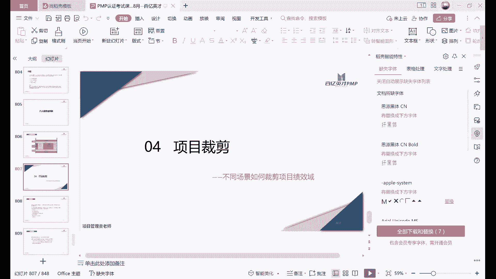

还是带着大家简单的回顾一下哈，因为我们今天晚上讲裁剪，那么讲裁剪呢，为什么要裁剪，是因为不同的项目它面临的环境啊，这个环境呢包括内部的环境和外部环境，组织上面的。

然后外部市场上面的法律上面的都不太一样啊，甚至呢甚至项目的他的这个啊，基本的这个背景啊，框架开发方法都不太一样，那我们在具体的裁剪过程当中，到底应该怎么去裁剪，才能够比较实。

比较符合我们实际执行的这种情况啊，所以今天晚上讲的重点都在这儿哈，裁剪到底是采什么东西，那既然我们要知道采什么东西，我们要搞清楚项目本身它有哪些东西哈，所以呢嗯最好是大家能够对八个绩效率呢啊。

它的核心内容有一个初步的一个这个框架，在脑海里边，这样的话过今天晚上的这个裁剪内容的时候，就相对容易一点哈，所以呢我还是先花几分钟的时间给大家，把八大技效率先过一下。

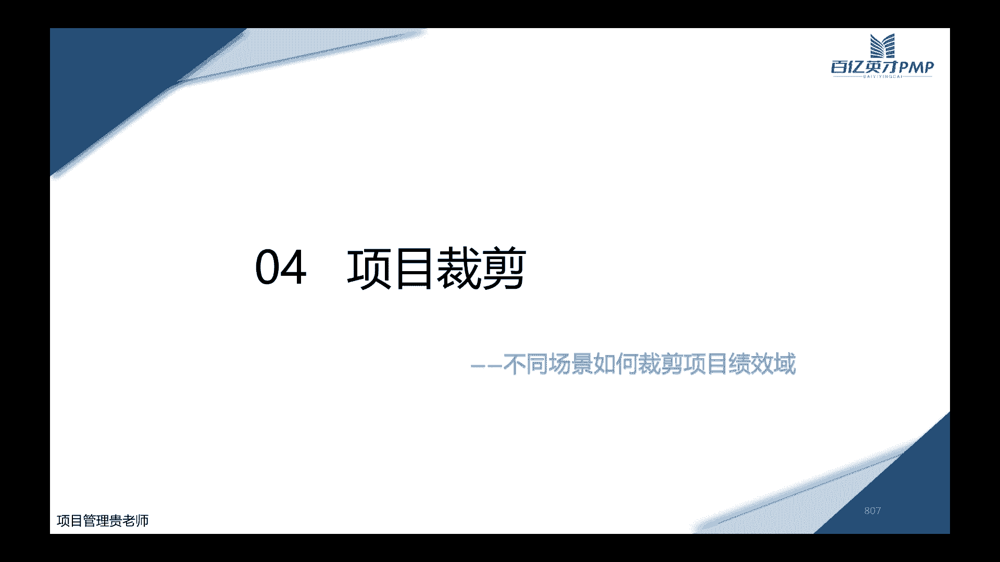

看上一张图吧，嗯这是上一节课啊，最后跟大家讲的八大技效率的观点啊，那我们今天晚上就对着这张图哈，把八大技效率的核心内容简单的过一下，那上节课跟大家讲过这八大技巧语，怎么样在脑海里面把八大技巧语。

把它关联起来呢，对吧啊，首先呢我们要知道。

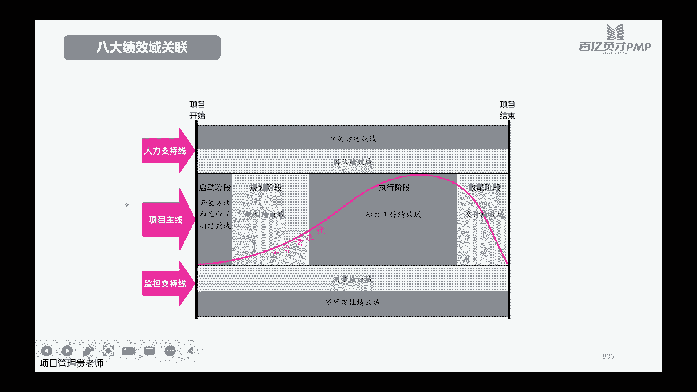

既然sorry。

既然我们学的是项目管理，那么OK任何一个项目，他从项目本身的发展阶段来看。

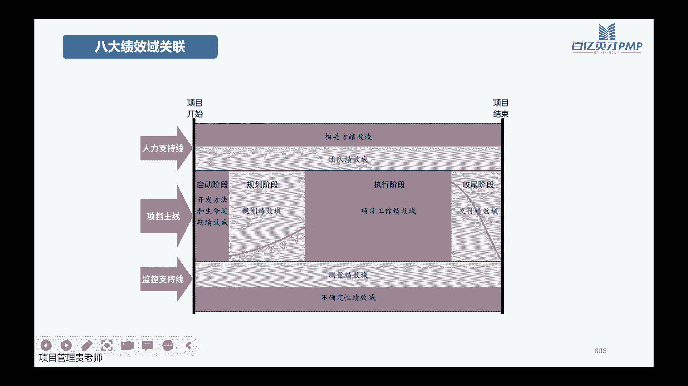

那我们既然说了，上节课也学了这个管理活动哈，管理。

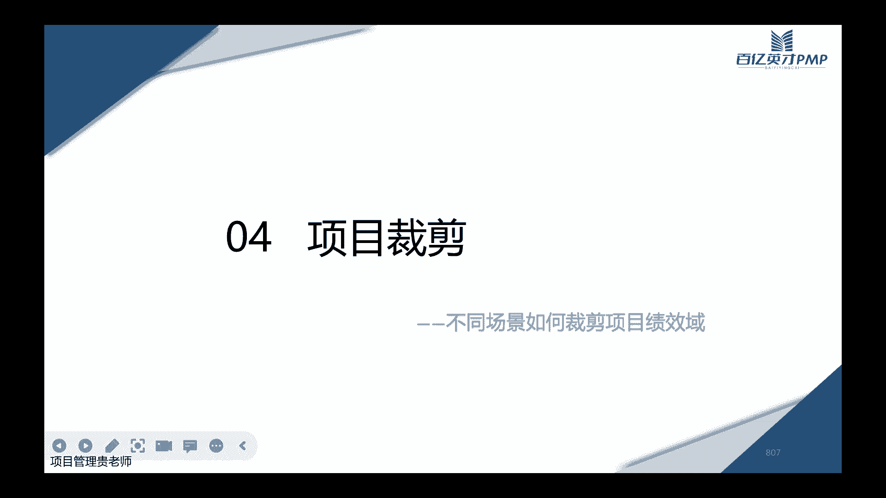

这管理啊他管理活动，管理管的是项目的目标跟目标相关的一些活动，那我们得知道一个项目啊，他从主线开始，它到底是管的活动分为哪些，OK研制这项目组件呢，我们项目任何一个项目它都会有启动啊，规划执行啊。

收尾这不同的一些阶段，然后在执行阶段呢，我们有啊执行和监控，第即使在第六版的，有人说老师第六版不是说的这样啊，第六版说的是启动规划执行监控收尾啊，啊是那样说，但是呢那个说的是不是他的阶段。

说的是它的过程组哈，所以呢学过第六版的这个学员呢，在这不要把它弄混了，过程组确实是这个执行啊，加上监控，这是两个过程组，再加上收尾的过程组，但是呢执行和监控他都是在我们的执行阶段。

按照阶段分分了四个大的阶段，那OK对接效率而言也是一样的哈，在启动阶段呢，我们要定好这个项目的章程，在章程里面呢会有像的它的高层次的范围，高层次的这个目标啊，高层次的一些进度的一些规划里程碑啊。

整体的这个大概的预算核心的人员啊，审批的权限，这是在我们的章程里边，当然在进入到章程之前呢，我们还有商业论证，论证这个项目它是有它的价值，是值得做的，那OK啊章程完了之后呢。

我们根据章程会评估一下这个项目，它的基于这样的一个可交付成果和目标，我们应该选择什么样的开发方法，更适合我们这个项目，是用适应性的项目，还是做这个预测型的项目呢，还是做增量呢啊还是做单纯的这种迭代呢。

啊这个是开发方法和生命周期绩效率，我们要重点关注的，那OK选择了比较适合这个项目的开发方法之后，我们要进入到规划阶段，那么规划阶段呢我们对应的是规划的绩效域，规划的绩效率呢。

也是带大家花了比较多的时间啊，花了四次课的时间讲规划绩效育，因为规划第一它本身比较重要，第二呢规划里面涉及的内容特别多啊，回顾一下，回顾一下规划涉及哪些内容呢，首先任何一个项目它会有目标和范围。

对不对啊，有范围对应他的这个需求，有进度，有他的这个成本，有他的沟通，有他的资源，有它的采购啊等等，我们讲了这么多维度的啊，这些内容都要去做一些规划，适应性的项目呢和预测性的项目不太一样，预测性的项目。

它的范围和需求是在一开始就比较明确的啊，预测，适应这样对比写吧，V字型项目是范围非常的明确，适应性的项目呢是啊，是拥抱变化的范围非常不明确，那么讲到进度的时候呢，啊历史性的项目进度它也是非常明确的。

有我们的进度基础了啊，进度计划，进度计划是用什么表示呢，大家还记不记得，用我们的干的图或者是网络图都OK啊，这些干的图和网络图分别是长什么样，怎么做的，大家自己再去回顾哈，这些细节大家自己去回顾。

那么对于摄影项目呢，我们讲进度的时候，它的每一个啊，这个项目是通过迭代去交付他的可交付成果，每一个固定的迭代呢，它的时间基本上固定两到四周都OK啊，当然根据实际情况也有更快的，两三天迭代一次的也有啊。

它更重要的是迭代的时间箱，好对于成本来说，预测型的成本呢它也是有成本的基准，成本的基准里面包含了我们的应急储备，但是呢没有包含管理储备，成本基准，加上管理储备一起构成了我们的项目的预算。

那有人会问适应性的项目怎么办呢，适应的项目会有一个成本的一个预估啊，但是呢到最后结算的时候，会以实际的工作量去结算好，沟通沟通呢适应性的项目和预测性的项目啊，基本上都是通用的哈。

预测性的项目更强调的是沟通管理计划，适应性的项目，更强调的是大家面对面的去沟通啊，高效的去沟通，那么资源预测性的项目呢，对食物资源和人力资源，也有非常明确的这些规划，对适应性项目呢。

人力资源主要是集中在人力资源和，这个生物资源也都是在这两个方向，但适应性项目的资源一般最开始明确的时候，在中途啊，我们是不鼓励有任何的这个变化，是更强调团队之间能够互相协作，能够承诺自己在这个迭代里面。

一定会把自己啊这个事儿去把它完成，不得已是不会出现资源的一些变化这种情况，那对于采购啊，主要是实物资源的一些采购，预测型项目和生理学项目呢，啊这个都是类似的哈，都会有一些比较啊。

公司里面比较固定的这些采购的一些流程，OK规划绩效与讲完了之后呢，哎我们进入到工作的绩效与工作的绩效率呢，我们重点讲在工作的过程当中啊，在工作的过程当中跟计划偏离的，如果有变更怎么办啊，讲了变更。

讲了问题的日志，讲了他的绩效报告，讲了管理的质量，啊重点讲了沟通的方法，这是在工作绩效与重点做的内容，工作完了之后，可将不成果出来，进入到收尾的阶段，我们要重点讲了交付的绩效与交付的绩效率呢。

重点是关注诶要控制质量啊，讲了非常多控制质量的一些工具，然后控制质量证明这个东西它是OK的，之后呢还要去确认范围，看看范围是不是对的，是不是又好，但是呢又符合我的要求，OK这是项目的主线，项目的主线。

你完了之后呢，我们要从项目的监控线开始，咱们不能光做呀，对不对，我们说任何时候不仅要低头做事，还要抬头看天，抬头看了天啊，是一方面是开外服的一些环境啊，另外一方面呢也要去监控一下项目，整个它的进展。

到底是不是在我们的客户范围之内，O第一个呢是我们的测量技巧与，测量技巧与呢是关注项目内部的，它的重点讲了啊，我们要测量干系人是不是满意呀，啊要测量资源是不是有效的被利用了呀，啊要测量它的这个口腔服务啊。

它的范围是不是达是不是符合要求的，质量是不是达标的，要测量项目的这个基准的绩效啊，费用偏差呀，进度偏差呀，啊要预测整个项目它到最后结束的时候，他是不是能够完成，是不是能够符合我们的这些基准。

如果说有偏离会怎么办，这个是站在箱子内部去看，那OK除了项目内部之外，我们还要去站在项目的外围去看呀，去监测各种不确定性，所以呢会有不确定性的绩效与不确定的，绩效率呢，因为项目比较复杂啊。

因为也比较变化，情况也比较多啊，因为在整个这个场景相对是比较模糊的，因为项目本来它就有一些独特性，所以呢项目存在一些比较多的一些风险，那对于风险呢，哎我们重点讲不确定里面风险怎么去管理啊。

讲了他非常多的一些过程，好多风险他的应对措施是什么，不好的风险，他的应对措施又是什么啊，这是不确定绩效率，那监控知识性讲完之后呢，我们要讲人，对不对，因为任何项目离不开人呀，不是说了，除了管理活动。

还有领导力活动吗，还有吗，还有领导力活动，那领导力活动主要是重点是关注于，为了做这些可交付成果的这些团队，这些人，对不对啊，这些人呢从大的方向在上面讲啊，我们有所有的这个干系人，跟项目相关的所有干系人。

我们都叫做啊这个干系人，干系人呢，绩效与里面重点讲怎么样去识别干系人啊，怎么样规划相呃，该新人的他的参与办法怎么样去给他排序，怎么样去引导他们在我们的整个项目当中啊，按照我们预先的这种规划。

去做好他们的一些工作，去提供他们相应的一些知识，同时呢讲完该系人，我又把该系人里面最核心的一块，也就是团队啊，要负责干活的这些皮，这批人把它拿出来，单独讲团队，纪小玉，重点呢是讲我们基于团队本身而言。

那么我们应该做哪些工作啊，总账怎么样去认可啊，怎么样去发挥团队的高绩效，为了做好高绩效呢，我们怎么样去激励团队，讲了非常多的一些经历的理论，对不对，还记得吧，不同的激励理论嗯，细节大家自己再去看哈。

再去回顾啊，讲完经历呢，我们要讲这个团队本身啊，为了达到这样的这个可交付成果，那我们要去激励，激励完了之后呢，唉有冲突，我们应该怎么去管理冲突啊，管理团队应该做什么啊，管理团队做完了之后呢。

好冲突也很好的去解决，那么最后呢整个这个高信条团队，我们怎么样推动它团队本身的这个可持续发展，和个人以及团队本身的不断的这个共同成长啊，这样印尼完，大家对整个第七版的这个八大街教育啊，就非常的清晰了。

对不对，跟着就是刚刚这前面的几10分钟啊，应该没有几10分钟，前面的十来分钟，跟紧我的思路去把这一个绩效率，把他的这个主线啊，观点和它里面的核心内容已经跟上的，可以在评论区敲个幺，我看看大家的掌握情况。

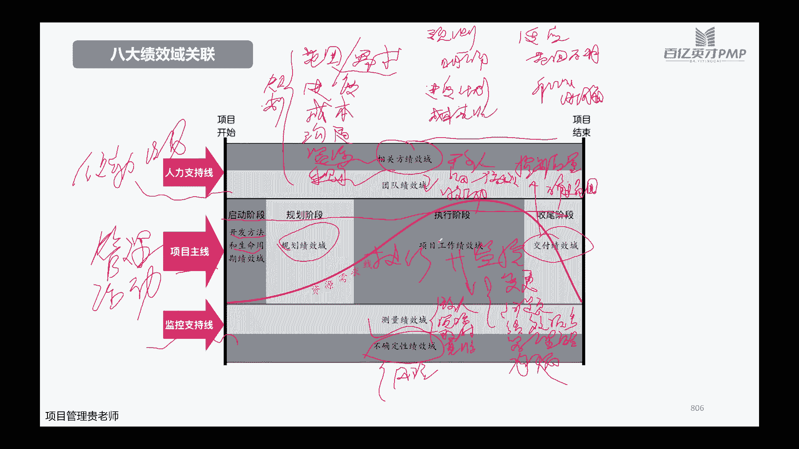

八大技巧与嗯，转完了之后呢，我们进入到今天晚上正式的这个项目，裁剪项目的裁剪，它的核心的目的呢就是不同的场景，怎么样去裁剪项目的一些啊，核心的一些绩效益的内容，我忘了是咱们班还是另外一个班。

是不是有一次问过裁剪是什么意思啊，今天晚上就要讲哈，首先我们要知道，裁剪呢是针对项目的管理的方法啊，项目的整个治理的结构啊，包括项目工作执行的这些过程啊，在我们验证之后看看有哪些啊。

不太符合我们项目的实际情况的，这些要做出调整，调整之后呢，使它能够更符合我们当前的这些工作，他的裁剪的这个目的呢是第一啊，是要让我们的项目能够尽早的去交付啊，尽早交付，你当然项目的成本就会比较。

相应的会比较少一些，同时呢在项目的交付的价值上面啊，我们怎么样去裁剪不同的这些工作内容，不同的方法啊，甚至不同的其他的这些嗯这些不同的维度之后，能够让我们项目交付的价值更加的好，更加合理。

更加的符合我们发现那些期望，能够更好的做出一些高质量的可交付，或者一些成果，使整个项目呢裁剪之后，能够更符合我们监管的一些要求啊，行业的一些准则，满足不同的该信任他们的一些需求和一些期望。

甚至呢在项目的市场环境发生变化的时候，那么我们怎么样去裁剪，能够使项目更加的能够拥抱我们的变化，所以说裁剪呢是是任何人做项目管理，都会遇到的哈，第六版的教材里面只是提到了裁剪这个概念。

但是并没有去详细的跟大家去讲啊，裁剪应该怎么裁，第七版呢就很好的去把这一方面去加上了哈，所以说这是第七版的教材里面核心的一个亮点，考试涉及到财经的内容倒不是很多，他不会具体去考啊。

这个不同的场景告诉你啊，或者考你应该裁剪他的什么东西，但是呢裁剪这一部分内容，在某对我们实际的做这个管理工作而言，他还比较重要哈，这个是为何要裁剪，其实刚刚都已经讲过了几个不同的维度，裁剪的流程。

裁剪的流程呢，就是我们具体如果说拿到一个项目啊，我们说要裁剪啊，这个把方法裁剪了吧，啊天天要汇报，把这个流程裁剪一下吧，啊这样就会有点乱，那到底应该遵循什么样的一个步骤。

让你整个这个项目的它的裁剪是得当的，是合理的啊，不会做着做着发现还要裁剪新的东西，所以它有一个基本的一个步骤哈，第一个呢是拿到项目之后，我们先裁剪方法啊，先裁剪项目的这个管理方法。

因为我们讲了项目当中呢，它有这个预测型的，也有适应性的，也有中间既有适应，也有预测的，它是混合型的，那对于我们项目本身而言，如果说是纯预测啊，当然比较理想啊，因为相对应说我们学的这些预测性的方法。

都能用上，对不对，那但是呢实际情况它不一定是都是预测，他很有可能预测里面，它还会有一些不太明确的啊，不可能说百分之百都符合我们预测型项目的，这些知识体系，对不对，那OK针对预测项目。

我们是不是里面有哪些维度可能要裁剪啊，比如说我们讲预测，讲到了采购，那这个项目需不需要采购啊，采购的管理计划需不需要，也许不需要，对不对，那采购的这一部分就被我们踩点叫啊，甚至呢项目的这个资源。

我们公司就那么两三个人啊，也在做这个项目的，就这么两三个人，你还需要裁减资源吗，板上钉钉的事情，招式里面就约定好了，没有新的这个资源加入，对不对，那资源管理计划需要吗啊，有可能也不需要，也要去裁剪。

当然如果说这个项目它是更加符合诶，我们分析它是更加符合适应性的这种管理办法，那OK适应性的管理办法，我们讲了它核心用SRAM框架去做比较合适，那KSRAM框架里面呢它有五个会议呀。

那是不是诶我们按照目前的这个项目，它我会一定要开呢，啊，是不是我们啊这个这个比如说迭代规划，会跟我们的这个啊梳理会，是不是可以混在一起呢，因为人比较少，因为需求比较少，因为故事相对比较明确啊。

大家甚至的团队当中有有两个人，都是从产品经济转过来的，那是不是两个会议在实际情况的时候可以开，可以合并起来一起开，节约时间啊，这是不是也可以考虑是OK的哈，是可以考虑的，所以第一步呢是裁剪他的这个方法。

裁剪完方法之后啊，我们还要去对组织进行裁剪，为什么裁剪方法之后要对组织这些裁剪呢，啊因为比如说我们这个项目哈，现在决定了它是用适应性的方式比较合适啊，比较符合项目的这些实际情况。

能够让我们更快更好的去交付价值，那OK现在公司的实际情况呢啊，这个要求项目每个项目组啊，每周要做非常多的这种报告资料啊，他一点也不敏捷，它是我们整个适应型项目当中的一些障碍。

那我们是不是要对组织的这些流程，进行适当的裁剪，当然有人会说，组织里面的流程不是我想裁就能裁的呀，啊对不对，需要领导去决策呀，是的没错啊，但是呢我们要根据我们实际的情况去判断。

我们需要哪些繁杂的一些流程，需要去把它去除掉啊，繁杂的一些模板，我们希望把它去简化，我们首先要提出我们的一些想法，然后才能跟你老婆批还是不批，才能够给他去做寝室，他批当然非常好啊，非常适合我们这个项目。

给了我们非常大的支持，他不批啊，也有它的一些道理，那我们只能再做调整好，所以第二步呢是要对组织的这些流程啊，这些文化进行裁剪，第三步才是对项目本身进行裁剪啊，对项目本身进行裁剪。

那我们项目涉及到这么多的阶段，这么多的过程啊，具体哪些方式啊，哪一个部分的内容，是我们这次的项目的一些重点啊，哪一些部分内容是我们这个项目当中，应该涉及不到的，然后第四步呢才是哎我们裁剪完了之后。

进入到具体实施实施的时候，要根据我们实际的情况推行，看看我们当初裁剪的那些是不是已经裁剪够了，是不是还需要多的裁剪啊，是不是有的，他其实在实际的过程当中，它涉及到了，但是最开始我们把它裁剪到了。

没有考虑到这一块啊，所以它的这个步骤哈，就给了我们实际过程当中啊，你说拿到一个项目啊，这么多的这个方法都用不上，只会用重点用其中的一两个啊，但是呢我们要按照这样的步骤，一层一层的把它筛选下来看看。

最终才能确定哎，这些到底是哪些合理的被裁剪了。

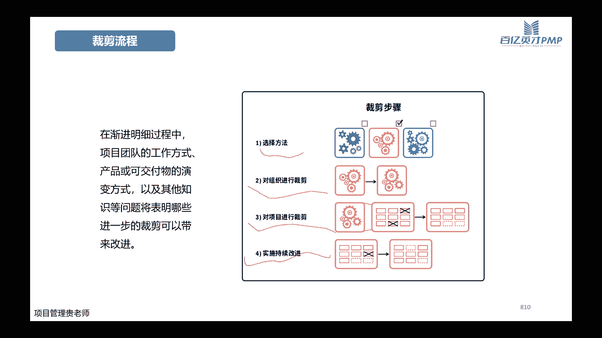

哪些合理的还流畅啊，这个步骤首先要对啊，裁减项目绩效率呢，这个相当于是嗯，这儿有这个项目的八项绩效率啊，这个图给大家列出来了，我们讲第七版呢，它整个是嗯12个原则，12个项目的原则。

引导了八个技效率的这种这个啊以原则啊，以指导方向来指导我们具体的这种操作和思路，那OK从原则原则呢其实是也需要裁剪啊，但是呢在不同的这个项目当中，因为原子它没有具体的这个指导的，它只是指导方向。

他没有具体的这个指导的措施，所以在原则之下，我们具体的还是裁剪不同的这个绩效率好。

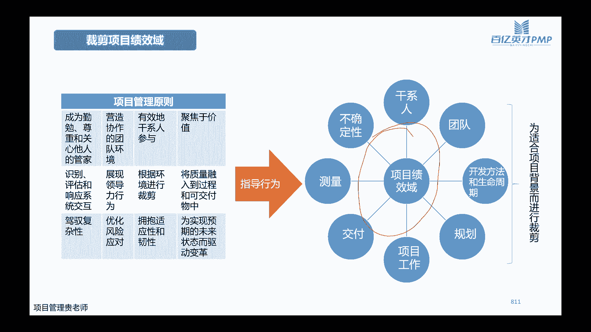

我们一个一个来讲吧，首先裁剪生命周期和开发方法啊，因为一些大型的项目呢，它很有可能是啊易车型的也有啊，适应性的也有，它是一些混合型的方法，比如说前面我们跟大家讲过的那个啊，建一个社区中心。

建一个社区中心这样的一个这个项目，那么设计中心呢有它的这个食物的一些载体啊，也有这个中心它运营啊，他培训的一些这个服务的一些网站啊，一些系统，那么在这样一个大型的一个项目当中，实物的一些载体。

我们显然用预测性的方法比较合适啊，它的各种软件啊，系统啊啊培训的这些网站呢，我们肯定是用这个适应的方法比较合适啊，社区中心建完了之后呢，我们要给社区中心的这些入驻的这些，这个老年人啊，要给他们做服务啊。

要给他们做一些基本的这些这个培训，那培训呢啊一次有一次的效果，我们有可能涉及到这个增量的这个开发的话，都是一样的哈，在这种大型的项目里面呢，不同的开发法它都有啊，它都适合。

那我们呢怎么样去根据他的这个特性，在不同的阶段啊，用不同的这个方法去管理好它，嗯具体而言呢对于产品和服务而已啊，比如说你单独考虑他这个产品和产品和服务的，或者是结果适合的开发方法是哪一种啊。

比如说从他的这个产品和服务而已，从他这个产品服务而言啊，前面这个设计它的这个载体啊，空间啊，比如说一栋楼一栋楼，你一次一次的教啊，我没法住，对不对，你交个毛坯房，我压根不会进去住。

你只有把毛坯房都装修好了啊，这个家具啊什么的软装也都弄好了，你这个设计中心你才能够对外说啊，设计中心开始正式投入运营了，对不对，所以呢根据产品和服务而言可以去选择啊，那选择是预测啊。

当然如果说它是个系统啊，可以不断的去优化，去迭代，那OK我们用迭代的啊，迭代的开发方法比较适合他啊，当然如果整体都有诶，我们整体又复用混合型的方法啊，去管理它，当然啊。

这个是单纯的不考虑任何组织上面的一些，制约的一些因素哈，我们仅仅从产品的本身的这个交付的成果而言，我们更适合哪种方法，这是一种考虑的维度，那考虑完了之后呢，我们还要知道。

对于一些特定的一些特定的一些项目啊，比如说公司有要求啊，或者是这个客户有要求要求你啊，必须啊，比如说一个纯演软件项目，那我们说纯软件项目文档是刚刚够用就好，对不对，但是呢这个时候客户他给你的单子。

他说我们公司要求比较严格啊，每周要准备大量的汇报资料，没办法，对不对，那那这种的话它适合的本来是一个纯敏捷的啊，纯迭代型的啊，但是现在呢它就变成了一个混合型的，对不对，因为涉及到很多的这个汇报资料。

大量的这种报告的进展的这些文件，我们可能就需要有一些沟通的管理计划，对不对，不同类型的信息用什么样的格式的这个文件，或者是报告，或者是其他的展现的一些形式去展现，就需要有比较严格的沟通管理计划。

那显然他就又有预测性的特点，它又有混合型的特点，对不对，所以啊不能只考虑产品和结果，还要考虑一些特定的一些要求，有没有，同时呢还要考虑组织内部啊，他比如说审计里面是不是非常的严格，他的项目的治理结构。

是不是有一些这个严格的规章制度，是没有办法去突破的啊，没有办法去裁剪的，举个例子啊，比如说我们说这个上节课刚讲的，适应性的项目啊，他是不是质量管理和质量控制都是团队本身，都是由团队自己来做来控制。

对不对，但现在呢公司里面他有专门的审计部门，对每一个项目不管理项目是什么样的开发方法，它都审计的非常严格啊，那怎么办，那你也要遵守一下这个组织的意见，虽然说你刚开始的时候，根据产品。

你觉得他应该用一个纯敏捷，而纯敏捷呢，对于这种质量管控是团队自己去做去把控啊，所以你觉得公司的这个审计的政策，对你而言是一种障碍，对不对，程序上的障碍啊，你去争取了，你去跟组织申请了。

但是呢这个商业领导告诉你啊，我们也去沟通协调了，但是呢审计部门说这样做不合规啊，这样做没有办法让他们在年底的时候，对每一个项目进行公平公正的这种考核，所以呢必须得审计啊，那没办法，对不对，争取完了之后。

还是没有办法突破这一层的这个组织的，这个障碍程序，那他也是没有办法用纯密集的方式哈，他也得有它的质量的，管理的计划和质量管理的一些措施。

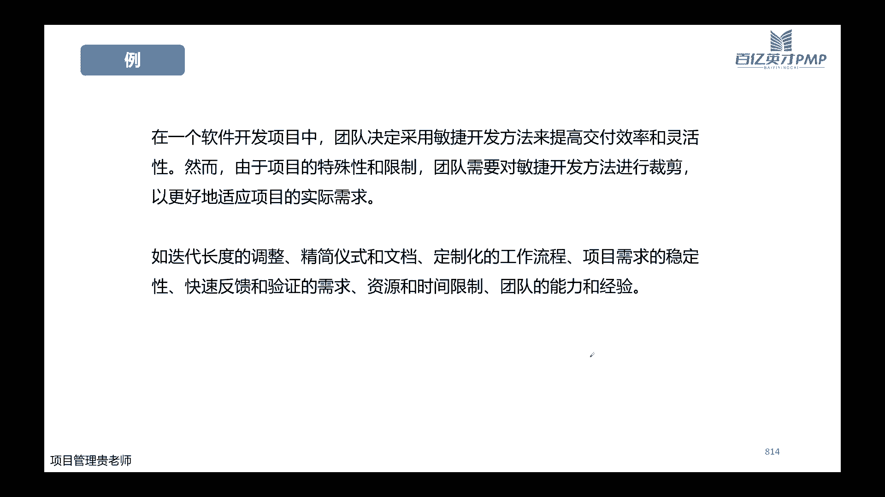

啊这有一个例子哈，这个例子呢大家可以这个去看一下，就是裁剪方法，说的是一个这个软件开发的项目哈。

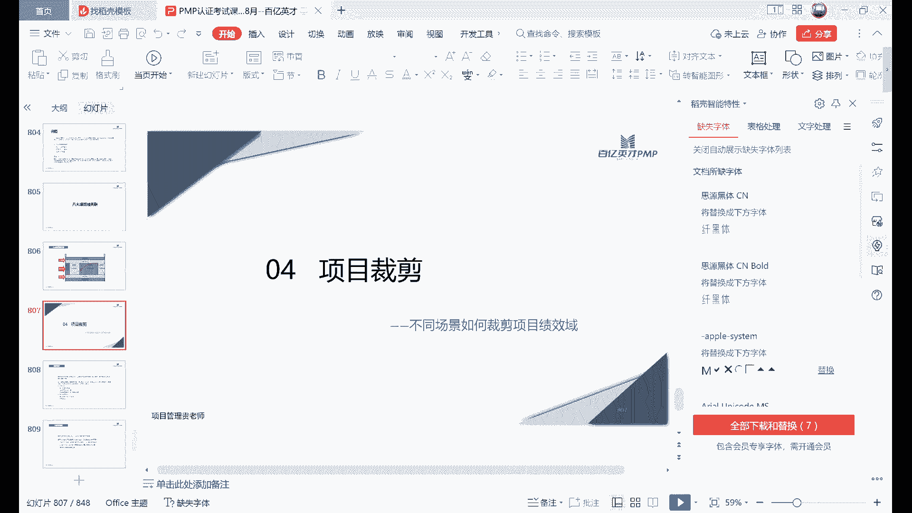

大家决定用敏捷的方法来提高效率和灵活性，但是呢现在项目有一些特殊的一些限制哈，团队需要对敏捷开发方法进行裁剪，以更好的适应实际需求，比如说哈特殊的限制裁剪什么呢，纯敏捷我们刚刚前面讲的只是开发方法啊。

它又可以是敏捷的，它也有因为一些组织的一些要求，或者是特定的一些要求，它可能会有预测性的一些特征啊，会有一些这个最后用混合的办法去管理，但其实呢除了啊除了本身它的这个嗯，这个组织上面的一些要求之外。

他还有可能对敏捷内部，敏捷内部的，比如说迭代的长度啊，我是不是要调整啊，啊一般我们这种项目都是做两个星期一个迭代，但是呢这次的这个项目比较紧急，我能不能裁剪它的这个长度啊，我变成一周调整一次。

可不可以呀，可以哈，所以呢迭代的长度是可以调整，可以裁剪的，同时呢啊更精简的这种文化或者是仪式，我们不是说了敏捷，我们是不是每天都必须要开，我们班每日社会呢遵循的流程非常好，理论上面也是每天都要开。

每天都要碰进展，但是呢我们实际上面啊进展其实每天都在沟通，那是不是每天都必须要还要来来一个，这个大家都要这个集中啊，在一个地方碰一下，也不一定完完全全是这样啊，那根据我们实际需要，发现问题。

只要我们在实践的过程当中能够做到，大家都啊这个知道，互相知道整体的这个项目的进展，能够及时的有一些问题的反馈机制，反馈的办法，那也OK哈也OK我们基于目的而干活，同时呢工作流程是不是也可以裁剪啊。

是的可以的，没问题的，只要你的项目实际它更符合更高效就OK，然后呢项目需求的一些稳定性，我们是不是也可以根据实际的情报器材质，可以啊，快速验证，快速反馈和验证需求，我们说了，每个迭代当中啊。

不是做完了之后都有一些评审会吗，那OK我们是不是非要等到评审会的时候，才把这个项目去演示，去给我们的这个PO去演示呢，也不一定哈，如果说我们在迭代当中，有一些这个呃依赖关系的这个增量啊。

有一些依赖关系的产品增量，它是嗯上比如说上一个这个产品增量，如果说认可了才能够啊，才能够更好的去实现下一个这个产品质量，在同一个迭代当中，那我们是不是非得等到评审的时候，才做这个事呢，不一定哈。

我们也可以在中途就把产品增量一啊，这个有核心依赖关系的这个先让啊，我们的这个PO啊也好，过职客户也好，先发给他确认一下，对不对，如果OK我马上再进行第二个，或者是我同步进行第二个。

但是呢我先把第一个去得到你的一些啊，这个反馈，如果说你觉得有什么调整，我可以边做第二个这个增量啊，边做被他关联的，并且呢在调整它本身的这个产品，它的增量，同时呢资源和时间限制。

也是可以根据我们实际情况去调整，团队的这个能力和经验也是OK的哈，我们比如说啊这个敏捷项目，我们一般都是跨职能团队去做，但是呢现在没办法啊，这个没有办法招到这样的人，项目又非常着急，没关没关系哈。

我们可以先开始做啊，这个团队的能力和经验，从理论上面是怎么样，但是实际情况我们这个项目特别着急，开始我们也可以先开始干哈，大家边干边摸索也都是OK的哈，上面是对啊，开发方法去进行裁剪啊。

那下面呢再进入到对组织进行裁剪，对组织进行裁剪呢，一般呢我们啊对于小型的项目的方法，和针对大型项目的方法，它肯定是不太一样的，对不对，但是一个公司他不可能说我只接小项目不，我不做大项目呀，对不对啊。

他肯定是小项目，也有200万的单词，也有啊，1000万的，2000万的啊，甚至上亿的单子我也有，对不对，那对于这个片欧啊，对于项目管理办公室而言，他啊最好呢是对不同类型的这种项目，有不同的管理方法。

但是呢也会有一些通用的一些要求啊，那对于这些通用性的要求啊，我们小学的项目有没有这个必要啊，或者是呢啊有一些这个被检索的这个流程，对于我们大型项目开展而言，它是不是存在一些漏洞，存在一些风险啊。

我们也可以根据实际的情况去拆解，首先从组织文化方面哈，从组织的文化方面，因为组织它分了很多，除了流程，他还有很多其他的这个维度，我们一个一个来讲哈，首先呢从组织的文化方面，那是不是啊。

大家对于这种交付方法是不是都能够接受啊，是不是都能够支持这种裁剪方法，是不是大家都觉得哎团队大家在一块配合，一定能够把这个项目去完成啊，这个是从文化方面怎么样去引导他们，怎么样去裁剪他们啊。

同时呢怎么样去给他们做培训，怎么样去给他们做负冷啊，整个这个项目他的这个倡导的这些文化，比如说我们摄影师相同，倡导的是一个做主织的这种文化啊，大家共同成长的这种文化，跟我们整个这个公司的这个团队文化。

是不是相符的，公司是不是啊，这个关系门的各自干各自的也不愿意去交流，更不愿意去教别人，那这种文化是不是一致，有冲突，怎么去解决，这个是从文化方面怎么样去考虑冲突，怎么样去裁剪，这有个例子哈。

文化方面具体要裁剪什么东西呢，啊首先你是不是可以尝试啊，为了提高我们的资源的利用效率，和团队之间的配合的这种效率，那组织结构啊，或者是这个项目的这个结构，能不能去进行一些调整啊，比如说不同的职能啊。

是不是能够合并，有人说我项目啊，我只是做一个项目，我没这么大的权利，怎么去合并职能啊，没关系哈，组织上面的职能我们没有办法去动，但是呢我们可以去动项目上的资质了啊，比如说这个项目它是啊人事和行政啊。

这些这个后勤都是项目，每个项目自己去去这个处理，自己去K拒绝去把它这个OK掉，那OK在我项目当中，我是不是要把这些分开做计划呢，不一定对不对，我把行政人士啊，这个甚至这个项目的这个财务方面。

我也跟公司一样，我把它合成一个大的综合的啊，我一个人去把这些都付出了，都解决都解决掉了，省得呢那么不同的人进来啊，又浪费资源啊，沟通起来又很困难，同时呢减少层级啊，我们说了啊。

摄影机项目比较符合这个别名化的这种结构，那OK我们不同的这个项目选择出来之后，好方开发方法选择了，那对于成绩来说，我们是不是能够减少呀啊能够减少的，有人说啊，这层级我也动不了啊，这跟直棱一样的。

我动不了啊，那没有关系，我们从直升，我们从这个层级，他的这个嗯这个价格上面没有办法动，那我们是不是从汇报的成绩上面能够去合并呢，啊举个例子，比如说啊一个程序我们应该是先到组长那儿啊，然后再到这个主管。

那然后再到项目经理那儿啊，然后再到项目总监，那那现在呢我是不是可以去这个这个组长，就直接跟主管啊，我们一块开个会就把这个讨论了，不要一层一层的裹啊，直接一次会议就把它全部都解决掉，甚至包括项目经理。

对不对，从执行的层面去减少，这种没有实际的这个层级存在的这种啊工作，同时简化决策链条也是一样的哈，那我们是不是这个非得用这个啊，决策的时候，决策的链条我们是不是能够啊去简化一些啊，这个也是可以考虑的哈。

和优化人员的一些配置，是不是岗位一些重组啊，或者说引入一些外部的一些资源啦，都OK，然后呢有一些这个呃荣誉的这些岗位啊，他是不是是不是有必要的，在我们这个项目当中啊，弄了一个啊商务的助理啊，这个去配合。

那这个商务助理是不是有用，我们是不是直接留一个这个厉害的产品负责人，就OK了，商务助理不需要，对不对，他跟商户去沟通啊，无非就是了解客户的更详细的一些需求，那直接让我们产品负责人去做，是不是也更好。

更OK那你这个商务住你的这个角色，这个岗位是不是就没必要，同时呢啊沟通和协作机制啊，比如说啊大家都用这个钉钉啊，或者用微信啊，或者用起飞啊啊，或者是有的公司自己开发了内部的这种软件的，这个系统。

那我们到底用什么系统啊，用什么工具比较合适呀，这个也可以根据我们实际的情况啊，比如说我们适应期项目，如果说不是因为一些，不是因为一些嗯特定性的一些要求，大家都在一块面对面的办公，对不对。

那是不是所有的信息都被都得按照公司来，都得在这个啊，比如说公司内部内推的这种系统上面去进行了，也不一定，对不对，直接一句话面对面，一句话，几句话就搞定的事儿，对不对，好嗯前面是裁剪这个组织哈。

裁剪组织的一些文化组织一些流程，那么下一个裁剪呢是裁剪项目的工作过程啊，想裁剪相关的工作过程要怎么去思考呢，首先我们要考虑一下组织，它的这个文化和复杂性，看看哪些过程它是最有用的啊，把最有用的。

你不能说我把最有用的部分给裁剪掉了，举个例子哈，比如说比如说现在整个这个项目，我们不是讲有这个商业论证论证这个项目嗯，可以做，然后我们才能逆向啊，才能逆向才能开始动这个事吗。

还有人就知道国内向的周期太长了啊，需要这个一步一步的往上去审批啊，跟我们一个项目两个月才才这个批下来，才定向做下来，那我是不是可以把逆向这个过程裁的呢，很显然呃，逆向的这个过程肯定是不少的。

我们可以从逆向的这个决策流程上面看看，能不能有寻求一些合并的一些办法，但是你不能说把这个逆向的这个过程，把这个这个核心的这个过程把它裁剪掉了，所以说呢我们还要综合考虑啊，考虑组织文化啊，考虑一些因素。

然后去判断哪些过程是必须是牛的，必须是有效的，哪些过程是可以去优化的，同时呢啊我们说了，项目当中管理知识是非常重要的啊，为了管理知识呢，我们要定期的去组织大家做一些分享会啊。

啊做一些经验教训的一些总结呀，啊，去把大家的一些这个知识，能够成本能够留存下来，变成从引进的知识变成一些显性的知识，对不对，那是不是啊，现在这个项目特别紧急啊，或者说呢大家有一些更好的一些方式。

有一些AI的软件啊，就直接能够把这个会议上面的一些核心的要点，把它体现出来，是不是更好，更能便于我们做好这样的一个工作，当然如果说这个项目现在特别紧急，那我们是不是还要还必须要遵守啊，严格的遵守这个嗯。

这个每天或者说每个星期，必须要开这样的回顾会议，把一些知识点把它复盘，把它总结呢啊也不一定哈，我们要根据实际情况可以进行调整，同时呢我们也说了，在项目进在项目的这个生命周期，我们要去收集一些信息。

然后去更新一些文档，那么现在呢我们对于收集信息这些文档，我们是不是所有的这些信息都必须要做好呢，比如说这个问题日志啊，啊，或者是啊，其他的跟踪这些项目绩效的一些绩效报告，是不是每天都要写日报。

是不是每周都要写周啊，周报啊，是不是这个问题日志必须要精简到，按照我们公司的模板，一个信息都不能少，那也不一定哈，也不一定，因为每个项目的情况他都不一样，那从信息本身来说的话，诶怎么样去开发记录啊。

怎么样传输检索，怎么样追踪，怎么样去存储这每一个这个流程啊，是不是有更好的一些工具和技术，能够去帮助我们完成这样的一个过程，这个时候我们可以去考虑的哈，同时呢嗯要考虑一下未来的这个项目啊。

他是不是能够获得历史的一些信息，或者一些经验的一些教训啊，对于组织而言，他的这些数据库，那我们项目的团队如果说将来需要使用的话，怎么样能够更方便的去访问到该数据库，那比如说现在整个这个啊工作流程是。

他没有追踪和存储的这个步骤，那你后面的这些团队成员啊，你你就没有办法去存储啊，没有办法去调用，或者它存储了之后呢，他没有开放的机制，那有可能啊所有的这个信息啊，任何人都可以去看啊。

那有一些纸质的一些文档可能就不太便于保存，那两个人进去之后呢，可能就这个信息他就已经丢掉了，好文档都已经不知道去哪了，那么在将来有团队成员需要去看的时候，他可能就没有办法找到一些相应的一些资料。

那么从整个这个讯息的这个啊，这个传阅的这个过程里面，他就有一些漏洞啊，他没有做好，所以呢从整个信息的这个角度啊，我们怎么样去裁剪它的不同的这个步骤，不同的这个流程也给大家找了一个案例哈。

这个案例呢是对于工作的这个流程的，方法和步骤去调整和优化，既然裁剪工作嘛，裁剪工作过程，那肯定是为了提高工作的效率啊，比如说第一个是金井精简他的一些流程啊，哪些工作流程它是不必要的啊。

根据我们项目的一些重要性或者紧急程度呢，也可以去明确或者互换一下它的这个优先级哈，比如说我们说了啊，讲变更啊，大家都知道变更必须要批准了之后才能动，对不对啊，没有变更请求，项目经理呢是没有这个权利。

去执行他的这些变更的内容的，对不对，但是呢现在变更呢它审批的流程啊比较长啊，比较复杂，我也会呢需要决策的这个东西比较多，但是呢项目它又情况又特别紧急的情况下，那我们是不是可以先啊置换一下它的顺序先做。

然后呢同步再去走这样的变更流程，走审批流程啊也是OK的啊，紧急关也是OK的，同时呢，审查项目所需要的一些文档和报告的时候啊，也是哈，比如说我们在这些在这一次的课程当中啊，在这一期的课程当中。

给大家列了非常多的一些参考性的这种文档啊，表格啊是视力去引导大家，我们在实习过程当中，如果要做这样的一个工作，到底应该啊核心的这个模板应该包括哪些内容，去给大家做了一些这样的一些引导，但是呢是不是啊。

咱们的这个项目当中必须要包含这些东西呢，比如说我们前面讲的这个政治分析啊，和这个偏差分析，它其实正值就反映了偏差，对不对啊，那是不是政治报告和分偏差报告非得做两个呢，也不是，对不对啊。

我们本来就是核心的一脉相承的正值偏差，甚至后面的这个趋势啊，它都是一个星期反映出来的，那我们是不是就融合成一个报告就解决掉了，就解决掉了，当然是可以的，对不对，所以呢一些不必要的一些文档和重复。

是没有必要的，甚至现在呢啊同一个报告当中，甚至不同的这个报告当中，它有一些信息啊都是相同的，比如说每个这个表啊，上面都会写项目的基本信息啊，啊什么样的这个项目名称，项目编号啊。

啊项目经理负责人呢都会有这些信息，对不对，那如果说我们有一些更好的这个工具，更好的一些项目管理一些软件和系统，那是不是同一个项目当中，同一个项目当中不同的这些文件，他这些表头都是一样的。

我是不是需要重复的去录入呢，不需要，对不对，这些都是可以去精简的啊，当然这这讲到了哈，适当的选举工具和技术啊，能够帮助我们更好的去精简这些东西，不要转化一些流程，减少一些人工的这个错误的风险，好啊。

还可以去解裁剪它的这个工具和技术啊，比如说比如说具体用到的这些这个项目，需要用什么软件呢啊，或者是需要用一些什么样的一些设备呀，啊也可以根据我们实际执行的过程当中啊。

团队觉得诶哪些系统它可能压根就不好用，比如说现在公司硬要给你推啊，这个这个大家都用，普遍都用肌肉哈，但是呢现在大家这个公司要给你推一个新的，这个项目管理的这些系统啊，那新的管理系统呢对于团队而言。

团队已经非常适合，非常了解这个就让用起来非常顺手，但是你现在新的系统呢，会增加团队沟通的一些这个成本啊，会降低他们工工作的一些这个效率，那这个时候呢，我们是不是也可以去适当的去裁剪一下，工具和技术啊。

去找领导去协调，领导说没办法，这个是公司规定的一些要求，所有的这些啊流行都要留痕，在他们这个新系统上面，那我们是不是追求啊在里面探索，有没有办法去追求一种平衡，对不对，既保留我们这个系统，同时呢。

这个系统上面的信息，又能同步到信息系统上面去啊，想一些解决的办法和解决的一些措施，这儿有一个这个案例哈，这个案例呢是说啊，他们现在使用的这个项目管理软件，功能比较繁杂啊，不符合项目的实际需求啊。

不符合啊，一般他说的比较委婉哈，主要可能就是实际的功能，核心的功能它是有的，但是呢为了使用这个系统，这个系统一般软件系统对外售卖，他为了做的好看，为了功能更加的这个看起来更加完善。

往往有一些华而不实的这种啊，这个这个功能点或者需求点或者模块点在里边，但是呢是不是所有模块啊，我们项目当中啊都需要去做到，都需要去填呢，也不一定，对不对啊，也不一定。

所以呢你保留你现在这个项目核心所需要的，就OK了啊，就OK了，比如说要分配任务啊，要进入追踪啊，或者要共享一些文档就OK了，核心的就可以了，所以现在也有很多人说啊，比如说这个啊WPS非常好用，为什么呢。

因为WPS里面也有项目管理的软件啊，甚至呢这个项目当中他没有那么多的东西啊，需要去这个用啊，软件系统里面的一些看法啊什么的，他只需要大家同步的共享这个文档，比如说一个咨询项目。

更重要的是以文档的形式去体现它的交付成果，那OK我就用WPS去共享文档，建一个共享小组就OK了，对不对，我还需要什么复杂的这个这个禅道也好，或者project也好，这种软件吗，我不需要，对不对啊。

所以说这个裁剪项目的软件啊也是一方面，同时呢优化设备的应用啊，也给大家举个实际例子啊，比如说啊大家做做这个软件或者做其他项目，可能都会有这个笔记本电脑这些东西啊，那有人呢用的是可能是笔记本啊。

有的呢可能是用的台式机啊，有人开会的时候呢，他可能用的移动电话，但是在这个时候呢，我们就发现嗯，不同的这些设备呢啊现在在用的时候，它可能存在一些这个不一致性啊，比如说不同的人展示的时候，演示的时候。

他的这个文档啊，或者是演示的这个内容PPT存在不同的地方，一会儿跑到这个人电脑啊，一会跑到那个人的这个电脑，一会跑到那个人手机上面啊，弄到这个信息有可能去外流，有一些风险。

那是不是现在啊我们在设备上面啊，去固定一台固定一台这个电脑啊，将来做任何演示的时候，就用这台电脑啊，都是把这个信息统一的储存在这个电脑上面，或者放在云云盘上面，统一的一个云盘上面都OK哈。

所以是优化设备的一些使用，还有呢就是引入一些啊这个应用的一些程序啊，比如说现在啊这个举个例子，他发现团队成员啊，因为每次都要做会计啊，开会啊，但是呢会教要浪费大量的时间，对不对。

那我们有没有一些什么办法去优化这个东西啊，比如说去采购，比如说科大讯飞的啊，智能办公的这个会议系统啊，是不是啊，大家平时这个开会的语音啊，她都录下来能够自动转录，是不是就能够节约团队本身的一些时间啊。

这也是个办法可以去考虑哈，嗯裁剪方法和弓箭呢，它主要是对于项目当中的一些这个啊，用什么样的一些这个方法啊，比如说我们讲质量控制，质量控制有那么多种工具，对不对，可以用控制图啊啊也可以用这个统计抽烟啊。

啊也可以用他的这个啊因果分析图啊，对不对，那到底我们用什么样的呢啊，用什么样的这个工具和方法呢，啊我们要根据项目的实际情况，如果你要控制过程，那你肯定是选择控制更加合适，对不对。

如果你只是这个以前的项目是啊，生产具体的这个模块组件，看得见的，那你用这个统计抽样是不是也更合适，所以呢根据项目的实际情况，可以裁剪项目的这个具体的这个工具和方法，也可以裁剪裁剪这个项目的一些文档模板。

好模板里面非常非常的复杂啊，当然公司里面出这么复杂的这个模板呢，有人说公司是啊，不能这样想，为什么呢，因为公司要站在整体的这个项目，管理的这个角度，那有的项目很复杂，他确实需要的信息点比较多啊。

但是呢我们现在目前做的这个项目呢，是属于公司里面比较精简的一个项目，那我们可以根据我们自己的这个项目去把优，把模板去精简去优化一下啊，当然我说这些优化都要得到组织的一些同意哈。

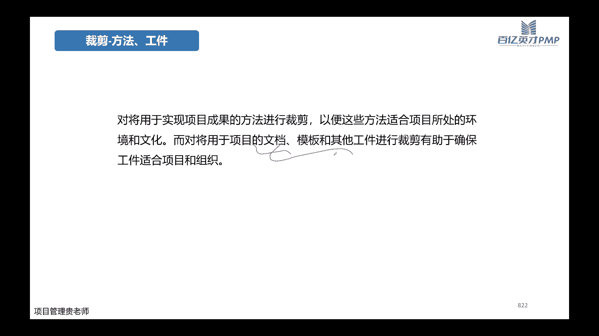

再一个裁剪的是裁剪项目的风险和不确定性哈，所以大家你看如果不讲这些裁剪具体内容哈，大家拿到手啊，不知道裁剪，第一不知道裁剪怎么让上手啊，东一榔头西一棒子，最后裁的也不知道裁的自己裁的是啥。

第二呢是不知道具体裁剪的这个内容哈，前面是步骤，这块是内容内容也不知道裁剪什么，所以今天晚上其实这么多都跟大家讲了啊，裁剪我们的这个组织啊啊拆迁组织里面拆迁，比如说他的那个组织的这个部门啊啊。

层级啊啊架构啊啊，裁剪它的这个流程啊，啊裁剪不同的这个工件啊，裁剪方法呀，现在讲到这个裁剪风险不确定性，我们讲不确定绩效率的时候，讲风险它有很多的这个过程，对不对，识别风险啊啊规划风险的这个好识别风险。

风险定性分析，定量分析啊，啊这个规划风险应对啊，啊这些都是我们在整个规划绩效与针对风险啊，要做的，那么是不是每一个项目，他都必须要这样的全套流程呢，啊也不一定对不对。

所以我们首先啊要评估一下这个项目的风险的，这个偏好和风险的承受能力啊，如果说我们发现这个项目本身的这个风险偏好，他特别低啊，他一点风险都不愿意承担啊，那我们可能有任何的假设因素，它就不存在了，对不对。

直接这个假设因素啊，就就否定了一些东西啊，不存在什么冒险这些，对不对，所以呢后面的这些这些过程可能都能够简化的，能简化的都简化了，当然如果说哎我们发现这个项目方，它的风险偏好特别强，他特别愿意承担风险。

追求高收益，那是不是我们就要相应的把这个排序，把定性把它做好，然后这些高风险的我们尽可能做一些应对措施，对不对，所以呢第一步要把他的风险偏好和承受力啊，先评估正确的评估，评估了之后。

才能够决定我们后续的风险管理，这个过程到底是投入大精力还是投入小精力，然后呢在开发发展当中，怎么样去更有效的去识别这些风险，怎么样更好的去应对威胁和机会，公司里面过往有没有一些参考的一些案例。

参考的一些参考的一些文件，同时呢根据项目本身的一些复杂性啊，技术呢也不太确定，产品呢也比较创新啊，整个这个节奏啊，或者是一些进展的一些跟踪，他们呢怎么会怎么样，会影响我们的这个项目。

我们也可以从这些维度去考虑啊，比如说技术啊，迭代更新的太快，那OK我们的这些这个技术测试，是不是就变得比较重要，或者是让我们更快的去推向市场，去验证，是不是也就变得非常的重要，当然如果你这个技术哈。

比如说你是做芯片的这个技术呢，它迭代但是也很快，但是呢对于这种软件性能而言，它相对的比较慢，因为任何一个这个芯片，它的这个周期研发的周期，生产的周期啊，他都太长了啊，你可能基本上两三年之内。

如果说别人有一个技术指标超过你的可能性，但相对来说会比较小啊，那那种的话你的这个基础的啊，这方面的这个把控又怎么样，又做哪些措施，对不对，他跟你的这种软件系统迭代更新非常快的，那肯定是不一样的。

这种办法，那同时呢啊项目比如说他的这个预算呢啊，持续时间或者项目的这个团队规模也不同，那么不同的话，我们嗯一般而言，如果范围不确定，那它的风险相对来说是从理论上来讲，它是不是更加的这个大一些啊。

持续的时间更长，风险也相对来说更大一些，对不对，如果一天就能完成，那我可能一天能够确定的事情很多啊，它的风险就相对小一些，所以呢根据这个时间范围不确定性啊，时间的这个长短呢，甚至团队团队如果比较小啊。

默认的这个风险它相对来说也会小一点，因为团队又小，比较好管控啊，比较好调整，韧性比较强，但是呢如果团队规模特别大，这个项目涉及到100人，那人啊这本身就很复杂，人越多，这个项目的复杂性越高。

那相应的呢它是风险，有可能存在的风险就越大，那么我们根据这些不同的情况，是不是风险管理的这个办法，管理投入的这些资源，人力也都不一样，对不对，再一个呢是啊，我们高水平的一些创新的新技术啊。

或者是一些商业啊啊，或者是就是要这个外部的一些接口，要依赖外部的这些啊，是不是啊这个风险也会比较大一些，那我们有没有一些稳健的一些风险的管理办法，而这个项目它有没有web的依赖关系。

这个也是我们在根据项目的实际情况，要去考虑的，而同时呢项目它本身的这个战略性啊，是不是很好，如果这个项目它本身就是公司的这个突破性的，这种项目，战略型的项目是探索啊，是这个去趟去趟水的。

去给公司打响第一枪的啊，那他的创新创新度这么高，他的这个风险级别啊也相对来说特别大，因为去趟水嘛啊，他的这个不确定性太高，那这个时候呢，我们是不是也要做非常非常多的这个风险的，这个预测识别和管控的措施。

同时呢风险的整个这个管理过程的这个记录，是不是也非常的重要，因为你这个你这个项目你是在趟水吗，那你所有的这个发生的过程是一定要有它的，他的这个对今后这些项目的一些借鉴意义，对不对。

好在也有一个这个案例啊，对于风险的，对于风险呢是说，现在他在负责一个新的开发项目啊，比如说我们讲话，可以简化风险识别的一些过程啊，那我们说如果说这个这个项目的话，它本身呢它是特别小的啊，周期比较短。

就就一个月就能干完，然后呢团队的五个人也就能搞定，那你是不是啊，前面我们讲识别风险非常重要，那是不是要和大型的项目一样啊，把所有的人都该信任啊，这些啊专家啊都叫过来一块开会啊。

你们讨论讨论这个项目有什么风险啊，啊大家讨论讨论完讨论去，然后讨论完了之后还要做报告啊，做报告呢还要得到大家的去这个啊，去跟大家去确认，是不是这样子的啊，可能一个项目两个月，你整个这个风险去识别。

然后去确认的这个过程，初步的风险登记册出来就花了一周的时间，那这显然不合理，对不对，所以呢这个时候呢，如果说你觉得啊整个这个风险啊，他可能没有那么高啊，那是不是我们只要求核心的一些人去参与啊。

讨论出最关键的一些风险就OK了，其他的一些风险留着风险敞口没关系，对不对，因为项目本身它的风险整体就是很可控啊，就是比较小的，当然了，风险评估和优先的排序啊也是可以的，比如说嗯比如说你花。

你让团队啊去花了非常多的精力，去罗列了100条，这个风险清单有100条啊，风险在车里边，但是呢其中剩下的这个80条啊，他都是啊团队你让他做嘛，你让团队讨论嘛，团队为了讨论出风险而捏出来的风险。

但他其实实际发生的概率非常非常小啊，对不对啊，比如说地球爆炸了怎么办啊，地球有可能爆炸啊，这也是风险，这当然是风险，但是这个概率太小了，那我们是不是有必要去做这些事情呢，就是为了风险去做，风险也不一定。

对不对，所以呢优化优先级的这个排序啊，也是我们要去裁剪的，裁剪出来，选择最核心的，排在最前面的那些风险去重点去管理，同时呢风险的监控和控制啊，我们也说了，风险监控的时候必须要有这个专人去负责，对不对。

专人去负责这些风险啊，它的发生的过程，他是不是这个风险已经随着项目的进展，他已经消失了啊，或者是随着项目的进展，这个风险啊，它又有新的这个风险出现了啊，会甚至上这个风险。

它发生了我们去实施了我们的应对办法，但是呢他还有一些残余的风险啊，或者是掩饰那些新风险，对不对，这些都是我们理论上面去讲的，但是呢你在实际执行的过程当中啊，比如说这个风险啊。

这个风险呢它它这个组织约定的是要管理，但是这个风险呢它的发生的概率也比较低，整个优先级并不是特别高啊，那你是不是还要安排一个专人，严格的去监控这个风险呢啊也不一定哈，你你用另外一个人啊去兼并者去跟踪他。

也是OK的哈，也是OK的，并不是说一定要非得啊，按照严格的精准监控的流程啊，去出风险的报告呀，啊去除风险的这个评估啊，啊去定期的去怎么样去测量它也不一定哈。

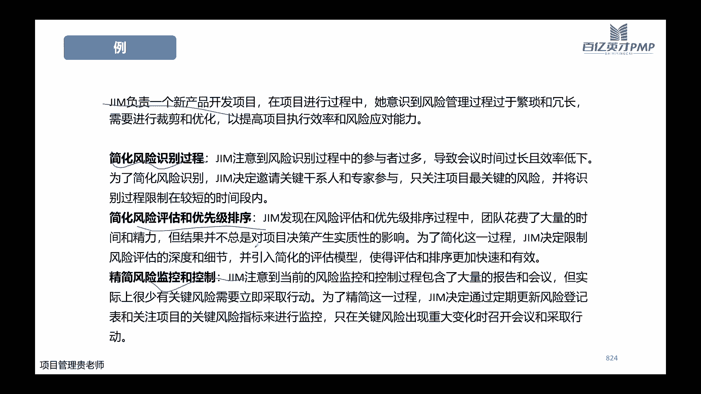

这个也是根据我们实际的情况可以去调整啊，最后呢还有我们啊，不是最后是下一个我们还要裁减项目的交付啊，我们说了项目要交付很多东西啊，啊对不对，那一般的这个项目本身的，比如说系统啊，系统要交付啊，对不对。

那是不是有服务器啊，服务器要部署啊，那是不是有培训的手册呀，啊使用的手册呀，用户的操作一些指南呐，啊如果说你是具体的这个有形的，可以建的这种弓箭，那是不是合格证明啊，这个质量保证保证的这个证书也得有啊。

对不对，所以呢啊项目的交付呢它也是可以去裁剪的啊，这取决于比如说组织，它是不是有这种需求的管理系统啊，因为我们说交付，它是由项目的本身的这个需求去啊决定的，对不对，那你需求管理系统是不是合适的啊。

是不是能够对应的我们整个这个项目的交付，同时呢公司里面，组织里面是不是有项目的这个范围确认，或者是质量控制的一些相关的一些政策，或者程序或者指南，对不对，我们说了项目他一定要控制质量，一定要确认范围呀。

然后才能去交付呀，那OK啊，公司里面他对这一块，他的这个程序是不是很复杂啊，他的这个政策是不是要求特别严格，要求这么严格的，这些办法，是不是符合我们项目的这个确认范围的，这些这个实操啊。

也是可以根据我们实际情况去调整的，比如说现在项目它特别特别的这个复杂，那我们现在公司里面呢，它的控制质量的这个措施啊，很简单，公司为了省钱嘛很简单，但是呢我们又知道，实际当中呢他这个项目很复杂。

其实质量方面的风险是很大，那我们是不是也可以去裁剪，裁剪不一定是把它剪掉哈，也可以去挑去增加，增加它合适的同时呢，公司它的有没有一些质量管控的一些措施啊，质量审计的一些工具，一些模板。

然后行业有没有质量的这个标准啊，这样这个质量的一些准则，甚至呢政府社会或者是更高的这个法律层面，它有没有一些制约的因素，这些也是我们根据实际情况啊，要去裁剪啊，要去这个去优化的，比如说在公司的规定。

你啊这个你要去生产这个东西，你必须要通过质量管理体系的认证啊，9001体系的这个认证，那OK你为了做这样的认证，这个认证体系它是一套全全套的一项体系，这个体系里面规定了非常多的质量管理的，这个流程啊。

程序啊啊这个人员呀各种措施，那你做了这个认证之后，你是不是非得按照这个认证的，这上面的这个要求一步一步做到位呢，啊也不一定，对不对，实际上也没有什么公司，也很少有公司。

不能说没有很少有公司完完全全按照SI，完全按照这个9001的这种标准去做，他们的公司的质量的这个控制，质量的管理，要不然他得专门花很多钱去做每一个项目的，资产管理，公司一般在这方面能省一派，也就省了。

对不对，他只要把控住啊，关键的我这个弓箭我质量是不是合格啊，该配的这个合格证书我有没有做啊，甚至呢有一些这个啊破坏性的实验，或者是一些测试核心逻辑，我做了我就OK了，对不对，那你你你要求的那些东西啊。

我我都合并了，对不对，同时呢项目的这个需求如果存在不稳定的话，那不稳定有没有一些应对的办法，这个是我们在考虑项目财产的交付的这个过程，需要去考虑的，然后同时呢对于项目管理和产品。

开发当中的一些可持续性的因素唉。

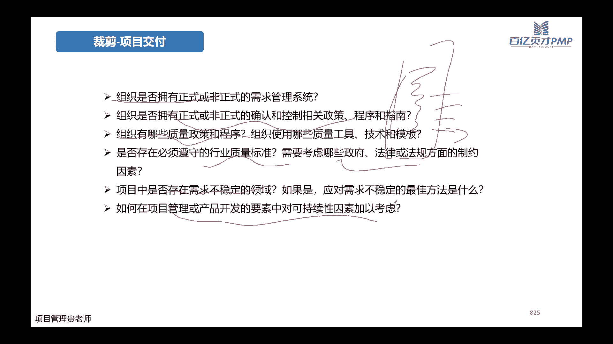

怎么样去考虑，这个这个是我们财经项目交付，要从哪些维度去考虑，这也有一个这个案例哈，这个案例呢是说嗯时间很紧迫，团队资源很有限，你现在呢你要保证要交付核心的功能，所以呢你必须要采集一些质量控制的活动啊。

这个意思大家都懂哈，就是说我现在我核心控制要交付，然后有一些质量控制的活动啊，比如说要给他做啊，做这个控制图啊，然后控制它的一些过程啊，我我假如说我做这个东西，我做这个软件公司已经做过很多个了，对不对。

有很多线程的，可能这个嗯这个代码呀，这个这个包都是现成的，那我去做这么多的测试，它有没有必要呢，所以呢啊根据我们过往的一些经验啊，做这方面的业务已经做的非常少了，做了案例又做了好几百个唉。

质量测试的一些工作我就简化了我，但是呢我能够保证它的质量是没有问题的，是没有OK的，对不对，那这样也可以啊，对对对不对，实际也有很多人这样做，而且这样做呢，你只要保证它的这个质量是符合质量标准的。

一也是OK的，对不对啊，所以呢你要保证它的重点功能啊啊，做一些核心的一些测试啊，啊做重点的这些这个风险评估啊，然后有一些问题跟踪的一些这个测试啊，然后验收的测试把它做好，针对于核心的功能的。

其实也就OK了哈，也就OK了，当然我并不是鼓励大家，那不是鼓励大家能偷懒就尽量偷懒，能简化就尽量简化，这个也是要根据第一根据项目本身的这个要求，第二呢要根据我们公司整体的这个组织的文化，组织的政策。

组织一些要求哈，有的公司他啊比如说像一些国企，他要求非常严格啊，那也没办法要求严格，就按照他要求严格的去做就OK哈。

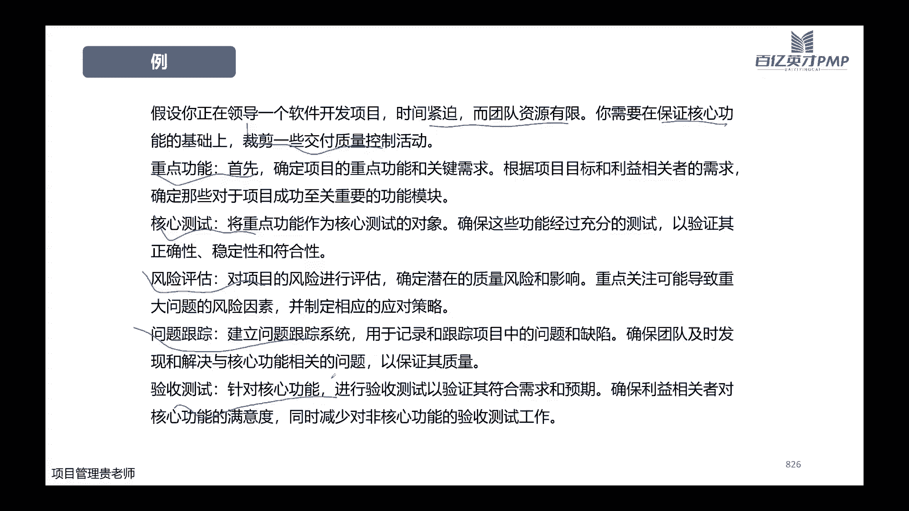

好裁裁减产品和可交付物呢啊要要考虑什么，怎么去裁剪产品和可交付物，首先呢从合规性和关键性来看，那看看什么样的这个质量保证是合适的，从产品的这个类型来看呢，看看它是是有形的还是无形的啊。

有形的我们要交付哪些东西啊，无形的我们要交付哪些东西，有形的可能啊，比如说你建筑移动建筑很好看，对不对，这个你你一眼就能看出你要交付什么，要交付这个建筑装修好的啊，能够拎包入住的啊。

甚至甲型区块都已经去好了的，还要交付这个啊，这个建筑它本身的一些这个啊几个字啊，三个字要交，那如果是无形的一些软件啊，那你要交付什么交付软件系统啊，还要交付这个用户的手册啊。

怎么样去芜湖更新的这些这个培训的指导，对不对，都要去教，那如果是新药啊，研发一款药物出来，你首先要这个要通过啊，这个医药方面的一些准则啊，一些准入准入之后，你才能去交药，交药的时候呢。

又有各种各样的一些限制和一些条件，同时呢还要考虑行业市场，我们做出来这个项目，它的这个产品和这个可交付，到底是服务于哪个市场的，这个市场上面，它有没有一些严格的一些监管，和一些这个措施啊。

竞争对手他在这一块监管方面有没有些漏洞，他做的怎么样啊，这个也是我们嗯从行业市场里面去考虑啊，可以裁剪哪些东西或者增加哪些东西，从技术方面去考虑了啊，要考虑它的一些稳定性。

从时间框架呢哎要考虑时间是很短还是很长啊，也取决于我们交付产品或者可交付的时候，到底怎么去交付啊，需求稳定性，前面讲了安全性啊，增加交付啊，这些都是根据我们产品和可交互物这块啊，去考虑的去优化的。

再有一个安妮啊啊，这个案例呢是说你负责一个市场推广的活动啊，现在也是呢时间自己的啊，很限制，需要裁剪一些可交付成果啊，那我们可交付成果裁剪什么东西呢，对吧啊，首先重点渠道，因为你现在做市场推广嘛。

那么我们肯定要选择一些最关键的一，些渠道和平台，对不对啊，用用短视频的方式啊，用直播，用直直播带货的方式啊，对不对啊，或者是用这个传统纸媒的这个方式啊啊都OK，但是呢重点是它能够啊我们这些项目。

它能够在这些渠道能够达到的它的一些效果，对不对，那比如说你去卖一些日常的一些用品，你可能觉得诶直播带货还比较的快啊，也比较的这个具有性价比，但是呢现在如果说他这是一个这个市场推广，推广一辆车。

推广一辆车，那你可能直播的时候，他就不太能够展示这个车的这个性能，对不对，所以你就换了其他的一种渠道更加合适啊，核心内容，核心内容呢，比如说关键的一些这个产品的一些特点呢啊。

或者是这这个产品它的独特的一些优势啊，啊它的核心的这个目标受众啊，啊我们去保证这些核心内容他的这个准确性啊，吸引力，比如说现在你的这个做了一个啊，这个比如说这个，比如说这个啊迪奥啊新车啊。

或者这个宝马新车啊，甚至这个特斯拉新车，很多新车的一些颜色都非常漂亮，对不对啊，粉色呀，紫色啊，都非常适合女生，那它的目标受众就是这个女性啊，就是一些这个比如说25~45啊，这些还比较有实力啊。

也比较有这个这个小资范儿的这种女性啊，那OK你终于履行你写广告的时候啊，你是不是写市场推广的这些活动策划的时候，你就符合你的这个受众群体去做一些策划活动，对不对啊，比如说你做一个发布的时候啊。

这个啊主题呀啊做一些粉色的这个泡泡气球啊，是不是更加符合他的一些这个，这个女性的这个审美观啊，但是如果说你换成这种儿童的啊，甚至换成这种机械重机械的，是不是就有点违和嗯，包括这个设计素材呀。

跟我们前面这个是一脉相承的啊，这个这个网站啊海报啊啊都是一样的，也是根据我们项目本身它的这个群体，受众群体啊，甚至项目本身的这些特性来看，比如说你是车，那你是不是广告啊，海报啊就非常的这个大气啊。

这个品牌的这个标识啊，也是花了非常多的这个呃资金或者资源去做，但是你现在呢如果说你交付的不是车啊，就是一个啊就是一个吃的啊，做做一个这个小零食，做一款小零食啊，那你的这个品牌标识啊。

或者是这个广告的海报啊，是不是他的风格就完全就不太一样了，对不对啊，还有呢重点活动啊，市场推广当中非常重要的一些活动，那这些活动呢啊哪些活动是比较重要的，哪些活动是非常啊次要的啊。

比如说嗯做一个这个新店的一个推广，那你是不是啊去发发传单还比较有效果，对不对啊，投广告也比较花钱，但是呢它的这个效益，它的一个曝光量啊也比较强，但是呢你现在去说诶，我跟啊开一个这个这个研讨会啊。

或者是开一个这个发布会啊，发布会呢如果说你有潜在的一些受众群体，那当然也比较优秀，但是呢你现在没有完完全全没有一些受众群体，甚至你这个品牌是完完全全是新的品牌，没有被大家知晓过，完全都不知道。

那你开产品发布会是不是效果，就相对来说比你直接投广告，要稍微打一点折扣啊，同时呢测量指标啊，也是我们在裁剪这个啊，市场推广这个活动里面需要考虑的因素哈，比如说转化率啊，点击率啊，品牌知名度啊。

包括现在短视频很火，那么你的短视频的这个啊流量啊怎么样，你的这个转化率怎么样对吧，你后面的这个复购怎么样，这些才是你的一些核心的一些测量指标，那怎么样去考虑它的核心测量指标，这个也是要重点去裁剪的哈。

那比如说你重点是要啊它的成交率，那你可能啊短视频是一小部分，更重要的是你靠直播，对不对，因为直播的转化率更高，成本也更低啊，但是呢你花了大力气去搞这个视频，搞非常精美的这种短视频啊，但是你不搞直播。

那是不是就有可能去打折扣啊，这个也是根据我们项目的不同的点啊，去裁剪它的这个方式，方法好，测量也要裁剪啊，我们前面讲测量测量那么多，对不对，测量该系人啊，测量交付啊。

测量啊他的这个资源呐啊测量它的基准绩效，那是不是每一个项目这些东西也都是要测量，测量的过程也都是那么的这个复杂呢，也不一定哈，首先我们要考虑它测量怎么样，测量它的这个价值啊。

啊价值呢啊有财务的价值和非财务的价值啊，分别怎么去测量啊，比如说非财务的这个价值，我们测量该县的满意度吧，啊以这个客户的这个反馈为核心的这个测量点，那也OK，那构图反馈我们怎么样去收集啊，对不对啊。

怎么样去得到他们的一些，比较客观的一些反馈啊，项目完成之后呢，项目怎么样去进行跟收益相关的一些，数据采集啊，直接看财务报表吗，啊，还是看这个客户的这个回款的，这个这个周期长不长短不短啊。

还是看这个项目的这个收益率啊，怎么样，到底是以哪种方式，这个是我们考虑的项目的状态的报告，有没有什么样的一些核心的一些要求，这个是我们在踩点测量的时候，还需要去考虑的维度。

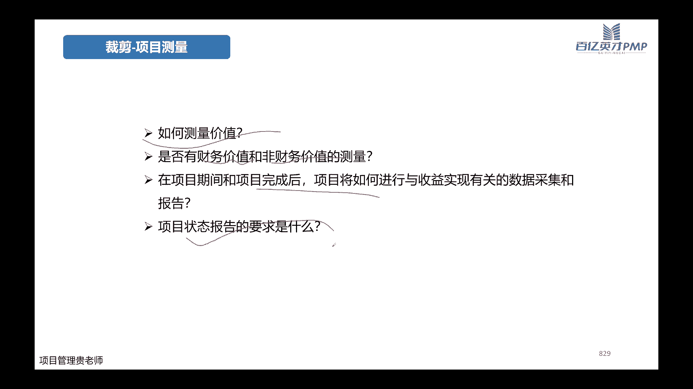

根据基本要求来，这也给大家举了一个这个案例哈，啊比如说我们测量是一个很复杂的测量的，这个维度也很多，那我们确定一些关键的这个测量的指标啊，比如说我们规定这个项目，他就测量这个SV和CV就行了。

搞什么CPI和SPI，不需要，对不对，我不需要啊，甚至啊这个我们讲基准测量的时候，讲了非常非常多的那些这个指标啊，那些工具对不对啊，我我那些不必要的我就不要，对不对。

我只需要他是不是是不是判断他是不是超支了，测一个CV啊，我就OK啦，我不需要他的其他的这个这个之后的这个啊，这个这个etc到底是多少啊，然后这个ETAC到底是多少，我不需要这些东西，对不对。

不需要不需要分析也是OK哈，简化数据的收集的过程啊，那比如说哎我们收集的时候，我要一个一个去开会去讨论啊，去把他们手头上的这个工作去统计，那也很复杂啊，对不对，那我这个时候呢我是不是有更简单的一些办法。

我收集少更少的一些数据，收集只收集核心的数据，有核心的指标，同时呢收集的过程当中，我是不是用一些这个软件自动的去抓起，自动的去抓取更好，这样好过，大家每周自己去填报，对不对。

因为都说基层人员的工作量非常大，有非常多的填报的这些东西，这些内容对不对，那现在我一些不必要的，或者是一些重复的一些数据，我是不是一次啊，这个一次录入之后就直接能够调用呢，比如说现在大家这个啊。

当然一些政务的智慧化都在推行哈，但是现在呢嗯去办一些事情，万一是这个事情，可能你只要你登录过，或者是只要你在系统里面录入过，那可能你的基本信息就在那个地方，对不对啊，所以呢就不需要你啊。

每次都重复的有一些这个表啊，甚至同一个这个表里面有一些重，有一些重复的一些信息，不断的在填，不断的在填，这种情况就少很多了，是不是同时呢啊缩小测量的范围和频率啊，嗯每一个这个项目呢它的这个要求不一样。

那么嗯啊比如说这个关键里程碑，我们是不是测量一下就OK，而不是说每一周的每一天的这个日报啊都得写，都得把啊搞清楚，我们今天这个具体的这个进展到底是什么，这个也不一定都对，尤其是跨周期很长的。

甚至比较大型的这些项目，你每天搞日报啊，包括这个工作的时间比较长的，经验比较丰富的，每天让他写日报，那你简直是让他疯了，对不对啊，同时呢简化这个报告啊，并且能让它更可视化的这个嗯可视化做的更好。

而让大家更能够一眼就能看出来诶，这个这个这个测量的这个内容绩效报告啊，他想展示的东西是什么，他展示出来的这个测量的这个技巧内容啊，到底是好还是不好，我一眼能够看出来，对不对啊。

不是说搞个搞个几十页的这个报告，让你慢慢去翻去吧啊，所以这个呢也是我们在测量这个领域。

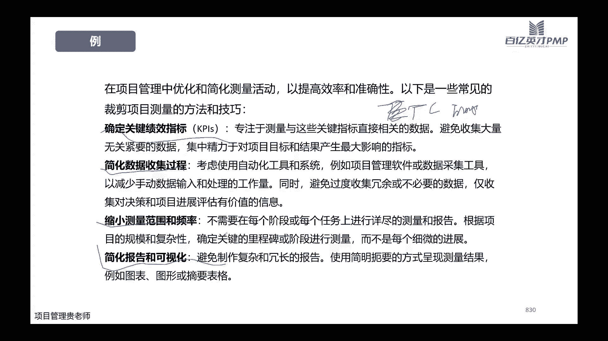

要重点去考虑的，还有一个呢就是裁剪我们的参与人员啊，财经参与人员应该对于大家来说是最好理解的，不同的经营项目，他要求的这个团队的这个规模不一样，同时呢啊对于团队的成员的这些技能，他的经验啊。

他的资质啊要求也不一样，那么我们怎么样去根据基的这个项目的情况啊，合理的去分配啊，合理的去获取我们的这个资源，同时呢给他做赋能的时候啊，那怎么样去啊考虑怎么样去考虑啊，给他做培训也好啊。

啊或者是做这个嗯讨论问题的时候也好啊，啊怎么样去把团队价值的这个，把团队成员本身的这个价值啊，把他自己内心想做好这个项目的啊，这种这个想法给他去给他激发出来，怎么去激发啊，用我们上节课讲到的这个经历啊。

那么多的模型啊去试用，同时呢啊除了全部的这些项目的，内部的团队成员之外，那么我们讲啊，还有可能有很多的虚拟团队在配合，还有很多外围的这些团队，他们也在给我们做这些项目的啊，这些参与的这些这些工作。

那么我们是不是有必要需要这么多的人啊，去知晓，或者是呢这么多的人他确确实实是有需要的，那我们怎么样用一些更好的方式，去让他们更合适的方式，参与到我们的这个项目当中来。

这个是考验参与人员哈具体考虑的一个方式呢，就是比如说啊这个啊干系人和供应商，他们的一些配合是怎么样去更合适啊，这干西人他是属于内部还是外部啊，或者是他又是内部啊，又是外部的。

比如说这个股东看起来好像是内部的，但是呢股东他又不经常来，他又不了解他们的一些细节啊，他也可以算作是一些外部的啊，沟通的上面呢有哪些方式啊，或者哪些软件，哪些技术更加的好，更加的合适啊。

如果说干新人它的文化和语言不一样，哎，那我们怎么样去考虑现在呢，它的这个文化多样性啊，怎么样去包容干系人，他跟干系人之间啊，有没有一些利益的冲突，有利益冲突，那我们在啊这个执行的过程当中。

怎么样去裁剪啊，怎么样去安排他们这个有冲突的利益双方，怎么样去协调他们啊，这个是参与人员里面要考虑到，那除了参与人员，我们要团队要裁剪团队裁剪啊，除了谈裁剪它的数量和他的这个能力之外，我们还要裁剪啊。

比如说办公地点是不是要裁剪啊，他能够集中办公啊，当然不错，如果没有办法集中办公，那这个地点是不是东一榔头西一棒子散落的，到处都是啊，是不是完全不可以，是不是是不是就很好啊，也都是要考虑的。

同时呢团队之间如果说有不同的经验，不同的文化啊，那我们怎么样去这个裁剪，如果现在咱们遇到一个项目，对所有团队成员都是来自于互联网行业的啊，突然来了一个这个突然来了一个这个嗯，做传统啊。

做这个汽车零部件二的，那怎么办啊，那我们这个时候啊，是必须要这个您不知道的这个团队成员，还是说其实他可有可无，如果可有可无，我们干脆就不要他了，省得这个他一个人来啊，重复太大，五花重复太大。

确定团内成员呢，也要考虑团队成员到底是兼职还是全职，然后呢，团队他是不是本身唉他已经配合过很多会了，我带着这个项目已经做过，很带着这个项目小组已经做过很多项目了，所以他跟我们之间的这个配合。

这项目之间的这个磨合，基本上就没有什么磨合期，已经在很规范甚至很成熟了啊，那我在团队的这个啊建设的这个这个过程，是不是我就可以花更少的一些精力，同时呢唉我还要去考虑嗯，团队如果说想更好的一些发展。

那我们是不是有更好的一些，这个办法和一些措施啊，现在的团队当中有一些这个特殊性的一些要求，有一些特殊性技能，这些人员，那我们怎么样去服务好啊，怎么样去领导好这个特殊性的啊。

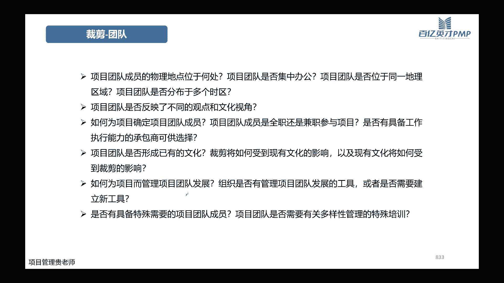

透视性最强的这个团队成员，那怎么办，裁剪团队和干系人给大家把两个合在一块儿啊，因为都是人嘛，把两个合在一块儿，给大家找了一个案例哈，这个案例呢比如说啊团队的规模和结构啊，也可以根据项目的需求去裁剪。

比如说现在你团队的规模啊，预算比较小啊，预算比较少，那团队规模要缩小，那我们就可以裁剪开发人的一些数量，同时呢啊这个项目比如说啊这个干系人，有一些干系人，他是比较次要的，虽然说我们说每个干系人都很重要。

但这些次要的干系人，我们是不是跟他这个确定沟通方式的时候，就尽可能的去减少一些频率啊，减少一些这个频率，甚至有一些这个不太相关的这些功能啊，这个跟他关系比较小的，就跟他说的时候，跟他去沟通的时候就一样。

就不提这个啊，省得他问东问西的跟他没关系，对不对，那同时呢它的这些这个参与的这些方式啊，比如说有些他可能不需要他去检测了，那我们是不是开会的时候，其实就没有必要去叫他啊，当然如果说是核心需要他决策的。

我们就需要那些更核心的那些人参与也就OK了，对不对，一些次要的或者是一些这个呃逆比较低的，我们用一些这个定期的一些这个信息啊，能够告知给他们就OK了，而不是说啊，每次都要主动的把什么信息主动的去啊。

这个跟他们开个会啊，正常咱们开个会啊，还同步一下，就可能也就没有这个必要，对不对，好啊，以上呢是针对我们整个这个裁剪的这个模块哈，嗯其实嗯从不同的角度去讲啊，我们怎么去裁剪，也跟大家去找一些案例哈。

嗯大家看看有没有什么这个问题要讨论的，今天晚上内容。

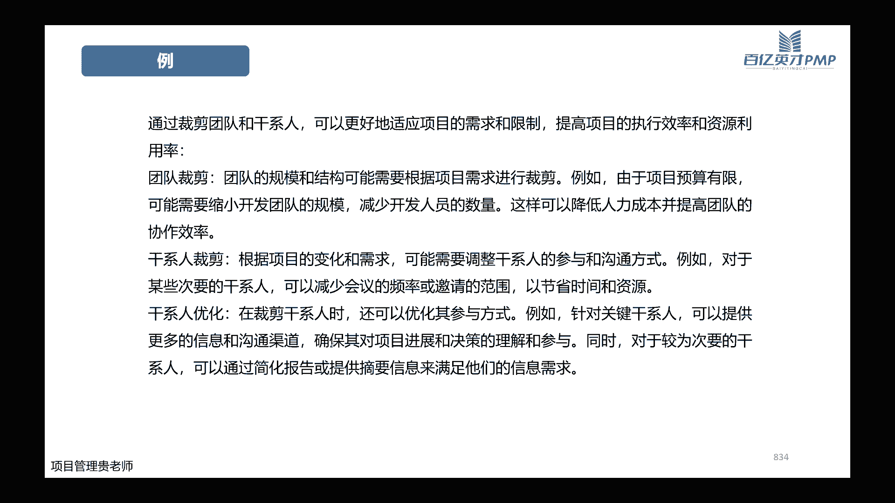

大家对于今天晚上的内容有没有讨论的吗，可能很多都是实际的情况，要对着实践的这个场景才讨论得出来，对不对，没关系哈，我们嗯可以回头在实际工作当中遇到时间问题，咱们再讨论也OK哈。

然后今天晚上如果说内容没有什么问题的话。

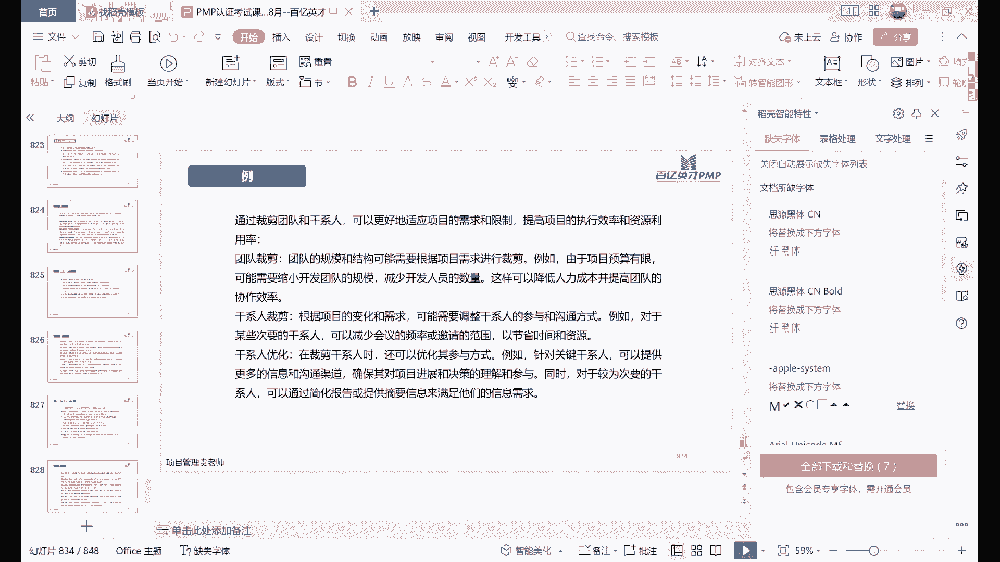