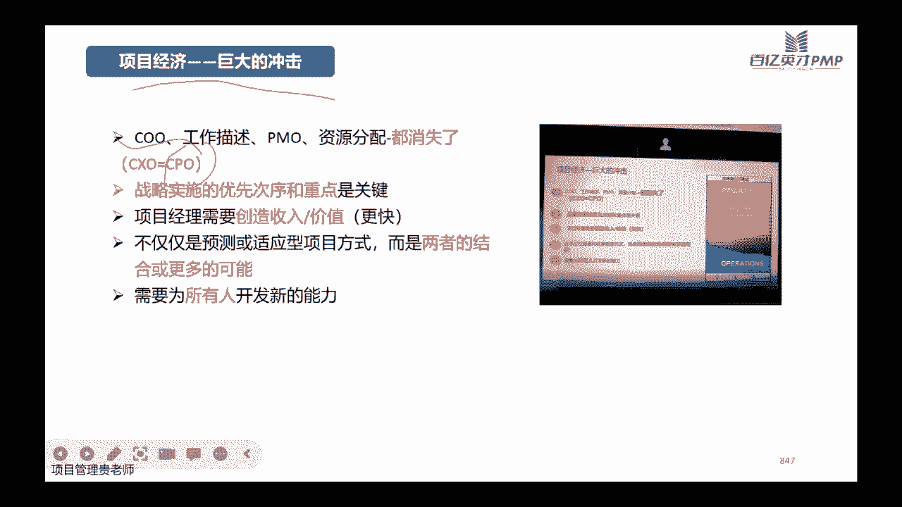

# PMP考试培训课程最新完整版项目管理认证第七版教材新版考纲自学教程 - P19：19.模型、方法、工件 - PMP专家 - BV1rM4y1Y79x

哈喽各位学员晚上好呀，666的意思就是能够看到课件啊，听到声音是吗，哈喽晚上好啊，我们直接就开始吧，明天晚上，今天晚上咱们讲模型方法和弓箭哈，这个章节呢其实对于大家来讲。

主要是帮助大家把整个PMBOK第六版和第七版，教材里面涉及到的这些工具啊，这些模型和这些这个弓箭给大家提炼，再汇总一下，我看到评论区有学员说要刷题吗，我一般不说刷题哈。

但是现在确实要开始加紧时间去去做题了，8月19号考试吗，今天7月19号了，只有一个月时间，所以题赶紧做哈，有问题在群里面随时就可以艾特我去问，我看见了，我会第一时间给大家回复的，嗯对牛夏菲说。

课快上完了，终于赶上一次直播，是啊很难得，是不是终于赶上一次直播嗯，可以的，那个课件可以，课件讲完了之后会给大家啊，就是水印没有之前那么的明显，会给大家再发啊，会给大家再发啊。

然后之前的那个课件水印比较，这个明显也是呃，当时是因为七版的这个教材，包括各大机构的这些课件都是在刚出来，所以呢做的这个保密的措施，会比较的这个高一些，希望大家理解哈。

讲完了之后会再给大家去分享这个课件啊，当然也会这样加水印，但是没有之前那么明显，嗯如果说需要纸质版课件的，也可以联系苏苏老师哈，做钉钉里面的题目吗，钉钉里面的题目肯定是要做的。

钉钉里面题目是要求大家每次都对应的模块，讲完之后就去念，这样的话知识点能够迅速的趁热打铁去回顾，当然这个我不知道大家平时有没有训练的一些，这个小程序啊什么的，呃小程序里面的题目如果大家有权限去做的话。

小程序里面的题目也可以去做哈，因为小程序里面主要是给大家打基础用的，它里面应该是嗯题目如果还没有更新的话，应该是第六版的这些这个呃题目会比较多一些，但是呢我们说了考试哈，虽然说第七版的教材融入进来了。

但是呢考试的这个基础哈，第六版的教材它永远都是经典啊，是甩不掉的，目前是甩不掉的，所以小程序里面的题目也要做哈，这是帮助大家打基础用的嗯，同时呢后面还有两套这两套模考题哈，到时候苏苏老师会发给大家。

这些都要做哈，然后做题的时候还是要遵循一个原则，不要去想着这个做的题越来越多啊，然后完了之后这个期望到时候考试能有原题啊，偏僻的考试它主要是一些场景，它缘起的概率非常小啊。

他即使是他最多也就是场景给你的是一样的，考点是一样的，但是如果说完全一模一样的话，那概率还是比较低的哈，还是比较低的，美国人一般都比较注重这方面的问题，它不像国内的考试，直接题库里面抽一抽。

不是这样子的哈，所以大家做题的时候一定要了解他这个题目，他的考点是什么，然后他的套路思路，解题思路啊，要训练这些东西，对苏苏老师给大家解答了，小程序里面第六版的题也要做，是的啊，现在也有第七版的。

那正好大家抓紧时间做小程序里面的题哈，嗯小程序里面提呃，如果大家遇到什么问题的话，反正就截图啊，把那个题目然后和你选错了答案，以及它正确答案的这个解析一起截过来，发到群里大家可以讨论。

然后看看解析的方向和思路是什么，然后看看你选错的这个到底是为什么，当时怎么想的，可以还原一下哈，孟子还说好久没做小程序了，小程序刷起来刷起来刷小程序上面的题目，哈哈刷起来，好嗯我们继续哈。

今天晚上的这个课程呢，主要是给大家提炼项目管理的一些这个法宝啊，这个法宝是什么呢，法宝都是这个模型方法和工具啊，有人会觉得啊，模型方法和弓箭，好像不太理解他们的这个意思哈，没关系，跟大家解释一下就好了。

这个模型呢一般能够称为模型的，说明它是经过多轮的一些测试和验证之后啊，复试符合一些发展规律的，才能叫做模型，对不对，那我们p mp呢，它是一个非常完整的项目管理的理论体系啊，理论知识体系。

所以呢它里面既然是理论，那一定是经典的，涉及到的模型会非常多啊，比如说我们前面讲过好多的这个啊，领导力模型啊，然后这个变革模型啊，然后这个复杂性模型啊等等啊，方法是什么意思呢。

方法就是我们要管好这个项目，要顺利的带着团队成员去把这个可交付成果，把它啊拿到手啊，把它做出来，那么用什么样的工具，什么样的方法会比较合适，当然我们在整个课程当中也讲了。

非常非常多的一些工具啊和一些技术，这些都是我们的方式方法，弓箭是什么意思呢，弓箭是我们在项目管理过程当中啊，用到的这些啊模板呢啊项目的文件呐，啊项目的一些报告呀，啊这些叫做弓箭哈。

OK知道他们是什么意思之后呢，我们就要看一下嗯，整个这个概述呢还是简单的给大家了解一下，因为我们上节课，重点的帮大家回顾了这个绩效率啊，帮他绩效率分别是从人的角度，该信任和团队，那么从项目本身啊。

从项目的这个主线来看的话，开发方法规划工作和交付，从监控和知识的角度来看的话，它有要要测量啊，还有不确定性，同时呢出来的就是可交复合弓箭，这就是整个项目管理的一些模型哈，移到这边来嗯。

项目团队呢这些原则性的东西就不重点讲了哈，今天晚上重点讲这个具体的这个模型，工具和方法，怎么样去这个重复或者增加不必要的一些工作，大家自己去看看，这些都是一些比较正确的一些话，但是呢实操性没有那么强。

模型呢刚刚跟大家讲的模型，就是反映现实情况的一些简化的一些食谱啊，啊简化的一些这个嗯不是视图也可也可以，如果是文字的表达也OK，那这些模型，它这个模型呢一般可以帮助我们啊，快速的去理解某一种场景。

或者说某一种现象啊，它运作的原理或者发生的这个逻辑，到底是什么样子的哈，这是我们所有啊六版七版加在一块儿啊，加在一块都有的，涉及到的一些这个模型，那么这个模型呢，嗯虽然说这个教材这个课件剩余的这一部分。

没有多少页了啊，没有多少页了，但是呢这里面的内容非常的多啊，非常的多，首先从模型来看的话，那我们从啊这个纵坐标呢，我们用模型横坐标呢我们用绩效域哈，八大技巧，遇八大技效率。

就是项目管理重点要关注的这些啊，这些场景这些知识点啊，那OK每一个不同的模型呢，它在每一个不同的技巧与出现的这个概率，或者说用到的这种场景它是不太一样的，这个大家应该能够理解哈，举个例子。

比如说啊第一个轻机性领导力模型，它是讲领导力的，那它肯定是核心的，跟我们的这些这个项目的团队啊，包括项目工作的过程当中啊，一个是项目团队，一个项目工作当中啊，比如说要怎么样去引导我们的这个团队。

积极的去沟通啊，啊对不对，遇到问题怎么样去反馈啊，啊甚至包括在该系人里面，有可能领导力也会涉及到一点点哈，当然最重要的是这个影响力，可能该系人跟那个，然后沟通模型呢，你看他沟通沟通肯定是要跟人沟通啊。

所以沟通也是团队的绩效益，涉及到该性能绩效率啊，包括我们在规划的过程当中，也会涉及到很多的这个沟通啊，因为沟通管理计划嘛肯定是要设计，然后包括工作当中也是重点的，要关注这些沟通。

然后激励模型经理嘛也是跟人重点去相关的，那OK我们在做团队管理的时候，在做项目工作的时候会用到激励，那为什么说规划当中，你看规划这条线，好多模型都用上了，为什么呢，因为我们虽然说在规划的时候。

还没有做执行的动作，但是呢我们在规划的时候啊，我们要规划资源怎么管呀，团队怎么管呀，对不对，资源管理计划里面就会涉及到这些经济模型，包括这些后面的变革模型，复杂性模型，这些在我们的规划当中都会遇得到。

当然除了我们的规划这个过程当中呢啊，变革还是主要，最主要的是在我们的这个该系人啊，该写人的这个角度会涉及一些变革，因为该系人往往他决定了这个项目，它的一些价值，他的一些走向，他的一些方向性的东西啊。

甚至一些高层次的项目治理，都是在这个变革当中，但是在工作的过程当中，在项目执行的阶段，也会因为啊市场上面的一些动态的一些变化啊，项目本身的一些目标的一些变化，所以呢会有一些变革的模型。

在这一块一下雨用的比较多，复杂性模型呢，唉首先在这个开发方法里面，一定是用的比较多的啊，我们说复杂性模型，比如说它是简单的呀，啊它是复杂的呀，啊怎么样用不同的这个开发方法去对付它，对不对。

简单的需求很明确，技术也非常明确，那我们肯定有预测性的需求不明确啊，技术也不明确，那我们可能用适应性的啊，所以呢啊第一个是在开发方法，然后第二个呢在规划啊，在工作，包括在交付的过程当中啊。

复杂性它是一直存在的，不确定性一直存在的，所以呢他这些技巧语也就涉及的比较多，然后团队发展模型呢既然是团队，那肯定团队的技术力是少不了的，同时呢在工作当中，重点是讲究团队之间的互相配合。

OK这个在工作效率当中也是少不了的，还有一些其他的这个模型哈，就这一张表，然后呢，嗯具体的这个每一个模型代表了什么意思呢，我先我先了解一下啊，就是这些我都已经在课堂上面讲过啊。

大家如果说在我没有帮大家梳理的时候，大家能不能比如说看到前进你脑力，然后大概知道前进你脑力，他讲的是什么，长什么样子，还记不记得，如果说记得的话，可以敲个一，不记得可以敲个二，不记得敲二敲二的。

现在有学，有人敲一吗，这些模型，嗯行没关系哈，不记得不记得没关系，我一个一个给大家梳理一下哈，一个一个给大家梳理一下，当然我梳理的时候，可能没有课堂上面讲的那么详细哈。

如果说梳理了之后能够帮大家回忆起来，那当然是更好，如果说大家想要了解更详细的一些案例的话，可以再回过去听听相应的这个课堂上面讲的，它的具体的这些东西哈，前期领导力模型呢这个它里面有两个哈。

第一个是这个旧情引导力，第二个呢是这个OSCR这个模型，情景领导力模型呢，它主要是考虑啊考虑团队的这个胜任力，和承诺，核心意思就是作为一个领导，那你要根据不同的情形去采取相应的，比较适合这个团队成员的。

他的一个领导的方法啊，比如说啊你现在是一个在领导一个新人，这个新人还没有做过类似的项目，那你可能就用这个啊指导式的这种领导风格，会比较合适，一对一的这个指导手把手的去教，但是现在如果说换了一种场景。

换了一种情景，这个人呢他的工作经验比较丰富啊，这个类似的项目就会比较多，那你可能用一些授权型的啊，或者是参与型的这种方式会比较合适，这个是前期领导力他的一些核心哈，然后这个OSCR它的模型呢。

它这是几个单词的一个缩写啊，O呢它主要是objective，是呃，代表的是一个这个目标，然后S呢S它是这个SUITATION，是对应的不同的这个领导的情形和情境，然后C呢他是choice是选择。

然后A呢是X型，然后L2呢是result，结果他的意思是你的啊，首先要确定整个你项目的目标是什么，要达成什么样的一个愿景，那OK达到愿景之后呢，你看看你现在对应的这个情景场景，他是什么样子的啊。

比如说团队怎么样啊，啊技能怎么样啊，啊组织的这些文化呀，然后这个符合战略性的方向啊，他这些情景是怎么样的，这些情景呢就取决了你到底在这个项目当中，你应该使用什么样的方法去推动它，能够达成相应的一些目标。

有了经济之后就有这个选择，选择合适的方法啊，选择合适的这种啊对象，或者是队内的一些管理的一些办法，选择完了之后要要行动啊，要实施啊，就是按照你选择这种方法，和你选择的一些规划的方案去实施。

推动你的项目具体去做，做完了之后呢，最后还有一个result，结果怎么样啊，要对结果进行一些评审，这是这个OSDR模型，然后沟通模型呢它也分了好几个跨文化沟通，跨文化沟通。

它的核心呢就是不同的这些团队的文化，他们来自于不同的背景，不同的经验，那么你们怎么就是不是你们还是我们，我们怎么在这个项目当中去帮助他们，去更好的去做一些如何啊，能够让他们更核心的去信任我们的这个团队。

然后一起把这个项目的目标去把它做好，把自己承诺的那一部分的工作把它去完成嗯，沟通渠道的这个有效性呢，这个也是在课堂上跟大家讲过哈，沟通渠道的有效性，我们要对这些渠道有一些基本的这些要求啊。

比如说比如说它这个渠道，它可以同时的他可以同时支持反馈多个信息，对不对，不能说我现在啊我在跟你讲，然后其他的人啊，比如说苏苏老师他都听不见，那可能这个沟通渠道它就不太适合，同时呢它能够快速的反馈。

比如说我现在自己在，我现在在这讲，然后大家如果说有什么听不明白的，可以在我们的这个啊互动面板去敲，在评论区敲，然后我就能够及时知道大家的这个反馈，到底是什么样子，然后呢还有一些啊自然语言啊，能听得懂。

我说的话大家能够听得懂，这是沟通渠道的这些有效性关注的一些点，然后还有一个这个执行鸿沟和评估鸿沟，执行鸿沟和评估鸿沟呢啊，执行就是我们想要做的，我们规划的内容跟我们实际执行的，他会有一些出入啊。

他会有一些差距，这个是我们执行层面的评估，鸿沟呢啊，是我们比如说在做他的这个项目的质量的，这个预估的时候，和质量实际出来的这个质量的水平啊，他评估的时候它有一些这个差距，所以这是执行鸿沟和评估鸿沟。

往往在沟通当中是反映的比较多的啊，我沟通我理想当中，我传递给大家的信息应该是百分之百啊，我希望大家能够得到90%，甚至吸收80%，但实际呢大家可能吸收的只有60%，70%，所以呢我想象中的跟我执行的啊。

实际得到的效果它是有差距的，然后经理模型哈，激励模型呢有很多哈，这是练了几个重点的，首先保健因素和激励因素，保健因素和经济因素呢，这个双因素理论还课堂上跟大家讲过，保健因素呢就是说哎你有了这个机密。

我会更高兴，但是你没有这个经历呢，我会很生气，比如说大家的这个项目的工资啊，或者约定好的这个项目的奖金啊，啊或者老板跟你说了，今天要给你升职啊，但实际没给你生成啊，这些就是这个保健因素，就是你得到了。

你不会觉得惊喜，给你发工资，你会觉得哇太高兴了会吗，不会那不给你发个工资，你会觉得我想把公司告了，那什么是激励因素呢，激励因素是才是真正的能够让我们产生一些啊，这个动力啊。

产生一些打鸡血的这种心情的这种因素啊，比如说突然老板说你好好干啊，我明天就把你生成项目总监，你突然一下子就觉得来劲了，天天加班，加了一星期班，现在也不觉得累了啊，这个是激励因素。

然后第二个呢内在动机和外在动机，内在动机呢内在动机，当它主要是说我们通过一些方式方法，能够引导这些团队成员啊，啊从内心里面去愿意把这个事做好啊，愿意把自己自己的一些工作内容把它做好。

他愿意为这个项目付出他自己的一些努力啊，承诺能够做到一些啊，那个能够做到一些这个工作的这个成果出来，成绩出来，然后外在中级呢是你推动着他走啊，你说你你不好好做，我就把你开了啊，我就跟你老说你不适合你。

你就你就自己重新去找工作吧，啊所以呢内在动机和外在动机哈，这个是一个这个配合使用的，然后需要理论需要，您的呢也是跟大家讲过这个三个哈，有的人啊他是这个成就需要你给他发多少钱，他都不要。

他想的是把这个事业做好啊，他是成就感驱动，然后还有一个呢他是啊权力驱动控制欲非常强，就想给大家展示自己的一些这个权利，然后还有亲和需要哈，啊我我想做一个社交达人，有人关注我就很高兴啊。

别的你给我多少钱或者怎么着我，我都我都不高兴啊，这个我都觉得没什么意思，你现在让我这个出去，做你们项目的形象代言人啊，曝光率很高，那我很高兴啊，见很多人对不对，所以需要你的呢也是根据不同的团队成员。

看看他是什么类型的，然后采取相应的一些经济办法，对症下药，还有一个呢是比较经典的是XYZXYZ理论，X理论呢啊他是说这个擅长的人性本恶啊，给你打个叉叉，X理论，你不好好，你来公司就是为了为了赚我的工资。

我不好好监督，你就不会好好干活啊，这个是X理论，他的一些趋势，万宁了呢，哎你看他长得像一个勾勾，对不对，是倡导的人性本善，我们即使不在，我相信你一定能够把工作做好的，我相信每个人啊。

但都是能够主动的去学习啊，这里的呢是好倡导，大家都是一个命运共同体啊，我相信你来了之后，公司就是你家啊，大家都是这个一块在做努力，他跟万里的呢有一点点区别哈，他跟万宁人有一点点区别。

这里万宁人呢是说我是老板，你是员工，但是呢我相信你在我的这个这个经历之下，你能够主动的去把工作做好，但是这里的呢是啊，就不存在说我是老板，你是员工了，大家来了都是一家人啊，这个一块是一个集体。

一个团队啊，共创共享，然后变革模型哈，变革模型呢它是也分了好几个类型哈，当时在课堂上面跟大家讲了好多种，不同的变革模型，而变更模型，第一种呢是组织变革，组织变革呢啊首先，哪个是橡皮擦呀，找不到下一家了。

找个地方画吧，首先组织的变革管理嗯，他分了不同的步骤哈，他分了有五个步骤啊，启动变革，对一个公司，对一个组织而言啊，发现了一些商机，或者发现了一些啊阻碍公司去发展的这种动态，这种迹象。

哎我们要组织一个变革，要启动变革，那么启动之后呢，我们要规划变革啊，规划一下这个变革到底要怎么走，规划变革之后呢，哎我们具体要实时变革，他其实他其实这个时候就已经。

把这个变革的这个动作当做了一个项目在做哈，实施了之后，然后还要管理变革，然后呢维持变革，安排一小撮团队啊，先试先行，先试去实施这个变革，然后呢还要给他足够多的一些资源支撑啊，很好的去管理这个变革。

当这个组织当这个先试先行的这个小团队，有一些成绩出来之后，我们还要采取一些办法去巩固，并且呢去扩大啊，去到别的地方啊，或者说扩展到其他的这个项目组，也去试行一下这个流程，或者这个变革的内容看看行不行。

然后ADKR模型呢，ADKM2模型它是从个人，他更关注的是从个人的这种变革的啊，这种步骤来去去这个提炼的一个模型哈，首先呢它代表了它也是五个不同的字母的啊，这个缩写分别代表的是啊，你首先从个人的角度。

你要有这个认知啊，什么意思呢，就是你首先你要意识到自己哪方面不太行，你要做变革啊，比如说你啊一个人他要减肥，他首先他得意识到自己是真的要减肥，自己身体不太好，或者自己有点胖，影响形象，对不对。

他首先要有这种意识，然后一认知完了之后呢，他又有这个渴望，就光他光认识到自己有点胖还不太行，他要能够说哎我想啊，我很羡慕迪丽热巴的身材啊，长得又高又好了，这个长得又好看，我也想达到他那种这个标准啊。

有这种渴望，有这种渴望，你才有后面的这个行动的这种动机，对不对，所以渴望完了之后呢，唉还要有知识，而不是说你想你渴望就在这做梦就能够去啊，一觉醒来就能够有这个减肥成功，是不是不行啊。

你得有相应的一些知识，有方式方法去达到，去帮助你实现这样的一些变革，对不对，学一些标准的这种健身的方法啊，学一些健身配套的一些饮食啊，餐饮这一块包括生活习惯怎么去注重，进而呢把这些知识啊。

把它转化成一种具体的这种能力啊，光知道还不行，还要能够做得到，最后呢啊有了这个能力之后，你才能有一些错误的成效，才能把它变成习惯去巩固啊，这个是从个人的这种角度去讲，变革的模型ADKR模型哈。

然后再一个呢是领导的这个变革八步法呃，这个领导的变革包法，当时在课堂上面也是跟大家讲过哈，首先第一个呢是好，第一步呢我们要营造这个紧张感啊，比如说我今天晚上跟大家讲了啊，还有一个月就要考试了。

原来呢还有两个月的时候，可能我说这句话，大家不觉得有什么，大家觉得时间还长啊，有的是时间复习，但是今天晚上跟大家说啊，这好像大家一想想，确实只有一个月就要考试了，毕竟交了这么多钱的考试费，对不对。

重新考或者补考都要都要花很多钱啊，对不对，那怎么办啊，去做啊，去好好的去做题啊，好好的去回顾我们的课程，所以呢领导的变革的方法，第一个是营造紧张感啊，比如说微软的这个老大。

就说微软离破产永远只有18个月啊，你不好好做，你不主动的去关注市场上的一些动态，技术的一些发展啊，一些更新迭代啊，产品的这个消费者的一些新的一些需求啊，产品的这个跟进，那你确实离这个破产就只有28个月。

很快就跟不上节奏了，对不对，那第二步呢啊光有紧张的还不一样，还还还只是从心理评论上面开始，重视这个事儿了，还要去组织啊一个团队，组织一个团队，组织一个小团队去推动，去实施这样的一个变革啊。

比如说啊前面我们讲了，大家确实要嗯开始好好的去做题了，但是呢如果说诶咱们苏苏老师不盯着大家，或者说呢咱们这个小程序呀啊也没有提呢，这个每次苏苏老师帮大家上传的这个题目呢，也没有，那怎么办呢，那也很为难。

对不对，所以呢要有一些这个组织团队，来推行这样的一些变革的一些内容，然后到了第三部呢，还应该诶创建一些变革的一些愿景啊，比如说我在这跟大家说啊，大家考完了p mp证书，那么啊公司是不是能给报销啊。

公司不给报销的时候的，那对于我们自己而言啊，是不是有多了一个技能啊，多了一个本本，对不对，那假如将来我们在找工作的时候，是不是筹码又会多一些，所以是愿景哈，那么有了愿景之后呢。

第四步还要去去跟大家去啊沟通，去让大家去认可这个愿景，对不对，不能我说学项目管理很好啊，大家就觉得哎这个啊好像是的，我就觉得大家也认为学项目管理很好啊，我得去好好的去跟你沟通，让你认可项目管理它的价值。

而认可p mp，不以咱们将来的职业生涯当中的一个价值，然后到第五步呢啊认可了要开始行动了之后呢，还有一些障碍啊，比如说现在大家这个只能晚上啊，或者只能工作之余去做做题啊，去巩固一些知识点啊。

啊但是如果说这个时候呢，大家白天要上班比较辛苦啊，晚上回家之后呢啊可能家人也不太支持，就是你睡得太晚了，要早点休息，那怎么办呢，那还要帮你去清除一些这个障碍，然后到第六步了啊，这个是障碍哈，消。

消除障碍，然后到第六部的时候呢，啊你这个状你这个障碍消除完了之后，诶，你做了一两周的这个题目，很认真的去做啊，看课程做题目诶，你发现确实你对项目管理的这套知识体系，好像比较认可了啊。

好像渐渐的找到一些做题的一些思路了，唉大家就说明了对考试的一些信心，所以呢它会有一些短期的一些成果出来啊，当有成果的出来，大家当有成果出来的时候，大家就要开始A对这个变革啊，他有一些认可啊。

有一些经历的一些行为，从心里面上面的经历也是OK的哈，然后到七七步呢，唉就觉得这个方法很好啊，确实要开始做题，要开始听课，然后呢，找到抓住你前面这两个星期的这种感觉啊，继续走，啊去深入推进。

然后最后一步第八步呢是巩固哈，你深入推进得到一些方法之后，诶，你提炼了你学习的方法，那将来啊这套方法对你而言，你拿去考ACP也行啊，你拿去考PGMP也行啊，PFMP啊也都行，对不对，转变模型。

转变模型呢它也是啊针对个人哈，主要是针对于个人在面对变革的时候，他的一些心理的一些变化，体内的一个模型哈，这个转变模型呢它也是分了三个大的这块，第一个块呢就是结束，因为你认识到你要做一些转变了啊。

你在心里面要跟他说拜拜啊，你要有这个结束的这样一段的低潮期，那结束之后呢，唉可能这个低潮期还是比较的比较难受，还有一个中间的过渡的区域啊，你可能在找方向啊，你可能在摸索啊。

你甚至也可能在啊这个惋惜惋惜之前啊，是这样的一个状态，干脆就不变就最好了，对不对，还能维持现状，但是呢又好像觉得哎我变了之后，未来可能会是什么样的更好的一个场景啊，在纠结在过渡，这些都非常正常。

然后中间这个过渡区域过完了之后，你才能够有一个新的一个开始哈，这个也都能理解吧，不能理解的想想大家都谈过恋爱哈，当初这个如果说一段恋情到最后要分手的时候，也是这种状态，对不对，结束然后有一段迷茫期。

然后找到新的开始好，这是变格哈，然后复杂性模型啊，复杂性模型呢重点用的也是这两个哈，第一个是这个肯尼芬框架啊，肯定分框架呢，它是面对不同的这种场景，还分了五种啊，比如说第一种呢是嗯。

我们遇到一个非常复杂的一种情况啊，但是呢这个复杂的情况呢它看起来很复杂，但是呢有一些比较好的一些方式方法啊，是直接可以拿来去应对的啊，那这种当然是最好的，是best最好的一种情况。

那第二种刺激的一种情况呢，是也是遇到了比较复杂的一个场景嗯，事实上没有这种应对这种的这个解决办法，这个项目当中遇到这种复杂的这个情景了，有解决办法啊，有人做到过，但是呢我得把这个人找出来啊，不是限制。

又能拿来用的，我可能需要去谈判啊，去付出一些额外的一些成本，找到解决方案去应对它，这个是第二的啊，虽然说没能现成用，但是呢至少可以找，然后第三再次之的呢是啊，这个项目呢它的这现在的一些情节也比较麻烦。

也比较复杂啊，市场上面的应该是有的，但是呢我不知道啊，我不知道谁能帮我解决，不知道哪个公司能够提供解决方案，那得自己去摸索啊，这个是第三个，然后第四呢是遇到了，现在遇到了非常复杂的这种情形啊。

市面上呢好像也没有解决方案，那完全得自己啊，两眼一抹黑啊，完全自己带着团队去汤啊，这种是第四种，然后最复杂的第五种啊，就是说你现在你甚至连遇到的这种复杂情况，你都没有办法去描述，完全推动不了啊。

技术也不明确，需求也不明确啊，团队成员也是一脸懵啊，这个是嗯肯定分框架的这个五个点，五个不同的场景，然后这个太极矩阵，太极矩阵呢，它是把整个项目，从你的技术的确定性和需求的确定性啊，它是这样的一个矩阵。

它是这样的一个举证啊，一个是技术，一个是需求，如果说你的技术和需求啊都非常的明确啊，它在这个区域，那你这个项目是非常简单的，可能用预测性的方法就比较合适，但是现在呢如果说你的啊。

这个技术呢还是不太明确啊，你的需求呢是比较明确的，那你这个时候呢可能更多的是用一些增量型的，这个啊技术不明确的，用一些这个迭代性的这个方法，然后如果说你现在呢是技术很明确，但是呢需求不太明确啊。

你这个时候可能用一些增量性的方法比较合适，如果说你这个时候呢啊这个需求也不明确，技术呢也不明确，那我们可能就用一些这个适应性的方法，会比较合适哈，嗯团队发展的这个模型呢，主要是重点是塔克曼阶梯理论。

和团队的绩效模型，塔克曼阶梯理论呢应该哎团队团队，不是上节课才讲吗，哦不对，上上节课才讲，塔克曼阶梯理论呢，他是把团队整个发展，从形成到结算分了五个阶段啊，分别是，形成阶段。

就但凡你这个团队有新的人加入进来啊，这个脑袋人离职了啊，新的人进来了啊，或者是你领导换了啊，或者小组长换了都OK，只要有新的这个角色融入到团队，他都是啊这个行程阶段哈。

形成阶段之后要进入到一个啊磨合的整荡阶段，诊断阶段过完了之后呢，又开始了啊，大家模仿磨合好了，要开始进入一些规范的阶段啊，规范阶段完了之后呢，大家渐渐的啊非常熟悉彼此的工作节奏，进入了一个成熟的阶段。

能够整体的输出它整体的输出团队的一些价值，然后最后呢到决赛阶段，啊这个是塔克曼阶梯理论的这五个阶段，然后团队绩效模型，团队绩效模型呢是把团队整个他的这个创造啊，从新城到创造一个高绩效分了啊。

七个不同的步骤哈，第一个呢你要想团队达到一些高绩效，那你肯定首先要确定方向，啊大家首先要方向是一致的，才有可能说未来能够有一些一致的啊高绩效，那么第二步呢是大家彼此要信任哈，这是一个团队赖以生存的基础。

然后第三步呢是啊目标方向有了之后，信任有了之后还要还要提目标，对不对啊，比如说我相信大家一定能够拿到，顺利的拿到这个证书啊，我我我相信大家啊，我们方向就是考下来这个PMP的证书，那目标呢目标呢也是啊。

目标是一定要啊，比如说给大家定个目标啊，至少二人以上吧，或者是更好的这个得到3A那么第四步呢，唉目标定了之后，团队就能够做出承诺了啊，现在听课听的比较认真的学员呢，就说哎老师你放心，我一奔着上去是不是。

然后在第五步的时候呢，啊开始按照我们的承诺，按照我们的这个目标去实施啊，去实施具体的一些动作，然后第六步呢开始有一些这个高绩效出现，认真的去实施，就会有好的成果，到第七步呢友好的成果之后。

哎我们如果在执行的过程当中啊，遇到一些变化，那我们可能又重新确定一些方向啊，这个在方向之下我们有信任啊，所以呢，第四步承诺第五关的实施，第六步呢是嗯有一些高绩效出现啊，第七步呢是重新开始。

啊其实可持续发展，我觉得他这个重新开始，如果把它换成啊，比如说可持续发展，或者是像变革一样用巩固，都比他这个重新开始用的要好一些哈，当然书上写的是重新开始嗯，OK团队计算模型讲完了。

还有一些其他的模型哈，比如说冲突模型啊，冲突模型也是跟大家讲过，我们在做项目的过程当中，那团队不可避免的它会有一些冲突，那冲突的时候呢，我们说了它有六种不同的解决方法啊，什么时候我们强迫和命令啊。

什么时候呢啊我们去啊，先回避撤退啊，什么时候我们妥协，什么时候我们面对啊，什么时候我们去包容，什么时候我们去找解决办法去合作啊，这个冲突模型，然后谈判的模型啊，谈判的模型呢啊。

因为我们可能跟比如说你获取资源的时候呀，啊或者是跟我们的这个干系人相关方客户啊，或者是我们的供应商谈判一些这个条件的时候，那谈判的模型你也可以去追求，我们是要达到一个双赢的效果，还是说我现在就想我赢。

然后至于你付出多少，我不管啊，输赢的状态，或者是呢，唉反正这个我一定要把这个气势拉住啊，大家我得不到好处，你也得不到好处，双输的一个状态，但我们更好的是在谈判的过程当中。

要追求一种双赢的这种状态是比较好的哈，但是往往实际当中嗯，一般处理不好，很可能就是遗书啊，100万我不干，我要200万，我要110万啊，对对，对于我们来说，我们就多了10万块钱利润，对于他们来说。

他们就少了10万块钱啊，也多了10万块钱的成本，然后规划的模型啊，规划的模型呢嗯也是哈，比如说我们说规划非常重要，那么从理论上来讲，一个项目的规划的越来越多啊，规划的非常详细。

那我们这个项目他失败的概率就非常低啊，理论上讲是这样，但是呢如果说规划的太多太详细了，往往我们在实际工作的过程当中啊，可能很多规划的内容，会花很多时间和资源去做这个规划，而实际当中呢它的变化又特别多啊。

浪费了时间和资源，所以呢规划它也有一个这个平衡点哈，到底规划多少啊，它有一个这个平衡点，这是规划的模型，然后过程组模型，过程组模型呢它就是我们的啊，按照项目的这个五大过程组啊，启动阶段定好章程。

定好方向和框架，而规划阶段去详细的把这些细节的这种规划，内容，指导方向，工作指南把它规划好，然后开始去啊执行具体做任务，然后到监控测量它的迹象，到收尾啊，这个是过程组，然后还有凸显模型。

凸显模型主要是我们的这个啊，该系人讲该系人的时候用的哈，凸显模型重点的去关注该系人，他的它的权力的大小，然后呢他需求的紧迫性和需求的这个合法性啊，从这三个不同的维度呢啊去关注到啊，哪一些相关方。

它出现在哪一个区域啊，甚至的哪一些不同的区域，它又紧迫啊，它又合法啊，他又权利还比较大，那这种呢肯定就是我们核心要重点，重点去关注的这些相关方，这些干系人啊，这是我们的这个凸显模型，好啊，模型就这样哈。

然后我们讲这个方法呃，方法呢我们刚刚前面也跟大家梳理过好方法，就是你重点是要做出它的可交付，对不对，那你通过什么样的方式方法去把这个可交付啊，把它做出来，这就是我们的方法，那么在项目管理当中呢，啊。

一般啊这个学过低落版的，这个学员都会觉得这工具和技术300多个啊，300多个整个片不可，第六版300多个工具太难背了，太难记了啊，这个根本就摸不到头了啊，其实呢它是有章可循的，是有章可循的方法。

就是啊做项目管理嘛，你管理不可能说凭空管理，对不对，你要有数据的支撑啊，数据从哪里来，数据收起来的啊，对不对，所以呢他无非就是数据的收集啊分析，然后估算估算完了之后呢，还有展示啊，就是可视化。

你要把信息展示出来啊，还有一些这个会议和活动，无非就是这些哈，无非就是这些好，我们一个一个来看，这个呢是数据收集的啊和分析的一些方法，你看有多少是挺多哈，所以说项目管理呢这个知识体系它确实很繁杂。

首先呢从数据的收集和分析方法来看，备选方案的分析，备选方案的分析呢，就是我们在应对一些项目的一些，不确定性和不确定性和一些复杂的时候啊，我们要多选几个不同的这个方案啊，多选不同方案的同时呢。

我们其实就是在收集不同的一些信息，那么一旦我们的这个主方案它有一些变化啊，有一些动态的时候，那我们现在还有一些备选的方案去做支撑啊，这个是备选方案分析，然后假设和制约因素分析哈，假设呢是啊。

没有被证明它是一个事实，百分之百事实的这样的一个因素，制约因素呢它是百分之百，他已经是事实了，并且呢它会对我们的项目产生一些实际的一，些制约啊，这个是，所以呢我们在做项目的这个刚开始的时候，写章程啊。

就要评估一下这个项目，它有没有一些假设的一些条件啊，或者是一些制约性的一些因素啊，比如说我们现在这个项目，它用到一些新的一些技术啊，那我们假定这个技术它在用的过程当中，它是相当稳定的。

但是呢实际上现在市场上还没有验证这个技术，这个系这个技术它是一个全新的啊，是一个刚投入到市场去运用的啊，标杆对照，标杆对照呢，它就它的意思就是说你要啊，咱们要找一个这个标杆，不管是人的标杆。

还是说这个数据模型的标杆，还是说我们这个产品的标杆啊，是找一个参考的模型，能够去我们去啊对比着去分析，对比着去看，然后商业合理性分析哈啊，这个是主要是这个成本效益分析里面的哈。

我们讲了有几个不同的投资的回收期，内部收益率和投资回报率，还有经验值，还有成本效益比啊，我们讲过这个回收期啊和投资回报率，还有成本效益比，他们呢都是一些静态的一些指标，不考虑货币的一些通胀。

货币的一些这个价值经济的一些因素，而基建值和内部收益率呢，他们都是一些动态的哈，动态呢就是你要考虑这些经济动态的一些因素，所以呢它计算起来会相对复杂一些，但是呢它是啊更加的符合我们实际情况的哈。

因为你过去了100块钱，10年前的100块钱跟现在100块钱，那只那是一定不一样的，对不对啊，这个是我们的这个商业和理性分析哈，然后我们的这个核查表嗯，哎这几个这几个这个这个分析的这个这个比例。

还要跟大家讲吗，这个在课堂上应该讲过比较详细的哈，如果说我不太确定的，可以回过头来再看一下，然后我们的这个核查表，核查表呢，它主要是在我们检查这些数据，收集出来数据的时候。

哎我们有一些啊有一张参考的那个表，然后来比对A他到底是合理还是不合理的啊，比如说现在啊，比如说这个这个小孩他不是每个阶段，不同年龄阶段，他都有这个成长的这个指标吗，那我们现在实际去测了啊。

他现在是多重啊多高，然后呢我去对比一下在这个年龄阶段，他的这个是男生还是女生，她应该对应的身高和体重到底应该是什么样的，上限和下限区间是什么啊，这是核查表，然后质量成本哈。

质量成本呢嗯讲过从大概上面分啊，从失败还是不失败，分分了两种一致性的成本和这个非一性的成本，一致性成本呢又分了我们的这个啊一致性成本，就是还没有失败啊，非遗制成本是已经失败了，那么还没有失败之前。

我们又分了评估成本和预防成本，比如说我们给大家做培训，嗯娄子汉说这些不用了，是什么意思啊，不用讲了吗，这两个字，你说说的是哪一个不用讲，还是说这些都不用讲了，好你你敲哈你敲，然后我继续讲哈。

然后非一致性成本呢，是指的是它的这个内部，失败成本和外部失败成本，然后决策树分析啊，决策树分析呢，是在我们这分风险的这个定量分析里面啊，比如说我现在是决定去建一个厂房，还是说改造一个厂房。

那么建一个厂房他有什么样的投资，他有什么样的回报啊，它的概率是多大啊，如果说改造一个厂房，它的这个投资是多少，他的回报又是多少啊，最后我综合来评估一下，到底是应该改建更合适还是应该新建更合适。

OK然后政治分析啊，政治分析呢跟大家讲了，这个基于我们的这个基准绩效里边啊，正做这个项目，现在截止到目前在这个测量点，那我们实际做的工作啊，它的价值它的value是多少啊，这个EV对应的是多少。

然后预期的货币价值，预期的货币价值呢是我用具体的这个货币啊，来评估我现在这些工作它的价值，它的成果到底是多少，所以呢政治分析呢跟呃预期的货币价值呢，它其实啊讲的是一个知识点的里面的东西哈。

讲的是主要就是我们的这个1V，然后预测啊预测，比如说哈预测，就是根据我们现在数据收集上来了，我们预测将来的这些趋势啊，影响图，影响图呢，它是根据我们一个这个动态的一个变量，这个变量变了之后。

它会影响哪些因素啊，比如说我们范围变了，它会怎么样去影响我们的这个啊，工作的这个进度啊，进度呢怎么怎么去影响我们的资源啊，资源怎么影响我们的这个成本，然后说明周期的这个评估。

生命周期的评估呢啊主要是评估啊，比如说产品的生命周期啊，或者项目的生命周期啊，啊去评估它的整个阶段自制和外部分析的，主要是我们在采购的时候啊，在做资源规划的时候去评估一下啊。

这一块的这个技术或者设备或者说服务，我们到底是自己去研发去做啊，还是说从外面去买更合适啊，然后概率和影响矩阵，概率和影响矩阵，主要是我们这个风险里边用到的啊，这个风险它发生的概率是多少。

然后它的影响是大还是小，综合评估来看他这个项目的啊，他这个风险的这个等级到底是高啊还是低啊，比如说这个风险它发生的概率很大，但是它影响特别小啊，那他等级相对比较低，对不对，那如果说他的概率又很大。

影响又特别大，那肯定是高优先级啊，高优性质的要做好它的应力测试，然后过程分析啊，过程分析呢，主要是针对于我们整个这个项目的过程啊，从开始到规划到执行整个细节的过程，看看有什么样的一些这个啊步骤啊。

有什么样的一些问题，回归分析，回归分析的主要是啊去测量，去考验一新的这个结果啊，或者是变量，然后呢，看看这个变量，它到底跟我们的这个结果有什么样的关联关系，有什么样的一些对应的一些关系。

然后根本原因分析，根本原因分析呢我们讲过啊，鱼骨图啊，试穿图啊，都是啊，就是我现在遇到项目遇到一个时间的问题了，那我要去用鱼骨图去找一找，它的根本原因到底是什么，然后敏感性分析。

敏感性分析呢也是我们在这个风险里边啊，去讲过的哈，去讲过的，那不同的这个变量影响这个风险，影响这个项目的风险有很多啊，对不对啊，比如说这个呃做哪一个，具体这个活动推迟两天啊，那会造成什么样的风险啊。

少了一个资源又会造成怎样的一个风险，那么我们把所有的活动，对这个项目可能造成了一些影响，我们把它统计一下，看看这个项目，它本身他影响最大的那些因素到底是什么啊，敏感性最强的到底是什么，然后模拟啊。

模拟呢比如说我们的蒙特卡洛分析，就是典型的一个模拟项目，它有可能啊他的他的预估的不同的活动，它有不同的时间啊，最可能是多少啊，最差是多少，最悲观是多少，这论文又是多少，那我们有很多种不同的组合呀。

啊这个时间配上这样的人啊，配上这个范围，它大概是对应什么样的一个这个项目的，一个结果，一个状态，那如果说加两个人，他又对应的是什么样的状态，什么样的结果啊，模拟个几千次。

唉大概这个项目我们就能够评估出来啊，到一个什么样的一个区间值，它它不会受这些因素的一些影响了，然后该系统的分析，该性的分析呢，就是我们收集了这么多的这个该系人，那么该系人他的对项目的一些期望啊。

啊他的一些这个沟通的需求啊，啊他的一些这个喜好呀，啊他的一些工作的一些习惯呀，到底是什么，然后sword分析所有的分析呢，就是我们在评估这个项目，它有什么样的一些优势，他的劣势，然后呢他做这个项目。

他能够啊核心这个机会是什么，当然有机会就会有威胁，有威胁啊，威胁又是什么，然趋势分析，趋势分析跟在跟这个偏差分析，它都是我们基于正值啊，得出正值之后，那我们判断这个项目将来它有什么样的趋势。

他会超他会超进度吗，啊他会这个成本会超支吗，啊，他现在跟我们的这个计划的这个呃，这个基准进度基准啊，成本基准啊，有什么样的偏差，偏差是不是在我们的可接受范围之内啊，然后价值流图。

价值流图呢他的意思是说啊，比如说我们现在做一个这个啊，做一个软件啊，那我们做软件整个这个价值流啊，提现价值的，它的这个流程是什么样子的啊，比如说我这个我先啊销售拿来订单，先有订单。

然后呢到研发去评估一下有没有定制化的内容，然后呢到生产啊，没有定制化的，那当然直接去部署，有定制化的，我们要做开发，生产了之后呢啊要去交付，交付了之后呢又回款啊，整个这个价回款对于公司来说。

就是它的这个项目价值，它它它的整个价值流图，然后假设情景分析嗯，假设情景分析呢，就是评估一下我们啊目前的这个这个项目啊，目前的这些资源情况啊，或者是目前的这个技术的状况，他呢在不同的情景之下。

对项目到底会有什么样的一些影响啊，比如说我们现在假设这个技术它不太稳定啊，如果说它的不太稳定值啊，它经常用着用着它会卡壳，那对我们项目会是什么样的一些一些影响，那如果说现在项目的技术啊比较稳定。

但是呢他的费用特别高啊，那对我们的项目又会产生一些什么样的影响啊，这个是我们所有的这个数据收集和分析方法哈，然后估算方法嗯，收集来了之后还要估算呀，啊，这些数据你不估算，它就是一堆那个乱糟糟的一些数据。

对不对啊，所以会有一些这个估算的方法，估算的方法里面呢又分了很多种哈，首先第一个啊清河啊，清河分组就是我们的这个清河图啊，比如说我们去找了，去统计了一堆数据上来，那有一些数据它是评估这个项目的。

他的这个进度的，那我们分在进度这一块，有一些这个数据呢它是评估这个项目的，它的这个食物资源的，那我们把这个食物资源呢把它放在一块儿，那有一些呢它是评估这个项目的啊，比如说人力资源的。

那我们就把他人力资源放在一块，这是清河哈，就是给它归类，找一种合理的逻辑去给它归类，然后类比估算啊，类比估算呢，就比如说我现在要统计这个项目啊，这一项活动啊，收集这个需求到底要花多少时间。

那我去参考一下以往的啊，这个项目做类似的这种需求时期，他花了一个月还是两个月，对不对，我去类比一下，然后功底啊，功能点呢它主要是针对我们这些信息统啊当中，它的这些功能数量到底有多少啊，功能点具体是什么。

然后多点估算，多点估算呢可能大家觉得有点懵哈，但是大家一定都知道，因为多点估算就是我们讲过的这个三角估算啊，或者是贝塔的这种三点估算哈，三点估算就是我们的多点估算，然后参数估算，参数估算呢。

他就是说哎我根据历史当中的这些经验，或者是根据市场上面行业已经有的啊，这些啊参数我拿来去计算一下啊，我用一些这个变量去计算一下，乘以这个固定的参数啊，然后有一些这个公式能够计算出相对估算，相对估算呢。

相对估算呢，他是说哎我在考虑整个这个人力投入，或者项目的整个这个复杂性或者不确定上面，进行一些这个相对性的一些估算啊，比如说我们讲敏捷的项目，适应性项目，不是要用故事点去估算它的这个故事的大小吗。

啊其实这个故事点它就是一个相对的估算，对不对啊，我相对看看这个故事点大概是多少啊，这个故事点呢，故事点本身的一个故事点的大小，是大家都默认的，那我用其他的东西我都去类比这个故事点啊。

比如说大家做的这个嗯，我们比如说用这个啊一个T恤的S码M码，对不对，你说S码我们大家都知道S码大概是多大，对不对啊，相对大概是多大，但是你现在说啊，我穿的这个肩宽多少啊，胸围多少。

那大家可能一下子就懵了，然后单点估算，单点估算呢，它就是跟我们的多点估算去对应起来，多点估算是我找几个不同的值，然后去综合评估，单点估算呢就是你只取一个点，一个点估算是多少，就是多少，然后故事点估算。

故事点估算，刚刚已经说过了哈，然后宽带德尔菲，宽带德尔菲呢就是说诶大家嗯各自讨论，各自的啊，各自出各自的这个值，然后呢大家在一块去集中去讨论啊，比如说我们讲要估算公式点的时候，这个计划补课发牌。

主持人发牌，发牌了之后啊，描述故事，描述用户故事之后呢，每个人啊根据你对这个用户故事的他的了解，你去出你手上的牌，你觉得他是几个故事点啊，大家同时亮排，练完排了之后呢，再去一块去解释啊，一块去这个讨论。

为什么你觉得它是两个故事点，为什么你觉得它是八个故事点，对不对，大家一块讨论哎，最后综合一下意见得出这个用故事的故事点好，这个是估算哈，然后到会议和活动的方法啊，会议呢我们项目管理的会议也特别多哈。

首先第一个呢啊是我们这个代办事项的这个嗯，细化梳理会哈，说理会呢是把我们整个这个用户故事啊，去把它啊，去把它细化啊，去把它梳理出来，那围绕这个功能啊，围绕这一期的这个发布，那我们到底要实现什么功能。

而不同的功能，比如说你要做一个网站，那首先要登录，登录完了之后，你要浏览网页，浏览网页之后啊，你要去啊这个评估评价，然后完了之后呢，如果是买东西的话，你可能还要有一些购买的这个介入啊，然后去发货。

然后去售后，对不对，那么登录呢你又涉及到你在往下细化的时候，你又涉及到诶怎么去注册账号啊，啊设置密码呀啊密码忘记了怎么办呀，啊怎么去修改密码呀，啊对不对，还有自己的一些个人的一些信息呀等等啊。

就是把史诗级的纯用户故事，把它细化成可以去执行的这些小的用户故事，这是我们的代办事项的这个计划，然后投标人会议，投标人会议呢是说我啊发起了一个招标文件，但是呢现在有嗯一些潜在的这个投标人。

他对我招标文件当中有一些信息他不太明确啊，他不知道啊，这个到底什么时候截止啊，那OK我再开一个投标人的会议，去跟我潜在的这些供应商啊，统一的去阐述，统一的去澄清，统一的去说明变更控制委员会。

变更控制委员会呢是在我们的嗯，整个项目的变更过程当中啊，那我们说超越基准的，你不能说让项目经理去培养，那都让项目经理去批了，那那超基准和不超基准，它其实实际上就没有区别了，对不对，所以抄了基准呢啊。

由变革委员会去审批，他根据他自己的一些审批的这个啊，权限或者审批的一些标准去做，每天要去开的这个会议15分钟，简简单单啊，把今天要做的计划把它再同步一下，把昨天已经完成了一个计划。

完成这个进展也同步一下，把问题提出来，然后迭代的审查会，迭代的审查会呢是啊，一次迭代之后啊，那你的产品资料出来了呀，产品资料出来之后，你要召集能够对这些资料说yes或NO的人，去让他们去提意见。

对不对啊，他们说了yes，我们就可以开始下一步，他们说了low啊，那那是哪一部分漏哪部分不行啊，我们接下来怎么办，然后迭代的规划啊，迭代的规划，那换个顺序更会更好，迭代的规划放在这后面可能会更好。

当然他这个会议也没有按顺序来哈，迭代的规划呢是说我在这一步之后啊，我细化成用户故事之后，那我要确定一下啊，哪些优高优先级的用户故事，是要进入到我这一次的迭代当中的，那么可以进入到我这一次的迭代当中。

我怎么去给他估算用户故事点啊，怎么去估算它的这个时间，估算出时间之后诶，我怎么去给大家去分配任务啊，大家周一做什么，周二做什么，对不对，那我们说到记得每个迭代一个迭代，它也有一两周的是这个时间，对不对。

那一两周他也有具体的规划出来呀，对不对啊，这一两周的工作任务啊，团队怎么去做出承诺，然后开工会议，开工会议呢一般是我们啊嗯它实际上会有两种，第一种呢是在章程啊，念名之后，章程批准之后。

就会有一个这个开工会叫inny meeting啊，这种开工会呢就是类似于宣讲大会啊，跟大家说一下我们要做什么项目了，这个项目由谁负责啊，这个项目是谁谁谁亲自抓的啊，哪个领导非常非常重视啊，给大家鼓气的。

然后规划做完了之后呢，才是啊，我们课堂当中重点讲的叫qq meeting啊，叫开题会议，这个呢他也叫开播会议哈，这个是规划做完了这种开工会议呢，它就是比较详细了，它不再是看口号了啊，这种开工会议呢。

它主要是把我们规划的细节内容，跟我们的相关方啊去做同步啊，去得到他们的一些承诺啊，将来会按照我们的规划内容去提供支持啊，提供资源，然后今天的教学会呢，这个是在我们的现在我们项目的生命周期当中。

不定期的定期或不定期的都OK啊，时时都会存在的一种形，我随时发现问题了，大家觉得有空就可以召开这种会议啊，它的主要目的就是积累经验教训，然后规划会议，规划会议呢很多哈。

规划会议官位就是按照我们实际的这个情况啊，具体的去啊，创建我们整个项目执行的一些计划，然后下面的这个收尾项目的收尾呢，主要是嗯能够让我们项目做出的这些可交付，或者是阶段性的可交付。

它能够得到项目的发起人啊，或者是这个客户他们的啊验收项目的审查，项目的审查呢是这种会呢，一般是要啊在中间去评估项目的一种状态呀，啊评估项目它的这个价值啊，或者是评估啊，它的这个质量是不是符合啊。

我们的这个这个啊质量管理的一些要求的，一些政策的一些程序的呀，一般是这种开的会啊，然后发布规划啊，发布规划呢，主要是在适应性项目当中用的比较多啊，我啊这个项目它啊，将来这个产品是什么样的一个啊。

这个啊他的愿景是什么，是什么样的一个这个嗯高层次的一些描述的，它的一些功能，然后呢我实际上可能会包含12345，789十多少个功能，然后每一个功能它大概是什么样的一个描述，然后呢我分了多少期去发布。

然后一共呢嗯每个发布大概是多长的时间啊，是半年还是一年，有整理的这样的一个这个啊规划出来，然后回顾回应啊，回顾会议呢是在我们每个迭代之后啊，最后一个会要召开的啊，去回顾一下在这个迭代当中。

大家有什么样的一些啊优化的一些建议啊，啊或者是有什么样的问题解决的一些措施啊，啊有什么样的改进的办法呀，主要是为了让我们这个迭代的效率更高啊，团队配合的更好，然后风险的审查会，风险的审查会呢。

一般是在我们项目的执行过程当中啊，去审查一下我们啊之前识别的这个风险，它还存不存在啊，之前想的这些应对办法，他啊是不是可以去应对啊，应对的时候它的效果如何，有没有一些新的风险产生啊。

有没有一些残余的这个风险参与到这个风险，影响大不大，然后状态会议，状态会议呢就是定期或者不定期举办举行的，这个小会议，关注一下项目的整体进展啊，看看他现在状态是什么，指导委员会啊，指导委员会呢。

他一般就是啊项目当中比较资深的啊，能够给项目一些指导意见的，这些人定期的去诶指导委员会去汇报一下，然后请求指导委员会给予一些指示啊，给予一些建议，这些是主要的啊，还有一些其他的，比如说这个影响地图啊。

影响地图呢它是一种嗯也是适应性项目当中，可能用的比较多一点哈，就是我们整个比如说这个产品开发啊，它的用户故事啊，啊比如说他的他的用户是有一些啊，这个用户故事的这个全景图，用户故事地图啊。

包括呢它的功能啊，怎么样去实现可视化的，这个路线图到底是什么样子，然后建模建模的主要是基于我们这个系统啊，或者或者项目的解决方案，或者是可教服务啊，对他做一些简单化的一些表示的一些这个方法。

比如说我们经常用的这个圆心法，它其实就是一种简单的一种建模，然后进推荐值，进推荐值呢是啊，比如说我们这个项目做完了之后，该县人对我们这个项目，他推荐的意愿到底有多大，优先级模型啊，优先级模型呢。

比如说我们在评估这个项目啊，他的这个这个代办事项，到底是高优先级还是低优先级的时候，我们会用到的一些模型，比如说啊跟大家讲过的这个MOSCOW啊，莫斯科模型哪些是必须要做的，哪些是应该要做的啊。

哪些是哪些是可以做的，哪些是不会做的啊，还有我们的这个卡洛模型啊，这些都是一些优先的模型，然后时间和时间盒呢啊，比如说我们这个迭代的周期，它就是一个标标准准的一个时间盒啊，一周两周三周四周都OK好。

以上是方法，然后呢还有这个弓箭啊，弓箭是什么意思呢，弓箭就是我们啊模板啊，文件啊啊，或者是你输出来的这些可降服务啊，啊这些都叫我们的这个弓箭，嗯弓箭呢也也跟大家去这个讲一下，我们项目的管理当中。

工件也特别多，嗯首先是战略性的一些贡献，也就是说决定这个项目啊做还是不做，战略性强不强的啊，商业论证，声音认证呢主要是A去论证一下这个项目的，它的价值到底该做还是不该做啊，里面包括我们商业的这个文件啊。

可行性研究报告啊，啊或者效益的管理计划呀啊包括这些内容，然后下面的简介，下面的简介呢啊这个比较简单，下面简介就是每个公司他的要求不一样，每个项目他也的要求的详细程度也不一样，那么我们会有一些项目的一些。

简单的一些介绍啊，比如说这些项目的他的目的是什么呀，啊愿景是什么呀，啊他的这个嗯要花多长时间呢，他将来时间的价值是什么呀，还有一些高层背景描述，然后项目的章程啊，项目的章程呢它是一个比项目简介。

更加的要正视一个要正式的一些文件，因为项目的章程的签批，就意味着这个项目他已经立项了，那项目的章程里面呢，它也会包括这些项目的高层次的一些框架啊，项目的名称啊，啊目标啊啊这个内容啊啊可这个周期啊。

女神杯啊啊这个人员团队啊，核心的该系人呐啊它的这个投资规模呀，啊他的收益预估呀，他的审批权限呀，发起人呐，对不对等等，都会有这些内容，然后还有一些这个项目的愿景的说明书啊，项目的愿景的说明书呢。

它主要是对项目的它的一些目标啊，目的啊方向和价值做出一些描述啊，给大家啊这个画一个比较好看的一个饼，然后路线图，那路线图呢比如说我们这个产品的发布路线呀，啊产品发布的计划呀啊他第一步干什么。

第二步干什么啊，这个就是路线图嗯，然后呢，在这里面呢要跟大家介绍一下这个商业画布哈，商业画布其实它也是一个战略型的一个弓箭哈，嗯这个应该是前两个月吧，就这两个月出了一本书啊，哈佛商业评论的项目管理手册。

项目管理手册，他上了哈佛和商业频道还是真名，还是比较牛逼的哈，它里面就有一个简单的就是针对项目的画布，我可以简单跟大家说一下，简单画一下哈，他的这个项目画布里面呢啊，就一个核心的一个这个图。

然后比如说他从项目的基础来看啊，然后从项目的人员来看啊，从项目的创建来看，这是画布嘛，他就归结的非常简单啊，类似于项目的这个页纸项目管理，然后基础考虑什么呢，啊考虑项目的这个目的啊。

这为什么要做这个项目，这个项目要投多少钱，这个项目能收多少钱啊，有什么样的一个价值，然后人员的项目的发起人是谁发起的，然后设计了一些干系人啊，要求的团队的这个能力技能啊，有什么样的资源要求。

然后到这个项目创建的时候来，我们要知道这个项目它的可交付啊，到底要教啥东西，然后呢为了做好这个交付，那我们这个计划是什么样子的啊，同时呢计划如果出现了变化啊，那怎么去管理啊，整个这个商业报。

整个这个商业画布啊，1233个大方面，然后每一个方面的三个小方面非常简单，这个比较适合那种啊，没有系统学过这么多的知识啊，或者说没有时间去关注这些细节的这些啊，内容的人就看这些。

就看一页纸的这种商业画布啊，一目了然，这个商业这个项目到底要做什么，花多少啊，投多少赚多少啊，需要什么人，它是这样子哈，这个比较好用，所以嗯给大家插播了一个哈，OK继续，然后日志和登记册的类的构件呢。

比如说我们的假设日志啊，假设日志呢它是基于项目有一些假设条件啊，那假设条件呢，他这个假设条件随着我们项目的不断的发展啊，假设的这些条件他也在时刻的嗯，有一些这个变化，有一些动态的一些变化。

有的假设它可能变成了事实，而有的这个假设，它可能啊变成了一个就是虚的一个假设，甚至已经消除，然后代办事项列表，代办事项列表呢，它是哎我们要完成所有的这些工作内容，工作项到底是什么，有一个列表。

然后变更日志，变更日志是我们所有人啊，他都有权利提出变更，那他提出来的变更请求到底是P了还是不P了，它的变更内容到底是什么，我们把它更新在变更日志里边，然后问题是指问题日志呢是我们这个项目，他一路走来。

他遇到了大大小小各种方面的不同的，这种问题非常多，那这一只针对这种不同的问题好，我们怎么去给它归类啊，怎么去描述它，它的解决方案到底是什么，它后来解决之后，他的这个解决方案有没有奏效啊。

他的负责人到底谁是这样的一个文件，经验教训登记册啊，那啊这个质变仪啊，经验教训对策就是不断就是基于问题啊，或者基于其他的一些方面，我们得出来一些经验教训啊，一些总结，然后风险调整的待办事项列表。

风险调整的代办事项列表呢，它也是包含了所有的我们风险的哈，但是针对风险的这种啊登记测它，它其实这两个啊区别不大哈，就是匿名我们的这个风险，然后去做一些风险的描述，它的概率啊，它的影响它的应力的一些措施。

然后该系的东西了，该系人登记呢，它是啊描述我们识别出来的，这个项目相关的一些干系人啊，给他做分类啊，给他做啊，评估他的权利啊，评估他对这个项目的希望，评估他对这个项目的需求啊，评估他对这个项目的影响。

然后呢，去制定对这个干系人不同的参与和管理办法，计划类的工作呢，就是我们啊说过的有非常多的计划，首先有各种管理计划，管理计划当时给大家讲过有12个管理计划啊，当然除了管理计划呢，我们还有啊。

比如说迭代计划呀，发布计划呀，顺序当中的一些这个计划，然后变更混沌计划呢啊这个计划都不用讲了，把这个计划，这个计划我我应该不用跟大家说，具体的计划表示什么意思了吧，重点跟大家嗯这些这些不讲的话。

这些应该应该就字面意义哈，这个沟通怎么管，成本怎么管啊，它是具体的讲指南的，讲指南和指导方向的，然后重点说说迭代计划，迭代计划呢，它是针对于我们目前的，进入到这个迭代当中的啊。

他的这个具体的工作的计划和任务，到底是什么啊，说迭代计划的时候跟这个发布计划要区别看哈，发布计划是针对整个项目，整个这个产品的，它是一个长周期的啊，大框架的，但是迭代计划呢它是确定了有哪些代办的思想。

它会进入到这个具体的迭代，那么他的任务他的故事点是多大啊，它对应的这个任务啊，以及呢他在这个迭代当中啊，每个不同的人他做的这个活，然后发布计划，发布计划刚刚讲过了哈，然后还有测试计划。

测试计划呢也是我们啊尤其做软件的啊，那么每个系统每个软件出来之后啊，它核心的这个测试啊是怎么样的，包括我们如果说不是做这个软件的，那有一些其他的一些可交服务啊，那可教服务它的质量控制啊，怎么去测试。

这是它的一个测试计划，然后层级图的这个空间呢，啊比如说我们讲的组织分解结构呀，啊这个工作分解结构WBS啊，啊风险分解结构RBS啊，资源分解结构啊啊包括我们的产品分解结构，组织分解结构。

它它都是就是它是按照层级的去把它展开的，然后基准的类型的弓箭呢啊，用我们这个项目的，比如说预算是多少啊，啊有这个成本基准，然后我们有进度的里程碑的进度计划呀，啊有进度基准。

还有我们的测量的这个绩效的基准，还有金融资计划和范围的基准啊，当然我们他这基本写的有点乱，还是那个700教材里拔的，其实我们的基准基准就是四大基准哈，当然四大基础如果大家不理解的话。

可以说三大基准也OK哈，三大基准就是我们的范围的成本基准范围呃，项目的范围基准，成本基准和进度基准，然后还有一个基准是什么呢，是我们的绩效和测量基准哈，就是这样的四个大的基准。

然后可视化的这个数据和信息工件啊，就是我们信息出来之后，数据出来之后，我们要把它可视化，都能把它展示出来啊，这些可视化的这个数据和空间呢也有这么多啊，首先第一个清河图前面不是有亲和估算吗。

啊那有清热图估算之后呢，我们要把估算出来的这些图啊，这些这个信息，把它用清热图的方式去把它展示出来啊，比如说我们啊其实这个思维导图啊，他可能就是一种青河图的一种展示哈，然后燃烧图。

燃烧图呢是我们具体到每一个迭代当中啊，我们有燃企图，还有燃尽服啊，随着我们的这个项目时间的进展，还剩多少工作要做啊，随着我们的这个项目进展啊，我们已经做了哪些工作，然后因果图。

因果图呢是做我们的这个根本原因分析的啊，比如说这鱼骨图啊，石川图啊啊这些都是我们的英国图，然后还有周期实践图呃，周期时间图呢它是说我们显示在一段时间之内，它可以完成的这个工作内容。

它的平均周期时间到底是多少啊，这次呢他可能人员是这样子的，他可能需要五天，下次的人员他可能是那样子的啊，人员变了，他可能需要六天，那么啊经过我们的这个多次啊统计，可能呢它平均下来啊需要多少钱。

然后累积流量图，累计流量图呢，他是说啊一般是在我不同的，比如说这一次发布当中，他可能有好几个迭代啊，那好几个迭代当中，我们说每一个迭代里面它有燃烧图，可以去看那不同的这个迭代啊。

从这个项目从它的需求收集啊，啊到这个架构的设计呀，到详细功能和设计呀，到开发呀啊到后面的测试，它有全流程，那么全流程它到底它的这个进展是什么样子，那我们用累积流量图去表示仪表盘啊。

仪表盘呢是主要是针对我们项目当中，一些重要的一些指标啊，把它展示出来，这是我们的仪表盘，然后流程图流程图啊，比如说我们在课件二当中，经常出现的输入是什么呀，把工具和过程是什么，输出是什么。

这也是一个典型的子过程，它的一个流程图，然后甘特图甘特图呢，它是我们啊具体展示不同的这个工作范围，它需要花多长时间去完成，而是一个进度的计划的图，然后直方图直方图呢它一般是这样的啊，长成这样的。

比如说我们的帕里托，也是一种特殊的这种直方图，做统计用的信息发射源，信息发射源呢，他理论上讲它也是一种啊，可以看得见实物的这种展示信息的一种方式哈，比如说我们讲这个仪表盘，它其实也是一种信息发生源啊。

我们讲这个燃烧头，它也是信息发生源啊，提前稀土啊，提前系统呢是说哎随着我项目的时间的推移，那我可能表现出了一些高绩效，那如果说高希教的话，那么项目当中他有一些事项，他有可能去提前去完成啊。

那提前完成的这个趋势是什么样子，这个是提前截图哈，然后优先级的取证，优先级的矩阵呢啊它是一般它是它是这样子啊，它的横轴是人力投入，然后重轴的是价值，啊那么人力啊投入少，然后价值价值比较低啊。

他的优先级怎么样，人力投入又比较多啊，但是它的价值又比较高啊，那这种优先级怎么样，人意投入比较少，价值又比较这个高的这种优先级啊又怎么样，当然从理论上来讲，人头的少，但是价值又非常高。

这种优先级肯定是更高的，对不对，因为投的少赚的多呀，还有项目的进度网络图啊，进度网络图呢，我们讲过单代号网络图和双代号网络图嗯，然后需求跟踪矩阵呢，它主要是针对我需求来了之后，那需求对应的啊。

他的后面的这个工作的任务，比如说故事点是什么啊，用户故事是什么，需要多少个故事点，然后他对应的具体的工作任务是什么啊，谁去做啊，他是从最后交付的出来，可交付成果是什么，它是从需求到可交付成果。

一一的去关联起来这样的一个矩阵，然后责任分配矩阵呢，它跟需求跟踪矩阵的有区别，需求跟踪矩阵，还是把可交付跟啊这个需求把它关联，责任分配矩阵呢，他是把我们要做的这个工作成果跟我们的人啊。

把任务跟人分配起来对应起来，然后三点图三点图呢是跟大家讲过哈，三点图是啊，重点的去嗯验证两个变量之间它有没有关系啊，看他这些点啊，看到这些点的分布啊，是不是成这个有一些陷阱。

或者是那其他的这个散乱分布啊，去判断两个变量有没有关系，那S曲线，S曲线呢它一般是表示我们特定时间之内哈，它的这个累积的成本到底是多少啊，是S曲线，然后干系人的参与度评估矩阵啊，我们讲该系统。

我们希望他这样参与，但实际上呢他可能参与的有区别，跟我们理想当中和计划当中有区别，那么会有一个参与的评估举证啊，去看看他到底是支持啊还是中立啊啊，还是积极的去领导，然后故事图啊，故事图呢啊。

他是说我们啊这个产品它应该有哪些特性，有哪些功能，而为了实现这个功能，那么功能怎么去拆分成一级功能和二级功能啊，用户故事图，然后产量图，产量图呢他是说哎我们在一段时间之内啊，到底有多少的这个产品。

质量多少的可交互有成果出来，然后用力啊，用力呢是指用具体案例去指示啊，去引导这个项目，他的啊，这个用户到底是跟我们这个项目当中的系统，它是怎么去交互的，然后价值流通，价值流图前面其实也有讲过哈。

我们价值流分析啊，一个订单怎么来啊，又怎么怎么做，怎么生产出来，然后又怎么把它转化成实际，对我们公司有价值的，这样的一个价值的这个流分析哈，分析出来它就是展示的就是价值流图，然后速度图啊，速度图呢。

它一般就是比如说我们说的这个燃烧图啊，它就是反映这个效率，反应进展反应速率的哈，OK报告类的工具啊，报告类的工具呢主要有三大报告，质量报告啊，风险报告状态报告啊，这个没什么好说的，然后合同合同呢啊。

总价合同成本补偿合同，工量合同啊，这三个是在课堂上重点跟大家讲过的，如果说一些范围比较明确的，那我没有总价，一口价订完算了啊，如果说范围啊可能会变的啊，这些呢我们用成本补偿的合同啊。

如果说这个范围呢我不太能够确定，但是我们能够确定它的单价啊，那我们用公钥的合同啊，还有一些这个对应的一些这个协议，然后其他的工具呢，比如说我们的活动清单啊，分解出来这些项目它要具体做哪些活动啊。

工作包对应的具体活动到底是什么，然后有长长的活动请来，然后有招标的这个文件啊，招标的文件呢又分了我们啊，比如说有信息的啊，有信息的这个邀请书啊，啊有这个建议的邀请书啊，啊有价格的这个报价的邀请书啊。

然后我们的测量指标啊，测量指标呢也有非常多啊，测量指标，比如说，比如说我们啊要测量它的这个进度啊，啊要测量它的这个成本呢，要测量它的这个啊这个PV是多少啊，然后判断出来他的AC是多少啊。

然后EV是多少啊，然后再继续相应的一些公式，去判断它的CV和EV分别是多少，对不对，然后CV和SUV分别是多少，进度偏差和成本偏差，然后还有三个日历，好项目的认定的，主要是针对跟我们的这个资源日历。

把它对应起来哈，比如说我们这个项目他的一些进度活动，排的这个工作日啊，到底是什么啊，比如说大家经常看到啊，一开始看到咱们这个嗯，就是这个这一期开班的那个那个那个课件表啊，几月几号啊，几点到几点上什么啊。

这个就上当于是我们这个考PMP这个项目，它的一个具体的这个日历展示，然后需求文件啊，需求文件呢就是进入了，我们要做这样的一个项目啊，所涉及到的这个需求，那需求它的这个啊怎么去描述啊，它的类比啊。

它的这个优先级和一些因素的标准，然后项目的团队章程，啊项目的团队章程呢是指团队章程，要跟项目的这个项目正式把它区分起来哈，项目章程主要是针对项目本身的高层次的，这个框架，项目的框架。

团队章程主要是之于团队的哈，比如说团队啊，做这个项目，他要遵循什么样的一个价值观啊，他的工作指南啊，并且呢团队有什么样的一些行为是鼓励的，什么样的一些行为是明令禁止的，如果说出现了这个禁止的行为。

我们应该怎么样去惩罚啊，如果出现这个团队的这个好的这个行为，我们这样怎么样去鼓励啊，开会的时候不能玩手机呀，啊上课的时候不能打电话呀等等，这就是团队当中的一些细则，那章程当中他可能没那么细哈。

有了章程啊，下面可以配一个团队的这个执行细则，然后还有我们的这个用户故事啊，用户故事就不用讲了吧，用户故事主要是针对我们特定要满足的一些，这个功能啊，它的这个描述啊是什么，我们讲过用户故事。

他的几个要素哈，角色是什么啊，实现的价值是什么，为了实现这个价值，我要做这个动作是什么，对不对，嗯OK嗯，以上就是我们今天晚上重点讲的这个模型，方法和弓箭哈，因为涉及的内容特别多。

所以呢跟大家讲的也比较快哈，但是呢我相信经过这样的一套梳理呢，应该应该所有人哈，应该你们对啊，整个项目管理当中的涉及到的这些模型啊，方法啊，这个估计应该都有一些这个基本的理解哈。

当然如果说之前没有听过直播课的啊，这些小伙伴，你先把今天晚上的这个课程听一下啊，对整个他的这些工具不太有那么陌生，你再回过去再反再回顾一下啊，我们课堂上面具体讲的那些案例。

讲的这些工具和方法到底怎么去使用的，我觉得这样配合起来也是OK的哈，当然正着来反着来都行，反着来就是先听今天晚上的课程，然后再去回顾前面的，正着来，就是前面一直在跟着这个课程，节奏的这些小伙伴啊。

那你听完的那些啊，你可能三点的拿出来说，你可能还记得有印象，但是它整体的它怎么去分类啊，怎么样去有一个整体的这个概述，整体的理解你可能不太清楚，但是经过今天晚上咱们这样一串，也应该有基本的这个框架了哈。

嗯下次课呢我们会讲，下节课应该是讲串讲了吧，嗯串讲分了两次课啊，串讲的我们是就不是重点的串这些模型，空间和方法了，我们是针对整个项目管理的知识体系去串哈，到时候呢大家把串党一听就对。

整个这个书啊就是从从厚到薄薄的一个过程，就整体的那个知识体系的框架，在脑海里面就更有这个更有场景了，更有概念了哈，项目经济这个呢也是嗯之前听那个pi啊，就是嗯基金会那边跟大家去做的一些公开课哈。

提到的这个项目经济的是一个新的一个概念哈，也是目前流行的，因为我们讲过一个组织，他如果说要得到一个好的发展，那么项目啊它是一定离不开的哈，所以呢以前可能是一些其他的这个形式在驱动。

但现在基本都是一些项目经济在驱动，所以呢这张大家可以如果说时间着急，可以不用听哈，只是给大家去畅想一下未来项目管理的，他的一个比较好的一个这个场景，或者比较好的一个技能哈，以前都说我们啊这个CEO。

比如CEO首席运营官啊，或者说这个CEO啊是这个总经理啊，CTO是这个呃技术的这个负责人，技术总监，那么未来呢不排除有这个CPU的这样的一个出现，首席项目的运营管，项目的管理管啊，是不排除有这种趋势的。

因为现在从大的经济环境来说啊，如果说你要保有现在的这个啊，这个啊公司业务的发展，那么你就离不开新的项目的研发，那新的项目的研发，你就离不开好的这种项目管理，那离不开好的项目管理呢。

那么优秀的项目管理流量，就是一个永远都是一个景区的一些人才，包括现在人工智能啊，包括现在人工智能这么火，大家嗯不太了解的人，都可能觉得人心惶惶的，觉得人工智能是不是要代替自己的一些工作。

但是呢人工智能它对于项目经理来说，他肯定是要更好的去辅助我们做好项目管理的，但是呢他不能去代替我们，项目管理的这些工作啊，他只是负责我们，他只是辅助我们管理，把管理活动做好，但是领导力的那一部分啊。

是需要我们自己去协调的哈，所以呢即使有人工智能，这也不是五，对于我们来说也不是威胁哈，所以再次去鼓励大家好好的学好项目管理啊，是把它学透啊，我们通过这些课程讲的这些东西，说实话都非常的基础。

因为这些都是理论，都是知识体系啊，我记得之前有个小伙伴问过，我说什么时候开始讲实践，我也很想跟大家讲实践，但是我们这些课程安排没有时间给大家讲，没有时间跟大家讲太多，所以呢我们的核心的目的。

是要帮助大家去顺利的得到啊，考试先得到证书，先把考试通过，所以呢这些理论的知识体系，大家一定要去掌握的，先把知识先把这个基础知识把它打扎实，然后你在用的时候，你才能够游刃有余，才能够有地方使哈。

嗯OK今天晚上的课程就讲到这吧，看看大家有没有什么问题，有问题有问题的话可以问哈，小伙伴们，还有几次课嗯，正常后面串讲要讲两次，创建讲完之后呢，还要给大家讲模考啊，模考咱们班安排的是两套模考题。

两套模考题讲两次吧，一次讲三个小时，最后一个月如何做备考准备，嗯我的建议哈，我的建议，如果说你之前完全没有听课的话，那么嗯听课加配套的题哈，我看苏苏老师工作做的特别详细哈，就是每次讲完了这个绩效率之后。

相对应的绩效率的这个题就已经出来了，嗯我比较建议大家书现在就不要看了，不要看书了，然后听课听完课之后呢，啊，就把这个对应的那个苏苏老师发的，那个绩效率的那个题还做了，然后做题的时候。

如果说遇到什么样的一些问题不太理解的，或者是尤其你错的那个点啊，你再去回顾一下课堂上面怎么讲的啊，为什么你做错了啊，如果说不是仅呃不是这个知识点去对应的啊，只是一些这个考题思路的啊，或者解题技巧方面的。

你可以发在群里面去问我，这个是一个哈，然后这个是打基础的，当然光做那些配套的那些这个绩效率的题呢，还远远不够啊，小程序上面的题是打基础的，也把它对应起来，把它对应起来去做啊，有人可能觉得。

因为像现在小程序我还没有去看好，我不知道小程序上面提的分布是怎么样子的，如果小程序上面的这个题的分布，它是按照六版的教材挪进来的，没有关系啊，没有关系，为什么呢，因为嗯咱们嗯讲这个887交易的时候。

其实已经跟大家把第六版这个观点，他已经关联出来了哈，比如说我们的这个规划绩效与啊，他虽然说讲的内容很多，但是规划绩效率呢，它其实跟我们600当中他讲到的他也就是范围，也就是成本啊，也就是进入那些东西。

它是能够对应起来的哈，所以啊希望大家把这个小程序上面的题啊，也去重点去做一做啊，看解析，看不懂的再问我啊，先自己看，看不懂的再问啊，这样的话嗯我估计也差不多啊，也差不多能够去OK然后串讲的话。

大家尽量的去听一下这个直播，如果没有办法听直播的话，如果没有办法去听直播的话，那么大家把这个考题都做完啊，这个程序上面的这个题也都做完，然后你再去听这个串讲也行哈，那样你有一个基础之后啊。

我再帮你串一串，你再听一下我的串讲的，这课也是OK的哈，然后这个模考题的时候呢，嗯模考题的时候呢，还是希望大家能够嗯，就是模拟一下考试这个环境哈，在基础打牢之后再去做模考题啊。

模考的时候尽量的给自己留出，比如说3~4个小时嗯，充足的时间也不要去开电脑，也不要去看课件啊，就把自己当考试的这个场景去做做，看看自己能够打多少分啊，能够打多少分，然后完了之后模考第五位，到时候会在。

在8月初的时候会再跟大家去讲解啊，再跟大家去讲解这个模考题，到时候呢大家根据我讲的这个思路，再去看看自己模考题得了多少分啊，尤其是没有超过175的60%，应该是一百一百一十题左右吧，105题的。

如果说你对的题在110题以下的，那你要去好好的去反思一下，看看知识点还有哪些没有去巩固，然后再回过头来，再专注的去巩固那一个知识点哈，所以先嗯听回放啊，做练习题啊，配套的小程序也要做，然后把基础打牢。

基础打牢之后呢，啊再结合串讲再去巩固，然后呢再模拟啊，做模考，真实的去模拟考试环境啊，这样子不来，主要是做钉钉群里面的题目嘛，不止啊，我一直在说钉钉群里面题目要做呀，小程序上面的题目也要做呀。

你是不是还不知道小程序的题目是哪些呀，不知道的和我一样，不知道的去找苏苏老师要哈，小程序里面的题要做啊，也就是说后面只有四节课了嘛，对后面是四四次课，串讲是每次两个小时啊，模考是每次三个小时讲两套模考。

好看看大家还有没有其他的问题啊，如果没有问题的话，我们今天晚上的，感觉第七版就是把18过程给整合了，不能完全这么说哈，因为他是他是把适当过程和敏捷的时间指南，他是把第六版教材的第敏捷实践指南。

都已经融合在一块了，所以呢它是包含了十大过程的，但是呢他在十大过程的基础上面，它还增加了非常多的一些东西啊，比如说这个讲这个测量的时候，当时我不是在反复跟大家讲过吗，讲测量，那第六版它就是讲这个监控。

讲这个绩效的一些测量，基准的一些测量，但是我们第七版讲测量还除了基准的绩效，还测量了很多其他的一些东西，对不对，所以呢第七版不能说不能简单的说。

