# PMP考试培训课程最新完整版项目管理认证第七版教材新版考纲自学教程 - P1：1.项目管理概述（一） - PMP专家 - BV1rM4y1Y79x

好各位同学大家晚上好，看一下大家能不能听到声音，正常的看到屏幕，如果说可以的话，可以在评论区敲个111，ok好，收到了哈，大家都能够听得见，好的，哦收到了大家的反馈哈，大家都能够听得见。

那我们今天晚上呢就正式开始，我们8月份pmp认证考试的第一次课哈，首先呢跟大家介绍一下，我呢是本次大家的主讲老师啊，大家可以叫我慧老师嗯，先了解一下今天晚上听课的同学，有没有提前看我做的那个预习课的。

那个录播视频，大家有没有听过呀，如果说听过的，可以在直播间里面敲一个听过，啊非常棒啊，不知道大家现在对项目管理哈，是一个有没有基本的认知，是一个什么样的一个想法，或者说呢啊自己在项目管理的这个职业生涯。

上面有怎样的报复或者怎样的理想，就是大家感兴趣也可以敲在直播间，然后我讲课的过程当中呢，如果说大家有啊听不懂的，或者说是不太明白的，可以在我们的评论区去留言，我看到了之后呢，我会在时间充足的情况下。

尽可能的给大家解答啊，嗯也可以呢，事后咱们不是有钉钉群和微信群吗，大家也可以选择在群里面去把你的问题嗯，工作当中的生活当中呢或者是课堂当中的都ok，然后去把它录下来，或者去把它这个呃写下来。

咱们做一些简单的一些交流都ok哈，好我看到有的同学在评论区敲了，说已经是pm的，就是没有证嗯，大家考证的这个目的呢可能有很多种哈，就是最主要的两种，可能第一个是嗯，就是这个想系统性的学习一下项目管理。

它的整个这个嗯知识工具方法，另外一种呢可能是有的单位有要求，取得了pmp证书之后呢，可能在你的薪资呀，在那个这个呃职位的晋升上面呢，会有一些不一样的一些待遇哈，但是呢都不影响。

我觉得这两种目的呢都ok哈，嗯评论区如果说有同学说没有声音的话，可能是你的这个电脑设置，是不是没有没有设置声音去调一下，因为大部分同学听见是有声音的，然后这个摄像头摄像头我刚刚是开了。

然后它默认自动关了，我再把它打开一下就ok了，好了前面废话少说。

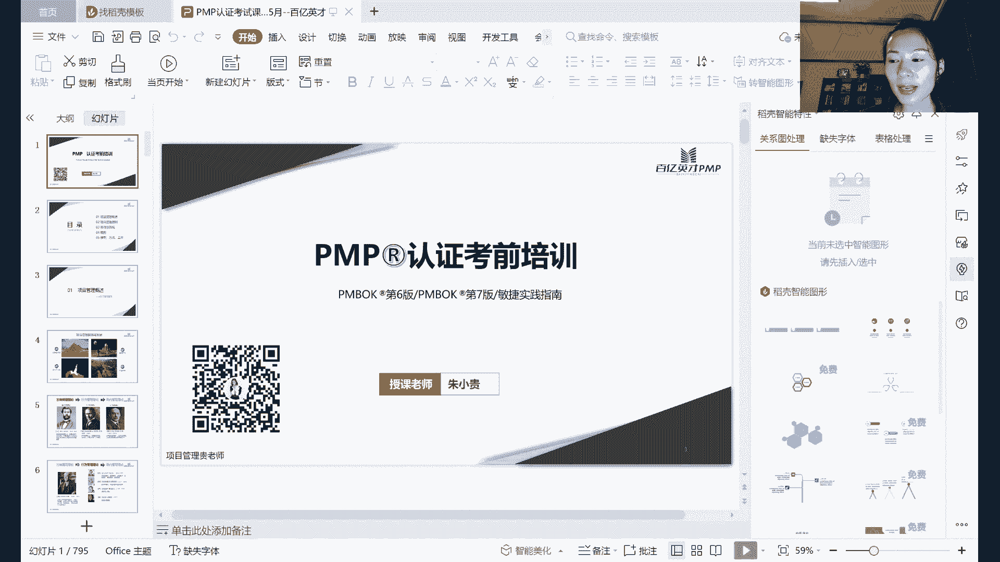

我们正式开始这个今天晚上的课程哈，因为课还比较多，好因为8月份的考试啊，大家都知道我们用的是pmi的新版的教材，就是第七版，但是第七版呢虽然说是我们用的新教材，第六版的教材和敏捷实践指南呢。

它仍然是没有去摒弃，所以我们现在8月份的考试呢，是要相当于是把第六版和第七版，还有敏捷的时间指南一起都把它学掉哈，嗯如果说我们这次参加培训考试的这个同学，之前有了解过这个第六版系统知识的。

那会觉得我们第六版的这个嗯整个知识体系呢，它是非常的相对还是比较完善的，第七版呢就是从整个项目管理的原，则和指导方向上面，高度概括了第六版和敏捷实践指南的一些内容。

那本次考试呢我觉得有一个这个大家的学习，有一个非常好的一个地方哈，就是说嗯我们可以通过第七版的，从上开始从原则开始认识项目管理，然后了解我们做项目管理的过程当中，到底应该遵循哪些方向，哪些原则。

然后呢落到实处，还有我们第六版这么丰富的工具，以及我们冥界时间指南里面，针对于适应性的项目到底应该怎么做，所以它相当于是从原则，从思维到具体的落地的工具和方法都有哈，那本次呢嗯这个认证培训的考试。

整个这个课件的章节，我给大家分了这五个大的模块，这五个大的模块呢，基本上也是按照我们第七版的这个，教材的模块再说，首先第一次的这个第一个模块，也就是，我们今天晚上还会用接近两个小时的时间。

给大家再普及一下项目管理的一些概述，因为还是有一些人就是他没有做过项目管理，或者说呢他自己在工作当中，在目前的职位当中做了项目管理，但是呢对项目管理的整个认识，是相对比较片面的。

那通过今天晚上我们的学习呢，会对他有一个基本的一个认知，项目管理从哪来的，项目管理它是什么，然后我们学的项目管理呢，我们应该具备怎样的能力和素质，然后将来呢我们会有怎样的发展前途，第二个模块呢。

后面是第二节课要讲的项目管理的原则，以及第三个模块的项目绩效率，第四个模块的剪裁啊，裁剪啊，剪裁都ok，就是基于我们学了这么多的工具和方法，那么遇到不同的项目，它在不同的内部环境和外部环境之下。

我们应该怎么样合适的选择我们的工具和方法，那第五个呢就是在这些啊具体的模块，具体的这个知识体系当中，我们会涉及到哪些理论的模型，非常经典的，那具体到哪些工具和方法啊，具体到哪些公建项目文件，就这些哈。

好吧，正式开始，项目管理概述。

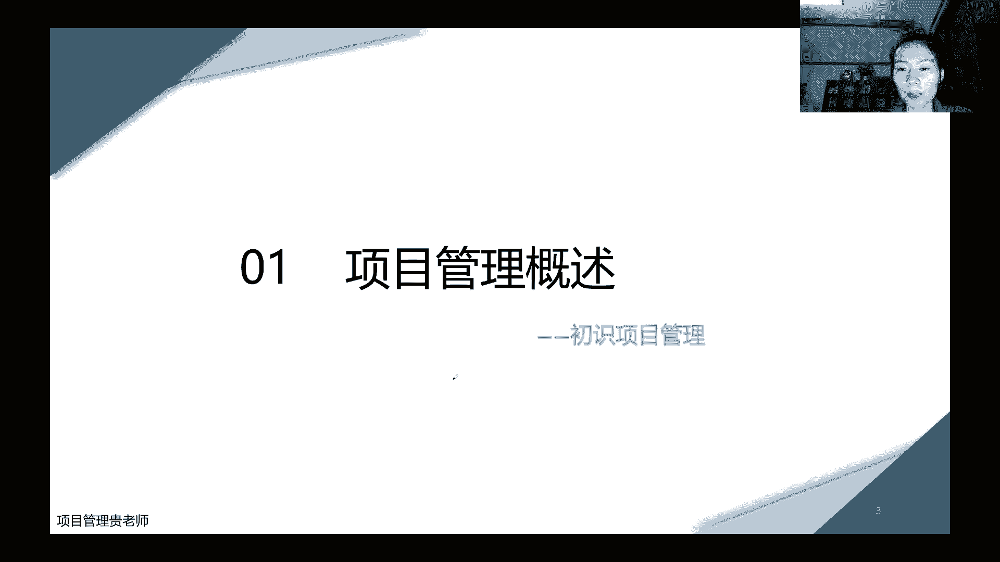

这一章节的目的，就是让大家初步的认识项目管理哈，那么关于项目管理的起源和发展哈，就是这里面的一些图片呢，都是嗯国内外特别著名的这些项目管理的，一些经典的案例，用了项目管理的方式去做的特别好。

当然因为这些就是古建筑哈，时间比较早，那个时候呢我们的项目管理呢，它的发展没有像我们现在这么的完善，没有人去做一些系统的这个知识，理论的这些这个收集汇编，更没有人去做这样整个知识体系的一些普及。

但是呢即使在那么嗯，这个知识比较频繁的一个时代，仍然可以做出我们这么大这么庞大的系统工程，像这个金字塔呀，阿波罗登月，还有这个嗯这个中国的万里长城啊，这些都是特别经典的，拥有一些系统性的一些思维。

做成的这样的一些历史性的，标志性的这样的一些项目，那有些人还可能会觉得哎呀这个项目太大了，好像呢跟我目前的工作现状，从事的这个项目有点嗯关联不上，因为我们可能最多从事的项目可能几百万啊。

或者这个这个合同额上千万，就觉得还是一个比较大的一个项目了，那跟这些经典的历史性的这种项目，肯定没法比哈，但是呢没有关系，我们做项目呢，我们不会去这样横向的比，因为生活当中，生活当中处处接项目。

大大小小的这种大的密室工程师项目，那想到我们比如说这个嗯，要做一个这个调研报告啊，要做一个需求文件，或者是呢我们在生活当中，哪怕是简单的准备一份这个家庭的这个聚会呀，准备一个晚餐呐。

这个都可以用我们项目管理的思维去做哈。

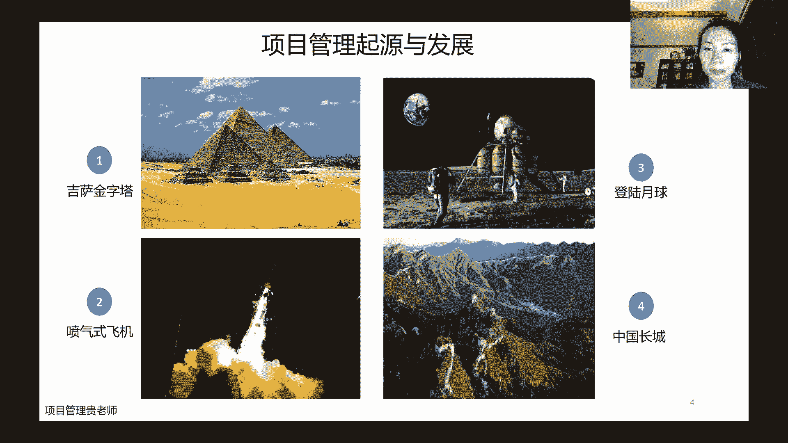

嗯那既然提到项目管理哈，就是我们在讲他的这个项目管理从哪来呢，我觉得作为一个管理者的一个嗯，基本的必备的一个知识哈，基础我觉得大家都知道，项目管理呢它是属于大的管理的范畴，那它到底从哪来。

然后呢又是啊归位是归到哪里的，嗯在这里呢跟大家就是简单的去聊一下，我们整个这个管理学原因，管理很多人会觉得管理这个东西好虚啊，对不对，就是嗯有的人会觉得管理是有这个科学的，是有系统的。

有的人会觉得管理就是管人嘛，那我跟人把关系处好了啊，这个很多事情就好办了，所以呢不同的人对管理呢也有不同的一些看法，当然实际上呢在从理论，从这个学派的研究上面呢，管理它确确实实是分了很多很多的这个学派。

但是从古发展到现在呢，基本上是三个大的这个呃，管理的这个这个节点啊，我觉得大家要知道哈，第一个呢就是啊古典的管理理论，什么意思呢，就是当时的时候大家还是一个这个工业时代，然后那个时候呢。

大家在工厂基本工作就是进工厂嘛，然后当工人，但是当地工人呢我就发现哈，这个管理学家爱研究，爱琢磨，就会发现不同的人呢他做这个工建，有的人他动作很快很精准，有的人呢他动作就很慢。

单位时间之内呢做出来的这个弓箭数量就很低，那怎么办哈，他们就发现诶有一些动作呀，他其实是没有必要的，就像就像就就比如说这个每个老师讲课一样，其实也是可以标准化的，有的老师讲课呢。

他可能这个这个废话比较多，口头禅比较多啊，有的老师呢关键词只说关键词，剩的呢啥也没有，那这些管理学派呢就把这些都当作工人，还在研究，有一些没有必要的一些动作，它其实是浪费时间的，那我们在这个过程当中。

我们能不能提炼出来做这一个弓箭，它必须的手续，必须的工序到底是哪些，然后呢把这个过去标准制化，标准化之后，再给他们全工厂的工人都去做培训，这样就相当于是从个人的一个经验，然后把他的一个看起来。

好像这个行为是不太能标准的，其实是把它标准的，进而标准之后就能够用一些简单的工具取代替，这个是古典管理理论的一些核心的一些精髓哈，那么在古典的管理理论发展了几十年啊。

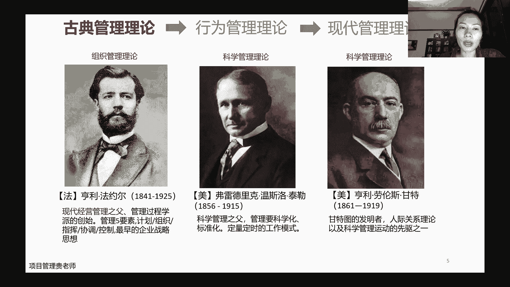

唉这个大家又发现又会有问题啊，因为管理他毕竟管的是热，管的是人，然后管的也是事事儿，是从工序上面去给他做了标准化的，那么人怎么办呢，同样的一个非常标准的一个攻坚的工序，不同的人做起来。

他好像还是效率不一样，那这个时候呢就出现了一个这个第二个哈，比较经典的叫做行为管理理论，什么意思呢，就是这些管理学家又去研究说工序标准化了，有些人呢他心情好，他做得好，他心情不好的时候呢。

他就给你慢点做，今天做的多，明天做的少，是同一个人还能产出，用同样的这个动作还能产出这个效率不一样，所以呢他们就开始研究一些人的行为，对他具体的行动会产生怎么样的一些影响。

那在这个时期呢就流行出来了比较多的一些，这个管理的一些理论哈，嗯一些被我们现在也一直在沿用的马斯洛需求，非常经典的，然后这个双因素理论，然后呢x理论和y理论，还有期望价值理论，这通通的这一系列的理论。

都是在行为管理理论的这个大学派之下，衍生出来的一些细分哈，它的嗯根源呢其实就源自于霍桑效应，霍桑效应，不知道就是大家有没有听说过他的意思，就是说当一个人发现别人，发现他自己被别人关注的时候。

他会刻意的调整自己的行为，那基于这个点呢，唉大家就会想一个办法，那我怎么样去激励我的这些工人，让他在这个工序标准化的基础之上，还能够又开心啊，又效率高的做成这样的一些工序，是这样子啊。

这扩散效应其实用的还是比较多，就比如说嗯这个，比如说我们说你现在在从事一个项目的时候，那你领导跟你说啊，这次项目我们的这个客户啊，嗯对方的项目经理是一个呃，气质非常好的一个美女。

那你去接触这个客户的时候，你是不是每次去的时候都想把自己收整一下，收得整整齐齐的，这样给人的感觉会好一点，然后一听说领导说这个对方就是一个啊，这个刚毕业的什么也不懂的，就就派来这个协助一下项目的。

这样的一个小年轻，那你是不是顿时就会觉得心里面要放松一些，然后有一些这个就可以嗯打油水啦，你就会觉得心里面不会那么那么认真的去对待，甲方的这个对接人，是不是这个是人性哈，那说完了，行为管理理论呢。

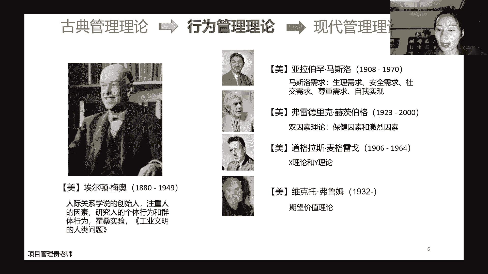

就过渡到我们的这个现代管理理论，那什么现代管理理呢，现代管理理论呢就是从古典的把事儿，把工序标准，把系统把工序结合起来，然后呢再把行为管理理论学派的人的行为，整个结合起来的一个系统。

就叫做现代管理理论哈，现代管理理论下面也有非常非常多的一些，这个各种管理的一些流派，那我们项目管理呢，就是属于现代管理理论里面的，一个细分的一个分支，这样一讲呢大家都知道哈，我们为什么学管理了啊。

管理虽然说大家都认为这个，有人说管理是万金油，有人说管理是科学，有人说管理是艺术，那我们自己学了管理，我们虽然说学的是项目管理，但是我们也是一个管理者，那么作为管理者。

我们知道了这门学科它是呃从哪里来的，然后现在呢是在哪一个这个位置里面去站着哈，这个是大家学了之后要知道的，大姨呃，提到现在的管理理论呢，还有一个这个一本书，是给大家非常非常推荐的哈。

这个是叫德鲁克的桌游成效的管理者，呃，这本书呢我估计应该大家都听过吧，呃或者说这个也有不少人都看过哈，这个时候呢，我觉得至少我每年我都会把它拿出来，再重新的去精读1年，然后去细分一下。

我觉得作为一个任何一个管理者，哪怕你手下就是你的团队当中没有人，你只是自我管理。

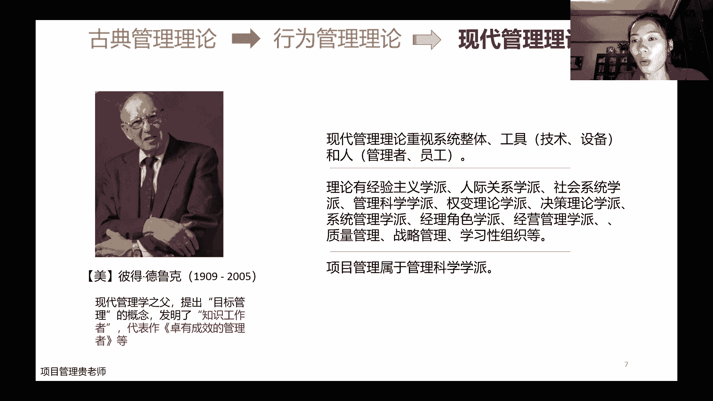

这本书都是非常非常值得去看的哈，那我们再说一下项目管理哈，前面说了管理的他的这个起源和发展和衍生，然后现在呢我们具体来说一下项目管理，它的整个一个发展的一个历程哈。

其实项目管理呢整个它的历史有100多年啊，只不过说呢就是最早的时候，比如说在20年代啊，最最初的时候，1910年代，那个时候呢还不叫说这个什么项目管理啊，他没有说像我们现在一样嗯，大家想学诶。

就有这么多的这个机构，然后再提供这样的课程，大家能够这么方便的，这么快捷的能够学到，不是这样子的，那10年代呢，那个时候其实就有人开始在用一些这个，关键路径法，然后甘特图。

其实我刚刚讲古典那个关键词的时候，甘特也在里边儿，那个时候呢就有点雏形，当然这也都是我们项目管理人员的一个，具体的一两个工具，而遗憾，那么到了30年代了，20世纪30年代呢，那个时候在一些这个国际的。

国防和军工的一些重大工程会用到啊，项目管理的这个一些理论或者是一些方法，一些系统思维，为什么都是在国防和军工啊，因为这些项目比较大，嗯那会不起啊，大家可以简单这样理解哈，他投入的资金很多。

投入的人量也很大，所以呢他承担失败的这个风险啊，其实是这个承受力是比较小的，所以在30年代的时候，你看那个航空，航空业在坐飞机的时候就成立一个组织，成立一个部门，这个部门就叫做项目管理办公室。

这个项目管理的这个办公室呢，它是专门摘监督飞机的整个研制过程，涉及的方方面面到底怎么去弄，那谁来管这个部门呢，他们当时把这些管这个部门的，管这些项目协调的，这些人把它叫做项目工程师啊。

到了这个40年代了，人曼哈顿原子弹计划的时候，就开始用项目管理当中的，李程碑的整个这个思维，因为整个原子弹的计划，当时应该是这个斥资20亿美元，然后周期是3年的时间，然后涉及的人员那是以万来计。

这么大的工程，他用了这个项目管理的一些思维和一些方法，来进行细化和一些协调，然后到50年代的时候，那我们说过啊，之前说的都是项目工程师，到50年代的时候，开始有a项目经理这个词出现了。

所以我们现在说的哈项目经理，就知道是，从上个世纪50年代就有这样的一个职位了啊，就从工程师过渡到了这个经理的这个职位，为什么做这样的一个过渡呢，因为工程师大部分都是跟技术相关的诶，他们就发现管理。

虽然说技术是一个很重要的一个环节哈，但是并不是说它的必要条件，不是说一定要非常精通技术，才能够去做这样的管理，所以呢他把工程施工经理做了一个区分，到了60年代呢，国际上就会有。

就开始有一些项目管理的一些协会呀，一些组织开始成立了，最有代表性的就是国际上面的项目管理协会，叫做i p m a，然后美国呢是pmi，这两个呢是非常这个一直到现在哈，都是统领着这个项目管理发展的。

当地项目管理发展的这个这个组织，所以大家要知道，那同时期呢我们中国做了什么事呢，那数学家华罗庚，他引入了这个嗯统筹法，然后开始在传播，因为统筹也是系统的，统筹的这种思维，他也是项目管理的一个精髓。

那到80年代的时候呢，这个pmi协会就推出来了，说项目管理它真的是很好呀，它用在我的这么重大的工程上面，它可以给我节约时间，可以给我节约资金，那我开始要把这一套这个知识体系，要把它汇编，把它提炼出来。

然后呢进行推广，所以那个时候呢，就出现了pmp的这样的一个认证，所以是从上个世纪80年代就开始了哈，大家知道我们的这个认证，它还是有一定的历史积淀的，有好几十年的时间，到了90年代呢，这个呃呃一。

这个p m p就开始成为这个全球第一个，获得了质量管理体系认证的，这样的一个这个资格的考试，就是从80年代推出，经过短短10年的发展，它已经成为了全球相对来说最有认可的，当然又发展到我们现在哈。

这个p m p的认证考试呢，基本上是项目管理领域里面，含金量最高的一个考试哈，所以大家选择来做这样的一个系统学习，并且呢去做这样的一个认证考试，那我觉得呃至少从事项目和从事项目管理的。

这两条这个职业的路径来说的话，还是非常的嗯明智的一个选择，那当然到了21世纪的时候呢，就是呃我们嗯国家的这个外专局哈，也是把这个美国这么好的一套项目管理的体系，把它引到国内来啊。

让我们中国的这些小伙伴们，也能够比较便捷的接受到这些资质认证的，这个培训和这个认证的一些证书的一些认可，当然同期呢我们这个虽然说自己也推出了，项目管理师的这个认证海，这是中国自己的cp m p。

只不过说呢cp m p它的这个影响力呢，跟跟这两个哈，跟这个国际和这个美国的，都是远远没有办法比的，相反是具体到软件行业，软考嗯还比较出名，做的也还不错，但是呢他没有全行业通用的。

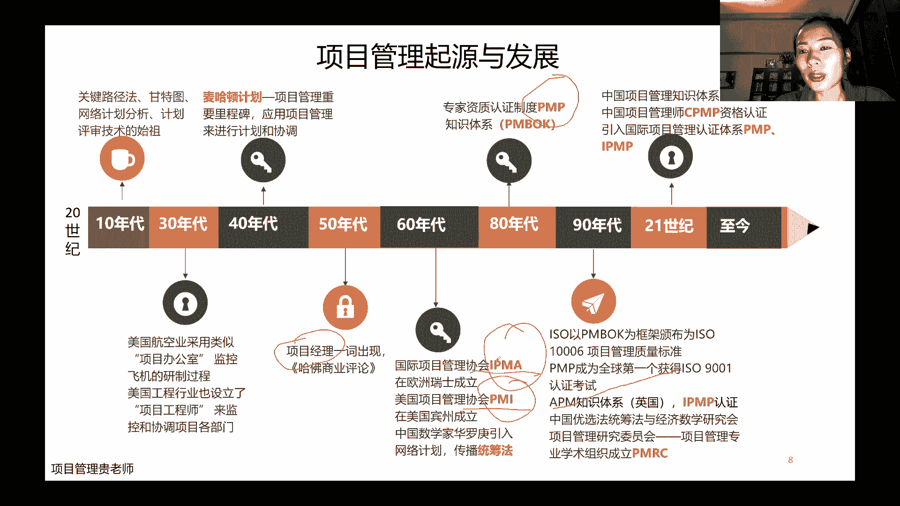

这个项目管理的一个认证，做的是不太好的，那说到这几个认证呢，就是刚刚小结了哈，就是目前主流的啊，以这么四个为主吧，然后第一个呢就是p np啊，就是我们这一次本次要考试的，他现在在全球有190个国家。

都在推这一套体系，每年的考试呢也是四次，咱们今年的8月份呢是啊，就是正常的今年的第三次，那前2年因为疫情呢，很多小伙伴就是考试被一而再再而推，再而三的推，这个是没有办法，但是今年呢疫情的影响小了。

大家还是能够同期的考试，只不过说呢8月份是一个，我觉得是一个非常好的一个节点，因为它启用的新教材，那后面我紧接着会讲这个新教材的一些核心的，一些要点和一些变化，然后再一个呢是p two p two呢。

这个是啊英国推出来的项目管理的一个体系，在国内也能考，然后再一个呢是i p m p，i p m p呢，是国际上面一些比较复杂的，一些大型的这种项目啊，这个推的一些认证体系，cp m p刚刚说了。

就是大家可以啊不去了解cp m p，如果想了解国内的考试，就看一下软考就行了，然后这几个国外的话，这几个p mp啊，这个p图啊，还i p m p啊，这几个项目管理相关的一些认证，它们的区别哈。

pmp考试呢，它更注重的是在一些系统的知识体系和工具，和方法落地实操的这个理论上面，他是教你应该要用什么工具，有哪些工具，有哪些过程，涉及到哪些人员，而p2 呢它是具体在实际的操作上面。

告诉你第一步应该怎么做，第二步应该怎么做啊，这这是一个是理论，一个是实践啊，所以这个这个区别哈，而i p m p呢他有点这个学派，它主要是给比较偏岗位的一些这个技能啊，一些这个认证啊。

然后一些这个呃体积的一些标准，是这样子的一个分布哈，大家也可以选择在顺利的考完pmp之后，去多做一些实践，然后做实践的过程当中也可以去选择这个，把p图也考了，这个都是ok的哈，当然p mp呢再多说一句。

他他除了这个项目管理的认证之外呢，他其实还发现了另外的两个认证，叫做项目级的管理认证和项目组合管理认证哈，就是p gmp，这个还有p f mp这两个认知也都是p m p发剂，p m i发起的。

在国内也都能考这两个呢，嗯当然对比项目管理来说的话，项目管理永远是基础哈，他们两个是在项目管理的基础上面做了，对这个知识。

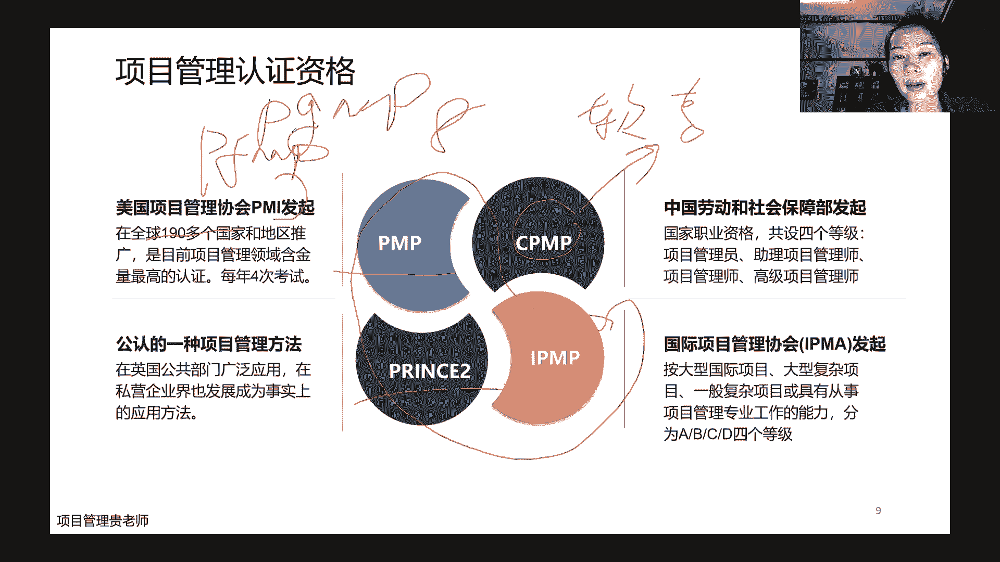

对技能，对经验要求更高的，嗯那关于考这个认证哈，我们前面说它含金量很高，到底有多高了，在国际上面，p m p是个m b a m p a是齐名的哈，在国内呢嗯可能p mp就是一般的嗯。

外企业可能会要求比较多，甚至现在的一些国企也会觉得你做项目管理，做项目经理的话，这个有p m p的证书要好一些，然后甚至有的一些招聘的这个岗位上面，直接写了p m p证书优先，但是在国内呢。

它整个对pmp的这个这个认可度，还是比国外的话要欠缺一点，在美国的时候，在美国啊，人家会说我是一个p m p，然后我是一个doctor，就是我首先是一个p m p专业人士，项目管理专业人士。

然后我还是一个博士，对不对，在国内肯定不会这样说，在国内都是说的哎呀我这个什么什么学校，什么什么博士，什么什么这个这个博士后啊，然后我同时还有这个pmp证书，都是这样，对不对。

那考完p m p的这个呃证书呢，那我在网上给大家找的还是一个比较新的，是去年年底的时候，杭州项目管理的一个平均的一个薪资收入啊，每个月20k到30k这样的一个平均工资，大家可以对标一下。

现在哈嗯比较低的呢，就把这个当作目标，比较高的呢，没关系，反正他这个是一个均值嘛，他这也写了区间有这么多，那项目管理呢，它其实应用的范畴也非常非常广啊，最成熟的就是最早的这个建筑啊。

你看从我们长城修建的时候就有，对不对，建筑呀，通信呀，工程呀，制造呀，包括科研，金融这些都其实是用的项目管理用的非常多的，那适合学的人呢，我们是从技术的，然后小伙伴他要说这个我想系统学一下之后。

我要转做管理岗啊写，然后项目的一些这个助理项目的管理人员来学，然后普通的职能部门的管理人员来学，然后公司的这个项目管理办公室，pmo这样的角色，ok没问题来学啊，所以他是比较适用于这些人来学哈。

那么同时呢呃应该是前不久嗯，应该就是5月份p mi出了一个报告哈，说这个项目管理的人才缺口，报告说从2030年开始呢，全球每年都需要是每年哈，它不是一共的，他每年都需要230万名的项目管理的，这些人才。

那中国呢要超过一半之前的时候，去年前年发了一个报告，是说的是从2027年开始，然后会有8800万项目管理人才的一个缺口，然后今年最新的是每年有230万，这样大家能够对标一下哈。

然后中国的需求呢是超过一半啊，所以我们学了这个前景肯定是有的哈，只要说大家真的是把这个项目管理学到精髓啊，并且呢能够实践能够用得很好，那那一定是不丑的，是为什么呢，因为每一个组织他都需要去实现。

这个就是我们不说组织，不说公司吧，每一个公司他都得有自己的核心的业务，它的业务要做，那就会涉及到一些研发，然后现在业务的过程当中呢，他如果说要做一些更新，那他要研发就是要创造一些新的一些项目出来。

他没有项目就不会有创新，就不会有更好的一些收入体系，不会有收入体系呢，那公司的盈利就很就很危险啊，那公司就发展不起来，对不对，所以项目在一个公司里面，他一定是有至关重要的一个地位，那所以所有的老板。

所有的管理者肯定都想一个优秀的项目经理，那一定是他整个公司的这个核心和支撑，对不对，所以大家小伙伴们，一定要对我们自己所学的这门知识，和自己本人的这些技能要有充足的自信，那关于持证的人数，我们前面说了。

从p m p认证的这个资质开始发起啊，一直到现在有30多年的时间，那这30多年的时间，全球的这个持证人数也是逐年在增多哈，到去年年底的时候呢，全球的持证人数是突破了130万人啊。

这个人呢我们单独看130万还挺多，挺壮观，但是你放在全球的这个人的这个基数来看，那还是比较少有的一拨人，中国大陆呢是超过了嗯，现在应该是接近50人哈，然后报考量报考量的这个你看这个比较有意思。

从18年每年他有四次是加在一起，是10万人次左右，19年呢是14万，他整个基本上是这样在增长，然后到2021年的6月，就是前年的6月，那还是疫情期间哈，光6月一个单四。

他就有这个14万的这个人是这么多人去报哈，所以呢我们前面讲了项目管理，它的发展势头很猛，前景也非常大，项目管理的人才缺口也这么大，我们知道今天我跟大家讲了，然后大家就听得到了，就知道了这样的一个趋势。

当然别人也都知道啊，所以现在报考的人数呢也是这个越来越多，所以我们有竞争啊，当然有竞争也就有动力，然后关于这个篇博客指南呢，嗯为什么说偏p m i的这个这一套知识体系，它是全球发展的最好。

然后它的认证体系也是在全球，190多个国家都在用，为什么呢，为什么他能够做到，那为什么同意我们自己国家的这个cp m p，它就影响力就就很小的啊，就是没有pmi的做的这么好呢。

那是因为tmi的这个知识体系，它几乎每4年的时候都会去根据社会环境，国际形势啊，项目的这些复杂性，和项目那些演进去更新它的知识体系哈，它并不是说我最早的哎呀这个偏不我一发行，我夸过夸我用个几十年。

不是这样子的哈，他基本上每4年都要更新一次，那目前而言呢第六版啊，你看看他的页数，从从400多页，500多页，700多页，他这个发展体系呢从发展到第六版开始，它其实整个的这个框架是没有太大的变化的。

到第六版的时候就是啊五个过程组，然后十大知识领域，这已经是非常非常完善了，包括到现在的偏方，官方都承认，这个第六版是项目管理当中的，知识体系的一个经典嗯，所以他有这么多页啊，它非常完善。

那第七版呢它不再是说哎呀，我把这个过程组再完善一下，把这是领域的这个子过程再给他这个完善一下，他不是这样子的，它是从整个结构上面去把五个过程组合。

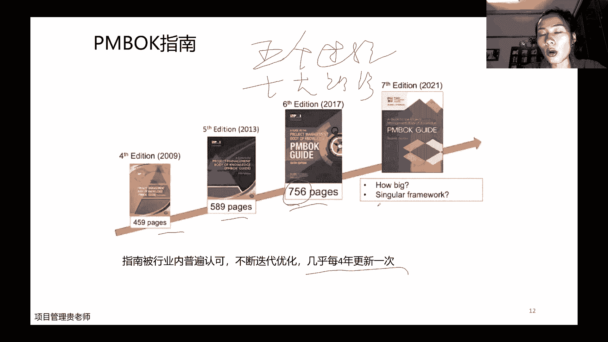

十大知识领域全部都颠覆了哈，可以看一下，原来第六版的时候，我们说的知识领域是这十个，哪十个呢，首先项目整合，因为我们项目涉及到方方面面，人啊，财呀物呀，进度啊，成本啊，质量啊，这么多方面。

我们应该怎么样去系统的去把它这个统筹起来，然后第二个呢这个范围怎么管进度成本啊，这个项目t3 角，然后呢项目质量怎么控制，项目的资源怎么协调，项目当中如何去沟通啊，项目当中的风险，如何去反控。

项目的采购，如何去规范，去合规项目的干系人啊，如何去引导，如何去管理，是这个是十大知识领域啊，然后项目管理的标准呢，它是按照五大过程组，就是项目从启动开始要做哪些工作，规划要做哪些工作。

执行要做哪些工作，监控要做哪些工，作，收尾要做哪些工作，是按照这样的一个框架在做的哈，那么在第六版的知识体系下面呢，项目经理就学了，学了这个知识之后，那要掌握的首先是这个五个大的过程组。

里面有49个子过程，这49个子过程是怎么回事，他要输入哪些条件，它输出哪些条，输出哪些工具，然后输出什么东西，在这个输入和输出之间呢，它要用到哪些工具和方法，所以呢这种项目呢它比较适合的。

就是最开始我项目要做什么，也就是说我项目做的范围啊，这个进度成本基本上都是确定的一些预测性的，这种项目，是比较适合用第六版的这个知识体系去做的，而这个时候呢，我们项目经理需要在既定的框好的。

这个项目框架之内换位质量成本都是什么，把规划做好，然后引导者项目呢，尽可能的按照我们的计划去做，那如果出现了变化之后呢，怎么去变更啊，啊怎么去防控啊，是对项目经理是这样的一个要求，那到第七版呢。

啊也是这个基于整个这个3年大疫情，黑天鹅这样的事件，就发现有些东西啊，它其实啊确确实实是计划赶不上变化，而且是完完全全没有办法去掌控的，需求变了，复杂度变了，这个时候呢那项目的它的价值也就变了。

原来是说我们项目要做出一个可交付成果出来，现在呢是说我们做项目要有价值，那这个价值就不一定是可交付成果了，那基于这种环境的变化呢，啊这是第一个大的这个这个方面哈，第二个方面呢是说，那我们项目经理。

他不可能说，这个只是在既定的框架之内完成他的工作啊，虽然说在既定的框架之内也很难啊，这个背锅侠也是我们项目经理啊，这个委屈也都是我们项目经理在说的，那波兰项目经理一直是这样的一个状态呀。

我们项目经理自己也要发展，对不对，自己也要往这个更高的知识这个呃这个层面啊，然后呢，更高的职位上面去谋求，我们自己的一些职业的生涯，那怎么办呢，从又基于这个第一方和第二方面的原因，加在一块。

所以呢第七版哈，你看它的知识体系，首先是项目管理的原则，然后呢是项目管理的这个知识体系，原则呢就有这个管家式的管理啊，这个等等等等12个原则，我下一节课的时候跟大家具体的去讲，这12个原则是什么哈。

因为首先告诉大家，做项目不是完完全全这一种方法，也不是完完全全只有预测性的项目啊，不完完全全是这样子的，那我们首先要知道项目是什么样的原则，原则之下，再选择我们具体适合我们项目的处理，管理的方法。

那在这个原则之下，我们它的知识体系呢是不再是十大知识领域了，而现在呢变成了我们的八大技效率，大家会觉得哎呀这个该新人啊，团队啊，开发方法规划项目工作交付啊，有些人会担心哎，那我第七版学了之后。

那我那我是不是这个就是第六版的这些工具呀，方法呀，涉及不到的，不是这样子的哈，第七版的整个这个书啊，整个这个书呢他不会说是特别的这个厚，它只有200多页，但是呢，它确确实实是把我们的这个预测性的方法呀。

然后这个敏捷的这种项目呀，包括一些混合的项目的，所有的这个嗯能够用的方法工具，它都高度的去概括了哈，所以我们学的时候呢从上往下啊，那我看到评论区刚好有个朋友，这个有个小伙伴说这节课是把预告再讲一遍啊。

不是哈，预告呢是跟是给大家讲的前半部分，因为我刚问的时候，就是不是说所有的人都把预告看了，所以我前面的这一部分理论呢我还是得讲哈，那这节课的这个后半部分呢是讲啊，项目运营和项目的这个价值体系。

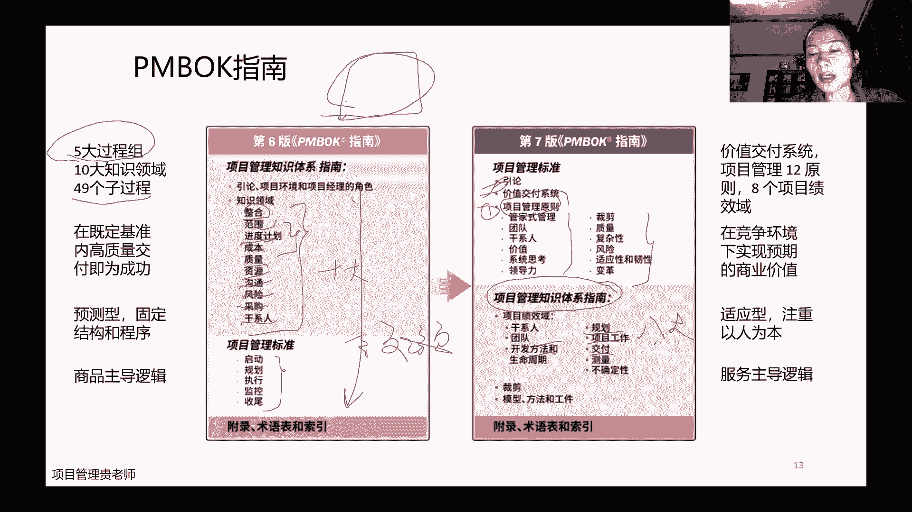

价值交付哈，啊推荐的书呢就是前面说了三宝600 700，敏捷石阶指南，大家嗯如果说只是为了考试的话，基本上看课件，然后听我讲就ok了哈，当然课件呢今天发出来的时候，也和小伙伴在这个群里面说哈。

说这个水印比较大，这个呢也请大家理解一下哈，因为嗯8月份是首次用我们的这个新版的教材，那目前呢在我们的老师这个圈子里面，这个教材的知识产权还是比较重要，嗯所以呢再就是大家就是稍微克服一下哈。

多看两遍可能就适应了，然后如果说实在觉得看电子版比较别扭的，可以联系我们的，教我去啊，这个要这个纸质版的课件，纸质版的课件没有关系，因为电子版的传播起来它的成本啊太小啊，所以呢这个泄露的风险太大哈。

所以这里也跟大家这个要解释一下，也请各位小伙伴能够理解哈，那关于备考的几点建议呢，就是这个啊书怎么读，我听我讲课件啊，然后呢再看看书做补充，然后对大家的一个要求呢，就是从我们的预测型。

要适应性到混合性的这些生命周期都要会用，因为我们考试的时候就是考预测，考试应啊适应就是我们说的这个敏捷哈，然后靠混合，所以呢这几种生命周期的这个方法，大家都得掌握，至于生命周期到底是什么。

然后包括呢这个不同的生命周期，有小伙伴他可能不太熟悉的，他得有什么区别啊，这个我们在后面的课程的时候都会讲到哈，那对家大家对大家的期望呢，就是说希望大家在学的这个过程当中啊，能够去实践，能够去应用啊。

就是有人会说我正好我运气比较好，我现在就是在做项目管理，那太好了，你把你平时生活当中做的项目管理，结合我们课堂上面讲的这些理论，讲的这些方法和工具，看看能不能有新的一些收获啊。

你这样学起来肯定是这个这个印象更深的，那有些人呢觉得诶，我现在我是技术转项目管理的，我还没有做这个项目管理，没有实际的经验啊，那也没有关系哈，没有关系，就是我们刚刚说了哈，你哪怕是生活当中做一顿饭。

安排一个约会啊，安排一次旅游啊，这个都是项目，也可以用我们的这个项目的这个方法去实践，去运用哈，那考试的这个内容呢啊这个人员要考，因为项目涉及到各种各样的人，项目经理是人，项目团队是人啊。

项目当中的这个管项目的这个领导是人，项目当职能部门配合的是人啊，我们的客户干系人，就是涉及到的这些利益相关方都是人，那人怎么管啊，这个是占了非常大的一个比重，第二个呢是这个过程。

我们说了项目有从启动到规划啊，到项目实际执行的过程当中，到项目的如何去监控，如何去测量项目的收尾的过程当中呢，嗯如何去更好的去冻结，去复盘啊，这个是非常重要的，那你看这个两个加在一起。

92%的这个比例了，然后业务环境啊，项目如何去合规啊，在这个这么多变的环境之下，然后如何去发现对组织，对公司对项目比较好的一些内容，比较好的一些这个变更，然后呢我们怎么样在组织里。

在公司里面去把这个好的新的方法去用，去适应，去推行这个变革哈，这是讲的业务环境，那整个考试呢是180题，230分钟，这180个题当中有五个是属于预测型的，这个就是它它是测试型的问题哈。

就是随机会抽每个试卷了五个五个，那个问题是不计分数的，也就它真正计分的是150个，然后大家算一算，150个乘一个60%，大概是105个，所以后面啊大家做题的时候，保证每道题至少是105以上的这个正确率。

这个105题做做正确的，这样的一个这个这个这个呃效率啊或证据链啊，就基本上问题不是特别大哈，啊这个谨慎原则呢今天晚上先不讲哈，这个后面大家做练习题的时候，再跟大家具体去发现，去去去讲这个嗯。

那进入到这个项目哈本身那什么是项目呢，项目我们说了，项目是为创造独特的产品，服务或者成果而进行的民事性的工作，这是我们之前600对项目的定义哈，就是我们项目他一定是要做出产品或者服务，或者是乘过来。

然后呢并且呢它是这个临时性的，也就是说我们有这个啊有开始有结束，哪怕是这个项目他很他的快的周期，虽然有点长，3年的时间，那也是有开始有结束，这个我们也叫做临时哈，然后第二个呢是独特，独特呢是每一个项目。

它一定是之前，就是哪怕是只有一个细节跟之前不一样，也叫做一个新的项目哈，但是如果说所有的东西，都跟我们之前做过的工作啊，就是如果说都是一模一样的话，那它就不叫项目，对不对，因为项目它必须要是独特的。

它是从这个从从这个状态，然后有变革有过渡过渡到另外一个状态，这个才叫项目，那既然它有变化哈，从一变到了一点或者1。1这样子，既然它有变化，那中间就有很多的不可控的因素，不可控的因素呢。

那只能随着我们的项目的进展过程当中，这些不可控制的因素了，就越来越清晰啊，我们越来越知道怎么样去这个这个项目的风险，项目的假设性的条件呢到底是什么，那可将复物呢很好理解。

就是我们具体的它的产品是什么结果，服务能力这个虚的实的都ok，他都叫做可教服务，而成果呢就是说我们的这个输出和弓箭啊，比如说我今天晚上讲完了之后，大家如果说有做笔记的，你的笔记就是咱们今天晚上。

这个课程的一个输出啊，我们做项目的这个做需求调研，做了一个这个初步的这个需求文件，或者是定稿之后呢，项目的需求评审之后的这个正式的需求文件，这个也叫做成果哈，那么什么是产品呢。

产品呢是说我们可以量化生产出来的这个工具，这弓箭呢可以是有形的啊，一个杯子，一瓶水，一个鼠标，也可以是无形的啊，这个只要是能够量化生产的，我的比如说我的这个做咨询啊，做知识，做知识，经济知识服务的。

但是我能够量化是哪，这个也叫做我的产品哈，那第七版呢对项目的利益，它不再是说嗯，他不再是说这个我的这个可教父是什么呢，而是说我要能够持续地实现我的这个商业价值，那商业价值呢。

也就是说我这个东西我不一定是可交付，我也不一定是说这个一定赚出来钱了啊，哪怕我这个项目是失败的嗯就是从理论上面哈，就是从大家通常意义上面理解上面是失败了，亏钱了，但是呢我这个为组织吸取了经验教训啊。

他也实现了他自己的一个价值所在哈，这个是第七版的对项目的一个定义，重要的是价值，嗯这里呢给大家列了几个项目，大家可以自己去思考思考哈，他到底教不教我们的一个项目，投资性的项目嗯，有没有啊。

不知道大家有没有做这个投资行业的哈，我们投资行业呢一般嗯投下去的这个十个项目，如果说有一个项目能够有比较预期的，比较可观的一些回报，那整个这个对公司来说嗯，他的这一笔整个的一个资金投下去。

就是非常有价值的，那么另外九个你能说啊，它没有价值，它没有产生这个回报，他所以他不叫项目，能够这样说吗，不能啊，因为另外九个有他的失败的一个，基础的一个积淀，所以呢才有可能有第十个项目的这样的一个成。

功，好剪纸啊，做饭公益活动，当然按照我的理解都可以叫做项目，大家如果说有不同的想法，也可以去探讨哈，那什么是运营呢，因为有担心哈，就是大家都说哎呀，那都去做项目了，项目做好了怎么办呢。

因为我们项目最终是要交付的呀，他是临时性的呀，他结束了之后，这个东西它转成了一个这个啊，业务型的一个运营，那怎么办呢，那什么是运营呢，运营就是说开展的重复性的，周二复始的持续性的这些动作叫做运营。

有些人就会讲哈，那完了完了，我是做运营的，哎我怎么我我有没有必要学项目管理呢，或者说我是不是这个就意味着我的工作类型，就是按部就班啊，就是毫无创新，就是这样去动的，不是的哈，为什么呢。

因为我们只有在运营的过程当中，他才能够去市场上面接受真正的检验，检验了之后才能知道诶，你在市场上面嗯，到底会有什么样的一些提升的一些建议，你的用户呢到底对你这个东西买不买单，基于这些建议呢。

我们又会产生一些这个呃优化一些项目出来啊，我们比如说推出了一款软件，诶，这个市场的这个用户注册用户越来越多，哎用户用了一段时间发现之后这功能太简单了，或者这个这个bug太多了。

那是不是再增加一点功能可能会更好呀，那新的项目不就野生了吗，为了增加这个新的功能，要做新的这个项目，要做完了之后，我们又推向市场啊，推向市场之后呢，市场又会给你提供一些比较好的一些反馈。

所以它是一个循环的一个系统，运营非常重要，项目也非常重要哈，所以对做运营的这个小伙伴，哪怕你是做这个职能部门的，也不要轻易的妄自菲薄，觉得自己做的工作好像没有什么创新性，没有什么价值，不要这样去想。

那关于项目和运营的这个啊不同点呢，其实就是把项目一次性的临时性的，而运营呢持续不断重复性的项目，基本上都是创新的，因为它很独特，而运营呢就是基于这个创新之后的成果去经营。

项目的工作环境呢比较的这个相对的开放，也有非常多的一些不确定性，反而运营的工作环境相对比较封闭，比较稳定，那项目本身涉及到人呢，除了项目经理，项目团队，然后还有一些咱们这个项目的这个组织体系。

可能时时不时的变化，不同的项目，大的项目小项目，那肯定涉及到人员和他的这个组织不太一样，原则上面来说呢，项目越复杂，它可能它的这个整个项目的组织是更加的庞大，但是运营呢一般就是我们说的职能经理啊。

然后运营经理啊，产品线啊，这些涉及到人都是这些，它的组织结构呢一般相对而言是比较稳固的，那创造价值啊，我的预习课呢嗯大家有看到，应该是讲到创造价值，我就没有讲了，那今天要接着继续讲哈。

我们前面说了第七版，因为项目的定义呢是要能够嗯，为组织实现一些商业价值，那什么是价值呢，价值它指的是某一个事情，某一个事件啊，它的作用，它的重要性，它的实用性到底是什么哈，那既然提到的价值，价值多虚啊。

对不对，可教父我看得见，我即使摸不着，它是一个无形的东西，但是呢我也有标准去定义它，但是价值怎么定义呢，不同的人看待这个价值，那肯定是不一样的，那我们呢啊这个给大家列了这么几条哈。

首先平常能够满足我们的这个呃，客户或者是最终用户吧，不管是我们基于客户的需求在做这个项目，还是说我们自己这个研发了一款新的这个app，新的一个产品，那你需要的这个产品服务和成果诶，这个是基础的对吧。

你这个是一部分的价值，那还有一种呢，比如说我做公益的项目，我给这个社会或者环境我做了贡献，然后我这个项目是就是，当然这种项目，通常可能这个嗯比较大型的一些企业哈，或者是一些政府机构啊做的这种这种活动啊。

或者是推行的一些举措啊，唉他们可能主要是基于这个据这个城市本身啊，对这个社会环境本身他是不盈利的，不赚钱的，但是呢他对于社会效益比较大啊，这个也是非常好的一个价值，它是社会价值。

那么还有一个呢是a我在组织内，我在公司内部我做了一个改革啊，做了一个这个引入了一个新的，一个这个自动化的一个工具啊，啊，引入了一个就是优化了一个新的这个工艺流程，那现在呢我整个这个公司的它的生产的效率。

它的这个生产力提升了啊，虽然我花了钱，好像这个提升的效率是很久才能见效果，但是呢我确确实实最后有数据来比对啊，这个也是价值，那再一个呢这个推动了必要的变革，然后在这组织原来是哎。

比如说这个大家的这个团队文化呀，还不是特别的这个明确力，不是特别的强，不是特别的团结诶，我做了一些这个项目那些举措，比如说我搞了很多很多的团建啊，然后我搞了一些培训呢，还我去激发了公司的这个人。

大家想一块做一点事情，一块呢不浪费青春啊，不浪费我们生命的这些举措诶，做完了之后，大家的团队凝聚力加强了，提高了啊，自然而然的大家在一起的这个相处更愉快，by sha，做项目的这个成功率就更大。

这个也叫做我做的这些举措，也叫做我实现了它的价值，然后呢还在乎这一种哈，我能够啊，再比如说啊，疫情期间，大部分的企业啊，大部分的中小企业他基本上都是亏损的，但是呢我在这么恶劣的环境下面，我做了一些举措。

让我的这个公司还能够啊，保持以前的这个盈利的状态啊，我的业务仍然能够有收入诶，这个也叫做我实现的价值哈，所以说呢价值它的含钙量，它的定义，它背后的东西是非常的多的，这也就是说第七版它其实并不仅仅是说诶。

我们前面做这一部分啊，做产品，做服务，做成果，做结果的这些项目的管理人员才需要学，而是说，但凡是我在带领着一个打引号的这个项目啊，我在带着这样的一帮团队在做的时候，我其实看看第七版我都是有收获的哈。

那么啊为了实现更好的实现这些价值呢，我们啊说要这个价值交付系统，价值交付系统是什么意思呢，啊这里有一张图，基本上是每一个这个组织体系啊，公司也好啊，这个公益机构也好，民非组织政府机构都好哈。

基本上遵循的都是这样的一套，这个价值交付系统，首先有外部的环境，什么是外部的环境呢，啊比如说我们做一个这个新的产品或者业务，他外面有没有这个啊法律政策的一些要求啊，啊有没有这个市场的一些这个规则呀。

定义呀，啊这是我们外部环境如何去影响内部环境呢，就是在我们的这个内部哈，组织内部，公司内部，机构内部内部，它的这个文化是怎么样子的啊，它的制度管理体系是什么样子的，这些呢都是影响着我们整个这个项目。

项目组合如何去推进，那么我们有单个的项目啊，有这个比较有关联性的一组项目项目集，还有呢为了实现组织的一些战略，去优化出来的一些项目组合，整整这个打这个大的这个打包啊，打包出来的项目。

然后在内外部环境的这个协调控制监控制下，创作出来的价值，然后这些价值的转而去支撑我们的这个运营哈，这是我们整个从这个呃这个这个价值交付体系，从内部外部环境，然后过渡到这个项目的组合，项目的几项目。

然后转到运营，进而让能够实现我们整个组织的，它的一个这个整体的战略，然后在这个过程当中呢，它的一个这个信息流哈，就是说我们说了这个一个组织，一个机构它的占领到底是怎么样诶。

就变成了运营呢啊我们说战略的时候，因为战略都是非常高层面的，一般的人呢他可能还接触不到啊，都是感觉哎都是这个公司的股东啊，公司的这个总经理啊，董事长啊，就把证据定好了，那到我们这儿呢。

可能就是具体的一个一个的这个项目，然后呢职位再高一点，经验再丰富一点呢，我做的就是项目级的管理，或者是项目组合的管理，那战略到底如何去变道运营呢，它整个是这样的一个流程哈，这个呃这个无可厚非。

也都是这个没有什么质疑的哈，那有了战略之后呢，为了服务好啊，为了支撑这个组织的战略，所以呢会出现一系列的项目的组合啊，这个项目的组合到底是什么，后面我紧接着马上会讲到哈，那有了项目的组合之后呢。

就是其中啊这个项目组合里面，它可能涉及的项目的面比较广啊，我一个公司我是做这个数字经济的啊，这个或者做智慧城市的，那我的项目组合唯一方面啊，我我我去服务这个这个比如说啊服务校园。

那我做的是这个智慧校园啊，唯一方面我去服务这个园区啊，我走的也是这个这个智慧园区，然后往大了说智慧城市，这都是我不同的项目组合，那么项目组合呢是为了服务这个数字经济啊，或者这个智慧经济我要做的一些事情。

那么到项目给予项目呢，就是说比如说我做智慧校园的时候，哎这个组合体系下面，然后我为了更好的做好智慧教育啊，那我是不是比如说啊，有一些这个电子的智慧屏啊，然后有一些这个啊辅助的这个校园的。

这个教务管理系统的啊，或者是这个学员的学习，这个这个管理的这个系统啊，软硬件我是不是都得具备啊，我是不是我我得去研发吧对吧，所以呢它是这个有关联的这样的一组这个，项目集。

去支撑我的这一个项目组合这样的一个群体，那么这些东西研发出来之后呢，我就招了一些啊销售人员呐，市场人员呐，确保我的这个产品往具体的这个学校去推广啊，他是这样的一条路径推广的这个过程。

他就其实是已经是在运营的销售部门啊，然后包括这个后台支撑的呀，去做这个软件部署的呀，啊这个这个硬件啊，假如我们去去外包给一个工厂啊，那我们每次的这个涉及到的一些采购人员，去采购这些硬件的时候。

这些通通都叫做我们的这个运营哈，所以这样站着一条线，大家理解了，那么反对一条线呢，就是从运营我们前面讲的运营，它一定是啊就是会衍生出来一些新的一些项目，因为运营的过程当中会发现问题在什么地方。

知道了问题在什么地方，就会知道我们的提升点啊，我们的进步点啊，我们的这个需求点会在哪些地方，那么针对原来的这些产品体系出来之后，哎我们做一些调整，做一些更新，那为了做好这样的一些更新呢。

那比如说我们前面讲的智慧校园的这样的一个，这个案例哈，那这位校园我原来呢啊，在这个我可能是软硬件加在一起，然后但是在运营的过程当中呢，我发现哎这个运气啊原来是我啊这个找采购的，找我的供应商去采购。

然后软件呢是我自己去开发的，但是呢在这个过程当中的文化推荐这个硬件呢，他可能他的这个这个利润率太低了，基本上大头利润也就给了这个厂家，然后呢我自己在中间呢，其实就是过一到手我也没有太多利润。

那硬件这一部分，我是不是就是渐渐的减少它的一些比重啊，然后甚至是软件呢，我在具体的这个学校的，在部署在应用的过程当中啊，不同的这个学校，他可能是不是提出来一些新的一些想法啊，新的一些优化。

那我为了达成这样的达，达成他们的一些这个新的一些功能的一些需求，那我做了项目集和项目的这个，新的一些项目出来，然后这些项目呢啊进而这个又变成项目组合，然后项目组合呢在渐渐的去调整我们的战略哈。

比如说我们全面定了一个重点，因为还不太了解市场的时候，我们就说哎呀这个要做好这个数字经济，然后以这个智慧校园为我们的核心业务，然后做这个软件一体的这个解决方案啊，现在我们调整了这个战略啊。

说我们做专业的这个智慧校园，叫做这个啊专注于软件的啊，这个这个呃智能解决方案就是不包括硬件的，这个就是战略的一个调整哈，所以它是正向和反向，大家都知道他是一个什么样的一个流程，那在这个过程当中呢。

就是为什么大家这个要学项目管理，项目管理，他其实他标准的定义，就是说要我们把所学的知识啊啊这个技能啊，工具啊，要在我们的项目的活动当中去运用，进而能够更好的满足我们的项目的要求，那有些人就说哈。

那我不学项目管理，我能不能做项目管理呢，当然可以哈，当然可以，但是呢啊没有接受过系统的学习，能够把项目管好的这些人呢啊毕竟从概率上讲，它是一个少部分的一个群体哈，所以呢嗯学了它项目管理呢。

是不是就一定能够把项目管理的好呢，当然也不是哈，因为我们说知识呢，它跟我们实践只是说是一个指导一个方向，大家只有把我们自己所学的知识，跟我们实际的这个项目活动当中去，把它更好的去结合啊，结合之后呢。

这个时候才能说我把知识去运用了，我把知识它的效益发挥到最大了，那好的这个项目管理哈，有效的项目管理呢，它能够更好的辅助我们达成我们的业务目标，能够更好地满足我们的项目相关方诶。

他期望我们达到的这些这个需求点，然后呢我项目整个这个成功率啊要提高，并且呢我能够在合适的时间，以合适的成本交付出来的东西，非常符合客户会，或者说非常符合这个用户的一些需求啊，产品很好很棒。

并且呢我在项目的过程当中，肯定会有多多少少的，肯定会有大大小小各种各样的问题，对不对，因为我们说项目是独特的嘛，那既然我在这个项目过程当中，唉，我遇到问题我是怎么解决的啊，这个有一些争议的。

我是怎么样去协调的，有一些风险我是怎么去防控的，然后呢我是用了十个人完成这样的一个项目，达到达到这个比较好的效果，还是我用了100个人才达到这样的效果，优化组织资源的使用，然后呢我在过程当中啊。

我意识到这个项目可能有一个比较大的风险啊，我怎么样去这个去做了一些措施，把这个风险去尽量的影响减少到最低啊，或者说呢这个风险他的我就做了一些措施，让这个风险就避免了，就不发生了啊。

这个就比较考验项目管理的一个水平了，包括就是大家可能通常会遇到的，就是客户不断的在变，不断的在提今儿的一个需求，明天一个需求，哎呀这个这个嗯计划赶不上变化呀，那怎么办。

我们以什么样更好的方式去引导我们的客户，或者去管理我们的这些变更，这是我们做了项目管理，学了项目管理之后，要争取给自己立的一个最基本的一个要求哈，那如果说项目管理管理的不好呢。

啊可能最明显的这个时间超了呀，成本超了呀，唉质量不合格，或者说质量比较差，然后甚至呢反攻，然后呢范围呢不断的扩客户，让做啥就做啥，不得已又不敢得罪甲方，或者是在这个过程当中，甲方的要求比较苛刻。

经常去半夜加班诶，跟甲方一吵架，客户从此把你拉黑了，你以后这公司再也接不到他的活了，组织的生意受损了啊，或者说你这个所涉及到的这个直属领导，对你们干活的效率，对整个团队不太满意啊，这个就是项目管理。

典型的项目管理没做好啊，那就好就会遇到这样的一些这个这个后果哈，这个后果严不严重嗯，那要看我们怎么理解啊，你严重的这个你就觉得哎我大不了我辞职，我不干了，对不对，我换个公司。

这样可能找到一份哎薪资还不错的工作，但是对于组织来说，公司来说，公司就惨了呀，那公司你走了，拍拍屁股走人了，公司怎么办呢，公司得给得给咱们都所有的成本，对不对，所以作为一个项目管理的一个人员哈。

项目经理不管是我们是在哪里，在哪个公司嗯，基本的项目管理的人员的这个素质可以有哈，既然我们自己做的项目，那首先我们为组织带来什么，然后其次呢我们做这个项目的时候啊，为这个团队，为项目的团队啊带来什么。

在最后呢做这个项目做完了之后，我们自己能够收获，去收获什么，能够提升什么哈，那项目及前面讲到了项目集是什么，是项目级呢，这个嗯有可能考试会考到哈，项目级呢就是说是一组比较有这个相互之间。

项目和项目之间它是有关联的啊，这样的一个这个项目的一个集合体，它其实跟我们项目的这个分界点哈，在实际的操作过程当中，它的分界点项目是相对而言它的啊，这个项目是相对而言它的嗯，这个框架还是比较明确的。

就叫就当做项目去做，但是有一些呢，我们可能只有一个模模糊糊的方向，在这个方向之下呢，我们有可能做很多个项目才能够实现这个方向，那这个时候呢，我们更适合的方法就是项目级的管理哈，所以他的观点。

他的关键词如果说考试考的话，就是项目和项目之间相互关联，相互协调，那什么是项目组合呢，项目组合呢是啊，因为任何一个公司它嗯资金肯定是有限的哈，这个大家很好理解，对不对，他不可能说所有的项目都要去做。

必定要在所有的项目当中有所取舍，嗯这个就跟我们啊自己做投资一样哈，就做股票的时候，大家也会想这支股票很好，想买那只股票也觉得很好，想买，但是子弹有限呀，那我们得选择一个最优的这个标的物，对不对。

公司也是一样的，要选择一种最优的这个项目组合哈，所以呢嗯就是这些项目和项目之间的，它它不一定是相互关联的，这个项目及刚好是相反的哈，项目组合呢是说选择它是要排序，比如说我排了之后，我先做a项目。

然后我再做b项目，或者a和b同时做，然后我c项目啊，先不管资金不够了，资源不够了，我先往后置哈，所以它的关键词呢是啊这个要有优先级，也比较好理解哈，然后啊产品的生命周期，产品的生命周期呢。

嗯任何一个产品哈，它的生命周期呢就是都分了四个大的阶段，因为我们前面说了哈，你从价值交付体系过渡到最后，这个项目完成了啊，这种出来的东西它都是产品啊，对不对，有形的无形的都ok啊，因为你要运营。

你要做业务啊，那你就有产品啊，你既然有产品的话，那它就有产品的生命周期，所以呢产品的周生命周期呢它有四个阶段，第一个引进阶段，我们也可以把它叫做这个这个投入期哈，然后第二个阶段成长期。

第三个阶段呢是成熟期，第四个阶段呢是这个衰退期嗯，怎么样去理解呢，在任何一个项目最开始的时候啊，比如说我发现了市场上有一个需求诶，嗯就就比如说这个啊，这个现在家政服务业哈很火嗯。

大家就觉得现在越来越多的九零后啊，甚至零零后啊，他们结婚了，甚至生孩子的错都不擅长，或者说也不愿意在家里面做家务啊，那怎么办呢，老人又不可能去帮忙嗯，那那你需要有比较有素质的，这些这个家政服务人员。

去给他们的家做好职者打理啊，清洁呀这些，那我为了做好这样的一个这个，这个瞄准这样的一个市场需求啊，为了响应到这些九零后，零零后这些年轻人他们的一些需求，我就做了一款这个a p p，除了app我干什么呢。

哎我就让这个这些小年轻们，可以在我的这个平台上面，去更好的找到一些优秀的家政人员啊，就有点像这个五八同城，现在转型做的一些业务哈，那为了找到这些更好的这个家政人员呢，诶我要投入人力和投入资金。

去做这样的一款比较好的一个a p p，对不对，这个a p p呢啊，它不仅这个像传统的这个5258同城，可能只是一些简单的一些信息罗列在上面，那我现在呢唉我还能根据啊不同的这个业主，他在什么样的小区。

他的一些日常的一些消费习惯，我列了一些大数据啊，我这个后台这个跟这个淘宝啊，或者是跟这个这个啊腾讯啊，去跟他们去打通啊，我能够做一些分析，看看这个业主他更适合，他更倾向于什么类型的这个家政人员啊。

然后我另一端呢，我对这些家政人员，我也有一些比较好的一些数据分析，他过往的一些履历呀，啊他之前服务过的一些这个客户，对他的一些评价呀，有一个基本的这个家政人员的一些画像啊，这款a p p出来了啊。

异端啊去找这个啊做广告啊，然后做做推广啊，让这个更多的呃客户群体啊，也就是说的这些小年轻们能够看到，然后另外一端呢啊我花点钱，让这些家政人员在我这个平台上面去注册，对不对，这个就是投入期。

成长期呢哎这个a p p m投入市场之后，发现最开始a第一天100个用户，然后第二天呢诶一下子拓展到1万个用户，然后慢慢的慢慢的，这个这个用户的注册量越来越高哈，诶这个业务呢基本上成型了。

这时候在我们的成长型，那在成熟期呢，就是说我这个用户a说出来的平台啊，像五八同城，现在一说谁都知道五八同城，他到底啊这个嗯是什么啊，是干什么的，非常厉害，到一个生殖器，然后到衰退期呢，这为什么要衰退啊。

这个是没办法，就像人生老病死一样，任何一个产品呢，如果说外部的环境没有任何变化，那么产品是可以一直用的，但是很不幸产品一直在变啊，对不对，那比如说我们刚刚讲的这个这个呃，以大数据为基底的。

这个家政人员的匹配的这个问题，那么啊经过了非常多的海洋的这个用户啊，发展的一些点啊，结果呢发现到现在的时候啊，这些小年轻对家振宇诶又有不同的一些诉求，那你原来的这个这个软件，如果说你不做任何的更新。

那可能他们用起来就会觉得诶太鸡肋了，嗯还不如现在新出来的一些软件诶，他做的功能更简单，它好像这个呃画像更精准啊，他的这个收费还更低，他可能会选择另外的一个平台，那你这个平台如果不做任何的变革。

不做任何的这个改进，慢慢的就进入了一个衰退，一个没落的这样的一个环节哈，绝大部分的这些中小企业，或者说甚至是一些大公司，它的一个产品都会经过这样的一个衰退期，但是像这个像可口可乐哈。

这种是嗯比较特殊的一些案例，这种案例毕竟是少哈，当然这里要跟大家强调的一点是，我们产品的衰退，并不是说意味着这个公司就衰退了哈，所以公司为了一直保持我们自己的盈利，保持我们的业务比较好。

所以公司也要不断的去研发自己的一些新产品，去优化自己的一些产品，以更好的去适应啊我们新的市场的需求啊，我们新的客户的一些群体哈，所以这也是为什么就是有一些小的公司呢，可能还在想诶。

我我现在的这些客户他又想要什么，但是有一些大公司呢，他就会想诶，我未来的这些明明后啊，他的消费习惯，他日常的这个生活，它是需要什么样的呀，一个服务就在想这个有前瞻性，当然也有这个资金和人力的去投入哈。

那既然说到产品它有生命周期的话，那肯定就会存在一个啊产品的管理，那产品的管理呢，他是说在我们生命周期的任何时间点，都可以根据我们环境的变化去启动我们的项目，或者是项目集。

然后呢来增加我们这个产品的一个适用性哈，这个是产品管理的一个定义，那么产品管理呢为了做好这样的产品的管理，然后我们要建立一个稳定的团队提供资金，然后做好项目的渠道管理哈。

产品管理不是说这个本次的一个这个重心哈。

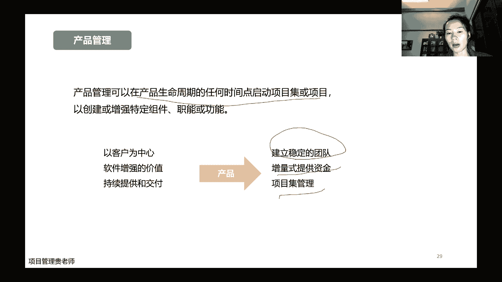

大家要跟项目管理把它区分开来就行，那这里呢嗯更直观的去列举了我们的项目啊，项目集啊，项目组合呀啊这个项目产品啊，它到底有什么样的一个啊不同的一个区别点，那首先项目呢它这个是短期的临时的。

然后项目集呢因为它是一组比较有观念的项目，放在一块再管，所以呢它涉及到的周期持续时间，一般情况下是比较长，然后项目组合当然是长期，因为项目组合是直接服务我们战略的战略。

不是说1年2年马上就能够达成我们的战略的，而产品呢也是一样，产品呢是我们这个东西，这个项目他出来之后，他转为运营了之后，他要长期的去为这个产品做好，它的这个市场的推广的工作。

这是他的一些这个呃这个变化哈，那么范围呢项目它有明确的这个目标，而项目级呢一般他是说整个这个组件交付，它的总收益是什么，这个总的项目集当中有，有的项目它可能是亏损的，有的项目它可能是收益的。

比如说投资项目对不对，这个项目的这个企划项目组合，项目组合呢是随着项目组织的目标的变化，就变了，你目标变了，我组合当然没变，目标没变的，一般情况下还一个公司的战略不标，这种变动的可能性。

短期之内变动的可能性不太大，所以项目组合一般短期之内是不会变的哈，那么变更项目呢，一般变更它会有一些这个专属的，一些变更的一些流程，然后项目集的话，在这个变革的过程当中，项目级的团队自己就会去探索哈。

哪些是更适合我们这个项目级的，然后进而去优化去调整，而项目组合的这个变革呢，一般就是说嗯持续的监督，持续的监督内部外部环境，然后呢来从而来影响我组织的一些战略，当然这个后面的这个成功啊。

怎么样去表示他的成功啊，你看项目基本就是以客户的满意度与预期成果，然后项目集呢可以实现这些收益的效率和效果，然后项目组合呢是总体的，它的投资的一个绩效和整体的一个收益，来进行衡量的啊。

项目的这个这个产品呢，就是通过了我这个具体的他的这个项目本身，它的这个在运营的过程当中，他才能那个收益啊，它是怎么样子去衡量，嗯这个是比较直观的一张图哈。

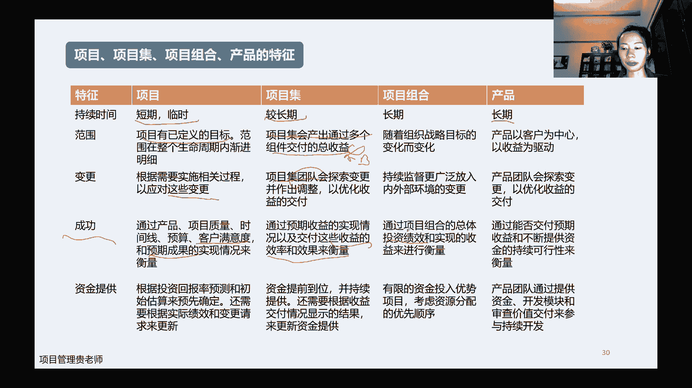

那与项目有关的一些职能呢，因为我们说了呃，项目它涉及到的人和事非常多，所以呢项目交付呢他肯定是有我们的这个团队，有我们的人去驱动的，所以呢在这个时候呢，有就是跟项目有关的一些职能哈，什么意思。

也就是说我们做项目管理啊，到底应该做哪些事儿，那首先提出目标和反馈，为什么是这一点就是非常重要呢，是因为我们在做项目的过程当中，我们是切切实实离项目最近的那一部分群体哈，这是因为我们离得近。

所以我们更清楚这个项目诶，他在推行的过程当中，他当初的这个目标，到底是有没有天生的一些缺陷啊，我这个如何去跟组织里面，去跟高层里面去反馈啊，去检验，这个是非常重要的，就是不要说项目经理就闷头去干。

反正你老板你领导说了我行不行，我也不负责，我就你你怎么说，我就怎么干，不要是这种形态，然后第二个呢开展工作并贡献洞察，那你围绕着我们的项目的目标啊，我们要去做一些项目的一些工作，并且呢你只有洞察。

你才能够提出一些反馈，你如果说不值得去洞察，不值得去去思考这个项目，他的这个意义和价值啊，以我们的实际到底是不是符合的，那你没有这样的洞察动作，你当然也就做不出来第一步哈，然后在这呢提供资源和方向。

那作为项目管理而言呢，你要为我们的整个项目团队，因为他是在我们的这个管理之下啊，去更好的去把我们的这个项目的工作，把它做出来，然后把我们项目的成果把它做好，那这个时候呢我们怎么样去啊。

给我们的项目团队去做很好的这个指引啊，让他不要走弯路啊，让他知道自己该干什么，那要运用到我们专业的这个知识工具，要引导和知识啊，这个引导引导我们的团队内部，然后呢支持他们，并且引导我们外部的这些团队啊。

啊引导我们的客户啊，引导我们的供应商啊，更好的参与到我们这个项目当中来啊，提供监督和协调，因为项目它不可能是完完全全按照我们制定的，这个啊这个目标和计划去走，那在这个过程当中。

如果说团队之间发生冲突了呀，啊如果说你说好，这个职能经理明明说要给你安排人，然后到临时上课了，这个人安排不过来怎么办呢，我们怎么样去学堂呀，这也是我们项目经理啊，要做的一个核心的一个工作。

然后在一个维持整理提供业务方向和洞察，业务方向和洞察呢，这个这个是基于项目工作，这个是基于业务方向有一定的区别哈，维持治理呢是说我们在这个项目的过程当中啊，项目的组织架构啊，他怎么样能够更好的支撑。

我们这一类型的这个项目啊，这个怎么样从这个激励啊，奖惩啊，这些这个项目的团队章程啊，怎么样能够把它做的更好，这都是哈我们项目的必须要做的一些职能哈，这也是我们作为项目经理要做到的，这个基本的一个要求。

虽然说这个要求嗯，这个嗯没有什么没有什么标准化哈，就是有的项目它可能比较小，有的公司要求比较低啊，所以我们这些的要求，那可能是一那有的公司比较大啊，他负责的这个项目呢也比较的复杂。

当然这个项目经理呢他的职位的权力也比较大，那他的所有的这些框架加在一起，他的标准他可能是十啊，所以这个呢要根据我们自己所在的行业，所在的公司所管理的项目的不同啊，进而去给自己提一些不同的要求。

那什么是项目经理呢，简单来说就是由公司来委派管理这个项目，来实现这个项目目标的个人，那p m i官方呢啊，对我们项目经理还有一些这个啊要求啊，这个要求是什么呢，首先我们这个要根据不同的环境来选择。

更加适合我们这个项目的它的工作方式，那比如说我完全基于市场的需求，唉，我我比如说我前面讲的，要做一个新的一款产品啊，做一个新的一个这个app，那我可能更加适合用一些敏捷的方法。

因为我现在还不完全确定我要做哪些内容，做哪些功能在里面，那比如说我现在做的一个项目是建一栋大楼啊，这个大楼设计的很好的，这个各种细节啊都是标标准准的，那我可能更重要的是，选择一个预测性的一个方法。

然后第二个方面呢是啊这个商业敏锐度，因为现在哈我们做项目的时候，我们接触的甲方啊，虽然说不一定是甲方的高层，客户的高层，但是呢我们接触的是甲方的这个项目经理，或者甲方的这个项目团队，要支持他们。

是将来能够啊去最可能去应用我们这个项目，运用我们这个产品，运用我们这个这个啊这个这个需求的这些人，那他们呢肯定对我们的需求是理解和了解，是更深刻的啊，那基于他们的一些反馈呢。

我们能不能给我们的产品做一些优化，做一些提升啊，并且呢在做项目的过程当中，哎如果我们去啊通过这个甲方那边去聊天，突然发现诶甲方好像有一个啊新的需求，那这个需求呢诶我能不能很好的帮公司去抓住，哎。

帮他去跟我们自己公司的一些商务，去做一些链接，诶这样给公司拿了一个新的项目，拿了一个新的订单，一个合同啊，商业敏锐度，这个是对我们项目经理哈，这个要求就不太一样了，相当于是你出去。

你就是一个综合的一个公司代表，不仅要现在做好项目，还要维护好客户，还要给公司拿新的单，对不对，那影响力技能，影响力技能呢，其实啊原来老板的这个pmi人才三角呢，它的影响力技能就是就是领导力。

但是呢我们现在呢就是新版的这个，就把影响力替代了领导力，为什么呢，因为除了啊在项目的过程当中，除了更好的去给这些项目团队，去引导他们去干活，然后去更好的一起达成了一个项目标之外。

还要啊还要更好的去影响我们的相关方啊，影响我们的这个啊甲方，影响我们的这个直管的这个领导啊，让他们更好的来支持，来协助我们完成这样的项目，同时呢在这个项目的过程当中诶，我怎么样去不断的去学习。

去吸收一些新的一些方法，一些流程，然后能应用到我的这个呃项目本身当中，并且呢啊如果说有一些细节的一些目标，如果他要有一些变动，那我怎么样去影响我们公司领导啊，去做好向上管理啊。

能够让他适时的做好这样的一个正确的调整好，所以这个是新版的，对这个项目经理的影响力的一些要求哈，所以他你看大家也可以看出来，他远远不是领导力这么简单，当然这个只是说跟影响力比起来。

它不是相应领导力那么简单，说起领导力，领导力他也是一个非常大的一门学问哈，这个我们后面再讲这个团队管理的时候，会着重的在细讲领导力哈，那么嗯项目呢因为我们一直在说哈，他一直在变啊。

项目的整个价值交付系统呢，是受内部环境和外部环境，的一个变化和一个影响，那到底是什么样的影响呢，啊就是首先内部环境呢我们组织过程，资产过程，资产呢，就是这么多年公司沉淀下来的一些经验啊，啊一些模板啊。

大家可以理解这个模板，合同模板，文件模板规划的模板，然后呢一些治理的一些文件制度，然后有一些数据的资产，知识的资产，还有非常重要的，我们这个公司它的文化结构啊，它的这个嗯制度到底是什么样子的。

然后呢公司他的这个信息技术啊，这个软件啊上没上上的多不多，好不好用啊，资源就是我们涉及到的这些啊，人财物，当然财啊大家一般可能涉及不到，主要是人和物团队给不给力啊，啊这个物件硬件速度快不快，对不对。

员工的能力，是不是大家都是北大清华毕业的高材生啊，还是说一般市场上这个过来的，这个一般性的这种这个这个没有什么基础，没有什么经验的这些人员啊，这些都是我们会影响到项目交付的，一些内部的环境。

那么外部环境呢啊我们市场条件啊，这个允不允许你这个东西是不是天生有一些，这个这个市场上面会有一些这个抵触啊，比如说这个嗯前2年很被裁掉的这个k 12哈，kh 2啊，培训机构是把钱都赚走了。

家长也都很希望自己的孩子做培训，但是呢k 12它背后的逻辑肯定是有问题的，为什么呢，因为k 12他学校老师啊，谁老师从哪儿来的，老师从学校来呀，那既然学校老师能够在外面的培训机构去赚钱。

他在学校就少交点呗，对不对，学校都交完了，外面培训机构还教什么呀，对不对，没法赚钱了呀，所以呢就就学校教的很少，然后呢就责任很多，责任就转嫁到了家长身上，然后渐渐的这个家长跟学校之间，矛盾就越来越大。

所以呢他这个k 12的这个整个业务这个模型，它从根本上面他可能会有一些的这个问题哈。

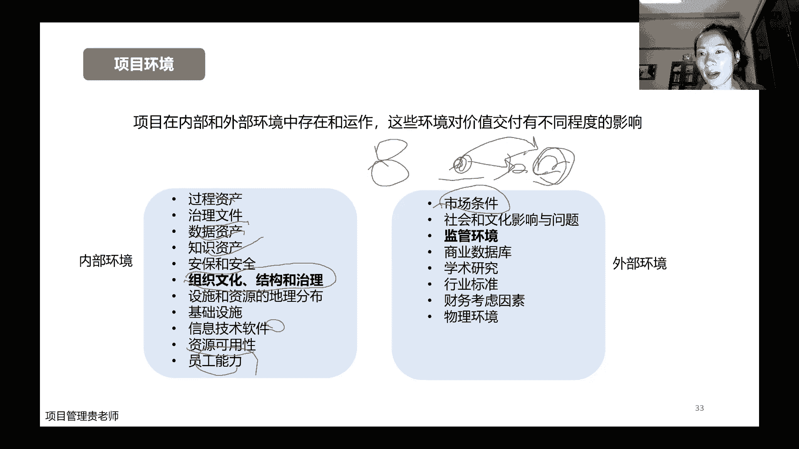