# PMP考试培训课程最新完整版项目管理认证第七版教材新版考纲自学教程 - P21：21.串讲2 - PMP专家 - BV1rM4y1Y79x

好我直接开始哈，嗯继续讲啊，这个是我们讲监控的过程当中，要实施整体变更控制，那么实施整体变更控制呢，它重要的输出就是我们批准的变更请求。

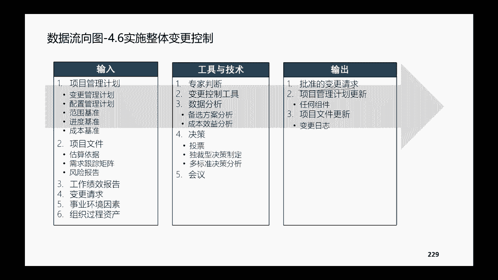

最重要的是他这个流程和我们挪一下嗯，最重要的是这样的一个变更控制的流程，那我们讲任何人呢，他都是有权利去发起变更的哈，变得更请求他都有权利去提。

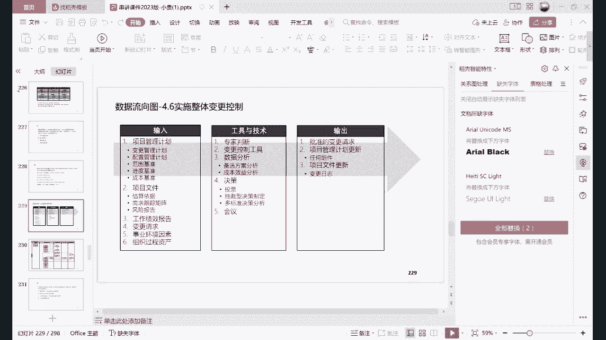

所以呢这是变更的发起人，变更的发起人，他会把他的需求提给什么，提给我们的项目经理啊，或者是我们的项目团队去反馈，反馈之后呢，项目经理或者团队要有一个书面的记录，去整理整理这些变革进球。

然后开始录入我们的配置管理系统，让团队内部呢要先了解这个变更啊，至少你要搞清楚人家给你提出请求，你要搞清楚人家变变的是什么，对不对，那知道啊，能够清晰的描述变的是什么，之后呢，大家才能坐在一块儿。

先内部评估一下它变更产生的影响到底大不大，会不会影响基准，是不是，那首先是是不是需要变更啊，如果说内部一评估项目，你说这有什么好变的呀，这不用变更啊，人家理解错了，那OK我们就不变更。

把这个变更的情况把它记录在变更日志里面，项目团队评估进评估不符合变更的标准，那就不变更，在总结经验教训就OK，但是如果评估之后呢，发现确实人家说的这个建议啊，还是挺对的啊，需要变更，那需要变更呢。

我们就要进一步评估，它涉不涉及到影响我们的基准，如果说不影响基准啊，那好办，不影响基准，我项目经理就能批，我批了之后呢，我再通知相关方啊，某一个没有影响基准的这个地方，我们做了变化啊。

做了变更通知大家知晓唉通报，然后呢在执行这个变更的内容，再把资料变更日志啊，同时呢总结经验教训，当然如果在这个地方发现它已经影响的基准了，我们说影响基准呢，项目经理他没有权限，没有权限去审批，那怎么办。

那就向上报报给CCB报给CCBCCB，他可以考虑去批准啊，还是不批准，他如果说接受啊，批准了这个变更请求呢，那么我们就更新管理计划，并且呢把这个计划相应的一些变化，通知相关方啊，再开始执行这个变更。

当然如果他不接受变更哈，薪资范围不予批准，那OK那你同样的还是要更新变更日志啊，最后呢再总结经验教训哈，所以大家通过这个图呢可以找到一些规律哈，找到一些共同点，共同点呢就是这一部分。

也就是从从需求发起到内部的评估，团队内部的评估啊，这个是任何一个需求来了之后都会做的事情，那么区别是在哪里呢，区别是在是不是啊，是不是要变更，如果变，是不是涉及到基准。

同时呢设计基准的你往上报给CCB的时候，cc b是P还是不批哈，所以从尾部的这一部分也都是共通的，无论你批还是不批，无论你涉及还是不涉及基准，都要把这个变更的情况记录在变更的日志里面。

同时呢也要总结经验教训哈，有些人呢可能会疑问哈，可能会疑问说哎我在这里呀，如果说CCB批准变更了之后，那么我是啊到底是先更新管理计划，在执行变更呢啊还是说先更新管理计划，再通知相关方。

必须要有这样严格的顺序呢，其实要是我们实际的情况来定哈，那如果说非常紧急的话，你边执行边去更新你的管理计划，或者通知相关方，或者呢你这些啊这个顺序稍微停置换一下，也是OK的哈，也是OK的。

这变更的逻辑流程，我讲的我今天讲的这个语速是比较慢的哈，是希望大家能够尽可能的去了解清楚变更啊，变更它的整体的这个控制流程，细节要注意哪些方面，同时呢不同的这些场景大家应该怎么去理解。

因为考试考变更内容考的也不少啊，但是变更的错误率比较高啊，经常会有一些人在变更情况下面搞不清楚嗯，然后昨天昨天还是今天，应该那个那个凤凰涅盘学员在群里面问到的，有一个关于变更的问题哈，当时也是提到了。

是说啊他要做项目经理，要做一个这个新的这个影响到基准的一个变化，问的是没有变更，可以吗啊其实严格意义上面，他当然是应该走变更程序在做变更，但是呢他给的那个选项的题目，高考其他的这些选项不合适哈。

都不合适，都没有扣题，所以呢只能选择那个A哈，所以这个题目呢是提醒大家，我们在考试当中或者在做题当中，如果说遇到变更的哈，他经常会考大家啊，这个是先评估影响啊，啊还是先走这个变更的程序呀。

那我们要知道评估影响要看是内部评估还是外，还是这个外部的这个CCD来评，那么你交给CCB之后，CCB它在判断他是否接受变更的时候，它会有正式的这个评估，但是呢啊我们项目团队内部也有一个内部的。

这个评估啊，你评估之后你才知道到底变还是不变，会不会影响基准，对不对，你不评估你怎么知道是不是要往上报呢，啊所以这有两个评估哈，所以我们做题的时候一定要审题，仔细了。

看看他到底说的是让团队成员去内部评估，还是说提交给CCB来评估哈，就有一个这个先后的顺序，然后同时呢，有的时候他可能没有提到变更的字眼啊，你也选择那个答案，那是因为啊，那是因为其他的选项他都没有扣题啊。

没有扣题，所以呢有的时候我们是严格的要选，一定是先走变更再做动作啊，有的时候呢是直接选的，是做那个动作，是因为我们做那个动作，默认的是他已经做了变更了，这样的一个这个先知的一个审批程序哈。

大家如果说在做题遇到变更的问题，不太明白的，及时的及时的在群里面大家可以讨论，可以问哈，嗯这儿有一个这个例题，这是例题呢，大家觉得要不要讲呢，因为上一讲项目半部分的串讲的时候，我例题全部都给大家过掉了。

让大家去自己看了嗯，今天晚上因为后面讲的内容稍微少一点啊，所以说时间没有那么紧张，所以例题征求大家的意见，大家觉得讲就讲，大家觉得嗯可以自己去看，那大家就自己去看都OK哈，觉得讲的打一吧。

觉得不用讲打二吧，那这题要讲还是不讲，法医要讲哈，OK好，那我讲一下，你看他这个呢，他是说向官方提了一个变更的一个请求，然后呢内部评估之后呢，发现诶这个变更的请求，它不会影响成本或者进度计划。

也就是说它告诉我们不会影响基准，对不对，那现在问你的是项目基准啊，项目经理下一步应该做什么，项目经理啊，有很多人他可能就会觉得诶不会影响基准，我也不用上报给CCB对不对，所以大家看到A想不想选。

想不想选A接受该请求，有点想选A是不是，如果说哈如果说这题大家想选A的，我们先把A先放一放哈，A这个选项呢不一定说他这个做法完全错误哈，我们先看一下B呢，是说与发起人一起讨论请求的变更。

这个时候哈这个变更呢它既不会影响基准啊，那你跟发起人有必要去做这样的讨论嘛，没必要，对不对啊，我们讲发起人什么情况下才要去打扰发起人呢，是超越了项目经理的权限，你搞不定了，搞不定了。

你才要去找这个发起人，那一般通常情况下面，你自己能够解决的范围之内啊，在项目进行权限之类的，尽量的不要去打扰发起人哈，C呢是说在完成该项目啊，所以这个B是很好排除的，这个C呢是说在完成该项目后啊。

在新项目当中实施这项变更，你完成了这个项目，他这个变更的这个影响是针对这一个项目的，你把这个项目完成了之后，还在新项目当中实施这个变更，就完全没有任何意义，对不对，一个变更只是针对这一个当下项目的啊。

所以C也很好排除，那么D呢是启动变更管理过程，有些人会说哎D是错的，因为变更管理过程你要通CCB啊，啊你要做变更请求啊，但是现在不影响基础啊，不用走CCB啊，会不会有人这样理解，应该是会有这样的人。

有人这样理解，他之前碰到学员都会这样理解，他觉得D是错的啊，A是对的，那我现在告诉大家，这个答案是D哈，这个答案是D，为什么选D不选择A呢，是因为我们讲了什么叫变更管理过程。

变更管理过程是我们把变更请求报到CCB啊，cc b省或者不省啊，批还是不批嗯，然后我们再怎么去执行，是这一部分叫变更控制管理吗，不是对不对，我们前面上一张图讲了，变更控制的管理过程是从变更的请求发起。

变革呢从请求发起开始啊，经过了内部的评估啊，经过项目经理的审批，然后才是上报到CCB站审批，然后才是啊我们更新管理计划去做，去执行这个变更，对不对，这整个这一套哈都叫做变更控制管理过程啊。

所以D启动变更管理过程，这有问题吗，这没有任何问题，对不对，因为它就是一项变更呀，对不对，无论是影响还是不影响项目经理批还是不批，它都是属于我们变更管理过程的，那为什么选择D不选择A哈。

A是说接受该请求并与项目团队沟通，不该变更啊，如果说哈我们评估了之后，觉得这个变更它虽然不影响成本，或者说进度计划不影响这个基准，但是呢不影响基准，也不意味着这个变更它一定会一定要做，对不对。

一定要接受，对不对，所以呢接受该请求，他只是啊评估影响之后，有人有学员说还应该要先评估影响对，要先评估影响药性评估影响啊，D包含A对大家说的都没错，都是对的，D不仅包含A啊。

同时呢这个A只是可能的一种情况之一啊，万一我们评估影响之后，发现这个请求不用接受吗，对不对，刚刚才跟大家讲过哈，我们项目经理内部评估之后，也有可能去选择这个变更，不需要，对不对。

那也有可能比如说他现在来个一啊，不接受该变更啊，因为评估之后觉得没有必要，那是不一也对呢，一也是一种情况之一，是不是，所以啊这题是告诉大家变更的这个题哈，怎么去选，怎么去考虑啊，怎么去从最优最合适啊。

最全面，最符合题干的这种思路去选择正确的答案哈，但是这种解题的思路呢，我在后面跟大家讲模考的时候会讲的啊，更加的详细一点哈，就是每一题他怎么扣知识点，然后呢如果说大家有一些比较纠结的选项。

那么我们怎么评估选择更加符合标准答案了，或者更加符合积极答案的那个选项哈，今天这个例题是给大家做了一个，相当于解题思路的一个展示，好我们接着讲哈，那我们还要这个进入到确认范围嗯。

进入确认范围的这样的一个动作，是我们的可复成果已经出来了啊，核实的可交付成果是我们控制质量之后，控制质量之后呢，发现它的这个质量是可以经核实的，那么可以经核实的这个质量呢啊，可以经核实的可交付成果呢。

经过我们确认范围的这样的一个动作，输出来的是验收的可交付成果控制范围啊，确认范围之后呢，我们还要控制范围，控制范围呢，主要是根据我们的偏差分析和趋势分析啊，看看我们的这个工作内容，工作范围。

它在精度和成本上面有没有一些这个超支啊，同时呢它的超市跟我们的范围有没有关系，输出呢就相应的变更性，9号和一些范围的相关的，一些基准的一些更新嗯，在控制范围之后呢，我们要了解啊，这两个关键词。

一个是镀金，一个是范围，前面他们都叫做范围蔓延啊，他们都叫做范围蔓延，这个在课堂上面讲过的哈，范围蔓延在我们的项目管理当中啊，尤其是预测性的这种项目管，你是一定是不允许的，一定是不允许的。

因为范围蔓延意味着我们的成本可能超支，那意味着我们的这个进度可能延迟，那什么情况下会发生项目蔓延呢，我们课堂上也讲过了，一种情况下是镀金啊，就是我们自发的啊，要给项目的这个客户多做一点事啊。

为了讨好他啊，呃什么是方位浅变呢，范围浅变一般是由外部的原因造成的，就是客户啊，或者是我们的一些这个发起人呢，给你提出一些小小的一些增加这个范围，拒绝他又不好意思啊，不拒绝吧。

这个慢慢的慢慢的啊日积月累就越来越多，最后呢已经严重偏离了我们的这个范围基准啊，导致整个项目它有一些失控或者是失败啊，这两种情况都是不太允许的，当然啊这是理论情况，实际情况呢。

可能大家多多少少都会有一些范围的浅变啊，因为总觉得这个甲方是是金主嘛，是爸爸，他会给咱们提各种各样的一些要求啊，这个没有办法啊，这个没有办法完全避免，只能说呢咱们采取一些人际关系的一些技巧。

尽可能的去把多做这些范围造成了一些影响啊，影响是什么，这个影响呢看看能不能跟我们的甲方，跟我们的客户去沟通，去匿名啊，让他去选择啊，是一种可行的办法，大家可以自己去尝试尝试哈。

啊当然我们在基本当中也讲过啊，也讲过，那有一些情况呢，我们是不是必须要变范围，因为不变范围呢，可能这个项目的目标，或者说这个项目的价值，它就没有办法最大化啊，所以呢我们为了让范围变化去响应。

去追求更大的价值，我们也有必要去完成漂移哈，是完成漂移是什么意思呢，完成漂移是说随着啊，随着我们这个项目的进展，那么我们原来定的这个范围呢，他可能啊预计在半年之后，他发布的时候。

可能没有办法去很好的响应市场的这个变化，消费者需求变得太快，那怎么办呢，那我们不得已哈，必须必须对项目的范围进行一些更新，甚至对它的一些功能进行一些增加，那这个呢是我们为了实现更大的价值，做的一些动作。

他的这个叫完成漂移，完成漂移呢更符合我们的这个适应性项目哈，因为适应性项目它本来它就没有范围基准啊，它的范围就是不太确定的需求也不确定，我们是要在动态的去拥抱啊，去响应这样的变化，那什么是自由结果呢。

自由结果是我在追求啊，更好的这个结果的前提之下，我发现这个更好的结果随着我项目进展啊，有一些制约性的一些因素或者一些假设条件，他真的变成制约因素了啊，我这个项目的最好结果达不到。

但是呢我能够追求一个自由的啊，一个这个目标，那也是OK的哈，所以完成漂移和自由，结果呢嗯跟我们的这个范围蔓延对比，他们第一适应的这个项目类型不一样，一个是适应预测型的项目，一个是适应适应性的这个项目。

然后同时呢他们的这个褒贬义肯定是不一样的，范围蔓延一定是不允许的啊，你如果说为了避免分为蔓延，那么你必须要走变更，对不对，因为既然是蔓延，那你已经突破基准，突破基准，你除非做了变更，你走了变更啊。

那责任不在我们身上，对不对，那完成漂移呢，它一定是褒义的哈，他一定是褒义的，因为它是为了让我们的项目的目标，更具有它的价值啊，这有它的这个嗯就是更加直观的这个对比哈，一个敏捷适应啊，一个是预测。

然后一个呢是不降低它这个价值啊，一个是最好是完全控制，提升价值，降低价值好，控制进度，控制范围做完了，当然要控制进度了，控制进度呢主要是我们要做好这些数据分析啊。

分析它这个正值主要是分析SV和SPVSPI啊，去看看进度需要怎么去调控啊，怎么去调控，而控制成本，控制成本呢最重要的也是数据分析咯，嗯也是我们的这个政治分析啊，CV和SPI啊。

这个CPI成本偏差和成本的这个绩效指数，嗯控制成本的主要内容哈，主要内容大家看一看啊，第一呢哪些因素它对成本的基准会造成影响啊，如果说所有的这些变更请求跟成本相关的，是不是得到了及时的一些处理啊。

相应的一些成本相关的一些变更发生的时候，怎么去管理这些变更成本啊，是不是超出了我们的资金的限制啊，是不是按照我们的这个控制账户去列支的，成本技巧是不是符合我们的可接受范围之内啊，偏差是不是不可控啊。

或者说是不是已经到了极限点，工作绩效成本是不是有一些浪费啊，成本呢没有经过变更的时候啊，是不是我们突破了他的一些程序，在使用额外的一些成本，这个是重点讲成本控制的内容到底是什么，因为我们经常在说啊。

控制成本，控制进度，控制范围，要知道控制控制控制到底做的是哪些动作哈，哪些动作要知道，然后控制质量，控制质量呢啊重要的仍然是他的这个工具，数据表现，因果图，控制图，直方图和散点图。

这个都是在课堂上面详细跟大家讲过，每一种图，每一种数据表现啊，它的这个关键点内容，核心的这个含义和使用的场景，说出来的呢是质量控制的测量结果，和合适的可交付成果，嗯然后关于控制质量和这个嗯质量管理哈。

这两个区别也要跟大家说一下，因为呢以往啊，尤其是在这个第六版教材嗯的时候，经常会考，大家控制质量跟这个管理质量，到底有什么区别哈，PUA是管理质量，QC是控制control控制，好那我们要知道的话。

管理质量呢，它其实是在我们项目的整个生命周期啊，整个生命周期都要做的一个动作，但是呢我们质量控制呢，一般情况下是在我们监控的过程当中，针对于我们可交付成果和啊这个服务啊，或者说产品增量啊，都是可交服务。

针对这些来控制它的这个质量，所以呢一个是更加注重由于可交付成果啊，一个呢是更加注重于我们整个项目管理的过程，程序啊，所以这两个区别大家知道一下，所以便于我们在嗯考题当中，或者大家平时训练题当中。

遇到一些不同的这个场景，怎么去区分，怎么去判断哈，嗯控制质量跟确认范围到底有什么关系呢，嗯其实讲的时候也讲过，他控制质量是讲他这个可交付成果，质量到底合不合格啊，就是能不能被接受，确认范围呢。

是讲它的可接可接受性哈，就是说你这个可交付成果啊，虽然说质量是满足要求的，但是呢啊是不是在我的范围之内的，是不是能够通过验收，然后这儿有一个这个例题啊，这个例题也是跟大家去看一下吧，这个项目呢多阶段。

但是呢这个时候他完成了第一个阶段的可交付，成果，已经进行了完整性的这个确认，问你现在应该啊，正在执行下面哪一个这个过程呢，完整性的这个确认哈，所以是不是在做控制质量的这样的一个动作呢，啊不是对不对。

我们讲要控制质量，控制质量之后呢，还要确认范围范围，确认好了之后才是说他经过了一个完整性确认，然后控制资源啊，控制资源呢就是我们在讲啊，在食物在执行的过程当中，对于人际。

这对于人来说怎么去帮助他们解决问题啊，怎么去帮助他们，更好的实现一些团队的一些高知教，那对于食物的资源而言呢，那我们怎么去控制呢，啊怎么去避免一些啊这个材料的一些浪费呀，材料一些存储啊。

材料的等待时间呀啊等等等，主要是做这样的一些动作哈，嗯那么监督沟通，监督沟通呢主要是看我们的这个沟通啊，是不是符合我们的全国方参与的一些需求啊，他的参与度评估举证是不是啊，这个合理的去展示。

那么输出呢是我们相应的项目管理的这个沟通，管理计划和参与计划需要做怎样的一个沟通啊，怎样的一个更新，嗯这呢也有一个例题哈，这个例题呢是说嗯，相关方在说状态会和电子报告邮件太少，没有办法了解到最近状态。

问你现在项目经理应该怎么做呢，嗯A呢是说审查公共管理计划并提交变更请求，以修改报告状态的方式，这个是可行的哈，这个是可行的，因为当前的这种沟通方式让相关方在抱怨啊，他们抱怨没有办法了解到更近的状态。

那你肯定要审查一下，你的这个沟通管理计划到底是怎么做的啊，是不是你的做的是你，第一是你的沟通管理计划就做错了，还是说你的沟通管理计划做对了，但是你执行的时候有折扣，对不对。

所以先审查一下B呢是说终止分发，那肯定就不对，虽然人家说了啊，抱怨电子邮件报告太少，你干脆给他终止了，那不是更加惹他们生气嘛，每日商会呢是适应性项目当中去做的一个工具，同时呢即使在我们适应性项目当中。

你开美日商会，他也不是为了去给相关方通报相关的进展，他主要是为了帮助团队内部去了解项目的进展，同步D呢是说将项目状态发送给更少的相关方，那这根本就没有解决问题啊，然后监督风险啊。

监督风险呢主要是我们的风险审计啊，和这个风险的应急储备的这个储备分析，风险管理的整个这个过程，这个过程呢再帮大家回顾一下，首先规划风险怎么去管，然后呢在识别风险，识别风险做风险的定性分析。

定性分析是什么意思呢，定性分析是考虑这个风险它的概率和影响，然后呢再根据我们不同的项目的要求啊，看是否是需要做定量的分析，最后呢分析完了之后，我们要做规划的风险的应对，风险应对措施出来之后。

在实施的过程当中，我们要去实施实施，还要注意实施完了他有没有一些残余的风险啊，有没有一些新的风险，有没有一些这个完全跟这个风险不相关的，其他的这个风险，这个整个是监督风险，识别风险和监督风险。

都是在整个项目的生命周期要做的一些事情啊，当然监督风险呢如果说已经识别的啊，针对已经识别的这个已知未知的风险，我们就直接用应急的这个储备啊，实施应对措施，就OK那针对一些没有识别出来的这些风险呢。

啊我们就要采取一些权威的措施，全面的措施，看里面又分了这个啊，非紧急的全面和紧急的前面紧急的全面，自动全面，我们叫做书名，叫做自动全面啊，当然比如说哈，比如说我们啊没有识别到今天要下雨啊。

但是我已经跑出去了，现在已经下雨了，那怎么办，已经下雨了啊，我临时躲在一个一个商店里面喝喝茶什么的，那这个是自动采集一群变紧急措施，你不进群，你就得淋雨呃，控制采购，控制采购呢主要了解他的这个工具啊。

索赔管理啊，然后和那个采购的审计，然后输出来的就是采购的一些这个。

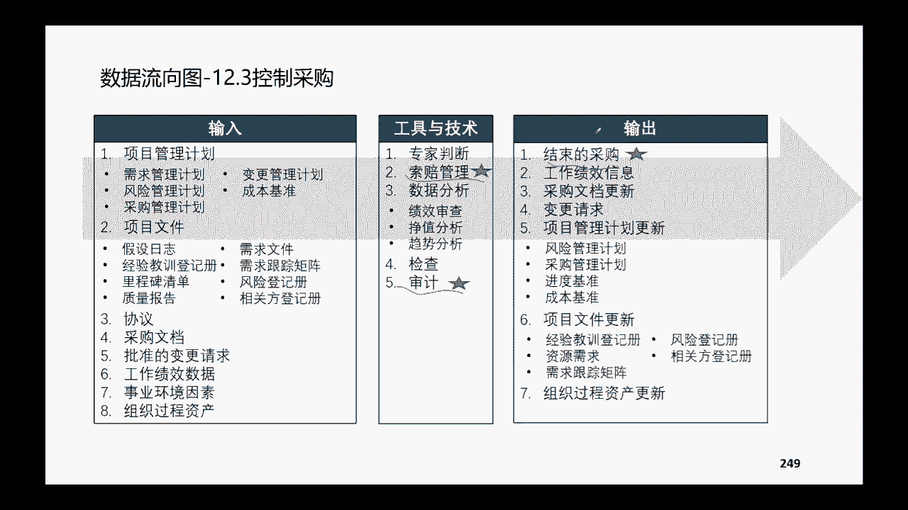

文档的一些更新啊，和结束采购这个动作，采购的这个流程呢大家简单的去过一下吧，就是首先我们对内部而言啊，这个首先要做自制和外部的分析啊，然后呢嗯同意采购啊，我们要从外采，那么要寻找潜在的供应商啊。

要去审批，要去筛选啊，这排序啊确定啊，确定怎么去确定呢，通过我们的这个采购流程啊，发招标文件啊，让他们去来投标，投标完了之后呢，我们根据我们的购房选择标准啊，去选择适合的中标方啊，然后呢跟他签订合同。

他们在执行执行的过程当中啊，他们有可交付成果出来啊，我们要去啊去，首先他们不合适，然后他们交付，然后我们要去验收他的可强化成果，然后针对供应商合同收尾，行政社会等等啊，其实这个采购的全球生啊。

站在我们的这个甲方所有项目管理过程当中，除了采购啊，其他的这个过程，项目经理都是站在乙方的这个角度啊，站在乙方的这个角度，只有采购，我们是站在甲方的这个角度哈，所以对于供应商而言啊，对供应商而言。

那么这个流程啊就是他们的一个项目的来源啊。

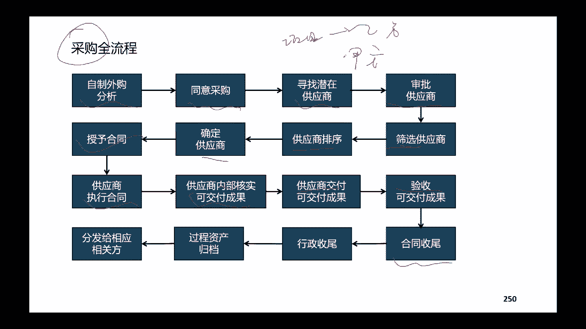

项目的来源，项目执行的这种全流程，对我们而言就是采购的一个全流程，然后采购我们既然说啊，采购要啊，更重要的是要这个要敲定合同，对不对，要把这个供应商选择出来，要跟他签合同，签合同呢分了啊。

合同分了总价合同和成本补偿合同，公立合同，这三个合同呢，我们要知道他们之间的区别和，这个使用的场景哈，首先总价合同是说啊，咱们这个项目它的范围是比较确定的，变更的可能性非常小啊。

那这个时候呢范围既然确定了，他的这个费用基本上也是可以确定的，确定一个大概那个时候呢我们用总价，当然总价又分了啊，固定总价，分了固定总价，总价加激励和总价加经济量的调整。

一般常用的就是固定总价和加经济价格调整，加经济价格调整呢，啊是说在这个项目它的周期比较长啊，遇到的通货膨胀的这个嗯这个影响会比较大，我们家经济价格调整的因素，那成本补偿合同呢。

是说这个项目他的这个范围哈不太能够确定啊，或者说项目变更的范围变更的可能性比较大，那这个时候呢，我们只有请这个供应商先做着做着，我最后给他合理的结算他的成本啊，并且给他一部分的钱作为它的利润。

当然成本补偿合同里面呢它也分了哈，成本加上固定的成本，还是说嗯这个成本加上激励，或者说成本加上奖励加上奖励，我们课堂上面讲过了哈，翻着讲吧啊加上奖励，我们课堂上讲过了奖励，因为是由甲方主观的去预感一段。

应该给他多少奖励啊，这种呢实际上卖房它的权利太小了，一般在实际情况下，应该选择这种合同签订方式的，乙方应该会几乎没有哈，应该几乎没有，所以比较折中的是成本加上激励费用的合同啊，激励费用的合同呢。

因为我们说了所有的成本都要报销，所有的成本都要报销，那我就到底成本花的多还是少，这就取决于啊我们的这个供应商到底怎么去干，对不对，那如果说嗯完全取决于他怎么去干，我们都得报销的话。

那我们得有一定的利益捆绑机制，对不对，如果你超出了过多，超出了我的目标成本，你也承担一部分，我也承担一部分啊，所以呢，这个时候相当于是对乙方有一定的约束约束，或者说鼓励他尽可能的去啊。

避免一些资金的一些浪费啊，对不对，所以这个设定一定的比例啊，一般八二啊或者七三啊都OK，意思是说超出了我的这个目标成本的，如果你超出了，那么超出的部分，不好意思啊，我们要共同的来承担。

我给你承诺的有5万块钱的利润，现在呢就要打印的折扣，但是如果说你有节约的，你替我节约钱，我也给你一定的奖励啊，也是按照这样的一定的比例，那节的部分，我本来约定的这个利润给你是5万块钱，成本是都给你报了。

硬是给你5万块钱，但是呢现在因为你帮我节约钱嘛啊，我本来报销的这个成本就少了一些，那OK我再奖励你，我固定的5万块钱我给你，同时呢我按照节约的这个部分，按照你该想说的这一部分的比例，我把它奖励给你。

然后成本加上固定费用，实际的过程当中呢，他也会用的比较少哈，因为加上固定的费用，就是无论你是节约了还是超支了，我都给你固定的这个钱啊，去作为你的利润，那这个时候对卖房没有任何的约束。

所以在实际情况中也选择比较少哈，最常用的就是这种，然后第三种呢是工量合同，工量合同呢，一般它的单价他虽然说范围不太确定，数量不太确定，但是呢它的单价是比较明确的，范围又比较这个项目的规模又不太大。

那我们简简单单用个姑娘活动就很合适了，然后监督相关方的这个参与啊，监督相关方的参与呢，主要是做相关的分析，说出来的，这个啊用相关方的参与度评估矩阵去做，说出来的是苹果矩阵的带有数据的这些表。

当然我们既然是监督相关方，人际关系和团队的技能是相当重要的，测量啊，还有测量干系人，测量干系人呢我们讲过要看看它的净推荐值啊，就是这个客户他做完了，他愿不愿意去其他的三天。

像其他的这个第三方推荐我们的这个服务，或者说推荐我们这个产品，如果他很乐意推荐，那很显然至少我们在跟他的这个服务当中，是令他还比较满意的啊，清晰图也是跟大家讲话，清晰图可以去用来帮助我们去跟踪。

我们的该新人，或者说项目团队，他在整个项目的过程当中，生命重视当中，他的整个这个情绪啊，或者说他的这个啊这个状态啊，事情到底怎么样，然后尼之力呢，也是跟踪我们项目团队的这个成员。

他对这个项目啊这个肯定和认可的这个程度，然后这个干性的测量这个情绪图哈，情绪图这个课堂上展示过啊，我就不再细讲了，大家自己去看一看哈，然后进入到这个收尾的过程做啊，监控做完了要做收尾啦，收尾的过程中。

其实啊这个从理论上面来讲啊，包含的这个过程并不多哈，他就是一个收尾的一个过程啊，具体要做哪些事情呢，既然是收尾，你要验收可交付成果啊，并且要把这个可交付成果去把它移交，移交给谁呢，移交给你的客户。

移交给相应的一些运营的一些部门啊，同时呢做合同收尾，合同收尾做完之后要做行政收尾，行政收尾是针对于项目的内部的哈，你看这些都是针对于组织类的啊，这个是针对于组织外的，所以呢往往在实际的工作当中呢。

大家觉得收尾啊，收尾就是跟客户把成果交给他，让他签字验收，逼着他或者催着他回款啊，然后就结束了呗，对不对，一般情况下大家做的重心都在这一刻哈，但实际上你看这个列表当中。

组织内部要做的这些动作还有这么的多啊，还有这么多，所以好的项目管理呢，它一定是内外兼具的，不能说我们把可交付成果啊，交出去了，我就不管了，甚至催回款我也不管，我交给商务去负责啊。

这不是我们项目经理的职责范围之类，不能这样想啊，不能这样想，除了这个合同收尾之外，我们要做行政的收尾，行政收尾是什么意思呢啊我们这个项目做完了，那对于整个这个组织而言，是不是该归档的。

要归档该组织经验教训总结的，要组织经验教训总结，对不对，该去跟相关方分享一些项目当中的，一些重点的一些事项啊，要去分享相关方的一些满意度的一些反馈啊，包括呢这个团队成员他的一些计算的一些反馈。

该奖励的奖励，该惩罚的惩罚项目的一些资料啊等等，包括我们的这个分享会呀，啊这个遣散会啊，啊，这些都是我们做完项目之后要做的一些动作哈，要做的一些动作，有人会说公司没有给这个时间啊。

公司有没有做这样的要求啊，正常正常啊，为什么呢，因为大家往往觉得复盘要花时间，往往觉得开一个经验教训总结会太浪费时间啊，都想把员工赶出去干活，赶出去打单啊，但是实际做这些内功提炼内功的这些事情呢。

就觉得比较浪费时间，但实际上内功修炼内功，这些都是修炼内功的，修，炼内功才能够帮助我们更好的去理解项目管理，在下一个项目管理过程当中，能够更加的得心应手哈，好嗯，它的重要的输出经验。

教训登记册和一些最终产品的这个转移，前面讲过了嗯，这个合交付成果的报告和嗯，最终的这些报告包含了什么内容呢，这个大家自己去看看，课堂上面也跟大家展示了他的具体案例，然后关注的这个知识点哈，好项目的阶段。

这个描述啊啊这些大家自己去看看吧，这个就是我们一个项目做完了之后，那么你要写一个他的一个验收报告啊，啊有人也会说哎，项目总结报告好像公司也没要求啊，不要求我们写，不要求我们写，我们自己要写啊。

我们说那你要去复盘，你至少要知道自己做了哪些项目，对不对啊，或者说说的不好听一点，大家将来如果说要去啊这个做这个这个伸直啊，在内部错，甚至你要做素质报告啊，或者是说呢啊内部的竞聘啊。

或者是你去外面找新的一些工作，人家肯定会问到你新的这个嗯，以往的一些项目经历，对不对，那么以往的项目经历，当你在做项目的最终报告的时候，就能够帮助我们去更好的回顾整个项目的，它的一些重要的一些事件啊。

它的主要内容框架啊，和你在里面，你觉得哪些做的比较好的，你发挥的功能和作用，哪些做的不足的，你将来或者说你之后的这个改进是什么。

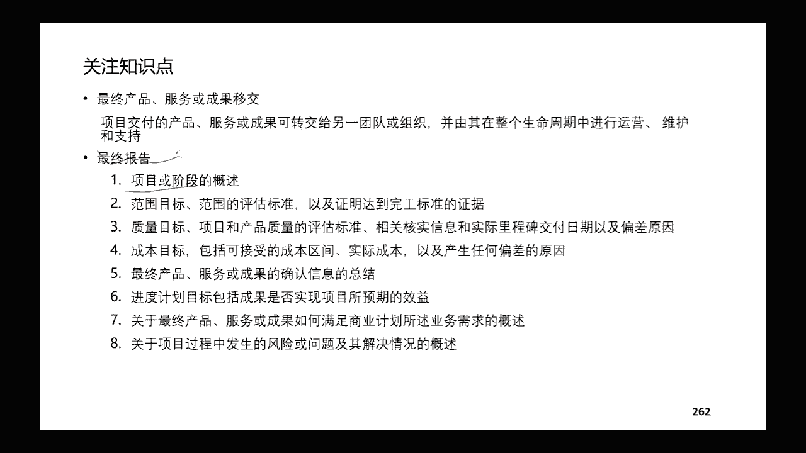

是很好能够帮助我们做项目复盘的哈，好以上是嗯适应，以上是预测型的项目，那么我们下面呢要讲一下适应性的项目哈，我们讲考试当中预测和这个摄影是一半一半的，这个比例对不对，那么讲完了。

按照我们谷歌过程图讲完的预测性项目啊，下面呢我们讲一下适应性项目哈，适应性项目呢，它其实主要内容是根据我们敏捷的实践的指南，语言再录的一些内容哈。

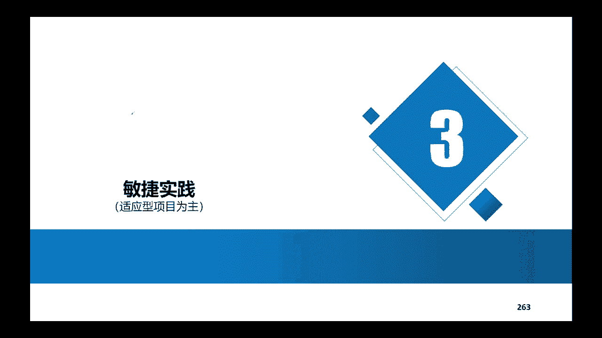

当然要知道这两个这个不同类型的这个项目啊，我们知道它的区别是什么啊，区别呢这个图呢比较直观跟大家讲一下哈，预测型的项目它是一个多目标的哈，不能说我项目是满足了他的范围，那这个项目就做得好，不是哈。

你不仅范围要满足你的进度，也要满足成本，要满足质量也要符合要求，但是在我们敏捷项目啊，或者说适应，或者说我们这个生意项目当中，什么叫项目的目标呢，就是你能够交付价值啊，你交付出来的价值啊。

你这个范围啊你是做的多也好，做的少也好，有价值才是王啊，然后框架呢五大过程组，十大知识领域，这是我们预测的这个框架，好敏捷的框架呢就是按照我们的这个迭代啊，按照我们的发布计划和迭代发布规模。

预测型的项目可以是一个很大的项目，也可以是一个很小的项目，都OK啊，但是呢敏捷当中一般都是小团队哈，两块披萨，两块披萨就是老外传过来的词啊，就是说加班的时候点个外卖，两块披萨就能解决的。

你想那人一定是很少，对不对，那你20个人两块披萨，那是一定搞不定的，团队的节奏，团队的角色呢预测性项目当中啊，项目经理带领的项目团队，和一些这个项目的管理团队，对我们适应期的项目当中呢。

主要是三类角色哈，产品负责人PO啊，和我们的这个团队啊，团队开发团队，还有我们的这个SM啊，项目的这个项目的这个敏捷的这个教练也好啊，或者项目的负责人也好啊，叫master。

然后团队管理呢主要是项目经理在管，预测性的项目，还有直男心机密也会在管预测性项目，如果它是矩阵型的，而我们适应性项目呢，我们强调的主要是自主制哈，大家自我管理啊，自己去定计划，自己去定论。

我自己做出承诺，团队的会议呢预测项目会议就比较多了，收集需求要开会啊，去讨论问题，要开会啊，做平台分析要开会，各种各样的一些启动会啊，审查会啊啊这个状态会啊等等等等，这些会都要开。

但是我们顺应节项目当中呢主要就开五个会啊，五个类会啊，这五类会再跟大家，因为它是它是比较重要的，这五个事件跟大家回顾一下，首先第一个呢我们是要开他的这个呃，产品代办的梳理会啊，就是要搞清楚我们这个啊。

我们这个产品代办事项啊，它到底优先级是哪些啊，最高的优先级，它包含的详细的用户故事是什么样子的，哪一些用户故事是进入到我们马上要开始的，这个迭代啊，这个是处理后要做的事情，那么梳理回之后呢。

要做一个迭代的规划会，那我们讲了你定了排的U23啊，这三个优先级的要进入到这一次的迭代，那OK进入到这一次迭代之后呢，我们还要给他预估，还要评估他的故事体验，看看这个这次迭代当中。

这些故事点做不做得完啊，你要做啊这个故事点的估算，同时呢嗯确定这个故事点啊，这个迭代是能够做得完的，你还要去啊去安排一下啊，去安排一下这个团队当中啊，是谁做哪一个故事里的啊，大家周几去做呀。

啊具体的这些任务和这些安排啊，要把它定出来，同时呢团队成员还要做出承诺，这个是迭代规划规航，那么规划会做好了之后呢，啊进入到具体的这个迭代当中，我们要看每日的站会啊，就是要同步每天的这个进展和问题啊。

要把它提出来，结束之后呢，我们要做评审会啊，看看我们这个迭代过程当中做出来的这个成果，它是不是啊，是满足PO或者满足客户的一些要求的啊，是不是满足我们DVD的这个标准。

这是在我们平时会上面要做的这个事情，最后呢还有一个回顾会啊，回顾会是我们团队内部啊，团队内部去召开的，当然有的时候呢也会有一些web的相关方参与，也是OK啊，回顾会呢主要是帮助我们回顾这一次迭代当中。

有哪些问题啊，有哪些做得好的，我们接下来的迭代也可以这样做，有哪些障碍啊，是需要去解决的啊，有哪些做的不太好的，我们下面的这个迭代应该去优化的，然后进度工具呢，预测性项目主要是我们的这个啊横道图。

甘特图去展示，或者是进度网络图去展示，而适应项目呢主要是用我们的这个燃烧图哈，燃剂和燃气都OK预测型项目三大基准啊，铁三角不可冲破的范围，进度成本都不可突破啊，你必须三个框框必须给我满足。

而适应项目不可冲破的，一般是他的这个进度哈，这个进度是啊是约定的啊，比如说你做一个软件开发，人家会告诉你啊，这三个月要出来一个什么样的一个功能，对不对，但是它会围绕你的功能，你必须做什么范围。

他会跟你这样说吗，他不会，他一般情况下会把这个进度给你约定哈啊，铁三角呢价值啊一定要有价值啊，质量和约束管理办法呢，预测器项目总流程中文档，各种管理计划呀，各种项目的这个文件工件呐。

但是适应性项目呢最重要的是强调啊，我们用一个看板啊，或者用任务版，把所有的这个流程可视化，可视化，管理，预测性项目最重要的是计划组织啊，指挥控制协调摄影机项目的主要是管理理念，就是自主制啊。

大家一块啊自己来讨论，自发的组织，我也不给你搞什么流程啊，搞什么文档，这个控制搞什么约束你自发的组织。

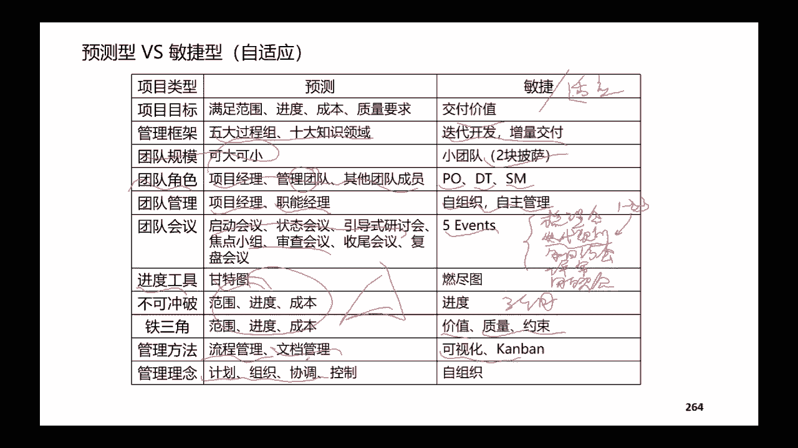

只要能够把价值交付出来就OK就可以，然后敏的这个宣言啊，敏捷之宣言帮大家回顾一下啊，虽然说啊也注重啊，也会关注一些啊流程工具啊，或者一些比较好的一些文档啊，合同谈判嗯，要遵循一些计划也会有哈。

但是呢每节当中啊没有这些呢，我们也OK啊，不是像预测一样判断的那么死规定那么死，我们更重要的是强调团队之间啊，个体之间要相互的交互，相互的交流，可以工作的软件能够实现价值，比你一堆文档有用多了。

客户呢啊最重要的是能够参与进来，跟我们一块写作，一块把这个功能把它做的最优，同时呢有响应变化。

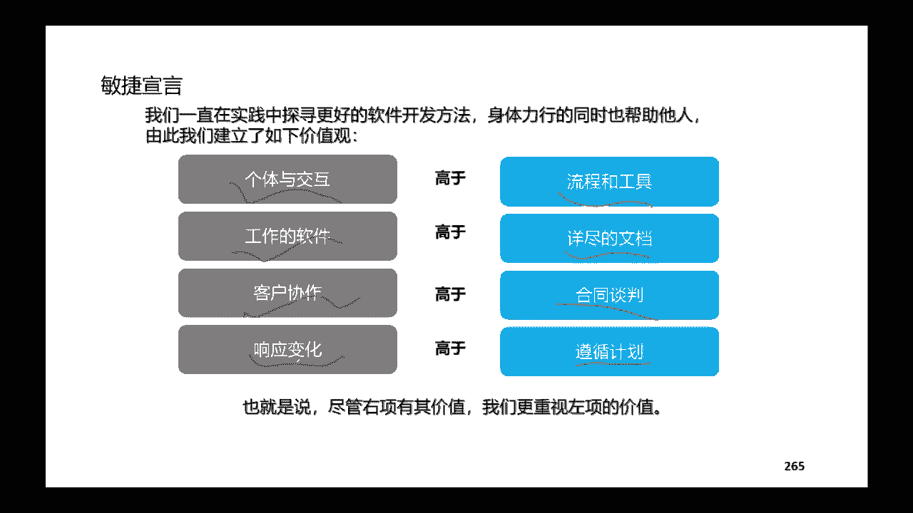

敏捷的这个原则，敏捷这个原则呢我就不跟大家念了，大家自己去看一看哈，啊一定要去看一看，不要求大家背，为什么要看呢，因为看了之后我们会知道考题当中，如果说遇到一些好敏捷啊，适应性的这种题目。

那么我们要知道敏捷，它是倡导什么样的一些原则和理念，我们就能够去更好地选择出来，最合适最正确的一个答案，大家自己去看一看哈，然后敏捷的框架，敏捷的管理的框架呢，首先啊他跟我们这个预测等有一点区别哈。

预测呢它的框架是启动规划，执行监控收尾，但是敏捷管理框架首先啊也是启动啊，要逆向，要逆向之后呢，正式的启动过程也要做项目章程啊，但是呢除了项目章程之后呢，我们这个时候还要有一些初步的产品的，代办事项。

还有一些高层次的一些这个估算，产品的路线图要出来，整体的这个用户故事地图啊，比较粗略的还要出来，然后出来之后我们要做发布计划啊，整个这样一个项目，它的这个发布计划是什么样子的，今年发布什么。

或者说啊这个季度发布什么，下个季度发布什么，发布的这个底部底啊啊，发布的这个啊这个产品列表要出来啊，然后呢再进入到迭代重点管理的啊，项目经理管理的，可能是在这个迭代的过程当中啊，迭代的过程当中啊。

啊迭代这个会议怎么管啊，啊这个会议怎么招聘呀，看看怎么去用，到最后收尾的时候呢，回顾会也是非常重要的，还有一些感恩的游戏啊，总结经验教训啊，啊，这些都是跟我们的预测型的项目收尾是一样的，还是类似的。

最核心的是每节当中适应项目当中，最核心应用的是我们的光荣框架啊，SORM框架再带着大家走一遍哈，首先有一个产品的愿景啊，我要做一个什么样的一个软件啊，这个软件能够帮我实现什么样的一个功能啊。

我比如说我现在我想做一个软件啊，做一个软件啊，我我可能啊这个不需要直接跟大家讲啊，大家看着这个有一个软件，它能够看到我的这个课件啊，它就能够自动的根据我的声音去匹配，然后跟大家去讲课啊，那我啊就轻松了。

是不是啊，有一个产品愿景，然后呢会有产品愿景出来之后呢，会有核实的这个详尽的商业计划书啊，对不对，因为我光想一想，他也只是一个处于零点几的一个阶段，你得把商业计划书做出来论证。

你这个想法啊是能够去实施的，去能够实现它的价值的，有了商业计划书啊，论证它的价值之后，才进入到项目的这个理想阶段，做一个项目章程好，做一个项目章程呢，我们知道这个项目当中啊，他的这个用户故事啊。

就是什么人去用它，用了它能够实现什么样的一个价值啊，然后有了用户故事之后，我们才有啊，怎么去根据用户故事去列出我们的产品，单件产品代办事项的这个列表啊，怎么样去列出更详细的用户故事地图。

怎么样去把我们的发布计划做出来，有的发布计划，那么在每一个发布里面，我们要做几次迭代啊，在具体的每一次迭代啊，冲刺当中要召开这些会议，去控制它的这个流程啊，去保证它的可交付者这个成果啊。

可交付成果出来出来之后呢，当然我们不是说一次迭代可交付成果就OK了，是要经过多次的迭代啊，才会有一个发布的这个综合的可交付成果，那同时呢在整个过程当中啊，我们通过回顾啊，通过评审啊。

他有一些新的一些要求啊，有一些信息反馈会导致我们要更改更新产品，代办事项列表，不管是更新它的内容，还是说更新它的这个顺序，优先级都OK，同时呢这个时候因为有一些更新，可能导致一些新的需求。

新的需求呢它也会有新的用户故事啊，他是这样的一个逻辑循环，3355哈，SRAM框架的核心就是3355，3355理解了之后，绝大部分的题哈，适应性项目当中，80%的题大家应该都会了哈。

三大角色刚刚已经讲过了，PO团队和这个SMPO做什么呢，但凡是跟我们的产品蛋白摄像列表啊，就是PBR跟我们的产品大概事项列表相关的啊，无论是它的范围的增减啊，啊这个事项的这个细化呀。

啊这个产品大概事项的这个具体的这个阐述啊，啊优先级呀，嗯做还是不做呀，跟客户沟通啊，都是由我们的这个PO产品负责人来负责，那团队做什么呢，团队做具体的迭代的任务规划啊，任务的执行，问题的解决。

质量的控制管理，这个团队要做的，那SM做什么呢，SM是围绕着团队去给他排除内部的啊，这个团队组织内部的和团队外部的哈，大家理解一下这个逻辑，在组织内啊，在团队外这些障碍啊。

比如说一些流程啊啊一些繁琐的这些这个障碍，这些是SM要去排除的，同时呢，SM当团队内部发生一些团队内部没有办法，就是他们自主制，没有办法去解决协调的一些问题的时候，SM要提供指导，要提供支撑啊。

所以他提供的主要是服务，服务是领导啊，也叫仆人领导，啊当然这是适应性项目当中啊，这三个角色他们分别有各自的任务，但大家就会发现啊，这其实三个角色的任务，在预测性项目当中都是有pm，都是由pm来做的。

对不对，跟客户沟通啊啊定这个范围啊，啊这个任务计划呀，啊这个排除状态是不是都是pm在做，是哈，然后呢，三个弓箭，三个弓箭呢，诶我上次好像有些人问过我，三个弓箭是什么，对不对啊，三个弓箭呢是什么呢。

第一啊产品的代办事项，产品的代办事项列表，第二呢是迭代啊，进入到具体的迭代的，具体的这个用户故事大概是三列表，然后第三个空间呢是这个迭代做完之后，每一次迭代做完之后都有可交付成果出来啊。

我们叫做产品增量，这个呢是它的三大弓箭，那么两个五哈，第一个五啊是它的这五个价值啊，第一个五是他的这个团队要秉持的五个价值观，然后第二个这个五是五个会议，重点掌握这个五行，五个会议前面刚刚才讲啊。

进入到每一个冲刺啊，那么冲刺他的整个这个啊规划会啊，冲刺的这个嗯这个评审会，然后他的这个回复会啊，前面还有这个取决于谁进入到这个冲刺的，这个梳理会嗯，三大角色，这跟大家提的是课堂上跟大家提呢。

就是说一个敏捷当中，它包含了很多个小的敏捷团队啊，就比如说我们一个大集成项目，软件集成包含了很多这个子系统，那么啊需要用到这个SOS啊，不同的多个光团队来组成的这样一个团队，理解一下这个就OK哈。

然后角色刚刚已经跟大家说了，我这就不再讲了哈，这个PO啊，这个第一个是developers，是那个团队团队，他要做什么啊，创建计划呀，啊任务啊，做质量管理啊，调整计划呀等等，然后PO呢最重要的。

你看所有的这些都是围绕PBL，当然这个产品目标啊，产品目标其实也就决定了产品的这个PBR啊，然后SM呢啊服务与组织和团队，三个弓箭呢可能也跟大家讲了哈，产品待办列表，产品需求列表包含的业务需求啊。

技术需求啊啊和一些其他类型的需求啊，啊PO要对它进行优先级排序，每一次迭代开始之前，这句话很重要哈，每一次迭代开始之前，比如说我在进入第一个迭代的时候啊，我可能是ABCDE。

我把A拿在第一个迭代里面做了，那是不是我第二个迭代我就要做B呢，不一定啊，不一定为什么，不一定，因为我第一次迭代做完了之后，我开始做第二次迭代的时候，我这个东西啊，它的它有可能增加了一个A减啊。

有可能增加一个A加啊，也有可能这个B就完全取消了，也是有可能的，所以我在进入二得这个迭代之前，我还是有一个梳理会哈，我还是要确定再确认一下哪一个优先级的啊，哪一个列表它要进入到这次的迭代啊。

进入仅仅只针对于进入到这一次迭代的，这些事项去做细化，去做故事点的估算哈，好这个迭代的这个啊，但凡事想你看他就只记录当前迭代的工作哈，啊这呢是给大家示意了一个用户故事的，这样的一个地图。

用户故事的构成呢，啊帮大家回顾了他三个要素哈，什么人通过做什么动作啊，能够实现什么样的商业价值啊，这个就是一个标标准准的一个用户故事嗯，DOR和DD呢DR是啊，就是ready啊。

然后那个dd呢down deflation of down，一个呢是说我这个东西我准备好了，我准备好了，我ready好了，准备好了，然后DOD呢是不是完整的定义啊，就是说这个工具它已经完成了。

它已经down已经做好了嗯，产品的增量，产品的增量呢，是我们在每一次迭代当中完成的时候，它的可交付成果啊，这五个会议呢也是反复的在跟大家讲哈，反复反复的再跟大家讲啊，plan do check x型。

这个是针对我们整个这个五个会议，他是怎么样的一个这个循环在做，然后具体这个会议呢，产品代表事项的列表的会啊，叫梳理会，然后呢有迭代开发事项的列表的这个啊，迭代的计划会，这些工具。

然后呢有我们的这个评审会，评审会出来的就是产品的增量，然后呢有我们的这个会不会嗯，这是具体每个这个会议哈，每个这个会议呢嗯还是简单过一下吧，刚刚说没有，刚刚直接是口述。

没有对着文字产品代办梳理会呢主要是确定啊，确定团队理解我这个用户物质到底是啥，然后呢根据他的这个优先局去排序，然后冲刺计划会呢主要是确认啊，确认已经排好的这个大的这个产品，大概事项列表，并且给它分解啊。

给他估算过时点，然后用故事的这个估算啊，既然说要估算它的这个故事点啊，我们要了解一下，回顾一下用户故事的它的啊，整个这个估算，我们说一定是用故事点在做它的一个，度量的单位，他不是在用人天啊，为什么呢。

因为不同的团队哈，不同的团队，他去完成一个相同类型的这种这个用户故事，他花的时间是不一样的，所以呢A团队啊现在都有一个这个啊pr，都有一个这个A事项啊，那么对于啊对于这个A团队而言呢。

它可能评估它是三个故事点，对B团队评估它是四个故事点啊，我们能说A对B不对吗，不能这样说哈，因为不同的团队他做或者说不同的人，他去做这个这个啊，这个blog他使用的这个时间效率它就是不一样的。

所以呢只要团部队内部，一个团队内部啊，这个A团队内部他去认可就OK哈，所以故事点的这个估算，它一定是团队自己去估算的，你给他定的不作数哈，所以呢有时候考试也会遇到这样的场景，比如说呢他告诉你阿硕啊。

这个时候SM应该做什么，SM应该去给团队成员指定用户故事点啊，去给他们安排任务，那就一定错了啊，一定错了嗯，然后用故事点呢，我们用的最多的工具是宽带德尔菲，宽带德尔菲呢以我们的这个计划扑克为例哈。

计划扑克为例，这是扑克牌当中展示的一些这个啊，上面的一些数据啊，它使用的这个场景呢，不知道大家实际上有没有用过这种方法，用清华博格去估算公式点，它使用的场景的，就是产品负责人要给每个人发牌啊。

发发十张牌，然后产品有负责人把每一个故事，把每一个用户故事描述清楚了，描述清楚之后呢，每个人会根据自己对这个用户故事的理解啊，估算他觉得用户故事要花多长时间，然后呢他出的这个牌哈，他出的这个牌。

就是他认为这个用户故事所需要的所价值的，这个公式点到底是几个，那么大家同时亮牌，亮完了之后呢，大家再去讨论啊，尤其是针对一些差别比较大的重点，去讨论一下讨论，最后大家去评估一个比较合理的故事点。

这个是它具体的使用办法，你看他的时间就15分钟啊，他主要就是做三件事情，完成了哪些啊，今天计划做哪些，有什么问题，考试当中也会遇到这样的场景哈，这样的场景他告诉我，他问大家说嗯，大家遇到了什么问题啊。

针对这个问题呢啊又很复杂很复杂很复杂，说了一大堆啊，问你现在SM应该怎么办呢，啊很多人可能就会选他选项会给你很多干扰项，他干扰项呢他会说哎呀，针对这个问题怎么怎么解决啊，项目经理啊想什么办法呀。

怎么都让围都是围绕那个问题怎么去解决哈，那这个时候呢其实就就已经被他带到坑里去了，如果这个问题特别紧急，马上要解决，那么OK在单独召开一个针对这个问题的，跟他相关的这些人拉过来开会讨论解决问题。

讨论解决方法，占用大家所有人的时间，评审会，评审会主要是产品负责人啊，根据我们的这个DD的这个标准，看看现在出来的产品增量，是不是符合D5D标准的，不符合啊，那有什么改进的意见，改进的措施，如果符合。

那就接受去啊，实施这样的一个验收的一个动作，回顾会啊，回顾会呢啊，主要是看看哪些做得好，哪些互动不好，这刚刚都讲过了哈，嗯这一张立体的这个图啊，是可能上面跟大家讲过比较有意思的，当然我们啊讲这个的时候。

讲天天要开，后来我们讲裁剪的时候呢，也知道每日唱会呢，其实也是根据我们实际情况可以去调配的，如果大家啊就那么几个人，每天工作的地点都是在一样，吼一嗓子就知道每个人干的是什么。

那是不是还要搞一个形式上面的文章会呢，也不一定哈，也不一定啊，计划会是在之前啊，迭代之前都需要去做的，平时会呢一般是在啊这个两周的迭代哈，一般一般是在结尾回顾也是在结尾啊，梳理回呢是定期定期。

如果说有一些新的问题，新的需求有限，那我们要定期的去排一下它的一个顺序好，这个燃烧图，燃烧图呢也燃尽头，燃起图啊，大家要理解燃气和燃烧它分别是什么意思，燃气是说哎随着我的时间的这个进展。

我还剩余几个故事点要做啊，燃起呢是从开始来做，我累积啊，随着时间进展，我累计完成了多少个故事点啊，这个价值观呢价值观其实没有什么太多要讲的，有勇气啊啊有勇气做承诺呀，要专注啊，尊重啊，要开放透明啊。

这些都是敏捷的一些关键词，嗯这价值观不具体讲哈，然后这个看板啊，看板呢它其实从敏捷，从这个方法上面来讲，它跟我们的这个嗯SRAM它是有一定的区别的哈，它是不太一样的，是两个不同类型的管理方式。

但是呢实际上在嗯我们实际的使用过程当中，看板它也可以当独的当做一个工具哈，当做一个工具去把它做一个啊，这个scram框架当中的一个使用的工具也是OK的，它主要是把我们所有要做的这些代办事项啊。

去把它啊用看板的形式啊去把它贴出来，贴在这一起，如果大家实际当中有用过这种啊这个方式的话，就会发现啊，比如说一个白板啊，上面贴的全是小纸条，或者是说呢大家现在用这个白板用的比较少。

都是通常都是用这个软件哈，软件上面啊，G2上面他也有看板啊，要做的这个事项啊，需求啊要做哪些啊，设计要做哪些开发要做哪些，这些都是我们的看板，看板用的其实还挺多哈，嗯然后看板。

如果说考试当中遇到看板相应的一些啊，这个题目怎么去做哈，我们理解这个看板它到底讲的是什么内容，就知道啊，首先看板它是一个可以去看看板，看板看板可以去看见的这种工作吧。

哈可视化它强调的是可视化的工作流程啊，就是像就是像刚刚跟大家讲的啊，它有不同的这个频道啊，在不同这个项目阶段啊，需求阶段呢，设计阶段呢啊开发阶段啊，测试阶段呢，部署阶段呢，在每一个不同的阶段。

我要分别要做的哪些事情，我把它列在这个地方啊，我把它列出来，让大家一目了然啊，这个是它的一个核心的一个逻辑，所以可视化是它的一个关键词，然后呢，既然我们把所有他要做的一些事项，都把它列在上边了。

那我们就很清楚，在不同的阶段做的内容到底是多还是少啊，所以呢我们要控制，要控制在每一天要做的这个任务，它是比较的合适的，不能说一天做的特别特别多，然后第二天做的特别特别少啊。

那样的话对于整个工作安排它不太合理啊，不符合劳逸结合的这样的一个原则，所以呢我们通过看板是可以做到啊，限制在制品的一个数量，在制品的数量就是目前正在啊，这个同事正在做的这些工作内容啊，简称WIP。

所以这是他的第二个特点，第二个特点呢是能够对在制品进行限制，那有人会说限制我在做的这些事情，那是不是不好啊，不是哈，是好事，为什么呢，因为我们强调的是可持续发展，不是让你一天就把所有的工作都更完。

而是要整体稳定，整体要稳定啊，要匀速的这样一个速度的一个推进，不然和管理活动呢刚刚说过了，要显示啊，要显示化定义的规则，团队跟利益的跟逆的干系人就规则达成一致啊，这个都是一些正确的废话。

然后构建反馈的一些循环，你看每日照会啊啊这个会不会呀等等啊，这些也是我们在做看板的时候也会用的，也会用的，所以呢看板和SRAM，它虽然说是两类不同的管理方法，但是在实际使用的过程当中。

他们都是穿插着互相去使用的，嗯这有arm方法和看板的这个方法的一个区别，一个对比哈，这个区别对比呢嗯还是简单的看一下square，它是强调啊，我们要有一个时间箱啊，迭代就是迭代。

但是呢看板它就没有说我固定的啊，非要去这个固定时间去迭代，它没有这种硬性的要求哈，它主要是围绕我们项目的这个这个阶段，从需求啊，也可以说从这个需求啊，计划呀啊这个开发呀，发布啊，测试啊啊等等。

你可以按照这个过程，你只要去做好这件事情就OK了，并不是一定要严格按照一个迭代，两个迭代，三个迭代，这样嗯，然后呢既然碳板的，既然这个rap当中有迭代，那么迭代当中呢，我们说了迭代进入到迭代的这些事情。

他是一定要承诺去完成的，但是你看盘呢，既然没有这个迭代的这个实践要求，那承诺也不是必须的，看板强调的是迭代的这个SRAM，强调的是迭代的这个速度，然后看板呢是强调的是整个这个啊，开发的一个周期啊。

整个生命周期它的一个度量数据啊，这后面大家自己去看一看吧，我觉得讲这个嗯我讲还不如大家自己去看哈，square square这个框架怎么样去强调跨职能这个团队呀，然后看板怎么样去。

他没有特定说一定要是跨职能的啊，你专门这个小团队，只要能把这个生命周期把它啊去支撑，去把它完成都是可以的，嗯基本上也就这个也就也就接近尾声了哈，哪些项目适合考，哪些项目适合看板啊，一般新产品的开发。

因为你有时间的要求吗，你有进步的要求，那这个时候呢，我们还是用强烈的这个比较严格的，这种迭代是比较合适的，然后看板呢一般是你啊维护类的啊，这个服务呢或者技术员类的这种项目啊。

对这个时间要求他没有那么严格的，我们用直接用看板，列清楚哪些要做的一些事项就OK，所以它不同的这个使用场景是这个。

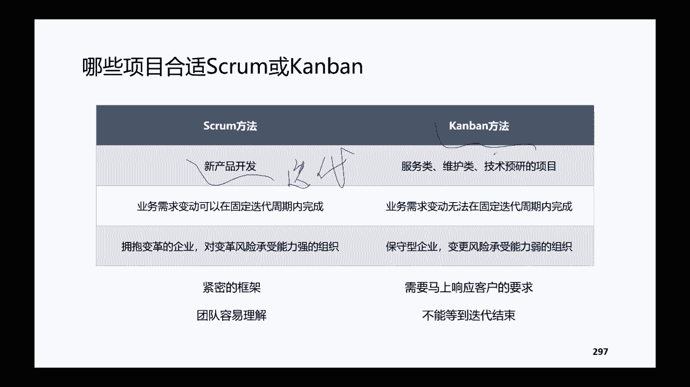

就是大家理解一下就OK了，然后以上就是所有的这个创建内容了，看看大家对今天晚上的这个串讲啊，或者说嗯现在因为今天时间还比较早，大家对于整体的这个串讲的内容，有没有什么不太清楚的疑问点啊，现在可以问啊。

好吧，看看大家有没有对串讲的这些内容，有没有不太熟悉的呀，或者说我创完了之后，大家有什么新的一些想法呀，啊，是不是对整体的这个项目管理框架，更加熟悉了呀，都可以去提一提自己的一些问题，或者一些想法哈。

规划阶段的重点是在哪里啊，嗯你讲的是，你讲的是这个预测型项目的规划阶段吗，如果说是预测型的项目啊，应该说不分预测或者适应啊，规划阶段它的范围需求啊，进度成本质量沟通这些都是重点啊。

这但凡是进入到我们规划内容需要做规划的，不分他的轻重啊，不分说啊，不是说范围很重要，成本很重要啊，进度很重要，这个沟通就不重要，不是不是这样子的，他们之间没有相对的重要关系的这种排序哈，没有这种说法。

嗯那个，再简述一下三本教材的核心侧重点及观念，好吧好吧，我看一下，呃用这张图给大家展示吧，三本教材的嗯核心侧重点，首先我们把PBOOK哈，我们要知道PMP的这个考试呢，嗯首先。

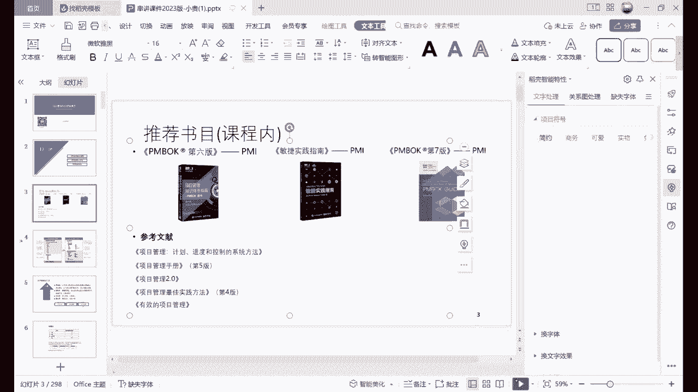

首先要知道它是有两类啊，偏book和敏捷实践指南，它是由这两类教材啊去构成的，但是呢PMBOK呢它又分了六版啊，就经典版和七版，目前更新的这一版，所以呢现在是三本教材啊，要知道为什么是三本教材。

然后这三本教材呢啊，p m book呢它主要是对于不管是600还是700，它主要是针对项目管理的，知识体系啊，主要是针对于通用的项目管理的知识体系，而敏捷实践指南呢，它主要是针对于敏捷项目哈。

它主要是针对于敏捷类的项目怎么去管啊，在实践当中有哪些会议怎么去开啊，这是第一点啊，那么为什么现在有第七版的时候，他这个既有敏捷也有考试呢，这大致上我们以前的时候啊，PMP啊，跟这个ACP。

包括现在这都是两个不同的认证考试，这都是PMI发出来的两个不同的认证，PMP呢就是项目管理，ACP呢就是敏捷，它是把两个不同的项目是分的比较清楚的，不同的认证啊，但是现在呢我们这个PY就发现PMP啊。

原来他只是针对于预测性项目，包括我们第六版的这个知识体系，也只是针对预测性项目，预测性的项目呢，现在是不太能够适应整体的项目管理的发展，逻辑了哈，所以呢他先是把考纲变了嗯，考纲是19年变的。

是19年变了考纲，这个考纲变了之后呢，就会发现原来考这个PMP的考试啊，绝大部分都是预测型的项目啊，他基本上很少涉及敏捷的内容啊，所以那会儿呢他的教材就是核心是偏book就OK了。

无论是五版教材还是六版教材，你只要认准篇book就OK了，但是呢在19年新考纲之后啊，他意识到这样的变化之后，他把敏捷的项目，那他把敏捷的内容也加入进来了啊，也加入了这个敏捷的一些考题。

所以呢当时就变成了，我们既要学地面版的这个PB模课的这个教材，又要学敏捷实践指南，因为PMP的这个考试他既有敏捷的题目，它拥有预测性的这个题目，考纲做的调整啊，所以呢在我们今年8月份之前。

大家学的这个教材呢，主要是六版的这个教材和敏捷的实践指南，去应对我们的PV考试啊，但是当我们8月呢偏文官方他也说了，要以七版的教材为核心啊，同时呢六版的教材也不能丢，敏捷的实践指南也不能丢啊。

因为考纲现在没有变，只是说呢教材的这个逻辑顺序变了哈，大家知道我这样讲了之后，大家知道哈，就不同的这个教材之间它有什么样的区别，以及呢啊为什么又存在这个啊，这个PANBOOK又存在敏捷实践指南。

知道这个顺序了哈，知道这个顺序之后呢，我们就知道啊，是基于这样的一个背景，那么偏book呢，它本身啊他自己也会做一个迭代升级，他是每4年的时候，几乎是每4年从他的啊，从他的这个知识体系推出来之后。

几乎是每4年更新一版，那么前面的前面的一版啊，pm不可一百二百三百四百五百六百，这600啊都是针对十大，知识领域和五个过程组嗯，都是针对这些来的啊，只不过说呢他在每一次不同的这个改版之中。

它不是有45个过程中，还有49个子过程吗，它每一个子过程它有一些更新啊，它有一些增减啊，它的这个过程是不是啊，符合到哪一个大的这个工程组类的，它的归类在做一些再做一些不同的调整，那么到第六版的时候呢。

啊比如说我们五百十四十七个子过程，到第六版就变成49个子过程，第六版的时候是最经典的哈，基本上它的排序也好啊，它的分类也好啊，啊他的这个过程的这个优化也好啊，是相对来说是非常完善的哈。

然后到第七版的时候呢，它就不是按照十大知识领域和无工程组，这样的内容再给大家做这个教材了，他完完全全把其他的这些版本全部都迭代了哈，全部都迭代了，第七版的这个逻辑呢是按照原则啊，和这个绩效率啊。

不再讲什么知识领域啊，不再讲什么过程中，他按照原则和绩效率，去做了一个全新的一个改版，那这个全新改版呢，它就不仅仅包含了我们的预测性项目，它也包含了我们适应性的项目，也就是说他把我们敏捷实践指南一本。

专门去讲适应性项目怎么去做的，敏捷项目怎么去做的，这份指南，这个原则也归纳在我们七版的教材里面了，这是第一个哈，它包含了敏捷实践的这个高层次的，一些指导方向和原则，第二个点呢是七版的教材。

它其实也融合了一些，就是超越了，超越了这个PMI的这个PMP的知识体系哈，他把这个P2啊，把prince to英国的那一套项目管理体系的，一些观点也融入到期版的教材里边来了啊，所以呢七班的教材呢。

嗯无论是从这个考试啊，这个来说还是从大家实际执行的这个项目来说，还是说从项目管理本身的，这个顺应时代的这个发展啊来说，他的这种更新都是必然的哈，都是必然的啊，你大家想一想，如果他不做这样的更新。

它还是围绕这个第六版的这种逻辑体系，制度更新，第一它实在很难更新了，因为第六版真的非常经典了，已经非常完善了啊，它更新的这个空间比较小，第二呢嗯600的这些，他主要还是比较适合预测型的项目。

那么预测型的项目它更加注重的是流程呀，文档啊，固定的结构和程序，固定的结构和程序呢，其实它对我们这个做项目而言啊，其实是不太能够去啊，不太能够去通用的，以前很通用。

因为以前大多数项目用的项目管理知识体系的，可能就是一些工程项目呀啊建筑项目呀啊，对不对啊，包括一些金融项目呀啊等等啊，包括一些军方的这种项目，他他这种项目比较多啊，它确实是范围啊啊这些框架是能够确定的。

但是现在呢好这个软件都还是一些比较基础的，更重要的是很多的一些面对市场的这种，研发型的这种项目啊，看你在用这套知识体系，它已经覆盖不了了啊，你学了这套体系之后，你发现你学的东西。

跟我实际当中执行的这个东西适用性太小了，所以呢嗯如果PMI他还，他还想去引领项目管理的这个知识体系的发展，它就必须要是他也要去适应环境的变化，他为了适应这样的环境的变化。

他就做了这样的一个改版的一个升级，那么为什么这个改版的升级，要作为大家的正式教材呢，虽然他知道这个教材他讲的是大框架大原则啊，但是呢他也知道必须要做这样的一个教材，是为了能够去引导大家引导嗯。

即将要学项目管理的这些人啊，既引导我们小伙伴能够站在更高的角度去学，我们的项目管理，能够去学了之后啊，让我们拥有的这个原则性的这些方向啊，和这些思维啊，能够更加的去适应不同类型的项目啊。

预测类型的我们也知道怎么去做啊，适应性的项目我们也知道怎么去做哈，对我们的要求是更高，同时对我们的这个学的内容理念啊，它是包容性是更加强，然后我看见有学生说越考越难了啊，啊是将来肯定会越考越难。

因为对我们项目经理的要求是越来越高的啊，当然这个要求越来越高了，其实不仅仅是pm i对我们要求高，是因为这个时代啊对我们要求越来越高，是因为这个时代对我们要求越来越高哈，所以PMI他只是响应时代而已。

呃那么这个是三本教材之间的这个啊，这个这个区别点哈，区别点啊，核心侧重点，侧重点呢就是六版当中，主要是讲这个知识领域和过程组，然后基本当中主要讲原则和绩效率啊，同时呢他的绩效率。

其实把这些知识领域都已经包含了，然后观点呢观念其实也已经讲过了哈，比如说讲团队呀，讲干系人的时候啊，那么重点我们在这讲干系人其实也讲到了，然后讲我们规划的时候，那么啊项目整合规划范围啊，精度啊，成本啊。

质量等等，他们也都要规划，对不对啊，所以在规划里面其实他们也是有关联的，然后在工作的过程中，项目的工作绩效率呢啊，对于我们项目的这些啊范围啊，进度成本啊，质量啊，你在工作的过程当中啊，你要做哪些好。

包括这个后面交付的时候啊，包括我们测量啊，也是它其实是包含了六版的这个框架，但是呢它在六版的框架之就是外，他又做了一些拓展啊，做了一些拓展，它的区别呢是他讲具体的这些内容的时候。

他没有讲到六版当中的这么细啊，比如说每一个工具它到底是什么意思呀，啊到底使用的场景是什么呀，他不讲到这么细啊，包括敏捷的这个时间指南里面的，一些具体的实施方法呀，七版里面他有没有捏这么细呢。

他也没捏这么细哈，所以啊这个虽然800啊，虽然这个8月说了以七版教材为核心，但是呢人家也说了啊，六版教材和敏捷实践指南，仍然是我们的核心的参考文件啊，也是我们是有也是需要去学的。

嗯当然这个现在PY自己也在出一本，过程实践指南哈，过程实践指南是啊，基于这个他会把new版的这些这个过程，再把它融入到这个过程时间指南里面啊，很有可能在将来的考试，他就是以七版的教材为核心啊。

因为人家不能说已经更新了，他还老说这个700R和600啊都是这个核心，那这样的话这个700它可能更新的，就没有全面的这个指导啊，所以呢它会以七版的为核心，然后同时呢再给你一些参考教材啊。

过程实践展现在应该正在编，什么时候发，应该快了，今年看看有没有机会把他这个发不出来，过程实践指南，这个是做了他这个七的七版的一个，配套的一个教材啊，将来是这样的一个这样的一个逻辑啊。

嗯然后看看我有没有解答你的这个问题，或者其他学院还有没有其他的问题，有，嗯如果说没有什么问题的话，我们就先结束吧，给大家也节约一点时间，反正现在我们的正课加上我们的串讲课，都已经结束了。

接下来就是模考题，大家好好做题哈，然后那个群里面每天的训练题目，如果说大家有什么问题的话，可以问我哈，考纲内容没变，是不是考试的内容，还是六版和敏捷实践指南为核心啊，不是考纲考试的内容。

其实他在考纲增加了之后啊，七版的一些这个核心的一些内容，因为七版的教材去年就已经出来了啊，七版的这个教材去年就已经出来了，只是说呢他还没有从官方的通知，说以七版教材为核心啊，作为考试的这个指南。

所以呢考纲新的考纲里面他已经有新版，已经有这个七版的这个内容了，在考啊，但是目前比例还不是特别多哈，会有，但是比例不是特别多，下周六才有课了是吧，呃我看一下，我我得看一下排班表，大家看那个排班表吧。

好像是下周六下周六的，是这样的哈，就是我讲模拟题的时候，我希望大家能够嗯比如说周六下午讲课，那么周六上午的时候，大家尽可能的去模拟考试的那个场景啊，比如说啊九点到12点自己去做啊，中间不要有间歇。

一下子把题目做完，看看速度能不能跟得上来，然后自测一下，自测一下，看看能够啊正确率能够达到多少，然后下午再统一的去跟大家讲解析，好吧，给大家放在周六，也是希望大家能够空出整块的时间嗯，群里面目前发的是。

我看苏老师发了几套，那个是自测的，做自测题的时候就不给大家提要求，大家有时间的时候就做嗯，但是就是后面给大家发的这个模考题，还是希望大家能够模拟考试这个环境哈，是模拟真题吗。

我没太理解模拟真题是什么意思呢，考试考试当中啊，就是是一些真题哈，是这个这个这几次考的一些真题啊，但是呢就是考试当中，如果说你指望这次考试还在有原题的话，这个原题的概率并不大，下周六要讲的那一套。

苏苏老师到时候会发给大家的，他会提前发给大家，不用提前做，就是周六上午去做就好了，刚刚才说嘛，最好是上午去做，下部讲，现在大家可以，第一是群里面每天发的题要做，然后第二是嗯。

钉钉群里面发了几套那个自测的题目，自测题目大家自己去念，好吧，还有其他问题吗，没有其他问题了，那今天晚上就先结束吧，大家早点休息吧，早点休息。

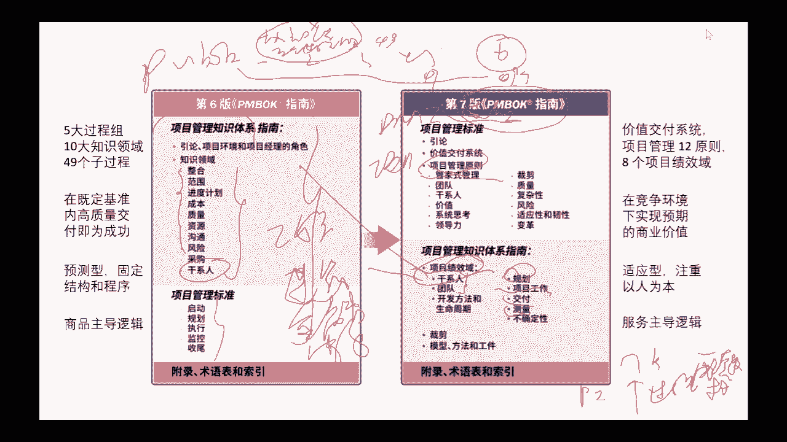

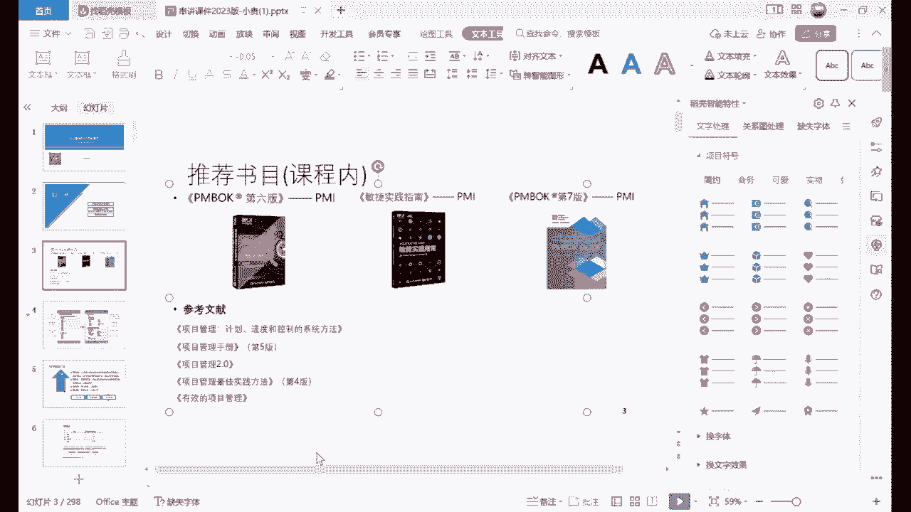