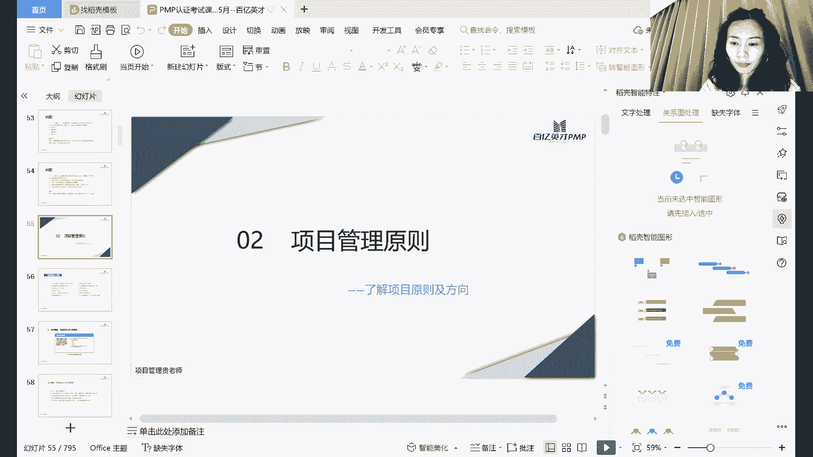

# PMP考试培训课程最新完整版项目管理认证第七版教材新版考纲自学教程 - P3：3.项目管理原则 - PMP专家 - BV1rM4y1Y79x

hello，各位同学晚上好，能正常听到声音，看到屏幕哈，如果可以的话，还是在评论区敲个111，ok哈能听见哈，今天晚上呢我们是第二次课程，重点呢是讲项目管理的原则，因为我们前面讲过哈。

第七版的教材呢是以项目管理的12大原则，作为项目管理的一个标准来推行的，那今天晚上呢我们就要详细说一说，这12个大的原则，它到底是什么样的一个原则哈，那既然是原则，我们就知道了，他肯定是高层次的啊。

不会是具体的工具和技术，但是呢了解原则呢，我们会了解项目管理它的指导方向到底是什么，那这样子的话，我们在遇到任何一个项目，不管它是什么类型的项目啊，什么复杂程度的项目，什么规模的项目。

那么我们都可以遵循这些原则，去做好我们的管理工作哈。

这12大原则呢，嗯我是按照教材上面的顺序给大家列的哈，那么讲完了之后呢，我再给大家嗯分分类这12个原则，因为单独如果说让大家去记或者是去背的话，可能会比较的困难，那么讲完了之后呢。

我帮大家梳理一下这12个大的原则，应该从哪些视角去给他做归类，这样子的话我们理解起来就会更加的啊方便，首先第一个呢就是说啊做项目管理，那我们作为项目管理者，首先要成为勤勉尊重和关心他人的管家。

第二个呢是说我们既然光做管家还不行，对不对，因为整个项目除了管家，除了项目管理者个人之外，还需要辅助我们所有的项目团队，做好所有的项目的工作，那么要营造他们相互协作的这样的一个，工作的环境。

那第三个呢就是要有效的引导这个该系人参与，所谓的该系人哈，我们可以简单的理解，就是说这个项目，它能够涉及到的所有相关系的相关方，那第一四个呢就是我们做项目，当然是要聚焦价值了，因为我们上节课讲过哈。

上项目就是要实现它的商业价值，所以我们既然做这样的项目管理，肯定是要聚焦于项目本身的价值所在，那么第五个呢是我们要识别评估和响应，系统交付，为什么这么说哈，因为项目他不是说简简单单的做一个工作啊。

做一个活动，做一个任务，而是说有很多个层次，很多个类型的子项目交互在一块儿，它是一个系统哈，那么第六个呢是说啊，我们在做项目管理的时候，要展现领导力行为哈，注意他这里说的是领导力，不是说让你去管。

不是让你用你的职位的权利去把人管住，而是说要在这个过程当中去，充分发挥我们的领导力，第七个原则呢是说我们要根据环境进行裁剪啊，这里裁剪呢主要是说的是裁剪项目的方法，管理的方法。

裁剪项目过程当中的一些文档，裁剪不同的过程当中使用到的一些工具啊，选择合适的一些技术，那第八个呢是说要将质量融入到，过程和可交付成果啊，这里他专门要注意哈过程和可交付成果。

并不是说我们做项目最后可交付成果出来诶，他是满足我们的验收标准的，那我们质量就是合格的，不仅仅不能够只满足于此啊，要在我们的整个过程当中就要满足，把这个质量的这个观点深入到啊。

所有项目团队当中的脑海当中，那第九个呢是要驾驭复杂性，我们都说了，既然项目它是一个啊，它是一个这个这个系统，那么它难免的内外部环境会受一些影响，它涉及到的人，涉及到的环境的过程都是非常复杂的。

那在这个过程当中啊，我们做项目管理者怎么样去顾全大局，怎么样去协同的，统筹的去考虑应对这些复杂性哈，并且呢在这些复杂性的过程当中，如果说有一些风险，那么我们风险怎么样去识别。

怎么样去规划他的应对的办法啊，怎么样去监控，怎么样去审查，那么第11个呢是项目，因为一直在变哈，虽然说我们项目就是即使预测性的项目，最开始它的范围都是确定的，但是呢随着我们项目的进展，那么有一些条件。

有一些制约因素，它是不见它是逐渐的渐近的明晰，同时呢我们在做一项目的过程当中啊，比如说涉及到的一些客户，一些相关方，他的需求也是不断的在变化的，那这个时候我们怎么样去拥抱他的这些变化。

然后呢这个增加整个项目的适应性哈，那么最后一条原则呢。

就是啊为了实现未来的状态啊，就是来做一些努力的工作啊，简单的梳理完了后，我们一条一条的来讲。

好首先第一个原则啊，我们前面简单说了，说是要成为管家，成为什么样的管家呢，成为勤勉尊重和关心他人的管家，大家就是看到管家这个字眼哈，不知道怎么会理，就是怎么去理解，因为管家这个词呢啊。

或者说这个呃不打引号的这个职位啊，其实在国内呢他可能用的不多，但是呢啊英国，尤其是在最早的这个呃，皇室系统肯定是用的比较多的，因为他们那个贵族肯定都会有自己的一个，就是有城堡，有大别墅。

然后呢有管家管家，下面呢又管理着各个不同工种的这些仆人，奴隶啊，那么作为这样的一个管家呢，他是素质的要求是非常高的，比如说哈这里列了一些我们做项目，虽然说不要求说哎呀，你是在某一个家里面成为别人的管家。

但是呢作为公司代表，公司去管理这些项目的这样的一个这个代表者，啊，啊也有很多人说这个项目经理是微信ceo嘛，啊那你成为这样的一个管家，首先为人要正直啊，因为你做项目。

你会接触到非常非常多的直接的这个客户啊，你也去管理公司的一些团队，你有事涉及到很多跟利益相关方去沟通的，一些事情，那么你怎么样去维护啊公司的利益，维护公司的荣誉和形象，这是比较考验一个管理的基本的素质。

那么第二条啊，关心什么意思呢，我们做项目团队啊，我们管理项目团队的时候，不能只说诶我给你呃，123455个人，分别安排的是什么样的一个这个任务和活动，你必须要在我规定的时间之内完成啊。

中间即使你生病了嗯，或者说家里发生特别特别严重的，这个这个一些事情啊，或者我们疫情期间扬了特别难受，实在是爬不起来，但是你不管啊，你就让他把工作这个完成，那这样的话肯定也是不行的，为什么呢。

因为我们既然作为管理，那我们团队当中有这样的人存存在，那么我们就除了对他的工作，要给予相应的一些指导之外，还要关心他的个人成长，关心他的生活哈，那么啊在一个非常重要的就是可信，而人而言。

他为什么要把项目放心的交给我们，去做这样的管理工作，对不对，那首先我们要做一个诚实，要做一个可信的，可以信赖，事事都有回应的这样的一个角色，要不然领导交给你项目之后，他也不放心啊。

或者是呢这个交给你的这个项目的，这个规模不会特别大，几10万的小单子，他觉得无所谓的啊，或者说这个项目就是呃，基本上没有什么太大的一些创新性，他觉得扔给你嗯，即使失败了，他觉得风险可控。

那我们如果说做到这样的话，我们自己也不会成长，对不对，好最后一条是上次着重讲的这个合规啊，既然作为管家式的管理，我们肯定要保证我们所有的项目，接手的这个过程子过程都是合规的。

无论是从法律的层面还是从这个社会规则，社会准则这些层面哈，那在一个公司的内部呢，作为管家式的管理要包括哪些内容哈，首先我们要做到跟组织的目标，愿景使命要保持一致对吧，因为我们既然是管家管家。

给这个公司提供这样的这个管家式的项目，管家式的服务，那首先我们的服务对象肯定首先是公司，然后才是我们的这个项目的客户，对不对，那既然为了服务我们的公司，我们肯定要保证我们的项目的，在执行的过程当中。

是围绕着公司的整个战略愿景和使命的，那么第二个呢是承诺哈，这个也是对应着我们前面说的这个这个正直啊，后面的是官星，对应着前面刚刚说的那几个关键词哈，你看要承诺并尊重项目团队成员的参与啊，要给他们薪酬啊。

一般情况下呢，可能我们做项目经理可能决定不了哈，但是呢我们能够给他提供更多的锻炼的机会啊，能够给他更好的一些引导，在项目的具体的内部的工作分配和奖金啊，如果说有的话，奖金的分配上面。

我们尽可能对他们公平对待，对不对，那么第三个哈要监督项目当中使用的组织资金，材料和其他的资源，对不对，你不能说哎呀，我成为一个项目经理，我在管理一个项目，每个项目都会有自己的经费呀，我就想哎呀。

反正也不是用我自己的钱，反正用过字的钱，所以呢在用资金哈，在用材料的时候，我为了保证质量，我不管它的这个成本行不行呢，不行哈，这个前面对应前面说的一定要是可信的，对不对，如果说有一些小心思啊。

或者说不在意这个这个公司的一些成本的，一些开支，或者是一些资源的一些这个浪费的话，那么对于公司而言啊，也不是很放心，把这个项目交给他们去管，对不对，那么最后一个哈了解职权职责。

担责和职责的运用是否恰当哈，这里他提到了要注意一下职权和职责哈，什么是职权，职权呢，就是我们作为一个项目的管理者，我们所拥有的权利啊，最基本的就是项目团队当中有这些成员啊，那么这些成员的工作分配。

至少是我们项目经理啊，对一些这个呃权力所在，对不对，那么职责呢是我们站在这个职位上面，应该承担的一些责任哈，所以这两个是有一点点区别的，大家注意体会一下就ok，那么在公司外管家式的管理。

它要包括哪些东西呢，好管家不能说哎呀我关起门来，我就管我内部的一些事情啊，我就把前面说到的，这个跟公司的组织目标保持一致，然后管理好公司的内部的一些团队啊，给他们提供公平的机会啊。

然后呢其他的外面的关起门之外的这些事情，我就不管了，不行啊，为什么呢，看我们前面说过了，项目它是一个系统，这个系统呢，它取决于内外部环境的一个整体协调，所以呢外部的这些东西我们也得去管，也得去啊，在意。

首先环境的可持续性和组织，对材料和自然资源的这些使用，比如说哈我们假如说做的一个项目，它是啊涉及到这个呃能源环保相关的，那么你自然而然的你在做能源环保的时候，你对外界的这些这个自然的环境的一些影响啊。

是正向的还是说反向的，那如果说是反向的，它会有什么样的动态，需要什么样的动态的监测，这个是需要我们时时刻刻去关注的，又不可能说我到时候这个项目是交付了，但是呢，周围的这一片社区的这个居民都不同意了。

说去投诉啊，你这个项目对我们的日常的这个生活，造成了非常大的污染，那行不行呢，不行哈，第二个呢是组织与外部干系人的一些关系，要靠我们去协调，那么这个组织呢啊，在这里说的组织还一般情况下只是公司的。

公司跟外部干系人啊，尤其是一些合作伙伴和渠道的一些关系，这些关系呢我们不要想着说诶，我们要跟这个呃这个外部合作伙伴，这个都是跟高层去对接，高层对高层，然后所以其他的一些事情呢，我们就不管了。

不能有这种思想哈，那么再下一个呢要对社会啊，对市场对经营所在地区的一些影响，这个跟前面的这个自然资源有一脉相承的，这个作用哈，同时呢要提升专业化行业的一个实践水平，因为虽然说我们说这个项目经理。

他是嗯对技术呢没有强制性的要求，但是呢如果我们在一个行业，哪怕是对这个业务流程啊，不一定是技术，对业务流程如果说非常熟悉的话，这个也是有必要在我们管理，或者在我们的整个职业生涯当中。

去不断的加深自己的一些经验哈，呃那么这儿有一个案例哈。

嗯这是有一个案例讲的是这个中信银行，他呢，他是怎么给他的这个客户提供管家式的服务的，你看在整个这个过程当中，由于外部环境的一些变化哈，啊，这个嗯，首先它监测到的他们的这个汇率的一个风险。

所以呢给他的客户提供了多种汇率，风险管理的一个解决的方案，然后呢，这个客户取得了客户的一些专业的一些信赖，同时呢在这个过程当中诶，他在跟客户的一些沟通当中，就发现客户有另外的一些问题。

有较大的美元对外支付的需求，于是呢他们沟通之后啊，又把原先的婚礼避险方案，将部分泰铢兑人民币的这些交易哈，就改变了一些策略，留存了美元的进口支付，这样子呢啊这个企业就觉得作为中信银行。

作为我们的这个呃一个这个金融的一个机构唉，时时刻刻在关注，在站在我企业自己的一个角度，去，关注，我企业怎样去应对外部的经济环境的一些变化，那么这个就是对于我们刚才讲的哈。

对应组织外管家式的管理到底要做什么，这个是辅助单位理解哈。

那么第二个原则呢，是说要营造协作的项目团队环境，那么你看一下哈，我们项目团队呢是有各种各样的，有不同的技能知识经验的个人来组成的，为什么呢，因为一个人啊，有的人可能觉得我一个人做一个工作。

其实还是挺容易的，相反让我去干一个团队来做呢，我觉得沟通的成本太大啊，并且呢我我还得花时间去教他们，我觉得太累，但是呢既然我们说一个项目哈，项目尤其是复杂的项目，稍微大一点的项目，一个人一定是搞不定的。

这个时候一定是需要团队，团队的力量才是最大的，那作为我们中间的这个关键的角色，关键的协调者怎么样去带动这个团队一起，愿意从心底里面去愿意学做，并且呢从他们的知识和能力上面，能够做很好的匹配。

这个是考验我们的哈，首先啊直接看后面的这个吧，首先要有团队的共识啊，这个为什么强调团队共识呢，因为首先项目团队包括项目经理在内哈，跟公司的高层肯定是有一些，这个有一些冲突在里面的哈，这些冲突在哪里呢。

高层是希望项目团队在尽可能低的成本，尽可能短的时间之内，把这个项目做得尽可能的好啊，质量尽可能的高，但是呢对于项目的团队而言，包括项目经理在内涵，我这个说的项目团队是包括了项目经理的，那么他呢没有办法。

在很短的时间之内保质保量的，然后又还节约成本的，把所有的这个项目团队都完成，对不对，因为除非他没日没夜的加班加点，所以他们会有一些天然的一些冲突，那对于项目经理和项目团队而言呢，啊项目经理呢。

肯定也希望这个项目团队能够摒弃一切，只是个人的一些想法，把个人的这些呃一些这个不好的一些想法，先排在后面，先以团队，先以项目的目标为核心完成手头上的工作啊，这可能是项目经理跟项目团队之间的一些匹配。

那项目团队本身而言呢，好肯定就想到我最好是在这个项目当中，最好少给我一点活啊，讲低分的时候呢，啊最好能够多给我分一点，对不对，这是人的天性，那在这个过程当中呢，我们要啊摒弃这些天然的一些冲突，让高层。

项目经理和团队之间都能够形成一些共识，不仅是从项目的目标，还是从这个项目的利益，包括个人的利益上面都能够形成共识，共识之后啊，大家才能够很好的去干这个活儿，高层不会说要求啊。

一个人每天这个加班到这个这个晚上十点，不到十点不能下班啊，不会达成这样的，然后团队呢也不会觉得哎，我每天最好是工作到四点就开始摸鱼，摸到五点我正常下班啊，这中间是有一个平衡点，那么第二个呢组织结构。

组织结构哈，组织结构大家应该都理解哈，任何一个公司，任何一个项目都会有它自己的一些组织的结构，那么我们在工作的任务和项目的这个活动之间，怎么样跟公司的整个组织架构的安排，跟他协调起来啊，这个是要注意的。

再一个呢是这个呃过程，项目团队呢，他能够完成的任务和所分配工作的这个过程，是否是合理呀，这个是也是属于我们要怎么样去营造，项目团队的环境，这里面的一个核心的一个任务，因为我们必须要保证项目团队。

他在做的这个过程当中，a是合适的，给他分配的任务大小以及任务的难度，是跟他个人的技能，个人的经验是匹配的哈，那么第三个原则呢是要展现领导力啊，我们前面说了啊，不能这个要要区分管理。

和领导力不能用自己的这个职权去压榨团队，因为压榨团队，首先也许哈我们从这个呃，短期之内可能会觉得诶这个效果比较快，但是从长期来看呢，这个团队他一定是不服你的管理的，等到哪一天诶，你们公司说。

那我们来测评一下，可能你自己得的这个分哈就不是特别高，所以我们在项目当中呢，这个对事儿要好好的管理，对人呢是要好好的展现我们自己的领导力哈，为什么要展现领导力呢，因为有效的领导力可以促进项目更好的成功。

更好地取得积极的成果，这个成果呢不仅仅是基于项目的可交付而言，而是对于整个项目的过程而言，因为我们项目除了可交付成果之外，项目还要取得一些很好的团队协作的，要磨合团队的管理过程当中啊。

项目的管理过程当中，有一些很好的知识和经验要积累，要沉淀，那如果说在这个过程当中，我们没有很好的展现领导力，没有把大家团队当中的这个，脑子里面的隐形的知识给他挖出来，那么你这个项目。

仅仅只是获得了可家夫成果而已，别的什么都没得到，那任何项目团队啊都可以表现出领导力行为哈，所以我们在这里说领导力呢，也不是说那这个做项目经理啊，你要展现领导力，作为项目团队成员呢，那就无所谓了。

不不是这个思想哈，因为领导力领导力并不是因为你成为领导，你才有领导力，你才需要领导力，而是说你任何作为一个管理的这个管理者，非职权的，就是你没有这个权利，你没有正式认命的。

你也可以叫做把自己叫做一个管理者，你自我管理自己的工作任务，那这个时候你也可以展现你的领导力行为，比如说你跟你的同事，你跟你的平级之间，那如果说有一些工作上的配合，你怎么让他心甘情愿的。

很乐意的跟你把这个工作配合好好，后面说了哈，领导力跟之前不同，这个不用多说，那有效的领导者会根据情境调整自己的风格，什么意思呢，假如说哈，你现在项目的团队成员，是一个啊主观能动性比较强的这样的人。

那么你去领导他工作的时候，你是不是点到为止就ok啦，但假如说你现在带的这个团队成员哈，这一个团队成员他是啊，比如说是刚毕业的这个经验特别不丰富，技能呢也还欠缺一点，那你这个时候你说啊行，这个我放权给你。

让你自由发挥，那行不行呢，那他一定会给你出很多乱子，同行的篓子，对不对，所以有效的管理者肯定是根据不同的情境，不同的角色要调整这个管理风格，并且呢还能够识别到团队成员之间的动机差异。

那有的人他工作他参与到这个项目，是为了更好的磨练他自己，磨练他自己的一些经验和技能，你这个时候啊你给他安排尽可能的少的活，你觉得哎呀这个他工作比较辛苦，那你是不是跟他的动机就违背了呢，对不对啊。

最后一个，这是要在城市政治和道德行为的规范上面，展出期望的行为，这个是作为前面管家式的这个管理引出来的哈，那么展现领导力行为有哪些好处呢，啊让团队聚焦一上定的目标啊，这这个这个我觉得没什么好讲的哈。

这个大家自己去看一看就好了，那么第四个原则哈，第四个原则呢是有效的干性能参与，因为我们前面说了，你光管理好团队是不行的呀，团队只是关起门来，内内部的最重要的是项目，你要去影响我们的外围的这些干系人。

这些相关方，那什么是相关方呢，什么是干系人呢，后面讲这个该县人纪效益的时候，会详细的带大家去识别不同的项目，有哪些该系人哈，那么我们在这里简单的理解呢，就是但凡是跟这个项目相关的。

所有的这些人都可以叫做该系人啊，是该系人，那你的客户甲方是干系人，或者是呢呃比如说你的呃，这个项目要落在一个园区，这个园区里面呢可能这个管委会啊啊，这个楼的物业，甚至是一个保安。

他都有可能是咱们这个项目干系人哈，那为什么要改写的那么重要，我们为什么要有效的引导该性能参与呢，是因为干系人他影响的东西太多了，干系人会直接影响到我们的项目的成功的，关键与否哈。

嗯我记得去年这个疫情的时候，我们当时有一个项目嗯，就是从一个园区要搬一些设备出去，我们当时是跟领导，然后跟这个对方的公司都已经沟通好了，结果最后出门的时候呢没出得去，就是因为那个保安不让。

因为疫情期间啊，这个保安他们管的比较严，然后各种这个嗯登记手续都齐备的，但是呢那个榜上他自己还是基于一些不敢担责，就是没去，结果，因为设备晚了，然后那个项目的时间受到影响了。

所以哈这个嗯第一个是说影响到项目它的成败，然后第二个影响到我们绩效，还好，我们那个项目它只是时间上面延迟了，绩效什么延迟了，然后同时呢会影响整个项目的成果，那比如说一个项目的这个客户啊。

这个该性能比如说他是直接的这个甲方啊，那如果说我们去在服务的过程当中，没有正确的识别到他的一些需求，那到最后验收的时候，他突然跳出来说，你这个东西跟我们不太匹配啊，这个我们使用起来有一点点问题。

那我没有办法签字，对不对，那项目团队呢要通过争取一下干系人参与，为他们服务，这个呢，尤其是在我们的一些啊，变化比较多的这些项目当中，项目团队包括项目经理在内哈，项目经理要引导的项目团队去积极的啊。

跟项目的该事人去沟通，让他们能够参与到我们这个项目当中来，不一定是让他们给我们项目，这个做多少的任务啊，做多少的活动，而是说不要让他们频繁的知道我们这个项目，它的进展，他的动态啊。

他下一步的计划到底是什么，同时呢在这个过程当中啊，我们的这个干系人他有没有什么一些新的想法，这些其实都是需要，我们在具体的项目过程当中啊，去找他们去了解的，去主动了解，而不是等到啊已经项目做了很多之后。

结果该县人突然跳出来说，诶哪个哪个我们我们又要变化，又要又要怎么着，突然打得我们措手不及哈，虽然这种现象在实际的项目过程当中，我相信肯定是很多的，而且大部分人肯定就会吐槽说。

唉这个项目最难的就是就是这个甲方脑袋变，对不对，那么最后一个该县人要积极地参与，推动价值的交付，为什么要让他们自己的参与，是因为干系人，他们决定了这个项目的核心的价值在哪里，这个干系人如果说呃。

是我们拿的这个甲方的合同，那么他甲方的这个需求随时在变，我们如果说及时的去啊，监测到他的一些想法的一些变化，及时的做一些调整，那么就能够很好的规避我们的一些风险，那如果说这些项目他不是说啊。

这个有外部订单的，而是说我们内部自主研发的这一类项目，那我们的改写了核心的就是这个项目，这个呃的发行人提出者，那么让他们积极的参与我们的项目呢，也能够很好地推动我们的项，项目的这个价值交付。

因为他们提出这个想法，他们最清楚这个项目到底达成了这个，目标和效果应该是什么样子，同时呢有的时候高层可能是因为自己的啊，一句话一个想法，然后呢让团队去试一试这个想法，验证一下能否可行。

那我们在做呃实际执行的过程当中呢，发现了有一些问题，可能啊不是像高层想的那么简单啊，那个时候呢我们积极的让高层去参与，来反馈这个啊，我们做的这个短期的一个尝试的话，那么高层也可以很好的调整它的方向。

啊第五个原则哈是聚焦于价值，因为我们说项目是要实现价值的，价值，才是最后衡量它是否成功的一个最终的指标哈，如果说这个项目，最终它的这个是没有什么价值的，这个价值呢可以是啊我们这个货币上的。

啊就是可以是经济上面的一些价值，我项目赚钱了啊，也可以是说这个有一些嗯，比较好的可交付成果出来，然后这个可交付成果呢，未来能够去给其他的这个客户啊，或者说我自己的公司提供一些服务，提供一些增值啊。

或者是说呢在一些恶劣的一些环境上面，我能够通过做一些项目维持我本身这个业务，这个产品，这个公司的他的目前的这些效益啊，这个都叫做它的这个价值，那么价值呢它是不是一定要等到项目结束之后，他才能够实现呢。

不一定哈，有可能我在做项目的过程当中，我第一个迭代或者说第一个阶段做完了之后，我有可能这个项目它的价值就已经衍生出来了，那是不是我所有的项目结束了之后，诶这个价值就一定是增加了，这个也不一定哈。

有可能我们第一个阶段做了价值是很大的，然后第二个阶段做了之后，价值反而降低了，这个也是很有可能的哈，那么嗯第三个的价值，以及对于价值具有促进作用的，所以可以从定性和定量的这个角度来定义。

电信是什么意思啊，电信就是说这个项目它是有价值啊，还是没价值，是什么类型的价值啊，怎么给它分类变量的意思呢，就是说这个价值啊，如果说我们说他是这个经济上的价值，那么它的经济这个倒计时大概赚了100万。

还赚200万啊，这个啊这个营收的比到底是多少啊，投资回报率到底是多少，这个是定价定量哈，然后再一个呢要聚焦成果，可以使项目团队能够支持创造价值的预期收益，因为我们保证在做项目的过程当中。

让项目团队聚焦于价值，聚焦于成果，能够让项目团队更好的知道，更好的在这条路上面不走偏啊，最后一个呢是项目团队评估进展，并且进行适应性调整，从而使期望的价值最大化，因为我们说了，环境一直在变啊。

需求也有可能在变啊，那这个时候呢我们团队如果说能够及时的监测，并且及时调整，那么能够带来的这个价值，或者说能够避免一些损失，肯定是更好的，那这里提到的价值哈，对于一个公司而言啊，啊对于一个发起人而言。

首先我们要说价值是因为我们有需要，有需要才有这个价值啊，比如说我们上一节课讲的这个例子啊，我觉得讲了很多例子，说有一个是那个家政服务的例子，是因为这些小年轻们他们不愿意做家务啊，这个或者说不善于做家务。

所以呢他有这样的一个需求，然后呢有这样的一个需求出来之后呢，市场上才会有这种专业的家政服务，去提供他的一些这个价值，所以它首先是有啊商业的需要，商业的需要呢就提供了他的这个目的和目标。

目的和目标不是一回事哈，这里要跟大家说一下目的，比如说我们啊嗯参加这个认真的考试啊，能够系统性的学习项目管理的知识，这个是我们学习的目的，那目标是什么呢，目标是我们啊能够再通过两三个月的学习。

能够顺利的啊拿下考试，得到这个资格认证，这个就是目标哈，大家体会一下，这两个之间是有区别的，后面具体讲这个需求的时候，我会再跟大家讲这个目标的smart原则，什么样的目标。

才能够避免成为一个空空的口号啊，那么项目理由，项目理由呢也是啊，衍生了我们为什么要做这样的一个项目，为什么要做这样的一个项目，做这样的一个项目呢，它有什么样的一个价值，那什么是项目理由。

项目理由它是解释了，就是为什么商业需要值得投资，以及呢在这个什么时候啊，应该满足什么样的一个商业需要啊，它比商业需要呢要更加的细化一点点，然后商业战略，商业战略呢就是我们开展项目的原因。

所有需要都应该跟我们实现战略的，实现价值的战略相关哈，这些无论是商业需要商业旅游还是商业战略，都是服务于我们的这个项目，要聚焦于价值这样的一个原则，所以有的时候啊，就是假如说他考试有一个场景是说啊。

就是研究了这个做了市场的这个调研，说某一个啊，这个服务或者某一个产品出来之后呢，他可能会比较的有前景，那呃这个时候呢问项目经理应该干什么啊，下面的可能就会出现一系列哎呀，开始做规划呀，开始收集需求啊。

巴拉巴拉，然后还有一个答案呢是要先做商业论证，那那我们那个答案就要选择先做商业论证，对不对，因为你既然说诶发现一个项目很有意义，很有价值，那你肯定要专业的做一个商业论证。

来论证一下它的价值到底是什么类型的，什么样，有没有可能做出它的一个定量的一个分析啊，他这后面的这个资金跟他的这个回报投入，是不是成正比啊，这里提到的商业论证哈，商业论证主要是满足业务需要啊。

或者说你基于情绪分析能够推荐或者评估啊，评估出来一个比较合适做这个项目的一个理由，而这个商业论证呢一般在我们公司当中哈，可能大家会体现在我们的这个可行性，研究报告上面。

商业文件呢是项目管理当中的一个这个工具哈，我们前面都是说了，项目管理当中有模型啊，有方法，有弓箭，弓箭呢，项目的这个所有的一些这个文件的一个总称，那么我们今天晚上这个商业文件呢，是其中的一个弓箭之一哈。

商业文件呢它分了两个大的类型，第一个大的类型呢是这个商业论证，所谓的商业论证，就是你要做一个经济可行性研究报告，难论者，你这个项目是真的，它是有它的经济可行性的，然后第二个呢是效益管理计划。

既然我们前面说了，这个项目它是有啊可信性的，是能够实现效益的，那我的这个效益它到底应该怎么去实现呢，我第一阶段第二阶段到底应该怎么投啊，我到项目投入之后，投完之后，完成之后。

我到底是一脸还是半年或者是3年，我才能够实现这样的一个效益哈，我如何去管的，这两个是协同起来的，这个项目效益和这个项目效益管理计划，前面说了哈，我不再多说了，然后项目的选择工具呢啊有一般情况下哈。

有这么几个就是不同的这个方式，第一个方式呢是成本效益分析，成本效益分析的是一般做项目的过程当中啊，用的最多啊，用的最广的一个方式之一，具体它下面呢还有很多种不同的这个测算，比晚上我会再讲到。

同学们这个讲完哈，第二个呢是评分标准未加权模型啊，跟这个加权模型对比一看哈，未加权就是说啊比如说我们参加一个考试，然后这个考试的这个面试啊，面试占多少，然后呢这个笔试占多少是多少，就是多少。

最后计算出来一个总分啊，加权模型呢啊可能我们也是啊，这个占个百分之30%，然后呢笔试我可能占个70%，我用它的分数乘以它的比重，最后再得到一个总分哈，好渗流模型，渗流模型呢咱们可以简单的理解哈。

就是圣马就是很牛嘛，就是听起来就很牛的样子，对不对，圣牛魔镜就是起码是啊一人独大啊，这个嗯这个比如说有一些小的这个公司哈，基本上老板就是一言堂，他说做那就做啊，这也是一种选择的方式。

然后再一种呢是基于需要，根据我公司的整个经营啊，我比如说一种产品或者一种业务，它已经进入了衰退期，那么啊我要研发新的产品，要投入新的一些方向的时候，那作为我公司它的一个业务的一个需要啊。

我需要做这样的一个项目，那也是一种选择的办法，再下一种呢是专家意见，国庆啊这个国内的专家很多哈，有些专家呢嗯他确实比较专业，比较厉害，那么我们听他的这个分析，觉得诶未来啊疫情后。

什么什么样的这个服务是比较有前景的啊，是比较有这个市场的，那我们听他的意见之后做了一个新的一个项目，做了一个新的一个团探索，这个也是项目选择的方式之一，然后最后一种呢是比较利益的分类的模型。

那根据我们的利益分类诶，做一些综合的一个全分，综合的一个这个权重的一个比，然后拿来比一比，看看到底有哪一种，这个利益是更加的适合，我们现在公司的一个发展需要，然后来选择做什么样的一个项目哈。

我们今天啊或者说这个考试的重点呢，就放在成本效益的分析上面，那成本效益分析呢，嗯它主要体现在这么几个指标上面哈，这几个指标呢嗯首先看一下静态指标，静态指标呢简单的理解哈，就是它跟动态指标有一些区分。

静态指标的意思就是说，我们不考虑经济的动态啊，最影响的这最最简单的，比如说我们的这个啊，这个呃货币的一些这个这个通胀，经济的一些因素啊，我们不考虑这些静态，这叫静态指标，但是如果说。

我们考虑到一些经济的一些因素的话，这个叫做动态指标哈，那么静态指标呢有三种，投资回报率，效益成本比和回收期法，投资回报率呢，这个很简单啊，就是说我投入了多少钱啊，我假如说投入了啊100万。

然后呢我能赚多少钱呢，我能赚个20万，那我的这个投资回报率就是20%，好一个，我确定了，我必须要用这个方式来选择我的项目的话，那么一个项目是20%，一个项目是10%，我肯定选择20%，这个对不对。

那么现在啊这个公司领导说了，我们不用这种方法，我们用什么方法呢，我们又回收期法好了，现在20%这个项目需要4年回本，10%的这个项目呢，哎我假设他需要他需要1年，他就能够达到10%的这个投资回报。

你他就能回本，那我用回收器的方法，我应该选择它效益成本比呢，就是说我投入了多少，我投入了100万，然后但是我的成本呢，这个第一个项目我成本有80万收100，第二个呢我收100，我的成本呢啊有90万啊。

那我按照效益成本比来比的话，这个显然要更好，我就选择它，这是不同的这个方式进行执法呢，比如说我现在的我今年的100万，和我明年明年的100万，那当然我们都知道哈，这个在理论上面来讲。

如果考虑经济的因素的话，它一定是不是说这个这个明年的100万，就是现在的这个100万，他一定不是这样的，对不对，那我考虑了它的折现因子之后，它的净现值，未来的钱放到现在到底值多少钱，能够贬值多少。

或者会增值多少，这个是净现值哈，进线值它也是这个肯定是越大越好，你放到现在折算到现在当然是越大越好咯，然后内部报酬率，内部报酬率呢它是净现值等于零的时候，也就是说我为了使这个钱啊，使它不贬值。

那么我至少应该达到的这个报酬应该是多少，内部报成绩也是越大越好，这是几个指标的一个选择，这个呢比较重要，考试有可能会考计算题，所以呢每个它的公式还是给大家列了一下哈，效益成本比。

因为这个静态的都比较简单哈，哈就是大家过一下公式就好了，就是流入除以流出，就是它的效益成本比面效益流入成本流出，它的好处呢就我们一眼就看出来了，太好算了，对不对，我知道投入多少，然后我知道收入多少。

我就能够把它算出来，但是呢他确确实实也没有考虑货币的时间，没有考虑现金流的这个这个变化，然后这个计算呢嗯这个计算需要带着大家算法，效益成本比啊，嗯我觉得应该不用带着大家算了吧，就是大家看一下效益成本比。

就是每个月投入，注意一下每个月，然后共12月零，所以它的投入，你要把这个这个这个不要按照500去算了，要500x12哈，然后完了之后收益是多少，你这些效益嗯，收入除以它的这个投入就ok了。

然后买个大就选择哪个就好了，回收期，回收期刚刚也简单的跟大家说了一下，就是原始总投资额除以每年相等的金，金金的流量，他也是没有考虑货币的时间啊，没有考虑现金的流量优势呢，就是计算简单。

这些静态的计算都很简单，缺点也都是一样的，那这儿有一个也有一个相应的一个例题哈，大家觉得需要带着算吗，评论区敲一下，需要带着算，我就给大家演练一下，不需要带着算，大家下去之后可以自己再算一算。

按照公式去算一算，需要吗，没人回答，没人回答，是不需要哈，不需要嗯，需要的敲一，需要那好吧，呃有有几个有几个小伙伴，有几个小伙伴需要，那我还是讲一下吧，好不用敲了，我知道了，我来讲好，不用敲了哈。

他说甲机床的购价为35000，然后投入使用了每年之后的，本人之后的现金流量为7000元，然后乙呢是每年是嗯，就是这个采购要花36000，投入使用之后呢，然后呢，我们现在用静态的回收期的这个指标来看的话。

应该选择哪一种，那咱们就算呗，第一个哈啊这个甲，然后呢他们现金流入是7000，假设我们需要假设他需要的这个年份是x0 ，那么它的投入啊是这个35000，然后我们我们看一下，假如他是35000的话。

我们这样除一下x等于多少，你这样一除下来大概是，这是这除了是多少四五啊，正好是五，是不是呃，正好是五，然后这个乙这好简单啊，我感觉我在带带小学的这个这个方程，然后每年呢是8000。

然后呢我们假设它需要外年，然后呢一共是36000啊，我们除下来之后呢，这个y呢是等于嗯还不到五，等于四点几，对不对，等于四点，大概是大概是4。5，然后这样说话，我们又回收期，回收期它肯定是越短越好。

越小越好，对不对，所以我们这样就选择这个以这个项目选择，以这个机床，对不对。

很简单，是不是，考试一般考回收期的可能性也是有啊，但是一般考的回收期的话，那就相当于给大家送分了哈，然后投资回报率，投资回报率呢其实算起来也比较简单哈，他只不过说要求我们先把这个利润算出来。

然后再去除以它的这个投资的总额，然后他也是优点也是一样咯，计算很简单，缺点也是一样的，没有考虑他的资金的时间因素，然后没有直接嗯办法，用他的这个现金流量的信息。

这也有一个例题哈，嗯我想前面的带着大家算，这个也带着大家算一下哈，项目的a初期投资呢是100万啊，我们我们列一个哈念一下哈，然后2年完工完工之后呢，他每年的运行成本呢是20万啊，假设哈我们需要它的啊。

对我们把我们先把题目看完，项目币呢它的初期投资是150万，然后呢需要3年的时间完工完工之后呢，它的运行成本是15万，大家注意审题哈，它的成本，a和b的成本是100万和150万吗，不是哈，为什么呢。

因为他后面它完工之后，每年他还有运行成本，所以我们这个时候呢再算投入的时候，不要把后面完工之后的运行成本给他算漏了，然后完工之后他能收多少呢，项目b完工之后每年能够收75万。

比项目a呢年收入每年收多收25万，也就是说项目a每年收50万是吧，没错吧，75 25啊没错，项目a每年能够收50万，然后现在问你的是哪1年的时候，大家的这个投资回报率是相等的。

那我们也出演这个列一个公式来呗，啊假设是嗯这个是a项目哈，首先投100万，然后呢2年完工完工之后呢，这是第1年，第2年，第3年，第4年，第5年，这个是b为了更直观，我给大家画出来哈，刚开始的时候呢。

他投入是150万，3年完工完工的，他从第3年第2年之后，a是每年的运行成本要20万，202000 10万，然后b呢3年完工，也就是他从第4年开始，他每年的运行成本是15万，然后15万收入呢。

这个是这个是投，下面是收，b完工之后呢，你想它是3年完工，也就是说他从第4年的时候他才开始收，每年收75，收75，收75，然后这个a呢是从第3年的时候，他就已经开始收了，他每年收多少呢，每年收50万。

好大家可以看一下哈，这样的表一列出来之后，我们就会发现啊啊a他在完工之后，他每年他其实他的这个啊净利润是多少，是30，净收是30，对不对，30万每年，然后这个b呢它是从第4年开始，他每年的净收是嗯60。

60万每年对不对，然后我们就说假设他到这个x年的时候，两个人的这个投资回报率是相等的，那我们来列哈a假设它是x年，经过4年之后呢，它的营收是13十乘以x减二，对不对，因为他从第3年才开始了。

这是他的收入，然后他投入了多少呢，投入了是100，加上x年x年是完工之后的这个投入，20乘以x减，这是a的r o i，然后呢他要等于b的b的是多少呢，每年是60万，然后乘以x减去它是第3年之后才完工。

它减去三，这是它的利润，然后呢再除以它的投入，投入呢是150万，加上它的投入是啊，这个x年减去33年之后呢，每年的运行成本是15，再乘以15，这个公式就列出来了，然后大家把这个公式解方程就行了，对不对。

下去解一解，这个过程大家都看明白了吧。

然后进献值哈，界限值我们刚刚讲了界限值，也就是说你未来的这个100万拿到，我现在到底值多少啊，这就是他的这个一个动态的这个，一个动态的一个计算哈，你看它的优点跟我们前面几个静态都是相反的。

它的优点就是考虑到资金的时间价值，也考虑了全过程的一个净现值的一个流量，缺点呢当然我们前面说了，优点是计算简单，它的相应的缺点就是计算比较繁琐。

然后计算值的计算方法哈。

这儿有一个公式啊，我把这个。

它的公式哈，你每1年都会有收入，这每1年的收入呢，乘以它当年的这个折线的因子啊，折线的因子的时候，折线的因子的计算呢是嗯，就是这个r是他的折现率，折现率一般如果说考试它考到的话。

他会把嗯直接告诉你r是多少，然后呢你用这个一加r2 ，这个t是指年，比如说第1年是多少，那么就是就是一这个是折现因子，第1年的折现因子，然后第2年呢就是一加r2 的二次方分之一，这是第2年的折现因子。

那么用每1年的利润乘以当年的折现因子，就是当年能够折算过来的净现值，那如果说让你求一个项目，他经过了3年3年，它的净现值是多少，你就应该是第1年的收第1年的利润，用人这样写了哈。

这个收益减支出乘以第1年的，这些因子再加上呢第2年的这个利润，再乘以第二连的直线因子，我们说的是一加r2 的二次方分之一，再加上第3年的利润，乘以一加r2 的三次方分之一，这加在一块儿哈。

就是这个项目3年的啊，它的一个这个净现值到底是多少，是不是很复杂。

说起来是比前面几个要复杂一点点，对不对，我们看一下它的啊，一个具体的一个案例哈，折现率啊，是我们说的这个r到底是多少，然后他这个嗯，这个案例呢是相对还是比较友好的，因为它直接把直线因子都告诉我们了。

我们说了折线因子是一加r2 的这个n次方啊，或者说这个书上都用的t time，我们就用t次方分之一，这个是每1年的直线因子，对不对，那么现在他这儿给你一个表，告诉你，如果说年利息按照10%来算来算的话。

那么我们第1年的折现因子是0。9，第2年0。8几零点，第3年是0。7级，第3年是0。6几啊，第5年也是0。6几，这个逐年减少，那如果说他的这个折现率，年利息变为12%的话，你看它相应的直线因子也在变。

对不对，因为我们r在变，直线因子肯定也在变，他比较友好哈，每一列对应的它都给你了，现在呢题目告诉你，我们的哲学率为10%，也就是我们选择这一列，对不对，那选择这一面干什么哈，我们来看一下，他说了。

这有两个项目，项目一呢啊，第一名这个投入5000万啊，没有营收，第2年就开始有营收了，第2年开始收2000，但是呢第2年还是有成本有1000啊，第3年3000 1000啊，第4年战列了一个总表。

然后总共算出来呢是这个项目一啊，他一共能够收14000，但是呢他的成本他要投9000，如果说如果说我们直接按他的这个呃，这个现金流不考虑时间价值的话，他是不是总共可以收5000万啊，项目二也是一样的哈。

第1年的时候呢，他第1年就可以收了，第二第1年投入2000就可以收1000，然后第2年投2000收2000，慢慢的发现我们发现5年之后啊，他总投的是15000，然后呢它的总的成本是1万诶。

我们发现他收的这个也是5000，对不对，那我们算一下哈，假如这个项目他问你啊啊这个项目嗯，就是如果说按回收期来算的话，我们能算出来能选择哪一个项目吗，我们就会发现，如果说按照回收期的话。

它都是在5年的时候，就是你赚5000万都是两个都是第5年，所以按照回收期的话，我们没有办法去啊，做一个很好的选择，那我们假如说按照他的这个投资回报率，而投资回报率是r o i，如果说按照投资回报率的话。

我们看一下夏目一的这个投资回报率，孩她能回报5000，他投了多少呢，他投了9000万啊，我们看一下5000唉除以9000，这是项目一，然后项目二是多少呢，项目是我们投了多少呢，投了1万诶。

我们赚了多少呢，命是5000，就发现这一比就知道a他更好，我们如果说按照投资回报率的话，我们就选择项目一，对不对，就是刚刚讲的几种方法和不同的方法，他怎么样去算，那如果说我们按照成本和效益比来算的话。

诶那我们又一看哈成本效益比啊，这个效益成本比它的效益是14000，然后呢a项目就是14000÷9000，b项目呢就是15000÷1000，这个大家算一算哪个高就选哪个就行了。

但是现在呢我们要这个讲的是进线值哈，我们要用进线值来算，那ok啊，净现值哈，我们再算一下第1年呢，它的净现流是5400 5000，然后呢，他这个括号括号5000是就是代表的是-5000。

我们看一下第1年呢应该是它的进线值，我们说的那个公式哈啊，他的这个现金流就是利润-5000，乘以第1年的折现因子是多少呢，乘以0。909啊，这是第1年的，第2年是多少呢，第2年我看一下我的净现金流。

我的这个利润是1000，第2年的折现因子是多少呢，是0。826，然后相应的第三点呢是多少呢，第3年是2000，然后对应的折现因子是0。751，第4年是多少呢，第4年是3000乘以，我的这个折现因子是0。

683加上啊，第5年的时候，我的净现金流流入是4000x0。621，这样算下来就是项目一的，它的进现值感兴趣可以自己算一下，算出来是这么多，然后同样的这个方法哈，大家这个公式看明白哈。

同样的方法我们看一下项目二项目还是一样的，第1年的现金流是-1000乘以，第1年的折现因子啊，然后再加上第2年的这个限定的，刚好是零乘以第2年的，加上第3年的乘以第3年的直线因子。

第4年的乘以第4年的直线因子，第5年的乘以第5年的直线因子，算出来它的合适，3201啊，这样一对比下来，我们发现项目一的这个进献值是没有，项目二的进献值高的，所以我们现在选择项目二就ok了哈。

考试的时候，一般情况下，如果说这次题目出得难一点，他可能考大家的经验值的概率大一点，考的简单就考回收期。

我看到那个评论区有人问问题哈，太复杂了，考试会考嘛，我刚刚说了，如果说考试出的稍微难一点的话，它其实就会考，其实大家只是嗯第一次接触的时候，可能会觉得诶有点复杂，但其实这个东西啊并不复杂。

这个基本上是嗯你经济学里面最基础的题目了，因为任何的你但凡跟经济相关的，他都会考虑折现啊，考虑通货膨胀啊，考虑货币的时间啊，都会考虑这些因素的，所以说啊它一定是有这样的一个因子在里边。

所以我们无论是基于考试哈，就是会不会考要去把这个掌握，同时呢我们自己比如说啊你去买保险啊，他不是经常会有年金险或者买理财，他也会告诉你啊，第1年你存多少，第2年存多少，然后从第3年开始给你返多少。

第4年返多少，他其实也是考虑了这个时间的这个价值，时间的成本在里边儿，同时呢我们既然说这个在得做项目管理哈，要选择一个项目的话，虽然说目前来说让我们自己去选择项目的，这个可能性不太大。

但是呢你保不齐在未来的什么时候啊，我们的职位上去了，那有一些项目呢，看看这个项目值不值得做呀，那么这里边有一块核心，就是我们要做一下它的这个经济价值，我们要测算它的经济价值的时候。

肯定是要考虑它的动态的这个货币的影响的，所以我觉得这个无论是从考试的角度，还是从实际收获的这个角度，都要去把它掌握哈，这个公式啊，在课件里面有大家把这个公式记住就ok了，其实算起来还是比较简单的。

只不过看起来比较复杂而已，啊还有个小伙伴问这个第2年的利润，包括第1年的吧，嗯在这个表里面它是不包括的。

它就是当年是当年的，你看他当年收益是2000，然后当年成本是1000，所以当年的这个流入是1000，就他的这个经营利润是1000，然后第2年的时候，第3年的时候他的收益是3000，然后成本是1000。

所以当年的净利润是2000，他就是当年考虑当年的，并不是说a这个第2年我还把第1年考进去，第3年我还把前面2年都考进去，不是这样子的哈，他列这个表，包括我前面给大家计算的时候，把一个一个的表列的这么细。

好像看起来好像好像这个很小儿科一样，但是呢这样是为了让大家更直观了解的更清楚，看得更清楚哈，当年就是当年的，而且乘以它的折现因子的时候。

也是每年的折现因子是不一样的，哪个项目好，项目二吗。

对呀，我们呃所项目二是大一些还是小一些，我们说了，如果说用进献值方法的话，肯定是进献值折算到现在哪个价值高，就选择哪个呀，所以是项目二是3000多，项目一只有2000多，肯定是项目二要高一些。

所以选择项目二呀，然后最后一个这个啊内部报酬率哈，内部报酬率呢也是一个嗯，就是大家可能会觉得算起来比较麻烦的，一个一个事儿，但是呢你如果说把界限值掌握了，你的内部报酬率就会算了。

因为内部报酬率它是指的是，我们进线值等于零的时候，它的这个折现率是多少，因为我们前面说了哈，呃前面说了，我们进献值怎么算呢，进限值的公式就是这个，对不对，就净现值就等于这个公式，每1年的净利润现金流入。

陈毅当年的这个折现因子啊，这就是他的这个加在一起，就是就是这个项目的净现值，然后呢如果这个界限值等于零的时候，求出来的这个r到底等于多少，就是它的内部回报，你因为我们前面讲了，他直接告诉你r是多少了。

对不对，那个项目啊，就是它它是有两个假设嘛，第一个是折现率，这个年利息10%，然后第二个是12%，然后他算出来等于多少啊，如果考试没给你这个表，你就自己算就好了，算的公式啊。

折现因子公式就是一加r的t次方分之一，这就是算的公式没给你，就一个一个算，然后现在呢内部报酬率相当于是他没有告诉你，折现率是多少啊，他直接让你求这个进线值等于零的时候，你算出来这个r到底是10%。

还是12%啊，还是8%呀，算出来就好了。

这个也是一个公式，代入就ok了，嗯然后呢这有一个例子哈。

这个例子呢我觉得大家如果嗯平时接触理财，接触的比较多的话，可能会看到这个比较熟悉哈，这个就是典型的你假如说有100万，有两个项目都想让你去投，第一个项目呢是啊，第1年就投1000啊，投100。

然后第2年呢就能够给你回80，第3年了再回个40，你这样算下来的3年好像还收了百分之，收了20，然后呢这个按照绝对收益率来比的话，按照绝对收益率，就是它的这个投资回报率还是20%，对不对。

然后这个b项目也是哈，第1年也申你投100，但是呢第2年他不给你回，一直等到第三天的时候，一次性给你回120诶，你这样算算，按照投资回报率来算的话，也是20%，对不对。

那如果这个项目你简单的用这个静态的指标，你不考虑它的这个时间啊，货币的一些影响，那我们嗯都是20%，这就不知道怎么选了，对不对，但是呢基于我们还是有一点点经济的基础，而我们就会发现好像不太对劲，对不对。

一个是第2年就开始回了，然后第3年也回一点点，一个是3年一下子给你一起回了，我们总感觉有哪里不一样，对不对，那这个时候呢我们就可以啊，把这个货币的价值考虑到进去。

好用它的这个内部报酬率rr，去算一下，有小伙伴说看不到投屏嗯，断网了吗，我这我能看到你的聊天发过来的话，应该不至于断网了，大家能看见吗，嗯能看见敲一哦，可以了可以了。

那应该是你自己的这个网络稍微断了一下哈，啊ok好啊，这个题目啊可以了可以了，我知道了这个嗯这个案例啊，这些题目，然后这几个公式怎么选择，怎么计算，大家理解了没有，如果说没有理解的哈，大家可以回去之后啊。

再去算一算啊，这个就是简单的来说就是公式代入，然后把公式记住，其他的都不是什么问题了哈，这个就是最简单的一个一个经济的一个问题啊。

金融的一个问题啊，然后继续讲哈，第六个原则，第六个原则呢是识别想评估和响应系统交互啊，这个系统我们上一节课讲的这个几个经典的，国际上面著名的这些项目管理的一些案例哈，那像金字塔，像长城。

这些都是特别著名的这些项目管理的案例，但是我们又说了，在那个时候并没有这么完善的，这么系统的项目管理的知识，那为什么那些例子也能够称作，项目管理的一些经典案例呢，是因为那个时候最核心的掌握了。

整个庞大的这些系统的庞大的这个工程呢，它的系统思维啊，利用系统去掌握各个子项目，各个子活动啊，各个子任务的，他的一个这个任务的相互的一些观点，所以呢我们项目管理哈，最重要的核心是它的一个系统的一个思维。

那既然有系统思维啊，我们说最重要的肯定是要系统思考了，什么叫思考，系统思考，也就是说我们做项目不能单单考虑诶，这个项目来了，我，拼尽全力，我把他的这个范围，把他的需求做到响应，甭管他花多少钱。

甭管他花多少长时间，行不行不行，嗯啊这里讲这个一个比较搞笑的一个案例哈，之前我们有个学员啊，说这个嗯说他很羡慕做投资的人到处去找项目，然后给别人投钱多好呀，然后结果刚好那期的小伙伴里面，有一个做投资的。

他说是啊，你们外人看着感觉哎，做投资拿着钱去投项目多好呀，但是呢实际上让你花100块钱去买一斤黑猪肉，特别好的，那是很简单，但是呢，现在是让你花一块钱去买一些很好的黑猪肉，那简直是几乎是不可能啊。

虽然说当一个笑话在聊哈，那我们从这个这个简单的一个，生活当中的一个例子，也可以知道我们进来说做项目，项目就不可能说单单的只考虑它的一个知识，领域的一个方面，对不对，我们不仅要保证它的很好的质量。

保证它很好的这些范围，同时呢还要保证尽可能的节约资源，尽可能的节约成本，对不对，所以呢项目是由多个相互依赖并且相互作用的，这些活动与共同组成的一个系统啊，作为项目经理不能只看片面啊，要有大局观啊。

要看到全局，第二个呢系统思考，需要从整体的角度了解相关的各个部分，如何互相作用，并且呢如何与外部系统交互，那了解了项目内部如何去协同，如何去作用还不够，还要了解如何跟外部的系统交互。

外部的系统包括了外部的环境呀，啊怪不得外部的干系人啊，外部的这些需求啊，那如何跟他们去联动起来啊，这个也是需要我们整体去把握，整体去写好的，那比如说咱们在做项目的时候啊。

有的时候你的这个团队成员就在跟你吐槽，说哎呀这个这个甲方那边的人啊，天天半夜给你打电话，改需求，好烦呀，然后呢，有的项目经理就可能觉得我很心疼我的团队，我明天就要去跟甲方沟通一下。

你不要再半夜把需求过来了，打电话过来了，但是这个时候呢，那你忘了发现啊，甲方那边呢，他也不是说有的，他可能是这个这个这个故意给你找茬，有的他真的是项目很急，那个领导也要的很急啊，他就是那样的文化。

那你这样去沟通，你虽然说维护了自己的团队，但是你以及当中就把客户去得罪了，所以在这种情况下，你如何去平衡外部的客户的需求的变化，和内部团队之间的这些抱怨啊，如何去平衡，那么系统不断的变化。

需要始终关闭内部和外部的条件，这个其实跟前面两个是一脉相承的哈，同时呢要鼓励项目团队，要引导项目团队对系统交互做出响应哈，嗯不知道大家就是在做项目管理的时候，有没有经常遇到，比如说啊。

你的需求人员跟你的开发人员之间，有一些天然的冲突，开发人员就觉得你这需求怎么一天蹦一个，或者说一天蹦个十来个，需求人员就觉得开发人员怎么像穆老白一样，这些需求都是非常重要的呀，都是客户提出来的呀。

或者说都是这个项目需要的，怎么开发就是跟不上呢，他们有天然的一些敌对，天的一些冲突，对不对，那这个时候你作为啊，这个团队之间的不同角色的这个这个，协调者管理者，那你怎么样去跟啊。

你的这个需求者产品负责人，产品经理怎么样去跟他沟通啊，让他多体谅一下我们的这个项目团队啊，理解一下我们项目团队现在手上有多少任务，甚至呢我们在跟项目团队去沟通的时候。

也让他们去试着去理解一下我们的产品负责人，他在面对他的这个客户，然后在沟通的时候，他需要怎么样去尽可能的让客户，对我们的团队继续还有信心啊，尽可能的去响应到客户，对不对，大家都是一个这个相互理解。

相互协作的这样的一个过程，所以要不仅仅是不仅仅是项目经理自己，要去协调当中，更重要的是要引导团队共同的来参与，共同的互相的理解，所以是团队是项目团队对系统做出响应。

然后啊积极的识别评估和响应系统交互，它有什么样的一些这个作用和成果啊，这些成果呢，就是我觉得大家也自己去看一看就知道了，这没什么这个没什么，没什么可以没什么值得讲的，一看一看，大家应该都懂的。

及早的发现，因为系统嘛要考虑外部的一些环境，及早上发现风险啊，然后呢发现风险之后能够及时的调整计划，并且呢在整个项目的过程当中呢，啊，能够不断的去啊，洞察项目当中发现的发生的一些问题。

然后呢来给相关方啊，来给客户，假如说他不小心要延迟，那我是不是提前申请一下啊，时间的一些储备，然后呢像相关的一些干系人啊，先沟通清楚我这个项目要啊，中间的这个沟通计划是怎么样子的啊。

我目前的遇到什么样的问题，需要什么样的一个资源的一个知识，然后呢，然后呢项目的目的目标和啊，客户组织之间的这个目的目标愿景啊，怎么样去保持一致啊，这个可教服务啊。

这个后面大家自己看吧，我就不念了，然后第七个原则呢是啊，要把质量融入到这个过程和可交付当中，为什么呢，因为质量你这个项目如果说他没有质量，即使你的时间是ok的，然后你的成本也控制住了你的范围啊。

也是按照客户或者说按照发行的这个范围在做，但是那个质量不合格，那也等于白瞎，对于这个项目没有做，所以质量首先要达到这个干系人的，他们的这个期望要满足需求，满足需求的同时满足他的这个验收标准啊。

同时呢整个过程还要尽可能的适当而有效，这两个是不一样的哈，就是可交付物和过程，一个讲的是质量的这个控制，一个讲的是质量的保证，这是两个不同的子过程，嗯后面讲纪晓玉的时候会跟大家具体的去啊。

这个分析一下这两个过程到底是有这两个词，过程到底是使用什么样的不一样，大家现在呢可以简单的理解，过程是在做项目的过程当中，好去管控它的这个质量，不仅仅是产品的质量，不仅仅是可交付物的。

这样而是中间过程的这些文件啊，过程的这些程序是否是满足质量的，然后这个可交付物呢的验收标准是指南控制，就是在最后可交过户成果出来之后，它的标准是不是满足，所以一个是过程，一个是针对成果。

那呃具体来说的话，它有几个不同的这个纬度哈，首先绩效是否是满足，因为有的，因为有的项目哈，因为有的项目哈，他虽然说在合同里面给你规定了啊，我这个项目啊，比如说他的这个时间啊，周期是多长。

然后呢这个投入啊，嗯这个投入还一般，假如说这个自己发现的项目，他肯定会告诉你，这个投入要控制在多少范围之内，但是呢我们也知道所有的项目它都是变化的，我不可能说完完整整的啊。

你说三个月我就一定三个月给你完成这个项目，那么这个时候呢一般会说啊，我验收的成功标准并不是说你三个月，而是说我有一定的这个精度偏差，s v我我可以允许你有精度偏差，比如说偏差5%，正-5%。

我觉我都默认为你这个进度是ok的啊，成本是一样的，这个成本我们叫cv哈，后面会讲成本在经过增幅10%，我给你一个标准，比如说1000啊，1000万，然后呢支付10%都是ok的啊。

所以呢我们在这个时候绩效是要测量的，那么测量的这个过程当中，我们的这个绩效的标准是否是满足的，百分之正-5%，正-10%啊，有没有抄，如果抄了之后啊，它允许你抄多少，抄多少是罚啊。

还是说这个罚罚的话罚多少啊，如果说节约的成本，然后他给你奖励奖励是多少，这些都是属于绩效的一个大范畴，嗯然后那个第二个维度呢，这个质量的这个一致性嗯，中主要是体现在可交付。

它是否是和这个使用是否是符合规格的，包括可靠性一致性啊，可靠性啊，这个任性啊，满意度啊，这些其实都是针对可交付物本身而言，他这个满意度呢，他从可交付过渡到了这个干系人，因为嗯满意嘛，这个可交付物本身。

他可能不会说这个有什么满意不满意，但是拥有这个可交付物的这个所有者，他一定会对你项目有所满意，还是有所不满意，那么比如说我们的这个客户啊，除了你把这个嗯，比如说你做了一款产品拿，或者你做了一个系统啊。

除了把系统交付之外，他觉得这个系统很好用，但是呢在这个过程当中，他跟我们团队之间相处的不愉快，他觉得每次要个东西的时候要的可费劲儿啊，嗯或者说让他提出来需求，这个咱们这边响应的不是很积极啊。

这个反应的比较慢，那他的满意度有所折扣，这也是体现在我们的质量当中的哈，然后统一性嗯，统一，现在是我们用相同方式生成了其他的可交付，这个呃相比的话，可在物是否有相同性，也什么意思呢。

他这句话说的比较绕哈，就是说我们这个可交付成果出来了，那我们还是按照同样的这样的一个，项目管理的一个过程啊，再做一个项目，再做一个同类型的这种类入围项目，那么项目的可交付成果是不是完全一样的。

它的整个这个过程，是否能够去标准化的去衡量哈，那么效率效率呢就是效率很简单，效率我们嗯也是讲的是这个最少的投入，肯定要是最大的产出啊，这个是体现了我们这个效率，那如果说我们能够在最短的时间之内。

尽可能的产生最大的一个价值，那我们这个项目的质量，至少在效率的这一方面的质量肯定是更好的，对不对，好可持续可持续性哈，可持续呢就是我们这个项目他的这个成果，客家服务到底对我们的经济社会环境啊。

是是不是有什么这个这个影响，当然我们说了，既然你要求追求好的质量的话，那肯定是产生积极的影响啊，要要更好一些，总好过他产生一些，这个是要不是好过它产生不好的影响，而是说要尽量的避免他产生一些消极的。

一些负面的影响哈，那么他的这个积极成果呢，啊这个大家也自己去看一看就好了哈，要符合验收啊，要满足干系人的这个期望啊，要尽可能的减少缺陷呀，要有所加快呀，提高交付的质量啊，减少返工和报废。

然后呢还要保证在服务的时候，服务的水平要好，客户的投诉，中间的合同投诉要好啊，投诉要少，然后呢你的供应商在跟你配合的时候啊，你你你需要去这个供应商，一般都是我们的乙方嘛，那你不是说用职权去压制它。

给你干一些东西，而是在这个过程当中，供应商愿意跟我们一块，来节约我们的这个整个项目的一些成本，然后整体的项目的这个生产力，团队的生产力提高了，然后不仅干系人很满意，团队本身呢经过这个项目的他的一个魔力。

他还觉得诶我收获了成长，唉我还能得到多多少少有一点下面的奖金，即使没有项目奖金，我觉得哎我有这么一帮能够啊团结，能够互相协作的这个这帮同事，我也觉得很开心啊，被激发出来了，然后强化成本控制，还持续改进。

这些都是嗯都是质量的啊，都是属于质量，因为这些单拆开来说的话，我相信大家在做项目的时候都能够接触到，那我现在就告诉你这些接触到的这些方面，这些评估属于什么呢，属于质量。

那既然这么多东西它都属于质量哈，我们质量也有五种啊，这个管理水平最差的一种呢，就是这个东西已经出现了，这个这个我自己也没检查出来，然后完了之后已经到客户那去了，被客户发现这个东西好像有点问题。

那这个肯定是最差的一个质量控制，基本就质量控制没有做到位，那这客户呃这个如果说危险一点的话，客户从此就不跟我们玩了，不跟我们合作了，然后次之的呢是说这个我在交付初期之前，我内部的质量控制我做的很好诶。

我做的很好之后就发现诶，我自己发现缺陷了，我发现缺陷之后，那些不好的那些不好的残次品，我就把它拿下来，哎我就不发给客户，这样至少客户没有发现，对不对，我自己发现发现了，那如果是高层发现。

那就或者质量部门发现，那就扣点绩效呗，对不对，但是好歹没有得罪客户，再次之的，是通过质量保证来检查并纠正过程的本身，也就是说我在最开始的时候，从项目的启动开始，然后一直到规划执行。

然后要收回整个这个过程啊，我都贯彻了质量的保证体系，然后呢我质量的这个审计工作也做的，从从开始啊到这个中间的监控执行，我每一个阶段我都来了质量的审计啊，每一个阶段的可交付成果都经过了检验的考核。

那这个时候我收尾的过程，它产生这个问题的这个可能性就是不是更小，因为我从头到尾我都控制的很好，这是这是这个第三类哈，然后再好一点的呢，是说将质量融入到项目和产品的规划，绘和设计当中。

也就是说我最最开始的时候我设计这个东西，我设计这个产品，设计这个项目的目标的时候，我就已经把质量作为考核的，非常关键的一个点啊，不会说我等到真正的开始在做的时候啊，我才说哎呀你们要控制质量啊。

然后原材料要控制了，然后这个啊每一个工序要控制啊，不会是这样子的，那么最好的一种呢是在整个公司内部，都有一个要啊，严格管控质量的这样的一个文化啊，他已经从具体的这些动作啊，这这这些虽然说逐渐的好。

但是呢他们都还是一些具体的动作，而只有把这些动作变成一种习惯，变成一种文化啊，他才是最好的一种质量管理哈。

好第八个原则，第八个原则呢是说要为实现预期的未来状态，驱动变革，变革哈，变革是第七版新加的内容，这个很重要，为什么为什么变革很重要呢，是因为一切都在变，什么都在变。

所以呢嗯变我们说这个一个人他可能转变一下，哎还好变，但是对于一个组织来说，他要转变，它必定它是在一个具体的一个场景当中，而且呢它涉及到的啊人市资金啊，都是一个系统方面的一个问题。

所以呢要掌握结构化的变革方法，能够更好的帮助这些组织，帮助群体从目前的这些状态，能够达到他理想的期望的一个状态，所以变革所以就有变革哈，那么变革呢有可能是来自于我们公司内部啊。

觉得这个啊这个这个文化太老了呀，老国企改改制啊，好了，或者是外部竞争对手一下子就起来了呀，我们不得不调整一下发展的战略啊，业务的方向啊，所以说变革它有可能是来自于外部的一些影响。

也有可能是来自于一些内部的影响，都是有可能的哈，但既然是变革，我们说了组织类的变革，公司类的变革它是涉及到方方面面的，所以他一定是很困难的，嗯你想一个人转变一种思想，转变一种行为，他都是还是有点难的。

更何况是一个组织呢，所以正是因为它很难啊，受到的呃制约和阻碍的因素非常多，所以不是说所有的人都能够说，哎呀这个变革变了之后很好啊，那我们一定要啊这个知识啊，一定要积极的参与这个变革，不是这样子的。

所以你在短时间之内尝试这些变革呢，有可能啊就是一直在变得不到稳定，然后呢抵制的人就越来越多，所以该些人要继续参与啊，然后并且呢参与到我们这些变革，我们怎么样去引导他，怎么样去激励他。

然后呢才能够更好地推行我们的变革。

顺利进行哈，是变革的一些核心内容，那基于变革呢，嗯我们说变革它有就是很难啊，有很多阻碍，那为什么为什么有这么多的阻碍呢，他的有一些因素哈，这个是啊这个有有报告提出来的哈，首先呃不管是因为个人的原因。

还是因为组织的原因，就是大家去抵制这个变革，占的这个原因的占比是最大的哈，然后呢啊现有组织系统的一些局限性啊，也是比较那个的，比如说啊脑这个脑的国企改制，他要做变革，他要做这个新出的调整。

那你整个组织系统内的国企文化就是这样，对不对，那也不是说你说变就变嗯，有些老人你可能动也动不了，踩也踩不掉，所以就是本身组织它是有一些局限性的，这个原因占了40%多，然后缺乏执行力，缺乏执行呢。

有的时候哎我们今天大家几个人在一起啊，这个我说几个人是高层有钱挣钱的，几个人觉得嗯我们公司应该做这样的调整，但是呢在执行的过程当中呢，发现诶第一天或者第一个月还很有兴致。

一个月之后呢发现有不管因为各种原因哈，大家抵制也好啊，还是说这个这个变革有难度啊，大家接受度不太高啊，还是说你特性新方法有难度啊，知识不太稳固啊，就是就会有一些信息被有一些信心被打击了。

那这个时候的执行力还没有到位，这个也是占了比较重要的原因，百分之接近40%，然后呢没有取得阶段性的成功，没有取得阶段性的成功的，也就是说我因为变革时间周期都是非常长的。

那我们把变革分成很多个小的一些阶段，那么每一个小的一个阶段呢，好我们发现第一个阶段开始的时候啊，这就比如说我们啊，比如说现在公司，咱们公司还要呃，这个上一个新的这个这个协同管理系统，或者搬运工系统。

第一个周期上的呢，只是大家简单的把一个小的功能，移到那个系统上面去，但是这一个功能呢都没有实现，是因为什么呢，大家从啊使用的习惯上面还没有转变过来，觉得很难好，那怎么办呢，觉得很难。

大家啊这个一征求意见，大家都不同意哈，那这个变革经脉从第一个阶段就开始夭折了，这个原因也是比较的，这个大也是接近30%啊，要接近40%，然后再一个原因呢是不切实际的期望啊。

这个我们这个公司啊就发现嗯我们很小三个人，然后完了之后呢，发现诶别人有个几百个人的团队，他们是用的什么管理发货，我就特别好，然后我们也来用，这显然你这个你你因为这个方法，你为这个想法去推动一些变革。

推动一些这个管理方法的一些改进，那显然是不切合实际的，对不对，还缺乏跨职能团队啊，一个公司内部全部都是一个业务类型，然后完了之后呢，啊这个这个大家的公主也都是一样的，全部都是做技术的。

那你在做变革的过程当中呢，他需要有不同的人去细调，然后不去读的人去推动，但是呢都是都是同样的这个基础语啊，他比如说都是写代码的，他也不懂其他的如何去变革，然后呢技能上的缺乏啊。

或者是团队和用户的这个技能不足，这些都是超过了20%的这个呃，这个这个阻碍变革的一些原因，然后还有一种呢是也是比较常见的，就是项目的章程啊，项目的章程给你约定了必须要怎样怎样啊。

有一些这个制约性的一些条件，所以呢你在做的这个过程当中，你受制于这个项目的章程的制约条件，你没有办法去做这样的这个变革的一些调整。

但是这个原因这个相对来说的话比较少，不超过20%，然后这儿呢有几个嗯，变革的模型可要要跟大家讲一下哈，首先是这个组织的变革管理，这有一本专门的一本书哈，它其实它就是讲的这个对于一个公司而言啊。

那公司的变革到底应该怎么样去干，它是一本时间的指南的一本书哈，然后呢它这个数的核心的内容呢，就是把变格分成了五个大的这个阶段嗯，就是后面还有好几个变革的模型哈，其实大家嗯从细节上面来讲呢。

可能它是要有一些不同，但是其实背后的逻辑都是一样的哈，就是变革的一些步骤好，我们看一下组织的变革管理里面呢，首先启动变革，启动变革肯定是要充分的跟啊参与这个变革，或者跟变这个变革有关的人。

要去跟他们沟通清楚，为什么要我们要做这样的一个变革，这个变革有什么样的好处，让大家产生一些共识，对不对，然后呢取得大家的共识和一致同意之后，才是说诶，我到底应该怎么样去做这样的一个变革呢。

啊我我做什么样的培训呢，还是我这个这个用什么样的一个工具来辅助啊，还是说我在这个行为习惯上面，我做哪些样的一些这个改变啊，制度流程上面做怎样的一些这个这个更新之后。

能够去保障我们的这个改革顺利的身体的推行，然后规划好了之后才是实施，实施完了之后呢，才是说这个要管理过渡期，因为你实施变革嘛，肯定会有这个新的东西出来，肯定会有一段时间的一个过渡，然后在这个过渡期间呢。

有可能大家不太清楚啊，混乱哪啊，那甚至呢这个想想想，高飞到之前的那种状态都是有可能的，那你在这个时候呢怎么样去这个管理好，协调好，然后协调好之后，终于把大家那些有不太啊知识的一个变革。

或者说不太适应这个变革的那一波群体，终于把他扭过来了，扭过来之后呢，你又用什么样的这个方法去维持啊，你好不容易拿下来的啊。

改变的这个变革的一些状态哈，然后另外一个模型呢是另外一个模型呢，是a d kr模型，这个a d k r呢，是取了取了这样几个词的首字母哈，英文的首字母认知渴望知识能力和巩固，这个模型呢。

它其实重点是关注个人在适应变革时，所要经历的这五个连续的步骤，他也是五个连续的步骤哈，你看首先要有认知，认真的就是说诶这个呃这个变革的这些人哈，或者说这个组织他意识到了诶，我需要做这样的一个变革。

然后渴望渴望的是，我意识到我必须要做这样的一个变革，做了这样的变革之后呢，诶它有什么样的一个好处啊，他能够给我带来什么，然后才是知识，knowledge，我做这样的变革，我为了做好这样的变革。

我需要做哪些活动，这些呢这些活动呢需要我拥有什么样的知识啊，需要我拥有什么样的一个经验，我才能够推动这个变革，很好的去进行好，再下一个呢是ability能力，那拥有知识还不行啊。

我得把知识转化为实实在在能够实操的技能啊，能够实操的这些农民，然后呢才能保障这次的变革实施是能够有效的，最后呢有效之后是巩固啊，光有效还不行啊，我们说了任何一个好的一个这个这个行为，他一定不是一个动作。

它是一个习惯，对不对，那我们要用一些方法呀，用一些工具啊啊，或者说这个从自己的这个这个行为习惯上面，把它变成一种这个很好的，能够持续做的一种习惯也好，要巩固哈，好这个举一个形象一点的例子哈，比如说。

比如说这个呃，大家去去这个就就学这个p p的认证考试，你是从什么时候，大家可以自己回想一下，从什么时候开始认识到要考这样的一个证书呢，啊有可能是公司的要求啊，有可能是这个看到公司其他的小伙伴考了。

或者是其他的这个同学考了，或者是或者是。

嗯或者是在嗯这个网上看到，现在项目管理的这个趋势很不错，然后项目管理的一些人才呀也都是非常紧缺，所以呢大家认识到了，认识到了必须要去考这样的一个证书，必须要去啊学习系统的项目的管理的一个知识。

然后呢你就渴望渴望的是诶，渴望自己拿到这个，就是顺利能够拿到这样的一个证书，顺利的能够把自己所学的知识，跟自己的工作去结合起来，然后呢呃结合起来之后，你有这样的一个这个渴望之后呢。

你就想哎那我具备什么样的这个知识，我能够很好的让我去啊，接触到这样的一个证书呢，哎我去网上去查了一查，诶，这个大家都是怎么考的证书呀，啊这个证书的培训机构都有哪些呀。

然后这个不同的讲师都是什么样的风格呀，然后呢啊参与这样的学习，学习完了之后呢，哎我理解了什么样的知识啊，然后完了之后呢，这个知识学了之后，我在自己的实际的工作岗位，或者实际的项目执行当中。

这些知识我是怎么样去跟实际结合起来，去关联起来的，诶，我怎么样把它的这个知识，转化成我具体在工作当中的一个技能了啊，一个能力了，哪怕是管理上面的管理也是非常科学的，它有这个工具和技术在的。

然后完了之后啊，掌握这样的基本能力跟时间关联起来了，我又还能够啊逐渐的去巩固，我不是说啊今天照着课件或者贵老师讲完，哎大家一葫芦画瓢，能够去套用一下手头上的项目，不是这样子。

而是说呢我能够转化成能力之后，我在其他的啊，我能够举一反三，我遇到其他的项目，我也能够很好的去把这个方法，把这个工具把它用到其他的这个项目上面来，进而呢我下次播不管遇到多久。

我再遇到同类型的这些问题的时候，我还是用这个思维，还是用这个方法，我一下子就是它，它就从潜意识里面就蹦出来，这样的一个这个解决方案啊。

这也是这样的一个过程哈，嗯然后再下一个这个变革模型呢，前面讲的是a e kr，这个模型呢是嗯莫吉尼亚sada，翻译成这个英文的弗利吉亚萨蒂尔变革模型，这个模型呢是要主要帮助项目团队去了解。

项目团队在经历改革时候，他们到底是什么样的感受，那首先哈啊这个状态都是因循守旧的，就是还是按照一切都按照老样子嗯，大家的情绪呀什么的，这个说不上很高昂啊，肯定是很很不高昂的。

因为人的这个情绪一直都是浮动的，如果说很多事情，比如说工作的这些啊，这个安排呀啊，或者是说这个项目团队当中的一些文化呀，同事之间的一些沟通啊，啊他都是嗯比较去一品，但没有什么新鲜事物的一些刺激的话。

大家的情绪不会很高啊，但也不太至于很低，这个很低迷嗯，当然很低迷的可能也有哈，那么在这个时候呢，有一些外部的一些干扰刺激它了，突然听说诶别的公司嗯每个月都搞大团结了，每一个项目失败了，对没有没有惩罚。

只要是成功了就有奖励啊，他是受了刺激，对不对，那我们是不是有web的情况干扰之后，然后我们内部也想做这个启动，一个新的一个变化，然后这个变化呢会这个需要组织去做一些同意，好，启动一个新的项目。

然后启动一个新的项目呢，啊你反馈到这个高层那去了，反馈到人事经理那去了，然后然后呢进入到一个混乱的一个状态，为什么混乱呢，因为啊人事经理呢他需要去协调高层，然后呢他也要考虑我们项目团队之间的。

这个大家的一些实际的一些想法，一些情况，唉，但是呢，嗯推荐一个什么样的一个方法比较合适呢，人家人家这样做，那可能是因为人家那个企业的资金它比较雄厚，但是呢对于我们公司的情况来说。

他可能资金实力没有这么雄厚，那是不是直接照搬呢，没有办法照搬，那怎么办呢，探索新方法的时候有一些混乱的状态，然后再下一个状态来就变，慢慢的开始做一些这个思想的转变，诶，大家这个因地制宜。

结合自己公司的实际情况，既考虑到大家的实际困难，同时呢又考虑了这个公司的实际情况，诶，有一些有一些这个新的变化，是大家都能够接受的，然后呢开始整合实践啊，就是按照我们自己比较符合。

我们自己公司内部的这些情况，然后来做一些精日，来做一些新的一些事件，然后这个时间在实践的过程当中呢，也有可能有一些啊不好的啊，不好的呢我们再进行一些调整，最终呢能够达到一个比较好的一个常态哈。

能够达到比较好的一个状态，真是啊，这个这是美国的一个呃一个家庭治疗师哈，这是他根据他这么多年的做家庭治疗的啊，这些这个案例当中去摸索出来的，在这个成员在做改革的时候，他会经历到的一些状态哈。

嗯然后呢它有一个模型哈，就是嗯它有一个图形式的，这个模型还是最开始的时候不了，最开始的时候我们还是维持老样子，然后有外部刺激，外部刺激之后呢，我们不太了解情况的时候，要么盲目乐观啊，要么盲目悲观。

然后呢就发现诶上面来真的了，真的要开始了，哎呀我们就开始不习惯，甚至有反感，有抵触啊都都行，然后完了之后呢，抵触了之后发现诶我干脆辞职走人算了，发现外面找不到好的工作，我还留在这儿吧。

留在这就就发现你开始慢慢的尝试，慢慢的尝试这个理解啊，高层下来的这个新的变革，你发现它确实有它的道理啊，不管是用一个新的系统啊，还是说这个薪酬人士的改革呀，你发现也没你想象中那么困难啊。

从从这里开始慢慢的尝试，慢慢的这个开始理解，开始接受，接收完了之后，你发现其实自己还是挺能适应的，因为其实每个人的适应能力都很强，你只要迈过了心理那一关，只要迈过了心理那一关，剩下的都不是问题啊。

然后你就开始主动的拥抱这个变革啊，然后后面持续发展，啊然后再一个嗯burgess转变模型，这个转变模型呢它主要是最大的作用，就是区分的转变和变革哈，因为我们说转变转变呢它就是一个动作。

但是变革呢它是带前进性的嗯，它是比较简单哈，就是三个大的这个阶段，第一个呢结束失手，失去放手，因为我们说为什么变革，变革是从当前的这种状态，当前的这种状态要过渡到未来的状态，所以你当前状态首先要结束。

对不对，你要结束你才能过渡到未来的状态，那为什么这个当前的状态要结束呢，肯定是啊个人也好，或者是组织也好，意识到当前的这种状态，它是有一些什么啊不好的一些问题啊，或者说不太利于你的发展的。

然后呢经过中间区域的时候，你也尝试各种能够去突破现状，能够去改变当前的一些问题，困境的这些方式，方法好做一些改变，然后最后呢嗯改变过来了，到达一个新的一个开始，新的开始之后呢。

然后你又很有这样的一个这个活力啊，这个其实啊就是这个比较符合人的成长哈，每个人可能大家都会有情绪一段时间特别高啊，像打了鸡血似的，然后突然就觉得有点低落或者平静。

基本上就是这样就是这样一阶梯式的，或者说螺旋式的成长哈。

啊这个是他的一个图示哈，然后科特的这个领导变革颁布法，领导变革八步法呢，主要是这个啊，针对企业来说哈，首先第一步要增加紧迫感啊，你想比如说这个啊微软的这个创始人比尔盖茨，他就有一句非常经典的话。

他说微软离破产永远只有18个月啊，即使微软做的这么好，但是人家也会说这个话，为什么，因为它是给大家营造一种紧迫感，我觉得这种紧迫感值得我们每个人学习哈，我们啊如果说不学习，不做一些改变啊。

我们可能离事业永远只有1年的时间，因为我想任何一个公司不会允许你，1年超过1年的啊，荒废啊，这个摸鱼我们说摸鱼，大家好理解一点，然后第二步呢建立指导团队，因为建立指导团队。

你只有把所有的这个团队参与变革的这些人，都把他纳入进来，让他们觉得变革自己是有责任的，而且自己是其中的一个非常重要的角色，是自己参与发起的，他们来支持这个变革的可能性才更大，然后呢获得正确愿景啊。

要跟他们去不断的去阐述，我们为什么做这样的一个变革，做了变革，我们到底是要变什么，然后革什么革谁的命，然后变革之后呢，我们到底要达到什么样的一个状态啊，给他们做充分的一个沟通。

然后呢要变革是需要有参与团队的嘛，大家一起通过这个努力来做好这样的变革，那我们在做这样的过程当中，有一些团队，你是不是要给他们做一些充分的一些授权，那如果说有一些其他的一些这个高层，他抵制变革的时候。

那么我们怎么样去尽可能的排除他们的障碍，去跟他们去沟通啊，创造短期胜利，创造短期胜利呢，因为变革周期比较长，那可能大家在摸索的过程当中呢，难免会觉得唉，是不是迟迟没有看到黎明前的曙光。

是不是这个这个黑暗太长了，大家就失去信心了，那这个过程当中呢，我们可以把变革分成很小的一些这个小阶段，那每到一个小阶段的时候呢，诶我们是不是就是有一些，这个给大家的一些经历和一些认可。

因为在短期的这个经历之下，大家就可能觉得哎我们可能这个方向是正确的，然后呢我受到了鼓舞，在下一个阶段的时候呢，我就更加的这个支持的人，更加支持不支持的人，观望的那些人呢，也开始嗯尝试理解啊。

然后呢第七步呢是不要放松，因为虽然说点，虽然说我们这个取得了短期的胜利，但是这个时候也不要说哎呀我这个胜利了，然后完了之后我就开始有一些懈怠，然后到下一个阶段的时候呢，我的要求就没有那么严格。

不是要这样子的，是你一定要把这个变革，不断的去从一个阶段扩展到另外一个阶段，从一个小的一个范围，小的一个试点扩展到整个全公司去试用，第八步，最后一步才是说坚持下去，因为我们说了活动它永远都只是一个行为。

我们如果说想让这个行为长久的话，它一定要上升为一种文化，上升为一种习惯啊，就像人说的这个呃叫什么减肥，减肥不是一个动作，减肥就是一种习惯，运动也是一种习惯，甚至也有人说优秀也是一种习惯，对不对。

好这个呃说到变革，还要这个呃非常非常经典的案例，因为我们前面讲到了这个呃，微软的创始人说，微软尼尼破产永远只有18个月吧，那我们就讲讲微软的这个案例啊，简单的说一下，差不多啊，这个微软1910年的时候。

他刚开始应该是做这个硬件的，做打卡机的，然后结果后来就出现了，开始出现了计算机，计算机出现之后呢，微软也是意识到这样的一个市场的一个需求，然后呢他投资了50亿美元，这个计算机系统的研发，然后研发出来。

这个当然投了这么多的钱，也投了非常多的一些人力和物力进来做出来的，这个呢叫做i，ibm 360系统，美国当时的曼哈顿的原子弹的计划，就是部署在这一套系统上面的，这套系统呢，这套系统呢嗯因为这套系统。

所以说呢ibm倒是出了非常非常多的，诺贝尔的这个获奖的得主，然后美国科学院院士和工程院的院士，都啊有十好几位，分别有十好几位哈，当时这个这个一下子计算机的领域，啊基本上是属于全球领先的这样的一个地位。

但是呢到2000年左右的时候，这个是50年，就是1950年差不多开始研发计算机，到了2000年的时候，发现这个硬件这个东西啊，大家的模仿能力都太强了，学习能力都太强了，然后呢微软在他的这个计算机领域呢。

已经没有办法保住他那么好的一些利润份额，然后他就决定唉我们开始做一些软件，做一些信息服务，同时呢在2000年左右的时候，把个人电脑的这个业务直接完完全全就就卖了，卖给联想了，然后专注的来做信息系统啊。

来做这个企业的这个管理和运营的一些咨询，那么经过这么多年的发展呢，诶我们就发现这个现在微软，大家觉得微软是什么模特，会觉得它是计算机1年模特了，不是的，因为他一直在基于环境，在做它的这个变革和调整。

现在呢他肯定是人工智能，密云里面非常牛逼的这样的一个公司哈，你看嗯，所以我们说了，这个也是基于我们前面讲的产品管里面，没有一种没有任何一种产品啊，他是说能够经久不衰，能够一直在你的成熟期，不是的。

也只是说这个企业它能够做到长寿，是因为这个企业微软他有危机感，他一直在印，他一直在响应这个市场和这个趋势，它的变化是什么，同时呢他舍得花资金去投入去研发它的新产品。

所以呢它能够在几次变革当中都踩得这么准，踩得这么好啊。

好第九个原则呢是驾驭这个复杂性啊，复杂性这个很好说复杂性的，因为人是很复杂的，系统也很复杂，而且呢整个这个环境和这个条件，它是不确定和不确定性和模糊性很多，所以呢你这个不确定性和模糊性。

在开始的时候有可能出现在项目的整个周期，它都是有可能出现的，而且呢你这个项目的价值啊，范围啊，现在沟通的时候，你能不能一次就把它沟通好啊，这干线的风险啊，它都是不是完完全全板上钉钉的。

就会按照我们的计划那样去走啊，所以呢项目呢它的这个复杂性是很大的，那我们做项目管理的这个第九个原则呢，是要驾驭它的这个复杂性，那复杂性哈我们说了啊，人类的行为，人本来就是一个很复杂的动物，今天说好的。

明天可能就变了，然后系统行为内外部环境的变啊，不确定性模糊性，刚才讲了技术创新，有可能你做一个项目做的好好的，然后突然等你的这个项目出来的时候，发现技术都已经市场上，这个技术早就被叠的害了啊。

根本就用不上了。

那么复杂性呢也是有一些模型的哈，啊比较有代表性的呢。

就是这个嗯就是这个肯尼粉啊，肯尼芬的这个框架，肯尼的问这个框架模型呢，它是把这个啊我们面对的复杂性和不确定性的，这个情况分了五种类型哈，如果说有一种这个情况，它还是相对啊相对比较好的，比较清晰的。

也有解决方案啊，大家有人做过的，我们也清楚这个解决方案到底是什么，那么我们就把它放在这个区域，这是一种最好的一种状态，那么第二种状态呢啊是这个这个复杂心呢，他是说这个啊，这个啊这复杂性和复杂情况很麻烦。

但是呢嗯不是没有解决方案，市场上有解决方案，只不过说呢这个解决方案呢，需要去找一些咨询公司啊，或者是有一些专家呀，他才能够来去把这个复杂性把它解决啊，去请到这个人，请到这个群体，他就好了。

这个呢把它放在这个第二个，把它放在右上的这个区域叫做good啊，相对还好，但是呢比第一种要死这一点，然后第三种状态呢是说唉这个情况，这个复杂性嗯是挺难的，市场上呢可能的解决方法有很多种。

但是呢没有人验证过，到底哪一种解决方法是对的啊，那我们就把它放在这个左上的这样的一个区域，然后第四种情况呢是说哎，这个情况确实太复杂了，嗯好像没有什么解决方法，这个第三种的区别是有几种方法。

但是没有人验证过，我们要去验证这一步呢，这个地方的呢是根本也没有人验证过，也不知道解决方法在哪，我们就把它放在第四种，然后还有一种呢，是我们现在搞不清楚它到底是什么，连他是什么情况都说不清楚。

就放在第五种状态哈，这是肯尼芬框架嗯。

然后这个是呃基于前面的一些这个解释哈，大家自己去啊看一看就ok了。

那还有一种复杂性的模型呢是太息矩阵，太息矩阵呢一个是针对这个可交互的需求，然后一个一个是针对于可交互物的技术，就是两个哈技术的不确定性和需求的不确定性。

然后呢我们看一下后面有一张这个图哈，这个是需求，纵坐标是需求，然后横坐标是技术，如果说需求很明确，技术呢也很明确，那我们把它放在很简单的这样的一个，这个范畴之类，然后如果说他的这个需求和技术相对而言。

无论是哪一方面不太确定的话，那我们好的放在中间哈，复杂或者繁杂都ok，然后如果说他的技术不太确定，我们也不清楚他的需求是什么，也不清楚能够用什么样的技术去去搞定它，那我们就把它放在这个混乱的这个状态。

这是复杂性的这个啊叹息矩阵号。

然后第十个原则呢是说，我们要根据环境进行裁剪，因为每个项目我们说了，每一个项目它的这个特征有独特性啊，那既然独特性，那么项目的这个方法啊，或者项目使用到这个文件啊，项目设计的人员。

那他肯定都是不太一样的，那我们虽然说学这个项目管理啊，是非常系统的知识，但是呢，我们在实际遇到每一个项目的过程当中啊，我们还是要根据不同的项目来选择，最合适的方法，选择最恰当的这些弓箭。

然后呢项目成果取决于独特环境啊，要这个选择方法，然后对方法裁剪是迭代的整个项目资金进行，因为裁剪是一个持续的过程，有可能我在第一个有可能我在项目启动的过程，然后我做了一些裁剪。

但是我在项目规划的过程当中呢，诶我也有一些方法，有一些规划的，这个这个他其实是没有必要的啊，有一些项目比如说啊我不涉及到，我不涉及到采购，那我的采购规划那确确实实是没有必要的。

或者说或者说我是一些敏捷的项目啊，敏捷的项目，那那么我可能敏捷当中我就不需要那么多计划，我本来范围就不太确定，我要嗯就是在做的过程当中，我要进行大量的一些变化啊，那我可能这些繁杂的一些文档我都不需要。

那我都把它进行裁剪掉好，那么踩点的这个目的哈，就是肯定是提高我们的这个效率，创新和生产力，然后吸取经验教训，有一些新的实践方法和工具，这个是根据每一个不同的这个项目，实践过程当中，根据他的需要来的。

然后呢要改进成果过程方法啊，适应性，增加组织的整个这个适应性，其实这些方法这些具体的动作，归根结底还是提高绩效，裁剪的目的就是提高绩效，你一个很小的项目，你整那么多事干什么呢，整那么多流程。

整那么多文件没有必要啊，第11个原则呢是优化风险应对哈，因为我们说了每一个风险哈，就是无论是单个还是整体的风险，都有可能对项目产生这个影响，不管是好的影响还是说这个坏的影响，那它都是影响了我们。

就是打扰到了我们原先的这个项目计划，对不对，那么好的风险我们叫做叫做机会，不好的风险叫做啊威胁嗯，无论是哪一种，我们在整个项目的推进的过程当中，都要去规划好他的一些应对的一些方式。

那么这些应对方式要怎么去啊，采取怎么去规划呢，那取决于整个公司他的对风险的态度偏好，和它的临界值到底是什么哈，这个我们在后面讲的时候，会具体讲这些这个态度是什么偏好啊，临界值到底是什么意思。

那么啊风险对应的措施呢，首先啊风险重要性相匹配，因为有些风险是高概率的，又是高影响的，那我们肯定是非常重视，那有一些风险呢它是啊高概率，但是它的影响特别特别小，那我们可能要采取另外一种办法，对不对。

那第二种呢具有成本效应，我们既然说风险有一些应对措施，这些应对措施并不是说啊，这是我们说应对就应对啊，对不对，那我们需要花时间，我们需要花人，这涉及到都是成本，那我们比如说一个风险，它发生的概率又很小。

影响又很小，我们还花大力气去去避免它，去减少它，那有必要吗，没必要，对不对，因为菲力不讨好呀，然后呢在项目环境当中要切合实际啊，啊这个就是说你在风险的时候，并不是所有的风险唉，我都要这个定性啊，定量啊。

把它分析的好好的，怎么怎么样，这还是要根据风险本身而言，还要根据项目的本身，它的这些这些东西而已啊，如果说一个公司他的风险态度，他的偏好他比较高，他愿意承担这些风险，那你花大力气做那么多事。

那可能就没必要，那有些公司他可能风险呃，这个偏好比较低一点，风险都不愿意搭，那你这你可能在风险的防控上面，就要花很多的这个措施，这是提前要跟这个项目的发起人啊，甚至客户那边要沟通好的，那要达到共识。

取决于他们的风险偏好，然后有一名责任人承担，因为风险识别出来了，肯定要有责任去跟进，你不跟进这个风险识别出来了，跟没识别出来是一样的，因为没有人去给他做任何动作，啊这个前面讲到了哈。

这个嗯嗯嗯这个这个就是前面那那那几个条，第12个原则呢是拥抱适应性和韧性，所以我们说啊项目它一直在变化，它面对的情形是一直在变化，那么我们能不能根据这些变化，能够很好的去调整。

能够很好的去给我们的项目呢去掌舵，然后呢，这个跟适应性对应的就是我们要有韧性啊，韧性呢一般如果说说人的话，大家可能比较好理解，对不对，这个韧性这个说这个人韧性比较强，无论受到什么样的打击，什么样的挫折。

他都他都没有没有被打败，对项目而言也是一样的哈，就是我们不管是什么样的挫折，不管是什么样的风险来了变化来了，需求啊不复存在了都ok，但是呢我这个项目团队，我的应对能力你怎么变哎，我这怎么样适应的变化。

我怎么样去调整，对不对，我不被打扰，我像一个藤蔓一样，对不对，我去拥抱这样的变化，那聚焦于成果而非输出啊，我最终于成果是什么，不是说我这个阶段哎输出的是好，甚至这个阶段输出的是不满足要求啊，不不要这样。

就是哪怕是我这一个阶段，我说出来，他不是说我最后想要的样子，但是我最终成果是优秀的，是满足于我成果出来的时候的这个情形，或者环境的就ok哈，如何去拥抱适应性和这个韧性哈，嗯有一些具体的一些方法。

比如说我们用啊这个mvp小的这个原型啊，持续学习改进，因为有多技能的这个项目团队能够去啊，更好的去响应，更好的去识别匹配，然后呢能够让内外部环境当中的这些相关方，这些该死的积极的参与，他们有什么想法。

积极的沟通啊，能够让我们主动去拥抱变化。

而不是等到变化来了，达到我们措手不及，然后你。

然后呢组织的开放式的对话管理层的知识啊，在管理层内部因为有一些变化，它也是有可能来自于管理层的呀，那我们在项目的过程当中，是不是时不时的跟我们的管理层之间，保持这个对项目本身的一些啊想法啊。

一些这个意见，我们在市场上面碰到的那些啊那些情况，跟他们积极的反馈，他们呢在这个他们的层面，接触到的一些新的消息，也及时传达到我们的项目的团队当中啊，这样做一个很好的一个沟通，然后呢预测多种潜在的情形。

并且能为多种可能情况，做好准备的能力和意愿啊，积极的预测，我们说了项目全过程呢，我们都需要不断的去识别它的一些变化啊，识别它的一些风险，那么嗯对于那些比较啊，很有可能发生的一些变化，或者已经发生了变化。

那么我们怎么样去应对，怎么样调整我们的整个项目的方向，调整我们的方项目的一个计划啊，这个都是我们要拥抱适应性里面的一个体现哈。

那为什么要适应这样的变化呢，啊这个其实这个很简单啊，为什么，因为市场在变啊，因为这个实际情况只有做的过程，当中才能够知道实际情况是什么，对于项目而言的话，适应变化才能发现问题，发现问题才能矫正问题啊。

生变化了才能够真正的做出一个满足市场。

满足客户需要的，满足用户需要的这样的一个产品啊，这有一个案例啊，这是诺基亚的诺基亚，想当年那也真是手机里音乐的一个叱咤风云啊，现在呢基本上也不知道他在干啥，对不对，因为它在智能机的这个领域没有响应到。

没有积极的预测到这个市场的变化，所以呢没有做好积极的一个调整，然后就从一个成为一个砸核桃的。

这个传统手机的一个历史，对不对啊，那么讲了这么多哈，今天晚上讲的12个这个原则啊，大家就听我讲的，可能还没有太多的一些这个想法，那给大家去做一些观点，还是12个原则，首先是跟这个是跟人相关的。

你看作为项目管理自己而言，我们要成为一个勤勉的管家啊，第二个呢是我们要这个努力创造，团队协作的这样的一个环境啊，要在这个过程当中呢，要以自己展现领导力行为，还要引导团队展示展示领导力行为。

同时呢要管理引导好关系人，这都是跟人相关的啊，第二个呢是跟这个项目我的，跟项目目标相关的，我们说做项目要聚焦易价值，要关注于系统的整个系统交付啊，要顾全大局，然后呢要注重项目的这个质量。

把质量的融入到整个项目的过程当中啊，并且呢在这个过程当中呢，啊驱动组织去做一些这个变革，然后同时呢，在这个方法和外部的这个环境上面啊，我们要驾驭外部环境，驾驭理论项目的这些这个复杂性，要对环境进行裁剪。

然后呢要拥抱啊，他的这个要优化他的这个风险，要拥抱他的整个这个适应和变化，大家按照这样的过程去理解这12个原则呢，就相对就会好一点啊，所以这12个原则，虽然说啊虽然说他这个这个写的时候。

可能顺序都打乱了哈，这个基本的教材嗯，但是呢呃就是从我们看来，我们它也不是说。

这个完全就是没有章迹可循的哈，嗯好例题呢，简单的给大家过一下几分钟的时间，项目治理指的是什么，嗯这个大家这个我过完，然后大家回去之后再看一看就好了，项目经理生中，这是项目管理，对不对。

项目管理给他赋予的一个责任，所以肯定不是，然后b呢是说加纳高层管理对项目的控制力度，不是哈，因为项目治理呢是最主要的是，他把项目管理的这个职权和职责到底是什么，把它规定好，把它说成好。

并不是说加大控制力度，然后呢c呢是说在不划分项目阶段的前提下面，把项目作为一个整体加以控制，不是针对于本身项目而言，它是针对于这个项目，他的决策项目，他的这个框架而言呢，所以应该治理和管理。

治理它是一个高层次的这个框架，高层次的决策机制，而项目管理呢是赋予项目经理的一个责任，他是在项目的一个具体的一个微观层面上的，然后第二第二个以下哪个不属于项目创造的，这个商业价值啊。

我前面那么多说了这个啊，经济价值，货币资产，股东收益，股东权益，这是不是都是这个经济价值里面提的，然后品牌荣誉这些都是是不是只有项目文件啊，项目文件它是属于项目的这个工件啊，不是属于他的商业价值哈。

然后三呢是公司啊，有一个这个这个新的这个产品，然后呢要花费100万元，100万元，然后呢这个你检测和维修的成本呢是50，那这个时候问应该提出什么样的一个建议呢，就是英儿你干什么，你看这个啊。

这个就就嗯正好可以带大家看一下，p mp的这些题目，它的套路哈，大家很容易就会选出a实施或者不实施，哎呀给出具体的决策到底应该怎么怎么搞，但是呢但是呢这个pmi他这个出题啊，它比较讲究说啊。

你在任何做事情做决定之前，你先考虑一下它的这个性价比，先考虑他的这个成本啊，这个这个也就是说它的商业论证，商业价值是不是值得做，所以要选a啊，在做出决定之前，先考虑啊他的这个生育成本啊。

你你你虽然说这个要实施质量要花费这么多钱，然后维修也要花这么多钱，然后有些人就是按照我不做了，太花钱了，但是但是我们要评估一下，如果说你不做这个东西的话，你是不是这个东西啊，被客户发现了。

你的这个质量控制比较差，那你生育是不是受损了，所以说要评估一下哈，综合来权衡。

然后这个呢是说就是发现了一个机会啊，通过提前完成一个可交服务来降低项目的成本，并且能对项目资源的影响最小呃，然后呢客户只关注下一个里程碑，这个时候应该怎么办，这时候应该怎么办呢，啊。

a呢是说应用额外的这个资源，来实现早期的这个成果，然后b呢是说根据客户的严格指示，专注于下一个项目里程碑，c呢是说审查变革管理计划，然后来讨论啊早期的这个效益的实现，d呢是说评估客户的要求。

是否可以以项目的可交付成果，增加一些额外的一些功能，那我们说了哈，他发现了并不是说一个坏的影响，对不对，因为他说他发现了一个机会，这个机会呢能够让能够交付成，能够降低项目的成本。

而且呢并不会说花费很多的资源，那这是一个好的一个事，一个好的事，那你肯定是积极的去争取一下，这个好的事，能不能哎去去做，对不对，如果说能够提前完成的话，那确实又能降低成本，然后客户也不关心这个。

那我们就跟客户去聊一聊，看看客户他能不能同意我们做这样的一个事儿，对不对，所以c是最优的哈。

好今天晚上超了几分钟哈，就是大家留啊，一两分钟的时间看看大家有没有什么问题啊，如果大家都没有什么问题的话，那我们今天晚上就先到这里吧，嗯有同学问上，有人说掉线了，现在能听到吗，好多要背的哈。

就是这两个问题我一块回答吧，就是线下。

好了吗，嗯我看了一下我，我还在我还在我还在出差，我在酒店里面，我看了一下，我这wifi信号其实挺好的，但是嗯这个平台一直提示我网络中断，刚刚前两次课哈，因为主要是为了让大家更好的理解。

项目管理到底是什么，然后呢项目管理的原则到底是什么，所以讲了很多，就是我们项目当中可能会遇到的一些这个方向，啊啊这些东西其实并不要求大家去背哈，大家理解就行了，所以呢嗯就是可能重点就是说。

比如说第一次课的那个项目，它的定义啊，项目和运营之间的一些关系啊，啊这个不同的项目组织机构，项目经理的权限的大小就是那个矩阵型啊，还有职能型的项目型的，然后这次课的重点呢。

其实大家主要了解一下这个变革的一些模型啊，然后啊我们商业的价值就是那几个不同的，这个这个呃这个选择指标到底怎么样去计算啊，把公式知道就行了，其他的那些内容理解就ok不要求背哈。

因为我们的将来的这个考题它都是一些情景题，他都是给你一个情景，然后让你判断这个情景之下，你应该做什么内容啊，应该做什么样的这个措施，并不是让你填啊，比如说我们项目管理原则是哪12个原则呀。

夸夸给你列几个空啊，或者给你几个选择，让你把原则选材不是这样子的哈，所以说嗯就是因为刚刚有小伙伴问到了，要背的好多，不要去背哈，理解嗯，然后还有小伙伴问的是说，这个怎么样复习和预习。

就是你基本上是把我讲的这些内容，去好好的去听一下，然后呢这个啊对照着这个课件，把知识点就是把它理解和掌握就ok了啊，预习的话，因为我们从下节课开始，就要开始讲那个项目的绩效率了，项目的绩效率里面。

其实涉及到的知识点会比较的多，然后那个时候呢，我们在针对性的做一些配套的一些练习题，是ok的哈，嗯好，然后那个看看大家没有什么别的问题的话，今天晚上就先结束吧，好那我结束了哈。

