# PMP考试培训课程最新完整版项目管理认证第七版教材新版考纲自学教程 - P7：7.规划绩效域03 - PMP专家 - BV1rM4y1Y79x

谢谢，好各位同学晚上好，如果说能够正常看到屏幕，听到声音的话，敲一个111，嗯好的，好的有同学敲哈好的，我收到了，谢谢嗯，我们开始今天晚上的授课啊，今天晚上呢，是那讲我们规划绩效率的第三次课了呃。

仍然是进度，但是呢我们今天晚上讲的是适应性项目，它的进度涉及到的一些啊，知识点和我们的工具以及技术，那我们通过前面几次课程的了解哈，大家应该对盛行的项目的这个进度啊，它涉及到的各种计划有一定的了解了。

对不对，带着大家复习一下哈。

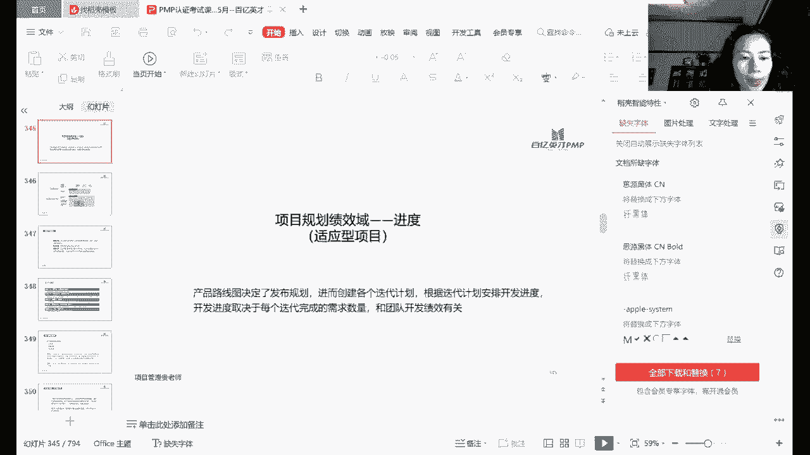

好我们之前反复的在强调适应性的项目呢，在由我们的项目章程之后啊，会有产品的愿景，产品的愿景呢会出现产品的路线图，产品的路线图呢就决定了我们这个产品，它的整个发布的规划，发布的计划是什么样子。

那细到每一个发布之内呢，又会具体到每一个啊，它的迭代的计划到底是什么样子，那根据它的迭代计划呢，哎我们要根据它的这个长度啊，判断一共有多少个迭代，然后呢一共设计了多少个发布。

粗不能够预判出来这个适应性的项目，它的整个这个开发的过程，或者说整个产品的过程啊需要多少的时间，那具体需要多少时间呢，其实跟我们每一个迭代的长度，以及每一个迭代当中能够完成的需求数量，是直接相关的啊。

这些需求的数量除了它本身之外呢，还取决于我们团队的开发技巧啊，什么意思呢，就有的需求数量哈，拿给这样的一个团队，和拿给另外一个软件开发团队，他做出来的东西肯定是不太一样的。

所以这个为什么我们市场上面其实做嗯，软件开发的团队其实挺多的对吧，但是呢软件开发和软件开发之间，还是有一些不同点，有一些区别的，这个行业内的人应该都很清楚哈，这个展示图就更加的直观了，产品愿景啊。

有产品路线图，产品路线图呢驱动了我们的发布的计划，比如说发布一发布二发布三，他经常经过多少个发布，然后每一次发布里面呢，它又有多少个迭代，迭代一迭代二啊，一直经过n次迭代，那迭代出来之后呢。

a迭代计划安排特性开发的一些进度，那每一个迭代计划里边呢，唉可能完成多少个用户故事，然后每一个用户故事呢，具体它会涉及到一个用户故事，他设计的工作量是多少，这个工作量呢在我们的适应性项目里面。

我们是用故事点，来估算的，那是用故事点哈，不是用人听，这个要跟大家说啊，今天的晚上的课程当中呢，我们也会详细讲到，这个故事点到底应该怎么去估算哈。

发布计划是指的是什么呢，发布计划就指的是啊经过了多个迭代的预期，交付的日期或者特性或者成果的期望值，迭代计划呢是进入到一个当前的这个迭代，它要做的详细的计划是什么样子，测试计划大家都好理解。

测试计划一般的都是描述诶，这个被测试的可交付成果，或者说可交付物，它要进行的啊哪些测试，然后测试呢要经过什么样的流程啊，这发布计划和迭代计划本身呢，嗯他们是针对哪一部分的，大家清楚了哈。

那么出来的这个成果呢，大家也应该称也应该很清楚了啊，发布计划啊，又出现我们的这个产品的代办列表，迭代计划呢是出现我们的迭代的啊，产品待办事项列表。

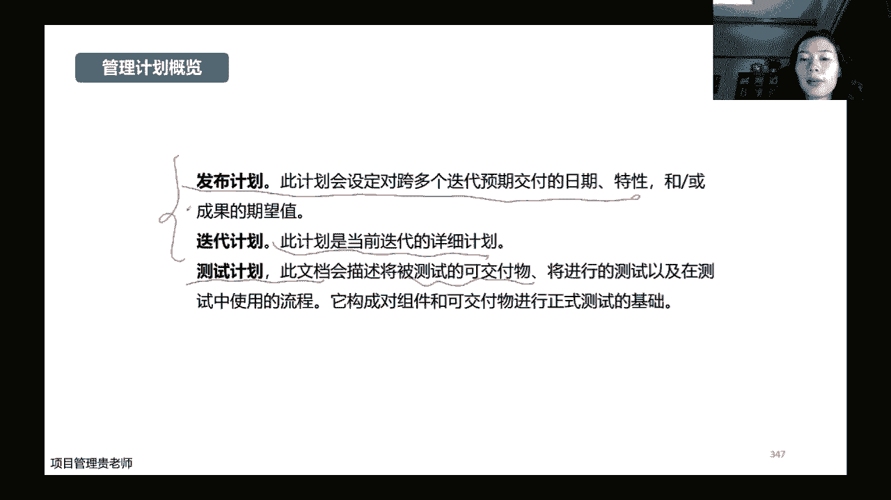

这举了一个例子哈，这个例子呢嗯举微信，是因为大家对微信特别的熟悉，特别的了解，那对微信现在了解呢不意味着说对微信的啊，最早开始发起这个软件的时候，不一定对他的这个发起过程和发展过程了解哈。

这给大家详细的就是列了，他从嗯十几年前开始有微信这样的一个产品，那么一直到嗯现在我们微信呢，基本上国内每个人都有这样的一个软件，并且呢几乎微信我们可以链接所有的小程序啊，公众号呀。

然后去迭代到其他的一些这个apple，对不对，那他其实在2011年的时候，刚开始有这个微信，他其实只能说唉我设置自己的这个头像啊，发送一些简单的信息啊，这个发送了一点图片啊，把这个手机的通讯录里面去。

导入到我的微信的好友，只能有这么一点功能，所以微信刚开始的时候确实也被很多人吐槽哈，那么到有这样的一个初步的一个产品之后啊，这是发布一啊，你看看一点发布一点版本，然后到二点版本以及三点版本的时候呢。

他就开始快速的迅速的去迭代，每个月迭代一次好，具体实现了什么呢，3月份干了什么，4月份干了什么啊，5月份，6月份，7月8月，每一个月都会有一些新的功能被迭代出来，然后到2012年的时候呢。

微信四点版本开始发不出来了，他这个时候就已经开始走平台化了，因为它开放了api接口啊，进入了很多的这个公众号的一些后台，并且呢增加了一些这个朋友圈，朋友圈的这个功能哈，嗯他其实这个几个月的时间。

迭代了有30多次啊，说明微信确实这个张小龙的团队啊，在最开始做这个产品的时候，确实是精益求精，下了不少功夫，所以他现在才取得啊这么多的用户的注册量，以及这么多用户的一个依赖性，到2013014年呢。

哎微信的这个五点版本和六点版本出来了，那个时候呢，他就不再仅仅是简单的是一个平台化，只是接入，只是开放接口而已，他开始有一些商业化的一些这个小产品，附加的一些产品出来，比如说啊我们这个要开订阅号啊。

如果说你发这个订阅号，一般应该是每个应该是每个月啊啊，可以发这个特定的次数，然后超过次数开肯定要收费，然后增加一些这个表情商店呀，然后游戏中心啊啊微信支付啊，微信红包啊，这些都是一些现在比较有的功能。

那我们到现在哈，目前为止到202几年为止呢，微信就发布了六点版本以及七点版本，这个时候就开始微信就开始做生态了哈，那我们现在所有的这个小程序，基本上大家如果说啊有了这个小程序之后。

你还会选择去下载对应的app吗，不一定对不对，因为我小程序直接从微信里面可以打开，多么方便，同时呢哎微信现在又开始做视频号，各种短视频，整个全新再做一个改版的升级哈。

嗯所以你看啊这个微信的这个产品的例子，就是一个典型的一个适应性的项目，他跨了周期十几年的时间，而且呢是不是到现在2023年，现在是6月份，是不到6月份它的发布就已经截止了，不一定哈。

他一直在根据市场变化，根据用户最新的需求去寻找他的新的功能，所以后面会不会有8。0九点，这个一定是会有的哈，具体会有什么功能，我也很期待，我们大家一起都拭目以待。

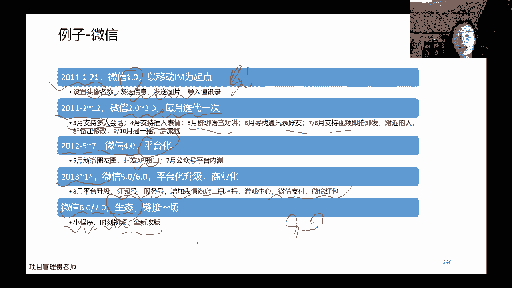

好我们讲用户故事的估算呢啊它是工作量，复杂程度和不确定，都会影响到我们具体的用户故事估算哈，那估算的这个单位呢，我们是说一个故事，不是说这个用户故事它需要多少个人天来完成。

而是说这个用户故事他有多少个故事点，为什么要用故事点，而不用人天呢，因为每个人完成同样复杂程度的这些用户故事，所需要的时间是不一样的，这个大家可以理解对吧，而故事点呢是啊，几乎是一个团队当中。

或是这个行业当中，大家都认可的一种计量的方式，而速度是什么呢，速度是一个迭代当中能够完成的故事点数，这个是取决于每一个团队它的开发的速度哈，这个速度就直接决定了我在一个这个团队。

在一个迭代当中到底能完成多少个故事点啊，多少个故事点用可以折算成多少个故事，用户故事，嗯估算的工具和方法呢有以下这么几种哈，首先啊宽带德尔菲，宽带德尔菲呢，它其实我们前面都还讲过这个德尔菲技术。

大家都知道，对不对啊，一群成员匿名的去提交他的估算结果，然后呢再有这个专家，再有这个主持人一个一个的去跟这些专家去，或者跟这些成员去沟通啊，然后呢尽可能的啊，最后的时候。

大家的结果都还是比较相近的一个数值，那么啊相比较于我们之前讲过的数据，需求当中的德尔菲技术，宽内德尔菲呢是在大家匿名投票之后，会开放空间，让大家共同的交流和讨论啊，之前我们讲的德尔菲是由主持人。

主持人分别去问啊，12341分别去问1234个专家，1234个专家给出意见之后，再由主持人分别去跟1234个专家，单独私下去沟通，对不对，但是宽带德尔菲是要开放空间，让大家共同的交流和共同的讨论啊。

这个是一个技术，这个技术呢嗯一般大家了解一下，一般考的不是特别多，在我们适应性里边嗯。

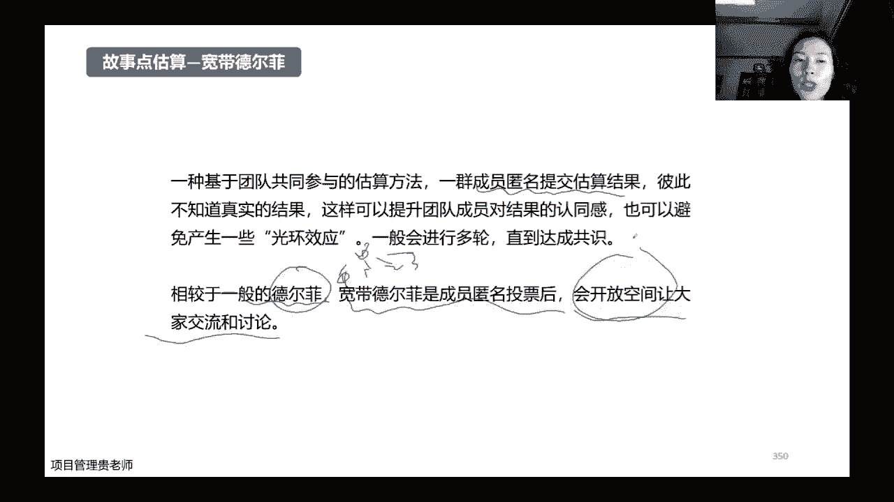

那上一个考的不多，这个就考的多啦，斐波拉契数列，斐波拉契数列呢基本上是啊，考试肯定是会必考的哈，他是具体是怎么样一个数列呢，它的数列就是这样子的啊，不要问我为什么是这样的。

因为这个研究出来的这个一个定理，这个定理它是满足什么样的一个规律呢，它是每一个数字啊，都是前面两个数字的和，你看二是1+1啊，三是1+2，五是2+3，八是3+5，十，三是5+8啊。

它每一个数字呢都是前面两个数字的和，并且呢后面的数字都比前面的速度大多少呢，大大概60%左右，这个定义啊在自然界用的非常多啊，据说这个向日葵它中间的这个每个葵花，这个每个瓜子啊。

它的正弦就是正弦排列和反旋排列，是满足这个规律的，就是这个法子的这个数量，然后呢说这个菠萝呢，它菠萝的这个鳞片它也是这样排，然后鳞片的从某一个角度来看，它的这个数量也是啊。

1122也是满足这个菲波拉契数列的，嗯当然我不是研究植物学的，这个大家都这样说，我也看不懂啊，但是呢我知道在敏捷当中，在适应当中。

我们这个菲波拉契数列到底是怎么用的，嗯非凡那些数列呢，根据他的这一个数列，那么现在用的比较多的呢，就是我们估算的时候会用到计划扑克的这样的，一个这个呃这个实实在在的一个工具，那它它真的是一个扑克牌哈。

他的扑克牌里面是哪些数据呢，诶他是基本上是有这么多些数据，这些数据呢基本上是满足我们刚刚讲过的这个，斐波拉契数列的，嗯其中呢有一个呢这是21哈，然后呢这个是44，然后这个是呃往后加34。

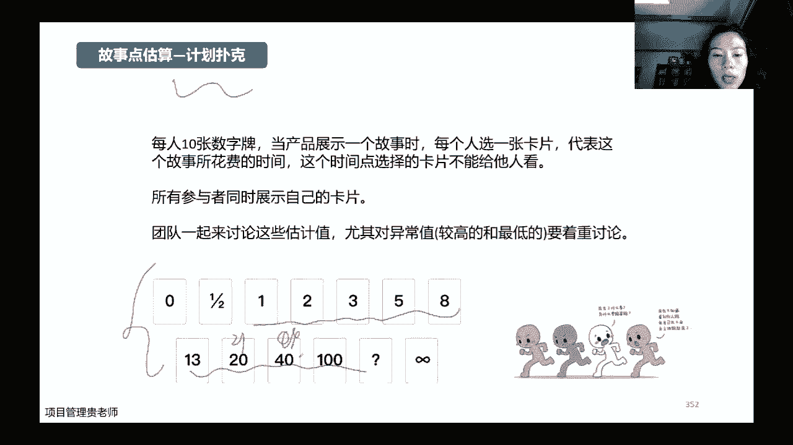

55，34 55，这样子慢慢的在估算的过程当中呢，哎大家就觉得你看这个21，因为是估算嘛，所以呢它不会说完全的精确，会有一定的这个误差，那么我21跟20啊差的其实也不是很多，而且我要是说21的话。

那么我们最后再算这个故事点的时候，不是特别方便算啊，所以呢基于这样的一个这个实践过程当中呢，大家就把21啊，34啊这种直接就优化成了直接是20啊，直接是40，所以现在流传下来的扑克牌里面，他就不是言言。

不是完完全全严格按照菲波拉契数列去r，21 34啊，50啊，就不是完全按照这种了，而是1235 83，20 40 100都是这样子的哈，这个扑克牌怎么用呢啊，一般情况下呢。

就是产品负责人会去阐述他的用户故事，然后呢每个人手上呢，每个人是指的这些团队和开发团队，开发团队，每个人手上呢他会有自己的一张卡片，然后呢他可以听完产品负责人的描述之后啊，根据他的预估。

他觉得这个用户故事需要花多少个故事点，然后呢就出它对应的那张这个牌，出牌的时候不能给他看，然后呢等到这个主持人宣布啊，说现在可以，大家可以量子的这个牌啦，大家就把自己心里面理想的这个故事里，同时亮出来。

这样呢同时亮出来之后，就一定会存在一些这个不同的结果，对不对，所以呢大家再根据这个不同的结果去讨论一下，为什么你觉得这个用户故事需要花五个故事点，啊，啊为什么这个b同学又觉得啊。

这个用户不是要花三个故事点呀，大家讨论讨论，然后呢综合一下意见，这个讨论的过程当中呢，拼写比较异常的，比如说大家这个二啊，三打五啊啊这种是比较多，突然来了一个40啊，这种尤其是比较异常的这种。

一定要着重讨论，看看他为什么要讨论事实，是不是有大部分人都忽略到的一些问题哈，这个是具体的用法用法嗯。

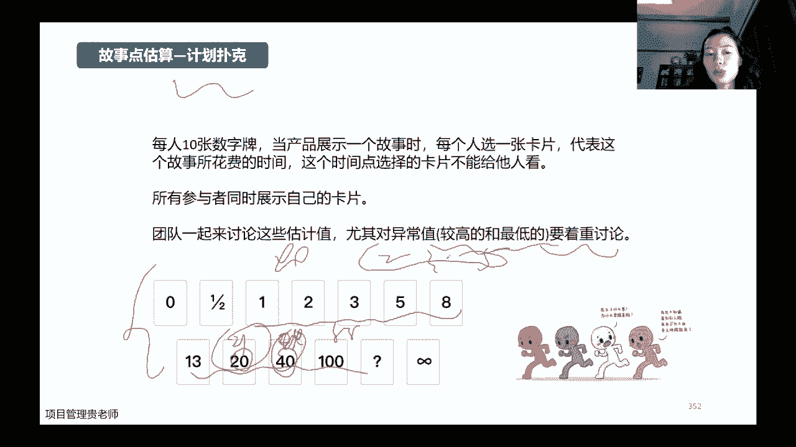

然后还有一种呢是这个清河估算啊，清河估算呢，他是说就是我们快速的估摸一下，这个用户是它大概有多少，至于到底是几个故事点呢，我们不搞那么详细，不搞那么复杂啊，我们之间呢就是类似于这个啊衬衫尺寸啊。

一般这个大家买衣服啊，买衬衫都有码，对不对，那么我们直接预估一下这个用户故事，大概就是xs这么大，然后这个故用户故事呢，他大概就是m号这么大啊，大家呢就是根据自己的这个啊，对这个用户故事的理解和认知。

然后呢去把用户故事把它分类分在这个地方啊，分在这个地方之后呢，大家就按照不同的这些尺寸去给他做分类，这样也是一种ok的一个估算的方式哈，但是显然这种估算方式呢，它没有非光拉起速率嗯，那么的准确。

菲波拉契数列还是相对要准确一点。

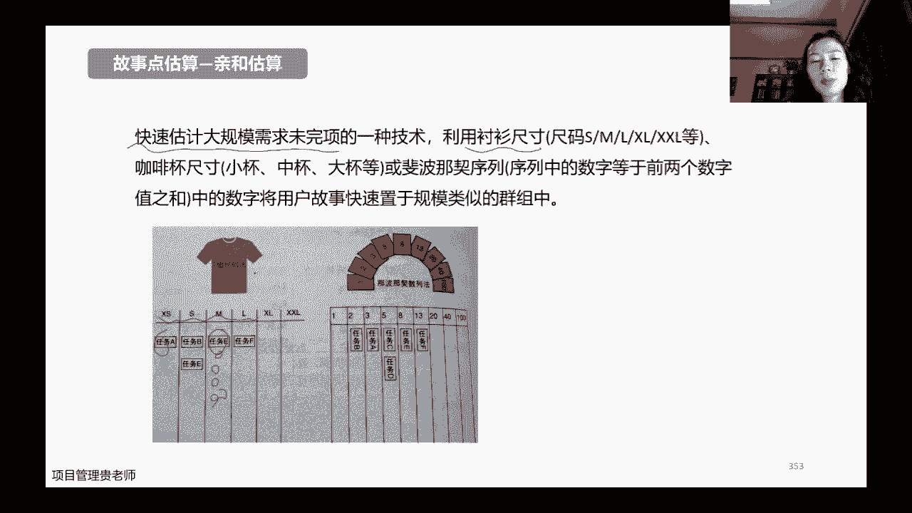

好前面讲了这个我们的用户故事点，怎么去估算哈，那么下面呢就讲我们的这个sram的五个事件啊，之前的课程当中我们不是讲这个sram框架吗，加scrame框架不是跟大家讲过。

说我们square的核心啊是3355吗，还记不记得还记得13是哪两个，三三个弓箭已经讲了，还记不记得三个弓箭是哪三个弓箭，如果记得可以在评论区敲一下哈，然后三个角色对不对。

然后五呢今天晚上要讲一个五个事件，其实他也在五个会议啊，然后最后在讲团队的时候，还会跟大家讲五类价值观，啊这个是放在团队绩效里面讲，今天晚上讲的就是这个五就是五个事件，是哪五个事件呢，嗯从这开始哈。

首先我们的这个plan plan其实它有两个哈，它一个呢是基于我们的产品代办事项列表的，一个这个计划，然后另外一个呢是我们的迭代的计划，迭代的计划呢是啊，决定了我们这一次迭代。

具体做的这些用户故事是哪几个，然后呢这些用户故事拆分成它的用户故事点，具体的任务它是有多大多大的用户故事点，所以它出来的呢是迭代的蛋白石项列表哈，注意大家区分一下产品区分，区分一下产品代发事项列表。

和迭代代发事项列表，他们两个是不一样的哈，前面我们讲三个弓箭的时候，他们也是三个弓箭之中的两个，对不对，讲过它的区别，大家还记不记得讲过它的区别哈，产品待办事项列表，是基于我整个这个产品的这个发布啊。

所有的迭代加在一块儿，我识别出来的这些产品的代办列表啊，是综合的，但是呢我的迭代迭代的代办事项列表呢，是我马上要进入到这一个迭代的这些行用的，马上要进入这个迭代的啊，具体的这个事项到底是什么。

它是所以它叫迭代的代码事项列表哈，这两个大家不要忘了啊，一定不要忘了它们的区别，那我们说了迭代蛋白事项列表呢是约定了诶，我们这一次迭代当中，具体啊到底要做的事项是哪些啊，他们的这个大小是多少。

以这个第三个这个会议，第三个事件，每一天都要召开的，召开这个会议干什么呢，召开这个会议，主要是让大家啊紧锣密鼓的去围绕，我们这一次迭代当中的这个事件去做啊，每天要汇报一下自己的进展。

汇报一下自己的问题啊，汇报一下自己项目计划做什么事，所以呢他既然要汇报自己做的事，那么就体现出来了，我们的一个进度的一个这个状态，这些建筑的状态呢在我们的摄影学项目当中，我们是用燃烧图啊。

燃尽和燃气都ok，他们都叫燃烧土，啊不叫燃烧图，后面会跟大家讲展示哈，那除了每日展会之后呢，还有我们的这个这个第四个第四个事件，或者我们叫第四个会议，叫做迭代的评审会议，迭代的评审会议呢。

它也会出现产生出来一个输出，这个输出呢是我们前面讲三个部件当中的，第三个弓箭，对不对，产品增量，因为我们说了每一个迭代，它一定会产生有价值的可交服务，对不对，这个可交服务即使到最后啊它不会被发布。

但是呢不代表说我们这个迭代，它产生的可加负面价值啊，那这个迭代评审是干什么的呢，迭代评审就是来评审我们这一次迭代当中，做的这些事项啊，是不是满足了我们用户故事的验收标准，就是做这个事的，那最后呢。

在迭代的最后还有一个迭代的回顾会议，这是第五个会议哈，第五个会议迭代回顾会议是干什么的，因为我们说了，在整个这个迭代期间，我们要非常紧张地，围绕我们的这些迭代的代办事项去做，对不对，嘶。

那大家都在忙于做事啊，万一出现一些问题啊，出现一些新的团队协作的问题，或者新的一些需求的一些问题啊，或者关于这个其他的一些产品，代办事项的列表的问题，我们发现了，但是呢在这个迭代里面。

确实是没有时间去解决这些问题的，那怎么办呢，我们放在回顾会上面去详细的讨论啊，看看下一步到底应该怎么做，好，下面呢会具体的再跟大家讲一讲这五个事件哈，这五个事件呢非常重要。

考试呢嗯一定会考这五个世界会不会全考，不一定，但是呢这五个事件是一定会考的，所以为了更好地了解这个事件呢，我们首先了解一下这个冲刺哈，冲刺呢其实它就是在一个迭代上，它就是迭代。

所有啊剩一些项目的一些创意啊，啊一些需求啊，一些用户故事，都是通过迭代啊来产生实际的这个价值，它以每一个迭代呢它都是固定时长的，一般情况下会小于一个月啊，那我们前面说微信在做朋友圈的时候啊。

是花了四个月的时间给他了30多次，那大家可以算一算，四个月迭代30多次，那他肯定每一次，每一个这个这个冲刺的时间至少是小于一周，对不对，大家都非常紧张，所以我们一般在说一个迭代的时候。

一般都会小于一个月哈，太仓的迭代是不太方便大家去这个协作，去快速的迅速的去反映的，然后呢，实现啊，这个产品目标的所需要工作都在迭代之内啊，为什么呢，因为我们每一个发布，最终落脚点就是在迭代当中，对不对。

预测进展啊，用燃烧符去预测，只有产品负责人可以取消这个迭代，为什么，因为产品负责人他是要对产品的代办事项，列表去负责的啊，到最后我们可能有一些这个事项，他是在产品，大概是像列表的这个排的优先级比较厚啊。

那到最后的时候到底是做还是不做，这个是只有产品负责人是可以做这样的决策的，产品负责人为什么可以做这样的决策呢，是因为产品负责人的底气啊，是来自于客户或者来自于发起人团队本身，包括敏捷的教练。

他都是没有资格去把，擅自的去把一个迭代去把它取消的哈。

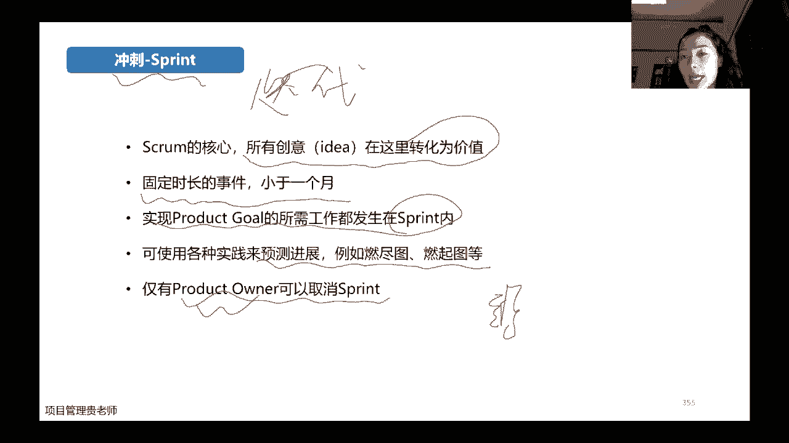

产品代办事项梳理会它是什么呢，产品代办事项梳理会，是我们的这个啊五个会议的当中的第一个哈，他参与的人呢是由我们的scremaster square master s m呢，他是我们的啊敏捷教练哈。

它跟pm跟我们项目经理的职责呢，是有一些区分的，其实这个里面啊developers是团队还是开发团队，然后呢p o是产品负责人，supermaster是敏捷政令，这三个角色啊后面在讲团队效益的时候。

会具体跟大家解释哈，现在呢先简单的跟大家说一下，这个scar master敏捷教练呢，是帮助这个团队去排除一些障碍，让团队能够专注于这一次迭代当中，他们要做的开发的任务的，那开发团队本身那很简单。

开发团队本身就是去围绕这个开发啊，做做具体的迭代的计划，然后做开发的这个具体的任务，产品负责人呢啊是决定产品蛋白摄像列表，它的顺序优先级啊，去负责啊，把用户故事把它这个写出来。

这三个角色呢其实在我们预测型项目当中，它都是由pm来做的哈，所以有的时候考试哈，一般他不会说这个什么，这个敏捷教练跟这个pm，跟项目经理有什么区别啊，他不会这么问，但是呢一般情况下。

比如说他告诉你的场景是，有的时候呢他出现的是这个敏捷教练啊，这前面是一个市一级项目的一个背景啊，后面问你敏捷教练应该怎么做呀，然后有的时候呢他会问你哎呀，这个团队负责人怎么做呀，有的时候他会问你啊。

这个这个作为项目经理，你应该怎么做呀，在这种情况下呢，我们都默认为哈，默认为这个square master跟这个pm啊是一回事儿啊，因为他的职责最接近于pm，但实际上pm的职责。

应该把他们三个的职责都包括了，好接着讲产品代办处理会，需要有这三类角色都参与，然后他的时间呢一般不超过啊，整个迭代的这个10%，一般不超过这个时间哈，所以嗯这个产品代办史这个书理会呢。

也不是说锦囊开进到开，一直开，一直开，开太长的时间没有意义，用开这个时间开这个会呢，主要是为了决定哪几个事项，它能够进入到本次的迭代啊，确定了进入到本次迭代的这些时，把它描述清楚，能够拆分成具体的。

可以执行的这个用户故事就ok了哈，其他的优先级比较低的，这些我们是不会放在这个会上面一直去拆它的，那它主要是为了马上要做的这个迭代，做一些准备工作，所以呢他要确保优先级高的一些工作上。

有必要的详细的信息，然后并且呢马上进入迭代的这些事项呢，是能够被我们的开发团队去理解透彻的啊，是非常紧急的，然后呢优先级是排序过的，这个是我们的产品代办的，梳理后要做的事情好，第二个构件冲刺计划会啊。

既然我们通过前面的梳理会决定了哪些事项，他要进入到本次的这个迭代，那我们还要开一个具体的冲刺的这个计划会啊，也叫做迭代的计划会哈，那么他参与的也是这三类角色都要参与。

一般情况下呢就是他的时间是这样子的哈，1~4周的这个迭代的话，一般计划会都会在2~4个小时之内哈，一般如果说它是两周的迭代，那你可能最多开个两个小时也差不多了哈，然后呢你要生成迭代的代办事项列表。

这个是这个会议核心的一个输出，这个会议的列表就相当于是你进入到这个迭代，那个工作指南，你要做哪些事，就是这个，所以呢他需要沉浸和排序的，这个产品代表事项列表，需要在这个会上把大的产品待办事项啊。

把它分解成小的，也就是说把大的这个用户故事把它分解成小的，能够直接开始干的这些，并且呢，啊这些小的这些用户故事被分解出来之后呢，你还要创建具体的这个工作任务啊，估算他的故事点，然后呢有一些任务呢。

你还要估算这个任务他要花多少个小时啊，这个估算好了之后，为什么要估算这个是因为这个估算好了之后，你才能够预判在这个迭代啊，我们比如说它的他的这个时间都是固定的吗，比如说两周啊，你只有把这个估算好了。

你才知知道这两周之内啊，给你五个故事点，你到底能不能完成，如果说不能完成的话，那么在这个会议上面是要提出一些异议，提出一些意见呢，我们前面说了，这些团队都要去参加的呀，就是为什么要站会哈。

因为为了确保时间要简短啊，所以你看这给的这张图，就是典型的每日唱会大家这一种形式哈，但实际上是不是非得站着呢，这个也不一定，只是说呢啊最开始的时候，这个大家觉得站得比较高，它的精髓。

他的精髓和核心还是啊，开发团队是一定要去参与的，因为开发团队要反映出他们今天做什么事情，他们马上接下来准备做什么事情，然后他们在做这些事情当中遇到什么问题，同时呢sm就是敏捷教练也会参与。

他为什么也要参与呢，因为他要了解整个进度如何啊，有没有一些这个这个迭代，有可能完不成的一些事项，要及早的做好一些计划或者一些应对，那有没有一些这个团队的一些障碍，它会影响到我们整个开发团队。

他的这个迭代当中啊，去没有办法让他们专心致志地去做啊，那这障碍呢sm要负责去消除，所以sm和这个developers是一定要参加的，至于这个po产品负责人，他是不是要参加这么详细的呢，这个倒不一定哈。

他可以选择参加，也可以选择不去参加，因为我们产品负责人呢，他最重要的是确定我们的pb 2，并且呢给我们的pr排序就ok了，至于pr怎么去拆，拆了之后它的这个故事点是多少，然后呢对应多少个任务啊。

这个在迭代里面做的到底怎么样，p o他是不参与的啊，他等到评审会的时候参与就ok了，一般情况下不会超过15分钟啊，这三个事情第一呢啊你从这个昨天到今天，你完成了哪些，然后第二呢你今天啊到明天之前。

你要做哪些就已完成哪些计划，做哪些出现了什么问题，需要帮助好，这个每日照会呢，大家要学习他的啊，不仅要学习它本身是怎么开的，也非常值得我们在日常的工作当中学习，因为大家可能多多少少。

都会参加一些各种各样的会议，对不对，那不同的会议呢，它的功能和他要达到的目的其实是不一样的，那像每日开会呢，考试当中他一般会给你一些场景啊，然后呢啊团队呀跟这个客户呀，或者跟产品负责人啊。

他们就在围绕这个问题，然后讨论讨论了很多之后呢，都没有什么结果啊，这个怎么办呢，啊，那这个时候我们就要用我们敏锐的头脑去判断，具体的这个问题解决的，他只是蝉鸣啊，我有什么问题需要去解决就ok了。

至于到底怎么去解决，解决方案，不是在每日展会上面去讨论的哈，这个很重要，这个嗯，考试当中出现这种场景的概率还是蛮大的，大家要注意区分哈，所以不同的会有不同的类，不同的会有不同的目的问题他可以去浮现出来。

但是问题的解决，可以另外再安排会议专题讨论哈，那第四个呢是冲刺的评审会，前面我们不是说了吗，这个呃产品负责人，产品负责人他要去参加这样的评审会，他不一定详细了解，但是呢他要通过评审会去了解一下。

我们这个会议啊，这个迭代到底有没有达到他的这个验收标准，到底有没有符合dod，对不对，所以呢啊这个会议会有sm参加或developer参加会，po参加，至于其他的一些成员呢，是不是要参加这个皮手会呢。

我们可以根据实际的情况去看哈，有的客户呢他可能会要求，那我们也可能去啊去邀请客户来参加，或者有的客户呢，他可能对我们这个项目不太了解啊，那我们也有可能去把他邀请到我们的评审会，上面来参加这样的会议。

为什么去邀请他参加这个评审会，而评审会呢是讨论的整个迭代完成的，可交付成果，对不对，那对于客户而言，他肯定是看这种阶段性的成果要更好一些，他的时间一般啊，也是两个小时左右，目的就是也是工作成果。

然后征求这个po对真工作成果到底有什么意见，是不是满足标准，不满足标准，下一步应该怎么怎么办哈，所以呢产品负责人要根据预先定义的验收标准，接受或者拒绝团的工作成果，这个上面呢会产生啊其中不同的结果。

第一种结果呢，就是产品负责人对这一次迭代当中的这些事项，很满意，对这个成果呢嗯看了一下诶，讨论一下，觉得他符合验收标准，ok接受是可以作为我们的增量去做交付的，那么还有一种结果呢。

是这个产品负责人觉得有需要优化的地方好，那基于优化你就会产生新的事项，对不对啊，产生新的事项，这些新的思想去了哪里呢，啊这些新的事项进入了我们的p p l当中，进入到我们的产品待办事项列表当中。

至于产品待办事项列表当中，进入去之后，是不是在我们下一次迭代之中马上就做了，不一定哈，不一定，它只是产生了，然后增加在我们的pp r当中，这是第二种结果，然后第三种结果呢就是糟糕了。

就是这一次迭代当中完成的这些成果啊，完全不符合我们的验收标准啊，那很不好意思，那可能这个怎么去整改啊，基于整改啊，也会产生一些新的思想放在p b2 当中，并且呢这个迭代，如果说所有的成果或者大部分成果。

都不符合要求的话，那么这个问题就原来大有可能会产生p br当中，可能会产生更多的一些事项，同时呢对于这个团队的一些绩效啊，管理，他们的自组织管理，可能会有一些新的一些这个点。

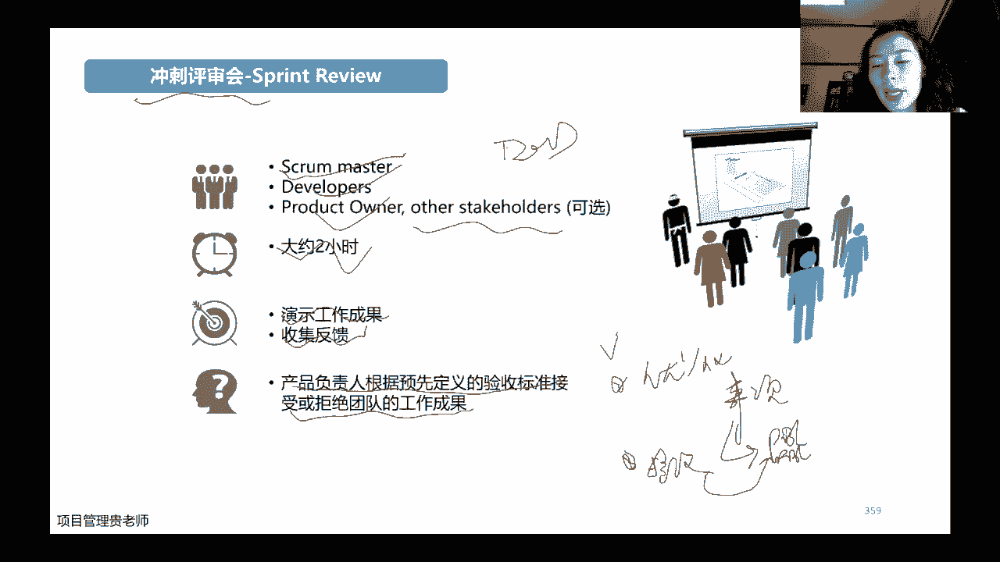

一些问题会出现，那第五个呢是我们的冲刺回顾会，冲刺回顾会呢啊是这三个角色他都要参与哈，它一般情况下呢是1~3个小时，目的就是为了持续改进，回顾我们在这个迭代中做的好的是哪一些。

我们下次迭代还按照这种节奏去做，还按照这种沟通方式去做，哪些做的不好啊，哪些做的不好，我们在下一个迭代当中，或者在以后的迭代当中怎么去提升，如果说为了提升这些啊，我们可能涉及到产生哪些新的这个事项。

那这些事项同样的，只要一直有新的思想，他新的思想就一定是，进入到了我们的产品代办列表当中，进入到我们产品代表类的列表当中，我们就要进行接受它的排序啊，所以我们在回顾的时候呢，也可以选择几个优先级。

更高的啊，最高的去把它去着重的去讨论，他的这个涉及到的用户故事以及用户故事点，并且呢每一个活动有分配负责人，就是说你在回顾当中啊，这个提出来的一些好的一些建议，尤其是优先级最高的。

这些就是优先级最高就是马上要开始做的，那马上要开始做的，优先级最高肯定是在下一个迭代当中，那你在下一个迭代当中要做的这些事项呢，你还要安排专人去跟踪一下，要不然的话这个问题提出来啊。

这个优化的建议提出来，没有人跟踪，那么在下一次迭代当中他做得怎么样，那可能也没有人去啊，做一个比对，做一个教研。

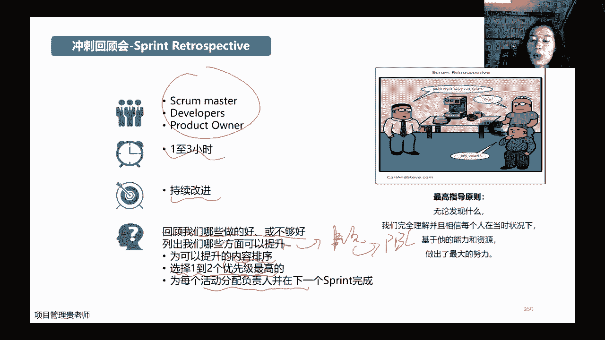

这个是冲刺回顾会哈，那这呢这这虽然是个例子哈，但是呢这个例子能够帮助大家更好的去掌握，在我们的这个两周的迭代当中，这几个会议，这五个会议他到底开的这个节奏是什么哈，首先站会嘛。

那么在迭代当中的每一天都要召开，那计划会呢，迭代的计划回答他这个是，迭代的计划会或者冲刺计划会，是在我们进入迭代的最初就要把这个会开完，然后平a省会呢是在我们这个迭代之后啊，这个迭代做完了之后。

最后一天去展示我们的成果，去接受我们的评审，回顾会呢也是在我们的评审会召开之后啊，在这个迭代的末尾去召开这样的回顾，梳理会呢是定期的哈，为什么呢，每天都会有可能会浮现一些新的问题，对不对。

那我们为了解决这些问题，就会产生一些新的一些事项，这些新的事项呢都要放在我们的p p r当中，我们这个是产品代办事项的梳理会，对不对，所以我们的这个梳理会定期的都会召开，定期召开的目的就是定期的去容纳。

去包容新产生的这些这个p br，所以这个这个图哈就是大家不要看到是个逆子，就觉得哎呀，我看一看就好了，仔细的看，仔细的看，还是能够更好的帮你去找到这五个会议，他开的时间点，节奏点，好嗯。

我们具体的迭代当中呢，有燃烧图去展示我们的整个这个项目，它的整个这个迭代当中它的进展，那这个燃烧图呢又分为两种，一种是燃尽图啊，一种是燃起图，什么意思呢，燃尽图呢它是说我们从一开始啊。

这个嗯展示的这个是我们理想当中的，从开始到现在，一开始我做的可能是啊这个35个，我要做35个这个故事点啊，那到最后一天我结束的时候呢，我故事点我应该生的是名，对不对，顺的是零啊。

这个燃尽了意味着我才完成了，但实际的过程当中呢，哎我可能他是这样的一个走线啊，这样的一个走线，每一个走线，每一个点呢代表我在这一天我剩余的啊，比如说在这是可能大概是个18。

这18呢代表是我还剩18个故事点还没做，这是燃尽图哈，那么什么叫燃起图呢，燃起图呢这个虚线也是理想当中，理想当中啊，到最后一点，比如说第十天的时候，我应该已经完成了35个故事点，我全部都完成了，对不对。

我一共就只有35个，那么实际呢它是这条走线，这条走线每一个点上面意味着哎，比如说我到第六天的时候，那我已经完成的故事点啊，这大概是个九啊，我完成了九个故事点，所以燃尽和燃起哈，它其实展现出来的结果。

展现出来的内容反映出来的事实是一样的，但是呢他表达的方式不一样哈，一个是用我还剩多少个故事点，一个呢是用我还我已经完成了多少个故事点，所以在考试的时候啊，就是嗯大家要知道哈这个这个什么时候选燃尽。

什么时候选燃起啊，或者说呢就是他直接更简单一点啊，考大家在我们迭代当中，用什么来展示我们的进度啊，就燃气图或者燃气图都行哈，那么跟我们具体的燃烧图相对比呢，其实还有一个叫累积流量图，燃烧土。

它是针对于具体的迭代当中的啊，前面举的例子也是一个迭代十天的时间，然后要完成35个故事点，对不对，那么我们的累计流量图呢，它不是完成，它不是针对于一个迭代，它不是针对一个sprint。

它是针对整个项目而言的，那这个这呢就是一张累计流量图，它的一个这个建筑展示哈，它里面的诶，他每个不同的颜色代表的是不同的啊，工作的这个阶段，第一个啊啊从这个开始，这个是这个最黑的，他这标的是部署。

也就是说我从第八个月到第16个月的时候啊，我开始做部署，那在部署之前呢，他这个代表的是测试，我可能因为测试嘛我有一些单元的测试，我要做，我可能从第二个月开始，只要有代码产生，我可能就会有一些测试的工作。

那再一个颜色呢，它是代表着这个颜色，是代表着开发，开发呢，当然我从一开始，我可能就会涉及到一些具体这个开发的任务，然后在这个是分析，啊在前面呢又是其他的一种表示，它在规定我们按照他给的这个图示表示哈。

那么从第一个月项目刚开始的时候，一直到16个月项目完成啊，这16个月之内我哪记得啊，每一个这个阶段啊，我完成了这个对应的要做哪些事情，然后呢啊每一个不同的这个时间点啊，我做了哪些任务，这哪些任务呢。

它是属于队列，是属于分析的，是属于开发的，是属于测试的啊，是属于这个部署的啊，它就是纵向呢可以看出来，坐下来可以看出来，我具体的这个工作队列到底是什么，然后呢剩余的任务到底是什么啊，从横向来看呢。

我们可以看到a比如说从这样一个节点啊，那我可以看得到在这一个啊，我完成到这一些测试，这一个这个分析，这一个这个测试这个开发，然后这一个测试，然后到这个部署的时候啊，一共花了多长时间啊，花了九个月的时间。

他就是累积起来的，所以呢这两个就是如果说考试大家嗯，比如说考大家这个燃烧图啊，跟累计流量图有不同的一些场景的话，大家都知道哈，一个是针对于我们整个这个项目而言的，那么另外一个呢是针对于我们具体的这个。

迭代而言的。

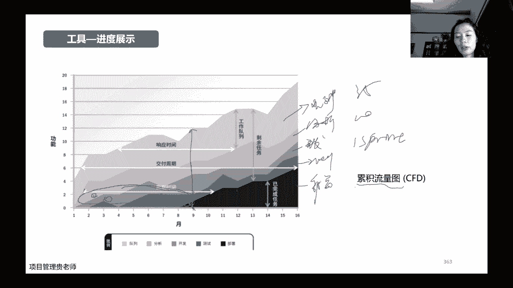

好这个是我们适应性项目它的这个进度啊，怎么去估算，然后呢怎么去展示啊，并且呢进度当中体现出来的五个非常核心的，这个会议哈，都跟大家讲了，那我们看一下这部分的题，他一般怎么考，第一题呢。

是说嗯这个执行主管呢正在检查一张图表，然后呢对他的四个面积团队，在上一次的这个迭代苏联进行比较，现在问题是，你觉得用这种方式去推断，哪个团队生产力最高的方法可不可靠，可不可靠呢，大家觉得显然是不可靠的。

对不对，因为我们每一个团队虽然说都是敏捷团队，但是每个团队他做的用户故事不一样呀，对不对，每一个团队做的用户故事不一样，它的用户故事点也不一样，所以你怎么去比它的速率呢，对不对，没有可比性。

所以这个c和d啊可靠，它肯定是错的，那a和b a说的是，速率必须在离校时间的上下文中才能够得到，团队生产力比较准的结果，而不是因为这个不可靠哈，是因为速率本身就不是很像，来比较团队几项的指标啊。

不能说我a团队完成了四个故事点啊，我b团队完成了五个故事点啊，所以我b团队的效率更高，不能啊，这直接这么简单粗暴的这么去逼哈，因为每一个团队他的这个啊技能，拥有的这个综合技能是不一样的。

然后他面对的这个需求，的复杂程度也是不一样的，所以呢每个团队他都有自己的特定的这个速率，这个只能团队自己去评估，啊第二题呢是说团队成员在抱怨，同样的问题在回顾当中继续出现啊，没有得到解决。

现在团队就说那就不要做回顾了吧，反正也没效果好，现在问你，那团队到底应该怎么做呢，嗯a呢是说在交替的迭代当中进行回顾，也就是说我一次迭代做回顾，另外一次不做题回顾，然后再一次迭代的我又做回顾。

是不是这个，但是你这个很显然不对，对不对，因为我们说了，每次迭代的结束都要做一次回顾，然后b呢是说产生更多的见解，然后呢，并且使用斐波拉契数列来确定行动的优先级，非波拉契数列是估算估算故事点的大小。

不对不对，他能确定行动的优先级吗，他不能啊，c呢是说确定行动的优先，确定行动的优先级，在一次迭代当中关闭这些特定数量的这个事项，这个呢是有可能的哈，这个是有可能时能够实现，为什么呢，因为我们说了哈。

回顾当中出现的这些问题，如果说要解决，那你是不是会产生新的思想啊，新的p p r对不对，那新的p p l，融入到大的这个p p l当中的时候，那是不是要重新的去拍他们的一些优先级。

如果说你确定了它的优先级啊，如果这个问题很严重，那你把他的优先级放到最高，放到最高，它自然而然的就就进入到了下一次迭代当中，进入到下一次迭代中，它能够得到解决，对不对。

所以呢c是一个可行的一个行动之一哈，d老是说让最有经验的团队经理来负责行动，项目已经关闭在敏捷当中哈，在上一级项目当中，一定不是团队精力来负责追责行动，一定是团队本身来负责行动的，好第三题。

第三题呢是说敏捷团队可以使用什么向客户表，保证他们争吵者啊，实现产品发布目标前进，也就是说你拿什么跟客户说，哎呀我确实在朝这个目标前进，我的这个进展是这样子的，对不对啊，那我们看了一般啊，a燃烧图是啊。

我们说燃烧图它是敏捷团队，是适应型项目，要展现他们进度的一个这个图表，对不对，那么燃烧图是对的哈，b呢是说一般进度状态报告，我们敏捷当中，一般情况是不用进度状态报告的哈，c呢需求分析报告。

需求分析报告没有办法展现你的进步啊，你光跟客户画饼有什么用呢，对吧啊，d回顾图表，回顾图表呢它也是主要是基于团队内部去看的，看看他们自己有什么优化的点，第四题呢是说嗯这个经验丰富的团队成员。

注意到一个新的团队成员，总是不能对线团迭代的承诺，也就是说他总是这个在每个迭代当中，领得有自己的任务，但是呢每次任务都完不成，对不对，是这意思，那现在问你，你这个经验丰富的团队成员应该怎么做呢。

a呢是说啊，要求该团队成员将承诺分配给敏捷管理专业人，士，要求该团队成员将将该承诺分配给团队，管理专业人士，经验丰富的团队成员，你有这个权利吗，你要求他要求他把你的这个事儿，直接分配给做更专业的人。

那你这个新团队成员不是永远得不到成长嘛，对不对，而且这个经验丰富的团队成员，他也没有这个权利啊，对不对，b呢是说啊要求该团队，要求该团队成员的精力与其谈话，相当于是你让他的经历来找找他。

给他这个这个去去告状，对不对，让经理去压压他，那这样在我们敏捷当中也是不合适的哈，敏捷当中我们强调的是团队要合作，团队要互相帮助啊，互相成长，c呢是说ram主管啊，要对该团队成员施加压力。

其实其实b和c的这个问题啊是一样的，你这个去给这个团队成员施加压力啊，啊去找他团队谈话呀，去批评他呀，都是不好的啊，都是比较嗯不太利于团队发展的做法，d呢是说在回顾会议上去教导这个团队。

如何进行更好的估算，那么这个是一个可行的一个方式哈，嗯是不是一定是估算错了呢，这个不一定，但是呢我们如果在回顾会上面这个丰富的经验，丰富的团队成员啊，去引导一下这个新团队成员啊。

你是不是你为什么总是不能兑现承诺呢，你是不是一开始你就你就自己出这个排的时候，估算的时候你就出错了啊，你是不是都出小了，所以呢导致一步的完成，这是一种可能的这个啊这个原因哈，所以基于这个可能的原因呢。

哎教教他更好的去估算，这个是一个比较合适的做法，第五题哈，第五题呢是说，敏捷团队希望集体决定项目的可能规模，如果他们使用计划扑克来完成这项工作，那么会怎么办呢，将会做什么呢，a那是说通过使用故事点。

来估算公式的相对规模，那么说了计划，不过是不是就干这事儿的啊，还记不记得估算故事点有几个工具啊，帮大家顺便就复习吧，宽带德尔菲，计划补课，计划补课怎么来的呢，计划扑克是通过著名的斐波拉契数列得来的。

然后呢还有我们的清河，对不对，有这么几种方法啊，计划扑克就相对要准确一点，b呢是说通过将其粗略归类来进行估算，来进行估算，故事b呢它也是一种可行的办法，粗略的归类啊，用的是我们的这个氢和，啊。

然后呢c呢是说通过将其与过去类似的功能点，来进行不一样，然后呢d呢是说通过点数来估算故事点，不是通过点数来估算故事点哈，第一它描述错了，是通过故事点数来估算故事，不是通过点数来估算故事点。

所以这里面呢a b c，它其实都是我们来啊做敏捷当中，去估算用户故事的这个大小，估算它的规模的嗯，几种不同的方式哈，但是我们计划补课呢，它主要是用故事点来估算，而不是说用这个啊庆贺，更不适用我们的类比。

所以你看他每个题哈，就是他的答案都这个不合适啊，有直接明显错误的，然后有直接说的是对的，但是是不合适我们的这个题干啊，第六题，第六题呢是说这个项目呢属于初始计划阶段，团队需要这样的一份计划。

下面哪一个敏捷实践，能够帮助团队实现这个目标呢，a呢是说为产品代办事项的变更，设置进度计划的缓冲啊，这个嗯是一个可行的办法，但是呢我估计大家如果自己做题的话，这个不一定敢选，为什么呢。

因为一看到进度计划而已，看到敏捷敏捷都没有进度计划呢，哈哈怎么怎么怎么还有这个变更呢，啊我感觉哈没关系，我们先放一放哈，b呢是说会进度计划，增加加班时间来设置团队成员的期望啊，增加加班时间。

c呢是说为它增加额外的成员，就是相当于是b是加加加时间，c呢是加资源，d呢是对所有估算增加额外的点数，这个显然不对哈，是多少就是多少，我增加额外的点数，你不能说我是三个故事点。

我非要把它说成是五个故事点，这地是明显错误，然后b c呢加资源啊，加这个时间啊，都是我们在敏捷当中不太提倡的哈，都不提倡，那综合下来呢只有选a是相对合适的哦，它有可能是一个混合型的这种管理的办法。

所以呢他会有进度计划，然后呢组织上面呢也会有一些，也会有一些这个要遵守的变更的程序，那现在呢我们如果说要创造这样的一份，合适的一个计划，只有说呢如果我们产品代表市场要变更啊，那我需要时间来变啊。

我把这个变更的走变更流程的这段时间，我把它留出来啊，我留有一定的缓冲，好第七题哈，第七题呢是啊，敏捷管理的专业人士，注意到产品大概市场有一个新需求和新故事，很模糊，缺少验收标准。

那问你的是你看敏捷管理专业人士，这个其实就是我们的sm哈，他应该在迭代周期的哪个时间点，要求产品负责人提供更多的详情呢，诶这个是考我们五个弓箭的，对不对，你进入到这个迭代之后啊。

你还会存在新用户故事集很模糊吗，不会对不对，因为如果他这个用户故事很模糊，缺乏验收标准，说明他的这个d r还没做好，它不符合d r原则，对不对，缺少验收标准啊，上节课讲过的不符合doi的。

我们能进入到迭代吗，不能对不对，所以你应该在进入，这个是说回顾会，这个是每日的这个站，会这个迭代批社会，这个都是在我们进入迭代之后开的会，对不对，只有在我们前面的产品，待办事项列表的数理会上面啊。

才是进入迭代之前的会议，所以这个只有选a哈，我们接着讲哈，现在是把这个进度讲完了，我们现在要讲成本嗯，成本呢也是我们在项目的规划绩效率里面，又一个重要的非常重要的内容，前面讲过了啊，需讲过的范围需求。

啊又讲过了进度，那我们还要接着讲成本，嗯成本我们先看一下这个规划的变量哈，估算当中的信息呢，它会被运用到我们的这个项目的成本啊，项目成本的主要是用于我们做成本的基准的，项目的预算应该包括应急储备。

以应对不确定性，管理储备呢，主要是应对与范围工作有关的意外活动，诶这样大家说呢，可能大家还不明白成本基准是什么意思，还不明白应急储备是什么意思，还不明白管理储备是什么意思，对不对，没关系。

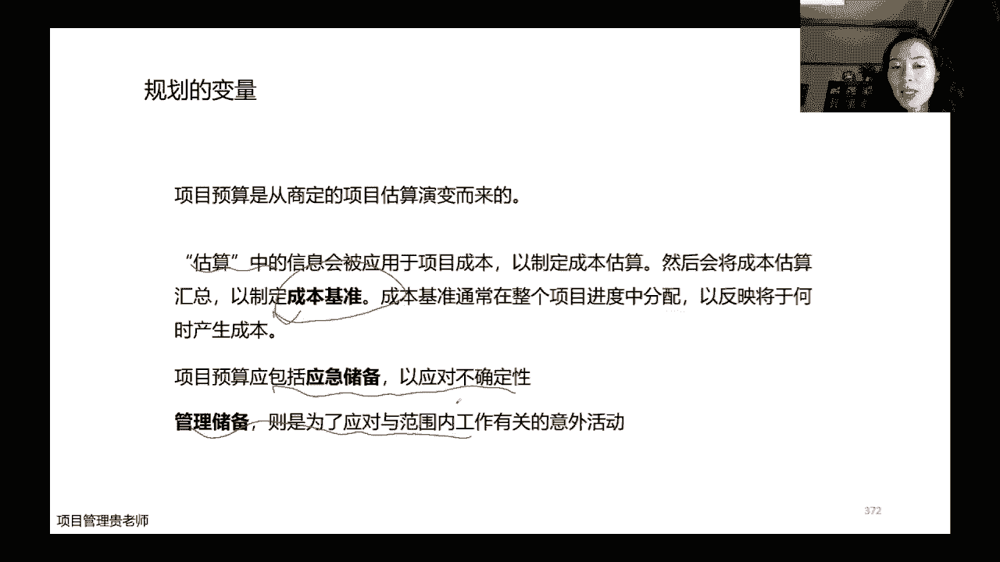

大家对这几个词儿先建立印象，我们马上来讲哈，既然我们讲成本的话，那么成本有几有几种不同的类型哈，大家是有必要去了解的，那么有哪几种不同的类型呢，首先直接成本，直接成本很简单啊，比如说我们做了这个项目。

它涉及到这么多的人，对不对，那么人员的差旅费呀，啊工资呀，为了做这个项目本身涉及到的这些直接费用，他都是我们的直接成本，那么除了直接成本呢，啊每个项目他都会有些过有一些间接的成本，什么是间接成本呢。

比如说好我们一个组织，他谈到这个项目上面，他有管理费用吧，对不对，你的人力资源部在你的财务部，行政部再给你服务吧，对不对，那这个管理费用是不是要摊销一点，公司的水电费。

房租是不是也要谈到这个项目上面贪一点，对不对，所以间接成本哈，那么还有一些呢它叫固定成本，固定成本呢也就是说不管你的工作量，这个项目市场啊是短是复杂还是简单啊，我这个固定成本都是固定不变的。

比如说我打印机扫描仪啊，这些还有一些是可变成本，可变成本和固定成本它是相对而言的哈，我们说固定成本它是你不管工作量怎么变，我固定成本它是多少就是多少，但是呢我现在可变成本呢，是说哎你工作量如果越多的话。

那么我可能涉及到的成本会增加啊，比如说我打印机，虽然说我买的是2000块钱啊，我已经在这没法变了，但是你打印机你用的多啊，你是不是你墨盒就用的多a4 纸，你整个项目耗时长耗时短啊，这个涉及到文档少。

那你是不是相应的这个原材料就用的少，就喝完了，还有一种叫全生命周期的成分，全生命周期呢就是在我们这个项目，在我们这个产品有在他使用有效期间发生的，所有跟它相关的这些产品，就从我们这个项目的设计开始。

一直到我们项目后期的这个运维开始，能够产生的这些成本都叫做全生命周期成本，然后还有呢叫沉没成本，沉没成本呢是啊，我觉得是每个人不仅应该了解，而且应该去正确的去看待哈，去啊去去去舍弃了一些哈，沉没成本。

他是说任何已经发生的成本啊，不管你这个成本是不是合理啊，沉没成本它就是已经发生了，你没有办法去改变的，为什么说这个是大家应该去嗯，在实际的工作或者生活当中，应该合理的去运用的呢，因为很多人啊。

他可能在自己的这个工作或者是生活当中，都会呃不自觉的可能做出一些错误的，一些确定的一些决定，然后呢，这些错误的决定导致你产生了一些花费啊，嘶那你为了嗯你的当有一天意识到，你的这些花费其实是没有必要的。

那基于人性而言，可能很多人就会觉得啊，我已经花了这么多钱了，我赶紧继续干下去吧，很多人是不是会这样，但实际上呢我们要正确的认识的哈，前面如果你已经意识到啊，你做错了决定，那么前面的这些都是沉没成本。

沉没成本及时止损，不要去管它，要不然你只会损失的更多，只会花的更多，好机会成本，机会成本呢，就是说我因为选择了一个项目，而放弃另外一个项目，然后呢，但是其实这另外一个项目呢，也能够给我带来很多的收益。

这个是机会成本哈，就比如说我们选择了a，比如说我选择做这个项目，那么我就没有时间做那个项目了，那那个项目其实可以给我带来啊，比如说10万块钱的项目奖金啊，这个项目呢有可能带来一个8万块钱。

但是我已经选了一个，选择了这个8万块钱的这个项目，奖金的这个项目，那其他的这10万块钱，他其实就是我的这个机会成本啊。

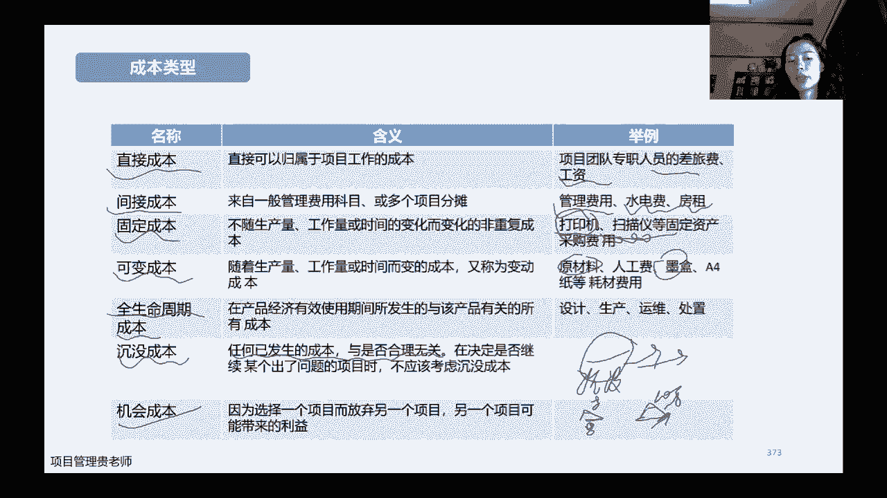

在我们的这个成本管理计划里面，也有这么几个过程哈，规划成本管理啊，估算具体工作任务的成本，然后呢再制定我们整个项目的它的预算，然后呢在执行监控的过程当中呢，去控制我们的成本，好规划成本管理呢。

它的输入输出是什么样子的哈，首先我们有项目章程啊，项目章程里面啊，说了有高层次的整个这个项目的预算，对不对，那我们工具也好，技术呢主要有数据分析专家判断，然后输出一个成本管理计划。

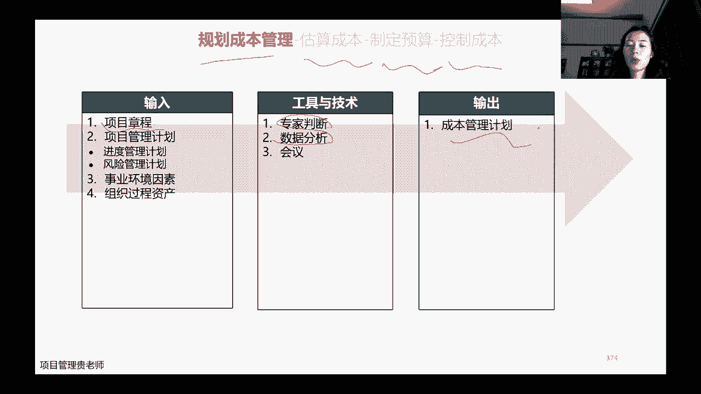

这个成本管理计划呢，它是我们整个项目管理计划里面，非常重要的一部分哈，它主要就是描述你怎么去规划你后面的，怎么去安排，怎么去控制你整个项目的这个成本啊，包括你用什么样的计量单位呀，你是用元还是用美元啊。

还是用万元啊，这个项目你有什么样的计量单位，然后你精确度啊，你精确到比如说啊，这个我估算每一个估算到一个工作班，我可能是这个999。59，我是精确到小数点后面两位啊，啊还是说我去整啊。

这些都是在我们的成本管理计划里面去约定的，如果说不约定这些会出现什么结果呢，会出现我们在估算的时候啊，有的故事点啊，有的这个呃工作包，他是啊保留到小数点后面两位啊，有的呢图简单啊，这个团队报上来的时候。

他可能就是999啊，所以到最后我们统一的时候，统计的时候没有统一标准排他的这准确度啊，准确度呢是说哎我这个估算的这些成本呢，我可能你说你说太准，我也不可能工作太准，对不对，因为任何一个项目没有发生。

那么一切都是有一定的变数，一定的误差的，那可能诶我比如说这幅10%的偏差，我都是可以接受的，然后组织程序的链接，就说我每一个工作包啊，它是由哪个账户去，之前哪个账户去这个负责，然后呢。

这些账户呢又跟我们自己的公司里面的，财务部去相关联，然后控制的媒介值啊，这个也是比如说我是啊这个超品成本啊，这个报告用什么样的格式啊，你是隔一个月编一次，还是说我按照资金给付的啊。

这个每三个月每个季度去编一次哈，所以说呢这些报告的格式啊，频率啊，这些都是在我们的成本管理计划里面，首先去把它约定好的，因为我们前面讲过，这些管理计划都是给我们具体后面这个过程，去做工作的一个指南。

断了吗，同学们，嗯我看我看有位同学说这个张巧玲说断了，断了吗，好不是。

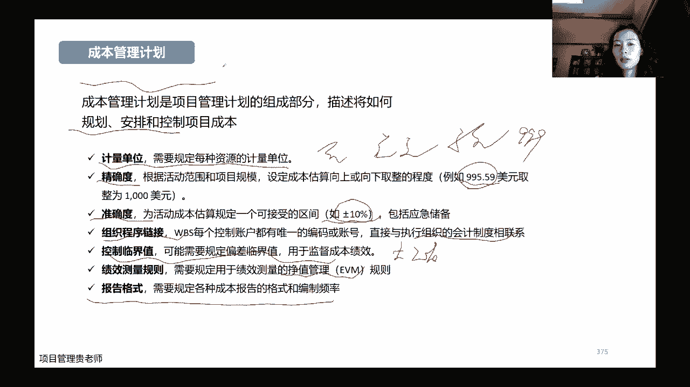

你直接，意思，哦好了好了，ok好，继续讲哈，嗯好吧，坏了，老师那边有点吵，不能专心难过，美人关着门，把书房的门关一下，看看能不能好一点。

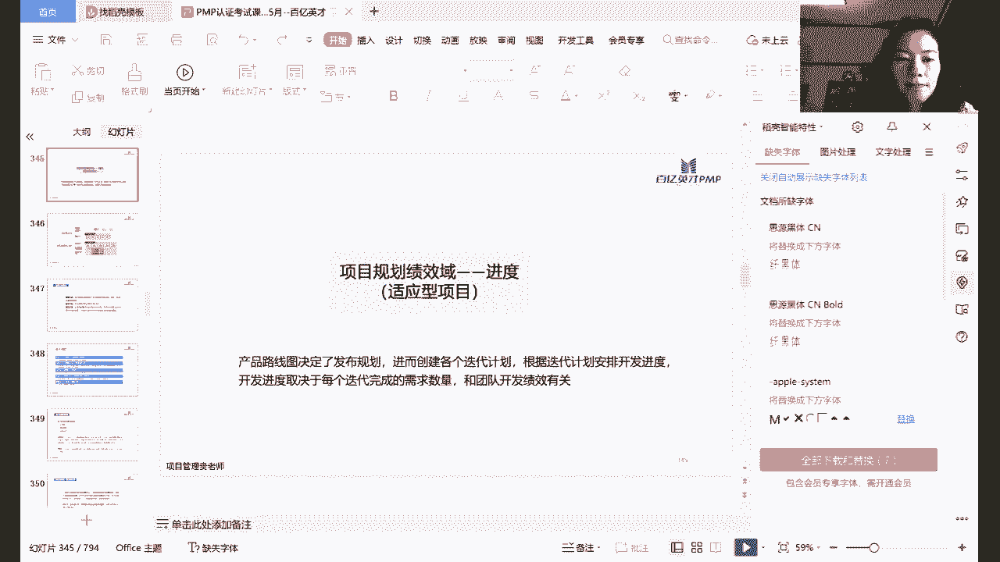

好接着讲哈，成本管理计划呢是用于定义w bs当中，用于测量它的这个控制账户，然后呢确定我们将用哪一种政治的技术规定，我们后面怎么去跟踪啊，这个项目完工的各项公式好，估算成本是干什么呢。

估算成本主要是对你完成工作所需要的资源，和成本做一个估算，就这样的一个过程哈，所以它的核心作用就是，你这个项目到底需要多少资金，成本估算的应该是在某个时间点，然后根据已知的信息所所做出的成本的预测。

在估算成本的时候呢，需要识别和分析，可用于启动和完成项目的一些备选方案啊，在生命周期当中应该干什么，这个呢，都是具体在我们估算成本的这个子过程当中，需要注意的一些事项哈，你看这有这有两个数据。

可大家可以去关注一下哈，我们一般情况下估算成本，其实它是有上下是有很大的这个浮动的，如果说啊是不-25%到正70%，这样百分之百的，就这样一个区间里面，它都是一个粗略的估算，确定性的估算。

-5%到10%啊，这个都是相对于我们所有项目的成本，估算里面啊，这个偏差数都已经是非常确定性，非常准确的，所以你当你估算一个时候，他告诉你，你这个项目估算的这个成本，大概是正-20%，其实并不粗略哈。

并不是很粗略，大家要理解哈，这个跟进度能力有点区别，进度呢可能一般到20%，你会觉得诶这个偏差是不是有点大，但是成本你估到这个20%的时候，其实还是相对比较准确的。

然后应该考虑向江夏项项目收费的全部资源啊，比如说这些通货膨胀啊，还有理解的一些融资成本啊，其实都要考虑到我们的项目的成本，当中去哈，为什么提这个哈，是因为我们嗯之前就是我，我去做私教的一些小伙伴哈。

他们在实际的成本估算当中，能够涉及到成本估算的这一部分内容的小伙伴，其实并不太多啊，因为大家更多的就是范围呀，进度呀，计划呀，然后干活那成本呢一般知道的会比较少一些啊，这个呢一个呢是这个嗯。

很多公司里面的成本，都是由财务部那边去直接去管控，然后还有一部分呢是大多数的这个人，大多数小伙伴都是在软件项目当中，然后都是与这个人天啊，来估算出来大概需要多少个工作量，多少个人天。

但是呢这个人天他到底对应的工资是多少，可能有些项目经理他自己也不知道，因为每个公司对于工资这一块，都是还比较隐蔽的，所以呢他们一问到他们怎么估算成本，最多的就是告诉我啊大概需要多少个人天来做。

然后呢我们基于一个行业平均的水平，平均的薪资去估算一下，他这个平均工资大概是多少，然后这么多个人天的话，大概是说有多少钱，但是呢即使是这样去算，也仅仅只是考虑了人员，考虑到他的直接成本的这一块。

那我们前面讲了一个项目，它还会有管理成本，对不对，它还会有一些固定成本，还有一些可变成本啊，这些其实都是嗯在实际的过程当中，大家会比较忽略的一些点，像通货膨胀啊，融资的这些大家可能就忽略的更多了。

对不对，但是不意味着我们在项目的成本估算里面，不应该考虑，这样不意味着两。

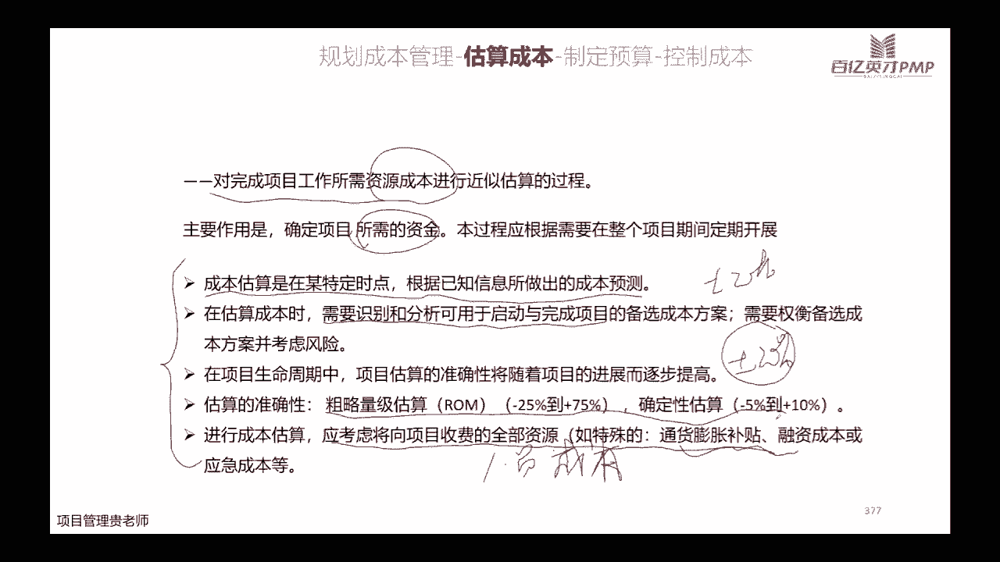

好估算成本呢它也有自己的输入输出，还有工具和技术哈，那么输入呢就是我们的成本管理计划了，然后工具和技术啊这几个比较重要，类比啊，参数啊，自下而上，还有三点估算，这些是我们前面估算进度的时候嗯。

跟大家详细讲过的，估算的方式怎么算的啊，在成本管理估算里边，它仍然是比较重要的啊，还有储备分析和这个质量，成本输出呢就是成本估算和估算的依据。

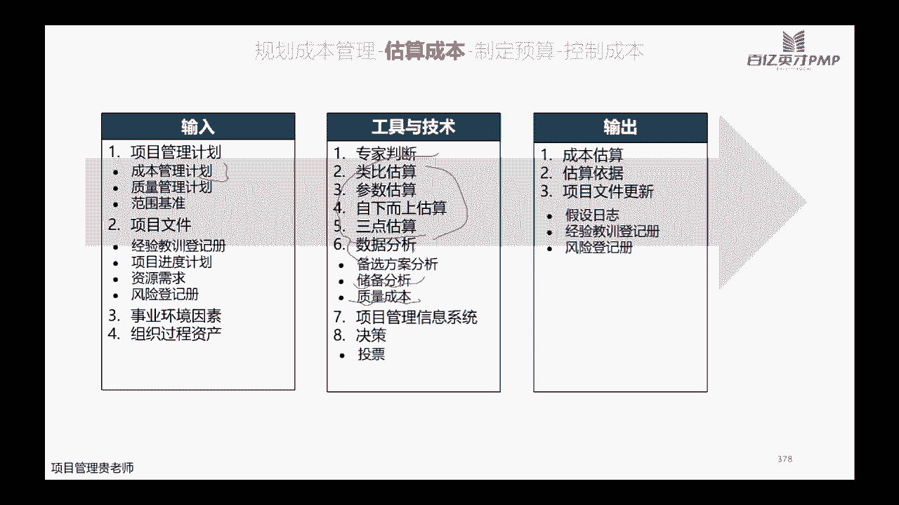

成本估算，你看他出来这张表哈，活动成本估算对应的，比如说我们对应的这个活动，我们说了，之所以做打bs要做编号，是因为我们不可能在后面做其他的规划的时候，我们还写巴拉巴拉什么什么什么什么什么项目。

什么什么工作报，不可能写那么多字出来，对不对，我们都是用编号啊，你看大家看后面的这些例子就知道了，这个编号有多方便啊，什么编号它需要多少资源，它涉及到的直接成本有多少，它非直接成本有多少啊。

它有没有一些啊，涉及到的一些风险需要用到应急储备啊，他是怎么样去估算的，他的这个规矩的方法，有没有假设的一些条件或者约束啊，附加的有没有什么其他的一些这个信息，这是我们的活动成本估算。

这个表里面会有的一些信息哈。

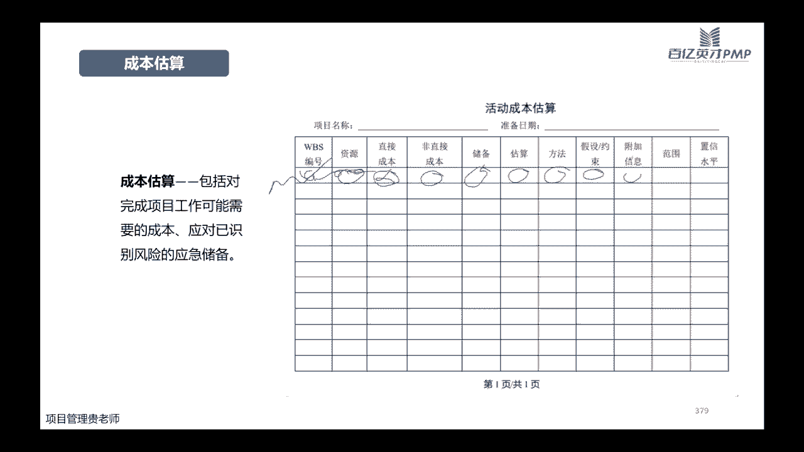

这儿呢有一个案例啊，你看这个案例里面人力成本我们刚刚讲过了啊，人力成本里面包括了这一些，然后还有我们具体实施的成本啊，啊比如说这个项目要去客户现场去驻场啊，那你会不会有差旅费啊。

那公司会不会有差旅补贴呀，然后如果驻场的话，是这个大家自己自掏腰包去住宿啊，还是说嗯公司统一给租房啊，统一给这个把物业费水电费都包括了，会不会有额外的加班费啊，啊这个办公啊，礼品招待啊，室内交通啊。

或者是一些工程施工运维的啊，其他的这些费用人力采购啊，然后然后或者是这人力服务啊，或者是整体的软硬件要采购成本的啊，这些都是我们项目当中比较常见的，比较常见的一些这个成本，然后还有我们的税费和资金啊。

其实还有其他的一些，你看看他这没网没继续往下逆啊，或者说呢我给大家截这个图的时候，没有继续往下截，它其实还有授权的一些费用，公摊什么意思啊，一个订单是销售拿过来的呀，对不对，那销售这个售前活动。

我是不是会涉及到一些商务的成本呢，啊，然后当然我们这个项目，如果说设计的周期比较长，它是不是也有一些通货膨胀的这些折损呐，是不是这都是我们整个这个项目的成本的构成。

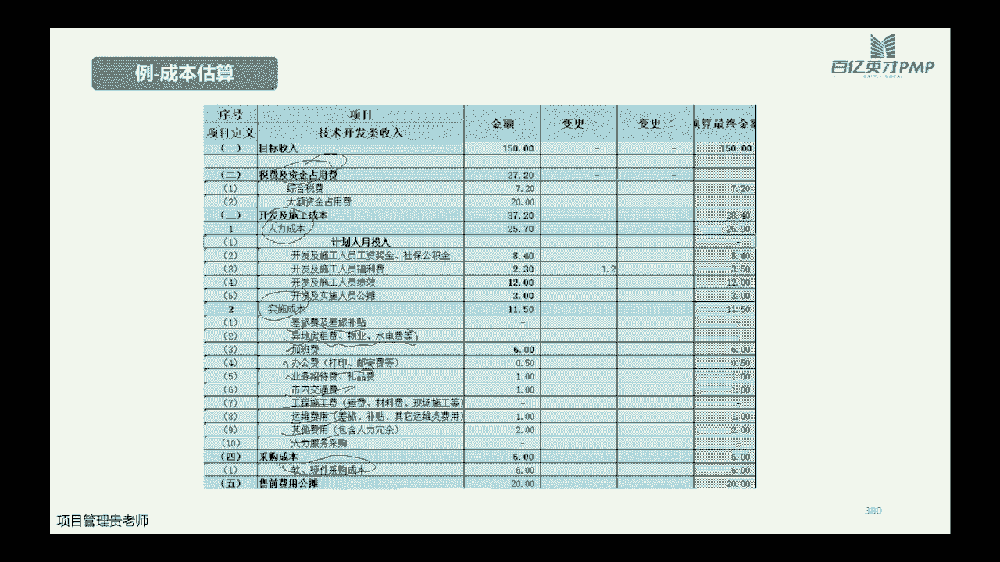

好估算依据哈，估算依据呢其实跟我们前面那个进度是一样的，它其实最重要的作用是告诉我们，你估算出来的这个数据，它到底是怎么编制出来的，嗯然后呢它有啊全部的假设文件啊，还有我们的制约因素啊，以及这个区间啊。

这样比如说我的这个是加减百分之多少，然后呢啊启动阶段一般就是粗略估算，然后后面我到这个项目越随着它进展的时候，进展的越来越多，然后呢我所嗯嗯能够呈呈能够去呈现出来的，他的这个啊区间。

其实准确度相当于说是越来越高的，所以它这个区间是越来越小的，好它涉及到的工具哈，有我们的这个质量成本，只要成本呢，这个也是一个啊非常重要的一个考点哈，这个考点怎么去理解呢，啊。

它主要是分了一致性的成本和非一致性的成本，这个一致性的成本呢它又包含了两种哈，一个是预防成本啊，一个是评估成本，然后非一次性的成本呢，包括内部失败和外部失败，什么意思哈。

首先我们从一致性成本和非一致性成本来看，一致性的成本是我在这个啊，相当于是我花钱啊来避免，尽量的避免我这个项目失败，然后非抑制性成本呢是我这个项目已经失败了，然后呢我要花钱去把它做一些弥补啊。

所以一致性和和非一致性这两个区别哈，那么一致性我们说又分为两种啊，预防成本和评估成本，预防成本呢是指诶，我们为了能够做出一个高质量的这个，可交付成果，那我们要做哪些工作呢。

哎比如说我们给团队成员做一些培训，行不行呀，啊我们在整个文件过程当中啊，我们去提高一些效率啊，我们用更好的设备啊，我们约定我们约定一个更这个啊理想，更符合实际的一个完成时间，对不对。

那这些都是我们是为了把这个产品，把这个项目做好啊，所花的一些钱，这个叫预防成本，什么叫评估成本的啊，我们这个项目做完了之后，那我是不是内部要做一些测试啊，我还要做一些破坏性的一些试验，对不对。

这些实验也要花钱呀，测试也要花钱啊，对不对，不花钱我也得花人呐，那做这个测试既然花钱有没有必要做呢，有必要做，对不对，因为这是我们必须要考虑的评估成本，那非抑制性成本呢，它也是包括有两种。

一种叫内部失败，一种叫外部失败，什么叫内部呢啊，什么叫外部呢，内部就是我还没到达客户手上，发现的一些这个成本发现的一些错误啊，比如说我这个项目我通过质量控制的手段，我发现嗯质量其实有一些不合格。

或者说有一些这个部件，他是有待这个有待考证的，那我可能要返工啊，啊或者是直接这个产品，它就这个这个组件它就报废了，我要重做啊，这个都是内部失败成本，虽然说我重做也要花钱，但是至少我的客户没有发现。

对不对，那外部失败成本呢很简单，就是已经除了公司之外啊，被我们的客户，对我们的用户去发现的这些成本，那发现了这些成本成本是什么呢，啊比如说客户发现了之后，那你是不是这个合同里面可能会有一些这个啊。

这个违约需要去承担啊，你是不是需要这个给客户去重新去做一批啊，做一个相同的这个产品，是不是要产生额外的钱，或者说这客户直接这个合同的金额啊，他就不给你对象了，甚至你以后也得不到这个客户的信任了，对不对。

所以一致性的成本呢和非一致性成本，以及它们包含内涵，我们知道了，那我们实际在做项目的过程当中，我们是要尽可能的去花一致性的成本，去规避非一致性的成本哈，因为越到后面啊，他花的成本是一定是代价。

一定是啊越高的，所以为什么我们在说质量的时候，都说预防是剩余检查的啊，所以大家看培训在哪里呀，培训是我们的预防成本哈，所以如果哪一天啊，你的这个公司的领导说我们还搞这么多培训，干什么，还不赶紧干活。

那你就可以告诉你，老板告诉领导说，培训是我们的一致性成本，培训是为了让我们更好的掌握，做这个项目的技能，培训虽然要花钱，但是培训是必须的，好呃另外一个工具呢叫储备分析啊。

我前面说质量成本和储备分析都是的呀，都是工具啊，好储备分析是什么意思呢，储备分析我们首先要了解应急储备和管理储备，应急储备呢是嗯，以应对进度方面的不确定性，其实呢他在这个里面的进度呢，也可以折算成成本。

因为一般情况在我们的软件项目当中，进度啊越多，你花的时间越多，你对应的这个人员工资他就越高，对不对，那什么是管理储备呢，管理储备是啊，整个组织为了管理好这个项目，特意流出来的一部分这个项目预算。

那这个项目预算呢，一般是用来去应对我们不可预见的一些工作，举个例子啊，举个例子，大家就能够了解，应急储备和管理储备是怎么样子的，比如说咱们在做这个评估的时候啊，评估一个事情。

嗯评估一个一个简单的一个项目吧，一个事项，比如说我们就把它叫做a吧，然后呢我已经预判到这个a呢，他有可能会有多花我两天的时间，然后每天的时间呢我可能要多花一个人啊。

比如说对应到这个每个人1000块钱一天啊，我多花两个人，我可能要这个多花一个人和一个人两天，我可能要多花2000块钱啊，诶我预判到了，那我给这个项目本身估算的时候呢，它可能它本身是要1万块钱啊。

现在呢我为了我预判到的这件事情呢，我可能要多花啊，他可能是加2000块钱这个样子，那我估算出来他的这个工作包的本身的，这个活动的成本是意外，然后呢他的给他留了2000块钱的一级储备啊，留了一级储备之后。

也就是说有我一旦预判出来的这个事情发生了，他真的需要这个人多干两天，那我可能这2000块钱就用这个应急储备，去把我的这个成本去把它覆盖了，那什么是管理成本呢，管理成本是啊，这个比如说啊同样的是哎呀。

我也预判到这个事了，结果在发生的时候呢，诶我预判到这个事情发生了，2000块钱花掉了，但同时呢还有另外的一个这个其他的这个事件，比如说这个是一事件啊，这个是二事件，还有一个二事件事发生了。

在实际的过程当中，但是呢我在刚开始的时候完全没有预判到，我也没有给他预估多少钱，我就是加2000块钱啊，我没有加3000，没有加4000，我不知道，但是现在这个事情发生了，要花钱，那怎么办。

这个钱只能从管理处未来啊，所以它是应对于未知的一些风险，好储备分析呢，还有哈，除了我们的这个应急储备和管理储备之外，还有我们要啊这个估算活动的持续时间，估算的时候应该考虑他的这个应急储备。

应急储备前面讲的就是我已知的已经预判到的，但是未知的这些风险，而这个管理储备呢它是你管理职位，它是包括位置位置的这些风险，在控制成本的时候呢，你要监督他的应急储备和管理储备的使用情况。

并且要及时的去判断，a这些储备是不是还够用啊，你的储备是不是这个，比如说我做前面那个例子啊，我做a哎，我做着做着我发现啊这一事件要发生了，我同时我也做的过程当中，我虽然之前没有预判到二。

但是我做的过程当中我预判到二啊，他也要发生，那我是不是要及时的在这个过程当中啊，去走个变更程序，然后拿一部分的啊，增加一部分的一级储备，比如说这个二本身要花3000块钱，我在这个过程当中。

我给他增加3000块钱的这样的一个应急储备，对不对，所以控制成本的过程当中要监测哈，那估算成本呢主要是为了应对成本不确定性，预算成本呢是啊，可以计算项目当中的一级储备与管理储备。

这个呢后面跟大家去用一张图哈，用一张用一张图去表示你在我们制定预算里边，制定预算里面制定预算本身呢，它就是说a你既然估算成本，每个工作包有了，那么我现在要开始汇总每个工作包，或者单个活动的估算成本了啊。

一个成本我不能叫做整个项目的成本呀，对不对，那我现在要把所有的工作包成本都估算出来，汇总汇总，光有一个数据行不行啊不行，我跟我前面说的那个制定进度计划是一样的，对不对，我有了活动的顺序和活动的持续时间。

叫不叫我进度计划呢，不叫啊，不叫我只是从理论上面得到那个模型，但是我具体从哪个日期开始呢，我还是不清楚，对不对，所以呢我们做进度计划呢，需要啊把它归结到每个日期当中，归类啊，制定预算的也是一样的。

我虽然说现在知道了每个工作包啊，它需要多少，这个估算不出来是多少个成本，但是呢，我现在要建立整个这个能够被批准的成本基准，那么我需要把它对应起来，比如说啊我估算出来一共需要200万。

那我出200万什么时候给呀，对不对，我一次性全部都拨给这个项目组吗，可能很多公司没这么好奇，对不对，其实我是每个季度给呀，还是说还是说按项目的这个里程碑节点去给啊，啊对不对。

它就对应了整个组织的链接程序，所以项目预算，它肯定是包括整个项目的全部的资金啊，成本基准是经过批准并且按时间分配的，项目预算包括了应急储备。

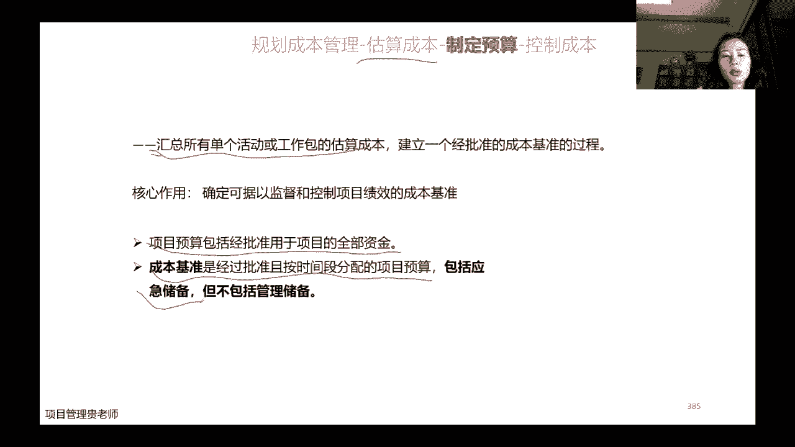

但是不包括管理储备哈，所以呢这后面有一张嗯。

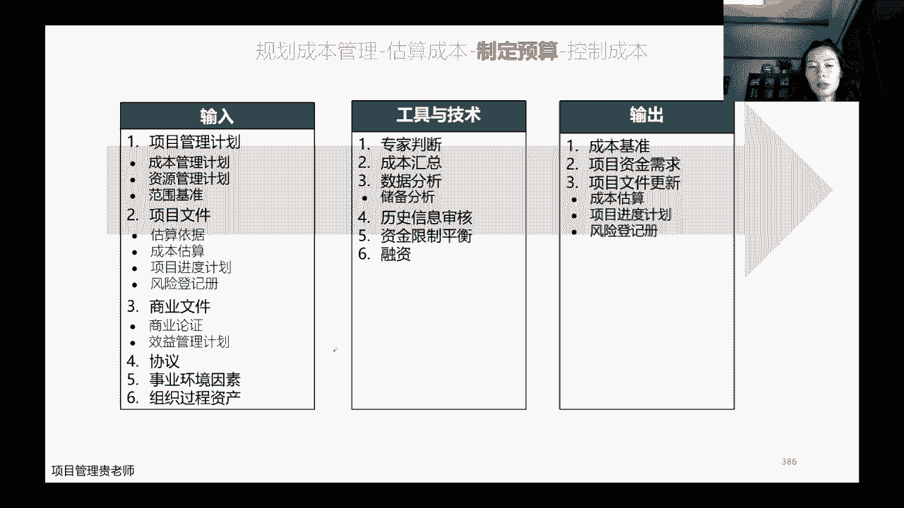

这个是输入输出，大家看一下哈，后面有一张图，这个呢是我们整个项目预算的构成，整个项目预算构成呢它是有项目本身的预算啊，加上管理储备，然后项目本身内容上的，又包括哎具体的这个国想出来的这些成本。

然后和他的应急储备啊，这个成本估算出来的成本是从哪来呢，就是通过我们的类比估算呀，啊这个三点估算呀，或者再加上啊所有估算的工作包的成本，估算出来的工作包啊的成本是多少，然后呢每个工作包给他分配。

看看有没有风险给他分配应急储备，然后呢应急储备呢共同构成的，其实它应该是这样的，共同构成的成本基准，成本基准是包括了应急储备的，然后呢成光有成本基准还不够啊，我们还说有一些没有预判到的。

我得给他留有余地的，留有一定的储备金，对不对，所以会有一定的管理储备成本基准，加上管理储备，等于，还是写一下吧，项目预算，好是这样的一个这个逻辑关系哈，一般情况呢我们在实际的这个工作当中。

可能更重要的是把这一部分的，把成本基准把它做出来，所以管理储备呢啊，有的呢是你跟你的领导去申请，说，这个项目给我留个，留个20%的管理储备吧，去应去啊，应对一些这个未知未知道这个风险。

还有一些项目的情况呢是，不好意思，我是讲到钱太激动了嘛，还有一些情况也是更多的情况，其实嗯当你作为项目经理，你把这个成本基准带领团队工作好之后，你上报给你的领导批，然后呢你的领导。

你的领导会给你批这个成本基准，然后呢领导还会悄悄的给你留一笔管理储备，但是呢他不会把这个管理储备告诉你，为什么呢，告诉你之后，你你不就是更放松了吗，告诉你之后，你明明是可以100万可以控制住的。

但是呢啊有一些这个在管理的过程当中，人性都是这样子，你觉得有更多的钱还储备在这，你有可能就再让儿子的花到110万，或者120万，所以呢如果我们遇到那种领导哈，当你把成本基准报上去之后啊。

你直接的去跟他说，你申请一定的管理储备，他同意，那么说明这个领导还是比较信任你的，那还有一种呢是啊，你虽然说没有主动的跟他申请管理储备啊，你把成本基准报上去之后，他也批了，批了之后呢。

他他他他他悄悄的给你留了一部分，然后他告诉你了，他主动的告诉你了，说哎我还给你留了一定的关注呗，那种领导也要好好珍惜哈，当然最主要的是我们在工作当中啊，如果说通过我们质量控制的过程啊。

发现这个项目有可能去啊超标啊，有可能会这个超支的时候，一定要及时的跟我们上面的这个项目，管理的这些办公室啊，或者是发起人呐，及时的去跟他去嗯，做一个这个成本的这个报告，然后呢去做一个这个预判和分析。

这样子的话会计时一开始没有给你有管理储备，或者没有告诉你他牛了管理储备，那通过你及时的这种沟通，他也有可能会这个及时的给你拨一部分，管理储备出来，那有管理储备有什么用呢，啊，我们说虽然管理储备。

没有包含在项目的成本基准里边，但是管理储备和成本基准共同构成的项目预算，对不对，你及时的申请了管理储备，意味着你到最后项目验收的时候，你的项目是符合项目预算的呀，对不对，是符合项目预算的。

就意味着你这个项目没有超支，对不对，没有超支的话，那很显然我们在做这个项目的绩效评估的时候，你这个项目至少在成本的控制这一块，没有打折扣，对不对，那如果说啊实际工作当中，有一些怕把成本的超支。

作为一个绩效考核的一个标准，那至少这一项没有给你这个扣分啊，你不会因此而影响到你的奖金什么的。

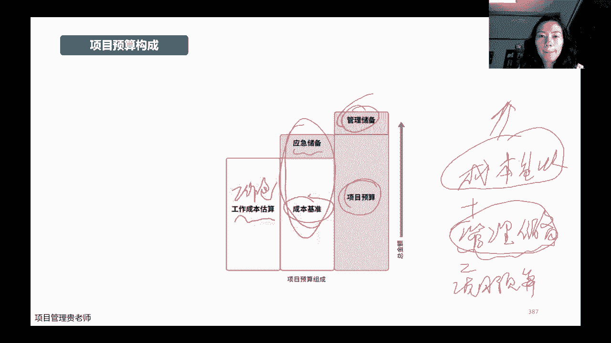

好这儿呢是讲的是呃项目的资金需求，大家理解了这个成本预算的过程之后呢，再看这个项目资金需求的这个表，就相当简单了哈，那随着我们时间的推进呢，它的整个这个项目的支出肯定是越来越多的，对不对，这个非常正常。

那我们实际给的这个成本基准呢，他可能是在这儿啊，这是我们的成本基准啊，管理储备呢是整个项目它是固定的，比如说给你留了20%的管理储备，然后资金需求它是怎么给的呢，资金需求不可能是这样线性的啊。

要不然的话财务不很累，对不对，所以一般给你拨款都是按照季度啊，或者是说按照你整个项目的进展节点呢，或者是按照你的绩效考核的一些节点，给你拨钱啊，播了钱你才能这个活儿才能够继续去干。

那成本汇总呢，这是其他的一些这个呃工具哈，成本汇总的它主要是a我具体活动的成本估算，然后到我的这个啊工作包啊，估算出来是多少，然后呢这个工作包是由哪个账户来控制，然后呢，整个项目它是由什么样的。

这个啊这个部门来控制，然后管理储备呢前面讲了，管理储备是包括是针对未知未知的风险，不包括在成本基准里边，但是要包含在项目的这个预算里边，使用之前使用管理储备肯定要提变更请求的。

然后自定限制平衡是什么意思呢，资金限制平衡是啊，你为了确保项目的各个阶段，或者各部位都有足够的资金，那我呢啊比如说这个100万，我可能分成五次给你，我保证你每个节点，每个阶段的这个资金都是充足的。

不至于说我一开始的时候啊，我给你100万啊，这个超标了，但是呢100万很快的就被这个项目组花完了，真的后面第二阶段第三阶段的时候呢，就可能这个资金不够好，融资很简单，融资就是这个项目需要花多少钱。

然后我从外面渠道融了多少钱进来，整个成本预算的步骤呢就是这样子的哈，首先我们嗯肯定要有w b s，然后有工作包工作包分解成具体活动，活动完了之后制定进度计划，然后你才能够去得去估算我们的成本。

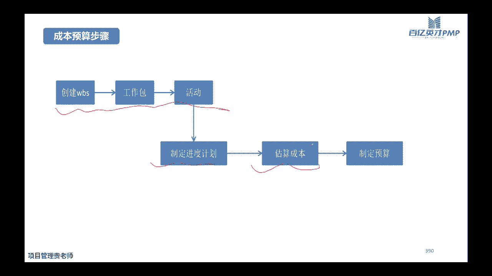

进而制定出我们的整个这个预算表来啊，关于成本呢其实还是涉及的考点和内容。

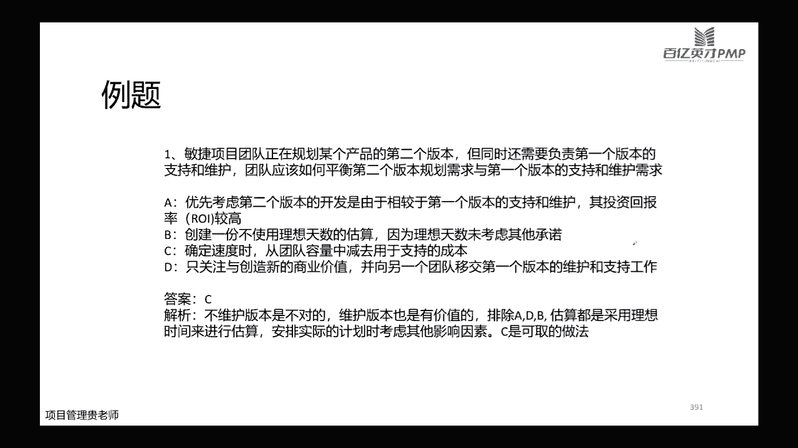

其实是比较的不太多哈。

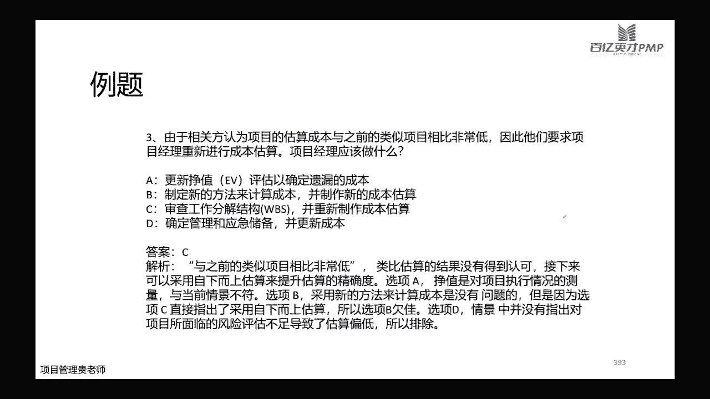

比较的少，只是说呢嗯这一部分的内容呢，他虽然成本作为我们项目当中，是这个三大基准之一嘛，也非常重要，但是呢他因为我们前面学过建筑综合估算，所以我们是三对应的，知道成本是怎么估算。

只不过说呢一个单位是时间啊，一个单位是资金啊，嗯第一题我们看还是看看例题哈，第一题呢是说这个敏捷团队，敏捷团队正在规划某个产品的第二个版本，但同时呢还要负责嗯，还要负责第一个版本的支持和维护。

什么意思啊，也就是说你这个团队，你既要开始规划第二个版本的这个事儿，这些事儿你得做对不对，但是第一个版本已经发布了，那你后期的这个支撑和维护也得你这个团队做，也就是说都是你做的工作量。

那现在应该问你怎么去平衡啊，嗯a呢是说优先考虑第二个版本的开发，是由于相较于第一个版本的支付知识和维护，其投资回报率较高，也就是说让你关注第二个对吧，因为第二个你新版本的开发，他的投资回报率更高。

第一个版本，至于他的知识和文化这些，反正这个就应付一下就好了，对不对，因为他的投资帮太低，这个是你做事的方法吗，显然不是，对不对，所以a哈虽然说实际当中有可能啊，领导让你这么去干，但这个一定是错误的。

一定是不正确的，b呢是说创建一份不使用理想天数的估算，因为理想天数会考虑其他的这个承诺，这个说法是错误的啊，因为我们说估算估算你肯定就是理想情况的，估算，c呢是说确定速度时。

从团队流量当中减去支持的这个成本啊，这个是这个是可行的哈，但是他他有办法去把它表示的更好，有什么办法把它表示的更好呢，是估算第二个版本的速度的时候啊，从团队容量当中减去用于知识的这个成本。

或者说他这儿写的更像用于知识啊，第一个版本的成本，这样的话就相当于是我承认啊，第二个版本我要做，但是呢我也承认，我必须要认真负责的，把第一个版本的支持和维护工作做好，对不对，既然我都是一个团队在做。

那我肯定要花时间呀，那我在估算第二个的时候，我就不能用，我就不能完完全全觉得这些资源都是啊，这个完完全全可用的，我必须要设计的工作量，用于维护第一个成本的这些工作量，我必须要考虑进来。

所以说c是科学的做法哈，b呢是说只关注与创造新的商业价值，这个肯定，然后并向另一个可能移交，这个肯定是不太对的哈，因为嗯一般情况下，正常的他可能是我们做完了第一个版本，然后后面运维的有其他的人。

理想情况或者实际的情况是这样，但是提纲告诉我们的是，你这个团队你要负责第一个版本的支持和维护，对不对，所以d呢，它跟题干当中描述的这个场景是相违背的，嗯第二题呢是说这个项目开始的时候呢。

项目经理还要准备一份快速的，高层次的成本估算，然后在这个之前呢，他管过一个类似的，现在应该怎么办呢，啊相当于是给你的场景，然后让你判断基于这个场景，用什么样的工具和技术，对吧。

嗯a呢专家判断和类比估算说的好不好啊，你看啊他必须要要快速快速高层次的成本估算，那我们说了，快锁什么东西，你自下而上它是一定不快的，对不对，自下而上是最慢的，当然它慢有慢的好处，慢它相对来说是比较精。

是比较精准的，所以b呢现在不符合题干的要求啊，c呢三点估算的质量成本，三点估算呢你也是嗯，你要知道确切的三个数据嗯，d呢自上自上而下，自上而下是一定不对的，所以在a和c之间去选哈，那么a和c啊。

看起来好像都是制定成本的这个工具，对不对，那到底选哪个呢，我们看一下，再看一下场景哈，项目经理之前管理过有类似规模的，那我们前面讲过啊，如果说之前有相关的经验可以参考，那我可以用类比估算，对不对。

内米估算就可以做出一个快速的高层次了，同时呢项目经理因为他自己管过，所以他有经验呀啊增加判断和类比估算，啊第三题哈，第三题呢是说第三题呢是说这个相关方，他觉得项目的这个估算成本。

和之前的那类似的项目相比非常低，哎也就是说我之前都做过类似的，明明花300万，为什么我这次估算出来只要100万啊，啊所以呢他们想项目经理呢重新进行成本估算，那这个时候项目经理应该怎么办呢。

啊a呢是说更新政治，正直是我们在实际的项目执行的过程当中，才会有的数据，现在还在估算成本，还没有进入到具体的执行啊，所以呢他这个a是错误的哈，b呢是说制定新的方法来计算成本，以制作新的成本估算。

你这个时候采取新的办法呢，是没有什么这个大的问题的哈，是没有什么大的问题的，但是呢嗯我们先放一块，不能说他错，我们先放一放，c呢是做审查工作，分解结构并且重新制作啊，这个成本估算。

c看起来也没有什么问题，对不对，因为你现在出了这么多的这个问题，大家要你进行重新进行成本估算，那我为了考虑它的准确性，我是不是从从头到尾，然后从从下到上，然后一个一个再重新核算一下，对不对。

看看到底是哪个环节出错了，所以呢这个情况啊，b和c都对，那我再看看d哈，d呢是说管理确定管理和应急储备，并更新成本嗯，确定管理储备和应急储备的这个没有呃，没有扣题哈，题目是说的是你在估算成本的时候。

跟之前类似的项目相比太低了啊，又要重新估算，所以呢你现在成本的，整个这个这个活动包的估算还没有准确啊，你在后面去直接去附加管理储备和应急储备呢，是不太合适的，所以到底选b还是选c呢。

b呢是说让确定重新的方法来重新来计算啊，c呢是说a重新来审查，很显然c说的是一个具体的实操的办法，然后呢b说的是一种可行的思路啊，所以这个时候呢选c要好过选b，如果c这个答案有明显错误。

那就选b第四题哈，第四题呢是说第四题是说这个发起人，他与项目经理联系啊，来寻求嗯，在未来两个月之内完成该交付，最有效的方法和建议嗯，a呢是说改变项目方法，以便在两个月之内，完成可交付成果。

改变项目方法呢，很有可能会对原来的可交付成果，产生一些比较大的一些影响，所以不太建议哈，b呢是说啊，高职发起人说评估项目不是小目经理的工作，你看这个显然太消极了，不应该这么做事，对不对。

所以呢是说建议发起人进行成本效益分析啊，已确定可行性，已确定可行性，d呢是说使用关闭储备，然后呢以加快在两个月之内完成可交付的啊，这个项目嗯，c和d哈c呢是没有直接去查明啊，没有直接去查明。

就是怎么去这个啊，这个建议怎么去把这两个月之内，两个月之内能够完成开可交付哈，没有阐明具体的一个做法，没有解决问题，然后呢，d呢是相对于说呃有一种可行的一种办法吧，多花点钱，然后呢嗯用钱买进度啊。

就是作为一些赶工，以便能够在两个月之内完成可交付的成果，所以这个c和d哈，d呢是一个直接的可行的解决方案，c呢相当于是还是在论证，还是在验证，还没有去围绕这个解决方案去做工作，第五题。

第五题的是说这个项目经理呢，他是在为一个软件开发团队，提供单元测试的技术培训，然后这个时候呢，他建议在软件开发期间，采购一台服务器来进行测试用例，这个例子是用什么呢，啊你看他干什么。

采购一台服务器来进行测试用例，诶这个是考的是我们质量成本，对不对，质量成本我们说了，分为一致性的成本和非一致性的成本，一致性的成本里面呢，又分了我们的预防成本和检测成本，对不对。

然后飞机呢又分了内部的和外部的，内部失败和外部失败，对吧，那你看一下他现在是要做培训啊，提供单元测试培训，然后呢他建议在软件开发期间啊，采购一台服务器来进行测试用例，现在问你这个例子用的是什么呢。

唉大家到底会选什么呢，质量管理预算不对，对不对啊，这b和c呢，还有他们都是讲的是一致性，成本到底是哪一个呢，d的是软件测试预算啊，首先把d排除了，那么到底选b还是选c呢，我们看一下它到底要干什么哈。

他是说建议为他提供单元测试的技术培训，对不对，那我们说了培训它是预防成本，对不对啊，大家不要看到这个说我们做的，因为做的是说的是测试技术培训哈，所以呢你做的就是这个评价成本啊，因为做测试不要这样想啊。

你要知道他买这个服务器来运行测试，是为了做好测试的培训，这是属于预防成本哈，好那我规划规划实务资源，我看一下时间啊，这样吧这个嗯规划绩效运，现在是我们把前面的这个范围需求，然后进度和成本都已经讲完了哈。

后面还有几个部分的内容，但是这部分内容相对稍微轻松一点点啊，先开个头吧，现在是把基调，讲个十分钟吧，讲个十分钟，然后大家留留一些时间给大家讨论问题，规划绩效育呢，再往下呢。

还会涉及到我们的这个团队和实务的资源啊，啊因为我们既然做规划的话，那么除了光规划它的范围需求不行啊，啊进度也不行啊，成本也不行啊，光这些不够，对不对，我们还要规划他到底要用什么样的团队啊。

啊它涉及到什么样的这个食物的资源，对不对，然后规划资源里面呢，它也包含了有相应的有相应的这个管理活动哈，啊我们重点讲规划资源管理和估算活动资源啊，在下一个这个绩效语里面讲工作的这个绩效率。

讲工作绩效语里面呢，接着这个资源会讲啊，怎么样去获取资源啊，对不对，因为我们规划里面是估算好了呀，那么实际的过程当中，交付的实际的这个执行过程当中啊，我们会讲怎么去把这些资源弄到手。

那规划资源管理呢是指的是我们怎么样去啊，这个定义怎么样去估算呀，怎么样去获取呀，怎么样去管理和利用，我们团队以及食物资源的这个过程，有效的资源规划呢，可以啊，需要考虑资源稀缺的可用性和竞争。

然后呢并且编制相应的计划，大家还记不记得我们之前讲这个进度的时候啊，有关键路径法和关键链法，我们的关键练法就是考虑了资源的可用性的，对不对，关键路径呢是在我们资源啊，我们默认它一定是可以被我们用的啊。

默认资源是啊，没有什么这个啊稀缺性的啊，这个竞争性啊，或者是不可用心的这种因素的，但实际当中的资源，他一定是要考虑它的可用性的，对不对，所以资源啊他可以从组织内部获得。

也可以通过外聘啊啊或者外界呀或者外派呀，通过外面组织外部的形式去获得我们的资源。

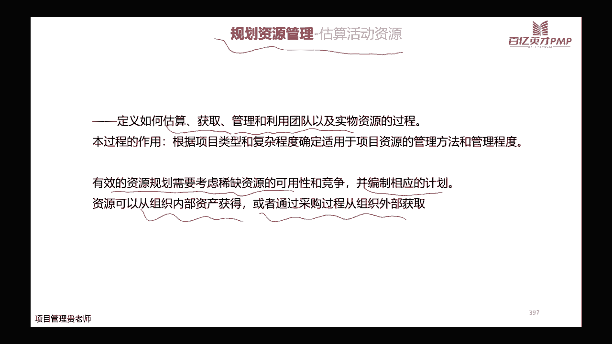

规划资源管理呢它的他的这个输入和输出哈，首先输入还是由我们的章程，为什么有章程呢，因为章程里面会有一些，可能会有一些玉芬派的这些工单，然后呢啊有一些项目的文件啊，关于我们的计划呀，需求啊，这些。

工具和技术呢重要的是我们的这个呃资源，它的层级型啊，责任分配矩阵和文本型啊，这些表现的形式，然后输出呢就是我们的资源管理计划，团队章程。

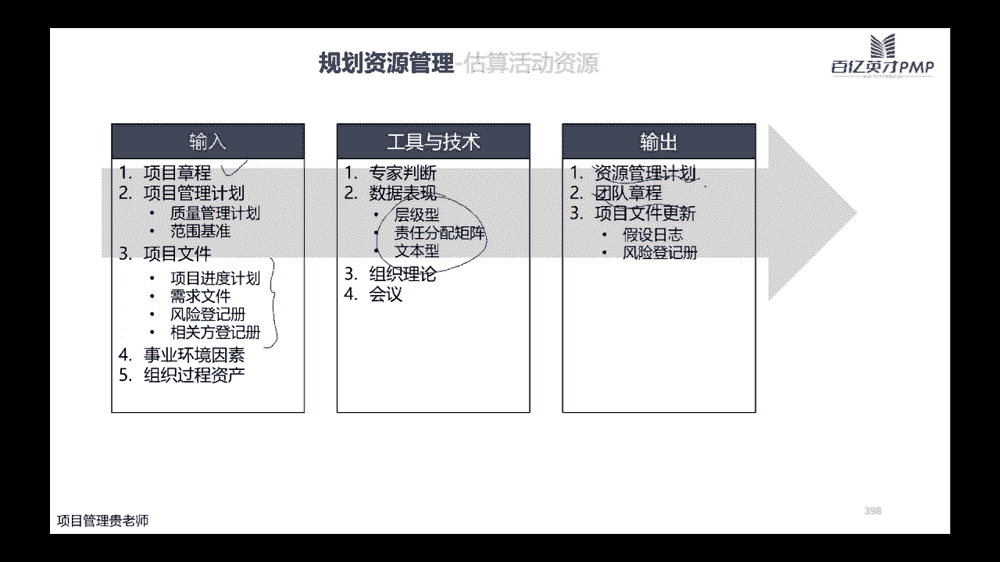

估算活动资源啊，这个子过程呢它的它的这个作用哈，它的作用呢是明确完成资源所需要的种类，数量和特性，因为我们说资源不仅仅说的是人，对不对，还说的是物啊啊，那到底有除了人物又到底怎么分呢。

哎下面会跟大家讲哈，所以估算资源的过程与估算成本的过程，紧密相连啊，为什么呀，因为资源要花钱啊，所以你估的资源的多少，直接决定了我们这个项目，他估算需要的这个成本到底是多少，除了人啊。

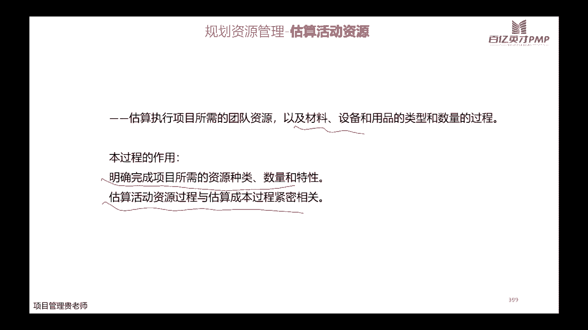

除了团队，还有材料啊，设备呀啊用品啊，工作活动资源呢，它的输入和输出，这个时候就有资源管理计划了，然后呢它的工具呢啊除了这些自下而上啊，类比啊，参数啊，数据分析之外啊。

这个里面的工具因为我们前面都讲过嘛，所以在这里呢这个工具就不做重点了，输出资源需求啊，你估算活动资源了吗，那你资源到底需求是什么样子呢，啊资源需求是一个非常重要的一个输出，然后呢资源分解结构啊。

是一个也是一个非常重要的输出，他们俩展示的形式不太一样。

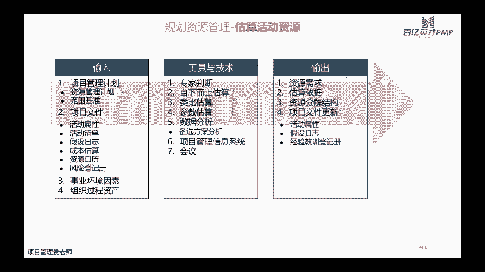

那具体来说，具体来说呢啊资源管理计划，它是包含了人力资源管理计划和，实务管理和实务资源管理计划的，所以从我们的识别资源来获取资源，获取资源的时候，你就要考虑它的具体的他是什么样的岗位呀。

他的这个这个需要的角色是什么呀，他的职责和职权啊，还有必须要的这个能力储备是什么样子的，然后项目组织图，还有我们的项目的团队的资源管理，然后以及我们的培训啊，团队建设呀，资源控制呀，还有任何计划呀。

这些都是要体现在我们的人力资源，管理计划里面的嗯，那组织的资源呢一般情况下是我们用7m哈，这个是7m定语嗯，哪7m呢，就是人力啊，材料机械资金信息科学技术和市场，这些都是组织拥有的资源。

所以我们嗯一般情况下哈，这个可能大家一起资源就会默认到我想到哎，我这个火啊，或者说这个任务啊，我需要什么样的资源啊，这个资源呢有多少就是是什么多少人，然后呢需要什么样的这个啊设备来支撑啊，人和这个设备。

我的设备我们把它这个机器，我们把它叫做设备吧，然后有的呢是做的，可能是一些工业性的一些项目呢，可能会把材料啊把这些考虑进去，然后资金呢也会考虑进去，但是呢啊这这个信息啊科学技术和市场。

一般情况下可能大家在实际的工作当中考虑，这些是考虑的比较少的，但其实呢我们在做资源管理计划的时候，也要考虑到我们需要什么样的市场支撑啊，我们需要什么样的信息资源啊，我们需要什么样的。

这个除了我团队之类的这些技能之外，我还需要哪些啊，能够或者说需要从外部去采购的这些资源啊，这些技术的支撑，这个也是我们做项目之前，在估算资源的时候要考虑到的，为什么说这个比较重要，容易被大家忽略了啊。

容易被大家忽略，大家不提这个，不提这个有什么坏处哈哈我们说了估算资源，估算资源直接决定了你的估算成本，对不对，没有考虑到这一部分的啊，这个资源啊，那你就很有可能遗漏掉这一部分的成本。

遗漏掉这一部分的成本，你跟领导报的时候，成本基准就会少一些，成本少一些，那你将来涉及到哎，我需要买市场上面的一些研究报告，去论证一些东西的时候，你不得重新花钱吗，这钱从哪来呢，对不对。

没有包含在你的预算之内呀，那你是不是就面临着，成本有可能超支的这个威胁，这个风险是吗，对不对，所以我们一定要了解一下，组织资源到底是哪些啊，然后团队啊说团队的资源的构成啊，啊有内部团队，还有外部团队。

然后呢也有集中办公或虚拟团队，那我们在规划团队的时候呢，因为我们说团队也是资源当中一个，非常核心的呀，规划团队的时候，主要是考虑啊这个团队从他的技能性出发，哎我们需要什么样的这个必备的技能。

然后从他做类似项目的这个熟练程度来看啊，需要是特别熟练吗，还是说有什么工作经验，工作年限上面的一些要求，因为从理论上讲，它的技能越好，越熟练，经验越这个越丰富，那么啊它单位时间之内，他对比别的资源来说。

它肯定是更加有利于我们做这个项目的，对不对，那内部团队外部团队我们在考研的时候，到底是用自己人还是外国人呢，核心的品牌指标就是还是考虑成本，因为外国人呢我们都说外来的和尚会念经，对不对。

就默认为外面来的人他一定是更专业的，但是呢外面来的人他显然是更贵的，所以这个时候呢就看你就是这个项目，你怎么去考虑啊，这个基于它的成本收益分析去看看，从外面请人请专业的人划不划算，可不可以。

那还有一种方式呢是集中办公或者虚拟团队，集中办公呢就是啊把大家弄在一个办公室，或者说一个办公地点去工作，这样的话大家遇到任何问题可以随时讨论啊，沟通的效率非常高啊，沟通成本非常低啊，虚拟团队呢是啊。

比如说有些是跨国的，跨省的，那大家没有办法实现在一块办公，那怎么办呢，诶我又需要他，那那你你是安排他长期驻扎在你的项目上面吗，如果说你有足够的钱哎，那你给他足够的这个足够的这个支撑，足够的诱惑。

他也有可能，但是呢我们啊出于这个成本的考虑，然后呢也出于这个啊，外部的其他的这个地点的这些团队，是不是真的是他的能力是必须的，而你们团队又没有这种能力，那我们啊成本又比较受限。

我们也可以考虑训练团队的方式啊，就是不在一块办公啊，这个或者说呢就是大家没有实实在在，甚至没有实实在在在一个公司也都ok，但是呢我把它纳入到我的整个项目的团队，之间啊，一块去管理管理，不是说要管着他们。

而是说一块去引导他们为这个项目去发力，啊这有两个具体的这个案例哈，就是人力资源计划，和我们的这个这个实务资源管理计划，先看看人力资源管理计划，人力资源管理句话，一般就是我这个什么我这个什么样的项目。

然后呢啊他是涉及到什么角色，然后呢这个角色呢他拥有什么样的职权，然后他必须为我这个项目这个职责是什么样子，整个项目的组织结构啊，比如说项目管理办公室来管，然后呢项目经理只管。

然后项目经理下面呢是谁谁谁谁谁谁哪个小组，然后小组长啊，下面又是具体的团队，他会有组织架构图，然后这些嗯组织架构图里面呢，这个哪些是我自己公司目前就有的啊，哪些是我需要从外面去招募的，然后结束之后呢。

项目结束之后，我人员的遣三计划是什么样子，尤其是那种外面临时招的，对不对，那你项目结束之后，外面招的人怎么搞啊，这个前瞻计划是一开始要做好的，然后资源日历，资源日历呢是我这个资源a。

比如说他什么时候可以用啊，比如说我现在啊这个啊，这个有一个这个海外的学，那海外的学员呢他要上我的课，那他是不是要考虑到啊时差的问题，或者是呢，这个我们国内跟国外有一些文化的差异。

那么国内的一些比如说端午节啊，这些老外都不知道是啥的，他是要考虑到位，结果能不能讲课呢，对不对，所以说资源日益呢是我资源可用的时间，然后我这些资源团队来了之后啊，有一些技能的一些不同的啊这个差别。

那对于技能比较弱的，我是不是有一些培训的一些需求啊，我整个团队我在项目当中，我的奖励办法是什么样子的啊，还有没有其他的一些规则标准，或者公司有没有其他的一些政策啊，人呢安安全我怎么去保障啊。

尤其是比如说有的项目涉及到很多实习生，来帮忙呀，那这实习生这就涉及到这个安全问题比较大的，那我这些怎么去保障啊，这些都是在我们人力资源计划里面，要体现出来的一些问题哈，好团队章程呢我放在下次课再讲吧。

然后今天的课程先到这里看看，给大家留几分钟的时间嗯，看看大家有没有什么问题啊。

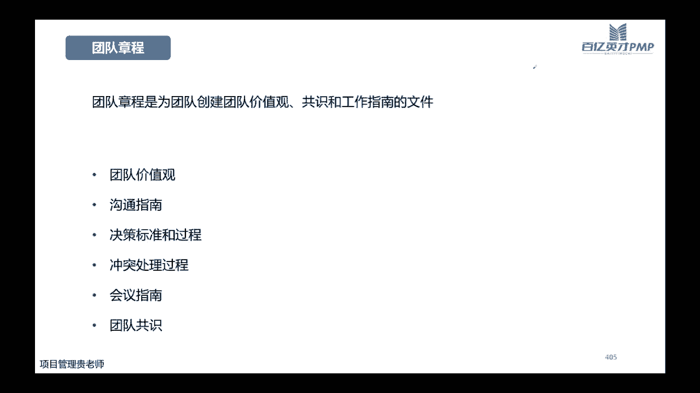