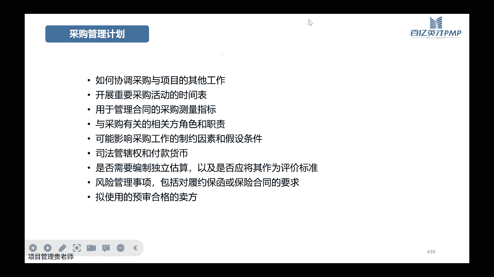
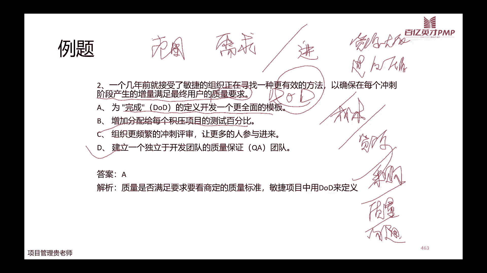

# PMP考试培训课程最新完整版项目管理认证第七版教材新版考纲自学教程 - P8：8.规划绩效域04 - PMP专家 - BV1rM4y1Y79x

好各位同学晚上好，现在已经在直播间的小伙伴，如果说能够正常看到客厅的屏幕，听到声音的话，帮我敲一个111，好的收到，好的都只有一位小伙伴敲111，是大家都能够听到对吗，好的嗯，七点半了哈。

我们还是准时开始上我们的课吧，今天晚上讲的是，接着我们上一次的讲讲，我们的规划与绩效率的第四节课哈，今天晚上这节课讲完了之后呢，我们整个p m p的规划绩效语就已经讲完了。

这个是所有模块当中给大家花的时间是最长的，当然它包括的内容呢也是最多的，因为本来我们做一个项目当中啊，虽然说适应性的项目呢它是拥抱变化的，但是我们预测型的这个项目呢还是讲究的是。

一开始要尽可能的把它规划，各方面的规划计划啊，把它做好，所以呢规划它实际过程当中呢，它占用的时间也是比较多的啊，在我们的整个教材里面，占用的篇幅也是比较大的，那今天晚上的课程之后呢。

大家就要开始好好的把规划，绩效与这个章节涉及到的所有的题目，好好的去做一做，感受一下这一部分的题目，它都是什么样的模式啊，解题的一些思路，通过解题思路呢，我们再把知识点再回顾巩固一下。

然后有一些解题的一些技巧，或者是有一些常见的疑难点，大家有问题的话，可以随时在群里面讨论哈，好上节课呢我们讲到要估算团队和实物资源，对不对，那么资源呢一般我们先说的资源啊，大概率是指的是这个人。

但是呢实际上我们的资源啊，往大的想分为两大块哈，除了我们的人之外，还有我们的物人力资源和实务资源，他们两个的管理计划都要把它列出来，那么简单的来说，人力资源管理计划就是人啊，需要什么样的人。

这些人呢从哪来，来了之后呢，我们要怎么样，让他们很乐意的去给我们这个项目去干活啊，去贡献自己的价值，在中间呢发现的冲突诶，我们应该怎么去管，那项目结束之后呢，我们应该怎么样去啊，涉及到一些奖丑啊。

做得好的怎么去奖励，做的不好的呢，有没有一些惩罚的机制啊，最后项目成功的收尾之后，那人又回到哪去，这是人力资源管理计划，那么同样的我们实物的资源管理计划呢，就讲究的是啊，这个项目需要多少的实物资源啊。

电脑呀，设备呀，机械呀这些都算，那么这些死物资源从哪来啊，要不要采购啊，还是说去租用，还是说去啊，这个公司内部的就有从哪来，用的时候又怎么用啊，用的之间怎么去保存它，用好了之后呢，怎么去归还它啊。

或者怎么去遣散它，整个是从哪儿来，一直到哪去，都包含在我们的管理计划里面哈，好上次也给大家讲过，我们组织资源呢，嗯一般是这个绕不开这个tm哈哪七个m，刚好他们的英文都是以m开头的，人力材料机械啊。

资金还有上容易跟大家提到过，容易被大家忽略的信息科技技术和市场，这些其实也是我们组织资源当中，非常重要的一块，这是为什么啊，有的人觉得自己非常厉害，对不对，那你出来之后，你想自己单干。

结果发现出来之后呢，还是欠点东西，对不对，离开了平台，有句话叫什么离开了平台，什么也不是，那是为什么，因为离开了平台，你缺少了相应的市场的占有率啊，相应的这个啊一些技术的支撑啊，包括公司的渠道。

平台的渠道能够更便捷地获得到一些信息啊，资金都好说，资金你自己出来做，你其实也可以去融资，没有问题的，机械也可以去买啊，材料可以去买人力，自己就是最大的人力，所以这三块呢是我们嗯个人的力量。

不太容易能够获取的哈，那么项目团队的组成和结构呢啊我们也说了，一个项目当中，如果说全部都是由内部的团队啊，我这个团队指的是干活的团队哈，如果都是由内部团队，那当然是非常好，但是呢很多项目呢他也在所难免。

也会涉及到一些外部团队的一些配合，那涉及的外部团队呢，因为大家是外国的团队，大家在配合的时候呢，缺乏一些啊配合的这个前面磨合的一些基础啊，所以沟通的成本呢或者是协作的成本呢，都会相应的高一些。

但是没办法，有的时候呢呃因为外部的团队，他的专业性可能哈更强一些，所以我们不得已用必须要使用外面的团队，那这个时候充分的啊考虑一下使用web的团队，这个成本效益打不打得下来啊，也就是说划不划算。

我用web的这些团队，那同时呢团队都来了之后，那我是把大家集中在一块儿去办公啊，这样大家有什么问题呢，就能够面对面的交流啊，是这样更好呢，还是说有一些地理位置比较分散的这些团队啊。

甚至呢他可能没有那么多的时间来参与，我们的日常的这个工作当中，但是呢我们又需要他的经验，那是不是这个时候也考虑用虚拟团队的方式，把它包括在我们的整个团队当中，好人力资源管理计划呢。

这个上次是跟大家去展示了哈，人力资源管理计划重要的第一个大的部分啊，它的资源的结构啊，这个角色呀有什么样的职权啊，这个职权是相对于我们在项目当中来的，那他的职责是什么，整个项目当中的组织结构啊。

还有呢人员的配置管理计划，人从哪招的人怎么走啊，怎么来怎么走啊，他的这个使用情况啊，培训有没有培训需求啊，认可和奖励怎么弄啊，相应的人事管理的这个规则标准或者一些政策，然后呢。

有一些人员的安全方面是怎么在安排好团队长，丑团队章程呢，它其实就是为团队创建价值观，共识和工作指南的一个文件，它包括了团队整个啊价值观什么意思呢，啊我们这个价值观比如说大家要讲究的是合作。

而不是说一个人说了算啊，这是我们的一种价值观，或者是呢我们在做项目的时候，我们要把质量放在第一位啊，这也是我们保证的一个价值观的之一，然后沟通的指南啊，出现问题怎么沟通，没有出现问题。

日常的这种项目协作怎么去沟通啊，这是内部的一个沟通的一个原则，那大家出现了分歧，出现了不同的意见啊，又怎么去约定决策的标准和过程，是所有的问题发现了之后，都去跟项目经理汇报吗，还是说啊问题分大小啊。

大小的标准是怎么定的，如果不同大小的是大家先自己讨论一下啊，产生一个初步解决方案之后再去讨论，再去找这个项目经理决策呢，还是怎么样冲突的处理过程啊，这个角色的过程是这个其中的一个细节哈。

然后开会怎么开会议啊，要不要提前发一个啊，比如说会议的这个日程的安排，然后会议要准备的资料是不是提前都要公布好，会议结束了之后，是不是必须得有会议纪要啊，团队对于整个项目车是否达成了共识啊。

还有其他方面是不是存在一些共识，这是我们团队章程必须要包括的内容哈，那为什么需要有这样的一份团队章程呢，我估计这个在实际的工作当中，大家可能涉及到团队当成的，或者说讨论过团队章程的并不多啊。

这个在我接触的小伙伴聊的过程当中，大家都好像并没有约定，团队之间的内部的这种协作的章程，大家一般的接触到项目啊，开始把任务分配好了，工作分配好了，了解这个项目之后呢，就开始去干了啊，但是一干呢，诶。

人跟人之间总会有一些工作或者生活上面，那些冲突啊，一些意见不合，那中间呢就有各种各样的一些问题，那盘队章程就是来避免尽量的避免这些问题的，事先约定好，不要有一些事情啊，我们吵来吵去的。

那会议呢看完之后也没有会议纪要啊，或者说呢什么样类型的会议啊，约定好了，最开始谁谁谁比较擅长这一方面的这个机啊，或者谁谁谁是不是要负责拍一个照啊，这些最开始就把他约定好，可能会比较顺畅一些。

后面出现矛盾的几率就会小一些哈，那实物资源管理呢，它是考虑到我们材料交付，移动存储和处置的提前期，然后呢啊整个项目当中的过程的跟踪，以及呢交付产品之后啊，材料还有一些库存的手段怎么办。

项目如果说需要大量实物材料的时候呢，啊就要考虑到这个材料从哪来啊，我涉及到这个订单怎么去弄啊，供应商怎么去找啊，批量订购的时候对比存储的成本，就除了我把材料采购进来之后啊，我还要对比一下我这个项目方啊。

有没有合适的仓库啊，有没有，或者说这个不需要那么大的仓库，那么其他的供应商能不能给我们提供这种仓库，按需发货啊，这个物流啊，可持续性，这些都是我们在考虑食物资源的时候，必须要去考虑的，所以除了它的价格。

除了它的价格啊，后面的这一系列的操作问题，都是我们做一个项目经理啊，要去了解它的细节啊，并且能做出它的规制方案的，好这个章节里面呢啊资源分配这个章节里面呢，它也有一些数据表现的这个工具啊。

一般情况层级型啊，举证型啊，文美型，这些都是我们啊比较用的一些这个结构，层级型呢它又分了啊工作分解结构啊，组织分解结构和资源分解结构，组织工作分解结构大家都了解了，前面讲过w b s。

那么组织分解结构呢，大家啊虽然说我们在这个课程上面呢，可能讲的比较少，就在前面讲那个啊，它是一个直龙形啊，还是说是一个项目型啊，在讲那个章节的时候啊，有提到部分的组织的分解结构。

那么对于大家嗯整个公司而言呢，他可能还会有更加全面的这种组织架构，那么今天晚上呢我们要重点讲啊，重点要大家大家了解的是资源的分解结构，那么除了资源分解结构之外呢，还需要有一个聊天的工具。

叫做责任分配举证，责任分配矩阵呢简单的来说就是什么责任啊，对应到什么样的人，还有一种就是文本型的这几种呢啊，无疑文本型的它肯定是最详细的，但同时呢文本型的它也是啊，简单的阅读起来的话。

这个会更加的复杂一点的，因为它是文本型的，还记录的是非常详细的这个职责啊，细节的内容，所以呢这几个东西一般都是搭配着使用哈，我先有一个非常简单的简易的这个，资源分解的结构啊。

就类似于我在找工作范围的时候，工作范围基准的时候，我有一个w bs，有个简单的这样的一个结构啊，同时呢我还有责任分配举证，那么我们打bs呢，那他还配合的有需求分需求跟踪矩阵，有需求跟踪矩阵。

还有w bs啊，那w p s词典啊，写掉了wb s词典，还有范围说明书啊，还有跟他配合的，那我们这个资源里边呢，他还有文本型的记录啊，详细的记录好，成绩性呢工作分解结构前面讲的哈，组织分解结构啊。

一般都是组织的这个部门单元，然后资源分解结构，资源的类型，我们具体来看一下这个这有一个这个示例哈，这个示例呢也是根据我们前面讲过的，这个tm组织的啊，七个大的方面的资源来去分配的啊。

比如说我们组织它有人力资源呀，那人力资源我们是不是要有研发工程师啊，然后架构师啊，设计师啊，开发工程师啊，程序员啊，测试员啊啊这个质量检测人员都得有，那从设备上呢我们要有服务器啊，要有之前机。

还有平板电脑笔记本啊啊还有纸啊，笔啊什么的，然后材料呢复印纸啊，西谷啊，油墨啊，油漆这个设备和材料之间有一点点区别哈，设备呢一般情况下它是我们的这个啊，一次性的成本啊，但是材料呢。

它是我们这种这个消耗型的变量的成本，然后还有资金，资金呢啊，是我们指这个项目需要投入的大量的资金，那么根据资金的来源呢，啊我们可以去自筹资金啊，也可以去找银行贷款呐。

啊也可以这个去找别的一些机构去借贷呀，然后或者是一些这个自由的一些基金啊，啊都可以啊，技术呢我们有知识产权，有专利啊，有研发的成果，有一些新技术都ok，信息呢啊我们信息平台呀，信息系统啊，沟通渠道啊。

信息库啊，数据库啊，这些都包括啊，市场啊，这个就就不细说了，各种市场按区域，这是按区域分布，那么除了按区域分布，也有按行业分布啊，比如说我在这个智慧校园的行业啊，我做的怎么样啊。

我在智慧城市的行业做的怎么样，对不对，所以看它的分类哈啊，责任分配举证呢是长什么样的，责任分配举证主要它是一个r c r a c i举证，这个r呢啊，大家记住他的几个代表它代表的意思啊，r是代表负责啊。

a呢是代表问责啊，c呢是代表咨询，i是代表通知，s是代表知识，什么意思呢，r2 的负责并不是说这个负责人的意思，而是说我要参与到这项工作啊，我要负责做这个工作，那a呢问责是什么意思呢。

问责是承担责任的那个人，也就是说我一个啊，这个a下面他有可能有n个r在负责做，对不对，那出了问题找谁呢，找r吗，不是找a哈，是找他问责的，这个人是担责的这个人，所以很多学员这两个可能会搞搞不明白。

搞不清楚啊，今天老师讲了之后，大家就清楚了，一个是负责做这些事啊，一个是这个担责的咨询c咨询，咨询呢就是去比如说有一些问题啊，有一个什么样的活动，我需要找他去咨询一下他的专业的意见啊。

他在里面扮演的角色是非咨询的，那爱呢通知啊，通知呢是说啊，我对这件事情，对这个活动，对这个工作，对这个任务我有知情权啊，我必须在这个任务的时候呢，我虽然说不负责做啊，我也不担责啊。

我也不负责给你提供专业意见，但是呢我需要知道它的同步，它的进展，s呢是支持s呢，支持支持是说呢我对这个任务啊，我有无条件的这种支持的这个任务在里边啊，比如说一般的这个人力资源部啊，啊财务部啊，对不对。

好知道这几个词语代表了什么意思之后哈，一般通常用的就是这三个啊，这啊这四个s用的少一点，那比如说啊这是一个举证，这是一个列表哈，列表矩阵的列表，横坐标呢代表的是这个嗯人不同的人员啊。

我这一个项目啊暂且分为12345这五个人，然后我能有哪些活动呢，我要创建章程，章程完了之后，我要收件需求啊，我要提变更请求呀，我要制定测试计划呀，当然我还有其他的很多很多的这些活动。

那么现在来看创建章程啊，根据我们刚刚讲的r c i举证啊，这个安这个人这个安安他叫安，那么安呢他啊这给他的是a什么意思啊，代表什么意思啊，代表创建章程，这个活动是问责的人是谁呢。

是安也就是说创建章程如果说没有做好，那么安是要承担责任的，那么具体由谁来做这个活呢，是有r这个人他负责来做，对不对，是由本来负责创建章程的这个具体的任务，那么后面还有三个人啊，你看给的都是i是通知。

也就是说哎后面这些相关方都是我做完章程，创建章程之后，我要去跟他们去告知我章程的核心的内容的啊，那么同样的收集需求，收集需求呢对于安这个人来说，他现在变成了爱，也就是说你只用告诉安啊。

我收集需求现在是什么样的一个进展，收集的需求是什么样子就ok了，那么这个本呢他现在变成了a啊，他现在变成了担责的人，也就是说收集需求这件工作，这个任务如果没有做好啊，需求一直达不到大家的共识。

那么我要找谁来承担责任，我要找这个本啊，找这个本来承担责任，那具体谁来做这些事儿呢，啊有卡洛斯啊，第三个人去跟客户去聊，想去谈啊，去用我们的收集需求的各种技术，去把我们的需求收集出来。

然后蒂娜和艾德他们做什么呢，他们做啊咨询什么意思呢，他们比如说数据需求的时候，他们两个在这项活动当中，他们负责提供的是咨询的意见，也就是说卡洛斯在做这项活动的时候，如果他遇到什么问题，他可以去问迪娜。

也可以去问爱德，他们两个人呢从我们的责任分配矩阵上面来说，他们有义务去提供他们的专业的意见，那么同样的提交变更请求，那这个an呢它同样的它只用指导一下，同步一下，跟他同步一下进展就ok了。

而本呢它是要对这个活动要承担问责的，也就是说你提交变更请求，如果这个程序没有做好，那么本他仍然要负责啊，要承担责任，要扣钱，要扣奖金，那谁来做呢，卡洛斯和蒂娜他们在项目当中遇到问题了。

他们两个人都有权利啊，都有这个义务去提交变更请求，那艾德呢这个时候也是作为一个专家的角色啊，提供咨询，提供专业意见，制定测试计划呢，现在a啊，这个是安啊，他又承担了责任啊，制定测试计划计划，如果没做好。

项目经理找谁呀，找安到时候扣你的奖金，那本呢还是c是咨询啊，他负责提供他的专业的意见，卡洛斯和蒂娜呢都是有知情权啊，你做完了测试计划，告诉我怎么回事啊，就知道就行了，艾德呢具体来做啊，然后拉巴拉写文档。

写测试计划到底应该怎么干，先干什么，测试在干什么，测试什么时候开始干啊，有艾德具体去写好，明白了吧，这是责任分配矩阵哈，规划的这个绩效率呢，我们接着讲哈，后面还有一些这个沟通啊，截止到沟通之前呢。

我们已经把前面的啊再带着大家过一遍哈，前面的范围，需求，进度，成本，啊资源今天晚上也都讲完了，好接下来呢又是一块非常重要的，是我们规划绩效语里面要掌握的叫沟通啊，因为沟通的工作和沟通的重要性。

在任何一个项目当中呢，它都是不言而喻的，所以沟通里面它具体规划的时候要规划什么呢，我们具体来看，在开始沟通这个领域的知识之前呢，大家先看一下我们沟通，沟通是语言对语言吗，不一定对不对，沟通是把信息。

思想和情感在个人或者在群体之间去传递，但是光传递够不够呢啊，刚传递你只是把信息放出去了，你还没有收回来啊，你还没有达到你想要的这个效果，所以呢这句话后面这句话啊是很重要的啊，就是有的时候。

比如说这是大家常见的，在工作当中可能会遇到的问题哈，你发一个消息啊，发一个指令，发一个指令告诉你的团队成员啊，大家应该做什么什么，ok听到了，听到了之后，大家会收到结果，他在做的时候。

你发现还是有很多的问题出现了，对不对啊，那是为什么呢，是因为沟通没有做好，不要觉得诶我已经把信息发过去了，你看微信里面钉钉群里面都有聊天记录呀，对不对，我我几月几号几点钟发的什么信息。

这个信息需要你干什么，我在群里面说的很明确呀，那为什么你现在还要出错，还有忘记呢，那是你的问题啊，我没有问题啊，不完全是这样哈，5%的十，75%的信息是靠视觉来传递的，语言只传播了20%的信息啊。

什么意思呢，啊你的语句这个7%音调呢，38%面部表情的55%啊，就好像我们今天晚上在上这个课程一样，那如果说我没有开这个视频哈，我只是通过我说的这个话啊，大家可以感受到我说的话是什么，能够听清楚。

然后呢也能够听到我的音调是什么，所以呢我有的时候可能会强调哪个它是知识点，它比较重要，哪个呢啊他可能啊涉及的敏感信息比较多啊，老师一笑可能就过去了，但是呢大家看不到我的面部表情，come on。

运维表情的时候呢，大家在获取信息的时候就有可能有一些失真，尤其啊这个讲除了讲课呢，更重要的是大家啊，比如说在跟领导啊去汇报这个工作的进展，汇报项目的进展的时候啊，你是电话的汇报呢啊领导说嗯好呀。

嗯可以吧，嗯那先这样吧啊你看不到领导的表情，那你就没有办法去完全百分之百的确定，领导对目前的进展到底是满意啊，还是不满意哈，所以面部表情其实是相当重要的，这也是为什么我们沟通的时候。

一直强调大家面对面的沟通啊，肯定是效率更高的，因为我面对面的沟通，即使你说的话不太好听，即使你的音调好像也还也还缺那么点意思，但是我看着你这个人，你的面部表情就基本上告诉我了啊，你这个你想说的话。

你到底代表的是积极的意义还是消极的意义哈，这后面有一个例子，这个例子呢其实挺好玩的，但是我们现在因为是在远程的这个直播，没有办法带大家去演练，如果大家能够在啊，比如说我们做内需啊。

大家去演练一下这个这句话，就发现真的是不同的人，他说出来的时候就是不同的感觉，你看标的颜色的都是你的，就是都是我想把它的重音放在哪个地方的哈，比如说比如说第一个呢，是我没有说他偷了客户的钱。

那不是我说的，对不对，他重心在我，那不是我说的，有可能是谁说的啊，有可能是我们苏苏老师说的啊，有可能是我们其他的学员说的，对不对，然后如果重心放在他呢，我没有说他偷了客户的钱，那什么意思呢，不是他偷了。

那那别人偷了呗，对不对，那就是你偷了呗，是不是，然后呢如果你把重心放在客户上面，我没有说他偷了客户的钱，那意思就是他偷了老板的钱啊，他偷了同事的钱，对不对，那如果你把这个重心词啊。

重这个音调放在这个钱上面，那就是我没有说他偷了客户的钱，他只是偷了客户的人，哈哈对不对，所以沟通呢是大家要去掌握，并且呢要去有意识地在工作当中去训练的，沟通是能够训练得出来的。

啊沟通我们在项目当中呢主要关注的核心点哈，第一谁需要信息，因为一个项目当中，它会产生很多种很多条很多条信息啊，这个信息呢有计划类的信息，有数据类的进展的信息啊，有我需要变更的这些信息。

那么到底是谁需要具体的这一条信息呢，谁需要之后呢，啊每个干系人啊，从该系人的角度来说，他需要哪些信息呢，比如说啊我对一个我们这个项目的领导而言，他需要什么信息呢。

他需要至少知道我这个项目的总体的进度计划，它需要多少，他需要知道对不对，你程碑啊需要知道，他还需要知道这个项目要花多少钱，对不对啊，领导一定是关心多少钱的呀，这个项目最后能有多少的收益。

那同样的如果换一个人啊，换一个人，这个该系呢如果是个人力资源部的hr啊，或者是h r d啊，他需要什么呢，他需要的是啊，你这个项目需要多少人呢，啊这个人他是有没有需要从外面聘的呀。

ping的时候有没有基本的要求啊，经验的要求啊，技能的要求啊，学历的要求啊，啊你这个预算有多少呀，对不对啊，这是每个该新人从该行人角度，他们需要什么去什么样的信息啊，这个项目做完了之后啊。

比如说我们的hr那边做完了之后，我这些项目人，项目的这个招进来的人，我遣散的啊，条件是什么样子的啊，回到哪儿去对吧，他们就很关心这些，我需要跟他沟通，重点沟通这些信息。

那还要明白为什么要跟该行人去共享信息，这个共享信息啊，我们说了项目当中虽然说有很多需要沟通的，并不是所有的内容都要跟所有的干系人去沟通，一样的东西啊，不是这样子的，是每一个干系人。

每一个干系人都有自己重点想要了解的，那么我们要清楚的是啊，哪些信息为什么要跟这些干性人去共享，那比如说前面举的例子，一个是啊你的领导啊，一个是你的hr，我们之所以会跟领导重点的关心啊，重点的去汇报进展。

汇报里程碑啊，汇报啊，出现了重大的问题，需要协调问题啊，汇报需要这个多少钱啊，是因为领导他很关心钱需要多少，很关心这个项目的总体的高层次的目标收益，对不对，那要与hr的重点关心的是资源。

是因为hr对于他来说，他的工作的核心是围绕在人力资源这一块，那同样的，如果说换成一个采购，那我们是不是这样重点跟他沟通诶，我们的食物资源这一块的整个这个计划啊，整个这个进展啊。

整个这个啊这个全流程从哪来到哪去，对不对，所以要知道跟他们共享什么信息，我们就要知道啊，为什么要跟他们共享这些信息啊，知其然知其所以然，才能把计划做的最好，然后同时还要知道，提供信息的最佳方式是什么啊。

比如说我现在跟采购人员，那我可能一两句话，我肯我肯定是说不清楚的，对不对，我一两句话我没有办法说清楚，我需要啊这个啊购买多少台设备啊，啊这些设备分别是他的这个型号啊，有没有什么要求啊。

它的性能有没有什么要求，你口头上跟他说，那是肯定不行的，因为呢采购你涉及到太多的性能指标，它记不住，对不对，所以你这个时候呢提交一个采购说明书，肯定是最好的，那同样的对于hr来说，如果你只需要招一个人。

那么你跟他去描述一下，然后再给他发个邮件，是不是就更好，那对于领导来说呢，啊你直接给他打个电话说吗，还是当面汇报比较好啊，啊当然如果说能够争取的当面汇报，我们前面说了，你能够关注到领导的啊。

面部表情对不对，你能够知道他对这个事情的支持程度，到底有多大，那当然是最好的，但是领导很忙呀，对不对，领导很忙，那你是不是抄起电话就给他打呢，也不是对不对，因为领导有的时候他可能在开会呀。

啊你直接拿起电话给他打，可能不太啊，不太这个不太合规矩，或者说不太礼貌啊，那么就是不是先发个微信问问他是不是方便呀，方便的时候再跟他电话沟通啊，或者说那一段时间之后是不是还要这个啊面谈。

当面的去跟他交流一下这个进展呀，汇报一下进展呀，所以这架方式啊到底是什么啊，然后核实以及多久需要一次信息，也就是说我们的频率对吧，也就是我们的频率，那还是比如说这个例子，我们的领导跟领导汇报。

你天天跟他汇报进展吗，也不能说完全不对，也不能说完全对啊，这取决于领导是什么样的风格，对不对，那如果领导对于这个项目来说，这个项目它就是一个控制型的项目啊，领导的控制欲也比较强啊。

施展权力的这个需求比较高啊，那你可能会报的勤一点，他会很高兴啊，他觉得一切都在他的掌控之中，但是如果说这个领导它本身啊，它也是一个啊这个放任型的领导啊，或者是授权型的这种领导风格。

他更希望的是你这个项目团队，能够自己把一些小问题就直接把它cover掉，把它解决掉，在一些重大的问题，需要他协调的问题再去找他啊，那你是不是一个月呀啊，或者这个一个季度啊，去找他统一的总体的汇报一下。

唉他对你们的工作还是比较满意，你反而天天去跟他汇报这个进展啊，他就是你烦死了啊，对他觉得要你有什么用，对不对，所以这个呢要看具体的他的干系人啊，需要沟通的这个人，他的沟通风格是什么样子。

然后还要知道谁拥有所需要的信息啊，我们前面都是讲啊，提供给谁呀，怎么提供啊，多久提供，那你要知道你要提供的这些信息它在哪里呀，对不对，一般情况下他大概率的项目进展的这些信息。

可能我们团队成员知道的多一些，但是呢团队成员因为我们项目很大呀，团队成员很多呀，每个人负责的任务不一样啊，啊那你是不是啊重点呢要知道啊，不同的这些信息是由哪个团队成员提供，会比较合适一点啊，尤其是啊。

你要收集一些外部的这些信息的时候啊，你要去核算一些成本的时候，那你是不是也要去咨询一下这个财务部啊，啊财务部的这些专业的一些意见啊，他肯定拥有这些信息，你要用到一些啊，呃常用的一些这个沟通的一些模板。

或者是你整个这个项目在做绩效的报告的时候，你要用到一些模板，那你模板哪有啊，模板一般项目管理办公室啊，他们会有的比较多一些，对不对，去找他啊，所以要知道谁拥有这些所需要的信息哈。

这些呢都是嗯我觉得是比较实用的一些，这个几好几个点哈关注点，所以呢非常推荐大家把这几条都掌握，这是我们做沟通管理计划的核心啊，这几条知道了之后，你的沟通管理计划做出来，一般情况下不会遗漏重要的信息。

好在一个公司里面呢它有沟通的这个流向，还是一般情况，这个大家可能也都听过啊，上行沟通啊，下行沟通啊，对外沟通啊，啊内部的这个平行沟通啊，啊一般情况我们下行沟通，那很简单，我们项目经理呢。

他在跟这个项目成员一个一个沟通的时候啊，我们叫做下行沟通，然后呢，成员呢一个一个有什么问题，要跟项目经理去协调啊，去商量，这个时候呢我们叫这个上行沟通，项目经理有什么问题呢。

啊他需要去找外部的这个客户啊，啊找我们外部的这些职能部门啊，啊去找他们去协商的时候啊，可能是在对外沟通，当然呢跟我们公司内部的职能部门呢，它也有可能叫平行沟通，尤其是我们平衡型的这种举证。

项目经理跟职能经理，他的权利其实是啊，相对来说他的这个职级是一样的，那我们去找我们的职能部门去沟通的时候，他可能就存在一个啊平行沟通啊，或者我们项目组内部的这个成员与成员之间。

小组长与小组长之间准平行沟通，一般会有这么几种形式哈，这也是大家通常说的，我们除了这个对外的管理，也要对外对内管理要做好啊，平级的管理要做好啊，乡下的管理呢很重要啊，大家都知道要做好。

但是呢还有一个非常重要的，我们向上的管理也是一定要做好的，这是我们职场生存的必备的法则，好沟通里面呢它有三个子过程哈，规划沟通管理，然后呢管理沟通啊，然后呢监督沟通什么意思呢，规划沟通管理啊。

我们还是一个一个直接看吧，规划沟通管理呢是基于每个相关方啊，他们的信息的需求啊，可用的一些资产去为整个项目的沟通活动，制定恰当的方法和计划的一个过程，所以它的核心输出呢是我们的沟通的管理计划。

这个过程的作用就是啊根据他们的这些情况，制定合适的这个沟通计划，使工作效率能够高，效果能够好，需要在生命周期的早期啊，就针对他们的信息需求制定有效的沟通方式，并且呢在整个项目期间。

对于我们的沟通管理计划呢，啊沟通的这个过程呢还要有啊一直跟踪，如果说有一些更新的，我们要做一些必要的一些调整啊，有一些修改，这个过程的输入和输出呢，首先资源管理计划和相关方的参与计划。

一定是非常重要的相关方登记册啊，因为我们要知道相关方是哪些，我们才知道啊，这个怎么去沟通啊，然后涉及到的工具和技术呢，沟通的需求分析，沟通的具体的技术啊，沟通模型，沟通的方法，人际关系和团队技能啊。

里面具体还包括了政治意识，文化意识啊等等，还有一系列，然后呢还有相关方的参与度评估，举证输出，核心的就是沟通管理计划啊，和相关方的参与计划，相关方的参与计划呢，它其实是一个区别于沟通管理计划的啊。

沟通管理计划重点在于他的沟通方面，但是相关方的参与计划呢，虽然沟通里面会有沟通啊，并且沟通还是一个非常重要的一部分，但是呢相关方的参与的话，除了沟通，还有其他的信息，就是两个之间的区别哈。

应该是包容与被包容的关系，充分不必要条件沟通管理计划列出来了啊，一般比如说项目的名称啊，项目准备日期，具体的是什么信息，是要发送给谁啊，用什么方式啊频率，然后呢是由谁来发送啊。

里面因为我们说沟通嘛除了语言沟通，他可能还有文字沟通，那么无论是语言还是文字啊，涉及到项目当中的一些具体的这个专业术语啊，有没有特定的啊，比如说咱们说了工作分解结构，咱们约定好了，在p m p当中。

他就直接缩写成wb s w b s啊，定义的就是工作分解结构啊，先把这些约定好，以避免有些时候呢有些人他不太清楚，没有约定好呢，我说w bs你都听不懂我在说什么，对不对，那这个沟通显然是非常无效的。

然后呢啊沟通他有一些约束，或一些或者是一些这个假设的条件啊，是什么，可以写一写，这旁边右边呢我给大家列了一个啊，就是稍微具体一点的这种案例函啊，沟通的类型啊，比如说是例行的会议要更新啊。

例行的会议和琳娜小组会议啊，还是说周报啊，月报呀啊或者是我们阶段性的文固呀啊，或者是我们重大问题要解决啊，啊这个范围的控制要更改啊，资料室啊啊这些不同的这些会啊，不同的这些信息他要去同步进展的时候啊。

它会体现在几个不同的类别上面，一般哈这些会，可能我们在日常的工作当中也会遇到啊，这是比较常见的日报周报月报啊，这个季度报里程碑的这个节点啊，项目的绩效报告还有小问题，大问题一会这些都还比较常见哈。

然后具体他参加的人员是有哪些啊，频率呢是什么样子的啊，没几天呢，还是几个小时啊，还是说出现问题的，可能就是随时在汇报啊，那么周报呢肯定是每周啊，可能这个平均后面呢最好还加一个具体时间，每周几呀。

每周五提交啊，提交完之后每周一要开例会讨论啊，月报每周月底啊，月底是几点之前提交啊，怎么怎么着啊，同时呢如果说做的还细一点呢啊，后面这个召集人是谁啊，这个格式是什么啊。

预报是不是不同人写出来它不同的架构嘛，那我是不是约定一下啊，这个月报你必须要体现至少三个部分的内容，第一个部分呢本科本月啊，项目上你的任务的这个进展，第二个呢是你下个月的计划，第三个呢是啊。

你有没有什么问题啊，这个没有问题的话，你要写下你的这个意见和建议，对不对，至少三个部分要包括，好沟通需求分析，我们前面讲了，这也是我们在做这个沟通管理计划的时候啊，需要用到的一个工具。

它其实呢主要是相关方的，围绕相关方去判断一下，他们需要的相关信息是什么，他们的沟通的需求啊是什么样子，这个沟通的需求决定了我们后面的沟通计划，对不对，潜在的沟通渠道和途径的数量，包括一对一啊。

一对多好多对多的这个沟通，然后沟通渠道呢，一般情况下它的公式哈n乘以n减一，再除以二啊，一般情况下都是这样啊，这个考试有可能他也会考，他怎么考呢，他会问你啊，他会给你一个场景。

然后这个场景呢一共涉及到包括项目经理，在一共涉及到多少个相关方，涉及到九个，那有多少条沟通渠道呢，算就好了，9x9-1再除以二啊，那是八九七十二，再除以二啊，36 36条渠道，对不对。

你看短短的九个人就36个渠道，这沟通可复杂，是不是，但是你还要知道啊，了解一下组织结构图，这个组织结构图不光光是内部的哈，因为内部一般就是啊对上对下评级还比较好，那重点了解的是什么呢。

重点了解的是外部啊，外部的这些组织结构，比如说你客户那边他的组织结构是什么样子，为什么要重点了解客户那边的组织结构呢，因为这个是呃，往往是我们做项目的时候容易被忽略的，忽略的时候会导致什么问题呢。

它就有可能导致啊，明明这个事情，他其实是比较还是相对比较重要的，但是呢你只是跟甲方那边，客户那边的对接人去聊了，你没有去跟他们的领导啊，去同步一下这个进展，那你这个甲方那边，如果他的这个对接人。

没有及时的把这个信息传递给甲方的领导，那么意味着你在甲方领导这边，这条信息，它其实是比较就相当于是比较延迟了啊，没有捕捉到位啊，没有喘，没有汇报到位，所以呢啊这个外部的组织结构图容易被忽略，也要注意。

然后呢，项目的组织和相关方的职责关系和相互依赖啊，这个也是重点，因为相关方重点去了解我们外围的那些相关方，他们具体的职责，他们的关系和相互依赖哈，这个在实际当中呢，也是非常容易被我们大家去啊忽略。

或者是去误解的这些，尤其他们的这个关系和相互依赖哈，因为职责很简单啊，职责相对来说简单一点，因为你去聊一聊啊，或者说你在对方的这个官网上面呀，去查一查资料上面去查一查，你能不知道呢，不同的人啊。

谁负责对接你这一块，谁负责对接你技术啊，谁负责对接你需求，谁负责对接你市场，或者是后面的运维啊，或者是呢都统一到一个人，这个统一来对接，这个呢是比较容易去知道他们的职责的。

但是他们背后有什么关系和相互依赖呢，这个就很需要下点功夫去了，比如说呢好，你比如说你在做项目的时候啊，你觉得对方谁是谁，跟你的配合不是特别好啊，你找他要什么甲方的信息，客户的信息的时候呢。

他提供的比较慢啊，你对他意见很大，然后再有一次跟他的这个领导去聊天的时候，或者跟他们公司其他的这个职位，更大的一个一个人去聊的时候，你就无意聊到这个事儿了啊，把他狠狠告了一状，后来发现呢这个人啊。

他在甲方公司话语权其实挺大啊，那你这个时候你把甲方得罪的死死的，对不对，还有呢啊要了解开发方法啊，为什么要了解开发方法呢，因为我们说了开发方法，不同的开发方法呢，他对相关方的参与程度的要求是不一样的。

既然不一样啊，那我们跟他沟通的这个频率和沟通的方式，肯定也是不一样的，项目所涉及的学科部门和专业啊，这个是技术层面的，这个相当于是一定也是我们需要去了解的，因为啊项目如果说涉及的领域不一样。

那么有一些专业术语啊，有一些这个大家这个行业里面的一些通话呀，或者是行业里面沟通的一些这个风格呀，可能就不太一样啊，比如说你是做的一个项目，它就是一个软件项目，那你沟通的时候呢。

那更多的比如说这个软件行业的，大家都是技术偏多的啊，这个啊都是那种同一同一种风格还比较好把控，但是如果你现在项目呢，它是一个商业性质的项目啊，这个嗯完全是商业性的，那么商业性的一般是不是这个啊。

商务方面的这些话语啊，或者这些活动啊，或者这些这个沟通的方式会比较的合适啊，你去讨论半天技术，还不如直接把别人拿出来喝一顿酒，是不是，那再换个，比如说啊，你这个项目是一个啊。

政府跟政府这个这个辅助提供服务的啊，那政府里面呢又有政府的文化，对不对，那你在跟政府去沟通的时候，政府是不是也有他的一些啊，特定的一些这个要求，有多少人在什么地点参与这个项目，这个当然是要了解的。

我们沟通需求分析吗，有多少人在什么地点啊，就决定了我们取多少人嘛，那到底是面对面沟通啊，还是会议沟通啊，啊还是说这个我发的新闻去沟通啊，在什么地点，我是都在一块儿吗，都在一块儿去面对面呗。

啊不在一块就打电话呗，那如果说在人家在美国，在英国有时差，那怎么办呢，啊有时差我们邮件沟通呗，或者说大家在约定一个能够凑得到一块的时间，是不是，所以这个也很需要，然后呢内部信息和外部信息啊。

这个内部信息好说啊，外部信息呢，主要是指的是我们外围的那些相关方，以及啊涉及到的一些媒体呀啊公众啊，承包商啊，或者是我对这个项目有一些社会效益，经济效益的一些啊，吃瓜群众啊，还有一些法律的一些要求。

是需要去分析到掌握到的，那为了更好的去把沟通做到位呢，我们要了解一下沟通的这个模型啊，这个模型呢首先啊任何一个信息啊，他肯定这个从我们沟通模型上面讲，他首先清晰的发出他是谁，需要去编码。

然后编码了之后呢，他才能去传递，传递了之后呢，才能够到我们接收方这里才能够解码，解码之后他才能够去啊，正确的去接收这个信息到底是什么，那是不是就这么简单呢，哎我编我发送，而我解码就好了呢，不是为什么呢。

因为中间会有各种各样的噪音，这创意来自于哪里呢，好这些苍蝇啊，来自于非常多的方面啊，有不同的一些这个技术渠道的一些干扰啊，有不同的系统的干扰，有不同的接受者和他们之间的这些国家呀，文化呀，专业呀。

性别呀，歧视呀啊这个文化意识，政治意识，各种方面都有可能造成这个信息的误解，所以啊信沟通的这个信息啊，啊一般分为五种状态，这五个状态教材里面应该没有，是我给大家这个呃。

我我通常会给这个我的学员讲的比较多哈，沟通的信息，这五种状态大家去啊理解一下，并且呢这个在实际的工作当中是非常有用的啊，五种状态，一般情况下呢大家可能啊提升到这个呃，停留到啊已发送就ok啦，我我发送了。

我就默认为大家能够接收到呀，对不对，现在网络又没问题，那是不是这样就ok了，这样远远还不够，有可能你的信息只完成了20%的，这个工作量，沟通只完成了20%，那么第二我们要做什么呢，啊已收到啊。

你现在经常有群里面不是晒啊，一一得发，领导经常发一条消息，然后后面有所有的人都会收到，收到收到收到收到收到收到嘛，对不对，那收到啊代表我知道这个消息了，但是我是不是理解了呢，我理解是不是有误呢。

这个没有办法去确认，对不对，我没有去确认，所以你收到光收到不行，你还要啊以理解，然后呢理解理解了不代表我认可呀，对不对，老板跟我说的这个意见我听进去了，我也知道老板是什么意思。

但是我不认可老板说的这个话，老板只是站在很高的层面啊，他不了解实际情况，我不认可，那那那也是说明这个沟通没有完成，对不对，没有达成合适的这个一致的意见好，最后一步要转化成行动啊，因为沟通我们前面讲了。

沟通的是要把这个信息传递之后，最后能够达到沟通的效果啊，能够按照我们沟通的去执行，这个才证明你的沟通百分之百是已经到位了哈，所以大家可以自己反省一下，当你作为一个管理者啊。

或者是这个现在还不是管理者都行，那么你在啊不管是向上去发一条信息啊，去做一个这个信息的沟通，还是说向下去安排一个任务，你自己对你自己的这个沟通的这一项任务，是停留在哪个状态，自己去检测啊。

好沟通的有效性，沟通渠道的有效性哈，因为沟通渠道的有效性呢，就直接取决于我们沟通的媒介是什么啊，我们沟通的媒介啊，你说啊有谈话呀啊，又打电话呀啊，有开会呀啊，有有广播呀啊，有直接的这个访谈对话呀。

有发一个通知啊，文件啊，信函呀啊，报纸啊，这个备忘录啊，总结啊，这些都是我们沟通的这些具体方式，所以沟通啊，他的这个媒介一定是可以同时处理，多个信息提示的啊，我们要选择这种媒介会比较的啊，高效率低。

并且呢这个媒介呢，最好是能够促进快速的反馈啊，比如说我在跟大家去讲这个课的时候，那我会把啊这个课件的一边，我会把大家的这个啊聊天互动的这个面板，把它调出来，为什么呢，因为我需要时刻捕捉大家啊。

有没有什么问题呀，啊或者是呢我是不是突然啊又卡顿了啊，这个大家都已经听不见了，我还在这嗯，这个讲的很很激烈，很热情，对不对，大会的表情啊，随着这个媒介呢，它最好是能够促进我们能够快速反馈的啊。

要确立个人的这个关注点，我的重点是想沟通什么，然后我重点是想关注什么，使用自然语言啊，沟通的方法分类啊，一般按照我们不同的这个相关方之间，我们可以啊把它大概分成三类啊，这个也很重要，这个也是一个考点啊。

哪三类呢，首先第一类呢是互动沟通，互动沟通嘛，那么很显然啊，比如说啊，大家现在都是参加了咱们这个直播班啊，大家能够直接有什么问题随时跟老师去交流，我们双方是有一个互动的，那么这个是一个互动的一个方式。

那还有哈，就是也有小伙伴去参加这个p m p考试的时候，是选择的那种啊，就是录播吧，就是有老师刚开始把这个课程弄好了，然后大家再去啊直接看这个视频，然后做题，那那种呢。

他就没有办法实现跟老师之间的一些互动啊，所以说一些信息呢，他是没有办法实时的去去这个实现一些交互好，这个是互动沟通，很好理解啊，比如说打个电话呀啊开个视频会议啊，这个都是大家及时的在反馈，及时在互动。

推是沟通哈，推式沟通是什么意思呢，推迟沟通是我要把这个信息，像我需要接收这个信息的特定相关方啊，直接发送给他，直接推送给他，这个呢叫做推式沟通，那什么是拉式沟通呢，啊拉式沟通呢。

是我啊这个项目设计的相关方太多了，我没有办法跟他一对一的互动啊，我也没有办法啊，这个去把他们所需要的一个发送给他们，因为地方太多了，人员太多了，但是呢我可以选择把我的这个信息啊，统一的发布在我的一个。

这个可以发送到这个地方，比如说我啊更新我公司的这个公众号服务号，或者是呢我更新在我的网站上面啊，或者我做一次这个新闻发布会，这样呢大家需要知道这个信息的，他们可以自主的自己过来查阅，这个叫拉扯沟通。

那么还举刚刚我们讲直播的这个例子哈，今天晚上参加直播的这些小伙伴啊，在啊咱们这个直播间呢，目前还在的，咱们跟老师之间是一个互动式的一个沟通啊，虽然大家现在还没说话。

但是我们是采取的是一个互动沟通的这种方式，那什么是推式沟通呢，哎比如说啊课程结束之后啊，苏苏老师把这个啊相关的一些，这个这个呃习题啊发送了给学员，发送给我们群里的所有的特定的这些学员认。

并且提醒学员要好好做题，有问题呢要及时的跟老师去交流，那这个时候呢，哎我们采我们采用的是一个推式沟通的，这样的一个这个方法，那什么是拉是沟通的啊，那是沟通啊，比如说啊我现在这个有一天我们苏苏老师说啊。

这个龟老师的这个有个视频啊，比如说我们前面的预习课，预习课，因为预习课嘛对所有的学员都可以开放，无论大家有没有报名的，诶，我们去啊把它发送到我们公司的这个网站上面，或者在公司的这个啊这个公众号上面。

那但凡对项目管理，对pmp认证考试感兴趣的啊，他都可以自主的去查阅这个信息，查阅这个预习课，了解一下p m p它到底是怎么回事，对我们自己的工作啊，有没有实际的一些提升或者提升在哪些方面。

那么他们就可以自主去观看一下这个预习课的，这个短短的这个视频啊，这个采用的就是那些沟通，所以大家明白这三个沟通方法之间的区别吗，这个考试很有可能会考哈，他一般啊，大家这个理解它的每个沟通方法。

它的含义到底是什么，就能够选出在不同的场景当中，到底选择的沟通方法应该是什么了，好沟通的弓箭啊，沟通的弓箭呢，它主要是指的是我们啊利用什么样的这个啊，这个文件呀啊或者是这个工具呀去沟通啊。

比如说我们公告板这个公告版的啊，比如说我们在学校啊，学校老师呢经常出一个啊这个啊，表扬某某学生啊，或者是呢啊表扬某某老师，或者是某某学生的这个东西啊，丢的丢丢在什么地方啊，需要去啊这个失物招领处去领取。

那么有一个这个统一的一个公告板啊，大家想想公告板一般是什么版，一般是什么，公告板是不是采用的就是拉式沟通啊，对不对，因为公告板里面，比如说他有一个这个啊，这个丢失的一个这个招聘信息。

他也不知道是谁丢的呀，对不对，那么把信息放在这里，谁看到了，那么谁自主的去查阅啊，那是沟通，还有呢我们的新闻通讯啊啊内部杂志啊，电子杂志啊，这些这些也是采用的一个拉式沟通的，发新闻想看的人啊。

对大众开放，想看的都可以看到，然后志愿员工或者志愿者的信件，这个呢是推迟沟通，对不对，因为我特地的把这个信息发给我的员工啊，或者是发给了我的志愿者，对不对啊，这个是推迟沟通啊，新闻稿。

新闻稿跟新闻通讯是一样的，然后年度报告，年度报告呢，这就存在的年度报告到底是发给谁了，然后呢，相互之间的这个正式和非正式的面对面的会议，面对面的会议肯定是一个互动式的沟通，对不对。

然后门户网站和其他的这个信息库，也是你把信息更新在网站，然后大家自己去查阅这个是哪些沟通啊，电话交流和互动沟通啊，也是一般情况下也是这个互动沟通啊，当然演示了之后，大家回去又自己去查看这个直播。

那这又是另外一回事，然后团队的解说和小组会议，一般情况下这个都是我们在拉屎啊，在那个互动沟通啊，焦点小组互动沟通啊，电子邮件或者是局域网，这个是黑市沟通啊，咨询要求员工论坛，包括咨询小组员工论坛。

这个一般情况呢，就是我们的这个推迟沟通或者互动沟通，涉及的工具或者媒体啊，这个一般情况下是我们的这个拉式沟通啊，所以我们虽然说沟通他按照方法分类呢，它有三种，但是呢每一种啊。

每一种之间呢它又会涉及到很多种，具体的这种弓箭，这个啊这个考试呢他可能他他不会这么考哈，他一般他们就考你方法，然后这个弓箭他一般呢嗯他不会给你考，他只会把它当做一个具体场景当中的啊，去给你去啊。

做这个场景的这个展示，那这个这张片子哈，这一章这个课件有什么用呢，这张课件是供我们实际的工作参考用的，好选择因素哈，那我们到底是选择这个啊面对面沟通呢，啊还是选择这个发个新闻稿呢，怎么去判断呢。

怎么去决策呢，啊这个是有一些选择的这个影响因素哈，嗯一般情况下是这五条，首先看看你信息紧不紧迫啊，如果说紧迫，那你肯定是这个时候能打电话，赶紧打电话，对不对，也别管什么不合适啊啊。

或者是这个这个其他的一些这个考虑因素了，然后可用性你是很想打电话呀，但你也得取决于你现在手机有没有电，对不对啊，手机没电了，没充话费，哼那你也打不成啊，对不对啊，应用性团队是否使用该技术啊。

比如说我现在啊，我们这个大家都用钉钉在直播诶，挺好的，挺方便的，对不对，那突然换一个另外一个直播平台啊，比如说换成了这个公司自己开发的啊，或者是换成了小额通啊，或者换成其他平台。

那么大家用起来呢都不太顺手啊，怎么办呢，都不太顺手呢，那肯定也会影响我们整个沟通的这个效率，对不对，还有项目的环境是不是在同一办公啊，还是大家是一个虚拟团队啊，要考虑他的这个团队当中的这个时区。

有没有时差啊，有没有语言文化的差异啊，我再说一句，中文，你只会听英文，这些都是要考虑的，还有呢信息的敏感性和保密性，那如果说信息是比较敏感的啊，那我们可能一般比如说在文字里面啊，就直接打个新号啊。

在这个在这个语言沟通里面，可能就直接一笑而过啊，这些敏感的信息和保密的信息，那当然保密信息，尤其是跟政府在区做一些这个文件啊，做一些沟通的时候，那么有些不同级别的，他是不是有一些保密的要求啊。

或者这保密要求没有那么高，但是呢我们出于对对方的尊重，那是不是相关的一些文件，要做一些这个保护措施啊，这些都是我们需要去考虑的一些影响因素，那如果说他的这个信息比较敏感。

我们是不是就不能采用这个纳什沟通啊，还发个新闻稿啊，或者更新在网站上面啊，啊是不是这个就不太合适，对不对，所以这些要考虑好，那最高效的沟通当然就是面对面的沟通了啊，面对面的沟通啊。

一般我们在这个适应性的项目当中就会强调，大家最好是面对面沟通，因为我们适应性的这个项目呢，强调的是大家的这个变了敏捷嘛，变得比较快啊，变得比较比较方便，那么团队规模一般情况下会比较小一点。

那这个时候呢尽可能大家都面对面的沟通啊，就不要几个人团队，还一个人一个地方，那沟通的效率就非常低了，还有渗透式沟通，渗透式沟通哈，他是说你没有关注，直接关注的情况下获取信息啊，什么意思呢。

啊这个是嗯可以去了解的一个技巧哈，比如说有的时候你去要跟某某，跟某某成员传递一个信息的时候，你可能直接跟他说，不太好说啊，或者已经跟他直接说了，但是呢，他好像并没有捕捉到你的这个核心的思想。

并没有理解你的意思，那么你这个时候呢采用渗透式沟通啊，你去把这个消息在你们团队之间去传播，让他从团队之间听到啊，无意当中看似无意的听到这个消息，这也是一种方法哈，渗透是沟通，是这个含义，那么高效沟通。

我们前面讲了这个面对面的沟通肯定是最好的，然后面对面的沟通呢，他一般的是这个取决于我们啊，用在我们的分布式，我们要考虑啊政治意识啊，文化意识啊，政治意识呢一般情况下啊，跟我们的这个政治的觉悟啊。

是有核心的这个观点啊，比如说我们跟这个政府在沟通啊，我们必须要知道啊，至少这个啊是谁领导的啊，这个领导他比较关注于哪方面，比较关注于哪个行业啊，他是不是做技术的啊，这个领导他是这个专业是什么啊。

这都会决定直接决定了之后，直接决定了他可能会喜欢的，这种沟通风格是什么，然后还有文化意识啊，比如说你在做一个项目，他是做军方的这个项目，那你跟军方再去沟通的时候，军方是一种什么样的文化啊。

你去做这个it项目，然后对方是一个互联网公司，互联网公司它又是什么样的文化好，你去跟一个国企去沟通，那么国企内部它的团队文化啊又是什么样子，这个都是我们要去考虑的，你跟海外的团队去沟通。

那海外的这个团队，他的文化跟我们的文化的一些差异，好这里面呢有一个重要的一个模型哈，这个模型是我们第七版里面里面，这个新加进来的内容哈，所以不确定他考试会不会考到这个模型嗯，但是既然是新加内容。

还是要掌握好直接鸿沟和评估鸿沟呢，它主要体现的就是我们用户，他期望和现实之间脱节啊，因为啊对于我们的这个操作来操作者来说，我其实是啊这个呃没有正确的理解你的指令啊，这个对于发布指令的来说呢。

我以为我发布了指令啊，但是呢这个操作者没有get到啊，所以执行不到位，这个是执行的一些红宫，那么评估鸿沟呢啊我操作者我在怎么做的时候，那这个证这个活动或者说这个任务的状态，我没有很及时的把它去啊。

这个像你像这个项目经理或者向上啊去同步啊，那我作为项目经理而言，我就不知道啊，我就不知道这个操作者，他的这项任务当前的状态是什么样子，我没有办法得到一个正确的评估，所以直接鸿沟和评估鸿沟呢。

大家理解一下它们分别是代表的是什么意思哈，好这有沟通了几个例题，这个几个例题呢带着大家简单的过一下哈，首先第一个呢是说在开工会议期间，一个，在项目的开工会议期间，一些相关方呢对项目管理计划的不同方面。

提出异议，稍等哈，我把大家的这个聊天互动的这个榜一一下，因为它挡到我的题目了，提出意义，然后再解决嗯，这个后面我没看见哈，然后项目团队呢收到对计划的支持，发起人和相关方承诺完全支持该项目。

这属于什么样的一个实例啊，你看你看你相当于是跟他已经沟通了啊，然后呢大家承诺完全支持这个项目，那什么意思呢，也就是说你的沟通是非常有效果的，对不对啊，所以选a吗，这是精力的精力充沛的相关方吗。

这显然不是跟你的这个相关方的精力充沛，不充沛没有关系，对不对，所以我们这个时候肯定是说，你有效的沟通是做的好了，那为什么是有效的规划和沟通呢，是因为我们在啊在这个开工会议啊。

我们说开工会议肯定是规划已经做好了啊，才做这样的一个项目的正式的开工会议，对不对啊，所以啊b它是非常标准的答案，它不是最好的答案，它是标准答案哈，嗯看不到题了吗，大家看不到题了吗。

我看到这个评论区有小伙伴，有个小伙伴说看不到题了，看不看得到题，回复我一下，看得到还是看不到，好看到了可以了哈，那就是刚刚可能嗯可能可能稍微卡了一下，我这一直是好的，然后c呢是说高校的团队协作。

这也不是讲究的，是高效的团队协作，团队协作虽然很重要，但是呢他在我们这一题当中，他讲的不是写作，然后d呢是说相关方关系的这个复杂性，嗯这个题干也重点不在，表示说你相关方有多复杂啊，所以这个是b哈啊。

第二题，第二题呢是说这个项目经理呢，它正在制定进度计划啊，并且将所有团队成员何时能够加入工作，考虑其中，现在呢项目只有一个3d打印机，好多台任务都要使用，那怎么办呢，这个是我们讲啊，3d打印机。

它是一个设备，它是一个实物资源，对不对，然后到达之后呢，项目经理得到说这个计划任务啊，在当地的假日期间完成关键资源不可用啊，什么意思呢，也就是说你去那个国家的时候啊，那个国家哈哈刚好在放假。

你的关键资源是用不上的啊，所以你可能进度延迟了，如果说要避免这个问题，那怎么办呢，a呢是说创建一份团队日历啊，团队日益定是我们的资源日历，并围绕该信息创建啊，项目的进度计划。

这个是不是这个也就是说我们在做这个啊，就是进度计划的时候要考虑资源的可用性，对不对，要考虑一下关键链啊，啊考虑资源可用性的时候呢，我们可以列一个比较啊，实用的，比较符合实际情况的，考虑了大家不同地区。

不同实现的，不同时区的这种资源可用性的一个啊这个因素，所以做了一份资源日历，资源日历呢前面跟大家讲过，自然之力呢就是啊在展示我在什么啊，什么资源在什么时间是可以用的，对不对，如果我有这份资源。

我有这份资源日历，那我肯定显然我就会提前知道啊，这个资源在这个时候是它是不可以用的，那我就在做进度计划的时候，我就把这一天我就把它避免，对不对，所以a是对的哈，b呢是说要求所有团队啊都遵循总部的实力。

这显然不太现实，c呢是说制定加班预算啊，直接来加班不合适，d呢是说记录风险，登记册当中包含各个国家之力的影响，这个不是风险哈，这这就是我们在进度计划的时候啊，要考虑的制约因素，好第四题，第四题呢是说。

这个新的项目经理会分配一个项目，然后他意识到新的税收政策，会多产生25%的是一个成本啊，就肇事人超支，那现在呢他就更新了这个风险呀，捕捉到了这个风险，成本可能超支啊，更新了风险之后呢。

首席执行官呢就是说这个项目可能被取消，为什么呢，因为我们没有办法承担25%的成本，超值我们最多只能接受20%，那项目经理就觉得很惊讶呀，因为这是最新是最新的消息，也就是说我之前并不知道啊。

这个项目可接受成本，只有20%的这个超支，那现在应该怎么办呢，啊为了避免这种情况，项目经理应该怎么做呢，a呢是说正确的执行沟通管理计划，对不对，那如果说我在一开始的时候啊，我了解了这个首席执行官。

它能够承受的这个风险是多少啊，捕捉到了这个信息，把这个信息列在我的沟通的这个里边，我可能就啊能够很大程度的去避免这个情况，不至于呢说到最后啊，都已经干到这个程度了，我突然发现哎呀啊。

这个项目ceo说这个项目有可能直接被取消，b呢是说确保公司的风险容忍度，得到适当的更新，这不是说得到，这不是说你啊你原来是10%，现在20%或者30%，现在20%，不是说你没有更新的问题。

c呢是所提供的适当的风险反应，并c呢是说提供了适当的风险反应啊，这个不是讲的重点，不是讲风险啊，d呢是说正确实施利益相关者参与计划，他这个也不是利益相关者参与计划，他其实整个讲的就是说我这个成本超支的。

这个程度到底是多大，然后完了之后呢，这个项目啊多少的这个成本可能会取消，这是一个沟通的一个信息的一个捕捉，好规划绩效率，还有一个采购哈，采购呢是说啊，当我们一旦了解了高层次的范围之后呢。

团队就会开始啊分析啊，你涉及到的这些资源，他到底是啊自制还是外购啊，如果自制呢拿自己研发啊，可能研发会不会有一些辅助的一些工具，那如果说啊外购，那么从外面买，他是不是不管是买食物啊，还是说买服务啊。

那么这个买需要花多少钱啊，怎么去买啊，他买了之后什么时候能够到货，服务什么时候能够到位，那这个里面呢，这个里面呢它有这个分了这么几条内容哈，这个规划采购管理啊，它有这么几个几个过程。

这里面呢它其实重要的掌握，大家掌握一下自制或外购分析这个技术，然后他说出来的是我们的采购管理计划，然后这里面有几个文件啊，采购招标的文件啊，采购工作说明书啊，工房选择标准，这些呢都是大家去了解一下。

采购管理计划它是什么意思啊，采购管理计划，嗯稍等一下，大家都觉得卡吗，我这会儿才看到这个这个评论区啊，大家如果觉得卡的话，我关了摄像头吧，一边讲一边关啊，采购管理计划里面呢，它包括了这些内容啊。

第一你怎么协调采购和项目的其他工作啊，什么意思呢，比如说我要采购一批设备啊，那这些设备是来了之后我再开始所有的工作吗，还是说有一些工作跟设备没有什么依赖关系的，我先开始干，然后等设备来了之后呢。

我再干其他有依赖关系的这些工作，然后还需要了解开展重要采购活动的时间表啊，我什么时候开始采购，不是项目计划批了之后就马上就开始采购吗，还是说嗯我这个项目还没批的时候啊。

我就先把这些确定的这些啊需要的资源啊，需要的这个设备，我先把它采购了，原材料啊，先堆在这个地方，然后呢用于管理合同的采购测量指标，既然采购嘛，那肯定会涉及到这个啊合同怎么签，签，哪一些合同。

还有与采购相关的，这个有关的相关方的角色和职责啊，比如说我们啊这个供应商啊，啊，你对接的是供应商的老板还是供应商的这个，一个对接的一个经理啊，我们采购的经理啊，采购拍板的这个领导啊。

司法管辖权和付款的这个货币，这个时候要在啊采购当中去列的不同的采购啊，比如说从海外来的，海外来的设备，那你是不是要有相应的一些这个啊，这个包挂报税呀，这些嗯相应的一些这个这个准则啊。

付款的这个货币是以美元结算呢，是否需要就你采购本身啊来标，来编一个独立的一个这个估算啊，然后呢整个这个风险管理计划啊，我们采购一台设备，尤其这个设备假如说是美啊，假如说是这个美国来的，然后美国有管制的。

那么这个设备能不能正确得到位啊，啊如果说啊在这个运货的过程当中啊，漂洋过海的有什么意外了，怎么办呀，啊这个风险那么晚啊，预审合格的这个卖方有没有一些推荐的，这个是在我们的采购管理计划里面要提升的。

具体内容，有小伙伴说界面在组织资源，404也是这样吗，我我结束过奖再看看。

显示的不是我讲的所所讲的，那现在呢现在是哪一，现在在哪一页呢，现在我这放的应该是4438页，老师看不到我们发的，我是现在才看到你们发的，我现在看到你们说显示的不，是不是我讲的所在页。

然后那个张小玲说他的界面在组织资源，404页，我现在已经讲到438页了，是在438万，现在又好了，那就是438，正常的，对不对，好好438，我们前面我们刚刚讲的438采购管理计划，他要包括哪些内容哈。

好ok然后这呢有一个采购管理计划的，他的这个事例啊，这个示例呢基本上就是啊这个项目经理是谁，采购部门是打谁，然后我要采购的这个文件，采购说明书啊啊，然后具体采购的内容是什么合同类型，我用什么合同去签啊。

这个合同类型也是等会马上跟大家讲的，然后约定和保证的一些需求选择的一些标准，这是我们采购管理计划里面会包含的，核对核心的这个这个要点哈，然后采购说明书呢，他是说哎。

我充分详细的描述我要采购的产品或者服务，或者成果都行，为什么要描述清楚呢，描述清楚之后我才能知道啊，我将来的这些供应商他是否有能力提供，所以呢规格要有数量，也有质量水平的要求，也有啊，绩效数据也要有啊。

纽约期间啊，这个工作地点啊，还有一些其他要求，这都是我们采购工作说明书里面啊，采购工作说明书里面必须要去展现的一些信息，你把这些信息说清楚之后啊，咱们的这个采购经理才能够根据我们的要求。

材料会根据我们的要求啊，去执行这个采购的过程，还有的工作当中呢，他把这个没有采购工作说明书，但是呢他有工作大纲，好，工作大纲也是ok的，工作大纲跟采购工作说明书是类似的哈，当然这也是从不同的啊。

这个角度来看啊，对于我们来说，比如说我们要去采购，我们是甲方啊，那我们可能重点说的是这个采购说明书，那对于这个供应商来说，他们是乙方，他们对于他们来说啊，我们这个采购工作说明书里面的要求。

对他们来说就是他们的工作大纲了，所以它里面包含的核心内容也是那些啊，它的规格性能需要持续的时间啊，需要履约的地点有什么其他的一些要求，这是不同的维度哈，那么那采购呢一般在我们p m p的学习当中啊。

都是把我们站在一个甲方哈，站在一个甲方的角度去在叙述采购的过程，其他的呢我们做京都啊，做资源啊，做成本啊，这些规划都是默认，我们啊是作为一个乙方的这个角色在提供服务，但是采购的是我们是作为这个甲方哈。

所以大家角色转换一下，那么还有一个估计呢叫做供房选择标准啊，供房选择标准呢，也就是说我要选择什么样的供应商，我有没有一个什么样的一个标准啊，我这个标准呢会考虑哪些呢，啊我要考虑供应商它的能力啊。

潜能产品和它的成本和生命周期的成本，交付的日期啊，技术相关的经验啊，他们的这个说明啊，相关员工呢有没有一些这个资质，或者公司有没有相应的一些资质，然后他们公司的这个财务稳定性怎么样啊。

这个管理经验够不够啊，知识的这个转移计划啊，是不是行啊，给我们提供这个服务之后，会不会还相应地提供一些培训，这些都是我们在选择供应商的时候，可以去参考的啊，不一定在所有的项目当中呢。

大家都要把这些都把它考虑进去，每个公司侧重的点不一样，每个项目侧重点也不一样啊，所以咱们可以从这里面去挑啊，根据项目的特点，根据公司的要求去挑，比较适合自己的，这里呢也有一个库房选择标准的啊。

这样的一个列表啊，标准一标准二，标准三，标准四，标准五，这个是根据咱们公司的这些要求自己去定的啊，资质有没有什么要求啊，技术有没有什么要求啊，技术的标准是什么啊，价格的标准是什么样子的啊。

工作还有没有其他的这个供应商，有有其他的这个行业的一些特殊性的一些要求，大家去写就好了，然后根据这些标准呢啊再给它设置一定的权重，它的基数占权重30%，价格占个40%等等啊，随便说啊。

然后呢不同的这个供应商，它可能它的综合得分啊是多少，最后呢选择一个最合适的，这儿呢有采购文件的一些具体这个案例哈，啊就是这个案例的一些对比，比如说我们采购计划是干什么。

然后相应的他的这个啊采购的这个策略，然后工作说明书啊，还有他的这个招标文件啊，不同的这些文件呢嗯都是属于我们采购文件哈，它里面呈现的一些内容，到底是有什么样的一个区别，这个大家去看一看就好。

那购房选择分析呢，我们前面讲了啊，既然有购房选择标准，那我们还要有标准，我们就要基于我们的标准去分析呀，啊那分析呢购房选择分析啊，采购文件当中呢要标明他到底怎么去评估啊，怎么去评估之后呢。

投标人会根据你的这个评估的要求啊，去准备他自己的这个图标的文件，这个图标的文件里面呢啊，就会根据咱们啊要求的，比如说有没有现在啊啊有没有这个资质，是什么要求啊，质量和技术啊是什么样的这个要求啊。

啊我都去一一的去响应你不同的这个啊标准，然后响应完了之后，我们才能够综合的做一个购房选择，对不对，那还有机遇的成本和质量啊，独有的来源啊，固定的预算啊，啊这些啊从我们的这些角度去看呢。

啊有可能这个是采用公开招标的这种方式啊，也有可能是采用这个邀请啊，也有可能是这个像政府，有时候会用到这个单一来源采购啊，这个都是我们去了解这些东西，了解成本，了解资质啊，了解这个队伍来源之后啊。

会选择的具体的这个啊购买采购的这个方式啊，不是说一采购就一定是这个公开招标哈，这个大家嗯要要走出这个误区哈，虽然说我们采购当中公开招标是常用的，但是呢也不代表说所有的采购都需要，一定需要公开招标。

这有一个具体的这个自制还是外购，分析的案例啊，这个案例呢是嗯就讲我们到底是啊，这个是是采是直接买一个呢，还是说是租一个呢啊他有这样的一个题目，你的采购的价格是12000。

然后呢每天还要产生400的运行成本，但是呢如果你不买，你每天付800块钱，你就可以租一个同样的设备了，那你到底买还是租呢，啊，这个嗯对应到数学题里面也是一个非常简单的，对不对，我们就算呗对吧。

假如说我们要用这个设备要用多少天啊，要用n天啊，这是这是写的用d天哈，那我们假如说用地铁啊，那如果说你是租的话，你需不是你的成本是800乘以d乘以天数，对不对，那如果说你是买的话，用多少钱呢。

你买的话需要12000啊，一次性的成本，再加上你的变量成本，每天是400，再乘一个d，你就你就比比看呗，就看看他们俩什么时候一样呗，啊就算算出来这个d等于30天啊，啊意味着啊你如果说要用这个设备。

你小于30天啊，那你就不要买了，你买了之后你要花这么多钱，对不对，那你就直接租一个啊，但是如果说你要使用这个设备超过30天，你要使用60天八天，那你干脆直接买一个啊，就是这么来的，很简单，对不对。

好这也有关于采购的例题哈，呃采购的例题呢大家也可以去啊看一看哈，嗯第一题呢是说这个团队经理，这个项目经理呢他在一个职能结构当中啊，领导一个项目，现在呢项目经理被团队告知说说什么，我移一下。

说与这个购买服务有关的任务耗时太长，因为采购部门有其他优先事项啊，什么意思呢，因为嗯意思就是说，你虽然说跟采购部门提了你的采购说明书，采购的需求，但是呢采购部门事太多了，没把你的事排在很高的优先级。

那a呢是说修改项目计划，以适应购买服务的延迟，想得我我认命了，对不对，那这个对于项目经理而言，对整个项目团队而言有点太消极了，b呢是说要求通过现有的采购供应商，将采购任务外包出去啊。

这个呢可能是一种可行的办法啊，我们先放一放，c呢是由于采购经理会面找出延误的原因啊，并就采购计划达成一致，哎把c一看，大家b还要不要放b就直接pass了，对不对，因为很显然c是说的是。

你现在你只是被团队告知了啊，说这个啊这个任务耗时过长，然后采购部有其他优先事项，那你去跟采购部门去争取一下啊，去沟通一下，看看为什么他们有什么其他的优先事项，看看我们这个项目也很着急啊。

那有没有容易的余地，对不对，那如果说采购经理告诉你，我现在要做的这个部门，要做的是全部都是大老板安排的，确实腾不出来时间啊，给你安排你的这个采购的事宜啊，这个这个尽情谅解，那怎么办呢，没办法了啊。

我们就跟采购经理说，那是不是我们这个采购的活儿，咱们没时间干，是不是能够把它外包出去啊，啊，所以你c你如果说确定了是一个消极的，这样的一个回复，你不得已只向你踩绿币也是可以的哈。

所以这个时候有c这个答案当然是选择c，d能是说要求项目组继续开发，而不依赖于购买服务的任务，也就是你不管它了，不买了，我直接开发，对不对，那这个显然是你啊，没有考虑他们的依赖关系，好第二题嗯。

第二题呢是说这个项目经理，他从团队和供应商，得到了一串一连串的电子邮件啊，这个电子邮件呢就在一直在讨论，最近收到了一个可交付成果，有些什么嗯，项目团队的认为，该可交付成果没有能够满足特定的需求。

但供应商却坚持说，我又不知道你有这个需求，也就是说采购说明书里面啊，有可能是采购的说明书里面没有，是没有写清楚，也有可能是供应商写清楚了供应商，但是他没有理解哈，对不对啊。

所以问你现在项目经理首先应该查阅哪份了啊，我肯定是采采我的采购说明书啊，采购购采购说明书，啊他也嗯工作大纲啊，或者在工作上面书啊，或者是工作大纲，大家考试，如果说遇到这些这个名词，可以把他们默认为是啊。

这个说的是一个意思啊，采购说明书，工作说明书啊，这个工作大纲它体现的都是这些内容，刚刚咱们讲过了哈，他只是站的视角不一样，所以呢不是查阅需求，也不是查阅工作分解结构，也不是查阅沟通管理计划。

而是查阅你给供应商的这个工作说明书，你到底有没有把这个需求所写清楚，对不对，如果写清楚了，那是他们的问题，如果没写清楚，那确实是我们自己的问题啊，前面呢是讲过的，我们所有规划的具体的这个内容啊。

具体要规划他的进度啊，规划它的成本，规划他的资源好规划，我们怎么去采购啊，现在呢啊又讲了这个啊，规划怎么规划我们的这个度量指标，也就是说不同的这个点啊，我们怎么去度量啊，不同的这个方面规划呀，交付呀。

测量啊，他们因为之间有一些必然的联系啊，那么我们怎么样去把我们这个度量指标，一开始把它约定好呢，所以我们要知道哈啊，绩效的度量指标基准和临界值，这个是我们要在做计划的时候，就要把它好规定好的。

我们基本是什么临界值是什么啊，比如说我们的刚刚讲有一个例题，不是说啊实际你可能超过50%，25%吗，那ceo呢他决定要取消这个项目，因为他们承担的就是20%的这个烧支，那这个意思他就是说啊。

我在做这个成本的时候，我的成本超支的临界值就是百分之啊，就是这个啊这个加20%啊，在超过这个20%，我没有办法承受这个项目，要不然就干脆就别做了，所以这个是我们在项目一开始的时候啊。

就要作为一个重要的一个内容把它规划进去，然后呢啊你测试或者评估的这个流程啊，这个程序好，测试评估的流程程序也是啊，作为我们的这个啊规划里面要考虑的，因为你测试的这个多少。

或者是我整个这个评审评估的这个流程，也是将来有可能作为我整个团整个这个项目啊，这个这个团队协作他们的这个整体绩效啊，体现到底是好还是不好啊，所以这句话很重要哈，这句话就是作为绩效测量域的这一个部分啊。

度量指标，基准和测试，都被用作评估实际技巧偏差的一个依据，既然我们后面要做测量，要做测量，那么我前面叫做规划啊，这个应该好理解，对不对啊，比如说我们一开始跟大家说好了啊，pp啊。

这个180道题有五道题随机抽取了，不用，还有175道题呢，你要达到60%的这群里你才能通过，这是我一开始我规划好了的，对不对，所以规划好了，我才能够啊，这个pi才能够。

最后根据大家的这个做题的正确率和这个结果，去评判大家到底是啊，做的这个得到了3a还是2a啊，是pass还是fa，对不对，那如果说一开始我也没有规划好，那我到最后啊，这个等大家都考完了啊。

我来这个这个就比如说软考的高项一样都没有，都没有公布这个论文是怎么样的，一个这个评分的标准啊，只是大家查成绩的一查啊，自己啊45分刚好一过，哎，很开心啊，一查自己42分。

也不知道自己莫名其妙为什么是42分，那这种呢，就是相当于是你最开始的，没有一个评分的一个标准，那大家就会觉得愤愤不平，是不是，所以这是一样的哈啊那个质量管理，质量管理呢也是我们做规划的时候啊。

要考虑的一个啊核心的一个点啊，这也是我们规划绩效里面最后一个点，那质量管理呢，它是兼顾了项目的管理过程，和项目的可交付成果的，并不是我们只是说这个可交付成果，要关注它的质量，我们的项目管理的过程啊。

过程它也要关注我们的这个质量，为什么呢，因为最好的质量控制不是在于结果，最好的质量是啊，要把我们的质量，要融入到我们的整个这个过程当中，那所谓的预防剩余检查，这个应该是在我们的啊。

第二次课给大家讲这个12个原则啊，当中有一个原则的时候是这个讲质量如的，我们的项目管理过程当中就讲过这个概念哈，不同的这个质量水平都还记得，把讲过五种不同的质量水平，最好的就是把质量啊变为公司的。

变为项目的一种文化，那么质量里面呢我们要知道质量和等级啊，它是不同的概念啊，一个产品或者说一个这个啊性能它的等级很高，并不代表它的质量很好，那另外一个产品呢它的等级啊比较差一点，档次比较比较低一点。

是不是意味着它的质量比较差呢，这个也不一定哈，所以质量跟等级它是两个不一样的概念，然后质量里面呢它也分了怎么三个，这个质量的过程哈，分别是规划质量管理啊，管理质量和这个控制质量，那规划质量管理呢。

它是要识别我们项目和可交付成果，它的质量要求和标准，然后呢再把这些标准把它书面写下来，以供大家去这个有一个指南啊，或者是有一个方向，它的输入和输出呢，啊这个输入呢大家一般这个看一看，还有这么些东西。

工具里面的重点去掌握它的这个质量，成本和成本效益分析与成本效益分析，因为前面啊哼啊，讲这个项目章程之前的这个商业论证的时候啊，气是很详细的跟大家讲了，这个成本效益分析的那几种不同的这个方法啊。

我们的回报，我们的这个回收期啊啊投资回报率啊，这个内部收益率啊，进献值都跟大家讲过啊，所以呢虽然成本效益分析，在我们规划质量的里面用的也比较多，但是呢这个啊，具体的这个就不再跟大家阐述了哈。

质量成本呢是里面也是用的比较多的啊，是要跟大家去嗯讲一讲的，他的输出呢质量管理计划和质量测量指标，这两个输出都都很重要，都是这个过程里面比较重要的点，质量管理计划呢，它是主要是就是唉我们到底如何去实施。

我们适用的质量管理政策啊，质量的这个审计啊，或者质量的控制过程啊，啊质量的管理过程啊，它遵循什么样的程序和指南，然后比如说a项目采用什么样的质量标准啊，质量目标啊啊质量由谁来这个管理，谁来控制啊。

角色和职责是什么，需要审查的项目可交付成果是哪些啊，需要管理的这个项目管理的过程，需要做质量管理的过程啊，这么多过程啊，到底哪个要重点做质量管理，要加强质量管控啊，为项目规划的。

具体的这个质量控制和质量管理活动是什么啊，用什么样的质量工具与项目有关的，一些主要的一些其他的程序啊，比如说纠正啊啊这个措施啊，持续的改进啊，到底是怎么样的，这些是捏在我们的质量管理计划里边的啊。

这后面有一个他的这个啊，这个具体的这个事例哈，这个示例比较简单啊，重点就是凸显谁来管啊，指的是什么，然后质量保证有什么方法，质量控制有什么方质量提高啊，有什么具体的建议，然后质量测量指标啊。

质量测量指标呢，它主要是描述我们项目或者产品的一个特性啊，描述特性之后干什么呢，我们在控制质量的时候啊，要去评估一下他满不满足我们的质量测量指标，对不对啊，这就是刚刚举的例子，那个考试打分是一样的。

你刚开始你没有规划好这一节，你到最后你说哎你说我我给你评分，你不合格，那大家都不认可，对不对，你一开始没说好，你怎么你凭什么给我打42分的这种论文，对不对，那很多人在网上抱怨啊，所以质量测量指标。

它主要是去验证它的符合程度的，然后包括呢比如说任务的完成比啊，啊这个啊成本啊，cpi测量的这个成本的绩效啊，发生的故障率啊，啊识别的这个缺陷呀，啊设备的这个他的这个总停机时间呀，代码的错误啊。

客户满意度分数啊等等，这些都可能会被列入到我们的质量的测量指标，里边，常用的质量测量指标呢，这个是给大家列了，可以去参考哈，我们的这个废品率啊，反攻率啊啊入入库的这个检验合格率啊，啊或者是百分之啊。

百万分之多少的不合格品数啊，质量事故有没有啊，加工不良率啊，啊客户顾客啊，他验货的这个通过率啊等等，这是常用的质量指标，也可以去参考，但是这个质量指标呢，会更加的适用于一些工业的这个食物啊。

这个产品当中，然后软件的话可能这个代码出错率啊，八个率啊哈这些这个呃运行的这个稳定性啊，可能更侧重于在这些方面，那成本效益分析呢，成本效益分析，因为具体那些分析啊，这个工具讲过了，那我们这儿就好。

这个不再叙述这些工具，但是我们知道你要知道，为什么成本交易分析在这用的比较多哈，是因为我们要做质量控制，或者要做质量管理，是不是得花钱呀，要花钱呀，对不对，要花钱，那我们就要考虑它的性价比啊。

你花这么多钱去做质量管理到底划不划算啊，收获到底行不行，达到指南要求的主要效应呢包括减少返工啊，质量，提高生产率，降低成本啊，啊提高这个相关方的满意度，或者说呢啊提高提升我们的这个盈利能力。

然后质量成本，质量成本呢它分了前面跟大家也讲过哈，质量成本有预防成本，有评估成本，这都是我们的一致性成本，那除了一致性品品成本之外呢，还有非一致性成本，非一致性成本呢就是已经失败了。

然后非一致性成本失败了之后呢，它又分为我们的内部失败成本和，外部失败成本哈，所以预防成本呢，它主要是为了防止啊产品出现缺陷或者失败啊，具体这些案例啊，比如说有这个服务的要求啊，这这个大家自己去看一看哈。

啊看这个呢是为了这个应对考试的时候，他给你具体的场景，他无外乎就是啊从这么这这么些一些场景当中，去举一些例子，去编一些场景出来啊，然后再问问大家到底是用的什么成本，然后评估成本呢，评估成本。

它主要是为了确定对质量要求的符合程度啊，比如说我们做个测试啊，啊做做审计啊，啊做做这个核实啊，看看是不是符合我们的这个这个质量要求的，然后非议制性的成本分为内部失败和外部失败，我们前面跟大家讲过哈。

内部失败就是我还没有到达客户的手上，我自己就已经发现了他失败了，那我们的产生的一些反攻啊，啊一些这个报废啊，嗯或者是这个啊我们做这个失败分析的时候啊，这个确定一些失败的一些原因啊。

啊这些都是我们的内部失败的这个产生的成本，然后外部失败呢是啊，客户拥有产品之后发现了这个缺陷啊，那发现曲线之后，那是怎么办呢，是是索赔吗，还是我们在修啊，还是说我重新给他这个换货发货啊，还是怎么样。

还是说这个客户比较比较的，这个这个比较的直六啊，要要投诉，那怎么办，还有最严重的就是啊，对公司的整个这个声誉造成了一些影响啊，嗯这是一张这个示例哈，因为我们讲了，在我们整个这个项目的生命周期当中啊。

如果说你为什么说我们说预防大于检查，是因为我们越往后啊，因为你做的这个工作内容越多，你投入的资源越多，那你再往后如果说你产生了一些变更啊，指南要求上面的不合格，那么你花的成本肯定是最大的啊。

所以这个基本上是遵循这样的一个，这个曲线图啊，所以再一次通过这个具体的这个数据，给大家体现了，为什么我们要说质量当中，预防一定是大于检查的，所以不要觉得啊我们前面做了那么多啊，这个培训也好，测试也好啊。

觉得很浪费时间，因为一旦发生了质量的这个事故，或者啊这个外部的失败成本，那么产生的影响，很有可能是我们不太能够预估的，嗯以上呢就是我们在规划当中考虑的，所有的这些这个呃，不同的这个知识领域的这些点哈。

那么最后呢要跟大家小结一下，就是我们要强调规划的一致性哈，在整个项目期间呢，这个因为我们所有的规划的活动啊，跟我们配合这些活动所使用的这些工件啊，它需要整合整合成一套比较完整的项目文件。

那么在我们的范围和质量要求啊，这个啊要要在哪些方面，在哪些内容上面要保持一致呢，比如说啊我们的交付的承诺啊，分配的资金，资金资源的类型，可用性啊，项目固有几个不确定性以及该性的需要啊。

我这个前后要是保持一致的啊，什么意思呢，我不能说我规划的这个范围啊，其实我约定的是123，那我质量要求的是a456 ，他重点体现的这个质量标准，那可能就不太哼就不太具有实际的操作性了。

同时呢啊任何一个项目当中的这个啊工作，他很有可能在我们实际的执行当中呢，啊，他是跟其他的这些项目或者项目集当中的，一些活动，或者是一些具体的这个任务，它是需要去并行实施的。

所以我们在考虑项目安排的时候啊，我们不能按照我们课堂上面这样讲的，理论上面的这些模型去套，为什么呢，因为你项目你真正的实施的时候，你一定是受组织的这个资源的影响的，组织的环境和程序的这些控制的。

所以我们一定要考虑到啊，基于组织的这个环境之下啊，我们实际啊这个理论模型做出来之后，我们实际要做怎样的优化啊，要做怎样的一些这个调整，调整和优化完了之后啊，我们才能够这个最终得到一个从理论到实践。

比较有指导，比较有实操意义的，这样一份还比较合理的项目管理计划哈，所以大型项目你可以整合到一个小型项目，有可能他的这个项目管理计划，它本身它就没有多少啊，尤其是我们的这个啊适应性的项目。

它有可能这个进度计划啊，或者说这个其他的这个成本计划，他有可能就非常简短的啊，几张纸啊，都就就能够解决我们的项目管理计划了，这个都ok，但是根据我们具体的项目，具体这个啊这个环境去啊去匹配就好了。

重点就是大家要理解这个一致性是什么意思，好这还有几个例题哈，嗯第一个呢是说嗯为了确定质量成本，然后呢，项目经理要检查一致性和非抑制性的成本，现在呢就是让你审查一下哪一项，已确定一致性的成本哈。

让你选择四个这个选择题，多选题，多选题也是我们考试当中呢，会遇到的一个题型之一，大概可能会有十个多选题啊，这个这个样子，然后他多选题呢就跟我们这个示例是一样的，他会告诉你要选择几个啊，一般会告诉你。

所以我们看一下这一题呢，它是让你审查一致性的成本，好，a呢是说因零件和工艺缺陷而引起的保修费用，我们前面讲了，一致性的成本是意味着你这个项目啊，他最后生产出来的这个产品也好，或者是服务也好。

他还没有失败，对不对，没有失败，怎么会有保修费用呢，所以a它不是一个一致性的成本哈，它是非一致性，它是非一致性的成本啊，并且呢我们还可以判断哈，因为它是说这个公益曲线而引起的，这个保修费用。

如果说你是内部的啊，这个失败成本你存在保修吗，你很有很有可能就直接报废了，对不对，所以保修啊，一般情况下你是啊这个我给客户承诺的啊，如果说有这个问题呢，我给你保修啊。

所以它一般情况下可能指的是这个外部失败，成本会比较多一些，b呢是说与项目团队培训啊相关的成本培训呀，培训这肯定是一致性的成本，对不对，我培训就是为了预防啊，我培训就是为了提高大家的。

对这个的这个掌握的熟悉度，掌握熟悉度了之后，那我相对而言失败的概率就会低一些啊，这就是花钱啊，这个去避免失败，所以b肯定是对的啊，c呢是说组装之前与机器，单个部件测试有关的费用啊，测试我们也说了。

评估成本对不对，测试是评估成本，评估成本它当然也是我们的一致性成本，为什么要做这样的测试，我就是为了避免失败，我才我才这个做测试工作，对不对，所以c也是c也是一致性成本。

b呢是说因破坏性的视野而引起的损失，破坏性的试验，它也其实也是一种这个测试，对不对，我做破坏性试验检测一下它的稳定性，检测一下它的这个性能，它也是评估的成本，评估的成本是一致性的成本，所以d也是哈。

那么一一呢它是说由于产品的故障啊，而导致业务损失的经济价值啊，看一下一是由于产品故障而导致业务损失啊，你你业务都丢了，那很显然这个应该是一个，首先他已经失败了，对不对，他是非一致性的。

然后同时呢因为你业务都损失了，那我们说业务损失，一般情况下你客户发现了，对不对，客户那儿发现的这个是外部的失败成本，好这个一哈它是非一致性，然后f f呢他是说在生产的过程当中，与部件检查相关的成分啊。

你在过程当中啊去检查相关的成本，那就是我们的这个评估成本，对不对，评估成本它也是我们的一致性成本，所以这个答案就很明显了哈，a和e非一致，那么b c d f它都是我们的一致形成的，这样就选出来了。

是不是即使多选题其实也很简单，对不对，只要大家掌握了知识点，多选也不是问题啊，第二题呢是说啊，一个几年前就接受了敏捷的组织，他正在寻找一种更有效的方法，以确保每个迭代之前产生的增量都满足。

我们的这个用户的指南要求，是这个之前跟大家讲过啊，我们迭代的dd啊，我们不是讲过这个d d就是完成的定义吗，完成的定义，那么由我们用户故事是否是完成了啊，dod啊，迭代是否是完成了d o d。

然后发布呢是否是满足我们d o d，并且呢这个所有的这个dod的这个清单，还给大家举了这个示例，对不对，所以我们就看一下他这个是说啊，你在这个产生的增量，也就是说你迭代完成之后，产生的这个可交付成果。

它是不是满足指南要求，那这肯定是这个，我们看迪欧d里面会不会有这样的约定，对不对，所以呢a是未完成为dud的定义，开发一个更全面的模板，对不对，开发一个更全面模板，什么意思。

就是说你把这个dio d里面的清单，把你列的详细一点，包含我们的这个指南要求，所以a是对的，b呢是说好呀，增加分配给每个积压项目的测试分配比啊，不是分配给他这个羁押项目的测试分配比哈。

这个是我们贾敏捷啊，在讲预测的时候呢，他可能更强调的是，我们啊要做全面的这个测试啊，质量管理计划应该怎么做，然后在敏捷当中呢，他没有这么详细的一个计划和质量测量的标准。

但是呢它会有d o d会有完成的定义啊，它会有完成的定义，它虽然简化了，但是呢它不代表说在质量要求啊，在这一部分的这个验收标准的这个要求上面，我就完全没有要求，不是这样的，而是它体现在d d里面。

把这个所有的工作都简化了，所以b的这个选项呢，它其实更加符合于一个啊，预测型项目的这样的一个背景，c呢是说组织更频繁的冲刺平手，让更多的人参与进来，现在不是说你要组织一次两次三次啊，这个太少了。

你组织五个五六次的这个冲刺评审啊，让所有的人都更多的人都参与进来，不是这个样子，而是说你不管举行多少次的评审，而且我们平时一般都是一个迭代一次，不管你举行多少次呢，那你的这个重点是你嗯评审的这个结果。

这个增量产品增量它要满足我们d o d的标准，d呢是说建立一个独立于开发团队的质量，保证这个团队啊，d呢他呃在敏捷当中呢，或者是在在预测当中啊，这个都是可行的一种哈啊，这个都是可行的一种办法。

但显然并不是所有的这个公司呢，或者所有的组织里面呢，他都有这个q a的团队，质量保证的团队，为什么呢，因为质量团队他要钱呀，对不对，招这样的一部分，照这样的组织，这样的一个部门，建这样的一个这个人群。

他需要钱啊，所以呢d呢不能说他错，只是说呢它跟我们的题目呢啊，他没有在一个这个点上面啊，这个不太符合我们的题干，好嗯今天晚上呢就就讲课就讲到这里哈，这个以上的是我们所有规划绩效率的，这个重点内容嗯。

所以再带大家最后再带大家回顾一下哈，我们规划绩效与重点是规划什么呢，规划嗯刚开始也跟大家讲了规划啊，范围啊，范围之前要收集需求，然后需求呢在我们的这个敏捷啊，在运适应性环境当中。

他是以用户故事的形式去体现啊，然后呢我们就讲了这个它的进度啊，具体的预测性的项目怎么样制定它的进度图，进度计划，进度计划里面呢，又包含了怎么去画我们的这个网络图。

网络图呢又分了单代号网络图和双代号网络图，那进度分析的时候呢，还要考虑它的资源优化，啊用资源优化办法啊，用这个精度压缩办法，这是要考虑的，讲完了进度了啊，我们要讲的这个成本怎么去估算啊。

怎么去估算之后呢，成本里面还涉及到这个应急储备和管理储备啊，这两个储备之间的区别啊，适合使用的这个条件也跟大家讲到了成本，讲完了之后呢，又跟大家讲的这个资源资源管理计划，又分了人和物啊，到底从哪来啊。

怎么管啊，怎么这个用啊，用完了之后又送到哪去，讲完了资源啊，就涉及到因为有实物嘛，那我们就涉及到采购啊，采购的时候你怎么样去选择你的这个攻方啊，怎么样设置你的这个协议的这个采购说明书啊。

购房选择标准怎么去列，然后呢具体采购里面的这个招标文件啊，怎么去怎么去编制啊，采购完了之后呢，又跟大家讲了这个质量啊，质量的过程，我们怎么去规划它的质量的这个测量指标，然后质量的整个管理计划啊。

需要去关注哪些东西，然后同时呢还有最重要的是我们的这个沟通啊，因为项目的沟通涉及的干系人比较多呀，那么不同的干系人涉及的这个，沟通的面也比较多呀，那我们的沟通管理计划诶怎么去规划，怎么去做啊。

沟通的方法使用哪一些，沟通的方法选择要考虑哪些因素啊，这些是整个规划的绩效，与里面的这个核心内容哈，又带大家简单的回顾一下嗯，从下节课开始呢，我们就要开始讲正式进入到项目的工作，绩效与了工作绩效率。

只要前面的规划做得好啊，规划掌握的透啊，我们后面再讲这个工作期效益的时候，大家理解起来困难就不是很大了哈，好还剩嗯几分钟的时间，给大家留几分钟的时间去问一下问题吧。

然后我看到评论区有同学说我讲的这个课件啊，嗯跟这个钉钉群里传的这个特点不太一样哈，这个是显然的，因为我在讲边讲边这个优化我的课件，所以有一些顺序啊，包括有一些详细的程度，我做了一下，我做了一些这个调整。

看看大家对规划绩效率，有没有什么其他的问题啊，咱们可以留个三五分钟的时间去交流一下，如果没有什么问题的话，我就结束直播，然后大家可以在群里面去问啊，重点是现在题目出来了，要做题哦。

做题的时候大家不要去盲目的去刷题啊，我一向不太提倡学盲目的刷题，盲目的刷题只会浪费时间，做一道题，做一道题就把这个题目做精，就像我在课件里面选的这些例题，其实都是给大家精挑细选的。

每一个例题它都包含的有知识点啊，同时呢就是没有知识点的，他也有一些解题的思路和解题的一些技巧，所以大家在做练习题的时候也是哈，就是嗯去掌握这个题目背后。

