# PMP考试培训课程最新完整版项目管理认证第七版教材新版考纲自学教程 - P9：9.工作绩效域(一） - PMP专家 - BV1rM4y1Y79x

来了，哎等一下那个北京，hello，各位同学晚上好，嗯能够看到课件，听到声音的，帮我敲个111，没，好我们开始好，收到不用敲了，谢谢嗯，我们开始今天晚上的授课哈。

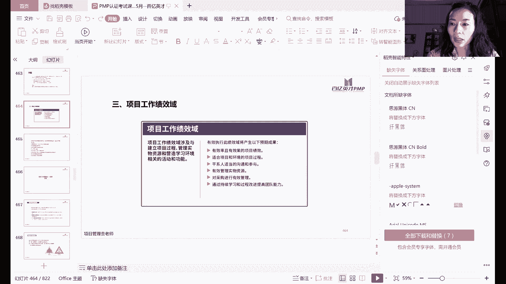

今天晚上应该是讲我们的工作绩效率，嗯前面花了比较多的时间，跟大家讲规划的绩效率哈，那么从今天晚上开始呢，我们要正式开始工作的绩效率了，虽然在实际的项目管理过程当中呢。

工作绩效与其实这个领域涉及的内容挺多啊，至少工作起来是最复杂的，但从我们的知识体系上面来讲呢，工作就像于这个里面的知识，他并没有规划那么多哈，所以咱们只要把前面的规划掌握，工作绩效率呢啊。

说白一点就是我们按照我们建立好的一些计划，或者敏捷适应性的这种项目，我们按照我们约定好的这种用户故事啊，去做执行就ok，然后呢做执行的过程当中，尽可能的去保障我们的一个高效率啊。

并且呢能够按照我们预想的既定的那种目标，去达到它的效果，同时呢在项目的过程当中啊，我们说了任何项目它都是有变化的，那么在这个过程当中啊，这种环境的变化，项目本身目标的变化，下面是该新人的一些变化。

我们应该怎么去选择，适当的调整我们的这些管理的办法，在过程当中如何去引导我们干系人啊，积极的参与到我们的项目当中去，怎么样去跟他们采取一种合适的沟通的方式，沟通的方法和沟通的频率啊。

并且呢我们上节课还讲到了，我们要规划实务资源呀，那么实物资源现在到位了啊，我们这个项目已经准备就绪了，那我们在项目的工作过程当中，这些食物怎么样有效的去利用，怎么样避免资源的浪费啊。

怎么样妥善的去啊存储它采购的过程呢，啊随着我们的这个货物到场，那么采购要进行一些收尾，要进行一些控制啊，比如说是供应商要给我们提供服务，甚至呢我们有些工作是分包给他们了，那么既然是分包。

那意味着我们在做项目的过程当中啊，大家要跟供应商去一块儿，去实现这种目标的一个交付，那么如何去跟供应商啊去啊，良好的去协作啊，这说的是有效管理哈，这也是我们在工作的过程当中啊，要去掌握的。

那最重要的一点就是项目管理的过程，它不仅仅是把这个项目把它做好了，而是说啊除了项目达到台阶定目标之外，我们既然作为组织的项目经理，那么我们在这个过程当中要不断的去提升啊，自己的管理能力。

同时呢也要去培养我们团队成员的协作能力啊，所以是持续改进。

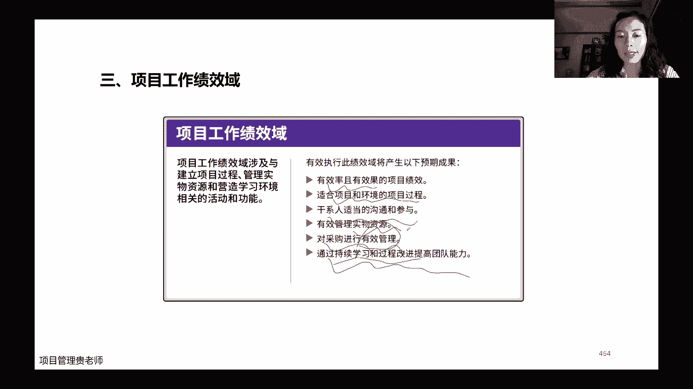

持续学习和过程改进的这样的一个这个价值观，好它的核心哈，使项目团队保持不专注，然后呢要使项目活动顺利的进行，包括哪些内容呢，啊首先现有工作或者是新工作或者留守啊，他在工作的过程当中啊。

我们前面讲的因为是计划嘛，那么计划一定是有变化的，出现了这种变化啊，涉及到一些变更，那这些变更的流程我们应该怎么去控制，怎么去处理，如何引导团队能够专注在他们的手头上的工作。

能够专注于我们项目的目标和项目的价值，给他们排除一些干扰和一些障碍，还要建立高效的项目系统和流程，这高效的项目系统和流程哈，一般嗯跟组织的这个环境有比较大的一些关系。

那如果说组织它是比较扁平化的一种管理啊，好那我们交流起来是没有什么障碍的，那流程呢也是比较的，相对而言它没有那么的复杂啊，千匹扭转之间也没有过多的一些，程序的一些干扰，还有与该系的沟通啊，前面讲了啊。

管理材料，设备用品或者物流，与合同签订的专业人士或者供应商啊，来管理合同的这个采购的这种监督，可能影响项目的变更啊，促使项目的学习和知识转移，其实这个过程啊就跟前面的那个啊那张表啊。

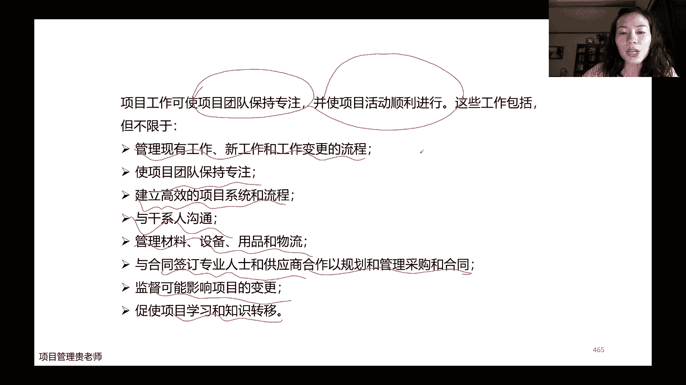

就跟就跟这张表它是一样的哈，工作绩效率呢它也包括了啊，这个内容还我也是跟大家分开了一下，这样便于大家去分模块的去理解和掌握，第一个过程呢啊就是我们把它叫做项目的过程，因为既然是工作的绩效率嘛。

那么项目的过程一定是非常重要的，而且在我们考试当中，整个这个过程，他也是占了50%的这个比重哈，这个是呃第一节课就跟大家讲过，考纲三个大的领域过程是占了50%的，所以这个领域虽然说内容设计的不如规划。

绩效率那么多，但是还是要掌握，首先啊我们为什么要关注项目的工作绩效率呢，它其实是一个建立和优化项目过程的啊，这样的一个宗旨，那有了这个终止的诶，我们要秉持几个这个理念，首先呢啊要精益生产。

精益生产它的这个核心的就是利用价值来，因为价值流图来测量，增值的和非增值活动之间的啊，他们的一些这个回报率啊，做尽量的去选择做一些增值的一些活动，同时呢那既然我们要改进的这个过程。

那么改进是通过什么去改进呢，是通过我们啊不断的或者说定期的去回顾啊，我们有哪些做的不好，哪些做的好啊，我们的经验教训怎么样去提炼出来，同时呢啊如果提炼出来了，这些比较好的一些经验啊，我们有更对这些项目。

或者对这一类似的项目有更深刻的理解了，那么下一次投资的时候啊，下笔资金花在哪里呢，我们就有自己的一些比较好的一些意见，优化价值交付哈，他其实也是一个啊这个组织的，从这里到这里。

其实是一个项目和一个组织的成长，的一个路径哈。

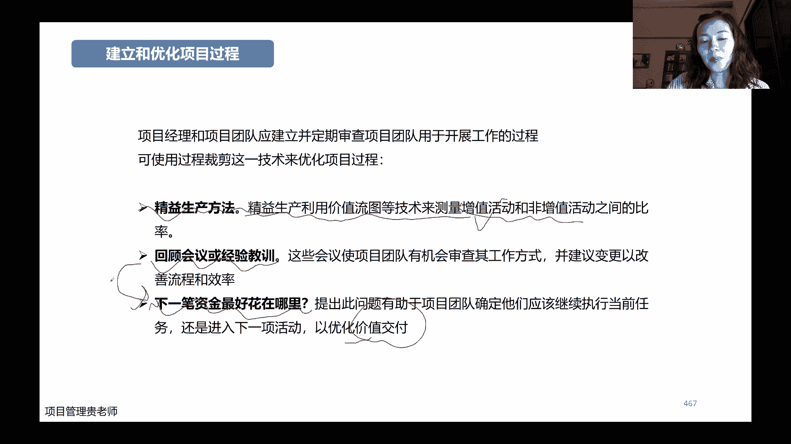

平衡竞争性制约因素呢，平衡性，平衡性这些制约因素呢，哈这个里面有包括几个内容哈，这个大家了解一下就ok哈啊了解一下，首先呢成功的领导项目，包括与项目相关的一些制约因素，这个制约因素啊。

我记得昨天昨天还是昨天还是今天，我们群里面有小伙伴问到哈，至于职业因素是包括什么内容，然后举个例子哈，一般情况下我们嗯讲的这一套这个知识体系呢，它都是基于理论的情况，那么我们都知道。

实际当中呢肯定会有各种各样的一些意外啊，这些意外呢其实也不叫意外，因为放在实际的过程当中，他就是很正常啊，但是对于理论的模型来说，它是一些意外，这些都可以叫做我们的制约因素哈。

所以呢啊我们在管理的这个过程当中，一定要去平衡这些制约因素，比如说今天在群里面跟那个小伙伴，跟那个学员讲的那个问题，明明我们对这个项目而言，最便捷最高效的这种管理方式啊，是纯敏捷。

纯适应性的会比较好一些，但是呢可能由于比如说你这个做的这个项目，是给政府提供服务的，那政府他一定是强调啊，比较这个规范的文档啊，比较频繁的汇报啊，一次汇报，二次汇报一定是这样子的，那没有办法。

这个政府的他们的这种啊工作的文化，工作的习惯，那对于我们整个要实行适应性的项目，和敏捷的管理办法，它就是我们的制约因素哈，所以在这个过程当中啊，要去平衡，要去适当的去把握这样的一个度。

同时呢在整个项目期间啊，这些因素可能会发生变化，这个呢是什么意思呢，啊我们比如说还是举刚刚这个例子哈，啊这个嗯也是给政府提供服务啊，政府呢一般通用的可能就是啊，汇报的这个文档规范化。

然后报告呢也很会写啊，要符合政府公文的那一套程序啊，但是呢在作者过程当中，哎我们有可能换了不同的部门啊，我们给这个部门给发改做完了啊，我们要去做另外的一个部门啊，做这个比如说啊这个建设啊啊。

或者是那个公信啊去给他们做的时候呢，那他们的虽然说也很强调文档那些规范，但是呢他们的领导可能就是完全关注的领域，关注的点是不一样的，那么他对这个项目的汇报的一些要求啊。

就有可能出现一些新的一些这个不同的一些点，不同的一些变化，所以呢这些因素并不是说，我们啊在一开始识别出来了，那么就一直沿着这个职业因素，一直去持续到项目的整个过程，不是这样的哈，这些因素可能会变化。

当然我举的这个例子呢，它只是从干系人的这样的一个小的，这个领域去啊，切入我们项目的这些因素呢，啊一般把它的范围有助于啊，成本也有可能有制约啊，做着做钱不够花了啊，或者说融资的时候约定的是什么时候打款。

但是呢打款的这个频率和打款的期限推迟了啊，这个质量这些都是我们的职业因素哈，那第三点才是说，要平衡这些不断变化的制约因素，同时保持干死人的满意度，前面举的例子刚好都是该系人的。

所以这个第三点不再继续阐述了，然后竞争性的制约因素呢，嗯一般这个大家看看这两张，就是这两个对比图哈，这两个对比图啊，举个例子跟大家解释一下，大家就能够看得懂的，什么意思呢。

啊比如说传统的项目我们都知道哈，比如说这些预测型的这种项目范围进度成本，这是我们的这个三大金刚，对不对，了解过的人可能听过三大金刚，也就是说我们对预测性的项目范围是确定的，时间是确定的。

成本啊也是确定的，那么在保证这三个制约因素的时候啊，一般情况下我们又想做的好啊，又想节约时间啊，又想节约成本，这是很理想的情况，但实际呢我们往往遇到啊，你到底是想舍弃一点范围，节省一点时间呢啊。

还是说你要增加更多的范围，让客户更加满意啊，但是时间上面啊只能自己去多承担一点，成本上面只能自己去多承担一点啊，这是在项目的过程当中，要做的一些取舍和平衡啊，同时除了这些金刚之外的基准之外呢。

还有我们企业的形象啊，企业的这个声望给客户留下了一些啊，比较良好的一些印象哈，那么既然说给客户留到比较好的印象，这有范围质因素嗯，给可以给大家抛一个抛一个问题，大家自己去思考哈。

如果说你在管理一个项目的时候，你给客户多做了一些活儿哈，多做一些活儿，那你觉得客户到底是会感谢你，然后以后给你更多的业务做呢，还是他觉得这个可能就是你应该做的，然后以后的有的业务呢也不一定会给你做。

这个是大家自己可以去思考思考，从人性的角度去想想啊，啊同时呢质量啊，质量呢也是我们的这个制约因素啊，基本上是一个非常核心的啊，为什么呢，我们一般都会说哎，我希望你把这个工作做得又快又好啊。

这个快就是效率比较高啊，时间用的比较少，成本用的比较少，什么是好呢，质量比较好，所以呢你既然说质量比较好，我们前面讲质量规划的过程也讲过了，质量规划里面有一个重要的工具，叫什么叫质量成本，对不对啊。

你要保证质量是需要花钱的，是需要花成本的啊，那你这个时候成本跟我们的时间，成本跟我们的这个质量，然后呢质量跟我们的范围，他中间又是有一些这个制约因素的，有一些竞争性的这种关系，那怎么去办，怎么去判断呢。

要质量还是要范围，要质量还是要成本，对不对啊，当然还有一些风险，我们说任何一个项目他都有一些风险，那么我们为了去应对好这些风险，我们也要有一些风险的应对计划啊，要规避这些风险，我们要做一些新的一些动作。

那做这些动作要不要花钱呢，啊也要花成本，那你是啊接受这个风险啊，节约一点成本，还是说你要规避这个风险，多花一些成本呢，那这个就要实际的过程当中具体的去分析，具体去看，不是右边这张图啊，竞争性的项目。

竞争性职业因素什么意思呢，哎范围风险啊，成本时间和风险，它把它放在里面了，那你看这很有意思哈，传统的我就是以这三大基准为核心，我在这个三大基准三大金刚的范围之内，我完成了完成的前提之下。

我在追求我更好的声望啊，追求我更好的质量啊，追求有一些价值，但是呢啊这种竞争性比较大的这种项目呢，是你即使舍弃你的啊，范围，舍弃你的成本，我说的成本是相对的，成本相对更少的这个成本啊。

舍弃你等相对想要花更少的时间的，这样的一个这个想法，你也要去把项目的价值把它实现出来，为什么，因为你如果说做的没有价值，那自然有别人他愿意花更多的时间，愿意花更多的识别呃成本，愿意花做更多的活儿啊。

来追求这个价值，追求客户，追求该系人的认可啊，质量嗯，我不仅要追求他的这个价值，追求他的认可，我还要啊给他保证，尽可能的保证更好的质量，更好的合格率啊，更好的他的满意度啊。

从哪儿来来提升我项目的形象和声望，也就是说我这个项目我可以不挣钱，我亏钱啊，啊我我多做一点，我都ok，但是呢我要把这些东西做出一些积淀，做出一些积淀之后呢，你便于我在同行业当中，有一点点的这个竞争力啊。

有一点点的这个占有率，进而能够保证我在下一次的这种项目当中，能够实现我更好的一些项目的商业价值啊，和收益。

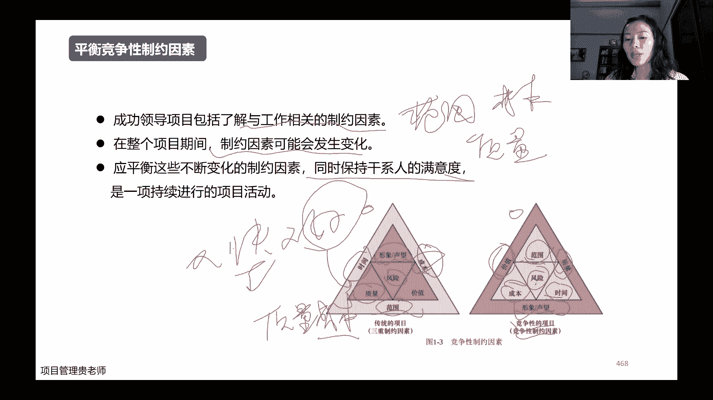

这个是竞争性的制约因素哈，大家去理解一下，后面呢给大家举了一些这个具体的案例哈，那比如说啊我们在一个项目的实施过程当中呢，公司出现了危机，导致了信誉受损，那大家想想。

如果说这个公司啊它是一个嗯文化的氛围，项目管理的这种这个机制都是比较传统的，那我们刚刚讲传统的就是范围啊，成本呀，进度呀，已知三大基准为核心，对不对，那现在呢这个公司它已经出现了危机的。

他的公司的信誉受损呢，那你觉得老板他现在仍然最在乎的是这三个嘛，不一定了，对不对，不一定啊，啊，他的这个项目，就从原来的这三个最核心的质因素变成了，我要尽一切可能优先保证我的信誉，不要去受损啊。

所以这个过程当中它的制约因素就变了，竞争性制约因素就已经发生改变了，同时呢要了解一下次要的因素哈，次要的因素呢，那比如说这个像这个公司，它传统的最开始的时候呢，范围和成本和进度。

是它的核心的竞争性的制约因素，那生育呢信誉呢，形象呢是他的次要的啊这个职业因素，但是呢在这个过程当中，信誉，信誉就变成了他的一个主要的核心的竞争因素，而范围成本进度，这个时候就变成了他的次要的职业因素。

还有一个啊这个这个例子是更加的形象一点，比如说啊你说啊迪士尼建个主题乐园啊，或者说其他的你要建一个什么样的这个啊，这个旅游场所啊，温泉场所，那么你既然是项目，他一定是避不逃，逃避不了这些范围，时间成本。

这三大记者一定是逃不过的，那么对于一个旅游景点而言，安全是不是也非常非常重要，对不对，那么啊它的审美的价值和它的可玩性，可赏性质量啊，这一个这六个都是对于一个这种主题公园来说，都是非常重要的。

那么大家觉得啊，如果说这个主题公园的建设，也是按照传统的这种职业因素去考虑，把时间把成本，把范围放在第一个啊，核心的就业因素去考虑，把安全审美和质量放在次要的，那可以吗，一定是不可以的，对不对，为什么。

因为他是要对外啊，对公众去开放的这样的一个主题乐园啊，所以安全一定是核心保证的，质量和他的审美的这个价值，可观赏性，对不对，因为如果他后面这三个达不到，他是没有，它是没有办法运营的。

即使他这个项目啊这个非常大的一个规模啊，可能花了花了六个月的时间就把它建成了啊，成本也花的很少，然后该有的一些这个主题乐园的这些场所设施，它都有啊，范围也都做到位了，那前面三个保证了。

但是呢他后面的三个如果没有保证的话，它项目可以成功的交付，但是后期运营的时候啊，就会遇到非常大的麻烦，就会面临啊，有一些安全的一些风险没有考虑到的啊，或者说没有作为重点去考虑的，那我运营的时候。

万一出现一个安全事故，所有你在前面节约出来的成本都白瞎了，对不对。

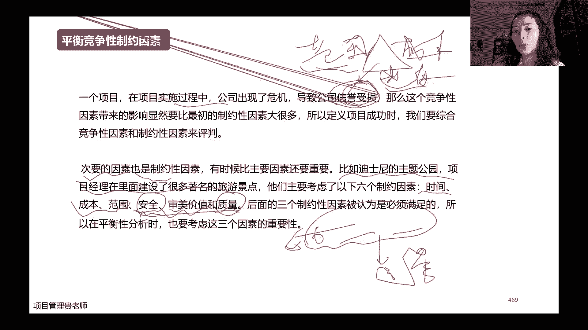

啊，第二个呢是在我们的工作过程当中，会产生一些东西哈，这个东西是什么呢，是我们工作当中产生的一些数据啊，有数据呢可以产生一些啊信息，有信息呢可以把它整理成报告哈，注意我说的词儿，我说的几个词儿是原始。

通过原始观察结果或者测量成产生哈，产生的数据，数据它就是最原始的，然后如果说你的数据没有进行加工，没有进行提炼，那么你就是一堆杂乱无章的数据，所以呢数据要进行提炼，提炼成什么呢。

提炼成工作绩效信息怎么提炼呢，要整合，要分析啊，没用的数据把它去除掉，有用的数据去把它找出一些规律，得出来一些有用的信息，通过这些信息呢，再去把它编制成比较好看的这种啊这个文件啊，形成工作绩效报告。

所以这三个它是有一定的这个呃递进的关系，和前后的这种因果关系在里边的，他举一个例子哈啊信息啊，这个数据和报告举个例子，比如说嗯今天晚上啊在直播，那么我发现啊我现在看到的这个累计观看是啊，九个人啊。

观众呢是七个人，那么我得到的数据啊就是观看九人啊，应该说累计观看救人，然后观众，七人，然后我去跟苏苏老师去沟通啊，我说今天晚上的直播课程是这么样一个数据，然后苏苏老师就会觉得很懵啊。

所以呢你想表达什么呢，然后我要去整合分析哦，分析出来呢，今天啊这个观众目前是七个人，那人数不是很多啊，因为我看咱们群里面也有这个接近60人，那么只有七个人在直播间去观看啊，得到的信息可能有呢。

诶第一今天是不是周五大家周五比较放松啊，或者是呢周五有的公司啊还在还在加班啊，比较可怜啊，有的公司好一点呢，搞出聚餐去了，所以大家没有办法按时的来听这样的一个，直播的课程啊。

或者还有一部分呢有可能是觉得这个听直播啊，要耗两个小时的时间，但是如果自己看回放呢，可以快进啊，可以调语速，可能一个小时就能够完成这些知识点的掌握啊，所以他觉得他不想听直播啊。

这个都是说我分析出来得到的，可能的一些信息点啊，ok那基于这些信息点呢，我要形成工作的绩效报告啊，我要去跟啊，比如说现在老师要求了啊，这个苏苏老师要求来说，我们现在这个平台上面要求啊。

每次听直播的这个人数不少于20个人诶，那我们在下一次的时候，是不是我前面提到的三种可能性的这种原因啊，这是得出来的这个信息，我是不是一个一个的去规避一下啊，比如说第一条诶，是大家啊今天聚餐了没有时间啊。

那我们是不是以后尽量不放在周五呢，啊周五第二条也是大家这个要加班啊，这个没办法加班，这个多多少少都有一点加，但是不至于说每次都是啊，就是都会去加班，每次都没有办法听，对不对。

然后第三种呢它是不习惯听直播啊，他就喜欢听回放，那我们为了保证他这个能够在直播间里面啊，能够参与直播，那我们是不是增加一些直播的互动性啊，啊或者呢这个把直把直播的这个授课的这个老。

师讲课的这个时间去尽可能的把它压缩一点点，然后留更多的时间让大家去问问题呀，或者是让大家结合自己的工作，说说自己的这个想法呀，啊当然这个是一种探讨哈，这样的话我们呃实际导致的结果，可能就是。

我们整个这个课程会排很长很长的时间，所以我只是说这是一种基于我这条信息，我做出来的它的可能的解决方案啊，解决方案有有问题，有解决方案可以做成一个报告啊。

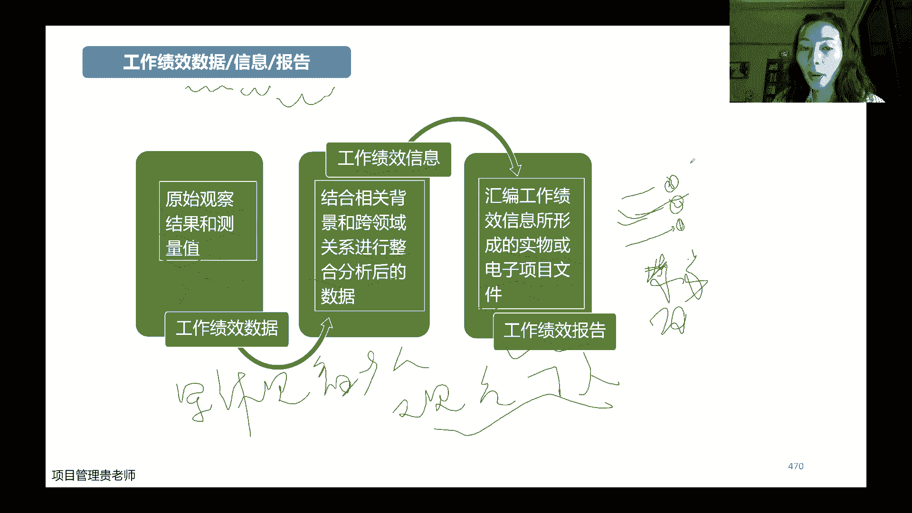

既然说我们在过程，那么还有可能出现的呢，就是他的问题，为什么呢，因为我们既然有绩效报告了呀，那绩效报告肯定会展示出来，我们的绩效是好还是坏啊，有什么样的一些问题，所以呢在整个项目的过程当中。

我们也有一个专业的这个工具叫项目文件，它叫问题日志啊，问题日志呢就是记录和跟进，所有问题的项目的文件，他应该是贯彻在整个项目的审美期间的啊，整个项目的生命期间，都应该把问题日志实时的更新。

这些问题日志里面要包含什么东西呢，包含第一啊，什么类型的问题啊，比如说咱们啊讲这个直播讲课程嗯，有时候有卡顿啊，有时候有这个这个黑屏啊，那这是技术问题啊，所以呢我回了第一类技术性的问题。

然后呢当然也有可能是网络型的问题啊，我们统称为这个技术性的问题，然后第二个呢a是我发现大家在直播间的时候，哎问问题会比较少啊，那是这个互动性不太够啊，这是又是另外一种问题，所以呢在问题设置里面。

首先问题的类型啊，要把它先列明，命名之后呢，还要列明啊这个问题的提出者是谁，提出时间是谁啊，比如说咱们做一个软件开发的项目，那么现在啊软件这个啊，在做测试的时候发现一些bug，发现一些问题啊。

这问题是谁发现的呢，比如说我们测试工程师发现了什么时候发现的，提出的时间是今天啊，6月16号晚上七点发现了这个问题啊，ok这要记录，为什么要记录呢，是要记录啊，我要去避免以后这个问题扭转的过程当中。

因为问题他提出来不一定是他去解决了啊，所以呢最后解决者发现核实了一下，说哎你这个问题好像提错了，比如说你把日期搞错了，我6月16号没有做这样的这个测试的工作，或者说6月16号啊运行的这个啊。

这个代码是没有什么问题的，所以我要去跟他核实啊，所以呢这个问题提出者和提出时间啊，要阐明问题具体的描述，还有问题的优先级，为什么问题的优先级要联名呢，啊因为我们的问题大问题小问题会有很多啊。

都去解决当然很好，但是都去解决，第一要耽误时间啊，第二要花人花资源，是不是理论上面都有这些人和资源去呢，那也不一定，所以我们给他排一个优先级啊，那比如说诶咱们去啊做的时候发现有一个需求，诶。

是我们是客户临时加的，还比较重要啊，但是对于我们来说呢，他可能是需要走一些啊变更的流程啊，或者是之前没有讨论进去的啊，要要花比较多的一些成本，这个问题我们能搁置很久吗，不冷对不对。

因为是客户提出来的要求，一般情况下客户的那边发生的一些问题，可能优先级都还比较高，对不对，那还有一个问题呢啊，跟他是这个同时发现的是什么问题呢，是我发现诶，比如说咱们在项目管理的过程当中。

有两个工程师啊，嗯他们产生了一些矛盾，产生那些矛盾，然后工作起来不是特别顺畅，那你说这两个问题同时出现啊，哪个优先级更高呢，一般而言肯定是第一个问题，他的优先级更高一点，对不对。

还要面临由谁来负责解决问题啊，比如说第一个问题啊，客户需求的问题由谁来负责呢，啊我们让产品负责人去沟通啊，去跟客户沟通到底是怎么回事，到底想做成什么样啊，然后我们如果说真的去做的话。

可能会时间上面可能会有一点点的，这个往后推啊，资源成本上面也有可能一些增加，问客户是不是接受啊，比如说第二个这个你刚刚举的例子，第二个是两个团队成员内部有一些这个矛盾，也出现了一些问题啊。

比如我列名谁去解决了，还有我们的这个项目经理去协调，或者小组长选几条，还有目标解决的日期啊，比如说我们跟客户的这个需求，我希望他在一周内把这个问题解决啊，跟团队之间的这个问题，我希望他在两天之内啊。

或者我在，我希望他在今天当天就能够把问题往矛盾，把它化解，问题的状态，问你的状态呢是说，比如说我我这问题都是6月16号，那么我到明天我6月17号的时候，我看一下这个问题，他目前是处于什么状态。

是已经去跟踪了，还是说目前还是带跟踪的状态，或者说已经解决的这种状态啊，还要面临最终的解决情况。

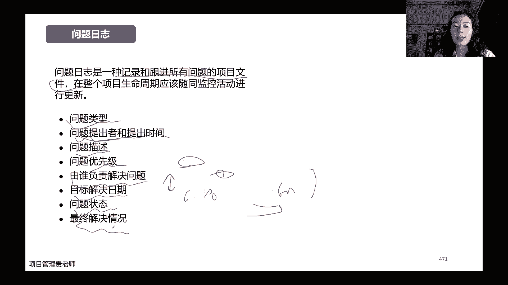

这是我们问题日志需要啊去记录的几个核心的，它的点哈，这呢给大家列了一个详细的这个案例哈，这是这是我们有个这个呃学员啊，嗯这应该是一个这个一个这个私教的学员，他做的互联网医院的项目。

然后他的项目呢你看他有啊这个问题的描述，基础信息的准备，然后有一些是技术问题，有一些是这个电子健康卡啊，有一些是平台接口调试的问题，有一些是导入账号的这些问题，然后提出人呢啊。

根据他们项目的团队也是提出了一些问题啊，影响程度好，就说是带在我们前面的那个优先级哈，然后预计解决的时间是多少天啊，解决的方案是谁是怎么样子的，负责人是谁啊，后面还有一些具体的这些信息啊。

所以这个问题是智能嗯，我个人是比较建议大家在工作当中，尽量的把它用起来啊，一开始呢咱们不用念名太多的信息，就把前面讲的这些核心的什么样的问题啊，是谁提出来的，优先级高不高啊，怎么去解决，要花多长时间。

谁来负责跟踪啊，现在的这个当前的状态和和是否是已经解决，就列这些基本信息就ok了啊，为什么呢，就是为什么要让大家做这个事情呢，是因为这样的话可以让大家形成一个问题，能够持续跟踪的这样的一个思维在里边。

因为问题往往是，提升和优化的基础，你只有发现问题了，你才有提升和优化的空间啊，所以呢从小的事情开始啊，哪怕是哎比如说今天是一个啊，你跟某某团队成员去去沟通一个事情啊，你觉得尼克龙嗯这个沟通到位了。

但是呢他有可能没有理解，所以他做出来的时候呢啊这个东西啊，这个代码还是还是有一些问题啊，还是没有理解到位好，那你就去，你也可以把这么小的一个问题把它记录下来啊，沟通什么什么什么情况。

然后谁提出来这个问题，你出来它影响高不高呢，啊一般应该是中或者是低啊，预计你什么时候啊去把这个问题把它解决，你解决方案是什么，解决方案，比如说你在跟他啊，私下再进行一些啊一对一的这个交流啊。

看看到底是他哪里没有理解到位啊，还是让他理解了之后就是不愿意去做，然后这个问题呢谁去负责呢，啊比如说你自己去负责啊，最后解决的状态是什么样，你有这样的一个啊回顾的一个过程啊。

回顾的一个过程跟他再次交流的一个过程，你就能够知道你刚开始的时候，你的沟通到底出现了什么样的问题啊，或者说你们之间的沟通问题点到底处在哪里，下一次呢你再跟他，或者是换一个人再去沟通的时候。

那么你就能规避啊，你类似的是你的口音问题啊，语调问题啊，还是说你一些专业术语说的太专了，大家听不懂呀，就可以去解决了，所以这些问题不要害怕它小，不要嫌弃它，小小问题是帮助咱们训练思维的啊，小问题会解决。

小问题会跟踪大问题一样。

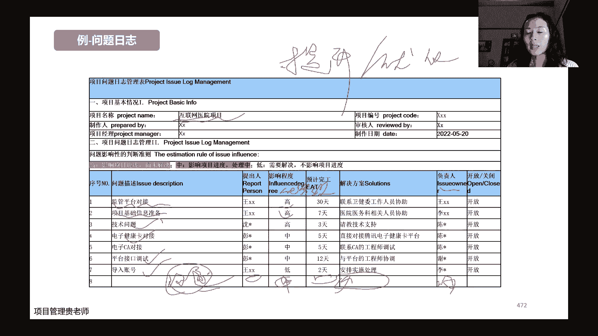

都是这个流程，讲完了问题呢，我们还要讲工作过程当中，前面我们既然说规划绩效与，里面有规划质量管理呀，那我们在做工作的过程当中，就要具体的去管理这些质量的，对不对，那管理质量它的核心的作用呢。

就是提高我们实现质量目标的啊可能性，并且在过程当中，如果说是一些无效的过程，那无效他肯定是浪费资源和浪费时间的，肯定要摒弃啊，或者是呢这些过程它能够，它有可能导致我们质量低劣啊，质量不合格啊。

那这些呢我们要去识别出来，识别它到底是因为什么原因，怎么去识别呢，执行有关产品特定方面的一些设，计的一些准则啊，就是通过设计的时候，就尽可能的把质量的这个因素，质量的元素把它融入进去。

第二个呢啊要通过一些质量保证的工具和技术，一般呢我们质量审计是常用的哈，故障分析你是用的比较多的嗯，质量审计呢是我们整个项目管理过程当中的，这个核心的审计之一哈，我们嗯还有另外两个审计呢。

一个是风险审计，一个是采购审计，这是我们项目管理体系里面的三大审计哈，质量审计是其中之一呃，同时呢要确定质量的过程啊，并且满足它的质量的目标，提高过程和活动的效率和结果，进而能够使相关方去满意。

这是我们做质量管理的这样的一个动作，做了之后啊，要做什么。

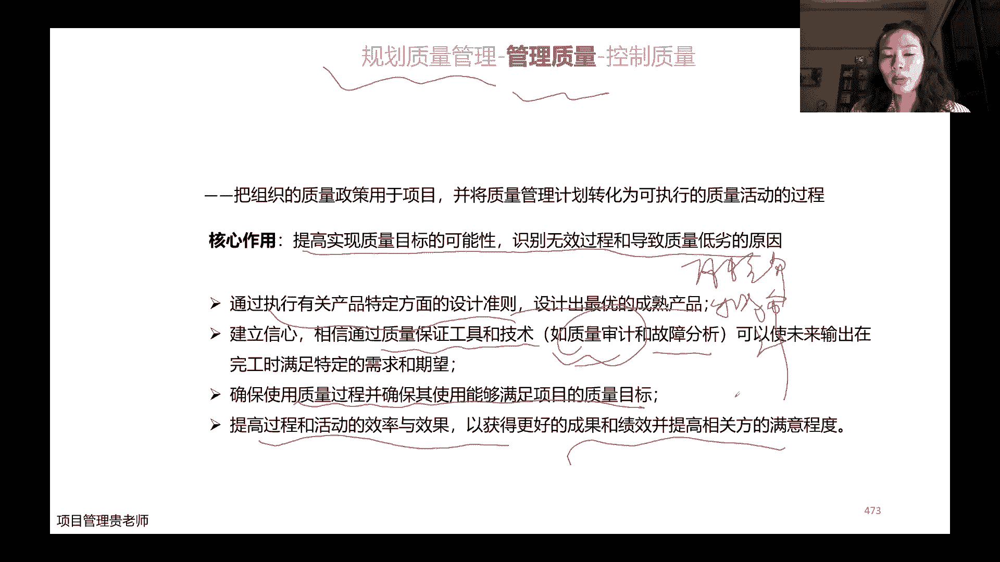

以及做了之后能够达到什么样的目标，和什么样的效果，嗯这呢既然提到管理质量，管理质量的这个人员和角色啊，有必要跟大家再次的再啰嗦一遍，或者说呢再普及一下，首先呢一般公司它可能会有质量管理部门啊。

我们叫做q a啊，当然也有很多部门呢，也有很多公司呢这个q u a啊，他没有专门的这个部门，他只是有1~2个人去兼职做了，这样的工作也行啊，他们就是主要负责来执行啊质量管理的活动。

比如说啊这个项目要开始做质量审计了，那ok啊，我这些q2 的部门，我来做质量审计，这个动作是由他们来做的，比如说要做一些故障分析啊，学设计啊，或者是一些这个呃这个呃核心的一些质量审计，质量改进这些动作。

但是呢是不是说质量啊，管理他就完完全全是我们q a这个部门，或者q a拥有他的这个职责的这些人啊，只是他们的事儿呢，不是的，为什么呢，因为我们说了呀，最好的质量管理是把它融入到我们的文化当中。

他一定是全员的责任，这个全员呢啊除了我们的项目本身的这些啊，团队也好啊，项目经理也好呀，发起人也好啊，还包括我们整个公司的管理层啊，甚至是客户，他们在质量管理当中啊，都是要发挥自己的作用的。

在敏捷项目当中，所有的团队成员它不仅仅是他的责任，他就可以执行啊，比如说大家更好的去互相帮助，更好的去创造价值，更好的去自主制创造一些项目的这个啊目标啊，去追求它的价值啊，在传统的项目当中呢。

虽然说我们也说啊，只要是全员的责任啊，但是一般情况下传统的项目当中，还是最开始的时候会列明这个管理质量的，这个活动到底有谁去做哈，所以他是一般是有特定的团队成员去做执行。

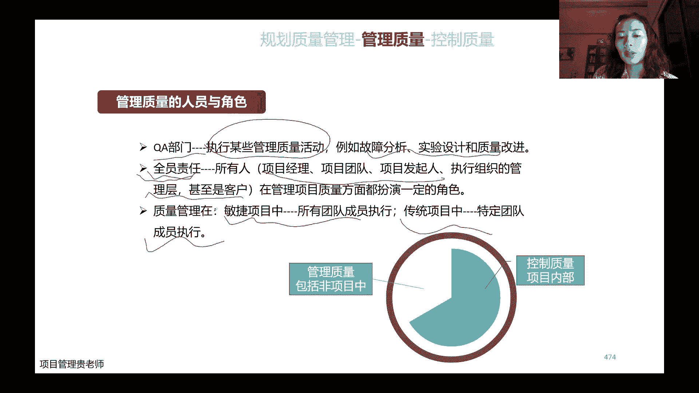

嗯它的工具的这个这个过程啊，子过程的输入和输出，还有工具嗯，也带大家看一下，因为我们现在说管理质量嘛，所以前面做的那个质量管理计划，是一定要参考的，它是我们做这样的一个过程的一个指南啊。

还有一些项目的啊，这个文件比如说我们有质量测量指标啊，啊，或者是我们在过程当中做了质量控制的，这个动作之后啊，有一些结果，比如说我做了统计抽样诶，我发现有一批弓箭它是不合格的。

那我不合格到底是因为什么呢，我要反思一下，我的整个这个治疗过程哪里出了问题好，所以工具和技术的时间核对单呀，应有还有呢过程分析和根本原因分析，以及呢审计，还有这个问题改进和质量改进方法哈。

这个都是我们管理质量这个子过程里面，用到的核心的一些工具，那说出来了，当然质量报告啊，通过这些工具我们做出来了，哎我们把这个质量它可能存在什么样的问题啊，可能的原因是什么，然后接下来呢。

我们打算怎么样做一些这个改进啊，做这些改进呢需要多少钱啊，需要多长时间，大概会花多少的成本，但是呢它能给我们的公司的质量，管理水平带来多大的提升啊，这个是质量报告要写的。

然后呢相应的有些质量管理计划的这个啊，可能要有一些更新啊，这个不是核心，核心是这个质量报告好工具。

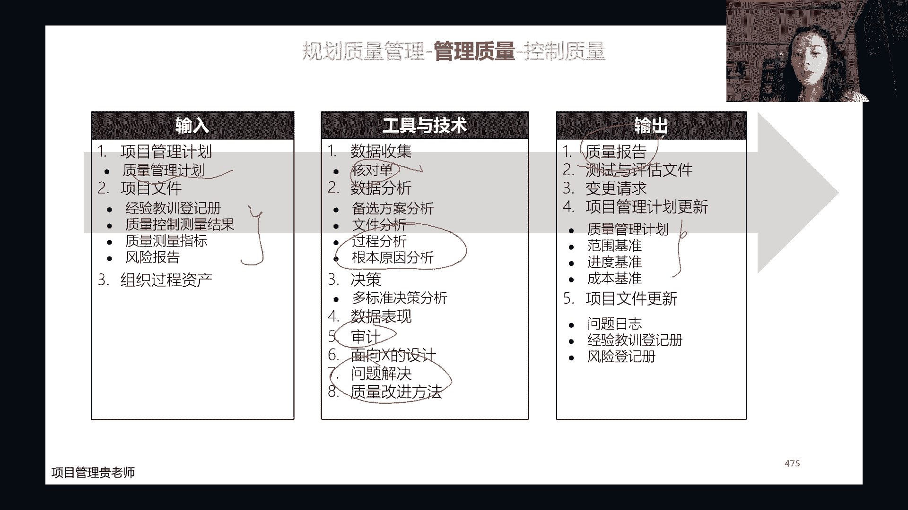

过程分析过程分析啊，他主要是说识别过程，改进机会，在这个过程当中呢就会检查遇到的一些问题啊，这些因素以及呢我们做的哪些工作，它其实是不增值的，它其实是浪费资源的核心，记住这三个就行了，识别问题啊。

找问题，发起语音，制定预防措施，这三个是核心的啊，也是也是大家实际的工作当中啊，或者实际的生活当中啊，常常用的哈，一般我们发现问题之后，第一个事情是要啊正确的去看待，正确的去认识这个问题。

识别不仅仅是说你发现了，一定要是不仅仅是你发现的一个问题是什么，比如说啊以前跟小伙伴交流的时候，小伙伴经常说嗯我们这个项目问题很大，经常延期，大家觉得这是不是一个问题呢，经常延期，大家觉得是不是问题呢。

如果在评论区的小伙伴可以在评论区啊，这个敲一敲哈，他嗯大家一边掐我一边讲哈，像什么资源不够咯，啊这个进度推迟了延期了，啊这个都是实际当中被小伙伴提到了，更多的一些问题哈。

我们直播间有小伙伴说必须是问题啊，是他是问题，但是呢嗯咱们不能这样去识别问题，如果这样识别问题是没有办法解决的啊，为什么没有办法解决，因为资源不够啊，进度延期，资源不够有可能是一个原因。

但是进度延期它是表象，他只是啊有一些有一些根本性的，一些这个原因啊，到底是什么原因，多种多样，但是呢它造成的这个表象的问题是进度延期，所以我们在描述这个问题的时候，就不能简简单单的说啊。

我这个项目它的进度经常延期，而是要阐明，因为或者说由于什么样的现象啊，由于什么问题，导致了我的进度延期，进度延期它其实是一个表象，它已经是一个结果了，对不对，它已经是一个结果了。

你根本就没有把这个问题把它识别出来，这才是问题，是由于什么问题导致了你的进度延期，明白吗，所以我们识别问题里面有很多啊，对延期时表现不是根音对，所以我们的这个第一个识别问题哈，就是千万不要把我们的表象。

就认为它就是根本问题啊，所以为什么探究根本原因啊，是一个紧接着要做的一个动作呢，那么进度延期，我们紧接着如果说有这个思想，我们就会往前去追一追，往前去追，就是要追，到底是什么问题导致了进度延期。

那么什么问题呢，有可能是因为我们的资源确确实实是不够啊，资源不够呢，那是不是就真的是资源不够呢，资源为什么不够呢，哎我们又可以去往前再倒，资源不够，那是因为大家需要五个人，但是五个人的技能不足。

是因为他的技能不足，你五个人的理想的工作没有办法去完成，还是因为他的这个技能是ok的，但是呢这个你的精力不够，所以大家不愿意给你按时完成啊，或者你的惩罚太少啊，或者你的经历太少啊。

总之你没有把他的这个主观能动性，把他想把这个项目做好的，这个类型的这种欲望啊，把它期望把它调动起来，这也有可能导致资源不够，对不对，那么还有可能是你规划资源的时候，规划资源的时候啊。

你本来就规划了这个活儿，应该是五个人，一个只规划了四个人，规划就出现了问题，对不对，也有可能，那么还有什么问题呢，大家觉得资源不够，还有可能是因为什么导致的资源不够呢，技能不足，精力少啊。

规划的本身就不够啊，还有可能有别的原因哈，还有可能比如说啊这个资源啊，他这个，资源的日历啊，其实没有跟我们实际的这个进展去匹配到啊，或者说临时出现了他的一些这个啊，这个健康问题老请假啊。

或者是这个资源呢本身呢，它的有一些制约因素啊，比如说这个人他需要老需要他加班啊，但是呢他家人可能比如说她媳妇怀孕了，唉，马上要生产了啊，那那怎么办，马上要生产了之后，那他确实没有办法去加班啊。

这些制约因素，他也有可能是导致了我们资源不够的啊，所以探究根本原因哈，这个才是最关键的，因为你只有找到原因之后，你才能够从根源上去制定预防措施啊，比如说我们说的进度延期是因为资源不够啊，资源不够。

他有可能有123456，有六个这样的原因，最后我们发现哦，真的是因为技能它确确实实不够，那怎么办呢，培训呀，对不对，技能不够，那当然最好最直接的办法就是培训啊，精力少，那给他申请一点项目奖金啊。

去找领导申请申请啊，这个规划本身就不足，那我们这个啊提升一下啊，做一下这个资源平衡，做一下资源平衡，并且呢在下一次的时候，我们规划资源，尽可能的去啊把这个问题去改进一下，下次做类似的，我就知道啊。

四个作业是不够的，我要用了五个，然后呢有一些临时性的这个问题，这是不可避免的，但是呢我下次在做资源规划的时候，诶，我就能够去把这个资源，可不可能临时出现一些问题，我把它作为一个风险啊。

我做一些他的一些这个资源储备在这个地方，那我是不是也能够尽可能的去预防这个问题，所以哈就是问题它其实是一个很有意思的点哈，我经常跟就是我们私教的学员在说啊，就是嗯大家在工作当中。

也会遇到很多这种小的问题啊，各种各样五花八门的，这个没有办法去很好的去跟大家去，这个全部都罗列出来，然后但是这些问题呢，就是一般情况下大家遇到问题都会有点沮丧，这个非常正常啊。

包括那天有个小伙伴在群里说的这个啊，好像说现在做题经常错，对不对，太好了，你现在错，那你一定就能够通过你这个错误，去找到你错误的原因是什么，那比如说做题，你错，那到底是因为知识点掌握的不够深啊。

或者说理解不够到位，还是说知识点这个知识点它就忽略了啊，还是说你没有理解做题的，他的这个技巧你是能够找到问题的，找到它的原因的，找到原因你才能够知道啊，是知识点掌握的少，掌握的少，那我以后啊。

尽量的这个老师讲的每一个每个点啊，都去思考思考啊，如果说是这个技巧还没有掌握，那我多做一些类似的题，然后呢去总结一下他的技巧是什么，或者现在网上其实也有很多这个p m p，做题的这种思路啊。

或者做题的一些经验哎，自己去看一看对不对，所以啊问题讲的比较啊，这片子讲的比较多哈，因为我觉得这个比较有意思，我可喜欢带着大家分析问题了，好这样有影响，我们既然要分析根本原因哈，有一个工具叫做因果图。

这个因果图呢嗯考试99%肯定会考啊，因果图它一般出现的它也叫雨果图啊，也就石川图啊，或者有的英文它直接是yy分析图，大家看到这些字眼呢都要理解啊，他就是说的就是我们的因果图哈，他用的场景是什么呢。

用的场景就是我们根本原因哈，这还表示的不是很准确，应该主要是识别它的根本原因啊，主要原因呢嗯用鱼骨图也行，但是主要原因呢大家要注意跟后面马上这个啊，会讲到的，还有一个叫帕雷托，先给大家写在这儿。

回头讲的时候再具体讲帕雷托，帕拉托也是讲这个它的主要原因，或者是这个大部分原因的，但是呢鱼骨图它主要是寻求一些根本原因，什么意思呢，啊他的鱼头啊就是我们的问题了，问题是这个产品质量不符合要求。

产品质量不符合要求，那有很多种可能性的原因，对不对，那我们就要往前去推导，什么原因呢，设备是不是有可能啊，我们设备的这个维护不好，所以呢后面在做的时候，他老是出现一些质量不稳定啊。

或者说我们用的这个技术太老旧了，你就根本跟不上人家，现在好多工厂都已经自动化了啊，我们这还在人工，还在手工或者是工人，他的啊这个经验不太足，技能不太足，他操作不当啊。

进而导致了我们的这个产品质量有一些欠缺，这个是设备方面的，当然还有可能有其他的一些各种各样的一些，这个原因啊，那过程方面呢是不是也有原因啊，比如说我们这个产品质量最开始的时候。

你可能研发的过程就缺了一些啊要素，你没有把质量控制的或者质量管理的，这样的一个这个质量，以质量为核心的一些动作，没有把它设计里面去了啊，所以你研发的时候呢，本身他就没有这个概念，你自然而然地生产出来。

它就是这样的一个问题，好只是你生产方式单一，生产方式单一会面临什么问题呢，生产方式单一是你这个单一的方式，一旦他有一点点问题，那么你其他的是没有冗余的余地的，好人员，是不是你工人本来基础很好。

但是工人很疲劳啊，疲劳之后打个瞌睡，那也可能手一抖啊，这个质量我就就这个弓箭就有可能去报废啊，或者是缺少培训，或者给钱太少啊等等，都是有可能，那材料呢是不是原材料，你用的这一批原材料它不好啊。

你去做一批包子馒头，就感觉人家觉得这批没有双皮好吃，那说明也有可能是这个买的面粉本身，它可能厂家那边有一些什么样的问题，对不对啊，或者说呢唉你你让厂家去订货了，厂家肯定送晚了两天，送晚了两天。

那你在做的过程当中啊，你为了追赶他的进度，省略了一些看起来是比较的啊，没什么用的，这样的一个过程啊，结果呢啊实际可能会影响我们整个产品的，它的一些质量环境呢，工作环境太恶劣了啊，这个夏天来了没有空调啊。

这个工人在里面汗巴巴的啊，蚊子也飞来飞去的，就是小母吃的哈，不能这样讲，然后管理方面是管理的这个承诺比较低，大家根本就不重视承诺，没有一些啊质量成本的这个呃这个预算在里边。

所以呢质量过程本来质量管理过程它就没有啊，所以呢这个都是我们产品质量不符合要求，它可能的原因，那么基于每一种原因呢，唉我们该产生什么措施啊，该去怎么样，那就去怎么样去做啊，至于能够能不能够做得成功。

或者说能不能够啊，这个按照我们这种计划去批，把预算批下来，那这个是后一步的话，但是呢前面这一步是一定要有的。

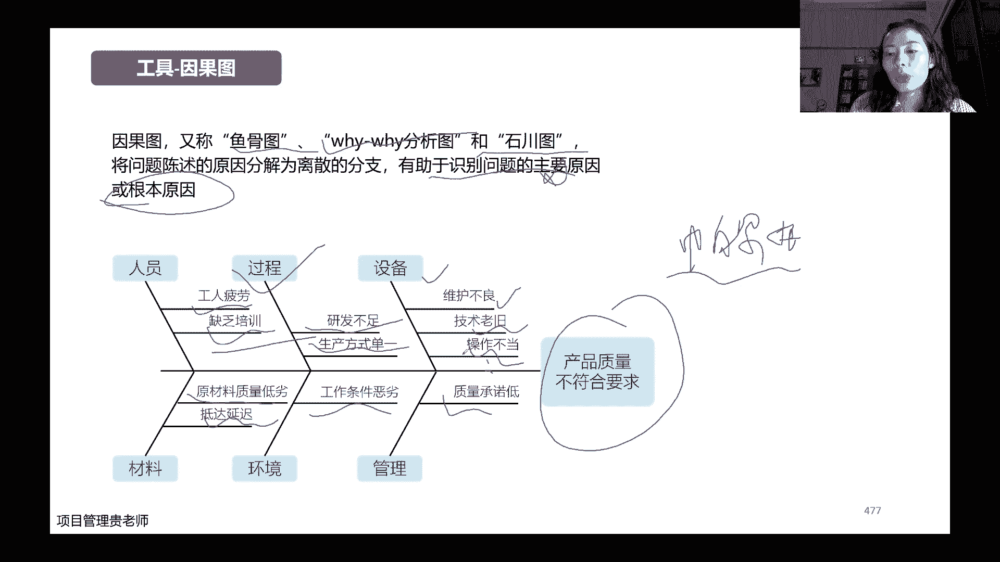

好另外一个工具呢叫做质量审计，质量审计呢它主要是确定我们的项目活动，是否遵循了组织和项目的政策过程和程序的啊，一种独立的这个过程哈，所以呢它一般情况下哈，一般情况下是由这个项目web的团队来开展啊。

比如说这个项目外包并不是公司外部哈，大家不要弄混了啊，比如说公司内部有专门设计部门啊，有专门的项目管理办公室，有专门的这个q a啊，q a的部门啊，或者是呢我找外面啊。

请的这个来来审这个项目的这个财务的情况啊，请了一些审计师啊，这个都是嗯都是有可能的哈，一般在预测型的项目当中啊，基本上web得的会比较多一些，然后它的主要作用呢，首先要士兵全部正在实施的良好最佳时间啊。

不要觉得审计就是来找麻烦的，找茬的审计，他也有义务去把我们做的好的这些良好的实践，把它归纳总结出来，比如说常见的骗谋啊，偏欧部门，天猫部门，他管着这么多的项目组，对不对，他管着项目组。

他不是说啊一定去给你找茬的，他还有义务去提炼每个项目当中，做得好的地方啊，做得好的一些案例，它提炼出来之后，一共有整个部门去给其他的这个公司，其他的这个项目组去做培训，去做提升啊，去做储备。

那当然有好的就不好的啦，要识别最好的，那你还要识别啊违规的一些做法，差距或者不足啊，这个大家肯定也都懂哈哈，违规的操作啊，买一些啊，公司有自己的一些质量的这个标准和要求啊。

一般公司可能这个有s s s o9001 啊，你跟项目组去沟通的时候呢，项目组都承诺的挺好，按照这个质量程序来，但实际呢啊做的时候可能就是为了赶时间，那就是另外的一个啊另外的一个现象啊，那怎么办啊。

审计的时候审出来啊，怎么去协调啊，然后呢还要分享在整个这个公司或者行业当中，类似项目的一些良好实践啊，也不断的去给他灌输，你这样做是不对的啊，这个不要觉得眼前你是省了时间，但怎么。

但但其实呢会给公司带来什么样的一些影响啊，你看这个啊，这个行业内又是谁，因为做这个事情啊，他们怎么怎么样了啊，去分享一些良好的实践，去影响他们，动容他们，然后积极主动地提供协助，来帮助他们啊。

做整个过程的改进啊，比如说你跟他们说了，行业当中比较好的一些实践，在项目组内也认识到自己唉，确确实实是啊，这个没有大局观啊，目光短浅了啊，我也想改啊，我也想这个今后就把质量这个开始融入进去。

我应该怎么做呀，啊那ok啊，审计的这个部门或者q a的部门，给他提供帮助啊，每一次审计都应该对组织的经验教训，知识库的积累做出贡献啊，组织的经验教训知识库哈，一般都是公司有什么特定的一些程序呀。

啊比如说这个问题问题上报的程序啊，然后变更的一些程序啊，啊或者是一些常用的一些模板啊，啊这些这个啊这个项目计划的模板啊，啊质量管理的这个模板呀，质量的合理单啊，这些都是我们公司的。

就是啊经验教训的知识库哈，所以它是一个很大的概念啊，我又想起就是最开始的时候，咱们群里有个小伙伴说这个这个公司让他去啊，搞那个搞那个经验教训库，去了，知识库教训库嗯，它是一个非常大的一些概念。

但凡我们在项目的过程当中做出来的这些东西，它都有可能提炼啊规范化，标准化啊，进而能够去在公司去推广，它，都是我们知识库里面的啊，一个啊一个内容之一，不仅仅只有问题日志哈，不知道那个学员在不在直播间。

我感觉我已经在课上两次提到他这个，他这个现象了，好再下一个工具呢叫做问题解决，问题解决其实跟我们前面的这个过程分析嗯，它前面的是这个三个复数是一样的哈，都是我们定义问题，然后识别根本原因。

要生成可能的解决方案啊，这是过程分析也是要做的，但是问题解决呢，它强调的是后面生成可能解决方案之后，还要最终的选择啊，什么意思呢，接着我们前面过程分析讲，比如说啊我们找到了它可能是设备老旧的问题。

产品质量不好啊，我们识别出来它啊，是设备老旧啊，设备老旧，那我可能的这个解决方案是什么呢，啊我可以去买一个新的啊，我也可以去租用一个啊，租用一个或者呢这个这个弓箭啊，干脆我把弓箭整个这个弓箭的生产。

我的外包啊都是可能的，对不对，那可能的你外包需要多少钱啊，租需要多少钱，买需要多少钱啊，对不对，有什么风险啊，那我要去跟组织去上报，上报之后呢，要去选择一个最合适的，最佳的这样的一个解决方案。

选择了之后就执行啊，执行完了之后还要去验证一下，那比如说我现在去买一个要花这个啊，要花30万，然后我租一个呢啊，我要我可能要用个这个弓箭是常用的，我可能用个好几年啊，他算下来。

每1年也要个这个七八万或者五六万啊，5万，然后或者是我把整个这个国家外包啊，我可能要花个20万，哎，我看起来好像觉得，我买一个是花的成本最高的啊，这个租呢每年花5万，我至少用个6年啊。

我可能也至少是30万，但是我们在选择的时候，就用我们的这个决策分析，租一个呢，他虽然说也要花这么多钱啊，6年要花30万，但是我租一个，我是不是就省了我啊，这个仓储啊啊这个评书呀啊。

或者设备的这个调试运维啊啊维修啊，这些费用我是不是都省了，这些风险我也都省了，对不对，或者干脆我直接就每年就去外包啊，外包的时候，我还能够给会给我的供应商提这个质量要求，对不对，我能把我这个弓箭啊。

我原来自己的这个团队，我可能只能达到他的这个等级，达到一个这个四等，但是我外包呢我直接给他提要求，提到五等啊，进而呢追求我整个这个啊这个这个产品，它的一个更好的一个质量的这个标准水准，对不对。

都是有可能的，所以你无论选择了哪一种，最后要验证一下这个解决方案，它是不是有效有效的啊，最后我发现我无论是买还是租，发现这个产品质量它仍然上不去诶，那是不是你说明你这个还有可能其他的问题。

还有可能其他的原因到底是什么啊，我们再重新的去找找看，质量改进的办法就是这里面搞工具很多哈，质量改进的办法呢有这个pd c，还有这个六西格玛，质量改进啊，pdc应该大家都很熟悉吧。

没有人没有人会告诉我没有听过pdc没单兵环，应该没有人没有人没听说过吧，就是首先啊plan做计划做了之后就去实施，实施了之后要检查，检查完了之后，然后要行动改进，改进完了之后啊，这个再按照再做计划啊。

做计划改进啊，做实施，做检查，做行做行动不断，这样去循环啊，这个这个没什么好讲的，质量改进的方法跟前面是一样的哈，然后六西格玛呢，它也是质量改进方法当中的这个另外一个啊，六西格玛可能听过的人也比较多。

但是这个知道里面的这个内涵的人，稍微应该比t p d c要稍微，嗯这个知道的人稍微少一点哈，跟大家嗯我列了一下哈，为什么他是这样的一个这个字母点，e m a i c6 西格玛，首先呢是这个定义。

你要确认顾客他的一些关键的需求啊，确认关键需求之后，你才能识别它需要改进的这个产品，或者流程的一些范围，然后呢你要具体的去测量，针对所要解决的问题啊，现在去确定一下现在的这个过程啊，他的能力的这个水平。

然后呢你要去找一些数据去分析出来，现在啊影响他这些啊这个问题的这个变量啊，它的因素到底是什么，甚至你可以找出它的因素之间，有没有一些逻辑关系啊，有没有一些线性关系啊，然后呢再去改进再去改进啊。

改进的过程当中呢，啊，比如说我们前面找出来的xy的这样的这个啊，这个影响或者变量，然后完了之后呢，哎我们通过控制固定一个变量啊，把它成为一个固定的，然后另外一个变量不断的去变。

看看呢它们之间是不是真的这个影响能够减少，影响能够消除，哎如果说是的话，哎我们找到他的之间的根本原因，并且还找到它的这个直接的这个影响关系啊，那我们最后去控制，通过一些有效的持续性的检测手段啊。

来保证我们整个这个持续改进的结果，能够纳入到我们正常正常正常的运营管理，或者质量管理的这个过程当中去啊。

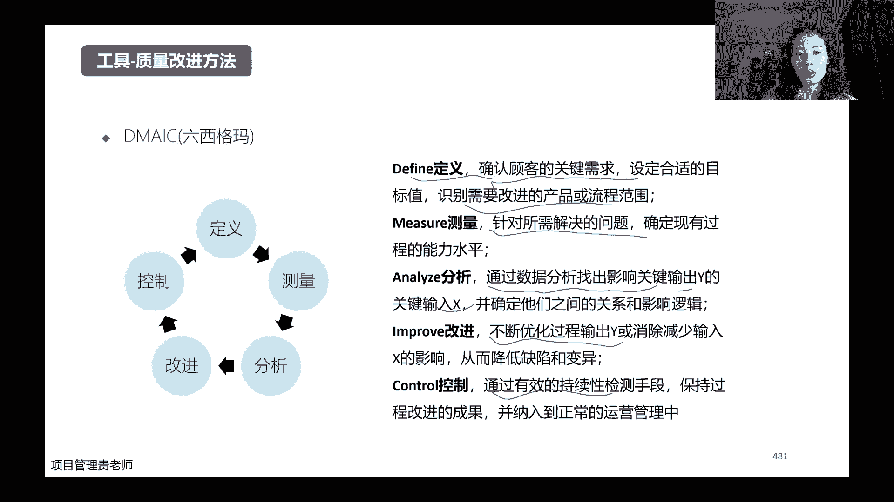

好质量管理它也有几个例题哈，这几个例题呢啊大家看一看，第一题呢他是说质量保证专家，他发现这致敬团队在制药的过程当中，没有遵循合规程序啊，如果要阻止这个问题，那问项目经理应该是先做什么呢。

嗯a呢是说了审查质量管理计划，他要不要审查，他如果要防止这个问题啊，他肯定是要先看一下我们质量管理计划里面，到底是怎么约定的，对不对，因为我们说了质量管理计划是你实施质量管理。

质量控制这个所有动作的指南，对不对，所以你进来防止这个问题，你是不是要看一下你自然里面到底怎么约定呢，b呢是说审查质量测量的指标的文件啊，嗯质量测量的指标呢，它是用于衡量你的这个质量的水平啊。

他这个时候已经发现你没有遵循合规的程序啊，你要防止这个问题啊，你肯定是要先看看质量管理计划的约定，然后c呢是说审查质量改进的办法啊，d呢是说这个审查质量的基准的这个文件，它这里面啊。

b c d它其实都是一个呃具体的一个这个动作，具体的一个活动了，然后这些活动呢他怎么做，他其实都是在这个a的指导下做的，所以他问你是应该是先做完，你先看一下质量管理计划，质量管理计划让你怎么做。

你就怎么做好了，呃这相当于是一个嗯这个做题的这个啊，我觉得应该算是一个思路吧，嗯一般如果说咱们偏僻的题目当中，说这个你应该先做什么，然后然后怎么怎么样的时候啊。

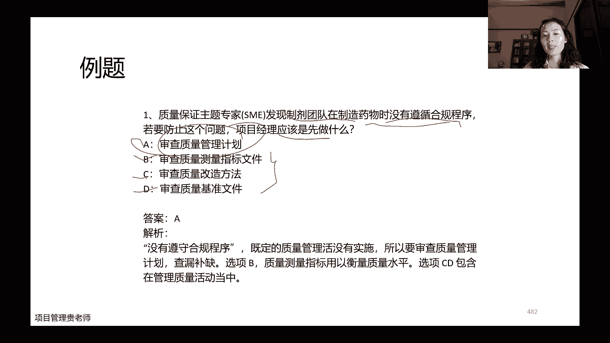

一般情况下我们先看一下管理计划，还是给我们的指南指导是什么，第二题呢，第二题是说嗯在项目的执行安装设备的时候，发现了反攻延期啊，这个超支的缺陷要避免这个问题啊，项目经理事情应该做什么呢。

a是说招募一个质量经理，制定更多的质量管理计划，你制定更多的指南管理计划啊，光制定计划没有什么用，对不对，而且你是安装的时候，你才发现了大量这个反光啊，项目延期啊，或者是预算超支的这个缺陷啊。

那你质量管理计划里面到底是啊做什么呢，很有可能是我们质量管理的这个过程没有做好，而不一定是我们质量管理计划做的不到位，对不对，所以呢啊就是a呢，它只是从五从可能的一种原因啊。

提出来一种可能的这个解决方式，b呢是说反复更新啊，并重新确定进度和预算的举证，然后以反映修订的范围，为什么它相当于是b的意思，相当于是我默认了，对不对，我就接受你反攻延期和超值的这个缺陷。

然后呢我我调一调我的进度和预算的基础啊，对不对，他这个这个处理方法太消极了，c呢是说确保在合同谈判期间啊，规定有供应商质保条款，题目当中他并没有说这个跟供应商有什么关系，对不对。

并不是说你这个啊安装设备的，这个是由这个设备，是由供应商来给你做的这个动作，所以c呢啊是完完全跟题干没有关系啊，d呢是说制定电器的审查和审查计划，以确保项目的这个规范啊。

d呢是啊很有可能的一种这个解决的方式哈，因为我们说了审查啊，这是我们定期的去审计，去审查，是比较良好的一种质量管理的这个动作，和质量管理的工具，那你现在既然发现了这么多的问题啊，这么多的质量问题返工啊。

也气啊那些，那如果说你最开始的时候，你在过程当中，你就不断的定期去审查，那么很有可能你这些问题就能够及早发现，及早发现能干什么呢，及早的发现。

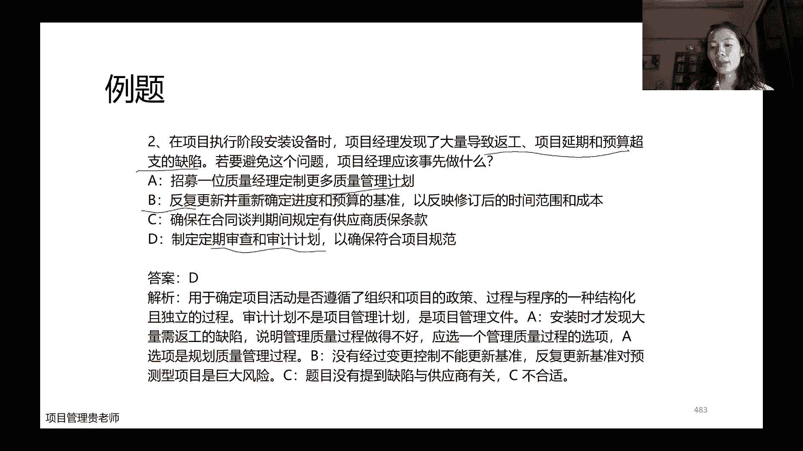

当时我当然是为了及早的去预防，及早的去纠正啊，第三题，第三题呢是说为了降低项目的质量成本，并增加验收成本的几率，需要进行质量审计，质量审计需要什么呢，好质量审计需要什么质量审计啊。

第一质量管理计划需要吗，需要对不对，我们说了指南管理计划是你的工作的指南，指南当然需要了质量测量指标啊，有质量测量指标我才知道审计什么呀，我才知道审计出来诶，这个他是这个合格率要达到80%。

质量测量指标是85%诶，审计出来发现不合格啊，不达标，那应该怎么办，对不对，所以a是对的哈啊b呢过程分析，过程分析呢它跟质量分析，质量审计师一样都是一个工具啊，它是另外一个独立的工具。

c呢是说质量管理计划和质量核对单啊，质量管理计划是用得到的，然后但是呢质量核对单这个时候用不上，用不上质量核对单啊，过程决策分过程决策程序图，过程决策程序图，它也有可能是我们过程分析。

最后出来的一个结果哈，嗯第二个领域呢，我们在工作绩效域里边，是要注重团队的沟通和参与，前面讲的要好好的这个去管理质量，那么现在我们要将要引导团队沟通和参与哈，呃首先团队的沟通和参与，团队从哪里来呢。

我们前面规划讲过啊，如何去规划团项目的这个资源，对不对啊，还记不记得如何去规划资源，那包括了食物，包括人和这写的太难看了，包括人和食物，对不对啊，这从哪来，怎么用怎么管，然后最后怎么到哪儿去。

怎么遣散好，进入到过程当中呢，我们首先啊这个要获取，对不对，你既然规划了我这个项目需要啊，这个20个资源，二是个什么，具有什么能力，什么经验的资源啊，那现在我这些人从哪来呢啊都从项目当中来。

都从公司当中来，还是说从职能部门借几个，还是说有需要一两个从啊，这个啊需要hr去从外面招，还是说我需要这个有一些这个外包的这个团队，都ok哈，获取团队的资源是根据我们的资源管理计划啊。

是根据前面的这个分配的资源管理计划去做的，所以怎么去获取呢啊进行有效谈判，并啊影响那些能够为项目提供所需要，团队和施工资源的人员啊，这个一般情况什么情况用谈判呢。

啊比如说你去这个hr给你提供了三个候选人，这三个候选人啊综合来说都还可以，但是你去跟他谈的时候，他们的药价都比较高，没有30万下不来，那怎么办呢，哼那怎么办呢，跟他谈判呗，或者另外一种情况。

你需要从职能不能去薅两个人过来，但是呢职能部门说他的经验告诉你啊，这两个人很重要，这两个人这个阶段有其他的活要干啊，拍给你的项目之后，那我的部门的这些任务，部门的这些工作怎么办呢。

部门的绩效怎么谁来给我兜底啊，是不是，所以这个时候啊有效的谈判，然后呢能够去说动他们，第二呢不能获得项目所需要的资源的时候，哎可能会影响到项目的进度，预算或者是扣的满意度，质量和风险，这个显然是的。

对不对，第三点呢无法获得所需的团队资源的时候，在不违反法律法规或者这些前提下，可以使用替代资源，这个是我们在做获取团队资源的时候啊，一个是我们具体用的这个工具啊，一个是我们要知道他的后果啊。

另外一个我们要知道他可能的这个解决方案啊，实在不行。

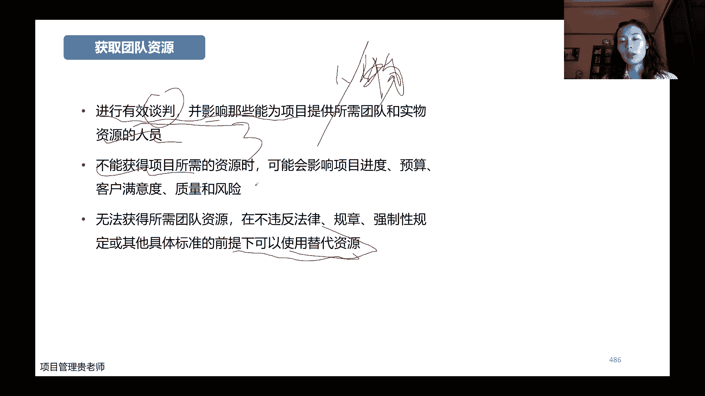

实在不行，找替代的获取资源呢，它的子过程是这样的一个输入和输出哈，还有工具他的书，他的这个输入呢，当然资源管理计划和采购管理计划，都非常的重要啊，还有我们的成本基准也是要参考的啊。

成本基准里面因为人嘛资源嘛要花钱，所以成本就是要参考，然后呢，资源的需求和资源的日历都是比较核心的，这个过程的这个输入工具呢，多标准决策分析啊，比如说我们前面讲到的，你要先招几个人啊。

这这几个人呢有的他的这个毕业的院校很好啊，有的人他项目经验很丰富啊，有的呢他技术很好啊，有的呢他的沟通技巧很强啊，所以呢你到底是留哪一个呢啊怎么去安排啊，多标准决策分析要用，同时呢人际关系和团队技能啊。

怎么样去谈判啊，说的跟这个就看你画饼的能力强不强啊，给人家画一张大饼吧，人家好进来给你干活，然后有一些预分派，预分派呢一般情况下是指这个章程里面啊，就是最开始或者是章程。

或者其他的这个计划里面列明的说这个项目啊，这个重点又是谁来负责，又是谁来参与啊，啊当然它只是一般预分配嘛，他只会有一些这个核心的啊，或者说必不可少的这些资源在里面啊，是不是团队所有的资源还不一定。

所以御风派他只是分配过来的一部分人员啊，同时虚拟团队这也是我们在获取资源的时候啊，要可能采取的一种工具或者技术说出来的呢，就是我们的这个资源日历啊，核心的资源日历包括了团队的这个派工单啊。

这些日历等上面的样子，这些日历好像这些日历应该只是给大家讲过，他是干什么的，但是没有给大家具体的展示，自然日历长什么样子哈，今天这节课给大家展示一下，自学日历长什么样子，那派工单是什么意思呢。

啊派工单是你要安排给别人派活的时候，那你要出一个具体的单子啊，比如说这个啊这个现在任命谁谁谁啊，为某一个项目的啊，这个什么这个助理助理项目经理好吧，或者说什么什么样的这个工程师。

负责什么什么的这个任务啊，把这个任命的这个文件我们叫做派工单发给他，以免他在项目配合项目实施的过程当中啊，不予配合，或者找各种理由去推脱，当然如果说有实物的话，它还有一些这个啊。

这个食物的物质资源怎么去分配啊，电脑来了之后，电脑怎么去分配啊，这个上节课讲过一个这个立体是说3d打印啊，需要有多个任务同时执行，那么我这台打印机啊，我不同的任务按照什么样的这个顺序啊，去使用啊。

每一个任务他在使用的过程当中，有没有特定的一些时尚的一些限制。

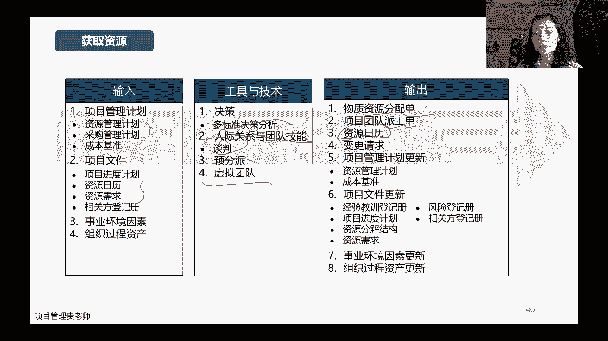

所以呢重点输出是这些啊，资源日历啊，前面说这节课要给大家展示的哈，比如说我们从星期一到星期天，就是展示一个星期的啊，具体上面有日历，那么这个星期里面哪几天是假期啊，哪几天是我们啊为了放这个调休的假。

我们要去这个调休的啊，什么时候端午节，然后呢这些不能工作的日期啊，包括其实星期六星期这些啊不能工作的，我现在都擦掉啊，先都擦掉，前假日我也都擦掉啊，这个这个场景啊，厂里搞活动啊，好或者这还有个什么节日。

这些都是不能用的，那么剩下可以用的只是我这些啊，标难的这一部分啊，他可以用，那么可以用呢，哎比如说我找每个人的时候，哎我去我去找一个a啊，我跟这个a说啊，你这个这些蓝色的框框里面啊。

你有哪几天是可以用的啊，这个他说我星期一到星期二，星期这个这个星期四星期五不行，星期一到星期三啊，我都是ok的啊，然后呢我就把这列出来啊，这个小a这边都是ok的，然后我再去问小b，小编说呢啊。

我随时主要是没有什么特殊的安排啊，星期六星期天啊，不要我加班，其他时间都ok，那ok那b所在的资源我都可以标注啊，b所有的这个蓝色的部分它都可以用，然后还有呢比如说c啊，c呢它是一个这个呃。

这个呃比如说他是一个海外的，海外的呢，他有可能他就没有端午节啊，他也不参加什么场庆，那对于这个c来说呢，这他也可以工作，这它也可以工作。

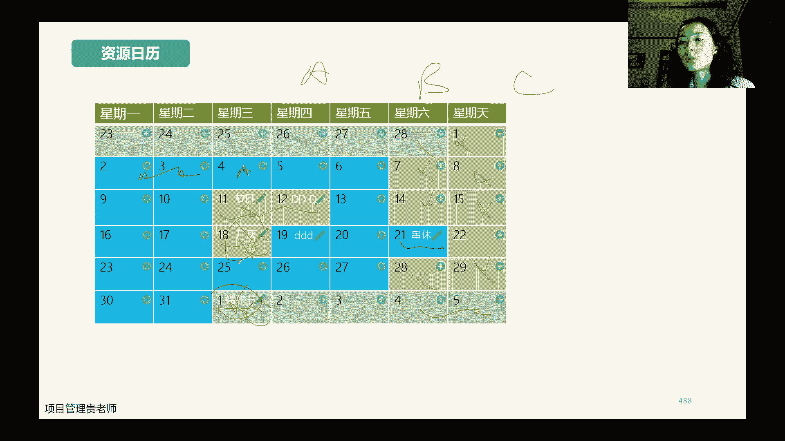

对不对，好资源选择标准，资源选择标准呢，就是适用于我们有这样的一个标准之后啊，我们就后面就可以做多标准决策分析了，多标准决策分析嘛，你首先要把标准定起来，所以呢啊定标准，首先这个资源是不是可用的。

我发现一个项目当中它很好，这个人经验也很好，能力也很强啊，这个沟通能力啊，两良好协作能力啊都很好，但是呢这两个星期排不出时间啊，它不可用怎么办，所以要考虑资源的可用性，要考虑用这个资源啊。

啊要花不花钱或者花多少钱啊，招一个刚毕业的这个几千块钱啊，但是呢他的能力经验知识技能都不足，那你愿不愿意去啊，省这个成本嗯，然后去培养他，并且呢去接受他，有可能啊会效率比较低的这个风险。

当然你也可以花很高的钱，直接去请外面一个工作啊，这个啊经验啊十多年了啊，这个在这个行业里面，非常资深的这样的一个专家，我都ok啊，能力啊，经验知识技能啊，这四个核心的就是个人的这种计量方面的。

也是一个核心的一个因素，然后呢啊他对这个项目的整个这个态度啊，或者说他工作的态度怎么样啊，还有一些这个国际性的因素，这些都是我们资源选择啊要考虑的一些标准，然后虚拟团队呢。

虚拟团队前面虽然说一直在跟大家说哈，这是正式的跟大家讲一讲虚拟团队，虚拟团队他指的是我们有共同目标啊，在完成这个角色任务的过程当中呢，啊，就没有时间，或者几乎很少有时间去面对面一块工作啊。

这个呢我们就可以把它理解为，它是一种虚拟的团队，比如说我们啊地处不同位置的员工之间，需要组建团队啊，什么意思呢，比如说啊这个啊这有居家办公，我正准备准，我正准备举那个疫情期间，居家办公的这个例子哈。

啊疫情期间大家很多这个啊公司被封了，或者说公司直接这个倡导大家居家办公了，那大家没有办法面对面啊，居家办公的时候，这种就是属于一个训练团队，然后呢啊为增加团队的特殊技能啊。

即使相应的专家不在同一个地区的领域，那有一些这个特定的一些任务啊，比如说你们公司买了一台啊，从德国买了一台新的设备啊，这个设备呢德国那边的这个老专家啊，老工程师，他要负责帮你们去进行后续的这种维护啊。

啊和一些这个呃使用的指导，那他没有办法，因为每次你有问题，它就飞过来，对不对，成本也很高，所以怎么办呢，唉有可能打个视频啊，哎这种时候呢也需要他的一些专业的一些意见。

那么这个专家他也是我们的训练团队成员，或者是工作班次啊，工作小时或者工作日不在不同的这些员工啊，比如说一个工厂，他经常有几波不同的工人需要搞班啊，但是呢他们共同都是围绕着一个啊，这个要生产这一个部件啊。

共同去努力的这样一波团队，他也是虚拟团队啊，有一些行动不便或者残疾人，还有呢啊有一些他出差非的差旅费过高，这种也可能是我们虚拟的团队，比如说刚刚举的这个专家哈，他在德国，他每次飞过来啊。

国际机票那都很贵，他会自己报销吗，他们公司会报销吗，他肯定不会，即使他公司给自己报销，那么整个公司的这个维修费用，对不对，也是咱们公司在承担，还有呢就是说公司啊，比如说在在北京，在国贸房子太高了。

怎么办，大家好像又没必要完全在一块办公，那就安排一些人啊到自己家里面去，或者说安排一波人不要在北京了，你就跑到跑到河北去搞一个办公室，那也行，对不对，节省开支嘛，这也可以是成为我们虚拟团队的。

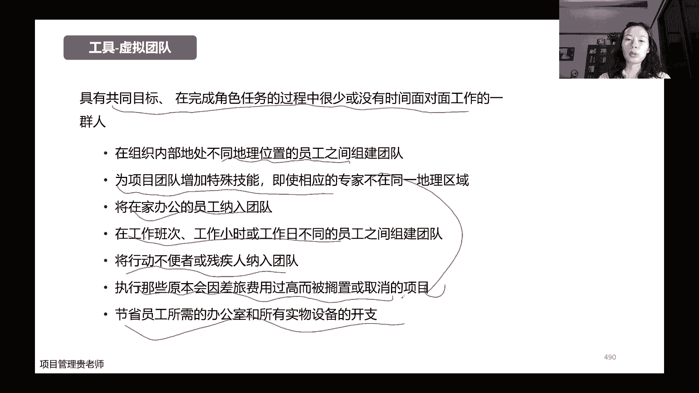

这个执行的方式之一哈，好谈判谈判，谈判呢就是谈判他也是跟沟通有关哈，这个所有跟沟通呢，其实理论上面的知识呢啊，其实你讲的就那么些啊，也不是特别的这个复杂，特别的难理解。

它重点呢就是在实践的过程当中沟通啊，谈判啊都是只是我们在谈判的时候呢，啊，要秉持着尽可能是一个双赢的，这样的一个思维在里边啊，这里面有几个核心的一些点哈，首先我们在谈判的时候呢，哎参与的各方面都很成熟。

这是一个假设的一个前提哈，你不要就觉得唉，比如说你比如说这个大家在跟这个小孩儿啊，家里如果有小朋友的话，去跟小朋友教育孩子的时候啊，你跟他去讨价还价啊，你跟他去这个这个去去讲一些道理的时候。

你就会发现诶有的小孩他可能比较犟一些啊，你跟他你让他别这样干，别碰这个东西，他非要碰碰一碰，他还看一下你的表情，碰一碰，他还看一下你的表情，他也在试探你的底线，对不对，虽然他也很想。

但是呢他也在试探你的底线，那这个时候呢我们要跟这个小孩呢，尽可能去把它当做一个比较成熟的人啊，当做跟我们一样在思考的这样的人，去跟他去引导，效果肯定是最好的，那同样的我们在跟项目方啊，在项目的过程当中。

跟我们的团队之间去沟通的时候啊，也要去这个展现出来，对对方充分的一个尊重，不要觉得对方是什么都不懂啊，觉得你就是这个行业里面的权威啊，你说的就一定是对的，别人说的就一定是错的，不要有这种啊。

没有这种这个思想啊，即使有这种思想，也一定最开始的时候不要把它表现出来，不然的话一开始啊这个可能谈判气氛就不太对，尤其现在大家都很年轻哈，接触的将来接触的这个啊，管理的这个成员。

被管理的成员可能都是一些零零后啊，他们的个性都很强啊，你这个时候很有可能人家就不按你的套路出牌，然后第二点呢是信任啊，想办法先取得信任，卸任之后你说的话他才有可能听进去啊，你跟他说啊，来我这吧。

我们这啊这个啊一周工作就五天，哎呀中国从来不加班啊，工资又很高，当然工资高不高，那是有实际的数据啊，啊其他的这种各种待遇又好，又有项目奖金啊，年底的年终也有很多，大家都很都很nice，都很和善。

你跟他说了很多，他信吗啊，他你说的说的过程，当中唉突然发现发现他发现你在说的过程当中，你的你旁边坐了一个人在记录啊，你的助理话都不敢吭一声，他能相信你们的团队氛围很好吗，他也不太能相信的，对不对。

所以啊要想办法先取得信任嗯，然后呢，还要去共同的去这个识别关键的一些问题，和一些顾虑啊，你去跟他谈判的时候，他不来啊，宁宁娜说了很多很多啊，他也很相信你了，但他就是不来，为什么呢，为什么呢。

你去你去你去跟大家去聊一聊啊，或者是你通过你的一些经验，你去判断他的核心的这个问题，他的顾虑到底是什么啊，它不是仙女这儿的文化不好，他也不是不信任你啊，他也不是觉得工资啊，这个不到位。

他是比如说跟上一家公司签了竞业协议，时间还没到，他来不了，所以都是有可能的哈，那么双赢的思维啊，是你要站在别人的这个角度上面，因为你既然是谈判，想让他来，那么肯定尽可能的是这个想让他来，这个是你赢啊。

尽可能低成本的想让他来啊，这是追求好的效果，那对于他的这个对于这个来的这个人啊，站在他的角度上面来讲，那么他来了之后，它有什么样的这个收获啊，他有什么样的，这个咱们说白人他有什么样的好处。

他能规避什么样的一些问题啊，你站在他的问题上面去啊，描述他所想要的承诺，他所想要的，并且去规避他所不想要的啊，达到一个双赢的状态，当然是最好的，当然实际过程当中呢很有可能哈。

这个多半是一些赢输或者输赢的状态，比如说他要8000，你说我们公司预算就7000，砍了半天啊，终于啊7000块钱，人家想了想，还是来入职吧啊这个你觉得很好啊，你觉得你终于7000块钱把人给搞定了啊。

你觉得你赢了，他输了，短期来看呢可能确实是这样的一种状态，但是呢啊这个后面他7000跟他想要8000，产出来的这个效果啊，到底是不是一样的，这个就很难说，那那那实在不好，就是双输了，你把人也得罪了。

人也不来了，啊这有个原则的这个谈判法哈，这个是教大家实际的过程当中的，首先啊对事不对人，说任何问题，说任何这个事情的时候，嗯说问题就是问题，不要是啊这个上升到人身攻击。

上升到人的一些这个特点上面不是很好哈，重点放在利益上，而不是立场，这个是大家比较容易忽略的哈，因为一般呢啊这个刚刚刚参加工作，没有多长时间的时候，450啊，嗯这个老板比较信任，然后呢让你做项目经理啊。

啊那你去管理项目团队的时候，一般你都是非常相对而言，相对那些老油条而言，你是非常维护公司的利益的，那么你在谈判的时候，你的立场啊，肯定就是站在我充分维护公司的这个角度啊，维护公司的利益的这个角度。

那么你既然是公司，我们说了啊，公司它本身它跟这个员工之间，他跟项目的团队成员之间，它是有一定的冲突的，对不对，公司肯定需要员工尽可能拿少的钱，尽可能干多的活儿，那员工呢肯定是希望公司。

尽可能给他们发多的奖金，多的工资啊，尽可能在时间上面能够优待他们，所以他既然有这样天然的冲突啊，那么你作为一个新兴的项目经理啊，你是这个啊拼命的让大家干活，拼命的让大家吧，因为我这是为了公司着想啊。

是这样呢，还是说这个适当的站在员工的这个角度，然后去追求大家共赢，可持续发展的一种状态，那为了可持续发展，那肯定还是你要在公司和员工之间，找取一个平衡点去协调，对不对。

所以啊重点是放在怎么样让大家的利益最大化，长期最大化，而不是说哎我现在的立场，我既然作为管理者，我站的立场就是公司，在决定做职之前呢，先构思各种可能有的选择啊，这个也是我们在谈判的时候啊。

高手肯定会这样做，因为高手呢他啊一想一想，他就知道可能会有哪几种嗯，可能产生的一些现象，或者可能有的一些这个原因，唉，如果说啊不同的这个决策，或者不同的这个答案出来了，那么他怎么去回复啊。

他下一步的这个策略是什么，他肯定会想，那对于啊咱们这个啊这个项目经理的小伙伴一，样，遇到这么多的啊这个干系人啊，或者团队成员都好，那比如说啊再去跟相关方去沟通的时候啊。

他提了一个一个比较困难的一些想法啊，或者说呢他呃工作的要求比较苛刻，经常半夜的12点了，然后给你们团队的成员去发一些消息，让你做一些什么样的需求的去这个改进，那你呢决定好好跟他去谈判一下。

因为你为了维护你的这个员工，那同时呢又不得罪你的这个客户干系人，那你在去之前呢，你也构思了几种可能的选择，那第一呢先好好阐述一下问题啊，然后呢看看有没有什么更好的解决方案啊，然后呢第一种可能呢。

可能这个客户这压根就不听你说啊，就觉得你们是在推诿啊，那你怎么办啊，你这个时候应该采取什么措施啊，第二种可能呢啊这个这个干系人呢，他想了想好像也确实是啊，他们自己工作的文化是到12点。

但是呢哎咱们公司的文化就是这样，他他十点大家都关电脑了，再也不加班了，那是不是有这样文化的冲突，那确实应该多理解一下，那你这个时候应该怎么去沟通，然后先预判一下，坚持最后结果根据某些啊。

要根据某些科目的标准啊，这个也是看看，如果说你在一定的原则上面一定要坚持啊，坚持那个观点一点也不松口，那就要看看有没有一些客观的标准啊，比如说这个通常咱们啊比如说谈判啊。

这个买个东西跟人家讨价还价的过程当中，你心里的预算就是十块钱啊，或者说你手里只有十块钱啊，那你你不管跟别人怎么去谈，别人要价11呀，哎呀摆了一堆理由啊，人家进货价呀，成本价呀啊各种房租啊。

这是什么什么什么i人家上有老下有小啊，软硬的客观的人家都给你来了，说人家就要11块钱，但是你也要看看你手头上的这个预算够不够，你只有十块钱，那也没办法，对不对，好玉芬派，玉芬派呢。

就是说我们事先确定的他的这个团队的资源啊，或者是有一些这个食物啊，也是在我们的玉芬派里面，还会用这样的一个工具啊，他比如说这个竞标过程当中哎，承诺分派什么意思呢，比如说我发了一个招标文件。

有三个供应商响应啊，其中有一个供应商呢他已经承诺了，说好到时候这个项目开始之后，然后如果说我们中标的话啊，我们是派十个团队成员长期驻扎啊，或者在项目期间，是长期驻扎在你们这个项目的现场啊。

无条件去配合啊，对不对，那你听到肯定很高兴，所以说承诺分派的啊，这个是啊会出现一些预分派，然后呢，嗯项目呢，它有一些这个特定人员的一些专业需求啊，专业技能的要求啊，这个公司。

整个公司或者甚至整个行业就那么几个人有啊，那这个没办法，也只能找他啊，或者是我们前面讲过的项目章程当中，指定的那些人，使团队保持专注呢是说我们项目经理要平衡啊，要评估平衡团队的专注力和注意力。

首先是评估。