# PMP考试培训课程最新完整版项目管理认证第七版教材新版考纲自学教程 - P14：14.测量绩效域 - PMP专家 - BV1rM4y1Y79x

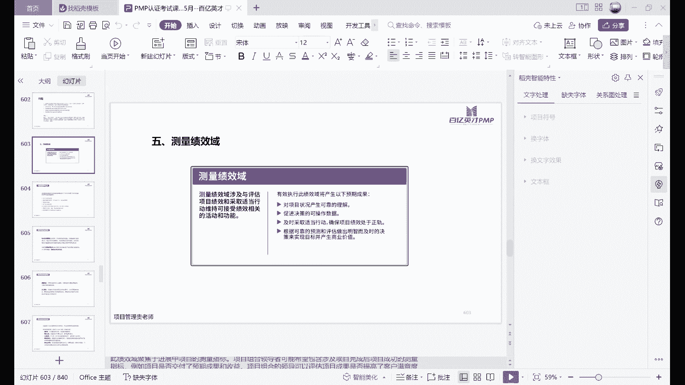

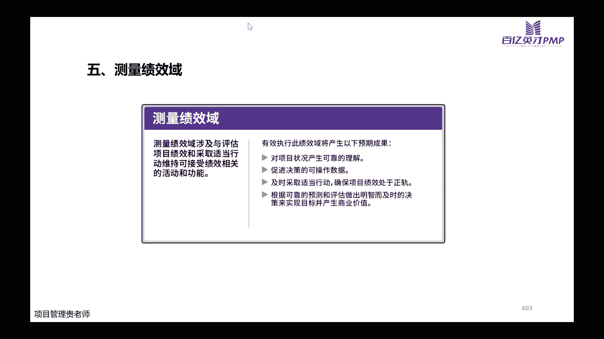

光头姐晚上好呀，我看到有轩已经在敲幺幺了，意思就是能正常看到屏幕，听到声音是吗，嗯说明你已经很了解我的习惯了哈，嗯现在直播间的人不是很多，现在才只有四个人进来，我们稍微等几分钟吧，我在哪，东西。

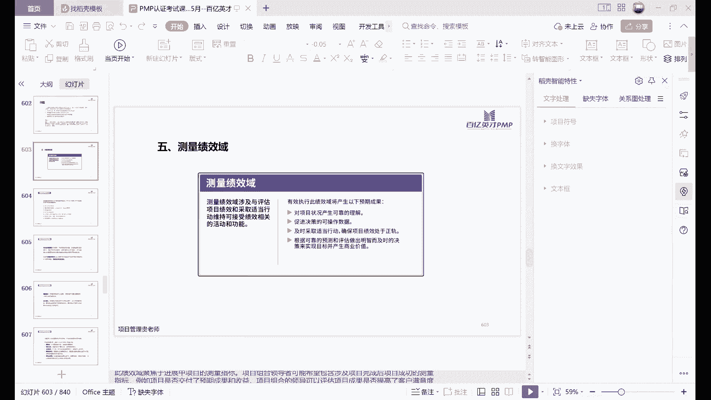

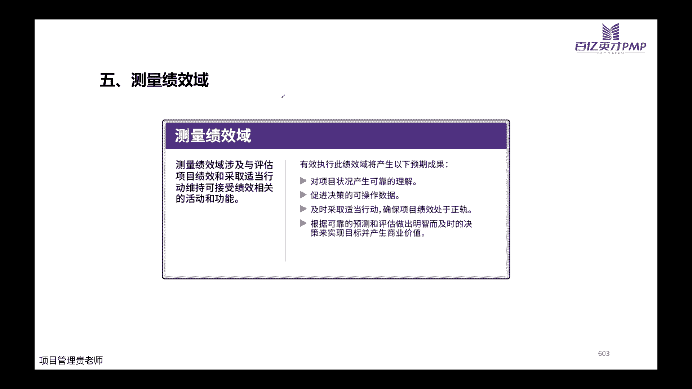

好我们嗯边回顾一下上一个纪晓岚的内容，然后呃边等其他的学员哈，回顾完了，我们就正常上课，嗯上一节课呢我们讲的是交付的绩效运行。

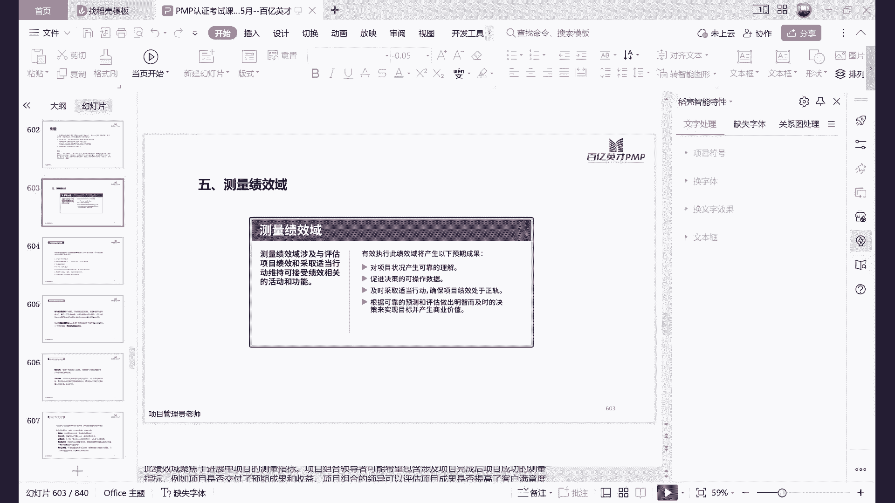

交付计教育大家可以回顾一下，我们重点讲的是什么内容，讲的是价值交付啊，价值的衡量对不对，然后讲价值的衡量的时候，我们讲了有三个维度，第一个呢是教是关注于对象啊，不同的对象对价值的衡量是不一样的。

然后第二个呢是关注我们价值交付的，有效的时间段，因为不同的时间段，它的价值反映出来的维度是不一样的，对不对，同时呢我们还要尽可能的去量化它的价值，同时呢哎讲完了价值的交付，我们还讲的确认范围。

和控制质量，最后呢又讲了，在交付可交付成果之后，那我们怎么更新组织过程资产，大家回顾一下我们上节课讲的重点内容，是不是这些啊，那么本次课呢我们要讲测量的绩效率哈。

其实从整个项目的执行的这个周期来讲的话啊，我们讲从最开始的前面的这个启动之后嗯，要做章丑，要选择开发方法，然后呢规划绩效率又讲了他的范围，需求质量啊，成本进度，还有这个相关方啊。

沟通怎么去规划后面那个讲了工作的绩效语啊，就是我们怎么沿着我们的规划，把这些关注于执行过程当中的一些问题啊，一些变更啊，后面能讲到交付，交付呢就是上面回顾的这些内容哈，那么从项目的生命周期来说呢。

每一个阶段我们就讲到了，那测量是什么东西呢，测量是在整个项目的生命周期啊，整个过程当中要加入的这些环节和这些动作，包括我们这次课讲完测量之后，下节课要跟大家讲不确定性的技巧运。

好下节课要跟大家讲的不确定性的绩效语，和这节课要讲的测量技效率，都是围绕着项目生命周期啊，他是跟我们的要启动规划和这个工作交付，是在不同的维度上面哈，所以这个便于大家对不同的绩效预期理解。

那我们测量绩效益呢，它主要是评估项目的绩效啊，跟我们所采取的这种行动是不是直接相关的，那如果说我们的绩效测量出来，A是行动是一致的，那么代表我们技巧可能会比较好，那如果说行动跟我们前面做的这些规划。

和这个工作当中啊，约定的这些度量指标，如果说不太一致的话，那我们可能项目的绩效啊不是特别理想哈，所以他重点关注的一些预期的成果，首先对项目整体的状况啊，整体的进展，不管是他的范围的理解，需求的理解。

还是说它的进度和成本的，或者是资源的这种合理的利用控制啊，是不是嗯在我们预定的范围之内啊，在我们可控的框架之内，同时呢在这个过程当中，我们通过测量啊，通过去监控整个项目的阶段呢。

能够得出来一些便于我们去做一些决策，比如说有一些变更，我们是批准还是不批准啊，整个这个项目它的价值点啊，我是做不做漂移，我们上节课不是讲的完成了目标的偏移漂移吗，那么它的成果啊，漂移还是不漂移。

怎么做这些决策，我们可以通过测量出来的数据去做一些评估，同时的话如果在这个过程当中啊，如果我们评估出来它的进度有一些超支啊，评估出来他的这个啊进度是延迟哈，成本呢有一些超支诶，那这个时候呢。

我们怎么样采取一些合适的一些行动，能够呢把我们的这些绩效再把它掰回来，让它处于我们的项目的正轨之上，所做的上面这些呢啊，都是围绕我们更好地实现我们项目的目标，实现我们最初做这个项目之前。

所约定的这些商业的价值啊，所以测量重不重要了，测量当然很重要，为什么呢，因为你不测量，你就不知道我们这个项目它的各方面的啊，不管是啊这个先卖个关子，不管是哪一些方面，哪些方面呢，一会儿会跟大家讲到啊。

不管这些哪些方面，如果我们不测量，我们就无法判断它到底是不是，在我们预定的轨道上面。

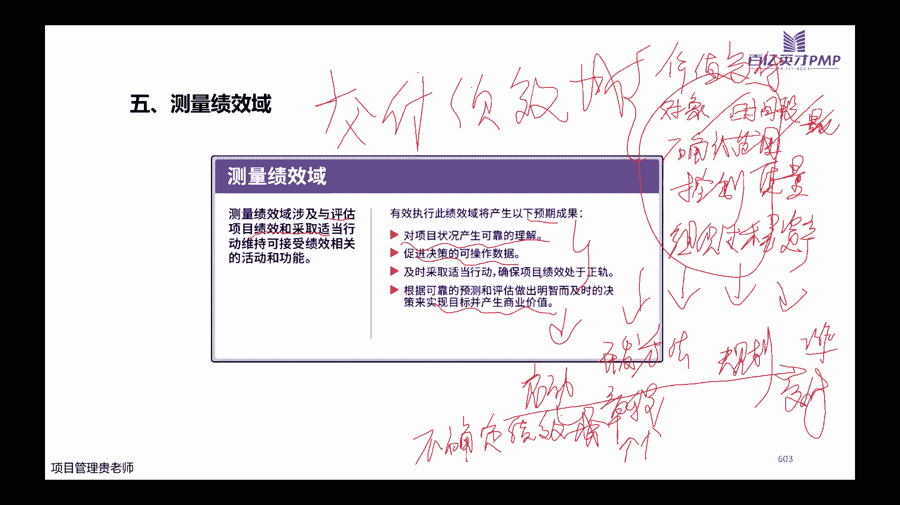

好关注哪些东西哈，首先第一个要跟计划对比来评估绩效啊，什么意思啊，因为我们尤其是啊尤其是预测啊，其实包括适应也是一样的，适应虽然说范围是没有啊，是最开始的时候没有明确，但是适应型的。

它的整个这个时间的周期和成本啊，整个预算其实是有一个框定的，一个这个啊范围之类的，那预测型的项目呢是更重要的是范围非常明确，那既然说有明确的一些内容，那我们要做一些相应的一些规划，那做了规划之后。

我是不是就把规划放在一边呢，也不是的哈，为什么呢，因为我们做完规划之后，我们在执行的过程当中，会因为各种各样的一些啊干扰啊，各种各样的一些变化，各种各样的一些啊这个不可控的一些因素。

会导致我们实际执行的轨道，会和我们规划的这些轨道有一定的偏差，有一定的偏离，那这个时候呢那我们要去对比计划，评估绩效，同时第二点呢呃我们说了，讲前面讲资源的时候跟大家提到过哈，就是不管是说我们人的资源。

还是说我们食物的资源啊，我们都要避免资源浪费，我们要最大化的利用，合理的利用资源，对不对，那OK我在评估的时候啊，我我如果说在资源的这个角度，这个领域我约定了一些测量的一些呃量啊。

一些可以量化的一些指标，那么我可以去评判在这个项目当中，我资源它的利用率高不高啊，闲置浪费多不多啊，前面我们不是讲过实物资源的时候，当时群里还有学员在问那个题目吗，要尽量的减少我们材料的等待的时间。

对不对啊，要尽量的这个尽量的最大化的啊，每一个这个资源的一些搬运和一些这个存储的，这些浪费要尽量的话得去减少，对不对，所以资源的浪费情况也是我们需要去测量的啊，同时呢不同的团队成员啊，他领了任务。

通过责任分配举证，这个也是之前跟大家讲过，他他在责任分配矩阵里面呢，有自己要做的这些任务，那么我们通过测量团队的绩效，也可以去反映出来他的工作完成的情况怎么样，他的个人的工作的这个绩效怎么样哈啊。

再一个呢是测量绩效要干什么呢，啊，还有必要跟我们主要的一些相关方，去给他们做一些反馈啊，比如说通常要给A，比如说公司内部的一些领导啊，你要给他汇报一下项目的一些进展情况，对不对啊。

客户你也要定期的给他去汇报一下，整体项目的一些进度和遇到的一些困难，希望客户的一些支持，对不对，那既然这个进展进展进展是指什么呢，进展里面当然非常重要的一块，是要反映出来我们的绩效情况，对不对。

同时前面说了评估唉，我们的可交付成果是不是还在我们的正轨之上，而我们既然做了商业论证和效益管理计划，那么按照我们目前的这种节奏啊，这种打法，那么我们的效益管理计划，是能不能按照计划去推进。

能否去实现在这个过程当中啊，如果说我们通过绩效的一些测量啊，发现了一些风险或者一些问题，那我如何去评估这些风险，我是接受它还是规避它，或者好多东西，我是尽可能的去争取下，问题出现了之后呢。

哎我们如何通过我们的绩效的这个水平，找到一个比较好的解决方案，最后一点呢是可交付成果，当然要测测试一下，测量一下客户他是否验收，验收之后客户他的满意程度是如何得，既然说测量要关注这么多内容。

那么在关注测量的这个动作之前，我们首先要制定有效的测量的指标啊，什么是有效的测量指标呢，啊有效的测量指标它一定是能够被跟踪的啊，能够被评估的，能够被告报告的什么意思呢。

比如说啊这个时候你说咱们学这个项目管理哈，学这个PMP的考试，那么我们的这个测量指标，第一个指标呢是大家能够顺利的通过啊，顺利的pass能够拿到相应的一些证书，那这个就是一个非常明确的一些测量指标。

有些人还会讲啊，我除了考证之外，因为当时是有的学员凤凰涅槃，在群里面说的特别好啊，我除了考证之外，我还要通过这一门课的学习，我能够真正的去理解一些项目管理的一些思维，并且能够把这些思维。

应用在我们实际的工作当中，那OK我想测量这一方面的价值哈，那如果你没有对它有一些明显的啊，尽可能的一些量化的一些程度，那么你的这个测量指标相当于是没有啊，如果说没有，你就没有办法去跟踪啊。

如果你想避免这种情况，可以怎么做呢，哎我想通过学了这一门课程，那到今年的时候，我是一个项目经理的助理啊，我希望到明年的时候，我可以独自去承担项目管理的工作，我成为一个啊这个优秀先谈不上。

我成为一个合格的项目经理，这是我给自己定了一年的这样的一个目标，那OK啊，一年之内成为合格的项目经理，拿到独自负责项目的这样的一个动作，那么这是作为你的测量指标，你只要在这一年之内。

你去跟踪跟踪你的这个这个目标啊，是不是能够达到啊，比如说你半年过后，你发现自己在项目管理上面还有一点点长进，都没有，那你有没有采取一些措施，比如说呢啊跟公司内部比较有经验的，那些老前辈去学习啊。

你跟领导之间呢啊，能够有一些更多的一些争取啊，争取让领导能够认可你的价值，愿意给机会让你去提升，让你去尝试，那这些动作呢你就可以啊，评估一下自己有没有做到位啊，甚至呢目前在参与的这些项目当中。

你的本职的工作啊有没有做到位啊，你有没有在你本职工作之外去发现更好的一些，项目管理的一些具体的这种办法啊，团队配合，团队协作的这种具体的更好的一种沟通方式，有没有去主动去发掘。

这些其实都是我们在跟踪在评估，我们整个围绕着要掌握项目管理思维，这样的一个测量指标在做的动作哈，那公司里面常用的呢啊，就是常常会给大家做测量的时候，就是考核大家的这个KPI啊，KPI评估项目成功与否啊。

用它作为一个具体的测量指标，那么KPI呢啊是一个通用的，也比较这个相对来说比较好用的，一种简单粗暴的一种方式哈，KPI一般有两种类型，提前指标和滞后指标，提前指标什么意思呢。

提前指标就是说诶我在嗯一些潜在的一些问题，或者是一些风险发生之前啊，我先预测它是讲的是提前在问题之前，我预测项目的一些变动啊，和他将来发展的一些趋势，从而呢啊预测到了之后。

我做一些动作去尽可能的降低这方面的风险，这个是预测啊，这个是提前指标，那什么是滞后指标呢，滞后指标是啊这个事情它已经发生了，发生了之后呢，啊，我再总结一下这个世界这个项目或者这个阶段。

它的整体的绩效情况是如何的，所以它只能反映过去的绩效和情况啊，所以他这个就是滞后跟提前指标，它有一点点区别哈，一个呢是我在整个项目的这个阶段，我总结之前的这个绩效啊，我在事后我总结之前的这个叫做滞后啊。

一个呢是我在项目的过程当中啊，我通过现有的一些数据，我预测之后的它的一个主动一个趋势啊，这个叫提前的指标，既然是我们测量指标哈，这个最开始的时候跟大家讲讲过，我们目标smart原则啊。

大家都还记不记得当时跟大家讲过，目标的smart原则是相当嗯使用的相当有用的，为什么有些人定的目标，他可以围绕他的目标啊，锲而不舍的去追求去达到啊，有些人定的目标呢两天之后就变成一个口号啊。

或者两天之后就就没有什么心劲去做，一年之后，半年之后就完全是在纯看口号，并且呢这个口号是一而再再而三不断的被重复，所以呢当时是跟大家讲自己定目标的时候啊，对标一下smart原则啊。

看看自己的目标是不是一个合格的，不管是大目标还是小目标啊，都是一样的，那对于我们的测量指标来说呢，也是一样的哈，我们在约定它的动量指标的时候，测量指标的时候，也要满足他的这个smart原则的标准哈。

比如说啊首先我们定的这些测量的内容啊，比如说我要测量它的进度，测量目前这个进度如何，那我用什么指标呢，哎我可能有进度偏差啊，或者我有进度绩效啊，SSPI都OK，那么这些测量指标必须是具体的啊。

不能说要问哪天我就用，我就用提前几天吧，啊不能说我就用提前几天来约定，那提前几天很有可能是因为在这个过程当中，需求有变化，需求有减少，范围有减少，所以你才提前，对不对，那你这个测量进度它就不科学。

不标准，第二个呢是有益的，你的测量指标是应该跟我们的商业的商业论证，当中提到的价值啊，或者是我们的方位基准进度基准，成本基准，三大基准啊，或者是跟我们相关方提出来的，这些需求是有关联的。

这样测量才有意义，对不对啊，那举个例子哈，比如说嗯现在这个项目呢是啊，也是举大家常最喜最熟悉的软件开发项目吧，软件开发项目我们约定好了，会测量它的进度，会测量它的成本啊，会测量它的可交付物的可使用性啊。

这个都是非常重要的，非常核心的一些要测量的东西，那现在呢啊你作为一个项目经理，或者说呢嗯别人做一个项目经理，给你提的这种要求哈，让你去测量一下嗯，这个设备啊就是我们的in的设备哈，啊我们的电脑。

让你评估一下在这个过程当中，公司里提供的硬件啊好不好用，嗯那显然啊，这个指标，可能对于我们整个这个软件的这个项目来说，它就是一个不太有价值的啊，不太能够排在前边的这样的一个测量的内容，对不对。

所以我们测量的指标，肯定是跟我们项目的核心的价值啊，金融或者需求是跟它核心相关的，不然你做这个动作不是说不可以做，还可以做，但是呢做这个动作浪费资源，浪费时间精力，对不对，再一个呢是可实现的啊。

也就是说我们在做在特定的这些人员啊，特定的这种环境和组织的一些技术的框架之下，嗯我们定的这个测量的目标是可以实现的啊，比如说我现在定了我的这个SV啊，我的这个进度偏差他可能在十天以内啊。

或者我们说正十天吧啊约定的是这样，但是呢实际呢哎我们做的时候，它其实是没有办法在这个过程当中能够实现的，而我们做一个适应性的项目，那约定呢可能是三个月要把这个软件做出来，但在实际的过程当中呢。

因为发生了一些黑天鹅的事件，我别说三个月，我可能六个月都没有办法去完成啊，那很显然我这个目标，这个测量的指标它也实现不了，再一个呢具有相关性测量指标，它提供的信息呢应该跟我们的实际的这种价值。

一定是有关联的啊，跟前面这个是一样的，你的测量指标如何，跟我们核心的这个项目的价值都没有关联，那么你这个测量指标是没有什么意义的，最后一点呢是要具有及时性，什么意思呢，我们之前讲目标的时候。

是说哎这个目标要有期限，对不对，那么测量指标它也是一样的啊，要有及时性，那比如说哎，我现在在整个项目的执行过程当中啊，我要去测量一下我阶段性的这个啊，我比如说发布第一款的时候，发布啊。

第一次的时候我要去测量一下，用户对他的反馈是一样的，用户反馈之后呢，我需要得到他们的一些意见啊，已决定我下一次的这个第二款产品，或者说第二次的这个发布当中，我有哪些改进的啊，一些这个需求点啊。

一些功能点，对不对，但是如果说你在发布一做完之后啊，你说你也知道你要测量，但是呢你迟迟的不做这个动作啊，你知道你把发布二做完了啊，还是按照原先的计划做完了，甚至把发布三也做完了啊。

我说我再去测量一下发布一之后，这个用户的反馈是什么样吗，这样有意义吗，没有任何意义，对不对，因为你的二和三已经投入了人力，已经投入了物啊，已经投入了非常多的成本去做，所以呢我们在度量指标的时候。

在做测量的时候要有及时性哈，要有及时性。

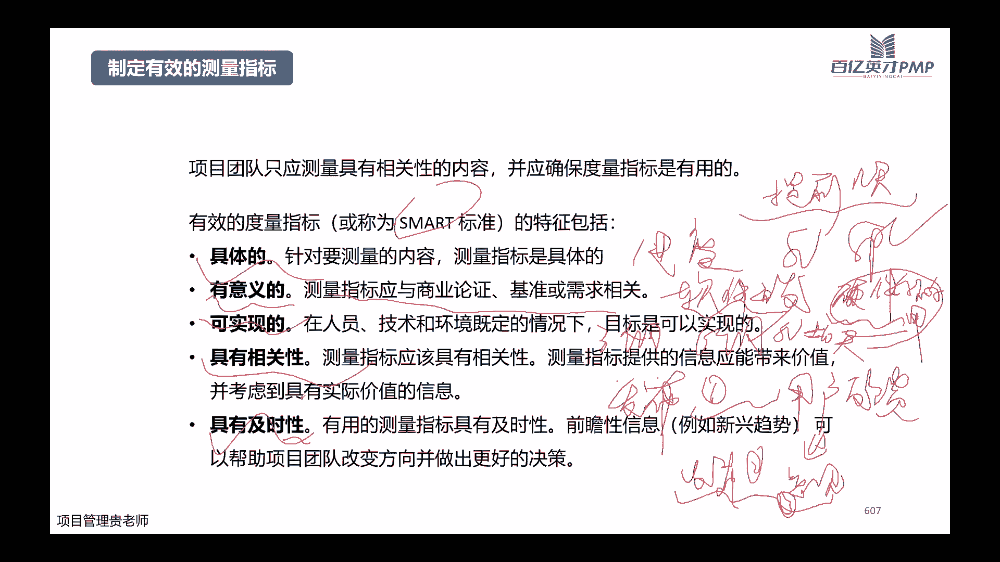

那具体测量的内容前面跟大家卖的一个关子哈，我们要测量哪些东西呢，啊说测量，首先啊常见的这种测量是一个是可交付成果啊，比如说可交付成果，它的，质量是不是合格的，啊。

范围是不是在我们的可接受的这种范围之内啊，这个也是交付的核心内容，它是不是满足我们交付的这样的约定的标准，同时呢基准基准什么意思啊，基准进范围进入，啊成本，啊基准是不是，基准它是不是合理的啊。

是不是他的技巧在我们的可控范围之内啊，同时还有资源人啊，我前面讲过哈，资源的利用率如何啊，是不是一个项目本身十个人可以坐下来啊，结果你找组织要了20个人啊，同样的时间要了20个人啊。

出现了大量的这种浪费，商业价值，商业价值里面一定要呃这个注意哈，因为上节课跟大家讲价值交付的时候，我们讲的第一个要关注的是对象啊，同一个项目做完了之后，领导更关心的。

公司更关心的可能是啊这个回款的问题啊，能不能给公司增加一些好的一些业绩啊，那对于这个客户来讲，是你交付的这个项目，对他们来说啊，功能有没有去实现，他们好不好用，用起来稳定性怎么样。

那对于公司内部的其他的这个部门来说，那么是啊，有没有对他们的实际工作有一些好的一些帮助，一些支撑，还有这个干系人，该县的满意度怎么去测量啊，同时呢我们根据测量结果怎么去预测啊。

这都是我们需要去测量的不同维度的啊，这些内容首先呢可教服务哈，可交付物呢一般常用的这种测量指标是啊，比如说有一些哪些是错的，哪些是有缺陷的啊，比如说我们做一批弓箭吧，做一批零件零件，大家好，理解一点。

做一批零件，那么零件呢我要去最后控制指南的时候，我要去评估它的合格性，对不对，那我们我们要做统计抽样，统计抽样还记得不，上次刚跟大家讲过，统计抽样里面又分了属性抽样和变量抽样。

那我要去做控制质量的这个动作，去看看这些零件它有没有缺陷，对不对，他如果说有缺陷，那缺陷的数量是如何啊，我用什么办法去解决这个缺陷，同时呢啊，有一些针对于可交付物的一些测量的指标。

比如说我这一批还是这一批零件哈，那么这一批零件它的尺寸是不是标准的啊，我定了，比如说一个螺丝钉啊，一个螺母，那么它们之间的耦合是否是啊，这个颜色和缝啊是不是没有任何偏差。

同时呢我这一批的这个螺母加上螺丝，他们的这个尺寸啊是不是一致的，重量是不是一致的啊，那如果说是一个容器类的，那么容器它的容量是不是按照我意见约定好的，是多少升，哎，是500L，500ml。

他就是500ml啊，多比如说多个510ml啊，他做的不标准，准确度行不行啊，可靠性啊，这个稳定性啊，印度啊，这些都是不是符合我们的质量当中，约定了这些测量的指标啊，它的效率能不能达到啊。

或者是一些其他的相关的，我们约定好的这些测量指标是不是OK的，同时呢，还有一个是可以去量化的技术的测量指标啊，那比如说我们这一批零件，对于螺丝和螺母来说啊，它一定是能够啊需在关键的这些核心的环节。

能够把这个螺丝钉去把它拧进去啊，能够确保整个他的这个部件的稳定性，这是说明他从技术上面，从功能上面达到了他的这个使命，对不对，达到了它的一些这个作用，那OK那我们从这个维度上面也要去判断一下哈。

他的技术质量技术的测量指标，这个是真理，可叫负哈，这些都是相对来说比较简单的，跟大家一讲，大家就明白了。

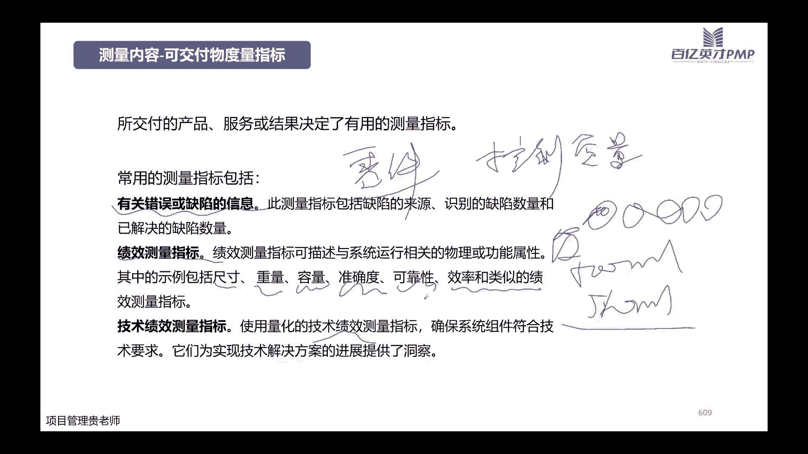

会有哪些内容，那对于交付来讲会有哪些东西呢，唉比如说第一个我们要测量整个在制品，在制品，它的意思呢他是说在一定的时间段内，正在做的所有的这些工作的嗯，总数这个是在制品哈，这个一般这个是在制品。

是在我们申遗项目，是我们适应性项目当中的啊一个专业词哈，因为适应性项目当中就敏捷项目，我们一般会用看板，看板只要做过敏捷的应该都知道哈，就是不同的这个啊需求阶段啊，设计阶段呀，开发阶段呀啊是测试阶段呀。

那么我不同的这些任务点，我都是在这个看板上面可以可以看得见的啊，那么在制品呢是说我在同一个时间段，我现在正在做的所有的这些工作内容啊，这是在制品，所以交付呢我们也要测量，第一个就是在制品啊。

在制品为什么要测量，是因为你同一个时期同一天啊，你做的在制品规划的太多，一定会出现一些效率和一些质量的一些问题啊，会存在比较大的一些风险，所以呢在我们生意行项目当中，我们讲究的，因为是可持续发展嘛啊。

我们不强求说在某一个这种时间段之内，你做的事情非常非常多啊，不是这样的，我们不强求这些，我们是觉得在一个时间段内，你做的数量如果说是正合适的，那么你的整体的效率才是最高的哈，第二点呢是它的这个提前期啊。

这个也是针对我们的适应力项目而言哈，我们在所有的这些事项，它要进入到代办事项列表当中啊，或者是说这个从代办事项列表，然后到进入到具体的这个spring的迭代当中啊，迭代做完了之后要发布啊。

那它到底实际消耗的这个时间量到底是多少啊，跟我们最开始评估的这些，通过故事点会评估它的啊，任务的大小对不对，那任务的大小可以用人贴任，任务可以用人贴哈，跟我们之前评估的它是不是有一些区别啊。

有没有一些误差，他们能提前去完成，同时呢还有周期的时间哈，你当然周期的时间，如果说提前期比较早，他跟提前期相关哈，如果你这个迭代啊，或者是整个这个发布，你在做的过程当中，你发现嗯。

其实你原先预估的这些任务的耗时量，都估多了啊，实际呢其实没有那么的复杂，那你在做的时候，你能够提前两天，那当然提前两周或者两天，那当然相应的你整个这个项目他完成这些任务，它所需要的周期也就相应的缩短。

还有呢这个队列的大小，主要是说哎跟踪我们所有事项的，他的这些数量啊，我有一个约定啊，比如说我约定了我的整个这个迭代的，进入到每一个迭代的用户故事，他的这些事项啊，必须是在几个故事点的这个范畴之内。

那同时呢还有啊批量的大小，批量的大小跟队内的大小呢，就是一个是高层次的事项，然后一个呢是具体就是估算之后的，它的这个故事点啊，以及呢跟我们故事点估算之后，要投入到相应的一些人力的这个量哈。

最后一个呢是过程的效率，过程的效率呢是我们在优化整个工作流程，在这个过程当中优化工作流程，你做了多少的动作，同时呢你这个流程的效率提升了多少啊。

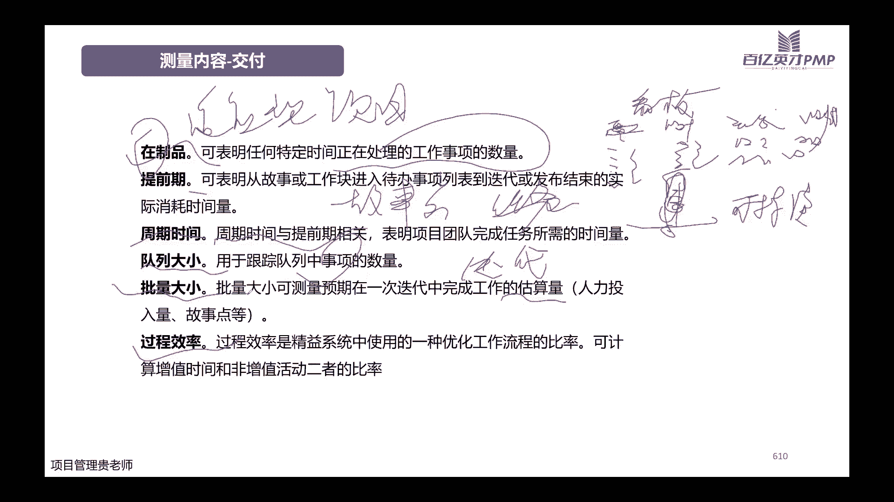

这个是我们在交付的过程当中，要体现出来的过程的效率，那对于资源而言啊，因为资源可能我们大家自己觉得嗯，这个没有什么，没有什么太大的重要性啊，因为我们老是想的做一个项目。

如果说公司能够给我们非常非常多的多的资源。

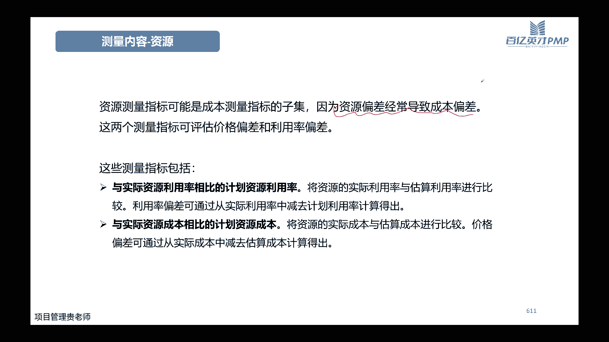

这个资源当然是多多益善啊，越越多越好，但是对于组织而言，他一定会非常在意成本啊，非常在意资源的使用啊，他给你投入十个人，跟他投入五个人，那涉及到的这个成本是完全不一样的，对不对，所以呢嗯测量资源。

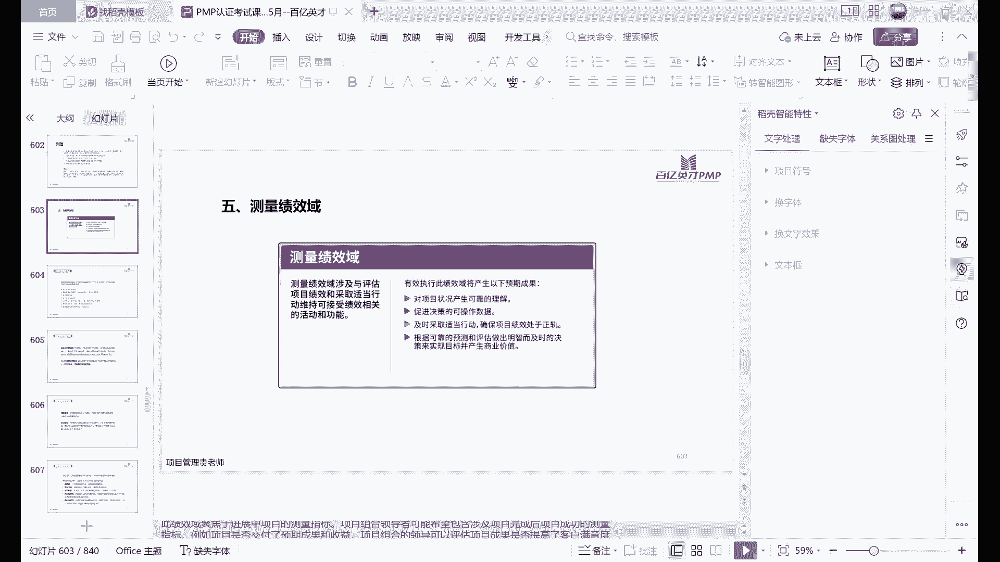

它是我们成本测量的一个子集，因为资源他就决定了我们的这个成本哈，所以在资源的时候呢，我们第一要看一下我们实际的资源利用率，跟相对比的资源利用率它的偏差大不大啊，偏差如果说大啊。

如果我们规划的这样的一个这个啊，这个用户故事啊，做一个网站登录的这个用户故事啊，我拆分出来啊，发现他有这个三个这个细节的事项啊，每个事项可能三个故事点，啊需要三个人做一周，啊这是我做迭代规划的时候啊。

讨论出来的，团队讨论出来的，但是呢我们在实际的进展过程当中呢，哎我们就发现这三个人呢他在配合的时候诶，它的效率非常非常高啊，所以呢手上的动作也非常的快，那么我们实际呢，这三个人他可能没有做到一周啊。

他可能四天他没他一周，我们这是五天哈，他可能不需要五天，他可能四天就已经做完了，那相当于是在这三个人，我们的资源利用率其实是相应的提高了，那同理的哎我们一周做不完，我们发现这三个人做了两周。

为什么要做两周呢，并不是说这些故事点我们估算了啊，本来是六个故事点，我们都只估算了三个啊，相应的这个估算了减少了一半，所以他做了两周，不是不是这种情况，而是说呢，这三个人他可能实际的从理论上面来讲啊。

他的这个故事点啊都是就是3+3加三哎，就是一周的时间，但实际呢三个人在配合的过程当中啊，可能会出现一些沟通上面的一些问题啊，跟我们组织之间的这种链接啊，程序上面有一些障碍。

所以呢导致他们浪费了比较多的一些，无辜的一些时间，那这样的话，就相当于是我们整个这个资源利用率比较低啊，比我们规划的比我们计划的那种要低一点，一个是资源利用率，然后另外一个呢。

就是我们实际资源的这个成本啊，因为我们尤其是这种适应性的这种项目哈，啊当然所有的项目也都是这样哈，你的资源一定是背后它反映出来的，一定是它的成本啊，这里举的是人，那我们下面举一个食物的啊，比如说原材料。

啊比如说我们原材料，那我现在呢好，我用一种材料，我用一种材料做我们这个工程项目吧，我用这些原材料做工程项目的时候呢，哎我前面啊我可能预估的它需要吃啊，这个10kg它需要10kg。

总体的这种原材料的这种规模，但是我在实际的使用的过程当中呢，哎我由于我的工程项目的这个团队啊，嗯他在资源，他在这个材料的使用过程当中，他提炼啊，它优化了一种新的方法，实际呢他可能只使用了8kg。

那我们的资源呢，它实际对应的这个8kg跟10kg啊，有一定的这种节约。

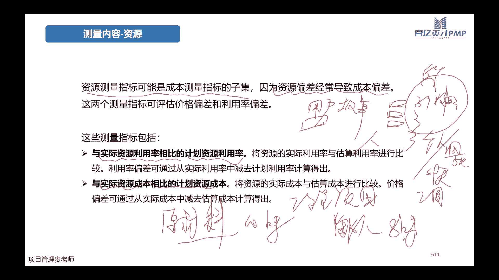

那相应的这种成本呢，肯定是也有一些相应的一些节约哈，好再一个测量内容呢是我们说要测量商业价值，其实商业价值呢因为就是价值几个维度，前面跟大家讲的比较多了，这会就不再跟大家讲价值的维度了哈。

讲一讲我们当时做商业论证的时候啊，也是第一次课还是第二次课的，就跟大家讲过，我们去用成本效益比啊去，啊，成本效益分析去论证这些项目，他值不值得做的时候来跟大家讲了一些指标啊。

这些指标不知道大家还记不记得哈，这有啊，比如说第一个这个成本效益比啊，我们成本跟收益啊一比就是就是两个哈，就是总成本总收益啊，相比他们的这个数值是大于一还是小于一啊。

看看我们总体的投入跟收入是不是能够打平啊，是不是有一些这个银鱼啊，这是一种测量的指标方式，第二个呢啊，他在这讲的是跟实际收益相比的这个计划，收益交付啊，比如说我们现在我们现在约定好了，下一管理计划当中。

我们啊要实现半年之内，要实现300万的这样的一个这个利润点啊，但我实际在做的这个过程当中呢啊，可能因为一些啊这个推广的一些原因啊，市场我们看乐观的估计了，所以其实在推广呢。

我可能只实现了100万的利润回款，那这个也是一种可能的这种方式哈，那同时啊继续讲我们的指标，我们说了一个投资回报率，投资回报率啊，再跟大家复习一下，投资回报率是我们的这个回报啊，这个回报是说的净收入哈。

净利润，然后呢再除以我的总成本，那再乘以百分之百，这个是我们的投资回报率啊，然后还跟大家讲了进献值NPV啊，净现值呢是说，我考虑了他时间的一些动态的经济成本啊，考虑了通货膨胀的这些经济因素。

出现的啊这种指标，但除了列出来之前，我们还有比如说考虑啊，我现在资金非常紧张，现金流非常紧张，我比较在意它的回收期啊，如果能够半年回本啊，如果能够一年回本，哪怕他赚的少一点。

唉我都愿意选择回周期更短的这个项目啊，还有啊内部收益率LORR，这都是之前跟大家讲过的指标哈，大家可以去回顾一下，如果说不太记得他的公式的，可以自己再回过去再听一听那个课程的内容哈。

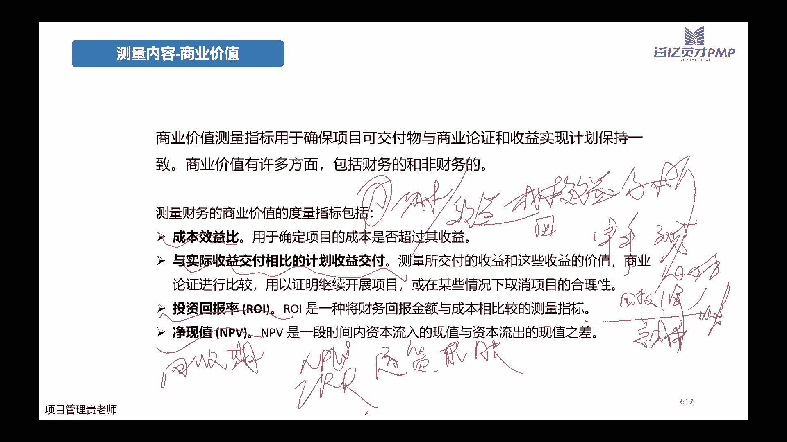

好下面再一个呢是我们要测量该系人，测量该系人呢也有一些维度哈，首先嗯进推荐指这些嗯测量的这些维度，我觉得大家可以去参考哈，因为一般通常来说，哎我们说这个啊前面讲的这些资源啊，进度啊，还有成本呀。

当然进度和成本，接下来会在重点的讲，他的这个嗯进度的这些偏差和成本的偏差，到底怎么去计算，那也是考试的重点，这两个呢相当于是比较明确，大家都好理解啊，啊然后这个资源的利用率啊。

然后资源对应的这个成本大家也都比较好测量，然后测量该系人可能一说呢，大家觉得有点懵哈，测量干系人是什么意思，为什么要测量干系人啊，这提供了几个不同的这个指标，可以大家在实际的工作当中。

可以尝试着去用一用哈，首先第一个呢是净推荐值，也就是说我们这个项目做完了之后，那我们的这个该信任和客户，他愿不愿意跟我们啊做一些推荐，别的公司或者别的同行有类似于项目的时候，项目需求的时候。

他是不是愿意来把我们这个公司，和我们这个项目团队推荐给别人啊，让我们能够接到接到更多的一些啊订单，这些呢可以去评估啊，当然更好的是呢，你能够得到客户真实的一些反馈啊，问卷都OK，第二个呢是情绪图啊。

情绪图呢也是一种可以去跟踪这些啊，干系人，甚至呢他做内部的团队啊，这种情绪的这种反应也是OK的，后面我给大家列举了一个这个情绪图的，这个表啊，大家一看就明白了哈，然后第三个呢是A士气怎么样。

士气怎么样啊，事情一般的是说的是这个团队的本身啊，他做的这个事情，团队内部的这种这个凝聚力啊，镜头啊，心境是不是每天都像打了鸡血一样，他的士气高不高啊，如果说一个项目团队，整体的这个氛围是死气沉沉的。

那你要是说这个项目很成功，我想应该至少你的领导对你不太会满意，对不对啊，还有一个是看我们整个这个项目，他的啊这个离职率啊，死气沉沉的，有人能熬，为了工资也能行，那有些人呢他可能长期以往他这种环境。

他就受不了，所以呢那他选择离职，离职率非常高，那也说明在咱们整个这个项目当中，可能会有哪一方面的一些问题存在。

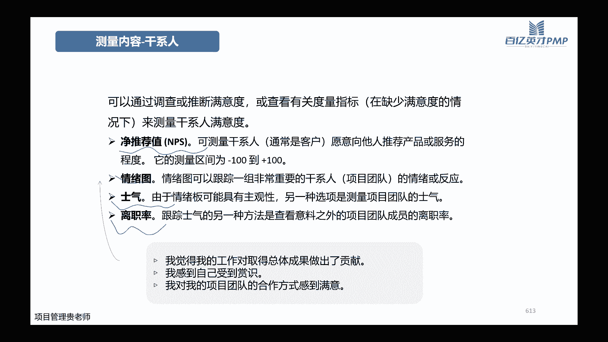

对不对，这给大家列了一个情绪图哈，这个情绪度就是每天啊他他这练了一个星期了，那每天结束的时候啊，哪一个重要的干系人，他今天啊评估一下，我们也可以通过他的一些表情呢，或者是跟大家去沟通啊。

去看看去判断一下他今天的心情怎么样啊，今天是以正常的微笑啊，星期一的比较严肃，不太高兴，星期二呢哎看着心情不错，星期三呢哎好沮丧啊，这个走的时候我下班的时候还在骂人，对不对，那长期统计的数据多了之后。

诶，你就能够判断第一是能够判断整体的，咱们所有的这些这个纳入到我们测量的，纳入到我们监测的这些团队成员整体的情绪，如果说都是哎微笑比较多的，那说明整个这个氛围文化还OK还不错。

那如果说在整个都还不错的时候，其中有一个人啊，他出现了他他他他都是这种表情啊，他都是烦躁的表情，那有可能是这个人单独的，有一些什么问题没有被我们识别到啊，那我们可能去选择去单独的去跟他去沟通沟通。

看看呢有什么嗯需求点，然后再想办法去解决，所以呢无论是从整体还是从个人，我们都能够去判断出来一些潜在的一些问题啊，并且呢去啊，既然找到问题点啊，肯定是能有一些改进的一些办法和一些措施。

好最后一点呢就是我们的这个基准的特效，基准的绩效，基准的迹象里面呢，重点是两块哈，一个是进度的，一个是成本的，那么在进度方面呢，哎我们可以测量一下它是不是按时开工的啊，这个我们约定好了。

比如说嗯咱们这次的课程应该是5月，好像是5月26号开课吧，那我们是不是正常，5月26号，就是大家就能够听到正常的这种直播，还是说因为5月26号约定好的啊，就因为各种各样的原因，等到6月20号啊才开课。

那这样，显然你从这个项目开始的这个日期就没有达标，那相应的这个完成日期也是一样的哈，啊这个人力投入和持续的时间，还有工作量的整个这个估算，和我们人力的这种测算，跟我们实际所需要的这个时间它是否是匹配的。

然后呢整体的这些进度的偏差啊，是不是在嗯合理的范围之内，该季度偏差相对应的，还有一个进度的绩效的指数，他这两个都是反应进度的绩效基准的，只不过说了两个的计算公式是不太一样的哈，还有一个就是特性的完成率。

那我们在整个这个项目的过程当中啊，项目必须要具备有一些特性，某一些特性，那么这些特性它的验收啊，是不是这个都能够被验收，验收成功率能不能达到我们相应类型这个标准，那前面讲的记录啊。

还有一个就是我们的成本啊，这两块是基准绩效的这个核心哈，那么成本呢也是一样的啊，跟我们计划的这些成本相比，它的实际的成本嗯，超能超多少啊，节约能节约多少，成本的偏差和成本的绩效指数CV和这个CP啊。

他们也是一样的，他们都是反映的这个成本的这个啊偏差，具体的这种数值也是绩效，也是计算的方式不一样，跟前面的这个SV和SPI是一样的哈，是一样的意思嗯，这几个指标哈，这几个指标是测量就相遇里面啊。

重点需要掌握的啊，也是考试的一个重点哈。

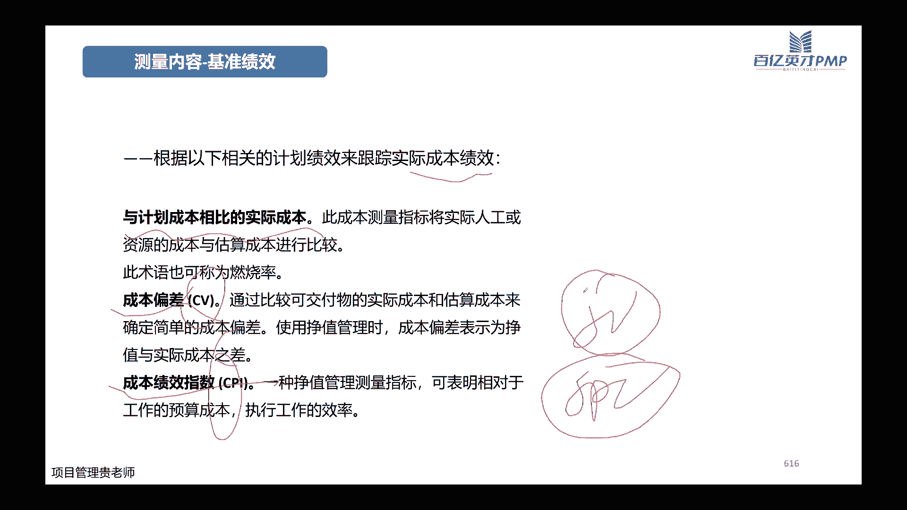

所以下面就重点来跟大家讲讲政治分析吧，在讲政治分析呢之前呢，大家可以再回顾一下哈，我们除了这个基本绩效，啊这个进度和成本，啊这是马上接下来的重点，那么在这个之前，我们其实还讲了很多测量的内容。

测量的内容对应的这些指标啊，这个交付呀啊，可这个成果呀啊资源呐啊干系人呢啊等等，大家自己去回顾哈，这些内容呢，这些内容呢考试，它有可能考不出来太多的东西啊，因为它里面计算的内容比较少。

然后呢顶多给一些这种场景，涉及的应该不会太多，但是呢上面的这些内容呢，对我们实际的工作都非常的有帮助，尤其是刚刚提到的这个该新人的这个测量啊，方式，几种指标我觉得非常有用，好OK多说了一句话哈。

好我们看一下政治分析，政治分析呢是对我们的整个这个范围，进度和成本的迹象进行一些综合的比较啊，他也是进行一些综合的比较，但是不同的是呢他进行比较之后呢，它会有一些啊具体的这种素质出来。

他是把实际的进度和成本绩效，跟我们基准进行比较比较之后呢，哎能够由我们具体的数值出来，这个数值是1V，我们用1V来表示哈，嗯为什么会要有EV啊，为什么会有政治这个概念的存在哈，跟大家举个例子。

大家就明白了，比如说唉我们这儿有一个这个嗯，这个工作的进展图哈，那么蓝色的部分呢是我们计划的计划呢，在1月的时候啊，完成的这个工作量是这啊，我到我到7月的时候呢哈，我完成的工作量是在40多。

这但是我们说了呀，实际的执行跟我们的计划，他一定不可能是一模一样的，对不对，除非你是神仙啊，这个，但是这个神仙也有可能做出来是不太一样的，对不对，因为神仙也没有办法去控制人的每一个动作。

所以呢计划的这条线跟我们实际的这条线，它的走向的动态他一定是不太吻合的，那我们第一张图我们是不是就一定能说，哎我实际7月我做的比计划的高啊，所以我这个啊这张图的状态非常好，这个状态点赞啊，大大点赞。

大大表扬，是不是一定是这样呢，那我们再思考一下哈，同样的第二个图也是一样的，第二个图呢哎我在6月这有一个节点，到6月之后呢，唉我实际做的好像都跟我的计划越来越落后了，那这样他是不是说明。

你后面一定做的就很差了呢，啊是不是一定给你打一个这个倒叉叉呢，是不是这样呢，大家也可以去思考一下，结果肯定是不是啊，结果肯定是不是为什么呢，因为你在这种情况下面啊，或者是这种情况下面，你的实际的情况。

如果说比你的计划的情况要走的慢，那是不是有可能是按照我们的这个过程啊，要优化，按照这样的一个原则，是不是我们因为采取了一些新的优化，工作流程和管理办法的这些动作，进而导致我们实际的这个进度啊。

有跟我们最开始计划的有一些偏差，那你能说因为有偏差，所以你整个这个项目团队非常差，能这样说吗，不能对不对，因为价值是多维度的，那同样的第一种情况呢，唉我实际做的他都比计划的要超前。

那很有可能是我为了能够超前，我原先需要五个人，我现在投入了十个人，我花了更多的钱，成本花了更多，那你就一定能够说我这个项目管的特别好嘛。

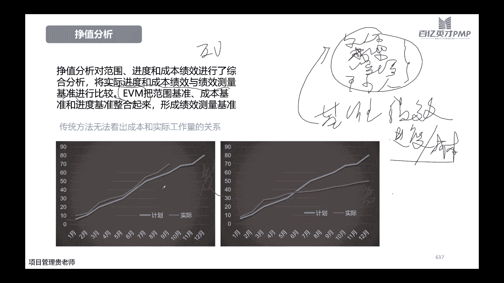

所以说不能这样说啊，不能不能绝对的去这样说，所以会出现一个政治的一个概念，政治就是我实际完成的这个工作，value我实际完成了这个工作价值多少钱啊，啊应该应该说实际完成的工作的价值。

价值啊value但是呢这个英文翻译成中文呢，一般啊这个大家会把这个价值理解成钱哈，理解成钱，那就直白的写实际完成的工作值多少钱，那同样的啊，用我们上面那个例子来讲好，他的实际的工作线一直在上面。

计划的工作线一直在下面啊，那么我实际完成的工作，它可能对应的是50啊，这是计划的只有40啊，本身呢只看它的范围，它是完成到50的这个标准，但实际呢我在这儿，因为我花了多了一倍的人呐。

我从五个人变成了十个人，那他相应的成本是扩大了一倍，它有可能那扩大的成本这个范围这个区间啊，多做出来，这个时他是满足不了的啊，那相当于是我在这个节点上面，我不仅没有进步，我反而有些退步，对不对。

我的这个EV他反而是不太值钱的，对不对，所以大家理解1V它的概念啊，它反映的是实际值得实际完成的工作，它的价值啊，这个这有一张图还是我们的政治分析图，这张图呢是嗯相当的重要，但是现在这会跟大家讲的。

不一定所有人能看得明白哈，我们争取啊，我们争取能理解多少，理解多少，讲完后面的这些指标计算之后，大家再回过头来看这个政治的分析图，就能够理解了，所以现在是尽可能的去理解哈，这张图呢我们用横坐标表示。

随着时间的这个进展啊，整个项目的一些这个进展，然后用纵坐标呢是表示他的一些这个累计，要花的一些成本，然后实际他花的成本呢啊用这条线来表示，计划的呢我们用这条啊，实际的这个政治呢，哎我们用这条来表示。

那么实际完成的成本跟我们计划完成的啊，这些价值和我们实际工作完成的价值，到底值多少，它其实是三个不同的啊，完完全全做出来是不同的，测算出来是不同的一些数据，那么在中间的这个节点上面呢。

在中间这个节点上面的诶，我我会去测算，会去测量对等，因为我们说的测量是在过程当中测量的，我在这个点去测量的时候，哎，我发现他的政治是在这里可能对应的这个成本，我们举个例子，比如说政治是100万。

然后计划呢，我这个时候要完成120万的这个工作啊，价值，但实际呢哎我可能啊，这个做了150的这个价值啊，那么后面呢就会有我们整个这个，如果说按照实际的这个成本啊，一直这样走，那么按照它的曲线。

最后我在项目结束的时候，对这个时候是结束，我在项目结束的时候啊，它会对应到，比如说这个是300啊，这个呢应该是280，按照我计划的时候，我在结束我应该只花这个280万啊，我这个成本只用花28，280万。

但是我在实际的成分呢，我可能要花300万啊，相当于说我在这个点预测，这个点测完之后，我就知道我如果按照这条走势下去的话，我将来啊我将来我可能要超支20万，那我实际做的啊，我不管因为什么原因去做的超支。

那我实际做的这个工作值不值这么多钱呢，哎我们要看正直啊，正值这个图呢，他有可能是这样走，他也很有可能是这样做，对不对，那如果在这个点，我的政治啊，我挣了350万啊，我所做的这个实际的工作。

虽然我多花了20万啊，多花了整理花了300万，多花了20万，但是呢我给组织带来的这个价值点啊，是350万啊，相当于是我不我还赚了50，对不对，那同样的它实际的政治呢，最后走完他也有可能是这样的啊。

那确实你计划的是280啊，我实际做完的这个价值才值二百五啊，我我整理的这个差别，我是差了30吗，不是我是差了啊，这个50，所以拿这张表哈，就是这样去反映的政治跟实际的这种成本，跟我们计划的价值。

他之间的一些这个对比的一些关系哈。

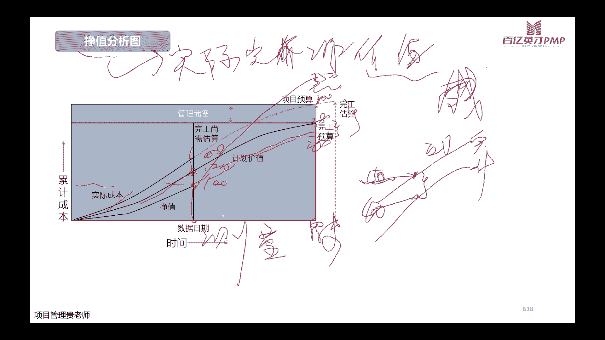

既然要画这些图，那我们就要会计算这些数据，因为有数据我们才能有点呈现啊，有点画成线，画成线之后才能反映出来一些规律，对不对，所以接下来重点看看这些指标哈，首先计划价值，那也就是说我们计划在这一个点之内。

它的价值应该是多少啊，client value在我们简称PV，大家这几个关键的这个指标，它的简称一定要记住哈，记不住简称啊，或者说能记住简称，你觉得挑战太太弱了啊，你非要去记英文也行啊。

那对于这个记性不太好的学员来说，你觉得这英文太困难，没关系，你记住它的简称啊，PV计划价值嗯，计划价值呢它表现的就是我在这一点，我测量的时候啊，我按照计划，它应该达到的这个价值点到底是多少。

这是我计划的价值，那还有一个呢非常重要的叫做actual value，实际的成本，实际成本呢我们用AC列表示，也就是说我还是在这一点啊，我计划的价值是这么多，但我实际花的这个成本呢。

哎我有可能在这个地方，我也有可能在这个地方，当然都OK啊，这是根据我们实际来算的，他实际花的这个成本是多少啊，AC是实际花的成本，那么这值1VN的Y理，你挣了多少价值，你的EV呢是我在这个点。

实际完成工作的一个价值哈，这两个有区别啊，这两个的区别呢，相同点是他们都反映的是实际的这个工作，区别呢是AC是反映你实际工作花的成本，而这个政治呢，它反映的是你实际的工作值多少钱，是反映的是价值。

当然PV呢是不是实际的，它是它就是按照规划得到的这些数据，所以这三个指标它的这个含义啊。

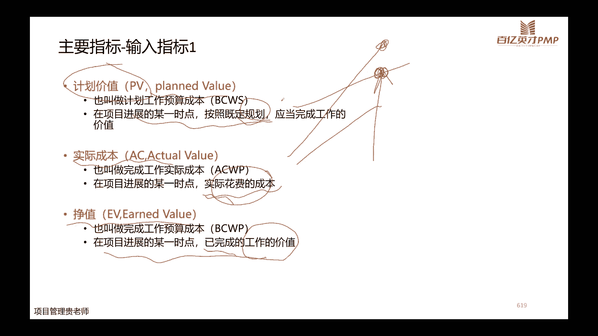

要先把它弄得没有什么意义啊，没有什么意义，然后我们接着再往下讲，有没有什么意义，我看一下大家的这个聊天互动版，嗯OK没有人问问题啊，说明没有问题，OK我接着讲。

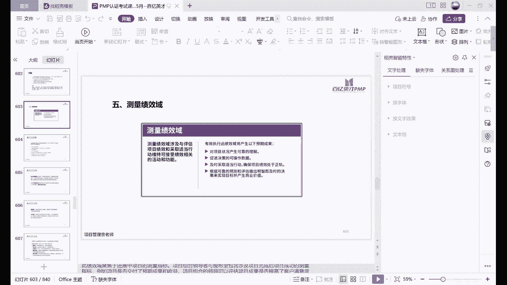

好我接着讲啊，那么第二个必须要知道呢这个指标哈，第二个梯队前面的是三个基础指标啊，现在是第二梯队的也是要记住的这个指标，第一个是完工预算，完工预算呢我们用BAC来表示，完工预算是什么意思呢。

完工预算是我啊在这个点测量之后啊，我推算出来将来这个项目完成之后啊，按照这个点的绩效走的话，他将来啊整体完工，那到底是对应的这个成本啊，应该是多少，然后同时呢完工的工期预算啊。

BDACBAC就相当于是哎我整体预算了，他的这个完工的这个啊成本，然后BDA现在是我完工需要多长的时间啊，这两个其实也比较简单哈，前面是输入，前面都是我们可以实际测量出来的啊，这是第三队的。

第三梯队的哈，第三梯队的他的一个这个指标，我们将要做输出的指标，输出的指标呢，它就会涉及到一些具体一些计算公式了，好后面马上会讲它的计算公式，我们先看一下有哪些指标啊，有成本偏差。

这个是我们通过测量它的实际的成本，以及呢他的计划的这些成本之后，可以得到它的成本的偏差到底是多少，成本的偏差啊，我们用CV来表示，当然跟成本偏差有对应呢，就有我们的进度偏差啊，实际的进度是多少。

计划的进度是多少，会得出来他的进度的偏差是多少，然后呢相应的啊有了成本偏差，我们就能够测算出来成本的绩效指数和，进度的绩效指数，成本绩效指数呢我们用CPI来表示，进度的绩效指数呢我们用SPI来表示。

那还有一个啊叫做这个完工的估算和完工工期，估算，前面讲了，完工的预算是BACBAC，然后呢完工的工期是BDAC，BAC呢是我预估的整个这个项目，它的整体的预算，BDAC呢是我预估的整个这个项目。

它的这个周期，但是完工估算的是我在中间节点估算之后，诶，发现肾发现他按照这个节点来走的话，那么它完工啊，到底是需要就是根据我们实际纠正，纠偏之后的这个EAC，那同事的EDAC就是说我完工啊。

工期的这个它不叫预算，它的估算是我经过测量之后，经过纠正之后啊，经过纠正之后，它到底实际的这个工期可能会是多少，还有一个指标呢叫做这个完工尚需估算，完工尚需估算etc，也就是说啊我在这个点啊。

我在这个点啊，我实际测的他的EV啊，实际是这么多，那我的整体的预算呢是BACA，那我就看一看，我将来按照这种绩效啊，按照这种进度和成本的这个绩效指数，走下去的话，那我完工我还需要多少估算啊。

我还需要多少，这是剩的这一部分需要多少，跟前面有区别啊，前面是说的整体，然后这一生是说的我剩余的这一部分，完工的成本偏差呢，是这个vac和vac一般考的稍微少一点点，VC他是说诶我完工的啊。

到时候啊按照这种节点走下去的，完工整体的这个成本超支预估会是多少，然后完工尚需的绩效指数，意思是我在这儿我发现诶，我好像啊这个绩效有一些偏离啊，这个原本应该是这样的啊，但是我实际可能变成这样了啊。

有一些这个偏离，那我为了让这个，情况哈，为了让我们实际的这种价值的这种交付，能够按照我原先的这条计划走回去，那我需要怎么样去调整一下原来的CPI是多少，那我现在呢调一下我的CP啊，调整绩效的约定之后。

能够赶上啊，能够纠偏，能够让他回到既定的轨道上面，这是不同的这些输出指标哈，听第一次呢，可能有些人会觉得记忆起来比较困难啊，没关系，大家下去之后呢，通过做题啊，通过多听几遍这些课程的内容。

就能够去理解他们，每个指标代表的到底是什么意思哈，差异指标呢我们讲这个前面讲了进度偏差，成本偏差，还有进度绩效指数和成本绩效指数，这都是我们计算出来的，对不对，那既然是计算出来的，就涉及到怎么计算呀。

好我们看看承进度的偏差SV哈，SV呢它是由1V减去PV，还记得EV是什么吧，1V是我们实际工作啊，真的这个价值实际工作值多少钱啊，PV呢是我们计划在这个点，他的这个工作的这个价值是多少，对不对。

那用我们实际的减去我们的这个计划的，就是我们的进度，它的一个偏差，所以啊如果说他的这个SV是大于零啊，也就是说大于零是什么意思呢，也就是说我实际做的这个工作价值，比我计划的这个工作价值要大。

那当然是说哎你整体的这个进度比较好啊，比较快，对不对，价格比较高，那相应的啊如果说EV比PV要小一些，它相减它小于零，说明你实际做的这个价值，比你计划价值要低一些，那就说明你这个工作在技术上面啊。

有一些这个延迟，有一些拖延啊，效率比较慢，所以他假如考试给大家场景，用SV去判断这个项目，他目前的这个迹象状况啊，进入阶段到底是超前还是落后，大家要知道哈，SV大于零的时候，首先要记住公式。

然后知道SV大于零的时候，快SV小于零的慢啊，其实这个这个都不用去记，你把公式记住，你知道一公式一看就知道了啊，实际的跟计划对比，你要大一些要好一些，那当然是快，实际的跟这个计划对比一样。

慢一些要小一些，那当然就是慢了好，第二个呢成本偏差，CV成本偏差呢，它的计算公式是用我们的EV减去AC哈，EV啊在复习再一次的反复的跟大家谈谈，EV是我们实际证得的价值，AC还记得吧，AC前面讲过了。

AC呢是我们实际对应的成本啊，那OK我们实际的这个价值，那跟它的成本相减，是得到我们的成本偏差，那相应的你实际做的啊比你的成本要大，那说明什么呢啊你实际正正得的这个价值，比的这个成本要大一些啊。

也就是说你花了五块钱，但是你挣了十块钱，你显然啊对于整个这个成本来说，你是帮成本去解约了，对不对啊，所以CV代言的时候你是省钱了啊，如果说你做的这个1V比实际花的钱要少一些。

你这你做的工作才价值五块钱啊，但你实际就花了十块钱，那很显然是超支了，所以CV小于零的时候，代表的是一种超支的情况，可以理解吧，好完工估算ECEC，它的它通常是说这个在这个点测量之后啊。

那我们就约定一下，如果说用这个点的这个技巧去评估啊，在持续做后面的那个动作，团队绩效慢慢的就慢了，反正也无所谓啊，就按照这种节奏走，那将来肯定会有一些偏差啊，完工的这些估算和完工的时间。

那怎么会偏差多少呢，哎我们有EAC也有一个基准计算公式哈，ea c的计算公式它是用BACBAC我们说了，他是完工的预算，对不对，网购预算就是说我约定的这个项目，他网购预算可能是100万。

整体这个预算我约定的是可能是100万，那现在呢啊c pi后面会在啊，这个啊这就跟大家讲了吧，我们这个CV它不是等于1V减去AC吗，那么CPI它的公式是1V除以AC哈啊，相应的SV等于1V减PV。

那么SPI呢啊，进度绩效指标它是等于1V除以PV的，所以这两个公式是一组，大家都把它记住哈，所以我用整体的这个完工运算啊，除以我的成本的绩效指数是不是就能够得出来，那我整个这个完工的估算是多少。

同样的CPI这里就在这里哈，如果说它大于一，你看它是1V除以AC如果大于一代表什么，大于一代表1V更大，EV更大，我们说了EV啊，你实际做的这个价值比你成本更大一些，那当然是你省钱了。

所以说CPI肯定是大于一，代表你控制的比较好，小于一代表你控制的比较差，对不对啊，ea c按照目前的执行结果，项目结束的时候，预计总共要花多少钱，总归要换钱，用我们实际的这个啊。

最开始的这个估算除以我们实际的这个成本，绩效指数，就能够得到他预计的啊，纠正之后的他预计要花多少钱，好VCVC，那就等于我们的这个BAC，减去我们的这个EAC哈，完工的成本偏差啊。

也就是说我最开始我不是有一个预估吗，完工的完工的这个预算嘛，然后我中间测量之后，我又一个完工的估算呀，啊预算是100万，实际按照我们的这个CPI去估算的，很可能成本啊，可能这个最后要花120万。

所以得到了我们的这个成本偏差，整个整个完工后的成本偏差，那相应的完工之后的成本偏差也是一样的哈，如果说它大于零啊，代表这个BAC大于EC，BAC大于EC，当然是说你还节约了钱，对不对。

你这100万还没花完啊，如果说小于零啊，相应的就是说你实际预算的，比你估算的还是要少一些少一些，所以呢它剪出来他是一个负数，那说明你这个成本在最后结束的时候，有一定的超支，完工尚需估算呢。

它是这个etc哈啊前面讲过，他是说我在这个节点测试了之后啊，我发现我如果说啊按照这种这个节奏走的话，我还需要多少钱啊，前面讲的这个EAC是我按照这种点估算之后，我整体需要多少钱啊。

etc呢是我在这点估算之后，我剩余的这一段工作我还需要多少钱啊，所以他怎么来呢，它是用我的这个ea c ea c，因为是完工的估算嘛，对不对，那整体的减去我已经花掉的，实际花掉的就是我剩余的etc。

对不对，所以哈它有很多种计算方式，他的第一种计算方式是我啊，整体的这个完工估算减去我已经花掉的钱，就是说我剩余的还需要花多少钱啊，那第二种公式呢是我们用BAC去除以这个CP。

我们讲ea c它的计算公式就是这个啊，EAC等于BAC除以CP对不对，所以呢用BAC除以CP2，再减AC也是一样的哈，当然后面几个公式呢用的会相对的少一点啊，也是一样的，这个啊除以AC比EV。

因为他要计算CPI嘛啊，所以这是CPI的一个计算公式啊，同时呢，还有一种是BAC才除以整个这个EV啊，然后再减去一乘以AC，这都是它的相应的计算公式，常用的呢就是这个啊和这个啊记住就好了，好最后一个啊。

不是最后一个，下一个哈，是完工的这个工期估算EDAC，那EDAC呢它是我们整体说了，既然工期工期我们是肯定是用进度，对不对啊，前面说的预算预算用这个成本啊，进度呢工期呢用进度BDAC我们说了啊。

BDAC是我整体预估的，这个项目可能要100天完成啊，但实际呢我这个进度呢他可能SSPISPI啊，比如说它有它是0。8啊，0。8还记得不，SSPI前面讲的是等于1V除以PV，它等于0。8啊，它小于一。

什么意思啊，小于也代表你实际做的这个价值，你跟你的计划价值相比，你更小，对不对，更小说明的进度落后啦啊进度落后啦，那我如果说按照这个目前的这种进度，节奏去走的话，我100天我能完成吗，我完成不了了啊。

我这个BDACA我达不到了，那会是多少呢，哎100天BDAC除以它的这个SSPI啊，除以0。8，出了之后大概是100多天吧，自己去算算哈，所以呢哎我的完工的工期的估算EDAC啊，就是这么算来的。

好进度的绩效指数SPSPI跟大家讲了哈，SPI前面就跟大家讲了，CPI也跟大家讲了，记住哈，这些核心的这些公式一定要记住SPI和CPI啊，CV和SV金黄香吗，好完工尚需的绩效指数呢，这个也很重要。

这个呢嗯考试好像考的，如果考这个的话相对难一点，但是这个在实际的工作当中非常重要，我们说了TCPI，CPI是表示什么意思啊，CPI是表示的我们成本的绩效的指数，对不对，那么TCPI呢是说。

我为了达到之前的这种绩效指标，我需要保持怎样的啊，成败绩效指数，我才能够去达到之前的这种这个效率啊，这种绩效，所以它的工计算公式呢，唉就是我们用BC整体的预算减去，我们实际完成的这个工作的价值。

也就是说我剩余的还需要多少工作要做啊，再除以呃，我剩下的我这个毕业C在减持实际的花费，那是我剩下的还需要花多少钱啊，除了之后等于TCPI哈，这个应该也好理解哈，这个是说我啊减去。

正直是说我实际按照这种情况，那么还需要多少工作要做，那么下面的这个啊这个BAC减去AC呢，是我啊这个实际啊预算是花多少钱，实际花了多少钱，那么我剩余可以花的这个钱数啊，实际剩余要花的这个价值。

除以我的这个剩余要花的这个钱，就能够得到我的成本啊，剩余的这个网工需要的这个绩效的这个指数，所以这是一种计算的这个啊公式啊，或者是呢这个用EAC减去AC啊，也是一样的，在这个里面大家重点掌握哈。

这个BC减一为代表剩余的工作啊，BAC减这个AC代表设计的基金，前面跟大家讲的预算减去你实际的这个啊，这个已经做了这个工作，价值等于你剩余还需要完成的工作，价值也就剩余的这个工作啊，BC减去AC呢。

是我们的预算减去你实际花了多少钱啊，也就是你剩的还剩多少钱的这个资金啊，所以他除了之后就是我们这个pc pi哈，好这里面有一个偏差啊，有一个典型偏差和非典型偏差的这个概念啊，啊这个概念呢也比较重要。

因为呢考试他有可能就给你一些场景啊，让你告诉你这个场景呢用典型的偏差算，还是用非典型的这种偏差算典型的偏差呢，就是说哎我这个啊CPI啊，我算出来是多少啊，我就是多少啊，我不纠正了啊。

我我就直接按照我目前的这种节奏进，进度去走啊，将来啊他有他的啊ea c啊，或者是以d AC有什么变化我都认可啊，有什么样的这个这个超支啊，啊我有什么样的延期啊，我都接受，无所谓了啊，这是典型的偏差。

那什么是非典型的偏差呢，非典型的偏差，啊意思是说，我在这一个啊中间的测量点，我发现他这个CPI啊有一些，啊CPI它是大于一的啊，或者说呢我测出来CPI它是小于一的啊，它的成本有一些超支，那怎么办。

我不能认这个项目超支呀，啊我要采取一些动作呀，对不对啊，他的这个CPI实际他可能啊，他可能会有一些这个超支，如果按照这种节奏走非典典型的偏差，就是啊最后那他这个实际的会跟我们的。

会跟我们的计划会有一定的偏差，但我在这一点测量之后，我发现CPI的数据不太理想，我做了一些纠正之后啊，我能把它再调回来啊，这个叫非典型偏差，这有哈这个叫做非典型偏差，所以典型的偏差和非典型的偏差。

是不是要求你的后面的这个TCPI是不一样的，对不对啊，如果说是典型的偏袒你的CPI就跟之前的一样，保持那个节奏啊，好死不赖，好死赖活的，你就你你就按照你的节奏去走啊，将来是怎样就是怎样啊，这是典型偏差。

非典型偏差是你不甘落后啊，不干净度的之后，不甘沉闷的曹植，你做了一定的调整之后啊，调整了这个CPI，所以这是非典型偏差哈，说的这个强调的比较多啊，反复强调了好几遍，意思是让大家目的是让大家能够记住哈。

理解了典型偏差和非典型偏差之后呢，我们来算一下，基于典型的偏差来计算etc好，我们前面讲了etc是指什么啊，etc是指剩余的这个完工的，他的一个这个啊上虚的这个估算，那么我们是用已经这个做的这个价。

就是用他的这个BAC减去，他已经做的这个工作价值，是等于我们剩余的工作，对不对，姐姐的前面讲剩余的工作，那剩余的工作除以这个CPI，也等于说我们直接用这个完工的估算加减去，实际啊，这个生的浅。

这个呢是我们剩余的啊，上虚的这种完工的这种这个啊成本的这个估算，他的CPI为什么直接可以等过来，因为他的CPI跟之前的计算公式啊是一样的，那么非典型的偏差的etc的计算呢，嗯就是非典型的啊。

就是我做了调整，做了调整之后呢，那我默认的CPI是等于一的，这个默认为CPI是跟之前的一样，我调整回来CPI是等于一啊，它不会大于一，它不会小于一，它它没有偏差啊，它就是等于一，那OK他还是除以CPI。

但是CPI等于一，所以它默认的是BAC预算减去，我实际完成了剩余，完成了这个工作，etc是这么算的啊，所以它的典型偏差和非典型偏差，就是算的这个公式不一样，其实大家可以记一个公式哈。

就是etc它是等于BAC减EV除以CPI，大家记住这一个公式就行了哈，只不过是非典型偏差，他这等于一啊，这个典型偏差呢，这算出来是多少就是多少，好在小结一下哈，小结一下，我们前面啊有PV啊。

有EV有AC啊，有BAC啊，PV呢是说啊再跟大家强调一遍，PV呢是说我们计划在这个点实现的价值，因为那是我们实际在这个点实现的价值，AZ那是我们在这个点哈，我说的都是这个点哈，不是说完完成的时候。

是说的这个这个点这个点实际化的成本，BAC呢是我们整个项目它的完工的预算啊，BDS呢是我们整个项目的完工的工期啊，这些都是我们的输入的指标，什么是输入的指标呢，是我们可以通过实际的测量。

能够直接得出来的啊，能够得出来的这些指标啊数值，那么后面呢CV是成本偏差啊，c pi呢是成本的绩效的指数啊，哎哎这有SV呢是进度偏差，SPI呢是进度绩效指数啊，这个公式后。

完工估算呢是啊EAC网络上需估算的是etc啊，就完工成本估算的是VAC啊，我们工具是EDAC，网络上学绩效指数呢是TCPI，这些都是后面的这一面哈，都是我们通过前面这些都可以算出来的，怎么算。

后面有公式，大家下去之后把这张表啊，把这张表好好的去啊，这个消化了啊，理解性的记忆哈，理解性的记忆，不要死记硬背，死记硬背没什么意思，好讲完了正直哈，今天晚上的这个大头难点也就讲完了。

好我们再讲讲这个在政治管理的时候呢，有一个五五的法则，五五的法则呢啊什么意思呢，就是我们在啊实际过程当中，我们去统计他的正直的这些测量数据的时候啊，有一些不太好统计的啊。

就是我们是默认它是一些线性的关系，对不对，默认它是线性的，它是多少就是多少，将来还会按照这条线去走啊，不管是实际的还是这个正直，他都是按照五重线性关系再走，但实际我们在测量的时候呢。

它的活动它可能不是承重和线性关系啊，跟时间之间没有什么线性关系，那怎么办呢啊那我们有一些这个法则哈，什么意思呢，这个法则比如说五五法则是这个活动，如果他已经开始了，他已经开始了，但是他只完成了50%。

但是呢哎我们会把它这个标记，默认它完成百分之百啊，计算它的这个价值的时候，按照百分之百去算，这个是可以事先约定的啊，当然二八是20%啊，这个完成了20%啊，这个剩余我们就按这个80%去估算。

当然如果他什么都没开始，我们就默认为它或者刚开始一点点，我们默认为它这个价值是零啊，这个是约定哈，好这有几个例题，这个例题呢就是带着大家具体去算一算哈，呃第一题呢是说如果1V等于490。

这个AC是700，PV是525，那费用偏差，费用偏差就是CV哈和费用的这个绩效指数，CPI各是多少，是不是很简单，考试也有可能这么考，非常简单吧，送分题好，不是算一算呗。

CV我们说了CV它是等于1V减去AC对不对，那仅仅就知道减了等于多少，100减AC减了等于一，这这这这这没别的选项了，就直接选B了，我们看一下是不是哈，然后呢，费用计算，主CPIC。

pi等于1V除以AC应该等于490700，应该等于0。6674，应该等于0。6几啊，他取了一个整，然后第二题呢是说任务A的总预算成本是1000，基准工期是六啊，现在那什么意思呢。

相当于告诉你BAC等于千，对不对，然后呢BDAC比六，现在说截止到今日啊，也就是说你在中间测量的时候，你发现啊计划应该完成80%的工作量，也就是说你的PV啊，你计划完成80%，应该是80%。

1200 80%，你计划应该是PV应该是等于800，但实际上呢，你只完成了这个任务的50%的工作量，也就是说你的这个EV呢，你实际只完成了50%的工作量，是1600 50%是500，花了多少钱呢。

花了300，AC是300啊，所以这个例题呢是相当于是告诉大家，在不同的场景之下啊，怎么去推算这三个基础的数值，你们说了这三个基础数值是我们推算出来的，对不对，PVEVAC是我们实际算出来的。

或者实际测出来的，那怎么测，怎么反应，没有人没有机器人直接告诉你啊，对不对啊，我们需要通过这种方式去算哈，所以怎么算的，就是我们这么算的啊，按照计划应该完成的，就是我们计划的这个工作。

实际完成的这个工作是我们的这个EV啊，实际的支出是我们的AC，所以算出来啊，诶这儿有我还写了一遍，算出来啊，这三个数值之后啊，就可以这个BS的BDS上面也都写了哈，好正值汇算了之后呢。

会出现一个这个工具叫做正直的状态报告，好正直的状态报告呢，基本上它里面你看它都会有这些核心的数据啊，都会让你去算出来啊，整个这个项目，这个BAC是一开始报预算的时候，就已经报上去了啊。

那你当前还记住他都是一个钢琴，当前这个报告他啊这个PV是多少，EVAC测出来是多少，然后呢，我们通过测出来的这些数据得到它实际的偏差，进度偏差，成本偏差应该是多少，SPI精度绩效指数和CPI。

成本绩效指数应该是多少啊，这个判断出来了之后呢，去评估一下它产生偏差的根本的原因是什么，产生了这些原因之后呢，他对我们整体的这些项目的可交付成果啊，或者是里程碑或者是关键路径，有什么样的一些影响。

相应的成本，那对我们的预算啊和应急储备和一些啊，整体的这些这个啊，预算会有什么样的一些影响啊，就是反映这些东西的哈，政治状态报告里面，基本上就是这些核心的一些数据啊。

当然实际我们在做这个呃政治报告的时候，他可能会有可能会是一个单独的一个文件啊，也有可能是把政治作为一个绩效报告，做一个绩效报告的一个核心，啊作为一个绩效报告核心，为什么呢。

因为我们说了绩效里面你要反映它的进展啊，你反应进来你总不能说啊，这个项目进展的好，进展的不好，对不对啊，也不能说啊，我这个项目有点落后，或者说我这个项目有点超支，你不能说这样的话，你得有数据支撑。

对不对，数据是哪来的，数据就是我们的这个增值反应呢。

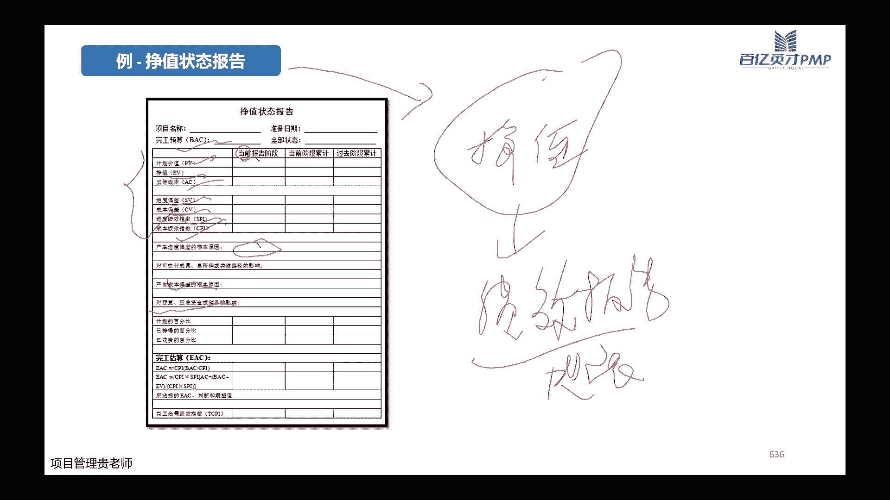

好平台分析，偏差分析呢其实也跟前面是一样的哈，这个主要是指我们的这个SUV和CV，SUV和CV啊，前面跟大家其实都讲了，怎么判断它是啊超支的，怎么判断他是这个之后的进度，就是滞后嘛，成本就是超支。

那相应的进度怎么如何去评判，它是超前的成本呢，如何评判他是这个节约的，包括你没有不用这个偏差，我们用绩效来分析的话啊，都是一样的，前面都跟大家讲了哈。

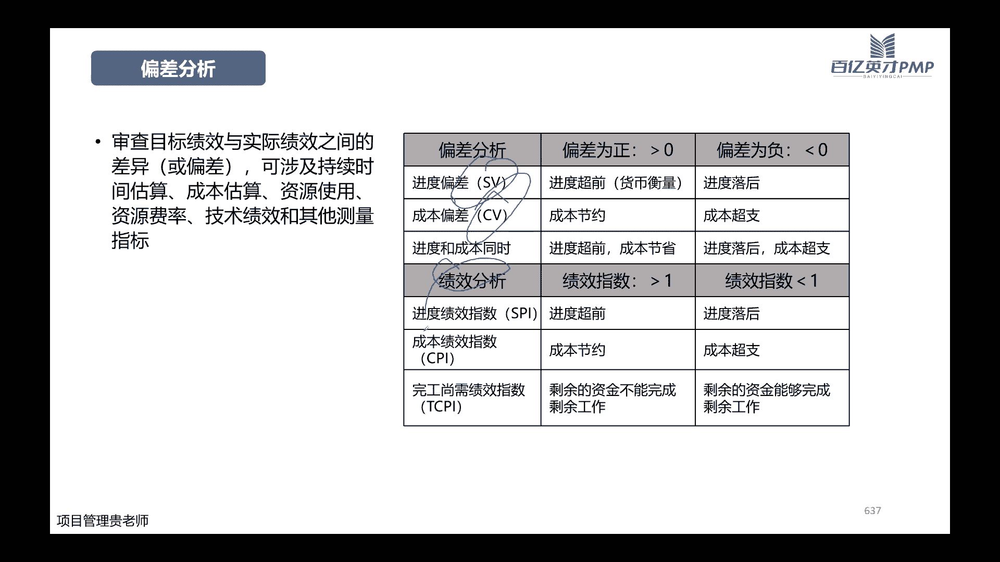

只要记录公式，这些也都会算了好啊，相应的也会有一些偏差的这种分析报告，偏差的分析报告呢就是用我们的这个啊，比如说你现在有这个进度偏差SV啊，成品平差CV啊，他计划应该是多少，实际应该是多少产生的原因啊。

你计划的一些办法，他跟我们的这个政治状态分析的报告，是一样的意思哈，是一样的意思，只不过说从理论上来讲它是两个不同的东西，但实际反应的内容是一样的，好趋势分析，趋势分析呢跟前面其实也是一样的哈。

因为我们知道了绩效啊，我们就能够判断出来未来的它的一个走势啊，你可以选择你未来走势，就按照当前的技巧去走啊，用我们的这个典型的偏差，你也可以考虑呢，你也可以考虑呢去调整一下这个绩效。

用我们的非典型偏差啊，让我们将来的这个技巧，能够回归到正常的这个路径上面来，所以这是趋势分析，你看这个无论是偏差分析还是趋势分析，都是基于我们的正直在做计算，在做推测啊，那前面算了哈。

前面是讲的是怎么算啊，后面还要讲啊，这个我们算出来的这些数据怎么去展示呢，第一个工具叫做仪表盘，仪表盘呢它是说啊，这个它会显示有关这些度量指标的一些，这个大量的一些信息，当然这些信息呢它不仅仅是政治哈。

这个它不仅仅是正直啊，它还包括我们之前的那些测量的，这个基准等内容，啊比如说哎我们的这个干系人的这个情绪表啊，啊或者是我们的这个资源的利用率啊，我们也可以考虑放在仪表盘里面。

放在仪表盘里面去把它做一定的这个展示哈，啊它简单理解，大家就可以把它当做一个这个这个展示盘吧，啊比如说常见的这种信号的灯图啊，横道图啊，或者是饼状图啊，或者是控制图啊，啊。

它都是我们这个仪表盘的一种展现的一种形式，这有一个具体的这种案例哈，这个案例呢相当于是还比较的啊，详细了啊，这个最近的知识哪活动，然后呢这些活动他的关键的可交付啊，他目前的这个所处的状态啊。

包括后面这些状态，也可以说哎在正轨上面还是已完成，还是说有问题啊，怎么怎么样，这是我们具体的这个仪表盘的一个信息哈，然后第二个展示的信息的工具呢，叫做信息的发射源，信息的发射源呢。

嗯好像前两天在在群里面跟大家讲过哈，一般在我们的since的项目当中，他是在那个项目的情景下面出现的一个工具，信息发射源呢啊它一般情况哈，但我们也可以把它叫做大型的可见的图表啊。

它其实就是一种可见的图表，可以很方便的，很便捷的展示我们整个项目的一些进展的，一些信息，那比如说我们讲敏捷的时候啊，讲声音的时候，讲它的进度的展示，我们是用的燃烧图啊，是用的燃烧图来展示的。

那么燃烧图是展示在哪里呢，是展示在我们的这些这个，信息发射源啊，有一些看法或者一些任务版都OK，是展示在这些这些这个呃这个具体载体上的，然后我们的相关方啊，在敏捷的这种环境下面。

他是主动的去查阅这些信息哈，他如果说想了解详细的这种进度，他会在这个仪表盘里面去主动的去查阅，而不你如果说主动查阅，大家还想想哈，我们在之前的时候，我们在之前的时候跟大家讲过，这个沟通的几种方法哈。

如果需要大家相关方主动去查阅的，是不是叫拉是沟通啊，前面讲沟通讲过三种托卡交互推式和拉式啊，推测是你主动发给特定的相关方，拉屎是需要相关方主动来查阅的，所以信息发射而言。

就是一种标准的拉式沟通的一种方式，好还有一种呢叫目视管理啊，其实目视管理呢，它其实啊它跟我们的这个仪表盘呀啊，跟我们这个信息发射源啊，啊它本质上的区别并不大哈，你看它也包含了一些任务版燃烧图。

或者是其他的一种这个图表，所以核心的内容其实是一样的啊，这后面的几个展示信息核心内容都是一样的，只不过说呢啊不同的这个这个说法，不同的叫法，它有一些稍微不太同的一些定义，包括任务版也是一样的哈。

日版给大家列了这个具体的案例啊，他其实有点跟我们的这个看板有有一点类似啊，有一点类似啊，这个是我们看板看板的，一般如果做敏捷啊，这个比如说用过啊这个jr系统的啊，或者用过这个DIODIOS的系统的。

可能嗯看吧应该都还比较熟悉，在系统里边每一项任务是什么呀，每个阶段有哪些任务，然后目前这些任务的一些状态啊，包括前面不是讲过在制品吗，通过这些看法，我们就一下子能看到每一个阶段啊。

需要这个做的这个工作的事项到底有多少，好任务版和看法呢有一定的这个区别哈，嗯区别呢是看板呢，它会显示所有特性的一些状态，然后任务版呢它是呃来显示所有任务的状态，所以他两个从展现的形式上面来看呢是类似。

但是呢从展现的内容上面来看呢，会有一点区别啊，看板呢它会更加的高层次一点啊，任务版的是具体到每一个任务本身的这种状态，所以呢它是比较细节，比较追求的一些细节，这个大家知道就行了，呃绩效报告。

绩效状态报告呢也是一种展示的信息哈，绩效报告前面跟大家讲过，这就不再具体讲这个绩效报告了。

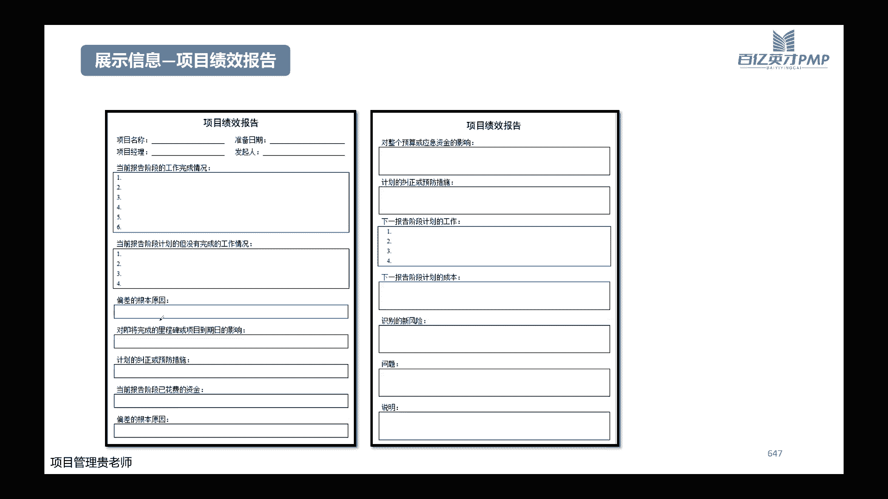

好整个绩效测量啊，整个测量绩效率的这个重点内容，就跟大家讲完了哈，嗯有一些这个要跟大家注意的就是测量陷阱啊，测量陷阱的，因为嗯有一些人为的因素吧，有测量也是人在测的，所以有些测量陷阱呢。

可能嗯会对我们实际当中啊，实际工作当中会有一些影响啊，或者有一些这个变化，大家看看时间，九点钟啊跟大家简单说一下互相效应，扩散效应呢，就是说哎你这个人如果说你的行为一旦被监测，被关注的时候。

你可能会更加的去在意啊，更加朝着别人监测的这种理想的动态，去调整你的行为啊，举个通俗的例子就是扩散效应，就是啊你希望我在哪，我啊我我我关注你下来啊，那你就指向哪啊，比如说啊一般你要是安个摄像头啊。

那可能呢大家就更注意自己的一些仪容仪表啊，还有这些虚荣指标啊，虚荣指标呢，就比如说嗯你在这个弄了一些虚了吧唧的，没有什么用的啊，比如说这个政府招商引资的时候，通常搞啊这个意向签约多少多少啊。

这个多少投资金额的这种项目啊，这种其实都没有没有实际落地，其实没有什么实际的意义啊，当然我这话不能说还有降低湿气，降低湿气呢，主要是啊就是就是你反正有一些指标，你发现它也实现不了啊，所以呢就无所谓啊。

还有一些误用指标，无用指标，比如说啊比如说在减肥的时候啊，就是采用了一些无关紧要的，问一些无关紧要的指标啊，比如说你在减肥的时候，你关注的是你每天早上体重的变化，而不是关注的你身形的啊。

体脂率的这些变化，还有一些这个确认边界，确认边界呢是说哎，比如说你觉得郭老师讲课讲的很好，哎郭老师即使有个点讲错了，你也觉得讲的很好，你也觉得是对的啊，还有一些关系的误解。

就是把变量之间的一种普通的一些相关性啊，误解成了一些这个这个结果关系，就是主观的区域，但它们之间有一些相关性，有一些因果关系啊，比如说这个这个举的这个例子哈，我觉得非常形象哈，你公鸡打鸣了。

一般我们都说啊这个闻鸡起舞，公鸡打鸣了啊，天亮了，所以你觉得是因为公鸡打鸣天才亮的，之前是错误的，所以所以呢这些啊就是通常要注意的，这个是提醒我们在实际做啊，工作的这些这些测量指标和测量内容的时候啊。

要忽略啊，而不是说要忽略是啊要正确的重视啊，不同的一些指标或者一些效应啊，或者是一些常见的一些人性的行为，会给我们带来的一些影响啊。

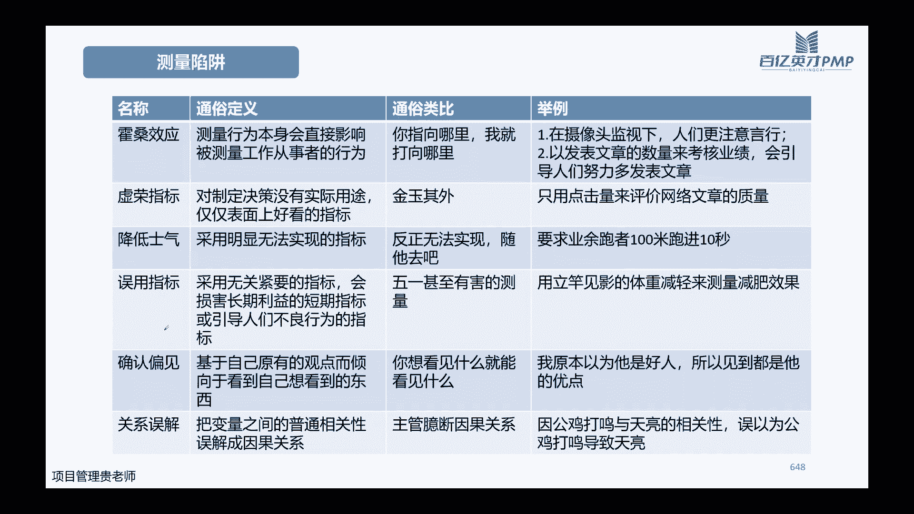

那当然问题绩效问题只出现之后啊，我们也把它测量出来，测量出来，当然是为了去啊做一些这个诊断啊，超出临界值的，我们应该做什么样的一些这个工作，然后偏差程度呢主要是看最开始的约定啊。

因为我们说讲这个比如说进度管理计划的时候，他一定会约定啊，你将来这个进度预估是多少，我允许你有多少的偏差啊，允许你的SV是等于多少，所以呢就看看最开始的这个约定，如果在SV在约定的范围之内。

那OK你可以选择不去控制，但是如果说啊，超出了我的这个约定的范围之内啊，超出了我的可接受标准啊，超出了我的这个承受力，那不好意思，那在过程当中发现出来，肯定要进行一些相应的一些调整哈。

所以就是它的这个上下限啊，正负多少，是要根据我们实际的这个啊，根据我们计划的这些情况去约定，然后再根据我们实际的这种情况去比对的，没有绝对的好和坏啊，没有绝对的好和坏好做测量。

整个他的目的当然是为了学习而为了成长，而为了改进啊，不管是团队本身呢，还是说推动决策啊，啊这个大家这个看一看就OK了哈，嗯例题例题我应该这个部分我应该只练了一个，因为前面讲的时候其实跟大家讲的例题啊。

啊，这个例题呢是按照考试的这种类型，去跟大家列的哈，考试就考这么简单，他这个项目呢是为期18个月，然后呢这个项目已经运行了六个月，现在说嗯进度符合要求，但是以超预算啊，这个进度符合要求是什么意思啊。

进度符合要求是我们的SPI，它等于一对不对，超预算预算是由我们的CP还表示超了预算，超了预算，我们看一下啊，这个EV除以AC啊，他已经超了，说明他实际花的更多，那肯定少于一，对不对，所以是分别是多少呢。

哎算一算下面的啊，我们发现嗯按照这些结果去看的话，只有A是对的，对不对啊，虽然说D也是进度绩效SPI等于一，但是它的成本绩效说错了，成分绩效他就大于一切了，他啊没有没有节约。

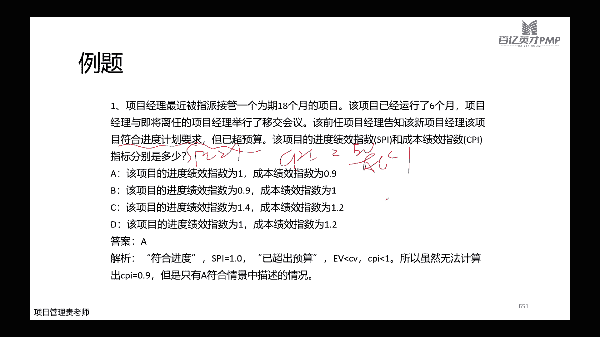

对不对，他已经超预算了，所以就这么简单，后面应该没有。

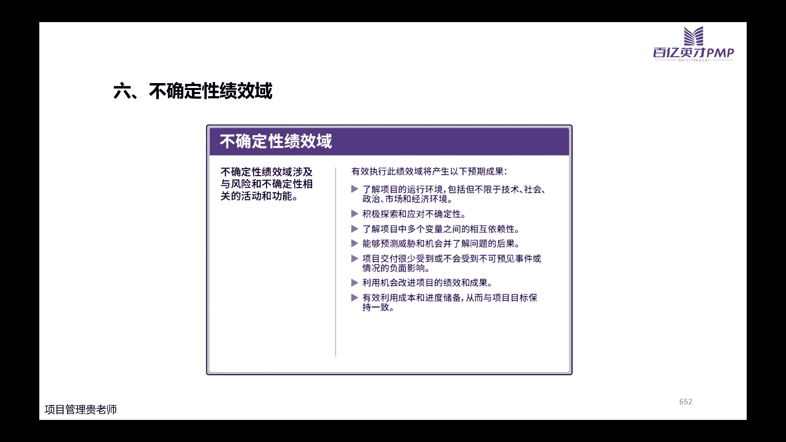

对没错好，今天晚上正课内容就讲这么多哈，看看大家有什么问题没有，嗯我看到张晓玲问TCPI，怎么判断剩余资金能不能完成剩余工作，你不是用TCPI去判断他能不能完成剩余工作，你是用剩余的这个资金啊。

剩余的这个工作除以你剩余的资金啊，来去约定一下，看看你剩余的这个TCPI，因为CPI是你的成本的绩效指数，是你要去确保的啊，如果说它跟我们的CPI是一样的，如果说我们算出来TCPI它是嗯小于一的啊。

小于一的说明你剩余的工作是这个小于，应该是剩余的工作，应该是小于你剩余的资金啊，剩余的价值小于你剩余的资金，说明你将来的时候，这个TCPI可以有一定的这个冗余，但是如果说你算出来的这个生意的工作。

是比你生意的这个资金啊，这个价值还要大的，说明你可能要超这个预算了，你可能要拿一个管理储备出来，要不然这个资金会不够，啊看来大家还有没有其他的一些问题啊，好的好，让要理解一下，嗯是的。

其实如果大家之前没有接触过，这么多的指标的话，其实今天晚上还是讲了不少指标啊，光是基础的这五个指标，那虽然说不用算，但是呢要让大家理解怎么去去测啊，去推算出来这些技术指标是多少。

同时呢还有那么多的输出指标啊，每一个指标代表的含义是什么，并且呢每一个指标它计算出来的数据啊，这个公式到底是什么，嗯初次讲呢，大家确实觉得可能难理解哈，但是呢要下去之后看一看，多练一练啊。

练熟了之后也就能够也就会计算，也能够这个在实际当中去运用了哈，好大家，如果说没有别的什么问题的话，我们今天晚上的课程就先结束吧，好不好，嗯下去之后做例题吧，好好做题，这一章节其实题目并不是很困难啊。

这个之前我有碰到学员说啊，碰到学员说这个这个嗯有一些偏僻的，这个少量计算题，好困难，不想算，但是我觉得PMP如果给你计算题，计算题相当于是送分题哈，因为计算题的答案是确定的场景题，很多答案不太好选择啊。

那种他也比较困扰，所以大家但凡是有计算的，偏僻的计算题都非常简单。

