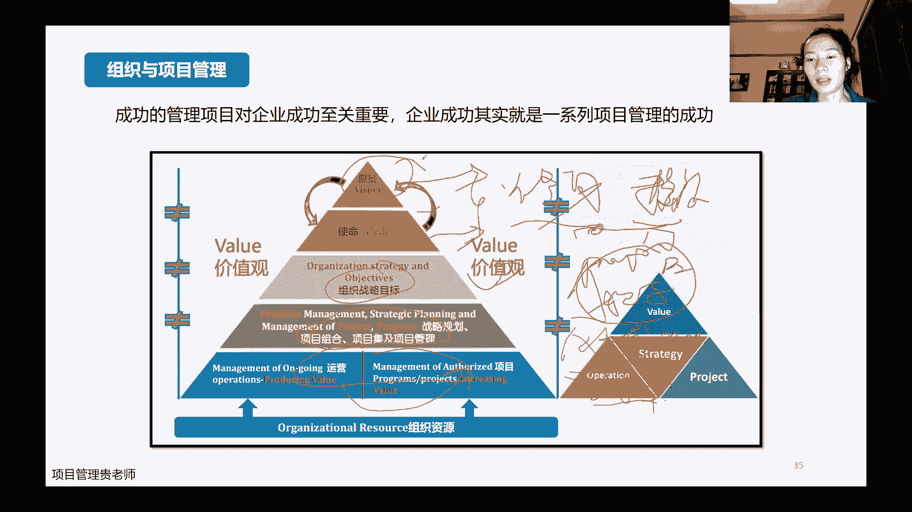

# PMP考试培训课程最新完整版项目管理认证第七版教材新版考纲自学教程 - P2：2.项目管理概述（二） - PMP专家 - BV1rM4y1Y79x

嗯不好意思，我刚刚好像好像掉了，是不是，现在ok了吗，现在ok了吗，嗯如果说大家看到画面正常，然后可以再帮我敲一点啊，ok了哈ok了，我们再继续哈，刚刚莫名其妙的断掉了。

ok我们继续哈，那我们前面啊接着讲哈，这个这个外部的环境。

那外部的环境呢，这个监管的环境哈。

监管的环境哈，那我们说比如说这个啊，无人驾驶也喊了很多年了。

对不对，那无人驾驶为什么，现在还是这个这个上路有点困难哈，因为有一些这个法律上的一些这个问题，突破不了，因为这个是没有办法的，并不是说无人驾驶，它的这个整个技术上面有什么啊。

致命性的一些关键的一些这个问题，并不是这个哈，他主要是在一些监管的环境上面，能不能一起通过，同时呢啊这个监管上面，因为啊这个有些话不太好说哈，在中国做项目很多一些，那像常作为灰色地带呀，嗯如何去避免啊。

嗯如何去合规，这也是嗯新版的教材里面，加了一个着重的一个内容哈，就是它的这个合规性没有，也后面也会马上会讲到。

然后他的这个学术研究啊，这个行业标准是什么样子的财务啊，然后物理这些都是外部的环境，会做的一些这个具体的影响，那我们讲这个内部的环境呢，就是主要以组织文化和结构为重点。

外部的环境呢主要是以监管的合规性为重点哈，那么嗯组织的治理系统哈，这个因为我们说到这个一个公司嘛治理治理啊，这个治理治理到底治理啥呢，因为任何一个公司，首先啊公司是怎么组成的，大家都知道哈。

公司是这个不同的股东之间要做什么样的一个，这个达到什么样的一个专业的这个这个战略，还需要什么样的一个人才，所以呢股东跟股东之间，他肯定是一个利益的一个共同体，但同时呢股东跟股东之间也会有一些这个。

这个嗯利益上面的一些抉择吧，股份的大小啊，然后其次呢股东下面是有这个职业经理人，精一层，那么股东跟进一层之间呢，他肯定是有一些这个关系的，股东希望更多的啊这个实现我的战略，多多的赚钱。

职业经理人呢是希望自己在这个平台上面，可能有一些新的一些突破，那职业经理人下面呢又有职能团队啊，各个部门的这些啊，这些公司的这个啊，具体干活的这些人员，那人家下面也可能有中层和高层的。

这个不同的管理人员，那么他们之间呢就是有一些天然的一些冲突，这个职业经理人呢未来更好的诶达到这个啊，这个管理层提到的一些这个战略和目标，所以呢对我们基层的这些团队，或者中层的这些团队各种监督。

各种考核啊，包括这个好的，还各种经历整个这一系列哈，是我们的形成了我们的整个这个，公司的一个智能系统，那肢体系统呢，它其实就说白了就是我们各个活动啊，不管是这个项目的活动，还是说我们运营活动呢。

它的一个基本的一个职能和流程啊，不同的这些部门它到底是干啥的，不同的部门之间到底怎么样去协调啊，不同的这个人做了什么样的事儿啊，到底应该怎么样去激励，做坏了就不好了，什么事情啊，我们到底应该怎么去惩罚。

所以呢你看中间呢它如何去监督，如何去控制价值评估，然后呢以及各个部门各个组件之间，他如何去协调，如何去配合在这个工作当中呢，工作流程啊，业务流程啊，管理的流程，管理的架构啊，决策的这个方法。

决策的流程他到底怎么样去运作的。

整个这一系列啊，都是统归在我们的这个治理里边儿，那组织跟这个项目管理之间呢，啊这个也是有这样的一个这个框架的哈，就是公司前面我们说了，有这样的一个治理流程出来了，那从这个价值上面呢啊前面最开始的时候。

我这个公司我出来之后，我们前面只讲了哈，从战略战略到组合到项目，企业到项目管理，然后做完了之后呢，到项目的运营啊，或者是运营当中又产生一些新的项目，从这儿开始讲起了，但是呢在组织的战略里面哈。

一般还会有愿景和使命啊，当然嗯很多中小企业呢他不管这些啊，他不管我的愿景使命，我哪有什么愿景使命，我的使命我就是赚钱，呵呵所以我上来就是我的我的战略是什么，然后我达到什么样的目标，然后我做什么项目。

但是一般情况下哈，我们说啊一个有长期的发展性的这种大的企业，它肯定是首先我是愿景是什么啊，我要成为啊这个这个中国最好的嗯，这个嗯芯片供应商，就我的使命是什么啊，然后我的专利是什么，对不对。

它是一层一层下来的愿景，最大使命，自治使命是服务愿景的，其次呢，这个才是说我为了实现达到这样的这个使命啊，时间这样的愿景，我定了什么样什么样的这个战略目标，才是这样一套的哈，嗯当然虽然我们说这个大公司。

小公司，可能这个神明月景这一块他的想法不一样，但是作为我们个人而言哈，其实这个模型也适用于我们个人嗯，什么意思呢，我们首先我们作为一个个人来说，我的愿景啊，比如说咱们这一生哈都还很年轻。

那我们自己的愿景是什么，我要成为项目管理的这个啊，非常优秀的这个这个管理人员啊，然后呢，所以我的使命是为为了更好地服务于，我所接受的所有的这些项目，那为了呃更好的达成这样的一个使命愿景呢。

我做的组织战略目标呢啊我要修身，作为一个项目经理，基本的职业素养，我要有，其次呢我要参加各种的这个技能的这个提升啊，这个培训也好啊，或者时间的这个这个检验啊，经验的积累也都好啊，我我我有这个愿景之后。

然后有这个想法之后，有这个基本素质中，我还得有知识和技能去给我做匹配，对不对，那为了实现这样的知识技能呢，哎我比如说咱们参加p m p的这个考试，这是一份学习。

然后呢我考完了考p2 啊啊然后我还考软考啊，这是一系列的这个考试啊，我要做，然后同时呢我去参加这个项目管理的啊，比如说沙龙啊，比如说日常的一些这个大咖的一些分享，然后这个公司里面就是有其他的一个项目组。

或者或者项目经理啊，或者是p m o，他在做这个项目管理的一些啊，安妮的一些分享，唉，我去参加啊，或者是呢我在给我的这个项目团队，在项目的执行过程当中，我把我的经验把它总结出来，然后我再做输出啊。

这个都是我为了实现这样的这个战略目标，然后我做了一系列的这个动作，然后在每一个这个动作把它拆分下来呢，唉是我们的一个一个细小的一个项目哈，所以呢这一套模型也适合于我们个人哈，个人一定要是属性，是有愿景。

要有使命的，这个是聂大志哈，后面才能跟着动作。

那组织文化当中呢，就是嗯他其实呃组织文化因为说起来比较虚哈，他其实就是我们任何一个公司，经过这么长时间积累下来的一些处事的方法呀，啊业务类型模式啊，啊这个哈所以涉及到的战略啊，组织的战略是什么结构。

组织架构是什么样子，然后制度人财物的这个怎么管的这个制度，然后人员的风格啊，人员本身是什么样的素质群体啊，能力群体，然后风格是什么样子的，都是技术型的，都管理型的，还是都是市场，你一个个能能说会道的呀。

这个是不是有，这个都是属于与我们组织文化里面的哈，这里要重点跟大家讲的是这个结构。

因为这个可能是可能考试会考哈，嗯组织结构呢，嗯其实这张图已经给大家高度涵盖了，不同的组织结构当中，因为我们项目嘛既然做项目，那么项目在不同的组织结构当中，它的影响肯定是不太一样的。

那比较有代表性的呢就是啊有职能型的啊，有这个啊矩阵型的，然后呢有这个项目型的，还有这个以pmo为指导的，这种不同的这个项目的管理体系。

嗯具体来讲吧，首先职能型的呢嗯就是嗯一般情况下哈，就是在它的特点，就是嗯项目经理呢，基本上没有说项目经理这样的一个说法哈，因为他嗯这种组织呢他也会做项目，那谁来管项目的，是职能经理来管项目。

职能经理来管项目，所以项目联络呢也是职能经理在联络，虽然说呢这一个项目，它可能涉及到的有这个这个这个2678，有这么些人需要去做，但是呢你想他啊，这个二这个人呢他只能向上汇报呀，对不对。

他的汇报工作一定是向他的职能经理汇报，汇报呢，一然后呢汇报呢直男经理fm 1，然后呢他在跟二沟通，然后二呢再传达到s6 啊，然后呢再传达到f3 ，然后他他都是这样这个中想的在沟通。

所以呢呃直流型的组织做项目呢，它肯定它的阻碍要大一些，因为简单的大家看，我刚刚发这个沟通的这个路线图就比较复杂嗯，所以他协调起来是比较困难的，但是它有一个好处，就是说因为值班经理谁管谁，一目了然啊。

这个大家也都不会担心说哎呀，我我这这几个这四个项目人员不会担心说，我将来项目做完了之后，那你项目转到运营去了，我项目人员怎么办呢，不会有这种担心哈，因为你在哪个部门，你还在哪个门，谁是你的领导。

你还是谁的领导啊，就是谁是你的领导，谁还是你的领导，对不对，就不会有这种担心，上级比较明确。

然后矩阵型，矩阵型呢又分了比较有代表性的是两种，一种是弱矩阵啊，弱矩阵里面的项目经理的权限就有限啊，另外一种呢是强举着强举着呢，项目进的权限相对来说大一点，那具体来看一下，咱们还是以这个刚刚这个图哈。

仍然它是啊职能型的，但是这个时候呢它会有一些啊，任命专业的这个项目经理，这个项目经理呢当然是这个虽然说是专业的，但是呢他也是一个兼职的哈，他是在某一个部门当中诶，比如说我现在认命了s9 。

他就为项目的啊，这个这个打引号的经历哈，其实就是没有什么实权的项目管理员，这个时候他要做项目怎么办呢，他也要带动1356啊，包括他自己九，他要带动这五个人一起做项目啊，但是呢它能够直接给s6 。

给s5 派活码，不能够啊，对不对，他得先跟他得先给他的f这个m3 说哎呀，我我现在管的这个项目啊，我我需要这个s5 和s6 他们做什么事，然后看看他如果没什么意见的话，我我再去跟他说说，哎呀。

不好意思啊，王总我需要用到你这个部门的s5 和s6 ，让他们做做什么事，陈晨经理说不行啊，我今天给他安排了个别的活儿，那你是不是就白瞎了啊，所以这个时候呢，弱取这里面虽然说任命了有项目的管理人员。

但是呢他的职权有限，协调起来仍然还是比较的困难哈，那么在下一种呢是强举着哎，强举人，这个时候呢，他就不是说这个项目经理是啊，这个一个兼职的项目协调员了，他是正儿八经任命的专职的项目经理。

也就是说这个项目经理他是有权利去管辖，我这个项目涉及到的这些人员，2346他有权利去直接管，那也就是说他在做项目的时候，这个时候比如说啊这个这个项目经理，他要派s2 给s2 做一个活。

他需要经过职能经理嘛，他不一定需要经过职能经理哈，这个不同的这个公司呢，他可能要求不太一样，我可以啊，我可以直接去任命他啊，去要求他去给我干什么样的活儿啊，当有冲突的时候呢。

我要跟他的职能经理去商量一下，没有冲突的时候，我是可以直接用他的哈，所以大家看强的矩阵的组织里面呢，其实他首先项目经理他是有专职的了，其次呢项目经理他的这个权利呢，还是相对还是比较大的啊。

比弱几针要大的很多。

那最后这个比较有代表性的一种呢，是完完全全就是项目型的，也就是说这个公司里面首先老总啊，总经理，总经理下面就是项目经理，一项目经理，二项目经理三，每一个项目经理下面有具体的项目人员啊。

那我要做不同的项目的时候，项目经理一他适合带什么团队，做什么样类型的项目，项目团队二呢他适合做什么项目，团队三呢又适合做什么，他这种你看根本就不存在什么职能经理啊，那有人就会问。

那我一个公司我需要有行政人事财务啊，那怎么办，不好意思，行人或财务都在我自己的项目组里边啊，你你看这个时候项目经理的权限就很大了，之前我只能经历的时候，我需要人财物的时候，我还要去找财务啊。

苦哈哈的走个报销啊，我还得去找人事，苦哈哈的给我给我找两个人，招两个人进来，但是现在呢项目的这个行组织里面，这些人财物的这些人，在我自己的项目组里面都是下属哈，都是团队当中的成员啊。

说下属当然可能不好听，我们就说团队中的成员，所以呢它的权限相对来说，他首先也是全职的项目经理，其次呢它的权利是对项目而言是相当大的，所以这样一讲呢，大家就会啊非常了解哈。

最适合做项目的肯定是我们项目型的组织哈，当然嗯，不是说所有的这个公司都能够给你调整成，项目型的组织，大部分还是这个矩阵型的哈，也没办法，只能大家慢慢去克服。

然后虚拟组织呢，这个虚拟组织其实是组建团队的一种工具哈，也可以叫做虚拟组织呢，嗯在前2年疫情的时候，大家应该体现的这个体会的特别明显哈，大家虽然说啊居家隔离了，但是呢我们在居家隔离的过程当中。

仍然能够通过我们的这个腾讯会议呀，啊通过我们的这些办公的软件啊啊，共同的去做一些这个工作，共同去做一些项目，所以呢嗯就是嗯虚拟组织呢当然是有它的好处，就是成本肯定是省了嗯。

只不过说呢虚拟组织大家没有办法面对面，那既然没有办法面对面，就有可能就有可能去产生一些这个误解，沟通的成本可能都会有一些提升，这个虚拟组织现在反正嗯先不讲太多哈，重点讲讲这个po。

因为我们前面说了这个呃有职能型的，有项目型的，有矩阵型的，然后还有一种呢这个嗯这个po po呢，它其实跟这个前面的几种这个结构呢，它不是完全等同的，它甚至有可能呢是啊，是跟其他的那几种组织都是融合的。

那为什么会有这样的一个这个组织，就叫做项目管理办公室，是因为我们在做项目的过程当中啊，任何一个公司他做项目做的比较多呀，那你指望项目经理去给你，把整个公司的项目管理体系搭建起来嘛，他可能会说啊。

不好意思，要带队做项目，我没有时间啊，我没有时间去体验这些方法啊，这个，所以呢就需要有一个专门的项目管理办公室，专门写的项目管理办公室来干什么呢，公司有很多项目组啊，也有很多项目经理啊，也有很多项目的。

这个他不是经理，他是他是项目管理，他比较有潜力的人呐，啊这个公司的项目管理他怎么样，更好的去优化，然后这些经验怎么样去复制这些人，万一他离职了，我公司的项目还怎么搞啊。

所以呢需要有这个办公室去实现这个公司的啊，组织级的这个项目管理体系，体系的搭建，这个就是这个部门的核心的任务哈，所以一般这个常见的项目管理办公室呢，啊首先这个我要给组织定义啊，给这个公司定项目。

怎么发展项目的发展战略，然后其次呢唉项目怎么样去治理，你说说这项目都在做呀，虽然是不同类型的，那我不同类型的项目，我怎么样去给他评估这个项目，他啊做得优秀，做得好，做的这个成功的标准呢，啊做的好的。

我怎么样去奖励呢，啊做的不好的，我如何去惩罚呢，中间项目经理有一些暗箱操作，违规的这个行为，我我我怎么样去避免呢，啊这个是治理的这个职能，然后还有一种呢是卓越的智能，也就是说啊，我在这个过程当中。

我我我不可能让这些项目经理完全一手遮天呀，那我下面的团队如何成长呢，我如何发现更优秀的苗子去培养他们，成为也成为我的项目经理啊，也能去也能去独立的去去打项目的，因为对于公司来说的话。

我优秀的项目经理团队越多，肯定是越好越优秀，它的质量越高，但是对于这些项目经理来说，他可能不是这样想的，对不对，他可能就想最好一辈子压着你啊，压着下面的团队也不让你成长，不让你这个精神对不对。

所以呢需要有这样的一个公平的这个组织哈，这三类职能呢啊有的是不同的公司，它的这个性质不一样啊，有的人呢公司它可能这个比较大的，他的一个部门也比较大。

它三种职能它都涵盖了哈，都是有可能的，那他的要做什么事呢，就是后面的这啊，这个一系列提供这个项目管理的指导啊，然后这个这个启动项目分配资源啊，然后如果说这个呃有客户啊，有更好的一些方法的话。

那么整个他的这个这个项目的这个嗯，这个这个交付体系啊，价值交付啊，他怎么样去调整它的结构啊，就是做这些事情的这个观点的能力，那当然我们前面讲了，既然他是站在公司的角度，要给公司把项目管理的体系搭建好。

那么他首先哎他要保证这些项目能够交付出来，他们的成果，也就是项目本身他要做成功，要给他们提供知识，要给他们提供指导，同时呢，他还要站在公司的层面去帮助这些项目经理们，去让他们啊不仅要低头走路。

还要抬头看病啊，然后呢啊知识的这个转移啊，变革经验的这个积累，因为项目经理他可能积累了经验，他就就是自己的了，那离职了可能就带走了，但是对于公司来说，这个是损失啊，那作为pmo而言，它代表公司。

他要把这些经验都把它积累下来，那沉淀出来的比较好的这些模板，它是不是要给公司留下来，将来有新的人进来了之后可以复用对吧，然后在这个过程当中，如何优化这个项目一级汇报，二级汇报这样的一个流程啊。

关键的计划啊，特别重大的一些项目，他如何去做支撑项目管理的人才和能力啊，这个这个刚刚都讲过了哈，那关于项目的这个合规的这个定义哈，我们说了，前面都是讲的是内部环境，那我们现在要讲讲外部环境。

外部环境重点讲的就是我们的监管的环境，那合规为什么合规一下子提的这么高哈，嗯大家有可能这个有有自己在央企的，或者是有朋友在央企的哈，就知道2022年呢是央企的合规之年，嗯这个也是国家项目。

这个也是国家下决心，然后再做的要抓的哈，这么多年也做了非常多的一些动作，那么去年呢就是从合规开始入手啊，要提倡公司的各种行为，各种经营的这个活动啊，要合规管理啊，要控制合规的一些风险。

去年这个央企合规指引啊，央企合规办法呀啊合规管理体系指南啊，这个都是目前国家层面出的一些这个文件哈，感兴趣的可以去看一看嗯，但是呢这个考试肯定不会考到这么细节啊。

那合规管理的这个要求哈，首先我们这个法律上面一定是合规的，这个大部分呢也能够做得到，为什么呢，因为犯法的事大家一般都还不太敢干哈，当然啊这个也不好说啊，你比如说这个，那比如说人人都可以涉及到的。

我们的这个劳动法，劳动法明文规定了一个新员工进来，哪怕你在试用期也得交社保，对不对，但就是有公司试用期不给交社保嗯，去告吗，可能觉得花这个时间不划算，对不对，那这个是属于法律上的，现在就要提要求。

一定要合规，然后监管上面的啊，这个业务的推进嗯，在这个这个是不是符合啊，尤其是一些央企国企呀，他的一些操作的一些行为，是不是符合八项规定啊，你出去跟客户这个拉拉关系做商务的时候啊。

然后一些市场的一些这个规则，是不是遵循了公司里面的章程制度，然后包括一些这个做的跨国的一些业务，国际性的这些条约啊，是不是有违背啊，这个这个通关的时候，是不是有一些不好的一些这个行为。

或者是这个打这个擦边球的这种行为，现在都不行了哈，行业的准则，这些都是必须要遵守的，那原则的就是首先合规，是要从业务和组织工作的层面全面的去覆盖，同时呢不要想着合规，就是说哎呀比如说我财务合规。

那就是财务部门的事，跟我们这个项目没有关系，不是这样的，企业负责人肯定是最首先的这个第一责任人，但同时呢姐里面的所有的人都要以合规啊，为自己的一个这个这个时时刻刻的，这样的一个文化，同时呢这个法律啊。

同时呢在这就是公司自己也要组织，同时你公司自己也应该去检查一下，你自己的业务啊，你自己的这个平时的这些团队啊，尤其是市场销售人员出去的这些啊行为啊。

是否是合规的，这是提出来的一些新的一些要求哈，那么重点领域哈，重点领域的这个啊，简单的跟大家去这个问一下哈，这个市场交易啊，安全环保啊，产品质量，劳动用工，税收知识产权，商业伙伴。

其实这个呢都是目前哈就是这个还比较严重的，从国家整个这个层面来看，比较严重的一些这个这个涉及到的领域哈，比较不太合规的，具体有哪些呢，这里反正大家可以看看这个反反垄断，反不当竞争啊，嗯大家看一看就行了。

考试题呢如果说考到合规的话，一般就会嗯会会比较明显的告诉你哈，就是题干当中会有一些常见的一些描述，然后那些描述嘛啊，就会告诉你说这个碰碰触了什么什么的，这个法律啊啊。

或者是说不太符合什么什么样的行业准则，然后问你应该选择，这个是体现了项目的什么什么样的特征啊，一般都会考这样。

所以他考的是比较简单的哈，然后合规呢就是嗯违背的这个后果和风险哈，虽然说呃，我们刚刚举的这个劳动法的这个案例啊，还有一些企业还是铤而走险的在做啊，但是呢这种他一定是如果你去这个脑洞。

这个这个劳动者如果说要去走劳动法，去仲裁的话，肯定是一告一个准儿啊，所以他的这个风险肯定还是特别大的，嗯只是说呢有很多人，这个他还这个这个合规意识还不太强，不管是企业也好，还包括个人也好。

个人呢可能就想着哎我我自己一个事，我这个不交就不交，我无所谓，但是呢个人这个行为，他其实是嗯从另外一种角度来讲的话，它其实是纵容了整个社会现象啊，这种现象的发生，所以呢这个合规前面也说了，人人有责。

每个人都要有这方面的一些意识，那我们现在嗯，既然这个将来要从事这个项目管理，或者说啊现在已经是项目经理的，将来要有希望，或者说有这个意愿去做更好的，更大的这种项目管理的。

那么合规的意识哈一定是在我们心目中，要现在开始就要把它建立起来啊，大的合规，法律的合规，社会的准则，那我们可能唉不太不太能够不太能够了解到，目前好，如果他能够涉及到，但是呢从小的生活当中的一些这个。

工作当中的一些方方面面，其实有一些我们能够接触到的啊，不太合规的这些行为，我们其实啊没有权利去要求别人的时候。

但是我们自己可以去控制一下哈，嗯基本上今天晚上呢大概讲的内容，就是以上这么一些哈，然后呢嗯还有几分钟呢跟大家过一下，就是第一章节里面涉及到的，可能会涉及到的，一些这个题目的一些这个例子哈。

首先第一个呢啊第一题呢说公司之间啊，之前的项目都有同一个供应商来提供服务，作为项目经理，这个篇目大家都知道吧，就像经理哈，project manager，它这个呃他这个缩写是pm，不要不要。

到时候有人告诉我说pm不知道是什么意思啊，那pm应该把这个内容当做什么呢，这个就是嗯当然现在没有办法让大家自己做哈，这个我直接讲吧，这个呢就是大家可能比较有这个呃，比较能够明确排除，他肯定不是项目说明。

也不会是工作流程，对不对，他肯定是我们的这个啊这个一个啊制约的，或者说一个假设的一个这个环境因素，我们刚刚说了，不是所有的项目都有这个内部，环境因素和外部环境因素吗，那它到底是制约因素还是假设条件呢。

那这两个的区别哈，制约因素是实实在在存在的，客观性呢啊这个问题啊，或者是这个事件假设条件呢是哎，我要基于一些假设，唉，假设我这个市场的反响很好，假设我这个技术没问题，然后我才做这个项目，做做怎样的动作。

这是假设哈，一个是真实的事件，一个是去油门的假设的，那我们看一下，现在他说公司的前面的项目，都有一个供应商提供服务，那对于我们而言，我们现在做这个项目，是不是这这肯定是一个客观的一个事实哈，对不对。

如果是一个客观的事实，它就是一个制约的因素，那为什么要把这个职业因素把它重视起来呢，你想为什么公司之前的项目，都有一个供应商提供服务，这些供应商是不是关系有点硬啊。

啊还是说它本身确实这个产品性价比比较高啊，啊有没有一些这个我们不太清楚的一些啊，后面的一些事情啊，这个就是我们作为项目管理而言，要重点去了解的，对不对，那么第二题哈，第二嗯嗯调了第二题哈。

第二题呢是说嗯这个项目经理呢他同时担任啊，a和b两个他一起都在管，然后a呢是符合战略计划的啊，b呢是直属领导的，那这个时候呢两个项目在资源需求上面啊，有冲突怎么办呢，项目经理很为难啊，一个是公司战略的。

一个是自己直属领导的，好像都不敢得罪，对不对，那那这个时候怎么办呢，哎a呢是说让我们项目管理办公室，给两个优先级排序，这个是不是一个比较好的，因为项目管理的这个办公室。

他是管着下面的这个各个项目经理的呀，学过协调和帮助的，我向上汇报总可以吧，我谁都得罪不起啊，啊让他们都做好排序，你说你你说吧，你办公室说a更重要，然后我把这个资源啊啊让a去做，那就行，你说b更重要。

我就让给b去做，反正我听你的呗，然后b呢是不是优先考虑自己负责的项目，那你必然把自己的知识领导得罪了，实际上团队成员讨论，就团队成员在这个时候没有他们什么事哈，然后d呢是请求发起人帮助。

每一个项目都有自己的发起人，你请哪个项目发起人去帮呢对吧，每个每个项目的发起人肯定都帮自己的项目，然后第三个呢是说啊这个项，第三个呢是说这个项目经理跟人力资源经理，在这个分配上面有不同的意见。

然后呢嗯人力资源经理的负责团队成员的工作，这肯定是什么，我们有项目经理，有人力资源经理都有，那肯定是直棱型啊，都都有，肯定是矩阵型的，对不对，所以首先a和d我们就排除了，那职能型的b和c哈。

我们看一下十轮型的b和c哈，我们看一下是人力资源经理，也就是职能经理来负责他们团队成员工作，他的权利更大一点，对不对，那我们说了项目经理的权利就小一点，是弱矩阵，项目经理权益大一点的是这个强矩阵。

那显然人力资源经理更大，也就是说项目经理更小，更小的就是弱矩阵，对不对，很简单吧，啊然后再下一题啊，这个应该是这个嗯应该是这个第四题哈，说一个主要的这个公共建，公共交通建设项目的是减少排放。

该项目由于不符合环境法规和细则，而被严重拖延，你看不符合环境反馈和细则啊，被印度拖延了，那这个时候怎么办呢，你看一下，第一个呢是根据过去项目中类似的延误情况，建立足够的进度储备。

你这个你这个进度储备进度储备的意思啊，后面会跟大家讲到，就是说啊我留够足够的时间备用的时间，然后让他这个拖延了，拖延了也没事，拖延1年，我准备了有1年的时间足够，你拖延了他，他就这意思哈。

但是呢现在问题的核心是它不符合环境法规，所以你在准备再多的时间，他还是不符合，对不对，然后b呢是说啊任命一名高级环保人员，直接向项目经理汇报，这跟高级环保人官员没有什么关系，而且咱也没这个权利去任命他。

对不对，c呢是绘制项目的环境和规要求服务，确保实现这些要求的这个风险，并准备好义务，看到没有，环境合规，对不对，如果说我们做项目哈，前面讲了外部风险，一定要考虑这个他的监管因素，考虑它的合规性。

你这环境不符合，所以被拖延了，那我们前面肯定是事件的时候，要考虑它的这个环境合规性，如果说考虑到这一块，那可能就不会因为这个原因而被拖延了，对不对，所以c肯定是对的，然后第一次说考虑到项目的环境重要性。

这环境的反馈还能豁免的吗，所以今天晚上的这个课程哈大概就是这么多，然后看看还有两分钟的时间，大家有没有什么，那问题可以在评论区里面敲哈，给大家留两分钟互动的时间，啊评论区有人说不动了，屏幕不动了吗。

声音还能听到吗，哦刚才卡了一下，现在好了啊，正好已经讲完了哈，这个时间也控制的还不错，留了一两分钟时间给大家问1~2个问题吧，今天晚上如果说没有能够听直播的同学，可以去啊，看我们的回放哈。

最好是嗯不要去这个诺克，因为嗯今天晚上因为是甘肃，可能还好，到后面的时候，尤其是讲到绩效玉的时候，那都是非常系统的知识了，那个时候如果大家有确实是有事，没有办法听直播的话。

一定要及时的去把我们的这个回放把它听了，要不然下次上课的时候有可能就跟不上了，345题的讲解没听到啊，这个四题我标顺序标错了，是1234题，四题没有，所以四题没看到的那个同学没有关系哈。

然后其他的呢是能够看回放嗯，有更新第七版的可以刷的练习题吗，这个性侵的这个同学，你是第六版的都已经学过了，是不是第七版刷题目前没有完完全全，第七版的这个练习题刷，基本上都是综合的。

因为第七版是考的高度的概括性的东西，它的核心还是六版的基础和敏捷的基础，这个是怎么学习呢，嗯听课程之后再做题目吗，有课外作业吗，嗯一般情况下就是大家因为我们的课程，基本上是每个星期今天周几啊，今天周三。

每个星期三和星期五的时候是上课啊，然后呢大家平时的时候是最好是做一些练习题，然后找教务人员去要一下对应的一些习题去呃，练一练啊，当然我觉得比练习题更重要的是，能够把我课堂上面讲的这些知识点能够去掌握。

今天晚上其实讲的知识点，都没有什么太多的一些考点哈，后面讲到这个呃绩效玉的时候，涉及到考点会比较多，嗯有涉及的考点呢，我一般都会给大家一些提示，就是嗯听课为主，然后练习题为辅，课件有统一风的云盘吗。

课件呢今天给大家发了和敏捷相关的课程，什么时候讲，是这样子哈，我们嗯郭老师讲第七版的这个新闻课件的时候，不是吧，不是先讲600，然后再加敏捷，然后再讲，起码不是这样的，这个这个机器的叠加哈。

我是以第七版的这个框架为核心，然后呢，把第六版和敏捷的这些系统的知识，都融入在里面了，所以呢敏捷的时候从绩效育开始啊，就会涉及到嗯，因为绩效益就会涉及到他的这个生命周期啊，不同的开发方法。

然后涉及到他的这个需求啊，那个时候就已经开始有敏捷的内容了哈，回放这个有时间限制吗，回放应该是没有时间限制吧，要啊去跟教务去确认一下嗯，第六版没学过，刷第六版就可以吗，嗯最好目前的来说不要去刷题哈。

等到我讲绩效与系统的知识的时候，去做一下对应的练习题就ok了，不要去刷题啊，要做题做精，什么叫做精呢，就是做一个题的时候，就尽量的把我们的这个题目涉及到的，背后的知识点到底是什么，先把知识点掌握到后面。

什么时候的时候就是来嗯，就是把这个做题量做起来，就是在我这个讲完课程之后，会给大家有这个模拟题啊，训练题大，做训练题的时候呢，可以再把这个通过做题的时候，掌握一些做题的一些技巧啊。

看一下这个pmi出题的这些思路到底是什么样子，但是在我讲课期间，大家做题的时候，尽量的还是以掌握知识点为主，8月份还是以敏捷占比嗯，比如说嘛不是这样子的，就是考纲就是人员过程和那个环境。

然后从方法上面来说的话，基本上是啊预测一半敏捷一半啊，差不多一半一半吧，中间还有这个一些混合型的，就是敏捷和预测都有的，差不多是这样的一个比重，应该是嗯，应该是所有的问题都已经都已经解答了哈。

好大家如果说没有什么别的问题的话，我们今天晚上就先结束这个课程哈，啊回放回放的话链接应该是这个，这个田田明阳同学说，我的问题还没解答，你的问题是啥，我翻译翻，如何将第六版和第七版观念起来。

第六版和第七版规定起来，如何如何，关你听我讲呗，听我讲，就这一个问题吧，啊对那个有个张巧玲同学，还说人员过程和环境对，从内容上面讲的是人员42%，或者50%，环境8%。

然后从那个项目的啊方法上面来讲的话是敏捷，敏捷和预测一半一半，嗯有点懵，六版和七版有点懵，好像不是系统性的关系，它确实不是系统性的关系，因为六版和七版，它从啊内容和结构上面。

完完全全把这个知识体系把它颠覆了，但是呢我们可以学习六版，就是学习第七版的这个原则啊，然后呢第七版呢，它是把它是没有分敏捷和这个预测，没有分的这么细，但是呢我们学了原则，学了指导方向之后呢。

再去这个呃分两个派系吧，可以分啊，预测型项目怎么管，然后呢啊试一次的项目怎么管，然后预测型项目怎么管呢，以六版为基础啊，这个呃这个适应性项目怎么管呢，以敏捷实践指南为基础啊，是这样的。

这个一个逻辑关系哈，当然第七版呢，它更多的其实啊除了预测和这个嗯适应之外，它还有一些混合性的一些东西，就是不是完完全全属于这两类的，那到底应该怎么管，以第七班的一个则为主，好吧。

那我们今天晚上的课程就先结束吧，大家晚安啦，你坚持了这么久，没学过第六版的，跟着老师的节奏学也是ok的对吧，当然是对的啦，没学过第六版的，我觉得跟着我一块学还是挺好的，因为你没有学过第六版的话。

你在学这次课程的时候，不会因为你没有学过第六版的话，你在学这次课程的时候不会有先入为主的概念，因为啊学过第六版的话，你自己学会第六版，然后再学这个的话，你就会觉得就会觉得它的整个这个结构啊。

好像跟你之前的这个了解的不太一样啊，需要你先把原来那些知识先放下，然后再学，所以如果说你没有学过第六版的话，直接跟着我的节奏来学也是挺好的，敏捷的定义是什么啊，敏捷的定义等到我们。

等到我们下下次课讲的时候，讲那个绩效预的时候，讲生命周期和开发方法的时候，那个时候就会讲什么生命节，什么是啊这个预测，所以这个先不用着急哈，不要自己再去学，第六版，跟着我学，我的这个课件是囊括了第七版。

第六版和敏捷的，好吧，那我这次是真的结束了。

