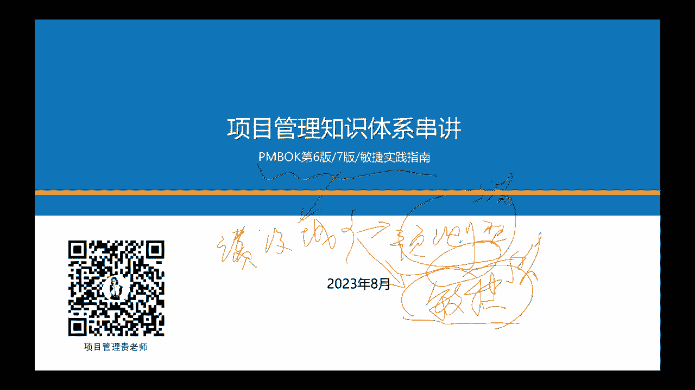
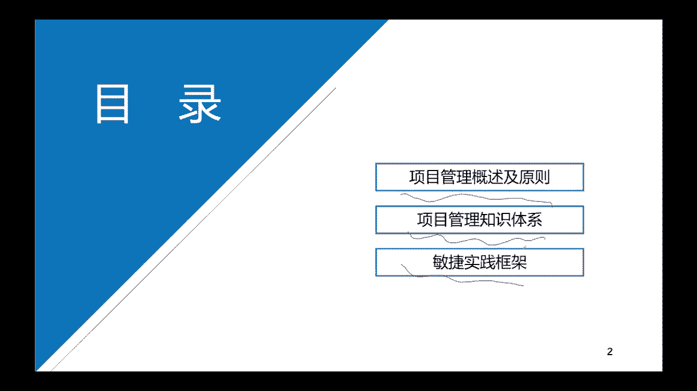
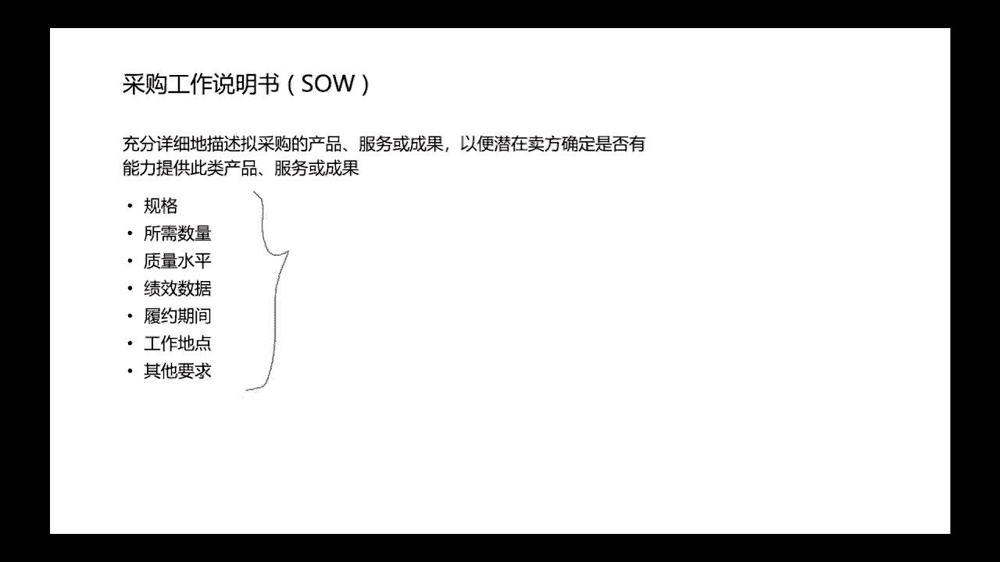
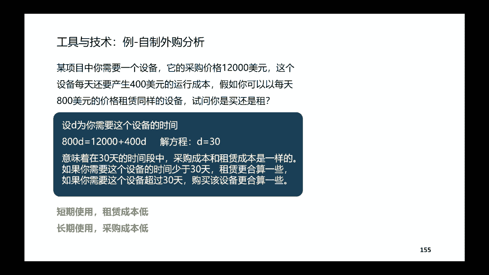
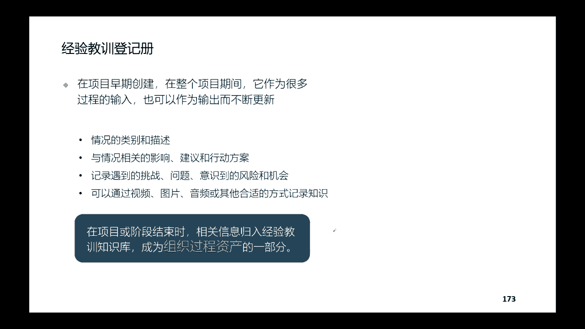
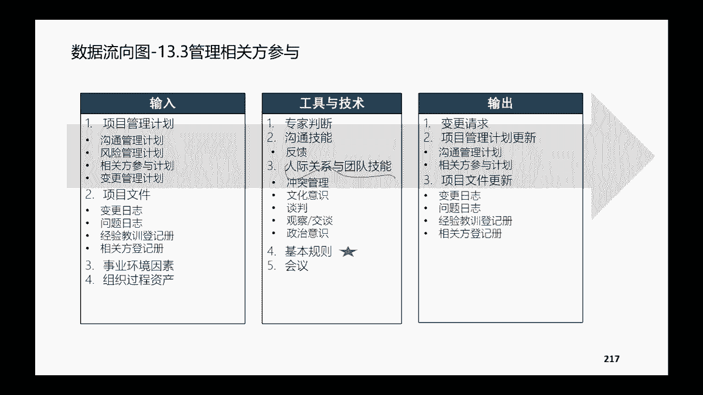
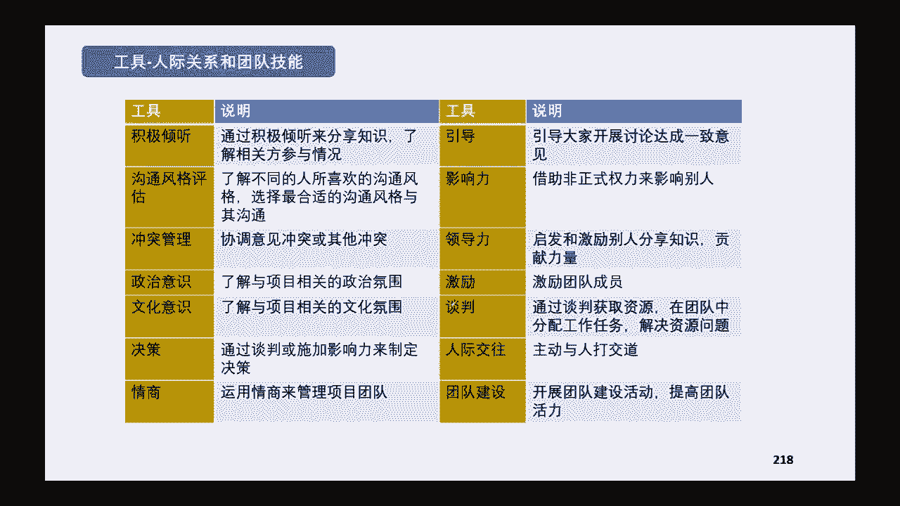
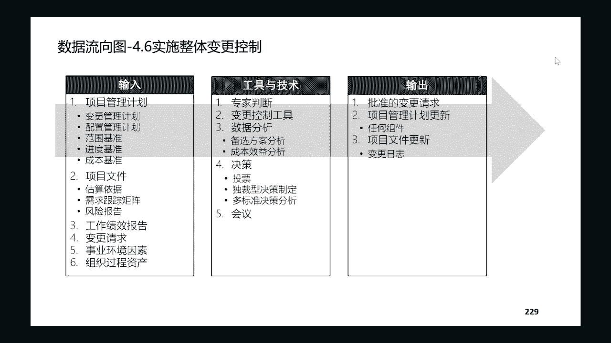
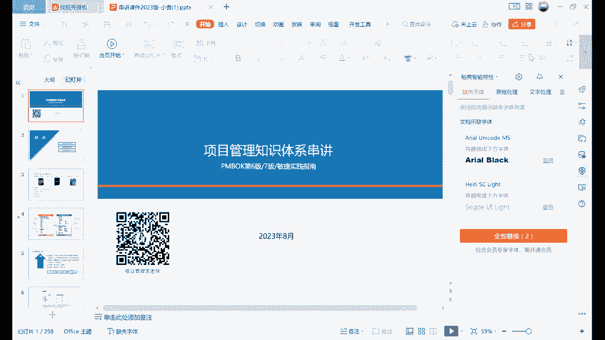

# PMP考试培训课程最新完整版项目管理认证第七版教材新版考纲自学教程 - P20：20.串讲1 - PMP专家 - BV1rM4y1Y79x

嗯我们今天晚上讲串讲哈，串讲的目的呢是为了让大家迅速的，把整个项目管理知识体系啊。

把他的整个框架在脑海中，建立一个完整的这样的一个图哈，所以呢今天晚上呢，嗯优势是可以帮大家串整个体系，这样的话你就不会觉得在自己脑海当中，项目管理的知识体系是散乱的点啊，就能连成线了，那么呃不好的点呢。

就是因为它是串讲，所以呢整个速度啊会比较的快啊，具体到每一个不同的这种章节的时候呢，嗯也不会像讲政课的时候，讲那么多的一些案例啊，所以呢大家这两个这个串讲，跟我们精讲的这个课程的区别要知道哈。

那我们串讲了他依据的这个书本教材，还是我们的第六版，第七版和敏捷的实践指南啊，那么整个这个逻辑呢，嗯我担心大家就是从这个绩效率的这个角度，理解的不透彻，所以呢我按照啊这个预测型的项目，单独的讲啊。

讲预测性的项目，讲完了之后呢，再给大家单独的讲敏捷和适应性的项目哈啊，是按照这种逻辑去给大家分布的，因为我们正课精讲的是按照绩效率，按照完完全全，绩效率完完全全按照基本的这个逻辑和分布，再跟大家讲。

每一个迹象语里边呢，它融合了预测性的，也融合了我们适应性的，不同类型的项目关注的点，所以在运输上一讲的时候呢，我是前半部分所有的这个内容都只讲预测性的，这样帮助大家更深刻的去理解预测性的项目。

他用到的工具和方法，然后讲完了之后呢，下半部分给大家单独的去讲这个面积好，也就是我们适应性的这个项目哈，因为在考试当中，预测的这个基础是50%了啊，敏捷的这个基础它也是50%。

但是中间会有一些这个混合的部分哈。

是这样分布的，先跟大家把这个逻辑结构我说清楚嗯，所以呢第一部分呢还是这个快速的过一下，项目管理的概述和基本当中提到的，项目管理的12大原则，然后第二个大陆的部分呢是项目管理的这个，预测性的知识体系。

然后第三个呢是讲这个敏捷度实践的框架，也基本是基于我们项目的教材推荐的。

这个书呢上课讲了哈，我们六版七版，还有民间实践指南，都是我们考试的一级的教材哈，所以上节课不是有小伙伴问到，说这个小程序里面题还六版的，要不要做嘛，当然是要做的哈，当然是要做的，为什么呢。

因为我们现在六版的教材，它永远是经典，他脱离不开的哈，所以对应的题目他也是帮助我们打基础的，也是脱离不开的，那既然做了这样的一个升级呢，嗯六版和七版的这样的一个这个逻辑关系。

我觉得还有必要跟大家花一分钟时间过一下哈，尤其是我们小伙伴，有些人他可能自学过六版，或者说呢在5月份的时候，他没有参加考试，但是已经学过六版的pm bok的这样的一个教材，那么应该很清楚。

我们600是按照十大知识领域和五个过程组啊，五个过程组来来去分布的，当然呢之前考纲没有更新的时候，考纲它也是按照这个五个过程组，按照启动规划执行监控，收尾，五个过程组去给大家出题啊。

那当然那个时候如果说考的好的话，就会得到5A，那现在我们考纲变了，考纲变成了我们说人员过程和商业环境，啊按照这三个领域来分布，所以现在你如果说PMP考的好，那么最好的成绩是3A哈，它就不是5A了。

是3A啊，那么第七版呢他不再有知识欲啊，实战知识欲这样的一个概念了，它就变成了首先我们做项目要有原则啊，要12大原则，在有一些项目它的开发方法啊，或者他的其他的类型不太确定的时候，我们要遵守原则。

以原则为准，然后再去找一些可以适合这个项目的，一些方法和这个指南，那具体要怎么去找这些方法和指南呢，啊起码告诉我们的知识体系，关注的是这些原来关注的是这个知识领域，现在关注的是这些绩效率啊。

该四人团队开发和生命周期规划和交付，然后呢从监控的这个角度，还有测量和不确定性，同时呢你看大家看一下这个第六版和第七版，第六第七版有一些增加内容，就是增加这两个模块哈，增加了裁剪模型，方法和工具。

这两个部分的内容呢是应该大家还是新鲜的，还是热的啊，裁剪呢就是告诉我们不同的项目当中，到底应该裁剪什么内容啊，才的步骤是什么，怎么去考虑，而模型和方法工具呢，是把所有项目管理体系当中。

包括第六版和敏捷实践指南的哈，所有涉及到的这些工具啊，这些技术，这些模型，这些这个涉及到项目文件都拿过来，再给大家做了一个汇总哈，当然书上的汇总他写的特别简单，他只有就是我课件上面跟大家展示的那些图表。

别的什么都没有，但是呢他有这样的一个汇总，新的一个信息哈，我也帮大家去做了一个这样的梳理，那600~700的为什么要做这样的一个更新呢，啊因为我们讲了六版的，它是更符合预测，更符合预测型的项目。

但是呢现在环境变得太快了啊，你要再遇到一个，像类似于像疫情这样的黑天鹅事件，那好多大大小小的企业都是措手不及的，所以面对这种迅速变化的这种环境，那我们做项目的时候呢，就不能像原来那样一板一眼啊。

死磕我的这个项目的框架，不能这样啊，我们要顺应环境，顺应整个时代的变化，所以呢七版做这样的一个更新，同时呢啊原来这个很多人就会吐槽说，我们考了这个PMP的这个考试之后啊。

很多小伙伴他还是啊完全停留在这个嗯理论啊，停留在纸面上面，时间的这个技能呢还是不强，当然我相信啊经过第七版的学习，仍然会有大部分的学员会存在这种情况，就是这是非常正常的，为什么，因为偏僻的考试。

它本来就是基于一个理论的知识体系，先把理论知识体系把它打基础，但是呢基本他有他的优势所在哈，就是如果你在实践的过程当中，你但凡带着这些理论去实践，你都会发现非常有收获，而且呢不会基于啊。

不会拘泥于六版当中的一些条条框框的限制，所以七版的教材你现在看，你觉得唉比较有指导意义，你过了几年之后啊，你过了几年你的项目管理的经验丰富了之后，你再回过头来看它还是非常有指导意义哈。

那么应对方法呢啊之前跟大家讲过，这就不说了哈，嗯考纲考纲呢应该反复的强调哈，这三个大的领域不同的比重啊，你看人员过程，还有这个商业环境，应用环境，然后考试的这个问题呢，如果不知道的小伙伴再重复一下。

我们考试一共有180个题目啊，180道题，但是呢每个人的考卷呢，它会有五个是属于这个随机性的，随机性的啊，这个预测性的，所以呢他会给你随机的抽掉，那么你剩下积分的就只有150道题，这150道题呢。

你要达到60%的合格率啊，达到60%的合格率，就啊可以去通过我们的这个考试，然后PMB的整个考试呢，它是不公布分不公布分数的哈，所以大家不知道自己具体是是110分的，还是120分啊。

只会知道自己每个模块是A还是B啊，还是说这个完全就啊就fire了，考试的时间是230分钟啊，还是比较比较长的这个时间，当然如果说大家做题的时候特别墨迹，那也没办法，如果为了更好的做题。

你至少要减去30分钟画答题卡的，涂答题卡的这个时间，那么有效的时间可能是200分钟左右，200分钟做120题啊，再减去一点检查的时间，基本上大家要保证一分钟啊，一道题，一分钟一道题这样的速度哈。

所以平时在训练的时候，就可以把自己的速度提升起来啊，当然考试的一些细节啊，在考前的时候，大家可以在这个巩固一下啊，这个睡好觉啊啊打好精神啊，注意力集中啊啊等等，然后解决的原则。

现在就可以先跟大家讲一下解的原则，抓大放小，不易纠结，我不知道大家做题的时候有没有这种感觉哈，有些题目呢你可能第一感啊，你觉得你想选那个答案，但是你反复的琢磨，反复的纠结，反复的去给他啊。

添加了你很多你自己的思想之后，你往往选出来一个答案就错了，我不知道大家有没有这种感觉哈，考试的时候抓大放小啊，你第一觉得他是考的是哪个知识点，考的是哪个，纪晓玉考的是哪个过程，那就是哪个过程。

然后呢在所有的选项当中定位一下这个题干，虽然说他每一道题啊，它英文占了一大部分，然后呢中文又占了一大部分，然后选项又占了一大部分，可能他的这个试卷整体有很多啊，我记得我们前几年的时候。

就是可能有个100几页吧，100几页一套试卷啊，这个题目稍微少一点，原来是200道题，现在是180道题，他可能也有接近接近100页左右啊，所以它一页呢他可能两道题或者三道题，这样的一个这个排布。

那有些人就觉得啊我我英文不看，我看完中文，我看完中文，看完那么多一堆的这个情景的描述，我就已经晕了哈哈会有这种小伙伴哈，所以呢我们在看这个情景的时候，迅速的把情情景当中的这些关键词啊。

关键的问句把它找出来，同时呢看完前景之后啊，明白他是说不怎么回事，还要把问题看清楚哈，有的时候他问的可能是A这种情况，下面项目经理应该优先做什么呀，啊有的情况有的他是问的是啊。

如果说事先你做什么可以避免啊，有的问的是你事后要做什么，对不对，你要把题目他问你问的到底是什么，把它搞清楚，然后再一点呢，就是我们解所有题目，不要去浮想连篇啊，不要自己给他加了很多臆想当中的一些条件。

然后呢这个分析啊啊纠结排除啊，排除也是我们可以用的方法，就是你在做，你把所有的选项都分析之后，你觉得所有选项都好像不确定啊，跟我们的知识点都没有挂钩啊，那你就一个一个排除，觉得哪个选项是错的。

他一定是错的，一定有个点是错的，你就把它排除啊，最后排除出来选一个，然后呢整个做题的时候有一些前后呼应的，还要自己学会去举一反三，后面这个劳逸结合，适当休息就不用跟大家讲了，大家也都这么大了。

还都成年人了，考试也考过很多遍，概述和原则里边，首先还是要简单的过一下我们的这个项目啊，项目600呢是说哎，我要生产出这些服务和结果啊，期盼的是要有商业价值都有效哈，然后项目管理是干什么呢。

项目管理是我把我所学到的这些知识也好，技能也好，工具也好，我用到项目活动当中来，然后以便呢，让我整个项目能够更好地得到它的可交服务，能够更好地实现它的商业价值啊，这个就是项目管理，那项目经理呢。

就是有组织委派来管这个项目的人，项目团队呢就是执行团队，然后运营呢它跟我们项目是相对的哈，项目交付成果出来之后，还会转到运营部门去进行重复性的，周而复始的，让这个项目的成果。

持续性的能够产生它的一些价值哈，那么成果呢很简单啊，是某一个过程或者某一个项目，它最终能够交付出来的这个东西，产品呢是可以量化生产出来的，然后项目组合呢是啊，一般是为了组织实现它的战略目标。

在一起统一去管理的这种项目，项目集或者子组合，或者运营整个打包在一块叫项目组的组合，那项目集呢他是说有不同的一些子项目，它们相互之间有一些关联，那么我们为了节约组织的一些资源条件啊，我们把这些项目啊。

把他的观念点啊协调起来一块来管，他跟项目组合的区别，项目组合是选择正确的项目来做啊，他是把有限的资源投入到有限的项目当中去，项目级的管理呢它是在一个项目集当中，好强调子项目之间的一些观点啊。

然后价值交付系统，价值交付系统呢它是我们公司哈，这或者说这个组织，它能够去实现他的战略目标啊，或者说做好他的业务的啊，一系列的这个活动啊，为了比如说为好，为了实现他的这个价值啊，实现公司的战略目标啊。

那么我们应该做哪些项目组合，项目组合当中呢应该包括哪些重要的项目，项目当中呢，可能会包括哪些不同的这个子项目，然后价值就是指的是某种事物，它的一些作用性，实用性或者重要性啊。

但是不同的该些人看待价值他肯定是不一样的，然后项目项目集啊，和这个项目组合以及产品的特征，我这儿给大家列了一个表啊，大家可以看一下，重点项目肯定是相对来说是比较短期的，项目集呢。

因为它是很多子项目组合而成的，它会是中长期的这样的一个这个持续时间，项目组合是为了实现组织的目标的战略目标的，它一定是一个长期性的，而产品呢它也是相对于我们项目来说，它是长期的哈，然后他的这个范围。

然后范围之前跟大家讲过这一页的，就是回头把课件发给大家自己去看吧，我就不浪费大家时间了，大家自己去看哈，然后项目的环境啊，我们讲了项目的环境啊，这个项目做的好不好，除了项目本身的这个框架之外。

还取决于它的环境对他的一些影响啊，那环境的一份内部的环境和外部的环境嗯，内部的环境呢以这个组织文化，组织结构和组织的治理为核心，然后外部的环境呢，以我们的这个整个这个监管环境为核心，组织结构啊。

具体来讲呢我们啊有这个职能型的啊，有矩阵型的，然后呢也有这个项目型的，以这么几种为代表，那么职能型的呢，他是说在一个项目当中都是职能部门来负责，如果说一旦出现项目的话，会交给某一个职能部门去兼职啊。

去兼职承担项目经理的这样的一个这个角色，当然职能型的既然是兼职啊，他要过部门的事，他要管项目的事，那所以对于项目本身而言呢，那他的这个决定权啊就会相对的这个小一些，那对于矩阵型的项目而言呢。

是说我们既有啊项目经理的专职，应有的职能经理的这个专职，但是呢举证又分了强举证和逻辑专强举着呢，他的项目经理是全职的哈，是全职的，所以呢在这个强矩阵的场景之下，项目经理的权利呢还是相对还是比较高的。

但是对于弱举者而言呢，项目经理他只是有这样的一个职务存在，但是呢他也是一个兼职，他要去调动一些资源，他也要去请示职能经理哈，其实这个时候管事的还是职能经理，那么项目导向型的，我们叫项目型的，项目型呢。

它里面就是就是一个组织啊，完全以项目为主，不同的项目组有不同的项目经理，项目经理直接向高管啊，向总经理或者副总经理去负责，那这个时候呢项目经理他就是全职了，而且呢。

所有的项目的这个决策权都在项目经理手上哈，记好这几种，然后最后呢还有一个pm o吧，写在这儿的话，PMO呢一般它是嗯，但凡是项目管理体系稍微成熟一点的公司，都会有这样的一个部门，都会有这样的一个部门。

但这个部门可大可小哈，这个部门它的目的呢就是为了去啊，帮助组织搭建更好的项目管理体系，帮助组织去实现更好的去实现啊，组织的一些战略，一些重要的项目的管理啊，或者是一些日常这种项目的这个优。

势的一些体面啊，项目经理的一些培训啊等等，要承担这样的一些职责，好嗯我们说人员非常重要啊，所以我把这个不同的项目管理当中不同的角色，他的职责跟大家列了一下哈，首先我们项目经理的主要职责。

项目经理的主要职责呢啊领导团队组织资源，获取这个资源，跟其他项目进行谈判，然后呢要负责带领团队去做好，整个项目的过程当中的知识管理，要领导团队做好计划，并且能获得相关方的一些批准。

要负责具体的执行的管理啊，要参与到如果有偏见，如果说有条件的话，去参与到商业论证的一些制定啊，在发行的指导下制定项目章程获得批准，而与其他的这个项目组合经理或者项目及机密，如果说有的话。

配合他们积极的开展这样的一些互动的性行为，然后PMO的职责呢，它主要是管理公司的多个这个协同的项目啊，他不管具体的事啊，但是呢他要从整个公司的大层面呃，整个项目的大层面啊，去提炼大成大项目的这些啊。

合资的一些框架为每个项目提供帮助和支持啊，给他们提供一些模板啊，协调一些资源，协调这个冲突资源，然后呢对各个项目组的这个绩效进行考核，然后呢嗯不同的这个PO呢，它又分了不同的类型啊。

知识性的呢是一般只会提供你一些模板，给你做参考，控制型的呢是重要的这个节点啊，他会去负责指令型的呢，基本上就是pm在管哈，让你做啥你就做啥，然后发起人的主要职责，第一啊他既然发起项目。

他要负责给项目找资金，第二呢他还要去负责去签署签批项目章程，选项目经理去给他授权，那还要组织项目，其他的职业人员去开展商业论证，并且呢，项目经理如果说有什么超越了他的职责范围，之类的呃。

职职职责之外的这些事情他解决不了的，那么要找发起人去协调，发起人有这个义务去帮助他解决，同时呢项目如果说有一些重大的一些变更，都会在变更控制委员会里边，然后职能经理有什么值得呢。

职能经理首先啊你既然是公司的职能，那么公司各项目的基本信息需要你去配合的，你需要知道啊，并且呢要有义务去给项目提供一些资源，提供一些支持，需要相关的一些职能啊，这种帮助和服务的要去提供这样的服务。

当然你提供服务的是事后，是按照整个你部门或者是整个这个公司，他的一些相关的规则制度哈，帮助项目经理更好地达成一项目标，高管有什么职责呢，高管首先项目有一些高层次的一些决策啊，这个高管是要参加的。

其次呢负责的啊，负责这块项目或者这块业务的这个高管，要参与到我们CCV里边，有一些超越项目经理权限的这些变更等问题，他要去负责去处理，然后同时呢如果说我们有项目组合的话，那么项目组合一般是高管参与管理。

组织战略管理，组织级的项目的管理啊，都是高管在负责，然后呢高管它是在我们项目的治理结构当中的，所以呢他还要帮助整个公司啊，形成比较好的项目管理的文化，要领导整个公司变革，优化公司的这个项目管理系统啊。

并且呢要参与到我们核心的这个商业论证啊，做出自己的一些决策，然后它的啊，前面我们讲的是他的这个内部的环境哈，那我们web的环境，外部环境我们主要讲的他的监管环境，那么监管环境呢。

主要是要注意项目各方面的一些啊，合规的要求啊，法律方面的一些合规啊，监管方面的一些规定啊，啊行业的准则啊，国际上面必须要遵守的一些条约啊，项目的章程制度啊，啊项目当团队当中的一些这个规则规范呐。

啊这些都是我们要遵循的六类合规哈，六类合规，那么为了做好这个合规性的一些要求呢，我们讲有一些这个活动啊，有一些管理活动啊，制定制度啊，风险的识别啊，合规性的一些审查呀，责任的追究啊，啊考核的一些评价呀。

合规性的一些这个培训啊，这些都是我们围绕着项目合规要去做的，一些工作内容哈，然后项目管理的12个原则，项目管理的12个原则呢我们讲了，首先从人的方面，我们要成为勤勉啊，要尊重，要关心他人的一个管家啊。

你要从组织的这个层面帮助把帮助组织，把这个项目把它管好啊，要诚信，要正直，同时呢嗯还有，还要展现领导力行为，然后有效的去领导该些人去参与啊，同时呢还有去营造协作的项目团队环境，这几个都是跟人啊。

跟人相关的，那对于项目本身而言呢，我们要聚焦于项目价值啊，聚焦于项目价值，同时呢要识别啊整个项目的这个交互系统啊，因为项目我们一直在强调，你如果说要做好项目管理的话，你需要有这样的系统性的思维啊。

在做项目的过程当中呢，你还要学会啊，去把质量融入到可交付成果当中来，同时呢还要去拥抱它的整个适应性和变革，那从项目的整个这个大的这个，环境和方法而言呢，我们要对环境进行，我们要换一种吧。

我们要对环境进行裁剪啊，我们要驾驭项目的复杂性，有一些风险，要优化风险应对，同时呢如果说这个项目需要啊一些这个变革，那我们还要去驱动整个组织的这个变革好，所以从三个角度去理解项目的12个原则。

人的方面啊，项目本身的这个方法方面，然后呢项目的web的环境方面，好具体这个12个原则是什么呢，啊我这就不跟大家去这个一一的去细讲了哈，变革的模型，变革的模型呢嗯上节课才跟大家去讲过哈。

讲模型的时候模模型方法，弓箭的时候才讲过这些不同的这个模型，它分别是什么样的状态啊，他接他是这个那个核心的内容到底是什么，然后这个是复杂性原则，复杂性原则也跟大家去讲过哈，肯定分的框架。

然后呢太息矩阵啊，裁剪，项目的生命周期跟大家说一下哈，项目的生命周期啊，一般而言从项目的可行性研究阶段，也就是进行我们的商业论证的这个阶段啊，确定这个项目是不是值得做，然后呢进入到设计阶段啊。

设计阶段呢，就是我们也可以把它叫做规划的阶段哈，通过规划分析，然后呢啊来规划我们可交付成果啊，需要做哪些工作，然后到构建阶段呢，就变成了具体要做的执行了，这个层面包括测试。

也是在我们工作的这个执行层面做完了之后呢，要去部署啊，部署呢就是把我们的可交付成果投入去啊，具体去使用，然后到最后收尾阶段呢，要去嗯做项目的整体的验收啊，要做好相应的一些知识的更新啊。

组织过程资产的一些更新，那常见的四种生命周期模型呢，啊一直反复的在跟大家讲哈，如果说它的范围啊，进度成本都是非常明确的，那我们说这种呢啊是一次性的交付的，我们有预测性的开发方法。

它对应的是预测性的生命周期，那么如果说啊，他的如果说他的这个需求不太明确，但是呢技术相对比较明确，那这个时候呢它我们可以多次的去交付，用增量型的开发方法啊，做完成果交一部分，做完成果再交一部分啊。

最后汇总出来是整个完整的可交付成果，那这种呢，它对应的生命周期是增量型的生命周期，那对于需求啊它不太明确，但是呢技术呢它更不明确啊，这种呢我们可能用迭代型的，用迭代型的一一次又一次的迭代。

它的这个技术啊，这种呢对应的是迭代型的生命周期，那对于需求非常不明确啊，技术也非常不明确呢，这种呢它既有迭代的特征，又有增量特征，我们用敏捷型的开发方法啊，强调是频繁的这个频繁的交付。

那这个时候呢是适应性的生命周期啊，也叫敏捷性的生命周期，预测性的方法和这个适应性的方法啊，包括这个你按照四种基本的生命周期，去对比他们的一些不同点，预测型的需求是开发就确定了，然后现在是已经确定了。

我们要做好这个比较详尽的计划，计划做的这么详尽，我们当然是尽可能的去避免这些变更，然后关键的相关方呢，是在我们里程碑里面去参与迭代和增量型的，我们把它跟敏捷型的一块来看啊，这种需求一般都是不太稳定的。

它会频繁的变化，既然是频繁的变化，我们就要拥抱这种变化，所以说变更是随时可以进行的，关键性方方要持续的去参与哈，好这个是风险的原则，应对风险啊，这个是拥抱适应性和韧性啊，这些原则嗯。

大家去知道它是哪些原则就OK，然后12个原则的关键性，刚刚其实已经跟大家讲了啊，从人怎么样啊，从项目的这个这个方法交付怎么样，然后从项目的这个面对环境怎么样，然后知识体系呢。

首先啊我们讲预测型的这个项目，预测型项目呢，它就是很标准的把项目分了五个大的过程组，启动阶段应该干什么，规划过程组应该干什么，执行过程组应该干什么啊，监控过程组应该干什么，收尾过程组到底应该干什么哈。

我们来看这是第六版当中的一个核心的，这个框架哈，这也是我们预测型项目的核心的框架，从五个过程组啊，横渡边是五个过程组，纵坐标是什么，指示领域，这十大知识领域呢啊，是平均的分布在每个过程组里边儿啊。

大家可以看一下规划过程组里面占的这个项目，占的过程是最多的哈，所以为什么一直在说预测性的项目，它很强调规划呢啊当然也有人说好的项目，好的项目成功，如果说你规划规划的详细，那你就项目意味着成功的一半啊。

是有它一定的道理的，是有它一定的道理的，同时呢在监控的过程当中啊，也做的是这个设计的过程也是相对是比较多的，为什么呢，为什么呢，因为我们预测性的项目啊，做了这么多规划，那么在执行的时候按部就班去执行啊。

做好管理，做好沟通啊，做好获取资源，那同时更重要的是你要去监控啊，它的整个这个范围啊，进度啊，成本啊，质量啊啊，是不是在符合我们规划的这些梦想，所以规划当中他设计的子过程也会比较多。

那启动过程和收尾过程中涉及到的相对少一点，不是说这两个过程不重要哈，不是说不是这个意思，而是说这两个过程对于项目经理而言，太参与的就会相对会少一些，为什么，因为在启动过程组当中制定章程之后啊。

其实你那个时候项目经理，严格来讲项目经理他的职责他才刚刚开始啊，到收尾的时候，更多也是我们商务去辅助啊，甚至到社会过程当中，很快就过不了运营啊，过不了运营的这个阶段，那么启动过程组呢。

它包含了最重要的是两个过程哈，就是制定项目章程和识别相关方，制定项目章程的核心呢，我们要知道啊，他的输入就是商业论证，然后输出就是这个项目章程，项目章程里面包含这些内容哈，高层次的这些框架啊。

大家可以自己去看一看啊，这有示例，大家自己去看，然后我们要知道项目章程呢，它是我们的项目的执行组织啊，和项目的这个需求方正式建立，这种啊合作伙伴关系的一个标志含义，它也就是我们项目立项的标志。

所以呢项目章程批了之后，一是意味着这个项目正式启动了项目章程啊，它是来用来去证明项目的这个项目经理的，所以项目之所以项目章程里面呢，它会有一些主要的可交付成管啊，以及这些里程碑啊啊。

以及核心的这些项目参与的一些这个决策，要理解项目章程是为了应对哈，大家考试的当中，万一遇到一种题目哈，他会告诉你啊，什么时候啊，这个项目经理什么时候去参与，或者说嗯这个有人质疑。

你说为什么你有这样的权利啊，啊你就要把项目章程啊，把你下的文件给他看，你看这个章程里面批准了，我为项目经理，对不对，所以要知道项目经理他呃，所以要知道项目章程它是干什么用的啊，它的作用是什么。

然后输入呢，主要是他的这个商业论证的这个文件，这个课堂上跟大家讲过哈，商业论证文件，商业论证文件呢，大家可以把它简单理解，就是我们的这个可行性研究报告哈，然后他的选择指标，这个是上课的时候跟大家讲过啊。

期限值和内部收益率是我们的动态指标，投资回报率，效益成本比和回收期法是我们的这个静态指标，公式，在课堂上面都跟大家讲过，可以回过头再开始再去看一下，然后这个例题例题我们今天晚上就不讲了吧。

啊例题这个是B哈，答案是B，大家自己下去之后看，然后识别相关方啊，适配相关方，最重要的是它的一个这个输出，有一个相关方的登记册啊，我们也叫干系人的登记册哈，那么相关方的分类啊，跟大家讲过三个全景图。

最核心的是我们项目经理和核心参与的，项目管理的这些团队，以及呢我们项目执行团队，然后呢，包括第二层是我们组织内部的治理机构啊，项目管理的办公室啊啊，还有一些专家委员会啊，指导委员会。

第三层呢是我们外部的核心的啊，这些供应商啊，也比较建议大家按照这种逻辑去识别相关方，识别干系人，那该系人整个他参与的过程呢啊，识别出来要理解和分析，然后呢理解分析完之后要做优先级排序啊。

要制定参与办法啊，要去监督这些参与方法是否是有效啊，是否有需要变动，理解和分析，该系人呢我们可以从这些维度去考虑哈，考虑他的权利，考虑他在这个项目当中的一些作用，考虑他对这个项目的不同的这个过程。

他的一些态度啊，他对这个项目的信心，对他的信心，他对这个项目的期望啊，他对这个项目的影响力啊，他的期望跟这个项目他的这个年轻性紧迫性，他在项目当中可以取得什么样的一些利益啊。

同时呢也包括他跟项目互动方面，有什么样的一些特殊性的一些要求，然后分析完了之后呢，有一些展现的这个方式哈，我们讲了有这么几种，五种基础的权利义方格或者权利，影响风格或者作用影响方格。

这些都是一些二维的哈，考虑两个因素，如果考虑三个因素呢啊可以用这个立方体啊，既考虑他的利益，又考虑他的这个影响啊，又考虑他的这个权力大小，有考虑他的这个影响，然后凸显模型。

凸显模型呢是考虑它的权益紧迫性和合法，三个固定的输入维度，影响方向是考虑这个项目啊，这个相关方它的影响，我们是对上管理还是对象管理，还是向外还是横向，那优先级排序是按照我们的分析完之后啊。

按照一定的逻辑去给这些相关方，排一定的优先级顺序嗯，全定义方格，二维的当中呢，我们以权利利益方格为为这个重点哈，因为这个是经常考权利利益方格当中呢，他考当然是考的比较简单啊，权力比较高。

这个逆也比较高的，是这一类，我们重点管理权利比较高，利益比较低的，我们立即满意啊，权力比较低，逆也比较低的，我们啊这个监督他啊，防止他对我们扯后腿，使绊子就OK，那权力比较低，命运较高呢。

我们有义务去告诉他，随时告知他的一些进展，同步他的一些进展，然后相关方立方体呢是考虑相关方对这个项目，它的作用，而它权益的大小，以及呢它能够实施的这个明显的大小，那么当然对于权利大，利益大啊。

这个影响大，作用都大的，这些我们肯定是最核心最重点去管理的，破解模型呢按照他的权利啊，紧迫性和合法性啊，把这个相关方分了七种不同的这种类型哈，最值得去管理的就是我们他又有权利，有资格啊。

又比较紧迫的这种好，这是我们启动过程主要做的，主要就是制定章程啊，任命项目经理，然后呢去识别相关方，为什么启动过程要识别相关方啊，是因为相关方啊，干系人啊，我说这两个词大家要能够直接把它划等号哈。

是因为这些干性人他尽早的识别，能够帮助我们尽早的去规避一些风险啊，因为他的章程里面会有一些高层次的这种啊，需求高层次的一些这个项目的主要内容，可交付成果，对不对，那可交付成果和需求来自于哪里呢。

来自于干性人哈，所以我们尽早去识别它会比较好一些，到规划过程组呢，规划过程组啊，它是包含了24个子过程，分别是我们要把这些管理计划，把12个管理计划把它做出来，同时呢还要把我们的这个四个基准。

上次是不是刚跟大家讲过基准呢啊，范围进度成本和我们绩效测量基准，要把这四个基准把它确定下来，同时呢在这个时候一定要有这个根据我们章程，要把我们的生命周期和开发方法的计划，把它确定下来哈。

嗯那涉及到的一些项目文件呢，在这个过程当中也会比较多啊，比如说活动清单，那活动属性啊啊等等啊，啊这个包括资源呢，它都是围绕我们的项目管理计划来的哈，项目管理计划会出来，项目文件相应的也会出来哈。

然后一个一个来讲吧，嗯首先是这个规划范围管理啊，我们讲十大知识领域，按照过程，按照顺序来，首先讲范围范围的规划，范围管理呢，它输出的是范围管理计划和需求管理计划，范围管理计划呢。

它主要是告诉大家应该怎么去定义范围，怎么去制定啊，怎么去监控，怎么确认啊，怎么去控制整个项目的范围，包括怎么去制定项目的范围，说明书啊，用什么样的格式啊，啊谁去负责做呀，怎么样去创建WBS啊。

WBS用什么样的这个结构呀，啊分几层啊，啊这个工作包具体到细化到哪个，这个工作小时啊，啊多大呀，怎么样去确定啊，或者维护范围的基准呢，啊范围超多少之后我们可以允许啊，范围超多少之后我们不能允许啊。

怎么样去验收，谁来负责验收，已经完成了这些可交付成果，他们的验收标准怎么去制定呀，这个是范围管理计划里面啊，释放和关系计划里面去做的一些这个事情，规定的一些指南，然后需求管理计划呢。

它主要是唉怎么去跟踪啊，怎么去规划我们的这个需求活动啊，比如说怎么去收集需求啊，怎么做需求评审啊，谁来负责做呀，啊配置管理活动怎么启动变更啊，啊审批权限呀，需求优先级啊，怎么去排序啊，这么多需求对不对。

谁的需求排在最最核心啊，测量指标啊，这些需求的测量指标怎么确定啊，然后呢啊这么多需求，哪些需求是列入到我们的需求跟踪矩阵里面，重点需求管理啊等等啊，需求管理计划里面是面临这些内容嗯，然后收集需求。

这是收集需求之后呢，它的这个工具和技术就比较重要了哈，头脑风暴啊，访谈焦点小组啊啊包括名义小组啊，这个引导啊，观察呀，这些都是我们去收集需求的时候用到的技术，这个是作为一个重点。

然后说出的就是需求文件和需求跟踪矩阵啊，需求跟踪矩阵呢知道给大家列了一个示例哈，需求有哪些啊，它的描述啊，排序分类来源，它跟我们的项目标有什么样的关系啊，它对应的可交付成果是什么，如何去检验它。

如何去确认它工具和技术呢，嗯数据收集类的有这么多，然后文件分析啊，决策和可视化的这个方法，然后还有团队的一些方法，团队一些方法，其实它也是数据收集方法哈，然后还有一些其他的这个方法。

其实上节课嗯刚讲过这个方法，所以呢大家应该对这些词都不陌生哈，对这些比如头脑风暴啊啊比如说这个清河小说，明小说都不陌生哈，好我们一个一个简单过一下，首先标杆对照法，标杆对照法我们讲过标杆标杆。

你要先找一个这个可以对标的这种项目啊，然后呢再根据这些项目去找它，对标的这些相应的一些属性，然后呢再找数据进行比对，最后形成一些方案，焦点小组呢简单理解哈，就是把啊这个围绕这个焦点。

邀请一些主题专家来讨论啊，这个就是焦点小组，所以大家看题目的时候要迅速哈，如果告诉你个事务，邀请了相应的这个主题专家来讨论焦点小组哈，问卷调查，问卷调查呢啊一般他啊如果说场景给你的是。

比如说这个地理位置很分散啊，啊或者是你的这个人员设计众多，你要很快的要完成这个调查呀，那你这个时候用问卷调查可能会比较的迅速，比较节约时间，然后清河图啊，清河图呢主要是这个归类哈，主要是归类啊。

然后名义小组，名义小组呢它主要是投票啊，投票排序，首先大家所有的人啊组合成一个这个小组啊，当名义上的小组哈，不是真正的小组，大家呢去啊根据他的对这个需求啊的一些理解，或者说他的有一些什么样的需求。

他去提，提完了之后呢，大家再去通过啊投票啊，投票，把最好的最有创意的这种想法，这种需求把它排出来，然后选择前面几个排序比较高的啊，思维导图，思维导图呢，一般这个大概大家用这个SM的用的比较多哈。

所以呢思维导图应该都比较熟悉，比较陌比较不陌生哈，啊你看这个时候举的一个例题啊，你看关键词我告诉大家怎么抓哈，位于许多国家，然后呢他要嗯收集详细需求怎么办，你看许多国家想一定要收集。

你要快速收集详细需求，这显然就是我们的问卷调查，它的核心特征是不是，所以你看做一个题好像十秒钟都不要，是不是好决策角色呢，我们又分了一致同意大多数同意，一致同意就是百分之百所有团队成员都同意啊。

所有项目团都同意，大多数同意呢是嗯超过50%的，相对多数呢是没有超过50%，但是呢啊这个有不同的这个决策的结果啊，然后还有多标准决策分析，多标准决策分析呢，它是指哎你用不同的这个标准啊。

不同的这个标准分别啊都考虑，不是说A成本越低越来好啊，还要综合考虑他的时间资源，不确定性和风险水平啊，然后呢给每一个这个标准可能给他一定的权重，最后呢我们用得分乘以他的这个权重，算出他的这个总分。

比较一下，看看哪个方案更好，OK前面是收据序，收集序修完了之后呢，我们要定义范围，对不对，定义范围呢最重要的是他的这个输出哈，范围说明书，范围说明书啊，它里面呢它就会有具体的项目范围是什么。

可交付成果是什么，假设条件和质因素啊，还有呢有一些除外条件除外的啊，哪些哪些内容是不包括在这次项目范围当中的，然后呢啊这个就重点看这些产品范围描述，可再不成果，验收标准和除外责任啊，重点就是这四类嗯。

对比一下项目章程和项目范围说明书哈，你看项目章程里面呢，他除了这个嗯标准和高层次需求和可交付成果，他这些也会有，但是呢它都是一些高层次的，而项目的方法说明书呢，它就是一些详细的范围。

详细的可讲发生过详细的啊这个验收标准，详细的项目的这个啊，职业因素和这个除外的一些责任，而项目章程里面都是高层次，同时呢项目章程里面除了跟范围相关啊，他还有跟风险进度，财务啊等等。

核心这些资源相关的这一限定的东西哈，所以大家要区别好啊，要区别好这两个不同的文件，它到底有什么样的不一样，有什么样的观点，然后呢到了创建w vs哈，你既然看过说明书，有了，你就要把放说明书，把它拆解。

把它拆解成工作包，对不对，拆解成工作包出来的就是范围基准了，所以范围基准是不是范围说明书呢啊，还不一定好，因为范围基准呢它包括的范围说明书，它也包括了我们的WBS，你看它包括了WBS啊。

当然WBS配的都有WBS词典啊，要解释一下，然后呢还有我们的项目范围说明书，他们三个在一起构成了我们的范围基准，那WBS呢怎么去做啊，我们讲过几个不同的实例，首先呢是把项目的阶段啊作为第二。

作为第二层啊，从项目的管理啊，啊产品需求啊啊这个详细的设计啊，构建啊啊包括这个测试啊，按照项目的不同的阶段啊，区分包括哪些工作内容，然后第二个呢也可以把主要的可交付成果啊，作为第二层。

再去往下分规划进度管理哈，嗯上面就是我们规划过程当中的这个范围哈，那么下面呢是我们规划过程当中的进度，规划，进度管理的最重要的是进步管理计划，进度管理计划里面呢它包含的内容就是这些啊，指南。

然后定义活动啊，定义活动呢最重要的是他的这个输出啊，输出了活动清单，活动属性和你成为这些清单，然后活动清单呢他是说我们做了这个项目啊，有那么多的工作包，对不对，那每个工作包他具体要做的这个动作。

做的活动到底是什么啊，把它列出来，这个是活动清单，但是活动清单呢它会对应着活动的属性啊，活动的属性呢是代表的是这个啊项目，他比如说这个活动，他的紧前活动是什么，紧后活动是什么啊。

这个活动他最早什么时候开始，最晚什么时候开始啊，他的提前量和知乎量啊是什么啊，是要把这些属性把它列为，然后你成为清单啊，你成分清单呢，是说在我们这些项目的重要的节点啊。

在里程碑里边它反映的是什么样的一个啊，这个项目的要求，或者说要体现什么样的一些进展，或者说体现什么样的一些信息，好排列活动顺序，最重要的输出呢是啊，你既然把活动顺序都已经排出来了。

那你要输出他的经过网络图进度，网络图呢你要说出它，你要理解啊，不同的这个活动它有一些啊这个关系啊，比如说从完成到开始啊，开始到开始完成了完成了啊，你完成了我也完成了，或者呢开始到完成啊。

大多数情况下可能就是完成都要开始了啊，当然有一些这个呃，它也有一些这个提前量或者滞后量在里边，然后提前量过之后量产，就是我比如说哎我完成这个呃，这个我工作清单啊，同时呢在我提前两周啊。

我不是等它完全完成了之后，我才开始建筑的这个划分，我提前两周我就已经开始做这个工，做这个这个工作了，然后之后我撰写草案和编辑草案好，我明明是撰写草案开始了，我也可以编辑草案，但是呢我为了让这个编辑草案。

有更多的这个依据啊，我撰写了之后，我我等15天啊，等它相应的这个资料再丰富一点之后，我再正式的编写，正式的开始编辑工作，编辑这个草案对不对，所以这个提前量和智慧量就是一个这个活动，相对于他的金钱活动。

它能够提前多少，或者说它能够推迟多少好，这有不同的这个啊这个这个例题啊，这个例题大家自己去看一看哈，然后估算活动时间啊，估算活动时间呢，最重要的是要理解他的，这个估算的工具和技术啊，首先是类比估算啊。

这个大家应该也还是热乎的，上节课刚讲啊，类比估算，就是我们原来类似有相应的这些历史数据啊，有相应的一些活动，我们可以去对照去参考一下，然后参数估算呢是基于历史的这个数据和项目。

参数可以用某种算法来计算出来的，这个是参数估算，然后三点估算，三点估算，上节课跟大家讲啊，三点估算也是多点估算的一种，三点估算呢我们首先要知道是哪三点啊，他要告诉我们最可能的这些时间，最乐观的时间啊。

最悲观的时间，那3。3点估算的有两种模式哈，一般我们考试当中默认的就是贝塔公式啊，这是最可能的啊，加上啊不是最乐观的，加上最悲观的，然后加上最可能的除以四啊，加在一块再除以六哈。

这个是我们的这个贝塔故事，当然如果万叶题目给了你，他让你用三角公式去算啊，那更简单啊，就三个一相加除以三，这例题大家也自己去看啊，然后啊制定进度计划，制定进度计划呢，我们最重要的是啊要用关键路径法啊。

和这个资源优化啊，还有这个进度压缩啊，去把这个路径，把这个进度基准进度计划图去把它调整，调整出来，它的输出最重要的是进度基准哈，那么嗯它的这个展现方式，就是我们的这个横道图啊。

横道图呢有一些详尽的一些这个进度计划，也有一些粗略的进度计划，当然我们实际在项目过程当中，一般都是用的详尽的进度计划，然后关键路径法呢有这个顺腿法和这个逆推法，然后这个嗯我们要理解用关心动静法的时候。

要理解这个总浮动时间和自由浮动时间，总浮动时间呢是说啊在这个活动啊，你去推迟它，或者你去提前它，它不会影响整体的项目的这个工期啊，这个是总浮动时间，既有普通时间呢是说你这个活动啊，你提前或者推后。

它不会影响他的颈后的活动啊，后面这个活动不会受他的影响，他可以自由活动来接时间，然后这里有一个议题，大家自己去看哈，资源优化，资源优化呢分了两种啊，资源平衡和资源平滑。

资源平衡呢是说在资源的需求和资源供给之间，取得平衡哈，所以呢资源平衡一般情况下，它会影响项目的这个关键路径，而资源平滑呢它是在项目内部啊，它不存在需求和供给之间好的这个限制，它是你说了是几个资源。

它就是这个资源它不会突破你的这个供给，但是呢他在你的不同的这个活动当中啊，他把资源相对来说去平滑去调用一下，所以呢他这种一般不会改变你的关键路径，好这个平衡和平滑之后的这个具体的场景啊。

大家对照这个模型再去看一看，然后进度压缩，进度压缩也分为两种工具哈，赶工和快速跟进，那赶工呢，一般情况下就是投入更多的一些资源啊，加班也好啊，投入更多的人也好啊，啊去去把这个时间去把它压缩。

去把他赶回来，那既然是赶工，他一般呢它会导致一些成本的一些增加啊，快速跟进，快速跟进的，一般情况下它不会导致他不会要求你多加人，但是呢他会把不同的活动去把它定型啊，当然如果说是并行。

它相应的这个风险还有可能会增加哈，所以大家注意我的关键词哈，赶工它的缺点是成本增加，快速跟进，它的缺点是风险增加，啊这是剧的这个对应的场景，大家也自己去看看，例题也不讲，然后固化成本管理。

最重要的是输出成本管理计划，成本管理计划呢啊，比如说啊这个成本他用什么计量单位啊，它的精确度啊，啊他的这个报告格式啊啊等等绩效测量规则呀，啊所以它主要是记录这些东西，然后估算成本啊，估算成本呢。

最重要的工具储备分析和质量和成本，然后输出呢是啊，成本估算和依据和这个估算依据嗯，质量成本具体是哪些呢，这个上节课还跟大家讲过啊，所以大家自己去看哈，一致性成本非一致性成本啊，一个是花钱避免失败。

一个是已经失败了，你花钱去弥补，然后储备分析啊，储备分析的主要是评估我们这个项目，它啊要储备多少时间啊，要储备多少风险啊，怎么去这个储备他的这个成本啊，成本当中又分了一级储备和管理储备。

然后估算的依据啊，估算的依据呢主要是啊，主要是这个我们这些成本它是怎么去估算的啊，你的依据是什么，就告诉我们成分是怎么编制的，然后呢估算的区间说明啊，我们这个估算它是精确到哪个地方啊。

它的这个区间正-百分之多少，嗯制定预算，制定预算呢，重要的输出是成本基准哈和项目的资金需求，然后用的工具是资金限制平衡，整个预算的这个构成啊，预算的构成，首先我们他这个就比七版的这个还要详细哈。

这是六版当中图，给大家放到这张图，然后这样子呢首先我们有每个活动啊，有活动成本，具体活动他要花多少钱，有成本估算，然后同时呢为了这个活动能够顺利进行，他有一些应急储备，应急储备呢啊。

一起他是加在工作包的这个成本估算，但同时呢还有一些他没有对应到基本活动上的，我们还给他留了一心的一级储备，整个应急储备加上我们工作包的这些成本，构成了我们的这个成本的一个基准啊，构成我们成本基准啊。

他是跟我们控制账户去关联的成本基准，加上我们没有办法去控制的管理储备，共同构成了项目的整体预算哈，好规划，质量管理，规划质量管理呢它的重要工具是质量成本，刚刚讲了嗯，质量成本我说过这个工具讲了哈。

然后他的输出就是质量关系计划和质量，测量指标，质量管理计划呢诶他都列为了质量，谁来管呢，角色职责呀，用什么质量保证方法呀，质量控制方法，质量提高方法呀，啊把这个方法去把它列明，然后呢还会有过程改进计划。

过程改进计划呢，就是在我们这个质量控制的过程当中，质量管理的过程当中啊，会涉及到什么，这个过程过程怎么去测量啊，这个改进如果有什么问题，他改进的目标和改进的方法到底是什么。

质量测量指标就是相应的告诉我们，在不同的这个项目当中涉及到的可交付成果，它具体它对应的这个测量指标到底是什么，测量哪些部分测量哪些内容，测量的方法到底是什么，然后规划资源管理最重要的了解它的工具。

责任分配矩阵，输出是质量，是资源管理计划和团队的章程，资源管理计划里面呢又分了人员怎么管啊，和实物怎么管，它最重要的就是从分啊，从分类分配到管理啊，到释放啊，所以呢人就涉及到从哪来啊，怎么怎么建设啊。

怎么去管理啊，怎么去这个最后去解散食物呢，也是啊，怎么去规划，怎么去采购啊，怎么去这个存储，怎么去使用，怎么去维护嗯，这下面涉及到这些内容，大家自己去看看，这些都是我们人力资源管理计划里面，会涉及到的。

然后说出了这个团队章程，团队章程呢上节课也跟大家讲过哈，团队章程里面，就是面面团队还要遵循的价值观呐，啊一些标准的一些决策呀，啊一些这个会议的指南啊，团队的共识啊等等，然后责任分配举证。

责任分配矩阵呢它的简称啊，2M它主要是把工作当中，每一个不同的这个工作包啊，或者是甚至具体到每一个不同的这个活动项，它跟我们项目成员之间，到底是怎样的对应关系哈，那么它具体呢啊叫做RCI矩阵。

R是负责啊，A是问责啊，这个他这个负责是说的是负责具体执行的啊，这个问责才是这个担责的这个负责人，然后咨询是要负责给他这个活动提供咨询的，提供专业意见的，然后通知呢是有义务去知道。

知晓这个活动的这样的一个人员，好估算活动资源呢，最重要的他的输出，理解他的输出是资源分解结构啊，资源分解结构呢一般从这个人机料法环啊，不同的这个维度去考虑啊，当然我们用这个7S7S去考虑也OK哈。

然后规划沟通管理，规划沟通管理呢重点了解他的技术，沟通技术，沟通模型和沟通方法，输出的是沟通管理计划，沟通管理计划呢啊，比如说啊这个项目它是不同类型的信息，需要发送给谁，用什么样的沟通方法啊。

多长时间发送一次，由谁来负责去发送，它里面这个涉及到的专业的术语有没有啊，沟通有没有一些约束，后一些假设条件，啊沟通需求分析啊，沟通需求分析呢，这个主要是针对我们相关方的啊。

我们要去去这个了解一下有哪些沟通的渠道，有哪些沟通的渠道啊，怎么去沟通，然后呢整个这个相关方的组织的结构图啊，他们之间的一些责任和依赖关系，我们要了解这些啊，内部信息需要和外部信息需要。

然后沟通的这个模型，沟通模型呢大家要知道哈，沟通模型我们要理解，因为是任何沟通他都是跨文化沟通的啊，所以呢沟通他要经过编码，然后呢中间去这个传递信息的时候，各种各样的噪音啊，去干扰。

最后你到解码的时候呢，它跟你的编码它肯定是不一样的，然后接收方案经过解码之后，才能够去理解你的项目的啊，接收到一些信息，同时呢它也有通过一些媒介啊去反馈给你，当然反馈的时候也会有各种各样的一些噪音。

然后发送上在去评估一下啊，评估一下，看看这个接收方是不是正确的，理解了他的一些信息，但在课堂上也跟大家讲过，好的这个沟通啊，他是分了五种不同的状态，最好的状态当然是人，你跟人家沟通的啊，人家接收到了。

理解到了，认可到了，并且也转化为行动了，然后沟通的方法呢有三类啊，首先互动是沟通，互动的沟通呢就是啊，两方或者多方之间能够实时哈，能够实时交换信息，推迟沟通的是把嗯信息推送给特定的相关方，拉扯。

沟通的是让大量的这些相关方，自己主动的来查阅这些信息，沟通的弓箭和方法，具体的这些弓箭大家自己去看看，然后规划风险管理，重要的是输出风险管理计划，风险管理计划，我们要了解风险的分类啊。

我们讲过有已知的风险和未知的风险，已知的风险就是已经识别出来风险，未知的风险，就是我们完全没有办法预估到的这些风险啊，那从整个这个项目的维度来看，我们又分了已知和未知，已知和未知的风险，就是我们知道啊。

我们识别出来它可能有这样风险，但它能不能发生，什么时候发生，我们不知道啊，这种呢我们要给他规定啊，给他预留一定的应急储备啊，并且给他制定一些风险因的计划，那针对位置位置的风险呢。

就是我们刚开始的时候也没有办法识别啊，所以呢它发生的概率很影响，我们都没有办法知道，没有办法主动管理，那这个时候呢预留一定的管理储备啊，去应对它，当然这些管理储备不是我们预留的啊，不是我们预留的。

一般情况下是组织啊，根据这个项目情况去预留的，风险分析结构呢啊这个课堂上也跟大家讲过哈，按照不同的类型啊，从技术上面有什么风险，管理上面有什么风险，商业上面有什么风险啊，外部上面有什么风险。

那风险管理能涉及的过程比较多，首先识别风险，识别风险呢最重要了解它的这个word分析，这个工具，当然最好用的还是核对单，这个我可能跟大家讲过，然后输出的是风险登记册，风险登记册说出来的这个啊这个内容哈。

大家可以看一下风险编号啊，风险说明书啊，它发生的概率啊，啊它对项目本身的这个影响啊，风险对应的等级啊，风险响应措施是什么呀，这儿有个这个案例，大家自己去看，然后这个识别出来之后呢，我们要进行定义性分析。

定性分析呢最重要的工具是理解概率和影响，举重，概率和影响举重，比如说这个项目啊，这个风险这个风险啊，它发生的这个概率，我们要给他约定一下，他如果他的等级是给他很高，那什么叫很高啊。

我们约定发生概率比如说大于70就很高啊，对时间的影响大约六个月啊，对成本的影响大于500万，对整体功能的影响非常大，那我们可能这个啊很高，然后给他一定的这个等级的这个约定啊。

当然如果说他怎么样是变得很低，然后概率和影响矩阵里面呢，我们说了，不能说这个风险它发生的概率很大，它的优先级就很高，对不对，我们要综合评估它的概率和影响，所以呢嗯去评估它的概率啊，和他的这个影响。

如果它的概率也很大，影响也非常高的，那我们是好重点推重点去管理的威胁一样，机会也是一样的，逻辑是一样的，然后定性分析，定量分析呢我们讲了有蒙特卡洛啊，这个分析啊，它是一种模拟的技术，有敏感性分析。

决策树分析啊，蒙特卡洛分析呢是把这个项目不同这个组合啊，不同的时间，不同的成本投入进去，把不同资源投入进去，它到底项目会最后呈现的是一个什么样的结果，经过几千次的模拟，会有一个这个把这个曲线图出来。

然后规划风险应对，规划风险应对呢重要重点是了解这两个工具哈，威胁怎么去应对机会，怎么去应对嗯，威胁呢怎么去应对呢，首先啊如果说这个啊威胁他还比较小啊，或者说还相对可控，那我们去接受它啊，去接受它啊。

去规划一定的一定措施，接受就OK了，然后如果说啊这个减轻第二种减轻，我们想办法制定一些措施啊，来给他制定一些减轻的一些办法，转移呢是说我们把VC的责任转移给第三方，规避呢是啊，我们做一些动作。

让这个风险它不会发生啊，上报呢是说这个威胁他的处理办法，已经超越了我们的权限，那我们要把它上报机会的应对呢，首先啊这个接受就是承认机会的存在，但是呢我有一些应对的办法，我不主动开措施。

提高的是我采取一些措施，能够提高这个机会发生的这个概率，分享的是我把这么好的机会我分享给第三方，开通的是我做一些动作，让这个机会百分之百能够发生啊，上报是超越了权限，也要上报。

我这个例题不看规划采购管理，规划采购管理呢是啊，他输出是采购的管理计划，采购的工作说明书，东方性的标准和自治以及外国的这个决策，然后采购说明书呢它就叫SOW啊，它里面的一般就会匿名。

比如说我们要采购什么东西呀，啊采购这个规格呀，数量啊，质量要达到水平啊，啊采购它的这个服务必须要达到绩效数据啊，啊这个纽约的期间，那工作地点等其他要求啊，这个是采购里面说的。

然后自制和外汇的这个分析啊。

是举的是一个设备，你到底是租还是买啊，然后国外相关方参与，国外相关方参与呢，它重点是参与多评估啊，输出参与计划，参与的评估，这个矩阵呢是课堂上跟大家讲过的哈，才刚讲还是热乎的就不讲了。

然后制定整个这个规划过程组，制定管理计划哈，制定管理计划它的顺序，首先项目启动了哈啊启动之后才进入到规划，我们收集需求定义范围，创建的BS定义活动，然后呢排列活动顺序，国创活动时间，公测活动资源啊。

同时呢估算活动资本之后呢，还可估算成本，估算成本之后呢，成本预算就已经出来了，当然估算活动资源呢也用到一定的资源，优化的技术，排列活动设计的人区内项目的进度计划，然后整体呢啊做完了之后呢。

项目的管理计划就出来了，当然我们说管理计划出来之后呢，我们还要去尽早的识别它的风险，对不对，那识别了风险定性定量分析之后，有一些风险的应对，风险的应对需要花钱啊，需要花人，对不对。

所以呢他会对你的成本有影响，会对你的资源有影响，你在这个时候你要做一定的计划优化，计划优化之后，最终他才是一个确定的项目，管理计划才是项目的基准哈，好到了执行过程组，到了执行过程组呢，哎我们要知道。

执行过程组最重要的是包含了十个子过程啊，比如说我们要指导和管理项目工作，要做好知识管理，要做好管理质量要好，执行了，你要开始获取团队了啊，团队来了之后，你要建设团队，要管理团队，还要管理他们的冲突。

要实施风险应对，实施采购管理相关方的一些这个期望，那指导和管理工作呢，它重点的是要输出和交付成果和工作的，绩效数据啊，以及相应的一些问题日志和变更的一些请求，那指导管理与工作的他的整个这个过程哈啊。

首先指导的这个过程当中，我们会有一些工作数据出来啊，通过我们的这个控制监控啊，有一些测量，有一些分析，会有一些信息，那最后呢会出来一些这个报告啊，报告呢会进而影响我们的项目管理计划啊。

项目管理计划呢会经过这个管理的这个沟通，这个阶段去告诉我们团队以及我们团队相关方，当然如果在这个过程当中，在监控的这个过程当中，如果有什么样的一些这个控制的这个变更啊，那我们还要做这个变更的这个控制啊。

这是整个这个过程当中他的一些不同的过程，它出现了一些逻辑和一些观念，然后执行过程当中呢重点的输出啊，就是这么几个，首先他肯定会有和交付成果输出来，同时呢他啊是不是做的这个又快又好，他的经销速就会出来。

还会有一些变更啊和一些问题日志，嗯可交付成果的交付流程呢，首先啊我们说了啊，可交付成果出来之后，你要经过控制质量，经过控制质量和之后呢，他才输出的是合适的可载复成果，合适的可交付成果呢。

你要经过确认范围的动作，才证明这是一个可以去验收的可交付成果，可验收的交付成果，它才能进入到结束或者项目这个阶段，最终他才是一个最终的这个成果，然后啊工作的绩效数据信息和报告，他们之间的逻辑哈。

首先有了数据啊，你才能有机才能做这个基本的这个分析，才能得到一些信息，得到信息之后，你把信息去整理去汇总啊，去做一些趋势分析，然后最后才能得到一些报告啊，好变更的请求啊。

变更的请求呢它是基于三个不同的这个啊，这个这个来源点哈，首先要有救啊，你是为了做纠正措施，你才提变更，什么是纠正措施呢，是你为了让工作的技巧啊，跟原来管理计划去达到一致啊，你把它纠正一下，有一些偏差。

你把它纠正，然后预防措施呢是你为了预防啊，未来这个工作他有可能会有些偏差，那我做的一些动作啊，做的一些动作啊，提边跟进球，然后缺陷补救呢是说唉我做的这个产品啊，或者组件它有一些缺陷啊，那我要去补救啊。

那我为了做补救，我要做一些变更请求，还有一种呢是啊，我要做更新啊，这个文件这个计划他已经确定了，我现在要把这个计划更新一下啊，要走变成气球，好问题日志，问题日志是记录整个项目的生命周期当中。

出现的所有的这个问题哈，问题日志当中包含了这些主要内容，问题类型呀，问题的提出者和提出时间呢，问题怎么描述啊，问题优先级优势来负责解决啊，预期解决的日期和目前问题的这个状态，然后以及它解决了这个情况。

好管理项目的这个知识，管理，项目知识呢重点用的工具肯定是知识管理咯，然后他的输出就是我们的经验教训登记册，在整个项目期间呢啊，他的这个知识分了隐性知识和这个显性知识，显性知识呢。

就是我们很好的能够去把它编辑出来的啊，比如说大学项目管理这个知识体系，它就是一个显性知识，但是呢如果大家学到了啊，能够引申出来多少啊，能够引申出来多少用到我们实际项目管理当中。

这就是我们自己的一个经验啊，一些见解啊，一些知识和一些技能，这个是隐性的一些知识哈，做知识管理呢是项目管理当中，非常重要的一个工作啊，当然知识管理呢非常不好做啊，所以呢也是有一些办法可以去推进。

可以去推荐我们做好知识管理的，比如说一些社交啊，跟专家对话呀，一些心机小组啊，啊这个分享活动啊，经验教训总结会啊，茶会啊，交互式培训啊等等啊，今天教学登记册，经验教训登记册呢啊。

它是记录我们具体的这个经验教训的啊。

他是我们组织过程资产的，一个非常重要的一个部分，好在执行的这个工作组呢，我们还要做好管理质量，管理质量最重要的是审计工具，是审计输出，是质量报告，嗯何必单呢，大家可以去看一下这个课堂上讲过。

把过程分析啊，识别根本原因啊，啊识别问题呀，探究它的根本原因啊，制定预防措施啊，这些都是它的这个核心的工具，然后因果图啊，因果图也是反复讲哈，这个长得像一条鱼一样，它是鱼骨图，也叫做石川图哈。

当然也就YY分析图嗯，从不同的角度去评估一下这个产品，它出现这样的问题啊，他到底是哪一方面的原因，最后聚焦于主要的原因，聚焦于最根本的原因去解决它，然后直方图直方图呢，这给他列了。

就是展示不同这个数据的一种条形图，帕雷托图，帕雷特土呢它也是一种特殊的直方图哈，他能够把聚焦一些主要的核心的问题，它是识别大多数问题的主要的原因，它跟我们的根本原因有区别啊。

根本原因是聚焦了一个根本的原因，或者一到两个根本的原因，但是呢帕的头头是聚焦于大多数的这种原因，然后三点图啊，三点图呢我们讲过，三电图呢是为了寻找两个不同的变量之间，它们的啊有没有线性的关系。

那么既然是判断他们有没有线性关系，然后就会出现他是正相关还是负相关呢，是线性还是指数啊，啊还是这个U型啊，还甚至说这完全就不相关啊，当然了，散点图里面呢，如果说他的这个点分布的越密集啊。

说明他相关性越强，不仅有线性关系，而且越而且关系还挺强啊，如果说分布的这个有一定的关系，有一定的线性关系，但是呢这些散点分布的比较散乱啊，说明他的关系比较弱啊，如果是完全没有规律，那就是完全不想管好。

这呢也有个例题哈，大家自己去看，然后质量审计啊，质量审计呢他一般都是由外部的团队来开展啊，比如说公司里面有个审计部门啊啊，或者由项目管理办公室啊啊，或者直接请了外面的律所来进行审计。

嗯这个审计它的目的呢，第一个呢是识别啊，识别我们现在正在做的啊，有哪些最好的，那这个有没有一些好的一些经验，可以去提炼出来的啊，有没有一些不好的差距或者不足需要去纠正的，然后呢再去分享一下行业当中啊。

或者类似的这种项目，有没有好的一些案例可以让我们去借鉴呢，从而去帮助我们整个团队啊，去改进一些不足，提高生产效率啊，同时呢每次审计他都要对，你既然能够提炼出它好的和发质，它不好的。

那么就要总结这些经验教训，我这儿有一个这个例题也不看了，大家自己去看，然后获取资源啊，我们说正式开始干了呀，到执行的过程当中，你要开始把资源弄到手才能开始干，对不对啊，所以获取资源呢。

重点重点是这个工具和技术谈判，预分派的虚拟团队，然后输出呢是我们的这个资源，日历资源顺利呢啊就是不同的这个资源，它可以使用，可以正常参与到工作当中的这些这个时间点，心理团队呢啊。

就是说我们没有办法在一块办公啊，那怎么办啊，没有办法在一块办公，那这个时候呢我们把它纳入到我们的训练团队，当然除了没有在一块办公呢啊，这个地点之外啊，还有可能比如居家的呀，或者是我们在一块儿。

但是呢我们工作的时间啊，工作的这个班子不一样啊，或者是你本身是因为行动不便，或者是呢因为这个差旅费过高啊，你没有办法去飞来飞去的啊，或者是我们为了去节约一些成本，节约一些开支啊。

不得已去把它分散的这种团队，都叫做心理团队哈，那么谈判啊，既然要获取资源啊，那你肯定要谈判，对不对，你要去跟这个职能经理去要人啊，甚至你要去跟人事去这个让他先招人啊，招人的时候你还要去负责去面试啊。

你给的工资又不高，你还要别人干这些活，那怎么办，对不对，所以呢会是涉及到这个谈判，谈判呢，我们讲谈判的模型呢有双赢模型，双输模型，还有一个双模型，对不对，最重要的谈判的时候，重点是要负责。

重点是要这个利利益，还要强调大家共赢这样的一个利益点，而不是说你的立场是什么，嗯然后呢这里有一个立体哈，立体大家自己去看一看例题要不要讲了，例题应该不用讲吧，然后还有管理实务资源，人来了之后。

实物资源也得来，对不对，那实物资源啊，他管理的这个目标到底怎么管呢啊，首先现场的这些材料搬运和存储，我们尽可能去减少这些动作，这些不必要的动作啊，消除一些材料，等待使用的这个时间最小化去浪费。

并且呢还要促进整个这个材料啊，是能够使啊提供这个安全的环境呢，不会有一些危化品的，这些这个易燃易爆的这些危险性存在，然后介绍团队，介绍团队呢它的工具啊，除了刚刚讲过的心理团队，还有集中办公啊。

然后有团建，然后呢有我们所有的这些机密啊啊，这个这个影响力啊啊等等，然后他输出的是团队绩效评价，团队绩效评价呢他首先是个人技能的改进，然后呢啊个人技能改进之后，促进团队整体能力的改进啊。

然后呢还有团队成员离职率的降低，以及呢团队成员凝聚力的加强，团队绩效模型呢，这个也是上次讲模型才刚刚跟大家讲过哈，七个步骤啊，确定方向，团队之间互相信任啊，澄清这个项目本身的目标，团队付出承诺啊。

负责实施，有一些高质量出现，然后出现一些变化，出现一些变更，怎么去重复这个步骤，然后塔克曼阶梯理论，塔克曼阶梯理论呢是说把团队从形成到解散，分了五个不同的阶段，好第一个呢但凡有新的团队成员加入。

那我们就做行程阶段啊，加入之后呢有一些磨合，有一些碰撞，我们是进入到诊断阶段，整套阶段之后，大家开始去调整各自的工作习惯，来适应大家开始相互信任的规范阶段啊，最后呢到这个城市阶段。

是大家已经彼此能够依靠，彼此能够解决这些问题，最后项目完成之后，进入到一个解散的阶段，然后激励理论啊，激励理论这个理论也是讲激励模型的时候，重点才跟大家讲过，上节课哈，X理论，Y理论和Z理论啊。

我在这儿就不啰嗦了吧，然后双因素理论，保健因素和这个激励因素，保健因素是造成工作不快的主要原因，经济因素呢是A能够让大家有精力啊，能够让大家感到高兴的，然后马斯诺需求。

马斯洛需求从最底层的要解决适当的生理需求，生理上解决了才是安全啊，我有安全的保障，安全了，不缺吃，不缺穿，不缺安全了，就开始有一些社交类型需求啊，有社交就想有尊重。

有尊重之后就想自我实现这样的一个价值啊，这个是课堂上跟大家讲过哈，不同的人他在不同的时期，它所处的这个阶段不一样，它对应的需求也不一样啊，需求不一样，那我们去管理他，去经历它的时候，那就啊这个因地制宜。

因人给政策，因人给激励好啊，建筑团队做完了之后呢，不要做管理团队，管理团队的最重要的是啊冲突管理嗯，出租管理呢我们要知道啊，管理分了啊，管理和领导项目当中啊，这也是项目管理当中最重要的。

你们说项目管理管理啊，管什么管的就是管活动啊，管事儿啊，领导什么，领导人是领导人，不是管人哈，然后管理和领导力的区别啊，管理和领导力的区别呢，嗯大家也自己去看一看吧，然后领导力技能呢啊分得比较细哈。

建立和维护愿景啊，沟通冲突，解决决策，情商，激励，批判性思维和谈判，这些所有的这些都是围绕我们领导力技能来的，建立和维护愿景，怎么去建立和维工业级啊，要搞清楚项目的目的是什么，成功的定义是什么。

项目成果交付之后诶，未来更美好的状态是什么啊，团队成员怎么样去知道自己，去偏离了这样的一个愿景哈，用这些话语去激发啊，激发大家对愿景的这种畅想啊，对成果的这种热情，然后批判性的思维，批判性的思维呢。

嗯首先我们要研究收集没有偏见，均衡的信息，当然均衡性的信息收集很有困难哈，因为我们但凡是能收集来的信息啊，都有他的主观意识，主观意见存在，那我们怎么去识别啊，分析怎么去识别他们的这个偏见啊，怎么去。

不会人云亦云啊，会通过他的这个话语，去推断他背后的这个场景啊，去理解他为什么说出那样的话，为什么给出那样的观点，它对应的场景是什么，然后基于我们的这个场景，我们应该秉持的这个观点到底是什么哈。

然后经历呢分了内在经历和外在经历啊，这个其实是啊上面讲经历的时候就应该讲了哈，内在动机和外在动机，你看一下，比如说你用一些成就啊，挑战啊啊，用一些责任和个人成长去激励他，激发他的内在动机。

然后外在呢就是用一些外在这个奖金奖品啊，工资啊啊去给他一些保障，推动它，然后影响力，影响力呢，分了权力的影响力和非权力的影响力啊，权力的影响力一般都是法律的强制的啊，然后非权力的影响力呢。

一般是基于项目经理个人的服务品格呀，啊才能啊啊你所拥有的知识啊，啊你的情感丰不丰富啊，啊去跟人家沟通的这个情商怎么样啊，然后情商呢啊，是我们识别自己或者他人情绪的一个能力哈。

啊怎么样去建立这个自我意识啊，啊自我管理呀，三思而后行啊，建立信任啊，然后呢去提交提高一些这个社交的技能，并且呢在设计的过程当中有比较好的社交意识，提前通定心，积极的去听别人他的一些想法。

他的一些这个输出，然后决策啊，决策呢一般啊场景的有三类，首先呢啊由项目经理和项目团队，单方面的去这个作出啊，某些人单方面做出决策，那这种决策一般会比较快啊，但是容易出错，最好的呢就是基于群体的决策啊。

大家一块啊群策群力，群策群力，这样呢来做出一个决策，它的优点呢就是出错概率小，但是速度会相对比较慢，还有一种呢是超越了团队权限的啊，那你这个时候就尽可能的去做好一些，不同的备选方案。

然后呢把他的这个方案和它的影响，把它阐述清楚，然后把决策权交出去上报就OK，然后传播管理，传播管理呢这个嗯吉尔曼模型啊，托马斯吉尔曼模型把冲突管理分了啊，六个不同的这个场景啊。

如果说现在情况特别紧急了啊，甲方说了，吓死你，规定了，你再不做，你再不解决这个问题，就退款啊，就退货，那这个时候怎么办啊，强迫命令马上，然后回避和车队啊，这个会开不下去了，大家先散一散，妥协啊。

你们就各自各退一步各退一步，你说的也对我取1/3啊，你说的也对，这个另外一个说的也对我去1/3啊，大家都都有折扣，然后面对啊面对上大家共同的去找啊，不同的这个解决方案，共同的去啊，一起去面对这个事儿。

然后缓和和包容啊，是说啊，你们先别你们先把自己的问题先放一放啊，我们今天先聚焦解决某一个，大家都能够达成共识的这个点，然后合作啊，是大家先记下心来啊，就针对这个问题，你说的有道理，他说也有道理。

那么解决方案是什么，嗯管理沟通，管理沟通呢啊，主要是这个沟通的技能和人际关系，嗯人际关系里边呢就是比较常出错的啊，比较常出错的就是啊，首先第一个点是大家会把这个文化，就是把文化或者是政治意识。

就是意识方面的跟我们具体的到底是冲突，会把它弄混哈，这个例题给我讲一讲，嗯这个例题的是说啊，现在你和你的团队呢在跟相关方开会啊，不同国家的相关方开会，然后呢嗯有一些相关方呢比较冷漠。

有一些相关方呢又觉得项目团队很强势，你问你有什么可以帮助避免这些观念哈，有人可能会觉得这是冲突啊，因为现在很明显会议的气氛不太好啊，就觉得要有冲突管理，但是这个时候呢其实是在考大家的文化意识哈。

为什么呢，因为文化意识啊，你看它的题干不同的国家啊，他的这个文化是不一样，所以他们在对话的时候，有些人感到怎么样，有些人又感到怎么样，你应该避免的什么观念啊，一般这种观念上面的他都是意识啊。

注意是文化意识还是政治意识，那么就根据我们不同的这个题目场景去判断，就OK那为什么不是冲突呢，冲突啊，你如果说要用到冲突管理技能的话，那么这个冲突它一般是针对的具体这个事件哈。

他是对事不对人的意识和观念，才是基于人而产生的，所以这是两个区别啊，就之前就是为什么把这个立体放上来，之前遇到这种问题，很多小伙伴都会错误，就会夸一下，就选窗口管理去了，然后实施风险应对。

实施风险应对呢，最重要的考虑他的这个这些输出啊，知道他风险应对有哪些输出就行，然后是说的这个第一风险登记册啊，风险登记册呢，它主要是嗯记录我们这些不懂这些风险，然后完了之后呢。

他的实施应对措施是什么样子的，实施应对措施之后我是怎么做的，做了之后呢，它有没有效果啊，他用了多少应急储备啊，他如果没上过我们用的谈会计划啊，或者说呢对于未知位置呢。

我们紧急采取的这些全面措施到底是什么，这儿有一个这个例题也不看看，这个例题比较简单，这个谈会计划就是我们做了A方案，还做了B方案，A方案A应急措施不管用的时候，我们用B方案，这个B方案就叫谈回措施哈。

全面全面是说我们针对位置，位置风险之前也没有识别到它突然发生了，而我们啊紧急之下采取的这个措施叫全面措施，然后实时采购实施采购呢，最重要的你要理解他的这个工具啊，投标人会议，投标人会议呢是说啊。

在卖方提交建议书之前啊，我们召开的会议，买方和卖方，买方和潜在卖方召开的会议，他的目的是让这些潜在的这些投标人，对所有我们招标的这些信息采购的要求，都有清楚并且一致的这个理解，嗯这有个例题啊。

好像上次没跟大家讲过投票的会议嘛，所以大家看看吧，同项目的执行过程当中啊，团队成员，你想把原来订购的原材料，更换为一种更高级的材料啊，但是不影响这个进度，招标文件已经发出了，这个呢它就比较典型的。

你原先定的呢，你想踩的是这种材料，你现在又换了材料，那你当然要跟这个所有的潜在供应商，都把它说清楚，对不对啊，看看他们还有没有资格啊，去采购这样的这个去提供这样的原材料，甚至呢他提供这个原材料。

它价格是不是变了，是不是，所以这个时候要召开投标人会议，召开投标人会议去跟大家阐述清楚，好管理相关方参与啊，管理相关方参与呢啊，最重要的就是要实施我们的人际关系，和这个团队技能。

还有一些这个基本规则应该了解，然后人际关系和团队性能呢，因为它有很多哈，他有很多嗯，所以呢就是给大家列了具体这个表哈，当然这个表其实解释起来都没什么好解释的。

因为大家看字面意义都知道它是什么意思哈，然后到了监控过程组，到了监控过程组了，监控，它主要就是啊去收集我们的项目的绩效信息啊，并且呢报告这个绩效跟实际的去对比有有偏差，有趋势，那怎么去改进。

怎么去评估啊，科学的这个方案，它包含了整个12个这个子过程哈，监控过程组的这些具体的这个任务呢，啊，首先我们要去测量它的项目的，基准的这个绩效啊，当然按照我们基本按照我们这个基本的教材呢。

我们不仅仅要测量这些绩效啊，我们还要去监控这些干系人啊，去他们的沟通啊，他们的这个满意度啊，然后去监控采购的活动是不是合规的，是不是合理的呀，嗯实物资源是不是用的啊，这个没有什么浪费呀。

实物资源设置成本跟我们规划是不是有差别啊，啊怎么样去管理经验教训啊，管理好知识，怎么样去评估啊，他的交付的这个成果，怎么样去采取一些纠正的措施啊，怎么样去管理这个变更，啊这有哈可交服务啊。

测量它的范围跟质量相关的一些可交服务，它的实际情况，然后呢并且呢嗯在交付过程当中啊，交付的整个流程是不是顺畅，精准的绩效进度和成本啊，资源使用情况，商业价值，效益实现情况。

相关的满意度和预测项目的一些完工的情况，然后监控的工作内容呢，最重要的还是理解它的工具，政治分析，趋势分析，偏差分析啊，当然都是以政治分析为核心，说书呢是工作绩效报告。

政治分析呢我们要了解它的整个政治分析图，看对于啊对于我们整个这个计划来说啊，它是计划是这样做的，但是呢实际呢在这个数据在这个中间节点，我们去监控的时候，发现他完成了这个价值，完成了这个工作才在这儿。

他实际花了这么多钱，那么会出现他的实际的成本，AC他的计划的这个成本，这个点是PV啊，他的正直是1V，还有三个值之后呢，我们就可以去推断他的这个SV啊，我们说了SV呢等于1V减PV啊。

知道它的进度偏差是多少，也从而知道它的成本偏差，CV等于EV减AC啊，知道它的成本偏差是多少，那么知道SV和CV之后，就能够判断这个项目，他现在是进度是超了还是推迟了，成本是超了还是节约了啊。

那啊这按照我们这种趋势进行下去呢，哎我们按照这种曲线进行下去，他最后的成本他肯定也会烧啊，网购的这个估算跟我们最初的这个网购预算，它就不一样，甚至呢按照这种节奏进行下去啊，他的这个时间对应的这个成本啊。

对应的这个工期也不一样，原来呢可能是啊在这个时候BAC是在这里啊，BDAC工期在这里，但是呢按照这种呢，他做完呢它的这个完工估算它要更高，对应的这个周期它可能也就更长，好这有所有的这个基础公式哈。

这PVEV和AC都是我们实际测量的啊，要去测量的，那么根据我们测量的这五个基础数据呢，我们可以去计算出来啊，这样右边的这九个数据测量的这个公式，计算这个公式啊，在这边有除了刚刚讲到的成本偏差和进度偏差。

SV和CV，还有我们的成本技巧指数，Cpi，CPI等于EV除以AC进度绩效指数，SPI等于1V除以PV啊，这些都是最基本的哈，然后还有完工的估算啊，EAC等于BAC除以CPI。

网络上进的估算呢啊就是etc等于EAC啊，就是完工的估算减去我实际花的成本，以及花的成本，那么等于我们剩余啊还需要花的这个成本，然后完工上学的绩效指数呢，TCPI等于我剩余的工作啊。

仅所以我剩下的这些钱，然后完工成本偏差呢啊等于我完工的预算，除以我完工的估算，完工的这个工期呢，我的完工的这个预算的工期啊，除以我的这个进度偏差，是我完工的工期的一个估算哈，一般考试当中呢。

嗯可能这四种基本指的是一定要掌握，然后呢啊这些要掌握这两个稍微考的少一些哈，这些要掌握的我们要知道有课堂上跟大家讲过，有这个典型的啊偏差和非典型的偏差，非典型的偏差呢是说我在这个节点测量了之后。

我发现它有偏差，那怎么办呢，那怎么办呢，我要让他回归啊，我要让它回归到之前好，回归到之前的那种偏差当中去啊，所以那个时候呢它的CPI啊，按照一按照我们计划当中来，它是应该是一，那什么是典型偏差呢。

典型偏差呢就是我CP我实际是多少啊，我后面还按照这种CPR去进行啊，不给他做调整，嗯这呢有这个偏差分析和这个啊进度分析哈，就是将我们的进度偏差SV啊，和这个成本偏差CV它是大于零，怎么样啊。

小于零又怎么样，进度指数呢，SSPI和这个成本绩效指数呢，CPI它大于一代表什么，小于一又代表什么哈，这个呢大家一定要去掌握哈，一定要去掌握，嗯这儿有一个这个例题哈，这个例题呢大家也自己去看一看吧。

这个例题呢它不是，它虽然说给你给的是正直，但是呢他告诉你，他问的是你项目经理该做什么哈，我们还是来简单看一下吧，它的PV等于1000，然后呢1V等于800，那这个时候呢我们要根据SSPI来测量SPI。

我们说了等于EV除以PV，85%，嗯85%，还是小于一，那现在呢我们告诉他，题目告诉你的是10%之内的偏差，是可以接受的啊，那现在呢你85%了，你已经啊偏了15%了，对不对，你偏了15%了。

说明你现在不可以接受了，你这个偏差已经超越你的进度基准了啊，超越进步基础了之后，我们说要提交变更请求，对不对啊，所以这个题呢稍微绕了一点点哈，我不知道大家如果自己做的话，能不能选C哈，能不能选对。

10%可以接受啊，正负10%都可以接受，现在已经85%啊，偏了这个15%了，不可以接受超越基准了，他是这个意思哈，啊这还有一个例题呢，嗯这个例题是我编的哈，大家自己看一看。

十天完成1000元到第五天的统治呢，只完成了400元的工作，耗费了800元啊，你这个时候是不是PV到第五天，应该是啊，按照理论上面来讲啊，如果它是线性关系的话，PV应该等于500，对不对。

那这个完成了400，是说他1V价值400，然后花了800元钱，AC等于800啊，这写了啊，现在呢问你完工的时候需要花多少钱啊，问你完工序时候需要花多少钱，就是问你的是完工的估算，对不对，EAC啊。

那我们就要涉及到两种这种情况，对不对，先算出它的进度偏差和这啊，先算出它的进度技巧指数和成败绩效指数，算出来分别是0。8和0。5，然后呢我们说了啊，EAC呢它是等于BAC除以c pi的，对不对。

BAC除以CPI，但是这个时候呢啊问你啊，郭老师要完成这个工作一共要花多少钱，我没有告诉你，我到第五天之后，我到底是纠正还是不纠正，对不对啊，我没有告诉你，纠正还是不纠正，那么就有两种情况。

第一种如果说啊，如果说啊我直接啊，我是一个典型的偏差啊，我是一个典型的这个偏差，我这个CPI啊，我我是多少是0。5，我就按照0。5来，我也不纠正了啊，那么他出来之后呢。

我完工的时候我需要花2000块钱啊，我需要花2000块钱，但是如果说这个时候啊，我告诉大家，我现在我第五天发现的时候，我要纠正啊，我这个我这个钱超越了超支了，我我接受不了，我只有1000块钱。

兜里没钱了，那怎么办啊，我要按照非典型偏差去做啊，我按照非典型偏差呢，那就是啊我要算出我剩余的这些啊，剩余的这些呢算出来是我1000块钱除以0。5，然后呢啊再减去840，我整个要花，我还要花1200啊。

还要花这么多的钱啊，所以说呢非典型偏差和典型偏差，他的这个CPI啊有不同的这个取值，大家注意它的区别哈，我就担心考试的时候会考的，大家就是他告诉你非典型变大，会典型变大，有些人不知道的。

他可能就会CPI就会带错，带错了之后，你算的这个值它就不一样哈，就不一样，好实时整体的变更控制，看一下二级实时整理变更，或者我们放到下节课再讲吧，下节课再讲，今天已经09：06分了。

给大家留留一些时间去讨论问题吧，看看大家有没有什么问题，229页啊，放到我记一下，放到229页，放到下次再跟大家讲，看看大家有没有什么问题啊，对今天晚上上面讲的这些内容，有没有什么问题呢，没有问题吗。

没有问题，今天晚上就先到这吧。

大家下去之后消化一下，然后剩余的下半。

啊内容好多计算题嗯，计算题正直的部分，计算题肯定至少会有一个的政治部分，肯定至少会有一个的内容好多是吧是啊，因为串讲是串整个知识体系的嘛，所以说它内容相对多一点，嗯大家下去之后再消化一下吧。

别的问题还有吗，如果说没有的话，我就结束了，有嗯大家要开始做题哈，请问客户群里描述问题的还是不多，结束了，多，要做题哈。

