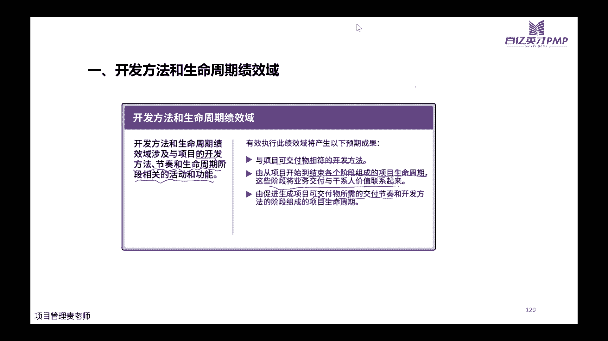
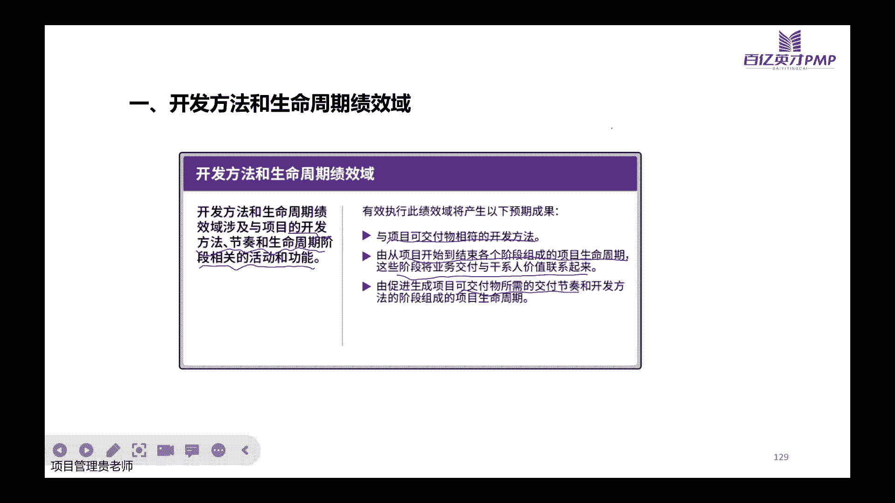
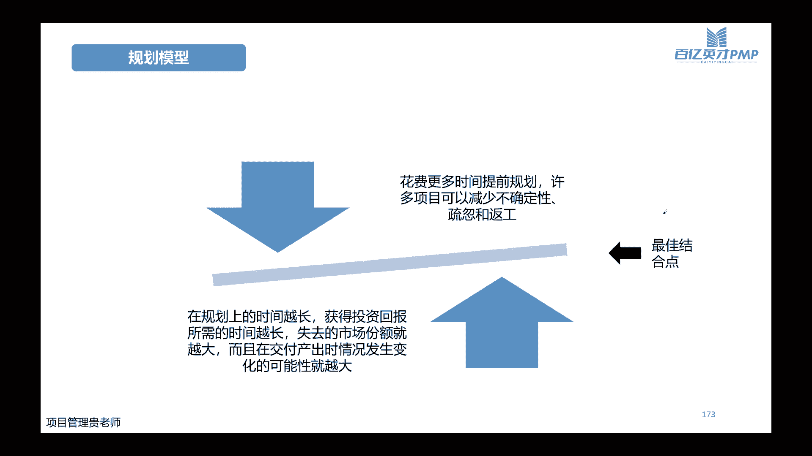

# PMP考试培训课程最新完整版项目管理认证第七版教材新版考纲自学教程 - P4：4.开发方法和生命周期绩效域 - PMP专家 - BV1rM4y1Y79x

好各位同学晚上好嗯，声音和屏幕都正常吧，如果说都正常的话，大家帮忙敲一个111在评论区哈，嗯谢谢收到了，那我们开始今天晚上的直播哈，今天晚上我们讲呃项目的绩效率了，前面跟大家讲过哈，项目的绩效率呢。

它是包含了我们第六版的内容啊，也包含了我们第七版的内容，也包含了我们的敏捷实践指南的，一些具体的工具和方法，所以从这个章节开始呢，大家就听课要听，但是呢光听课是不能够的哈。

所以我们配套的会有一些练习的题目，大家听课呢尽可能的把所有的知识点都掌握，如果说觉得通过听课，掌握知识点还略微的有点困难的话，那么我们下去之后，一定要及时的做我们的练习题，通过我们的练习题。

在巩固我们课堂上所讲的这些所有的知识点哈，好我们说过第七版的教材内容当中呢，它的整个项目绩效率一共是啊八大绩效率，那么今天晚上呢我们开始第一个绩效语，讲项目的开发方法，这个绩效语哈。

因为我们前面啊有的时候呢就会讲到，有的项目它是这个预测型的项目，那有的项目呢它是适应性的项目，当时我记得有小伙伴在群里面还是在评论区问，我说这个什么是预测型的嗯，什么是适应型的，不太理解。

那今天晚上我们学习之后呢，就对它有一个基本的一个认知了哈，那在讲之前呢，我们要知道我们既然说项目管理哈，我们要知道我们所做的项目，它的边界是在哪个地方，这里呢有一张图。

这个图呢其实就非常直观的告诉了我们，项目的编辑哈，首先任何一个项目它起来的时候，他起来的时候，他一定会有发起人，也就是说谁说了要做这个项目，这个项目呢他想达到什么样的一个目标。

这个发起人呢有可能是我们的，比如说客户啊，甲方也有可能是我们公司内部的领导，也有可能是我们啊运营的一些同事，基于产品在运营的过程当中，发现了一些比较好的一些点，一些优化的点。

那基于这些优化点呢得到领导认可之后，就开始做这样的一些项目哈，所以发起人这是一个从项目的整个范畴来讲，他是一个这个角色，并不是一个人哈，他是一个角色，所以呢这有可能是一个人，也有可能是一个部门。

也有可能是一个公司，那么由这个发起人呢，他要发起一个文件啊，发起一个项目，这个项目呢我们前面讲了，做项目要有价值呀，对不对，那这个价值如何去论证呢，我们讲过有可行性研究报告啊，简称可言吧。

可言呢是商业文件当中，比较有代表性的一个纸质化的文件，那当我们商业论证通过之后，哎意味着这个项目是可以做的，在公司里这是会做一个逆向的这个动作，做完立项之后呢，就标志着我们的项目正式要开始。

进入到项目过程，当中来了，项目过程呢又分为了把它的启动规划，执行监控收尾哈，这也就是我们通常所说的项目，不是五大过程组吗，到底是哪五大过程组就是这么来的哈，启动规划执行监控收尾。

那么我们所说的项目管理的边界呢，是从启动的过程到收尾的过程，这个全过程组的在管理，当然收尾之后呢，我们项目会出现它的可交付成果啊，啊其中也会有一些项目的一些各种的这个，文件和过程的一些记录。

可交付成果呢会最终的到达我们的用户啊，或者我们的客户的手上，然后项目当中的这些记录的，无论是一些问题的记录啊，啊或者是一些文件的一些记录啊，或者是一些管理方法的一些沉淀出来的，一些模板啊。

这个就形成了我们公司的组织过程资产哈，呃我记得前两天的时候，应该是有一个小伙伴在群里问到，说说他们公司要让他们整那个经验教训库，是不是当时那个小伙伴在群里问应该从哪下手。

那通过今天晚上可以简单的介绍一下，我们的组织过程资产经验教训库，它是分为多维度的，所以呢他可能不仅仅是一个这个做这个项目，遇到什么问题，然后我们这些问题呢是怎么解决的，之后呢，要如何去避免。

并不仅仅只是这一个方面哈，我们在整个项目的过程当中，不是有这么多的过程吗，在任何一个子过程当中，我们所沉淀出来的，或者所探索出来的一些好的办法，这些办法呢，呃如果说我们能够有一些总结性的这些模板。

那么这些模板其实也是我们公司组织过程资产，或者叫经验教训库里面非常重要的一个模块哈，那如果说做一个项目经理，我们传统意义上面的应该是在这一个范畴之内，做好我们的管理工作，也就是说启动的时候。

权力是赋予了我们的项目经理，就是pm，那有些人就会讲哈，那我在项目启动过程之前，我这个p m我作为项目经理，我要不要去参与呢，这个如果说哈，我们说为了更好地做好整个项目的，这些管理过程的话。

我们肯定是越早参与，我们越了解这个项目他为什么而做，对不对，同样的收尾之后的这些工作呢，如果说我们项目经理哈，作为pm，我们能够更多的去参与，更多的去站在最终优酷上面去听听他们的反馈。

那对于我们本身管理这些项目来说，我们也对我们整个项目的它的可交付成果，是否能够更好接受市场的验证，有一个更好的一个评估，对不对，所以虽然理论上约定了啊，这个项目金的职责在这里，但是呢在实际的工作当中。

我们往两边往前后延伸的过程越多，那对于我们个人的这些管理经验，或者管理技能来说，或者是软技能多好哈，是有非常大的一些帮助的，那我们前面说了，项目在经过了商业论证之后啊，他是要正式的去逆向逆向呢。

才能够去赋予项目经理在组织内，在公司内有这样的一个权利，那这个逆向的过程它是以什么标志，以什么文件来体现呢，一般情况哈，这个大家在公司里面的，可能就是会有一个逆向的程序。

这个程序呢有可能是在这个公司内部的，管理系统上面啊，去走审批的流程，也有可能会有标准的这个纸质的，一个逆向的一个文件，简单的会把项目的基本情况啊，基本的一些预测呃写清楚，然后呢最后领导签字。

但是章程呢我在聊这么多的这个客户也好，或者是这个学员也好，大家一般公司里面既有逆向的这个程序啊，又写了项目章程的呢，同时有的并不是特别多哈，但是呢在我们的知识的体系里边，项目章程它是是标志啊。

是逆向的标志，所以逆向是一个过程，而项目章程的制定呢，它是理论上面的是一个文件的支撑，也是一个标准的一个子过程，那这个章程它既然标志着印象，它是要包含哪些内容呢，在这里给大家列了哈。

首先章程里面一定要查明项目的目的，对不对，因为我们这个章程如果说你要逆向，那我们肯定要知道为什么做这样的一个项目，这个项目做成什么样子之后，它才是满足我项目的整个成功的标准呢，同时呢。

唉我项目要达到的这个这个满足的需求啊，是什么样子，就是高层次的一些范围是要有的，就是做什么，到底做的范围到底是什么，这个是一定要在章程里面去约束啊，去把它阐明清楚的，包括高层次的项目描述啊，边界定义啊。

以及我们主要做完了之后啊，要交付什么东西，项目呢，整体来说诶他大概的风险是什么，项目的，整个这个周期啊是几个月几年啊，大概的里程碑是什么样子，同时呢啊我预先批准的这个财务的资源。

也就是我这个项目整体的这个预算，大概的预算是几百万几千万，关键的相关和名单诶，我比如说这个项目它是服务于客户的啊，那我在这个项目过程当中，甲方那边的对接的项目经理是谁啊，甲方那边领导是谁。

或者说呢我这个项目它是啊，服务于我们的这个市场的这个终端用户的，那我们啊前面有没有一些这个特定的一些，重点的这些服务的人群，项目的审批要求，这个项目最后由谁来审批，由谁来签，达到什么条件的。

尤其是我们的，比如说涉及到一些变更，那么啊审批是谁来审批呃，比如说有这个这个矩阵性的，那我们职能经理需不需要参与到审批啊，参与审批的权限跟项目经理如何去分配，这个项目最后呢到达什么样的程度的时候。

甲方如何去审，我们自己的领导如何去审啊，包括我们项目的推出的这个标准，这些都是要在我们的项目章程里面，去把它查明的，还有一个非常重要的就是我这个项目，我现在任命谁谁谁为这个项目的项目经理。

来替咱们管好这样的一个项目，所以他的职责和职权，这是非常重要的一点，然后呢还有一种情况哈，有的时候这个项目他的发起人啊，他有可能这个部门或者这个机构或者这个个人，他不一定时时刻刻都能够找得到他。

他也可能在他的章程里面去念名，除了他本人之外，那么还有没有其他的人有这个权限去签批啊，这个项目章程，这些都是章程里面的核心的一些内容哈，那么怎么样去制定我们的一个这个项目章程呢，我们前面说章程。

它既然要包括这些内容的话，那么我们前面要有商业论证和效益管理计划，这个都是在我们做论证的过程当中，要产生的一些这个过程性的一些文件，有了这个文件，那么有的项目它是尤其是一些外围的，接受客户的这些项目。

肯定会有一些合同啊，或者会有一些这个备忘录协议之类的，然后呢事业环境因素和组织过程资产，这个是我们前面讲过的啊，内外部环境的因素，事业环境因素是指这个嗯，一般指外部的组织过程，资产一般指内部的学习环境。

那么在这个过程当中会用到一些工具，头脑红包交点小组访谈啊，我们今天晚上讲章程的这个过程呢，不讲这些具体工具怎么用，我们后面讲这个需求收集的时候，会再讲这些工具，那时候再统一跟大家讲。

这些工具具体是怎么用的，那么我们今天晚上需要知道的是，我们有了这些输入的这些文件，经过了这一些这个工具啊，头脑风暴大家一起来讨论也好啊，或者是召开这个家庭小组，是召集主要的专家来开会也好啊。

或者是去访谈一下我们这些客户，他的还有没有更多的一些需求啊，或者说他大概对这个项目的期望是什么，完了之后呢，哎我们就得出了这个全面的章程，章程呢包括我们前面讲过的那些内容。

还有一个问题是要得出一个假设日志，因为我们说啊任何项目它是独特的，他没有说所有的条件都一定是板上钉钉的啊，这些事实，所以呢有一些基于假设出来的，这些这些制约性的一些因素，我们也要去啊。

有一个文档的一个这个记录，这儿呢给大家列了一个啊，项目章程的一个示例吧，如果大家觉得对章程听起来比较别，比较别扭，可以对等为我们在公司做项目的时候，这个逆向文件哈，一般这些里面核心的没看。

咱们刚刚讲到的项目的基本情况，对不对，进度啊，关键的里程碑，整体的预算，项目经理是谁，项目的目标，项目的主要成功标准，然后项目大概用哪些方法，以及项目的角色或者职责大概有哪些，签署人是谁。

对这个项目有啥意见，好这里呢，诶我刚刚这个电脑上面有提示说直播有卡顿啊，大家觉得有卡吗，呃我接着讲哈，大家如果觉得有卡，在评论区敲一下，我们这里哈，虽然说章程里面也提到了项目的角色和职责，有人会想哈。

那我章程的时候，我项目还没有正式的去作为一个规划的，一个过程啊，那那个时候我的资源可能还没有出现，那我怎么样去练这个项目的角色和职责呢，这个时候哈，项目章程里面的这个角色是指一些核心的。

最关键的那些在我们制定章程的时候，是能够预估出来的，比如说也是我们公司什么部门啊，财务部他要用一个新的软件，财务部发起的一个啊新的这个这个项目，那么财务部里面的核心负责这个项目的人，不是负责下部管理。

而是负责对接需求的这个人，他肯定是我们项目当中重要的一个相关方啊，项目经理我们前面说了，因为有，所以项目经理也是其中的一个，那么同时呢我做这个项目啊，我在提出这个需求的时候，我其实知道除了项目经理之外。

谁谁谁，还有可能是我这个项目当中，比较理想的，参与到我们这个项目实施的一些人选，那么这些核心的人可以捏在我们的章程里边哈，啊贾生日呢嗯他这也有一个案例啊，就是主要是这个假设日志它是基于哪一种情况。

是我们技术上面可能有一些不太过关的，或者说有一些这个风险点啊，是要基于一定的条件才能满足的，或者是基于我们的这个设备上面，或者基于我们的这个人员上面，那么它的具体的描述是什么，由谁来负责，好接着讲哈。

开发方法和生命周期绩效率，那这个呢它主要是讲的是我们项目的开发方法，交付的节奏和我们项目的全生命周期，这个阶段所涉及到的所有的活动和这个功能哈，所以呢在这个里面我们会第一开发方法是什么。

第二呢从项目开始到结束，每一个阶段形成的项目生命周期，以及呢，这每一个阶段是怎么跟我们的该系人，联系起来的，并且呢这些可交付它是怎么交付的，它的交互节奏，一次交付啊，还是多次交付，要讲这些东西哈。

现在还卡吗，稍微等我一下，我调整一下啊，现在不卡，刚刚卡过去一些内容，刚刚我大概讲了一下这个开发方法和生命周期，绩效率里面包含的一些东西，它主要是包含啊，我们具体选择什么样的开发方法。

是适应性的还是预测性的，还是这个增量型的，还是定期交付啊，以及我们项目的各个阶段涉及到的生命周期啊，假设日志没听到啊，假设日志呢主要是那一个案例的展示哈，就是我们有一些项目。

它是基于一些假定的一些条件啊，无论是技术上面的还是市场上面的，比如说我们假定这个啊仪器发布出来之后，可能会有多少个用户，然后呢可能会有什么样的一些问题，有一些假定的一些条件，然后基于这些假定的条件呢。

我们会安排具体负责人，在项目的过程当中去监测它，就是这个核心的功能哈，这一基本模板呢大家可以看看那个课件就ok了，了解一下就行，嗯我这个课件怎么怎么怎么，嗯稍等一下哈，我调整一下，我这边我的课件卡住了。

我没有办法往下调，我的课件，稍微等一下哈。

好现在能够调动我的课件了，再试一下哈，再试一下，看看能不能行，那个那个假设日志，因为有看到有学员说，从假设日志那边重新讲一下，重新讲先呃不讲了，因为假设日志考的可能性不是特别大，我们接着往下面讲。

如果说后面嗯，假设日志还是有一些不太理解的话，咱们在群里面在讨论一下哈，那我们前面讲，如果就是开发方法，那既然我们在这个技巧里面要了解项目，它具体开发方法以及它的交互节奏，以及它的生命周期的话。

有几个概念大家要清楚哈，首先可教父上次已经讲过了，这次就不再就不再具体的讲课，教父母是什么意思了哈，开方法一般呢在我们的生命周期里面啊，就是怎么样去把这个产品做出来，怎么样去改进啊。

这个产品或者服务或者结果都ok哈，比如说我们说到的预测型的，迭代型的，增量型的或者敏捷型的，一般情况下咱们常用的基本的这些开发方法，就是这四个大的类型哈，这四个大的类型怎么样去理解啊，是怎么样去区分。

那接下来今天晚上我们会讲节奏呢，是意味着在整个项目的期间，所开展活动的一些节律，项目的阶段呢是啊任何一个这个项目的活动，他们之间的一个一个集合，那么以达到一个输出或者是多个输出。

也就是我们做这个可交付哈，如果说期间一个可交付或者多个可交付，我能够完成，那么我们把它叫做一个项目的一个阶段，暂时完成，那项目的生命周期是什么意思呢，项目的生命周期指的是我们项目从开始到结束。

所经历的一系列这个阶段啊，就是所有的项目阶段累积在一块时，形成了我们项目的生命周期，那交互节奏啊，我前面讲了，既然说交互节奏很重要啊，那是什么意思呢，首先交付节奏里面它分了有一次性的交付。

也就是说我们这个项目只有在项目结束的时候，才会把我们的这个成果去交付，交付给我们的这个发起人，那多次交付呢是我们在项目的进行过程当中，因为这个项目涉及的组件非常的多，我们没有办法。

或者说我们如果等到它全部都完成的时候，它这个时间周期啊有点长，那我们有可能是先交付一部分，然后再交付一部分，在整个项目的期间呢是不同不同的时间，不同的阶段，去多次进行这样的一个交付的一个动作。

这个是多次交付，那么定期交付呢，啊它其实也是我们多次交付的一个嗯，这个一个具体的一个场景，只不过说呢定期交付他约定了时间的周期啊，比如说我们就是按照固定的，比如说每两个月。

或者说每半年要交付一个东西出来，项目的生命周期哈，项目的生命周期是什么意思呢，项目的生命周期意味着项目从启动到完成，所经历的所有的这些项目的阶段，那我们看一下哈，我们前面讲到了有项目的章程啊。

标志它开始启动了，启动完了之后呢，我们要开始做一些规划的工作，好在组织和准备的这个范畴里面，规划完了之后呢，我们要开始进入到执行，那执行的时候啊，是不是只做执行的工作，就顺其自然飘着走呢，不是的。

我们要一边执行，一边不断地把我们的项目过程当中，产生的这些数据信息，跟我们最开始做的这些计划去比对，看看我们技巧上面有没有一些什么偏差，所以呢在执行的这个阶段，它既包括了执行，它也包括了监控。

那么到项目的结束阶段呢，哎就是我们要开始验收我们的可交付成果了，这个呢是整个项目的生命周期哈，但是呢大家要思考一个问题，是不是在我的启动的阶段，就没有项目执行的动作呢。

是不是在我规划或者组织准备的工作当中，也没有执行的动作呢，这个大家自己去思考一下哈，具体来说啊，这是我们切板里面把它拆的就更细了哈，在我们前面论证的这个阶段，也就是我们做科研的这个阶段。

那它具体的含义就是做商业论证，然后呢做完考研之后，哎我们要开始进入到一个这个设计的阶段，这个其实更加符合我们啊，前面说的这个启动规划，执行是更加符合我们的预测，那这个呢更加符合我们的这个摄影的这个。

项目的阶段哈，如果大家是啊，做软件开发的这个项目管理的小伙伴，可能对这个流程是非常熟悉的哈，我们做了可研之后，然后我们要开始做一些设计，通过设计呢哎我们可能设计这个产品。

或者说这个软件它的整体的这个架构啊，整体的这个功能做完了之后呢，哎我们要开始进入到执行的这个阶段，就是它叫做构建，构建和探索这个阶段，也就是说我们要把设置的内容，把它通过我们的代码把它呈现做出来。

一个具体的可以看得见，可以用的这个产品，产品做完了之后呢，我们要进入到测试阶段，因为我们在移交啊，或者在交给客户的这个验收之前，我们自己也会对这个客户啊，对这个产品做一些他的一些测试工作。

证明这个产品它是能够被我们使用的，那对这个产品或者对这个服务，涉及到的一些使用者啊，我运维人员，我们要对它进行一些基本的一些培训，那这个工作做完呢，啊项目要进入到一些收尾的这个阶段啊，交付好了。

我们还要做好项目的知识管理工作，项目的一些工具啊，啊项目在组织内部里面，如何去移交给组织内部的后续的这些运维，或者事后的一些人员，做完了之后呢，哎我们自己项目的团队成员，这项目做完了之后。

项目本身要这个结算团队哈，这个结算团队呢，大家可以从这个啊这个打打个打个这个哈，打个双引号可能比较能够理解一些，并不是说我们就把这个团队解散了，大家各回各家哈，不是从不是这个这个实际的这个动作。

而是说呢我们从这个项目的意义上面，大家以后不再是同一个这个项目组了啊，如果说有新的项目，那可能还是这一拨人，那就是新的项目组，而不是这一个已经交付的，已经完成了这个项目组团队成员是这个意思啊。

那讲讲哈预测型的生命周期，预测型的生命周期呢啊他就是通过这个可言啊，设计啊，我最开始可研做完了之后，哎，我把所有涉及到这个动作的，涉及到这个项目的设计完成完成了之后呢，我才进入到我的整个这个构件的工作。

搭建的工作，执行的这个工作，然后所有的这个执行工作做完了之后呢，我们才进入到唉这个测试细节的测试，完整的测试系统的测试都做做完了之后呢，哎我再进入到我整个这个部署的工作，进入到培训的工作。

然后我再进入到整个这个收尾的工作，他的每一个阶段呢是必须要做完的，这一个第一个阶段，然后才能够进入到第二个阶段，第二个阶段做完了之后呢，我才能够进入到第三个阶段，它是有时间的这个依赖性的。

这个呢我们通常叫做预测性哈，那么既然是预测型的，大家都知道预测性的，如果说我最开始啊我在做这个，尤其是我在做这个设计工作的时候，如果项目的范围啊，或者说需求不是很明确的话，那我所有的设计工作我能完成吗。

是不是就很有难度，对不对，所以哈像我们一般说的这种软件项目，如果说完全用预测性的生命周期可能不太合适，对不对，因为我们没有办法在一开始的时候，把这个发起人，或者把我们用户的所有的需求都识别出来。

这个很难，如果如果说都能够识别出来，也就不会存在，大家做项目的时候，经常遇到甲方的需求，精也在变，平也在变，这个没有办法，那是隐形的哈，适应性的这个生命周期呢，最开始我定义了啊。

我这个产品或者这个项目的愿景，它到底应该是啊什么，然后呢啊我有产品的这个路线图啊，有这个发布的这个规划出来，然后要进入到具体的迭代之后呢，我是先做完一轮的这个周期，在这一轮的周期里面呢。

我会完成这里面的设计的工作，这里面构建的工作，这里面测试的工作都做完了之后，诶，它基本上是一个比较诚信的一个产品了，然后呢做完这个产品之后，哎我还有其他的这些，这个第二次就是发在产品发布。

我还有第一个第二轮的这个迭代和优化工作呀，对不对，那我在市场上面在运行啊，或者我内测的时候我发现了一些更好的一些点，那我进入了第二个迭代的这个过程，进入到第二个迭代过程呢，我仍然会做啊，设计我要做构建。

我要做，做完了之后呢，我要做测试，测试完了之后我要做部署，我还得把这个动作再重复一遍，对不对，再重复一遍之后呢，做出来的这个第二次的这个产品啊，你第一次呢有一些啊这个优化，然后做完之后呢。

我还得再做第三个吧，持续的这个迭代工作，第三个迭代工作呢，我还得完成他的这个设计构建，测试部署一系列的动作啊，这是假的，是我们这个适应性的生命周期和迭代，为什么要有这样的适应性生命周期呢。

是因为我们在这个过程当中啊，需求是一直在变动的，同时呢需求它也是在不断的明确的，有可能我们最开始的时候，尤其是比如说我们要做一个什么app的时候，我们压根儿就不知道，这个市场对它的接受度怎么样，对不对。

那我只能先把它最基本最核心的功能，先把它做出来，哎，先做一个这个先做一个内测的这个产品迭代，通过第一次的这个迭代啊，甚至通过两个迭代分先发布出来，在市场上面去教育一下，让大家都来拍拍砖啊。

或者来黑这个产品都行，最重要的是，我们能够通过这个过程收集到更多的一些意见，对不对，设定上更多的意见之后，我才能够基于这些意见，再做下一步的这个更新啊，和这个优化的功能，我原本呢我可能在第二次。

我放在这个第二个这个发布的阶段，或者第二个迭迭代的这个阶段，我原本规划的一些其他的这些啊，这个这个是核心啊，比如说它优先级是一啊，我有可能原本规划的是这个优先级排在第二的，这个这些功能。

我要放在第二个发布或者第二次的迭代里面去，把它完成，ok没问题，但是呢我在完成第二个，或者说我在做第二个这个迭代的时候，基于迭代一产生出来的那些优化意见，也会参与到我重新的排序里面啊。

排序如果我觉得这些原先排优先级二的，跟我们迭代优化出来的这些建议来比，他开的项目，最开始的它仍然是一个概念的一个阶段，要进我们的进行我们的这个可行性的研究啊，进行完了之后，我们要做他的这个计划做设计啊。

做完设计要做构建啊，做完构建之后呢，要做这个测试，然后要做部署，只不过说呢增量型的它是多次在交付，我做完构建之后呢，哎我先给你交付一次，我直接就交付给客户了，交付完了之后呢，啊客户也完成了这个部署。

也完成这个这个测试，然后呢客户先用起来，用起来之后呢，我一开始说的我我整个这个他要12345，有五个功能啊，对不对，有五个大的类别的功能，我只教了第一个类别，那第二个呢你先用着，你先用着第一个功能。

我再继续的给你做着，第二个这个功能的整个设计呀，开发呀啊这个测试啊，做这个工作做完了，测试了也没有什么问题啊，第二个那的类别的功能也交付给你了，客户同桌用的第一个功能啊，同时也用着第二个类别的功能。

然后我再给你做第三个哈，它是少量多次的，这个交付我们叫做增量型的生命周期哈，那这嗯还有一种呢是敏捷敏捷性的生命周期呢，它是既有迭代性的生命周期的特征，又有增量型生命周期的一个特征哈。

所以我们来我们把它叫做敏捷啊，我在这儿呢就没有单独的写这个敏捷型，它的这个画图逻辑图啦，大家理解了迭代型的生命周期，在理解了增量性的生命周期，就知道我们敏捷性的生命周期，它是两个特征都有哈。

也就是说它啊既有迭代的过程，然后呢又有多次交付的这个过程，然后在这里呢要跟大家对比一下，四种生命的周期哈，预测性的生命周期范围，进度成本在早期阶段就能够确定，这是因为我能够确定，所以我在一开始的时候。

我能把所有的工作都把它做好规划啊，这个比较常见的，比如说我们啊建筑大楼啊，做一个什么样的工程，这个一定是在最开始，所有的这些范围都是能够确定的，对不对，我确定好了之后，我才能知道啊。

这个工程它要涉及到多少的原材料，我然后我才能去采购或到场之后，我才能够安排我这些工人去做一些动作，对不对，才能动工啊，这是预测性的，迭代性呢，主要是通过一些重复的循环来开发产品啊。

让我们这个产品能够越来越好，范围呢一般早期它可以确定，但是呢一直会变啊，我们也可以说它的早期是不太明确，增量型的生命周期哈，增量型的生命周期主要是在预定的时间，在预定时间区间内能够啊多次的交付。

交付的最开始的是，他可能没有说交付的完整的部分，完整的这个这个一个大的一个系统，但是呢我是交付了一部分的内容啊，通过多部分的共同形成一个整体的一个内容，那么敏捷型的我们刚刚说了，它既有迭代性的特征。

又有增量性的特征，所以呢他一般是哈就是每次都交付，最有价值的核心的这些功能啊对吧，多次交付的这个特征出来了，同时呢我这些功能我要通过不断的迭代去完成，去更好的响应我们的相关方。

响应我们的这个客户的一些需求，所以你看它既有增量啊，有又有这个迭代的特征，嗯这个大家理不理解啊，就是讲预测肯定大家都理解，对不对，一般的这些工程啊，比如说我们做一个装修啊，啊建工大楼啊，然后迭代型的嗯。

迭代性呢，比如说我们这个网上比较经典的那个案例图哈，就是咱们啊画一个这个画画啊，一开始呢我可能画了一个非常虚拟的，这样的一个一个展示，然后呢画完之后我发现诶大家不太理解啊，就是我只能讲我这画的是啥。

大家才能够听得懂，所以呢我在第二个版本的时候呢，我把它更加的优化了，唉更加的这个，明确了，所以大家呢直观入眼诶，能够看得明白了，然后呢在第三个阶段的时候，大家说还有一些细节的功能需要完善。

ok那我在这个画里面呢，诶我又增加了给他画了眉毛，画了眼睛，哎比如说这是个人的画，然后呢这个这个腿腿还长了这个有角，然后呢裙子或者衣服上面有具体的这个花纹啊，我记得这个花纹啊，所以我通过一次二次。

每一次都是做完基础的框架，然后呢给它上色，给它做画，给他做具体细节的这个描述，每次都是这样哈，做完了之后呢，哎整体最后出来的是一个非常嗯，比较完整的这样的一幅画，这个是这个迭代哈，那么增量呢。

我们还是用这个画的例子来给大家做描述的话，哎我一开始我比如说画还是画一个画啊，那画这个画的时候呢，我一开始我比如说我只画他的这个头部，但是呢我在最开始第一次的时候，因为我要啊我注册链。

我要把这个画交付给我的这个客户的话，那么我把第一部分我交付的是头，第二部分呢我可能交付的是上半身，然后第三部分呢我可能交付的是下半身，那好了，我第一个部分我要交付给他这个头上边吧。

哈这个头部的这个这个画的时候，我能不能只给他描述出一个，这个可以让序列一个框架呢描述出来，那不满足验收标准，对不对，客户说你是交给我啥东西，我看不懂，所以我在第一个阶段呢。

我就要把诶他这个上面有有眼睛啊，这个鼻子嘴巴耳朵啊，所有的细节描述都这个做的特别好，上色也伤的特别好，基本上呢就是看不出来任何瑕疵诶，我做第一次交付，然后第二次的交付呢，哎我给他做这个身体的这个部分。

同样的这个身体部分呢，该有的所有的细节我都把它做好了，哎也上色了，然后交给他身体，那第三个部分呢它的这个下半部分诶，我在把它做得特别好，上色呀，这些都做得特别好，最后呢通过一次交付，二次交付，三次交付。

共同形成一个完整的一个整体哈，这个是两个之间的一个区别和一个逻辑，嗯大家多想一想就就清楚了哈，然后直播间有小伙伴问，说一个项目只能有一种生命周期吗，呃不一定哈，就是因为我们说了，有的项目呢。

它是啊既符合，就是他的这个应该说他的这个开发方法，是可以多种去包括的，但是生命周期呢它是可以去，就是一般情况下，一个项目是一种类型的生命周期，但是这种生命周期的类型呢，不是说它一定就是完完全全预测。

或者是完完全全迭代，或者是完完全全敏捷的哈，它有可能是整个大的这个项目的生命，它是一个预测型的，但是呢我在这个预测型的生命周期里边，我可能具体到这个产品的开发阶段，我用的是敏捷型的这个生命周期。

是这个意思哈，不是说一个项目只能有完完全全一种，它有可能是混合的，诶，再用这张图给大家直观的看一下这个对比哈，嗯其实刚刚已经讲过了他们之间的一些区别嗯，预测开发是在这个需求是在开发之前确定。

然后呢针对可交付成果制定交付计划啊，然后再在最后项目所有的工作完成之后，一次性的交付我们的产品，并且呢啊，既然我们说这些需求都是开发，最开始的时候就确定好的呀，我计划都已经做好了，那对于我们做好的计划。

是不是你中间变得越少越好，对不对，你一变我的这个计划就变了，所以在预测性里面呢是尽量的，我们要限制一些变更啊，同时呢关键的一些相关方，只用在特定的一些里程碑唉，去参与一下我不同的里程碑。

要这个重要的一些事情，你来看看这个项目的进展就ok了，但是在平时的过程当中呢，这相关方就尽量的少参与，因为他参与的多，他就有可能提他的意见，一提他的意见，这个变更就有可能多。

现在通过对基本可知情况来编制详细的计划，从而来控制一些风险和一些成本，这个是预测性的，一些这个各个维度的一些特征哈，那么迭代和增量型的呢，他们其实需求都是在交付期间不断的去细化。

因为我们不管是做一个迭代也好啊，还是做我们做增量也好啊，那么在每一个具体的进入到细节工作的时候，那些需求才需要在我们具体迭代的过程当中啊，具体说增量的过程当中去不断的细化。

其他的剩余的那些这个优先级比较低的，这些功能，可能我还没有到它的时候，我就不用把它细化到那么细啊，信号到我们具体的这个用户故事可以直接做，在交付的人一般都是这个分子交付哈，迭代也是分子交付啊。

增量也其实也是分子交付，多次交付，然后进了哈，你需求是要定制的，细化定制的变化的呀，那这个时候我们就一定要允许变化，对不对，如果说b不允许变化的话，那么迭代和增量的意义它就不存在了，既然我是欢迎变化的。

是响应变化的，那么我就非常鼓励我们核心的相关方，一定要在我们的这个周期里面，要定制的参与进来，他多多的参与，我才能够知道诶，他希望这个项目到底下一次迭代做什么样的，这个增加的一些这个代办事项，对不对。

我才能在做增量的时候哎，希望他下一次蒸的时候到底争什么东西，对不对啊，所以他是怎么控制的呢，它是通过新信息的不断的细化啊，你捕捉的需求捕捉的变化越来越多啊，越多越细化的越好。

那你整个这个项目的整个过程呢，你的风险才能够控制的越好，那敏捷型的是需求，在交付期间一直频繁的在被细化，并且呢是要频繁的交付对客户有价值的，各个自己就是我做完了，我就把这个交给你了，然后你再用你再优化。

然后我再做其他的这个，具体的持续的迭代的工作，所以他在交付的期限，还是把实时的码变更融入项目啊，也是关键，相关方持续来参与怎么样控制风险的，通过需求和制约因素不断的啊明确，不断的响应，不断的显现。

而控制风险和这个成本哈，大家重点了解预测和敏捷就行了，因为我们考试的时候重点考的就是这两个啊，还有一部分是介于中间的是混合，就是他既有预测，然后又敏捷的这个特征在里边，敏捷就是嗯现在都说适应哈啊。

适应性的这两个考题的基本上啊，预测和这个敏捷就是合适运行的，基本上一半一半的这个内容哈，好我们讲一下哈，诶，前面的是用表格给大家非常直观的去列名了，四种基本的这个开发方法，基本的生命周期。

它们之间的区别和他们之间的一些特征哈，那么基于我们的具体在实际的工作当中啊，需求和技术一般会以这两个维度去评判，我们到底用什么样的这个开发方法啊，选择什么样的生命周期哈，如果说他的需求是非常明确的。

然后呢我们也拥有这一项技术，能够很好的非常简单的，相对而言简单的就能够把这个需求把它完成啊，在这个部分呢我们把它叫做简单，那它肯定是适用于我们预测性的，这些项目的开发方法啊，预测性的项目的生命周期。

那如果说他的需求是不明确的，但是呢他的技术是相对确定的，那在需求的过程当中，哎我们把它叫做复杂型的，复杂性的呢，其实我们啊这个迭代型的需要用到，增量型的也是要用到哈，就是不管这两个东西啊。

不管需求是明确，技术不明确，或者说需求明确，但是技术不明确都是有非常大的不确定性的，这种我们都把它叫做复杂性，复杂性的，我们就可能用到两种中间的两种迭代或者增量，那么模糊性的呢是介于这两个之间。

需求不太明确，技术呢也不是特别明确，我们需要在做的过程当中不断的去探索，不断的去渐渐的去明确，那这个过程呢这个范围区间的范围哈，我们把它叫做一个模糊的一个状态，这个时候我们就选择敏捷性的开发方法。

敏捷性的生命周期，那还有一种呢是我技术完全不确定需求，我也完全不确定，就是说的白1。8000没一撇的东西，对不对，那这个这个呢我们把它这种环境状态，我们把它叫做混乱混乱的项目，我们用什么开发方法呢。

我们不要去碰啊，没有合适的开发方法，因为这个投入一定是成本非常大，风险非常高的，那既然说到哈这个敏捷我要跟大家讲一下，就适应性的这些项目啊，它是有12个这个原则啊，这12个原则呢大家不用去背啊。

但是呢要理解这12个原则，它是什么样的一个意思哈，所以呢带大家一起来过一下，首先啊敏捷说了，我们最重要的目标是要通过持续不断的去交付，有价值的软件，让客户来满意哈，预测性的项目目标在这个预测性的项目。

它对于目标是，我们要尽可能在啊项目的范畴之内，让它符合我们的规划，交付我们的可交付成果，但是呢敏捷他这个时候是要持续不断的，及早的持续不断及早交付有价值的软件啊，因为价值在这个过程当中。

它是一定会变化的，第二个哈是欣然面球，面对需求的变化，即使在开发后期也一样，诶，就是说我们在做这个软件的时候，他哪怕这个软件到最后还有一个迭代工作，他就已经完成了，就能够交付了，但是呢这个时候。

假如我们的客户提出了一个，非常就是颠覆性的一个需求变化，那我们怎么办呢，没办法，我们也要现在去接受哈，因为客户或者说这个发型，让他提出这样的需求的变化，一定是他基于他自己对于市场上面。

或者对于他的这个将来这个软件的使用场景，一些核心的一些考量，所以我们要响应，我们要乐于接受哈，第三个要经常的交付，可工作的软件相隔几个星期或者一两个月，倾向于采用较短的周期，什么意思啊。

就是我们要多次的去交付，因为我们做这个产品的时候，有很多功能在最开始的时候只能直到一个大概，那我们只有在做的过程当中去不断的去细化，去不断的去优化，所以呢多次交付，多次使用，多次验证啊。

这个是我们这个敏捷当中的一个精髓，业务人员和开发人员必须相互合作，项目当中每一天都不例外，那我们前面讲了，如果说是预测性的项目，那可能我具体的这个开发者，我自己我自己在做就行了，我全部都做完了之后。

我把它交给运维的人员，交给业务的人员，你们去推吧，那中间呢嗯具体怎么做的，研发的这个过程你就不用太在意，不用太管了，但是我们在密集当中呢，是要强调业务人员和开发人员。

一定要去这个采用一个比较高频次的一个互动，这样才能够保证我们的开发人员，它是能够最快的去捕捉到我们这个产品，或者这个项目它的真实的一些需求，这是理解变化啊，激发个体的都是以他们为核心搭建项目哈。

在我们预测性的项目当中呢，啊是以整个文整个项目的框架，整个项目的呃高层次的一些审批啊，以这些文件框架为一些核心，但是呢我们在敏捷当中，因为要响应变化呀，因为要大家非常敏锐的去捕捉一些需求。

所以我们的核心是项目的团队，是以他们为核心哈，所以两个之间是有点区别的，不论团队列外传递信息，最好的效率是什么，面谈这个大家好理解，对不对，因为我们既然强调了要敏捷，速度要快。

那肯定很多东西面对面的交流，面对面的交谈，它产生的一些误解是最小的，可工作的软件是进度的首要多量标准对，所以在敏捷当中啊，你有没有进度汇报呀啊，有没有这个做好这个技术。

这个什么绩效的一些这个这个报告呀啊，有没有做好一些官方文件，这些都不重要，我们什么东西重不重要，就是你的产品你能交付出来，可以工作，可以正常使用的，这些软件才是我们度量的首要标准，其他都是次要的。

敏捷过程，倡导可持续开发责任人，开发人员和用户能够共同的维序，维持它的一个基本的一个步调来稳定延续哈，因为整个过程要强调持续开发，持续开发才能持续优化，坚持不懈的设计，卓越和良好设计。

敏捷能力由此增强啊，这个好理解，以简洁为本，它是极力减少，不必要工作量的一些艺术，那我们说了预测性，它有很多的一些文档啊，他要做那么多的一些规划啊，但是我们每节当中的最重要，你做出可交付成果。

做出可工作软件就ok了，所以其他的那些辅助性的那些累赘，那些障碍啊，都可以尽可能的去扫，最好的架构和需求，设计出自于自组织的一些团队，比如说我们只有放手啊，以团队为核心，让团队自己去做啊。

他们才能够做出最好的需求，最好的架构，最好的设计，最好的软件出来，而不是说哎我高层做了，我，我每天都是听高层的高层说怎么做，哎我开发团队都怎么做，不是这个意思啊，团队定期的反思如何能提高绩效，对呀。

因为我们引进当中是以团队为为核心，在开展我们具体的项目工作，在开展我们具体的软件的设计，和软件的开发工作，那只有我们当团队本身它能够定期的去反思诶，定期的去啊调整我们的这些软件呢。

它的一些啊各个涉及到的一些各个点啊，所以呢才能够让整个这个项目，整个这个软件能够发挥出更大的一些价值，更大的一些功能效果，那适应性效仿它的一些这个价值驱动哈，它是以价值啊来驱动我整个这个呃项目的过程。

它应该是什么样子，只要我有价值，我这个事件做的就是有意义的，但是呢我在做的过程当中，如果说它的价值突然消失，随着环境的一些变化，那么我做再多也是无用的，但是呢预测型的，它是以文档来驱动与过程来监控。

从上至下都是一个非常标准的一个框架，相应点在框架之内去做，而这个呢是以变化的价值为驱动，项目，团队呢随着这个价值的变化而开展自己的工作，这是两个最直观的一个区别哈，预测的跟适应性能，好呃。

因为绿色系的比较相对比较好理解一点，我们今天晚上就是呃，先重点跟大家把这个适应性的项目，到底是如何去价值驱动的，跟大家讲的多一点，讲清楚一点哈，价值驱动呢我们说它有好多个维度，这是把价值拆开来讲。

到底什么叫价值驱动哈，首先啊我们要从小做起啊，什么意思，因为我们在开发任何一个产品，或者在制定任何一个产品的愿景的时候，我们可能想了很久，想得很这个长远想的很美好，但是实际会不会是像我们想的那么美好啊。

这个这么理想呢，他一定是不会的，所以我最开始的时候，我做一个最小的可行性产品，拿到我的用户面前去做测试，去做验证，才能够啊，才能够得出哎我这个产品的愿景是否是成立的，就像我们就像我们这个微信哈。

现在基本上人人都在为用，人人都在用微信，所有的功能都离不开啊，这个手机不离手啊，手机打开大部分时间都是在微信上面工作，也是微信聊天，也是微信啊，刷剧娱乐，或者是一些这个这个购票订酒店。

基本的功能都是在用微信，但是微信一开始出来的时候，他能这么好吗，如果说微信在最开始啊，张三楼，他在做的时候，他就说啊，我们将来要做一个产品，这个产品呢是链接啊，全球的这个这个呃沟通网络。

然后呢他要包含什么什么功能，什么什么功能啊，现在这个短时间都规划在内，那他微信做得出来吗，很难对不对，因为它的功能点太多了，所以人家最开始做出来，那也是被吐槽的差评，超级差评，对不对。

但是现在你看微信有多重要，我就不多说了，那么进入到我们的验证和验证，是要抓住最核心的这个产品价值啊，就是我们前面讲了，你要做出一个最小的可行性，产品出来之后，用这个可行性产品为我们的抓手去做。

去推到市场去做验证，在这个过程当中再去不断的去迭代，去优化，那优化完了之后呢，我们还要有所取舍，对不对，因为优化完了之后，大家要提很多很多不同的一些意见，同时呢大家也有可能说出很多很好的一些优点。

那是不是所有的这些缺点我们都摒弃，所有的优点我们都接受呢，不一定哈，因为在这个过程中，用户的一些反馈是一部分，那我们也要基于自己公司内部的一些情况，基本情况成本啊，还有最核心的资源啊，啊技能啊。

基于这些去综合的去考量，那既然要做这样的一个考量哈，我们就要进入到这个啊转变思维，因为预测型的这个项目哈，我们又把它叫做瀑布，就是大家啊在这个过程当中哈，因为有些嗯呃有些传统的。

或者有一些这个理论上面的图，还是标的这个瀑布，大家都知道瀑布又叫传统啊，又叫预测，它是一个意思哈，所以你看他这写的是瀑布，那说的是我们这个预测性项目，预测性的项目，通常说的项目的铁三角范围啊。

进度成本质量，这是三个不能跨越的一个维度，你必须要在这个框架之内去完成我们的项目，但是对于我们敏捷的适应性这些项目而言，它首先是啊这个时间啊和成本，它有可能是相对比较确定的，甚至我们的验收标准。

我们的质量，但是呢在这个过程当中，我们的范围是非常的不明确的，你看他这样明确的范围，明确的是质量，但是时间和成本是相对可能会延迟，可能会变化，但是在适应当中，时间和成本我在什么用什么样的资金投入。

在什么样的时间之内啊，我要做出一个什么样的一个，这个满足什么样的一个交付的验收标准的，这样的一个产品，所以我为了满足这样的产品啊，为了响应市场需求，我要做哪些具体工作，这些工作这些范围是不太明确。

不太需求的，所以到底哪个为核心，到底哪个为框架，大家就是在理解两个不同的时候，做一些稍微的一些转变，然后呢尽早交付及时的反馈，因为既然我们说要做一个进一个，很好的一个迭代呀，那在迭代的时候。

你一定要知道你下次迭代的时候，你要怎么样去排这些这个优先级，对不对，那么多的这个具体的事情要做优先级怎么排，优先级排来自于我们的反馈意见，和我们最新的一些需求啊，所以尽早交付，然后展示给客户获得反馈。

这是一个试图和验证的这个过程，然后这个过程呢，能够让我们增加对市场和需求的一个认知，具体的反馈机制，今天不讲这么细哈，今天大家都知道这个怎么去反馈，我们肯定是在敏捷的方法当中，有一些具体的一些啊。

这个工具和方法能够得到这样的反馈，知道有这个功能就行了，好价值驱动优先排序，因为前面一直在讲啊，我们在迭代的过程当中，或者在做增加的过程当中，因为要做一些这个嗯，要做一些这个优先级的一些排序。

因为每个迭代它的这个周期是相对比较固定的，一个固定的周期之内，我们所做的所能完成的这个事项它是有限的，既然是有限的，那我们就要在有限的时间之内啊，有限的团队资源之内，要尽可能地选择它的价值比较高的啊。

优先级比较高的这些任务去做，嗯这还是讲的这个呃这个对比哈对比，我觉得这张啊课件的图，大家去自己去看一看就好了，因为我们前面其实讲预测啊，蒋敏捷已经讲了很多，拆分了很多他的这个g的区别点。

这个呢大家可以当做一个小节点，然后来去复习，然后下面的开发方法除了预测和适应之外呢，我们还有说的这个混合，从预测到适应到混合到适应，这其中的过程呢，迭代性和增量性是逐渐的增加的，也就是说我在预测里面。

我可能完全或者说非常少的，有迭代和增量的这个特征，但是我在混合的时候呢，我在混合性的这个特征之后之类，我是有一部分的迭代性，或者有一部分的增量型，但是我在适应性的这个过程当中呢，它的迭代性和增量性。

一定是这个基于前面两个一定是更高的啊，所以迭代性和增量性在这期间之内，它是不断的在增加的，那预测型的方法一开始就定义，收集分析项目的产品需求，混合性的就是预测跟这个适应性的结合体。

然后适应性的就是需求面临高度的不确定性，和易变性的一些影响，并且随时可能变化，好前面的一部分环节是花了比较多的一些细节，跟大家重点呢把这个啊预测啊，或者说这个更多的是讲的适应到底是怎么回事。

怎么样一个价值驱动跟大家讲了，那么既然我们说了项目它是能够用预测，也能够用适应，那我们在选择的时候要怎么去考虑呢，首先要看一下我们的项目的产品，服务或者结果到底是什么样子的哈，创新程度。

如果说这个项目它的创新性非常非常的高啊，非常如果它的创新性非常高，意味着什么呢，意味着它的这个技术可能会有一些更新啊，甚至呢它的这个呃，这个需求也有可能在最开始的时候，是这个不太确定的。

因为技术的要求高啊，技术的更新程度要求高啊，那需求呢相对来说它也不是特别确定了，这种情况下，我们肯定是要选择这个适应性呢，会更加的合适一点，然后范围的稳定性，如果说这个项目它本身在最开始的时候。

范围就不太稳定，那意味着非常多的一些啊变更，变化范围比较稳定，变更又比较的这个这个相对不太诡异的时候，这个时候我们就预测，但是范围一开始不太稳定，然后呢变更呢又比较容易随着你说变哎。

可能大家沟通一下就变了，那这个时候呢，我们也是鼓励有适应性的交付的选项方案，如果说这个项目要约定了要多次交付，那我们肯定是这个有增量的特性在里面，这个优先选择适应，那如果说他交付的时候。

我明确了确定了这个东西，你要给我做好啊，做好了之后，最终交付给我一个系统的一个东西出来，那这个时候我们选择预测的会相对好一点，或者混合的会相对好一点，还有风险，如果说这个项目的风险啊是特别特别大。

基本上是啊几乎完全是不可控的，那我们还是优先的选择，可能适应性的会比较合适一点，因为适应性在过程当中，我们能够啊更多的引导相关方去参与，尽可能的去控制一些风险，但是在预测型里面。

风险呢是需要我们提前去把它识别出来，做一个响应的一个计划，但是呢做了响应的计划之后，因为这个风险，假如说他在项目的执行过程当中，特别特别的高啊，那我们可能在最开始的识别的时候呢，他没有办法识别那么全。

没有办法识别那么全，那我们可能失控的概率就比较大，好安全要求，安全需求，安全需求也是我们在考虑开发方法的时候啊，要这个重点考虑的一个因素哈，那么有的项目他的有一些安全法规。

上面有一些这个核心的一些约定啊，那在这个约定之下呢，框架之下匡胤的特别死，那我们可能在这一方面有预测性的，这个这个去严格的监控过程会比较更合适一些，还有法规啊，这个是一脉相承的哈。

那么第二类呢是呃前面说的是我们基于产品，基于服务啊，基于他的这个成果的各个波动维度，这个第二个大的维度呢，是我们通过项目本身的这个维度，如果这个时候我们这个项目的干系人，他很少有空参与我们的这个项目啊。

基本上就是嗯最开始的时候跟你阐述一下需求，然后中间节点稍微的去控制一下就ok了，其他的过程呢压根就不想去参与了，沟通的成本会比较高一些，那我们尽可能还是用预测，但是呢如果这些干系人诶。

他非常乐意跟我们共同的去探索，共同的去参与到这个项目的这个过程当中来，那我们就用适应性的会比较合适一点，进度制约的因素哈，如果说这个项目啊，周期它啊特别的这个特别的短诶，很快就能完成的。

这一因素非常的小，那我们这个时候可能用预测型的，尽快的把它完成比较好，但是如果说这个项目的周期进度特别长啊，周期特别长好几年，那这个时候呢我们可能用一些适应性的，因为几年的时间发生变化的这个概率太大。

而且呢这个变化到底是什么，我们其实是没有办法去预估的，所以这个时候呢我们可能用深一点的，更合适一点，资金的使用情况也是啊，如果说这个资金是非常明确的，并且资金是非常充足的，a。

那我们可能用这个v字型的也会比较合适一点，但是呢如果说这个项目本身，它的资金是非常有限的，那我们为了去尽可能的去啊节约成本，尽可能的去让我们的这个工作，项目的工作价值最大化，那我们可能用适应性的。

尽早的去接受市场的验证，能够避免更多的一些资金浪费，资源浪费，还有就是组织哈，组织呢就具体讲了我们组织结构啊，文化啊，能力啊和团队规模以及所处的位置，具体怎么说呢，啊如果说我们整个公司的它的文化。

它的结构是啊非常传统非常固化的，就是完完全全以高层说了算的这种文化的话，那么你可能用预测型的更加合适一点，因为预测性的我们前面讲过，它高层可以通过文件啊，通过过程的这个严密的监控啊。

去控制我们的整个这个项目的过程，但是呢如果说这个团队啊，他是他的管理是相对扁平化的，大家的文化也非常的好啊，基本上就是随时这个没有说严密的，这种上下行的，这种这种这个这个这个的氛围在里边的话。

那我们用适应性呢，大家可以随时来讨论，可能更加的合适一点，包括组织的这个能力和团队所处的规模，如果说这个项目非常非常的复杂啊，大家涉及到的人员也特别特别的一些广，那我们用预测性的这个最开始制定好。

大家的沟通规划可能会比较好，但是如果这个团队项目的存在，本身它是小而精的啊，然后呢，这个团队本身呢它的这个能力是比较综合的，那我们可能有适应性的，大家以团队为核，心。

以团队为主来驱动这个项目可能更合适一点哈，好那讲了开发方法，讲的生命周期，又讲了交付的节奏，它们之间的关系哈，首先项目的可交付物的类型，决定了项目的如何去开发，这个怎么理解呢。

如果我们可以交互类型是一个，它本身它就是一个系统，它没有办法拆分啊，就比如说啊我们去装修房子，你能说我给你把水电装好了行，你先住进来吧，然后我再给你慢慢的去刷墙啊。

慢慢的去做后面的一些这个这个软装什么的，能这样吗，不能我必须要把所有的这个基础的水电啊，墙面啊，这个过程都给你做好了之后啊，甚至还要晾一晾晒一晒，然后我才能够把这个东西，把这个这个装修的人工工程。

我把它交付给你，对不对，所以这种一定是预测型的，那可交付物的类型和开发方法呢，又会影响项目的交付的次数和节奏，对不对，那我们既然说了可交付，他要一次性的，比如说还是拿我们装修工程这个为举例函，为逆子。

他既然说了这个可交付，他要最终要交付的是一个姓母才能够使用，那我肯定是一次性的最终的交付，但如果我这个可交付，比如说我们就是一个软件客户，要的很急很急，那我只能去啊，这个多次的交付我完成一两核心的功能。

我先交付给你，先用着，不影响，想不义我再提，我再继续的去完成第二个阶段的这个功能，那这个呢他可能是用适应性的，多次交付会比较合适，它的开发方法和所期所期望的这个交付节奏呢，又决定了项目的生命周期。

和项目的整个这个这个阶段哈，所以他们之间有一点细微的一点，这个啊这个区别，然后以及它们之间其实都是互相关联的，因为都取决于我们可教服务，好适应性的项目过程哈，哦这个写错了。

这个讲的是预测型的预测性的项目管理过程呢，是为了完成预定型的产品服务成果，而执行的一系列的观点的过程，我们前面讲的都是生命周期啊，对不对，讲的生命周期开方法，我们要讲那这些具体的项目管理啊，对不对。

项目管理的过程，那么在预测性项目当中啊，这个又又再跟大家说一下，讲的最多的就是五个大的过程组，然后这五个大的过程组里边呢，又分了很多个细节的这个小过程，我们把它叫做子过程，整个这个子过程加在一起呢啊。

以第六版为截止点，一共是49个，已经非常全了，49个子过程，然后他们每一个子过程里边呢，强调的是这个子过程，它必须要有什么样的输入条件，用什么样的工具，用什么样的技术和方法。

能够产生什么样的一个输出条件啊，就是input output和呃这个工具哈，所以呢大家有可能会听到诶，我项目的这个框架i t t o图是什么样子，这个i t t o图就指的是每个子过程。

它的输入输出工具和方法哈，如果说有提到的话，大家知道它是个什么意思的，嗯它的整个过程组哈，启动过程组呢是说诶我这个项目嗯，要开始定义它的一个阶段了，要开始正式的启动了，规划呢就是我启动这个项目之后。

章程也出来之后，我要具体的怎么去把我的项目的范围，因为在章程里面，我们前面讲到了，它是一些高层次的，对不对，那既然高层次的我没有办法去执行啊，我要把它细化，把需求更加的去完善，把我高层次的目标。

具体落到一个可执行的一个项目工作上面，从而呢来制定啊一系列的这个这个规划方案，规划方案里面具体包括哪些呢，下面接下来会有一张图再给大家做展示哈，执行过程组呢就是我既然做了这么多计划，做了这么多规划。

我要带领我的团队去按照我们的这些计划，去把它满足得到我们每一个子过程的一个输出，监控呢就是在这个过程当中诶，我要识别出来有一些问题呀，问题怎么去跟进啊，我要识别一下它有没有一些可能的一些变更啊。

这些变更怎么去走流程，那么没有，即使没有问题可变更的时候，那我项目团队我毕竟做的是计划，但是呢我现在执行的过程当中，计划跟执行会有怎么样的一个偏差啊，这个是我们在监控的过程当中要去跟踪，要去审查的。

收尾呢，就是正式完成和结束整个这个项目的阶段，啊这是就比较详细的给大家拆了，具体哪十个大的知识领域，哪49个子过程哈，嗯大家有没有就是提前预习的时候，就是我有让那个教务给大家发一个啊，就是叫15至尊图。

就是启动过程包含什么什么过程，然后规划阶段包含什么子过程，执行阶段包含什么子过程，就是内有一张图哈，大家嗯可以做一个核心重点的去理解一下，然后去记一下，因为呢我们接下来的课程呢会重点讲一讲。

就是比如说它的每一个子过程啊，制定章程，我们今天晚上讲了，那么接下来会讲指导和项目管理工作，到底是什么样的输入输入输出条件，用什么样的工具关全部知识啊，如何做这个规划范围管理，如何去收集需求。

如何来定义范围，如何创建w vs，如何去确认和控制范围，就是每一个这个具体的子过程，它包含的工具和方法我们都会讲到，所以呢啊那张图呢大家可以去划重点，去把它理解性的记住哈，理解性的记忆，理解性的啊。

背大家理解你都都行，还是怎么样去就是把它掌握，我想要表达的核心是要掌握你掌握的方法，你去理解性的记忆也好，你去死记硬背啊也好，都ok，但是那张图要掌握哈，这些进度成本资源相关方采购和风险质量沟通。

还有这个项目整合呢，这就是我们通常所说的项目十大知识，你到底是哪十大哈，就是大家正好这个是十个，然后呢每一个里面的这个子过程啊到底是什么，大家不一定说这个考完呃，p m p。

或者说咱们学完这一次的p m p的课程，一定能够按顺序把这张图给默写出来，这个不做要求哈，我觉得没必要，但是呢要要理解范围里面它大概会有哪些过程，然后记录里面他大概会有哪些过程，然后我说的是大概哈。

并且呢这些过程它是嗯核心的，这个目的到底是什么，就是为什么要有这个功能，这个功能呢，它输出的东西到底是什么，做完了有什么样的这个直接的这个啊，可交付物就ok了哈，前面讲的是预测，然后我们再讲这个适应哈。

就是敏捷型的项目管理过程是什么样子呢，我们既然说了敏捷性的项目管理过程，它又有迭代的特种，它又有增量的特征，那具体的项目的这个管理的细节上面，它包含了哪些东西呢，首先哈他会有这个发布规划。

当然发布规划是怎么来的，发布规划是根据我们的产品，首先它有愿景啊，我们做做什么样的这个产品，它要干什么，然后呢会有一个产品的路线图，产品愿景和产品路线图出来之后，我们才能够根据这个产品路线图去规划。

我们的发布，这个产品发过几次，第一次达到什么样的功能，第二次达到什么样的功能，然后在每一次发布过程当中，又会涉及到各个迭代的，迭代的规划就是我要用几个迭代，我才能够完成第一次发布所需要的要求啊。

一般情况下我们做到具体迭代的时候呢，可能啊两周是比较常见的啊，也有短一点的，大家反馈比较这个多的也有一周的，那是一周的会相对少一点，一般到一个月做一次迭代的会更少一些哈，所以我们课堂上面讲了。

先以每次迭代的这个固定的时间箱，固定的时间和为两周啊，这个是因为最普遍最常见的以这个文件来讲哈，那么就到进入到具体的这个迭代过程当中呢，这个其实是非常考验我们项目管理的，这个细节了，因为在迭代。

我们的工作都是体现在具体的迭代当中的，前面的这些产品愿景，有可能啊我们参与不到产品路线图，甚至发布规划呢，有可能我们也参与不到，我们只是知道产品的这个发布规划是什么样子，我们具体参与的管理过程呢。

是我们的参与最多的是迭代的规划里边儿，那么迭代规划里面了啊，从迭代规划开始，然后呢我要做他的具体的这个分析设计，编码和测试工作，这是带领团队在做，做完了之后呢，诶我要做一个这个评审。

看一下我这个周期这个迭代里边做的内容，是否是合适的，做完了明日之后呢，我还要开一个迭代的回顾会，来回顾一下我在这个迭代周期里边啊，有没有什么值得优化的工作，大家在交流，或者大家在沟通啊。

或者大家在具体的这个啊描述需求的时候，有没有更加合适的一些这个办法点，甚至我在跟外围的这些相关方啊，在做一些对接的时候，有没有什么意见问题，这个是放在回顾会里面的，当然我们具体的这个分析设计和编码。

测试的这个过程当中呢，这也就是前面提到的，就是我们适应性的项目，它是有一个反馈的机制的，当时提到了这几种会议哈，然后呢评审会啊，评审会主要是说这个评审这一个迭代周期的，这个功能是否满足要求的。

一般是产品负责人来参与，然后迭代会不会啊，我们的这个核心团队，来回顾一下这个周期的一些问题啊，优化一些建议，基本上是这样的一个一个周期点哈，那具体的迭代里面呢，呃通常会说3355有三个大的弓箭啊。

三个大的角色，五个核心的这个会议，五个价值观，这个在后面的过程当中呢，我们再细讲，大家今天先了解到诶，我们迭代规划里面是要有迭代规划，具体的一些事情，然后呢有迭代评审，会有迭代回顾。

会知道这些内容就可以了哈，这是今天的这个目标，然后它的这个框架呢啊从这个逆向开始，然后到启动有小文章程，有人物角色，有初步的产品待办事项，有高层次的估算啊，有产品的rude man，就是产品和线图啊。

前面讲到了，有具体的这个用户是地图，然后到发布计划，当时有啊用户故事的这个分解啊，故事点的估算啊，有完成定义，有发布的事项，然后到迭代的时候，这个有迭代的特征探讨啊，迭代的会议啊。

啊这个具体的这个看板任务版的展示啊，啊这个会前面讲了，然后到收尾的时候也有回顾的会议，有感恩的游戏啊，然后有总结经验教训哈，这个成果呀，文档啊，行政上面的一些收尾啊，这个是收尾的过程是一样的哈。

主要重点就是前面的这个迭代这个细节，好混合性的项目管理框架哈，混合性的项目管理框架，因为前面不是有小伙伴问了吗，说是不是一个项目，它只有一种开发方法，一种这个啊，这个这个周期呢不是呢还是有混合型的。

就是在我们整个这个过程当中，他既有预测性的特征，它又有这个敏捷适应性的这些特征，比如说哈在这儿给他举了一个例子，在这儿给大家举了一个例子，我们要建一个这个啊社区中心，这些社区中心呢。

它是呃包含了整个他的这个硬件，包含了社区中心的这个硬件，比如说空间的建设，也包含了这个社区中心，它里面的有一些这个啊软件和一些服，务系统的一些开发，也包括了这个社区中心最后运营的时候。

还要给我们的这个社区的老年人，提供什么样的一些培训啊，提供什么样的一些服务，他这些过程都包括了，那你说这么大一个项目，我完完全全用预测性的，ok吗，不太ok对不对，因为中间有一个他的这个老年人服务的。

这些系统，我们说了系统它的需求是不太明确的，那不太明确，我们前面讲的不太明确的，这些我们用适应性的会比较合适一点，那我们也说了哈，这个啊社区服务中心呢，它有一些空间载体的一些建设，那我前面也讲过了。

空间载体建设，它肯定是预测型的，对不对，那他肯定是适应性的，不太适合就不太适合他适合用预测性的，还有我们这个中心它投入运营之后，那我们要给这些老人做服务呀，对不对，我们要把这些产品啊啊给他们做好。

然后并且呢有一些这个社区上面的，有一些这个培训啊，我要做一次啊，做二次啊，做多次啊，所以呢它增量的一些特征它也有，对不对，所以这个就是一个典型的一个混合型的，这样的一个这个项目哈，混合型的项目。

当然我们在管的时候，就对我们的要求就更高了哈，啊需要有我们有混合型项目管理的这个思维，那既然是混合型的项目管理哈，所以呢它的交付节奏开发方法和生命周期，我们就要以每一个具体的这些功能点啊。

具体的这个可交付成果，阶段性的去规划他的交付节奏，规划它的开发方法，比如说咱们前面啊，其实刚刚都已经说完了哈，你要建这个啊，这个交付建这个建筑物啊，你要构建，你肯定是一次性的交付用预测的。

然后呢我要做这个服务，那服务呢它到底是肯定是这个，我第一次我可能给你提供什么服务，一个设计中心服务老年人，他的服务肯定是多次的，并且整个服务是不断的去优化，不断的去迭代的，那我要做网站啊。

我肯定是要定期的开发网站的功能，用适应性的，然后呢啊我要做这个培训啊，做多次的培训，那培训呢培训一次有一次效果，培训两次有两次效果，对不对，还有这个增量型的交付节奏，这个例子一讲，大家应该都清楚了哈。

实际上我们在啊工作当中，遇到这种这个混合性的这种场景，其实应该还是挺多的哈，如果说嗯大家暂时还没有遇到这种混合型的话，有可能是我们管的这个项目，它的复杂度还没有这么高啊。

有可能是有可能很有可能是这个原因哈，嗯今天晚上呢就是重点的这个内容哈，就是跟大家讲清楚我们的这个开发方法，几种不同的，以预测性的和适应性的为核心，同时呢中间还有一些混合型的都有啊，主要是讲的这三类。

它们的区别，他们的联系啊，他们的选择的方式，选择的场景，讲了这些哈，我们还是嗯看一下对应的例题，来帮助大家理解哈，帮助大家理解这个技巧里面，一般会出现哪一种类似的题目，嗯第一题还是说这个项目正在执行。

然后呢你看它的生命周期被定义为预测性的，但是呢主要的可交付成果将被逐步移交给客户，什么意思啊，逐步移交给客户，也就是说他是预测性的，但是他并不是到最后一次性的交付，对不对，他可能是多次的。

在交付所分配的资源是有经验的，可靠的，并且能愿意做出项目经理在其他项目上，每次递增交付后的决定，就说我同意你去做一个增量的交付，对不对，题目都懂了哈，看看呃，a呢是说a呢。

是说嗯这个要支持项目团队的一个决定，然后呢并且将决策的这个责任转移给他们，就是我们鼓励项目团队来更多的参与这个项目，把一些决策权交给他们，对不对，b呢是说资讯产品所有者唉，让资源做决定的问题。

跟产品负责人去沟通，说这个让核心的一个资源啊，来做他们的这个决定，我们自己还是不做决定的，他是这个表达的有点儿这个这个不太利索哈，因为很多嗯项目管理的p m p的题目哈，是音译中文翻译过来的。

所以翻译过来呢它有一些嗯这个多音的啊，多解释的呀，或者是在翻译的过程中，难免会觉得那觉得有一点别扭的地方哈，嗯这个没办法，咱们在遇到争议特别大的时候，多讨论理解知识点啊，同时呢啊去对照，如果说有原文。

有英文的话，对照英文去看一看啊，能够辅助我们去理解哈，c呢是说安排一个指导委员会的会议，并请求他们对该清楚的评论，这也是让指导委员会来安排，对不对，这个是让核心的资源来做决定。

这个是让指导委员会来做决定，d呢是说告诉团队，虽然这是一个混合，但是呢还是要用相机来做决定，那显然我们环境当中，虽然最开始被定义的为预测，但是呢我们在做的过程当中是能够增量交付的，我们这有增量的特征。

那我们肯定是要团队啊给他做一部分的授权，以团队的这个核心为主，这个前面讲过敏捷的一些，这个敏捷的一些那个原则，12原则里面有讲到这一方面，对不对，所以b c d都是同样的错误，只有a是更加合适一点。

看到没有，它为混合的管理办法交付，同样制可由项目团队来决定，然后第二题，第二题呢是说，第二个呢是说项目经理在章程被批准之后，分配到一个项目当中去了，在跟团队一起审查章程的时候呢。

他就发现一些主要的预算项目啊，就是即实现项目结果所必需的项目，就是相当于最主要的一些东西被遗漏了，对不对，那这个时候应该怎么办呢，a呢是说要降低，可降低其他可交付的质量和成本，这句话大家一看就是错的。

对不对，你其他的肯定不成本，质量和成本你还能随便降吗，肯定不对，b呢是说启动该项目，并且在整个生命周期当中处理这个预算问题，也就是说你基本上这个他已经被遗落了，你还要继续照常启动这个项目。

那意味着你最后在做的这个过程当中，一定会有一些这个范围，有一些遗漏，然后呢造成一些啊客户最后拒不签收啊，拒不验收，对不对，c呢是说将遗漏的预算添加到风险日志当中，然后呢。

并且在下一次的项目指导会议上面提出，添加到风险日志肯定是不合适的，因为它不是一个风险啊，对不对，这是实实在在的，你就是遗漏了，就是遗漏，而且是一些主要的这些项目，主要的这个范围，主要的这个范围。

电脑是说马上跟项目发起人讨论，为什么要跟项目发起人讨论，因为我们前面说了，项目的章程一般是由项目章，项目的发起人去签批的，所以这是章程当中出现的高层次的，主要的内容都被遗漏了。

那我肯定要跟发起人去讨论这个问题，对不对，所以跟发行人讨论来重新审视一下，来看看是不是真的确认去遗漏了，然后遗漏了我们是不是要在章程里面啊，去做一些这个补充啊，重新的来签批，所以d肯定是合适的一个做法。

第三个呢是说诶第三个，第三个题目是不是出现了，第三个题目是说，项目之前都有一个供应商提供服务，然后片尾应该把这个当做什么，这个是不是是不是在讲前面两次课的时候，好像出现过这个题目，对不对。

当时我们说了制约因素，制约因素它是一个基于客观存在的事实，假设条件是嗯没有存在的，是我们假定的一个条件，这个是一个客观的事实，这题好像我有印象好，第四题哈，第四题呢是说项目经理。

项目经理被分配到管理一个快速变化环境的，这个项目范围，很难提前定义，这个人说啊，下面哪一个项目能够，协助他定义较小的增量改进，然后并为相关方提供最大的一个价值呢。

诶这个时候我们看首先预测型的肯定是不对的，对不对，因为我们需求很难提前定义，切换到阶段的关系啊，这个跟我们题目的这个东北大标，题目问的是哪一个项目的生命周期模型，对不对，所以哈这个题目大家之前嗯。

我记得有不少学员会纠结到底是选a呢，a是否有迭代和增量的，然后b呢是否有市运行的，答案给的是b哈，我们要用适应性的生命周期，那么我们说了适应性的生命周期，它既有迭代的特征啊，又有增量型的特征。

那这个时候为什么不选a呢，有一个这个核心的关键点哈，我们说的适应性还是有迭代特征和增量特征，但是呢并不能说哎，我们迭代的生命周期加上增量的生命周期，两个生命周期加在一块，就变成了适应性生命周期哈。

所以说有特征，并不意味着这两个生命周期可以叠加，然后来来画个等号啊，第五个哈啊当然前面那个第四题哈，如果说嗯如果大家在做题的时候，他没有b选项，它没有适应性的生命周期这个选项，那不得已那只有选a哈。

选择最标准的那个，如果没有选，没有被最标准的那个答案，就选择最接近的呃，就是最接近标准的那个答案，如果说没有最接近的一个标准答案，就基于场景选择最积极的那个答案哈，这是咱们做题后面会总结的一些技巧好。

第五个，第五个呢是说项目的发起人和项目的经理，正在为新的这个项目做章程，现在有很多个厂可以考虑，但是呢不同的厂嘛肯定会影响不同的成本，如果要选择合适的，他必须要做什么工作呢，要选择合适的，我们说了。

选择合适的项目，你肯定要做商业论证啊，对不对，只有商业在这里面才会有具体的这个效益，成本分析啊，我们前面讲了效益成本分析，然后呢，下一成本分析里面又有几个动态指标，和几个静态指标，这个大家还记得吧。

动态静态指标，所以在项目管理里面哈，我们要记住任何项目在启动之前，我们要做的工作一定是先启动这个啊，商业的论证，论证通过之后，才能够进入到项目的这个实施的这个过程，实施适宜启动啊。

示意章成为一个起始的一个这个标志点，这个大家要记住哈，所以有的时候呢它有可能会出现一种场景，说这个项目啊，让你赶紧开始干，那很多小伙伴就就一听那领导着急，我就赶紧开始干章程，做章程呗，不对哈。

那个时候即使领导非常着急，你也要做商业论证的这个工作是必不可少的哈，好嗯，上面呢是我们讲的这个开发方法和嗯，生命周期的一个绩效率的这个核心内容哈，和一些例子的展示，嗯今天的时间还比较早。

所以呢我先接着给大家往下讲，这个规划绩效率哈，因为我们规划绩效与，包含了非常非常多的一些内容，我们的需求，我们的范围啊，我们的进度成本质量啊，这个风险都是在规划里边会体现的，所以呢这个我先接着往下讲。

但是大家去下去之后做对应的练习的时候，重点把这个开发方法和生命周期掌握，就ok了哈，那么规划绩效与哈，规划绩效与它涉及到的项目的可交不成果，项目所需要的啊，持续从开始到持续到进行到演变的。

所有的相关的活动和功能，都是在我们的这个规划绩效里边，要提前做规划的，这些都是包括的，所以它产生了一些预期的成果哈，项目要以调理协调一致，和经过周密考虑的方式来推进，有一种可交付成果的整体方法唉。

在不断演变的信息当中，进行一些详细的一些说明，然后规划所花费的时间来适用相关的一些情况，这些都是我们嗯做好规划能够达到的一些效果，规划好了之后，能够更好地满足该信任的一些期望。

并且呢啊在规划的过程当中啊，规划好了一些变更，所以对于新出现的一些这个变化，或者新出现的一些这个条件，我们能够对这个变化有一个嗯规划好的，一个变更的一个流程，好他的这个概述哈概述大家嗯自己去看一看吧。

因为嗯重点看一下，这个就是高层次的规划，在项目批准授权之前就可以开始，然后我们在项目当中说的这个规划呢，一般是基于高层次的规划之后，做的详细的规划的工作，然后项目团队会逐步的制定，促使一些这个章程啊。

商业政治那一些这个文件啊，能更好的去了解这个项目，然后规划有一些变量哈，就是开发方法会影响如何规划，规划多少和合适规划，这个大家应该非常理解哈，就是我们前面讲开发方法，适应型的和预测性的。

因为他们规划的这个程度不一样，预测型的它需要基于规划，基于文档去引导去监控这个项目，所以它的规划的文件一定是非常多的，那么顺应型的呢，对于我们很多东西最开始的时候，它是没有办法确定的啊，所以我最开始。

我没有办法去规划那么多的内容出来，所以呢这个开发法，它肯定会影响到我们怎么去规划，规划多少项目，可交服务呢啊也是，要规定了，这个我们要以特定的方式来规定，项目的可交付物，项目可交付物呢反推过来。

它也影响了我们到底要规划多少，因为可交付它是决定的开发方法，开发方法也会影响到我们的规划的这个变量啊，组织的需求啊，这个跟前面也是一样的，那组织上面有一些过程，资产有一些文化，有一些流程，他可能啊。

比如说有的公司管的特别严，比如说我规定了每一个项目启动，它必须要有项目的章程，项目的章程必须满足什么条件啊，项目在动工之前，在我这个给这个项目拨款，这些我必须要求这个项目，提供非常完整的这个规划。

那如果说组织要求特别厉害，那我也只能这个尽可能地规划更多的一些内容，好市场条件啊，也会影响规划的多少，法律和法规的一些限制啊，有些啊可能做的这个项目，它是在某个这个啊法律监管的比较严格。

那可能根据这个法律要求啊，比如说我建一个什么样的一个这个这个厂房，然后呢当地的嗯，比如说环境要求特别高，哎我就要求你这个项目在开工之前必须要有，必须要通过环评，对不对，通过环境去评价。

那我就必须要把这部分的工作规划进去，对不对，这个就是受一些法律法规的一些限制，嗯那预测性的项目规划它是什么意思呢，他就说定义准备这个呃计划，项目的所有组成部分，然后形成一份综合的一个文件。

它的目的它的作用就是形成这个文件，不是说我放在那给领导看的，而是说形成这个文件之后，用这一套文件来指导后续的项目工作的，所以呢这些规划它会确定啊，它的整个这个从监控，从从执行到监控件到收费的每一个。

这个具体的方式，然后呢它的相关计划应该啊足够的强大啊，不能够规划的特别的，就是比如说我做进度规划的规划，到每一天要做什么工作，那可能他的这个这个环境适应性太差也不行哈，应该基准化，基准化什么意思呢。

也就是说我既然约定了项目要做什么范围啊，要花多少时间和啊，就是用多少成本，那么我就要把这个作为我项目的一个基准基准，既然是基准，那么它一般情况下是不允许去变动的，变动呢要做严格的变更程序。

因为要不然的话，我做了这么多的，费了那么大的功夫，做了一份综合的这个计划，如果说没有这样的基准，大家想变就变，那我做这样的一个前面的这个计划的工作，它的意义价值它也就没有那么大，对不对，所以要基准化。

在项目收尾之前呢，诶这个计划也是要通过不断的建立明晰的，我们在做的过程当中去验证，我们的计划做的偏差大不大啊，做的这个符合度有多高，嗯前面讲了，他竟然说我们是这个有这么多的文档，在预测型项目当中要做哈。

它具体包含哪些计划呢，包含了我们项目的范围，怎么管项目的需求，怎么管项目的进度，怎么管，项目的成本，怎么管质量怎么管，项目的配置，怎么管，资源怎么管，沟通，怎么管风险怎么管，采购怎么管，该县人怎么管。

项目变该怎么管，它会有12个管理计划，共同构成了项目的预测型，项目的管理计划哈，所以就是为什么有些人他做惯了敏捷，他觉得让他做预测的项目，简直是简直是太困难了，因为光这些文档就觉得让他很头大。

那基准哈我们做了范围啊的过程，它有范围的基准，有进度的基准，有成分的基准，还有绩效的测量基准，对不对，绩效测量就实际跟计划之间，它的偏差有多大技巧，然后呢还有项目的生命周期和开发法。

这都是在我们的项目的管理的这个计划里边，会体现的一些内容，嗯这边呢就是讲的这个具体的每一个呃子计划，它是嗯这个什么内容哈，什么什么目的，首先范围范围，就是我们要确定到底怎么去定义我们的范围。

怎么去制定我们的范围，怎么去监督，怎么去控制，然后到最后呢怎么去啊，确认我们的这个项目范围，需求呢是怎么样去收集我们的需求，然后怎么样去分析记录和管理我们的这个需求，然后进度呢是怎么样去啊。

去这个呃编制我们的一个进度管理计划，并且呢按照这个计划去，怎么过程当中怎么去监督啊，怎么样去控制，然后成本管理计划呢是怎么样去啊，规划我们的这个成本，然后怎么样去安排我们的这个款项，怎么去拨付。

然后怎么去控制质量管理计划呢，是确定在项目当中，怎么样去实施组织的一些质量的政策，质量审计质量这个保证的一些方法，然后质量的标准如何去定义资源管理计划呢，是说a指导我们怎么样对项目的资源，进行分类管理。

分类的去协调沟通，管理计划是诶我们确定项目的信息啊，就是何时何地给谁，就是像像是什么时候像什么人啊，沟通什么内容，简单理解哈，风险管理计划呢是嗯确定怎么样去安排，怎么样去实施。

怎么样去控制我们的风险的活动，采购管理计划呢是如果这个项目涉及采购，那我们项目团队怎么样啊，从外部把这些货物或者产品或者服务，去把它采购进来，怎么样去控制相关方的参与计划，干性的参与计划。

还是说我们怎么样去确定相关方的需求啊，项目和利益或者影响，然后怎么样让他们参与到我们这个项目当中来，怎么样呢，让他们更多的发挥自己的项目当中的一些价值，变更管理计划呢是说诶我在整个项目管理当中。

我如果说有一些变化，那么这些变化呢我到底是应该采纳还是应该啊，拒绝采纳的话是什么样的一个流程，拒绝又是什么样的一个流程啊，就是如何给你管理他的一个变更，配置管理计划呢，是说哎我描述怎么样去记录更新。

我项目的一些特定的一些信息，并且我哪些信息是要记录记录在哪个配置的，这个文件库里边啊，这个是每一个子计划它具体的这个功能点哈，然后看到评论区，这个有同学说和第六版有点不一样。

他其实这个预测型的项目子计划，一般大家如果在第600觉得不一样的话，有可能是看到啊，有的有的机构给大家总结的，这个可能是十个管理计划，因为十个知识领域嘛，所以一般大家都会总结这十个。

但是呢变更管理计划和配置管理计划，其实也是项目的子计划里面当中，非常重要的一个内容，一般我们做预测性内容啊，除了预测型的项目，除了前面的十个之外，这两个都会有的，所以嗯我们一般给大家讲。

都是讲的是12个子计划，所以我不知道大家说的有点不一样，是不是说的这一点区别，好规划的模型哈，规划的模型在规划的时间上面啊啊越长，获得投资回报所需要的时间肯定就越长，这个大家能够理解，对不对。

因为你花了很多的时间去规划，那意味着你开始执行这个项目，这个项目开始交付开始呃，面对市场的时间周期肯定就越长，那么在这个过程当中啊，有一些非常变化快的，这些市场的这个机会有可能就会被我们遗失。

被我们错失掉，对不对，如果说我们在这个呃规划的时间上面哈，尽可能的尽可能的去减少一些时间花费，花费更少的时间去做这样的一些规划的话，那我们把更多的时间去留给具体的这个啊，项目的设计和项目的构建上面。

那我们让它更早的去面向于市场，那么市场上面的一些这个啊敏锐的，或者是变化特别快的，这些需求有可能就会被我们快速的去捕捉到，对不对，这个逻辑啊大家应该是这个非常清楚了哈，回忆一下这。

所以我们具体到底是应该规划到规划少呢，还是应该规划多呢，这个是要基于我们每个项目当中哎，基于我们的选择的这个开发方法啊，基于公司对项目管理的具体的要求，来找一个最佳的一个平衡点哈，因为一味的多肯定不行。

那一位的少肯定也不行，不做不做任何规划肯定也不行，即使是我们适应性的这个项目哈，也不意味着说他任何规划都没有，因为我们适应性的项目也会有进度要求啊，对不对啊，他也会有一些成本的一些控制啊。

也会有一些要求，所以并不意味着我们适应性的规划，而适应性的项目它就一定不需要任何规划哈，这个大家不要被误解了，我的课件，课件卡住了，课件没有办法移到下一页了，看一下时间哈，刚好时间也差不多嗯。

那要不然我们今天晚上先讲到这里吧，嗯相当于是把规划及教育给大家开了一个头，然后大家看看有没有什么问题哈，今天晚上的核心的内容开发方法，和这个绩效益的有问题的话，大家可以花一点点时间讨论哈。

嗯大家有问题还是可以在评论区敲一下哈，如果说没有问题的话，没有问题的话，我这个，课件扎实卡了，我们今天也先到这儿吧，有人问，请问题目预测和敏捷在一起的复合型，是听项目团队的意见，可以这么记吗，不可以玩。

不可以这么简单的去对等哈，并不能说我们预测和敏捷在一块的，这种混合型的，就一定是听项目团队的哈，因为这个要取决于我们具体的这个，项目的环境和场景，题目一呢，他他之所以去选择这个让项目团队可以做决定。

是因为我们在执行的过程当中，它有一个呃，有一个这个导向性的一个变化，因为最开始约定的预测，但是实际上交付的时候，交付的过程就变成了增量，所以呢在交付的过程当中，我们让团队去多参与。

肯定是优于说让这个项目团队不发表意见的，然后还有小伙伴说感觉内容很多，重点不知道怎么把握，这集的重点是掌握掌握的十个知识领域嘛，嗯不是哈，我强调了很多，这节课的内容呢，其实重点是掌握不同的开发方法。

生命周期哈，那具体啊掌握怎么掌握呢，就是重点了解一下预测型的项目的，它的包含的内容框架，以及呢我们适应性的项目，包含的内容框架是什么，至于那些框架里面的细节哈，就比如说预测型的时代知识领域。

还有49个子过程，需不需要知道十大知识领域的子过程，它到底是怎么样去运行的，不是哈，不要求今天晚上对大家的要求只是掌握，只是了解一下诶，它的框架是这么这么样的一个展现的一个形式，那适应性呢。

我们怎么样从这个发布规划到具体的迭代，迭代的过程当中，诶，怎么样去通过这个每日的展会呀，啊包括迭代完了之后，这个评审会回顾，会怎么样去控制迭代的这个过程，掌握这些就知道了哈，然后掌握了这些之后呢。

你在做题的时候，你就能够区分不同的题目场景，我们到底应该选择什么样的开发方法，去管理我们的这个项目，掌握这些哈，大家在做题的时候啊，因为这节课之后会做练习题嘛，通过做练习题的这个过程。

会对我们今天晚上讲的生命周期，会有一个更加深入的一个这个掌握，更加深入的一个了解哈，所以大家不要把这个重心搞错了，我们不可能说通过一节课，就掌握十大知识领域的核心内容，这个没办法。

因为十大知识领域是你想是整个第六版的教材，的一个核心，第六版的教材有700多页啊，而且呢啊这个十大知识领域呢，我们是把它分布在了后面的这个绩效域里边，规划绩效与工作，绩效与收尾绩效与都会包括这些内容的。

项目管理方法和开发方法是一个意思吗，不是，开发方法是项目的本身的这个产品，它的开发方法，然后它的开发方法呢，决定了我们项目应该怎么去管，所以呢一个是产品的开发方法，一个是项目的管理方法。

只能说呢哎不同的开发方法，决定了项目怎么去管，它是有一个这个呃强关联在里面，但是呢不能说它是同一个意思啊，嗯敲了一个一敲了一个，一是代表已经明白了是吗，好哈嗯看看还有没有别的问题，没有别的问题。

