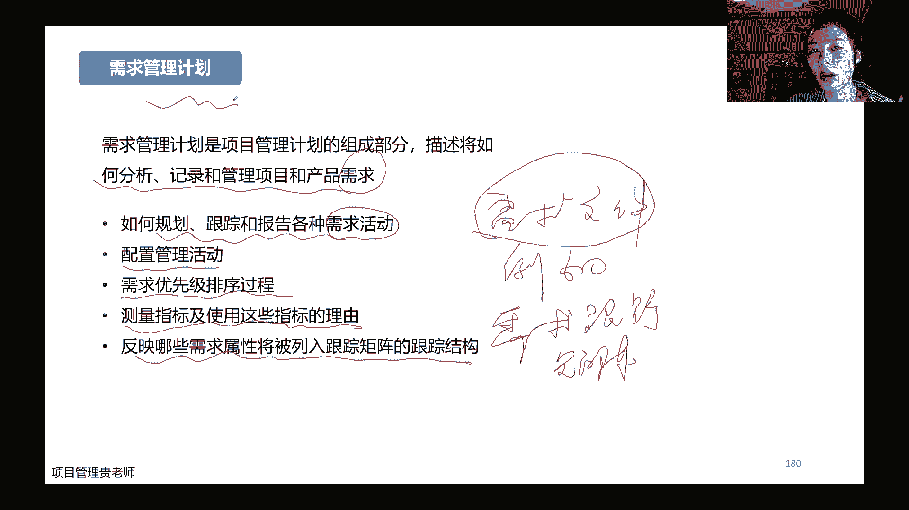
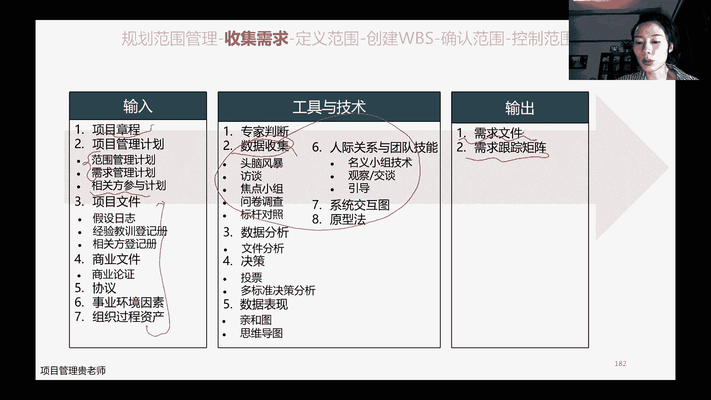
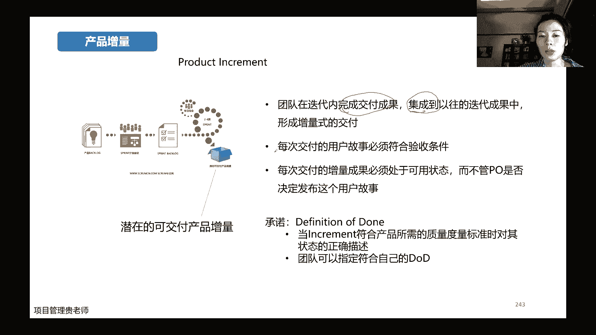

# PMP考试培训课程最新完整版项目管理认证第七版教材新版考纲自学教程 - P5：5.规划绩效域01 - PMP专家 - BV1rM4y1Y79x

各位同学晚上好呀，如果说能够正常听到声音，看到屏幕的话，还是帮我敲一个111，好的收到，谢谢，好七点半了哈，嗯我们开始今天晚上的授课吧。

上一节课讲开发方法和生命周期的时候呢，我们把规划开了一个头哈，那么今天晚上呢会接着去讲，我们规划绩效率的呃，第一个非常重要的部分就是我们范围的规划哈，那么这一章这个课件里面呢就是规划的模型。

上次其实跟大家提到了哈，我们规划的越多嗯，从理论的情况上面讲，肯定是说这个对项目的预估，对项目的预判是更加的好，但是呢我们会耽误很多的时间，但是如果说我们规划的很少的话，那么有一些项目它的不确定性呀。

啊他的一些这个环境内心预估，可能没有被我们捕捉到，所以呢我们在实际的工作当中，要在规划当中找到一个平衡点。

是讲到这里的哈，啊今天呢我们接着讲，那么规划完了之后呢，会有一个这个标志性的一个会议哈，这个会议呢，我不知道大家实际在工作当中，有没有去召开这个会议呢，它叫做启动的会议，可以考命题哈。

kal meeting呢，他是在规划之后开的这个会议，开这个会议是干什么的，我们把规划的所有的内容都做完了之后，会通过这个会议，把我们规划的内容去传达给我们的干系人，传那个该些人干什么呢。

第一阐述我们规划的具体内容，第二最重要的还是让他们去承诺，将来会给我们这个项目一些资源的一些支撑啊，获得他们的承诺，那对于实际当中小一点的项目呢，可能啊一个团队，同一个团队开展项目规划和执行。

然后呢启动之后可能很快就会直接去开工，但是对于一些大型的，比较这个复杂的设计的人呐，设计的周期啊都比较长的，这些项目呢他是在初始的规划工作完成，执行阶段中间开始，就是在这个规划跟执行，中间。

会有一个非常正式的这样的一个启动会议哈，小型项目基本上就黏在一块了，大型项目一般还是有一个这个专门的这样的，一个动作。

那对于我们适应性项目而言哈，我们上次讲开发方法和生命周期的时候讲了，我们重点是以两类两个大类的这个项目类型，去开展我们的这个项目管理的学习，包括我们认证的考试，也是啊两个类型的题目各占一半。

所以既然说到规划呢，我们先说一下，因为适应性的这个项目哈，它是基于环境的变化，不断的去调整我们项目的一些需求，项目的一些范围，所以呢对于适应性的项目来说，我们规划的这一部分的内容。

是比预测型的项目要少很多很多的，为什么呢，因为适应型的项目它有自己的一些价值观，他更关注的是左边这一列的啊，这些也就是说啊这个跟大家写一下，预测好预测性的项目呢可能更关注我们啊，严格的流程。

用什么工具做的非常详细，非常完善的规划的文档啊，合同啊也要把它谈判好，签订好，并且呢在执行的过程当中，要遵循我们所有的这些计划，而对于适应性的项目而言呢，我们更强调的是团队之间的互动，团队之间的协作。

强调的是可以工作的软件有价值的，而不是说你弄一堆啊，看起来很漂亮，但是没有实际作用的，这些文档在合同跟该系人啊，跟客户谈判，跟合同上面呢啊，我们的适应性项目强调的是客户的合作，先把合作关系建立起来。

是不是必须要把这个合同的谈判的，所有的这个对自己有利的这个条件，把它把全部都列出来呢，这个不一定在最开始都是这样的哈，我们先动起来，先跟客户之间建立一种比较友好的一种合，作的一首关系，配合关系哈。

那最后一点呢，哎我们预测是遵循计划，但是我们适应强调的是响应变化，那理解了适应性项目它的这个价值观之后。

我们就知道它的规划的内容，在前期是相对来说是比较少的，因为规划当中我们最重要的是考虑a它的范围，后面还会有它的进度啊，还会有它的成本这一系列的，今天晚上重点在范围这一块哈，所以在规划之前。

我们了解了商业论证啊，了解了他的这个高层次的一些需求哈，和高层次的一些产品范围，对不对，这些都是在章程里边是写到的啊，这里提到的项目和产品范围，大家注意一下产品范围和项目范围。

他们的理解这个区别是什么哈，这个了解就行，重点呢是要看一下这个预测型的项目，它的规范方法是从高层次项目的交付物开始，然后呢对它们进行详细的分解，分解完了之后就得到我们的范围说明书。

或者是呢w v s就是工作分解结构哈，所以呢获得范围说明书和工作分解结构，是我们预测型项目当中，规划范围这一个子过程非常重要的一个输出，而对于适应性项目哈，主要是啊这个迭代性的或者增量型的，这种项目呢。

就包括了高层次的一些主题，或者叫史诗的故事啊，他的他的这个说法哈，这个叫可叫父叫w bs，这个里面呢一般是用主题和史诗级的一些故事，到时候要做的时候进入到每一个迭代，具体要做的时候。

又会把史诗的故事分解成我们具体的用户故事，和我们具体要做的啊，进入到迭代迭代当中的待办事项列表，它两个项目的对于范围句子的描述啊。

这个专业用词是有一点区别的哈，嗯先看一下预测型的项目的范围吧，预测型的项目范围呢，它的过程啊是包括了这么多个子过程，从规划范围管理一样，做完了之后呢，要开始收集需求，收集需求完了之后呢，要定义范围。

定义范围之后啊，就是有了范围的说明书，才能够进一步的去分解这些范围，把范围分解成我们具体要干的，每一项具体的任务叫做创建w b s，w b s创建完了之后呢，啊要做确认范围的这样的一个动作。

确认范围就是要跟客户那边去确认一下，我所做的这些活动啊，是否跟我们约定好的，这个范围是保持一致的啊，范围的这些验收标准是否是能够达成共识的，最后在监控的阶段呢，还要做控制范围这样的一个动作哈。

每一个子过程都有它的输入和输出，我们先来看一下那规划范围管理，这样的一个过程，这样的一个子过程呢，它首先我们会有项目的章程啊，会有事业环境因素和组织过程，资产就是外部环境和内部的一些环境。

包括我们前面选定了这个项目，到底是用是不是用预测性的方法，还是说适应性的方法也ok，生命周期和开发方法的描述，这些条件有了之后，我们通过一些数据分析，通过专业专家判断一些具体的一些技术呢。

会得到我们的范围这么广。

哎我们的需求怎么管，这里呢有一个这个要注意的点哈，大家可以看一下范围管理计划呢，它主要是，描述如何定义，如何治理，如何坚，都，如何控制，如何确认项目范围哈，它描述的是高层次的工作指导方向。

嗯所以呢呃有人就会说哎，比如说项目的范围是不是记录在我们的范围，管理计划里边呢，不是的哈，你如果说要找它的范围在哪里呀，是要在我们的范围说明书，或者说我们的w bs更详细的。

这些具体的范围描述文件里面去找的，在管理计划里边是找不到这个东西的，管理计划，他只是描述这些过程啊，这些程序应该怎么做，这一做的结果它是没有的，这个是有点区别，大家要注意啊，考试有可能他会考到这些。

这个就是用一些方法管理计划呀，或者是这个范围说明书来干扰大家，所以它最主要的目的呢是要制定啊，这个方位说明书啊，根据详细的方位说明书创建w p s啊，并且呢诶确定如何审批和维护范围。

基准正式验收已经完成的项目可交付成果，这所有的过程都是我们后面要做的此过程，那这些子过程到底怎么做呢，在这里找答案，在管理计划里边找答案，它是一个计划哈，需求管理计划啊。

需求管理计划呢它跟项目的范围管理计划，就是共同都组成了项目的这个范围管理计划，这个子过程的一个输入哈，需求管理计划呢，它是描述如何分析记录管理项目产品的需求，前面说的是怎么管理他的这些范围，怎么监控啊。

怎么制定它的范围，这里呢是说怎么分析，怎么记录，怎么管理呀，他们的需求这两个有一点区别哈，那具体呢就包括怎么样去规划，跟踪各种需求的活动啊，怎么样安排配置管理活动需求的优先级啊，怎么去排序测量指标。

以及呢为什么用这些测量指标理由是什么，并且呢要反映哪些需求的属性，要被列入到它的跟踪矩阵，就需求跟踪矩阵里边，是比如说啊什么类型的需求，它是必须要列入到我们的需求跟踪矩阵的，哪一些需求啊。

它是可以不用列入到我们的需求跟踪矩阵的，记住就ok了，或者说用一个其他的文档哎，简单的记录就ok了，这些呢是放在我们的需求管理计划里边的，同样的大家啊，如果有人问你需求记录在哪里呀。

需求它是记录在有专门的需求文件啊，例如，需求跟踪矩阵，是进入了在具体的这些文件里的，而不是在管理计划里面的管理计划，它是我们指导工作的方向哈。

这个跟范围管理计划是一样的区别，规划范围管理做完了之后呢，哎我们就要开始正式的进入到收集需求，这样的一个子过程了，收集需求呢他是说诶我们怎么去确定，怎么去记录，怎么去管理相关方的需求的这样的一个过程。

那什么是需求呢，什么是需求呢啊第一我们跟客户。

比如说签的有协议啊，或者有一些其他的一些规范性的一些一些约束，那么约定了我们的产品服务，或者说呢这个合同的可交付的成果，他必须要具备哪些能力，必须要具备哪些功能，必须要具备哪些条件。

它也包括了发起人或者客户，或者是其他的提出了对这个项目，他所啊希望达到的一些这个期望，这也是需求，所以需求呢他应该详细的啊去探明分析和记录，包括在范围的基准里面，范围基准回头马上会讲到。

确认范围之后就有范围接触了，同时呢需求将成为工作分解结构的基础啊，也决定了后面的成本啊，进度啊，质量啊，规划的这些内容，因为需求决定一切，对不对，没有这个需求，或者说这个需求不明确。

后面所有的工作我们做起来都比较困难。

收集需求它也有一些输入和一些输出，这个里面呢，大家重点要掌握收集需求的一些工具和方法，至于他的输入啊，还是跟平民一样的，我们有项目章程啊，有这个时候已经有两个计划了，有一些相关的参与计划，还有一些项目。

其他的一些辅助性的文件，这个都是通用的，那在这里面呢，哎我们会在基于这些前提，基于这些输入之后，再利用这些工具，这些工具主要是一些因为收集需求嘛，所以最重要的就是数据收集的工具和技术，出来之后呢。

诶会出来需求文件和需求跟踪矩阵。

既然提到需求哈，就是啊这也是网上特别经典的，关于理解需求的一个这个一组图哈，这组图段很有意思，客户描述的时候，他肯定会说诶，我假假如说哎我想要一个这个秋千，这个秋千呢啊。

最好是能同时满足三个小朋友一起玩儿，项目经理听完了之后说这个简单啊，一个秋天再来三个，别说三个了，我十个也行，30个也行，对不对，然后分析人员呢，哎设计的时候他为了考虑这个美观性呀，哎结构性啊。

还搞了这个特别对称，秋千荡不起来，还把中间去开了，到开发人员的时候呢，做出来的是这样的一个东西，但销售人员会怎么说呢，哎呀我们这个沙发啊，我们这个秋千非常符合人体工学，坐起来非常舒服。

就是各种怎么好就怎么去描述，对不对，然后但是项目文档呢啥也没有一片空白，什么也没留下，到最后安装的时候呢，更离谱一个神，但是客户花的钱，就像建了一个整个这个过山车的这个这个一样，巨资，对不对。

最后客户维护的时候基本没什么动作，最后发现诶其实客户的需求啊很简单，也不需要做一个看起来特别像秋千的一个秋千，你随便搞个轮胎，搞个能够站在上面玩的诶，也许就满足客户的需求了，但这个例子说明了什么呢。

说明理解需求，它一定是一个非常重要，但是又非常困难的工作啊，这里有一个更直白的一个例子哈，比如说顾客跟你说，他说我需要一匹更快的马，那么嗯如果我们自己做一个项目经理，得到这样一个需求之后。

大家会怎么去做呢，啊这个很有意思啊，我之前问过其他的学员，有人就说呢嗯去去马场去找啊，看看哪个品种啊，甚至还引用了非常多的一些历史的一些典故，哪个品种的话会更好更快，那这个时候我们正确的应该怎么去做呢。

要想想客户它的核心的目的到底是马嗯，还是说啊它更快，它为什么需要一匹更快的马，对不对，那他是比如说他是想更快的到达一个目的地吗，那如果说他是想更快的到达一个目的地，是不是我们除了马。

我们还可以选择其这个别的东西，别的动物，或者说现在直接开车啊，坐飞机都是一种选择，对不对，是不是一定需要马呢，这个是要打问号的啊，那如果说客户端的需求a真正的是一只马，是一匹马。

只不过说他强调这个马更快，那我们就要了解他需要这个马的目的，到底是什么，是观赏性吗，还是说娱乐性呢，如果是观赏性，那我们在选择马的时候，是不是更考虑这个马的这个毛发是不是啊，是不是很亮啊，是不是正亮啊。

对不对，这个马的体格啊是不是非常的优秀，那如果说他是更想具有一些体验性的话，那我们除了马是不是还会有一些其他的一些，比如说你骑个骆驼是不是更大风，对不对，所以它衍生出来的我们客户说了什么之后。

我们一定要去了解一下他基于这个需求的描述，背后的原因到底是什么，从头开始去追溯哈，因为你看大家都会吐槽说哎呀，这个客户经常去变需求啊，或者怎么样变需求，它有一些根本性的原因，有可能是这个需求。

确实在我们刚开始执行这个项目，或者说刚开始谈的时候啊，没有捕捉到这样的一个需求点，没有捕捉到这样的一个变化，所以呢它确确实实后面才能出现，这是一种非常常见的一个原因，但是呢还有很多的一大部分的原因是。

因为最开始的时候，大家对于客户的需求理解是有误区的哈，有误差的，就比如说这个例子，我们没有搞清楚它背后的逻辑到底是什么，以至于我们做出来之后，客户才知道这压根就不是他想要的。

所以收集需求是从理解需求开始的哈，那么需求分类需求呢，嗯之所以很难搞，是因为需求的类别太多了啊，首先业务型的需求，业务性需求一般甲方那边的高层，或者说自己公司内部的一些项目啊，提出他的一些想法。

啊对于相关方啊，对于我们这个项目最终的他的一个用户，用户会有一些用户上面在使用上面的一些需求，在属性上面呢，又有一些必须的一些功能性的需求，哎呀还有一些非功能性的一些约束的一些需求，还有整个这个过渡啊。

就绪的这些需求，项目需求，还有质量需求啊，这些都成为需求，那需求到底是怎么分析呢，啊有一些具体的这个卡洛模型啊，这个鱼骨图分析法等等，大概呢我们通过这些方法，可以把我们所有收集来的需求分几个大类。

第一个呢是我们立即要开始啊去捕捉去执行的，第二个呢是哎当前还优先级没有那么高，我们暂时把它放在我们的需求池里边，等到哎将来条件合适的时候，我们在进行这个需求的执行动作啊。

最后一种呢就是我们可能直接觉得这个需求啊，它不太合适，它的成本代价太高，我们可能就直接把它取淘汰，那需求文件呢啊，一般是说我们，要描述各种单一性，如何满足跟我们项目相关的一些业务需求啊。

刚开始可能只有一些高层次的，但是呢我们随着需求的分析，需求的收集啊，范围的确认会逐步的进行一些细化，同时呢我们这些需求要符合smart原则诶，之前讲课的时候，不是跟大家讲过我们这个目标的司法的原则吗。

跟需求是一样的意思哈，你只有符合smart原则之后才可以作为基准，smart原则今天晚上也会讲到啊，根据详细，根据项目的不同，会要列出全部的需求，然后记录呢啊要保证这个需求是比较清晰的，大家能够看得懂。

因为一般情况下，我们收集需求的人跟我们实际做开发的人，他有可能不是同一个，或者说呢他们之间的沟通不是特别擅长，所以你在记录这个需求文件的时候，一定要清晰简洁，可以去跟我们的啊这个需求提出者。

需求来源者去核实，要保持一致需求，整个文件的记录从哪来到哪去，中间经历哪些过程，要可以追踪，要完整他的几个约束条件哈，那smart原则，首先呢啊这个目标和需求都是一样的，首先他们必须要明确。

这个呢引用大家，这个不知道大家有没有看过这个呃，这个爱丽丝梦游仙境的啊，这个里面呢我记得有一个非常经典的一个对话，当时应该是爱丽丝问一只猫说，我我想我我现在应该往哪去走，然后那个猫就问他啊。

你想去什么地方呢，他说嗯我也没有想好去哪，然后那个猫就说，那你走什么路都无所谓，对不对，所以你的目标你连自己都不明确都不知道，那首先第一个这个要求，第一个这个约束条件就没有达到，第二个啊是可测量的目标。

就一定是可以测量的，就是你的这个目标，如果说啊特别的啊这个宏大特别的虚，我根本就不知道说哎比如说你你说你要减肥，那1年之后你减肥成功了吗，我也不知道你衡量的标准是什么，你是比如说你减个十斤是成功了。

还是说你约定的这个减个20斤，或者穿衣服从m码哦，你们都是男生哈，不错了，或者你们穿衣服从xl然后变到了l或者叉叉，l变到l，二是你衡量的标准是什么，测量的标准是什么啊。

再一个呢啊可实现的目标一定要是可实现的，你啊就是比如说哎，我今年比如说我想赚个100万嗯，那你想想你怎么赚到100万，对不对，你要去规划一下你的啊这个这个工作内容，或者说你的这个项目的一些情况啊。

去拿哪些单子啊，或者说去管理哪些大型的项目，通过薪水啊，基本的工资啊，年底的奖金或者项目的奖金，能不能达到这个目标，如果你把所有能有可能的，都以最乐观的价值去预估，跟100万还差的相差很远。

那可能你这个目标也是一定会变成一个口号，对不对，根本就不可能实现，再一个相关联的，这个相关联的呢是指的是我们的目标，我们的需求是一定要跟我们组织的战略，是相关联的哈，我们因为是在组织的过程当中啊。

去服务战略做的这个项目，所以我们项目如果说跟组织的战略是不相关的，那可能组织在投入资源的时候就会相当的谨慎，还有实现的1年，你在1年之内啊，比如说你还是书生，你在1年之内你要减十斤下来。

从这个呃这个目前的体重到达一个，当到达一个1年之后的一个体重减十斤，跟2年之内减十斤，那意味着你每一天或者说定期进行的健身，或者饮食方面的一些动作，他肯定是不一样的，对不对，因为时间周期完全不一样。

所以目标再次开始定的时候，一定它是要有实现的哈，所以这几个啊就是明确的可测量的，可以实现的啊，跟组织相关联的啊，就是有实现的，这些这五个非常重要的一个维度的指标哈，我觉得对于大家工作啊。

对于大家提目标啊，对于大家自己给自己定一些个人的目标，都是非常重要的哈，大家也可以自己去检查检查，看看自己嗯从什么时候开始定过什么样的目标，这些目标呢有没有达到，达成的情况怎么样，为什么没有拿。

为什么没有达到，没有达到的这些目标当中，是不是有一些是你在定目标的时候，就没有满足这个原则，某一方面是比较欠缺的，所以以至于呢他没有很好的约束，我们接下来的一些行动计划啊。

以至于到最后这个目标自然而然的达到，就打了一些折扣，大家可以自己去想一想哈，好需求文件啊，这有一个示例啊，它一般呢，当然我这个上面的示例都是非常简单的哈，大家在实际工作当中。

公司的模板或者自己在设计的时候，可能比这个要稍微复杂一点点哈，它得有几个核心的要素，就是它的来源啊，这个干系人是谁，然后呢这个需求是什么，这个需求是怎么分类啊，我们前面不是讲需求有很多个分类吗。

啊它的优先级排序怎么样，然后他最后的验收标准是什么呀，这几个核心的关键因素啊，他一定要有，比如说举个例子啊，我们讲这个质量方面的一些需求，a可能他的该新人，主要就是一些质量公司的质量部门啊。

他具体需求有一些描述，比如说什么过程要满足什么样的质量标准，要分类分类，比如说这个质量需求里面优先级高不高呢，质量高还是很高的，排在什么情况，然后验收标准啊，比如说你这个合格率达到多少呀啊。

或者是这个测试的这个bug率呀啊故障率啊啊，它会有一些具体的一些指标出来，那需求跟踪矩阵呢，他是说把这个核心的哈，意思是产品的需求从哪里来，然后呢到最后出来的可交付成果是怎么样子。

它有一个全过程的一个跟踪哈，来源啊，到可交付成果中间会进行一系列的动作，每一部分的这个动作啊，新增或者变动或者啊删除它，最后出来的是什么样的全过程的一个跟踪，是这样的一个表格。

所以它最主要的这个功能呢是每一个需求，它都能够跟业务目标更向目标把它关联起来啊，因为可交付成果，这里对应的是我们的项目的目标，所以你前面的需求来源，是一定要跟我们的项目标最终是能够匹配。

是能够对应起来的嗯，那为什么要做这样的需求跟踪矩阵呢，它主要是为了a第一我们要跟踪目标，跟踪目标才能够去满足项目目标，满足业务需要，并且呢给我们的项目范围和w p s呢，提供合适的一些支撑。

是从高层次的需求到详细需求，一步一步去啊，这个细化的这样的一个场景，一个过程，这也有一个需求跟踪矩阵的一个事例哈，大家也可以看一看啊，需求的信息啊，关系矩阵需求信息呢，主要是包括这个它具体的需求是什么。

需求的优先级需求的分类需求是从哪来的，这个跟我们前面的这个需求文件啊，是一脉相承的，然后需求这个编号需求它也会有一个编号，尤其是对应的w bs会有一个编号，然后跟我们向目标的关系。

在w vs当中可交付成果对应的是什么，他如何去检验，然后这个需求啊，它是目前是有没有得到一些确认，确认完了之后呢，后面可能还会有a它当前的一些状态是什么，是已完成还是已取消啊，以变更啊。

还是进行大法也不难，他会有更多的一些这个动作哈。

这里呢是一个具体的，在实际项目当中的一个案例啊，比如说这个这个系统名称，它就是做智能电控的，然后这个前面类型看一看哈，然后呢他做这个电控系统，它有很多个模块啊，有很多功能组件。

然后每一集它的一级功能是什么，然后呢再细分到这个二级功能要做什么，这每一级功能它如何去描述，然后呢基于这些具体功能架构师要做什么结构，是要做什么，电气工程师要做什么，软件工程师要做什么啊。

最后交付的出来的时候，测试工程师要做什么啊，就是一步一步的这个需求，每一个参与的人，他做的每一个章节，这个需求的野生的过程都有一个全过程记录。

这个大家可以再去看一看哈，这只是一个使命，然后工具收集需求，我们前面讲的它非常重要啊，这个工具呢大家都要掌握，因为这个工具嗯是一个非常重要的考点哈，考试基本上都会考一些，收集需求的一些这个场景。

然后让你选择用什么样的工具和技术来做这呢，从收集，然后到分析到决策啊，到如何这个去展示可视化啊，还有一些团队的方法啊，这个这个团队的方法我们也把它包括其他的，我们不也把它归在这个数据收集里边。

其实嗯很多人觉得觉得这个项目管理啊，当中的一些工具很难去记忆，因为觉得太多太杂，其实大家要发现里面有一些这个关键的一些，逻辑性哈，因为很多的子过程，很多的子过程我们在做的过程当中。

它其实啊工具都是从首先我们要收集信息，对不对，收集数据收集完了之后呢，我们有光有数据不行啊，我们要做分析，分析完了之后要展示，对不对，也就是他说的这个可视化啊，基本上都会经过这些步骤收集分析展示。

所以收集里面具体是什么方法，有哪些分析是哪些，然后呢展示又是哪些，大家理解了这样的一个过程，再去找这些工具的时候，或者说去记忆这些工具的时候就非常简单了哈。

好我们一个一个来说，首先啊这个头脑风暴法，头脑风暴大家应该应该都听过吧哈，同样风暴就是很多人坐在一块，大家畅所欲言，鼓励大家更多的说出自己的一些想法，所以他主要是收集啊项目需求。

产品需求很多种一种创意实施的步骤呢，哎提出问题，然后呢有一些背景资料给大家看一看啊，选择哪些人来参与，大家共同自己去这个设定问题啊，这个去提出一些想法，然后呢主持人来引导来发言，最后呢进行一些总结。

然后有很多非常啊这个五花八门的一些点出来，第二个呢是访谈，访谈呢他关键词是这个一对一或者一对多，嗯一般情况下是面对面哈，如果说实在不行的话啊，这个一对一的这种这个电话呀。

或者一对一的这种视频也是ok的哈，它是呢嗯就实施的步骤，确定访谈的这个目的对象，然后呢列一下访谈的计划提纲啊，然后呢再根据提纲去实时访问记录信息，最后呢有一个访谈的这个报告，一般我们做咨询的时候。

这个访谈肯定是会问到的哈，嗯所以访谈的时候呢，就是嗯一般我们一对一或者一对多或者一对二，这种实施的情景都会遇到哈，而且这个应该大家在收集需求的过程当中，尤其是对方是呃。

比如说是甲方稍微高一层那一点的领导，这种一般都是用访谈哈，跟你一块儿头脑风暴，他们没有这个时间啊，所以你只有约他们的时间去做这种调研，去做这种访谈啊，焦点小组，焦点小组呢它其实是一种引导式的这个访谈法。

它的核心的关键词哈，是要召集一些主题的专家啊，然后呢有一个主持人来引导大家，共同的来互相来讨论这个问题啊，讨论这些需求，所以它的关键词哈就是嗯考试的时候，他如果出现了说a召集某一个部门的。

或者说某一个领域的这些专家，然后来共同的来研讨一下，那这肯定是主题专家，肯定是焦点小组哈，记住关键词就行了，然后问卷调查啊，问卷调查呢他是说这个设计一系列的书面问题，然后去嗯你想上谁去调查他。

谁是你印象当中的啊，这些受访者，你去把这个调查问卷发给他们，然后呢让他们去填，填完了之后呢，你再去你再去把这个问卷收回来，再做一些分析，它一般适用的一些场景呢，就是嗯这个相关方因为比较多。

你没有办法一对一的访谈，一对多的访谈也不现实，焦点小组让大家走出山再来开会也不太现实，或者让大家啊这个分散比较多，这个甚至是国外的也有，那这种呢我们用问卷调查，因为他这个电子的问卷调查表也是ok的嘛。

这个时候就是效率相对要高一些，好标杆对照，标杆对照呢就是说哎主要它的关键词哈，是进行比较，然后呢形成一些改进的一些意见，也就是说我们最开始的时候要确定，进行标杆对照的一个项目。

就是我哪些项目要做标杆对照，然后呢找出他的一些属性，收集相关的数据之后来进行比对，比对之后，然后再根据比对的结果进行调整，进行优化，形成我们最终的一个方案，标杆对照适用的一些场景呢，比如说题干当中。

他可能告诉你a我们这个项目组啊，这个在设计需求的时候啊，有可能是这个这个客户，他因为什么时间耽误了啊，但是呢这个客户之前啊，是基于什么什么样的这个同类型的，做过什么什么东西啊，我们可以选择这是什么方法。

那这个时候如果说题干当中，其他的选项都不太合适，但是呢有一个标杆对照的话，我们可以考虑参考这个哈，文件分析，文件分析非常简单，文件分析就是字面意思就是分析现有的文件，现有的一些数据和信息，决策。

决策呢是有几种常见的哈，这个第一种呢是一致同意，一致同意，就是百分之百都同意，这个信息收集来了之后，然后有一些比较有争议性的，那我去征求大家意见的时候，大家全部都同意诶，这不就是一致同意。

大多数统一呢是说诶超过50%，超过50%的人都同意，我们叫做大多数同意，相对多数同意呢是有很多种不同的意见，但是呢我们取了中间同一个数量最多的那一个，在相对多数哈，这两个有时候大家会弄混。

大多数超过50%，相对多数不一定是超过了50%，他只要是相对最多的那个就ok，这个是决策的几种类型哈，当然决策的基础类型呢，还有一种是这个多标准的啊，决策分析，多标准的决策分析，他是什么意思呢。

它就是你选择啊决策要素的时候，它是有多种决策要素，比如说哎我们要考虑成本的，我们要考虑时间呢，我们还要考虑资源呢，我们要考虑它的不确定性和风险啊，然后每一种方案他都会有。

这个在每一个维度它都会有不同的得分，然后最后我们取一个均值加权或者不甲醛都ok，这个根据具体情况，具体的这个项目要求具体去看哈，加权我们就乘以它的加权数啊，不加权就直接这样相乘相加，得出总数之后。

然后根据他的要求去做决策，德尔菲技术，德尔菲技术的关键词呢是要匿名背靠背啊，是由一个主持人呢，哎我去问这个人啊，问这个专家专家有一些意见，哎我听了，然后呢我再去问第二个专家，第二个专家呢也有一些意见。

然后第一个专家，第二个专家啊，甚至第三四个专家呢，他们都有自己的意见，主持人经过平衡之后，然后再单独的去跟他们进行沟通，说诶可能是不是其他的方式也比较合适啊，然后再听听这个专家的意见。

诶是不是能够调整一下他自己的一些想法，经过这样多轮的啊，主持人去协调去沟通，最后得出一个相对来说诶，还比较符合我们最终的这样的一个意见的，这个方式哈，所以它的关键词是匿名背靠背的区分，专家清河图。

清河图呢啊，它是嗯，其实最开始是这个第一个步骤是头脑风暴，但是呢，他在头脑风暴的基础上加了一个分类归纳法啊，就是很多人他啊我前面讲头脑风暴，他不是提了非常多五花八门的一些意见，一些创意，一些想法嘛。

那么清河图呢是把这些创意，这个想法分门别类分类，这是它的关键词分类，比如说我提到的a这些都是功能性的啊，这些都是非功能性的，哎这些都是质量要求啊，或者是一些这个安全性的一些约束，我把它分类别类。

这个叫清河图哈，它实施的步骤啊，这个这个考试一般不会考步骤哈，基本上就会考学的什么方法，然后实施步骤呢，大家作为自己的这个工作。

然后自己去看一看，思维导图，思维导图呢大家应该都非常熟悉啊，应该有结构性比较好的小伙伴，可能日常在工作当中用的也比较多哈，常见的是软件和工具，x y的可能用的用的多一点，我也经常用哈，然后常见的这个啊。

比如说我们要有一个功能汇总，然后这些功能呢嗯需要有系统设置啊，有首页有商城啊，有个人中心，个人中心又分了什么什么什么呃，这个如果说大家是写这个这个做收集需求的，这些人应该很会用思维导图吧。

这一套应该看起来特别熟悉哈，思维导图呢，它除了啊前面我们讲的这种这个典型呢，它其实是一种树状图，他除了数张图之后之外呢，它其实还有其他的一些图示法哈，比如说我们啊这个圆圈图，气泡图。

双气泡树形图就是刚刚讲过的，讲过的这个从功能需求啊，这个x麦通常用的都是树形图，然后还有括号图，流程图，负流程和条形图，嗯这个如果大家感兴趣的话，其实也可以去嗯去去学一学看一看哈。

因为思维导图真的是很好用，然后我给大家找了一些呢是比较嗯，这个常用的这个是圆圈图啊，我们比如说有一个这个中心的主题，它的强关联性呢强的是啊这个第一圈，然后第二圈又是什么，第三圈又是什么，它有一个分类。

一个逻辑，然后但是我们展示的时候呢，是用这种圈图把它展示，这样大家在看的时候就可以非常直观，非常一目了然就可以看到，当然了啊，这种除了原生图这种还有气泡图，你看用气泡图去描述一个事情。

或者一个人物或者一个事件，他的各种特征啊，就就相对来说比较方便一点，它描述起来比较方便，你这举的例子是描述曹操的一些性格特征，然后还有双气泡图，双气泡图呢它一般是拿来去对比分析的哈。

比如说他这个对比的是自行车和电动车啊，他们都是交通工具，都是两个人都可采，但是呢他们还有各自不同的一些特征，所以它用在两个时间去对比的时候，是非常合适的，然后这个呢是负流程图。

负流程图呢一般是是是这个字，是这个符号，流程，复流程图呢他一般是描述他的这一个事件，或者一个人或者一个活动，他的因果关系的哈，所以你看啊这个哈哈利波特亚之所以这么成功。

是因为这么多原因导致这么多很好的一些结果，他展现出来的这些比较好的一些特征啊。

民意小组名义小组是什么意思呢，名义小组它主要是这个也是头脑风暴，完了之后呢，唉大家要经过排片，经过这个投票去排排除哪一个最好啊，它有一个优先级的这个顺序，排顺序的排列在里边，这是它的关键词哈。

这几个不同的这些技术呢，大家在做题的时候，可能有可能还会遇到一些比较困扰的，到时候我们具体做题，有一些场景的出来的时候，咱们可以再继续深化讨论哈，观察法啊，观察法呢其实比较重要啊，但是呢。

我估计大家实际当中用的可能会稍微少一点，因为观察法对于嗯，对于这个收集需求的这个人的，要求其实是比较高的，需要他经验比较丰富，希望他很会察言观色去洞察哈，那这种方法一般是用在受访者，他不是很愿意说啊。

或者他说不清楚，或者呢他在这个对方，或者在甲方的这个嗯结果里面，他的职权比较小，那他有些话是不方便说的，那这个时候呢我们就啊用观察法去捕捉，然后去引导哈，讲到引导，然有引导法，引导法，那主要是哎。

比如说我们有一些跨职的一些这个部门，他们有一些完全不同的，甚至差异非常大的一些需求，那我们如果说要在他们之间的需求做一些平衡，做一些取舍啊，找一些折中点的时候，那怎么去引导，最终让他们达成一致意见哈。

所以引导法的落脚点要让他们达成一致意见，常见的引导技术呢啊团队共创就是要明确主题，然后在头脑风暴，头脑风暴完了之后，有很多创意出来在啊分类排列用到清河图，然后再找一些关键词。

然后再用图示法去给它赋予一些，具体的一些含义，然后世界咖啡啊这个具体的这些这个步骤，大家自己去看，开放空间欣赏探寻，这个都是我们常见，可以用的一些引导的一些技术啊，系统交互图。

系统交互图呢这个如果大家是做软件开发的啊，应该也会这个很熟悉啊，那这举的例子呢是这个公司它的人才管理系统，那人才管理系统呢，这个有呃，这个系统肯定，一个系统肯定是有内部的用户要用，对不对，有关您的后台。

然后有那个用户啊，还有一些外部的用户要用，那对外部呢主要招聘的呀，求职的呀，还有一些外部合作的一些网站啊，内部的招聘经理他要用啊，他要看信息啊，内部同事他要用这个人才管理系统。

去做自己的一些信息的一些目录啊，然后一些分包商啊，那我们整个这个系统交互图啊，这也是呃这个呃需求展示的一个，这个比较重要的一个工具，而且是比较常用的，它圆形法啊，原形法呢一般是我们在啊。

比如说跟客户的第一轮或者第二轮的沟通之后，会出现一个这个模型啊，先出现一个demo，然后呢再拿这个模型去啊，这个让后让用户先体验一下唉，你想要的这个这个产品，或者这个啊这个软件系统是不是啊。

核心的是这个样子，然后基于给他一个参考，然后他再提意见，我们基于意见再去深化，再去细化，因为很多时候可能用户它啊只能非线性的啊，只能多一榔头西一棒子的这个描述的需求，那我们需要去整理，需要去归纳。

需要给它提示，或者用这个模型展示出来，他才能够去懂，对不对，因为他不是这个专业的，好前面讲收集需求啊，我们有这么多的这个工具和方法，下面需求收集来了之后，我们要开始定义范围了，定义范围呢。

它主要的是描述我们的产品服务和成果的边界，以及验收标准是什么样子。

嗯这儿呢也有定义范围的这个输入工具，工工具和这个输出输入呢，还是这些文件哈，最主要的我们项目管理计划要参考呀，需求文件不是有了吗，啊这个就是外部内外部环境要参考的哈，工具和技术啊，有数据分析，有决策。

最后说出来的是七项目化为说明书啊，还有一些这个需求跟踪矩阵啊，以及啊有这个需求是怎么来的，从哪来的，可能会识别到一些新的相关方，那么相关方的一些登记册，而是在这里面的，它最重要的就是范围说明书。

需求文件。

范围说明书呢啊它是长什么样啊，我们看它主要是对项目的范围，可交付成果，假设条件和质因素的整体的一个描述，就说的直白一点，就是说我们这个项目它到底要做哪些，不做哪些啊，有什么条件，基于什么条件下。

如果这个范围没有做到，那责任在谁啊，假设条件这些因素把它描述清楚就ok了哈，这里呢啊这是更直观的描述啊，可交付成果验收标准啊啊除外责任，这是最基本的四个大块的这个核心内容哈，啊。

然后这儿有一个具体一个这个模板的一个事例，这个事例嗯比较简单，这个只能帮助大家理解范围，说明书包括什么内容，但是实际大家在工作当中，如果说要写方文说明书的话，这么写肯定是太简单了。

嗯既然提到了项目范围哈，有些人呢嗯可能难免会想，那我前面章程不当，章程当中不是也有范围吗，方位说明书也有方位，那这两个有什么区别哈，这个有时候考试他也可能会考，所以呢这个点也比较重要，我们前面说了。

章程呢它主要是一些高层次的一些需求，所以呢我们在做收集需求定义范围的时候呢，会把这些高层次的需求再去细化，再去找出这些需求背后的一些东西，去跟正去优化得出来的项目方的说明书。

所以它是具体的渐进明细的一个具体的描述，包括可交付成果哈，章程当中也是一些高层次的，也就是说我制定章程的时候，我我只是这个合同签了啊，然后完了之后呢，我有一个大概的一个范围，对不对。

我证明这个事情我章程做了之后，我才能够啊去给项目经理啊，给他去授权，我才能够在公司逆向逆了像之后，我才能做动作，做完动作这个收集需求，这个动作我才能知道它具体的范围是什么，对不对。

所以它是有一个从上往下啊，从前往后不断细化的这样的一个过程，它有可交付成果，验收标准啊，排除项，这都是具体流动具体的东西了，所以呢它可能会有一定程度的重叠，但是呢详细程度是完全不一样的哈。

一个是高层次的啊，然后一个是详细描述。

这个大家理解，记住，啊具体工具哈，那我们说这个定义范围要用什么样的工具呢，主要是这个产品分析哈，定义产品和服务啊，包括怎么提问啊，回答呀，怎么描述要交付它的这个产品，它的用途是什么，特征是什么。

还有其他方面是什么呀。

啊这些都是一些核心的比较重要的，或者说比较常见的呢是这个嗯，叫做这个q f d质量功能展开图啊，就是如果说大家写这几个字太复杂，也可以简单的把它称为这叫质量屋啊，这个是我们定义需求定义范围的嗯。

比较常用的一个工具哈，它的核心的啊一个操作呢就是我们要从使用者，要从用户的角度啊，去这个去考虑如何保证它的质量啊，举个比较简单的一个例子哈，比如说嗯比如说你要开一个开一个餐馆吧，那你要开一个餐馆。

你要从这个质量保证方面来，去了解各方面的需求，要保证到就是顾客的需求都把他照顾到的话，你可能会想，那顾客有哪些需求呢，顾客他是不是要求你既然是餐馆的话，那是不是卫生要好呀，对不对，那你是不是菜品要好呀。

哎菜品好的话，又包括他的，比如说原材料很新鲜呀，然后呢上菜的速度很快，节约时间呀，啊这个菜品种类很多呀，啊等等这一些除了产品之外呢，是不是他还看了你参观的这个服务怎么样啊，啊服务员长得漂不漂亮啊。

服务响应是否及时啊，啊这个其他还有其他的等等，一方面哈，这些都是从质量保证的角度，站在顾客的这个维度去想的，各个维度上面的一些需求点，那你根据这些不同的这些类别去分别去做验证。

最后呢得到你的这个一个解决办法，一个解决方案来看看优先做哪一项事情，或者优先满足哪一些需求是最合理的，最合适的。

第一范围做完了之后呢，我们就要正式开始创建w b s了，创建w bs呢，他的意思是说我前面不是有范围说明书了吗，但是范围说明书它还是一个文档呀，对不对，他只是说只是定义清楚了之后，这个范围到底是什么。

要做什么对，但是我范围怎么样把它变成，我实实在在的要做的工作的任务呢，范围跟任务之间又有一定的区别，对不对，范围是否要做成什么样的事情，达到什么样的目标啊，这个进行到w p s当中呢。

是我要到每一个基本工作，包到基本工作任务是我的工作活动是什么，对不对，所以呢他是把工作分解成较小的，易于管理的一个组件，wb s组织b d呢向的总范围啊，你看这他就写了，放个说明书跟他的区别。

然后w bs的最底层为工作包，工作是指活动结果，未做活动结果，产生那些这个工作或者可交付成果。

而不是活动本身，好他也有一些核心的一些输入和输出，然后以及这个工具哈，他的工具里面重要的我们既然是w b s嘛，那分解我们的这些范围嘛，所以分解肯定是当中非常重要的一个技术。

然后它输出来呢就是我们的范围基准了，其他的这些输入呢啊仍然是前面的。

有需求文件啊，有范围说明书，这列的呢就是诶创建w bs出来之后，他有w bs，然后呢还有w bs词典，w bs词典，简单理解就是对w bs里面，它是一般情况下是有一个结构图，然后这些结构图呢哎分解出来。

分解出来到最底下一层呢，它是具体的工作包，然后w b s呢会啊对他有一些句子的编号，比如说哪个活动是嗯编号是多少，然后呢它有一些涉及到一些关键点是什么样子，会有一个解释哈，然后范围说明书啊。

这个是文档型的，它们共同构成的叫做范围基准哈，所以大家不要预知的a范围基准，就是我范围说明书，那个还不够，那范围基准是不是就是我的w vs呢，哎那个又太详细，所以他们是这个w b s。

w b s字典加上发文说明书啊，三个文件缺一不可，是项目基准方为基准哈。

呃这有一些使命嗯，这个呢比如说我们还是要做一个软件哈，然后这个软件呢我们可以分解的时候呢，可以从这个要做日志软件，我们需要做哪些啊，工作的步骤，我们按照步骤去分啊，要做整个管理的工作啊，做规划呀。

哎会理啊管理啊，然后我们要收集产品的需求啊，要做详细的设计呀，啊要开始做开发的工作啊，构建的任务啊，然后要啊做集成啊，要做测试啊，这是这个第二层，然后到第三层呢，诶我管理的工作要做哪些呢。

我要开始给这个项目做规划呀，啊那就是要开会呀，啊要做具体的一些文档的一些管理啊，配置的一些管理啊，然后我做产品需求的时候呢，哎我又分我软件的这个需求啊，我用过手册，然后我培训资料怎么弄详细设计呢。

哎到了设计的时候我要搞诶，我软件详细设计要包括哪些用户手册，要包括哪些一步一步的分解下去哈，嗯当然这个是作为，就是因为项目每个工作阶段去作为第二层，不完全都是这样哈，我们还可以用主要的可交付成果。

来作为第二层啊，这还有一个例子帮助大家理解哈，比如说我们要做一个飞行的系统，然后这个飞行系统包括哪些呢，啊又最后要交付出来什么东西呢，我要交付项目管理的工作啊，我要交付这个你飞行速度肯定是要培训的。

然后我有很多的过程性的，或者结构性的一些数据啊，我有飞行器要做，我有一些辅助的设备要做，还有设施配套的啊，还要做测试和评估，这些都是我要做的可交付成果，那么根据不同的可交付成果啊，我要做哪些工作呢。

比如说我培训我要做设备的培训啊，设计的培训，服务的培训啊，啊我数据我有些技术的一些工程的，一些管理的一些数据啊，然后我飞行器本身呢我又有啊，机身啊，要要怎么建啊，什么时候建引擎，通信系统。

导航消防这些分别定到什么时候做，分别涉及到哪些工作内容啊，这讲到他的前前面看了，我们知道w bs它是长什么样哈，然后这呢就具体讲它的这个分解，这个技术来分解，一般常用的格式呢。

就是哎提纲式或者组织结构图，可以按照物理结构分，可以按照功能分，可以按照实施过程分啊，可以按照我们的这个可交付成果分，都是可以的哈，只要你的结构逻辑是清晰的就可以，一般情况下我们怎么分的这个步骤哈。

第一步我们肯定是要啊先有范围说明书写，有放回书，明书之后，我们才能知道可交付成果它到底是什么，它的验收标准是什么，知道他的验收标准之后呢，哎我们再思考一下这一个项目，这一些可交付成果。

它更适合分解的结构用哪一种呢，前面讲的它可以按照你看前面讲的，它可以按照这么多种结构去分，对不对，那现在我到底是按照哪一种分更合适呢，诶我要确定一下它的这个分解的结构，和编排的方法，然后确定完了之后。

我们就开始自上而下逐步细化，细化完了之后啊，前面有那么多的一张图，我们要给每一个框框的啊，这些，任务要给这些工作，要给他做一些标识编码，为什么做，为什么要编码，还是因为项目小，咱们觉得看着无所谓。

但是项目一旦非常大非常复杂的时候，你分到底下，你如果说哎，后续要做一些其他的一些动作的时候，你不可能说诶，我要把这个项目动作的全称把它写下来，那样就很浪费时间，通常后面做其他动作是写的是代码啊。

是写代码，这个代码就意味着它是代表的什么类型工作，然后这个工作怎么怎么样，后面再做具体一些描述哈，所以要编码，然后呢编好了之后啊，这个w bs词典也出来了，我们就要核实一下所有的分解的程度。

是否是恰当啊，往下还要不要再分，或者说往下我们是不是已经分得太细了，甚至分到了可能每半天的工作量为一个工作包，那可能不太细了，任何变化都会影响这个w vs的这个排布啊。

所以说最后要检查核实一下这个步骤哈，这个步骤一般情况，我们p m p的考试不是不会考的啊，有可能软考或者高校的时候，这个会考到会让你写分解的步骤是哪些，但是项目管理一般因为都是场景怎么样。

不会让你写这些步骤，大家实际的工作当中要知道怎么分哈，那w b s的特征，这个啊也比较重要哈，这个也是一些考点，也会有一些常见的这个考点，首先他在w v s当中一个任务，它只会出现一次哈。

它只会出现一次，不可能说诶我分解在这个地方也是这个事儿，我分解到其他地方还是这个事儿，我不会这样的哈，它的内容呢是啊，旗下所有w bs的这个总和，也就是说我比如说我这个w bs哈，我这样分分解的时候。

哎下面还有我每一个任务，下面的这个任务的这个组合啊，一定是在他的范畴之内的，一个w bs只能由一个人负责啊，一个人负责哈，不是说一个人参与做这个事，是一个人负责，一个人最后来承担责任。

为什么这个很好理解哈，嗯这个叫什么嗯，三个和尚没水吃，就这意思哈，然后这个必须实际工作执行一致啊，然后保证一致性啊，这个嗯一般就是大家都知道哈，然后还有比较重要的经常被忽略点，是w bs下呢。

他要这个包括嗯这个已经有的这些工作范围，要包括已经没有做的这些工作也要包括在内，也就是说比如说我哎在管这个项目的时候，他这个项目本身它是涉及到的是非常多啊，比如说哎我的项目管理当中。

我有一点是嗯是这个这个借鉴组织的经验，组织的这个过程资产，那组织过程资产我肯定是之前是有现成的呀，那我是不是为了组织过程资产，我可能其他的就不需要做任何动作，不练在这里呢，不是的哈，不是我们的工作内容。

但是呢它是我们的一个核心的一个步骤之一，我们也要把它列在里边哈，一般情况下啊，每个工作包是呃就是一周，这个不超过一周哈，如果说你到最底下一层的这个工作包，他需要两周啊，需要很多资源，两周才能完成的话。

说明你这个工作包还是有点大，还得继续往下分哈，八个小时就是一天的工作量，是比较相对而言还比较合适的，如果说就觉得这个有的项目分在八个小时，又觉得有点细，那么嗯可以往上调，但是一般最好不要超过40个小时。

然后这些同级的话，一般就在4~6层会比较合适一点。

嗯w b s词典我们前面讲过了哈，它是对于w bs当中的每个组件，有一些解释性的一些说明啊，比如说a这个编码标识是多少啊，具体这个工作描述是多少啊，因为我们w bs它是一个结构图啊，对不对。

那你要有一个这个更详细的说明，结构图里边他呀一个工作的任务，一个他可描述比较简单，那那你的w b s词典里面呢，要对这项具体这个简单的这个工作，要进行详细的描述啊，这个工作有什么假设条件和制约因素啊。

他由谁来负责，你成本是什么，进度活动是什么，需要什么资源成本啊，质量要求和验收标准，这些相关的一些东西，都是在打斗bs的词典里边去去阐述的，而不是在结构图里边哈。

前面啊前面讲完了这个预测型项目，它的整个这个范围的管理理解过程啊，这有几个例题去帮助大家去理解嗯，第一题呢是说一个组织，它必须要执行一个具有明确目标的一个项目，但是呢他缺专业知识啊。

发现呢很难去很难去确定基本需求，这个时候应该怎么办呢，a呢是说啊创建并获得这个。

创建并获得工作分解结构的一个这个批准啊，第二呢是说建议推迟啊。

这个这个a哈现在是说的是我们缺乏专业师，专业知识，难以确定需求，所以你这个时候你需求确定不了，你创建打bs也比较困难，第二个呢是建议推迟，这肯定不对，第三个呢是说a制定技术规范，一共发行了核实和批准。

前面说的是题干说的是我难以确定具体的需求，那我现在要解决需求的这个问题，对不对，d老是说定义初步的发挥说明书用于项目规划，对啊，因为我们说了哈，需求收集需求，他一定是在整个这个项目管理的生命周期。

都要做这样的一个动作，即使是我们预测性的项目范围，一开始是确定的，但是呢并不意味着我们的需求，在执行的过程当中就可以完全不用管它哈，所以有一些啊不太能够确定的需求，我们只有一些这个先边走边看，先规划。

先把工作做起来，然后在执行的过程当中在不断的去细化，不断的去做一个这个经济明晰哈，所以在这种场景下面，只有选择d是最合适的，然后第二个呢是说，一个项目经理才能领导一个创新项目。

然后这个项目呢因为公司创作比较持久的价值，他开了一次团队会议，进行头脑风暴，然后来去来细分项目的范围啊，在细分项目的范围啊，问你在这次会议上面，他们能够得到什么东西呢，我们前面讲的还细分项目的范围。

也就是说诶你这个项目的范围，说明书已经出来了，然后我再细化它，那前面我们讲了几个子过程哈，a是产生工作分解结构，对不对啊，我们说工作分解结构，就是细化工作范围的一个过程，对不对。

所以你既然在做这样的过程，那你肯定产生的是这个工作分解结构，然后b呢是说制定并向w vs分配十维码，这个呢也是对的，但是呢这个会在oa的后面去做，c呢是说查看项目的范围，说明书查看是得查看。

因为你查看了之后，你才知道怎么区分，但是呢唉我们现在要求的是a他应该做什么，应该是产生这个东西哈，应该做什么，我们不是说应该查看说明书，那我应该查查看说明书，我还应该查看章程。

创建章程是启动过程的一个事情啊，不是在这个不是不是在这样的一个子过程里面，做的这个事儿，如果说大家不太明白，他觉得我c好像也没问题啊，我确实要查看项目分为说明书啊，那么他这个时候呢嗯那你题目换一个。

比如说我查看这个视环境因素啊，查看组织过程资产，那是不是都对了呢，不能说他错，但是呢他没有踩在一个核心的点上，核心的点是在这个会议上，我们要做出这个东西来，因为我们在细分哈，嗯所以呢通过这个例题呢。

大家也可以看到哈，今天应该在群里面，今天应该在群里面，大家啊就是有人会呃，有一个有一个小伙伴问到了哈，说这个有一个题目，具体我不太不太旺了哈，就是说他说那个d选项错在哪里，是讲项目章程的。

我们在做p p的题目的时候，在做这个呃pv题目的时候，要知道有一些题目它是有标准的答案的，有一些题目呢他会强调最合适，最紧扣题干的那个选项是什么，呃其他的答案呢它不一定是错的，所以说呢嗯这个时候大家要。

既然说要通过这样的一个考试的话，我们还是要熟悉一下p m p他出题的一些套路，或者说我们解题的一些技巧哈，还有一种题目呢他可能呃都还比较重要啊，像比如说这个a和b，它其实都是这个过程当中要做的事情。

但是呢我们如果都很重要，都都很正确，那我们就按优先级哈，先做了什么再做什么，选择先做的那个，好第三题呢，第三题呢是说老跳，第三题呢是说发起人我不想签批你的项目章程，因为业务需求不明确。

现在你项目经理就有一个月的时间来收集嗯，那他应该怎么收集更详细的需求呢，你看这个就是典型的考我们怎么去收集需求，收集需求用到什么工具，对不对，a那是说参考核对单，核对单不是单核对单。

一般是比如说有风险核对单，有质量核对单啊，它不会出现在这个需求里边，查看经验教训登登记库，查看经验教训，登记库呢是一个啊可以做的一个事情啊，可以去参考啊，不能说他错，这个b c呢是说访谈和交警小组。

我们今天晚上讲了这么多收集需求的工具，访谈和交警小组都市的，对不对，呃，所以c呢它肯定是比b要好一点，b只是说实在别的选项都完全错误，明显错误没得选，那你选择b啊，d呢是说召开冲突管理会议。

冲突管理会议，一般是我们在做团队管理的过程当中，还会用到的一个工具和计算，不是收集需求的时候会用到，所以这个选c，好第四题呢是说啊在过去半年，在过去半年的项目经理都在定义范围嗯。

嗯这个时候呢客户对需求一些进行，就是经常进行小幅调整啊，耗时比较长，所以这个时候你问他，你看他问的什么，如果你要完成项目的范围定义，应该怎么做呢，我们说了，今天晚上讲了，收集需求。

完了之后的子过程是定义范围，对不对，你收集那么多需求，你最核心的目的是要达成一致，把这个范围确定下来，对不对，你哪怕后期会有一些变动，但是我前面一定要先做一个标准，一个定义，后面有变动再做变更都可以。

所以a安排召开啊，跟客户之间的研讨，然后这个重量能够就是就达成一致意见，对的，因为你要定义范围啊，你如果要完成范围的定义，你肯定要达成一致意见，不能让他啊，因为有一些小不小，这一直在拖啊，一直在改。

一直在拖啊，一直在改，那那样的话，永远都没有一个确定的这个这个需求文件出来，是不是，所以a还这个时候肯定是做的，肯定是要做的，b呢是说为团队提供有关需求文件的，最佳实践培训。

这个问题点嗯就是b呢单独一看哈，大家也觉得哎这个b好像说的也没错呀，但是呢b它不是响应题干当中提到的问题啊，题干当中提到的困难点在什么，困难是因为客户一直在进行小幅度调整，这压根就不管团队什么事。

对不对，问题没出在团队身上，c都是说召开数据收集会议，以审查收集到的需求，你如果说能收集需求，你肯定召开数据收集会议比较好啊，但关键是你现在需求一直在调整，你没有办法去得到一些比较啊。

这个确认性的一些需求，d呢是说跟团队一起在内部确定最终形式，就分享给客户，这明显错误需求不是这样来的，对不对，第五个呢是说在举行了几次会议，那确定项目活动之后，项目团队呢仍然不赞同许多事项。

那这个时候应该怎么样达成共识哈，我们刚刚讲了，要决策还要达成共识，达成过共识，我们说了达成共识就是全部都同意，对不对，那也是同一原则，这个时候要注意区分不是c c是大多数，我们现在要团队达成共识。

那你肯定是大家都同意，好，前面几个题目呢是帮助大家啊，去了解一下这个啊我们说的预测性项目，它的呃范围的整个这个管理过程，涉及到这些子过程，一些题目它通常会怎么考哈，当然大家只靠课堂上的这几个题目。

肯定是不够的，下去之后再针对性的做我们的配套练习题，在巩固的巩固了解一些知识点哈，好我们前面讲的是啊，针对于嗯预测型项目的范围，那现在我们要讲一讲，针对适应性项目的一些范围，我们不打叫的范围哈。

因为适应性的项目一开始的时候，范围其实是不太明确的，范围就是在适应的过程当中，在项目的进展过程当中去不断的去建立明晰的，所以我们在这个时候呢啊它的核心是需求，那需求是怎么来的呢。

有哪些呢啊有高层次的主题和史诗的故事，这个前面给大家提过一句，然后呢，再把这些主题和史诗的故事，分解成各种细一点的特性，特性完了之后呢，再把它分解成用户故事和具体要做的，代办事项列表哈。

这就是适应性的项目，如何从哎一个史诗级，史诗级的一个主题，一个故事，具体到啊大家的开发团队成员可以做的。

但凡事项列表这样的一个过程哈，这个强调的是从需求开始了解吧，从这个适应期项目的需求管理开始了解，有几个原则哈，就不要想一开始就做好全部需求，为什么呢，因为适应性的项目需求本来就是一直在变化的。

所以啊第一个是不要想一开始就做好，第二个呢一开始也没有办法做好全部的需求，因为后面还有很多的情况发生，第二个方面的需求将以有限的方式出现，如果说某一方面做得好，唉，结果可能就会更好啊，有很多需求。

你可能产品启动之后啊，甚至第一次的发布之后，需求才会产生，这是非常常见的哈，需求有些是持续的过程对吧，因为需求一直在变。

一直在有，一直在有新的一些需求点，那基于这种特性，我们应该怎么做呢，从文档到沟通转变，预测型的项目，不是强调诶，我要定义范围啊，我要收集需求啊，我要有这个范围，说明书要有w vs，要有w bs词典吗。

因为很多这些文档，那我们适应性的项目呢，不要求这些我们适应性要求适应性的项目呢，这些书面文档最简单能够描述清楚就ok了，然后更多的是我们在做的过程当中，要尽可能的多跟我们的需求提出者。

或者潜在的需求提出者去跟他们去沟通，这种有效的沟通，然后产生一些结果，比我们写一堆啊，这些看起来很漂亮，这些文档要有用多了，光写不行呢，我们还有持续的提炼，提炼它的需求。

然后呢并且要想到一些需求的一些转变。

呃那适应性的过程当中。

适应性项目的过程当中呢，嗯有一些非常重要的一个点哈，就是嗯我们的管理方法叫做这个scrum，其实是有很多种类哈，但是常见最多的就是sram的框架和看法，啊看板相对简单一点，大家重点的去了解sram框架。

sram框架啊，就是这儿有一张这个图示，这个图示呢要跟大家说一下啊，这个也是考试的核心哈，这个四方框架首先呢我们是一项目，就是我要做什么样的，我想做什么样的一个产品，想做什么样的一个软件。

然后我才有商业的一些论证，论证完了之后，哎我们要有章程，这个跟前面的这个预测题项目是一样的过程，对不对，章程完了之后意味着这个项目正式启动了，项目启动之后，我们说了。

章程里边它会有一些高层次的一些这个需求，高层次的一些范围，对不对，那有高层次的一些范围，和有一些核心的一些人物之后，哎我们就知道这些史诗的啊，这些这个主题到底是什么，然后呢这些史诗的主题。

我们又根据啊它的一些特性，把它细化为一些用户故事，然后用户故事呢在继续的细化成它的产品的，蛋白事项，代办事项出来之后，诶有这个用户故事地图，然后有具体我的这个产品要分几个阶段去发布，有发布计划。

发布计划完了之后呢，我每一个发布里面要包含多少个迭代啊，我进入到多少个迭代，迭代不断地去循环，然后每一个迭代里面呢，诶它又有要从从这儿开始勾错了，应该是从这儿开始哈，他又有迭代的计划，迭代的计划会。

然后呢嘛每天要开战，会跟进一下我们的工作啊，然后这个迭代完成了之后，我们要开评审会，看一看这个阶段的迭代是否成功，是否能够验收，迭代完了之后啊，评审完了之后呢，给我们在迭代后面还要开一个回顾的会议。

最后啊所有的这个迭代啊，不这只是一个迭代哈，重复循环这样的一个过程，好几个迭代之后完成了发布一，发布一啊，做完了之后呢，有一些意见的反馈，然后我们再进行调整，做这个第二次这个发布。

最终实现我们的整个这个可交服务的一个呈现，但是在这个过程当中呢，在在这样的一个过程当中呢，还不够，为什么呢，因为我们前面讲了需求是不断的去啊，演需求是不断的去涌现的去呈现的，所以呢在这个过程当中。

哎我们一方面啊章程当中啊，会有一些主题，会有一些特性，同时呢在进展过程当中，卡客户或者我们用户又有一些新的一些需求，然后新的需求出现之后，那我对应了他的这个产品的代办事项，肯定就更多啊。

要有一些调整不断的去优化，所以scram框架它其实了解起来，它是一个动态不断去更新的这样的一个过程哈，那么我们学习这个适应性项目的重点呢，啊在于理解啊，前面逆向阶段呢应该大家都理解了啊，理解用户故事。

产品单位列表，然后到这中间的逻辑顺序就是理解哈，掌握迭代当中的这些具体的会议啊，啊迭代的过程当中的不同的角色呀，啊怎么管呀，会怎么开呀。

重点是掌握这些，理解这些哈，这是嗯适应性，适应性项目当中的，就是呃关于规划它的几个不同的这个类别哈，首先我们还是用这个圈图吧，这就是前面说圈图不同类别哈，首先啊是高层公司的高层，他有一个战略的规划啊。

有战略规划之后呢，有一个项目组合，也可以把它叫做产品组合组合的规划，然后呢有拒绝每一个产品，它是计划怎么做，产品路线图出来之后有发布的计划，好发布计划完了之后呢，哎进入到每个迭代，有迭代的计划。

迭代计划完了之后呢，哎进入到每天的执行之后，有每日的站会具体的啊，敏捷团队重点关注的是发布计划，从发布计划到迭代到每日的这个展会，然后至于这上面的这些战略呀，啊查明的路线呀，产品的发布计划呀。

这个这个整个这些都是高层啊。

高层自有关注的一些东西，嗯sram框架里面呢一般哈，大家要重点掌握的是啊，3355，这个好像之前课程也跟大家讲过，重点掌握33553个大的弓箭，三个角色啊，五个会议和五个啊，价值观还是跟大家写一下吧。

角色，弓箭，价值观，这个三和这个五呢，会在我们的团队的绩效域里边，重点去跟大家去介绍三个，第二个三呢，三个弓箭呢就在今天晚上啊，马上会给大家去进行具体介绍，五个会议呢会在我们的啊规划的变量进度里边。

因为今天晚上主要是范围和需求嘛，这个五个会议呢，会在具体的这个后面的进度里边跟大家介绍哈，所以今天晚上重点是了解三大弓箭是哪，三大弓箭呢啊后面看后面吧，首先产品的代办事项列表啊，因为我们说了。

你既然是啊有高层次的一些需求啊，有我们的用户故事，那么用户故事呢他就要变成我们具体要做啊，哪些产品的需求列表呢，啊有大巴事项列表要做，它里面包含了业务需求，技术需求啊。

这些都是包括的产品负责人这个po哈，po就是产品负责人，产品负责人呢要被这个列表进行优先级的排序，每一个迭代开始之前呢，哎我们都要对它的优先级排序进行，这个要跟大家解释一下是什么意思哈。

比如说我们前面讲了啊，啊这个它不是有好多个迭代吗，我们进入到每个迭代之前，它还有一个迭代的文化会，在这个迭代的规划会的时候，哎我们就会再一次对于这一个迭代里面的事项，在进行最终的优化。

最终的优先级的确认，最终的啊一个评估，所以啊，我们可能最开始有一个高层次的产品待办列表，然后产品待办列表大概分了有诶，比如说我分了有三次发布，然后每次发布可能有嗯，1234有四个迭代，我大概是这样分的。

我只能分一个，大概我在进入到具体的迭代里面，我还会继续调整这个事件，为什么哈，因为需求一直在变，所以它一定是个动态的顺序，呃第二个工件呢叫做迭代的代办事项列表，前面讲的是产品的代办事项列表。

示说诶我基于我的这个项目，它的需求所分解出来的，一些所有的产品的代办事项列表，而迭代的代办事项列表呢，是我要进入到具体的这个迭代过程当中，的具体事项，所以他们两个哈区别大家要知道一个很大啊。

一个是这个动态的，然后另外一个呢是在进入迭代之前要确认的，所以它呢相对来说会更小哈，它是基于迭代而已啊，前面那个产品代表生产力表，是基于整个项目它的需求而已啊，所以你看他肯定是他的子集喽。

只记录当前迭代的工作，嗯这个大家大家理解这一点就行了，然后至于后面啊怎么去拆分呢，怎么去，那个我们马上再讲，第三个工具呢是产品的增量，产品的增量就是我经过这些迭代的啊，工作接近这些开发的工作之后。

我肯定会每个迭代都会产生一些相应的，这个迭代的成果出来，对不对，那么所有在迭代完成的这些成果哈，我们把它叫做产品的增量，那所有的增量集成到一块儿啊，会变成这一次发布它的可交付成果。

所以每一次交付的用户，是肯定要符合他的一个验收的一个条件哈，产品蛋白摄像的呃类型，我们主要是根据这些来源来分哈，如果说他有一些这个新的需求，比如说探征探针是什么意思啊。

就是我们在做一个在做一个需求的时候，我们可能不太能够确定啊，有一些他的这个解决方案是什么，那我们可能设计一个探针来啊，这个寻找一些解决方案，然后用户故事一些新需求会产生一些用户故事。

或者是呢上一次spring是迭代哈，上一个迭代当中诶，有一些优化出来的一些点，或者有一些因为实际工作跟估算有一些误差，导致于实际没有完成的啊，以上的一些用户故事啊，也有可能是我们要做的。

也有可能是他的一个来源，然后评审会当中啊，比如说我们这个迭代做完了之后，我们不是说每个迭代它都会有评审会吗，那么我们的产品负责人参加这个评审的时候，提出了一些新的一些意见，基于他的一些意见。

我们要做的一些新的这些事项啊，也也有可能是啊这个蛋白事项的一个来源，然后评审会上还可能会提出一些技术，在就是因为时间比较紧，可能有些技术的问题被直接跳过来，被直接忽略了，那么你在后面的时候。

有可能还是要花时间去把它补上，然后回顾会团队自己内部，在回顾整个迭代的过程当中，所提出来的优化的一些事，为了做好这些优化的事啊，也会产生一些新的一些贷款的事项，再就是一些这个缺陷，不管是拿到用户。

那用户测试出现出来的，或者是团队自己发现的一些缺陷，而一些bug，这个也会是产生一些新的啊要做的一些事情哈，代办事项，那我们前面讲了哈，用户故事出现的频率好高，是不是几乎每讲到实验性项目的时候。

几乎每一页都有用户故事，那我们要了解一下到底什么是用户故事呢，用户故事是从这个角度，是从用户或者啊用户故事嘛，一定是从用户的角度去对某某一个特征进行，结论的描述，所以呢我们要重点掌握哈。

用户故事是什么样的格式啊，这个他应该遵循的原则啊，他应该这个展现的形式是是是什么样子，简单来说啊，用户不什么人加固加事，什么意思哈，什么样的用户啊，作为一个什么类型的一个用户，他因为什么什么样的原因啊。

必须要使这个产品拥有什么样的一个功能，或者说呢这个用户因为什么样的原因啊，他想在这个系统上面达到什么样的一个效果，这样看的更直白哈，作为一个什么角色，然后想要什么样的这个这个需求点啊。

啊想要实现什么功能，以便于他能够更加便捷的去做好一个，什么样的一个事情，这是用户故事卡片的一个基本的一个形式哈，嗯因为故事大家应该如果说啊做软件开发，应该是用的还是比较常见比较多的吧。

然后用户故事的构成哈，角色活动加商业价值，后面呢验收结果在什么样的情景和条件下，做了什么样的操作，才是什么样的动作啊，得到了什么结果，这个用户故事呢啊考试不会去考，让大家怎么去写一个比较好的。

比较优秀的一个用户故事哈，嗯但是呢大家在实际的工作当中，如果说要写用户护士的话，可能会要要求掌握啊，所以大家看看嗯，如果说你只是为了这个先把考试通过的话，那么理解哈，理解我们用户故事的三个核心的要素。

什么角色，什么活动啊，实现什么价值啊，如果说你实际当中用的比较多的话，那么下去之后可以自己再做一些消化哈，这三类角色自己试着去念一念嗯，什么样的用户故事写出来，才是一个比较好的用户故事啊。

因为我们说了好的用户故事。

他是要满足啊vex的原则的，具体这些原这些具体的这些原则怎么去理解哈，首先，每一个写出来的用户故事啊，它一定是相互独立的啊，就是没有说是我基于什么样的，其他的一个故事的这个前置条件。

然后我才能够做好这个事情啊，他没有这样的一个依赖型号，第二个呢是啊可以讨论的，你写出来的用户故事写出来的之后，肯定是团队之间要一起来去讨论，并且呢讨论完了之后，在做的过程当中啊。

也会进行一些事实的一些调整，然后啊valuable有价值的哈，你写出来的用户是肯定是有价值的，要不然你多加这个功能干什么呢，对不对，有价值的，要不然你多加这个功能干什么呢，对不对啊，费时费力。

看起来也很复杂，可以估算的就是这个用户故事，大家在评估可以做的时候啊，他一定是很清晰，然后大家可以估算一下，他的工作量到底是多大啊，能不能去完成，然后并且呢每一个用户故事，他在写出来的时候啊。

它是呃比较小的，就是尽可能的每一个迭代当中呢，我们可以完成好几个用户故事，那样是最好的，不要说我一个故事，一个这个故事，用户故事写出来，我要做好多好多的工作量才能够完成它，我一个迭代都还做不完。

那这个用户故事有点太大了太大了，怎么办呢，不是说不能做，而是说要继续往下分啊，最后呢可测试用户不是你做你，你写了之后，然后一定要让大家诶基于你的用户故事，最后把它开发做完了之后，他一定要是能够测试的。

如果说不能测试的话，那就没有办法去验证这个用户故事，它到底是能能实现还是不能去实现啊。

说他有一个故事适中的原则啊。

太大肯定是不好啊，太大了之后头绪太多，头绪太多了，就导致我们在迭代当中根本就没有办法去下手，太小呢也不好，为什么呢，因为太小了，它有可能是就是嗯从从一个相对大一点的，这个故事去分解下来的。

所以呢他对于这个其他的几个啊，这个一并分下来，这些项目这些故事它有一些关联性，有一些依赖性，那这个呢我们在操作的时候也不是很好操作，嗯一般情况下哈，我们每个迭代要做六到十个，这个用户故事是比较合适的。

那么大家可以去看看自己在分的时候，可以去看看这个颗粒度够不够啊，是不是合适的，是不是太大或者是不是太小，每个迭代当中的用户故事，这个点数相差不是特别不应该特别大哈，因为我们说了。

我们每次发布里面有好几个迭代，然后这个每一个迭代它的时间一般是固定的，一般2~4周啊，常用的就是两周，既然常用的是两周，那么我们最好是每一个迭代，它的这个故事的点数哈。

因为每一个故事我们评估它的大小的时候，是用故事点来评估的，最好他的故事点数是相差不太多的，要不然就是存在一种情况是，比如说我这是八个故事点，但是我第二个我可能嗯加个v吧，我可能16个故事点。

那如果你第一个能完成，我第二个一定完不成，对不对，因为故事点还是相对稳固的，所以呢每个迭代之间的故事点相差不要太大。

啊垂直切片，垂直切片呢大家嗯大家简单的了解一下就ok哈。

垂直畸变，把它跟这个水平切片去有一个区分，有一个对比的这种了解。

就ok这个考试一般都不会考，好这儿有一个图哈，网呃这是网上呃，一般如果你去查一下a用户故事，我到底应该怎么去拆分呢，因为我们说了要拆到合适的故事点里面啊，那具体怎么去拆呢，哎网上有一些这个比较通用的好。

或者说比较比较公认的，有用的这样的一个这个步骤图哈，啊，第一步，你看他他这这个流程图，其实已经嗯相当相当的详细了，第一步先准备用户故事，然后呢要检查一下用户故事是否满足，我们刚刚讲的。

前面说了那么多vs的原则，然后如果说不满足不满足，再重新的去细化，让直到它满足满足之后，再看一下这个用户故事啊，他是不是在我们迭代数的啊，这个1/10或者1/6，因为我们说了每个迭代最好是建议六到十。

6~8啊，对不对，这个或者八到十，就是在这个区间之内的故事里啊，如果说是的话，那么a这个用户故事说明你还分的这个不错，如果说不是，那你还要继续拆分啊，这第一步检查，然后第二步呢。

你要了解一下这个用户故事的拆分模式啊，这个图其实标的很接，从这儿开始哎，用户故事的描述，是否它是否清晰的响应了我们的业务流程啊，是否能够从业务流程当中哎，看从哪开始，从哪结束。

然后中间呢要从哪开始不断的去完善啊，基于我们的业务流程要做一些思考，那同时呢哎满足一些性能的一些需求，唉我们要做什么样的一些思考，这个用户故事呢哎是否能够更加简洁，有一个更核心的啊这个价值点啊。

就是判断它是简单还是复杂的，然后呢这个用户故事呢有没有说诶，哪个用户是太难的，这个太难实现的，我们应该怎么办，这个是不是后续的就直接打包，然后啊这个要考虑投入量，对不对。

因为我们每个故事他是这个优先级不一样啊，它的价值也不一样，它的风险点也不一样，那我们是不是要考虑这个有一些比较低价值的，我们是啊还要投入那么多，我们可能是不是这个用户故事就直接去舍弃。

还是说暂时把它放到我们的需求池里边，然后从界面考虑呢，唉这个用户故事是要通过哪些界面来去嗯，达到这样的一个效果啊，这个不同的界面是不是能够获得，同样的一个数据啊，这个是从这个界面去考虑的。

然后2号a从业务操作啊，然后业务规则啊，还有数据多样性去考虑，啊最后还要看一看诶，你还你如果说还有疑问，然后再把这个故事再把这个流程去重复一遍，这个是从不同的维度去考虑哈，最后呢要评估一下啊。

你拆分的这个用户故事是否是合适的，哎看看你的规模是否大致的这个相当啊，如果说是的话，再再用这个再检查一遍，是不是1/10是不是满足这个原则啊，一步一步做下来就ok了。

下来大家自己再去看，然后拆分的几种类型呢，因为前面一张图已经跟大家讲过了哈，这就是文字性的一些描述啊，按照工作流程按照操作，然后刚刚我们讲按照不同的界面啊，按照数据类型，按照业务的啊。

按照复杂或者简单的按照它的一些性能的，大家去再去这个，用这个表去辅助理解前面的一个流程图哈。

啊有一些小点呢嗯大家关注一下，因为拆分故事，不是说我们把这个故事拆分的这个越小越好，主要是从他的这个呃，低价值高投入的这一部分啊，这个要尽可能的拆分出来之后，要让这一分啊。

放在我们的整个代办事项列表的最底部，因为最底部的事情，意味着它的顺序排序是最低的，那排序是最低的，本来他就是低价值高投入的这一部分，排到最后的，我有可能后面因为时间的问题啊，因为这个资源限制投入的问题。

我很可能就不做了，但是即使不做的，那我反正也是低价值高投入，我的损失也不会特别大，对不对，然后呢呃拆分故事是迭代的，并没有固定的迭代次数啊，因此呢定义固定的层次结构，这个没什么意思，就是你非要定义诶。

我第一步是实，第二部是功能，我第三部是故事啊，没必要哈，没必要嗯，编写的故事多少取决于你的团队是否满意，是因为我们在拆分用户故事的时候，是整个团队在一块，大家共同去讨论的啊，讨论完了之后诶。

团队觉得ok，因为团队要做事啊，团队要做开发，团队觉得ok，那你这个用户故事就拆分的已经可以了，团队要觉得还小，那你就往大了猜，他们要觉得这个这个太大了，你就继续往小了拆。

但基这个前提还是基于一个前提条件，就是说你的团队不是你的团队，知道用户故事是适中的原则啊，知道用户故事要满足vs的原则哈，嗯垂直及时拆分，这两句话也是嗯注意一下。

看看就行，然后用户不是地图哈，用户不是地图呢，它是一个用户故事的网络，我们前面都在讲用户故事，对不对，那用户故事连在一起就地图嘛，咱们简单的理解所有的用户故事排布在一起，按照一定的规则排布在一起。

变成了一个用户故事的网络，这个网络呢啊，它可以是一种这个有效的适应性项目的，一个需求工具啊，我们要了解适应性项目哎一说要做哪些事情啊，啊我们把这个用户故事地图一拿出来，我们就知道哦，他要做这些事情啊。

他的这个工作范围是这些。

后面看啊，这有一张更直观的一个图哈，比如说我们前面哎要做一个嗯这个网站，然后这个网站呢是一个购物型的网站，那我肯定首先我要登录，对不对，我登录之后，我才能够去查询各个不同的一些商品，我看到满意了之后呢。

我就把这个商品交到我的购物车，然后呢加入到购物车之后，我我支付我然后收货，然后如果有什么问题呢，我还能退货，对不对，这是它的一个横向的一个流程，那么在登录的时候呢。

我们又涉及到具体的他的这个任务是什么呢，我们登录那肯定得有账号，对不对，那有账号的话，你得测，你得先注册一个账号，注册完了之后你才能登录登录，对不对，那登录呢，哎我可能还会涉及到我有我要设置一些密码。

那我密码既然有密码，我可能经常啊这个有不同的，比如说我密码登录啊，账号密码登录啊，或者我手机验证码登录啊，或者我扫码登录啊，都ok，那我密码完了之后坏了怎么办，或者说啊我忘记了这个密码又怎么办。

就是在登录之下会有很多个用户故事出来，对不对啊，我们嗯但这个图它就更加的直观啊，他是说首先第一步发布的时候，你肯定最重要的是你要能够注册账号，能够登录，对不对，至于你的嗯，具体什么登录方式啊。

或者说你密码丢了怎么办，那是下一步的事情，他可能优先级排的没有那么高，我们放在第二次的发货里边，那关于牛奶查询呢，诶我核心的这个我核心的几个步骤是什么，核心的几个功能点是什么呢，我既然要浏览查询。

我肯定要有商品的列表，对不对，商品列表我选择了我的这个嗯喜欢的类别，我还要能够看到一些详情，看到小李之后诶，我满意了之后，我才能够添加到购物车，添加到购物车，我还能够去把它从购物车里面删除，对不对。

那还有移除，然后还有这个编辑收货地址啊，下订单啊，当然这里面啊加入购物车，大家在讨论的时候啊，就这一个动作，他可能后面还有细分很多很多的动作，然后很多很多这个动作我们说动作不标准，我们就说他的待办事项。

代办事项呢有很多，或者说我们的用户故事有很多很多，那所有的用户故事呢，不可能在我们的第一次的这个发布里面，都把它完成，因为时间很重要，对不对，我们说了啊，这可用的软件才是它衡量它的这个适应性。

项目的价值的这个最大的一个标准，所以我们一定要最快的时间，最短的投入之类，先把啊一个啊能够实现我这个功能，买东西的功能的最核心的一些典型，把它做出来啊，所以呢我这个发布一里边啊，关于家用过路车。

关于浏览查询，我先做这些功能，然后支付啊，最后这个确认收货，然后联系客服退货嘛，你肯定要联系客服退，然后至于后面的这些在怎么投诉啊什么的，可能就只是更远一层，放在发布三里面，然后发发布的三之后呢。

他有可能还有这个发布的三之后呢，他有可能还有这个发布四啊，第四部呢我经过12年啊，甚至快一点半年的时间的，这个优化和市场的验证，我可能有一些更新的一些需求点，或者有一些这个更新的一些啊。

技术创新带来的一些变革，比如说我有一些大数据的一些分，析的一些活动啊，现在都是很多，对不对，包括现在这个扫码登录啊，啊，或者是直接，比如说这个支付宝登录或者微信登录啊，有一些关联的账号啊。

这可能都是随着市场上的一些技术的一些变化，所带来一些新的需求，那我们可能就将来放在发布四啊，放在发布五都是ok的哈，他是这样的一个这个流程，大家应该这样讲。

大家应该会理解的比较透彻一点，然后用户故事地图的这个优势呢，就是呃，它最直白的就是，能够帮助大家更快速的去识别用户的需求，因为你想我们的我们的预测型项目，是怎么去识别，或者说怎么去看整个项目的需求的呢。

我们是有需求文件，对不对啊，需求文件如果说不太直观，我们还有需求跟踪取证，但是对于适应性项目呢，问我们是有用户故事地图，非常直观啊，就看出来了，他也能够帮助团队专注于用户和他们的需求。

而不会迷失在单个产品的热情当中，让团队更快更好的理解产品啊，跟客户沟通效率更高。

然后这里面提到了一个diy 2和dvd，具体什么意思呢，dr就是definition of ready，就是我就绪准备好了的一个定义，然后dod呢就是呃definition of dawn。

已经完成了的定义，什么意思呢，第一个号就是a，比如说嗯我的用户故事啊，我已经检查了，已经教育了，他确实是满足用户故事的一些啊，vex的原则是合适的，团队也认可了，那么我就可以把它放在我的这个迭代的。

代办事项列表当中去做了，这个叫我准备好了，简单理解大家就绪的利益，简单理解准备好了，什么是完成的定义呢，完成的定义就是说哎我这个用户的故事，我放在迭代里边，我做了，我在迭代评审的时候啊。

评审完了之后也通过了，那么我们就说诶他完成了这个它是符合dod的，它有一个完成的，我们简单理解准备好了啊，这个dvd简单理解做好了，i'm ready now，哎这两个在这个图示真的是非常不错。

后面还有一些嗯具体的解释哈，准备好的工作肯定是清晰的，可行的，可测试的啊，用户故事一定是imax的，原则是可以满足的，团队所有人都要能够对他理解啊，根据这个完成定义，他必须要在一个迭代能够完成啊。

社会有效方法能够确定它安全工作室开的可测。

可测试，嗯这有呢这个diy 2，就是准备就绪的一些具体的案例哈，比如说什么样的啊，大家可以这个表哈，这这这边的这个表，包括这边的这个检查单的，这个表还是是一个意思啊。

大家其实可以把这个作为一个dr的一个检查单，a我们按照这个步骤，按照这个列表啊，清单去核对一下，我们的用户故事是否是满足d o r的哎，是不是清晰的，是不是可测试的，是不可行。

是不是一定验收标准定了没有依赖性，是不是啊，这个跟团队之间有没有做颗粒度划分啊，这个整个项目的srt团队，是否已经接受了幼儿园新设计，这些是作为一个核对单，大家便于大家具体的在核验。

他是否准备好了的一个参考和一个依据哈。

让完成的定义呢，它主要是分为呃，我们说了就是检查它是否是已经完成了，对不对，是否已经到了，是不是已经做好了，那又在哪里呢，第1a功能是不是玩是不是已经具备了啊，完成了迭代是不是已经完成了。

是不是做好了哎，发布是不是满足要求了。

是不是满足发布的一些标准了，这呢也有一个嗯，这个dod的一个检查单也是一样的哈，大家去看一看，比如说我们的代码，是不是所有的都已经完成了呀，毕竟呢是不是已经都注释了，已经提交了呀，编译有没有错呀。

单元测试通过了没有啊，部署环境测试，这个当系统测试这些都搞好了没有，做好了没有，对不对，剩余的小时数是否是这个已经调整了，任务已经关闭了，这个就是我们完成的这个清单哈。

好这也有一些啊，关于我们的关于我们的这个需求的一些例题哈，也是啊，带着大家一块做一做，一个项目组呢在了解了客户的需求之后，创建内部故事啊，但是后面呢有太多的修改的要求，那现在的团队觉得他们所做的成果。

和客户的要求不一致啊，看一下a呢是说参考配置管理知识库当中，过去类似的项目，参考当然是有一定的意义和一定的价值，但是它能不能解决当前的这个问题呢，可能有点难，b呢是安排与客户的研讨会。

然后呢来了解对客对结果的预期的商业价值，这个是可行的，对不对，因为我们说你在了解客户的需求之后，然后随着相机呢有很多修改的一些要求，那么这些修改要求大概是来自于客户，对不对。

所以你这个时候你跟客户去研讨一下，然后来讲了解一下这个用户故事，它到底实现的这个商业价值是什么，肯定是有助于我们去做这样的一个调整啊，做完这个调整了之后呢，这个用户故事。

他可能显得更加的符合我们客户的一些想法，和一些变化中的一些需求啊，这不至于我们被动的有这么多的这个嗯，修改c呢是说包括一个来自客户的代表，与团队合作啊，这个时候呢跟客户的代表本身没有什么关系哈。

最重要的是客户本人，这是要跟客户本身去啊研讨，而且呢研讨的时候一个代表他表达的意见，表达的需求是有限的啊，所以我们尽可能去争取跟啊，客户，尽可能全的能够提出需求的这些角色都开会。

都去征求一下他们的一些意见，d呢是说啊承认目前的团队需要改进，这这好像跟团队本身没有什么关系，对不对，因为他的问题在于需求改的太多，第二个题哈，第二题呢是说这个公司正在推出一个新的产品。

结果呢也是意识到需求非常不稳定，那现在应该怎么做呢，啊他必你看他有时间紧急性啊，他必须要在下棋之前开始准备好，然后a呢是说邀请利益相关者来讨论，项目的需求的优先级，a对不对呢，a好像没有什么错误。

对不对，如果时间允许的话，我们当然是讨论一下优先级会比较好，尽可能的收集，然后尽可能讨论，对不对，b呢是说注册一个风险，并且定义一个应急计划，已按时完成完成，这个风险有点扯远了哈，跟提纲没有直接相关。

c呢是说要求在团队中，包括一些商业主题专家，这个好像跟我们的整个这个需求不稳定，不确定也没有直接的关联，d呢是说a协助团队创建一个最小可行产品，那我们说了推出新产品，然后呢需求很不确定。

这肯定是适应性的项目，适应的项目，我们用原型法啊，这个遵循价值优先啊，做可行性产品，这个是我们实验性项目非常非常喜欢的，非常常用的一种方式，对不对，它时间这么紧急，那我先做一个可行产品，先去验证一下。

这是这是这一个章节的重要内容，但是我是放在上一次课讲过的，就是精英思想快速验证mvp，对不对，应该是在上一次课讲过这个概念哈，第三题呢是说啊他是一个scram主管，他是一个sm主板。

然后呢他现在要呃编写用户故事嗯，为了进一步分析用户故事，然后他建议用mosa技术，mosa代表什么，嗯这个呢课程没有哈，大家做一个辅助了解。

moscow就是must should could和和want，就是必须要有什么啊，应该有什么啊，could的可以有什么问了，就是不会有什么这个嗯这个题没什么意思啊，这些记住就好了。

作为一个辅助的知识点。

第四题呢。

第四题呢是说相关方有很多的这个混乱，然后呢已经进入的这个需求呢，不是利益相关方现在的需求，那现在敏捷方法可以提供什么帮助呢，已进入的需求不是利益相关方，现在想应需求什么意思啊，也就是说需求已经变了。

对不对，那现在应该怎么办啊，a呢是说敏捷方法可以消除，可有助于消除对需求文档的使用，我们前面虽然说了，敏捷当中确实需求文档用的很少，但是是不是完全就不用需求文档了，这个也不是百分之百哈。

我们一般用户户时地图用的比较多，但是不意味着需求文档是完全不存在，敏捷方法有助于提前完成项目，从来没有这么说吧，敏捷方法只是说可以快速的去响应啊，快速的去验证，快速的去响应这个市场的变化。

并不是说它在时间周期上面能有所提前，对不对，c呢是说敏捷方法有助于创建原型，不断完善需求啊，c是没有问题的，因为你现在讲的就是需求嘛，需求的变了，那我们紧扣这个题干。

d呢是说你将不再需要在项目上创建w vs d。

完全说的不对，好第五题啊，第五题呢是说第五点是在敏捷项目当中，有一个可以有一种广泛的产品功能，然后用于不同的用户特征和用途，现今年应该如何确保适当的验收标准啊，来适用所有的功能。

所以呢是说只有在分析了早期工作，发布测试的用户反馈之后，才能够定义标准和具体页数，这个嗯也验收的这个这个什么标准，这个显然不对，对不对，你定义标准一定是在开发之前就已经完成了，我们要说了。

这个你在进入开发之前，你要也要满足他的这个d o r，对不对，你的验收标准是不是都清晰了，是不是都是可行的，然后我才会开始做这个动作，对不对，b呢是说将验收标准的审查啊放在d5 r中，对d5 r都说了。

然后呢，并且将相关的测试整合到在该功能的完成，第一种对，也就是说我在一开始的时候，我要把验收标准把它列名啊，已证明他是可行的，可以验可以测试的，并且呢我到最后测试的这个结果诶。

我要啊满足我的这个dod啊，确实测试已经完成，c呢是说使用广泛的验收标准，及以确保所有的功能都有一个共同的质量，这这这说的就不对，d呢是说将具体的测试整合到每个d u r中，一样收标准，这个好像说反了。

是不是，这刚好说反了，测试是d o d，然后验收标准是d2 。

刚好他说法了，啊第六题呢是说敏捷团队，敏捷团队已经想出了一个新产品的创意，然后呢，他们希望尽快实施创建的产品愿景和路线图，下面应该怎么办呢，嗯a呢是说开始代办事项的规划，然后工作的分解和估算啊。

说的没有什么毛病，b呢是说确保提供必要的技能和知识，满足愿景了，这个好像好像说的也没错，但是呢他跟题目的关系不是特别大，对不对，题目即使就是没有前面这些前置条件啊，团队在项目当中应该怎么做。

你选b好像也没啥问题，对不对，他嗯没有紧扣我们的这个题干的这个背景哈，c呢是说在相关的项目干系人，分享路线图和愿景，并且根据需要让他们参与哈，c是呃这个说法是有问题的哈。

因为我们做产品的这个愿景和路线图啊，虽然说啊关心的是这个高层人员，但是做还是说让我们这个团队的全员哈，这个以高层为主，然后团队成员去嗯这个核心的人来参与，是一块来做出来的。

并不是说哎我跟相关的该新人来分享一下，然后让他们来适当的参与啊，不是这个不是这个逻辑哈，定义呢是说在工作区展示产品路线图，必虚拟方式，并以虚拟方式分发给项目干线，其实这个c和d他说的是一个意思啊。

他说的都是说a，我要先带领团队自己把这个路线图做出来，然后做出来之后呢再分发啊，这个做法是不太对的，然后同时呢，他也嗯没有说这个没有响应题目的问题，响应的题目的问题是他已经定义了这个东西了。

也就是说你已经有产品愿景和产品东西了，你下一步应该怎么办，下一步你大家想想一个考试的这个考，才会说你下一步做的是，应该把这个东西发给大家，还说你下一步应该根据这个路线图，开始做正事了。

代表13列表工作估算，用故事的一些分解，和这个用户故事点的一些估算，你肯定是做这个内容，而不是说先把这个东西啊分发，然后这个让他们来参与。

对不对，好啊，今天晚上的今天晚上就先讲到这儿吧，还剩十分钟的时间嗯，看看大家有什么问题，我们可以简单的讨论一下。

有问题吗，没有问题的话，我就先结束今天晚上的直播了，大家还是要做相应的练习题哈。

好没有问题。