# PMP考试培训课程最新完整版项目管理认证第七版教材新版考纲自学教程 - P6：6.规划绩效域02 - PMP专家 - BV1rM4y1Y79x

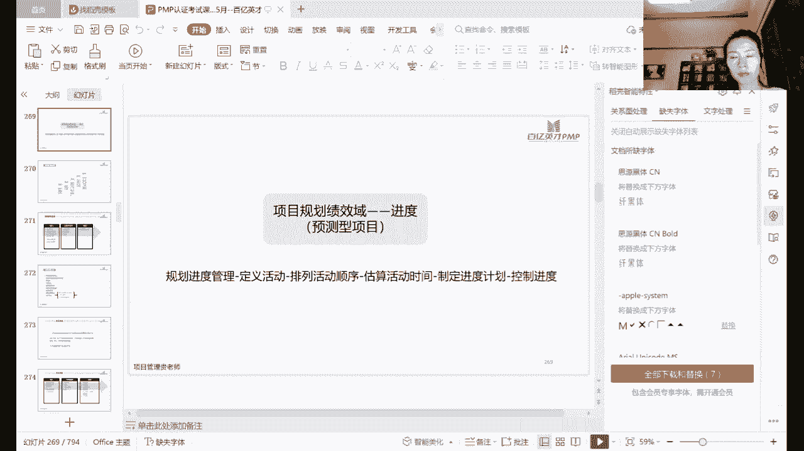

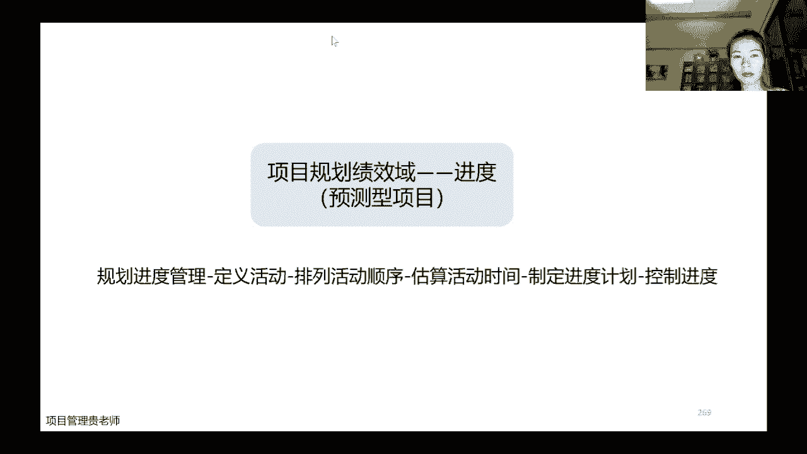

哈喽大家晚上好呀，如果说能够正常看到屏幕画面，听到声音的话，帮我在评论区敲一个111哈，好的收到，谢谢收到收到，我们还是稍微等两分钟哈，嗯等到七点半看看有没有其他同学，之前讲的课，上一次讲的范围和需求。

大家下去之后有没有再回听，或者在复习，感觉有没有什么困难啊，理解起来，好111我都收到了哈，谢谢大家，我都收到了，好了到七点半了哈，我们今天晚上的课程正式开始了，把这个拖一下嗯，那前面几次课呢。

我们嗯已经进入到规划的绩效率了哈，跟大家讲了嗯，规划绩效率的范围和需求的一些这个影响，和一些里面的具的工具和方法，今天晚上呢我们要讲的是进度啊，进度里面尤其是我们预测性的项目进度。

其实里面涉及到的内容还是挺多的啊，所以呢今天晚上的嗯我们怎么去定义活动啊，怎么去排进度计划，这个呢还是需要大家费点功夫啊，紧跟我讲课的一些节奏和思路哈，如果说课堂听的走神或者是临时有事的，没有关系。

下去之后那个回放一定要及时的听哈，听过的想加深印象的，也一定要及时的复习哈。

好我们讲进度呢，也是先从预测型的项目开始讲起，然后后面再讲适应性的，因为嗯预测性的项目呢，它的进度涉及的内容要多一点啊，因为它强调的是要详细的规划嘛，所以你的整个进度的安排是要在一开始的时候。

规划的特别清晰，那这里面包含哪些活动呢，首先我们规划进度的管理啊，规划进度管理是做什么事的呢，就是去约定那后面的这些活动怎么样去定义啊，约定我们的活动排列顺序，是讲究一个什么样的一些关系。

什么样的一个规则啊，有没有什么内外部的一些限制条件，然后呢告诉我们哎由谁来负责啊，组织估算活动的时间，估算活动的时间呢，哎比较适合采用什么样的一些方法，或者是一些工具啊，如何制定我们的项目的进度计划啊。

在监控的阶段呢，如何去控制我们的进步，它相当于是给后面的这些活动提供了一个指南，具体的步骤哈，规划我们的项目的进度的管理计划怎么去做，第一步呢，先哎上周嗯，应该是上周五的时候跟大家讲这个范围的时候。

不是我们最开始啊，这个要定义范围吗，定义范围之后不是要分解做w b s嘛，这个大家都还记不记得呀，w bs分到了大概比如说4~5层，最底层呢它是一个工作包，还记不记得跟大家讲过工作包。

它最适合的这个工作时长是8~40个小时，对不对啊，这之间的这么长时间的这个工作量，是一个比较合适的一个底层的工作包，它的一个大小，那现在我们要把这些工作包继续往下分啊，不是在wbs里面分啊。

是基于wbs分到底层的，这些工作包拿出来分解为具体的活动，在项目管理当中啊，尤其是预测性的项目，我们把要做的工作内容或者叫任务，专业起来叫活动哈，所以为什么我们的啊前面是说的是定义活动。

所以第一部分是把范围分解成具体的工作，任务活动，然后第二步呢是这些活动啊，分解出来这么多，那么活动跟活动之间，它可能有一些前置或者后置的关系，我们要把它的顺序排列出来。

那么排列出来好一个比较好的一个顺序之后，它这个活动可能散乱的，先走到这儿，再走到这，然后再完成这个顺序出来之后呢，按照每一个活动再去估算它们的头部的资源，这些资源的包括你需要几个人啊，持续多长时间。

除了人之外，还有没有其他的一些食物的一些资源啊，就是估算他活动所需要的资源，你估算好了吗，你还要确保你估算的这些资源能够到位，对不对，第五步呢是调整顺序和估算的一些资源，因为我们按照我们理想的情况诶。

就觉得这个活动比如说他需要两个人啊，做四天这样的一个工作量，但是呢啊这还有一个活动，可能他们俩是同时都要开始的，他也需要拥有这个技能的这两个人，但是呢公司里面只有这两个人，那怎么办啊。

所以呢做完第四部的分配之后，还得按照整体的这些活动，去调整一下他们的逻辑顺序，就比如说出现我刚刚说的这种情况之后，那么这两个活动之间的顺序怎么去协调，那去优化一下，这个是我们做金融管理计划的。

一个基本的一个顺序哈，实际当中呢也是基本是按照这个步骤来的。

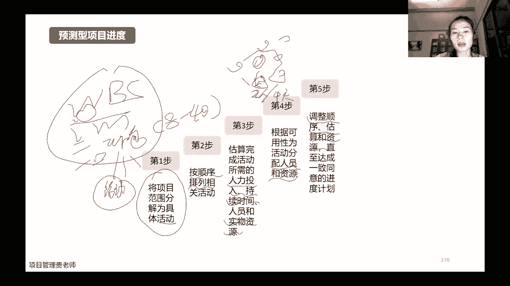

只不过说呢可能在执行的时候，稍微的会复杂一点点，那进入到规划进度管理这个子过程哈，这个子过程呢，它的核心的输入就是我们的这个范围，管理计划啊，然后项目章程，因为项目章程里面有我们的高层次的。

这个里程碑啊，这个都是在项目这个十字框，都是在项目的章程里面会有的，那么我们通过一些专家判断啊，或者一些数据分析得出我们的进度管理计划。

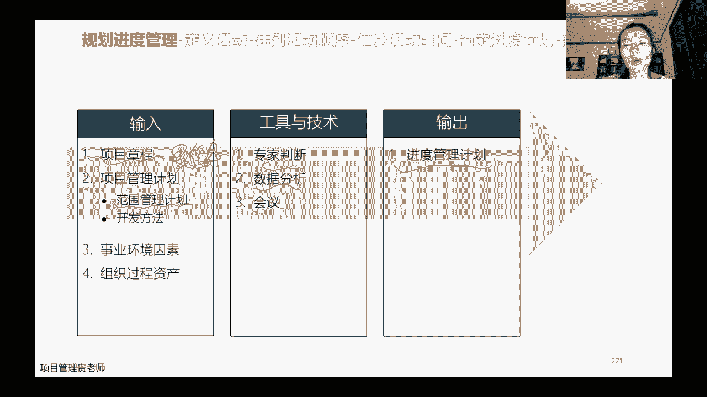

至于进度管理计划里面包含了什么内容，前面跟大家讲了哈，这个模型你用什么模型，你用网络图吗，还是用甘特图啊啊还是用什么图形，这个是在我们的进度管理计划里面，去把它约定好的。

然后呢哎我们的如果说是适应性的项目的话，那么它会有涉及到这个发布和迭代呀，那么你是隔多久去把产品发布一次啊，啊你迭代的长度是一周两周还是四周啊，进度的整个这个准确度啊，你是精确到比如说以小时为单位。

还是以天为单位，还是以周为单位，这个计量单位组织是程序链接每一个活动啊，它由上面的这个组织是谁来啊去协调啊，谁来去负责进度模型在项目执行的过程当中，如何去维护控制的临界值啊。

比如说我这个进度我按照我的计划，我超了百分之多少，我开始要控制了啊，我允许的这个偏差是多少，绩效的测量的规则，比如说我允许的这个控制，临界时是正-5%，偏差5%，我就觉得可以接受，我不加以控制。

但是呢我测量的时候呢，哎我5%之内可以接受，但是呢我要是超过了10%，我可能就在绩效上面做一些体现啊，进度的报告格式采用什么样的一些格式去展现，我们的进度计划是一个cl表吗，还是如我的文档呀。

还是说其他的一些什么方式呀，都ok，但是呢要在管理计划里面把它列名，好做完啊，这个进度管理计划呢，我们就要开始正式的去定义活动，第一活动是什么意思呢，它是说是识别和记录，为了完成这些可交付成果而要做的。

具体的行动的过程啊，这个就叫活动，前面跟大家讲的，大家可以理解成是我们具体要做的，每一项的工作任务，那它的核心作用呢，就是把基层的工作包分解为进度的活动，作为进度估算规划。

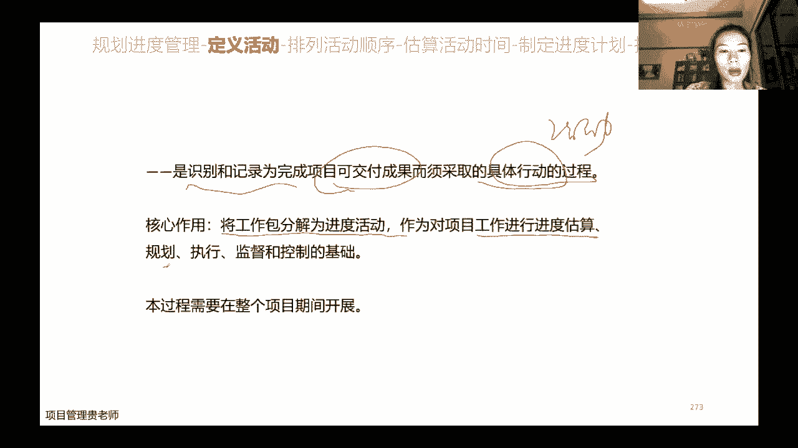

执行监控的基础，第一活动呢它也有它的输入和输出，还有工具最核心的这个输入，仍然是进步的管理计划和范围的基准，然后要注重分解，用滚动式规划说出来的这几个东西非常重要，活动清单肯定会有，对不对。

那活动的属性，活动的属性是什么意思，一会儿会跟大家具体讲哈，还有李程碑的清单啊，以及我们会不会有一些变更的请求，进度基准。

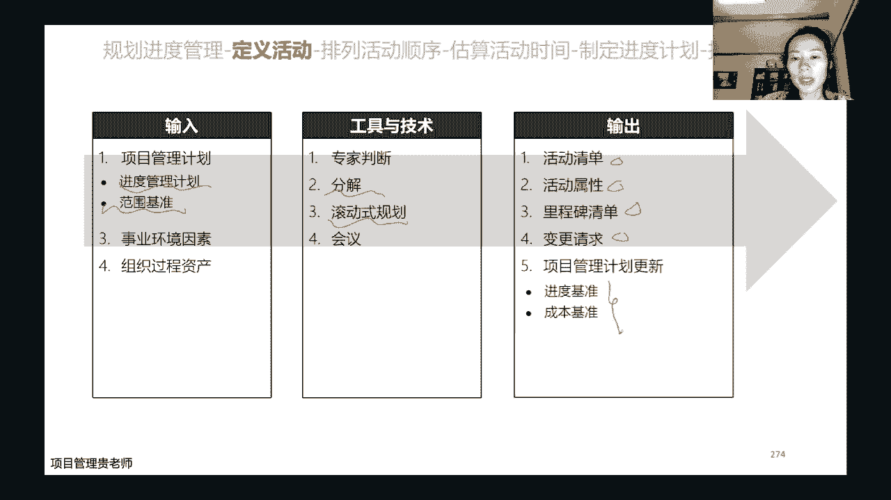

成本基准涉及到的活动清单呢，嗯右边是一个示例哈，这个编号呢是我们这个对应的w vs里面的，这个具体的编号，比如说1。1。1a它对应的活动是哪些啊，具体工作这个活动要怎么做啊，描述是什么样子的，然后我1。

1。1呢，它还对应的这个另外一个活动诶，是什么，把它都列出来就ok，所以呢他应该是包含了所有进度，活动的一个综合的一个清单，还包括每一个活动的标识，就是它的编码以及工作范围的一个小数。

这是我们的活动清单，那有人会讲诶，我是不是得到了这个活动清单，我就能够知道我这个进度计划怎么排的呢，还远远不够哈，为什么不够，因为我们还有活动的属性，必须去考虑这些活动的属性呢是指的是啊。

比如说他有没有一些紧前的活动，也就是说我比如说在这活动清单有啊，1~20项这么多项活动，当然有可能更多的还1~200项，那么我第一项活动跟第二项活动，还有我第三项活动。

是不是我就按照这样的123的顺序去执行呢，不一定，所以我们要考虑一下他的紧前活动啊，就是前面的活动和后面的活动之间的逻辑关系，然后以及这个活动他可以提前几天啊，或者说呢他允许推后几天需要的资源的需求。

然后必须强制日期，必须要完成的，这个期间有没有什么制约的一些因素，或者一些假设条件，这些都是我们每一项活动必须要去考虑的，那么右边的是一个活动清单的，一个是一个势力哈，就是相当于把a紧接关系。

紧前活动是什么，然后他们之间的关系是什么，这个关系呢马上也会讲哈，然后呢他可以允许提前几天或者最后几天，它的颈后活动是什么，跟紧后活动呢是什么关系，这个紧后活动呢，唉他可以是提前或者是最后。

他对资源的需求呢啊是什么类型的，有没有特殊的一些技能的要求啊，其他需要的资源是什么，人力投入执行的地点，强制日期或者其他的约束，以及假设这些都是在我们每一个每一个活动，他都会有自己的活动属性啊。

要列出这样的一个东西来，那么还有一个就是你程碑清单啊，你程碑清单呢它比活动清单要啊，是一样的这个表达方式，但是呢它比活动清单要简洁很多，因为他重点强调的是里程碑，活动清单是所有的活动。

但是里程碑的清单的是重要的，你程碑节点的这个要素嗯，需要注意的呢，就是说他虽然跟活动有相同的属性或者是结构，但是呢它不是活动啊，里程碑人家说啊你的里程碑是什么活动啊，要做什么活动代表你的里程碑啊。

啊里程碑它持续的时间是为零啊，他只是说一个时间点，就是我到达这个时间点，我要达到什么样的一个进度，达到一个什么样的一个状态，所以他不是说哎我这一个活动，你身为这样一个活动。

然后他要从哪个地方持续到什么时间啊，那么具体啊涉及到的工具啊，首先是滚动式规划，滚动式规划呢其实比较好理解哈，就是边走这个项目边执行，边规划边执行啊，执行的过程当中，后面有一些确定性的内容。

在持续性的规划，所以近期的马上要做的，我们肯定是要把他所有的活动都列出来，然后去按照活动的属性啊，排列它的顺序估算他的资源，但是呢在远期一点的，比如说半年或者1年之后啊，也是包含在我们的工作包里面的。

但是呢他这个嗯时间比较久远，有可能啊会有一点点的变化，或者说呢我们短期之内还没有必要，花那么详细的那么多的时间去把它详细的进度，把它列到每天或者每一周的时候，那么我们可以先做一个粗略的规划。

比如说哎我1年之后的，我把它啊细化到每个月要达成什么样的状态，就ok我等到快要临近的时候，我提前两三个月再把它细化的计划，把它做出来也是ok的哈。

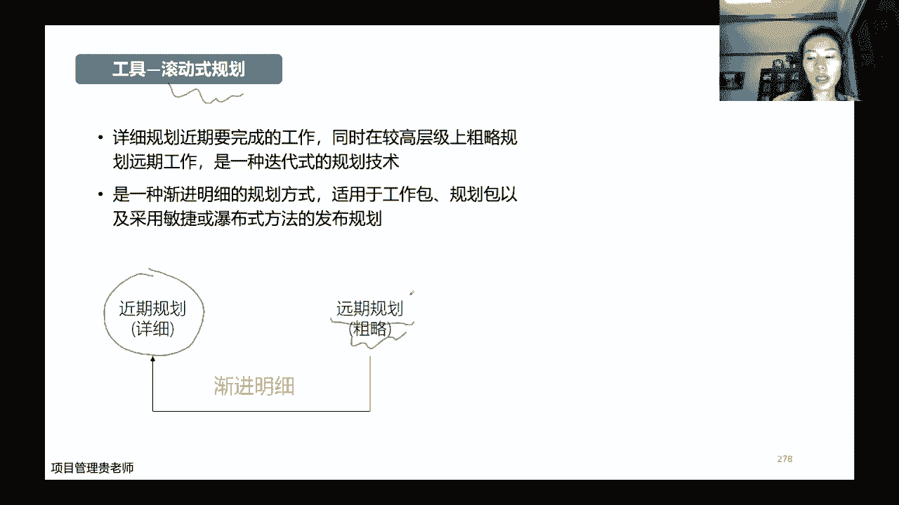

就是滚动滚动式规划的一个它的一个含义，然后呢，后面给大家列了一个滚动式规划的一个啊，示例哈，这个势力呢哎就是他念的，就比如说我它只有两周的时间，第一周第二种分别每天要做什么啊，这个前面是做的。

我们要做的这些具体的这些啊，这个啊活动任务，然后呢只练了两周，后面呢他还会有其他的一些活动的一些嗯，这个列表，但是呢我先不把他列的这么难，这么详细啊，我用一个大的这个标识，比如说a嗯，下两周之后嘛。

我比如说这是5月，然后我就这个6月干什么。

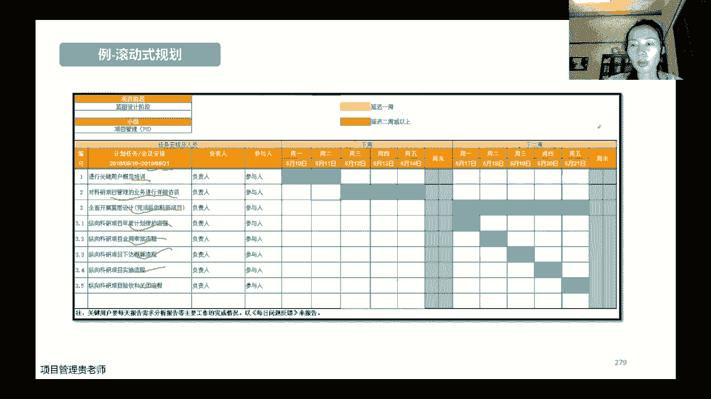

7月干什么啊，8月干什么。

就列出一个大概的，知道我整个月的总体的计划是什么。

就可以哈，好定义，活动做完了之后呢，啊我们有了那么多的活动清单，我们也知道了活动之间的各种属性，他们的逻辑关系啊，他们的这个颈前节后的活动排练是什么样子，那我们现在就要开始正式的排列了。

排列的是a他的记录啊，前面不是活动清单，里面有他们，每一个活动和活动之间的这一关系吗，我们要用具体的表达方式，就是顺序把它表达出来，把他的关系把它表达出来，所以它的核心作用呢。

就是定义活动之间的逻辑顺序。

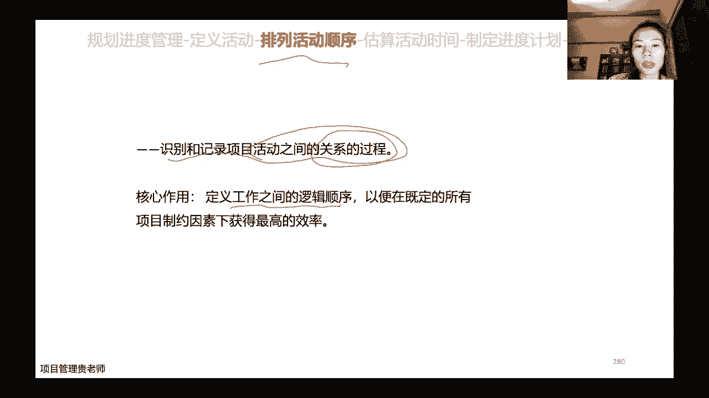

它也有它的输入和输出啊，整个过程大家可以看一下，我们前面通过定义活动得到了这么多的东西啊，有活动属性，有活动清单，还有里程碑的清单，同时呢哎还有这个进度到底去约定了，我们怎么去排列活动顺序的。

有这些指南，那工具和技术啊，也是比较嗯也是比较重要的这一块儿哈，通过紧前关系绘图法具体是什么，一会儿会跟大家讲提前量和之后量，这都是我们用到的工具和技术输出来的呢，哎就有进度网络图啦。

我们前面做这么多的工作，就是为了做一个进度的网络图出来，这个网络图呢大家一般体现的有多种方式啊，有做这个有类似于甘特图的，大家应该都知道甘特图是什么样的，都见过吧，没有见过的没有关系啊。

嗯马上今天晚上的课程会讲到啊，有刚才图的形式啊，有网络图的形式，啊都是ok哈，然后呢还有一些项目文件的一些更新啊，这些东西呢，虽然说都是在定义活动的过程当中，去产生的文件。

但是呢我们在做排列活动顺序的时候，有可能会涉及到这些活动属性的一些调整，但是核心是这个核心的输出是这个网络图。

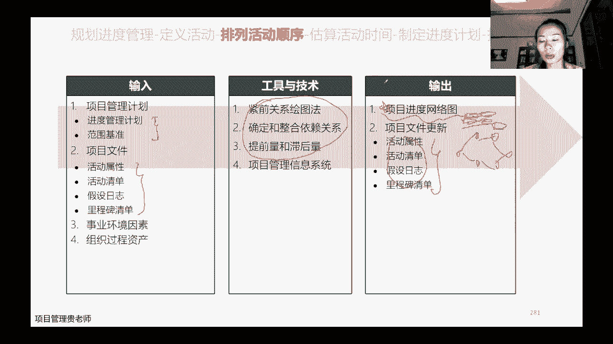

嗯那依赖关系呢，是我们在这个过程当中会考虑的，一个工具和这个技术哈，因为要考虑到啊，比如说有的时候活动跟活动之间啊，或者是呢活动跟外部内外部的一些环境啊，一些制约因素啊，它可能会有一些依赖的关系。

这些依赖关系呢嗯它有几种不同的这个类别哈，第一种类别是强制性的依赖关系，一般情况下强制性的依赖关系呢，它可能会出现在比如说啊合同里面就列明了，列名呢有不同的这个啊工作，或者不同的这个活动。

或者不同的这工作包之间，或者不同的可加不成果之间都ok，不管它是以哪种形式哈，他可能会列名啊，这些必须要达到什么条件之后诶，才能做什么样的另外一个下一个阶段，那么嗯前面这个阶段和下面这个阶段里面。

生存的活动，他肯定就是有一个强制性的这种依赖关系，然后呢选择性依赖关系，选择性依赖关系呢，哎比如说哎这个嗯，公司里面有之前有一些比较好的一些模板，和一些实践的一些这个数据啊，然后呢这些数据显示呢。

一般情况下我们是做完了第一个活动哎，再做第二个活动会比较合适，那我们在做这个项目的时候呢，就是如果说这两个一活动二活动它是类似的，那我们可以选择去参考之前的这个经验啊，也按这个顺序排列。

但是呢也可以去考虑按照我们最新的a，比如说我们尝试一下从2~1，这样也是ok的，所以他这个参考了就是一种选择性的依赖关系，然后呢还有外部依赖关系和内部依赖关系，这两个呢内外部呢啊它主要是内部。

而外部就指的是活动和非活动之间，它主要是指的这一所有的活动清单，在活动清单里面的活动与活动之间啊，就比如说我要去啊，比如说我要去这个啊，给大家讲今天晚上的课，那我首先我必须要在钉钉上面发起直播啊。

然后我才能共享我的课件，对不对，那么这个就是嗯，活动跟活动之间的一个内部的依赖关系，我必须先完成一，我才能完成二，但是呢还有一种外部的依赖关系呢，它是我活动啊，跟外部的这些环境的一些影响的这个关系。

比如说哎我在给大家讲课之前，我要啊我要准备一杯水啊，我要准备一杯水，那这个水是不是在我的红用清单里面呢，它不一定对我，我没水，我其实也可以，我有水当然更好，那我要先准备好水，然后呢才做这个发起直播啊。

开始授课，或者是呢我发起直播之后，哎我请我家人去帮忙，我端杯水过来啊，这是活动跟外部的非活动之间的这个关系啊，叫做外部的依赖关系，这是帮大家去梳理的哈，为什么要梳理这种了解这种依赖关系呢。

是因为我们在排具体的这个项目当中的，各种活动的顺序的时候，他有一些活动他确实会有这些制约因素啊，我们这个叫依赖关系，会有依赖关系的时候，我们必须要把它的依赖关系去考虑进去。

尤其是强制性的依赖关系是一定要考虑进去的，那么进度网络图，进度网络图呢，嗯主要的就是常见的也是用的比较多的，也是要求大家去掌握的，就是这两种，一种是单代号网络图啊，我们又叫做颈前关系绘图法。

另外一种呢叫做双代号网络图啊，今天晚上的重点哈，重点要掌握的工具嗯，嗯单代号网络图，景前关系绘图法，它是用节点来表示活动啊，用一种或者多种的逻辑顺序啊，来这个显示它的具体的这个关系。

然后呢嗯这是紧前活动呢，是在进度计划的逻辑路径当中排在最开始，或者说排在每一个活动的前面，什么意思啊，就是说我比如说我现在有a啊这样的一个活动，那么我a他的这个活动的紧前活动啊，比如说是a减啊。

我a的紧后活动，紧扣活动指的是什么意思呢，紧后活动是指的是我这个a完成之后，哎我排在他后面的啊，这个紧后活动，比如说a加是这个意思啊，所以大家啊既然说我们紧前关系绘图法嘛。

所以说了解一下紧前活动和紧后活动，它分别是什么意思，紧急关系绘图法呢也会涉及到四种依赖关系哈，哪四种依赖关系呢，哎比如说我们现在有两个活动，这个活动呢是a和b这两个活动，那么第一种关系呢是完成到开始。

也就是说我a我必须完成了，我b才能开始，就像刚刚跟大家讲的例子一样，他们是一种这个嗯比较强制的这种，嗯内部依赖关系哈，我必须要先发起直播，然后我才能共享我的课件，那么第二种关系呢是开始到开始啊。

这个嗯a和b他们是同时开始的啊，比如说我今天晚上授课的时候，a呃发起直播，然后呢大家这个也就开始来听课了，对不对，所以呢两个活动是同时在开始的，同一时间再开始，是开始到开始的这个关系。

然后还有一种呢是完成到完成，还是这两个活动啊，a和b a完成意味着b也完成了，那比如说我们今天晚上的直播，哎嗯老师讲完了，老师把课件啊，把这个结束直播了，那么大家今天晚上的这个听课也结束了啊。

两个活动都结束，然后呢还有一种最后一种关系呢是开始的完成，也就是说呃a开始的时候啊，意味着b完成了它，其实大家理解完成这个完成开始和开始完成啊，其实他们俩的这个逻辑顺序，其实是理解起来到底是一样的。

只不过他们俩相当于是换了一个顺序哈，是b完成了之后啊，a才刚刚开始，那提前量和滞后量呢，刚刚不是讲了嘛，也是这个提前量和滞后量，也是这里面的比较重要的工序，提前量是什么意思呢，哎提前量是。

比如说哎我这还是有a和b两个活动，那么我相对于啊这个，相对于这个紧前活动，b的紧前活动是a相对于他来说，我必可以提前几天去开始，然后呢之后量呢是说哎我相对于这个a来说，我b我可以推后几天来完成。

所以有的时候大家一般会看到啊，比如说b的这个活动，它可能持续的是五天加减二啊，什么意思，就是我提前两天啊，我到第三天的时候，我开始这个b也ok，然后呢或者我往后推两天到第七天。

这样也是ok给他的荣誉就会比较大，那这有一个具体的这个案例哈，比如说我们完成委工作清单诶，完成之后呢，再开始做景观建筑的一个划分，那么它的这是一个完成到开始的关系哈，前面讲过完成清单哎。

到开始完成到开始呢，减二意味着呢他是说对于完成委工的清单，对于这个活动来说呢，这一个事情他可以提前两周开始啊，也就是这个活动它还没有完成的时候，我可以在他完成的这个日期提前两周把它开始。

那么同样的这个撰写草案啊，到编辑草案，这个呢是一个开始到开始的关系啊，我开始撰写的时候，我其实也在开始做他真实的一个编辑了，但是呢我啊滞后量是减15天，什么意思呢，也就是我编写草案这个活动。

对于我撰写草案这个事儿来说，我可以在它开始之后推迟15天开始对，我先把草稿a把各种素材都收集齐，然后半个月之后，我才开始正式的编辑这个草案啊，是这个意思嗯，那么理解完这个之后呢。

我们就看一下单代号网络图，它到底是嗯展现出来是什么样子哈，前面呢是从一个活动，两个活动啊，最多只有两个活动，是帮大家去演示一下，知道什么是紧前活动，什么是紧后活动啊，什么是提前量啊，什么是滞后量。

那么现在呢就要开始完整的看一个图形了哈，这个图形呢啊是比如说我们要做一个早餐啊，这个看样子烤面包啊，涂黄油啊，倒咖啡，这应该是一个西式的早餐哈，那这个早餐啊从开始的时候呢，他要啊。

比如说烤面包要花两嗯两分钟的时间，烧开水七分钟啊，这个准备咖啡八分钟啊，要把桌子摆好，也挺有仪式感，两天啊，两两分钟的时间，然后呢我在面包上面还要抹上黄油，我必须要烤好之后才能抹黄油，对不对啊。

抹黄油0。5分钟，然后还要煮鸡蛋，烧了开水才能煮鸡蛋呀，对不对，我不能说把鸡蛋煮熟了，我还烧开水啊，那有什么意义呢，烧完开水之后，哎我才能煮鸡蛋，所以呢煮鸡蛋可能煮个三分钟诶，我准备咖啡。

我把咖啡准备好了之后，我要倒咖啡呀，对不对，倒咖啡花个半分钟，然后呢我把桌子摆好了之后诶，我要去到一些这个谷物的这个燕麦片啊，或者是其他的一些谷物的食品啊，再花两分钟的时间，那么横着看到烤面包和涂黄油。

烧开水煮鸡蛋，他们每一项活动都是什么关系呀，大家这个如果说能够反应的过来的，可以在评论区敲哈，依依照我们前面讲的，它是不是就是，完成到开始的这样的一个关系，对不对。

那么很这个纵向的去对比它们是什么关系呢，比如说我烤面包啊，你烧开水呀，跟准备咖啡呀，跟白桌子这些又是什么关系呢，这些是不是就是开始把中下的看，开始到开始的关系，对不对，那么这一列右边这一列呢。

初号黄油煮好鸡蛋，倒好咖啡啊，这个就是完成当完成的关系，对不对，那这些都完成了之后，诶，意味着我做早餐的这个简单，早餐的这个整个这个活动啊，这些活动都已经结束了，所以呢哎这有一个活动的一个。

这个结束的一个节点，在这个里面呢啊因为这写的很清楚，因为它上面写的这个动作具体是什么，所以大家可以看的很清楚啊，这个框框是表示区的节点，它是表示活动，然后呢，这个间隙呢。

是表示每个活动和活动之间的关系啊，关系呢是指它的是比如说开始到开始啊，啊或者是开始到完成啦啊，或者是完成到开始啊，表示的时间关系哈，这是单代号网络图，具体要怎么去表示的，嗯后面呢有一个练习题。

这个练习题呢也是大家带着大家去练一下哈，首先他也是啊这个项目开始啊，比如说我们还是用这个框框表示，这个项目开始了，开始了之后呢，活动a和活动b同时进行，也就是说活动a跟活动b他们俩时。

开始到开始之间关系，对不对，那ok只要有一个活动a，然后呢这还有一个活动的背影，然后呢a结束之后呢，活动c和d开始啊，13410c开始啦，a也开始了，b结束之后呢，活动一和f开始给我们画了，一开始了。

f也开始了，然后呢d和一一结束之后呢，活动机开始了啊，d结束了，一结束了，最开始的呢是活动机，最后呢活动c f g同时结束的时候呢，哎他们都结束的时候，意味着项目完成了，也就是说我c。

还有af同时结束的时候啊，这个时候项目就结束了，他就这么画的哈啊这个画图呢从考试而言，不要求大家会画，但是呢要求大家一定能够看得懂，但是呢从我们实际的工作出发，是要求大家一定要掌握这个绘图法的哈。

因为这个嗯单代号网络图用的会比较多，而且展示起来它其实是比较方便的，尤其是啊比如说我们一个包啊，一个工作包，就拿这个工作包的，比如说一周的工作量来排一排顺序的话，那么这个网络图啊。

拍起来其实是比较嗯简单方便，好前面我们讲了有单代号，它还有双代号，双代号是什么意思呢，这也有一个这个图示哈，嗯首先活动开始了，我们还是以前面这个例子，还是准备这个这个西式早餐为例子。

跟大家把这个活动分解了，首先呢哎我们要做烤面包啊，这个烤面包这个活动呢它持续的时间是两分钟，然后呢要做烧水啊，烧水持续的时间是七分钟，还要准备咖啡啊，它持续的时间是七分钟，白桌子两分钟。

然后这个完成了之后呢，哎在面包上面涂黄油，半分钟，煮鸡蛋，三分钟，倒咖啡半分钟，准备谷物的一些食品，两分钟大家可以看哈，我们前面啊，他这个开始的时候是在这里，然后这个结束都是没有变的。

但是呢我们单代号网络图的时候，这个界限它是表示的是逻辑关系，然后呢界限之后才是和面包，对不对，它的界限之后的这个框框表示的是距离活动，但是呢在我们的双代号网络图当中，你看它的节点不表示任何活动。

它是用间线来表示活动啊，并且标注了活动的持续时间，这是区别哈，区别大家要注意，所以呢诶你看它有几个注意的事项，肯定是从左到右，然后呢严禁出现没有箭头节点或者箭头嗯，箭尾节点的这个界限。

那当然一个箭头如果划过去哎，没有节点，没有节点就变成了，比如说我这开始啊，比如说我这条线我就是准备咖啡，然后倒咖啡我怎么区分呢，对吧，它中间如果说没有节点，我怎么区分这是两个活动呢。

在这里面是活动是由界限来表示的，界限表示活动，而前面讲的双代号呢界限只是表示关系，表示两个活动之间的关系啊，严禁出现双向箭头啊，就比如说哎我即使到这儿就是到这，那么在我们双代号网络图里面，这个就看不清。

看不明白到底是先做，它是从a做到b啊，这个这一个节点，就比如说是a，这个是b那么我到底是从这个阶段到这个节点，还是对这个节点到这个节点，就有可能会出现一些混乱，这有双代号网络图的。

就是它会存在一些虚间线啊，大家了解一下这个虚线线的，我们就是用这种图示，是去把它这个把它划分出来，区分出来就ok了，后面呢还有一个双代号网络图的，这个具体的表示方式哈，这个也是带着大家去把双代号网络图。

去把它画一画，我们前面讲了，双代号网络图是用啊这个表示节点写在这儿，免得大家忘记，然后呢箭头呢是表示，活动啊，对不对，所以我们现在看项目以活动a b c开始啊，那也就是说哎我们开始的时候有一个节点啊。

那么啊这是活动a这个是活动b，这个呢是活动c是不是这样子，每一个箭头代表一个活动啊，项目活动a b c开始，那么a结束之后呢，活动d开始，也就是说啊，这个比如说我们把它标注为这个活动d开始了。

活动b结束之后呢，哎，f开始了啊，这每个箭头方面都有节点，都有一个圈圈哦，标大一点可能大家看看着看不清楚，然后b和d都结束都完成之后呢，活动一才能开始看一下b在哪里呢，b在这里，d在哪里呢，d在这里啊。

b和d都结束之后，活动一才能开始啊，那活动一标注在哪呢，这样，b和d结束之后啊，活动一才能开始，那么活动项目在活动c e f都结束的时候呢，我们就要开始把它结束了，c在这f在这，然后一在这结束了啊。

这个是开始，所以如果大家掌握了单代号网络图的话，那么双代号网络图应该也是会画的，只不过说呢他们两个人的表示方式不一样，就是把这个框框，把前面那个框框换成这个箭头理解了吧。

然后这又跟大家还是用这个在列明了一下，单单号网络图和双代号网络图的区别哈，这个区别呢主要是帮助大家去更好地理解，两个不同的这个网络图的表示方法，考试不会考他们的这个区别啊，没这么无聊。

但是呢是可以很好帮助大家理解，首先他们表示方法，你看双代号呢用界限来表示活动，当然代号也有方框啊，或者矩形或者圆形都ok啊，它是用一个方框，一个圆圈啊，一个方框啊，正方形长方形都ok。

用一个节点的这个形式去表示活动，箭头表示的是关系，所以他们可表述的关系呢，双代号啊主要是完成到开始，但是单代号单代号，因为我们它表示的关系，它是以这个框框为活动，那么我们啊活动可以这样排啊。

他也可以这样排，所以它表示的这种关系呢完成到开始，完成到完成，开始到开始，或者开始到完成，它都可以把它表示出来，但是我们单带好，因为单带好啊，我们双代号它只能表示完成到开始的依赖关系。

因为它的箭头啊是表示活动，那我箭头只能从这出发到达，这对不对，也就是说我这个箭头，这个活动只能意味着这个完成，然后我下一个才能开始。

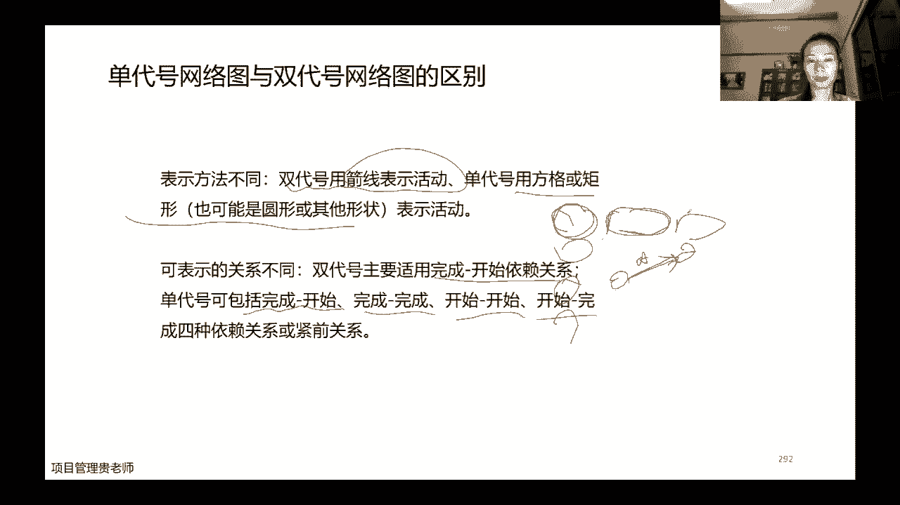

所以他们表达的关系也不太一样哈，好会用网络图排列他们的这个顺序之后呢，哎我们进入进入到下一个也是非常关键的，这个过程哈，这个过程叫做估算活动的时间，估算活动的时间，他是什么意思呢。

他是说a根据我们资源估算的结果来估算，完成单项活动啊，注意是单项活动哈，估算单项活动所需要的时间，不管叫十十大素啊，还是叫公鸡啊啊，或者大家比较熟悉的这个人天呀，这些单位都ok哈，就是我们可以简单理解。

就叫做估算单价活动所需要的时间，那估算的时候呢，我们要考虑一些啊客观的一些因素哈，比如说收益递减规律，什么意思呢，哎我比如说在考虑这个活动的时候啊，我我估算这个活动它需要用这个啊，八个人干一天。

或者八个人干3年，那我到b的时候，我是不是还用这个同等的工作量去计算呢，不一定，为什么，因为人他是有疲劳性的，对不对，你还用这些人同样的接着第二天干，那么它产出的效率就有可能会有所下降。

所以呢b的啊持续的时间跟a的持续的时间，他们的工作量就有可能在这个点点的，这个延伸啊，因为干了一天大家都累了，第二天还是这么干，大家的效率就会有影响，第二个呢叫做资源啊。

资源数量的增加呢不一定能够缩短时间啊，就是大家有的时候也会想，哎这个啊八个人啊，干一天完成了，那我能不能用16个人干半天呢，啊这个活动我改成16个人，我加大资源投入干半天。

是不是就能够非常理想的去把人叠加起来，然后来缩短时间呢，不一定，为什么呢，因为人多了之后，你涉及到的啊这个沟通的成本哪啊，这个学习的成本呢都会增加，并且能产生冲突的可能性也会更大啊。

所以比较理论的觉得诶我增加一倍的人，我就能减少一倍的时间，这个观点是在实际当中是行不通的啊，第三个要考虑的这个客观因素呢，就是啊这个技术在进步啊，什么意思呢，也就是说诶我们这个活动啊。

这个项目他比如说要持续不长，持续很长的时间，那么我在第1年的这个项目的活动当中，唉，我可能估算的这些活动啊，或者是这个嗯把第2年的活动也估算出来，我差不多的，我比如说他要持续1年，那我到第2年的时候。

这些相同类型的这个活动，是不是还要持续1年的时间呢，他也不一定，为什么呢，因为啊经过这么长时间技术在迭代在发展，有可能呢有新的技术来投入，他可能有点这个0。888个月，或者说0。5半年的时间。

他有可能就完成了，跟前面这1年同等工作量的这些时间，所以呢这些都是我们在实际的各项活动时间，里面要统一的一些因素哈。

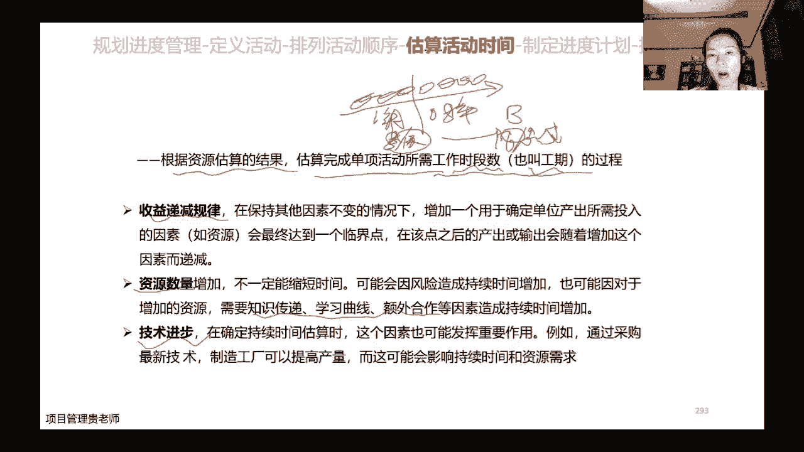

规则活动时间呢它也有自己的这个输入和输出，还有我们的一些核心的一些工具，那具体而言啊，怎么说呢，输入呢有我们的这个所有的这些活动的清单呀，啊这些女生的清单都是有的，还有我们的太空单啊。

排空单一般在章程里面，他会有一些，比如说这个参与到这个项目的核心人员啊，会有哪些啊，这些核心的文言呢，嗯这个名单啊会有一些这个提前就安排好，然后呢还有资源分解结构，资源日历和资源的一些需求。

这个都是我们在做估算活动时间的时候，会参考的，资源分解结构，资源日历和资源需求呢在后面讲资源的时候，会具体讲这些东西，它是啊到底是包含哪些内容，是什么意思，大家在这里呢可以先简单理解。

就是我们啊这个资源活动所需要的，人力和一些食物的一些资源到底有哪些，然后呢这些资源怎么分配到我们的活动上面来，这里面呢也有一些工具哈，这些工具的类比参数和三点估算是啊，包括这个自下而上的这个估算。

这四个估算的方式也是大家重点要掌握的，这些我但凡是说了，重点要掌握的都是大家啊考题，不管是训练题还是这个考试，很有可能会遇到的一些场景哈，那么它输出的就是a啊，既然我们是在播送活动。

那么我们有持续时间的一个估算。

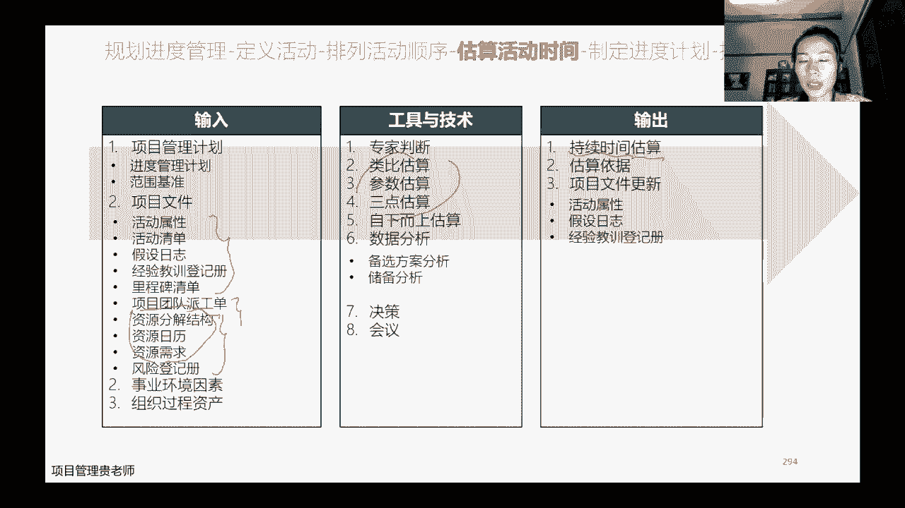

还有估算的一个依据到底是什么，会输出这些文件嗯，这有几个不算活动时间啊，要考虑的这个一些定语哈，除了我们前面讲过的这些技术的因素啊，啊这个收益递减的一些因素之外，还有一些是在我们排列整个这个活动的。

过程当中要考虑的一些因素啊，这个因素呢它都不能叫做一些因素了，他应该是说叫做啊这个人的，因为我们学的是管理嘛，管理是嗯有两个大的部分，一部分是人，一部分是事儿，那对于人来说，人有太多不确定性了。

所以说人的因素呢，我们要考虑第一个呢啊叫做帕金森病，女帕金森大家应该都知道哈，嗯但是帕金森定理呢可能大家不一定会知道，帕丁顿定理它是什么意思呢，是说a只要我还有时间，我就可能有意无意的多做一些。

不必要的一些工作，就发生这些范围蔓延啊，直到我把所有的时间都用完，什么意思呢，比如说嗯给你安排一个工作任务啊，嗯给你安排的这个工作任务呢，是八个小时的工作量啊，也就是说从理论上面来讲。

你是一天能够完成的啊，那在实际的情况当中呢，你可能因为经验比较丰富啊，或者这个啊做的这个手速还比较快，你可能六个小时或者四个小时，你就半天就已经把它搞定了，那你搞定了之后，从人性的角度出发。

你会去跟你的项目经理啊，或者说你是项目经理，你项目的团队成员，他完成之后，他会跟你说，这个老大我已经完成了，再给我拍点新的活，你把明天的活也赶紧给我拿过来，然后呢我早做完早放假，早做完早下班。

你会这样吗，一般情况下是不会的，对不对，所以呢你会坐在这磨洋工啊，四个小时完了之后，剩下四个小时在这磨洋工啊，或者是你坐姿的事都可以，但是对于项目本身而言，你就是在磨洋工啦，这个四个小时的这个空档期。

其实是没有被节约出来的，因为你用在自己的这个主观的意识上面，然后第二个啊要考虑的叫做学生综合症，学生综合症是什么意思呢，嗯大家就是不知道，还记不记得自己上学的时候啊，嗯如果说要在放假的时候。

老师一般都会布置很多作业，对不对，布置的作业大家是放假第一天就把作业完成了，后面全玩，还是说一直拖拖拖拖，拖到假期都结束了，第二天就要返校了，突然想起作业还没做，然后又熬个通宵把作业完成啊。

大部分人可能是后面一种，对不对，所以学生综综合症是什么意思呢，就是一般就是因为比较懒散，就是你不太愿意做，在最开始的时候总觉得哎呀拖拖拖拖，到最后快要截止日期的时候才开始去做这个事。

这个也是让我们在这个考虑活动的时间的时候，用去这个考虑的，为什么要考虑学生综合症哈，因为我们在排列活动顺序的时候，比如说这个活动他有提前量，有滞后量，他可以提前三天开始啊，他也可以退后三天开始。

那如果说我在考虑他的这个紧后活动的时候，如果他是推后三天开始，那意味着我的紧后活动，它是不是比如说三天后啊，他才能够开始这个活动，对不对，那他三天后才能开始的话。

那么他的紧后活动是不是要加上它的持续时间，又往后推，那你整个这个项目的实际他的完成的时间啊，其实就往后推了一推，对不对，但是如果说a这个他是比较少有的，第一种情况，他提前三天，他可以提前三天啊。

资源也是充足的，我提前三天了完成，然后呢a呢啊它就可以往前排啊三天，然后呢a的紧后活动呢它也可以往前排三天，那这样的话整个这个项目的这个进度，他是不是就可以节约出来三天的时间。

是不是从理论上来讲应该是这样，对不对，所以呢啊要考虑这个因素，考虑这个因素，如果说你把这个活动量啊，提前量，智慧量的这些都留给团队成员自己啊，这个活动量的资源自己去考虑，那么根据我们学生综合症。

他一般会推到最后，也就是说会导致你的项目整个可能就会往后啊，这个演三天的这样的一个时间，当然这个在这个角度啊不能叫做演，你只是说我们在排计划的时候，明明可以，比如说今天是6月7号。

明明可以6月7号完成的，但是呢因为啊大家都喜欢往后拖，就变成了我6月10号才能去完成，所以你估算的整个时间周期就长了，还有这个墨菲定律啊，也是在估算活动时间的时候会考虑诶，我比如说我们考虑啊这个a做a。

如果他包从这个啊做这个活动，然后呢到检查，因为他有可能会出错呀，你要给他留检查的时间，诶，检查的时间也给他留了一天，那如果说你一旦这样想的时候啊，一般情况下他a在做的时候。

但如果说你在时间特别紧急的情况下，诶，你没有给他留这一天的时间，有可能他反而还做的很好，没有这个出错率，或者说出错率比较低，彼得定义呢好，他反映的是说，工作岗位总是被不能胜任的人占据了，这个没办法哈。

一般情况下呢，哎你觉得你觉得我a我，我a对应的这个资源是a资源，我觉得他一定能够在三天的时间之内，把这个a完成，但是是不是他的能力一定匹配呢，啊嗯根据我们实践到这么多经验，他也可能会打折扣啊。

所以我们在估算的时候，是不是从理论讲a a资源来做和b资源来做，都是三天的，不太一定哈，还有学习期学啊，学习期限呢，意思就是说他跟我们前面说的这个，这个收益递减啊，然后这个是呃同一个意思啊。

一脉相承的哈，学习区间呢是说诶我做一个活动啊，我做的越来越多，那我可能就是因为熟能生巧嘛，我所需要的时间就是越来越少的，那我现在我从啊原来的经验来看，做a这个活动，我需要a资源，应该需要的时间还是三天。

但是呢因为这个a资源啊，他做这个活动，他其实已经非常上手了，闭着眼睛眼睛也就能把它完成，我可能诶他可能原来需要三天，现在需要一天，他就能够把它完成了，这个也是我们在实际当中要去沟通啊，要去考虑的。

呃估算依据，估算依据呢，它其实主要是指的是，你就是我们光出一个这个活动的，这个这个时间的排布是不行的呀，啊这个你告交给领导，你说这个活动需要三天，领导也不相信啊，为什么需要三天，对不对，你得拿出证据啊。

不管是让领导还是说让我们的团队成员啊，要让这个排列的活动的时间呢是有可以信任的，是有估算的依据的，所以呢他重点是说诶告诉我们这个活动时间，它到底是从哪来的，怎么是计算来的吗。

还是说我依靠啊这个之前的一些参数啊，或者之前的一些这个啊经验推算出来的，还是说我问了某一些专家啊，专家告诉我的呀，啊这些都是要列在我们的这个估算依据里边的，一般估算依据里面。

他会给告诉我们这些假设条件和质因素，还有呢哎我们这个估算的这个偏差，可能在支付10%啊，也就是说啊，我估算啊a这个活动他可能是十天嗯，但是呢因为考虑到前面的个人的一些因素啊，或者是这个其他的一些因素。

他可能加减个10%，就是加减隔一天有可能早一天，晚一天都不太好说啊，都有可能主要是重点体现这些内容哈，那么持续活动的估算呢，它是嗯这有具体的例子，直接看例子吧，比如说我两周加减二天。

就说我这个活动啊至少需要八天啊，这个这个天是大家就是不要看，这两周就觉得是14条，因为我们在考虑这些项目的时候，是把周末是初开的，所以说一周是五天，是五个工作日哈，五个工作日啊，两周就是十个工作日。

十个工作日加点两天，所以也就是说哎我这个活动啊，我至少需要八天的时间，然后但是我最多呢啊，我10+2我就不超过12天，我一定会把它办成，然后他说，假如说诶超过三周的概率为15%。

也就是说我在三周内就能够完成的，概率为85%，这个就比较好理解哈，嗯就说出来的呢，有一个活动持续的估算这个活动时间，活动持续时间的估算长什么样呢，啊比如说哎我活动对应的这个w bs编号啊。

仍然是比如说1。1诶，他的活动是什么呢，具体的持续的这个时间是什么，然后呢我持续时间的这个估算啊，以及估算的依据是什么，这边就涉及到了嗯，更详细是几种不同的估算方法，比如说啊他需要的资源的数量是什么啊。

可以获得的百分比，也就是我这些资源到底是是不是都能为我所用，还是说其中有一部分的购物所用啊，他的这个活动和他的这个绩效系数是多少啊，这是参数估算法，然后类比估算法和三点估算法。

这些都是我们估算时间会涉及到的，不同的这个工具，也是我们必须要掌握的，类比估算呢是说啊类比嘛，大家可以简单理解比较从哪去比较呢，从我们历史的数据来哎，就比如说这个公司做的同一种类型的业务。

那么同一种类型的这个业务当中呢，做去做项目交付的时候，之前啊做项目交付会涉及到哪些这个活动，每一项活动呢他大概需要几个人日诶，那我这次来估算这个项目的时间的时候，也用这个引用之前的这些数据去做一个依据。

做一个参考啊，所以既然我能够用之前的依据去做参考，所以他肯定是就是耗时比较紧比较少，然后呢估算的成本也比较低，但是呢一般准确性也比较低，为什么呢，因为我们说了，虽然说项目它是啊有一些历史的。

这个经验是可以借鉴的，但是呢每一个项目他都有字的独特的特点，遇到的问题也会不一样，所以完完全全依靠类比估算的话，可能准确率它也相对会比较低一些哈，那第二种呢是参数估算，参数估算呢。

诶就是也是根据我啊历史的一些数据，这些历史的数据有可能是公司自己积累的，也有可能是行业的啊，这个通用的这些这个方法，通用的一些数据，然后呢有一个参数，我利用这些参数来计算出来，这个活动要持续多长时间啊。

前提条件是历史的这些参数，它是之间既然是参数嘛，它就有自己的统计的这个关系在里边，然后我们是依靠这个关系，就是有一个变量，比如说啊这个n啊乘以x，那么我这个x呢我可能是根据行业的一些准则。

或者行业的一些经验，或者是公司内部的一些经验，得到的一个这个单价啊，我我n呢，是我每一个项目动态的一个变化的指标啊，每一个活动动态变化的指标，那么活动变化的这个指标啊，乘以它的这个数量，就是参数估算哈。

所以你的参数它这个模型如果说越成熟的话，那么你用参数估算得出来的这个时间啊，它相对而言也是更加的成熟的，更加的准确的啊，这个跟大家举个例子，比如说比如说一般我们做软件开发。

就是做开发的时候可能会用这个故事点，然后用或者用多少个人天啊，一般情况下，比如说你去啊做一个这个网站登录的，最简单的一个登录登录，那是不是不是这个字登录忘了，你做一个简单的一个登录。

可能涉及到多少个这个故事里，然后用多少个人天去把它完成啊，行业内呢可能都是这样的一个水准，那么你这个网站登录，然后还有其他的这个活动啊，就有多少，比如说一个人天啊，他每天的每天的这个这个啊薪资吧。

我们的投入的这个资源薪资比如说是嗯，比如说是1000元，但是实际可能没这么高哈，嗯1000元，然后呢我就这个工作需要两个人天啊，然后把它译成我可能就是这个工作量涉及到的。

比如说我要估算他的这个成本的时候，可能就变成了这个2000块钱，这对应的就是就是2000元，对应的就是这一个活动啊，具体的它会涉及到的多少的成本，时间是一样的，涉及到多少的这个时间。

只不说呢他这给的这个参考的数据不一样而已，那么这给的参考的顺序不一样而已，那么对于我们这个参数的估算来说的话，那么你这个啊这个1000元，或者是我们剩下的多少个人天，是不是啊越准确，行业的越通用。

那我们得出来的这个数据越具有参考价，越具有参考价值，越有信服力，是不是，然后三点估算，三点估算呢嗯其实非常简单，而且呢这个考试99%肯定会考三点估，算，三点估算呢它里面其实它是有两个公式啊。

第一个公式叫做三角公式，第二个叫做啊贝塔公式嗯，一般情况下考试他可能会给你啊这个三个数据，或者说呢我们在实践的过程当中，也要把这三个数据把它收出来，哪三个数据呢就是说一个活动，这个活动啊。

不管是我用参数的估算啊，还是说我用类比的估算，我得出来他最可能的时间是多少，然后呢根据历史的以往的这些实践啊，啊它可能会发生各种各样的一些啊治愈因素啊，风险呀，所以呢他最悲观的事件啊，可能会发生的。

也就是最长可能会花多长时间，然后啊也根据我们历史的这个经验呢，诶有特别顺利的，如果什么因素，什么职业都没有，诶特别顺利的情况下，最乐观的世界他需要多少钱，那么有这三个数据之后啊，比如说啊这个当然了。

具体数据给大家算法还是这个活动a哈，活动a呢它最可能持续的是六天，他最悲观的是比如说是两天，然后呢啊他最乐观的比如说两天就完成了，他最悲观的比如说啊要花个十天才能完成，那么三角呢比较简单。

三角形他们两个他们三个相加，直接除以三就变成了2+6，加10÷3等于多少呢，嗯16 18诶还挺准的，刚好就等于六天，然后如果说是用贝塔公式来算呢，就是要用最悲观的，是最乐观的，加上最悲观的。

然后呢再加上最可能的乘以四啊，乘以四，因为它乘了四遍，所以加上之后要除以六，这一波是函数2+10，加上呢这可能是66x4，然后再一起除以六，除完之后等于多少呢，算算哈，12 12+24。

36÷6也等于六，你看这两个方式算出来都是等于六啊，甚至呢这个不算呢，它最可能的也是六，有些人就会想，我有必要整这么麻烦嘛，对不对，我最悲观的最乐观的肯定不可取啊，我取个最可能的这个时间诶。

我告诉大家这个活动就是六，那不就ok了吗，为什么还要整这么复杂的计算呢，那是因为我刚好就是随手写的这个例子，它刚好算出来，它不管是由三角还是由贝塔，它算出来都是六，这是一个巧合哈。

但是大家在实际的过程当中不一定会这样，在实际当中它这几个数据一变，有可能你算出来的这些数据都不太一样了哈，一般情况下考试如果他没有直接告诉你，要用三角，那默认的就是这个公式哈，默认的就是这个就是贝塔的。

贝塔的分布就是最可能的要乘以四，然后再一起除以六，好这有一个啊，这有具体练习啊，这有具体练习，大家可以看一下哈，嗯这个任务呢他最乐观的需要四天，所以悲观呢需要16天啊，但是呢通常最可能会花七天。

这个大家要会看啊，有些人会说哎呀这怎么办呀，这个没有出现，最可能会花几天啊，我怎么算呢啊通常会花几天，我们就可以把它默认为意思，表达的是这个出现概率最高的，最可能的是七天哈。

那么现在还有你三点估算去算一下，这个任务是几天啊，你看他没有说是三角八啊，题目当中他也不会告诉你，到底是用三角还是贝塔贝塔，所以说我们一般啊，如果说它涉及到说a让我们用三点估算的话。

那我们就贝塔贝塔故事怎么样啊，最乐观的加上最悲观的，再加上最可能的乘以四在一起除以六，对不对，算出来是几天，24 7268，48÷68天啊，所以你看这个是八天，那这个刚好这个例子很好。

他就算出来跟我们最可能的这个七天，它就不是一样的，对不对，所以这个三点估算很简单啊，我觉得这个如果说考试考这个的话，基本上就是送分题，嗯还有一个拓展的哈，嗯这个在pmp当中出现过。

但是呢出现的概率不是特别大，反而在软口里边出现的概率特别大哈，但是还是给大家讲一讲吧，万一出现了，这个也比较简单哈，这个就是说嗯我们首先要会算三点估算，同时呢还会要知道这个它分布的一些概率哈。

你看一下他最悲观的需要16天的完成，最乐观的需要四天完成，这可能需要13天完成，所以现在让你计算它的这个平均过去啊，和这个标准大平均过去我们会算了，对不对啊，默认的这个是贝塔的这个公式。

用3年估算算出来是12天，标准差怎么算啊，标准差就是用我们最悲观的减去，最乐观的再除以六啊，是标准差是两天，这个标准差算出来是干什么用的呢，哎我们知道有一张图啊，这个啊正态分布哈。

这呢是这中间呢是我们的平均过去，就是算出来我们的这个三点估算，算出来的那个数值，然后标准差呢是它间隔的这一个加一个标准差，是加两天是14，加两个是16，加三个是18，同样的减两个是十啊，这个是八啊。

这个是六啊，这个是天数吗，好这个图画出来了之后，他问你，在活动在十天到14天内完成的概率是多少啊，我们就看十天到14天啊，这个这几个素质大家记住就ok了，在正-1个标准差之内，完成的概率是68%。

后面小数点都可以不用加这个大数，然后呢，在正-2个标准差之间，完成的概率是95%，在正-3个标准差之间，完成的概率是99%啊，这个是啊行业比较通用的一些数据，这些数据大家记住就ok。

那我们看一下在十天到14天啊，也就是说正好在正-1个标准差之类，完成的概率是68%，简单吧啊记住这三个数据就能得出这一个啊，所以说即使我们p m p的考题考这个，大家也要也都不要觉得哎呀很难呐。

啊超纲啊，不不存在的哈，那么第三题呢诶他比较有意思啊，他是问整个项目，在14天内完成的概率是多少啊，也就是说他让你算，14天内啊，让你算这一部分，对不对，算这一部分，那你就把这一部分呢把它一解就ok好。

那我们看一下，首先在他所有的负的这边是50%，对不对，正负都是50%啊，所以这边的50%我们知道了，那这个到底是多少呢，大家感兴趣的，这会儿脑子转的比较快的啊，也可以去算一算，这部分算出来应该是多少呢。

嗯它有，正-2个正-1个标准差是68%，那么正一个标准差是多少呢，34%啊，对不对啊，刚好在14天吧，34%，那这边是50%，那14天之内呢，你要用这个里面的啊，这一个标准差的。

加上所有的负的这个标准差的50%，加上34%，你百分之八十八十四啊，就这么算了，是不是非常简单，那同样的他现在换一个，他问的是，比如说诶嗯不是在14天，是问你在16天啊，在16天之内完成的概率是多大。

那你是不是就有所有的50%的这一边，然后加上这边加上这两个标准差，两个标准差是多少呢，哎我们看正-2个是95%啊，那么这两个标准差是多少呢，95%除以二啊，除以二是47。5，47。5。

再加上后面的50%，加在一起，应该是97%，97。5，对不对，所以16天完成的概率是97。5%，就这么算了，评论区百分之80 100分之八十四，这单价是怎么算的呀，怎么还越算越少去了。

怎么会怎么会越算越少了，从理论上讲，它也不会越算越少啊，你看这个图它是这样子的哈，这个是14，这个是16，然后呢这个呢是我是18，他说的是在14天内完成的，我们都已经算出来了，是84%了。

那么他现在给了你多了两天的这个荣誉空间，问你在16，百分之这个为你在16天之内完成的，那你至少这个数据没有算出来之前，大家也知道他一定会比84%要大呀，怎么大家算出来，81%和84%呢，是算的。

这个是不是好，算错了，算错了可以哈，97。5%是对的，因为他16天嘛，就是就是这一部分的概率，这一部分的概率我们想了啊，正-2个标准差不是95%吗，那么一个这个只考虑正的，就是95%除以二倍。

就是这边的概念，然后再加上整个这边的50%就算出来了，其实也很简单哈，好还有一种工具呢是自下而上，不算自下而上，估算呢可能在我们实际当中呃也用的比较多，而且一般情况下跟我们的这个三点估算呢。

和我们的这个呃参数估算呢，它有可能都是联合在应用的哈，比如说我们啊最底下的这个工作包诶，我们给他估算出来啊，他这个这个3年估算也用上了啊，这个参数估算啊，或者说我们内部估算我们都用上了，都用上之后呢。

哎得到我们要建这个飞行系统，它的这个机身啊，建机身可能需要，比如说这个这个啊八个月的时间a，那么我发动机呢哎可能需要六个月啊，就随便写的，我也没见过飞机也不知道啊，通信系统啊，可能也需要六个月。

然后呢所有我具体工作包的时间都估算出来了，那么我一步一步往上累积啊，这次的比如说这个五啊，这个这个六，那么我航空器需要多少呢，8+6+6+5+6 a3 个v 18，2429a我可能需要29个月，然后呢。

我这个数据，这个呢唉我管理数据需要多长时间呢啊，两个月工资数据呢技术指令呢又需要多少诶，加在一起得到数据，它需要多长时间培训，我做设备培训需要多长时间，设施培训你需要多长时间。

服务培训需要多长时间加在一起呢，我得到了培训，我有需要多长的时间，然后呢算到最最上面一层的时候，a4 上面这一层的这个时间啊，再往上累积，看看我这个飞行系统需要多长的时间。

那这个就是自下而上估算的这样的一个逻辑，考试的时候会考试的时候不会让你带计算机，但是呢考试的时候会发计算机哈，考试的时候应该会发嗯，发铅笔，橡皮擦，还有一个非常小的一个计算器，够用哈，毕竟这个考试费3。

9也不是白交的，还能带点东西回来，好备选方案分析哈，备选方案分析呢这个大家了解一下就行，备选方案分析呢，一般情况就是我们啊，这个有一些这个备选方案吧，就是相当于有一个第二选择啊。

在我们第一选择不太优对吧，不太这个不太合适，或者在实践当中呢，因为资源啊或者成本的一些限制，不能够用的时候，那我们就使用它的这个备选方案，所以备选方案要考虑a，他是不是跟我们的原先的方案是独立的。

互相不影响的，或者说互相排斥的，用了一就不能用二啊，或者是他们之间有一些这个关键的因素，或者混合的一些这个考虑的一些因素啊，非选方案分析呢，一般情况下，这个大家了解一下它是什么意思就行好。

前面有了这么多的工作，我们既会定义具体活动会描述了啊，我们知道活动属性了，把活动顺序排出来了，活动顺序排出来之后呢，每一个活动它持续的时间到底是多少，诶我也知道了。

那现在我们就要开始制定进度计划了，设定进度计划是什么意思呢，制定进度计划是说诶，我要在我要在分析活动顺序。

持续时间，资源需求和进度制约因素的前提之下，创建进度模型，这个进度模型呢它主要是为了完成活动，从制定啊，为了完成活动而制定具有计划日期的进度模型，什么意思啊，我们前面不是讲了哎估算了活动时间诶。

我们知道了活动它具体的要持续，比如说啊这个刚刚那个飞行系统，比如说要持续3年36个月的时间，对不对，那这36个的时间诶，我不能把它叫做进度计划呀，我是从6月7号开始吗，哎我还是等大家都高考完了。

我6月10号才开始啊，啊我还要考虑大家休息的时间呀，对不对，这个周末的时间，比如说11，比如说10号啊，11号是周末啊，那周末的时间一刨除啊，我在下一个周啊，我每一个列的一共呢是考虑工作日。

考虑这么考虑36个月的时长的工作日，那具体呢我是不是排在每一个活动上面啊，每一个活动比如第一个活动什么时候，几月几号到几月几号完成了，然后呢，第二个文章的几月几号到几月几号开始做，第三个活动。

到几月几号到几月几号活动开始做，这样才叫一个进度计划，才是一个可执行的，跟我们具体的时间的日期把它对应起来了，才能够下手，对不对，所以进度计划哈。

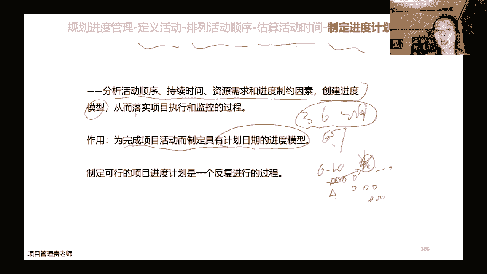

它是加入了你具体执行的一个日期好，它也有我们的这个输入输出，还有我们的工具哈，那输入呢就比较多了啊，前面的活动清单呐啊这个估算依据啊，啊这些派工单呢都要把它考虑进来，然后分啊。

工具和技术呢最主要的就是进入网络分析，还有关键路径，资源优化，这也是重点哈，还有进度压缩呃，我画横线的，这几个都是制定进度计划里面，重点要掌握的工具和技术，这也是考点。

那输出呢当然是输出了我们的进度基准喽，啊几月几号啊，开始干什么活，几月几号开始干什么活啊。

进度计划呢唉就是给各个活动管理的活动，标注计划的日期，持续的时间，你成分的节点和所需要的一些资源，那具体进度计划它有几种展现方式哈，展现方式呢，一般都是用横道图或者网络图比较多啊，给领导汇报的时候呢。

就用这个比较简明的干，就用简明的这个里程碑图，横道图也许大家没听过，但是甘特图大家都知道横道图就是甘特图，它就是一种图表方式啊，里程碑图呢它就比横道图要稍微的啊，简单一点点，它是重要的。

去展示我们的这个里程碑的一些节点，然后进度网络图，轻度网络图呢，它其实它它它其实没有标注于，我们的时间的刻度，它只是标注了这个各种，就是我们前面的单代号和双代号。

它更重要体现的是活动与活动之间的逻辑顺序，和活动持续的时间，但是呢进入网络的，它没有办法很好的去跟我们的具体的日期，去把它对应起来，所以它是没有时间刻度的，然后横道图哈啊这还有一些具体的这个表示啊。

这个构造函日历的时间和持续时间，哎这个比如说周末和节假都不能算在里边啊，有的时候如果说你管的项目是一些啊，国际型的一些项目，那么国际型的项目呢，可能这个涉及到不同的文化。

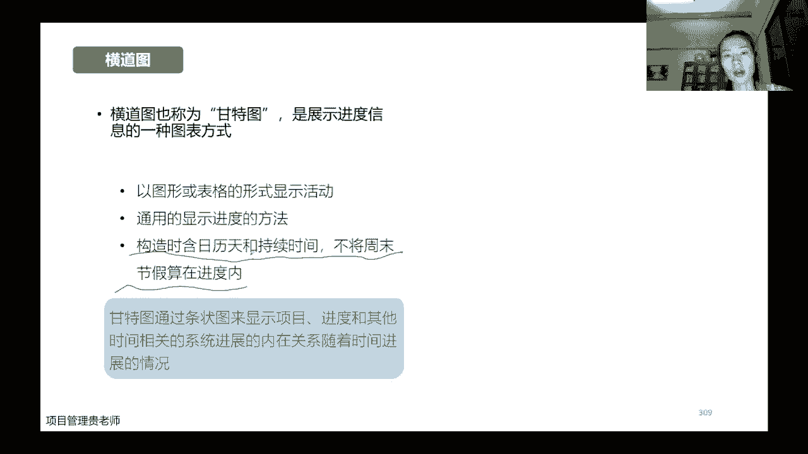

大家的假期不一样啊，大家假期假期不一样。

甚至呢这个有一些文化不一样，那有些时候严格去啊占用他的这个周末的时间，或几节节假日时间的，那个时候呢就要着重的去考虑了，当然在国内可能很多嗯出了一些意，意外的一些影响，意外的一些因素。

可能就把周末给无条件的加班去了哈，嗯看图是吧，嗯概括性的进度计划，这个就是我们的这个横道图哈，因为横道图它分了还有这个概括性的，然后也有这个详细的，然后也有里程碑的概括性的进度计划呢。

它就相当于非常简单，我就直接是工作包，我每个工作包啊这个标注一下，他大概从你哪个时间段到哪个时间段啊，然后呢我工作包的这个啊，这个前面是整个每个工作包是多少啊，标注一下。

然后我整个这个嗯这个工作包的上一级，他持续的时间是多少，把它标出来，这个是概括性，就非常的笼统，然后呢除了概括性能呢，还有详细进度计划，详细的进度计划呢就是前面哎，比如说我们还是开发和交付。

前面不是只有概括性的，只有工作包一，工作包和工作包三吗，那么具体而言工作包一里面到底包括哪些呢，唉我们再把工作包容一，它是从这里持续到这里，那里面呢诶是包括了设计啊，建造啊，测试啊，每一个区的这个活动。

它是从上面的，这前面都是这上面都是日期哈，都是时间区间都是日期啊，我从哪个时间到哪个时间，是我的这个工作包一里面的这个1。1。1啊，然后呢第二个这个建造组件呢，比如说是从哪个时间到哪个时间，我是1。1。

1。2啊，我第三个呢哎我是1。1。1。3啊，这个网络图或者说这个干透图好，这个甘露图它有一个比较好的一个这个啊，这个优势呢是说哎，我不仅能够在我最开始的时候，展现它的整体要吃鸡的时间长度。

并且呢我在某一天某一个时间啊，我我比如说我在这个时间节点我去看它的时候，前面已经做过的，我就标准啊，标准一个颜色，这个颜色大家在在自己在做的时候，可以随便的去选，软件里面也会有提示啊。

我比如说我今天看到的是他，我已经做的是这么多，我没做的是标注是另外一个颜色，然后呢下面哪些已经完成了，而且还没有完成，中间完成了多少，我对于整个项目的这个活动，它还需要多长时间，他以已经完成哪些工作。

我是非常的清晰，就能够直观地看得到哈，这个大家嗯一般如果说做甘特图的话，嗯应该不至于用excel表去画吧，做甘特图用的比较多的，像project的这个软件都是比较好用的，你把前面的日期把它一写。

然后它自然的这个图形它就能够出现哈，里程碑的进度计划呢，它其实嗯就也是比较笼统的，但是他的表达方式呢是略微有一点区别啊，他也是比如说a啊，什么时候啊要完成组建一，什么时候完成组件二。

把什么时候把这个一两个组件开始做集成，然后对应的这个啊里程碑，比如说我在6月7号我要完成，我要6月7号的时候，我要完成开发新产品，那具体来说呢完成组建一哎，我可能对应的是在这个什么时间段啊。

然后我对应的g2 呢可能在这个什么时间啊，比如说11月2号，11月3号呃，为什么里程碑的这个进度计划他不是这样的，大家思考一下，为什么它不是条形的，从从什么日期到什么日期，嗯如果说脑子转的比较快的。

也可以在评论区敲一敲，为什么哈，我可以告诉大家为什么，因为我们前面讲了李程碑，它是一个它就是一个这个这个点，对不对，他没有时间的持续时间啊，它的持续时间是零，所以它的标志方式是这样的。

而不是从什么时候跨度到什么时候，好这有一个里程碑的图哈，里程碑的图嗯，这个呢比较复杂，这个讲的是这个海军新政管理的一个，里程碑图啊，比如说从我们的项目的基层啊，这个团队成员第一个阶段呢要设计文档啊。

要组合设计文档，要最后要出现一个这个技术的草案啊，在每一个这个里程碑节点里面的，它对应的啊可能在这个日期要出现要做什么事，然后这个日期要做什么事，然后这个日期要做什么什么事，然后同时呢在这个日期的时候。

做完的时候要往上报啊，要去做一些评审啊，啊在管理层啊，有技术评审在什么时期财务评审啊，预算草案或者最后的草案评审又在什么时候，草案平时完了之后呢，哎你还要往上报啊，这个网上报这个草案是行刑。

然后呢上面会提出一些具体的一些要求，在什么时间啊，要把这个要求把它拿出来，既然我们提到了哈，这个前面有那么多的这个网络图啊，还有激光丢计划，所以呢我们要估算这个活动，整个项目的时间的时候。

前面估算那个活动时间呢，那现在啊这个人家问你，领导问你，你这些活动的时间都出来了，我问你整个项目的这个持续时间到底要多久呢，啊我们就要用一些工具和技术了哈，首先第一个呢也是非常重要的，叫做关键路径法。

第二个非常重要的叫做关键练法，我们先讲关键路径哈，关键路径，关键路径呢它主要是它是相对的哈，它一般大家可以理解成关键点，就是整个啊这个项目计划当中，他有可能就是因为很多很多条。

大家刚刚看网络图的时候也可以看得到，啊随便随便举一些例子出来哈，这个网络图它不是涉及到很多条线吗，啊每一条线啊，比如说它持续的这个我们用的是双代号哈，a b c d a d e f g h，每一条线。

每一个活动它持续的时间都是不一样的，别三天啊，四天啊，五天啊，六天七天，我们现在知道了每一个活动它持续的时间，那我们怎么知道这整个项目从开始到结束，程序的时间到底是多少呢，我们就要用关键路径法。

关键路径法呢是这所有的线路当中，持续时间最长的那条路径啊，我这句话已经说的很慢了，持续时间最长的一些路径，那我们具体来对到这个上面说，这个项目它会有哪些路径呢，哎他会有从a到c唉这个图画的太好。

重新画一个清晰的，一，f，ok就画这样一个简单的吧，那么他这个他这个有几条路径呢，有可能是啊活动路径有可能开始啊，从a到c，到f，也有可能是从a，到b到g，也有可能是从啊这个不从a开始。

a和d是同时开始的，直接从d然后到一，到g，那后面前面的开始和结束我就不写了哈，它有多条路径，对不对，那么有多条路径啊，哪条路径每条路径都得走啊，因为每条路径它都是有前后的。

这个这个完成到开始的逻辑关系的，对不对，都要考虑，那我们现在把这个时间带入哈，比如说我们的啊a需要五天，b呢需要三天啊，c呢需要啊，比如说两天，f呢需要一天嗯，d呢需要五天啊，一呢需要三天啊。

那我们就看一下，从a到c到f需要一共需要多少天呢，哎我们开展a加c加f 18天，对不对，a到b到g要多少天呢，是5+3加上，诶这a b c d e没写g哈，g随便写一个，比如说两天，那到g是多少天呢。

5+3+10天，那d到一啊，再到g是不是需要多少天呢，第15天啊，一室三厅，一室两厅，这个也是十天，诶，我们现在就知道了，当我们假设这个资源是比较充足的，就是不会存在说我这个资源我必须要啊。

这个完成a的时候，我d就不能动了啊，这个如果说要考虑资源的话，我们就用关键链法，但是我们关键路径呢它是不考虑资源的限制的，也就是从理论上来讲，我a开始的时候，我d就能够开始。

那么我现在这个活动到底是需要十天呢，还是需要八天呢，八天肯定是不停，对不对，因为我a b g这条路线他就需要十天，所以我最长的关键，最长的这条路径是a b g和第一集，也就是说我需要派这么多的资源。

同时开始干这个，然后呢也需要派这么多资源同时干，这个能够把只要资只要资源不受限制，资源比较冲突的时候，我是可以十天之内把这条路径完成，把这条路径完成，同时呢因为这个小于十的这条路径也能够完成，对不对。

所以关键路径呢是我们所有的这个活动当中，持续时间最长的那一条路径，那么通过这个案例呢，大家也可以看到关键路径是不是只有一条呢，不一定，对不对，不一定，关键路径是不是啊，就等于我们的项目进度计划呢。

这个显然也不是一回事，对不对，它只是用来帮我们去判断这整个项目，它持续的时间啊，是项目持续的时间，不是活动的时间，是整个项目的持续时间啊，会是多久，是用来判断这个的。

所以它具体来推算的方法呢有两种方法哈，顺推法和这个逆推法，在我们学顺推法和逆推法之前呢，啊要了解一下这个绘制关键路径，它的这个七格图，因为下面我给大家举的例举的例子，就是比较简单的用一个双代号网络图。

然后去把它表示出来的，但是呢在一个嗯最正规的，它的表示方法呢其实是这样子，叫七个图，为什么叫七个，因为刚好有七个格子，中间的是活动的名称，然后呢上面是活动对应的它的这个编号序号，然后呢嗯最早开始的时间。

最早完成的时间啊，最早最迟开始的时间和活动本身，它到底要花多长时间，以及呢他最迟完成的时间，这是表达的方式哈，为什么会存在这样的表达方式呢，因为首先每一个活动他肯定有名称吗，对不对，他也有对应的序号呀。

他有自己活动持续的时间呀，那么我们不是说了每一个活动，它还有这个嗯提前量或者滞后量吗，那么既然有提前量和知乎量，那我就存在于我最早什么时候开始，然后什么时候完成，以及我有智慧量的话，我最迟什么时候开始。

最迟什么时候完成，对不对，所以有这样的一个因素之后呢，我们顺推法呢是哎就是从左开始到右，就是从左边，比如说最早开始啊，是第三天开始，我持续的是五天，那么最早结束是不是就是八天，这样顺推过来啊。

逆推是什么意思呢，啊把最迟数哈最迟啊，比如说最迟是从第五天开始啊，那活动历时五天，那我最迟完成的就是这个十天，这样就算出来了，逆推法是什么意思呢，逆推法呢就是哎还是这个例子，上面这个例子是多少，15天。

还是这个例子哈，这个活动它持续的时间，比如说15天，那么我最早啊，我我是要在这个第十天，我必须要把它完成，然后最迟的我可以在第15天，那ok我既然要在最早在15天完成，我要历时五天。

那我最早我第五天我就得开始了，对不对，然后这次呢唉我需要这个15天的时候完成，我要逆15天，我就说这次我必须要在第十天的时候开始，是不是，所以顺推法和逆推法怎么算的哈，好掌握的怎么算呢。

这又有一个例子了，今天晚上讲的这个例子啊。

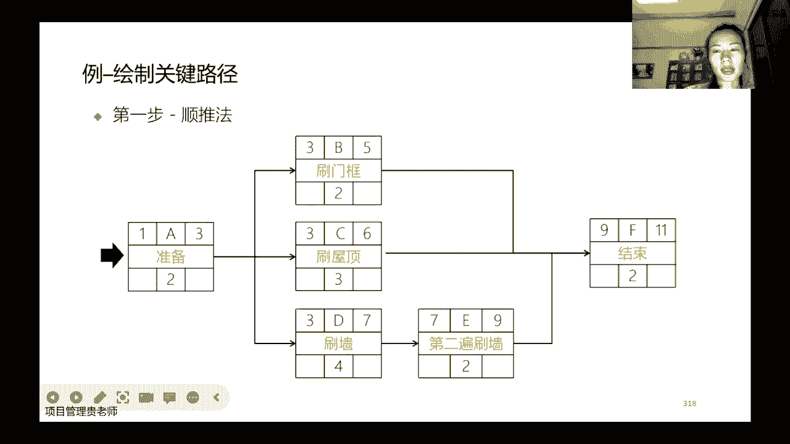

讲的这个计算比较多，大家下去之后可以再复习一下哈，那么我们这样一个活动呢，它其实我看看这是什么，这是这是刷墙，这不就是装修啊，装修呢哎首先准备工作，他是啊是a嗯，他这个标序是a啊，要做的工作是准备。

然后呢我们说了，这下面这个二呢是代表它持续的时间啊，同样的双门框，我们的这个标注标注的这个序号是b，然后它需要两天啊，刷屋顶需要三天，刷墙需要四天，第二遍刷需要两天啊，结束啊，有一些收尾的一些工作啊。

这个大清洁啊什么的，需要两天的时间，那现在呢他告诉了我们有一些呃这个条件哈，我们用顺序法先算一算它最迟的最早，现在上面最早的我们都知道啊，最早的是比如说第一天开始了，然后呢这个经过两天，第三天完成啊。

然后经过了这个刷完之后开始刷门框啊，双门框呢哎我们这个第三天就已经结束了，对不对，那我最早就是第三天我就可以开双门框，双目框需要两天，所以我最早的结束是五天嗯，然后第二个呢是商屋顶。

双屋顶呢这个b c d哈，都是在a之后可以同时开始干的，那同时开始干的呢，我们的最早开始时间都是第三天，都是第三天持续的时间，这个是三天上屋顶，那我们第六天最早可以结束，刷墙呢需要四天。

那么我们最早的第七天可以结束，如果刷墙刷还要刷第二遍，第二遍呢最早第七天可以结束，要刷两天，然后第九天可以结束，那现在从问你这个结束阶段从哪一天开始呢，啊这有最早第五天的，最早第六天的，最早第九天的。

那我这个结束的这个活动，我能够从第五天或者第六天就开始嘛，不能够，对不对，因为我们只有在bd一都结束之后，都完成之后才能开始这项工作，对不对，所以他一定要去这几个工作当中最后的那一天。

所以他只能等第九天的时候才开始干，结束的这个收尾的这个活，然后收尾这个活要持续两天啊，所以呢他需要的是要在第11天，的时候能够把它去结束。

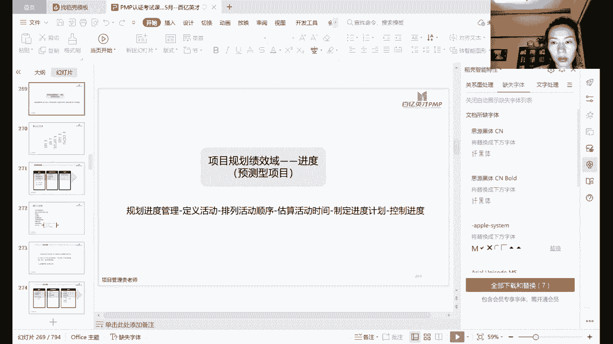

然后逆推法，逆推法呢我们现在是知道了他的这个啊，顺着推最早的时间，我们要算一算他逆推法。

我现在看到评论了，投屏错了，投屏错了吗，大家刚刚看不到题目，我顺推法的时候看，大家看不到题吗，现在呢能够看到逆推法吗，大家刚刚看到的界面是什么呀，好我接着讲哈，这个如果说嗯如果说有这个刚刚现在还是错了。

现在大家看到的页面不是逆推法这个页面吗，看不见题，稍等一下哈，现在大家看到的界面是什么呀，就是个ppt，稍等一下，q2691 号，稍等一下，我重新的共享一下看看。

好现在呢，现在还是第一页吗，我重新共享了一下这个这个ppt的界面，平时一边急啊，可能还不行，稍等一下哈。

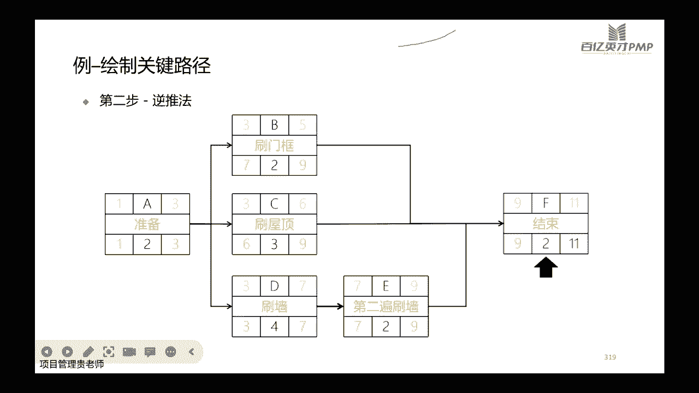

大家看到的是不是这样一个界面，是不是就是规划绩效率，然后预测型项目进度的，这个是这个吗，哦现在好了，现在好了，有提了，那现在大家看到的是哪个呢，现在我看到的界面好吧，稍等一下嘛，现在我看到这个界面是。

是你们刚刚说的，没没没关系哈，我把它往后挪一下，你好奇怪，现在呢现在是319还是269，现在是319吗，我把这个页面弄出来是319不，哦是三六九是吧，o如果现在是啊，ok ok如果现在是319就ok了。

那那前面大家看的是269那一页的时候，是从是从什么时候开始的吗，我把摄像头给打开了嗯，也就是说大家就错过了上面一页，对不对，就错过了318这一页，然后呢嗯318之前的页面都是正常的，是不是。

是不是只错过了318这一页，ok好了解了哈，从318开始，大家没有那个，我看一下时间，没关系哈，大家从319呃，我我开始讲哈，这个讲逆推法，大家会了，逆推法也就会顺推法了。

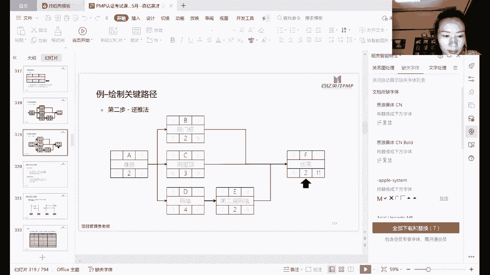

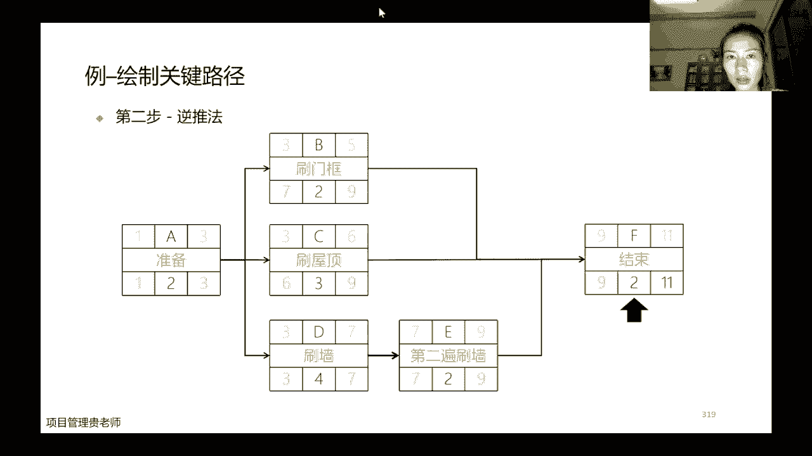

好逆推法呢就相当于是我知道了这个项目，它是嗯最晚是什么时候结束的。

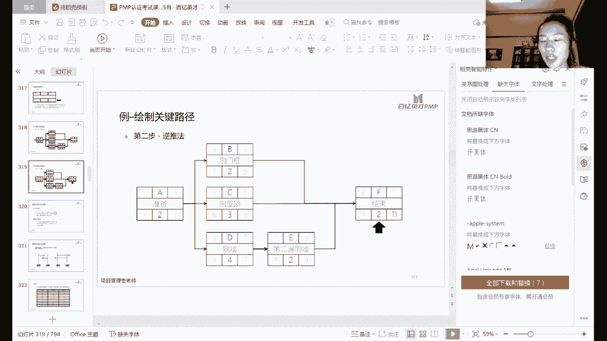

那ok我最迟的结束时间，我是第11天，然后呢我这个活动因为要持续两天啊，所以我最迟开始的时间是九天，那最初开始的时间是九天呢，意味着我他的这个结束的这一部分的，工作内容啊。

他的警前活动是b c和1b c和e呢，它最迟啊去结束的时间呢都是九啊，所以这里都可以标上九，然后呢他的时间是两天，所以他最迟开始的是七天，最迟开始的是六天，最迟开始的是七天，那ok他这最开始的是七天。

他的金钱活动是d d最迟结束是七天，因为他最迟第七天要开始，所以他必须要最迟第七天要结束，它持续的时间是四天，所以它最迟第三天要开始，那现在看来b c d呢，他们共同的这个景甜活动是a哈，是a。

所以呢你看最迟最迟是七天要开始啊，最迟是六天要开始，最迟是第三天开始，也就是意味着我这个a的这个工作，我最迟的时候第三天必须要开始，对不对，因为我前面我我这个活动。

虽然说我有b c d3 个这个活动排在后面，但是我记着这个活动，我最迟第三天我就必须要开始了，意味着我a我最迟第三天我必须要把它完成，对不对，所以这是三啊，他持续两天啊，第一天要开始做呃，顺推法。

刚刚大家没有看到嗯，没有看到有看到啊，我快速的再过一遍嘛，顺德法意思就是说哎我从第一天开始啊，我要持续两天，所以呢，我必须要这个最早最早结束的时候是第三天，那最早结束第三天。

意味着我b c d它的这个紧后活动，我都第三天可以最早就可以开始了，然后第五天最早结束，第六天最早结束，第七天最早结束，然后第二遍刷墙，这个活动一活动呢啊我前面是最早第七天结束。

所以我最早第七天才能开始，我持续两天，最早呢第九天还要结束，那结束了之后啊，后面的结束这个工作呢，f这个工作呢他的几年活动有三个，他在b c和e这三个活动，b c和e这三个活动都结束之后，他才能开始。

那这个活动什么时候结束呢，虽然闭合，所以最早的第五天就能结束，第六天就能结束，但是一呢他最早第九天才能结束，所以活动f它最早第九天才能开始，因为持续两天，所以它最早完成的时间是11号，顺利法也比较简单。

好你在哪说了，我就不再继续说了，我把大家用面板调出来一下。

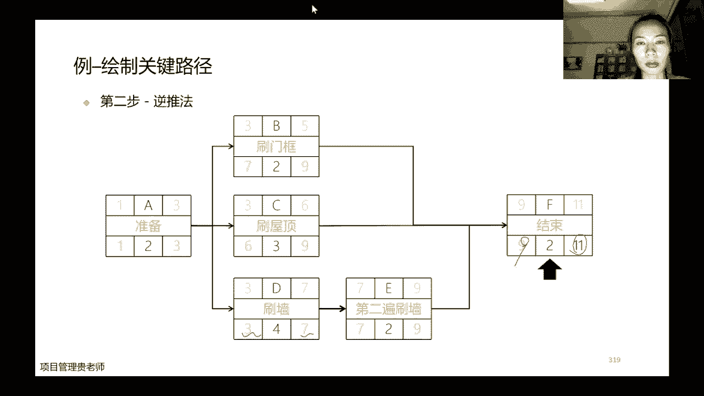

明白了哈，是我的我的页面为什么不动的呢。

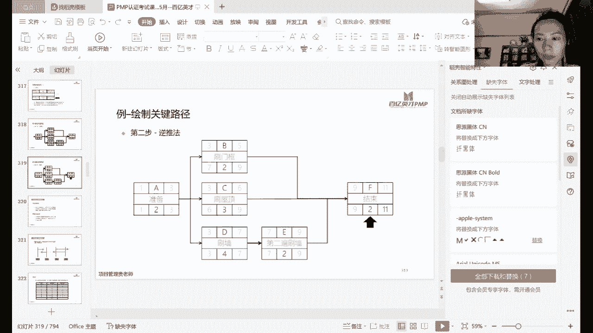

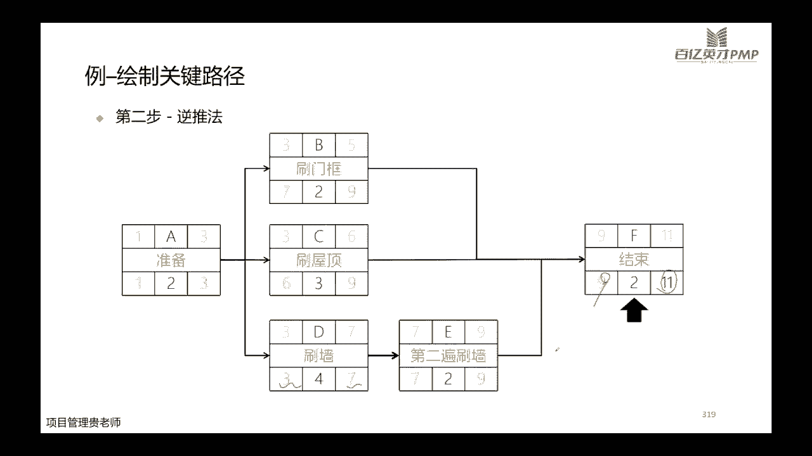

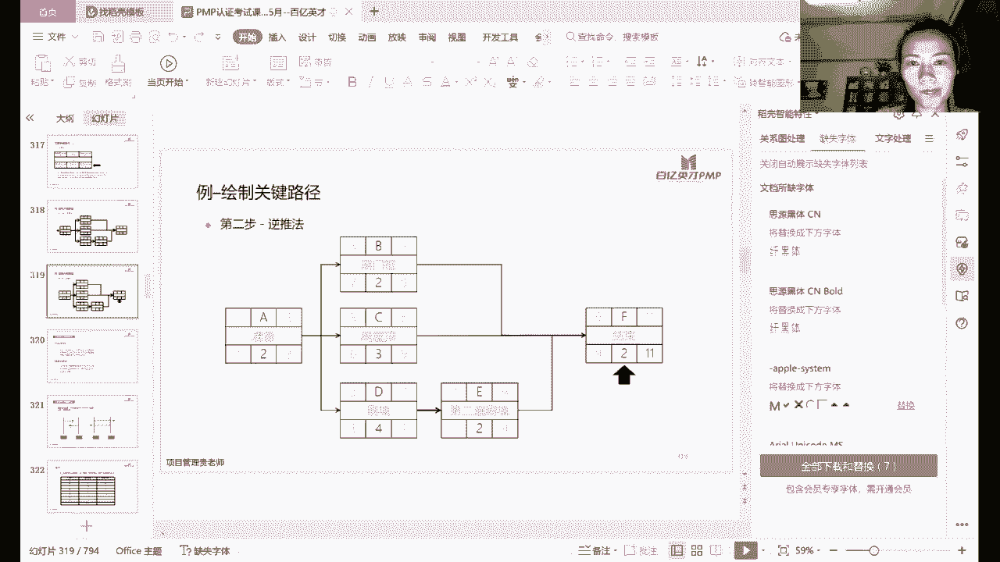

注意注意调过来，我现在调了屏幕哈，调到320了啊，评论区有同学说亮黄色，大家看不清的嗯，这就看不清，应该不至于吧，回头我再把颜色调暗一点，然后关键路径法，既然我们知道关键路径法和，我们就要知道两个概念。

一个叫总浮动时间，一个叫自由浮动时间，这两个浮头时间是什么意思呢，总浮动时间呢它是指的是啊进度活动当中，从最开始到一直到这个完成的时间，他可以有一些提前量和支付量，但是呢他浮动时间不会延误。

整个项目的完工的日期的啊，这个叫做它的总共可以浮动多长时间，然后第二个呢叫做自由活动时间，自由活动时间呢，它是不影响不延误紧后活动的这个事件，所以两个是略微有点区别的。

它总幅度是不延误整个项目的完工日期，自由活动时间呢是不延误他的酒后的活动的，这个持续的时间，嗯这个呢可能更加的直观一点哈，这个要根据质因素啊，我们来推测一下关键路径上面的总浮动时间呢，有可能是正值啊。

有可能是零，也可能是负值，因为呢从啊1~2，他有可能是这样的一个进展过程，然后这个嗯中间会有一些荣誉的时间在这里面，当然了，他也有可能有一些这个呃，往前推或者往后这个延的这些时间，所以呢总浮动时间。

如果他是在关键路径上面的话，那么这项活动它的总浮动时间也有可能是真的，有可能是负的啊，也有可能是没有任何浮动时间，都是可能存在的哈，这儿呢还有一个练习，然后这个练习呢啊他是给了你一张表。

这个表呢你首先要把它的网络图画出来，对不对，网络图画出来之后是干什么的，画出来网络图我们才能找到它的关键路径，对不对，找到关键路径之后，每一个活动它的持续时间都有啊，我们才能知道啊。

这个项目它的关键路径的活动的持续时间，关键路径持续时间多长，从而得知这个项目它本身它的持续时间是多少，对不对啊，所以嗯这个练习呢我看一下时间啊，9。08，先把这个练习的解答展示出来哈。

要不然大家自己下去之后把这一题念一下吧，因为这题还是嗯比较能够考验大家有没有掌握，今天晚上讲的这些呃核心内容的，从我们怎么画网络图啊，这个七个图怎么表示，关键路径怎么去找啊。

怎么计算顺推法或者逆推法去计算，每个活动它的最早开始，最早完成以及最迟开始和最迟完成的，这个时间是比较考验大家的，反正答案在后面，大家下去之后，自己画画了之后，有任何的这个问题的话。

咱们及时的在群里边去讨论好不好，好还有一种这个工具和技术呢叫做资源优化，资源优化呢它分了两种类型，一种呢叫做资源平衡，一种呢叫做资源平滑，资源平衡呢他是说诶我资源的需求，我需要啊八个人。

那我是不是就直接给你供八个人呢，啊还是说我给你16个人，让你去折腾吧，所以在资源需求和供给之间啊，内外之间他有一个平衡，所以一般如果说啊一个进度计划排出来之后，他让你用资源平衡的这个技术去调整一下的话。

那么啊，资源平衡，一般情况有可能会影响我们的这个关键路径啊，它一般会导致关键路径改变，为什么呢，因为你资源少了，跟资源多了，那你对于关键路径的影响一定是有的，就是嗯从理论上讲，资源多的话。

关键动机应该是会减少一点，从理论上来讲，如果说资源越少的话，你可能关键路径就越长，对不对，你越少人干活，这个活动看花的时间就越长了，这个好理解哈，还有一种技术叫做资源平滑。

资源平滑呢哎它是对于进度模型当中，对于它内部的这个活动去调整，比如说哎我用这个啊，a他可能要用六个资源啊，这个b呢他也可能用四个字源，那我把a的六个资源派一个给他，分一个给他。

然后以至于呢这个b它可以更早的去完成，所以呢嗯资源平滑呢，它是在活动与活动之间去调配，它不涉及到资源整个供给之间的，它一般情况下呢它是不允许改变关键路径的，在关键路径允许的这个情况下。

也就是在我们的总长度，你说是18天，在这个18天保证的前提之下啊，让你资源来回的去调配一下，所以这两个句式它会有区别，考试当中这也是考点，然后呢你根据考试当中他给的场景。

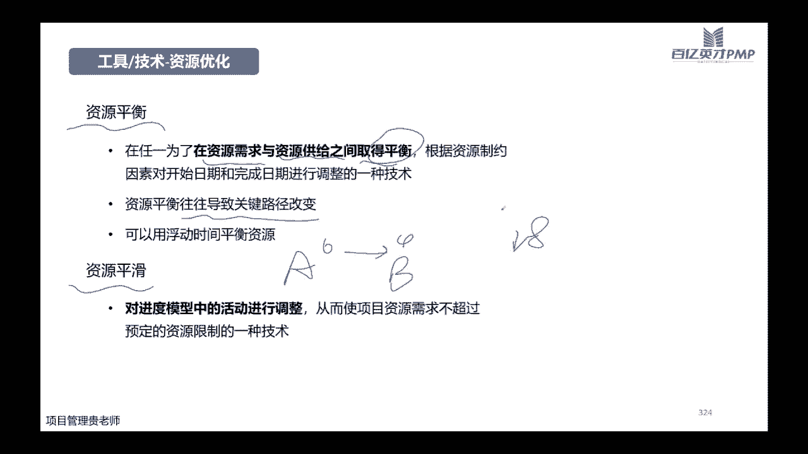

你就能判断它使用的是资源平滑还是资源平衡，这有更直观的一个例子哈，嗯是讲资源平衡的，资源平衡呢，比如说哈我们这还是有这些活动，从开始的时候呢，活动a和活动b，活动a呢。

它需要汤姆和机密各工作八个小时才能完成，然后活动b呢需要经理工作八个小时，活动c呢需要啊这个汤姆工作八个小时，那我们怎么安排的哈，我们比如说安排第一，那我们第一天就把活动ab都开始了呗。

反正活动a呢需要这个汤姆工作八个小时，活动b呢需要这个嗯几米工作八个小时，然后相当于是他们一共工作八个小时，几米一共工作16个小时，对不对，我第一天就把a和b都换成了，然后我第二天开始做c这个工作。

这个活动，然后c呢我需要他们在工作八小时好，第三天的时候就不用干活了，反正a b c都已经完成了，这是资源贫困之前的哈，嗯建平衡之前需要两天的时间，把a b c都完成了，那资源平衡之后呢。

哎为什么要做资源平衡呢，我们说在资源的供给之间要取有一些取舍，为什么呢，因为你不可能说让吉米第一天你工作吭哧吭哧，工作16个小时，对不对，那他要累死了，第二天就开始投诉你了，说你这公司加班加点，对不对。

所以我们必须要考虑资源的供给平衡的问题，这个供给平衡呢，在这给的是每天就是八小时工作制啊，所以吉米的第一天只能工作八个小时，那么资源平衡之后是什么样子呢，a第一天开始活动a，我不要第一天开始活动b了。

因为没有时间精力，没有时间没有精力去给你开始活动币了，那我活动a放在第一天开始进行，我让他们两个人每个人都工作八个小时，然后第二天呢我开始啊工作这个活动，b因为必须要先b了。

再c他们两个都是c的这个景象活动，那我第二天就开始b啊，吉米第二天工作八个小时，然后a和b都完成之后，我第三天我才开始工作，c c他需要他们工作八个小时，对不对，所以我整个的这个活动a b c都完成。

我需要三天的时间啊，前面关键路径是两天，我后面关键路径需要三天的时间，这就是资源平衡，资源平衡呢它一般情况下，它改变了我们的关键路径，对不对，改变了改变了关键路径，那有人就想哎，那这样太不好了呀。

我必须要把时间压缩呀，关键路径越短越好呀，啊相当于是给项目节约时间啊，但是我们节约时间的前提是，我们要不能违反科学，前面讲过要合规，对不对，你这样滥用劳动力肯定是不合规的啊。

所以这是资源平衡多用的具体场景哈。

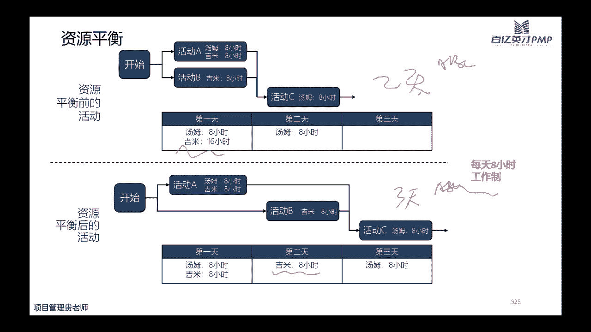

后面讲资源平滑，资源平滑我们说了，他一般不会改变啊，项目的关键路径，你既然不会改变关键路径，所以项目它的持续的时间，整体的时间是不会变的，然后完工的日期就不会被延迟，那我们资源平滑。

它会出现在什么样的情境下面呢，哈还是这样的一个例子哈，嗯a b c3 个活动啊，各持续的时间a两天，b5 天，c3 天，他们都持续完了之后呢，啊这个活动它就结束了，所以我们看一下。

比如说我们第一天的时候，a就同时开始a b c3 项工作，a呢需要两天的时间，这两天我a做完了，b呢需要五天的时间，我也就是说我在整个这个天数上面，我b第一天一直要干到第五天我才能完成。

然后c呢我需要三天啊，我从第一天干到第三天我才能完成，然后呢他这有一些假定条件，假定a有两个工人，b和c呢分别有四个工人和两个工人啊，也就是说a有两个工人，然后b呢是有四个工人啊。

然后呢这个c呢是有两个工人，那会出现什么情况呢，我前两天的时候，我在这个嗯活动上面，这b c都开始，我有八个人在干活，然后我从第二天到第三天的时候呢，啊b有四个人呢是有两个人，我有六个人在干活。

然后我从第三天到第五天的时候呢，b有四个人，我有四个人都在干活，看起来好像没有什么问题，对不对，但是实际上会出现什么样的这个情况呢，啊大家就来说了，这个人力资源的总监就来找你了，说，到底是要八个人啊。

还是要到还是要这个六个人呢，还是要四个人啊，还是要七个人呢，到底给你弄几个人过来，你说我要八个人，好人资源给你安排了八个人啊，安排了八个人给你干活，结果你八个人干完了两天，你整个项目需要五天。

你干完了两天之后，你到第三天你只需要六个人，那么有两个人闲置了，是不是，甚至到第三天到第五天的时候，你只剩b这个工作了，你只有四个人在干活，还有其他的四个人都是闲置的，那人力资源总监就在说啊。

这个hr就说你有这么多闲置的工作人啊，你让我给你招八个人干什么呢，这八个人不要工资啊，啊他就会提意见了，这个就证明我们，就证明我们在排布这些活动的时候，出现了一些问题，然后但是呢我们用资源平滑之后。

会出现什么现象呢，啊我第一天的时候啊，这个病因为它持续的时间最长，我b是从第一天一直到第五天，我都得做，我不能改变关键路径啊，对不对，我还是得在第五天之内完成，但是呢我a和c我可以把它改变一下。

关键的改变一下他们的这个顺序，我不要a和c同时进行，对不对，我a做完了之后，反正他们都需要两个人，我用a的这两个人在做c的两个人的活啊，刚好a是两天啊，c是三天，也是在五天之内把这个12完成了。

这个时候呢我你就跟hr说啊，这个项目需要五天的时间，我需要几个人呢，我只需要六个人就够了，他就只用给你招六个人，那么在乎这五天之内，这六个人的工作他都非常的饱满啊，不会出现什么这个偷懒啊。

或者是这个资源去浪费的这种情况啊，这就是资源平滑使用的具体场景，糟糕也没有，怎么有，那么再一种工具呢叫做进度压缩，进度压缩是什么意思呢，进度压缩，一般情况下就是我们压缩整个项目的这个活动。

或者是整个项目它的这个工期持续的时间啊，一般情况下就是用的是赶工和快速跟进，赶工呢简单理解就是我给他增加资源，那原来我安排的设计的是一个资源，完成a这个活动需要五天，那我现在没得办法了。

我进度必须要压缩，你说我必须要在四天之内啊，我要把a这个活啊，或者把a b c加在一起，这些活把它完成，那怎么办呢，我多给他一点的，我原来只有一个资源安排在这，我安排三个资源啊。

从理论上面来讲能够缩短时间，这是一种办法嗯，赶工呢一般情况下你既然要加人，你可能会导致一些这个风险或者，成本的一些增加，还有一种呢是快速跟进，快速跟进呢，它一般情况下他是说把某些活动啊。

看看能不能争取到改变他们的一些关系啊，如果说不是那种必须是完成到开始关系的，不是这种活动呢，我们把它并行起来啊，尤其是那种开始到开始，但是呢它有一些还有一些这个提前量的，他有一些提前量的这些活动。

我们把它并行开始啊，原来他可能是安排的啊，一个人安排的这个做完a啊，可能在做b，这个呢是两天，这个呢是三天，但是我现在我没有五天的时间啦，我要求呢必须要在四天或者三天之内，就能够把这个项目啊。

把他的这个时间把它提前，把他时间把它压缩，那怎么办呢，哎比如说这个b它刚好是能够加减一的，那我就从提前一天啊，从最早开始的时间开始就开始肝病。

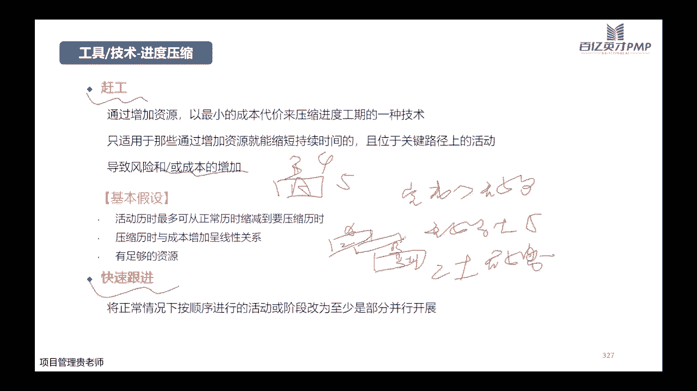

这叫并行，就快速跟进哈，啊这有更加呃更加这个直白的这个展示方式哈，比如说正常的时候它是需要啊15天，然后去需要三个资源，那我快速跟进是什么意思呢，快速跟进就是我把几个不同的这些活动，我把它并行啊。

我从啊这个是第一个活动啊，a这个是b啊，这个是c，那么我b型的时候呢，我从a开始的时候，这个b就已经从这个时候开始了，然后呢我c呢我也是在b还没有结束的时候，我就已经开始在做c了，我把它并起来。

这样的话整个它的这个时间它就变成了11天，这个15天，然后什么叫赶工呢，就赶工呢是说a我abc它们的逻辑关系，顺序还是一样的，但是呢我给他，我原来这个a我一个人干五天，我现在给他两个人，我只能干三天了。

然后同样的这个b呢，我原来是一个人干五天，我现在给他两个人，他只需要干四天，然后c呢两个人只需要干三天，那我整个只需要十天就能够完成了，就是快速跟进哥赶工，这两种使用的这个具体的这些这个场景和按钮。

一般情况下考试这个场景给你的啊，你如果说有充足的这个啊这个成本啊，冲刺资源，那我们用赶工，如果说没有充足的资源，在条件允许的情况下，我们快速的跟进，但是快速的跟进，因为你把活动并行的嘛，b型了之后。

可能会存在更高的一些风险。

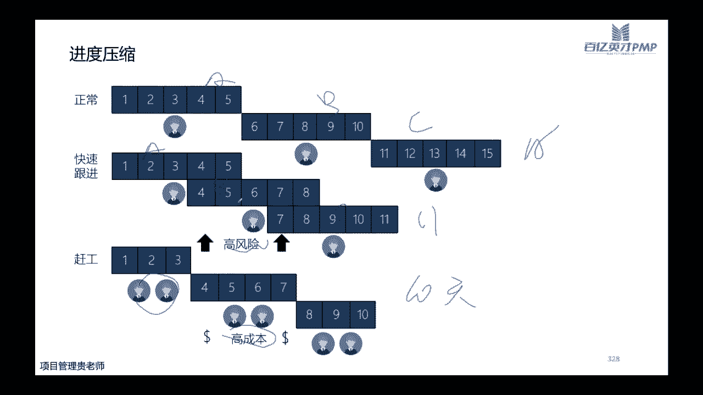

好这儿也有一些这个具体的这个案例哈，这个案例呢是讲这个进度压缩到底是怎么压的，这有这四个活动啊，这四个活动分别是a b c d目前工期是18周，为什么是18周哈，是说的你正常逆时啊，这个a是七周。

然后呢啊b呢是九州啊，一条路径是a b还有一条路径是c d，c呢是十周，d呢是八周啊，这个我们预算ab这条路径持续时间是持续六周，cd这条路径持续时间是18周，所以它的工期是18周，对不对。

他现在让你压缩啊，但是现在但是下面的每一个任务也告诉你了啊，这个任务a呢它压缩之后它历时五周啊，可以压缩压缩成本了6。2万，然后呢b呢历时六周压缩之后哈，然后呢压缩之后的这个成本是11万啊。

我们来算一算。

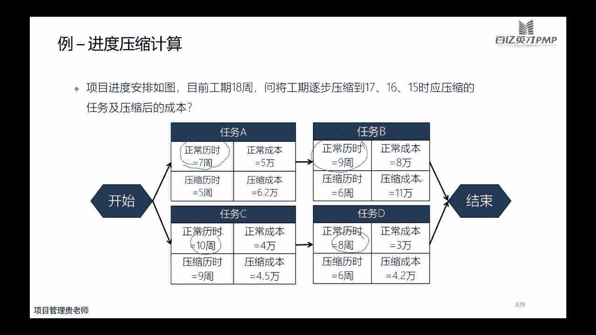

算出这些基本的这些条件，a压缩两周啊，这个压缩的这个成本，压缩之后的这个成本是6。2，那么相当于是你每压缩一周要花6万块啊，1年6万块钱，然后b呢每压缩一周要花1万啊，c呢每压缩一周是这么多。

d呢每压缩一周还是这么多，相当于是我们根据题目的场景可以算出来，它的这个每个活动可以压缩的时间，以及压缩的成本好，现在我们来算哈。

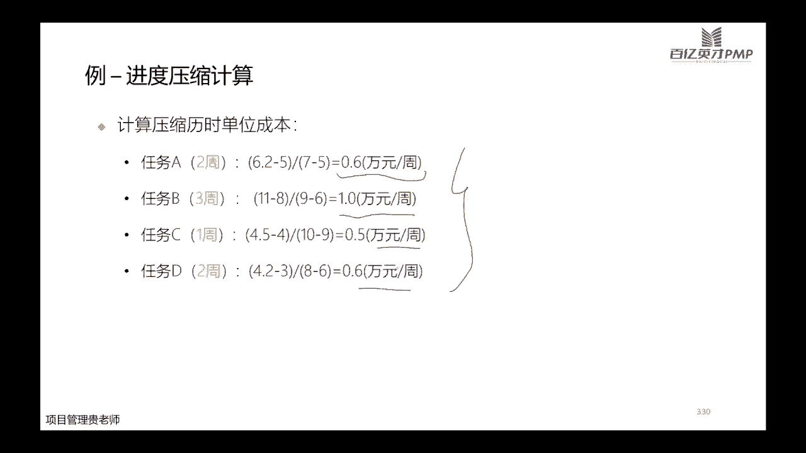

他的是说啊，不是让我们选择分别啊这个ec压缩到17周，16种和15周吗，我们看一下，如果说你要把它压缩到16 17周的话，你压缩a或者压缩b有没有用呢，没有用，对不对，因为你a和b本身。

他们一共花的时间才只有16周，所以你想压缩到十几周，你必须要压缩c或者是d啊，c可以去压缩一周变成17，或者d可以压缩一周变成时期，那到底是压缩c还是压缩d呢，我们前面有压缩c和d分别的成本。

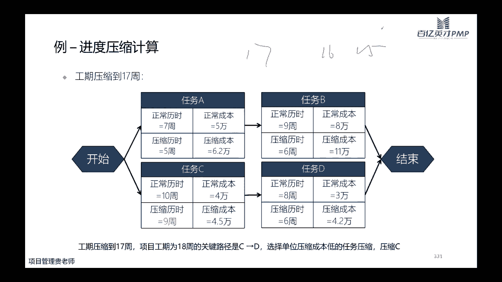

对不对，我们我们返回去看一下压缩c和d啊，这个压缩c更便宜一些，压缩c一周只要0。5万。

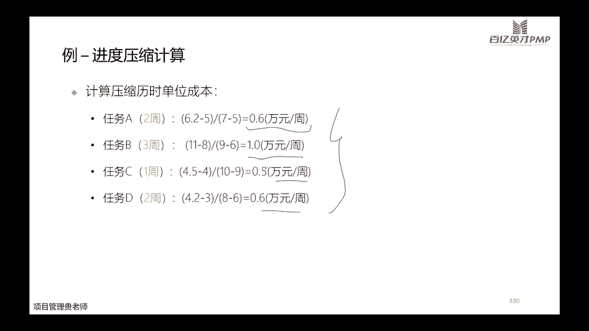

那我们就选择压缩c，选择压缩c哈，c呢把他压到酒桌啊，这个压缩之后的这个成本是4。5，ok现在呢它的题目意思是一次哈，我们要在这个场景之下继续把它压缩到16中，压缩到16周呢。

哎这个时候就会出现一个问题哈，因为呢嗯压缩到16周的时候，a和b它是关键路径是16，本身是16，c和d呢它的关键路径是17，那关键路径的海这个啊这个刚刚说错了，不是a和b的关键路径是a和b这条路径。

它是啊16，然后呢c和d呢它是它是17，它仍然是关键路径上面，所以我们既然要压缩整个工期的话，还是等压缩关键路径上面的，对不对，所以你现在只能压缩d了，因为c他告诉你了，这个他只能压缩一周。

它最多只能压缩到d，压缩到九周，对不对，所以你现在啊c已经前面压缩过了，你只能压缩d了，d再压缩一下，然后d要花多少成本，这个算出来就ok了，然后第三种情况呢是说诶，在压缩到这个情况之后。

你再压缩压缩到15周，压缩到15周呢，就存在一个嗯正常的这个这个一个算法了哈，现在它的关键的这个路径啊，a和b呢它是嗯七周加九周是16周，也就是说你可以选择去这个压缩ab这条路径，上面的同时呢。

cd是多少呢，cd呢前面压缩了啊，c已经是变成九周了，然后呢嗯d呢是这个七周了，然后呢他们加在一起也是16，你现在压压缩到15周，相当于是你两头路径它都是环节动静脉，你两个路径你都得压，对不对。

因为你只压缩a b这条线上，你cd还要持续16种，你只压缩cd上面的，你ab还得持续16周，对不对，所以你a和b，然后c和d都得选择一个来压，然后选择怎么选择呢，哪个压的成本更低，我们就选择哪个啊。

所以选出来压压缩ad较合适，这就是sum哈。

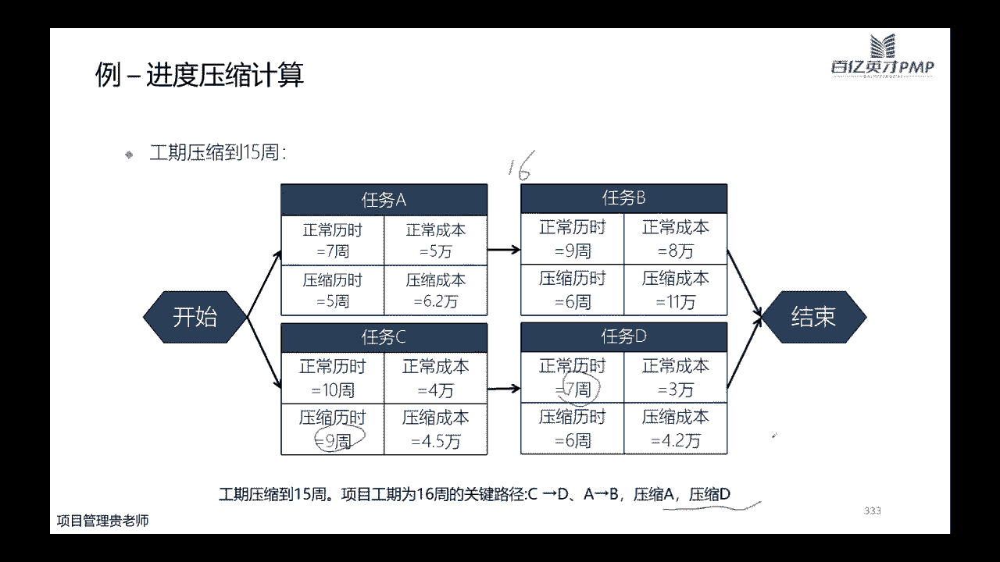

这是答案，大家可以下去之后再自己再算一算，然后关键念法呢，关键练法前面讲过了，关键路径，我们是不考虑它的这个资源可用性的，我们假定资源都是可用的，我想要几个资源，他就能有几个资源的，对不对。

那实践的过程当中呢，他不会这样子的，因为资源一定是受限制的，所以呢就要考虑关键链法，就是这儿有一个这个假设哈啊，比如说啊你这个a要持续十天，b要持续五天，那么你的工期是15天。

但是呢现在有个假定条件是说a啊，假如说六天就完成了，他问你整个工期会不会就变成11天呢，从理论上来讲好像会对不对，但实际上我们前面讲了啊，这个帕金森地理工作会自动膨胀啊，就是你你提前做完。

你会你也会在那磨洋工啊，做一些这个跟项目没有关系的一些事情，所以呢你是不会从人性的角度来考虑，你是不会说哎呀我提前完成了这个11天了，怎么怎么样，除非啊他有一些其他的一些机密。

那个这个比如说这个提前完成，有那些什么奖金啊，这个就念书哈，这个是关键念法考虑的一种情形，然后还有一种情形呢，是说诶他的这个嗯汇聚路径的这个风险哈，汇聚路径的风险呢，比如说他这个a b c3 个活动。

它完成的概率都是50%，那你d完成的概率嗯，就是今后活动低嘛，紧后活动完成了概率是不是也是50%呢，不会的，对不对，为什么呢，因为你不能单独的考虑，我a b c都50%的情况下完成，哎，我弟也50%。

有可能哎a它会出现一些意外的情况，b呢它有可能出现一些意外的情况，c呢它仍然有可能出现一些意外的情况，所以即使你要求a b c，他都保持50%的完成率，你也没有办法保证它汇聚的时候。

也能以50%的这个可能性去把它完成，所以考虑关键点的时候呢，就是会涉及到一些嗯项目的缓冲，项目的缓冲呢嗯就是比如说啊这个a啊，就是23412341234这四个活动，1234这四个活动啊。

他每一个活动啊他都有一些啊荣誉的时间，有一些自由活动的时间啊，不管他是这个两天三天啊，这个这一天一天就是自由浮动的，自由浮动，有我们前面讲了自由活动，也就是你不影响紧后活动的啊，那个时间对不对。

那就是我在两天，我多个两天玩个两天没有关系的那种，那如果说你在安排任务的时候，安排活动的时候，你会把这些自由活动的时间，都留给这些活动的资源，让他们自己去分配吗，会不会呢，会不会呢，大家可以考虑考虑哈。

基于我们前面讲的这个啊，帕金森病女工作自动膨胀，你会不会呢，如果你把活动的这些荣誉时间都留给资源，自己去分配，那么很有可能你到最后的时候，你这个项目一个总的活动时间啊，你有这么多浮动时间。

你其实是应该有，比如说这个加起来每个有这么多，那加起来应该有轻微的浮动时间，你存在说最早你有可能提前七天完成，但实际上呢，因为工作自动膨胀了大家人性的一些因素，你工作没有办法提前七天完成的。

所以怎么办呢，在安排任务的时候，在安排任务的时候，尽可能的去压缩他们的时间，不给他们荣誉的时间啊，要求他们在最早完成的那个时间去完成啊，最早完成的时间呢，其实你每个节约出来的二节约出来，三节约出来。

四节约出来，节约的这个期间要放在最后，你自己去掌握啊，你这个时候的话就调配的时候就更加的好调配，还有一个刚刚那种叫做项目缓冲啊，项目缓冲它是啊，在整个这个就是放到关键路径上面自己去调控。

还有一些接驳缓冲，就是比如说哎我这条是关键路径最长的啊，我有一些项目缓冲，还有一些他是这个，比如说我同时开展的其他的一些步骤，其他的一些活动，那么其他的活动呢他去跟他这个去并行，有一些关系的时候。

并到这里的时候，他可能会有这个这个有一些制约因素，然后有一些结果的缓冲会存在在里面，这个也是我们在安排实际活动当中要考虑的啊，另外一种哈，嗯以上呢就是我们整个这个进度计划，它涉及到的一些关键点哈。

今天晚上讲的嗯，考点比较多，然后计算比较多，需要大家掌握理解的比较多，所以呢大家下去之后啊，一定要把这个上面的练习题啊，不懂的再看，然后把今天晚上的课程呢再复习复习，这样呢是给大家捏的。

这个制定进度计划的一个整体的步骤哈，他的步骤呢主要是a我收集完需求，定位完需求啊，这个都是前面的范围的，然后我们从啊活动本身开始的，要灭活动清单，排活动顺序，然后编网络图，然后呢用这个正推逆推啊。

算出它的具体的这个啊时间，然后确定关键路径，然后关键路径确定完了之后，我们讲有资源优化呀，啊这个要考虑资源到底能不能有用啊，这个关键练法也要用进去，最后呢才制定出来的是一个比较符合事实。

比较符合活动的属性，比较符合活动持续的时间，也比较符合我们人性的这样的一个进度计划，嗯后面几个例题呢看一下时间啊，九点半了哈，后面几个例题呢大家自己去看一看，自己去做吧，答案都在上面，然后有不懂的啊。

咱们再来群里面讨论好不好，今天晚上先到这儿吧，这几个问题大家下去看，然后我们下一次课的时候，从适应性项目的这个进度开始讲好吧，嗯那今天晚上因为时间到了。

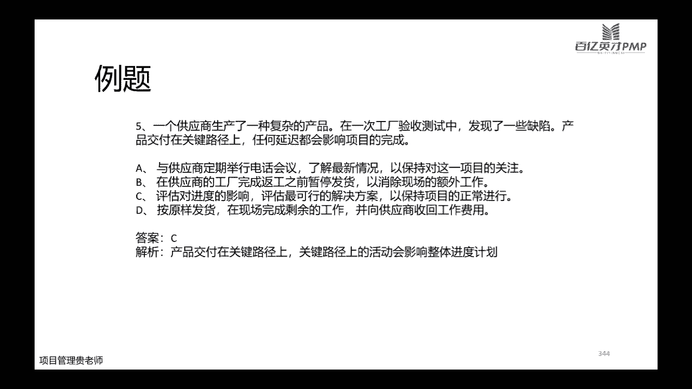

就不给大家留这个问问题的时间了。