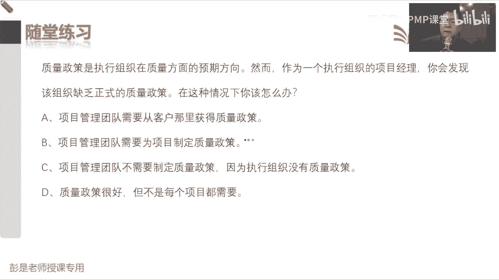
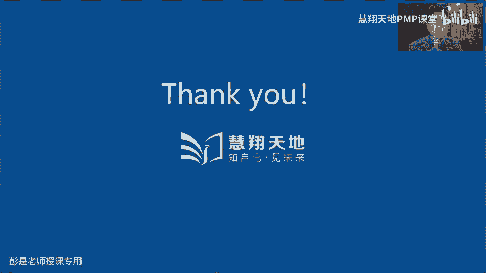
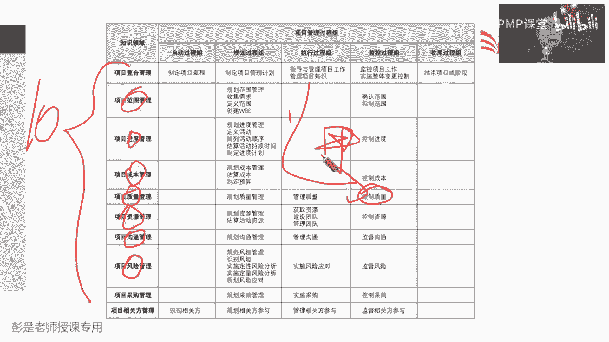

# PMP考试培训课程第1-13章节免费完整版 - P10：第八章：项目质量管理 - 慧翔天地PMP课堂 - BV18y421e7ut

上午讲完了，大概质量这张是什么中心思想，再快速的回顾一下，收集需求，定义范围，创建WB我们就有了范围基准，根据范围基准一拍脑袋大概多长时间，这个这个信息不准确，所以呢为了得到更精准的项目的工期啊。

质量啊，资源啊，成本啊，我们去继续往下做分解就到了进度这一章，进度这一章的目的是去去分析下，我们到底能不能按时完成工作呢，所以需要定义活动排列，活动顺序，估算活动持续时间，然后制定进度计划。

找到项目的关键路径，该优化的优化，该压缩的压缩，确保我们能够做到一个可行的进度表，一旦敲定了所有的所有的时间点，就得到了进度基准，那现在我们范围搞定，进度搞定，接下来要思考能不能按预算完成项目的工作呢。

所以呢需要先估算活动成本，然后逐级汇总，从活动汇总到工作包到控制账户，到整个项目得出来三笔钱，成本应急储备，管理储备，从而得出项目的成本基准和总体的资金需求，也就是项目的预算，现在有了范围基准。

进度基准，成本基准，三大基准搞定，按照这些东西去干活，告诉我们什么时间，花多少钱，干多少事情，干多少活，什么时间花多少钱，干多少事就可以得到我们的可交付成果，这个可交付成果直接去验收不太好。

因为可能会导致外部失败，导致客户满意度在下降，所以呢我们先自己做指控诶，往上走了一个水平，我们团队对我们的成果做检查做测试，看看这东西能不能去验收，满足验收的条件，再交给客户进行正式的验收。

这样可以有效的防止客户满意度的降低，那控制质量只是事后啊，能不能在市中过程中保证我们的过程合规，从而得到更好的结果呢，所以有了管理质量，这个管理过程，他的工作重心就是看看我们干活规矩不规矩。

确保我们过程的合规性，还关注过程的质量了，那过程质量结果质量，过程质量结果质量咋搞呢，所以需要规划质量管理去分析，我们需要采取哪些行为措施行动，确保我们的过程和结果都符合质量要求啊。

所以好的质量是规划设计出来的，就有了规划质量管理这个管理过程，最后呢把这堆这堆大道理，让大家都有这个意识，就变成了文化，上午就讲到了这儿说质量的五种水平，所以到了质量这一章，只要这个大道理听明白了。

能够能够很好的去区分5。1，5。2，5。3，他们仨的工作重心就差不多了，这张实际上比较细节性的这种收入啊，输出啊，现在考到的概率呀也没有这么高了，所以看PPT专心听啊，它里面有一个小小的逻辑。

有一个小小的逻辑，上午举的案例说我们牛肉面馆，那有的餐厅啊，有的餐厅啊做出来的菜对吧，用什么地沟油，苏丹红各种添加剂，嘿他乱七胡来他胡来，那有的餐厅呢可能做的菜就卫生健康安全，这个取决于什么。

这个取决于什么呢，这在质量上叫质量的政策，去分析我们的产品服务成果，需要达到什么样的质量标准和要求，有的餐厅胡来，那他就完全对吧，符不符合质量标准和要求，没关系，随便弄随便弄，吃不死人就可以了。

有的餐厅呢说我们什么农药啊，添加剂啊，地沟油啊都不能用啊，我们要保证人民的健康啊，保证人民的卫生啊，诶这个东西来源于质量政策，那这个质量政策谁决定呢，项目经理能做这个主吗，发起人能做这个主吗。

高级管理层能做这个主吗，可以了吧，所以通常通常一家企业一家企业的质量政策，这玩意儿应该是高层高级领导，高级领导啊，高级管理者来做出这样的决策，他来决定我们项目，我们的成果。

我们的企业需要达到什么样的质量标准和要求，这是政策，政策就决定了我们需要达到的标准和要求，这里的标准就是国标，欧洲标准，还国家标准，地方标准，行业标准，企业标准，各种各样的标准对吧。

大大家不知道有没有关注过这样的新闻啊，说前一段时间做月饼给人家退货了，人家不要，为什么呢，添加剂太多了，不符合人家国家当地的当地的标准，只有这个东西，那我们要去分析我们创造的产品服务或成果。

它需要满足什么样的标准和要求，所以根据政策定标准，那标准下来就是什么呢，叫指标指标又是什么鬼啊，指标又是什么什么什么鬼啊，就大家天天喝的这个矿泉水和饮用水诶，他是不是适用于不同的标准。

你看国家会有明确要求啊，你那个水叫到底叫什么水，是有规矩规矩规矩的啊，好就拿这个水来说，它水里边是不是有很多具体的要求，比如说大家都能听懂的PH值，你买瓶矿泉水，PH值等于一，PH值等于14强酸强碱。

喝完就挂了，这也不行吧，水里面是不是关于重金属含量，细菌微生物，矿物质都有一系列具体的具具体的要求，这些具体的要求就称之为质量测量指标，包括他家买的什么家电啊，衣服啊，都有这些东西啊。

吃的饭哪吃的饭哪都有这些东西啊，行吧，你去超市里面买的蔬菜，一斤蔬菜半斤农药，你肯定不干了吧，哎农药残留也有国家标准的这些具体的明细的，细节性的要求，就称之为测量指标，就称之为测量指标对吧。

比如说我们生产矿泉水，矿泉水，国家标准可能叫GB1234202023，随便说了啊，123452023，这是我们这个水需要满足的国家标准，那根据这个标准，你去打开看一看，里面有很多很多具体的要求。

这些具体的要求，就称之为一个一个一个的测量指标，所以根据政策定标准，选择标准里面，适用于我们项目产品服务成果的具体的指标，那除了这个测量指标，除了这个测量指标，第二个知识点叫什么呢，第二个知识点啊。

这两个字，他的测试方法，它的测试测量方法是不是也应该有讲究了，怎么测这个水的PH值，说观察法，拿眼睛一看，拿鼻子一闻，差不多就行，这好像不合适啊，要科学要科学啊对吧，滴定法啊，或者什么市值法啊。

拿个小纸片往里站一站，看看颜色，以此类推，那国家标准关于这些测量指标的测试方法，也有科学的明确的具体的要求，所以全擦掉重来啊，第一我们要根据项目的实际情况，我们到底要创造什么样的产品服务和成果。

盖房子有盖房子的标准，做矿泉水有做矿泉水的标准，所以根据我们的质量政策需要分析，我们需要达到的标准和要求，就把这个标准写到质量管理计划里面去了，那打开这个标准里面，有很多很多很多具体的要求。

把这些具体的要求超过来，就是我们的测量指标，再看看标准里面有一个一个科学的测量方法，就把这个测量方法也抄到测量指标里，所以实际上质量测量指标，这个文件里面包括了具体的要求和测试方法，这段话能听懂能听懂。

接下来就简单了，有了质量测量指标之后，我们把这个文件呢交给第二个同事，它根据质量测量指标里面，具体具体的一个一个的指标和测试方法，就可以写什么了呢，写测评文件，测评文件干什么用呢。

把这玩意儿交给第三个同事做质检做指控，他根据我们这个测评文件，对我们的可交付成果做检查做测试，所以回想到刚才说的那个场景，国家规定矿泉水，比如说PH值阿里应该等于七呀，然后呢。

我们就把这个东西还有他的测试方法对吧，滴定法式执法诶，写到测评文件里面去了，未来我们指控的同事，就对生产出来的每每一锅水来测PH值，根据我们的测试方法做检查做测试，那根据我们的检测试方法来做检查。

做测试就会得到第一个叫质量控制测量结果，这是测试结果，今天公司生产了100万瓶矿泉水，其中99万瓶都合格，都合格，99万瓶都合规诶，这是测试结果，第二个呢，合格的这些东西就称之为核实的可交付成果。

这玩意儿就可以去验收了，就这么一个思路好擦掉啊，政策定标准，标准选指标，指标，写测评文件，测评文件是做检查，做测试，从而得到这两个输出，一个是测试结果，一个是核实的可交付成果。

这就是这个管理过程最重要的一条脉络，搞定了这个脉络呀，再搞搞小细节差不多了，第一个小细节质量报告，质量报告为什么是管理质量的输出，我们做指控不是有了测试结果吗，为什么管理质量出报告呢，那就要去思考了。

这个管理过程侧重于管啥过程的质量吧，它侧重于管过程的质量啊，指控的结指控的那个输出质量控制，测量结果是结果的质量，拿到这个数据啊，拿到这个测试结果，我们还要分析它产生的过程是不是合规。

然后再写质量报告来告诉老板，我们过程和结果都符合要求，我们过程和结果都符合要求，嗯就这个逻辑，所以他会把质量控制测量结果这个输出，等我换个颜色啊，把质量控制测量结果这个输出啊，作为管理质量的输入。

我们还要分析一下你产生的过程是不是合规呀，最后呢把过程和结果的质量都行都写到报告里，所以随便举个例子对吧，生产了100万瓶矿泉水，然后这个矿泉水呀PH值都符合规定，我们的测试过程，测试方法也符合规。

符合国家要求，对不对，这就是我们的指标，质量报告包括了结果的质量和过程的质量，这是第一个需要稍稍有点印象的小逻辑，如果这个逻辑记不住，完全没关系啊，没关系啊，但是质量报告的内容要能猜到。

因为质量这一章强调的是，不仅仅关注结果的质量，还要关注过程的质量，所以报告里面不仅仅包括结果的质量，也包括过程的质量，这句话要能听懂，第二个小逻辑啊，这是批准的变更请求，为什么要交给指控的同事呢。

批准的变更请求为什么交给指控的同事呢，他要检查他的什么，他要检查这个玩意儿的啥，结果结果批准的变更有没有，有没有被落实，他要检查批准的变更请求有没有被落实，随随便举个例子啊，说我们给客户上了个牛肉面。

牛客户说里面怎么没有放辣椒，他就提出了一个变更请求，这个变更得到了批准，那我们就回去放辣椒，放辣椒，那你上菜之前是不是得检查一下了，对不对，客户要求多放辣椒，你到底有没有放辣椒呢，所以他是检查批准的。

变更请求的落实执行情况诶，这是指控要做的事情啊，所以大家工作中，比如说整改，那这个整改你到底改没改呀，是不是要检查一下，就这意思，所以把它作为控制质量的输入，这是我们实施整体变更控制的输出。

这个玩意儿是指导与管理项目工作的收入，因为变更一旦被批准，变更一旦被批准，一定要通过指导与管理项目工作，及时的告诉我们的成员计划有调整，按照新的批准的变更，把它落实执行下去。

那人家干活的时候有没有落实和执行呢，所以到了指控这边，我们再来检查一下，核实一下，好记住这个小逻辑，所以这就是质量这一章，大概这个中心思想，我们不仅仅关注结果的质量，还要关注过程的质量。

好的质量是规划设计出来的，所以呢你第一我们要强调去分析，我们需要达到什么样的质量标准，那就看政策，根据政策选标准，根据标准定指标，还有测试方法，指标测试方法，未来指导我们对成果做检查做测试。

然后呢批准的变更要落实，要执行，最后给领导做报告，要不要描述清楚过程的质量和结果的，两周和规都合规啊，知道这个意思啊，所以质量这一章看再看教材上的文字，应该相对来说信息量就没有这么大了。

项目质量管理包括把组织的质量政策，第一句话就在说规划质量，我们一定要先定政策，根据政策去分析我们需要达到的标准和要求，去分析，我们需要开展哪些一系列的质量管理活动，对不对，如果公司的政策是吃不死人。

那我们做酸菜的时候就没关系了对吧，脱了鞋就踩啊，就这意思啊，这胡来了吧，好这是第一个重要的作用，满足要求，第二个呢，项目质量管理还以执行组织的名义，支持过程的持续改进活动，过程的持续改进，这事归5。1。

5。2，5。3，哪个管理过程管，哪个管理过程管过程的持续改进呢，5。2吧，哎5。2他的工作重心就叫过程的质量，过程的质量啊，所以5。1规划质量管理，去分析我们需要达到的质量标准和要求。

并且书面描述将将如何证明符合这玩意儿，所以还要出那个测试方法呀，对不对，然后管理质量呢关注过程的质量，控制质量呢关注结果的质量，然后再往下综述这段文字，再看这段文字就简单多了。

规划质量管理重点关注工作需要达到的质量，管理，质量呢关注关注管理整个项目期间的质量过程，还关注过程啊，那在管理质量过程期间，在规划质量识别的质量要求成为测试评估工具，这玩意儿用什么干什么用呢。

用于控制质量过程来确认是否达到质量要求，这段枯燥的文字变成刚才说的场景，就在这些地上示意了啊，这那就是规划质量管理，据分析我们需要达到的质量标准和要求，写到质量管理计划里，根据标准来确定质量质量指标。

质量测量指标交给第二个同事作为他的收入，他来写测评文件，写完了测评文件交给第三个同事，对我们的可交付成果进行检查，进行测试，从而得到质量控制测量结果，测试通过的就叫核实的可交付成果，就在说这个逻辑。

然后控制质量关注啥呢，就是结果确保结果是可以接受的，这段文字超重要，帮助大家更好的树立了一个小逻辑，然后再往下说，项目质量管理需要兼顾，兼顾项目管理和可可交付成果两个方面，过程的质量和结果的质量。

然后巴拉巴拉这段文字基本上看就可以了，就在告诉你啊，质量搞不定，质量搞不定，可能会带来各种各样的问题，范围啊，进度啊，成本啊，资源啊，风险啊，都带来问题啊，这段文字看一遍就可以了，没啥需要背的，好来了。

一对新的朋友叫质量和等级，质量作为实现性能实现的性能或成果，是一系列内在特性满足要求的程度，这个好理解，一系列内在特性满足要求的程度，什么意思呢，就是国家规定农药残留万分之一，那我们离这个标准越近对吧。

趋近于零，越趋近于零，说明我们这个菜越干净，以此类推，这是质量，但等级不一样，等级作为设计意图，是对用途相同，但技术特性不同的成果的级别分类，设计意图相同，用途不同特性不同，这啥意思啊，这是什么意思呢。

大家生活里，工作里你能想到什么东西，什么东西分不同的等级，好像什么东西都分不同的等级，好像什么东西都分不同的等级啊，就像你买手机，同一款手机是不是有不同的版本对吧，至少至少存储内存上是不一样的吧。

哎可能有64G的，128G的，256G的，一个T的，同一款手机为什么要分这么多东西呢，为什么分布这么多东西吗，它是为了它是作为设计意图，那为什么这么设计呢，是因为大家有需求，是因为大家有需求。

所以等级它作为设计意图，是为了满足不同人群的需要，是为了满足不同人群的需要，有的人啊说手机能打电话就可以了，我也没不拍照，我也不录像诶，不需要这么大的存储，手机在有的人眼里就是录像对吧，当当网红。

然后录视频诶，它的用途不一样，它的目的不一样，它的需求不一样，所以我们设计产品的时候要考虑啊，不同人群它的需求不一样啊，嗯这就叫等级，那质量水平未达到质量要求肯定是个问题，但低等级的产品不一定是问题。

所以后面这个例子咱也不念了啊，就像个大道理，就传说中的拼夕夕，拼夕夕，为什么存在它上面卖的东西，大家基本上能达成一个简单的共识啊，上面卖的东西好像是不太好，你能说它质量有问题，还是说他等级不太高。

哪一个可能听起来更合理，质量吗不一定，但确定的是等级不一样吧，对不对诶，他是为了满足不同人群的需要吧，就消费降级啊，现在经济形势不景气啊，能便宜就便宜啊，对不对，好知道这个意思啊，好再往下这段话。

10万颗星最重要的大原则了，预防剩余检查，最好将质量涉及到可交付成果之中，而不是在检查时发现质量问题，预防错误的成本，通常远低于在检查或使用中，发现并纠正错误的成本，什么意思呢，预防剩余检查。

就是大家如果你想有一个健康的身体啊，你是一天去每天去医院体检一下比较好，还是每天锻炼身体，管住嘴迈开腿比较好呢，就这个逻辑吧，管住嘴迈开腿，这就叫预防措施，防止自己身体出问题啊，然后天天去医院去体检。

这就是检查，这是检查措施啊，所以好的质量好的身体是预防出来的，所以有了这样的结论啊，预防错误的成本通常远低于在使用或检查中，发现并纠正错误的成本，带出来三个单词叫预防成本，检查评估成本，纠正错误叫啥呢。

失败成本，所以就是啊身体生病了，让自己身体恢复健康，恢复健康，吃药打针输液，这都叫失败成本，然后去医院做体检查血对吧，拍彩超，这就叫评估成本，检查成本，那提前保证保证自己早睡早起，身体好，管住嘴。

迈开腿，多运动，这就叫预防成本，预防我们生病的成本通常远低于天天做体检，做检查，做评估的成本，就这个逻辑啊，然后在这句话听完了之后知道这个意思啊，再加再加上一个大前提就好了，叫适当，适当的提高预防成本。

可以有效的降低停工成本，减少失败成本，这还能跟得上吗，适当适当也要适度适度的提高预防成本，可以可以就天天多锻炼身体，可以少做体检，可以少做几点，可以少生病，但是也要有个度，周老师啊。

我为了得到一个健康的身体，一天锻炼23个小时，这也神经病了对，这也嘎了吧，所以叫适当的提高预防成本，可以有效的降低评估成本，减少失败成本啊，好这就是COQ的构成，这就是我们刚才见过的一个单词叫质量成本。

预防成本评估成本，失败成本失败成本又可以兵分两路，我们自己发现错误并纠正错误的成本，这叫啥，客户发现错误并纠正错误的成本，这叫啥，自己发现错误，这是咱自己发现的，所以叫内部失败成本。

课后发现的就叫外部失败成本哎，这就是COQ的构成，所以上午下课之前有同学问哈，看看你们那个问题是啥来着，找不到了，找不到了，听就完了，就是说失败成本的算啥，忘了那个问题了，好自由Q构成预防成本。

评估成本，内部失败，外部失败，那借着这个借着这个话题啊，最后再一总结，最后再一总结就有了这么一大段话，适当的提高预防成本，可以有效的降低评估成本，减少失败成本，那对于外部失败。

咱的管理原则中心思想是什么呢，对于外部失败成本，原则能想到吗，让客户发现我们的牛肉面里面有头发，有烟头，发现我们的牛肉面没煮熟，这好像都不行吧，所以一定是想方想方设法杜绝外部失败。

一定要想方设法杜绝外部失败，因为很可能引起客户满意度在下降，客户不满意，我们就认为成功管理上不太成功了，就这么一套话术，这就是COP最核心的理念好，然后再往下说，根据不同行业，巴拉巴拉说预防成本。

这咱知道了，检查成本，这咱知道了，然后后面一个单词啊，这两个单词现在基本上也不大会考，一个叫属性抽样，一个叫变量抽样，属性抽样结果为合格或者不合格，变量抽样是说，在连续量表上标明结果所处的位置。

它表明的是合格的程度嗯这也好理解，就像各位同学，你买的衣服上是不是可能带个小标签啊，你买的衣服家电还带个小标签，上面写的啥合格合格证哈对吧，合格品什么一等品，二等品，三等品。

残次品上面通常通常应该还盖个章吧，质检员01号，质检员02号诶，这就叫属性抽样，我们的服装在出厂之前，服装在出厂之前，我们的质检员质检员看看这个东西合格不合格，对不对，这衣服有没有撕了，有没有破了。

还这个该配的配的，该配的东西都配配到了，所以通过质检，通过质检可以直接得到抽样的结果，合格或者是不合格，这叫属性抽样，那变量同样适用于什么场景呢，就是我们那个矿泉水啊，我们是不是是矿是水的搬运工。

那我们源源不断生产出来的矿泉水，这玩意这玩意儿上面好像没有标签啊，这东西怎么质检呢，矿泉水咋质检啊，能想到的一个指标容量，那怎么办，称重啊，对不对，那瓶水标标标准是600ml，那咱弄个小秤，弄个小秤啊。

每瓶水都称一称，看看它离我们这个标准近不近，越近说明这个玩意儿越合格越远越不合格对吧，PH值啊，这种带数字的都一样，都是这个道理吧，最好最好最好每瓶水都是七，然后什么重金属啊，最好最好每瓶水都是零。

农药啊，最好最好两瓶水，每瓶水都是零，以此类推药，它体现的是通过检查得到一个采样结果，看这个采样结果离我们这个目标远还是近，体现合格的程度，这段单词能听懂就够，然后后面这段单词啊叫公差和控制界限。

这个我们讲到后面控制图的时候再单说，所以需要把变量抽样，公差，控制界限，把它仨连到一起，未来我们讲到控制图，你就会发现矿泉水到底怎么看呢，看它合格不合格，我们这个生产线到底稳定不稳定。

就通过这三个玩意儿，帮助我们去做这方面的检查，做这方面做这方面的测试了，后面再说了啊，好再往下，按有效性递增排列的五种质量水平超重要，刚才一直在反复说，至少两三遍了，这是我们质量的水代价最大。

让客户发现控制质量，然后质量保证关注过程本身，做好质量的规划和设计，最后变成一种文化，这也不重复念了，一定要一定要能把它看懂，还要记住趋势和新兴实践，这一段基本上就停就可以了啊，第一客户满意说。

我们要了解评估和定义管理要求，以便满足客户的期望，这只需要啊把符合要求和适合使用结合起来，这句话听完了能感觉像特别特别特别像啥东西，符合要求适合使用，符合要求适合使用啥意思啊。

看哪一张看起来好像进度按时完成，预算成本，按预算完成范围做前景坐意思差不多吧，因为就像这样的东西啊，大家结合自己的生活场景就好理解了啊，想一想各位同学，各位亲爱的同学，你们家的厨房一定是干干净净的吗。

是无菌的吗，超干净超卫生对吧，没有小虫子，没有细菌，没有细菌啊，没有油烟，没有污渍，这不现实，你自己开心就好，自己开心就好啊，这就是你的需求，对不对，这就是你的需求啊，适用就行了，对不对，就这个道理啊。

所以做产品服务成果，也需要了解客户对于我们质量方面的需求，质量方面的要求，就再结合到前面那个单词叫等级，因为不同人群的需求不一样，对不对，有的东西你便宜就可以了，对不对，关于质量啊，关于功能啊。

关于特征啊，我们没有这么高的要求，凑合用凑合用哎，就这个道理好，那第二个单词就超重要了，叫持续改进，前面我们说过PDCA说告诉我们，戴梅老师告诉我们做什么事情啊，要有规划，然后执行。

然后看看执行的怎么样，最后呢发现差距缺陷问题不足，然后进行入门的改进，那除了PDCA，后面两个单词也需要大家去掌握，去记住啊，看到这个单词能反应过来，它存在的目的就是不断的，不断的让我们的质量得到提升。

从而为了得到更好的结果，也是持续改进，你的根儿就是全面质量管理，六西格玛和精益六西格玛，嗯这几个单词做到眼熟就够了啊，它都是一套非常非常繁杂的质量体系，其具体的要具体的细节，不需要咱掌握的太多了。

你好几天都学不完的，所以知道他们知道他们存在的目的，就是为了帮助我们更好的改进过程，知道这个意思啊，那再往下管理层的责任，刚才也说过，管理层定政策，因为项目的成功，巴拉巴拉管理层在其职责之内，肩负着。

为项目提供有足够能力的资源的相应责任，就说啊我们完成质量活动需要一系列的资源，你把这些需要一系列的资源，厨师做菜需要什么帽子啊，需要抹布啊，需要什么什么洗洁精啊，需要把我们的厨房擦得干干净净啊。

但是如果领导说哎不需要不需要对吧，差不多就得如果领导给出了这样的质量政策，那我们这些东西就没全都没有了，我们就没有足够的资源去保证质量，去关注过结构的质量了，就这个逻辑，所以戴明老师说过啊。

如果你的质量出了问题，管理层应该承担更多的责任，他给了这样一个这样一个数字和比例，比如说你们产品产品有问题，做产品召回，导致你公司损失了100万，那领导应该承担多少呢，戴梅老师认为85%甚至更多。

这听一听就可以了，因为他定政策，根据政策，我们就决定，我们在质量方面投入什么样的资源好，最后和供应商的互利合作关系，这基本上也就是能看懂，没啥东西，对不对，因为大家实际上，实际上。

现在大家你和供应商应该是一个什么关系呢，现在基本上都是D这种思维方式吧，对不对，咱不是赚一票就不干了，赚一票就不干了啊，我们关注的是长期合作，而不是短期利益，这都听一听就可以了，好那5。1规划质量管理。

去分析我们需要达到的标准和要求，根据标准和要求，找一大堆具体的具体的质量测量指标，所以第一个输出里边要说清楚我们的标准，第二个输出呢就是具体的细节性的，各种各样的具体的要求，还有测试方法。

这两个输出是一定要记住的，那这个管理过程的收入，其实没有什么需要大家关注的啊，一会儿看组织过程，资产里面有个政策，那质量这一章，接下来大家需要花比较多的时间，就是工具就是工具，并且第一专心听超重要。

第一质量这一章的工具呀基本上都是通用的，它不仅仅局限于局限于某一个管理过程，比如说流程图规划质量的时候，用流程图管理质量也可以用啊，控制质量仍然可以用啊，大部分的工具都是通用的，不太需要去背。

它是不是属于这些管理过程啊，需要记住的只有第二个管理过程的一些工具，所以这是第一个啊，不要不要硬背了，第二个呢未来需要达到的状态，你看到这个工具能反映出来，他到底是个干干啥的东西就差不多了好。

所以看规划质量的工具，专家判断见过了标杆对照，还记得干嘛的吗，标杆对照抄，对不对，人家人家做那个酸老坛酸菜就拿脚踩就没事，那我们也这么做，标杆对照诶，去分析，去分析我们需要达到的标准和要求对吧。

参考其他行业参，先参考同行，跨领域参考，想怎么参考就怎么参考啊，头脑风暴访谈都是通用的，成本效益分析没啥东西，质量成本讲完了，多标准决策分析也完事了，流程图需要讲吗，流程图的作用是啥呢。

明明可以用一大堆文字把它写清楚的事情，为什么要画图，就是因为看起来更直观，还教这么个东西，看起来更直观，有图有真相，对不对，身份证，去银行存钱，买买抄抄开开股票账户，对，如果有图的话。

你就知道12345怎么办了，更直观唉，这东西不太需要讲逻辑，数据模型，它其实需要大家储备一点点专业知识，专业知识啊，这个东西所以基本上不会考，所以你甚至可以完全忘掉它，搞IT的同学你就能懂了。

这玩意是干嘛的呢，对吧，你实际生活中去超市有购物车，软件里面也有购物车，你怎么把实际生活中的实际生活中的这些对象，这些事物把它映射到软件里面呢，哎这是逻辑数据模型，就是你做那个业务模型分析1R关系图。

就是这个东西啊，它来帮助我们检查数据的正确性，完整性，这东西其他行业的同学听不懂，完全没关系，完全没关系啊，这不考那矩阵图需要标一标了，这个单词大家看完名字不一定能猜得出来，就要标一标啊。

后面讲工具的时候再说了，第六个工具你说需要讲吗，测试和检查的规划，纯粹的字面意思吧，对不对，还让它去死，所以捋下来之后发现5。1没有需要记的工具，没有需要记得啊，那个矩阵图也是通用的。

所以这个过程大家后面复习啊，你就重点看一看，知道那个大道理，根据组织过程，资产里面有一个质量体系，质量政策定我们需要达到的质量标准和要求，就把这个小逻辑听明白就够了好，所以这个管理过程的输入你就往下找。

什么事业环境因素啊，这都没什么需要看的啊，5115组织过程资产，组织过程资产，这是第一句话，组织的质量管理体系，包括我们的质量政策程序指南，所以变成生活化的话，生活的场景，有的餐厅对人民健康负责。

我们进过来的菜呀至少洗三遍诶，有的餐厅呢不负责进来的，进来的菜根本就不洗菜，就没有洗菜，这个程序，以此类推啊，哎这些东西都决定我们未来怎么规划质量管理，质量过保保证质量啊。

那接下来5121这个管理过程的输出，这一大段文字看一遍就可以了，唯一需要记住的就是这个玩意儿，项目需要采用的质量标准，我们要去分析了，你这个项目啊到底创造什么样的产品服务，获成果，那这些产品服务或成果。

你是面向什么样的国家和地区，因为不同国家地区它的标准不一样的，对不对，以此类推吧，这玩意一定要写清楚国际标准对吧，国内的标准，行业标准，地方标准，企业标准，那通常来说啊，就这些标准。

比如说国家地方行业企业，它的要求是越来越宽松还是越来越严格，应该是越来越严格吧，哎知道这个意思啊，所以你企业要根据你企业的情况去分析啦，对不对，我们是符合国家标准就可以了，还是地方标准呢。

还是我们行业标准呢，还是我们企业自身的对吧，高标准严要求自己呢，这都需要去思考，其他的内容，基本上看一遍，知道是怎么回事就可以了啊，就目标啊，职责呀，分工啊，怎么保证质量啊，今天做好规划。

然后5122质量测量指标书上给的这些质量，测量指标的例子啊，其他行业的同学也不一定看得懂对吧，什么成本绩效啊，故障率啊，故障率，这还好理解吧，你买个车一天坏八遍，买个手机一天死机好几十遍，这也不行啊。

他都是一个一个具体的要求，那5122需要记住的就是第一句话，质量测量指标专用于描述项目和产品属性，以及控制质量过程将如何验证，符合程度，就记这两个单词，项目和产品属性就是一个一个具体的要求。

比如说PH值，控制质量过程将怎么去验证呢，就是测试方法，所以这套东西啊它普遍适用，你想想咱们疫情期间做核酸，是不是也这玩意对吧，有指标阴性阳性，有测试方法吧，这测试方法不能胡来啊，得有规矩啊。

就这个东西它会它会未来指导我们如何做检查，如何做测试，然后这个管理过程中，其他的输出没什么需要记的啊，5。2管理质量，猛一看一大堆东西逐个击破，它是啊，两个输入带两个输出。

根据下一个同事给我们的测试结果，质量控制测量结果，我们来写质量报告，然后呢根据上一个同事给我们的质量测量指标，我们来写测试评估文件，两个输入带两个输出，下一个同事等你测试完了，把测试结果拿过来。

我们来写质量报告，上一个同事，你那个什么测量指标测试方法，我们来帮你写测评文件，测评文件交给下一个同事，对我们的成果做检查，做测试，然后多的内容呢就是中间的工具，就是中间的工具啊。

讲中间工具之前需要先搞清楚管理质量三件事，找到这句话，说管理质量包括所有质量保证活动，第一个是质量保证，第二个事情产品设计，第三个事情过程改进，中间那个产品设计很好猜啊，这是设计产品呗。

把产品的方方面面给他考虑周全，那接下来质量保证和过程改进，它俩的区别是什么呢，就可以往上看了吧，说管理质量有时候被称为质量保证，但管理质量比质量保证更广义，懂了吧，在项目中质量保证做啥事儿呢。

着眼于项目使用的过程，他的目的是指在高效的执行项目过程，包括遵守和满足标准，所以他的工作重心啊，质量保证啊，这是关注我们的过程是否合规，我们的过程是否合规，我们餐厅进了青菜，每个青菜要洗三遍。

那我们质量保证就展开监工，看看我们的洗菜园，是不是所有的蔬菜都洗了三遍，让我们的厨师做菜的时候要戴帽子，那我们就占个占个占个质保人员，对不对，没事溜达溜达，看看我们的厨师做菜的时候是不是戴帽子了。

以此类推，他更关注我们过程的合规性，是不是满足相关的标准政策程序要求，那过程改进的目的是什么呢，如果说质量保证关注合规，那过程改进，过程改进，更关注这些过程的，价值，更关注的是找过程的价值。

我们要找到一些无价值的低价值的事情，把它干掉，什么叫无价值的低价值的活动，我们要想办法把它清除掉啊，比如说我们那个厨厨师啊，洗菜的圆圆说，蔬菜过来了，我们要洗三遍。

那我每洗一遍都测一测它里边还有没有农药，这科学吗，好像有问题啊，神经病啊，你多洗几遍对吧，基本上就能到零了，诶那这样的活动啊，我们就考虑该消灭的消灭它也没有意义，没有意义啊，对不对，我们蒸米饭，蒸米饭。

你是每一粒米都洗一洗吗，把把一粒小米拿出来，然后洗三遍，拿纸擦干净，拿纸擦干净，再拿第二粒米，这也是神经病，我们要考虑消灭消灭掉这种无价值的，低价值的低效率的工作，这就是关注的是过程改进这两个东西。

它的工作重心不一样啊，虽然都涉及到过程的质量，质量保证，关注的是合规，过程改进，关注的是改进，消灭这种无价值，低价值没有不带来没有意义的活动，然后产品设计呢就是做产品设计，所以管理质量三件事。

把这三件事情搞清楚，再来带工具就简单多了，质量保证，关注合规，看看中间找哪个工具，哪一个工具检查合规的，个人建议从下往上找，找的会比较快，大家看新闻看新闻说什么中央审计组这逛逛。

那逛逛他他入驻企业的目的是啥，审计审计的目的是啥，看合规不合规吧对吧，你说你采购啊，你要招标货比三家呀，对不对，你不能说找个公司，我们就就签合同了，这不科学，可能暗箱操作，对不对，可能有行贿受贿啊。

所以他关注的是你实际工作过程是否合规，那就用审计，就是就用用审计诶，所以质量保证，这是做审计哎，这个搞定了，然后第二件事，产品设计用什么工具呢，质量保证，做审计产品设计用下面这个吧，面向X的设计。

它叫design for x，那这里边的design for x啊，说面向X的设计，这X指的是啥呢，这里的X又指的是啥，四个字方方面面，它是在提醒我们，要提醒我们设计产品的时候。

要把这个产品的各方各面给大家考虑清楚，产品有啥功能，产品有什么特点，这个产品你制造的时候好造吗，运输的时候有什么注意事项吗，对吧，到了用户这边安装啊，调试啊，部署啊，发布啊。

我们提前把这些东西都给他考虑清楚，和我们刚才讲产品那个那个讲成本的时候，有一个叫什么全生命周期成本异曲同工，就这个道理，提前把产品的方方面面给他考虑周全，考虑清楚，好那再往下啊，质量保证是做审计。

产品设计就是DFX，那过程改进是哪个工具呢，就第八个了吧，质量改进方法它里面都带出来什么PDCA呀，六西格玛呀，精益六西格玛诶，他关注的是消除一些没有价值的，消除各种各种无价值的低价值的活动。

就是消除这些浪费啊，来不断地帮助我们提升过程的效率，过程的质量，课程的价值好，所以568是这个管理过程，是5。2专用的工具，专业的工具啊，然后从上往下看，再看看这些东西还有没有什么新新新鲜玩意儿。

核对单，见过了备选方案，文件分析过程分析纯粹的字面意思，根本原因多标准决策，见过了青稞图，还记得干嘛的吗，亲和图亲河图，亲收集需求这么多需求要通过亲刻图做分组哎，非常棒，好流程图我们见过了。

那就新朋友来了，因果图什么东西，因果图，为什么出现这样的后果呢，为什么出现这样的结果呢，为什么，为什么就是找原因哎，所以它实际上还有很多名字啊，什么鱼骨图，鱼骨图又叫石川图，YY分析图。

这个工具需要需要后面再来需要记住它，那直方图又是什么鬼，直方图，又直又方，长方形长方形，大家工作中生活中有没有看过这样的图形啊，这是什么图啊，柱状图条形图吧，哎这东西就是直方图啊。

对我们的数据做统计分析，这个也需要单独记，然后矩阵图前面我们见过这个单词了啊，后面再说散点图，见过这个单词，还没见过这个单词，但是需要掌握，所以因果图直方图，矩阵图，散点图这几个看名字不太好猜的。

后面再单独需要记一记，但是但是这些图是不是5。2的工具，根本就不重要，所以记住啊，568是5。2的工具，这肯定要记住的，其他管理过程用不上这玩意儿，然后那个问题解决，后面也会单独讲，就是解决问题。

纯粹的什么意思，这样去学效率高很多啊，好搞定这些单词之后，搞定这些单词之后，5。2开篇这一段综述，它的重要性就不言而喻了，一定一定一定把这段话给大家能消化吸收理解，记住记住管理质量三件事。

质量保证过程改进产品设计，就带出来我们这些工具对吧，一个记质量保证，做审计过程改进PDCA6西格玛产品设计，那个叫DFX，这样这个这个管理过程他做什么事，有哪些重要工作，需要用到什么样的工具。

技术基本上都处理清楚了好，然后再往下说管理质量，巴拉巴拉巴这段文字啊，基本上大家想看就看，不想看可以不看了，但是呢这个单词能猜到是干啥的吗，什么叫故障分析，啥叫故障分析，它的作用能猜出来啥吗，故障分析。

故障分析，失效原因分析诶，差不多了，和那个失效模式和影响，失效模式和影响分析差不多，异曲同工，就是f ma啊，这东西啊，它的作用啊，它的作用就是啊我们要达成目标去分析啊，达成目标。

我们这个系统啊可能会有各个环节啊，那万一这个玩意儿出了问题，会不会影响我们继续往后走，会不会影响我们实现目标，比如说比如说今天给大家讲课，今天给大家讲课，需要电脑，电脑坏了，这课还能上吗。

不能不能会影响我们实现目标，那怎么办呢，需要想预案了吧，万一电脑坏了，万一电脑坏了，班主任，那还有电脑呢，我有备用电脑啊，诶不影响我实现目标了，那像鼠标坏了，鼠标坏了会影响今天讲课吗，不会不会啊。

让他爱坏不坏，去死不搭理他，写字板坏了会不会影响今天讲课呢，会吧哎那我要准备一个备用的写字板，跟他当时写写画画不方便，PPT坏了，课件打不开了，会不会影响今天讲课呢，会那我要在什么云盘上，U盘上对吧。

移动硬盘上准备一些备份的，会那能不能准备备用老师呢，人家没有没有我讲的好，心情愉悦，不然不然没有替代品诶，它其实就是分析我们整个系统里边，哪个环节可能会出现问题，会不会影响整个系统的运转，如果会。

你有没有备选方案，就这东西他只是分析故障，只是分析出了故障，你咋解决，然后那个FEMA更关注的是分析影响，去分析影响大影响小影响，对不对，他其实道理是差不多的，那这样的思路，这样的思路啊。

和我们刚才讲制定进度计划有一个工具啊，异曲同工，制定进度计划有一个工具叫甲甲什么来着，假设请请分析，他是拿着我们的进度表去分析呀，就比如说我上次出差，我就做了假设情景分析，北京下大雪。

那飞机航班有没有可能取消掉呢，大概率会取消，所以我果断的就把机票退了，果断的就把机票退了，那火车相对来说取消的概率会低很多，对不对，那火车取消的概率会低很多呀，咱早上还没怎么下雪，中午开始下的。

那我这火车我改是买早一点的合适呢，还是晚一点的合适呢，早啊赶早不赶晚呐，早上雪还没有这么大，还能开啊，到了晚上大量的火车都延误了诶，所以我就做了疯狂的改签，做了疯狂的改签，不断的去换火车票。

不断的去约重新约那个接送站的车，导致出就出了一个新的问题，超出我认知的问题啊，就是因为在携程上改签的次数太多了，系统判断我恶意操作，说这个人啊一会儿下了订单，一会儿又取消，一会儿下了订单，一会又取消了。

所以我的系统我在携程里面就下不了订订单了，我再下单它就自动帮我取消了，诶这问题大了，这就是一个未知的问题，一个意外，然后呢吃一堑长一智，未来呢我就知道这个事怎么规避了，所以以此类推。

假设情景分析就是分析我们的进度，未来可能会出现什么样的问题，这个问题会不会影响我们项目的正常交付，如果会咋整，和故障分析这个东西异曲同工，所以就像类似的分析技术分析方法，最后根其实都是这个玩意儿。

风险意识都是风险意识，我们要考虑到范围的，进度的，成本的，质量的，资源的沟通的，采购的各种各样的可能出现的问题，然后看看这个玩意儿，会不会影响我们实现整体项目的目标，如果会咋整，做好预防措施。

做好应急预案，所以这种类似的单词，大家可能会还会还会看到很多呀，它道理底层逻辑都是一样的好，所以看到这个单词，顺便可以写一写假设情景分析，顺便把这类似的东西，咱给他印象稍稍深一点就可以了啊。

这基本上这个单词也不大会考，这题能知道是啥东西就可以了，然后后面又再说了，什么故障分析啊，这实验设计不用解释了吧，对不对，然后质量改进，然后我们要想办法想办法，确保我们的过程结果都符合符合要求啊。

那这个管理过程输入没啥东西了，输出质量报告就知道这一章的中心思想，不仅仅关注结果，还要关注过程，我们小区做了1000人的核酸检测，都是阴性，这是结果和V，但是呢过程这疫情期间大家也听过类似的梗，哈对吧。

测试的过程唉，我们什么都没有，没有做检测呀，随便就出结果了，过程不合规也不行，知道它的作用就可以了，然后五三个二纯粹的字面意思，测试评估文件交给下一个同事做检查，做测试，这也没啥需要解释的啊。

变更请求没东西，那接下来5。3，5。3控制质量，控制质量，它第一个重要的工作，就是对我们的可交付成果做检查，做测试，检查测试之后就会得到一和二这两个输出，一个叫测试结果，质量控制测量结果。

第二个是测试通过的东西，就叫核实的可交付成果，那工具三，工具四，大家想一想，这两个工具需要背吗，根本就不用，根本就不用哈，看名字很很难猜错的，那工具三工具字不需要背。

但是为了更为了帮助大家更好的去区分呢，因为未来我们还会看到质量啊，风险哪都有审计，为了帮助大家更好的总结这套东西啊，就变成了六个字，这六个字是啥呢，我找个空白一点的啊，看到查这个字，查什么。

查结果看到记这个字，记什么呢，记过程，查结果，查结果，所以我们要检查我们的可交付成果，对不对，检查我们的工作做没做，检查我们的成果对不对，没做的不对的，咱就改，咱就修正了，记过程，记过程。

通过审计审计我们的实际过程，看看这个过程是否合规，有什么做得好的地方，有什么做得不好的地方，总结经验教训及经营过程的改进，进行过程的改进，所以查结果做修正，记过程做改性，未来我们可以质量检查，质量。

审计风险，审查风险审计，采购审查，采购审计，那以此类推，可不可以做范围检查，可以吧，可不可以做范围审计，可以，所以即审计这种东西啊，它适用于其实在实践中，它适用于任何一个领域，你想审什么就审什么。

我想看看我家小孩做作业的过程中是不是合规，有没有抄作业对吧，有没有抄作业，有没有用，利用利用现代化的手段，用什么什么学习方法去抄人家作业，可以审计吧，哎一个道理好记住这六个单词啊，所以这个管理过程5。

3，控制质量检查我们的可交付成果，检查我们的可交付成果，看看他能不能去验收，检查通过的就叫核实的成果，这工具不太需要去记，然后再捋一遍其他的乱七八糟的啊，核对单，咱知道了，核查表这是啥。

这个看名字不太容易猜，它起这个名起的不好，这三个字大家知道是干嘛的吗，计数表，这手表干嘛的写数字，写数字计数字，它是记录缺陷出现的次数，记录缺陷出现的次数，所以这章的这一章的知识点。

大家就全都想流水线制造业，另外我们今天生产了10万瓶矿泉水，有多少个矿，有多少瓶矿泉水没有瓶盖，有多少瓶矿泉水没有标签，有多少瓶矿泉水装的不满，有多少瓶矿泉水里面有杂质，诶，他嫉妒我们在生产过程中。

发现的这些缺陷的次数，所以叫计数表这个单词需要稍稍印象深一点，那统计抽样就可以猜了，今天我们生产了10万瓶矿泉水，每瓶矿泉水我都打开尝一尝，看看味道正不正，这也是神经病，这也是神经病啊。

有没有必要每瓶水都打开再重新尝一尝呢，没必要，所以它通常适用于样本非常多的场景，太多了，查不过来了，所以才要抽样，所以才要抽样，从众多样本之中抽取部分样本做检查，做测试。

嗯这是它通常通常适用的第一个场景，样本太多，但是大家实际工作中一定是看情况啊，你就像疫情期间，我们做核酸检测能统计抽样吗，你们小区1000个人抽十个人采样一下，没问题就就撤了，这也不行啊。

他能不能用这种这种工具，这种方法一定是看场景，通常来说样本太多的情况下，没必要逐个逐个查，查一两个抽象一下就可以了啊，到底抽多少，看具体的情况，这是它适用的第一种场景。

适用的第二种场景还是我们那个矿泉水，这个矿泉水一旦打开尝一尝，对不对，就对样本造成了破坏，这瓶水就不能卖了，一旦我们打开这瓶水尝一尝，对不对，哎这玩意就对样本造成了破坏，那我们要考虑了是吧。

没必要每瓶水都打开，选取一部分样本就可以了，这是它通常是用这样一个场景，那问卷调查咱见过了绩效审查，纯粹的这个意思，根本原因分析就是找原因，因果图刚才大概说了，找原因。

控制图后面会单独讲它关注过程是否稳定，直方图说后边说散点图说后面讲哎，所以他其实也没有太多新的需要，大家背的工具都是了解就可以了，未来学完工具看到名字知道它是啥就够，所以质量这一章虽然看起来工具多。

需要记住的属于哪些过程的工具啊，都放到5。2了，就是审计对吧，过程改进DFX比较各色，其他的都是通用的啊，好后面这段书上这段文字就没什么东西了，说质量控制，然后是不是符合标准要求，然后该检查检查。

该测试测试，所以看第一段话，控制质量过程的目的是，在用户验收和交付之前，来检查我们产品服务成果的正确性，完整性，合规性，适用性，总之想方设法的杜绝外部失败成本，然后扒拉扒后面就不念了，就是这超好理解吧。

不同行业他的风格不一样对吧，你做个什么桌椅板凳啊，可能还好一点，你要搞什么医药啊，人命关天的行业，他肯定会更严格，看这个管理过程，5313，就看最后这句话就够了，批准变更请求的实施需要核实，这是检查呀。

批准变更请求是否落实了，是否执行了，所以他作为这个管理过程的输入，5314没啥可解释的了，可交付成果，然后像数据啊，这都不用记啊，5321质量控制测量结果就是测试结果，它是对指控活动结果的书面记录。

这是测试结果呀，535322，这是我们可交付成果，到核实的可交付成果，再往下走就是验收的可交付成果，再往下走就是最终产品服务成果的移交，这也没啥解释的了，好计划更新文件更新，让它去死，没什么需要记的。

这就是大概关于质量这一章，那各位同学随堂练习，等休息一会儿看看，你们记得记得多少，休息一会儿再来看看这章的习题，现在14。33，休息到14点唉，正好对称啊，14。41吧，大家目前这个学习学习状态啊。

第一次做练习题，你回顾一下正确率是多少，百分之多少啊，五十四十六十，基本上差不多50%左右，这非常非常非常正常，对不对，这么大信息量怎么可能听一遍课，正确率90%，80%呢，唉如果如果大家听一遍课。

正确率能达到这么高，这个证书不考也罢，对不对，没什么含金量了，所以正确率低很正常啊，反复反复，多听课看书再复盘，把正确率搞到70%，80%左右就差不多了，反复没有好的办法呀，没有什么技巧。

好接下来我们看看这一章随堂练习啊，看看这道题，你在和一个审计团队合作，检查你公司的项目是否满足同样的质量标准，这是什么东西，啊这么多人选二，唉，审计，审计，规划质量管理，质量，控制质量，控制质量看。

可交付成果看结果，管理质量看过程怎么看结果呢，查咋看过程呢，G所以管理质量三件事情叫质量保证，过程改进产品设计，所以题目说在和审计团队合作，检查公司的项目是否满足同样的质量标准，就是在对项目做审计。

审计就是质量保证，所以答案是C，项目质量管理，这是啥，项目范围管理，项目进度管理，项目成本管理，项目质量管理，这是知识领域啊，其这不能选不准确，它也不是规划，也不是控制，所以答案是C。

大家今天应该无心无心学习啊，是不是要过平安夜去了，好记住啊，管理质量是我们中间这个管理过程，这个管理过程三件事，质量保证，做审计过程改进PDCA用sigma产品设计，Design for pex。

第一个就错了啊，错的多了就记住了啊，好以下哪一个不是质量管理计划的一部分，哪一个呢，在听完这一大段文字文字之后，有没有听过这个东西啊，说免检可交付成果不需要检查，这通常在项目之中有没有这样的原则呢。

没有对不对，为了稳妥起见，为了保险呢，最好最好最好我们的成果都检查呀，没有免检描述没有，通常没有这样的原则啊，通常没有啊，运营过程中有没有免检呢，有可能了吧，唉所以项目项目上没有这样没有这样一个原则。

没有这个道理啊，所以答案就是D，那选C的同学说，老师啊，刚才你说啊，规划质量管理输出一个质量管理计划，质量管理计划里面，指明我们需要达到的标准和要求，然后呢还有第二个输出叫质量测量指标。

这都是具体的具体的具体的要求，这个玩意儿，这玩意儿它不是项目计划的一部分呢，那为啥不选C，这个东西写到项目，写到项目质量管理计划里边，犯法吗，不犯法不犯法啊，咱们很多过程的输入输出啊。

只是被强为了强调这个东西的重要性，就把它单独列举出来，但你在实践中说，我们把它写到质量管理计划里面，过分吗，也不过分也可以啊，对不对，但是肯定是没有D这个东西好，有同学问到说没有D能选C吗，好问题。

如果没有D选项可不可以选C呢，可以吧，因为没得选项，记住啊，永远是找一个相对来说最合适的选项，仅此而已，好这道题呢管理一个高速公路建设项目团队，公投提醒你，检查团队发现一个高压电塔有问题。

所以你使用一个石川图，找出这个缺陷的根本原因，现在是哪一个管理过程，哪一个呢，C还是D，现在你们查的是过程还是结果，这个东西是过程还是结果，发现一个破塔，发现一个破塔，这是结果。

这个高压电塔是可交付成果呀，然后你去分析原因，所以现在是在做指控，现在是在做指控，发现高压电台有问题，发现成果有问题，做指控做指控分析原因，这是C，那什么是分析过程呢，如果说啊我们在再分析啊。

建造高压电塔的施工过程，这才是管理质量啊，它不是一回事儿啊，好所以记过程查结果一定要这样去记啊，就是文字游戏啊，你工作中会遇到大量的文档资料，就这个东西大家知道区别吗，每年有很多人上这个当。

拿笔钱不能退，一字之差音都一样啊，哪个钱不能退啊，上面的下面的下面的下面的可以退吧，上面的就不可以退对吧，如果你签了合同，说付了定金，到时候你不想买了，人家说抱歉，这钱我们不退。

甚至还可能向你发起索赔呢，哎作为专业的项目经理，你每天要面临面临大量的文档资料邮件，对不对，以此类推啊，那我们需要有卓越的读写能力，因为里面都可能有补坑啊，就这个逻辑啊，好这简单了。

质量控制和确认范围的区别是什么，A肯定不对哈，指控在项目结束时才完成，这排除掉指控最好最好其实也是贯穿始终的，B质量控制由项目经理完成，确认范围由发起人完成指控，谁干，谁做指控做质检啊。

通常在项目组里面应该是这样的人吧，专职啊，对不对，专业人士做这方面的指控啊，做质检啊，所以不是项目经理完成的诶，排除掉了C指控由发起人完成，这肯定不对，D呢质量控制是指查找可交付成果中的缺陷。

对的确认范围表明，要验证这玩意儿对人家是可以接受的，就是验收吧，对的，所以答案是D，那指控和质保区别是什么，指控是QC，质保是QA，选哪个呢，娜娜同学再看一看，再想一想。

A质量控制涉及类似直方图控制图之类的工具，而实施质量保证，不使用这些图表去死，让它这种图形化的工具通用的，要B质量控制和质量保证是同一个意思，这肯定不对，C质量控制表查表示检查可交付成果中的缺陷。

有缺陷做修正，这是对的，质量保证检查审计一个项目检查过程对不对，即过程质量保证啊，没毛病啊，所以答案就是CD说错了，质量保证不是查找可交付成果中的缺陷指控，也不是审计过程，D是错的。

好这道题呢你再查看一个控制图，想了解你项目运作方式是否满足公司的标准，你在使用哪一个过程，选哪个呢，运作方式是否满足公司的标准，这是在看结果还是在看过程过程，所以答案是B，答案是B啊。

管理质量关注过程啊，控制质量，看结果呀什么，再给大家讲讲一遍，这两个让你一定形成很深的印象，你叫的外卖吃起来很香对吧，吃的时候里面没有烟头，没有头发，没有老鼠头，没有异物，这是指控过关了。

但是如果你了解了这个菜制作的过程，你可能就不想吃了，这就是这两个案例过程它的主要区别，管理管理质量，关注做菜的过程，它的合规性，控制质量，看结果，看做出来的菜有没有问题啊。

好以下哪一个不是完成质量保证的例子，控制图不是控制的工具吗，图这些工具都是通用的通用的通用的，很多情况下，你没有办法通过工具基础去判断，它属于哪一个管理过程，这话说了好多遍了。

重要的是我们要去分析他在做什么事儿啊，张三拿着菜刀，他在干啥，你判断的出来吗，对不对，菜刀不是做菜的工具吗，能不能砍人呢，能不能当鼠标垫，能不能用它当尺子用来画直线，可以啊。

所以很多工具啊它有它的主要应用场景，但是呢它又它又可以通用，可以通用啊，它适用于很多场景啊，所以我们没有办法通过工具，简单粗暴地去判断他在开展哪一个管理过程，除非是某些管理过程专用的工具。

比如反复在说的审计，这玩意儿只有质量保证，在用质量保证属于管理质量，其他管理过程用不上了，这种专用的工具才需要大家去背的通用的工具，你根本就判断不出来，所以不要再犯这样的错误了啊。

不要再通过工具去判断了，判断不出来的，那回到这道题，以下哪一个不是完成质量保证的例子，A肯定是D肯定是BC，挑一个哪一个肯定不是，QA检查可交付成果吗，看可交付成果是否满足需求，这是谁的活啊，QC啊。

所以答案是B，控制质量检查，可交付成果，检查通过得到核实的可交付成果，好所以就这么几个单词再读一遍啊，规划质量管理管理，质量控制，质量管理质量三件事，质量保证产品设计过程的改进。

质量保证就是做审计过程改进，pd c a就这么五个单词，牢牢记住它属于管理质量，看过程，控制质量，看成果，看结果，所以答案是BC是检查一组可交付成果得出，为什么他们有同样的缺陷，这里咬牙说能不能说得通。

他是不是属于质量保证呢，检查我们做好的十碗牛肉面去分析，为什么里面都有头发，可不可以分析过程呢，可以所以相对来说cc它的错没有B大，B肯定错呀，记住啊，永远找一个相对来说最合适的选项，仅此而已。

你就牢牢记住，就这么几个单词啊，规划质量记得住，记不住根本就不重要，一定要区分QA和QCQA质量保证，做审计，审计过程，QCA做检查，做测试，查结果，好再看这道题，你再检查已批准的变更，这简单了。

这个很简单啊，就是答案是C吧，控制质量来检查批准的变更请求，的落实执行情况，所以答案就是C，这道题呢，哪个文档用来说你们怎么改进呢，就叫质量管理计划，这一简单答案是C啊。

答案我选B的题目里面看不出来变更管理啊，就是说思考一下如何改进，如何改进好这道题呢，质量政策是执行组织在质量方面的预期方向，作为一个执行组织的项目经理，你发现了目前组织没有正式的质量政策。

这种情况下怎么做呢，CD肯定不对吧，A和B挑一个，说项目管理团队需要从客户那里获得质量，项目管理团队需要为项目制定质量，做项目的时候都是A吗，内部项目呢，不一定了吧，哎它存在着不确定性。

但确定的是什么呢，我们需要定政策呀，所以建议的答案是B这个政策到底取决于谁呢，看看你做什么样的项目了吧，国际的国内的外部的，内部的，他不情况不一样啊，嗯好所以答案是第二个。

这就大概质量这张一定要一定要，就就就那么车轱辘话来回说了啊，就这么两个单词啊，QA质量保证做审计，QC质量控制做检查，审计审计什么呢，审计过程看过程的合规性，看看什么地方做得好，什么地方做得不好。

总结经验教训，然后进行过程的改进，查什么呢，是查结果发一些发现一些什么瑕疵啊，瑕疵啊，毛病啊，问题啊，然后做做成产品的修正啊，质量知识领域怎么理解，咱们现在讲到了大家，这个问题真的是超出我的认知啊。

亲这叫十大知识领域，这叫十个知识领域，每个知识领域负责管理，不同的不同的不同的领域，我都不知道咋说了，管范围，管进度，管成本，项目质量管理，这叫质量的知识领域，资源管理管资源沟通管理，管沟通，风险管理。

管风险，这是十个知识领域，控制质量和质量控制是一个意思吗，一个意思，有的时候说指控，有的时候说控制质量，一个意思啊，QC是结果吧，你想一想，QCQC质量控制输入就可交付成果。

