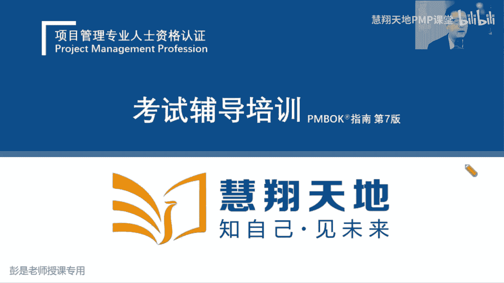
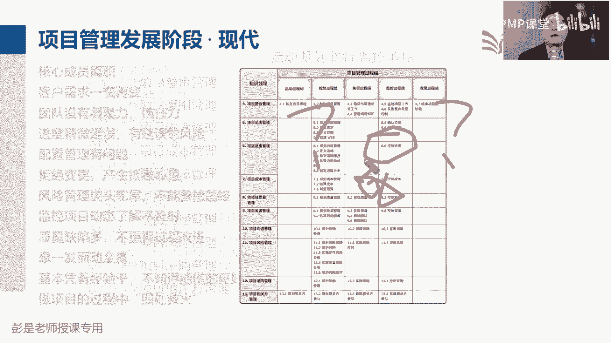
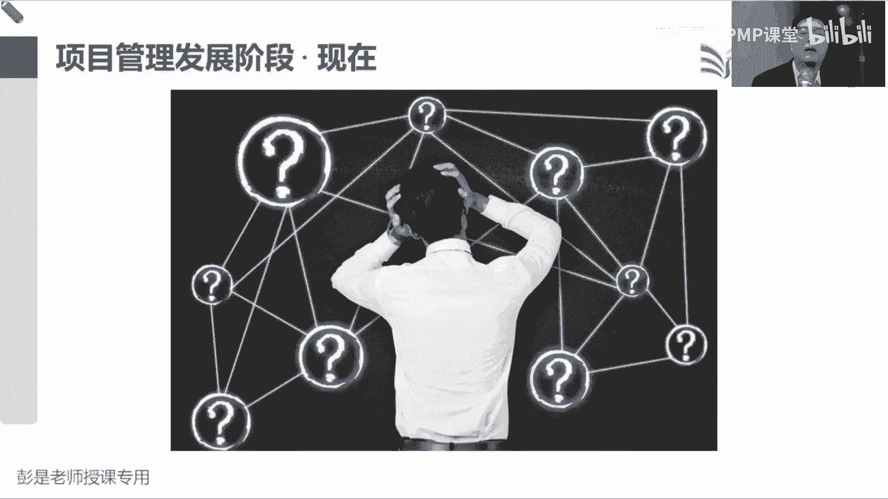
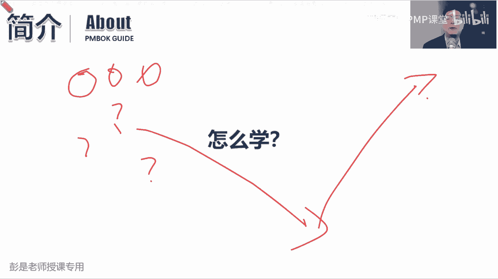
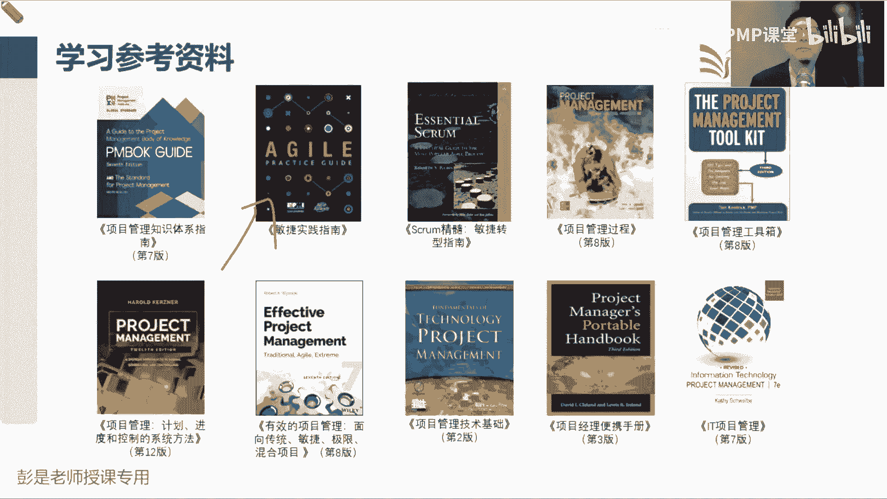
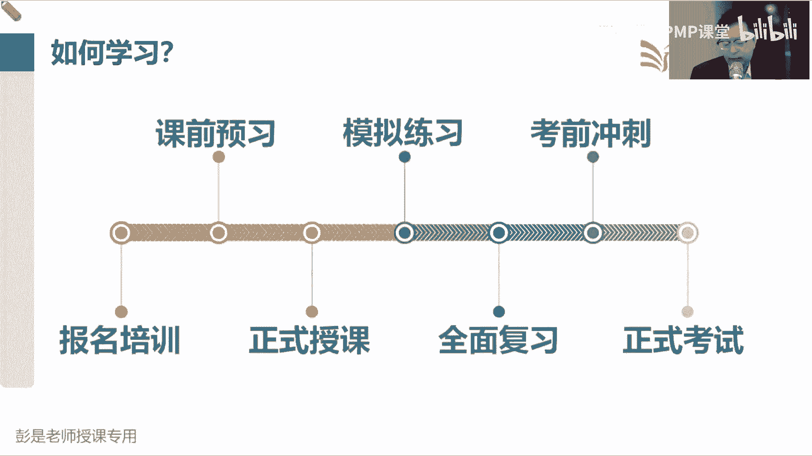
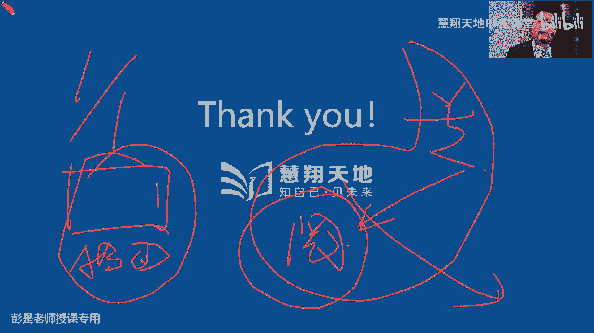

# PMP考试培训课程第1-13章节免费完整版 - P1：PMP证书的由来？如何备考PMP？PMP有价值吗？ - 慧翔天地PMP课堂 - BV18y421e7ut

好各位同学，大家早上好，咱们正式开始开始今天上午的课程，然后第一小段课程大家专心听就可以了，不需要看教材，不需要看什么什么讲义，啥都不需要看啊，专心听第一小段课程，先给大家介绍一下。

咱学这个这玩意儿到底是个什么东西，然后再考试怎么备考，怎么应考，怎么应试啊。

给大家大概介绍一下，所以大家专心听，专心听会基本上说的很快，然后欢迎大家来参加我们这个PMP培训考试啊，PMPPMP是什么东西呢，全称有人知道吗，PMP哎，拍马屁，作为一个出色的管理者。

我们要拍马屁对吧，和领导走得近，看领导怎么开会就会心情愉悦啊，对不对，都根本不看工资条啊，那东西没用，企业给我成长的机会，给我学习的机会，给我试错的机会，这是标准的标准的拍马屁啊，咱们学的叫什么呢。

PMPPMP项目管理制，项目管理专业人员资格认证好，所以咱这个考试的全称，叫项目管理专业人员资格认证，第一个关键词叫专业，第二个关键词叫资格，是说像特特别特别像咱们国家什么一建二建。

软考高项中项这种东西，一旦我们通过了考试，拿到了证书，就认为我们是一个项目管理的专业人员，并且具备了这样的资格，这样的资质，它相当于项目管理这个领域的一个入门的，必备的这样一个资格的认证啊。

那颁发这家这个证书的机构呢叫项目管理协会，以前经常叫美国项目管理协会，因为它的总部在美国的费城，那美国项目管理协会，这个家协会做了什么事情呢，这家协会呀成立成立于上世纪60年代，到现在今年70多年了。

然后一直在从事项目管理这个领域的专业化，专业化的积累沉淀和发展，所以他又推出了相关于项目管理，这个相关的领域啊，各方方面面的各种各样的认证，包括咱们学的PMP认证，还有进度管理专业人士资格认证。

风险管理，商业分析，PPA商业分析，PBA就对标到咱们那个大家可能听过的，有些同学听过的那个NPDP，就是那种大产品经理干的事情，然后呢CP就是敏捷对标到咱国内的，有些认证可能大家知道的叫ram。

然后PGMP叫项目及管理，PFMP叫项目组合管理，然后呢还有CPM项目助理，项目管理，总之啊这家机构别的事儿不干就干项目管理，就搞这个专业学科，涉及到项目管理的方方面面的积累和沉淀总结。

然后不断不断不断的与时俱进，推陈出新，随着时代的发展，随着科技的进步，不断地去改进我们这些这套体系，那这家机构啊大概的影响力是这样的，所以啊他在200多个国家和地区，已经开通了考试认证机构。

就是变成大白话，就是都有培训点，然后基本上覆盖无死角，除了一些不发达国家和地区，你能想到的一些什么战火连天的对吧，什么什么特别特别穷的，这些国家基本上都覆盖了，那说明什么呢。

说明基本上经济还可以的国家诶，都认可这个东西，那第二个，他在全球目前有300万的会员，有120万有效的持有有效证书的人，是有效持有证书的人士，大概120万人，为什么200多万没有呢，因为有些人可能觉得。

这个证书对他已经没有价值，没有意义了，比如说一些高管对吧，一些专家，一些学者诶，他成为他的会员，是我们想了解项目管理这个领域的新兴趋势，但是不一定要有证书了，然后75%的企业在招聘。

项目管理专业人员对吧，项目经理啊，什么什么助理，项目经理呀，项目及经理啊，项目项目组合经理啊，还在招聘项目经理这个岗位的时候，会优先考虑拥有证书的人，他可能会有相应的相应的这种优先的级别。

这是PMI在全球的影响力，目前全球比较火的，关于项目管理这个领域的专业认证啊，大概就这么几个，最火的就是p mp，最火的就是PMP，基本上无死角，然后呢在欧洲比较盛行的呢。

这个认证在欧洲比较认可度比较高，在某些国家和地区甚至风头盖过了PP，然后呢，第三呢就是啊，欧洲还有一个项目管理协会，推出的IPMP这套东西，然后在国内目前呢叫什么cs p m，未来我们国家标准国标委。

国家标准化委员会也在推出，咱们国内的关于项目管理这个专业的认证，然后呢现在有了CPM从一级到五级，然后呢1234都有相应的考评的机制啊，也在推广，大概知道这个意思，然后呢PMP在中国的情况是，99年。

所有外国的这些东西他要在中国推广宣传，必须经过相关的相关的国家机构，他被合并到了中国，什么国际人才海外交流交流基金会，也就是大家未来中文报名，需要需要访问的那个网站，雷达机构99年引入到了中国。

18年年度参加认证的人数超过了10万人，咱们每年考试是四次，平均每次考试18年就达到了2。5万，两三万左右，然后22年，咱们2年持证人数已经超过了50万人，19年2021年，由于受到疫情的影响。

所以这个数据没有放上来，没有更新，因为它没有可参照的可参照的价值啊，然后其实从23年今年开始啊，每年的考试预测预测人数啊，至少至少15万起，甚至可能20万人，就是这个东西。

总之不管是在全球还是在中国还是在大陆地区，它非常非常非常非常火，嗨它的接受度会比较高，含金量相对来说比较高，那换个角度看问题，这个玩意儿大家都觉得挺好，这个玩意儿大家都喜欢拥有这个玩意儿。

它含金量还是还是可以的，那这个考试的难度会很简单吗，去思考吧，考试难度会很简单吗，有没有人去考过什么四则运算专业认证证书，加减乘除，没有人吧，哎拿到这个证书都觉得丢脸了丢脸了对吧，没有价值没有意义啊。

哎所以这个考试这个考试火，这个考试有含金量，这个考试难度是有一定难度的啊，没有这么简单，大家千万千万千万不要掉以轻心，然后关于这个火呀，大家在对标到一个企业，就能更好的更好的知道这个东西的价值了。

说2022年在中国持证人数超过了50万人，目前全球第一大持证人数的，持证人数最多的国家是美国，第三大国家是中国，然后呢咱们在2021年还是20年，我记不住了，已经反超了日本。

那国内拥有PMP证书的企业是哪一家呢，敢不敢猜他是肯定是标杆了，肯定是肯定是标杆了，哎国内拥有P证书的企业是没错，华为华为退会要求他的管理者，这些管理层这么快就没电了，不是话筒没电了，线上的同学稍等啊。

好了，所以刚才说到哪儿了，说华为哈，华为拥有在国内拥有PMP证书最多，他要求他的管理者，最好最好最好去学这个玩意儿，去学一学管理学，取得相关的认证来代表你就有了相关的资质，那华为这家企业傻不傻呢不傻。

所以他提出这样的这样的期望，说明这个证书啊，确实确实值得大家去认真去去学，其实有没有证书不太重要，重要的是掌握什么呢，掌握项目管理的这套体系，他的思维方式，它的底层逻辑，他的原则，他的他的价值观。

像我们未来开展工作的时候啊，考虑到更周全更缜密，然后呢具有强大的风险意识，把方方面面都给他考虑到，然后呢根据我们储备的知识，根据我们的经验，做出相对来说比较合适的这个决策，仅此而已。

不断不断不断想办法提高我们的决策能力，从而让我们的这些事情，它的成功率变得越来越高，这个时候才是它最大的价值好，所以这个东西超火，这个东西含金量高，这个东西不容易好不容易考。

大家一定一定做好充分的心理准备啊，不要听你的朋友，亲戚同学同事给出的建议，因为大家可能会学习，之前会听到某些某些人会这样说啊，还看什么书啊，听什么课呀，考前一周，考前一周做做题就过了。

你有没有听到过类似的声音呢，对吧哎考前一周啥事都没干，不用做题，听三天过了，因为每个人的情况不一样，有的人经验丰富对吧，有的人见识见识比较广，有的人知道的多，有的人记性好，有的人理解能力强，有的人聪明。

有的人智商高，有的人智商低，大家一定是千人千面，每个人的情况不一样，所以别人给出的建议不一定具有代表性，不一定具有参考性，我们一定要结合自己的情况去分析一下，这东西到底怎么学，我就是拿那种记性也不好。

智商也不高，平常是学渣，啥都不会，就这样一个人，那我学pp的过程就是一步一个坎，人家模考啊，成绩蹭蹭蹭蹭蹭，什么一百四一百六一百八，超恐怖的，我成绩很稳定，一百一百一百基本上就是在及格线以下。

稳定的稳定的在游荡，那怎么办，勤能补拙，只有这一条路，勤能补拙，第一好精性不如烂笔头，记不住的东西多写写，多敲一敲，记性就印象就深了，第二呢就花大量的时间去备考，人家一天学一个小时可能就够了。

我自己觉得比较笨，我可能需要学两到三个小时巩固反复，只有这种方法啊，所以大家可以去有兴趣的同学，了解一下我们大脑的工作模式，大脑的工作工作模式啊，第一我们目前大家普遍可以知道。

学习这种事情对人来说是一个什么样的行为呢，学习为什么很多人不喜欢这个东西，说追星刷抖音，看电影，美食玩游戏，哎这玩意这玩意儿大家都喜欢做，因为很快乐，学习呢是通过长期的付出来获得一定的收获。

这就叫反人类对吧，和锻炼身体减肥一个道理啊，它是反人类的事情，那我们大脑在工作的时候，什么时候啊，什么时候他会觉得这个事情很重要呢，第一一定是紧急情况下对吧，发生一些紧急情况，发生一些意外。

比如着火了诶，你的大脑为了生存，对不对，你的大脑为了生存，我得保住我主人的肉身，肉身在大脑，在肉身不在大脑白扯，所以他为了生存，一定想办法让你超水平发挥，唉，所以很多人在紧急情况下就会变成像超人一样。

对吧，做了一些不可思议的事情，他认为这个事情很重要很重要很重要，那想学习这样的事情啊，怎么让大脑觉得重要呢，看书看书，咱那个大家拿到的教材啊，咱拿到的教材第一大作用是什么呢，催眠睡眠不好的同学。

你睡觉前翻一翻这本书，基本上5分钟起就受不了了，10分钟以上，你就是你就是你就是奇迹，对不对，因为大脑觉得啊好累啊，看不懂啊，记不住啊，主人啊，休息吧，不要让我工作了，大脑一定是这样的，对不对。

他不喜欢这个事情，那什么情况下，你什么情况下，大脑会觉得诶要要认真了，要走心了，要仔细听了，要仔细看了，要认真学了，什么情况下呢，这两个字啊没有好的办法呀，叫从，只有你的肉身坚持不断的重复的重复的工作。

重复的做这个事情，大脑才真正意识到哦，这个事好像对这个肉身挺重要的，那咱认真配合配合配合一下工作，还认真的记一记，认真的理解一下，认真的消化一下，所以这种反人类的事情，对学习来说没有好的办法。

就是重复重复重复不断的重复，大脑才会觉得这个事情真的很重要，他才会开始开始不断地提升自己的效率，从而呢让我们得到一个更好的结果对吧，所以这样线上同学说明天考试了，临阵磨枪，这个时候你的记忆力。

你的理解能力是超水平发挥的，但是PMP考考试啊，P考试通常投机取巧，没不一定有很好的结果，但是持之以恒通常会得到比较好的结果，所以坚持坚持坚持好，知道了一个大概意思啊，再再往下看，那关于咱们的教材。

这本这本反人类的，反人类的教材是这么这么出来的啊，咱们这个教材的全称叫项目管理知识体系指南，然后呢简称叫pm，为了便于大家理解，就叫pm，然后这个东西啊之前被项目管理从业人员称之，为什么呢。

项目管理领域的圣经，圣经这个东西不用解释了吧，哎大家都意识到这个东西啊，说明这个东西的神圣，那这玩意儿他咋出来的，就需要大概了解项目管理这个知识，这个学科的发展，所以听一听四项目管理发展啊。

通常分成这么几个阶段，第一个阶段呢叫古代修金字塔，修长城，这个阶段通常称之为叫经验式的项目管理，这个阶段啊，大家只是想办法完成任务，实现目标，这把皇帝让修长城，咱就修长城，皇帝让修金字塔，咱就修金字塔。

皇帝让十天一年修完，咱就一年修完，皇帝让怎么干，咱就怎么干，经验式的项目管理阶段，它的问题在哪，修长城的不一定懂修金字塔的对吧，虽然都是搞建筑的，搞工程的，但是呢遇到一个新鲜事物啊，可能我们的知识啊。

经验啊储备啊，就不足以不足以去很好的完成这个任务了，所以他总结出来的这些经验方法，它有局限性对吧，就像学斗志对吧，会会做锅的不一定会做家具，做家具的不一定都不一定懂怎么种田呢。

所以大家的经验是有局限性的，它没有通用的东西，这个时候呢就得不到项目管理这个专业学科，得不到项目管理这个专业学科，它只是更精细化的划分了，搞建筑的，搞工程的，修路的，搭桥的诶，他有局限性。

然后发展到了近代，有两个非常非常著名的事件，前一段大家有没有看过那个奥本海默啊，左边那个就是曼哈顿计划，曼哈顿计划的特点是什么呢，时间紧，任务重对吧，二次大战打的一锅粥，然后又听说苏联你们不是德国。

德国你们在搞在搞核弹诶，那我们要抢着抢着抢着，时间紧，任务重，抢先呢把这玩意弄出来，然后呢叮咣叮咣往那一扔，战争就结束了，就基于这样的时代背景，然后一大堆科学家就想办法想办法，怎么更好的完成任务。

所以在奥本海默的领导之下，就科学家给出了更多更多管理项目的进度，项目的成本，项目的质量的一些方法，总结出来的一些科学的管理方法，通过这些方法可以更好的更好的完成任务，这个任务实现目标。

得到我们期望的成果，所以大家不知道有没有查过这个背景啊，为什么选奥本海默呢对吧，他在专业上，专业性上不一定是领先的啊对吧，爱因斯坦还在呢，有很多伟大的科学家呀，为什么选他呢，就是因为这个人他擅长管理。

不仅仅有专业知识，还擅长于工作上的这种协调，组织统筹诶，他有一定的管理水平，所以任任命他为这个项目的领导者，那右边这个呢叫阿波罗登月计划，时代背景一样啊，美国苏联搞什么太空争霸，今天你发射个飞船。

明天我就让人把人弄上去，你把人弄上去，我就出舱，绕着太空行走一圈，太空行走啊，你出舱，那我就登月，反正就比着来，仍然是这三个，是这三个中三个目标，对我们的工作产生了约束对吧，进度成本质量。

所以就是时间紧，任务重，还要达到一定的质量标准和要求，想办法把这个事儿，在在确定的时间之前给他完成诶，就有了阿波罗阿波罗登月计划啊，好这是这个近代发展到这个这个这个阶段，这个阶段的特点就是。

一大堆科学家想了一些比较有效的方法，可以更好地管理我们的范围，进度成本质量，这些相关相对应的知识领域好，然后大家再聊聊天区啊，不建议不建议随便加微信的，慎重寡清，这个时代。

这个时代缅北缅北那个行业已经不行了，有些人可能转型转型对吧，又有新兴的新兴的骗术了，大家在学习的微信群里面加微信不好吗，因为咱们没有办法控制直播间的直播间的人了，你也不知道对方是啥人哈，慎重慎重。

三思而后行，刚讲过好，那项目管理发展到现代啊，你会发现随着时代的发展，科技的进步，随着各种各种行业的变化对吧，有的产业说没就没了，有的产业产业可能转型转型，嘿那就会出现各种各样最新的问题。

什么成核心成员离职对吧，团队没有凝聚力啊，什么配置管理啊，拒绝变更啊，有抵触啊，以此类推，问题多了，问题多了怎么办呢，那咱就遇到问题解决问题，遇到问题解决问题，就会想出各种各样的方法对吧。

方法总比问题多，方法总比困难多，那遇到问题解决问题，遇到问题解决问题，如何有效地避免问题的重复出现，重复发生呢，我们就需要把这些问题变成一大堆的什么，就像怎么一防止疫情的出现呢，唉这些问题有了方法之后。

就变成了一大堆的注意事项，告诉我们管项目的时候对吧，有成有成员可能会离职啊，有人可能会抵触变更啊，质量缺陷可能会特别多呀，然后什么四处救火呀，变成了各种各样的注意事项。

这些注意事项就告诉我们什么优先级不明确，应该怎么整，项目经理去检查一下，项目经理委派的是不是合理计划的正确性，完整性，科学性，合理性，还什么，WBS里特以此类推，变成了一大堆的注意事项，那注意事项多了。

接下来需要做什么事呢，太多了，成百上千上万条注意事项，这个信息一多呀，就需要去想办法让他有条理诶，这一大堆是范围的注意事项，这一大堆是进度的注意事项，这一大堆是成本的注意事项，这一大堆是质量的注意事项。

以此类推，嘿所以我们纵向上就把它做了分组，最后的话就变成了经典的十大知识领域，整合范围，进度成本质量，资源沟通风险，采购相关方，然后又去思考了这么多的注意事项，我们在开展项目的过程中。

不是所有的注意事项啊，都要随时注意的，有的时候呢是在启动的时候，有的时候呢是在做计划的时候，有的事项呢是在执行的时候，有的事项是在监督和控制的时候，有的注意事项是在收尾的时候，所以按照这个逻辑。

一横向横向切分，纵向切分就变成了启动规划，执行监控收尾五大过程组，然后呢我们就把所有的注意事项往里塞，这些呢是我们在规划进度的时候，有一大堆注意事项，这些呢可能是我们在执行沟通的时候。

有一大堆的注意事项，诶我们就把这些注意事项，这些知识点一个一个往里塞，最后呢就变成了最经典的五大过程组，十大知识领域，49个管理过程，然后又去思考说呀，这个管理过程有很多注意事项。

那开展这个工作的时候需要什么材料呢，收入会得到一个什么成果呢，输出可以使用哪些工具和技术呢，哎就变成了过程，输入输出工具技术，再去思考这些过程啊，不是一个一个孤立的个体。

他一定和其他管理过程，存在着各种各样的管理关系，最后再一梳理，变成了非常非常繁杂的一套一套体系啊，所以它就变成了五大国征组，十大知识领域，49个管理过程，各种各样的计划，各种各样的文件。

各种各样的工具技术，以及它们之间千丝万缕的关联关系，它就变成了一套，体系咱叫项目管理知识体系指南，项目管理知识体系指南啊，好只是发展到了现代，所以PMI就做了这个也就做了这么一个生意。

从1996年经过了30年，将近30年的沉淀积累，才正儿八经的推出了第一版的官方教材，积累了30年了，财政经的推出了PMBOK第一版，然后呢按照ISO国际标准化标准化组织的要求说，你作为一个国际标准。

你要保持领先，你要与时俱进，那就至少至少5年要更新迭代一次，所以呢我们4年必更新，4年一更新，2020年04年零八年，12年，一直到17年推出，推出了pm的第六版，然后由于疫情的影响。

我们23年才正式启用第七版，23年才正式的使用第几版啊，按计划来说，应该21年就用了，然后为什么要推出第七版呢，咳咳为什么要推出第七版呢，现在项目经理的状态啊，基本上和这张图一模一样的，这是什么呢。

焦虑头大，不安，惶恐对吧，就是各种各样的事情啊，不好管了。

为什么呢，因为时代在发展，科技在进步，根据目前目前全球的情况，什么新冠对吧，现在今年冬天，咱也感受到了什么什么什么支原体啊，什么什么各种稀奇古怪的病啊，乱七八糟的东西都出来了，气候危机对吧，什么洪水呀。

天灾呀，就这些事情啊，民权运动呢就是人祸，全国全球目前在打，目前在打仗的国家可能20几个，超乎想象，你也不知道啊，然后全球整个发展的态势很难很难很难去预测，因为变化太快了，变化太多了。

然后最后人工智能的出现，人工智能的出现，可能让我们的工作呀，生活呀唉都带来各种各样的影响，就是这些东西啊，这些东西让我们的这个变化的节奏越来越快，所以呢就把这个单词又捡回来说。

现在这个时代呀又变成了乌卡乌卡这四个单词，乌卡乌卡时代是什么意思呢，唯一指的是异变性，优指的是不确定，然后复杂性和模糊性，说现在我们的商业环境啊，商业环境第一变化多对吧，非常非常容易发生变化呀。

第二各种各样的不确定性，你也不知道这个东西人家喜欢不喜欢，你也不知道这个产品能能不能大卖，对不对，你也不知道这个产品会不会马上出现一个新的，这期新的竞品，把它干掉，各种各样的不确定。

最后呢第三个就是复杂性，牵一发动全身的，现在不管做什么事情都超复杂呀，唉这些事物之间存在着各种各样的关联关系，最后呢就是模糊性，发现我们人类啊对这个世界啊还是一无所知啊，关于宇宙啊，关于我们的地球啊。

关于人的心理啊，人的行为呀，很难很难很难去精准的做预测，因为我们不知道的东西太多了，所以用WOA，WOA这个单词来形容我们现在的商业环境，WA这个单词实际上是军事术语，用来形成。

用来形容战场上的这种这种特点，以便不确定复杂模糊，这仗不好打，所以以此类推诶那当今这个时代说非常变化多，然后各种各种各样的不确定，那我们在做什么事情啊，越来越复杂，然后呢还有很多很多事情没有认知。

那在这种情况下，在循规蹈矩，在墨守成规，按照我们五大过程组，十大知识领域，49个管理过程，按照这样的模式去管项目，很可能成功的可能性就有问号了，不太容易成功啊对吧，不能教条主义啊，不能墨守成规。

不能循规蹈矩，不能死心眼儿，主打一个火，主打一个零，所以是灵活好，所以基于这个时代背景，于是呢就正儿八经的推出了二，2021年计划就推出了，其实2021年就写完了。

2021年就正儿八经的推出了pm的第七版，但是呢直到2023年才正式的启用，那这本教材他做了一个什么调整呢，就把我们之前认知的知识点重新做了梳理对吧，刚才我们说有很多很多的注意事项啊。

那按照经典的思维方式，我们去思考这些东西是范围的注意事项，这些东西是进度的，这些东西是成本的，这些东西是质量的，这些东西是规划范围时候的注意事项，这些东西呢是规划进度时候的注意事项。

这么做这么做还是有点教条主义了，教条主义了，现在这个这套东西啊不一定适用于所有项目了，所以我们对知识点重新做了包装，重新做了分组，仅此而已，在此基础之上加上了一点点新的知识点。

那旧版教材第六版是基于五大过程组，十大知识领域，告诉我们管理项目的一些原则，一些思维方式，一些逻辑，一些价值观，一些知识点，新版呢就把五大过程组十大知识领域，变成了12个原则和八个技巧。

遇这个未来我们会讲到12个原则，主要是给谁看的呢，给领导看的，让我们的管理者知道啊，管项目，管项目有哪些重要重要重要的原则，如果偏离了原则，可能会拉低项目成功的可能性，那价值交付，价值交互啊。

八个技教育讲的是什么呢，是给干活的人看的，告诉我们在执行项目工作的过程中，完成项目管理工作的过程中，还有哪些注意事项，这是不变的好，所以第七版就改成了对知识点的分组，改成了叫基于原则。

想办法做到价值交付，什么叫价值交付呢，也是字面意思啊，交付的成果对用户来说有价值，交互的成果对用户来说有价值，比如咱班主任热心啊，把这午餐给你点好了，现在放到桌子上了。

这个东西目前对我来说没有价值没有价值啊，我现在最重要的作用就是给大家讲课呀，口干舌燥中人容易咳嗽，给你送点润喉糖，这个事情对我来说就有牙齿，所以我们要了解用户的业务，了解用户的需求，了解用户的问题。

了解用户的痛点，然后想方设法的推心置腹的交互中，对他有价值的产品服务或成果，这样呢可以有效的提高客户的满意度，知道这个意思啊，然后再往下那根据目前目前我们储备的知识，说这个东西这个东西含金量高。

这个东西与时俱进，这个东西因为现在牵一发动全身的，我们要不断的不断的学习新的知识，学习新的思维方式，学的学习新的逻辑，那项目经理，项目经理啊，pm他的主要工作是啥呢，看看啊，我们去分析一下。

目前全球这些顶尖的项目经理，都是个什么样的人，那顶尖的项目经理是什么样的人，我们就需要先找到顶尖的企业，顶尖的企业，我们需要需要分析，目前目前全球这些项目的具体情况，所以有了下面这一组调研数据。

说目前全球大多数大多数字项目啊，从19年到21年这3年看，这些项目啊成功成功，成功的可能性在不断的提升，能够符合最初的目标，符合商业意图，在原始的预算内完成，按时完成。

项目失败的概率呢是在逐年逐年逐年走低，并且结合到1918，1716之前的数据也是如此，这是个大趋势，大家都在不断地想办法提高项目成功的可能性，然后都在不断的想办法降低项目失败的可能性。

那他们想出来的办法是什么呢，想出来的办法是什么呢，接下来我们要去分析了唉，美国的什么欧洲的，亚洲的不同国家和地区，你们有没有明显的差异呢，所以又有了下面这组调研数据，地区和行业差异上来看。

这数字看不见没关系啊，听就可以了，地区和行业差异上来看啊，最后给出的结论是虽然有偏差，虽然有差有出入，但是没有明显的区别，基本上差不多，大面上是差不多的，不管是美国还是欧洲还是亚洲，还是非洲还是澳洲诶。

大家项目成功的概率，项目失败的概率基本上差不多，那行业和地区没有明显的，没有显著的差异，接下来我们再看看啊，再看看企业，企业从企业这个视角去出发，什么样的企业能够做到，把项目成功的概率在不断提升呢。

什么样的企业啊，项目成功的概率没有得到提升呢，诶这一区分就可以看出典型的差异了，蓝色的蓝色的叫进取型的企业，也就是这种什么爱学习爱成长，就是学霸，咱上学的时候这种学霸这样的人啊对吧，关注自己的成长。

关注自己的发展，然后呢关注张关注，关注我们这个考试的特点，就是这种这种人这样的人，那对企业来说也如此，他更关注我们的上道政策对吧，上到政策，下到竞品，还不断的不断的去分析我们的商业环境。

然后呢根据我们时代的特征，时代的特征不断的去思考，我们企业要做出什么样的改改进，做出什么样的调整，做出什么样的变革来适应这个时代，所以这统称为进取型的企业，就是爱学习，就是爱学习。

然后就会发现这种爱学习的企业，他在项目成功的概率诶，比不爱学习的企业会高得多，刚才前面那张地区行业基本上差个一个两个，三个四个五个百分比差不多了，那从企业这个视角上去区分十几个百分比诶。

就有显著的差异了，那这些企业呀他怎么带人呢，继续往下思考了，所以呢这些企业第一，他更关注灵活地采用正确的工作方式，这个瀑布型敏捷型大家目前可能没学到，不知道啊，就粗暴理解瀑布型的就是传统的工作方式。

五大过程组，十大知识领域，49个管理过程，敏捷型呢就是求快快速的，快速的调整我们的工作事项，从而可以适应这个变化的变化的环境，所以主打一个灵活，这些进取型的企业现在变成了橘色，橘色啊。

他们在墨守成规的几率，比不爱学习的企业低得多，他们更容易更容易用使用这种新兴的方法来，那这些进取型的企业，进取型的企业啊，再去分析他们怎么管人，他们对关于人才的人才的管理。

这方面就是hr那些活就会发现了，61%的61%的占比，他们更关注更关注培养人才，将发展协作型的领导视为人才培养中的重点，那项目经理的主要工作是什么呢，对吧，项目经理的主要工作在奥本海默，造原子弹的时候。

他基本上也不搞啥学术研究，基本上也不造假，不造假，实验就是组织协作，组织协作，对不对，让大家可以各司其职，明确分工，按部就班的，按照我们的计划，12345把这个活干完，遇到问题解决问题，遇到变更。

管理变更，遇到冲突，处理冲突，还以此类推，他主要工作就是协作，希望我们这几10万人，20万人吧，通力协作，通力协作，帮我们尽快的把这个东西做出来，达到一定的质量标准和要求，所以这是进取性企业。

爱学习的企业，他们的典型特征，那往下又思考了这些这些人呐，这些企业啊既然这么爱学习，既然这么灵活，既然更关注人才的培养，那这些企业的管理者有什么典型的，典型的比较突出的技能呢，所以再往下一分析诶。

就会得到这张图，这张图是说这些这些企业啊，他们的领导者，他们的管理者有这么四个核心技能，这些企业非常非常非常看重啊，第一大技能就是沟通，良好的沟通对吧，良好的沟通是成功的开始。

良好的沟通可以便于大家更有效率的，更高效率的去写作，所以顶尖的项目经理，主要工作组织协调协作对吧，然后统筹那主要是通过沟通去落地，所以沟通技能非常非常重要的，第二大问。

第二大第二大核心技能呢就是问题的解决，因为工作中生活中怎么可能顺风顺水呢对吧，人生十有八九不如意啊，那项目中也如此啊，肯定会遇到各种各样稀奇古怪的问题啊，那遇到问题怎么来，怎么来合理的妥善呢。

适当的解决好这个问题非常非常重要，问题解决的能力，问题解决的能力，实际上核心就是思维思考的能力，批判性思维就是这种东西，然后第三个核心技能呢是领导力，领导力领导力对吧，自己往前冲，兄弟们都在后边。

不跟着你往前走也不行，希望能够提高大家的这种主观能动性对吧，让大家更积极，更阳光，更乐更乐观的帮助我们一起往前冲，从而更好地实现目标，完成任务，领导力核心技能，最后一个最后一个能力呢就是战略思考。

就是大局观，还要了解全球态势，还要了解我们的行业趋势，甚至要了解我们的竞争对手，对企业来说，上到企业的战略，到企业的一些重大事项是吧，什么项目啊，运营啊，项目项目及项目组合都要知道，从宏观到微观。

从宏观到微观都给他了解透，才能更好地贯彻我们企业的这些战略意图，更好地完成任务，实现目标，从而做到价值交付诶，这是项目这些典型的典型的领导者，他们非常非常突出的四个核心技能，这东西不用记啊。

记住了也没用啊，听一听就可以了，嗯好知道这个意思啊，所以就会发现了哎，这些顶尖的项目管理从业人员，他们都有这方面的技能，这些技能啊我们就变成我们的注意事项呗，希望我们现在的这些项目经理。

朝着这个标杆对吧，给大家立了标杆了，这些优秀的人，这些出色的人都这么干活了，那有了标杆之后，我们重新梳理我们的知识体系，让大家学完这一套知识体系，然后呢学以致用，用到我们的工作中，生活中。

从而更好地朝着这个目标去前进，提高大家的这四个核心技能，所以就带出来带出来这个玩意儿，到底它的意义是什，为什么要学这个东西啊，就是因为这些标杆，这些标杆一分析发现的第一工作机会，未来对大多数的企业来说。

基本上基本上要想实现价值的不断提升，让企业变成变成大白话，就是让企业更有钱，是大多数的事情都是通过项目的形式，帮助企业来创造价值，所以呢项目经理的工作机会，根据p mi的官方预测。

中国国内目前目前缺口102万，什么欧洲13万，以此类推啊，哎工作机会非常非常多，工作机会非常多呀对吧，阿三比较猛啊，中国更猛啊，然后薪资待遇，这可能是大家最感兴趣的话，最感兴趣的话题，薪资待遇啊。

这种表示大家也不要认真看，不建议认真看啊，看完了都心情不愉悦了，就知道意思就可以了啊，总之项目经理年头越长，待遇越高，年头越长待遇越高啊，知道这个大结论就可以了，不就不建议仔细看啊，中国数据还可以吧。

不算太糟糕，也不算太美丽，好关键是下面几句话说，在接受调查和接受调查的40个国家地区中，具有PMP认证的调查对象的中位数更高，工资比没有PMP证书的人，平均高达高高16%，高16个百分点。

百分百分点变成大白话，就是有证书的人，工资高中位数是平均数，有有工资的人，有工资的，有是有证书的人，工资相比于没有证书的人会更高一点，就给大家画个大，画个饼，咳咳。

所以这个东西啊对大家的价值大概总结一下，就这四个东西，第一能力希望大家通过我们的课程不断的学习，不断的学习，第一最重要的就是改变我们思考的方式，改变我们的思维方式，让大家能够更充分的充分的掌握啊。

我们这些底层逻辑，那思维方式一旦发生了变化呢，我们通过培训还能提高什么能力呢，你学习能力肯定会得到提升的，甚至包括自我管理的能力，自控的能力啊，因为每天诱惑太多了，每天诱惑太多了，什么抖音啊，微信啊。

微博啊，热搜啊对吧，今天又有什么著名事件的，哎呀前两天又虐心了，说有个人呐找到了他的失散多年的儿子呀，我这个人是首富呀，好伤心啊，为什么不是我呀，就吸引我们的东西太多了对吧。

小姐姐这两天科目三跳的怎么样啦，好开心啊，小明看一看刷一刷呀，所以大家大家顺便拐个小弯，所以说现在大家学习路上最大的障碍，就是这个东西不行，这也是能力啊，专注力不足啊，不专心不专心不专心对吧。

比如刚才刚才听课的过程中，就开始加好友了对吧，聊聊天就聊歪了，就是注意力不集中，注意力不集中，这玩意儿咋整，怎么破呢，如何训练我们提高提高这个注注意力，专注力呢，怎么训练这方面的东西呢。

怎么训练这个技能呢，不知道哈，所以有一个很好玩的方法，大家可以百度一下啊，这个方法超简单，叫番茄工作法啊，这个字不大会写现代人能力的退步的一个现象，就是tb王子番茄工作法是说我们找一个计时器。

把我每天把咱每天的工作要划分成一小段，一小段一小段一小段的唉，这一段这一段工作的时间长度，就称之为一个番茄时间，就是那个计时器，这个番茄计时器是参考的，参考的意意意大利的厨师做披萨。

一个披萨可能需要考20到25分钟，然后再弄个计时器，叮一下披萨好了，唉当时这个这个学者这个这个人是个学生，就思考了，看到这个场景就想啊，诶那我学习的时候，如果能有一个计时器对吧，来提醒我诶时间到了。

那在这个计时器响之前，想之前，我就可以保持注意力的高度集中，我就踏踏实实学，完全排除任何的干扰，完全排除任何的对任务的中断，我就专心学，专心学，然后呢，计时器一响，就说明这段工作学完了。

我就可以开始休息一下了，来个短休息，休息个35分钟，缓解一下紧张的脾气，这种这种这种这种疲劳感休息一下，然后我再开始下一个下一个学习任务，在专心致志地学习，20到25分钟，我再休息一下。

这样第一我们可以训练自己的专注能力，在学习的过程中，在工作的过程中完全完全要排除，要不接受任何的干扰或损坏，来了电话基本上不接，有邮寄，有邮件，有微信，有叮叮响啊，基本上不看，一旦有了中断。

这个任务就重新开始，否则呢否则呢就继续干，闷头干，踏踏实实把这个事情做完，然后可以不断地不断地适当的延长，这个半天时间，根据大家目前的情况对吧，大大部分人啊目前可能注意力你比如说老师啊。

我只能保持15分钟，那你就是从15分钟开始，然后不断的不断的不断的适当延长这个时间，从而训练自己的专注力，大家知不知道，正常人基本上达到多长时间就到头了呢，正常人正常人啊，想一想咱为什么上学的时候。

一节课课长课课时长，课时时长是45分钟，基本上就是这个量级，正常人，大多数情况下，基本上45分钟左右就差不多了，也不建议大家把这个时间延的太长，因为时间太长，大脑就开始疲劳了，就累了就累了。

他要保命啊对吧，告诉主人不要学了，学不进去了，我不开，开始不记了不记了啊，在学吸收不了了，所以建议大家可以适当的，适当的根据我们个人的情况，不断的不断的去调整这个工作时长。

就是干完一个活儿再多练休息一下，干完一个活休息一下，可以两到三个番茄时间，两到三个番茄时间看情况啊，就是两三个小时就可以考虑来个长休息，工作的时候就专心的工作，休息的时候就专心的休息，以此类推。

好有好有好心的同学提醒老师啊，说是就9。42了，还有3分钟希望宣布重大利好，希望大家休息一下，因为呢第一小堂课程到目前为止，完全没有讲任何的知识点，所以呢大家的大脑基本上不疲劳不疲劳，那咱就继续讲好。

所以主打一个灵活，大家工作里面一定是这样的啊，主打一个灵活，给大家大概分享一个东西，所以希望大家参加培训啊，拐弯拐回来啊，希望大家参加培训，不仅仅是掌握知识对吧，包括你的专注力，包括你的注意力。

包括你的记性，包括你的理解能力，总之希望大家方方面面能力会得到提升，然后第二个收入的提升，现在今年的行情依然不太好，从从19年2021年22年开始，这个这个第二个小话题基本上就不说了，形式基本上不好啊。

就不解释了，然后第三个能力提升了大家的工作，学习的效率自然就会得到提升，最后一个呢就是认可对吧，通过考试拿到证书，发个朋友圈，那个证书一会儿可以看到的啊，全是英文的，全是英文，超炫的对吧。

基本上好多人不知道是啥呀，看起来很炫的，总之就聚能装军装，下面一大堆人给你点赞诶，点赞就不就不就是得到认可了吗对吧，未来大家通过考试，希望大家也能凡尔赛一把，哎这考试没啥，考前两天看看书听听课。

不小心就过了对吧，为什么这么为什么这么轻松呢，就来源于我强大的实力，哎就这么装一装装一装啊，会得到一大堆的人，一大堆人的认可，所以这个东西啊，不管是从经济啊，这是不管是名还是利。

对大家实际上都是有好处的，最核心最核心的价值，其实什么是名和利啊，都不关心啊，最关键的就是第一个，希望大家还是能够学学有所得对吧，有了自己的心得体会，从而提高我们的能力。

最核心的就是帮助大家改造一种思维的方式，好知道这个东西啊，所以接下来正儿八经的大概10分钟时间，大家一定要专心听了，这是考试，因为这个东西直接直接涉及到通过率，好关于PMP考试啊，咱们的考试的形式。

考试的形式啊，从这三个领域评价我们对知识的掌握情况，这三个就称之为人员过程，业务环境，那你说项目经理，项目经理的核心技能对吧，第一管好事，第二照顾好人，第三呢还要有大局观，战略思维啊，还有大局观。

了解行业，了解宏观政策，了解我们行业的情况，了解我们这个地区的情况，了解竞争对手的情况，了解我们企业的情况，才能更好的完成任务，实现目标，所以就是做好事儿，管好人，然后还要有大局观，从这三个维度去评价。

我们对知识的知识的掌握情况，然后这三个维度它考题的占比，人员呢大概占比42%，过程呢占比是50%，业务环境的占比比较少8%左右，其中最重要的就是下面加粗的这句话，看不清的同学，我给你念就可以了啊。

在考试中，一半的内容将体现项目管理中的预测法，也就是五大过程组，十大知识领域传统的这种管理方法，另一半将体现敏捷方法或者是混合方法，就是敏捷这种什么SRAM要看板呢，混合和混合方法呢就是预测加敏捷。

所以大概占比就是一半，考五大过程组，十大知识领域，49个管理过程，另外一半的题，一半的题考敏捷或者是敏捷和预测型，通用的一些知识点好，这就是考试成绩，从这三个维度去评价我们对知识的掌握情况。

那掌握到什么程度呢，他不会给出具体的分数，只会给出定性分析的结果，告诉你你处于什么水平，那定性分析的结果啊，就这四档水平最好的就是A要高于预期，T呢，这叫符合目标，B呢就是低于目标。

最后呢N代表了什么呢，需要改进，说得很委婉，就是不行，就是说你学得不好，NBTA从这四个四个档次来评价，你对对这三个领域的掌握情况，那每个领域的掌握情况会得到一个评价的结果。

所以水平最高的同学他的成绩就是三个A，水平最低的同学他的成绩就是三个N还考3N，其实有难度，如何巧妙地避过每一个正确答案，也不容易不容易答案，所以大家未来拿到考试成绩，这确实是说老师阿里史上出没出过。

出没出现过三同学呢，好像出现过，为什么呢，涂卡涂错了，涂串了，我们可以说到那个考试的形式好，所以水平最高的就是三个A，那你说老师啊，一个N两个A能过吗，不知道为什么呢，下面是三个三个领域的评价结果。

然后呢最后的通过率啊，这个能能否通过考试，还要看整体情况，整体情况就有了中间这根及格线，如果大家最终的成绩在及格线的右边，就说明你通过考试可以拿到证书了，如果不幸在及格线的左边，就说明很遗憾。

没有办法通过老师，没有办法得到这个证书诶，他最终评价的是整体情况对，那通过考试之后就可以看到，就可以下载下载这张这张这张电子版的证书，然后呢也会提供纸质版的证书，电子版的证书就是上面写单一的姓名。

然后这是什么什么证书，然后PMI的领导签字证书的编号，证书的有效期看起来非常非常炫，所以啊通过考试成绩好的同学，你可能能炫的就是两个东西，第一个是成绩单对吧，看老子考3A好厉害的。

第二个呢就是这个逼格比较满的证书，然后拿到纸质纸质的证书啊，还可以再炫一波啊，以此类推啊，会得到大家的认可，那考试的形式就是啊第一刚才我们说说考试啊，一半是预测，一半是敏捷，那一共考多少题呢。

咱们考试的题目一共有180道题，186一样，考试的时间长度是230分钟，其中涉及到两种题型，一种叫单选，一种叫多选，单选题啊，基本上160道题左右，多选题呢可能就是十道题左右，单选就是四选一。

多选呢就是从中多个选项之中选出两个，或者是选三个，人家会明确的告诉大家选几个的啊，180道题，230分钟，两种题型单选多选，另外考试的形式啊，咱大陆地区就是纸质的线下的考试，线下我们会拿到那个试卷。

试卷我们叫试卷书，因为非常厚啊，拿到试卷之后呢，需要大家涂答题卡，答题卡不需要科普了吧，中考高考，大家从小到大这玩意这玩意陪伴咱一辈子了诶，涂答题卡，把每个正确答案图个小圆圈，图个小方块。

所以真正有效的考试时间，真正有效的考试时间啊，基本上只有200分钟左右，因为通常大多数人可能需要，花20到30分钟去抽卡，基本上涂180个空，20到30分钟才能读完，所以真正有效的做题。

去思考的时间只有200分钟，考试是肯定是中文的，中文的，中英文参照，好真正有效的答题时间只有200分钟，所以呢基本上相当于一分钟一道题，在一分钟之内，你要把这个题目的场景看明白。

告诉你张三接管了一个项目，现在遇到了什么情况，发生了什么意外，然后问你怎么做，唉，把这个题目的场景看明白，还要能看完ABCD，咱们以单选题为例啊，还要能看完四个选项再说什么事，还有呢。

根据我们掌握的知识去分析这个项目的情况，找出一个相对来说最合适的选项，哎这个东西好像很简单吗，看明白项目的情况，看明白选项在说啥，根据我们储备的知识，快速的做出比较准确的决策。

项目经理的核心技能不就是决策吗，哎快速决策，快速决策，时间紧，任务重的情况下，看看你是不是有足够的储备，是不是有足够的储备，能够给出相对来说比较合适的一个选项啊，哎数学还不如我呢。

我说左右杨硕同学160道题，左右十道题左右，十道题左右，什么叫左右呢，加减可能是九，可能是八，可能是七，可能是十，一十二十三十四十五，咱也不知道，这专心听啊，专心听，不要只看文字，看文字。

一走神就要又要复盘，又要重说一重说就浪费时间，就浪费时间对吧，然后呢大家上学的时候都听过，老师就这样说吧对吧，你一个人耽误一分钟，全班这么多同学耽误多少分钟啊，还有这个道理啊，所以专心啊，好一分钟。

一道题快速决策，那怎么做到，怎么能做到呢，所以大家可以带入场景对吧，如果你是什么运动员对吧，这两天比较火的什么100米栏这种东西啊，如果是运动员在赛场上，比如说你是拳击手，对方的拳头来了。

你有时间去思考吗对吧，对方要出拳了，你想一想，想一想，白鹤亮翅，黑虎掏心，左躲右闪，左攻右防，根本就没时间思考，对不对，需要快速的快速的做出响应，但这种快速的响应来源于什么呢，像我这种平常不锻炼的人。

基本上就连躲都不会躲对吧，咔一拳挨打，哪儿打哪儿，指哪儿打哪儿，打的非常准的，因为我没有反应啊，那平常日常大量训练的人对吧，有了刻苦训练呢，训练呢训练的这些人他会怎么样呢，就会做到快速反应了吧对吧。

靠着你的程序化的记忆，就是小脑里面的东西，靠着你的肌肉记忆就可以快速响应了，那这种程序化的记忆，肌肉记忆来源于什么呢，日常大量的训练，挨打多了就会烦，就会抖了对吧，来源于日常的大量训练。

来源来源于我们日常的储备，来源于我们日常的积累，所以PMP的考试最终考的是快速的决策能力，那来分析你是不是一个专业的项目经理，这种快速决策，快速决策能力啊，就来源于我们日常的积累和沉淀。

所以这东西通常通常不建议大家投机取巧，没有什么技巧，最大的技巧就是勤能补拙，就是坚持坚持坚持，但手熟尔只有这样啊，所以就是听课看书做题，听课看书做题不断，这样的重复不断不断不断。

这样的循环只靠题海战术是不够的，后面会说到只做题不行啊，只做题不行，大家可能也会听到过这样的声音啊，啊这考试简单，考前刷刷题基本上就过了，跟那个考科目一比，考科目一还简单，你信吗，你信吗。

反正我是不信啊，反正我是不信啊，因为每个人情况不一样，对不对，我考科目一样也超简单了，我跟你说，就考前一个小时刷一刷刷一刷哎就过了，你信吗，我信为什么呢，因为我平常开车，然后我考摩托车驾照的时候。

真的就看一个小时就可以了，靠着日常的经验就可以蒙对了，嘿就不需要学了吧，但是对于有些同学来说，没学过科目一的同学来说，你可能反而需要大量的时间去记啊，根本记不住啊，对不对，就是这个道理。

所以大家的背景不同，大家的工作工作场景不同，大家的经验不同对吧，大家的各每个人的情况都不一样吧，所以千万千万不要听别人的建议啊，别人的建议不一定有可参考性，不一定有可参考性了，所以相信老师啊。

坚持学坚持学坚持学，没有好的办法，才能够让我们更快速的更快出，更快速的找出相对来说最合适的选项好，所以这个东西这东西啊，听课看书做题，理解和记忆，这些东西缺一不可，相辅相成，好看看这个东西是什么鬼。

这个东西大家都知道哈，上课的时候告诉你这玩意儿叫微信，考试的时候就变成了这个考试的时候就问你啊，这玩意儿哪个是微信呢，对吧，如果平常不仔细看，现在可能就懵了，哎呀看起来都好像啊，到底有没有那个笑脸啊。

有没有那个嘴啊，有没有那个圈啊，是在左边还是一还是在右边的，就很容易蒙对吧，如果平常不仔细看，真的很容易蒙啊，如果平常看得多了，天天看天天看诶，就印象会非常深，就会快速的找出一个最准确的答案。

PM考试基本上就是就是这个形式，所以大家普遍会感受到感受，感受到这个这样的一个正常的心理活动啊，什么正常的心理活动呢，就是一一打开书，马冬梅一和尚书，诶，马什么梅一打开书，马冬梅一和尚书。

诶什么冬梅一打开书，马冬梅一和尚说，诶马什么梅，最后一考试怎么是孙红雷呢，唉就是这个正常的正常的心理活动，因为大家在学习的时候，通常你的心情一定是往下走对吧，越越学越焦虑，越学越惶恐啊，越学越不想学啊。

反人类啊，然后呢这个时候大脑不一定重视这个事情，你再坚持一下，坚持一下，通过通过突破这个瓶颈，大脑越越重视这个事情，哎印象才会越深，理解的才会越到位啊。

所以就坚持学坚持学坚持学，再给大家洗洗脑啊，那到底怎么学PMI推推崇的参考资料啊，一共有十本书，官方给出的给出的推荐资料一共有十本书，左，左上角就是咱们第七版项目管理知识体系指南。

然后呢左上角第二本叫A轴敏捷实践指南，还有什么scrum精髓，项目管理过程工具箱，乱七八糟乱七八糟啊，就这十本书，这本书实话实说我都懒得看，我都没看完呢，不可能不现实太多了。

哪有这么多时间去看这破玩意儿，所以为了帮助大家提高提高备考的这个效率，咱们就帮助大家做了精简，所以不需要看这么多啊。

只需要看咱们的通关宝典，冯老师说啥就记啥，就记什么东西就对了，然后这个吹牛逼这段不讲了，所以咱们现在统一口径，咱希望大家能够掌握项目管理的相关知识，然后我的主要工作是通过我们的听课对吧，课程通过教材。

帮助大家减少学习的复杂性和困惑，提高大家通过考试的可能性，然后呢还希望大家能够学以致用，咱不仅只告诉你，就像有些老师上课啊，给你念一遍书，划重点，这个很重要，这个很重要，12345背几把。

咱不希望这么学啊，希望通过咱的课程，帮助大家更好的去理解他的底层逻辑，理解他的价值观，理解他的思维方式，然后呢再通过通过一些大家耳熟能详的，很粗暴很粗暴的案例，希望大家能够结合到自身的工作情况。

能够举一反三，活学活用，提升知识的应用能力，这是最关键的一步啊，最终的目的是希望大家能够顺利的通过考试，提高提高，大家在职场上的竞争力好，那怎么学，从哪里好，还没到呢啊，PPT还有两页，还有两页。

预计3分钟时间，上课好黑，好开心啊，这一看就是没预习过，只有这一个小时你会开心，后面五天六天你都会不开心，越听越累啊，所以大家做好充分的心理准备，学习没有那么快乐哈。

我只不过想办法尽量的让大家开心起来啊，不太枯燥不枯燥，不要焦虑，不要惶恐，嗯好怎么学，这个小杯子是什么意思呢，喝酒喝嗨了，喝嗨了就记住了，不是这个意思啊，小杯子里面没有酒，这叫空杯心态。

恐怖心态是是个典故啊，说有一个人佛法非常高明，然后呢有一个失主就找这个圣僧说，我想向你讨教一些对世界的看法，学习一些佛法，学习一些理念，结果呢这个失主到了高僧面前呢，就开始叨叨叨叨叨叨，一直在说话呀。

一直在说话，诉说着自己对这个世界的看法，诉说着自己对这个世界的认知，高僧插不上话，根本插不上话，这老和尚没事干，这是干嘛呢，开始倒插，把水倒满了之后啊，老和尚没有停，继续倒。

唉这失主看到这个行为就不解了，说了老和尚圣僧水已经满了，为什么您还要到呢，老和尚就说了，施主啊，您来向我请教佛法，您现在内心里面已经充满了你的理解，你的看法，你的认知，然后你在这叨叨叨叨叨。

你也不听我说啥，对不对，那你怎么学呢，就是这个道理吧，所以大家在学习的过程中，在学习的过程中一定想办法，一定想办法空杯呀，忘掉你工作中的这些经验诀窍技巧，忘掉您工作中的最佳事件，为什么呢。

因为实际上对大家来说呀，一个萝卜一个坑，大家的工作非常非常的有局限性，说难听一点就叫井底之蛙，我们每个人在这个时代都是这样的对吧，分工越来越细化，分工越来越细化，通常工作里边就这点事，这点事情啊。

所以这是一个经理的小孩吗，那为什么分工细化，我们的工作经验会有局限性呢，所以看看这个这张图啊，现在我们要学习的叫项目管理知识体系指南，它是一个通用的职业标准，在第七版之前，我们信心不足。

我们只说它适用于大多数项目并且有效，但是到了第七版，我们就把大多数这三个字改成了所有，是说我们现在教材里面这些知识，它适用于所有项目，不管是你是搞工程的，搞建筑的，搞装修的，不管你是搞软件的，搞游戏的。

搞搞C端互联网产品的，搞app的，搞app的，不管你是搞医药的对吧，搞什么药品研发的，不管是你搞啥的，这套方法在你的工作中都有可借鉴的，可参考的意义，都可以用得上啊。

所以咱们现在学的是一个通用的职业标准，它是跨行业跨领域的，那大家在工作中第一就一定要看行业对吧，搞工程的和搞软件的，这个行业有这个行业的典型特征，我们要根据行业的特点去分析，这个事情应该怎么做。

这个活儿应该怎么管，然后第二呢每个企业的情况又不一样对吧，什么华为啊，小米啊，头条啊，美团啊，腾讯啊，每个企业有每个企业的文化，每个企业有每个企业的情况，所以每个企业有特定的企业的流程政策标准。

程序制度规范这些东西它是结合了企业的特性，第三个呢就是每个项目情况又不一样了，每个项目情况不一样吧，就像咱们大家参加p mp培训对吧，咱们这个班的同学和上个班的情况不一样啊。

我们还要结合到每个项目特有的一些特点，然后分析这事应该怎么管，最后呢就落实到人身上，因为每个人和每个人的情况又不一样，大家的背景教育对吧，学历啊，教育背景啊，经验啊都不一样，所以实际上我们是在工作中。

工作中不断的来根据这些特点，调整我们的工作方法，根据这些特点调整我们的工作方法，所以这个方法它就有局限性，它不一定适用于其他项目，不一定适用于其他公司，不一定适用于其他行业诶，它不一定适用于所有行业。

它是有局限性的，所以大家工作中千万千万不要生搬硬套对吧，说这家企业的标准啊，流程啊比较不错，咱拿过来借鉴一下，参考一下，直接抄，这通常容易出问题，因为情况不同，那咱现在要学的叫通用的职业标准。

所以呢就需要忘掉我们这些特有的东西，就需要空杯心态，尤其是未来考试的时候，做题的时候，对不对，不要靠着我们的工作经验去判断，这个应该选什么，而是应该根据我们掌握的知识去判断，记住啊，老铁这句话呀。

人家考的是我们对知识的掌握和理解情况，对不对，而不是考的是你工作中应该怎么处理，不是考的我们个人的最佳时间，这就是大道理，所以空杯空杯空杯忘掉我们自己的这些东西啊，那最后怎么学。

这个后面会给大家不断的不断的班主任，给大家说呀，该听课的时候听课，该看书的时候看书，该做题的时候做题，这些东西缺一不可缺一不可啊，不要不要不建议大家只想着说，老师能不能只刷题，只做题不行。

因为做题对大家来说是什么呢，做题对对于大家来说呀，就特别特别像盲人摸象，它不系统，它不全面，每道题只是找一个相对来说最合适的选项，仅此而已啊，这个选项甚至都不一定等于真理，不一定啊都等于定理，对不对。

它不一定是说得通的，只不过比其他选项好，仅此而已，所以呢，做题能不能，能不能提高我们的知识的掌握情况呢，可以的，但是只做题是不行的啊，所以做题听课看书缺一不可，那为什么还要看书呢。

因为因为最后给大家再说一下。

为什么要看书啊，一分钟一道题，这道题啊大概100多个字啊，还要看完ABCD几个选项，阅读的速度，阅读的效率，阅读的质量会不会影响你的判断呢，所以变成大白话，就是说啊。

有很多人很多人甚至考试的时候题都做不完，为什么呢，因为读题慢，说老师啊这个知识点我知道，但是就是读的慢对吧，这道题我可能都需要读三到5分钟，才能把它把它读明白啊，之前有个同学就是这样的啊。

四个小时只做了100道题，然后在下午最后剩下10分钟，仓仓促的把100个题答案咔咔咔随便一涂，看运气诶，所以它的阅读的速度，阅读的效率，会影响到咱答题的这个这个质量的啊，也会影响到我们的成绩。

所以大家未来学习过程中，第二大障碍就是这个阅读，并且呢现代人普遍这个阅读的能力在下降，为啥的，以前你还看书，后来呢懒得看了，开始看什么补课，后来呢又懒得看了，开始看微博对吧，因为字少啊快啊。

然后呢后来又懒得看了，开始看图片，开始看视频对吧，3分钟带你看完三国演义，5分钟带你看完一个电影，大家现在工作生活都是碎片化的，就图一个快，就图一个及时行乐，所以呢阅读能力在普遍下降，静不下心来对吧。

难以保持注意力高度集中啊，所以这个东西这个东西要想训练，只有只有看书，没有好的办法啊，不要看小说那个内容含金量那个水分比较大，小说能做到一目十行，基本上都是废话对吧，拿眼睛一扫就能找到重点了。

但是呢看书看咱的教教材是不一样的，因为里面都是知识，每句话可能都有它的价值，都有它的目的啊，都有它的作用，所以通过通过看书来训练我们的阅读能力，这是第二个，第二个需要大家关注的点好，那看书看什么书啊。

刚才说我们那个催眠的这个这个教材，就一定咬着牙看，不说人话的书，你的阅读能力才会得到提升对吧，不要看一些一些什么什么其他的参考资料，说别人帮你总结好的，这个东西其实价值会小很多。

建议大家还是看不说人话的书，在对报道场景，比如说大家考试的时候，之前上学的时候有没有学过文言文啊，学文言文，文言文刚看到文言文的时候，是不是看不懂啊，对吧什么知乎知乎者也根本就看不懂啊，但是看的多了。

慢慢的哎就能看懂了对，那怎么训练呢，只有多看，只有多看，没有很多办法啊，这是给大家大概说一下，我们整个整个这个考试对吧，它的难度让大家做好充分的心理准备，然后呢说给大家介绍一下考试的形式。

分享一下学习学习知识，这个这个磨难之旅的过程中，大家需要做好充分的心理准备，训练自己的专注力，想办法训练自己的阅读能力，你可以完全把这两个是合二为一，比如说今天下课以后，我打算看一个小时的书。

然后呢把这个一个小时的时间分成两段，半个小时一段，对不对，然后在30分钟之内，专心致志的去看我们的教材，然后回顾这些知识点，看完30分钟再休息35分钟，然后再开始下一个翻天时间诶。

