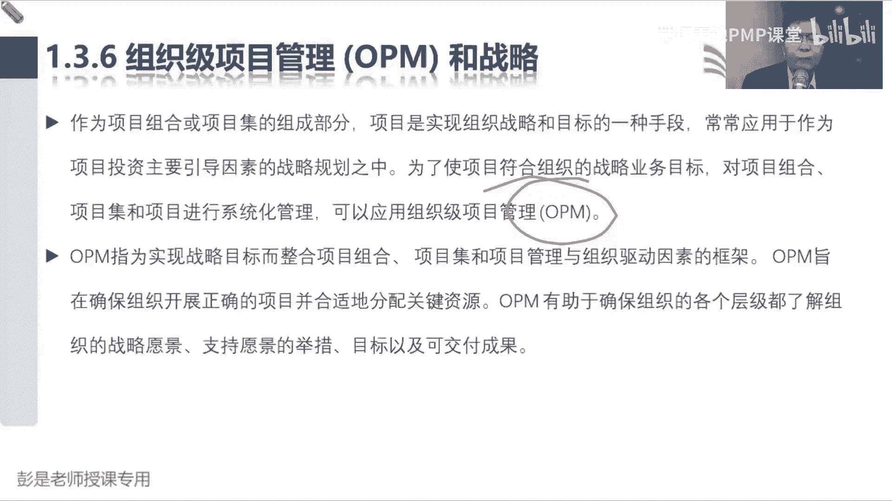

# PMP考试培训课程第1-13章节免费完整版 - P3：第一章：1.2 项目的基本要素 - 慧翔天地PMP课堂 - BV18y421e7ut

1。2项目管理的重要性。

到底什么是管理呢，就是把我们的知识技能，工具技术应用于项目活动来满足项目的要求，所以管理工作呀，就是把你的一身本领工作用到工作之中，完成任务，实现目标，得到期望的结果。

这就是管理好，知道这个意思啊，那有效的项目管理，能够帮助个人群体以及公共和私人组织，这噼里啪啦一大堆的好处，这些好处呢大家也不需要记住它，不需要记啊，基本上你想看就看，不想看可以不看了。

但是这个玩意儿要知道，我们要管理项目的制约因素，通常我们说六大制约因素范围，进度成本质量资源，再加上一个风险，通常我们说项目的六大制约因素啊，范围进度成本质量，资源风险，那接下来讲这六大制约因素。

之前刚才我们又收到了什么范围蔓延。

老师什么叫范围蔓延的，没听懂啊，所以接下来我们需要给大家继续科普啊，我们我们这十大视频是怎么出来的，那通常啊我们评价一个事情成功不成功，评价一个事情成功不成功，有这么四个指标。

就像佛罗里达同学说的叫多快好省，叫多快好省，多指的是什么呢，对吧，就在快好省，在后三个东西相同的情况下，通常我们希望这个范围呀越多越好，对不对，所以多指的是范围，就让大家中午吃饭对吧。

牛肉面馆说10分钟，然后把这个菜做好，收你十块钱，然后那个第二个牛牛，牛肉面馆说8分钟是10分钟，把这把这个菜做好，收你十块钱，那他俩的价格，他俩的品质，他俩的出餐时间都一样，那就谁家给的多，对不对。

谁家服务多，谁家功能多，以此类推啊，谁家给的范围越多，唉我们希望它越好，那会指的就是进度，在其他条件不变的情况下对吧，两家的菜量是一样的，两家的品质是一样的，两家的价格是一样的，谁家上菜快。

我们就选谁家，所以是指的是进度进度越短越好，进度越快越好，好指的是质量在其他条件不变的情况下对吧，菜量也一样，上菜时间也一样，价格也一样，谁家质量高，我们选谁家对吧，谁家附近有什么地沟油啊。

没有什么苏苏苏丹红啊，没有什么添加剂呀，哎我们选谁家，质量越好越好，我们越越成功啊，最后升值的就是成本在其他条件不变的情况下，越便宜越好，这就是传说中的多快好省，评价这个项目成功不成功的常见四个指标。

那通常也可能作为项目的目标对吧，多长时间花多少钱，产出什么样的产品，服务或成果，达到什么样的质量标准和要求，就是多快好省，那多快好省啊，刚才我们就说啊，什么叫范围蔓延呢，收范围的变化。

如果范围啊我们想给他搞多一点，会不会需要更多的时间呢对吧，一个菜，两个菜，三个菜，这不是范围的变化吗，给你做菜，然后还帮你拌好了，拌好了还给你盛碗汤，还给你跳个科目三，这都是范围的增加增加吧。

范围的增加通常可能引起进度的变化，那如果如果我们想缩短工期，缩短进度，通常我们第一反应就是考虑投入更多的人，诶子远投入更多的资源，一个服务员给你上菜，一个服务员给你跳科目三，投入了更多的人。

也可以有效的缩短时间，对不对，那所以想要缩短工期又紧，又会引起资源的变化，人多了什么就上去了，成本对不对，两个人给你服务成本高啊，然后人多呢有没有可能引起质量的问题呢，有吧，所以就会发现那牵一发动全身。

这些因素之间存在着各种各样的关联关系。

所以在衍生就是变成了六大制约因素，范围进度成本质量资源和风险，其中任何一个因素发生变化，都可能引起一系列的连锁反应，就变成了传说中的六大制约因素，然后再一延展啊，说范围进度成本质量资源。

那我们要不要管理干系人呢，好要吧，哎所以就有了干系人管理，那有人的地方，有人的地方需不需要沟通呢，需要所以再加一个沟通管理，有人有沟通啊，最后一个，就是所有的事情都是我们自己完成的吗。

你牛肉面馆要不要采购啊，对吧，买柴米油盐酱醋茶呀，哎，所以再加上一个采购管理，所以在六大制约因素的基础之上，再加上一个干系人管理，沟通管理，采购管理，就共同构成了九个知识领域，接下来各位同学带场景啊。

高高在上啊，下面有九个大臣分别帮助你管范围，进度成本质量资源风险沟通采购相关方，那皇帝干啥呢，整合的管理者主要工作不就是组织协调吗，让大家不能各扫门前血压，因为牵一发动全身的增加范围，可能调整进度啊。

涉及到成本啊，质量啊，资源啊，甚至相关方的满意度啊，会引起一系列一系列的连锁反应，所以我们需要统筹对吧，组织协调这些工作，我们就把它称之为整合，最后就共同构成了十个知识领域，这就是1。2。

这句话又能想到十个知识领域对吧，从多快好省到六大制约因素，到九个大臣，九个子知识领域，最后盖个帽子整合，人沟通，最后一个是采购，现在不太需要刻意的去背。

因为后面的课程主要讲十个知识领域啊，好所以作为一个项目经理，作为一个项目经理，我们要平衡制约因素对项目的影响，因为通常啊是不是不同干系人，对项目有不同的期望呢对吧，有的领导抓质量，有的领导关注关注进度。

有的人关注成本，有的人关注范围，有的人关注客户的满意度，就是因为大家对项目的期待不一样，对项目的期待不一样啊，所以通常我们要去找到一个平衡点，不得不在某些领域做出一方面的牺牲。

就知道这个意思就可以了，好那项目管理不善或缺乏项目管理，可能会导致这基本上看一遍就可以了，想看就看，不想看可以不看了。

嗯再往下书上后面这一段文字啊，书上后面那一段这段文字，六大制约因素刚讲完，至少说了两遍了，7613同学专心听，专心听啊。

这是画出来的，这个东西记不住没关系啊，总之九个知识领域就称之为九大制约因素。

就大制约因素啊，嗯大家在实际工作中，这十个知识领域够吗，范围进度成本质量，资源风险，相关方采购沟通，有些项目有没有这个玩意儿，安全管理对吧，工程啊，建筑啊，施工啊，你不得管安全吗。

搞软件有没有安全管理啊对吧，现在国家什么数据安全法都出来了吧，哎安全管理有没有，环境管理有没有呢，对吧，盖个房子弄个工地对吧，什么弄个林地，占用耕地，在环境管理也需要有吧，健康管理有没有呢，劳动密集型。

智力密集型对吧，不同人群，不同人群不同工作环境，大家的健康啊，我们也要关注啊，就是QHSE这套东西啊，所以我们实际工作中，一定要结合结合项目的实际情况，结合你行业的特点。

企业的特点在增加或者是减少一些知识领域，总之还是那三个字，看情况啊，张三里面只是列出来，大多数项目通常涉及到的十个领域，好再往下说，项目是组织创造价值和效益的主要方式，这段文字我们其实已经讲完了。

商业环境可能有变化，出现了影响企业的因素，咱不得不通过项目来进行应对，从而帮助企业创造价值，创造出来的价值，再通过运营去实现它，然后就让我们一个台阶走到另一个台阶，不断地不断地帮助企业去成长。

这了解就可以了，看看一遍这段文字啊。

好然后有效的高效的什么什么知识值得供电了，看看就可以了，看看这道题在范围，时间成本和质量正相互制约的因素之中，什么玩意儿最重要，实际上只能选只能选C了对吧，范围最重要吗，不一定质量最重要吗。

不一定项目经理能做这个主吗，不一定，但肯定是领导说了算，领导说了算啊，我们要参考参考管理层的期望，分析他们的需求是啥，因为有的项目看看重工期，有的项目看重质量，有的项目看重成本。

所以这种东西啊带到实际场景中，大家想一想啊，你有没有听说过一些项目啊，不计成本，不计代价也要按时完成，有多了去了吧，比如说一些重大的会议对吧，什么代表大会不计成本不计代价呀，包括什么奥运会，亚运会对吧。

贴钱也干了，哎所以它取决于管理层，取决于管理层对这个东西的期望好，那现在大概知道了这六个制约因素，再再给大家回顾一下刚才什么叫范围蔓延，刚才我们学习过，学习过就会知道啊，范围的变化会影响到进度。

成本质量资源，甚至沟通相关方风险，采购可能会牵一发而动全身，引起一系列的连锁反应，那所以范围的变化如果没有得到范围的变化，如果没有得到妥当的管理，就可能导致我们的进度成本质量资源，其他的管理失控。

所以失去控制的范围的变化就叫范围蔓延，最经典的场景，最经典的场景，看，这一周基本上每个人都有是啥呢，昨天晚上啊，我一点钟躺到床上，然后给自己暗下决心，今天晚上刷抖音就刷半个小时，有明确的时间。

有明确的范围，然后通常会怎么样呢，哎呀刷一会抖音，再看看热搜吧，哎呀朋友圈有小红点啊，不看不合适啊，对这有个数字一啊，是啥意思呢，点开看一看有没有人给我评论的诶，就是不断的不断的不断的在改变我的范围吧。

同时没有考虑到对这个玩意儿的影响，就这个东西咱就失去了控制，失去了控制啊，所以当出现范围的变化的时候，我们要去考虑考虑这个东西会不会影响进度，成本质量资源，以此类推，考虑周全再做决策。

所以这叫变化不可怕，可怕的是变化不可控，不受控没人管，后面学到整体变更控制，就把这个逻辑给他，再给大家重嘛，强调一遍好，根本停不下来哈，跟他现在的人都是这个通病。

那1。3项目项目及项目组合和运营，看到这四个单词，大家认为还需要讲吗，还需要讲吗，讲过了吧，哎所以知道那个大道理。

知道那个大道理，再看文字这段这段内容啊，大家后面复习的时候重点看文字，看文字是为了训练阅读啊，还是需要看的啊，但基本上没有什么新的知识点好说，一个项目可以采用三种不同的模式进行管理，作为一个独立的项目。

不包括在项目组和项目集中，换个角度看这句话，如果一个项目不包括在项目组合之中，这说明什么，看到组合就想到这个玩意儿战略，如果一个项目不包括在项目组合之中，可能和公司的战略没有相关性，好那一个道理。

如果一个项目没有被包含在项目集之中，这说明什么呢，这个事儿和其他的事情可能没有关联关系，没有依赖关系啊，把它完成就可以了，好以此类推了，那如果一个项目在项目及之内，说明它和其他事情有关联关系。

一个项目在项目组合之内，说明它符合公司的战略诶，能够换角度，把这个把这三句话给他拼出来就可以了。

那接下来巴拉巴拉巴拉说，如果在项目什么项目集之中，然后告诉你项目集的定义，又告诉你项目组合的定义，这段文字，大家建议大家课后就是复习的时候看就可以了，看的过程中更好地想到那些关键词啊。

两个事情之间存在着关联关系，依赖关系，咱把它给协调好，想办法1+1大于二，因为两个事情如果协调不好，就可能导致浪费，就想那个场景对吧，说装修没装修完呢，设备到了诶，我们需要找一个地方单独存放。

这是浪费时间浪费钱，所以他的中心思想就是想办法，把多个事情给他处理好，他更关注的是号，怎么把这个多个事情协调好，最关注的是号，那项目组合呢，关注的就是，为了帮助我们更好地实现企业的战略目标。

想办法把好钢用在刀刃上，想办法把好钢用在刀刃上，它就需要画个圈圈，把事情放进来放进来，把符合战略的事情放到圈圈里，然后排排序，合理的分配好我们的资源和资金，合理的安排我们的人财物，这段文字讲完了之后。

再加加上两个小小的知识点啊，第一个小小的知识点是说，项目集资中有没有可能包括运营呢，也就是说呀，一个项目有没有可能和运营存在着依赖关系，关联关系，有没有可能呢对吧，我们那个牛肉面馆生意不好。

我们想先转型了，改成麻辣烫了，还转型转型变成做麻辣烫的餐厅，我们的项目我们的项目会不会对运营造成影响，你厨房改造的时候，是不是就没有办法正常经营了诶，那如果发现项目和运营之间，存在着这种关联关系。

依赖关系，我们要把它放个圈圈协调好，想办法不浪费对吧，对我们的经营啊，尽可能的尽可能的影响最小啊，所以项目集之中也有可能包括运营，就知道这个结论，项目集之中也有可能包括运营。

听到这句话能理解出来为什么就够了啊，那以此类推，项目组合里面有没有可能包括运营呢，有可能吧，餐厅一开门，我们现在手头上没什么项目，我们的工作重心就是运营，对不对，也有可能啊，唉所以各种可能性。

项目及项目组合都有可能包括运营啊，好知道了这个大道理之后再搞定一个字，这段内容就结束了，看这个字是啥意思，什么叫子项目集，什么叫子项目组合呢，还还没套WBS呢，什么叫子项目级，子项目组合呢。

有没有可能有一些子项目呢，有吧，所以就记住啊，记住啊，大道大道至简，这叫什么天下大势，合久必分，分久必合，一个事情如果规模太大了，能不能把它拆成一大堆更小的事情呢，可以吧，所以项目如果规模太大。

可以分成各种各样单独的子项目，项目级，如果规模太大，也可以拆分成子项目集，项目组合太大了，仍然可以拆分成更小的小的更小的子项目组合，以此类推啊，他就是来体现这种层级关系，知道这个意思。

知道这个中心思想就可以了，然后最后呢那知道了什么天下大事，合久必分，分久必合，我们可以对这个东西呀做拆分，所以最后一定要记住的一个道理，拆分分解这个方法有啥好处呢，拆分分解有啥好处啊。

想想你们公司为什么要分组织架构，为什么要有部门，有上下级，说老板董事长亲自挂帅，直接管理这5000个员工，这老板也会疯了吧，对不对，事儿太多了，人太多了，管不过来呀，诶所以这是为什么要天下大势。

分久必合，合久必分呢，规模太大了，规模太大了，太复杂的事情，我们通过分解可以把复杂的事情变简单，哎，复杂的问题简单化吧，好BEA同学说啊，复杂问题简单化就是这个中心思想，那简单的事情什么话呢。

这个以前上课基本上不讲简单的事情，应该把它怎么画呢，联系简单的事情不要明细了，既然这事这么简单，标准化流程化对吧，哎就是标准化流程化简单，既然这事比较简单，咱标准化流程化把它弄，把这个规矩说清楚。

这样可以弥补大家能力上的不足对吧，不管你能力高和低，反正标准就是这样的，123451干活结果就出来了。

知道这个大道理哈，再往下看后面这段文字，基本上这张图这张图也不需要去背，能看懂就可以，项目一是一个单独的存在，和其他事情没有相关的关系，项目及A1里面包括了项目二，项目三说明这两个项目有依赖关系。

项目及B规模太大了，所以拆成了子项目及B1，然后项目组合A里面可能包括项目项目集，也有可能包括运营，运营呢也有可能包括在项目机制中，总之各种各样的可能性，他就为了说明这种各种各样的可能性，给了一张示例。

你能看懂就可以啊，不用记。

然后再往下说，项目及管理和项目组合管理的生命周期，活动目标重点和效益都不相同，巴拉巴拉巴拉巴拉巴拉吧，这段文字都不念了啊，关键是看看这两句话，一定一定记住它，因为这帮助我们更好的区分这些管理。

这些管理方法的目的是不同的，项目集和项目重点，关于重点在于以正确的方式开展项目集和项目，所以他们关注的是这活儿咱怎么把它干好，他更关注方法好，更关注方法好，那项目组合管理则重点注注。

重于开展正确的项目和项目集，所以项目组合关注的是好钢用在刀刃上，好钢用在刀刃上，到底刀刃在哪，对不对，所以他关注的是what，对企业来说，我们做什么事情是正确的，嗯好一定要记住这个中心思想。

所以其实对企业管理来说呀，就是不断的从战略到战术这个转化的过程，战略关注的是什么呢，方向吧，哎put战术更关注的是什么呢，好公司定大目标，大方向，做企业的战略规划，战略规划敲定了我们更关注的这些事。

这些事儿咱怎么怎么干，那以此类推，在你组织架构里面，公司更关注的是对吧，What，然后下一层下级员工关注的是how，下级员工关注了号之后呢，他就会产生出他的what，这是我们部门的目标。

部门的目标清楚了之后呢，再交给个人，我们再去思考，我们需要做什么事来实现这个部门的目标。

以此类推，就是不断不断不断这样的循环，知道这个中心思想之后，132这段文字基本上不念了，就是一堆事儿。

依赖关系，管理关系协调好，处理好，想办法，1+1大于二，就记住这个关键词去分析，然后看看这句话，看PPT说项目集和项目的依赖关系，具体管理措施可能会包括这段文字，大家完全不需要去记住它，记得住，记不住。

一点用都没有啊，但是有这么四个讨厌鬼，咱标一标，这四个讨厌鬼在任何一个层级都都让人恶心，第一个就是风险，风险无处不在，风险一旦发生，可能会可能会对我们产生积极的，消极的各种影响，第二个讨厌鬼就是冲突。

冲突冲突非常广义的一个术语啊，就比如说资源资源，大家坐地铁为什么要抢，抢的是啥，做对吧，坐这个座多吗不多，所以才要抢啊，物以稀为贵，所以资源的稀缺对吧，包括先下后上啊，还是先下后上啊，老幼病残孕对吧。

弱势人群要不要让人家先上车呢，诶要排序，包括这种优先级的事情也会产生冲突，观点的不一致，意见的不一致，是不是冲突的，张三认为牛肉面好吃，李四认为麻辣烫好吃，这是冲动吗。

也是他非常非常非常广义这个东西也挺讨厌，那第三个呢就是确定的问题，确定性的问题对吧，电脑坏了，然后明天就生病了，明天讲不了课了，这都是问题啊，问题和风险的主要区别就是风险是不确定的。

问题呢就是确定的对吧，我今天身体不舒服，明天不讲课了，这就是一个确定的问题对吧，我今天可能不舒服，明天不知道能不能讲课，诶，它存在着不确定性，就叫风险，这俩玩意儿都讨厌，因为风险一旦发生。

就可能导致问题，问题呢有可能带来风险，最后一个讨厌鬼啊，就叫变更，计划没有变化快，今天提个新需求，明天提个提个新想法，张三请假了，这个东西又涨价了，然后又出了好多bug，出了好多缺陷，这都是变更啊。

这玩意儿无处不在，所以传说中项目过程中的四大恶人，就是这四个东西，风险冲突问题变更，不管是大家在工作，在生活之中，不管是项目，项目及项目组合，甚至公司的战略管理，这四个讨厌鬼到哪都有。

所以未来考试的高频考点一定是这四个东西，因为通常啊如果这四个玩意儿不存在，计划定好了，顺风顺水，你说这需要过多的过多的管吗，不需要，对不对，管理者的作用啊，体现不出来，不需要过多的干预。

不需要过多的干涉，还顺风顺水的项目对吧，顺风局怎么打怎么有啊，不需要过多的管理者的介入，管理者的最重要的作用，就刚才讲到那四个核心技能对吧，其中之一就是问题解决，就这四个讨厌鬼。

如果我们有效地把这四个东西给他处理好，管理好，帮助我们更好地按照计划去，12345往前走，才能更好地完成任务，实现目标，做到价值交付，所以这四个讨厌鬼一定是，一定是大家学习的重心，也就是高频考点。

那风险就讲风险，这一章冲突呢到了资源这一章再说问题解决，到了质量这一章再说，变更呢是整合这一章不叫不需要记啊，因为马上就会讲到这些对应的知识点好。

所以书上后面给了一个什么什么卫星通信，卫星系统项目集就不念了吧，大家更好的去理解一下，书上写的这些东西的意思对吧，什么地面站和卫星发射这俩东西要匹配啊，建一个这么大的地铁站，地面站弄一个这么小的卫星。

这是大炮，打蚊子浪费对吧，弄一个这么小的地面站，你给我弄一个这么大的火箭和卫星，它也发射不上去啊，唉想办法把多个事情给他协调好，处理好。

1+1大于二，然后书上后面噼里啪啦，就是项目组合的概念，就是一堆事儿，排排区域，合理分配人财物，就这么三个三个重要的事情啊，这么做的目的是帮助企业更好地实现战略目标，帮助企业去分析我们对吧，刀刃在哪。

把钢用在刀刃上。

唉这是关注是做什么事情，对企业来说是正确的，后面的文字不需要背不需要背啊，就是不断的阅读，更好的去熟悉这些术语。

所以咱就不见了，那134运营管理，运营管理啊，先讲先听PPP，看PPT啊，咱先讲个大道理，我们牛肉面馆生意不好，想转型做麻辣烫，想转型做麻辣烫啊，哎启动项目，然后转型对我们的什么厨房啊，什么什么厨房啊。

用餐环境啊，包括什么设备设施啊，包括人员哪都要培训的，都要培训的，让大家学会做麻辣烫，厨房设备要改造，那这种情况下，运营的同事参与到项目之中好不好呢，让厨师服务员参与到这个项目之中。

提出他们合理化的建议和见解，好不好，挺好的吧，因为啥呢，运营的同事有这个知识，他有专业知识啊，厨房厨师对吧，告诉你怎么合理的布局，让我们麻辣烫做的又快又好啊，服务员告诉你怎么把大厅重新摆一摆。

让我们上菜上的又快又好啊，以此类推，我们需要运营同事，他们在工作中积累沉淀下来的这些知识，对不对，所以呢最好最好啊，这些人参与到项目之中，那启动项目的时候，通常我们就从运营这边拿到两个东西。

叫资源和知识，资源可能是人财物，设备设施这些东西啊，知识呢就特指的是人有的东西，那项目结束之后，项目结束之后，我们能还回去什么呢，第一个就是我们这个可交付成果吧，改造好的厨房对吧，重新布置的店面。

然后包括什么使用手册呀，玉米手册呀，安装手册呀，总之都叫可交付成果，我们需要把这些可交付成果移交给运营，第二个我们从运营拿到的资源要回去吗，这些人要不要回到各自的本职工作上去呢，唉资源各回各家。

各找各妈呀，那这些资源这些资源呀通过项目学到了什么呢，新的知识对吧，服务员知道这个麻辣烫怎么点餐了，厨师知道这个麻辣烫怎么做了，诶他们在项目过程中掌握了新的知识，新的技能。

所以啊项目和运营的交叉点就出来了。

借两个还三个，这记这个大顺口溜就可以了啊，这两个还三个好，借好还再借不难，启动项目的时候，我们从运营拿资源以及这些资源所拥有的知识，项目结束以后，资源还给你，知识，新技能还给你。

另外我们项目又创造了独特的可交付成果，扔给你，移交给运营，这两个还三个，这就是项目和运营之间的交叉点，好知道这个大道理，再看这段文字，基本上没有什么东西了，刚才我们知道运营啊，持续的定期的重复的产出。

相同品质的产品服务或成果，所以他关注的是这个玩意儿能不能持续运作，对不对，我们希望每天都有人来吃饭的，主要今天没有生意啊，没有生意就不赚钱了，对不对，所以他更关注的是持续持续可持续化的发展。

所以他使用最优资源满足客户的要求，来保证业务运作的持续高效，他更关注的是对吧，降低成本，提高效率，提高质量诶，就降本增效这套话术了，怎么做到持续高效呢，所以他更关注更关注如何把这些事情啊，标准化规范化。

标准化规范化，运营会不会产出可交付成果，可交付成果，特指特指特指特指的是项目创造的东西啊，运营重复性产出相同品质的产品服务或成果，你就不要找产品吧对吧，厨师每天给你做饭了好，再往下交叉点，直播电脑。

什么交叉点，什么拿资源，拿知识，就这段文字啊，可交付成果和知识在项目和运营之间转移，包括资源能看懂就够了。

然后再往下136又在又在重复告诉我们，项目组合，项目集和项目，这三个管理方法的侧重点是不一样的。

讲过了重建了啊，需要仔细看一看才巩固知识点，然后就带出来这个单词叫OPM，OPM以前会讲的还还稍微多一点，现在基本上也不咋考不咋考，咱就说一说OPM的概念，停一停，知道怎么回事就可以了啊。

OPM的中心思想，看PPT这张图其实挺好，让大家更好地理解这些管理方法，它存在的价值和意义，刚才我们知道，刚才我们知道啊，战略的变化会不会引起项目组合的变化呢，猜大胆猜对吧。

我们公司打算做中国最好的牛肉面馆，那我们项目组合理的事情，肯定都是和牛肉面有关的事情，未来我们打算转型做最好的麻辣麻辣烫餐厅，那我们是不是把牛肉面的事情给他踢出去了，然后把麻辣烫的东西给他放进去吧。

你以为战略调整，战略调整这个就需要变化，what做什么事情更正确对吧，他就需要做调整，所以战略的战略的变化会引起项目组合管理，项目组合管理它里面的内容的变化，知道这条线为什么为什么这么画啊。

然后再思考项目组合，项目组合，把符合战略的东西放到我们这个组合里，排排序，合理的分配人财物，所以变成人话就是好钢用在刀刃上，好钢用在刀刃上，也就是说把这个钱放在哪儿能赚更多的钱，对不对。

把这个钱放在哪儿能赚更多的钱，所以它叫价值决策，从投资这个角度去出发的啊，我们进什么饮料，进什么酒水，进得多，能赚的多呀，对这就是项目组合管理开发工作重心，那项目组合管理啊，还要根据项目集和项目。

项目集和项目创造性创造的效益去分析啊，我们是不是做了正确的事情啊，所以他通常通过项目集和项目，甚至有可能包括运营，他们的收益去判断我们这个钱花的对不对，这个钱花的值不值，那如果如果不对或不值。

可能会不断地对对项目组合，项目组合里的东西做调整，就有了这个圈叫业务影响分析，然后审查和调整，最后呢，我们项目和项目集，创造了独特的产品服务或成果，这玩意儿咱留在手里没用的，要交付运营，项目是创造价值。

运营呢就是实现商业价值，然后在运营的过程中，我们再去看看商业环境有没有出现变化，如果出现变化了，我们要不要做点事情去进行应对，小事情可能直接通过项目的形式就把它完成了，大的影响。

大的变化可能需要涉及到战略的调整，就是牛肉面不赚钱，战略调整，我们改做麻辣烫，麻辣烫不赚钱，战略调整，我们改做预制菜各种可能性啊，所以我们要根据运营的运营的绩效去分析呀，我们企业要不要做出大变更。

小变更大变革，小变革就有了下面这条线好，这张图每个单词能看懂就够，不需要大家去记住它，但是那什么是OPMOPM的中心思想啊，就一句话粗暴理解就可以了，战略有战略的管理方法，项目组合有项目组合的管理方法。

项目及项目运营大家都有一大套管理方法，这些方法之间要不要有关系呢，这些方法之间要不要保持整体目标的一致性呢，要把不能各扫门前雪样诶，所以就是系统化的去管理这些东西。

直到这个中心思想找到这么一句话，听一遍就完事了，所以OPM是指为实现战略目标来整合，项目组合，项目集和项目管理和组织驱动因素的框架，什么叫整合呢，就是把它变成一个集体啊，让大家能够有效的有效的衔接。

有效的互动，有效的协作呀，知道这个意思就够了啊，关于OPM，它其实有更多，更多有一本专业的教材叫组织及项目管理，因为PMI推出了一个OPM3，组织及项目管理成熟度模型。

来评价你企业这个管理工作成熟不成熟，这么一套东西，咱pp考试不考这么深奥的东西啊，所以这个单词了解就够了。

嗯看看这套课程检查我们对知识的掌握情况，说这道题啊，在实施项目的过程中，应该认真考虑，项目产品的维护和持续运营的问题，那么这种维护和持续运营应该怎么做呢，选哪个，怎么还有多选好C啊。

说运营啊是项目收尾阶段的一项重要活动吗，不是一定要记那个项目项目管理的边界啊，徐州评估商业论证效益计划的制定，这是跟他没关系，我们只负责中间这一段项目结束以后，我们的成果移交运营。

所以运营不包括在项目生命周期之内，所以A不对，B不对，D也不对，所以最合适的选项就是C，运营不是项目生命周期中的一个阶段，运营不属于项目的边界之内啊，不属于项目的范畴，这个这个这个概念。

大家一定要和大家工作中签的协议去区分，想一想大家工作中有没有遇到过这样的合同啊，说你帮我开发一个软件，然后呢再搞5年的运维，你签的协议就是标准的项目加运营吧对吧，或者是这种场景啊，你帮我修一条高速公路。

这条路修完了之后，你们来收钱，做10年20年，30年的运营，有可能吧，项目加运营，项目加运营就是大家工作中可能会接触过，接触过这样的合同，它是包括了项目和运营的，但是从概念上来说。

项目是不是有项目独特的管理方法，运营有运营的一套管理方法，诶，他的方法不太一样，所以运营运营不是项目的一部分，但你可能和企业签合同签的协议，它的协议的范围就包括了项目加运营，这是两回事啊。

嗯好知道这个道理啊，所以这两天这两天又上热搜了，什么什么上海社保系统瘫了，上海社保系统瘫了，就是说运维公司的锅呀，说这个运维不到位啊，哎人家跟跟跟什么社保中心签的，就是项目加运营。

帮你研发一个什么社保系统，然后给你做什么5年十年八年的运营工作啊，但是概念上来说它是两回事，好看看这道题，当两个项目有内在的依赖关系的时候，为了获得更好的利益，应该采用哪一种方法，这个简单吧。

有内在的依赖关系，为了想办法1+1大于二，就用项目集，对不对，没提到战略，没提到优先级就不找项目组合啊，好以下以下哪一项属于运营的一部分，不三思，不要草率，不要草率啊，找一个最确定的一看。

这活儿啊需要定期的持续的重复的开展，所以就是A吧，会计业务对吧，给你发工资，这事是不是需要持续的重复的定期开展啊对吧，什么会计啊，初大呀，唉这些工作需要定期的持续的重复的开展，它是运营工作的一部分。

像调整啊，这不一定啊，对不对，更新这也不一定了吧，不一定需要天天更新，持续更新啊，哎什么流程再造，这不一定啊，所以通常来说BCD这样的事情，我们通常认为这玩意儿需要有临时性，把它完成就可以了。

好看看这道题，每个组织都为实现某些目标，而从事某些项目和运营工作，关于项目和运营的说法是不正确的，写啥呢，根据前面那道题就能判断出来，这道题的答案是D对吧，运营是项目生命周期收尾阶段重要的工作之一。

这肯定不对啊，它不包括在项目的范畴之内，那这道题虽然能判断出来D是答案啊，那ABC换个角度看问题啊，ABC是不是说的就是正确的，正确的就需要有一点点小印象啊，项目和运营都受制于有限的资源。

我们都收到资源的约束啊，人财物通常通常没有这么物质极大丰富的运营，持续不断重复进行的项目，有临时性和独特性，这是对的，C项目和语音都需要规划执行和控制，这没毛病吧，看到规划执行控制。

大家能不能想到有一个知识点叫啥呢，规划执行控制，规划执行控制，今天晚上今天打算减一斤，然后呢今天按照计划走，走，他1万步走他俩小时啊，结果发现走了10分钟就走不动了，然后又馋，喝了瓶饮料。

吃了点串就回家了，通过控制发现哪这过程不行，明天得改进，就是PDCA这是个最大的大道理，道法术道法术最大的那个道，说我们做任何事情通常都需要对吧，做计划按照计划去执行，然后呢通过监督控制。

看看执行过程中有没有出现一些偏差，如果发现这种偏差，发现这种差距和不足，最后那个A就是反思进行过程的改进好，所以其实任何事情都有PDCA。

再看这道题，项目题是什么东西呢，写啥，大胆说呀，不怕错呀，这第二个了吧，持续时间长，这神经病建设费用超过一个亿，这胡说八道D用于归类各项目的名称，以便于每个项目都属于某个项目级，这也神经病啊，不一定啊。

但最最最确定的是，它里边肯定相互关联，相互协调好，再看这道题，想一想刚才说过战略发生变化以后，什么玩意就变了对吧，原来对我们企业来说最重要的是做牛肉面，现在呢我们转型做麻辣烫。

那项目组合里面和牛肉面相关的项目，就把他踢出去，对不对，麻辣烫相关的东西就把它放进来好，所以知道了这个大道理之后啊，再再想企业啊对吧，对比就比如说对企业来说，我们有很多很多事情啊对吧，我们要又做游戏。

我们拍电影，我们做社交平台，我们做很多事情啊，别把现在人工智能比较火呀，那对企业来说，有没有可能在项目组合里面，加入人工智能相关的东西呢，有可能吧，过两天发现呢，这会儿好像没有变，没有变现的能力啊。

做下去不赚钱呢，过两天有没有可能把这个事业就给他整个，砍掉了呢，也很正常吧，所以现在经济形势不好，大家就去找工作的时候要去思考了啊，这家企业是一个什么样的企业，它的核心业务是啥，如果你去到了非核心业务。

比如说一些新兴的业务里面是不是有风险呢，经济形势不好的情况下，一定要慎重，一定要慎重啊对吧，企业可能为了追热点，为了赶风口哎，一时兴起成拉个几百个人，成立一个团队对吧，做了半天发现哪没有变现的能力。

不赚钱的很可能卡就止损了诶，大家可能就失去了工作机会，所以你要去分析一下，这家企业核心的东西是啥对吧，最好最好进到它核心的业务里面，这样呢至少工作稳定，知道这个道理啊，WY同学说。

项目组合不是会影响到项目集，项目组合里面就一定包括项目集吗，不一定不一定啊，所以最确定的就是C战略发生变化以后，项目组合的范畴肯定会做出相应的调整，但其他东西要不要调整呢，咱也不知道，好再看这道题。

一堆事，战略目标优先级，这叫啥，就是C了吧对吧，我们确定今后5年到底做什么事情，对公司来说是正确的，帮助我们更好地实现目标，这些事情啊排排序，合理的分配我们的人，财物重要是重要的事情交给重要的人。

不重要的事情交给不重要的人，这就是项目组合这种管理方法，好组织的商业价值成功属于开始于什么呢，从上往下找呗，从下往上找C，那就是C了吧对吧，要想实现价值啊，先要做企业的战略规划，战略管理。

战略规划做完了之后才有了项目和运营，对不对好，所以答案是C，先有战略规划，才有了其他的事情啊，嗯以下哪一个不是运营工作的例子，看到这个字，看到这个字，看到这个字就美美，就代表着重复吧。

还定期的重复的开展的工作，通常我们把它当做运营，但是构建一个什么系统，这通常把它完成就可以了啊，记住啊，一定最后活学活用，你说每年的员工绩效评估，我可不可以把它当做一个项目，可以不犯法吧，完全可以啊。

完全可以压嘿，所以做题的目的是帮助大家更好的巩固概念，但是千万不要去记答案。

场景不同环境，不同选项不同答案不一样的，对不对，视角不一样啊，那关于项目组合管理，以下哪一个说法不正确的，D就是D了吧，那D的问题出在哪，他用了这个词就太太绝对了，对不对，把话说死了。

项目组合里边不一定有，不一定总是一组项目集啊，对不对，里面可能只有项目，甚至可能项目项目集都没有，项目项目集中没有的情况下，项目组合里面只有运营，但实际上项目组合存在的意义就不大了对吧，运营咋排序呀。

人家追求的标准化规范化对吧，流程标准，政策程序这些东西啊，好所以答案是D。

这道题，这要选啥呢，一堆事儿，10年还有什么竞争力，什么对公司成功至关重要，这叫啥，首先啊哈一系列，就代表着它一定存在着关联关系吗，不一定吧对吧，我对个人的人生规划，我有一系列的事情要做呀。

我要学PMP呀，我要换工作呀，我要买房买车买房车呀，哎这些事情之间不一定存在着关联关系，依赖关系啊，但确定的是什么呢，这么多事儿10年竞争力至关重要，这是否涉及到企业的战略呢。

10年以上是肯定是战略规划哈，所以这就是项目组合管理，A事业环境因素，现在没讲到这个知识点啊，什么叫事业环境因素啊，猜一猜，什么是事业环境因素呢，大家最好理解的事业环境因素就是法律。

法律会不会对我们的工作形成限制呢，会哎这是我们干事的环境的一个因素之一，好后面会讲到讲到细节的啊。

