# PMP考试培训课程第1-13章节免费完整版 - P4：第二章：项目运行环境 - 慧翔天地PMP课堂 - BV18y421e7ut

在某些情况下需要给项目经理很大的权利诶，所以呢就有了组织结构类型，根据项目的规模和复杂程度来分析，应该给项目经理多大的权利，那通常呢在职能型组织结构之中，项目经理基本上没啥全好一点的，叫弱矩阵组织结构。

项目经理呢可能有了一定的协调权，但总之无论是职能型还是弱矩阵，项目经理在项目上的权利基本上等于零，因为这两种组织结构啊，都是职能经理分别负责各自在项目中的一部分，职能经理说了算，项目经理更像是联络员。

协调员，只有从平衡矩阵开始，项目经理在项目上的权利，和职能经理旗鼓相当诶，双方混合掌握项目的预算就是等于号了，然后还有一种组织结构呢叫强矩阵，在强矩阵组织结构之中，项目经理单独掌握项目的预算。

所以呢咱在项目上的权利就大于职能经理，最后呢就是项目型，项目型呢是项目经理直接带着一大堆职能部门，咱们直接管理着职能经理。

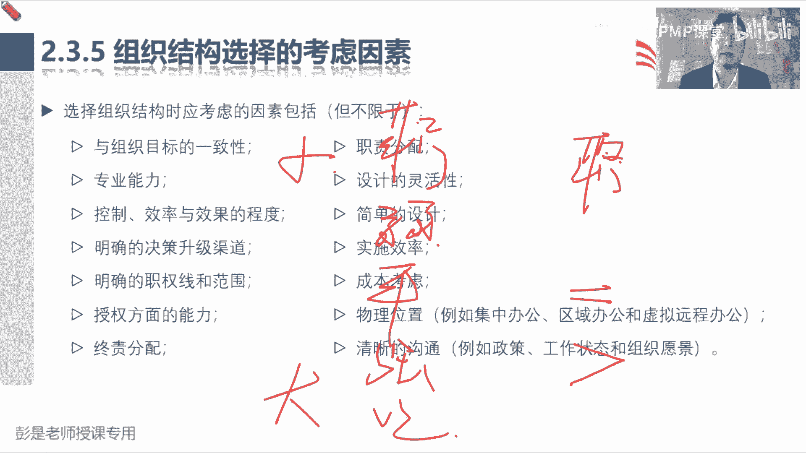

这是讲到了组织结构类型，然后2。3。6来了一个新的单词叫PMO，项目管理办公室，它的定义读一遍就可以了啊，项目管理办公室是对和项目相关的治理过程，进行标准化，并促进资源方法论，什么工具基础。

什么叫共享的一个组织，总之人家的主要工作是项目管理，去想办法想办法，让我们项目管理的过程更加标准化，更加的规范化，这是人家的主要工作重心，所以人家人家叫项目管理办公室啊，除此之外促进什么资源啊，工具啊。

技术共享诶，这种资源的共享，什么技术的共享，就是在项目之间，可以在多个项目之间去帮助我们去进行，这样这方面工作的这方面事情的协调，这是人家的主要两个工作，第一重要的工作工作重心是项目管理。

第二个是项目之间，项目之间的什么技术共享啊，资源共享啊，甚至项目之间的协调啊，诶可以找PO给我们提供相应的支持。

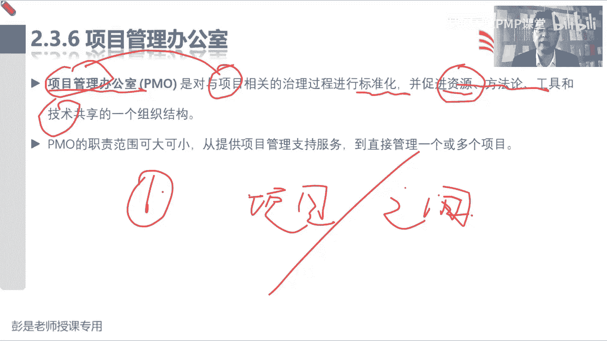

那一定要记住的知识点就是PO常见的三种类型，他说PO有几种不同的类型，他们对项目的控制和影响程度各不相同，例如支持性PO知识型，PO担当顾问的角色，向项目管理项目提供模板。

最佳实践培训以及什么信息经验教训，这看不懂啊，再往下看，控制型，控制型PO不仅提供项目支持，而且呢通过各种手段要求项目服从，就是说呀项目经理管项目，需要听PO给出的这种标准化的方法。

需要参考p mo给出的标准过程，政策程序规范，听人家的，按照人家的要求去干活，那指令型的特点是指令行直接管理和控制项目，所以对一些企业成立了指定型的pm之后，它通常把项目。

它里面有一大堆的专业的项目经理啊，TM的项目经理直接管理企业，大多数的项目，有一些小型的项目可能就交给职能部门去完成，但大部分的项目可能就是DMO里面的项目经理，直接管理，唉，这就是支持型控制型指令行。

权力从小到大这样一个变化的过程，所以这三种类型啊大家完全可以代入场景，就简单粗暴理解一下对吧，我们公司我们公司没有PO从0~1，我们要成立一个项目管理办公室，这种情况下，我们成立的办公室啊。

可能没有啥底气，咱就支持型，我们给公司各个项目提供支持服务，包括模板啊，培训啊，什么过程啊，方法呀，诶人家爱听不听，咱没有底气啊，没有权利要求人家服从规定的，然后随着工作的开展。

慢慢的慢慢的咱接触的项目多了，咱经验丰富了，我们就可以给出相关的标准，政策程序规范，让人家听我们的，让人家按照我们的要求去开展项目的管理工作，然后在做大了以后呢，我们这招招一大堆专职的项目经理。

直接管理大多数的项目，小项目可能交给职能部门自己完成，这就变成了指定型，所以他就是权力从小到大这样一个变化的过程。

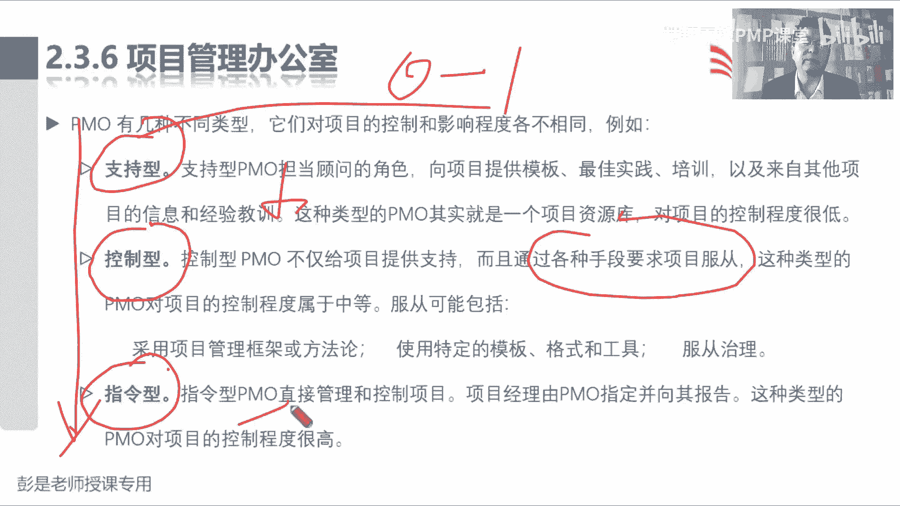

记住这三种类型就可以了，嗯好后面这段文字巴拉巴咱就不念了啊。

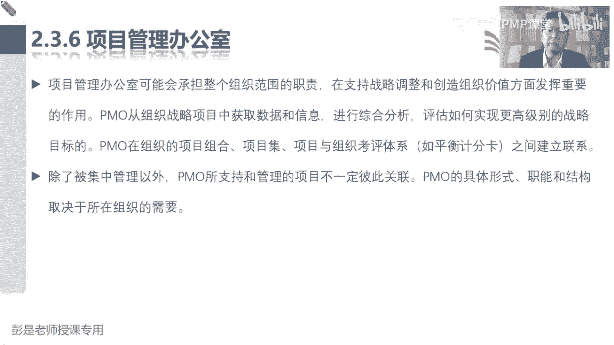

这段看看看一遍，知道咋回事就行了，再往下，为了保证项目符合组织的业务目标，包括提出建议，领导知识传递终止项目，根据需要采取其他行动，还是另一套东西吧，给我们提出合理化的建议和见解。

然后他在某些情况下可能做决策，然后呢领导知识权利啊，就是做好我们知识的知识的知识的沉淀，总结积累，甚至包括公知识的交界这种东西啊，好在我看就可以了。

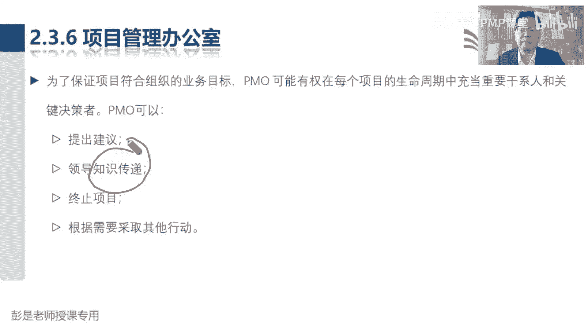

没什么需要记得，然后再往下PO的一个主要职能是，通过各种方式向项目经理提供支持，这些方式包括但不限于，这段文字就是在刚才的基础之上又做了个细化，对他工作重心肯定是项目管理的方法，第二块工作内容呢。

就是项目之间就记这么两个词就可以了，所以你看它识别和制定项目管理的方法，最佳实践和标准指导辅导培训和监督，这不还是方法论嘛，对不对，通过对项目审计，通过对项目审计监督，对项目管理标准。

政策程序和模板的遵守程度，这个单词先标一下，因为未来才会学到呃，质量审计，采购审计，风险审计可能会有各种各样的审计这样的单词，那审计最重要的作用啊，就是就是合规性，检查我们的项目管理标准。

政策程序和模板的遵守程度，就是看看咱合规不合规对吧，所以你可以有各种各样的审计，审计一个过程，审计一个我们实际中实际工作中的过程，去看看这个实际的过程，它是不是符合相关的标准政策。

程序规范来检查这个东西的合规性，就这玩意儿，所以大家也听到了什么财务审计对吧，质量审计大家在工作中可能会接触到，如果工作中接触不到呢，你会你会看到新闻新闻啊，什么中央审计组到处巡视，对不对。

看看这个企业，还你们从日常日常工作里面合规不合规啊，有没有违反什么八项规定啊，有没有违反中央中央这些国家体系相关的标准，正在程序规范的事情呢，这就是审计的最重要的作用，检查合规性，发现一些什么差距。

缺陷和不足，再看看有没有什么最佳实践，然后呢，以便于对我们的实际过程进行不断的改进，确保它符合要求，这个单词可能会从从现在开始啊，我们会看到很多遍了，好再往下制定和管理项目的政策，巴拉巴不见了。

对什么什么全部项目的共享资源进行管理，对跨项目的沟通进行协调，这都是在说项目之间的事情，项目之间的事情，所以项目管理的边界一定要清楚啊，再回顾一下上节课讲的这几个单词，说需求评估，商业论证。

效益管理计划的制定，这事跟咱没关系，这事通常是发起人最高，作为一个项目经理呢，咱的主要工作是完成任务，实现目标，得到期望的成果，所以项目中间过程项目经理负责，然后项目结束以后，运营这事跟咱没关系。

我们可能会参与到运营之中去，验证有没有实现目标效益，但运营不包括在项目范围之内，那PO能干什么事情呢，就是两个项目之间的协调，两个项目之间的协调，不管是什么东西的协调，不管是协调什么事情，嘿。

这已经超出了项目经理的权力范围，这个事可以找PO给我们提供相关的支持。

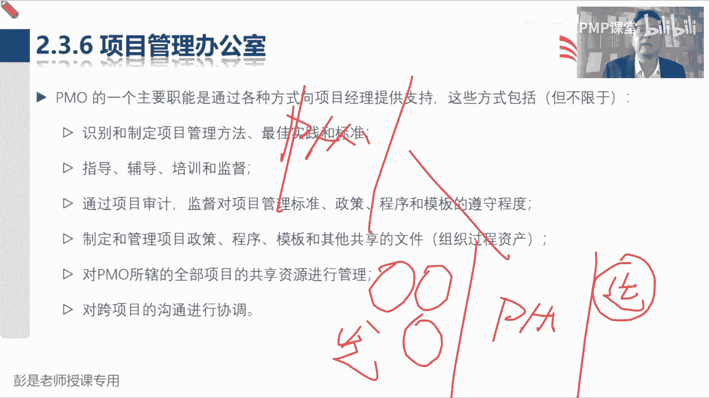

相关的指导，所以这一大段文字很重要，但其实总结就可以了哈，第一就是项目管理的方法，第二个就是项目之间的事情。

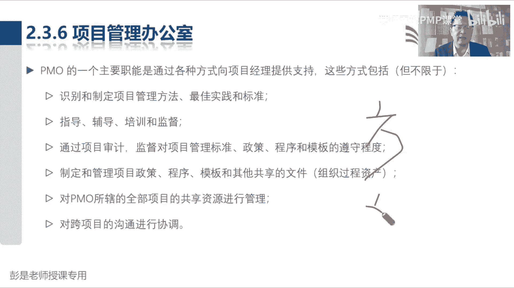

它可以帮助我们去协调，去促进好，做一做这一小段这个小知识点和练习题。

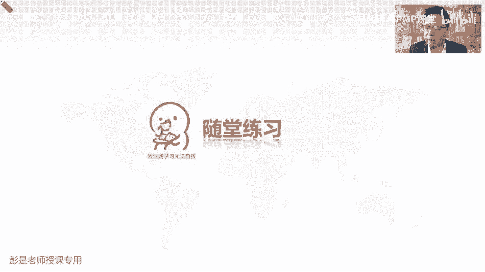

看看这道题选什么，有同学，选B和选D的同学三思啊，选C的同学三思啊，这种题完全用，完全不知道知识点的情况下排除都可以吧，对话说，某组织内的办公室政治，曾对之前的项目造成负面影响。

为防止办公室政治影响当前项目，项目经理开始时应该怎么做呢，就是以前办公室政治，什么叫办公室政治的，就是权力斗争这种事情啊对吧，私结营党，拉帮结派这种事情对项目产生过影响，那现在怎么做呢。

A上高级管理层去求帮助，B推荐一个具有实际能力的新项目经理，处理办公室政治，这肯定不行吧对吧，找了一个人搞了一个事情，办公室证实这个事，我们有没有权利去处理这个事情呢，不可能不现实，对不对。

所以B肯定不行啊，C聘请一名第三方的项目经理，来避免组织内的政治，我干活，这活儿可能有问题，我再招一个别人干，这也不现实吧，怎么可能让别人取代我呢，哎就像MC同学说的啊。

然后让干系为项目选择合适的项目经理，排除掉了，所以最后最合适的选项就是A，因为这个事已经超出了我们的权力边界，对不对，咱管不了了，管不了了，可以找具有更大权力的人去寻求帮助和支持，比如说发起人。

比如说PO，比如说项目及经理，项目组合经理或者甚至是合适的高级管理层，所以这道题建议的答案就是A，一定要用全力去判断这个事情，我们能不能做出这个主啊，能不能做这个决策好。

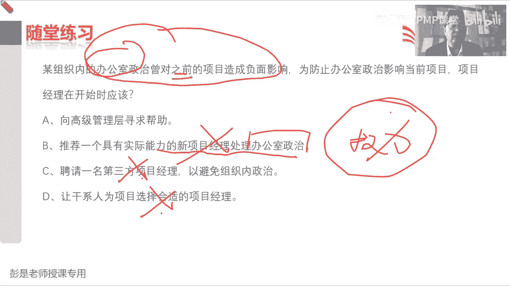

再往下看看，这道题，选C吧，选B的同学慎重啊慎重啊，说一个建筑的项目经理，发现他所在项目所在地附近，正在新建一条新的水管线，公司政策要求，在他的团队继续完成这个项目之前。

必须先填写一份与有关城市环境变化的表格，看好这是什么情况的例子呢，公司政策，这是个什么鬼，公司政策要求，必须填写一份有关城市环境变化大表格诶，他对我们的工作形成了限制，对我们的工作形成了限制。

形成了约束，所以呢他就是一个事业环境因素，那这种题啊，如果加选项的话，如果我加选项啊，我加一个E选项，组织过程资产，选什么呢，这种情况下，公司的过程政策程序它又属他是组织过程资产。

然后必须先做一个什么什么环评的表格，它又是对项目形成了制约，优先选哪个呢，这个公司的政策，公司的政策呀，标准啊，过程啊，文档啊，历史资料啊，模板啊，他确实是组织过程资产，但是呢这个组织过程资产。

又对我项目形成了约束，又同时是事业环境因素，优先选哪个呢，可以仔细想一想，稍稍的啊，那这种情况下，其实考试不太会出这么纠结的题啊，这种情况下你更看更更侧重于看它的哪个属性，第一个属性是我们公司特有的。

第二个属性会对我们的工作形成约束，更关注的是限制吧，唉所以这种情况下仍然建议选事业环境因素，仍然建议选C啊，如果是多选就不用纠结了，多选就可以全都选上了吧，他既是组织过程资产，又是事业环境因素。

就永远找一个相对来说最合适的选项，仅此而已啊。

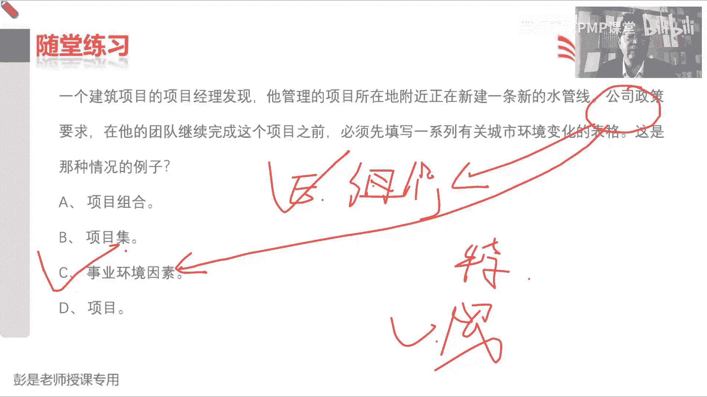

好再看看这道题，刚才带着他带着各位同学复习了一下哈，说什么什么弱取阵，组织结构只能形组织结构，咱做不了主啊，咱说不了算了不算，职能经理负责项目，既然是职能经理负责项目对吧，谁有权谁背锅呀。

谁有权谁背锅巴，哎就像HKT同学收到啊，咱争取争取不考虑实际情况，一定是权责要对等，考试的时候一定是这个出发点啊，权责要对等，有权利我就背锅，没权利我就不背锅，所以哪个说法不成立，弱矩阵的组织结构之中。

成员向职能经理报告，这是对的，咱并不直接直接负责资源，这是对的，职能经理负责呀，职能经理做出的决策可能会影响你的项目，对的人家的权力比咱大，所以呢D选项不成立，我不对项目的成败负责，因为没啥权利。

没权利咱就不背锅，对不对，承担不了这个责任呢，咱争取争取所有的体系，所有的场景权责是对等的啊。

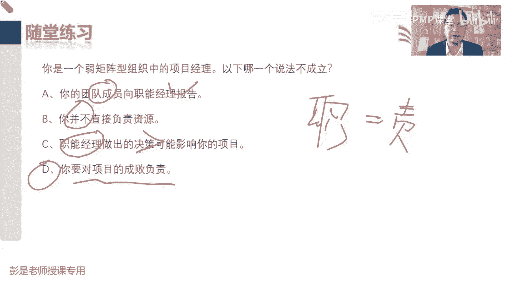

好再看看这道题，这道题相对来说比较简单吧，只要读懂题目，知道啥意思就可以了哈，54321，恭喜大家答对了，所在项目实施的过程中，在你不知情的情况下，两个成员被职能经理，调往另外一个开始的项目上去了。

给咱项目实施带来了很大的麻烦，然后所在的组织结构类型市场，就卑微哈开总结的非常到位了啊，就是卑微，咱都咱的人家都没必要通知咱，人家都没必要通知咱，所以呢就显得咱没有很大的权利，换了人。

你不知道代表你无权哈，就这个道理，然后有些同学问啊，D选项是什么鬼呢，紧密型矩阵的没有这种组织结构类型，没有这种组织类型啊，这是一个忽悠忽悠人的单词编出来的，以前PMI老师出题的时候。

非常非常喜欢编一些不存在的术语，忽悠人呢，然后那个紧密型矩阵呢，它实际上指的未来我们搞团建的时候，他指的一种方法叫集中办公，它实际上指的是指的是大家在同一个地方干活，集中办公，在同一个地方开展工作。

就像那个打仗的时候，那个指挥部是对吧，所有的核心成员我们都在同一个房间里，诶，他指的是那个那个建设团队的方法，它不是组织结构类型啊。

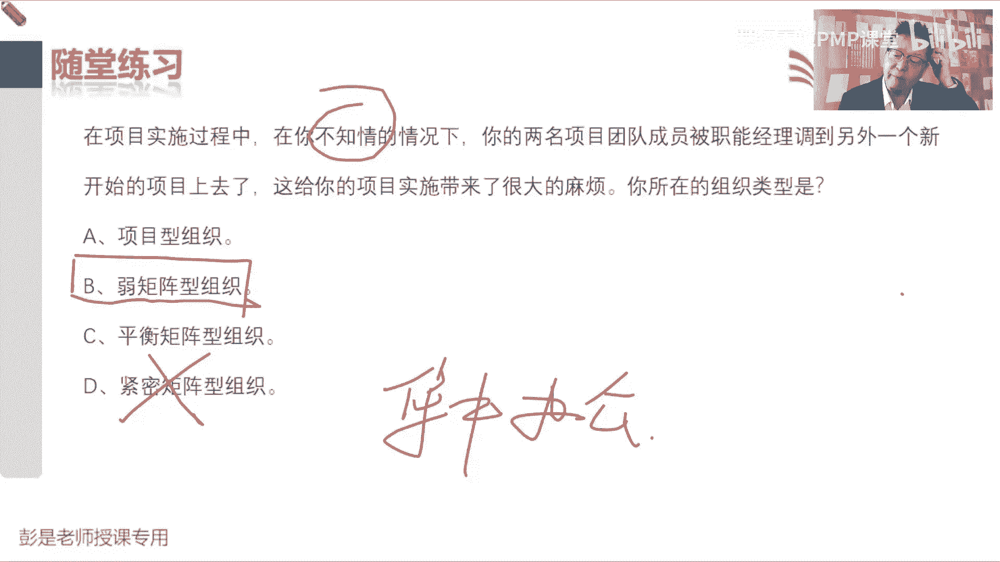

比较有迷惑性啊，好再看这道题，在下列哪一种组织结构之中，项目成员在收尾的时候最忧心忡忡，选出答案要稍稍问一下自己啊，为什么，为什么对吧，这地方施工这地方施工，我来了，然后呢，我来帮你打地基，搬砖头。

然后施工结束了就就没地儿去了吧，哎去除非去一个新项目，除非去一个新项目，项目结束，团队散伙，大家无家可归，所以在这个阶段，大家会感到很担心，能想到这个知识点，OK了啊，好再往下我们看这道题。

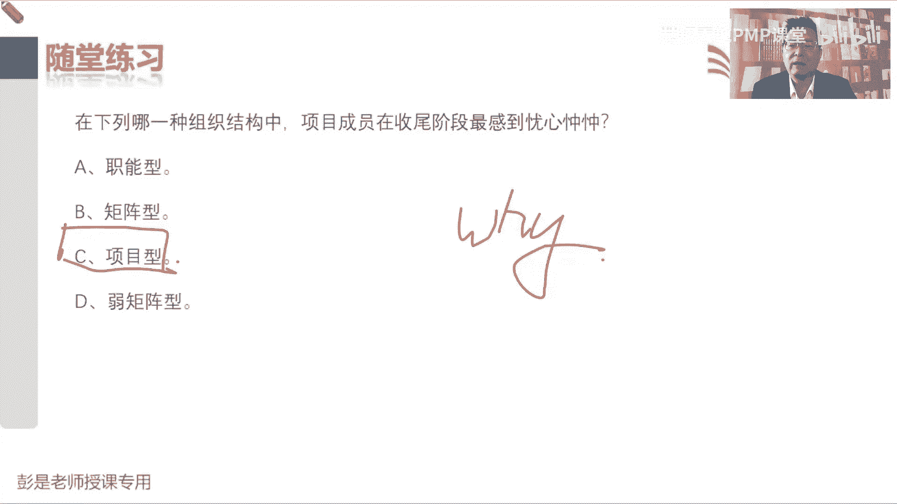

项目管理办公室，对项目结果负有直接或间接的责任，以下哪一项不是PO的主要职责，千万不要看错啊，问的是不是，选ABC的同学三思啊，慎重啊，不要中招啊，问的是哪一个，不是PO的职责偏好，三种类型，支持型。

控制型，指令型，对不对，权力从小到大呀，除此之外呢，除此之外啊，人家还可以做项目之间的，一些事情项目之间的沟通，项目之间的共享资源，项目之间的什么共享技术之间这种协调啊。

哎所以A选项给项目提供行政支持服务，这是PO的职责，所以他不是答案B选项，指导培训指导和辅导项目经理，这是PO的职责，所以呢他不是答案对不对，不管是支持型，指令型控制型，它主要工作就是项目管理的方法。

包括方法的沉淀，总结积累，包括方法的制定出我们相关的标准，政策程序规范，包括把这些方法，这些标准政策程序规范给项目经理提供支持，提供培训，C项目之间的人员协调，这是PO的职责，所以啊他不是答案。

最后呢D制定项目干系人之间的沟通计划，这一看通过我们那个边界就可以判断出来，就想着四个圈带带一个方块，这玩意一看就是项目边界之内的事情，对不对，项目边界之内的事情了。

那肯定是项目经理去主要负责这个事情了。

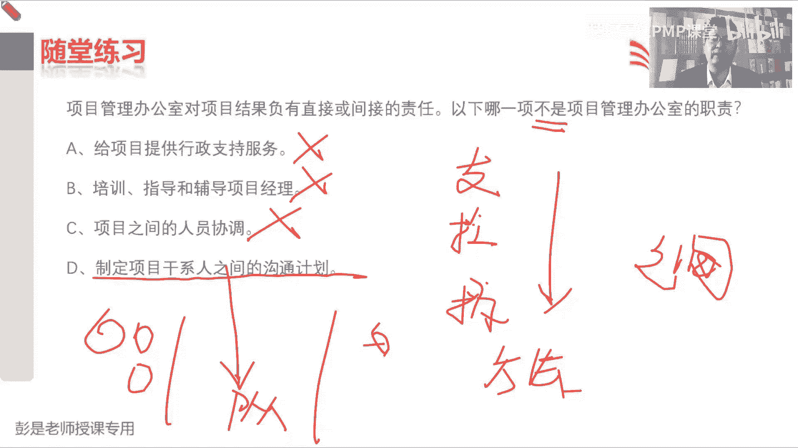

所以答案是D，好再看看这道题，max同学，关键词找错了，马克思同学关键词换一个，直接管理哎，直接管项目，直接管项目，这种呢就叫指定型，对不对，然后支持行给我们提供行政支持服务。

控制行要求项目经理服从他的管理规定啊，没有D没有D这种pm好。

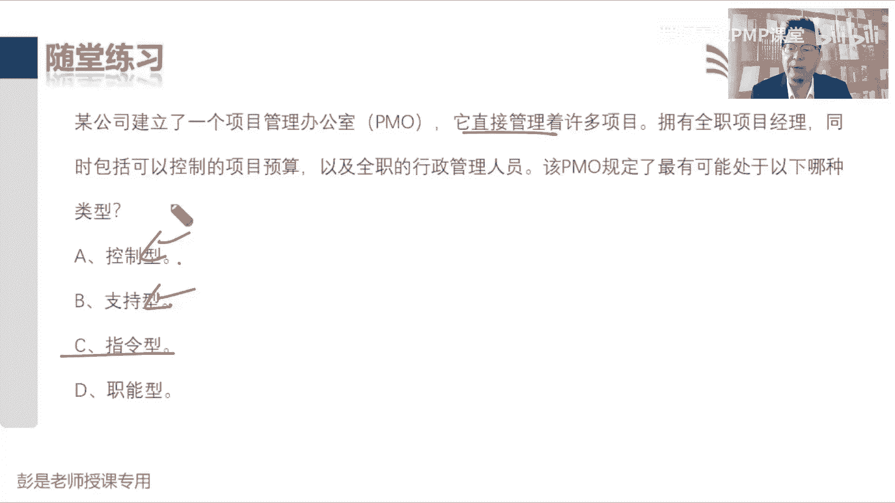

这道题，恭喜大部分同学答对了，正确的答案就是A说让找一个描述错误的选项，那A选项说的不对，知识型没有办法通过手段要求项目服从规定，那BCD在这种这道题里边啊，B选项C选项D选项就是正确的正确的说法哈。

既然是正确的说法，未来就像这样的题啊，大家复习的时候，那就把BCD仔细看一看，因为它是知识点，对不对，控制型通过手段要求服从规定，这是对的，指令行直接管理项目，这是对的，然后呢权利从从大到小。

从高到低就是指令型，控制型。

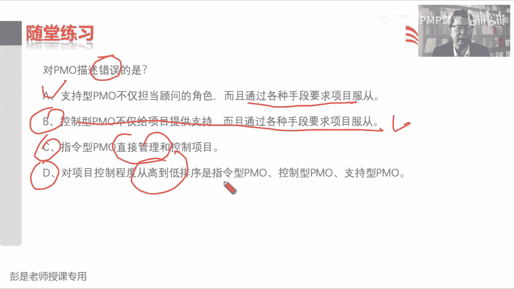

支持型，看看这道题呢，控制型咳咳，控制形式说我出标准，你们按照我们这个标准去干活，但是我直接不直接在项目指令行，是下面有专业职责，项目经理直接管项目，对啊，好54321，这道题比较简单啊。

说丹尼尔是一个工厂建设项目的项目经理，最近加入了一个组织，然后呢，没并没有完全了解这个组织的文化和结构，为了管理他的项目，干系人，必须更好地了解他们，以下哪一个可以为丹尼尔提供一些。

有关干系人参与先前项目的历史信息，所以呢就选，D吧，这是第一个吧，关于这个组织构成资产的，基本上也就考到这种程度啊，就是说如果给大家大概再总结一下啊，如果说现在我现在想说哎，我现在要考虑考虑啊。

怎么让问题少发声，少出现，我们就以史为鉴，参考我们的组织过程资产，看看前辈们踩过的坑，那如果现在吧我遇到问题呀，总结经验教训，更新到组织过程资产，现在我遇到问题，总结经验教训。

更新到组织过程资产这么做的目的是什么呢，是为了防止未来，对不对，前人栽树，后人乘凉了，是为了以后啊，防止以后的人在踩同样的坑，这就是组织构成资产，包括我们的经验教训，知识库这些东西，它最重要的一个价值。

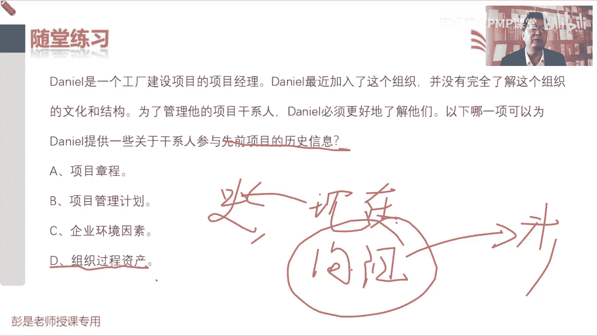

恭喜大家答对了对吧，说巴拉巴拉吧，前面都是不念了啊，这个项目完成的时候，你要解散团队，使他们能够参与到另外一个项目之中，哎那就是典型的项目型，对不对，如果项目结束的时候解散团队，大家回到各自的职能部门。

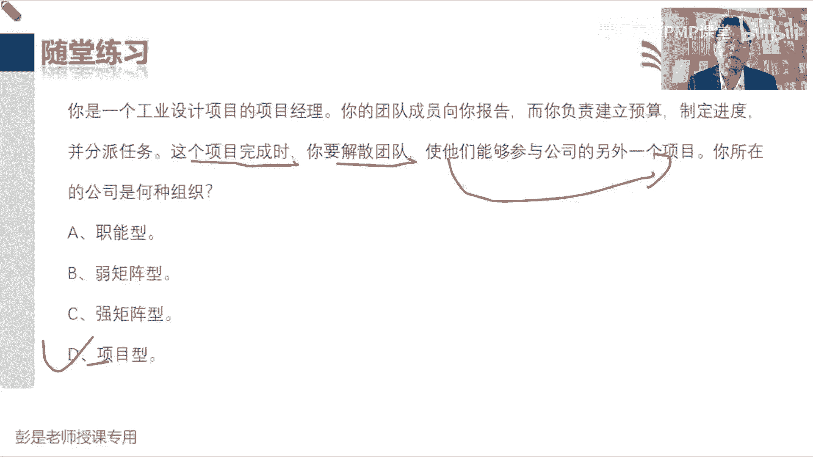

这就是强矩阵对吧。