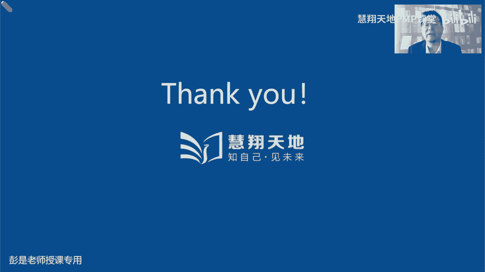
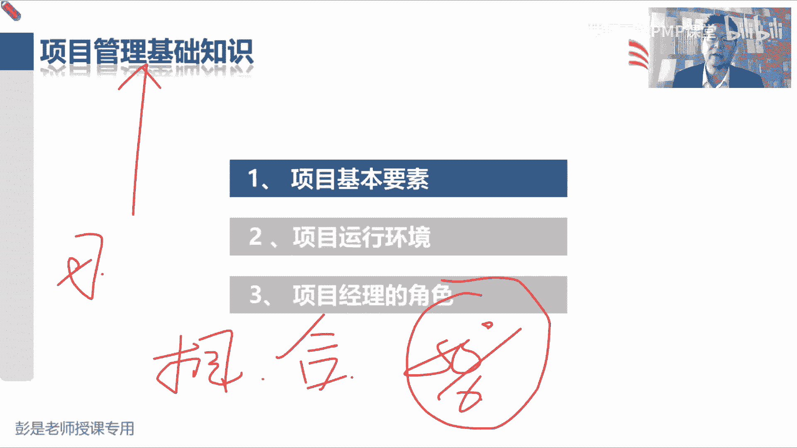

# PMP考试培训课程第1-13章节免费完整版 - P5：第三章：项目经理的角色 - 慧翔天地PMP课堂 - BV18y421e7ut

第一部分第三段项目经理的角色，这部分内容的字虽然看起来挺多，但重要的知识点没有那么多，相对来说呢，大家后面复习的时候可以看到比较快了啊，基本上课上听一遍，然后呢把重要的知识点反复看几遍就可以了。

所以大家专心听，专心听，咱们开始开始开始起飞了，说呀很多项目经理从项目启动时参与项目，一直到项目结束，废话根据之前我们储备的知识，我们已经知道了，项目需要有明确的开始日期，结束日期。

那么从项目开始到项目结束，作为一个专职的项目经理，我们全权管理项目过程中的这些大大情小事，然后第二段再说，不过在某些组织之内，项目经理可能会可能会参与，在项目启动之前参与到评估和分析活动。

某些组织呢可能还要求项目经理啊，做这个商业分析，我们可能还会参与后续跟进活动，来实现商业效益，所以这段文字啊，这就变成上节课给大家讲的那个大的框架了，说项目启动之前三件事，第一件事叫需求评估，对不对。

去看看有没有商业机会，去发现一些商业机会，搞清楚我们要做什么事，比如说颁布了新的法律，或者是对市场做调研，或者是去搜一搜有没有客户，甲方发一些什么招标公告对吧，通过各种各样的方式和渠道去找商业机会。

去找项目诶，这叫需求评估，做完了需求评估之后，那咱企业也不傻，咱企业不傻啊，咱要思考啊，这事值不值得我们花钱花时间花精力去干呢，所以呢我们要去分析这个事情的可行性，如果有可行性了，我们还要分析这个事情。

能不能给企业带来一些有形价值和无形价值呢，对不对，就是看做这事有没有有没有好处吧，这就是商业混账，做完了商业论证啊，老板肯定说哎我们这事儿赚钱，什么时间能赚到多少钱呢，你得说清楚吧，想一想。

上节课说到我们那个餐厅对吧，牛肉面馆啊，这面馆开起来一年能收回成本吗，两年以后能赚他一个小目标一个亿吗，10年以后能不能全国变开10万家连锁店的，所以要把什么时间赚到什么样的收益，要把这个事情说清楚。

就有了效益管理计划，效益管理计划主打一个告诉老板能赚多少钱，以及什么时间能赚到多少钱，短期效益，长期效益，持续性效益都给他说清楚诶，这是项目启动之前三件事，需求评估，商业论证，效益计划的制定。

这是通常是发起人负责，那现在这段文字啊，就是说啊想着一个讲，想着一个道理，说，项目经理参与到项目启动之前的这些工作之中，好还是不好呢，参与到项目启动之前，给发起人提出我们合理化的建议和见解。

这事好不好呢，挺好对不对，挺好啊，所以实际上对任何一个层级，不管是公司上到公司战略，下到具体的某一个活动，我们的相关方，我们的干系人尽早地参与到这个事情之中，提出我们合理化的建议和见解，这都是好事儿啊。

对不对，早发现早治疗，早康复嘛，让该系人参与到尽早地参与到这些事情之中，提出他的建议，提出他的见解，让我们尽量的尽量的把这个事情考虑周全，尽量的尽量的不要把这个事情做错了，都挺好啊。

所以就有了项目经理可以参与到项目系统之前，需求评估，商业论证和效益计划的制定，参与到这些事情之中，提出我们相关的建议和见解，那项目结束以后啊，上节课也知道了，项目结束以后。

可能需要把我们的成果移交给运营，那某些项目结束的时候还没有开始赚钱呢对吧，这个牛肉面馆盖好了，现在还没有赚钱呢，没有收入啊，只有运营一段时间，可能需要运营个三个月，六个月，九个月才能够收回成本。

再运营一段时间才可能会开始有盈利了，所以呢我们可能项目经理啊，还需要参与参与到运营之中去，验证一下有没有实现目标效应，去跟踪去验证是不是真的赚了这么多钱，有没有实现项目的商业意图。

还这就是项目经理的工作边界变宽了，在项目启动之前和项目结束之后，我们可能会参与其中，这样呢就确保做到了传说中的端到端对吧，全流程啊，全过程啊，端到端的项目，这是中间事前事后哎。

咱就一条龙一条龙把这事儿从头跟到尾，只不过就是中间过程是我们全权负责，全权负责带着兄弟们完成目标，实现任务，得到期望的成果，但可能会参与到之前和之后，这段文字非常非常重要啊，好这段文字超重要。

但是呢给大家知道那个大概的结构，讲过这个大道理应该应该把它记住嗯，所以其实这段话听完了之后啊，端到端一个人干全部吧，未来最有可能成为CEO的人，最有可能成为CEO的人，这是项目经理。

对项目经理是重要候选人之一，因为一个出色的项目经理啥都懂啊对吧，端到端再配合到配合到那个项目制，这种这种行情对吧，项目型项目型这种组织结构类型对吧，你想想旁边有什么施工啊，工地啊，盖地铁啊。

这种项目制项目经理全权负责所有的事情啊，对不对，哎就相当于一个小的CEO了吧，好这段只听一听这个道理啊，然后3。1，项目经理和职能经理哪个大，看情况看情况对吧，刚刚复习完呢，有些情况下职能经理说了算了。

有些情况是人家双方混合展出项目的预算的，有些情况下是大于啊，好那3。1项目经理的决策，这段文字呢基本上也没啥可念的了，大家课后课后啊，基本上看一遍就可以了，他就是把项目和一个管弦乐队的指挥，做了个对比。

让大家更好地理解项目经理干啥事儿对吧，有人弹钢琴，有人拉小提琴，有人吹什么什么萨克斯，有人敲鼓，作为一个指挥，作为一个指挥，我不一定能够亲自演奏每一个乐器，但是我知道每个乐器的特点，结巴什么时候动静大。

什么时候动静小，什么时候应该应该磅礴大气，什么时候应该应该应该温柔，我知道每个月期的特征，我可以带着大家通过这种组织协调，组织协调，组织协调，让大家面演奏出一个华丽的乐章。

诶这就是项目经理拿个小指挥棒在那指挥，就给这视角啊，和这段文字呢看一看，帮助大家更好的理解项目经理的主要工作对吧，就是组织协调沟通，组织协调沟通，组织的组织大家，然后定期的排练，定期的演练对吧。

然后协调大家之间的工作对吧，你这个那个你的声音不要盖过其他人的声音，对吧，唢呐一响，全程其他其他音乐都凉了，这也不行啊，哎组织协调沟通了好，这段话直播间了啊，然后3。2项目经理的定义，这段字超少。

就这么三个角色，这三个角色，并且当我们在前面已经给大家铺垫过了，所以看一遍就够了，也没啥可练的说，职能经理专注于某个职能领域的管理和监督，职能经理就是大家公司里面的财务hr，采购销售市场营销哎。

就是各个职能部门的管理者，就是各个职能部门的管理者对吧，对报到我们餐厅里面，餐厅我们的牛肉面馆就是我们的厨师长，我们的前台经理，大堂经理顶班，就这些人呐对吧，什么财务经理，库存经理诶。

他他主要是来自于各个职能部门，运营经理负责保证业务运营的高效性，就是我们的首席运营官对吧，什么COO这种东西啊，确保我们餐厅餐厅每个人来吃饭的时候，我们有人有人给人家点菜，有人给人家上菜。

有人给人家做菜，有人给人家擦桌子，有人给人家收钱，诶确保我们运营运营追求的是过程的标准化，规范化，运营追求的是标准化和规范化，为什么呢，就是啊标准规范，标准规范这个东西存在的最大的价值，最大的意义是啥。

大家可以想一想，十秒钟时间，标准化规范化最大的，最大的意义是什么呢，唉高同学说，同质化可持续减少风险，持续性，一致性，这几个观点是对的啊，标准化规范化的作用是便于我们持续地稳定地。

产出相同品质的产品服务或成果，便于我们持续的持续的稳定的产出，相同品质的产品，服务或成果，相同品质，相同品质，它可以干嘛呢，弥补能力上的不足，对不对，想一想前面有没有说过，就想想麦当劳对吧。

麦当劳为什么标准化规范化呢，为什么可复制性强呢，对他不需要我们的这些员工有很很卓越的厨艺，因为他的所有的生产的顺序，都是标准化的作业哈，哎我不会做饭，但是呢你按照人家的标准化的程序。

12345就可以把美味的汉堡做出来了，还追求的是我们生产过程的这个品质啊，好听一听这个道理啊，研发部门的经理，是属于职能经理还是项目经理的，研发部门的经理，他肯定是职能经理，只不过在某些情况下。

他去管项目，他去负责项目，就变成了项目经理，所以项目经理是角色，对不对，是角色呀，我们有一个项目需要有一个人去管理啊，任何人都有可能承担某个项目，担任某个项目的项目经理吧。

好想让张同学说到了一个开心的话题啊，预制菜这都不念了，然后3。3项目干洗，项目干系人的定义还是需要大家去读一遍的啊，相关方干系人这两个单词是一回事，因为这是有，有历史典故的，咱们现在学的是第七版。

第七版的中文，中文的标准的标准的术语叫甘心，第六版呢叫相关方，第五版又叫干系，所以呢咱们所有的教材，把钢琴和相关方就给大家混用了，建议大家去提前提前适应这个单词啊，因为考试的时候你也不知道，考试的时候。

不知道这个这个题到底翻译的是相关方，还是干写，甚至以前的题还出现过这样干写括号，相关方就是怕大家认为它是两个单词啊，其实是同一个单词啊，都是那个stakeholder好，那干系人是指可能影响项目。

决策活动或结果的个人群体或组织，以及会受项目，决策活动或结果影响的个人群体和组织，或者是自认为会受项目，决策活动或结果影响的个人群体或组织，所以干洗呢，这是三种人，会影响项目。

第二种人呢是会受到项目影响，第三种人呢就是自认为受到项目影响，这三种人啊，最后一总结啊，其实呢还是同一种人，为啥呢在想这个大道理，可能影响项目决策结果，或者是活动的个人群体和组织，他的行为。

他的行为对吧，会对我们的项目产生影响，这是第一种人，第二种人呐会受到项目的决策，活动或结果影响的个人，他受到了项目的影响，受到了项目的影响，他就有可能有可能反过来采取一些行为和措施，对我的项目产生影响。

是这个逻辑吧，他很可能会反过来采取一些行为和措施，对我的项目产生影响，因为它是它被影响了，他受到影响了对吧，就像我家隔壁在装修，然后呢再装修一会儿，电钻声就出来了，我就被影响了，咱的讲课就受到影响了吧。

那我可能就会打电话投诉他做工，对不对，物业你要管一管，那周末不要装修啊，诶就是因为我受到了影响，我就可能采取行为措施，反过来对他产生影响，那第三种人还是这个逻辑，自认为受到项目决策的活动或结果影响。

自认为受到项目影响了，也可能反过来采取行为和措施，对咱的项目产生干扰，看产生影响，所以啊其实就是三种人是同一种人，三种人同一种人，他为什么这么写呢，为啥这么写啊，就是啊。

希望我们啊把相关方的范围想得越广越好，把相关方的范围想得越广越好，这样呢尽量的尽量的不要做到有遗漏，因为万一漏掉了某个干系人，万一漏漏漏掉了某个干事啊，到了项目后期突然跳出来一个人。

还说我再提两点新的需求，我再提提两点新的想法，之前你们也没有征求过我的意见呢，那么这种情况下就可能导致我项目变更的代价，变更的成本非常非常非常高，咱扛不住，所以呢我们希望尽早的识别相关方。

而而且呢还要尽量的尽量的全面识别，尽量的不要有遗漏啊，但不代表着所有的人的意见和观点，都要都是重点啊，不代表着所有人的意见，我们都要重点考虑，因为未来一定要掌握一个排序的思维，人一定要分369等。

有的相关方重要，有的相关方不重要，有的人的意见优先级高，有的人有的人的意见优先级就低，知道了这个大道理，再往下看，相关方可能来自于内部和外部，可能主动和被动参与项目，甚至完全不了解项目，这都是废话。

相关方可能对项目施加积极的消极的影响，可能会受到项目是积极的消极的影响，这也是废话，总之它的范围越广越好，尽量的不要有遗漏，然后呢识别到所有的相关方的群体，个人和组织之后，再去排序，看看谁重要谁不重要。

所以先，就像李杰同学说的，说间接被影响也算吗，当然算了，对不对，当然算了吧，你也是被这个项目影响了，那你可有可能反过来采取措施对吧，你那个家里面隔壁装修太吵了，听不见的，听课听不清啊。

然后打电话投诉他呀，这个道理吧，所以想象到更广越广越好啊，但是千万千万记住，不代表所有所有的人，我们都重点管理，重点对待，因为人就一定要去分析它的重要性，他的优先级，所以这样按照按照李杰同学这个话题。

继续往下说，就就像啊说我家楼上在装修，然后影响咱听课了，影响咱听课了，各位同学啊，你的家属，是不是咱们培训p mp这个项目的相关方呢，你的什么男朋友，女朋友，你的老公，你的爱人，你的媳妇儿，你的小孩。

甚至包括父母，是不是我们培训p mp这个项目的相关方呢，他有没有受到咱这个项目的影响，有吧嘿，那他有没有可能反过来对我们的项目产生干扰，产生影响呢，有吧对吧，说你周末呀是不是在打着上课的名义呀。

在那不知道干啥呢，也不做不不做家务，不需要不做饭，不洗衣服，不扫地，啥活都不干，诶，就可能有心生怨气啊，对不对，诶，他也会受到我们项目的影响和干扰，那提人提前和人家晓之以理，动之以情，对不对，晓之以理。

动之以情对吧，今天白天听课等等，下课了以后，我来做一些家务啊，那现在项目结果中享有利益的任何人，这肯定是相关方啊，他受到项目的积极的消极的影响，对不对，所以陈轩同学，你肯定是做过章节练习题了。

做课后练习题，做做课后练习题的时候，四个选项里面找一个相对来说最合适的选项，仅此而已，仅此而已啊，他都告诉你了，在项目结构中享有利益的人，肯定是受到项目的影响了，对不对，这个力可能是正面的。

也可能是负面的，它不仅仅是不仅仅是指的是正面的啊，也有可能是负面的，对不对，好所以书上后面这就给出了相关方的一些示例，这些示例这根本就不用背，扫一眼看一看，知道怎么回事就可以了，不用背啊。

这东西背下来也没啥用的，发起人资源经理字面意思吧，PO知道项目组合指导委员会字面意思啊，项目及经理，其他项目的项目经理团队成员，然后客户和最终用户这俩有啥区别呢，这个需要想一想。

因为后面后面涉及到一个重要的知识点，客户和最终用户有啥区别，客户出钱吧，用户是使用他俩不一定是同一个人啊，不一定是同一个人，对不对，诶这是我在我的牛肉面馆，在在在美团上开了个餐厅对吧，有人可以叫外卖呀。

哎下单的人不一定是吃饭的人，下单的人，花钱的人，这是客户对吧，吃饭的人是最终用户，就这个一定要区分，因为未来讲到敏捷，敏捷就一定想办法想办法触达终端，用户，触达最终用户，这是非常重要的一个理念。

在敏捷环境之中啊，因为他要做软件开发，以软件开发为主，好供应商，什么竞争者，这都不念了，大家这个思路是对的啊，经销商使用者最终用户对的对的，那3。4项目经理的影响力范围。

这段文字呢基本上也是大家看一遍就可以了，没有啥新的稀奇古怪的，重要的知识点，基本上以看为主，能不念的咱就不念了啊，都是纯粹的字面意思了对吧，我们利用可用资源平衡相互竞争的制约因素。

六大制约因素范围进度成本质量，资源和风险，然后呢我们是沟通的桥梁，对不对，然后呢还有使用软技能来让大家心心对吧，心平气和干活，这些都不念了，然后巴拉巴拉说项目经理的组织协调沟通啊，主要的工作就是沟通了。

说顶尖的项目经理啊，顶尖的项目经理，就是软技能软技能卓越出色优秀，然后呢主要工作就是在沟通，说项目经理内部团队也是相关方嘛，当然是啦，项目经理会不会影响项目呢，有没有受到项目的影响呢，对不对。

所以干洗的，干洗的概念一定是非常非常非常广义的，不要再一个一个来确认了，说老师啊，张三是不是项目经理，老师李四是不是项目经理，对不对，大家结合刚才那个三个概念，你去想思考这个事情。

项目经理受不受到项目的影响，能不能够影响项目呢，那他是不是项目经理呢，哎是不是干系人呢，肯定是啊，不要一个一个去问了啊，嗯好再往下说，巴拉巴拉沟通这都不念了，看一遍就可以了。

然后什么什么合并渠道这都不念了啊，再看一遍看一遍看一遍就可以了，说我们还需要积极的和其他项目经理互动，和其他独立的项目，可能巴拉巴拉对相同资源的需求，资金分配的优先顺序，可交付成果的接受或发布。

项目和组织的目的和一致性，这段文字啊能想到能想到什么呢，项目之间项目之间的冲突啊，对不对，什么资源需求，资金分配，这玩意涉及到排序呀，还涉及到项目组合，项目组合管理了吧，或者是两个项目之间。

它的成果存在着某种关联关系，依赖关系，能想到项目集就可以了啊，这段文字看一遍就可以了，然后巴拉巴拉巴拉不念了，后面都没啥可重点关注的，大家基本上甚至都可以不看了，甚至都可以不看了啊。

好什么专业学科纯粹的这么一次啊，这是我们既要有管理上的通用知识，还要有当前当前所在行业，当前所在行业的专业知识吧，这也不念了，然后跨领域纯粹是什么意思了啊，这就是3。4，基本上这段这段内容。

大家基本上就是今天下完课看一遍就可以了，看的目的是更好的熟悉我们听过的这些术语，更好的去理解，更好的更好的去去去叫什么，熟悉适应这种这种写字的方式，这种写写写文章的方式啊。

更好的是去适应他这种说话的方式，那3。5项目经理的能力，这段文字呢咱讲完大家都可以重大利好，休息一下了，所以呢专心听专心听，专心听说下，近期pm i BP m i通过研究了。

给出了一个p mi的人才三角，这是项目经理能力发展框架，这是评价项目经理能力的高与低，有这么一套东西，那人才三角重点关注三个关键技能的组合，第一个呢叫工作方式，第二个呢叫影响力技能，第三个叫商业敏锐度。

大家只要大概能猜出来，这三个单词放在这，想说什么意思，想表达什么意思就可以了，第一个叫工作方式，怎么能想到咱咱考试的时候，通过哪三个领域来评价，我们对知识的掌握情况呢，过程，人员和商业，环境吧对。

咱们通过考试以后会咱们180道题，会从这三个领域评价，我们对知识的掌握情况，就叫过程人员商业环境，其中过程占到大概40%左右，人员呢占占到百分大概40%左右，商业环境大概占比8%。

所以PIPI这个人才三角就是在说，暂时在说啊，项目经理啊，我们的核心技能就这么三大块，第一能不能能不能主打一个灵活灵活地，根据项目的情况，才采用合适的匹配的这种工作方式，该预测的就预测，该敏捷的就敏捷。

该混合的就混合，第二块呢就是做好事吧，照顾好事啊，第二块核心技能呢就是带好人，能不能晓之以理，动之以情，让我们的成员，那让我们的成员呐对吧，大家都有主人翁意识，有主观主观能动性对吧，大家都是阳光的。

积极的，充满正能量的，然后呢我们的什么客户啊，用户啊，就是刚才大家见过的那一大堆单词客户，用户供应商，然后领导项目集项目级经理，项目组合经理只能经理，运营经理，其他项目的项目经理，总之所有的人呐。

最好最好都愿意跟着你一起往前冲啊，愿意支持我们的项目工作，那这主要靠软技能，这是影响力技能，第三个呢，第三个呢商业敏锐度，商业敏锐度就在说呀，作为一个项目经理呀，我们管好事照顾好人呐，干好事照顾好人。

又不能没有大局观，对不对，不能不能低着头走路，还要抬头看方向，所以呢我们能不能听懂啊，什么叫需求评估，什么叫商业论证，什么叫效益管理计划，为什么要做商业论证，为什么要做效益计划呢，对不对。

效益计划里边有什么核心内容呢，然后那些常见的什么什么财务指标，什么回收期净现值，效益成本比这些东西又代表什么含义呢，对不对，我们了不了解行业呀，企业呀，全球的什么什么政策呀，趋势啊。

还这是商业环境这些相关的知识点，我们要掌握，这样的便于我们给发起人，给我们的企业，给我们的老板提出我们合理化的建议和见解，所以呢就变成了变成了一个一个后面知识点，就变成了教材里面各种各样的这些见过的。

没见过的知识点啊，就从这三个维度去评，去评价我们对知识的掌握情况，所以工作方式从现在开始，书上这段文字呢大家基本上啊看一遍就可以了，这段文字不需要大家记住啊，不需要大家去背。

因为重要的知识点一定是打散打散单独说的，没有顺序没有顺序啊，好，所以工作方式巴拉巴拉说，主要主打主打一个就是灵活掌握多样性，创造性的方法来完成任何工作，该预测的就预测，该敏捷的就敏则敏捷啊灵活。

所以后面这段文字不念了，商业敏锐度就是我们不能闭门造车，还要看行情，看环境，看趋势，看态势，所以呢宏观微观，宏观微观，结合特定的知识领域，巴罗拉做出良好的判断和决策，这也不念了。

它里面具体的重要的知识一定会单独讲的，然后影响力技能就是带好人对吧，管好事照顾好人了，所以想办法让大家有主观能动性，对方愿意跟着我们一起往前冲啊，哎这就是影响力，这段文字巴拉巴拉也就不念了，这就是3。

5项目经理的能力，这个人才三角包括哪三个东西需要大家记住，但具体的具体的那一大段大段文字内容，不需要记啊，咳咳好，卡掉了不卡呀，那接下来各位同学，咱重大利好又来了，现在是9。56，咱休息8分钟。

时间休息到10。04，没错吧，好10。04准时回来，好各位同学，我回来了，接下来我们看3。6领导力，这也是非常非常重要的，一小一小节内容，好54321那3。62，领导力领导力说领导力技能包括指导。

激励和带领团队的能力，这段巴拉巴拉也不念了，就像上节课说过的一个知识点啊，说管理和领导，管理和领导的本质区别，先把这两个单词搞定，管理和领导力的本质区别是什么呢，管理啊更侧重于用权力。

让张三李四王五赵六去干活，领导力呢就更侧重于发挥我们的影响力，让张三李四王五赵六去干活，所以他俩本质上的区别是什么呢，管理啊，这是大家看过看过那种战争片啊，嗯看过那种战战战，打仗的。

打仗的那种那种电影电视剧啊，就是兄弟们给我上，兄弟们给我上对吧，枪杆子底下出政权呐对吧，不往前冲，老子毙了你哎，用全力让对方去往前冲，这是管理，那领导力呢就是兄弟们跟我上就差一个字吧。

就体现了体现了这种风格的不一样，领导力兄弟们跟我上，对不对，兄弟们跟我上啊，身先士卒，以身作则啊，对不对，诶，带头往前冲，希望发挥我们的影响力，让大家让大家愿意跟着我们一起完成任务，实现目标。

得到期望的成果，这是这两种这两天这两这两个单词的本质区别，所以呢很多很多企业就是说我们任命张三，是这个项目的项目经理，张三呢就利用手里的指挥棒对吧，这是你的权利啊，让让李四王五赵六去干活。

这就是管理领导力呢，更侧重于发挥大家的主观能动性，让大家愿意跟着你一起往前冲，那怎么让大家愿意跟着你一起往前冲呢，就涉及到这一小节，最重要的叫领导力风格好，后面这段文字没念到的内容啊。

大家基本上课后复习看一遍就可以了，都是纯粹的字面意思，比如说人际交往站，项目经理工作的很大一部分对人际交往，人际交往就是大家日常日常工作，和你的同事和你的朋友和你的亲戚处关系，然后研究研究显示。

有令领导者的品质和技能，包括但不迁移，有远见，积极乐观，乐于合作，这都是字面意思吧，什么建立信任的，寻求共识啊，发展的眼光啊，这都不念了啊，往下翻翻翻翻翻翻到全面这一小段内容。

说某些情况下我们需要用全力让对方，命令对方去干活，某些情况下我们需要用影响力，对不对，影响人家让人家有主观能动性啊，那权利权利权利，项目经理，项目经理啊，可以用的权利，常见的考点有这么五种权利类型。

这需要大家记住的第一个知识点，项目经理，项目经理能够用的权利通常有哪几种呢，先把这个标一下，再把这个标一下，再把这个标一下，正式权利，奖励权利和惩罚权利，处罚权利，这三种权利是项目经理的合法权利。

合法权利啊，就是张三被任命为这个项目的项目经理，张三呢就从项目经理这个角色身上，拿到了三个权，叫正式的权利，奖励的权利和处罚的权利，对吧，我有权利带着兄弟们完成任务，实现目标。

有权利让张三李四王五赵六去干活，这是正式权利，然后李四王五赵六干活干得好，我可以给你们提高评高绩效，让你们赚更多的钱，这是奖励权利吧，嘿张三李四李四王五赵六，你们仨迟到了，无组织无纪律。

那我可以动用我的处罚权利对吧，扣奖金扣工资，扣绩效，这是项目经理拥有的拥有的，公司赋予我们的企业组织赋予我们的合法权啊，正式权利，奖励权利和处罚权利这三种权，那公司能给我们的这三个权啊。

公司能给我们的这三个权，其他的权利呢公司给不了其他的权利啊，通常高频考点就有这两个，一个叫参考权，一个叫专家权，剩下的没讲到的都可以记不住，可以不记啊，参考权说，例如因为他人的尊重和赞赏，获得的信任。

他有的时候被翻译成参照权，有的时候被翻译成了暗示权利，嗯暗示今天那个吐槽一下小合同，今天写字功能不太好用，反正听声声音能听明白就可以啊，暗示权或者叫浅释权，就是那个潜水的潜，一个意思啊，参照权，参考权。

暗示权，显示权，这种权利，最好理解的场景，就是大家听过的一种一个一个成语，一个cookie个故事叫狐假虎威，叫狐假虎威，狐假虎威是什么意思呢，就是大家都怕狐狸在森林里面耀武扬威的，大家都怕狐狸啊。

但本质上不是怕狐狸，怕的是狐狸背后的老虎诶，就是借势解释，所以这种参照权显示权，暗示权都是一个意思啊，是因为他人的尊重和赞赏，获得的信任，这种情况下也可以用这样的权利，去让对方去施加影响。

但是公司给不了的权利，需要我们自己去主动去争取，对不对，因为你把工作做出色了，有一定的沉淀和积累，显示出我们的专业性，才能够获得别人的赞赏和尊重啊，这需要我们自己去争取，第二种自己去争取的权利。

就是专家权，例如拥有技能信息经验，教育培训证书，体现我们在某个领域的专业性，比如大家通过考试拿到了PMP证书，说明我们在项目管理方面呢有一定的专业知识，有一定的经验对吧，有一定的技能啊。

诶它也可以体现我们的专业性，这是公司给不了的，公司给不了的啊，这两种权利大家听一听，记住他公司能给我们的权利，就是第一种地位权利，正式权利，合法权利，第二种奖励权利，第三种处罚权，公司给不了的。

需要我们自己想办法去争取的，参考权和专家权嗯，萝卜同学不用辞书，辞书已经是上一代上一代的话题了，通关宝典，你要想撕，也就是思按照我们那个章节目录就四部分吧，第一部分项目管理基础。

第二部分十大知识领域这种东西啊，然后第三部分多变环境下，这是敏捷，第四部分就是第七版，现在不建议撕了，本身也不厚啊，好知道五种权利类型，接下来根据刚才储备的知识，这句话就可以看懂了，在权利方面。

顶尖的项目经理积极主动且目的明确，我们会在组织政策协议和程序许可的范围内，主动寻求我们所需要的权利和职权，而不是等组织授权，因为组织给我们的权利，正式的权利，奖励的权利，惩罚的权利对吧。

组织给我们的权利啊，不一定很大呀，为啥呢，因为有的组织采用的是职能型，有的组织有的项目采用的是弱矩阵，有的项目采用的是平衡矩阵的，在这三种组织结构之中，项目经理其实权力都不是特别大，尤其是前两种啊。

那我们的正式权利，奖励权利，惩罚权就可能基本上没有了，那在这种环境下，在这种环境下怎么办呢，诶那我们就需要想办法对吧，努力的不断的提升我们的技能，经验诀窍技巧专业性了，来证明我们的专业专业权。

然后呢再获得别人的赞赏，尊重认可许可，和人家处好关系，又有了参照权，唉，想办法去争取这方面的权利，这个权利企业给不了，要我们自己想办法去争取的东西啊，这是大概五种常见的权利类型。

其他没念到的内容基本上都是字面意思，并且呢考试基本上也不大好看，一看就可以了，嗯能把团队成员踢出团队吗，这如果你有了正式权利，合法权利不就可以吗，对吧就像我是部门经理。

能不能提出提出建议辞退某一个员工啊，嗯好再往下拉啊，然后3。6。4，领导和领导力和管理之间的区别，刚才也说过了，领导和管理两个字不一样了，我们知道某些情况下，我们有权利做别人做做一切事情。

所以管理更侧重于运用一系列已知的预期行为，指示一个人从一个位置到另一个位置，就是靠权力命令对方去干活，相反领导力是指通过讨论辩论和他人合作，带领他们从一个位置到一个位置，就是兄弟们跟我上。

兄弟们给我上这个区别，然后再往下再往下找到，在这些风格之中，最常见的，包括但不限于，常见的常见的不同场景下的不同的领导力风格，这段文字也是超重要的，知识点，一定要记住，放任交易服务变革魅力和最后的交互。

非常非常非常重要的知识点，一个一个看啊，放任型，例如允许团队自主决策和设定目标，又被称为无为而治，允许让让团队呀自己决策，自己设定目标，又被称为无为而治，需要倒推了吧，换个角度看问题啊。

什么情况下你敢这么做呢，什么情况下允许团队自己来做决策，什么情况下允许团队自己设定目标，对吧，我是牛肉面馆的老板，然后团队呀你们自己来决定，今年我们要赚多少钱，你说对吧。

你们各个部门的自己来设自己的考核目标，考核绩效，什么情况下敢这么做呢，有经验不一定吧，强矩阵不一定吧，团队素质高不全面，团队素质高不全面，权责分工明确，不一定能力很强，能力很强，责任担当。

其实刚才前两个同学说的对啊，小叮当同学和呃一号同学跟项目经理放空，同学放空同学说的不对，和项目经理能力强和弱没关系啊，所以标准的用用词就叫成熟的团队，常是这么写哈，一个成熟的团队，一个成熟的团队。

什么叫成熟呢，这个场景啊，大家就想，如果你有了小孩，如果你有了小孩儿，什么情况下，你让小孩自己做决策和设定目标呢，对吧，小孩一年级的时候，你自己决定要不要上学，自己决定要学什么东西，自己给自己设定目标。

你就不管了，不敢罢，为什么呢，因为他不成熟，中学敢不敢放权呢，不敢高中敢不敢呢，不一定大学敢不敢呢，不一定对不对，有的人可能妈宝男的30岁，40岁了还不成熟啊，所以确定的是什么，一个成熟的团队。

一个成熟的人，我们才允许允许啊，唉他自己决策，自己来设定目标啊，成年不代表着成熟，成年不代表着成熟，成熟啊，这是两回事啊，好所以一个成熟的团队，一个成熟的团队，他们自己能够主动的高效率的高绩效的去干活。

这种情况下咱就不管了，哎我们就把权力交给团队，所以这叫放任型的领导力风格，那一个成熟的团队，一个成熟的团队啊，未来到了敏捷里面，我们又写了第二个单词来形容它，就叫自组织，一个成熟的自组织团队。

我们就可以把权力交给团队了，把权力交给团队对吧，放手啊，然后呢由团队自己来做决策，由团队自己来设定目标，咱就不管了，什么叫自主决策，自主设定目标呢，由团队成员，他们一起来完成工作的规划，执行和控制。

规划不就是决策设定目标吗，自己干活，自己做计划，自己执行，自己监控，嘿咱就不管了，就成为无为而治，一个成熟的自主自组织团队，我们就可以采用放任型的领导力风格，这是第一个重要的知识点，非常非常非常重要。

那采用了放任型的领导力风格之后啊，我们没啥事了，为什么呢，我们把权力交给团队了，授权了吧，把权力交给团队，咱干啥事呢，他就要结合到第三种领导力风格，叫服务型领导，例如做出服务承诺，处处先为他人着想。

关注他人的成长，学习发展自主性和福祉，关注人际关系，团队和合作服务优先于领导，就采用这种服务型的领导力风格，有的时候也被翻译成仆人式的领导力风格，管家式的服务，都是一个意思啊，仆人式的服务型领导。

管家式的保姆，想怎么理解就怎么理解啊，哎所以这种情况下，我们的主要工作变成工作重心就变成了什么呢，给团队创造良好的工作环境，对不让团队呀想办法让团队呀，让让团队能够成熟对吧，让大家不断的成长。

不断的学习，不断的提高我们的技能，提高团队的能力，帮助团队排除阻碍，排除干扰，对不对，就是服务员就是服务员，好所以第一种和第三种领导力风格，通常通常你把它这么一对的去记比较好记啊。

所以放任型的团队成熟了，我们就授权把权力交给团队，他自己决定自己做决策，然后呢我们就变成服务员，服务员的工作是啥呢对吧，大家去餐厅吃饭，服务员的工作是啥呢，给你提供良好的就餐环境对吧。

确保什么不要太吵啊，确保大家没有人在室内抽烟呢，是不是良好的就餐环境吗，然后确保确保确保对吧，你吃的开心，吃的快乐，对不对，就这些东西啊，然后中间第二种领导力风格叫交易型，交易型领导力风格啊。

叫关注目标反馈和成就来确定奖励，做好了外管理，这个咱从小到大，天天身边都是这样的领导力风格，交易型的领导力风格对吧，我老老娘跟我说说，你考试要考100分，给你买个新的游戏机，这不是给我定了目标吗。

然后你达到什么样的成就，会获得什么样的奖励，会获得什么样的回报，所以纯粹的字面意思，交易型交易型，我们要给领导，给给我们的成员设定他的绩效目标对吧，根据他的实际绩效情况，看他离这个目标远和近。

来确定给他多少得到多少多少奖奖金，就这东西啊，这个超好记嗯，对吧，干好了就讲，干不好就罚呀，然后再往下变革型的领导力风格，这种呢也不太需要大家去刻意的去背了，变革通过什么理想化。

什么什么特质和行为鼓励性，什么什么激励，就是满每天提倡的是什么改革创新对吧，不要墨守成规，不要循规蹈矩，不要思维固化，看看能不能启发大家，想找到一些新的新的创意，这是纯粹的字面意思，这东西不用背的。

最后呢魅力型领导力风格，纯粹的也是纯粹的字面意思吧，能够激励他人，精神饱满，热情洋溢，充满自信，说服力强，就是天天打了鸡血一样啊，天天打了鸡血一样的人吧对吧，加油加油，你最棒，唉呀YF同学。

你说的太棒了太好了，绩效管理是交易行吗，就是啊绩效管理，绩效管理不就是为我们设定绩效目标，对不对，你实现小目标就会获得什么样的回报，奖金啊，工资啊，绩效奖金啊，这都是交易哈，唉所以交易型变革型，魅力型。

甚至最后的交互型交互型就是混用吧，这都不用去记的，都不用去记啊，但主要要一定要掌握的就是第一和第三种，魅力型有点虚头巴脑啊，其实不虚，其实不虚啊，因为大家有没有听过这样一个成语啊，哀兵必败，对吧。

当我们发现团队呀在士气呀，在精神啊对吧，在热情啊，在不自信啊，在这些方面，一旦一旦一旦唉，心理上有了一些这种障碍和阻碍的话，那我们要想办法了对吧，给大家加油啊，让大家充满正能量啊，需不需要呢，需要吧。

唉所以魅力型的领导啊，就是不管条件再艰苦，想一想咱那个革命革命对吧，什么什么红军不怕远征难，万水千山只等闲，在各种各样的不利的人，在各种各样不利的情况下，不利的情况下，如果团队失去了信心。

失去了信任对吧，失去了士气，那我们要想办法刺激大家对吧，充满正能量啊，他不是画饼啊和画饼两回事啊，是正能量正能量正能量对吧，让大家看到我们的远景，看到我们的目标，看到我们的长远的收益啊，长远的回报啊。

嗯它主要是给大家建提高士气，建立信心，这是超重要的一件事情，可不是画大饼啊，画大饼是假大空，他是到通常来说是负面的哈，好所以第一和第三种需要记住啊，剩下的几种啊，看名字，看场景应该能反应过来。

他也不太会考新奇古怪的东西，那再往下3。6。5，就没有什么需要大家去背的东西了，像这些东西啊，你说考试的时候这东西很重要啊，很重要超重要，但考试的时候这东西没办法考啊，对吧真诚，你说这玩意儿咋考。

真诚这玩意儿咋考，如果想考只能是谜底，就在谜面上，我们很容易的很容易的可以去判断，通过一段文字描述，判断这个人真诚不真诚，这超好理解吧，什么谦虚谦恭，创造力，文化情绪智力真的没啥没啥特别可说到了啊。

看一遍就可以了，甚至都可以不看了，好再往下了，3。7，执行整合，执行整合也是超重要的事情，超重要的事情啊，但是这段文字呢其实没啥可练的，没啥需要大家去背的，因为我们马上就要讲项目的整合管理对吧。

什么叫整合呢，想一想刚才我们听过的那个场景乐队啊，乐队啊对吧，有人拉琴，有人敲鼓，有人有人弹琴，有人吹号，唉我们需要整合吧，让大家能够有效地去写作，那对项目来说呀，除了这些，所以除了这些专业技能对吧。

实际上乐队这种专业技能啊，我们还要考虑什么呢，范围进度成本质量成功标准都快好少，除此之外还要考虑到资源风险，因为牵一发动全身六大制约因素，除此之外，我们学到相关方之后，又知道我们还要了解相关方。

了解大家的需求，大家的期望想办法想办法对吧，把相关方对项目产生的这种负面的影响力，降到最小，消极的影响力，把它降到最小，积极的影响力，让它最大，让大家都开心都满意，另外呢还要搞你好沟通，项目经理。

项目经理主要工作是协调，是协作，是整合，但是呢主要靠沟通去落地啊，对不对，通过良好的沟通，可以有效地刺激大家进行更好的协作，进行更好的协同，最后呢再加上一个采购管理。

因为不是所有的工作都是我们自己去完成，可能需要进行一些采购工作，就有了九个知识领域，这个知识领域啊，我们也要整合呀，因为牵一发动全身了，牵一发动全身吧，我们要有一个整体性的思维方式，去有大局观。

去整理考虑整理，考虑全盘考虑通盘考虑这个事情吧，诶所以这个东西超重要，但基本上基本上后面现在教材上这段文字，大家基本上看一遍就可以了啊，好做做做做这一章最后的随堂练习，看看这道题，排除法呀。

通过项目边界去判断哪选C的同学，不要着急，往下看他，题目问哪一个不是项目经理的职责，所以呢最后的答案就是D为项目提供赞助对吧，提供我们完成工作所需要的资源和资金，这是发起人他的职责。

剩下ABC都是我们这个圈圈里面的事情啊，所以我们要对对这些事情负责的，我们要对对这些事情负责了，就是中间这里面所有的东西都是胆管啊，好看看这道题，这么多人选D啊，为什么不选B呢，说你在管理一个项目。

要构建一个新的会计系统，另一个部门的会计很喜欢目前的系统，拒绝接受，拒绝接受这个新系统的培训，处理这种情况的最佳做法是什么，A拒绝和他合作，因为看谈共识，B诉诸于这个会计的部门经理。

让他要求这个会计接受培训对吧，找他老板，找他领导，找他领导，让领导下命令，C得到一个特许，使这个会计不必接受培训，D与他合作，了解他担心的问题，并尽可能采取措施缓解这些问题，而不影响你的项目，告老师哈。

老师张三欺负我老师，李四欺负我老师张三，张三上课说话，哎，这显得我们自己没本事吧，然后呢另外一个角度，这是在考虑让对方，对方的管理者用全力向对方去施加影响，唉这样的这样的行为啊，通常不建议。

通常不建议哈，所以呢我们要想办法积极主动解决问题，并且想办法想办法，让这个玩意儿对我们的产生的影响最小啊，所以最合适的选项就是D发挥你的领导力，利用你的影响力，然后让他让他让他让他愿意支持你的项目啊。

通常选亮的选项，所以B这种选项不管是在现在练习，还是在未来考试的过程中，看到B类似这样的选项，通常要慎重说，出了问题找他领导，出了问题，找他老板，出了问题，找他的经理，还有这样的选项通常不可取。

它显得我们自己没本事，显得我们只知道用权力去发命令，这就没没没本事吧，诶这样的选项通常不选好这道题吗，四哒哒，刚讲完，记得入号，最近加入了一个组织担任项目经理，您已经注意到啊，团队是自组织的。

不需要您进行太多的监督，因此你允许团队自己做出决定，并设定自己的目标，这种领导力风格就是C恭喜大家答对了啊，方人形方人形，然后变革型就是说改革创新，交易型的就是你可以帮助大家设定目标。

大家达到目标就会获得回报，魅力型的就是热情洋溢，好这道题，以下哪一个不是项目的改写人，然后打开，这种题大家第一次做一定会纠结的，第一次做一定会纠结的啊，就牢牢记住现在屏幕上打出来的这十个字。

永远找一个相对来说最合适的选项，仅此而已，这道题给出的答案不一定等于真理，我们永远是在众多选项之中，众多选项之中找出一个相对来说最合适的，什么叫相对呢，就是目前我们有四个选项，目前我们有四个选项啊。

在这四个选项里找出一个相对来说，相对车和其他选项相比较，相对来说最合适的选项，仅此而已啊，所以这道题问以下哪一个不是项目的干系人，那我们就找一个可能性最大的还是最小的呢，找一个可能性最小的。

仅此而已啊对吧，题目问不是啊，所以要找可能性最小的，可能性最小的，但这道题的答案不等于真理，品一品，这句话这道题的答案不等于真理，对不对，好，你向哪一个不是项目的干系人，找一个可能性最小的。

负责构建项目的项目经理，能够直接影响项目对吧，这肯定是干系人的参与，项目团队的成员都干活的人了，这肯定是干，肯定是你的干系人呐，使用最终产品的客户，这肯定是干写的，所以相对于ABC而言。

D选项可能性最小，答案就是D，答案就是D啊，但记住答案不等于真理啊，答案不等于真理，因为从标准的定义上来说，D选项是不是项目的干系人呢，是对不对，他受到项目影响，受到项目影响，有可能反过来采取措施。

对我们的项目产生干扰和影响啊，从概念上来说，他是干系人，我们现在只是永远找一个相对来说，最合适的选项，仅此而已，仅此而已，仅此而已啊，所以考试的时候，一定是抱着抱着这种排序的思维，十分轻重缓急。

人分369等，排序思维贯穿始终，贯穿始终的，好，这道题，诶没错吧，诚实职业道德啊，说你发现人家什么对方提供的发票，发票面额少了1万2500美元，然后呢怎么办呢，批准不行，批准不行，原样不行。

最合适的选项就是B了对吧，发现人家弄错了对吧，比如说想场景啊，人家多找你钱了，多找你钱了对吧，应该找十块钱，结果找了20怎么办呢，坦诚诚实，嘿好，这道题呢，承包商供应商同一个意思啊，阅读效率太低了。

那就加速看，刚来呀，刚来马上，这一小段课程结束了，该讲项目的整合管理了，该讲项目的十大知识领域里面的整合管理，这道题就需要读明白题，再说啥，答案就出来了，说一个项目经理的一个项目经理。

管理的项目遇到了麻烦，因为项目经理的一个成员表现不好，致使呢项目经理呀，错过了一个向干系人承诺的重要日期，项目经理发现这个成员很清楚这个问题，但是没有告诉我项目经理，因为大家都很害怕项目经理的坏脾气。

然后怎么避免这种情况呢，哎最后一总结，项目经理脾气坏，项目经理脾气坏，所以呢学习没用对吧，学PMG没用的，越学脾气越坏呀，评测已经知道了结果了对吧，已经知道脾气坏了，而不是说不知道项目经理脾气好。

脾气坏，所以B排除掉C改善个人技能，提高我们的软技能啊，对不对，控制要控制住，控制住自我控制啊，情商啊，控制住自己的情绪，控制住自己的坏脾气啊，C是对的，D管理当事人的期望，不能选，对不对。

好所以比较合适的就是C了啊，这种题考试的时候也不大会考，因为像这样的软技能的题啊，基本上如果考的话，就像这道题一样，只要看懂题，答案就出来了，谜底就在谜面上，它比较容易猜，比较容易猜的啊。

比较容易大家去判断的，所以这种题的占比不会特别多，好再看这道题，和刚才那道题异曲同工，永远找一个相对来说最合适的选项，哪个项目干系人的定义最准确呢，项目的资金，资金经理，项目经理的经理，职能经理。

所有会影响项目的人员对吧，相对来说ABC都片面了，只有D对吧，相对来说相对来说它定义的范围更广义，所以呢答案就是D，好看看这道题，直接道德吧，好恭喜大家，道德水准已经达到了一个新的台阶。

达到了一个新的境界啊，所以说行贿这样的行为，就坚决坚定不移地说NO就可以了，所以答案是C。

这就是关于第一部分，关于第一部分啊，项目管理的基础，职业道德的题一定要脱离现实。

一定要脱离现实啊，为啥不选B啊，B是在说什么呀，没停播，还在继续呢，等会看看B选项，说调查该国地区是否有行贿的习惯，这次这个单词一爆出来肯定不道德，不管在任何一个国家和地区，行贿。

这个单词肯定是不道德的，都不需要调查，不需要调查啊，对不对，调查一下该国家是不是有杀人放火的习惯，调查一下这个国家，是不是有什么性别歧视的习惯，这都不要到，不要调查，没什么可调查的。

这些单词一旦抛出来就不道德诶，这就是第一部分啊，等我再换回去，所以第一部分第一部分，这部分内容给大家主要在讲，项目管理的基本要素，生命周期这段划分啊，这些东西啊，知识领域啊，什么什么什么制约因素啊。

什么项目什么运营啊，项目运行环境呢主要讲事业环境因素，组织过程资产，然后呢要讲到了项目经理的权利，权利呢就沾到组织架构，组织架构，职能型，矩阵型对吧，项目型，然后又收到了一个PO。

最后呢说项目经理到底干什么事儿呢，还像什么乐队指挥呀，什么叫管理呀，什么叫领导力呀，嘿不断的不断的发挥我们这些东西去去想办法，让团队完成任务，实现目标，这三部分内容就讲完了，项目管理的基础知识就搞定。

搞定了之后啊，接下来我们就开始讲想什么呢，十个知识领域整合范围，进度成本就是传统项目的这种管理方法，讲完了传统项目管理方法呢，再讲敏捷，就是多变环境下的项目管理，讲完了传统和敏捷，再学第七版。

按照这个顺序啊，所以今天下课之后呢，各位同学就可以开始复习，复习完了第一部分基本概念之后呢，就可以去做一做课后练习题，课后练习题啊，大家做这种题的过程中啊，有一个最大的技巧是什么呢，叫不叫劲，记住啊。

永远是找一个相对来说相对来说最合适的选项，仅此而已，不叫警告，不追求所有的题目，你都百分之百把它搞定，掌握到80%左右就差不多了，然后对于不理解的题呢，再去看看教材，再去回去复听课程。

不断的去巩固它就可以了，哎这就是关于章节练习题。

后面还会给大家说到的啊。