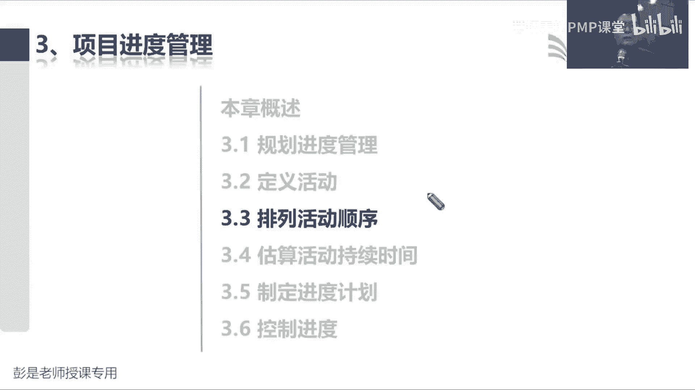
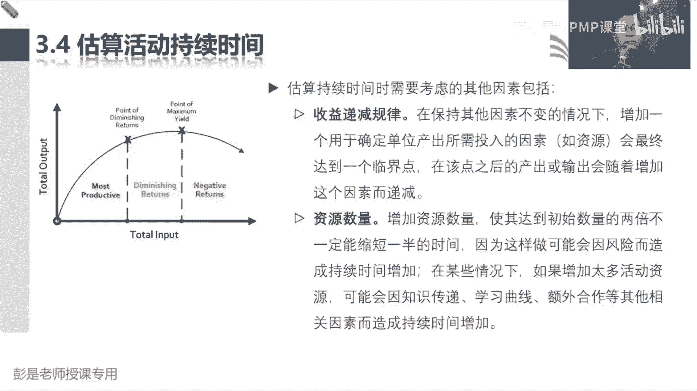
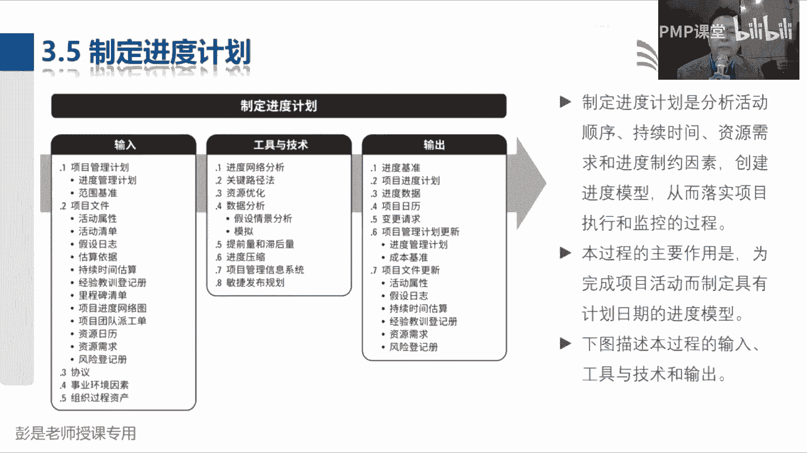
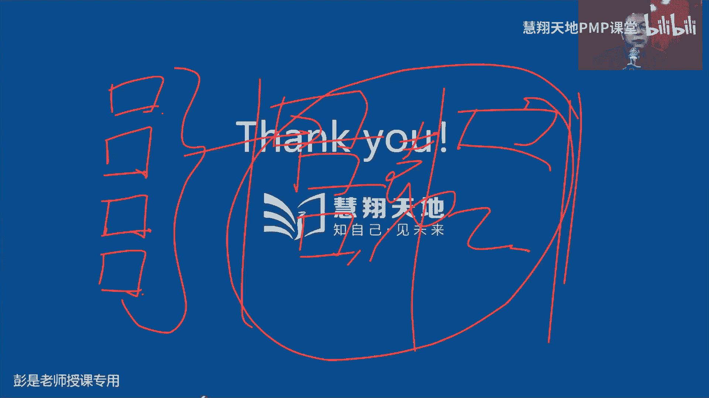
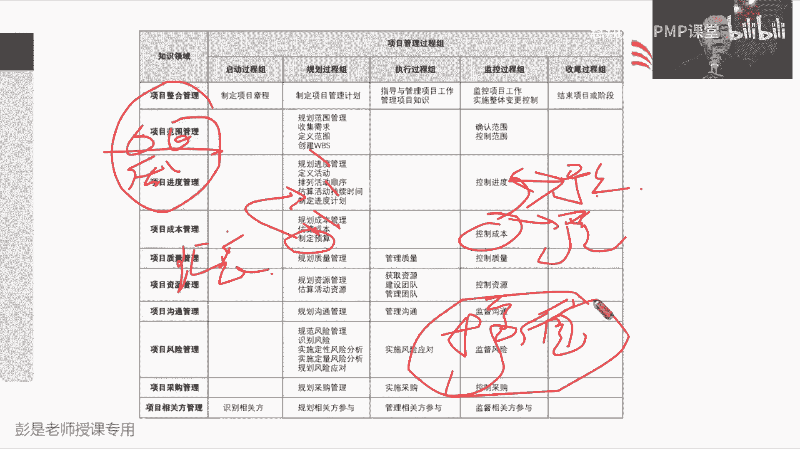

# PMP考试培训课程第1-13章节免费完整版 - P8：第六章：项目进度管理 - 慧翔天地PMP课堂 - BV18y421e7ut

好那咱先回顾一下啊。

看看之前都讲了啥东西啊，说五大过程组启动规划，执行监控，收尾就带出来六个关键词，说作为一个项目的项目管理者呀，第一我们要有章程，章程告诉项目团队，我们到底要做什么事，你们要说清楚项目的目的目标。

成功标准，退出标准总体要求，然后说清楚项目经理是谁，有了这个方向之后呢，项目经理啊，我们思考诶，我们怎么把这个事儿干完呢，所以有了制定项目管理计划，这个管理过程。

制定项目管理计划就是整合各种各样的子计划，我们有九个知识领域的子计划，还有三个单独的计划，需求变更和配置，还有三个基准范围基准，进度基准，成本基准，还有一个绩效产量基准，有了这一大堆东西。

我们就可以按照这玩意儿去干活，然后产出我们的可交付成果，所以接下来执行过程组就有了指导与管理，项目工作，按照计划完成工作，产出我们的可交付成果，那有了可交付成果呀，我们在工作的过程中。

通常需要监督和控制这个事干得怎么样，还要管理好各种各样的变更，所以呢有了监控项目工作和实施整体变更控制，这两个管理过程监控项目工作，出工作绩效报告，实施整体变更，控制管理所有的变更。

最后呢一旦我们通过验收，就可以结束项目或阶段做收尾，该总结的总结，该归档的归档，该移交的移交，郑和这一仗下班了，在此基础之上再增加一个最后管理项目知识，在执行过程组，意味着。

我们要记得尽量的想办法避免知识的流失，所以呢我要不断的总结经验教训，形成经验教训等内测，所以就带出来五大过程组，六个关键词，整合这张七个管理过程，那接下来负责范围的同时开始上班了，负责范围的同时啊。

首先我们去收集需求，得到了需求文件，根据收集到的需求，我们来定义范围去思考啊，我们这个产品有啥功能，需要完成什么工作，都需要交付什么样的成果对吧，你如果客户让你做一个软件，那叫思考了，这软件有啥功能啊。

为了交付这个软件都需要开展什么样的工作呢，对吧，培训啊，测试啊，安装啊，部署啊，发布啊，那都有哪些可交付成果的代码，程序设计文档，设计资料诶，需要把这些东西都说清楚，避免扯皮，所以就有了产品范围。

项目范围和可交付成果，另外呢这些东西验收需要有一个验收的标准，最后呢可以划清边界，写一个除外，责任范围说明书就搞定了，说清楚我们到底要完成什么工作，到底要产出什么成果，到底这个产品有啥功能。

那把范围说明书定义好，新定义清楚之后啊，接下来我们创建WBS，就根据我们的工作，根据我们的成果，把特别大的工作变成小工作，特别大的成果变成小成果，看不到的同学刷新重新进，所以就有了WBS这种分解结构。

把工作把成果进行进一步的细分，便于我们管理和控制，便于我们估算时间资源和成本，便于分工，便于协作诶，以此类推，好处多多呀，那创建WB有了WBS之后啊，还要写一个文档去描述每一个小方块。

它的范围进度成本质量资源各种各样的要求，就有了WPS词典，咱接下来把范围说明书，WBS和词典绑定到一起，让关键相关方一审批，一审批就得到了范围的基准嗯，那有了范围基准规划范围的同时就下班了。

他接下来需要做的事就就两件事了，一个叫确认范围，一个叫购置范围，确认范围是对我们的工作，对我们的成果进行正式的验收，客户看看这个玩意儿是不是符合他的，他的要求，是不是满足验收标准。

控制范围呢是确保确保没有人画蛇添足，没有人节外生枝，来确保坐且请坐坐且请坐嗯好这就是范围这章，然后在最后加上一个头，就是规划范围管理，因为后边这堆工作经常容易出现问题，咱就需要提前想想范围到底怎么管。

需求到底怎么管，所以规划范围管理，输出范围管理计划和需求管理计划，这就讲到范围之章了，那接下来负责进度的同事开始上班了，负责进度的同时啊，我们怎么怎么干活呢，我们是找到刚才你们定义好的范围的基准。

看看范围基准啊，WPS最底层最底层最底层的就称之为工作包，我们找到范围基准里边每一个工作包，接下来去思考了，咱怎么把这个工作包给它做出来呢，就需要做12345什么事呢，他就得到了活动清单。

这个管理过程就叫定义活动，定义活动去分析一下，怎么把这个工作包对应的工作或者是成果完成，去思考需要执行哪些一系列的步骤，这些一系列的步骤就称之为活动，那有了活动之后。

接下来我们马上讲到的就是排列活动顺序，他更关注的是分析啊这些活动啊，先做啥后做啥，哪些活动是串行的，哪些活动是并行的，去分析这些活动之间的逻辑关系，依赖关系，然后呢。

最好最好最好用图形化的方式把它展现出来，呈现出来，所以排列活动顺序，这个管理过程输出叫进度网络图，那排排完活动顺序，接下来我们就要思考了，这个活动需要多长时间呢，这个活动需要多长时间呢。

嘿就需要去估算活动的时间，那估算活动时间上就可以说了啊，估算时间，估算时间它取决于一个前置条件，叫估算活动资源，因为资源数量的多少，会直接影响到活动持续时间，所以接下来就有了这一章，目前我们讲到这了。

还看不到课件的同学再看看，检查你的手机，检查你的网络。

咱课上也不能解决这个问题啊，问班主任马上私信班主任，打电话，问班主任，我也不知道咋解决啊，好所以接下来排列活动顺序，这个管理过程是分析先做啥后做啥，分析完了之后呢。

估算活动是持续时间之前需要先估算活动资源，因为三个人五个人工期不一样，那咱排完活动顺序，估算好了，资源，定义了活动，估算了时间，万事俱备，接下来就可以制定进度计划，做我们的进度表，做我们的进度表。

告诉老板，我们第一周，第二周，第三周分别做什么事情，哪些工作是串行的，哪些工作是并行的，然后大家一旦敲定所有的具体日期，具体的时间就得到了进度基准好，那咱接下来讲3。3，排列活动顺序，排列活动顺序。

这个这个管理过程啊，它的输入没啥需要去记的输出，唯一需要记住的就是这个进度网络图，因为我们需要通过图形化的方式，把这些逻辑关系给它呈现出来，有图有真相，看起来更直观，那这张图到底怎么画呢。

需要大家掌握的就是123这三个方法，第一个叫紧前关系绘图法，简称pd m颈前关机维度吧，到底怎么画，大家可以直接先看PPT啊，咱先看输出，未来稍微复杂一点的管理过程，大家一定是这样学啊。

大概了解了这个管理过程做什么事，然后先去看输出，先去，尤其是什么WBS啊，进度网络图啊，项目进度计划呀，这种以图形化方式呈现出来的成果，一定先看图，然后去了解它的意思，那3321进度网络图。

活动A和活动B是什么样一个关系的，靠猜的活动A和活动B他俩是什么关系呢，四个单词大家判断一下啊，四个单词呃，其实两个单词开始和完成，就这两个单词排列组合，有的活动是前一个活动完成，后一个活动开始。

有的是同时开始，有的是同时结束，有的是开始到完成，所以活动A和活，活动A和活动B这种画法就是活动A完成，因为箭头是从活动A的右边出来的尾巴出来的，然后他顶到了活动B的脑脑袋上，所以它就叫完成到开始。

它意味着活动A结束之后才能够开始，活动B去牛肉面馆吃饭，交完钱才能够去吃饭，交完钱才能够去吃饭，下完单才能够去去，等餐去取餐，以此类推诶，他是前置条件，那以此类推了，活动B和活动C就是开始到开始。

活动B1开始活动C就可以开始了，活动B1开始活动C就可以开始了，它意味着它意味着他俩的关系是这样一个关系，那活动H和活动C又是什么关系呢，是完成到开始，是完成到开始。

需要等到活动结束之后才能够开始活动C，所以就是通过这样的图形图形化的方式啊，我们就发现了活动C要想开始，它有几个前置条件，两个吧，他需要等到活动B开始，并且活动结束，这两个条件都满足，才能够开始活动C。

那像活动C这样的东西，我们把它起了个名字，它叫啥呢，两个单词大家猜啊，一个叫汇聚点，一个叫分支点，这就好猜了吧，他叫汇聚点诶，路径的汇聚点，路径的汇聚点，那什么是路径呢，有没有玩过那种走迷宫的游戏啊。

就按照箭头的方向从开始走到结束，它就代表着路径，从开始走到A走到B走到H，这是一条路，从开始走到A走到B走到C走到D走到E，这是第二条路，从开始走到H走到C走到D走到E，这是第三条路，以此类推啊。

我们在网络图里面可以找到很多，很多很多的路径，那接下来我们通过这张图就可以发现，有一些路径存在着汇聚点，因为活动C要开始，他需要满足两个前置条件，第一是等到活动一开始，第二是要等到活动结束。

那这种东西它意味着啥，这两个条件都满足，它能够才能够开始啊，这意味着什么呢，不好猜哦，友情提示，前置条件越多，意味着这事越简单，还是复杂了，复杂了吧，哎所以它其实就意味着风险点，这就是风险浪。

活动B万一有了延误，万一有了推迟活动，是万一有了问题，唉活动C可能就没有办法正常开始了，它就意味着风险点，好知道这个能想到这就可以了啊，那再看活动K活动K啊，然后有同学说。

AHK是项目中同一时间开始的吗，不一定不一定啊，好活动K活动K他完成完成之后可以开始活动，活动K完成之后还可以开始活动了，那这叫啥，刚才活动C这叫汇聚点，那活动K就叫分支点，分支点这也意味着啥呢。

刚才C是容易受到多个活动的影响，那活动K就会影响到多个紧后活动，它也意味着风险点，所以实际上通过这种去分析啊，这些活动之间的各种各样的逻辑关系，是谁完成谁开始，还是开始开到开开开始还是完成到完成。

去分析逻辑关系，然后把这张图画出来，画出来之后呢，我们就可以发现各种各样的汇聚点和分支点，无论是汇聚点还是分支点，都意味着风险点，便于更直观的去分析啊，这些活动会不会影响我们的交付日期啊。

万一会影响能咋整，便于更更更方便的去找到这些风险因素啊，这就是排列活动顺序，画这种网络图最好最好的最重要的作用，找风险，那知道了这个大概意思啊，再看中间的工具基础，第一个工具就是刚才这种绘图方法。

叫PDM颈前关系绘图法，因为我们是说先先做饭，做完饭，然后才能够吃饭，吃完饭才能够刷碗，刷完碗才能够去刷手机，诶，我们就是按照这些活动，通常按照这种惯性思维，从前到后，从前到后，所以叫颈肩关系会读吧。

这是第一个工具，它着重去分析他们到底是什么样的逻辑关系，完成开始完成开始开始，完成这这两个单词排列组合，那第二个工具啊也需要大家掌握，但是咱现在先不不不详细展开讲啊，确定和整合依赖关系。

它其实四个单词内部依赖，外部依赖，强制依赖，选择依赖，嗯他去分析活动之间的这这四种依赖关系，它的目的是什么呢，中心思想啊就是能串行的就串行，能并行的就并行，他是分析这样的事情。

串行和并行就是不买火车票能上火车吗，10年前是可以的，可以的，现在不行了吧，不买飞机票，不让你上飞机啊，诶那他一定就是完成到开始，对不对，它是串行的关系，那你说各位同学，早上早上起来是先洗脸还是先刷牙。

这随便了吧，有的人是先洗脸后刷牙，有的人先刷牙后洗脸，有的人是同时洗脸和刷牙，有的人是不洗脸不刷牙，随便唉，这种教室能并行的就并行，甚至可以考虑取消掉的，唉这是第二个工具技术，它着重去分析串行啊。

并行啊，看看有什么强制的选择的，内部的外部的分析活动之间的各种各样的属性，这是第二个工具，后面还会展开说的啊，那第三个工具也需要大家掌握，但是这个工具啊字面意思能不能猜出来呢，啥叫提前量，啥叫斥候量。

提前量，春节打算回老家，1月30号大年30，大年大年30放假，打算回老家，是当天去买票吗，不是吧，要不要提前买呢，这不就是提前量嘛，对不对，提前多少天就开始买票了，开始抢票了吧，哎这就是提前量啊。

对不对，所以提前量提前量他才需要做，做好一些活动之间的提前量，可以可以有效的帮助我们缩短时间，缩短工期，那滞后量呢，提前量如果是减对吧，说提前15天就要开始买票了，用减号来表示滞后量，就是加号。

那之后量是啥意思啊，是不是需要等一段时间能想到什么场景，能想到什么场景需要等一段时间，什么情况下需要等一段时间呢，飞机延误啊，不是飞机延误，那是客观性的哎，烧水肯定是水烧开了，能不能直接喝，这容易挂掉。

容易嘎掉哈，需要等待一段时间吧，水烧开了，等5分钟，等它凉了，你再温度差不多了，你再喝，对不对，刷油漆之后不能马上去做，需要等一段时间，等它风干，浇完水泥不能马上去划线，需要等水泥风干，以此类推啊。

他就是要知后量诶，之后量往往往往来源于客观限制客观因素啊，这就是他就去分析我们网络图里面，什么东西需要减，什么东西可以需要加，所以再看再看刚才那个输出，那FS加15。

这就意味着活动活动F活动F2完成之后，需要等15天才能够开始活动，G那活动1H和活动外就是活动是开始之后，需要等十天才能够开始活动，I嘿，就通过网络图，把刚才我们说的这些东西串行并行啊，完成开始啊。

提前量，滞后量都给它呈现出来，便于我们一会儿去去分析，项目到底需要多长时间把它才能结束，这就是这个管理过程需要大家掌握到这个程度，工具123输出一输入，不需要记其他的乱七八糟，不太需要大家具备了。

这三个工具一定要掌握，因为这三个工具是其他管理过程用不上的，它是排列活动顺序专用的工具，虽然到最后一会制定计划，制定进度，计划控制进度去，还会用还会用啊，但是它考点一定是在3。3里面好。

知道了这么这么这么一些背景背景知识点之后，再看后面这段文字，基本上阅读一遍差不多了，除了首尾两项，每项活动至少有一项紧前活动和一项紧扣活动，并且逻辑关系恰当，首尾两项是啥呢，就是那个那个网络图里面。

第一第一个活动是开始，最后一个活动就是项目结束，除此之外，哪怕我项目里面只有一个活动A，他仍然有一个紧前仍然有一个紧后，哎这就是这句话想说什么，一这么一个意思，然后后边巴拉巴拉就不定了啊。

记住这个管理过程最重要的作用作用，它的目的是把活动列表转化为图，有了图表之后，我们可以更直观地分析路径啊，分析工期啊，分析风险因素啊，以此类推，所以这个管理过程输入没有什么需要记得了。

然后输出3321项目进度，网络图示表示活动之间逻辑关系，依赖关系的图形，巴拉巴拉，刚才不念了啊，再往下翻，后面就接应该有那个，找到这一条段带有多个颈前活动的活动，代表着路径的汇聚点。

比如说活动C而带有多个紧后活动的活动，则代表着路径的分支点，比如说活动K那无论是汇聚点还是分支点对吧，能够影响多个紧后活动，或者是受到多个紧前活动的影响，都意味着风险，这一段超重要，一定要记住。

这个汇聚分支意味着风险，然后文件更新，没有什么需要大家去掌握的新知识啊，接下来3。4，估算活动持续时间，这个管理过程，至少至少一定要记住资源数量的多少，资源的水平，资源的等级会直接影响到活动持续时间。

三个人，五个人做这顿饭的时间不一样，三个会做饭的人和三个不会做饭的人诶，他的水平不同，他的等级不同，也会影响到活动的持续时间，所以这个管理过程，它收入虽然看起来罗里吧嗦一大堆，不太需要大家具备。

你就牢牢记住一个必要的条件，就是资源资源需求，你要告诉我现在有多少人，多少人可以使用，我才能知道这项工作大概多长时间把它结束，然后这个管理过程它的输入还有一个玩意儿啊，叫资源日历。

资源日历这个这个也是超重要的一个玩意儿，但是它到底是哪个过程的输入输出，根本就不重要啊，不需要去背他到底是谁的输入，谁的输出，不需要去记住，但是我们要知道资源日历最重要的作用，那什么是资源日历呢。

资源的日历，资源的日历，这把元元旦元旦我想我想去海南，现在打开app看看还有没有飞机票，这是不是一种资源日历，告诉你什么时间什么航班对吧，哪一天哪个航班还有多少张票诶，它体现的是资源的可用性。

体现的是资源的可用性，那其实对企业来说对吧，我们的设备啊，设施啊，包括我们的人呐，大家最好最好最好都有一个档期，对不对，都有一个时间的排表啊，便于我们随时的知道大家谁忙着，谁闲着，谁在做什么事。

体现这些资源的可用性，以此类推了，就像咱们现在在上课这天这天这间会议室，这间会议室被咱们今天占用了诶，他对其他人来说就不可用，但是呢明天可能没有人订立联会议时，他可能就显示空闲，这样的人家就知道。

明天这个这个会议室可以用了，它最重要的作用就是体现资源的可用性，所以包括大家什么买电影票，买飞机票，买火车票，还有各种各样的app app，它呈现的形式其实都叫资源日历，它就体现资源的可能性。

还有没有票，还有没有票，以此类推，那接下来他的输出3。42，估算活动持续时间，估算活动持续时间的输出，其实不需要大家去背了，因为你看名字，这玩意儿很难猜错，想猜错都费劲呢，它就叫持续时间，估算只有3。

4，在估算活动的持续时间，所以它的输出不需要掌握，不需要掌握，那需要掌握的就是方法，工具类比，估算参数，估算三点估算，自下而上估算这四个玩意儿一定要记住，非常非常高频的考点。

好后面讲工具技术的时候再展开说，现在先大家专心听，专心听，快速的给大家大概说一说这四个，这四个东西是什么鬼，类比估算的特点是什么呢，去年公司开年会花了10万块钱，今年公司开年会。

我觉得差不多也是10万块钱，这种估算方法就叫类比估算，这种估算方法就叫类比估算，参数估算的方法是什么呢，去年公司开年会，人均消费100块钱，今年到底多少人，我要数一数，数完了之后。

我经过计算才能够得到估算的结果，这种估算方法就叫参数估算，所以他俩的本质区别就是是否还需要经过计算，是否需要经过用公式啊，用模型啊，诶因为参数参数，我们参考的是以前的信息的某一个变量，对不对。

参考的是以前历史项目的变量，或者是或者是参数参考的是变量，变量就需要经过计算，重要需要通过统计，需要通过分析才能够得到估算结果，这是这两种估算方法的本质区别，类比估算是参考历史数据直接得到估算结果。

参数估算呢还需要经过计算，还需要经过计算啊，所以各种场景啊大家都能够举一反三了，我老板跟我说，给你多发多少钱，这就叫类比估算对吧，这个月算算你出勤多少天，然后一天多少钱。

咱来噼里啪啦一顿算才能够得到估算结果，这就叫参数估算，那三点估算它的特点啊，是考虑的风险，考虑风险，我们在估算活动持续时间的时候，如果这个时间不稳定，时间不稳定，就和大家有时候上下班这个时间是一样的。

从家到公司到底需要多长时间呢，快的时候可能是30分钟，慢的时候可能是90分钟，大多数情况下可能是60分钟，他有时候快，有时候慢，意味着它不确定，意味着它意味着它不稳定，这种情况下。

我们可以考虑用三点估算一个贝塔分布，一个一个三角形分布，这后面会单独再说了，那自下而上估算它通常适用于什么场景呢，这种方法它其实是一个大道理，超级大的大道理，看PPT，三点估算啊。

适用的场景我就随便找一个空白页去写了啊，都不太空白，就这了三点估算是个大道理啊，咱在项目章程里面有没有项目的总体工期要求，有吧，但是他准不准呢，不一定了吧，唉那为了得到更精准的项目工期。

所以我们做了大量工作呀，收集需求定义范围，创建WBS，有了WBS，基于WBS，有没有可能得到一个总体的粗略的时间呢，可以的对吧，装修多少多长时间，设计多长时间设计施工装修，还记得我们这牛肉面馆吧。

设计工作可能一个月，然后施工工作大概两个月，装修啊，给你一个月好，我们这个项目牛肉面馆四个月就搞定了，它仍然可以得到时间信息，但是呢不一定准，为了更精准，所以才有继续，我们定义活动，得到了活动清单。

然后估算完成活动所需要的资源，有了资源之后呢，我们再来估算活动持续时间，一会儿我们做智力，做那个进度表，才能够得到更精准的项目的具体具体的工期，这种方法不就是自下而上嘛，对不对，因为因为层级越高。

信息可能越粗略，它不精准，所以当我们发现这个估算结果不精准，不精准，不准确，没把握的时候，我们就做了分解，从范围就开始分解，到了进度，仍然在做分解，还通过分解之后把它渐进明细，把它下沉到下沉到具体的。

具体的可管理的这种细节的层面上，再去估算结果，这样呢估算的结果相对来说准确度会有所提升，这就是这个工具它存在的价值，所以考试的时候超简单啊，当我们看到说对估算结果没把握，没信心，觉得不靠谱。

那我们就考虑做进一步的分解，再分解某一个活动，张三跟你说，他需要十天，你说你有多大把握，他说我不确定怎么办呢，继续把大活动再分解拆成更小的活动，分别估算，估算完了再汇总回来，就可以得得到更精准的结果。

它就是这种方法存在的意义，再听一听，然后备选方案分析没什么好讲的啊，储备分析这非常关键嗯，储备分析仍按时先听一听，储备分析主打一个什么呢，他要考虑啥呀，要考虑啥，所以接下来还停场景，公司规定九点钟上班。

公司规定九点上班啊，百度百度百度导航提醒我说，冯老师啊，你从家开到公司需要一个小时，好那我八点出门合适吗，这么做容易有啥呢，容易有啥呀，哎卡着点八点出门，反正导航告诉我一个小时就到了，九点钟就到了。

意味着可能有风险吧，可能会迟到啊，嘿那我们要去想了对吧，都有哪些风险点呢，比如说收费站可能会堵车，比如说公司楼下可能找不到停车位，比如说走到走到公司楼里边坐电梯，可能也需要等好几波啊。

这样吃早餐需要排队啊，好这些东西对我来说都是已知的东西，已知的东西啊，我需要额外准备一点点时间，这个时间我们把它称之为啥，已知风险需要准备一些应急储备，针对这些已知的风险。

我们要考虑是不是要准备一些应急储备，收费站可能会堵车，哎，那我提前5分钟对吧，楼下找不到停车位，我再提前5分钟等电梯，可能也需要，也需要一段时间，那我再准备5分钟，以此类推，面对这些已知的风险。

我们可能要考虑准备一些以应急储备，这么做就一定安全了吗，还要考虑啥呢，哎那已知已知除了已知之外，就有一些意外了吧，想不到的事情想不到的事情就是意外呀，那就称之为未知风险，未知风险，那我要为了稳妥起见。

我再提前10分钟出门，这10分钟把它称之为啥呢，它就叫管理储备，就这么一对单词，一对好朋友，所以看到储备分析就想到啊，已知风险，应急储备，未知风险，管理储备，现在我们在规划过程组，估算活动持续时间。

那就要思考了，需要准备多少应急储备和管理储备，非常重要的一个考点，这就是储备分析，好所以进度这一章啊就是主打一个工具，每个管理过程都有一大堆，一种非常非常关键的重要的工具啊。

好所以类比估算参数估算三点估算，自下而上估算储备分析，看到这些单词能够反应过来它适用于什么场景，类比估算了，直接出结果，参数估算呢参考历史数据，参考什么单位，什么什么参数变量，经过计算才能得到估算结果。

三点估算呢考虑到风险，自下而上说估算结果如果觉得不靠谱，再继续细分储备分析，考虑风险，然后额外准备一些时间，应急储备，管理储备好，再往下翻翻翻翻，说这个管理过程说依据的信息不念了，就取决于什么资源。

资源资源就记住这么一句话就可以了，资源的数量，资源的水平，资源的等级，甚至资源的可能性，都会影响到活动的持续时间，然后后面这句话说，应该由团队中最熟悉具体活动的个人和小组，提供持续时间。

估算所需的各种输入，这句话变成大白话，就是说什么意思呢，就是说呀估算活动持续时间，A选项专家，B选项干活了，谁给出的信息可能更靠谱，谁给出的信息可能更靠谱，这时候就这样考对吧，谁干活谁清楚。

谁最熟悉这个活动，谁给出的意见才最准确，最可信的，对不对，不要听专家的啊，专家不一定有这个具体的，具体的详细详细的详细的知识啊，好那管理储备一般预留多少呢，送给0021同学，三个字叫啥。

管理储备一般预预留多少啊，三个字叫啥，看情况，它取决于啥，复杂程度啊在在既然它是应对风险的，就是取决于它的确定性了吧，对不对，如果手拿把攥的事情对吧，我天天坐地铁，天天坐地铁啊。

他就这个时间是相对来说比较稳定，那我可能甚至都不真的不需要准备管理储备，对那你说去一个从来没去过的地方，你要不要准备呢，可能是不是需要多准备一点了，对不对，以此类推，到了看情况取决于这个事情。

我们的熟悉程度，确定程度对吧，一些什么探索性的活动，创新类的活动，那你没把握，可能需要多准备一点，管理储备，15%甚至20%左右，通常大多数项目啊，基本上不不在活动层面上准备管理储备。

基本上就是整体对整个项目工期，准备个5%，10%左右差不多了，取决于这个东西的确定程度啊，好那接下来，说我们应该估算资源，巴拉巴估算，然后再估算持续时间，然后呢这咱都知道了，因为这个玩意儿。

这玩意儿这玩意儿它的什么数量啊，技能熟练程度啊，这大家基本上都能看懂了，不讲了，然后像这种东西啊，也听一遍就可以了啊，有时候因为工作的特性，无论资源分配多少，比如二十二十四小时的应力测试。

都需要花一定的时间才能够完成，变成大白话，就是说24小时的应力测试，就一定要做满24个小时，和资源数量的多少没有因果关系了，对不对，你十个人，八个人，100个人，1000个人。

1万个人他都需要做到24小时，他最最好理解的场景就是，怀孕对吧，是十个月才能把小孩生下来，两个孕妇有没有可能五个月呢，不可能不可能，这就叫客观限制，好了解就可以了啊，现在这种细节性的信息啊。

基本上不大会考，但是大道理一定会考，比如说上面这一段资源的数量水平等，极易熟练程度，会直接影响到工期的长或者是短，这肯定需要掌握好，然后再往下说，收益递减规律和资源数量，这两段话，这两段话大道理是啥呢。

先专心听看PPT收益地点和资源数量，它的大道理是这样的啊，等我换黑板。

什么叫收益递减，什么叫收益递减，字面意思啊，收益越来越小，收益越来越小，所以它其实是我们生活工作中普遍存在的现象，我吃第一个汉堡的时候满足感超强，是第二个的时候还那么幸福吗，吃第三个吃第四个。

吃第40个嘎了，诶，我们就会发现，获得的收益是在一直一直一直往下走的，能听懂吧，所以它适用于各种场景啊，就像各位同学学习健身跑步都一样对吧，跑第一小时，第一公里的时候还可以，第2km，3km。

第4km跑得越多就挂掉了，那为什么有这样的现象呢，为什么有这样的现象，我们需要代入到项目场景里去掌握这个知识点，比如说啊说让张三，来我们小区做核酸检测，张三来我们小区做核酸检测，一天还需要工作八小时。

八小时他可以完成，随便说了啊，100人的核酸检测，现在啊我们为了缩短工期，安排个李斯和他来配合，安排了李四和张三来相互配合，那大家工作中是不是需要一点点时间去沟通，去交流，去协调，对不对。

需要占用一点点时间去做一些叫非生产，非生产性的工作，就是没不再做核酸，再做别的事情，不再做核酸了，做核酸检测，这是生产性的工作，然后什么交流啊，沟通啊，培训啊，协调啊，甚至吃饭啊，唉这都叫非生产时间。

那安排了李四和张三两个人搭伙来干这个事情，大家就需要花一点点时间去做一些沟通交流，培训，协作指导这样的事情，那我们的生产时间就变长了变短了，变短了，可能一天去干活的时间就变成了七个小时，50分钟。

需要花10分钟去和去和张三李四，让他俩之间相互沟通协调，那以此类推，是不是有可能安排的人越多，我们的非生产时间就会越长呢，想一想，两个人沟通可能一分钟搞定，20个人沟通可能需要10分钟。

200个人可能需要15分钟，2000个人可能一小时，以此类推啊，人越多，人越多，就需要花更多的时间去沟通，去协调，这都叫非生产时间，所以我们就会发现啊，随着不断的增加资源，随着不断的增加资源。

我们一天工作八小时，这个时间长度非生产时间就会变得越来越长，那生产时间就会变得越来越短，生产时间越来越短，也就意味着我们的生产率，实际上是在上升还是下降的，下降了，唉这就是收益在递减，对个人来说。

对个人来说，我们的收益是递减的，因为每个人的生产率实际上是在下降的，不断的增加资源，增加资源就会导致个人的生产率下降，这个道理还能跟得上吗，那搞定了个人之后，我们再看整体，再看整体啊，看整个团队。

一个人八小时可以做100人的核酸检测，两个人八小时能不能坐200人呢，可以吧，没问题啊，对，那20个人，八小时有没有可能做2000人的核酸检测呢，还还觉得很有可能哈，20万人八个小时。

有没有可能做2000万人的核酸检测呢，20万人进我们小区，八个小时都不一定够能听懂了吧，所以我们会发现呢，随着不断的增加资源，我们整体的产出整体产生化，再增加再增加再增加，我们总能找到一个临界点。

过了这个临界点之后啊，总体产出就开始下降了，所以最后就变成了这样，两张两个两个两个线看PPT啊，对个体来说，对个体来说和对团队来说，整体来说就有了这样的规律，对整体来说，我们的产出。

我们的产出啊是先增长，然后再下降，总能找到一个临界点，过了这个临界点之后，整体的产能就会开始下降了，因为人太多了，人太多了，对不对，我们需要更多的时间去去去消耗，去培训啊，沟通啊，交流啊。

就大家期待比较火啊，什么什么企业内耗好，那对个人来说，对个人来说，为什么整体有这样的现象呢，就是因为不断的增加资源，导致每个人的生产力都在下降，因为我们需要更多的时间和大家去沟通，去协调。

就导致非生产时间越来越长，生产时间越来越短，那如果我们还想顺利的完成任务，这就是大家目前工作状态，叔叔这团队这么多人，我们需要更多的时间去开会，去沟通，去协调，去交流，就找导致我的活干不完。

那你要怎么办呢，这道差加班对不对，所以大家日常工作模式基本上都是这样啊，白可能今天一上午啥事都没干，开会呀，沟通啊，交流啊，撤离呀，哎那导致花了四个小时干这些乱七八糟的事情。

然后就晚上只能含着泪默默的去加班了，因为不加班，这活儿你根本干不完的，就就有了996007，以此类推了，好知道这个中心思想之后，再看这段文字，相对来说就比较简单了，没啥东西了。

所以这两段文字啊，大家读一读，知道这个意思就可以了啊，收益地点在保持其他因素不变的情况下，增加一个用于特定单位产出所需投入的因素，比如说增加资源，不断的增加资源总能找到一个临界点，在该点之后。

产出输出会随着增加这个因素而递减，你就把这个场景想到极端对吧，说一个护士八小时可以做100个人的核酸检测，那我们投入100万个护士，有没有可能让这100个人的核酸检测，毫秒级的一毫秒就把它完成呢。

不可能啊，不可能啊，100万人给大家带口罩，八个小时都不一定能带得完，就以此类推了吧，总能找到这样一个临界点，那为什么有这样的收益低点这样的现象呢，资资源数量，这段文字就在描述这个东西，说我们增加资源。

因为这句话在某些情况下增加太多活动资源，增加了资源就需要相互支持传递对吧，张三叫李四，李四交往五，然后呢，还有什么考虑到学习曲线，大家需要额外的沟通交流合作，开会写文档，写资料，以此类推。

这些就会因为这些因素，导致我们的非生产时间增加，非生产时间增加了诶，正儿八经用来干活的，生产时间就会变短，生产时间变短就需要加加班，可能会反而导致活动的持续时间增加，知道这个意思哈就可以了。

这段能看懂就不要再看了，能看能听懂就不要再看了这篇文字了哈，好后面这两个东西也是比较重要的，但是呢没啥东西，技术进步，纯粹的字面意思采用新什么新兴的工具，新的工艺，新的方法可以帮助我们有效地提高。

提高工作生产率，然后缩短时间，那接下来就不得不说，大家每次备考都需要强调的这么一个玩意儿了，叫员工激励，作为项目经理，我们还需要了解学生综合症和帕金森定律，学生综合症是什么呢，这叫拖延症，这超好理解。

大家想一想自己上学的时候，尤其是什么寒假作业，暑假作业，你是第一天放寒假就开始正儿八经，老老实实写作业吗，大多数孩子基本上不是啊，不是啊，学霸忽略到这段话，你们太牛了，我反我反正不是这样的啊，对不对。

放寒假喽，第一周五二，第二周玩二，第三周五二，第四周五二，还有一周开学了，抄，就这就这么干吧，诶那这种现象放到工作中合适吗，不合适不合适，所以提醒我们啊，赶早不赶晚，赶早不赶晚啊，为什么呢。

那帕金森定律帕森帕金森定律啊，这个定律不是那个不是那个帕金森症啊，不是那个帕金森症啊，帕森帕金森定律，后者指出，只要还有时间工作就会不断扩展，直到用完所有的时间，像寒假作业，暑假作业他不可能老师安排说。

他每天寒假作业需要把它做满八小时对吧，他不可能给你安排八小时的，八小时的这么大的工作量，但是工作有没有可能让你像做寒假作业这样，一样轻松呢，每天干1212个小时诶，这班基本上摸摸鱼，划划水就过去了。

不可能吧，所以就像左边那张示意图，上半部分是我这一周的这周的工作安排，然后呢，我一着急就想啊，这活儿不着急啊，你看半天半天半天半天半天，基本上半天就搞定了，那就不着急，周一不着急，周二不着急。

周三不着急，周思想明天加加班，明天加加班，基本上一通宵就搞定了，也不着急，就把事情不断的不断的往后拖，但实际工作中有没有可能老板让你这空着，这空着这空着这空着这空着不可能，对不对。

所以很可能到了周二又来了新的任务，到了周三又来了新的任务，到了周四又来了新的任务，让你拖，让你拖，让你拖，嘿只要还有时间，就会不断的不断的有一些其他的工作安排，对不对对对，对一些不良的企业主来说呀。

甚至要考虑啊，把你的晚餐时间都给他安排满了，嘿所以就是工作会不断的增加，工作会不断的扩展，所以这两段话最后就提醒咱最后一个大道理，这叫赶早不赶哇，这些活儿啊能尽早开始的，尽早把它去结束掉。

因为没有人会等你，不可能让你空闲，不可能让你空闲啊，对不对，所以不要拖不要拖，拖到最后质量很容易出问题，这段文字知道这个意思也就可以了，所以估算活动持续时间，这段这四个这四个知识点都是听完一遍。

不要再看了，不要再看了啊，好那再往下输入，找到刚才我们说非常重要的那个知识点，并且书上也基本上就一句话，到了制定进度计划会有更详细的描述，就叫资源日历，资源日历中的资源可用性。

它告诉我们在项目期间资源何时可以使用，以及可以使用多久，我想看看现在咱们上课的这间教室，明天后天大后天对吧，未来这三天可以可用不可用诶，那就打开他的资源日历，看看他什么时间被预定了，什么时间空闲。

什么时间维修保养，以此类推，它体现资源的可用性，然后资源需求，这段文字反而需要需要大家后面复习的时候，看重重点多看两遍啊，这段文字就在说为什么生产力是是下降，因为后面那个例如像某个活动新增资源。

或者是分配低技能的资源，那我们就需要增加一些额外的什么沟通啊，培训啊，协调啊，就会导致每个人的生产率下降，所以总体的输出，总体的产能反而是先增长后下降，总能达到一个临界点，那3。4这个管理过程的输出。

没有什么需要大家去记的东西了，基本上看名字很容易猜，并且呢这两段文字也没啥可解释的对吧，什么两周加起来两天，这都不念了啊，估算依据，估算依据它最重要的作用就是就是告诉证明，证明老板，我估算这个结果呀。

不是拍脑袋，我有出处，有依据，有来源，它体现这个东西的客观性，知道意思就可以了，它具体的文字也不需要大家去记得，不需要掌握太细了好，那文件更新就没有东西了哈，那接下来3。5制定进度计划，这个管理过程啊。

这么学这么学，先先看输出对吧，你一看输入输出工具这么老多就头疼，不疼不疼啊，先看输出，看PPT，因为我要写写画画了，好看PPT啊，这张图很容易看懂吧，这张图叫什么呢，横道图，横道图就像这玩意能体现啥。

这玩意儿能体现啥，带颜色的说明啥，我就不信你没见过这东西，你在什么电脑上看电影，有没有这个玩意儿，对吧，你玩游戏尤其一一打开，有没有这玩意儿诶，进度条啊，哎所以叫横道图，就按这进度条吧，能看懂哈。

那再看看啊，这不用解释了吧，这叫啥工作包好，那一点一是啥，开发和交付新产品Z是调查，工作包上班的员工上班的这叫啥来着，ca控制账户吧，因为他是管理者呀，他有下属啊，工作包是普通员工啊，对不对。

最底层的人就叫工作包，干活的人呐，工作包啊，工作包上面的，不管你是什么组长啊，主管啊，经理啊，总监啊，对不对，人家都是领导负责管理的，他就叫控制账户，所以一点一开发和交付新产品Z这是控制账户。

然后呢这个控制账户下面有三个工作包，叫组建一组件二，然后集成组件一和组件二，你随便带场景去理解啊对吧，比如说组件一是电脑组件，二是投影仪组件，工作包，三是把这两玩意结合到一起，让它能够正常工作诶。

所以左边是我们的工作包控制账户，右边呢我们能够看到这些工作包控制账户，目前的进展，目前的进度它就叫横道图，这叫横道图啊，也称之为什么甘特图没看懂啊，然后这张图呢完成组建一，完成组建二。

完成组建一和组件二的集成，开始新产品Z，完成新产品Z这都叫啥节点吧对吧，投影仪摆好了，投影仪调试好了，电脑摆好了，电脑调试好了，投影仪和电脑整合好了，可以开始讲课了，它都是一些关键事件，重大节点。

对不对，这就叫里程，这叫里程碑，开始做饭，饭做好了，开始吃饭，饭吃完了开始刷完碗，刷完了开始打麻将，麻将打完了对，以此类推，哎这就叫里程碑，这叫啥，里程碑控制账户工作包一工作包二。

工作包三工作包下面的这就是啥呢，设计组建一建造组件一，测试组件一，这三个事一完成工作包一对应的组件一就好了，所以这叫这三个玩意儿叫什么话，这三个东西就是我们的活动，完成这一系列活动工作包对应的组件。

对应的成果就出来了，就出来了啊，那右边能看到啥呢，完成到开始诶，能够看到这些活动的关系吧，先后顺序，逻辑关系，能不能看到活动的进度呢，可以吧，活动也可以有进度条啊，对不对，我做饭一共需要炒鸡蛋。

西红柿一共需要10分钟，现在打好鸡蛋了，现在洗好西红柿了，现在炒好鸡蛋了，现在炒好西红柿了，现在把他俩整合了，现在放完调料诶，菜做好了也可以看到它的进度，所以这张图就叫详细进度计划。

所以其实制定进度计划，这个管理过程最终的目的啊，就是把我们这些东西全都变成这张图，变成我们的进度表，你可以用excel用用project，用各种用项目管理信息系统，用各种各样各种各样的方式啊。

工具去把这张地图表给他做出来好，那艾茉莉同学说话，虚线是啥含义呢，随便找张图哎它就是示意啊，告诉你这是今天，对不对，告诉你这是今天考的那个横道图，你更好看啊，这样告诉你截止到今天应该走到这儿了。

我给你画，这是我炒鸡蛋西红柿，然后我媳妇在旁边计时说，你应该应该走到这儿了，但实际上我只走到了这，这意味着啥，已完成的部分，我给它填上颜色对吧，你看完的电影给它填上，填上颜色呀。

现在实际上我只完成了到这儿，然后这条虚线是应该走到这，这意味着啥呢，中间这一段意味着啥偏差，该干的活还没干呢，诶他可以非常非常直观的看到偏差进度偏差，所以这个数据日期它就是适宜啊，示意说到今天为止。

我们这些工作应该走到这儿了，填上颜色就代表着实际已完成的部分，结果呢就会发现目前的进度符合计划，对不对，那如果填上颜色的部分啊，超出了这条今天这条线意味着啥，唉提前了吧，比原计划完成的工作多。

比原计划完成的工作多，可以非常非常直观地看到进度的偏差好，那回到知识点啊，这个管理过程最终的目的，就是我们希望把什么里程碑呀，就这张最复杂的这张图，你把它看明白就可以了，其实不需要背啊。

这玩意就叫里程碑，看到里程碑的情况对吧，这个里程碑已经达到了，这个里程碑空白的还没达到，我们还能够看到控制账户，控制账户啊，就是它下面一大堆工作包的整体进度情况啊。

那我们能够看到控制账户目前应该走到这了，实际走到这了，符合我们的进度，那控制账户之下呢，我们还能够看到每个工作包的进展情况，这个工作包符合进度计划对吧，这个工作包还还没开始呢，因为当前时间刚走到这儿啊。

可以看到各个工作包的情况，再往下看呢，就能够看到各个活动的最底层的，这个细节性的信息了，能够看到活动的进展，活动的逻辑关系，好，知道这个大概意思啊，最后再加一个小细节是啥呢，这又是啥，等我换到这张图。

这个阶段一阶段，二阶段，三阶段，四是啥东西啊，把它变成什么，你可能看起来会更直观，周或者天变成时间刻度吧，第一周，第二周，第三周，第四周，第五周，哎，你就是不是大概就可以猜出来了，比如说工作报二啊。

这可能不到两周，对不对，工作包一呢可能需要两周时间，那我们整个开发和交互型产品Z，大概需要四周左右就能够看到，看到看到这些它的它的食持续时间了吧，就更直观更方便，他如果示意这么画，可能会更清楚啊。

上面这个阶段一阶段二你就把它变成时间刻度，编程时间刻度就能够更精更精准的去分析对吧，这个活动大概需要几天，工作包需要几天，开发交互型产品，Z整个这个公司账户把它完成需要多个多少天。

所以最终最终最终我们的目的就是，做出一个带时间刻度的，带时间刻度的进度表，然后呢跟老板敲定，老板对吧，问老板呗，我们10月1号开始开发新产品，Z10月30号完成这个新产品的开发。

您看看这两个时间点合适不合适，老板一旦说行，那接下来我们所有的时间点就全都可以敲定了，对不对，这就是制定进度计划，这个管理过程主要工作出进度表，敲定时间之后，它就变成了基准。

所以在call back回来看这这个管理过程，这张示意图啊，制定进度计划，我们要出进度表，进度表呢就叫项目进度计划，进度计划一旦敲定了，所有的具体时间和日期，就称之为进度基准。

因为我们要根据具体的时间日期，衡量项目的进度，10月1号要开工，当天你有没有开工对吧，10月2号你要完成工作包一，这天这天工作包一有没有结束，以此类推，我们通过具体敲定的日期来衡量，衡量我们进度的进展。

只是这个管理过程，这两个输出输入呢其实不太需要大家去背输入，你只要大概了解了前四个管理过程的输出，前四个过程啊，定义活动，排列活动顺序，估算活动资源和估算活动持续时间，因为这四个工作准备好，准备好。

都完成之后，我们才能够做到进度表啊，要有网络图，对不对，要有活动清单，活动属性，要有活动的资源，要有活动的时间，我们才能做这个进度条，进度进度计划，所以它的输入就是前四个管理过程的输出诶，3。

5的收入不需要背啊，然后我们休息一下，然后再讲，给大家大概介绍一下，中间这个这几个非常重要的工具好，现在时间是9。57，在休息8分钟，时间9。10。05，这是回答，还有十秒钟即将开始第二小段课程啊。

987654321好，所以这个管理过程啊，记得输入没啥区的，输出进度基准和项目进度计划，一定要记住，除此之外那个那个输出三啊，进度数据这玩意你根本就不用记，进度数据是什么东西呢，就是左边这一大堆输入。

因为你要想场景，你要想做好，做出来刚才那个进度计划对吧，比如说打开一个excel，打开一个excel表格，然后呢你要把活动啊，工作包啊都敲进去，然后需要敲这些活动的持续时间。

所以进度数据就是左边这一大堆输入，把这些东西输入到我们的工具里，输入到我们的我们的系统里就可以得到这种表，所以这东西不太需要去背啊，那第四个输出，第四个输出也需要大家掌握什么叫项目日历。

资源日历体现的是资源的可用性，那项目日历体现什么呢，项目日历体现啥时间的可用性，仍然需要听大道理听大道理啊，看PPT老板给我一个活儿啊，我给老板说，这项工作完成它需要十天，需要十天啊。

那如果我一周工作五天和一周工作六天，是不是最终的交付日期不一样的，把这个道理想明白就可以了，一周工作五天，我可能第一周干了五天，第二周干了五天，跟老板说，下周五交互，那如果是一周工作六天。

第一周工作六天，第二周再工作四天，诶告诉老板下周四就可以交货了，下下周四，所以项目日历体现的是时间的可用性，我们要去分析啊，咱项目到底一周工作几天呢，有的项目可能一天两班倒三班倒啊。

诶还可能要分不同的班次，所以这个玩意儿，这玩意儿我们要设定项目时间的可用性，最终叫交付日期可能就会受到影响，这是项目日历，它最重要的作用，全教材教日历的就这两个东西，一个是资源日历，一个是项目日历。

好这个输出需要大家记住它，那接下来中间的管理工具技术啊，工具技术现在我们先不展开讲，但是呢大概说一说它是什么意思，大概说一说啊，看PPT在在场景。

这个管理管理过程，需要大家掌握的最重要的工具啊，项目管理三大核心技术分解，关键路径法和政治分析，就是关键路径法，那关键通用法是啥呀，我现在有一个网络图，是这样的，项目开始，然后做饭，做完饭之后。

做完饭之后啊，张三吃饭，李四吃饭，他俩都吃完饭，我就可以开始刷碗了，碗刷好了，这个项目就完成了，这就是我简单的网络图，那根据网络图我们来估算活动资源，然后估算活动的持续时间，做饭需要5分钟。

张三吃饭需要5分钟，李四吃饭需要10分钟，刷碗需要5分钟，接下来提出这个小问题，这个项目需要多长时间能结束，这个项目需要多长时间才能够结束呢，那怎么去分析这个事情呢，就两步走，第一步叫啥。

刚才我们说在网络图里边，我们要找路进去找路径了，那我们现在能找到第一条路对吧，这是上半部分，第二条路就是下面这条路，找到路径之后，我们要计算这些路径的持续时间，第一条路它的持续时间加到一起是15。

第二条路它的持续时间加到一起是20，所以下面这条路就是我项目的关键路径，它意味着我们完成项目所需要的最短时间，这个项目至少至少至少需要20分钟，这顿饭才能够吃完，这就是关键路径法，所以制定进度计划。

这个管理过程，就是想办法想办法去找各种各样的路径，找到路径之后，我们计算每条路径的持续时间，就可以知道项目的，一共需要多长时间才能够交付了，大家先听一听啊，好那回到教材。

所以制定进度计划，这个管理过程就是用完关键路径法，然后后边的工具呢其实看名字不难猜，比如说资源优化，为什么要做资源优化呢，为什么要做资源优化呢，那就说明资源的使用有问题，有问题才需要优化呀。

诶可能是有人没时间，有人没档期，有人工作太多，有人太空闲，那我们要对资源的使用进行优化，来确保确保资源的使用更平稳更稳定，然后假设情景分析也需要大家掌握，那什么是假设情景分析呢，什么是假设情景。

刚才其实我们已经用完了这种这种方法对吧，假设明天早上可能收费站会堵车，假设明天可能到了公司找不到停车位，假设明天可能到了公司电梯门口要排队等电梯，嘿，它其实就是分析未来我们的进度。

计划里面可能会不会出现一些问题，那出了问题咋办，出了问题咋办，有没有一些措施对吧，预防措施来尽量的尽量的减少对工期，对交付日期产生的影响，那就这个意思啊，提前量之后量，我们见过了模拟。

后面再单独讲进度压缩，这好猜吧，进度压缩的目的是啥呢，缩短缩短时间吧，哎缩短我们的整个项目的交付日期啊，它两种方法，一个叫赶工，一个叫快速跟进好，所以这这个这个管理过程啊，工具二工具三。

工具四里面的假设情景分析，工具六，这四个东西相对来说考到的频率会比较比较高，需要大家掌握，先标一标，后面再单独再再call back，再复盘回来啊，然后第八个工具其实也需要大家掌握。

但是我们现在不讲敏捷，敏捷到了后面会单独讲的，所以抓大放小这个管理过程先知道大概意思啊，拿到这一大堆输入，然后噼里啪啦用各种各样科学的方法，我们要得到整个项目的进度进度表，就刚才看到的说。

这叫这叫里程碑，下面有什么控制账户，再往下有工作包，再往下有活动，然后右边呢能够看到时间刻度，能够看到活动的逻辑关系，能够看到活动啊，工作包啊，什么控制账户啊，他们的进度条，便于我们更更精准的去分析。

目前项目的进度情况好，所以再往下这个管理过程，后面这些文字基本上大家读一遍就可以了，这个进度制定进度计划是分析什么顺序，持续时间，这段文字就在说分析这些输入，然后这个过程的重要作用是什么呢。

做模型模型的输出就是我们的进度表，各种各样的图表，里程碑图，改横道图，详细进度计划，甚至包括我们的活动网络图，进度网络图，这是模型的输出，就是各种各样的进度表，然后呢找关键相关方。

敲定各种各样的时间和日期，就得到了进度基准嗯，所以3。5第一段话说，制定可行的项目进度计划，是一个反复进行的过程，因为你很难很难对吧，很难很难一步到位啊，时间资源成本这三个玩意儿息息相关。

这三个玩意儿息息相关，如果我们想缩短项目的工期，那可能需要更多的资源，投入了更多的资源，又会产生更多的成本，唉所以我们要综合分析，综合分析啊，不断不断不断去调整，得到一个大家都认可的项目进度计划。

知道这个意思啊，那反复进行反复进行，这是第一个工具，叫进度网络分析，它的关键词基本上也不考，它的关键词，就是反复反复的运用，下面这一系列的工具和方法，让我们得到一个具有可行性的项目进度计划。

就这玩意儿它不大不大会考平行就可以了，然后接下来关键步骤，这是我们刚才罗里吧嗦一直在说的什么排列，活动顺序啊，算时间啊，看看大家什么有没有档期啊，资源使用有没有安排的不合不合理啊，来调整资源呢。

做资源的优化呀，然后该压缩的压缩，该优化的优化，直到直到最后确保一个可行的进度表，这段文字看一遍就可以了啊，输入就没有新的知识点，输出3521，就第二行说经过相关方接受和批准。

那进度基准就包括基准的开始日期，和基准的结束日期，这就是基准，那基准干啥用呢，和实际开始完成日期做比较，来确定是不是存在着偏差，3522项目进度计划，项目进度计划这一大段文字啊。

基本上大家就是看那那几张图，理解一下什么是进度计划就完事了，所以刚才我们见过的横道图，然后再往下呢，横道图这一段文字还是值得大家去读一读的，横道图也称为甘特图，是展示进度信息的一种图表方式。

甘草图粗暴理解就是进度条，就是进度条看起来很直观，所以呢这个玩意儿相对相对易读啊，比较常用啊，通常给领导做汇报啊，这就称之为概括性进度计划，后面文字看一遍啊，为什么叫概括性进度计划。

为什么叫概括性进度计划，因为因为横道图里面有没有活动啊，没有，所以他不详细，所以他不详细，好知道这个意思啊，然后里程碑图，刚才见过了里程碑图，这也不念了，进度网络图，这咱排列活动顺序的输出。

法律活动顺序的输出，这段文字也值得大家再去读一读，项目进度网络图通常用活动节点法来绘制，刚才我们说过，这种绘图方法叫pd m颈前关系绘图法，它还有另外一个名字叫活动节点法，活动节点法简称是啥呢。

AON这两个缩写还是需要大家掌握的啊，因为考试的时候像有些重要的术语，它可能直接就上缩写了，颈肩关系绘图法，PDMAON活动节点法，A是active，O是on n是note用节点活动在节点上。

这三个单词节点就是方块，用方块来表示活动，所以呢在我们的网络图里面没有时间刻度，叫纯逻辑图，它只是纯粹的体现活动之间的逻辑关系，只是纯粹的体现活动的逻辑关系好，再看PPT，刚才前面有同学问啊。

说老师啊说活动B和活动C是同一时间开始吗，我当时回复是啥来着，不知道不确定哈，因为他看不出来时间刻度啊，所以通常在这边就在这张图上，如果我们加上时间刻度，是不是会看起来更直观了，活动A可能周一开始。

然后活动A周五结束，活动B可能下周一开始，活动B可能在周五结束，诶，如果我们在这张图上加上时间刻度，加上时间刻度会让它看起来更直观，这叫啥呢，时标逻辑图，它包含时间刻度，包含时间刻度。

那它它最终的呈现形式是啥呢，再看PPT，其实教材上都有，这一段就是鼠标逻辑图，这是第一周，第二周，第三周，第四周，下面呢我们能够看到这些活动的持续时间，大概多长时间，对不对，能够看到他大概几天开始。

几点结束，能够看到他的进度，所以它就是逻辑关系加上逻辑关系，加上时间刻度，这叫时标逻辑图，这个单词也需要熟悉好，这是3522进度网络图，这段文字这两个单词纯逻辑图是标逻辑图，要能够分析出来啊。

纯逻辑图就说明没时间指标逻辑图，那就说明有时间，这也好理解，然后刚才说到这个详细进度计划不念了，所以352这个管理过程，它的输出最终的呈现方式，最关键的就这三个术语，叫里程碑进度计划，概括性进度计划。

详细进度计划，概括性进度计划，就是里面看不到活动，相当于你把活动这个层级给他收起来了对吧，详细进度计划呢就是相当于把工作包又打开了，能够看到下一层下一层的详细的信息啊，时标逻辑图和时标网络图一样吗。

一样一样啊，逻辑就是网络，只不过它有很多很多的术语好，所以带时标的就是带时间，带时间刻度的，不带时标这个词的就是没有时间刻度的，这样去理解就可以了，然后3523这段这大段文字，其实不需要大家去仔细看了。

就是这个管理过程的各种各样的收入对吧，资源时间逻辑关系网络图3524，根据刚才储备的知识，它体现时间的可用性，就这么两句话，它规定可以开展进度活动的，可用工作日和工作班次，你还要考虑对吧，我们项目组啊。

就像现在课件上这张示意图啊，马上要元旦了，马上要春节了，什么时间放假，什么时间上班，什么时间周末诶，体现时间的可能性，因为时间什么时间干活，什么时间不干活，最终的交付日期是不一样的。

最终的消费日期是不一样的啊，知道这个意思就可以了对吧，我们公司说除夕不放假，春节不放假，初一到初二到初五都不放假，这个活儿需要25天，所以呢这天开始，2月1号开始，2月25号就可以结束了。

那有的公司放假，他的交付日期是不一样的，所以一定要记住叫日历的，就两个单词了，资源日历，项目日历，资源日历体现资源的可用性，项目日历体现时间的可用性，我们一定是根据项目的情况。

根据大家实际工作情况来分析对吧，这几这几天到底要不要上班，就这样理解，因为大家实际在工作中，你就想啊，如果客户真的要求你啊，说大年初六交货，那我们有没有可能春节期间就加班了，很可能啊，对不对，诶没错啊。

成员休假，成员休假看啥，这话问的不精准吧，张公子同学，你想知道张三什么时候休息，看什么，我想知道张三哪天休息看啥项目，日历还是资源日历，我想看张三哪天休息，张三这个人什么时间工作，什么时间休息。

张三这个资源的可用性，看资源日历，看资源日历啊，那如果换个问题说张三说呀，我想问问问问项目经理啊，领导啊，咱们哪天放假呀，看啥看项目日历能明白吧，咱们哪天放假，哪天时间对吧。

哪天时间哪个时间是可以休息的，它体现的是时间的可用性，咱就看项目日历对吧，如果说我想知道张三哪天休息诶，张三这个资源这个人他的可用性就看资源日历，这还晕啊，不晕吧，很简单的道理啊，所以变成大白话。

就是你想知道哪天放假看项目日历，领导想知道你哪天休息，哪天哪天上班，哪天不上班，对不对，所以对象不一样，没错啊，一个是资源，一个是时间，那变更请求没有什么东西了，计划更新，文件更新，这都想看就看。

不想看可以不看的，3。6，控制进度，控制进度，想输入啊，输出啊，标准三件套，什么数据信息变更请求，没有新的知识点，唯一输出输入需要记得印象稍稍深一点的，就是这个进度预测，控制进度和控制成本。

全教材输出就预测的只有这两个管理过程，控制进度和控制成本，这两个管理过程会单独输出，一个叫进度预测，一个叫成本预测，为什么只有这两个知识领域输出预测了呢，除范围可不可以做预测，质量可不可以做预测。

可以可以啊，那为什么强调进度和成本，进度和成本输出有预测呢，因为进度和成本一个是管时间，一个是管钱的，根，都是管数字，它既然可以数字化量化和，是不是可以很方便的很直观的做预测呀，就这个逻辑。

所以这两个输出稍稍有一点点印象就可以了，现在这种细节基本上也不大会考，比如想百度导航，对不对，这不是管数字吗，可以很直观的很直观的看到未来，你需要多长时间才能够到公司啊，好中间的工具技术啊。

需要大家掌握的，咱先标一标，然后政治分析肯定要掌握，迭代燃尽图，讲敏捷的时候会讲肯定要掌握，然后绩效审查不用不用讲，不用掌握了，看名字就是查绩效，趋势分析就是分析趋势，偏差分析就是分析偏差。

假设情景分析，关键路径法，项目管理，信息系统，资源优化提升了之后，量进度压缩，这些单词我们都见过了，所以新的工具其实就是第一个和第二个，第一个等他学完成本，未来讲工具技术的时候会单独说。

所以呢其实现在也不需要大家学迭代燃尽图，需要我们讲敏捷的时候会给大家再展开讲细节，所以现在也不需要掌握好，所以这个管理过程后为大家复习的时候，基本上一出路就过去了，没有什么东西需要大家掌握的啊。

工具都放到后面统一再讲，所以控制进度，这段文字还是值得大家仔细读一读，到一个叫绩效，一个叫变更，对不对，监控过程组所有的工作就这两个两大块，一个是看工作情况绩效，一个是管理好各种各样的变更。

那这个管理过程输入就没有什么需要强调的了，有什么需要解释的了，输出也没有什么需要解释的啊，都是大家见过的术语好，那各位同学，咱们把进度这章给大家再收拾收拾，看看他做了什么事情啊。

第一我们需要等范围的同事干完活，你要给我一个范围基准，我们才能够做，最终最终想办法做进度表，那一旦敲定的范围基准之后，我们定义活动，找到范围基准里面最底层的WS，最底层的工作包。

去分析下这个工作包怎么把它做出来，就得到了活动清单，有了活动清单之后，我们就思考了有的东西先后，有的东西串行，有的东西是并行的，所以呢我们需要排列活动顺序，去分析这些活动的逻辑关系，依赖关系，该串的串。

该病的病对吧，开始到开始完成到开始完成到完成排列组合呀，然后呢再去考虑一些啊，提前量之后量，有的工作可能需要提前开展，有的工作可能需要等一段时间，需要有滞后量了，最终最终排列活动顺序就把它画出来。

叫进度网络图，体现活动之间的纯粹的逻辑关系，所以呢它也称为纯逻辑图，那有了网络图之后啊，根据刚才我们储备的知识，我没有发现说网络图，你要告诉领导是多长时间能结束，我们需要啊从开始到结束。

然后找各种各样的路径，只要能走通的就称之为关键，就称之为路径，然后呢，我们再去计算每每条路径的持续时间就知道了，说上面这条路需要10分钟，下面这条路需要20分钟，那我整个项目结束10分钟肯定是不够的。

需要20分钟才能够交付啊，就可以知道整个项目的工期了，那这活儿要想结束，它就需要前置条件了对吧，第一我们需要知道路径上所有活动的持续时间，所以就有了估算活动持续时间这个管理过程。

那要想估算这个活动到底多长时间能完成，还需要资源，你要告诉我到底三个人，五个人呢，因为三个人五个人工期不一样，所以我们需要先去估算活动资源，估算完了活动资源，再来估算活动的持续时间。

活动的持续时间有了唉，每个小方块到底多长时间，多长时间，估算出来之后，我们就可以制定进度计划，通过这种关键路径法，知道整个项目大概工期是多少，然后接下来该优化的优化，该压缩的压缩，综合的运用很多方法。

得到一个具有可行性的进度表，可行性的进度表，你就脑补那个详细进度计划就可以了对吧，我们可以看到所有里程碑是哪天，什么时候开始工作包一，什么时候完成工作包一，我们还能够看到工作包工作包它未来的进度条。

然后呢还能看到工作包下面具体活动，他未来的逻辑关系，包括他的进度条，我们还可以看到控制账户它的整体进度情况，诶，最终我们又希望打造成，打造出这样一个详细的进度计划，再花上时间刻度，看起来就更直观了。

未来我们就知道什么时间做什么事，什么时间开始什么事情，什么时间结束，什么事情还能够看到，还能够看到所有工作包控制账户活动，它的进展情况，便于我们把控整个项目的进度，这就是制定进度计划，最重要的输出之一。

就叫项目进度计划，然后再和老板啊，我们要敲定敲定啊，所有的时间点大几号开始这个事情，这个事情多长时间，几天哪天把它结束掉，这个活几天几天结束，几天开始嘿，敲定所有的具体日期，这就称之为进度基准。

未来我们通过进度基准去评价项目的进度绩效，最后呢控制进度没有什么太多新的知识点，所以这一章后面大家复习的时候，最关键的就是定义活动排序，估算资源，估算时间，制定进度计划，就把这五个管理过程。

它的逻辑关系给他整明白好，那看看这一章，所以当练习看看这道题选啥，好像刚才讲完了，对吧，掐头去尾，规划进度，控制进度，让他去死，然后接下来首先最重要的是定义活动，有了活动之后，看先后顺序，有了先后顺序。

接下来估算资源，算完了资源就可以算活动的持续时间，这四个火安利过程结束之后，万事俱备，我们就可以打造那个进度表了，所以恭喜大家，大部分同学答对了，正确答案就是C，B肯定不对啊，制定进度计划是最后一步。

最后一步啊，好这道题呢，这题选啥呢，这道题换了个角度去说呀，定义活动得到活动清单，排列活动顺序，得到网络图，接下来估算活动资源，然后估算活动持续时间，那万事俱备，接下来做进度表，就是制定进度计划。

制定进度计划，这个进度计划这个单词不好记的话，你要记英文schedule对吧，进度表告诉老板什么时间做什么事，这道题C肯定不对呀，A肯定不对呀，D肯定不对呀，好再看这道题呢，你跟你在管理一个建筑项目。

已经把工作包分解为活动，客户，要你提出每个活动的一个工期估算，你会基于以下哪一项来提供这个估算呢，这道题考的是啥呢，输入吧，基于以下哪一项，就是问这个管理过程的收入啊，哎没有里程碑清单。

我们可以估算活动持续时间，关键路径分析，关键路径法，这是资金做那个进度表用到的工具啊，估算活动持续时间，用不上进度，网络图，没有这个网络图可不可以估算活动持续时间呢，可以对不对，不需要太阳，不需要它。

我不需要知道这些活动的逻辑关系诶，那我们必备的条件，第一肯定需要活动清单，第二肯定需要资源需求，所以答案是B好，这道题以下哪一项不是制定进度计划的输入，选哪个呢，D吧制定进度计划。

这个管理过程我们要出项目的进度计划，进度计划一旦敲定所有的具体日期，它就变成了进度基准，所以基准是输出，基准是输出啊，这玩意儿可不可以作为输入，也就是说，这个东西会不会影响你工作中的进度安排。

我们打算12月30号开年会，打算订酒店，发现酒店没档期，发现酒店没档期，方圆100km都没有档期，怎么办呢，改成31号诶，所以资源的可能性也会影响我们的进度，计划一条明白这个道理就可以了啊。

随后后面学到最后啊，大家就会发现了很多东西，它到底是不是输入啊，是不是输出啊，根本就不重要，但是重要的是啥，你要知道这个东西的作用，然后去推，对不对，他在我们工作的过程中，你需不需要他这样能推出来。

这个基本上差不多了啊，好那这道题你在管理一个软件项目，顾客通知顾客通知你啊，必须做一个进度变更，你向哪一项是最佳做法，这道题大家第一次做，基本上就是两派，有人选A，有人选C，基本上就是两种观点了。

B肯定不能选，通知团队和发起人将有一个进度变更，你通知他干啥，目的是啥，不知道吧，对不对，这不不建议去啊，直接对变更做拒绝肯定不行啊，那A和C为什么为什么答案是A，为啥不选C，要先走流程。

找出影响导致变更的因素，还有变更，有变更，找到找到这个原因，找到这个根，扼杀掉它不是挺好的吗，再看一个，通常什么情况下，需要找出影响导致变更的因素呢，这考试来说啊，内部问题吧，我们自己工作有失误。

自己工作有错误，自己工作有问题，那要不要去分析原因是啥，这肯定要的，对不对，那像这种外部的变更，要不要去刨根问底呢，就是那三个字叫看情况不一定了，不一定啊对吧，今天我们提前下会儿课，然后你们说为什么呀。

为什么呀，为什么呀，我说今天拉肚子尴尬不尴尬尴尬，所以这种外部的变更，不一定不一定要去分析原因了，不一定要找到导致变更的因素，但这叫不一定不一定不一定，但确定的是什么呢，进度变更到底怎么管。

要不要看进度管理计划，这是肯定的诶，所以我们找一个相对来说最确定的选项，仅此而已，所以最确定的相对来说就是A了，好再看这道题，真简单啊，这叫啥，左边列出活动，顶部列出时间刻度，右边列出活动的持续时间。

作为日期的条形图，还能够看到活动的逻辑关系，还能够看到活动的进度情况，所以答案是D，甘特图非常伟大的一个发明，看起来很直观了，好稍稍复杂一丢丢，看看这道题选啥，选哪个，但是这个水平还不错呀。

这么多同学选C啊，考试的时候遇到这种题啊，大家有没有发现读起来非常慢费劲呐对吧，一大堆专业专业术语啊，那第一个小问题啊，我们是考什么软件测试吗，不是所以大家不要去琢磨这个专业知识，最方便的做法变成代号。

变成符号，更直观的，对不对，你的科学经理告诉你啊，需要计划让他让他的团队开始A活动，从而能够在B开始之前完成，A那就是A完成B开始，所以它就是一个标准的完成到开始，可这样会效率高一点啊。

因为有可能现在基本上也不大会出啊，有可能他会题目里面给你更多的活动，什么测试计划测试什么测试大纲，测试评审乱七八糟，一大堆专业术语抛出来，你越看越头大，如果没有专业知识，没有这个专业知识，越看越头大。

简单的方法就是你把它全都变成代号，全都变成代号，会效率会高很多，好这道题呢，这两个肯定不对吧，那为啥不选B，怎么这么多人选B啊，从你公司以前做过，和现在管理项目很类似的其他项目。

使用这个信息的最佳方法是啥，A检查组织过程资产，来了解经验教训，和有关有关以往项目的其他信息，B使用参数估算，根据以往项目的绩效估算你项目的工期，为啥把B排除了呢，啥特性不对不对。

B站的选项它有什么样的问题，就这两个字，第一要不要使用参数估算，确定吗，不确定哈，第二说做过的一个项目很相似，就就只来估算什么项目工期吗，不对了吧对吧，你估算资源，估算工期，制定进度计划。

甚至制定项目章程，有这么多事儿都可以参考过去项目的资料吧，所以它只是一方面，对不对，它是一个片面中的一方面呢，哎那就不确定了，但确定的是什么呢，既然做过类似的项目，我们就以使未见对他说的更全面更全面哈。

好再看这道题，哎高考同学这个问题其实挺好，如果没有前面那道题啊，如果没有A选项，如果没有A选项，那选啥，也没得选了哈，就是B了吧，这是B了啊，好这道题呢，你管理一个建筑项目，已经把和工作包分解为活动。

客户要求你提出各个活动的一个工期，估算以下哪一项最准确的描述了你要做的工作，有人选A，有人选C，咱们那个管理过程叫啥，估算活动持续时间，不叫估算活动工作量，为啥强调的是算时间呢，我就随便举例子了啊。

做饭张三吃饭，李四吃饭，两个人吃完饭，然后去刷碗，如果你给出的给出的给出的估算结果是工作量，说做饭，十人天吃饭什么五人天吃饭，五人天刷碗，五人天，你说这项目工期到底怎么算，算不出来吧。

所以要强调估算活动持续时间之前，一定要先估算资源资源的可用性，知道了需要对吧，知道了可以用多少资源，我们就可以得到活动的持续时间，他到第三天五天八天，有了活动的持续持续时间，我们才能够关键路径法找路径。

算出整个项目结束需要多长时间，算出整个项目的工期，所以他在强调，一定要估算资源，估算时间，而不是估算工作量，答案是C，好这题这么老长，答案是哪一个呢，答题小技巧啊，拿眼睛一扫ABCD看起来差不多吧。

就可以大胆的大胆的结论，这道题实际上和场景没关系，上面都是废话，提高阅读速度啊，上面不需要去研究它，什么正在弄一个什么什么平台升级，什么过渡，这都不需要去花花时间去思考它到底是啥。

因为四个选项都在说同一个事情，那估算活动持续时间的时候，要不要考虑大家的能力差异呢，这肯定是不对的对吧，平均值肯定是不对的，然后高级工人是初级工人的80%，这肯定不对啊，没有人说过对。

所以就是B我们要考虑能力的差异，差异能力的高与低，持续时间也会受到影响，玩一玩恶心的题，选啥了，二十三二十三三十，这道题其实不难吧，它就是看起来乱对吧，一大堆东西啊，好除了活动这个玩意儿之外。

所有活动都在关键路径上，那咱就先把他干了对吧，让他去死，然后接下来就是小学数学了吧，五天三天，五天四天，六天，七天三天，既然他们都在关键路径上，说明这堆东西是串行的，对不对，那就加呗。

一个12个13个十三十三天，然后现在又告诉你活动三延迟了一天，所以答案是A，这种题考试的时候就有可能会出啊，但现在基本上出的概率比较小，因为这种题如果你只花足够的时间，基本上问题都不大。

他就是他就是字多对吧，所以这种题基本上现在也不考。

所以就玩一玩就可以了啊，好这就是大概进度，这一章需要大家掌握的这么多知识，定义活动出活动清单，活动属性，顺便要知道什么叫里程碑，然后呢排列活动顺序最重要的作用，画图画完图之后呢，就可以发现逻辑关系是吧。

就可以发现什么什么叫汇聚点，分支点意味着风险点大，画完图之后呢，估算活动资源，因为资源数量多少，会直接影响到活动的持续时间，然后人家又提醒咱不也不要无休止的增加资源，因为还有收益递减呢。

最后呢估算完资源之后，我们估算活动持续时间，对比估算参数，估算，用各种各样的方法得到这些活动的持续时间，那接下来万事俱备，只欠东风了，欠东风对吧，东风是啥的工具啊，把我们这一大堆数据扔到你的软件里。

excel project js t a p d这种东西啊，扔到你的系统里面，扔到你的工具里面，然后做一个可行的进度表，这个进度表就可以体现出我们的什么，上到控制账户工作包，活动还能够右边呢带刻度。

还能够看到它的进度条，还能够看到活动之间的逻辑关系，这就是我们的进度进度表，项目进度计划，然后再敲定各种各样的时间点，就得到了进度基准，这玩意儿没这么简单，所以啰里吧嗦，需要用一大堆的工具。

什么关键路径法，资源优化，进度压缩工具，后面再单独掌握就可以了，这就关于进度这一章，那搞定进度这一章范围进度搞定。

接下来就是成本，讲成本之前，讲成本之前，大家需要重大利好一下。

休息一下啊，休息休息的时候啊，顺便想一想成本这一章，其实大家学的话超简单，超简单，规划成本，规划成本等，会写字啊，规划成本和规划进度一模一样，估算成本和估算活动持续时间，基本上差不多。

制定预算比制定进度计划简单得多了，做进度计划，你还需要关键路径法，找什么路径算时间，该优化的优化，该压缩的压缩，很多方法要用的做预算就简单，直接两个字搞定，这叫会做，就叫汇总，把你需要的钱全都加到一起。

把你需要的钱全都加到一起，所以制定预算这个管理过程，它的工具也没什么东西，输出也没什么东西，然后控制成本和控制进度一模一样，控制进度你能出进度的预测，那我管成本，管钱管数字我也可以出成本的预测。

就需要稍稍有一点点印象，这两个管理过程有这样一个独特性的输出，就可以了，所以成本这章相对来说学习的比较简单，它最复杂的知识点就是那个工具，正值分析，其实说起来复杂，一掌握了也不复杂，超简单。

所以这一章大家后面复习的时候，就可以看得比较快。