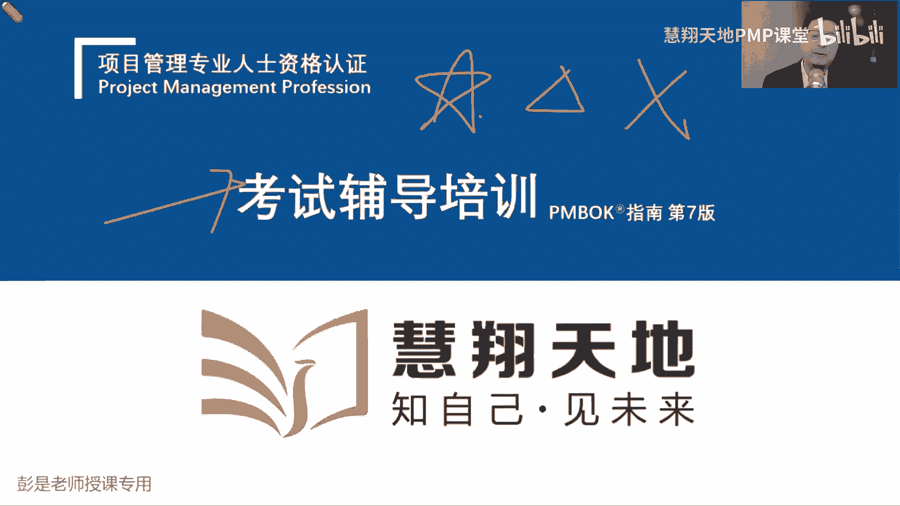
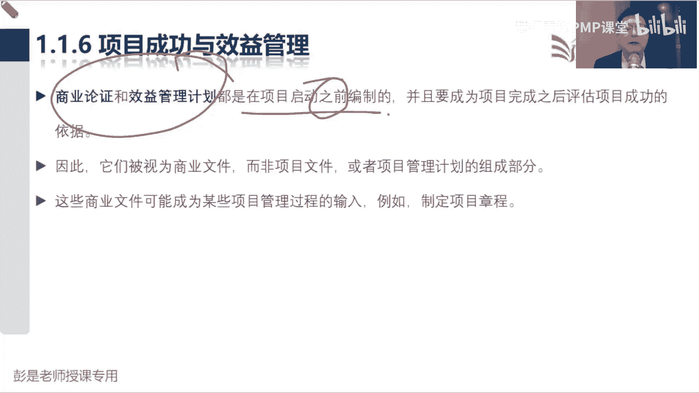

# PMP考试培训课程第1-13章节免费完整版 - P2：第一章：引论 - 慧翔天地PMP课堂 - BV18y421e7ut

建议到我们的课程大家至少听两到三遍，因为大家第一遍听的时候，不一定所有的东西都能记住，一定需要复听，便于大家更好的去处理这里面的逻辑，建议大家听两到三遍，咱的教材只看一遍，购买也不够。

建议大家还是量到三遍，咱们的题只刷一遍，够吗，也不够，仍然是两到三遍，重复重复不断的巩固，才能做到温故而知新，哎所以大家在听课的，尤其是第一遍听课的过程中啊，建议呢做笔记的。

写字慢的同学就不要低头写字了，因为你写字慢，咱俩咱俩的频率不同步啊，可能导致可能导致啊，我再讲个东西或者讲讲东西的过程中，你在低头写，那你在写的过程中就有一些东西没听到，有一些东西没听到呢。

就可能就可能断片了，一段片再续上对吧，工作受到了中断就不容易节省，所以呢也不建议大家做笔记，写很多字，先做标记，那做标记啊，大概我们的教材有这么三大三大种内容啊，第一种呢就是百分之百一定要记住的。

还要能够理解的非常非常重要的关键知识点，然后呢第二种知识点呢就是看一看，看一看了解就可以了，不需要大家记住，这样的内容通常相对来说比较容易理解，看一看就够了，有印象就可以了啊，不需要记住。

常通常呢就是一些比较浅显的道理，不需要大家特别印象深，还有一些内容呢其实对备考这个角度来说呀，可以不看的，但是呢为了保证我们知识体系的完整性，为了便于大家未来工作中还有可借鉴，可参考的价值和意义。

咱仍然把它保留在我们的教材里了，所以第三部内容从备考这个视角出发，其实是可以不看的，诶大家未来整个听课的过程中，根据老师的讲解做这三种，这做啥，做这三种标记啊，所以先专心听，等我听，等我把这段内容。

这一段内容讲完了之后，你再给出一个结论，这个东西到底是重要啊，还是看一看呢，还是说可以不看了，再做出相应的标记就可以了，然后需要想想，在想在上面写写字的同学，建议呢大家至少第二遍的时候，你再去一边听。

一边写，一边听一边写，这样对大家听课来说反而效率高，唉就这个大道理啊，因为我在讲课的过程中，你是不可能把我暂停的，不可能把我暂停了吧，唉大家未来看看回放的过程中，你想暂停就暂停，想快进就快进。

想倍速就倍速，你可以操纵我啊，所以现在我们就专心听，保持稳定的节奏，掌握这套这套东西啊。

那我们的教材通关宝典大概分成四部分内容，第一部分呢叫项目管理的基础知识，第二部分呢叫这种传统的项目管理方法，就是五大过程组，十大知识领域，49个管理过程，第三部分内容呢就是多变的环境下，怎么管项目。

也就是敏捷，在这种复杂的多变的项目环境之下，再按照传统的方法墨守成规，不一不一定好使了，所以第三部分呢主要讲敏捷，第四大块内容呢就是第七版的那种八个什么，12种原则，八科技教育就这些东西啊。

咱上课的顺序就从上到下，1234这四大块核心内容嗯，好那项目管理基础知识，教学中三小三小节叫基本要素，运行环境，项目经理的角色，那先看基本要素，直接翻到一点一，就一句话。

项目是为创造独特的产品服务或成果，而进行的临时性工作，一定要知道啊，那项目创造独特的产品，服务成果而进行的临时性工作，到底什么是项目啊，什么创造产品服务成果，还有什么临时性工作，掌握项目之前。

我们先把大家的这种大局观给他建立起来，所以需要给大家带入场景，这个场景呢以前讲过什么口罩，口罩工厂工厂对吧，疫情时候长口罩工厂，然后呢狂飙比较火，就讲了什么莽村，莽村度假村，然后呢现在呢为了便于大家。

为了便于大家记忆啊，这东西不火了，话题过时了，咱就换一个简单的场景，前两天上课给大家讲的是什么牛肉面馆，刚才有同学说开发游戏，开发游戏这种东西啊，像开发游戏啊，什么修路搭桥啊，它有一定的专业知识。

因为大家来自于不同的行业，如果我讲的这个案例行业属性太明显，特征太鲜明，可能其他行业的同学就听不懂了，能理解吧，可能其他行业的同学听不懂，这就不公平了，所以呢为了公平起见，整个讲课的过程中。

说的案例都是大家耳熟能详，非常非常简单的事例，便于大家更好地理解，讲复杂的案例不现实啊，所以最简单的场景就是你想象一个场景啊，各位同学，如果你打算去创业，打算去创业，先定什么，先干啥。

说现在突然陡然而富，继承家产，然后打算去创业，赚点小钱，先干啥呢，先定什么东西呢，做什么目标，内容定位，卖啥产品，筹集资金，筹集资金好像不太对吧，拿到钱你要干啥呢，不清楚哈，市场调研调研的目的是什么呢。

去想一想做啥事吧，所以对企业来说，对企业来说，对公司来说，我们要先定方向，这些方向呢就叫目标，愿景，使命价值观这套东西啊，定企业发展的大方向，大方向敲定了之后，比如说呀我们要做餐饮对吧，定行业做餐饮啊。

我们要开什么牛肉面连锁店，我们要开披萨店，我们要开汉堡店，定了方向之后，接下来要做什么事呢，我们做汉堡店，然后3年以后开100家，5年以后争取上市，10年以后财富自由啊，这叫啥。

未来一年两年3年四年做什么事情，达到什么状态，这个对企业来说高屋建瓴的东西啊，就叫战略规划对吧，咱们国家有什么十三五十四，55还5年做个战略方向的调整，那对企业来说也做这个事情，这叫企业的战略规划。

所以如果方向目标，愿景使命价值观是分析下我们到底做什么事，战略和计划对企业来说，就是去思考这事儿怎么干，选择用什么样的方式去实现我们的目标，实现我们的宏图大业哎，对企业来说就叫战略规划。

就是那个号那方向定了，战略规划定了，知道我们做什么事情去实现这个目标，这些事情就可以分成两大类了，所以接下来我们带场景告诉大家，怎么去更好地理解这个事情，分成两大类啊，定了方向。

比如说我们就开个什么牛肉面馆，开个牛肉面馆诶，定目标，一年收回成本，两年开始盈利，3年以后我们开连锁店，4年以后，巴拉巴这些事情一旦敲定了，我们就会发现啊，开牛肉面馆有这么几个事情，第一什么选址注册。

这一胡里吧嗦一大堆事情啊，第二你租好了房子不得装修一下嘛，对不对，设计我们的厨房设计，我们的就餐区设计，我们的收银台装修啊，然后呢你需要买一些什么设备设对吧，设施搞定了就开始上设备吧。

什么做饭的设备对吧，什么收钱的设备诶，买设备我就随便写示意了啊，设施就是装修，然后设备就是一些什么锅碗瓢盆这些东西啊，然后再往下房子装修好了，设备到位了，开始招兵买马了吧，招服务员，招厨师诶。

这些条件都具备都具备了啊，是不是我们就可以开始营业了，开始营业啊，开始营业，还有很多事要做的，买原材料，柴米油盐酱醋茶，买菜买肉肉在哪啊，买完了原材料，人家下了订单之后，我们要生产加工吧，就是做菜啊。

做完了菜之后，人家下了订单给人家送到家门口，给人家送到餐桌上，让人家吃，最后收钱变现的就这么粗暴离题了，买东西做卖出去，买东西做卖出去诶，那接下来就会发现了啊，上面这个圈圈的。

这个圈圈里面的事情有什么特点呢，做选址注册装修，买设备，招兵买马，这件事情是不是把它完成就可以了对吧，基本上没有后续的事情了吧，除了这个招聘啊，因为人员可能流动性一高啊，除了这个招聘，那像买设备呀。

包括装修啊这样的事情，咱们把它完成就可以了，咱们公司不是每天都装修，咱们公司也不一定每天都买设备，对不对，我们不是装修公司，我们不是装修公司啊，所以像上面这一大这一大堆事情啊，我们只是把它完成就可以了。

那下面这些事情呢，买柴米油盐酱醋茶，然后做饭做菜卖出去，买柴米油盐酱醋茶，做饭做菜卖出去，这样的事情有什么特点呢，重复持续对吧，这些事情可能每天都要开展，定期的根据我们企业的情况，根据咱们公司的情况。

定期的去开展，持续的开展，重复的开展，所以这两种事情它的Q和特点不一样，上面这一大堆这一大类事情啊，我们只要关注的是按时把它完成就可以了吧，装修一个月对吧，买设备可能十天八天设备到位啊。

人哪可能十天八天人员到位啊，诶把它完成就够了，它不需要我们持续的重复的定期的去开展，但下面这一大类事情呢，可能需要我们持续的重复的定期的去开展，那这对这两类事情，我们就给它起了两个名字来形容它的特点。

上面这一类这一大类事情就通常称之为项目，下边这一大类事情就通常称之为，经营运作对吧，经营运作保证我们企业能够日常的运转呢，哎就称之为运营，他指的是持续的重复的定期的开展的这些事情。

项目呢更侧重于把它完成就够了，所以全都全都擦掉了啊，那我们大概就这么四个东西，定企业的目标方向，目标愿景，使命价值观，做企业的战略规划，做完了战略规划呀，我们就知道我们都有哪些项目需要开展了对吧。

选址呀，注册呀，装修啊，买设备呀，买对吧，以此类推啊，我们就知道我们都都有哪些项目了，有A呀，B呀，C呀，D呀，很多事要去做这些项目，把它完成就可以了，那战略规划一旦敲定了。

我们还知道我们需要怎么运营了，买柴米油盐酱醋茶，然后招厨师，每天人家下了订单做菜赚钱，下了订单做菜赚钱，诶，就知道我们需要持续的重复的开展的，这些事情都是傻了，所以对企业来说，核心的管理，核心的管理啊。

就这么三个叫战略管理，项目管理和运营管理，项目管理追求的是说啊，这些事情把它完成就够了，这些事情把它完成，那比如说以装修为例子，是不是每个房间，每个房间都有每个房间的独特性呢，比如说位置布局。

施工的人员完工的时间或日期诶，他在某些方面肯定存在着不同点，肯定存在着不同点啊，两个装修的一模一样的房间，你楼层还不一样呢，对不对，位置还不一样呢，施工的人员可能也不一样啊。

这种不一样就意味着项目都具有独特性，我们要创造独特的产品服务或成果，这种独特性就意味着，不确定性这种独特性就意味着不确定性，这两个房间看起来一模一样，那很可能他在什么上水下水电天然气诶。

这个管道的走向和布局也可能不太一样啊，楼层不同，楼层不同诶，他的什么风吹日晒，这种程度也不一样吧，这都意味着独特性，这种独特性就意味着不确定，这种不确定性就意味着什么呢风险。

所以我们项目创造的产品服务或成果，它在某些方面肯定存在着独特的独特的一面，对吧，两个相同的大楼它的位置不一样，有的大楼下面可能土层就比较结实，有的大楼下面可能土层就不结实，所以你会看到过看到过新闻吧。

有的楼可能就倒了，就歪了，有的楼就没事诶，这就意味着风险，这就意味着风险，就意味着不确定性，就意味着风险啊，所以项目管理最核心的思维方式，第一就是风险意识，我们要考虑周全，考虑周全，然后我们通过项目啊。

要知道这个事把它完成就可以了，那把它完成，需不需要有明确的开始和结束日期呢，需不需要有明确的开始和结束日期，在想装修这个事，老板问你，咱这个店什么时候能装修完呢，你说装修一辈子呀，这不行吧。

他需要有明确的完工日期，我们要尽快开业呀，那对于运营性质的工作来说，它需不需要有明确的开始和结束日期呢对吧，老板说运营每天做饭赚钱，做饭赚钱，我们这个餐厅啊就打算干一年，这好像也没道理吧。

我们希望每天都有人买菜对吧，每天都有人下单的，每天都赚钱的，我们希望能够持续的重复的去赚钱，持续的重复的去赚钱，所以通常来说运营性质的工作，我们不希望它具有临时性，唉这是项目的独特性和临时性。

就对标到项目的典型特征，就一对比就出来了，项目每个项目创造的产品服务或成果有独特性，每个项目呢需要有明确的开始和结束日期，那运营呢他创造创造的产品服务或成果，运营创造的产品服务或成果呀，不追求独特性。

他追求的是啥，想这个大道理，我看张三点的那个菜肉特别多，我这个菜就没什么肉，你创造了不一样的产品，那对用户来说你会满意吗，不满意，所以运营运营追求的是创造出相同品质的产品，服务或成果。

这是量产就是量产对吧，想想制造业的同学，你肯定会会懂啊，对不对，生产出来的每台汽车都一样，生产出来的每台手机都一样，我们做好的每一个菜都一模一样，保存相同的品质，所以他追求的是创造相同品质的产品。

服务或成果，那怎么做到相同品质的产品服务或成果，怎么做出相同品质的产品服务或成果呢，想想麦当劳对吧，人家做出来的什么每个汉堡啊，每个每个薯条啊，基本上差不多呀，它有一套非常非常标准的程序吧。

哎所以运营追求的是标准化规范化，通过这种标准和规范来弥补员工能力的不足，不需要我有很高很卓越的厨艺吧，我只要按照标准化的程序，12345这么一干，这个汉堡就做好了，哎就是sop这种这种东西啊。

所以运营产出相同品质的产品服务或成果，它追求标准化，规范化，标准化的服务，标准化的运作呀，这样呢就可以尽量的尽量的做到，我们创造的产品服务成果是一致的，那项目不一样，项目适不适合标准化呢，不一定了吧。

因为每个项目可能有每个项目的独特性，我们要根据项目的情况去调整，我们这些可所谓的标准化的方法，标准化的过程，标准化的流程，根据项目的情况，及时的及时的及时的做出调整。

才能更好的适应当今这个变化多的时代啊，所以最后学到最后你就会发现该预测的就预测，该敏捷的就敏捷，五大过程组，十大知识领域，该调整的调整，该优化的就优化，这个操作就叫裁剪，因为每个项目有每个项目的独特性。

好知道了这个大道理哈，所以项目和项目和运营，它的典型特征区别就是，项目创造独特的产品服务或成果，然后呢项目需要有明确的开始和结束日期，需要有明确的时间，明确的周期，搞定这两个单词之后啊。

项目的第三个特点是啥呢，第三个特点啊，就四个字叫渐进，渐进明细明我就不写了吧，明明朝的明渐进明细，渐进明细的意思是啥，鉴定明细其实它普遍适用于所有的事情，嗯就是啊这个事儿，这个事儿通常在这个事情的早期。

在项目的早期，我们得到的信息是少还是多少，并且这个信息是粗略的还是详细的，粗略的吧，哎比如说我们打算开一家牛肉面馆，我打算装修，这个信息非常粗略，然后你一定会问问老板啊，我们装修装修成什么风格了。

老板可能1234提出一些要求对吧，然后装修啊，我们这个就餐区面积有多大呢，配多少桌椅，板凳呢，能够提供多少人就餐呢，一定是随着工作的开展，他会不断的丰富，不断的细化，就体现了项目渐进明细的这个过程对吧。

从我们项目早期粗略的这些总体的要求，然后不断的不断的去收集各种各样的需求对吧，从上到下，从大到小，从宏观到微观，不断的去细化的，甚至最后细化到每个桌子，每个每个椅子对吧，用什么材质啊，高度是多少啊。

间距是多少啊对吧，以此类推啊，都是不断丰富，不断细化的过程，这是项目的第三个特点，从我们早期的粗略的粗略的这种大方向，一直到最终最终最终详细的工作计划，到最后最后落实产出来的详细的成果，一定是从高到低。

不断丰富，不断细化，这样一个过程好搞定项目的三个特点，独特性，临时性和渐进明细的特点，然后再搞定啊，中间这三个单词，什么叫产品呢，牛肉面是不是我们公司的产品是吧，凉菜烤串啤酒饮料，花生瓜，花生瓜子诶。

这就是我们的产品对吧，对各位同学，你企业来说，你们开发出的软件是不是产品呢对吧，造出来的汽车是不是产品呢对吧，洗发水是不是产品呢都是产品啊，产品主打一个，我们要了解这个产品的功能属性和特征。

去分析你这个产品到底是个什么鬼，这就是产品的概念，那通过项目的形式呢，可以研发新的产品，从0~1啊，可不可以对产品做升级做改进呢，可不可以啊，可以吧，大家手机呀什么微信啊，都有版本的。

得把什么IPHONE15，Iphone16，微信7。0，微信7。1，微信8。0，也可能通过项目的形式对现有的产品做改造，做升级，那改造升级后的产品有没有独特性呢，还有吧，所以他不冲突啊，不矛盾。

搞定一个单词之后，再看什么叫服务，什么叫服务，服务指的是啥呢，工作，工作呀有没有企业提供跳科目三的服务呢，是吧，诶它不是产品不是产品吧，它是指我们的服务人员完成一些工作，来达到客户的需求。

满足客户的需求，来提高客户的满意度，对不对，有的企业什么在在在，你等我去做美甲诶，他提供各种各样的服务，有的企业呢就没有，所以服务指的是工作，像外卖小哥对吧，送餐服务，物流小哥，快递小哥配送服务对吧。

什么快车，人家给你提供运输服务，以此类推，诶指的是通过完成工作满足用户的需要，其中长期稳定的服务是属于项目，还是提供长期的稳定的服务，通过项目创造服务网，我们牛肉面馆现在没有人考，没有人会科目三。

我们组织大家学习科目三，这是不是一个项目对吧，这个项目一结束，我们的员工就能够跳科目三了，能够跳科目三，能够跳科目科目三啊，客人来点餐，说我们要有人要想看科目三，我们就给人家跳，这是项目还是运营呢。

运营哎，那运营过程中，我们就希望这个东西标准规范对吧，大家不要调的跳的群魔乱舞啊，希望大家最好最好动作统一啊，标准化规范化呀，然后也不要跳太长，也不要跳太短对吧，有的人可能跳两秒钟。

有的人可能跳30分钟不干活了，这也不行了，所以他要光标关注我们工作的工作的标准化，规范化，所以通过项目的形式可以创造出新的服务，或者是对现有的服务做升级做改进，这次都是通过项目的形式去开展的啊。

刚刚是谁在说话呀，我们有线下的同学不是见了鬼了啊，不是老师自问自答，不是老人啊，不是老师在说双簧，什么单口相声，我们有线下的同学，大家线上的同学有问题，就像现在的同学啊一样，随时问的，随时问好。

第三个单词成果，这怎么猜啊，什么叫成果呀，可以LUCY同学有问题直接问他什么叫可成果的，这玩意儿好理解，对报道科研成果吧，哎我们厨师发明了新的方法，新的工艺能够把这个菜做的又好吃又快。

科研成果研究成果呀，就像咱们那个什么注射到新冠里面的注射，注射到身体里面的新冠疫苗对吧，核酸检测方法，抗原检测方法，这不都是研究成果吗，这些研究成果，这些研究研究成果的产出。

也是通过项目的形式去把它创造出来的啊，好知道这个道理啊，像神舟飞船这各种场景，大家都可以举一反三了吧对吧，什么space x x这玩意开始的时候是项目吧，现在这个技术成熟稳定了，是不是变成运营了对吧。

定期的定期的给各大企业发放往天上扔卫星了，诶就变成运营性质的工作了，然后呢，space x在不断的不断的对他们的火箭做升级，做改进，做迭代来创造出新的产品服务或成果，对不对。

然后这个东西一乘除易稳定进入到运营模式，谁想往天上扔卫星找我们啊，我们成本低呀对吧，每吨几百块钱呢，100多美元，100多美元吧，很便宜啊，这个道理啊，好所以最后最后啊。

项目就是在帮助企业创造出新的产品，服务或成果，所以项目在帮助企业创造价值，项目在帮助企业创造价值，而运营是干嘛呢，想办法把这个价值去实现，想办法把这个价值去实现，所以回到我们那个牛肉面馆这个场景。

我们发现牛肉面不赚钱，然后呢，我们现在啊通过项目的形式研发出新的产品，我们加加加羊肉串，加羊肉串，这是项目吧，哎我们需要引进一些新的设备，教我们的厨师啊，去烤羊肉串啊，把这个新的产品创造出来之后呢。

就开始销售主推了吧，唉这个东西赚钱的这个东西赚钱，在运营的过程中，想办法实现这个价值，并且把这个价值最大化，这就是项目和运营的本质区别，好听完了对企业这个场景之后，再回顾这个知识点了，企业定目标。

定愿景，定使命，定价值观，知识定位，定方向，搞清楚我们到底是一家什么样的企业，决定了what，然后搞定了what之后呢，我们再搞一个号去思考怎么实现这个目标，怎么实现这个宏图大业，做企业的战略规划。

战略规划对企业来说就是做选择对吧，我想赚他一个亿，然后怎么赚这一个亿，做选择呀对吧，是偷工减料坑人，还是说我们要开连锁店诶，选择走什么样的路，选择走什么样的路去实现这个目标，路一旦定了。

在路上要做的事就清楚了，就有项目和运营，项目的特点是我们把它完成就可以了，他需要他需要有明确的开始结束日期，我们要考虑到每一个项目的独特性，因为它意味着不确定，意味着风险，那对于运营来说。

我们更追求的是想办法让这个事情标准化，规范化，从而可以做到持续地产出相同品质的产品，服务或成果，你知道这个大道理之后啊，知道这个大道理说老师啊，项目的表格化管理属于哪个管理过程呢。

你的表格好感理想指的指的是什么呢，是出模板吗，出规范吗，除模板，除规范吗，这对对企业来说，对企业来说呀，不叫项目管理的吧，对企业来说更关注的叫什么文档管理啊，标注关注你贴文档的标准化规范化。

文档管理之上就一定是流程管理，关注流程的标准化规范化，根据流流程来确定来确定啊，这个信息怎么流转，信息怎么流转，就有了表格，就有了表格的标准化规范化好，那对于项目来说，其实它没有特定的管理。

管理过程去管这个文档啊，因为这个东西它不一定适用于所有项目，好回到这个场景，那其实讲完了知道了企业这个大道理之后啊，咱们再换个场景，对标到个人身上也很好理解，对企业对对个人来说，就这俩事，项目运营。

项目运营停产停二，这个东西是项目还是运营，慎重作答，慎重作答，找对象，大老师，我给自己定个小小目标，要明天明年我想脱单找对象，这是项目还是运营啊，慎重作答呀，有没有人把它当做运营呢，对吧，海王渣男吧。

哎他追求的是标准化，规范化，上午找一个，下午找一个，天天找，持续找，最好每个小时都捞一个呀，但大多数人来说，它对我们来说是项目，对不对，我们要给自己设定明确的目标，然后每次找对象啊，找一次就可以了啊。

每次找对象和每次找找对象的特点都有，每个每次找对象的独特性啊，那需要有明确的开始结束日期对吧，不能遥遥无期，因为对项目来说，对事情来说啊，一旦遥遥无期，很可能就没有结果了，讲我想减肥，我想减肥。

没有明确的期限，没有明确的目标，这事基本上就不了了之，对不对，减一辈子减一辈子，人死了以后一烧轻了，这也不行啊，一定要有明确的目标，所以关于目标目标管理，目标管理，大家有没有听过这个单词。

叫smart s m a RT smart原则，这个目标啊一定是明确的，一定是明确的，什么叫明确的呢，什么是明确的啊，比如说我想变好看，这个目标明确吗，什么叫好看，什么叫好看，具体每个人对吧。

每个人眼里的好看不好看，是不是好像不一样，它带有比带有强烈的主观倾向吧，哎对吧，萝卜白菜各有所爱啊，有的人觉得这个明星好看，有的人就觉得觉得这个明星不好看，有的人黑，有的人认为啊黑体字好看。

有的人就喜欢宋体，这一定是千人千面的事情啊，所以一定要明确，一定要明确啊，好我想减肥，我想变瘦，这个目标明确了吧，瘦和胖，这是不是客观了对吧，现在申请是这样的，未来申请这样，这是不是明确了。

那想办法去衡量它，M指的是可衡量瘦多少对吧，用什么称，拿眼睛看和上秤称体脂率要不要测一下，不太一样了吧，哎不太一样啊，身体在变重，不一定说明你胖了，这能理解哈，身体太偏重不一定是胖了啊。

要有科学的衡量方法对吧，瘦多少斤，然后脂肪减少了多少，肌肉增加了多少，你把身形有没有变化呀，一定要找到合适的合适的衡量方法，不能拿眼睛看，因为可能有偏差，有主观性，A呢是什么呢，说这个事啊要有可行性。

我想一周瘦30斤，把腿锯了，这也不现实吧，不现实啊，一周减个三斤四斤，好像差不多了，某些人可能减得多一点，对不对，那我们要分析这个目标，对我们个人来说它可行不可行，是不是具有可行性。

然后R其实对个人来说，就是对个人来说就是关注你个人的大目标，对企业来说呢，就是这个R我们现在这个目标，是不是和企业的业务具有相关性，是不是和企业的业务具有相关性，对吧，我想减肥变瘦变好看，然后做海王。

做渣男，这就不是一个有不是一个有效的目标，我们要去思考这个事情和我们的总体方向，和我们公司的总体方向是不是具有关联关系，这个R指的是关联关系相关性，然后T指的就是时间，我想变瘦，瘦三斤。

一年瘦三斤还是一周瘦三斤，这个目标又不一样了，所以一定要有明确的开始结束日期，这就是smart原则，所以知道这个大道理，知道这个大道理啊，那项目来说，项目来说就一定要有明确的开始结束日期，不能遥遥无期。

所以找对象这个事情唉，通常我们把它称之为项目，找完了对象啊，谈恋爱这是啥，维持关系，这是项目还是运营呢，运营了吧，唉维持两个人的和谐关系，需要长期的长期的，定期的逐步的持续的去开展的。

这就是运营需要我们个人经营运作呀对吧，该聊天聊天，该送礼送礼是吧，什么双11呀，该过节过节呀，维持关系不能好几天不说话，谈完了恋爱，准备结婚领证办婚礼，这都叫项目对吧，结婚领证办，办婚礼之后过日子。

运营打算要个小孩，想生完了小孩养小孩，运营给小孩找幼儿园项目，找完了幼儿园天天接，天天送运营，以此类推吧，对人生来说，我们就不断地不断地通过项目，帮助自己创造出新的价值。

然后在运营的过程中想办法让这个价值最大化，那对企业来说也如此，对企业来说也如此啊，通过项目创造出新的产品服务或成果，咱价值就得到了提升，我们餐厅只能做牛肉面，可能估值100万，现在还能烤串。

可能估值一百一百二十万对吧，还能做麻辣烫，可能估值130万，不断地通过项目的形式，研发出独特的产品服务或成果，来帮助企业创造价值，创造出来的价值啊，还没落地呢，需要靠经营运作，持续的经营，持续的运营。

想办法让这个价值最大化，嗯好知道这个大道理啊，大道理搞定了之后再看这张图就比较简单了，对企业来说就这么点事儿，大家教材上没有这张图也不需要去背，听一听就可以了。

就未来呀这几个单词你会听到to回去听到吐啊，所以对企业来说，高屋建瓴，目标愿景使命价值观，我们是一家什么样的公司，未来我们公司会变成什么样，我们的使命是啥，对吧，我们的使命，我们的价值观是啥。

是一群什么样的人，我们达成什么样的共识，这是定方向，搞定位，定位搞清楚之后呢，做企业的战略规划，战略规划一旦敲定了，就知道我们需要运营什么工作了，就知道未来我们需要开展什么项目了，那知道了项目和运营。

接下来在思考啊，还有两个单词，一个叫项目及一个叫项目组合，这两种观这种这两种管理方法，他关注的点不太一样，项目是说我们创造独特的产品服务，或者我们开展的临时性工作，那什么是项目集呢，什么是项目集啊。

比如说咱餐厅装修，餐厅装修啊，装修这个事是一个单独的项目，买设备也是个项目，这两个事情之间有没有关联关系，换句话说装修的结果，装修的成果会不会影响买设备，会不会影响买设备呢对吧。

装修完我们这个层高只有1米7，买回来的设备2米塞不进去，装修完了，这个这个操作台只有对吧，2米的空间，两平米的空间，这个设备呢占地占地面积三平米，塞不进去，A项目的成果会影响影响到B项目。

他俩之间是不是存在着依赖关系，关联关系，就这个道理吧，装修没完成的时候，你设备到位了好不好呢，没地儿放了对吧，房间里面暴土扬尘的，你设备没地儿放了，可能要放在外面的，甚至租个仓库吧，浪费钱呐。

哎那这两个事情要不要协调一下，统筹一下，合理的安排一下这种管理方法就叫项目集，所以项目集项目集本质上就是多项目管理，想办法把多个事情给他协调好，从而不浪费，从而想办法1+1大于二，所以这个场景啊。

在对标到刚才我们找小孩这个这个场景嗯，大家在生活里面，比如说你买房子这个事情是项目吧，和小孩上什么学校，给小孩找小学呀，这两个项目之间，它的成果会不会不会存在着依赖关系，关联关系，走吧。

买什么地方的房子就上什么地方的去诶，那我们要不要把这两个事情给大家，通盘考虑一下呢，协调好吧，做好这个事情的规划，做好这两个事情的管理，所以这种管理方法就是项目集，想办法把存在着依赖关系。

关联关系的多个事情给他协调好，统筹好，这样呢可以不浪费不浪费，就可以做到1+1大于二哟，这就知道知道项目集了啊，好最后一个术语啊叫项目组合，最后一个术语叫项目组合，项目组合本质上其实也是多项目管理。

做项目管理哈，它的目的是什么呢，它的目的是啥呀，我们餐厅要做的事很多，我们个人要做的事情也很多对吧，有的同学会说，老师啊，我明年的目标啊，可能是找对象，然后呢谈婚论嫁，在最好最好生个小孩，我还要换工作。

我还要买车买房，我还要做很多很多的事情啊，我还要玩游戏，怎么还要还要还要买个船，要做的事情这么多，我们有限的是啥呢，钱对不对，有限的是钱呢，那我是不是要考虑一下了，什么时间把我们有限的时间精力。

钱放在最有价值，最有意义的事情上，这种管理方法就是项目组合管理，所以变成大白话就是好钢用在刀刃上，那对企业来说也如此，对企业来说也如此啊，放到我们牛肉面馆说我们买房子对吧，租房子装修，买设备，招兵买马。

然后呢就是买菜做饭卖出去，买菜做饭卖出去，那在餐厅正儿八经营业之前，是不是前四前四个事情啊，优先级更高啊对吧，你餐厅都没装修完呢，噼里啪啦把柴米油烟就买好了，好像不对。

现在这个阶段对我们来说项目的优先级更高，那餐厅啊把这些项目完成以后，我们正儿八经开门营业了，营业的时候啊，现在没有什么项目了，这种情况下，什么东西优先提高了呢，运赢了吧，我们开始抓标准，抓规范。

想办法降本增效，提高我们服务的质量，提高我们服务的效率，降低我们的成本大，就主抓运营了，那对企业来说就是这个道理啊，对个人来说也是这个逻辑啊，要做的事情这么多，可能有很多个项目。

可能有的项目呢存在着依赖关系，我们又扔到了项目，吉利可能还有一些运营工作，那我们也需要对这些事情排排优先级，把符合我们战略的事情放到一个圈圈里，合理的排排优先级，然后合理的分配我们的人财物。

因为对企业来说捉襟见肘的就是资源和资金，财，就是资金，人和物资，指的是资源，所以带场景，比如说对企业来说，现在有一个非常非常重要的事情，事关到公司的生死存亡，那你企业是不是考虑把你的精兵强将。

全都放到这个事上去，就这个逻辑吧，把你企业最优秀的人才，全都投入到这个项目上诶，帮助我们企业更好的，更好的实现这个战略目标啊，就这个道理，所以记住了这三个单词啊，项目关注的是什么呢。

就是作为一个专业的项目经理，我去思考这事儿怎么干，项目及经理关注的是什么呢，有一些事情存在着依赖关系，我们怎么如何把这个事情处理好，所以项目经理和项目经理关注的，项目经理和项目及经理关注的都是how。

怎么把这个事做好，只不过项目经理是一个事情，项目及经理可能是多个事情，并且多个事件之间存在着关联关系，依赖关系，所以他更关注的是组织协调运筹，这也是第二，那项目组合管理，好钢用在刀刃上，好钢用在刀刃上。

它的主要工作重心就是找到刀刃，是这个逻辑吧，找到刀刃啊，对企业来说呀，我们现在做什么是最重要的，对企业来说，我们现在做什么是最重要的，所以这个场景比如说大家能想到的场景啊，不管是你听过的看过的手机汽车。

就像这样的企业对吧，什么制造业，对制造业行业来说，你只生产一款车型行不行呢，路好像比较窄吧，哎所以它还有很多个很多个产品线的对吧，轿车什么SUV，什么工程车，特种车，它可能有很多产品线。

那是不是哪个产品最赚钱，我们精兵强将就在哪个产品线上，唉所以这就是项目组合管理啊，好钢用在刀刃上，确保我们对这些事情排排序，看看什么事情重要，什么事情不重要，便于我们企业更合理地分配我们的资源和资金。

人财物，所以项目组合管理关注的是对企业来说，我们做什么事情是正确的，然后排序，然后分配人财物，这就是关于这几个大局观，大局观，对一个项目经理来说，我们要知道企业的这些这些事情，它都有什么特点。

唉知道对企业来说，我们都有哪些靠谱的管理方法，这是目标管理，战略管理，运营管理，项目管理，然后再衍生出来的就是项目集这种管理方法，最后呢要做的事这么多，排排序就有了项目组合这种管理方法。

通过这些管理方法，就可以帮助企业更好的一个台阶，走到另一个台阶，不断的创造价值，实现价值，创造价值，实现价值，就这东西，所以这样这两天大家有没有看过最新的新闻了，那个什么什么，赛博truck。

特斯拉开的那个新的新的那个车对吧，说适用于全宇宙各种场景啊，这个这个车的研发就是标准的项目，现在这个车这个车正式推向市场，那接下来工作重心就变成了运营了吧，想办法量产呢对吧。

生产过什么订单已经200万台了，诶就是这样的这样的对企业来说就这些事情啊，好这段轻松加愉快的知识点搞定之后，基本上这个节奏还可以吧，其实没讲啥，说来说去就这么几个单词啊，目标战略项目项目组合运营项目集。

大家休息一下，11点，现在11点整，咱休息缓一缓，休息到11。08，然后继续，你好，好好网易，我感觉那个但是那一场十点，我只是进行创意，开不了，好各位同学准备了，还有15秒，即将开始。

下一小段课程都听懂了，就是记不住啊，就这么几个单词还记不住吗，项目运营，项目集，项目组合就这四个最核心了，项目项目及项目组合，运营运营的标准化，规范化，项目的独特性，离职性，嗯嗯项目及一堆事有依赖关系。

协调一下项目组合要做的事这么多，花钱花在哪上最值对吧对吧，当牛肉面馆，比如说啊项项项目组合其实就是从投资，从投资领域出来的啊，就是说我们有钱啊，把这个钱投资在哪会获得最高的回报，然后呢原则上来说呀。

最好最好不要把鸡蛋都放到一个篮子里，那对不到牛肉面馆啊，比如说我们卖酒水饮料，你要进货，那什么东西赚钱，什么东西好卖，什么东西就多近点儿，什么东西不赚钱，什么东西不好卖，但是还需要有就少进点诶。

把钱花在哪，这有价值就投资组合，从这个角度出发的，就是分析我们做什么事情是正确的，好知道了这个这么几个术语之后呢，再看后边的概念，就相对来说简单得多了，那1。1。13个一说。

项目创造独特的产品服务或成果，开展项目是为了通过可交付成果达成目标，目标是指巴拉巴拉巴拉巴拉巴拉巴拉，不念了啊，那看到目标管理，目标管理英文单词不需要记啊，目标管理，目标管理刚才说过吧。

目标管理的原则叫什么来着，叫什么来着，想一想聪明的人，聪明的聪明的目标，smart原则唉，这个这smart这个单词要记住，所有的目标一定要明确，可测量具有可行性，和我们的总体目标有相关性。

还要有明确的结束开始日期，结束日期，这就是目标管理的重要法则，目标一定要明确，尽量的想办法去除掉这些主观的因素，让我们能够更客观地去评价衡量这个事情，所以从主观到客观，这是大家需要掌握的第一原则。

嗯所以目标巴拉巴拉巴也不念了，但对项目，对企业来说，我们通过项目创造的产品服务成果，你的目标是什么呢，可能是对产品做升级，可能是对吧，创研发新的产品，让我们更赚钱，也可能是通过项目的形式对吧，降低成本。

改进质量，提高效率，提高客户的满意度对吧，吸引更多的客流啊，有各种各样的目标，那可交付成果这个单词，可交付成果这个单词啊，它也是非常非常非常，广义的一个单词为什么叫广义呢。

咱们叫它里面大部分的术语都非常非常广义，它涵盖的范围非常广，所以可交付成果是指在某一个过程阶段，项目完成时，必须产出的任何独特并可核实的产品，服务或成果能力，那对标到我们这个牛肉面馆啊。

就像装修这个项目，装修这个项目啊，装修的可交付成果你能想到什么呢，装修的可交付成果是什么呢，装修好的房子吧，哎这是我们的主要可交付成果，那你说装修过程中啊，画的这些什么设计图啊，平面图，结构图。

施工图啊，它是不是我们的可交付成果呢，不是啊，也是啊，也是啊，那你说我们装修这个事儿啊，你做的计划表是不是可交付成果，当也是吧，那未来未来装修好了之后啊，这个房子房子上下水呀，怎么维护啊。

怎么保养啊对吧，这个电路设备怎么维护，怎么保养，这些文档，这些支持性的文档是不是我们的可交付成果呢，也是呀，诶所以它非常非常非常广义，那通常我们第一反应就能想到的，叫主要可交付成果，开发一个软件。

开发一个游戏，这个软件这个游戏就是你的主要成果，除此之外还有很多配套的东西吧，设计的文档，设计的资料什么，使用手册，安装手册，用户手册，保养手册，维护手册，这些东西，知识性的文档都可以称之为可交付成果。

甚至包括我整个项目的计划，包括各种各样的往来往来的罕见，都可以认为它是可交付成果，它是非常广义的概念啊，所以我们开展49个过程的输出，我们也可以认为它是我们的可交付成果。

每个阶段有每个阶段的可交付成果对吧，做设计，画好的图纸，施工图效果图，这是我们的可交付成果，项目完成时最后得到的装修好的房子，这是我们的主要和交付成果都是成果，都可以交互非常广义的一个术语。

二好再往下又来了一个新的小小的知识点，可交付成果可以是有形的，也可以是无形的，这个好理解吧，有形的就是看得见的，摸得着的，无形的就是看不见的，摸不着的，对不对，那无形的无形的这两个单词啊。

就粗暴理解记两个字啊，反正不是为了名，就是为了立，因为大家更好的理解对吗，利真金白银，这看得见摸得着名，虚头巴脑，看不见摸不着，粗暴理解，知道这个意思就可以了，好再往下，那实现项目目标。

可能会产生以下或者是以下，一个或者多个可交付成果，这段内容呢大家基本上就是看一遍就可以了，通过刚才的讲解，然后呢再通过这堆阅读这堆文字，帮助大家巩固一下什么叫产品，什么是服务，什么是成果。

这咱就不再念了，刚才已经解释过了啊，再往下找找找找找找到，这句话，说某些项目可交付成果，或者是呃和活动中可能存在着重复的元素，但这种重复并不会改变，项目工作本质上的独特性，所以书上给了这样一个例子对吧。

我们盖房子采用相同的结构，相同的材料，然后呢，每个建筑物仍然具有独特性，还未知啊，设计啊，环境啊，什么热拉，总之我们能在某些方面找到不同点，这种不同点就意味着这个项目具有独特性。

这个独特性就意味着不确定性，那就意味着风险，所以项目管理啊它最核心的价值啊，这是大家耳熟能详的，接下来这套话术，我们通常说常在河边走，哪能不湿鞋对吧，为什么说常在河边走，哪能不湿鞋呢。

因为每次走在河边都有每次走在河边的独特性，对不对，天气啊，喝水的深度啊对吧，锋利呀，你穿的什么衣服呀，今天心情好不好啊，体力行不行啊，注意力集注意力集中不集中啊，就是因为这种独特性给我们带来的风险。

那学项目管理的目的就是最后想办法做到，常在河边走，就是不湿鞋，考虑到每考虑到每次走在河边的独特性，就是风险意识好，这个也搞定啊，那再往下这张图，这张图啊，这张图大家教材上没有看PPT，听听意思就可以了。

他告诉我们啊，项目可以在组织的任何层面上开展，一个项目，可能涉及一个人，可能涉及一组人，可能涉及到一个组织单元，可能涉及到多个组织的多个单元，先搞定这个单词啊，什么叫组织，什么叫组织啊，公司。

有没有看过这样的电影啊，哎呀经历千辛万苦，总算找到组织了，这种情况下，那个组织是啥，那个组织是啥对吧，什么党这种东西挡这种东西啊，哎团伙啊，这个词不好啊，以此类推啊，它有各种各样的可能性对吧。

可能是个团伙，可能是个党派，可能是个企业，那有没有可能性是多家企业联合做一个事情呢，可能可能吧，唉所以组织也是非常非常广义的一个术语，代表着我们现在有一个事情要做，然后找一堆人，我们联合成立一个组织。

所以为了便于大家更好的更好的记这个东西啊，完全不要想各种各样的复杂复杂场景，不要想复杂场景啊，咱就简单化，未来你看到所有的组织的单词，你就可以把它对标到公司，企业公司解药。

然后不要把这个简单的问题复杂化了，说老师啊，组织有没有临时性啊，像这种这种联合体有没有临时性呢，有对不对，那对企业来说有没有临时性呢，就不一定了吧，对不对，对党派来说有没有临时性啊，没有啊。

所以不要把这个简单的问题复杂化了啊，未来所有看到组织这个单词，你就粗暴对标到公司就可以了，咱考的是项目管理，不是考的组织管理，那项目可以在公司的任何层面上开展，一个项目呢，可能一个人完成说明什么呢。

换个角度看问题啊，一个项目找一个人就搞定了，说明这个项目很简单很小吧，唉规模小，那有可能涉及到一组人，有的项目可能张三一个人就搞定了，有的项目可能需要张三李四王五赵六，几个人合作，说明它的规模大了哈。

那可能涉及到一个组织单元，组织单元又是什么意思啊，啥叫单元啊，你小区那个楼里边有一单元，二单元，三单元对吧，对公司来说就叫你架构里的某一堆人吧，就对外的职能部门这样粗暴理解啊，可能涉及到一个部门。

也有可能涉及到多个组织的多个部门，所以他就告诉我们啊，这个项目规模可大可小，简单的事儿呢可能一个人就搞定了对吧，复杂一点的事情啊，可能需要几个人搞定，再大一点的项目呢，可能需要多部门去协作。

多部门去协同，有的项目呢可能多家公司，多家组织联合到一起，然后大家一起通力协作，嗯知道这个中心思想就可以了，左边那张参考图就是组织架构组织架构啊，好这段文字基本上听一遍听一遍了解就可以了。

不太需要刻意的去背的，听一遍看一遍OK了，那再往下给出了项目的例子，这基本上咱也不念了，大家课后复习看一看就可以了，帮助大家更好的理解啊，什么开发复方药，扩展导游服务，合并企业呀，这些事情都有独特性。

临时性，渐进明细性，所以这些事情都是把它完成就够了，都是把它完成就够了啊，但是记住啊，视角不同，视角不同，大家看待问题的本质性质也不一样，海王在他眼里找对象就叫运营，那对建筑公司，工程公司来说。

我们天天给人家盖房子这种情，这种事情对我们来说可能就是更侧重于运营了，那对企业来说，我们投资开发个小区哎，这个事情对我们来说可能就是项目，所以视角不同，观点不同，不需要刻意的去背了，好112。

项目的第二个重要的特点就叫临时性，说项目的临时性是指，项目需要有明确的起点和终点，需要有明确的开始日期，结束日期不能遥遥无期，这咱知道了，然后第二个知识点是说，临时性并不一定意味着项目的持续时间短。

这句话变成人话，就是有的项目周期长，有的项目周期对，它取决于这个项目的规模和复杂程度，取决于这个项目的规模和复杂程度，大项目啊可能周期就长了，小项目周期就短，通过周期的长短，我们没有办法客观的去评价。

它到底是项目还是运营，在学校山国家什么三峡工程几十年的对吧，你要真的开发个什么app啊，现在可能很简单的，开发个小程序，可能一周就搞定了诶，项目的就是周期长短，代表着这个项目的规模和复杂程度。

然后再往下再以下一种或者多种情况下，项目即宣告结束，再看一遍就可以了，没啥需要记的啊，说呀什么情况下项目会结束呢，达成项目目标，完成任务，实现目标，得到期望的成果，或者是不会不能达成目标。

或者是可能没钱的需求不存在呀，没有人财物啊，诶或者是法律原因啊，总之各种各样的原因和理由，可能导致项目正常结束或者是异常结束，异常结束啊，再一总结归纳就完事了，异常结束可能就是内部原因或者是外部原因。

对吧，缅北某个集团，他们的事情就因为法律原因终止了，这是外部原因不让干了，内部原因呢就是我们自己没钱了，自己没对吧，自己没钱了，自己没有人财物啊，自己做不到了，干的越多，赔的越多，可能就不干了，不玩了。

总之对吧，正常结束，异常结束，内部原因，外部原因，但作为项目经理啊，作为项目经理，他衍生出来的知识点项目如果正常结束，还则罢了，如果项目是异常终止，我们要不要把异常终止的原因，给领导做个交代呢。

要写清楚吧，这事要说清楚啊，不能不明不白啊，诶所以未来我们结束项目或阶段，有一个重要的工作对吧，如果项目是异常终止，我们在报告中一定要记住，一定要记住，为什么项目没有正常结束，要分析原因。

把这个原因做正式的记录，给我们的领导做汇报，好这段听一遍就可以了，再往下，虽然项目临时性，虽然项目是临时性的工作，但其可交付成果可能会在项目的终止后，依然存在，项目可能会产生社会经济材料环境相关的成果。

例如国家纪念碑，要创造一个流传百世的可交付成果，这段文字想说什么，大道理呢，就是啊，通常我们希不希望创造的主要可交付成果，具有临时性呢，通常希不希望这个可交付成果具有临时性啊，不希望吧，最好理解的场景。

比如说希望啊，这就错了吧，不希望啊，大家打到身体里的这个什么新冠疫苗，流感疫苗，它有临时性吗，有他有有效期的吧对吧，像流感疫苗一年打一次啊，一年打一次，烦不烦啊，烦我们希望是不是希望这玩意儿打一次。

管一辈子了，对不对，我们希望打一次管一辈子吧，唉我们通常通常不希望这个玩意儿具有临时性，所以呢我们没有办法通过这个临时性，临时性啊，这个特点去判断我们的成果是否具有临时性啊，这么做不科学。

所以给他这个例子，比如说咱什么人民英雄纪念碑，我们希望这玩意永垂不朽，一直不倒，能够能够一辈子屹立在那，就这个道理啊，但换个角度看问题啊，那有没有可能我们的一些可交付成果，真的就具有临时性。

就是做某个app app捕捉器达到一定程度之后，无法支撑那个企业的企业的一些变化，所以说就是这不是你的期望，这是你的期望，基于客观事实，有没有一些东西还弄完了就拆，想这个场景讲正常的。

比如大家有没有看过观察过啊，旁边的什么盖房子的，修地铁的诶，人家是不是需要一个办公室对吧，一个指挥部啊，需不需要这些施工的兄弟们有地方住啊，那这个东西对吧，员工宿舍呀，办公区呀，他有没有临时性呢，有吧。

这个项目一结束就把它拆了诶，那这种有临时性的可交付成果，这种有临时性的可交付成果，那我们管理的重心就变成了什么，用完了就拆，用完了就拆浪费，怎么有效的消除这种浪费呢，哎5584同学说可复用，对不对。

我们要想办法让这个东西呀能够二次利用，三次利用，反复使用啊，所以你看那些工地建造这些宿舍，现在都是和那个咱那个方舱一样吧，就像集装箱似的东西吧，哎这东西成品的到这噼里啪啦一凑一拼就好了。

然后呢不需要的时候就把它拆走，然后再可以拿到别的地方去用，我们要想办法提高这些成果的可复用性，二次利用，这样可以有效的降低成本，减少浪费，这是关于1112，项目临时性衍生出来这么两个知识点啊。

通常我们不希望我们的可交付成果具有临时性，掌握到这个程度其实就够了，如果真的大家在工作中发现，有些东西真的有临时性，那我们要考虑这个东西的复用性对吧，为了给客户开发的app开发软件啊。

需不需要搭建一个测试环境，这个测试环境是不是有临时性呢，对不对，项目结束，我这就完事了，那这个测试环境电脑就卖了，就扔了，不行吧，我们要想办法二次利用对吧，提高这个东西和复用性啊，不浪费。

大概知道这么几个几个点啊，然后现在PPT上的内容，大家教材上没有，这段内容呢刚才也讲过了，所以听一遍就可以了，这里面的字头不需要背，都不需要记，大部分的事情啊，都是信息从少到多。

从高层级到低层级不断的丰富，不断的细化这样一个过程，希望大家包括大家学习PB，再换视角看问题啊，本来就这就这两个核心点，第一是风险意识，第二从不同的角度看问题，思维方式的改变，刚才我们说呀。

大家来参加p mp培训，对各位同学来说，这是项目还是运营项目吧，哎目标明确对，通过考试拿到证书时间确定吧，从现在到备考到考试时间，那你说对老师来说，这是项目还是运营呢，运营哎对吧。

需要持续的重复的给大家讲课呀，那我更关注的对吧，包括我们的班主任大，更关注我们服务的标准化规范化，以此类推，视角不同，视角不同啊，大家给他的结论是不一样的，所以鉴定明细大家来参加PMP培训。

一开始可能啥也不知道对吧，现在随着课程的不断的讲解，你知道的东西越来越多，唉知道怎么学习，知道哪些重要的知识点，包括未来的大家做习题，做模拟考试，知道了常见的考试形式，诶，这个信息就是越来越丰富。

越来越细化，越来越具体，大部分的事情都有这样一个特点啊，好这就112听一遍就可以了啊，那113刚才也讲过了，就看看这张图，通过项目对通过项目啊，对企业来说什么东西发生了变化，左边是当前状态。

右边达到将来状态，什么东西往上走了呢，就是这个单词吧，项目在帮助企业创造价值，项目在帮助企业创造价值，运营呢是想办法让这个价值最大化对吧，通过项目啊研发出新的烤羊肉串的方法，让我们餐厅能够炒羊肉串。

商业价值得到了提升对吧，产品丰富，产品多元化，通过项目研发出新的汽车，新的手机，新的app，其商业价值得到了提升，然后想办法把这个汽车手机app给他卖出去，让更多的人去使用它。

通过运营想办法让这个价值最大化，以此类推，所以项目驱动的企业进行变更，这个变更啊，为了更精准的去记这个单词啊，需要大家改一个字，改一个字，因为现在未来我们要区分区分出两个场景，对对企业来说。

这个变化的动静大不大呢，大不大的，所以比较大的变更，现在更侧重于把它叫变革，叫变科，让企业的状态发生了变化，叫变革，因为未来未来要区分项目内部的变更管理，这是两回事，好项目驱动企业发生变革。

然后呢帮助企业来创造价值，让企业更值钱，就记住这个结论就够了，然后从现在开始啊，大家会看到教材上有各种各样的图，还需要解释一下，咱们教材里面所有的图，大部分的图都只是，释义示意。

示意的意思是说告诉你大概知道它是怎么回事，这些图啊，千万千万复习的时候不要只看图，只看图不行的啊，要看什么呢，看文字，所有的知识点以文字为准，因为图呢不一定百分之百正确，不一定百分之百精准。

那就是大概上你知道怎么回事，最核心的东西仍然以文字为准的好，再往下说，项目驱动变更，然后驱动组织进行变更，变更和变更管理，后面再后面再说，后面再说，因为现在大家没学到项目的变更管理。

没学到项目的变更管理啊，变革更大，变更更小，它是层级关系的区别，好项目驱动变更说巴拉巴拉，从商业角度看，这段文字基本上看一遍就可以了对吧，从当前状态，然后达到将来状态，中间可能有一个过渡状态。

中间有一个过渡状态，所以大家备考p mp这个过程中对吧，今天上课之前就是你之前的当前状态，现在在听课，现在在学习，整个学习的过程中，你就是过度状态，然后学到之后啊，学到最后参加考试啊。

通过考试拿到证书就会达到将来状态，那通过这三个状态，你的什么得到了提升了价值对吧，身价有所提升啊，不是名就是利啊，好知道这个大道理啊，那既然说到身价得到了提升，就顺便带出来114项目创造商业价值。

记住啊，这个词叫创造，0~11到一点一不断的提升价值，运营是想办法让这个创造出来的价值最大化，那PY把商业价值定义为，从商业运作中获得的可量化净效益，看到可量化，能想到刚才说过的一个什么玩意儿。

一定要减肥减多少斤，量化衡量诶，就是从主观到客观对吧，我们要让公司的成本，我们要降低公司的成本，这个目标就不明确，我们没有办法有效的去衡量，去评价这个事情最终的结果对吧，你要降多少要说清楚啊。

降一块钱也是降了，降100块钱也是降了对吧，年底了要裁员了，这种话题就提神醒脑哈，很多企业大规模裁员才多少呢，才一个也是才呀，才10%也是财啊，目标一定要可量化可衡量，因为目标可量化可衡量。

未来我们就可以客观的以事实为根据，去评价这个事情，好知道这个道理，然后效益可以有形，可以无形对吧，有形无形，看到电波的真金白银，不是名就是利，这咱知道了，巴拉巴拉不念了。

再往下给出了一些具体的有形例子和无形例子，这两个例子啊，基本上也是看一遍，知道怎么回事就够了啊，有形效益包括货币资产，股东权益，公共事业什么固定设施，这都看得见摸得着的东西，无形效益呢就包括商誉。

品牌认知度，公共利益，商标什么声誉之性，声誉就是名，这是名，为什么特地强调，项目可以创造有形效益和无形效益，只要大家能够更好地理解企业的战略意图，比如说大家想一想，你们公司里面有没有这样的行为啊。

有的项目赔钱咱也干，这是为了什么呢，这是为了无形教育吧，唉要能够理解企业的战略意图对吧，通常通常说这个项目啊赔钱，这老板傻子神经病，唉，这就理解的不到位，对不对，因为不一定所有的项目都是追求有形教育啊。

将开疆拓拓土，开疆扩土，这样的项目从0~1，对不对，我们从来没有在，从来没有在什么西南地区做过项目诶，我们现在要做一个项目，立个口碑啊，这种情况下可能搭钱赔钱，也愿意做，赔本赚吆喝呀，战略一致性是啥。

具体是啥，我这有这么难理解吗，战略一致性啊，我想变成变成变成变成学学霸，我想我想门门都考100分，那玩游戏这个事情和这个目标一致不一致，不一致不一致啊，就这个道理吧，所以我们要有这个意识。

要去分析你项目到底的目的是啥对吧，是要创造有形效益啊，还是要创造无形效益啊，还是要两者兼顾啊，从而更好的去分析，更好的分析项目经理关注的就是好啊，如何完成这个任务，实现这个目标。

帮助我们企业创造出新的商业价值，这段文字有性效益无性效益，到底有啥不需要背啊，然后大家后面看一遍的过程中，有的单词可能离大家的工作比较远，比如说公共事业是什么东西啊，公共事业市场，咱过日子得喝水吧。

供水供电东西吧，供水供电基础设施啊对吧，要保证大家能够活下去啊，这就叫公共事业对吧，包括什么工商啊，税务啊，你都往里塞啊，公共利益是啥呢，无形的，什么选举权啊，就这种东西，这都不需要啊。

不需要大家去背的啊，看得懂看不懂看得懂，看不懂其实不太重要，调解就可以了，然后再往下115115啊，先品一品，第一句话说，组织领导者启动项目，是为了应对影响该组织的因素，这些基本因素说明了项目的背景。

大致分为四大类，符合法律法规，社会要求，满足干系人的要求，或者是执行变更，或者是技术战略，或者是创造改进和修复产品过程或服务，他就告诉我们呀，对企业来说，对企业来说，为什么要做项目呢。

这里面就列举了常见的一些原因的分类，原因的分类，所以接下来大家脑子里，脑子里大概有这么几个圈就可以了，这几个圈等我找个购买的地方啊，讲讲甘行和相关方啊，干行和相关方一个意思，Stakeholder。

既然提到了说满足干系人的要求和需求，那什么是干系人，与项目相关的对吧，以前叫相关方，你就很好说哈，和项目有相关的人，什么叫干系呢，和项目有关系的人诶，他非常非常激动啊，非常非常广义。

和项目有关系的各种各样的人呢，领导是不是相关方呢，项目经理是不是相关方的成员，是不是相关方呢，客户用户是不是相关方的供应商，是不是相关方呢，以此类推，二和项目有关系的人，先知道这个大概大概印象啊。

好回到知识点啊，说组织的组织，领导者启动项目是为了应对影响该组织的因素，这些基本因素说明了项目背景，巴拉巴拉变成场景，便于大家更好地理解这个枯燥的玩意儿啊，我们刚才通过项目的形式创造了一个牛肉面馆。

牛肉面馆弄好了之后呢，我们条件具备就可以开始运赢了对吧，每天买菜做菜卖出去，买菜做菜卖出去，经营运作日常运作，那在运营的过程中啊，我们就发现了生意不好，生意不好对吧，可能各种各样原因啊。

咱卖的贵菜不好吃，也可能是旁边开了一家新的牛肉面馆，总之商业环境出现了变化，商业环境出现了变化，咱们企业生意不好做，就出现了一些影响企业的因素，那怎么办呢，不能坐以待毙，对不对对吧。

比如说旁边也开了牛肉面馆，那我们搞营销，搞什么价格战，以此类推啊，找人黑他呀，找找找水军黑他呀，这些工作，这些工作对我们来说就是项目，我们开展一系列的项目，去想办法想办法去进行应对，进行抗争。

项目结束以后，项目结束以后啊，我们又把我们的成果移交给运营，对不对，比如说通过项目啊，我们再上一些什么烤串麻辣烫，烤串麻辣烫研发中心的产品啊，吸引更多的客户来吃饭的这些烤串，麻辣烫这些方法。

工艺技术设备交给我们的运营方，运营的同时呢，就周而复始的周而复始的再去运营，那在运营的过程中，我们再去看一看商业环境有没有发生变化对吧，比如说春节之后天气热了，大家吃牛肉面呢，可能觉得太烫了。

那我们推出什么凉面呢，以此类推诶我们再去观望一下，观望一下商业环境有没有发生变化，有没有出现影响企业的因素，如果有呢，我们再考虑开展一些临时性的工作，开展一些项目，帮助企业再创造出新的产品服务或成果。

或者是对现有的产品服务成果做升级做改进，然后再移交运营，就这样周而复始，周而复始，不断的循环，不断的循环，项目加运营，项目加运营，就让企业不断地不断地不断地实现价值的提升。

然后运营就想办法把这个价值最大化，好知道这个大道理啊，所以这段话就在说，企业领导者为什么要启动项目呢，就是因为出现了一些对咱公司造成影响的因素，这些因素基本上就是这四大类。

第一为了符合法律法规或社会要求对吧，比如说我们是缅北的一个公司，现在国家不让干了对吧，法律要求啊，我们转行我们转行啊对吧，出口转内销，我们转到转战国内来继续诈骗诶，为了符合法律法规的要求。

或者是满足干系人的要求或需求对吧，今天来了100人，来了100人啊，都走了一个菜没吃，为什么呢，这一般人进门就问老板有羊有羊肉串吗，老板有羊肉串吗对吧，就是不吃牛肉面。

那为了满足相关方的群体的要求和需求，我们可能启动项目上一些羊肉串，那为了执行变更业务或者是技术战略，唉更高层面了吧，我们转行转行牛肉面不赚钱的对吧，越做的越多，可能赔的越多呀，可能投资回报期比较长啊。

那我们要考要考虑要不要转型，要不要转型对吧，该做什么麻辣烫，改做什么自助餐，该做什么盖浇饭诶，这是第三个，或者是我们要创造改进或修复产品，过程或服务对吧，牛肉面不好吃，咱启动的项目成立一个项目组。

大家看一看这个方法，这个工艺，这个技术能不能再改进，便于我们做到做到把产品不断的完善，不断改进，所以就是各种各样的原因和理由，我们可能会启动项目，然后接下来这段大道理听明白之后啊。

三三同学问的这个问题说，那这些方案是运营提出的还是项目提出的呢，这话就不能这么问吧，这个这些视觉方案是谁提出的呢，刚才说过啊，项目可能在一个一个人完成，可能一堆人完成，可能一堆部门完成，可能多个组织。

多个部门完成，所以项目提出的这个人可能是各种各样的人吧，他取决于这个项目的规模和复杂程度，取决于这个项目的规模和复杂程度，你就像疫情来了，保安跟你说，老板老板国家规定，现在进进餐厅的人都要测体温。

这是不是一个很典型的很小的事情，把它完成就可以了，就这个小项目对吧，给保安200块钱去买吧，嘿保安就可以提出项目了吧，那一些比较大的事情，保安这个这个这个权力水平能提出来吗，不一定了吧。

可能需要更高级别的管理者提出这样的事情啊，所以项目到底谁提出根本就不重要，取决于这个项目的规模和复杂程度对吧，保安跟你说，老板咱就转战略转型吧，经过市场调研，噼里啪啦跟你说了一大套。

唉这个人他不一定去做战略管理的事情吧，所以以此类推啊，好所以最后总结出三个字，叫看看看看什么看情况，所以大家未来在整个备考的过程中，你会玩不断的不断的听冯老师就说这两句话，第一就叫看情况对吧，一事一议。

根据这个东西的实际情况去分析这事，我们怎么处理，第二个呢，就是有可能一定千万千万尽量的不要把话说死，因为有各种各样的可能性，因为有各种各样的情况，好拐弯拐回来啊，115就在说。

为什么我们为什么我们做项目，就各种各样的原因，这四个原因也不需要，大家12345把它背下来，背下来一点用都没有，但是我们要能够带场景，就是我们环境可能会变，环境一变呢，咱的工作呀，生活呀就可能受到影响。

那我们可能不得不启动项目去进行应对，启动项目之后呢，我们再通过运营想办法实现价值，在运营的过程中再去看看环境有没有发生变化，对吧，就像现在大家的今年的就业形势啊，不景气啊，现在很多大厂都开始裁员了。

易裁员对我们的工作呀，生活呀就产生了影响，那我们可能需要启动项目对吧，该跳槽的跳槽，该学习的学习，该考证的考证，该降成本的降成本诶，启动项目去进行应对，这项目结束以后，再通过运营想办法实现这个价值。

好丽萍同学这个问题啊，说会不会有的为了做项目而做项目呢，会不会有这种情况呢对吧，这是把预算花光，这挺难的哈，要想方设法把这个钱花光，因为对对对，对于某些只能这么说，对某些机构来说，今年比如说啊。

你预算一个亿，如果没花完，明年预算会增加还是减少，一定是减少吧，哎所以就有了对吧，巧立名目，巧立名目，挖空心思出项目啊，这种场景比较极端，咱不不解释啊，不解释，好所以咱正能量的东西啊。

说这些因素会影响企业的持续运营和业务战略，那领导者为了应对这些因素，以便于我们能够更好地经营下去，所以呢我们启动项目去采取措施，最终帮助企业从当前状态经历过渡状态，从而达到将来状态。

帮助企业得到商业价值的提升，创造出来的价值，在运营去实现它和前面的知识点就连起来了啊，116就比较简单了啊，说启动项目啊，是抓住和组织战略目标相符的商业机会，只能还能听懂吧对吧，发现牛羊肉串比较火。

咱就上羊肉串了，发现比较火的是科目三啊，咱就组织组织大家学科目三的诶，是为了抓住商业机会，抓住商业机会，便于我们提升我们的有形价值，无形价值，那在启动项目之前，通常需要编制商业论证来概述项目的目标。

所需投资，以及用于测量项目成功的财务标准，和其他量化标准，商业论证是什么什么，衡量成功奠定基础，以便于八卦商业论证，这又是什么东西，商业论证又是什么东西啊，它主打一个干什么事呢，主打一个干什么事啊。

就像5584同学说的可行性，可行性分析好，回到我们牛肉面馆说现在科目三必着火诶，人家人家某捞啊，某捞啊对吧，服务员会跳科目三，一大堆网红，一大堆人都去吃饭了，赚钱了，我们眼红了，我们眼红了。

商业环境有了变化，我们要启动项目，第一让我们的服务员都学科目三，结果发现啊，我们的服务员啊都是五六十岁的大妈哇，你让人家练那个科目3万1啥对吧，扭了腰伤筋动骨了，赔都赔不起啊。

那这个事情对我们企业来说有没有可行性呢，就基本上等于零了吧，那对企业来说也如此，一旦我们发现了一个商业机会，第一反应一定一定是判断这个事，咱能不能搞可行性研究，研究的内容非常广，技术的可行性对吧。

财务的可行性，我们有没有钱去做这个事了，经济的可行性，这是赚不赚钱呢，组织的可行性，我们的这些人员啊，这些设备设施啊，能不能把它组织起来，把这个事去完成啊，所以他会考虑各种方方面面的可行性。

但如果没有可行性，咱就不玩了，如果有可行性，还要考虑第二个条件叫叫什么呢，价值虽然有可行性，我们的服务员能够学会科目三，但是呢发现啊，来吃饭的人现在对这个东西已经不敏感了，能听能想到吧。

这玩意就是一个热乎劲儿，对不对，很多很多小孩子，现在不少客人啊都说这东西很讨厌的，太吵了，不喜欢看的，那我们还要考虑价值对吧，这个热乎劲一过呀，学这个玩意儿没什么价值了，对不新鲜了，没什么价值。

没什么意义了，那对我们来说我们也不干了，所以这两个条件通常缺一不可，缺一不可啊，价值可以分成有形或无形，所以既有可行性又有价值的事情，我们才愿意投入资源和资金，这是传说中的人财物，对企业来说。

我们不能花钱做无意义的事情，只有既有可行性又有价值的事情，我们才愿意投入人财物，让项目经理完成任务，实现目标，得到期望的成果，好所以在启动项目之前，我们通常需要编制商业论证，就去论证这个东西的可行性。

论证这个东西的价值，后边这些具体的内容啊，大家不太需要去背，不太需要去背啊，然后什么商业论证啊，在整个项目生命周期中奠定了衡量的基础，以便于把实际结果和预定结果，什么什么进行比较，这是这个项目结束以后。

这个项目结束以后啊，比如说比如说像场景，我们这个牛肉面馆啊，开发了一个新的新的菜品，羊肉串烧烤系列，买设备教厨师怎么烤串，这个项目一旦结束，现在我们有没有开始赚钱呢，没有吧，项目结束，设备到位了。

碳肉都买好了，厨师也学会了烧烤，现在还没有开始赚钱呢，什么时候开始赚钱了呢，需要运赢一段时间吧，运营一段时间有没有开始赚钱呢，也不一定吧，因为可能运营一段时间才会收回成本对吧，甚至可能都成本收不回来呀。

诶，什么时间开始赚钱，这个事儿是不是得给老板交代清楚，是这个道理吧，项目结束以后有没有开始赚钱呢，老板肯定会问呢，项目完成以后，你多长时间能收回成本呢对吧，多长时间能开始盈利呀。

这个盈利毛利率大概是多少啊，老板肯定会问的，所以作为一个专业的出色的项目经理，我们要对这些知识点有认知了，这个东西就叫效益管理，商业论证是说这个事情有可行性，这个事情能赚钱，效益管理计划主打一个时间。

要说清楚什么时间会赚到多少钱，短期效益，长期效益，持续性效益诶，就得不到，一会儿给大家回收到的投资，回收期投资回报率这些东西，作为项目经理，我们要对这些术语有认知。

因为不是所有的项目结束的时候都能赚到钱，有的项目创造的产品服务成果，可能需要运营经营一段时间才能够赚钱，记住啊，不是所有的项目结束的时候都赚钱，但有的项目结束的时候是不是赚钱了，给客户开发个软件对吧。

做工作工作工作做完了之后一交互诶，客户一打款是不是赚钱了呢，赚钱了对不对，因为我们不需要去运营这个东西啊，所以这个时间一定要给老板说清楚，那就带出来再出来这段内容啊，项目启动的冲。

通常处处以以下一项或多项战略考虑，这段文字看一遍就可以了，这是刚才给大家反复讲的，说为什么有项目，因为各种各样的原因和理由好，再往下找找找找找，在许多情况下，产品服务成果的成功。

只有在项目完成后一段时间方能知晓，嗯这是刚才我们说的对吧，有的项目结束的时候就赚钱了，有的项目结束的时候没赚钱，需要运营一段时间，才能够知道有没有实现目标效益，所以他给的例子说。

例如在项目产品服务成果交付运营的时候，市场份额有没有增加呀，运营成本有没有降低呀，新产品有没有赚钱呢，他不知道需要运营运营一段时间才能够知道好，这段大道理听明白了之后再往下再往下。

先给大家再把这个结构给大家描述清楚一下啊，看PPT，说呀项目启动之前，项目启动之前去找有没有商业机会，这里面有个术语叫需求评估，看看有没有商业机会，比如说我们牛肉面馆啊对吧，对市场做个调研。

看看大家现在都喜欢吃啥，或者是因为战略机会，业务需求，看看我们要做什么事，或者是看看老百姓都有啥什么社会需要，或者是看看什么，基于环境考虑，我们要改进我们的什么污染物的排放，以此类推，我们通过这些原因。

这些理由可以找到商业机会，这就叫需求评估，搞清楚我们的业务需求，业务诉求需求评估之后呢，找到了项目啊，找到了商业机会之后，我们要去分析这个事情的可行性和价值，就要写两个文件，一个文件呢叫商业论证。

商业论证主打说清楚这个事情的可行性和价值，还要写，第二个文件叫效益管理计划，效益管理计划主打一个，说清楚什么时间能赚多少钱，这三个东西都是项目启动之前需要做的事情，所以它的结构再看PPT就变成了这样。

三个圆圈，三个圆圈了，需求评估，商业论证，效益计划的制定，这都是项目启动之前需要开展的工作，那作为项目经理呢，我们的主要工作重心就是中间这一段完成任务，实现目标，得到期望的结果，哎这是项目经理管项目。

那有些项目结束以后啊，有没有实现目标效益，咱也不知道，可能需要运营一段时间，需要经营一段时间才能够知道，能不能赚到这么多钱，那知道了这个结构之后啊，再思考一个小问题啊，说作为项目经理啊，作为项目经理。

我们参与到参与到项目启动之前，这些工作中好不好啊，这么做有没有好处呢，以便于我们提出合理化的建议和见解，这是不是好事呢，好事吧，这是好事啊，那有些项目结束以后，我们可能参与运营工作吧。

因为要去跟踪有没有实现这个目标效应，所以实际上他把项目经理的工作边界变宽了，工作边界变宽了，需要我们掌握的知识就多了，对项目经理的能力要求就高了，对不对，我们重重心重心是关注中间这一段叫管好12。

照顾好人过程和人员，除此之外，我们还要有商业商业的思维方式吧，还要有战略意识，我们要知道项目启动之前做什么事，我们还要知道什么叫运营，什么叫运营，项目和运营这种这种这种关联关系。

我们还要知道在项目之上可能有项目组合，项目集，甚至公司的战略啊，哎这一大堆话术就是我们的大局观，这是那8%了解这些术语啊，好知道这个中心思想，再看看文字就简单多了，刚才这段话就标一标。

这句话在许多情况下巴拉巴拉不念了啊，没念到的内容大家基本上就是看，基本上就是看看一遍就可以了，所以就有了最后这个结论，商业论证和效益管理计划，都是在项目启动之前编制的，并且要成为项目完成之后。

评价项目成功的重要依据，因此他们被视为商业文件，而不是项目文件或者是项目计划的组成部分，就看到这句话，所以变成大白话，就是说呀这两个事情啊，这两个事情通常来说归不归项目经理管呢，不归吧，那通常这事谁管。

需要给它起了个名字吧，唉所以有了这样一个角色叫发起人，发起人的主要工作就是发现商业机会之后，去分析有没有可行性，有没有价值，什么时间会得到什么样的价值，得到什么样的效益，得到什么样的回报。

他要给我们的领导，给我们的老板解释清楚，解释清楚啊，一旦解释清楚之后，公司说唉这个事儿有可行性，有价值，才会正儿八经任命项目经理给我们人财物，让项目经理用这些人财务完成任务，实现目标，项目结束以后。

有运营有运营啊，我们可能把我们的成果要移交给运营，然后呢，作为项目经理，我们可能可能会参与到运营工作之中，去验证有没有实现目标效应，这就是项目管理的权利的边界的划分，一定要清楚，因为未来考试的时候。

重要的考点之一就是判断啊，这这事儿咱能不能做这个主，所以通常需求评估商业论证，交易计划的制定，这事咱做不了主，所以就有了这个结论，他们被视为商业文件，而不是项目文件，所以涉及到商业论证和效益计划的修改。

找谁呢，找发起人，因为这事儿咱管不了，因为我们不一定有这个决策权利，好接下来再给大家，就像细水长流问的这个问题啊，发发起有可能是项目经理吗，发行有可能是项目经理吗，有吧。

现在我们讲到的都不是一个一个的具体的对象，不是实例啊，而是叫绝色角色，角色好理解吗，电影里面有男主角，女主角现在叫主角还是主角，有男主角，女主角对吧，男二女二，男三女三。

那有没有可能一个人把所有的角色都演了呢，有可能吗，有吧，这个人到底是谁，这个角色到底谁来扮演呢，爱谁谁根本就不重要啊，但是作为管理的角度来说，我们需要这样一个角色，因为角色就决定了什么呢，他的职权。

还有他的责任，便于我们对权限的划分，便于我们对权限的划分的这个大家就结合到你，比如说什么角色，你做软件的，你肯定懂对吧，你说不管用什么平台，用什么系统啊，是不是有管理员，是不是有普通用户，管理员。

管理员和普通用户的权限一样吗，不一样吧，哎便于分权分责，但管理员到底是谁呢，这重要吗，不重要，爱谁谁对吧，每家企业情况不一样哈，每个项目情况不一样，所以从项目这个视角来说。

我们需要有这样一个角色完成任务，实现目标，这个角色就叫项目经理，我们还可能有些有一个角色呀，去做这个事情的可行性研究，哎这个角色叫发情，那发行有没有可能是项目经理呢，很有可能啊，很有可能啊。

好这个知识点挺好啊，最后下午上课之前，上上午下课之前再讲最后一个知识点，我们现在知道了，项目启动之前有一个事儿叫商业论证，可行性研究，项目经理的主要任务是完成任务，实现目标，那接下来这个知识点。

我们有没有可能把可行性研究，单独当做一个项目去处理，课程可能可以对吧，你要什么烤串，弄个科目三，基本上一拍脑袋就可以决策了吧，但是大型项目对吧，我们要搞space x x这种东西对吧。

或者说我们在地方要开开发油田，这样大规模的项目，通常可延两到3年，很正常吧，诶很有可能把它单独当做一个项目去进行处理，那有没有可能啊，把可言放到项目之中说这事啊，项目经理你就代劳了，有没有可能有对吧。

我们打算学科目三，就这小事对吧，项目经理你就全搞了吧，有可能有可能啊，所以可行性研究到底放在哪，爱放哪放哪，爱放哪放哪，他可能是项目启动之前的事情，发帖稿也可能放在项目生命周期，作为一个阶段。

也可能单独当做一个项目，爱放哪放哪，但是从考试来说，我们默认是什么呢，这个事儿都是项目启动之前干的事，对不对，默认我们认为它是项目范围之外的事情，除非题目告诉你，除非题目告诉你说张三被任命为项目经理。

开展一个事情的可行性研究，否则咱们潜规则就默认这个事不归咱管。

