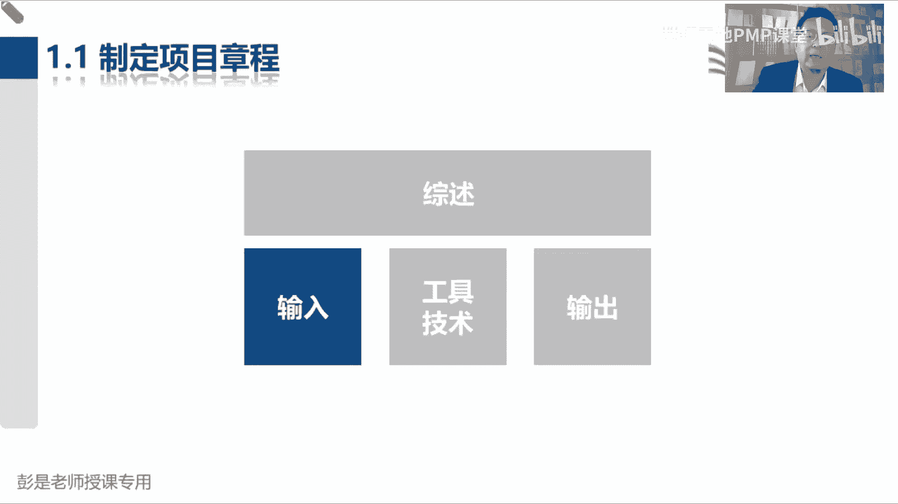
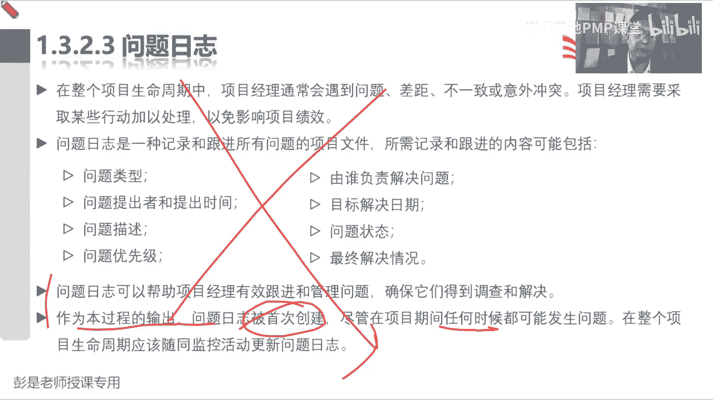

# PMP考试培训课程第1-13章节免费完整版 - P6：第四章：项目整合管理 - 慧翔天地PMP课堂 - BV18y421e7ut

这张表啊，实际上大家后面怎么背，是有很高的一个技巧的，能够大概理解每个管理过程，它的工作重心为什么有这个过程呢，这个过程主要做什么事儿呢，它的作用是什么呢，它的目的是什么呢。

熟练地掌握每个管理过程的重要的作用，整合这一章单独背，只要大家记住了，pd c a戴明环不断的计划执行监控改进，pd c a就衍生出来了五大过程组，是说项目从开始到结束，我们把项目分成N个阶段。

在每个阶段之中啊，这个阶段一开始的时候都需要得到授权，这个阶段的工作呀，我们需要做做计划，这个阶段的工作，计划定好了之后啊，我们要按照计划去执行，这个阶段执行的好与坏呢，我们需要监督和控制。

最后呢这个阶段的工作做完了之后，我们要做首尾，所以每个阶段都有五大过程组，通过启动过程组来给我们做授权，通过规划过程组来规划这个阶段，或者是整个项目的行动方案，就是我们的计划。

然后呢每个阶段的工作呀都有执行过程组啊，每个阶段的工作都需要监督和控制，就有了监控过程组，最后这个阶段的工作完成，我们要总结归档，把成果移交给下一个阶段，所以呢都有收尾过程组诶，就记住了五大过程组。

那五大过程组的关键词就清楚了吧，授权做计划，执行监控和收尾，那五大过程组就带出来六个关键词，为什么是六个关键词呢，因为启动过程组主要是授权规划，过程组是做计划，做行动方案，执行过程组是按照计划去干活。

监控过程组是两个事情，监控监控监控除了第一个，看看工作做的怎么样了，这叫绩效，看绩效吧，看看活干的咋样了对吧，看看活干的咋样了，这是绩效，第二呢我们要管理好各种各样的变化呀，管变更。

所以监控过程组两个关键词，最后呢收尾过程组，这是纯粹的这么意思了，总结归档，做好移交，那五大过程组带出来六个关键词，再看看整合这一章，六个管理过程就出来了，授权我们需要有一个文件。

正儿八经的说一下项目经理是谁，正儿八经的介绍一下我们要做什么事，正儿八经的说一下项目经理有啥权利，嘿就通过制定项目章程，这个管理过程标志着项目的开始，标志着对项目经理的正式授权，那规划过程组做计划。

所以项目经理啊，要带着兄弟们制定项目管理计划，告诉我们这个阶段，或者是整个项目到底要做什么事情，然后呢执行过程中呢是按照计划去干活，完成工作，按照计划去干活完成工作，在执行的过程中。

我们是这个乐队的指挥啊，拿个小棒棒来回来回来回干什么呢，叫指导和管理项目工作，对不对，咱不干活，咱是领导，所以呢叫指导与管理项目工作，到了监控过程组两件事情，一个是管绩效，一个是管变更。

管绩效呢我们就叫监控项目工作，监工监工监工啊，对不对，监控项目工作吧，管变更呢就有了实施整体变更控制，因为牵一发动全身范围发生了变化，可能会影响到进度，成本质量资源风险，对不对，进度发生了变化。

可能会导致我们的范围，成本质量资源风险产生连锁反应，所以呢叫实施整体变更控制，强调的是一个整体呀，要有大局观的，不能不能各扫门前雪呀，嘿它主要的作用是综合评估，综合分析，从整体上来讲。

这个变更对项目到底是有利还是不利，这就是实施整体变更控制，最后的阶段结束项目结束，我们就结束项目或阶段好了，五大过程组带出来六个关键词，整合这一章，差不多了吧，最后再加一个管理项目知识管知识，管知识。

就是看看咱在项目中学到了啥，把学到的东西，学到的东西，好记性不如烂笔头，要给他沉淀，总结积累下来，做好知识的分享，知识的传递，知识的交接，知识的转移，这是这个这个管理过程啊。

所以整合这一章呢单独记就有了七个管理过程，有了七个管理管理过程之后啊，再看看啊，从范围管理到相关方管理，接下来我们在场景吧，咱是皇帝，咱是项目经理，咱是乐队指挥，高高在上，下面有九个大臣。

分别负责范围进度成本质量资源沟通风险，采购相关方，那九个大臣啊，我们就会发现九个大臣干活的时候啊，都有一头一尾，就是范围怎么管，需要有规划，进度怎么管，需要有规划，成本怎么管呢，也需要规划呀。

质量资源沟通风险，采购相关方都需要规划，这是有头啊，有头必有尾，规划完了就得控制，所以呢有了控制范围，控制进度控制，成本控制，质量控制，资源监督沟通监督，风险控制，采购监督相关方参与，291 18。

291 18搞定了吧，然后接下来再搞定什么呢，再搞定啊，和别人不一样的，和别人不一样的知识领域，比如说啊拿眼睛一看唉，这个管范围的同事啊，管范围的同事很各色呀，别人在监控过程组都是一个管理过程。

你有两个，他多了一个确认范围吧，哎确认范围这个管理过程主要的工作就是验收，那这个管理过程呢就单独记，再看看有没有和别人不一样的呢，启动过程组诶，九个大神在启动过程组都没活。

只有相关方管理有识别相关方这个管理过程，这个玩意儿单独记，所以呢加一个再加一个，现在一共有27个管理过程，现在一共有27个管理过程了吧，整合这一章有七个，然后呢九个大臣都有规划，九个大臣呢都有控制。

加上一个单独的确认范围，加上一个单独的识别相关方，一共有27个管理过程，一共49个，减去27个，还剩22个，这22个管理过程，这是大家需要重点去看的东西了，并且大部分管理过程的名字基本上也不难猜吧。

对吧，收集需求定义范围对吧，想想什么识别风险就比较好理解啊，剩下不好理解的就是一定一定对吧，不管是你复习呀，还是我们讲完课，你做预习，不管是复习还是预习啊，一定要尽快的尽快的把它背下来，需要背需要背啊。

因为这些管理过程，如果你不熟悉后面听课的时候，包括给大家去梳理这个逻辑的时候，你就可能跟不上，跟不上效率就低了，对不对，所以尽快的尽快的，今天课后会给大家留作业的啊，尽快把这49个管理过程把它背下来。

知道每个过程的作用，它做什么事情，做什么事情啊，W p s，现在我们不展开讲，亲，现在一展开讲，大家就散了，因为大家还没有学到啊，没有学到的怎么办呢，预习之前给大家开通了串讲课呀，对不对。

再看看教材里面关于创建w vs，这个管理过程是怎么描述的，做预习啊，好尽快的熟悉的尽快的熟悉的，只要熟悉它的作用就可以了啊，说老师啊，这个管理过程，这个管理过程啊，有一大堆文字写输出输出。

有一大堆文字写输入，现在预习的时候可以先不看这些东西啊，只要大概了解一下这个管理过程，它为什么为什么有他干什么事，他干什么事，要了解它的作用，所以了解的程度越深，了解的程度越深，哎这个记得记起来就越快。

所以记忆和理解相辅相成，缺一不可，这是关于这张表大概怎么背，给大家分享一个小技巧好，那接下来我们就正儿八经的准备，开始讲项目的整合管理这些东西了啊，说刚才有同学问啊，五大过程组项目经理都需要参与吗。

都需要都需要这段关口和收尾过程有关系吗，不一样不一样，两回事，收尾就是打扫战场，总结归档移交对吧，电脑关口是做决策，决定项目是不是还有可行性啊，是不是还有价值啊，要不要继续往后走啊，它是两回事吧。

好规划过程组，每个管理都需要记住，会默写吧，需要需要需要这东西没啥可商量的啊，大家学习找到好的学习方法啊，老师啊，这个需要记吗，老师啊，这个需要这个不需要记，不需要背吗，特地说了49个过程。

你把它尽快的记住，这就不需要商量了，不要一个一个问了，不要一个一个问了啊，这个东西如果都不需要记的话，咱考试考啥呢，就没得考了啊，没得考了，对不对，所以大家这是给大家留下第一个艰巨的任务。

第一个艰巨的任务啊，就像这个玩意儿，其实啊持之以恒就够了，所以各位同学呀，可以考虑可以考虑做一个什么事情呢，把这张表打印出来，打印出来啊，多打印几份啊，放到你的包包里，放到你的床头，放到你的饭桌上。

放到你的工位上，变成你的电脑，电脑背景，变成你的手机，手机屏保，没事拿出来翻一翻，没事拿出来翻一翻啊，好你怎么数不是49个呢，这个数数不需要我教了吧，带着大家花花一分钟时间做个手术练习吧，不用了啊。

怎么数都是49个呀，嗯可以的可以的，班主任可以可以在微信群里面发个高清版的，大家实际上发的课前发的那个，那个给大家发的邮件里面都有啊，大家自己仔细看一看，然后那既然这个话题提出来啊。

咱再讲完给大家再说一句话，咱们休息一下，个人建议说个人建议啊，个人建议大家最好啊打弄个word，弄个excel，你没事啊，敲一遍其实用不了太多时间了啊，几分钟就可以了，对不对，没事敲一遍。

敲的过程呢就是书写的过程啊，其实也是对记忆，对记忆，对记忆，对大脑啊做巩固的这样一个过程吧，这叫授人以鱼不如授人以渔对吧，然后拿如果拿一个现成的表格，你只是看只是看这个参与度是不够的，大脑不重视的。

个人建议呢就是写一写呀，然后拿个excel没事没事往里面敲一遍，对不对，也不需要一次把49个都挑出来，逐个击破大目标变小目标，比如说今天我搞定范围对吧，明天我去熟悉一下进度管理，后天学习一下成本管理。

这这目标一变小了，就很容易完成了，对不对，成本管理就这么四个东西啊，规划控制，算成本，做预算相对来说就效率会高的很多啊，对不对，好个人小建议啊，那接下来各位同学来给大家缓口气休息一下。

然后正儿八经的开始讲项目的整合管理，现在是10。56，咱还休息8分钟时间，准时回来，好各位同学准备了准备了，还有十秒钟时间说先预习，再听直播，再听回放，然后再做题，少了一个环节要看书，要看书，对不对。

不断的通过阅读文字可以提高我们的阅读速度，阅读特效，阅读的效率，阅读的质量，课后习题是叫新版习题册吗，是的是的是的，所以一定要看书啊，通过阅读这些文字，更好地巩固我们讲过的知识点，刚才说老师讲的太快了。

不快呀，上节课的时候听完了之后，就知道项目的成功标准，反对吧，多快好省，然后呢，再考虑到这些东西的变化会引起资源的变化，资源的变化也会引起这些东西的变化，所以再加上资源和风险，共同构成了六大制约因素。

最后大家加上牵一发动全身好，现在记不住没关系啊，因为接下来的课主要就讲十个知识领域，好，接下来接下来电子版和纸质版的习题是一样的，是一样的啊，大家一定仔细看，班主任发的群通知都会告诉你的。

那接下来各位同学啊，我们再去梳理啊，说五大过程组带出来六个关键词对吧，授权，然后制定行动计划，行动方案去干活，然后呢管绩效和管变更，最后呢首尾纯粹的字面意思啊，没啥可念的。

那五大过程组带出来六个关键词就引出来，仅整合这一章七个管理过程，制定项目章程，制定项目管理计划，指导与管理，项目工作管理，项目支持监控项目工作，实施整体变更，控制和铁路项目或阶段。

接下来正儿八经的开始说了啊。

那进入到整合管理看一看啊，说项目整合管理包括对立，属于项目管理过程组的各种过程和管理活动，进行识别，定义组合统一协调的各个过程，其实管的是什么呢，就是除了整合这一章啊，下面那个对吧，42个管理过程啊。

下面42个管理过程，牵一发动全身，他们之间存在着千丝万缕的管理关系，所以呢需要我们来整合，有大局观来去分析识别呀，我们项目到底需不需要哪些管理过程呢，有的过程比较大了，可能需要进行拆分。

有的过程可能比较小诶，需要合并，这就是项目管理，项目整合管理，项目经理的主要工作，所以整合管理包括以下选择，包括资源分配平衡，竞争性的需求对吧，范围进度成本质量哈，大家的需求期待不一样啊。

研究各种备选方案，为实现项目目标而裁剪过程，管理各个知识领域之间的依赖关系，就是因为九个大臣牵一发动全身，九个大臣的42个过程，存在着各种各样的关联关系，对不对，所以我们要整合，不要各扫门前雪。

嗯这段文字看一遍OK了，那再往下现在课件上的这张图，大家教材上没有，课件上的这张图，大家教材上没有啊，大家现在需要做的是什么呢，专心听专心听啊，因为我们要去要去离，要去思考了，我等会换一下啊。

要去思考啊，这七个管理过程他做什么事。

做什么事就带出来，这七个管理过程，等会换到这页PPT。

我们要知道每个管理过程的重要作用，就是为什么有这个管理过程，然后再去思考这个管理过程，咱们干完了之后会得到一个什么成果，成果呢，就是这个管理过程的输出，知道了作用，知道了输出再去倒推诶。

那干这个活的时候，我需要什么样的输入，最后再去思考，那这个工作怎么干呢，我需要用到什么样的工具和技术，最后就变成了五大过程组，十大知识领域，49个管理过程，以及这些管理过程的输入输出工具技术。

并且呢它通常一个管理过程的输出，很可能就是下一个管理过程的输入，因为它就是通过输入输出去相互串联，相互关联，让我们知道整个体系是怎么运作的，所以啊后面大家学习学习的过程中啊。

大部分的管理过程肯定是需要大家记住的，49个吧，然后呢每个管理过程有一些关键的输出，主要的输出，重要的输出，这是百分之百要记住的，甚至有一些输出的内容对吧，说什么章程里面都写什么东西呢。

项目计划里面包括什么东西呢，还甚至包括这些输出的内容也需要大家掌握，那还有一些非必要的输出，就是边边角角的输出，记得住，记不住根本就不重要，那收入呢其实大部分的收入啊都不用背，大部分的收入都不用背啊。

但是未来我们需要达到这样一个状态去判断呢，这个玩意儿能不能作为输入呢，对不对，比如说制定项目章程，制定项目章程，现在我们应该有了几个文件了，商业论证效益计划，这两个玩意儿肯定是收入，为啥呢。

我们要保持目标的一致性嘛，我项目的项目的章程，和之前之前发制人作的可行性研究的结果，要一样的诶，所以他作为这个管理过程的收入，像这样重要的收入，我们需要能够把它猜出来，所以大部分的收入不太需要去背啊。

那工具技术对吧，就像刘同学说的啊，工具技术老师啊需要背吗，工具技术其实分两种，一种叫什么呢，叫通用的，每个管理过程可能会涉及到一些，通用的工具技术，通用的工具技术的意思就是说呀这些工具。

这些技术它适用于任何一个管理过程，或者是很多管理过程，比如说访谈对吧，干啥活可能都要访谈的，找别人聊一聊这个情况啊，所以就像这种通用的工具呀，不太需要去记，不需要去记它属于哪一个管理过程。

因为它是通用的，那这种通用的工具呀，我们要知道这个工具的特点，这个工具的特征，这个工具可以帮助我们完成什么工作，这一定要掌握好对吧，就像就像大家最好理解的场景，咱开的那个牛肉面馆还记得吧。

吃牛肉面用什么工具最方便，筷子为什么呢，因为我们知道这个工具的特点，我们我们还知道这个场景，还知道这个场景对吧，面条的特点是什么呢，又长又细啊，打勺不不方便啊，拿勺不方便啊，对不对，用筷子给它夹起来。

吃起来比较方便诶，这是根据场景，根据这些工具技术的特点特征，我们可以很轻易的很轻易地去判断用什么方法，用什么工具，用什么技术对吧，吃面用筷子喝汤，用勺用勺对吧，那吃面能不能用勺呢，如果没有筷子的情况下。

如果没有筷子的情况下啊，失恋能不能用勺呢，也可以，因为没得用啊，因为没得选呢，唉像这种通用的工具，我们找到相对来说最合适的一个选项就可以了，然后还有一些管理过程呢，有一些专用的工具，有一些专用的工具啊。

别人用不上的，别人用不上的啊，这种专用的工具啊，就需要大家去记住它了，这能听懂吧，专用的工具别人用不上的对吧，比如说我们有一个包饺子的机器，包饺子的设备，这个设备能不能用来做面条呢。

不能它只适用于包饺子这个场景，唉这种专用的工具就需要大家记了，所以其实其实给大家最后留的需要记的东西啊，没有特别多呀，49个管理过程关键的输出，你大概大概一猜也就40几个，甚至都不到40几个哈。

专用的工具呢有多少呢，其实也没有几十个，有没有特别多呀，大部分的东西都是通用的，不太需要刻意的去背了，先给大家说一个，咱们整个整个这些49个管理过程，一大堆的130几个工具和技术，然后呢输出其实不多。

输出一共33个文件，再加上12个计划，再加上三个基准，也就四五十个，然后呢这些这些听起来多，但是呢整个十个知识领域讲完之后，你就会发现反复讲重复讲，反复讲，重复讲，循环讲。

所以真正需要大家刻意的去背的东西不太多，不要有思想，让他负担啊，不要有包袱，好知道了怎么学，知道怎么怎么学啊，现在我们开始大家集体来猜，集体来猜啊，制定项目章程，输出啥，这需要猜吗，规则是什么呢。

这是制定什么就输出什么呗，制定项目章程，那它的输出就叫项目章程诶，这个输出还用背吗，不用背啊，那以此类推，制定项目管理计划，输出什么东西呢，这是项目管理计划，这也不用猜了吧，好第三个需要猜一猜啊。

指导与管理项目工作，指导与管理项目工作呀，说我们刚才按照计划去干活，咱是项目经理啊，咱是指挥官啊，对不对，让大家张三李四，王五赵六，各司其职，那按照去按照计划去干活，会得到一个什么东西呢。

按照计划去干活，会得到可交付成果，对吧，按照计划去干活，会不会得到可交付成果呀，我们那个餐厅，比如说你要装修，按照计划去装修，就会得到装修好的房间对吧，比如说买设备，按照计划去干活，就会得到买好的设备。

按照计划去干活，就会得到美好的原材料，这就是我们的我们的可交付成果，按照计划去给餐厅做画图纸，就会得到设计图纸诶，这就是可交付成果，是这个管理过程最重要的输出了，那1。4管理项目知识，管理项目知识。

刚才我们说呀，看看大家在工作中学到了什么东西，把大家在工作中学到的东西，吃一堑长一智的这玩意儿，吃一堑长一智的这个东西啊，要把它记下来，因为好记性不如烂笔头啊，记下来记下来。

我们需要有一个单独的文件对吧，去记它，所以吃一堑长一智，就会得到一个经验教训，那季度经验教训的这个文件就叫经验教训，登记测，纯粹的字面意思，所以1。4他重要的输出叫经验教训登记册，经验教学登记册啊。

好1。5，监控项目工作，快速脑补第一节课说过那三个东西啊，绩效数据，绩效信息，绩效报告，对不对，朕朕才是项目经理啊，朕作为项目经理，我们需要拿到九个大臣的工作绩效信息。

我们需要拿到九个大臣的工作绩效信息吧，范围的进度的，成本的，质量的，资源的，沟通的，风险的，采购的相关方的，拿到九个知识领域的绩效信息，然后正正正来干什么事儿呢，总结概括归纳，评估分析变成整个项目的。

变成整个项目的工作绩效报告，哎所以这个管理过程输入工作绩效信息，输出工作绩效报告，然后快速的想一想上节课说的数据到信息对吧，就像刚才各位同学说，嗨，1。3指导与管理项目工作，除了除了可交付成果啊。

还需要输出第二个输出了，他需要输出原始的工作绩效数据，这个绩效数据啊交给九个大臣，监控过程组的这些管理过程，然后呢他们把它变成各个知识领域的计效信息，项目经理拿到各个知识领域的这条信息。

我们进行分析评估，总结归纳概括变成整个项目的工作情况的报告，这叫工作绩效报告，所以1。5输出的就叫工作绩效报告，好一点，二六实施整体变更控制，这个管理过程很特殊，需要单独记了，实施整体变更控制。

正整体变更控制，他输出的话其实有两个，一个叫变更日志，变更日志，变更日志既然叫变更的日志，那就是说呀我们需要把所有的变更给他记下来，避免扯皮，避免耍赖，避免不认账，所以把收到的所有的变更都需要记下来。

都需要记下来啊，它的输出就要变更日志，先提到这个场景，最后结束项目或阶段，这个也需要单独记，为什么呢，结束项目或阶段，是说我们这个阶段的工作可以结束了，或者是第二个阶段的工作可以结束了。

或者是说第三个阶段的工作可以结束了，或者是说整个项目的工作可以结束了，需要倒推它的前提条件，什么情况下，我们可以开始对第一个阶段的工作做收尾呢，什么情况下，我们可以开始第二个阶段的工作做收尾呢。

它的前置条件就是它的关键的输入叫验收，只有阶段性的工作和成果通过了验收，我们才能够收尾啊，对不对，第一阶段验收通过才可以开始收尾了，第二阶段验收通过，我们开开始对第二个阶段做收尾。

第三阶段验收通过整个项目验收通过，我们开始结束，第三个阶段，结束整个项目，所以他关键的输入叫验收的可交付成果，那阶段主要结束项目或阶段主要工作是啥呢，首尾首尾首尾总结归档和移交，所以这个管理过程。

重要的输出就叫最终产品服务成果的移交，把第一个阶段的成果移交给第二个阶段，把第二个阶段的最终成果移交到第三个阶段，第三个阶段的工作完成，把最终的产品服务成果移交给客户，移交给运营，就这个东西啊对吧。

比如咱那个牛肉面馆，有一个阶段的工作叫设计设计阶段，设计阶段一旦我们的图纸通过了评审，通过了验收，就可以把设计设计阶段产出的成果，各种各样的图纸移交给第二个阶段，第二个阶段。

我们的工人就按照你的设计图去施工去了诶，那施工好的房子，施工好的房子啊，这是这个阶段的主要成果，这个阶段的成果一旦通过了验收，就把施工好的房子移交给第三个阶段，第三个阶段，比如说做保洁，做开荒诶。

那他们拿到这个成果就开始打扫打扫，我们的打扫，我们的餐厅，打扫完成，我们应该验收，通过打扫好的房间，就变成我们的这个阶段的成果，我们就可以把这个东西移交运营了，以此类推。

所以结束项目或阶段输入就叫验收的，可交付成果输出就叫最终产品服务成果的移交，这些管理过程的输出是一样的，输出是一样的哈，但成果不一定是同一个呀，刚才说设计阶段的成果是图纸，施工阶段的成果是房子是吧对吧。

打扫战场的开荒保洁的成果是打扫好的房间的，所以他们都叫可交付成果，但是呢从逻辑上来说，每个管理过程的输出这个术语是一样的，这叫可交付成果，这个可交付成果到底是什么呢，取决于不同的工作呀，好聚焦啊。

所以知道了这个大道理，知道了这个大道理啊，监听专心听，专心听，这张图就带出来，每个管理过程一些重要的输入和输出，大家教材上没有这张图啊，好心的同学呢想想记住这张图的同学呢，可以截个图，不想记的同学啊。

不想记这张图的同学，就在就在每章每个知识领域，这个ITTO这张图上对吧，每张每每个每个知识领域开篇都有这张图啊，大概介绍一下这一章有什么管理过程，大概介绍一下每个管理过程的输入输出工具。

在这张图上做做标记也可以吧，但是记住啊，这张图不代表着全部为了大家，未来大家复习的时候，未来大家复习的时候，所有的图都只是示意一定要去看文字描述，去看一看这个文字是怎么写的。

只看图做复习的话是不够的不够的啊，不然你永远不知道它里面文字写的是说，这个管理过程为什么需要这个东西呀，这个管理过程为什么用到这个工具呀，这个管理过程为什么有这个输出啊，输出有什么内容呢。

不看文字永远不知道啊，你永远不知道好知道这个大道理啊。

再看这张图开始讲了，大家专心听，专心听，不要着急截图啊，等听完了知道听完了之后再截图来得及啊，咱先做减法，把刚才讲过的知识点给它去掉，先搞钱去吧啊，制定项目章程，出章程搞定了制定项目管理计划。

出管理计划，搞定了指导与管理项目工作出可交付成果，搞定管理项目知识，出经验教训，登记册搞定监控项目工作，出绩效报告，搞定实施整体变更，控制出变更日志，搞定结束项目或阶段，出最终产品服务成果的移交搞定。

先把七个主要输出给他搞定，然后接下来慢慢去梳理里面的其他的逻辑，比如说比如说啊，刚才讲过一个小逻辑，是说咱指导与管理项目工作，这个管理过程要输出原始的工作绩效数据，这个原始的工作绩效数据啊。

项目经理拿到手里是没用的，我们需要交给九个大神，把它变成九个知识领域的工作，绩效信息变成了九个知识领域的工作绩效信息，项目经理拿到这些绩效信息，通过监控项目工作，这个管理过程我们经过分析总结，归纳概括。

变成整个项目的工作绩效报告，这个小逻辑要掌握吧，哎所以在结合前面讲过的课程。

再看这张图，大家想一想还记得吗，说指导与管理项目工作，产出原始的工作绩效数据，这个绩效数据啊，就作为九个大臣在监控过程组，这些管理过程的输入，九个大神在开展这些管理过程的时候，拿到原始的工作绩效数据。

和我们的计划来进行比较，看看有没有不一样的地方，有没有偏差，对不对，它就变成了九个知识领域的工作绩效信息，所以后面大家学习的时候会看到确认范围，输出范围，输出工作绩效信息，控制范围输出工作。

绩效信息控制进度输出工作绩效信息控制，成本输出工作绩效信息，以此类推，这些管理过程都会输出工作绩效信息的，那这一大堆绩效信息呢，就作为监控项目工作这个管理过程的输入，项目经理经过你的分析总结归纳概括。

变成整个项目的工作绩效报告。

就这套逻辑啊，好再带到这张图上。

这个123这个顺序要把它捋清楚，再看看再看看啊，那唯一现在需要掌握的就是变更实施，整体变更控制这个管理过程了，这个管理过程啊有非常重要的一个原则，这是他的输入，因为牵一发而动全身，说有人提了个新需求。

改变了项目的范围，会不会影响到进度，成本质量，资源沟通风险，采购相关方呢都有可能对吧，进度落后了，我们想赶工期啊，可能需要增加资源的，增加资源呢有没有可能影响我们的范围，进度质量成本资源风险。

以此类推呢都有可能，所以它重要的原则就是，不管是什么样的变更，不管是哪一个知识领域发起的变更，所有的，所有的变更请求必须交给项目经理，不管是范围的，进度的，成本的，质量的，资源的。

任何一个知识领域发起的变更，都要交给项目经理，所以项目之中所有的变更啊，都要由项目经理对他进行管理，因为只有项目经理能带着兄弟们，进行整体的分析和评估啊，咱做整合呀，哎所以它的输入就叫变更请求。

这个变更请求从哪来的呢，任何一个管理过程都可能把它作为输出，对不对，所以他是那个输入变更请求，他是哪个哪个管理过程的输出，根本就不用记啊，然后呢，最后最后一个小逻辑。

就是他的第二个重要的输出叫批准的变更，批准的变更请求，作为指导与管理项目工作的输入，这是又在强调什么玩意儿呢，说变更批准了，变更批准了作为指导与管理项目工作的输入，但在强调什么的重要性呢，就这两个字。

通知信息同步，信息同步的重要性，比如说比如说啊，咱们下下周有课吗，假设假设有课啊，我记不住啊，假如我们下周有课，然后呢，我现在说我要请假，我不想讲了，我要请我要休假，唉这就是一个变更请求。

这个变更一旦被批准了，要不要第一时间通知咱们各位同学呢，要不要第一时间通知咱的班主任呢，让大家都知情啊，这个变更被批准了，大家上课别上错了，对不对，诶，就是这个逻辑啊，所以一旦变更被批准。

他就作为指导与管理项目工作的收入说呀，我们要第一时间通过这个管理过程，告诉我们的兄弟们对吧，现在有变更被批准了，我们我们需要按照新的批准的变更去干活，干活儿，别干错了，就这个逻辑吧，唉。

所以他就在强调批准变更，批准变更通知落实执行这个事情的重要性，干活别干错了对吧，比如说周六周六周六上课改成周日了，要不要第一时间通知大家呢，这个道理一模一样啊，所以就在强调这个东西的重要性。

它就作为实施整体变更控制的输出，然后这个输出呢就流入到了指导与管理，项目工作，作为这个管理过程的输入，这个把它搞定搞定之后啊，这一章再扫一眼再扫一眼啊，制定项目章程，出章程，制定计划出计划。

指导与管理项目工作出成果，然后呢管理项目知识，出经验教训，登记册监控项目工作，出绩效报告，实施整体变更，控制出变更日志，结束项目或阶段出最终产品服务成果的移交，单独搞定这些东西，然后再梳理逻辑。

梳理逻辑就是原始的工作绩效数据，交给九个大臣，变成九个知识领域的工作，绩效信息在交给项目经理，我们把它变成整个项目的工作绩效报告，第二个逻辑是什么呢，所有的变更请求一定要交给项目经理。

只有项目经理能够带着兄弟们对整个变更，对整个变更，从项目这个层面上，大局观做综合的分析，综合的评估，所以要实施整体变更控制呀，嘿第三个需要记住的就是变更，一旦被批准，咱要第一时间告诉兄弟们。

干活被干错了，所以实施整体变更控制，输出了批准的变更请求，这个玩意儿作为指导与管理项目工作的输入，最后结束项目或阶段，需要牢牢记住他这个重要的标志性的收入，就是验收阶段性的成果，或者是工作通过了验收。

或者是整个项目的成果和工作通过了验收，我们就可以开始扫尾，打扫战场，总结归档移交，所以它标志性的收入就叫验收的可交付成果，这个要记住，最后最后最后再看这个结束项目或阶段，这个输出像结束项目或阶段。

最后这个输出啊，最终报告这玩意儿根本就不用记了吧，只要你大概能猜到绩效报告是什么东西，能够判断出来，最终报告和绩效报告好像不太一样，能够把这个点猜出来，这个输出就可以不记了，他俩的区别是什么呢。

绩效报告是根据项目的沟通需求，我们定期汇报的工作吧，周报双周报，月报，季报年报诶，根据项目的生命周期，根据项目的实际情况，定期给老板做的汇报，那最终报告指的是什么呢，更侧重于说阶段性的情况对吧。

或者是整个项目的情况，阶段性的报告对吧，第一阶段搞定了，第二阶段搞定了，第三阶段搞定了，我们对当前阶段做一个全面的总结，所以他俩内容上差不多，内容上是差不多的啊，区别就在于频次，频次频率，好知道了。

整合这一章，整合了一张大概的比较关键的这些输入输出，能能给他看明白，能给他看明白，知道他记住那几个小逻辑，记住那几个小的重要的原则，其实就可以了，不同知识领域的工作可以同时进行吗，当然可以啦。

但通常有一个大概的顺序吧。

还没讲到呢，不着急啊，好知道了这七个管理过程的大概的作用，还有重要的输入输出，再看文字效率就好就好，效效率效果就好很多，制定项目章程，编写一份正式批准项目，并授权项目经理。

在项目活动中使用组织资源文件的过程，给我们授权，授的是什么权呢，可以让张三李四王五赵六来干活，体现我们使用资源这个事情的合法性，对不对，所以看到这这些单词啊，就想到刚才我们说过的权利类型啊。

企业给我们授了权利对吧，管理项目的正式权利，职位权利，然后呢大家干活干得好啊，可以奖励大家呀，大家干活干的不好啊，可以惩罚大家呀，这是企业给我们的正式授权，第二个管理过程啊。

定义准备和协调项目计划的所有组成部分，把它们整合成一份项目计划的过程，那就是出当前阶段或者是整个项目的计划，第三第三个过程啊，说为实现项目目标，而领导和执行项目计划中所确定的工作，所以变成大白话。

就是按照计划去干活，得到可交付成果，按照计划去画图，得到图纸，可交付成果，按照计划去施工，得到装修好的房子，可交付成果，按照计划去打扫打扫房间，得到一个打扫好打好打扫好的房间，这都叫可交付成果呀。

第二个事情呢叫实施已批准的变更，这大叔变更请求一旦被批准，我们要第一时间通过1。3告诉兄弟们干活，别干错了通知，然后通知大家去落实，去执行，按照批准的变更去干活，所以他两件事情就代表着这个管理过程。

比较两个输入，然后1。4管理项目知识，这没啥说的，使用现有知识生成新知识罢了吧，帮助大家学习学学学，学到的东西最好把它记下来，所以呢他的输出就叫经验教训登记册，1。5。

监控项目工作叫跟踪审查和报告整体项目进展，跟踪审查和报告整体项目进展，跟踪审查报告，这是我们拿到九个知识领域的工作绩效信息，经过我们的分析评估总结归纳概括，变成整个项目的工作绩效报告。

所以这个管理过程很标准，这把输入计算信息中间一堆工具，最后出出报告那1。6，实施整体变更控制，就要审查所有的变更请求，所有的变更请求都要交给项目经理，然后呢并对变更处理结果进行沟通的过程。

变更处理的结果就是批准否决，批准否决吧，如果是否决的，不需要告诉成员，这个道理能想明白啊，如果是否决的，被拒绝的变更不需要通知各位同学对吧，班主任不会发这样的群公告的，什么群公告呢。

结果呢被老板被老板被老板拒绝了，现在呢告诉大家，这样的同时不会发出来的，所以批准的批准的变更和否决的变更，他这个重要程度不一样啊，否决的变更不需要广而告之，但是批准的变更就一定要广而告之了吧。

他就作为指导与管理项目工作的收入，告诉大家干活被干做了，最后呢结束项目或阶段存在的字面意思，解除项目和合同，所有活动的过程再看文字就简单多了，看完文字之后啊，这还不够还不够啊，为什么呢。

现在只是学到了皮毛，还需要去掌握，深入掌握每个管理过程，输入啊。

输出啊，具体的工具基础吧，所以大家后面复习的时候只学到现在还不够啊，继续往后看，好看看第一小段核心概念，这段这段文字啊，说项目整合管理由项目经理负责，犯困的同学想办法啊对吧。

有同学已经给出来了物理攻击的方法了对吧，头悬梁锥刺股，站起来走一走，伸个懒腰，还可以魔法攻击哈，好项目整合管理由项目经理负责，虽然其他知识领域可以由相关专家，比如说成本啊，进度啊，巴拉巴拉。

但是项目整合管理的责任不能被授权或转移啊，只能由项目经理负责，整合所有其他知识领域的成果，并掌握项目的总体情况，项目经理必须对整个项目承担最终责任，这几个单词给大家标出来，大家有什么感受呢。

不能只能所有，必须最终这些用词都是什么性质的词，什么性质的单词呢，都叫绝对用词吧，都具有绝对性吧，唉不能只能所有必须最终它是绝对用词，对不对，说的非常非常非常确定，那未来大家在复习的过程中。

看到这种绝对用词就单独标一下，这就是说明什么呢，百分之百没得商量的，百分之百要把它记住的，百分之百要把它记住的啊，好，好问题来了，同学说啊，老师啊，肉矩阵只能行，弱矩阵只能行，咱背不起这个，抱歉啊。

稍等稍等说老师啊，弱矩阵只能行，刚才你刚说过对吧，谁有权谁负责，谁有权谁负责诶，在弱矩阵和职能型组织结构之中，项目经理不承担最终责任对吧，那你书上这么写就不科学，书上这么写就不科学吧。

所以需要大家记住叫一个东西啊，这个东西是什么呢，唉就像某某同学提的这个问题，此时的项目经理是指项目型的项目经理吗，不是要记住一个潜规则，我们所有的教材，包括未来大家考试的时候，所有的试题，所有的试题啊。

默认情况下都是至少至少至少是平衡矩阵，从平衡矩阵这个视角去描述，我们应该做什么事情，从平衡矩阵这个视角去分析这个题目，我们应该怎么做，怎么处理，除非题目明确的告诉你，你是一个弱矩阵，你是一个智能型。

否则所有的视角，所有的视角都默认是平衡矩阵，潜规则嗯，钱谁的钱，哈哈谢谢提督，谢谢谢谢指正，那是因为那个字笔画太多，那个字笔画太多对吧，为了省事，我就写了这个钱，那大家用正确的字啊，很棒嗯。

好知道这个道理啊，所以所有的视角默认都是平衡矩阵，拐弯拐回来呀，那接下来接下来既然我们知道了这个潜规则，那就牢牢地记住，牢牢地记住这些铿锵有力的话术，好为啥不是项目型的视角呢，不一样不一样啊。

因为涉及到职能部门，职能部门的工作上的工作上的交集，你不一定有权利去通过，不一定是项目型吧，项目型你肯定有权利去管理职能部门，但是矩阵型矩阵型你不一定有权力去对人，对人发起命令啊，嗯好接下来。

那按照刚才同学们抛出的问题再去思考，再去思考啊，刚才我们学到了一个什么玩意儿呢，领导力风格，领导力风格啊，是说如果我们团队要有一个成熟的自组织团队，一个成熟的自组织团队，那我们就把权力交给团队了。

由团队完成工作的规划，执行和控制，由团队自己来做决策，自己来设定目标，那这段又说什么责任不能被转移，是什么意思呢，权利可以交给别人，但是最终的最终的出了问题，出了问题谁背锅，这不就是责任吗。

这个要想明白，工作可以授权，可以委托，这能听懂吧，这活儿我可以交给张三，交给李四，交给王五对吧，由你全权来代表我，由你全权文来代表我做这个事情，但是出了问题为谁是问呢，项目经理承担最终责任，锅甩不出去。

哎记住这个逻辑啊，权利可以通过授权的形式，通过委托的形式交给别人，但是最终责任甩不出去的啊，所以授权要慎重啊，所以你要去判断啊，团队是不是乘除啊，能不能达到，有没有达到自组织这样一个状态，如果没达到。

就草率的授权，还可能有风险啊，好所以大家根据根据你们那些好同学，好同学给给给给总结的这个结论去记啊，工作可以分配出去对吧，可以授权，可以委托，但是最终责任逃不掉的，谁让你这么草率的授权呢，对不对。

所以一定要想办法引导团队尽快的达到成熟，这样一个状态，你才敢授权，唉所以最后变成大道理，就是该管的就需要管，不该管的也别操心对吧，也别瞎管了，什么叫该管呢，就是团队不成熟的时候，该管就得管。

那如果团队成熟了，不该管，也别瞎管，就可以授权了，省点心吧，好这是第一段非常非常重要的一套价值观啊，记住这几个知识点，然后再往下就告诉我们说，项目为什么为什么存在着整合，这样这个这个知识领域。

这段文字也不念了，大家看一遍就可以了，就再说牵一发动全身，我们有九个知识领域，九个知识领域，还有42个管理过程对吧，他们都不能各扫门前雪，不能各扫门前雪啊，我们是个集体，我们要有大局观。

所以需要有整合管理，这段文字不念了。

然后再往下什么整合管理指的是巴拉巴拉吧，这一段文字就在说这七个管理过程，这也不念了，大家后面复习这段文字需要仔细看一看啊，看这段文字更好地倒推出来，这是哪个管理过程的工作。

这就是大概每篇每章每章开篇，咱们未来所有章节十个知识领域，十个知识领域的学习都是这么讲，先大概了解一下这个知识领域的全貌，然后呢再一个一个一个一个单独讲，看细节去思考这个管理过程做什么事。

这个管理过程输出啥东西，这个管理过程有什么收入，这个管理过程大概会用到什么样的工具，基础用到什么样的这些方法，再去看细节，从上往下不断的不断的去细化好，那知道了这一章大概的情况。

再看一点一，相对来说大家学习的效率就可以倍增了，因为已经讲完了。

看看这段文字，制定项目章程是编写一份正式批准项目，并授权项目经理在项目活动中使用，组织资源文件的过程，这句话我们已经见过了对吧，然后本过程的主要作用是明确项目和组织，战略目标之间的直接联系。

确定项目的政治地位，并展示组织对项目的承诺，这段文字变成人话，就是说呀我们告诉大家要干什么事，它通过项目章程的内容来体现，说我们这个项目和公司有没有关系，能能不能帮帮助公司实现什么目目标对吧。

然后确定项目的正式地位，因为它的批准标志的项目的正式开始啊，说明我们这个项目工作的合法性，合规性，并展示组织对项目的承诺，什么承诺呢，就是项目章程的内容对吧，成功的标准，推出的标准。

一会儿会看到文字就能更好的理解，所以这段文字的这段文字的内容啊，大家不太需要把它记下这种文字啊，你记下来没用的没用的啊，主要是要记项目章程里边到底有什么东西，就能倒推出来了。

就能倒推出来这个管理过程的意义和价值，所以这个管理过程输出项目章程，这肯定要记住输入靠猜的，是不是靠猜的啊，不太需要刻意的去背，因为在项目启动之前，发行做了很多事情，有需求评估商业论证，效益计划的制定。

他去分析这个项目的可行性和价值，那在在做商业论证的时候，他会写啊，他会写这四块核心内容啊，用户的业务需求是啥，然后呢我们公司的形式是啥，我们都有哪些方案可以满足用户的业务需要。

然后给公司提出它的合理化的建议和见解，建议我们采用哪一个方案，来满足用户的业务需要，以及为什么这么建议，为什么这么建议，就是说这件事情的价值和意义意义，有了商业论证之后，效益管理计划。

把实现效益的目标效益写出来，我们这个项目要赚多少钱对吧，然后实现效益的时间，项目结束以后，还是项目需要运营一段时间，短期效益，中期效益，长期效益，持续性效益都给他写清楚，那现在呢有了这些资料之后啊。

我们才会出章程，才会出章程啊，所以章程的内容要和可行性研究的结论，保持一致性，咱不能违背人家做商业论证，在做商业论证的时候给出的这些结论啊，所以要保持目标的一致性，它就作为这个管理过程的输入。

这是应该能猜出来的，然后呢第二个重要的输入呢就讲个大道理啊，如果我们是给外部客户做项目，如果是给外部客户做项目啊，我们项目章程要不要和协议保持一致性呢，合同里面说项目工期一个月。

项目章程里说项目工期两个月，这不行吧，这不行啊，咱就违约了吧，所以章程章程也要和协议和我们的合同，保持这种目标的一致性，所以如果是外部外部项目对吧，我们可能和会和客户签协议。

这个协议就作为这个管理过程的输入好，所以这个管理过程啊，输入搞定，输出搞定，还剩第二个输出，第二个输出啊，看名字，看名字啊，容易误会啊，假设日志它里边有啥呢，有啥有啥东西呢，这个玩意儿需要大家大。

大概未来未来达到这个状态啊，看到假设日能想到里面有什么东西，假设条件制约因素，假设条件制约因素啊，这个后面单独学就可以了，他是不是一点一制定项目章程的输出，根本就不重要，因为未来我们整个大项目过程中。

可能不断的去往里面写东西啊，假设条件和制约因素，随着49个过程的开展，都可能往里走更新，所以呢他根本就不需要去记它，属于哪个管理过程，不需要去记啊，这个假设日志先跳过的，跳过它，只要未来看到这个单词。

一会看后面的文字能反应过来，这里边写什么内容就可以了，输入输出都搞定，再看中间的工具，看中间的工具啊，饿了肚子咕咕叫了，专家判断猜吧，什么是专家，什么是专家呢，专家教授，砖头的砖智库，顾问牛人。

有权威嘿，所以专家判断后面讲到攻击攻击技术的时候，会说啊，这个术语它涵盖的范围非常非常非常非常广义，这个专家不一定需要得到某些机构的认可，不一定需要有相当高的资质，不一定需要有相当高的资格。

不一定不一定老板认为他是专家，他就是专家呀，他是指的是什么呢，在某些方面，只要有特定的知识技能经验，那么他就是这个领域的专家，非常非常广义对吧，我们开牛肉面馆，张三会会拉面，李四呢会煮面。

王五呢会配汤配汤，他们就是这个领域的专家，赵六会打扫房子，会擦桌子，擦得又快又好对吧，刷碗诶，我就是刷碗的专家，在某一个方面，某一个领域具有相关的专业知识啊，学校啊，技能啊，经验啊，技巧啊。

他就是这个领域的专家，不需要有很高的资质资格，不需要有什么权威性，哎所以它非常非常非常广义，这先搞定这个啊，不太需要去背一点一有没有专家判断，因为未来49个过程理论上来说都有，理论上来说都可以有啊。

好以此类推了，头脑风暴，大家觉得需要讲吗，头脑风暴的目的是什么呢，头脑风暴的目的是什么，发散思维，讨论讨论的目的是啥，星辰大海，再再往下再往下想一步，这个知识点都记住了，讨论的目的是什么呢。

创新集思广益，有更好的方法，更好的计划，群策群力哈，嘿集思广益，集思广益，就是看看能不能找到一些新的想法，新的观点，对不对，他重在创新，重在创新啊对吧，就像刚才同学说，大家中午吃什么，有什么好的想法吗。

现在我们就可以开展头脑风暴了吧，嘿看看能不能启发大家得到一些新的想法，新的创意，新的观点，新的见解，它重在创新这个这个工具技术也不需要背，它通用通用的啊，这一段内容都是通都是通用的。

通用的技术不需要背的啊，但是每个单词看完能反应过来它是啥，焦点小组，武汉热干面啊，我马上去武汉了，马上就能吃到热干面了，焦点小组这个需要猜了，焦点焦点是干啥事的，焦点不是核心团队。

具体问题具体问题具体分析，聚焦，聚焦于某些主题，或者是，话题，为什么focus focus为什么要聚焦呢，就是不要聊天聊歪了诶，它聚焦于某些主题，对不对，有特定的话题，现在我们在讨论知识点，大家专心听。

专心听，要聚焦，刚才我们在讨论中午吃什么诶，每个话题每个话题要有聚焦，对不对，要聚焦啊，不要聊无关的话题，这就是焦点小组最重要的作用，这是其实他要结合到大家沟通啊，讨论啊，包括开会呀。

诶我们可能会有特定的主题，不要讨论话题主题范围之外的事情，这能听懂吧对吧，今天我们开会来说一说，项目章程里面的什么风险呢，下一个会，我们来讨论项目章程里面的什么成功标准，唉干这个事儿了啊，聚焦于话题。

聚焦于主题，避免聊无关的话题，来提高我们开会讨论沟通的这个效率，所以看到他就想到主题这两个词就可以了，然后访谈不需要解释了吧，这是面对面的沟通对吧，一对一的沟通，真真同学中午想吃啥呀，归去来。

同学中午想吃啥呀，这就是访谈吗，获取信息，那冲突管理很重要，但是我们现在先不讲，后面再说引导引导，这也很重要，后面再说，他主要是到了那个那个到了那个范围，这一章再再展开说了啊。

会议管理到了沟通这一章再展开说，会议呢纯粹的字面意思就是开会，所以这这一大堆工具啊，不需要去背，不需要去背啊，它都是通用的，都是通用的，不需要去背，这些管理过程是不是属于这些工具地址。

是不是属于这个管理过程，工具技术是不是是不是连接输入与输出的呢，十的十的，这是真真同学，你就想场景现在要发起人写了这些东西，商业文件发起人可能和客户又签了合同，签了协议。

然后呢我们要写这个项目的项目章程，那章程咋写呢，我们可能把这些方法用一用，组织大家什么开会，对不对，开会组织大家头脑风暴想一想有没有新想法，开会的过程中要聚焦在某些主题领导的意见。

我们可能单独一对一的访谈和跟踪诶，他就是在提醒我们，在开展这个管理过程的过程中，可能会有可能会使用哪些攻击，攻击地主会使用哪些方法，你随便想一个场景去理解它就可以了对吧，比如我们那个公司啊。

有张三李四王五赵六，我们来一起组织会议，讨论项目章程的什么成功标准，那这个会要有会议管理告诉我们这个会怎么开，要有规矩吧，然后开会的过程中，开会的过程中啊，大家有的时候要想新想法，新观点，新的见解。

有的时候呢要不要聊无关的话题，要聚焦重要的领导人呢，我们可能一对一的访谈，那冲突管理更侧重于什么呢，就是大家的观点不一致，意见不一致，我们可能需要想办法让大家达成共识，引导技术更侧重于什么呢。

侧重于同理心，相互理解，对啊，比如说最最好理解的引导啊，就是技术人员和业务人员，技术人员和业务人员，大家因为背景不一样，观点不一致，很可能很可能难以相互理解，那我们要想办法让大家打战，达成共识。

互相理解啊，这是引导管理，引导基础好，所以画拐弯拐回来啊，这些工具不需要去背，不需要去背啊，它是不是属于一点一，因为你一会儿看完了1。2，就会发现还在用这些东西，他都是通用的通用的工具啊。

好再往下了，项目章程，在执行组织和徐州组织之间建立起伙伴关系，在执行外部组织的时候，外部项目的时候，通常需要用正式的合同来达成这种合作协议，对吧，就是张三的公司和李四，李四的公司要合作。

那他俩之间肯定要签合同，肯定要签合同，但是但是啊无论是外部项目还是内部项目，因为外部项目我们可能会签协议，内部项目呢不一定对吧，这是公司自发的，自发的这种项目不一定有协议了。

但是无论是外部项目还是内部项目，都需要有章程，因为章程的作用是什么呢，告诉我们公司要做什么事，他来建立其组织内部的合作关系，告诉我们公司各个部门的同事，现在公司啊有一个什么事儿需要大家支持。

我们的项目经理配合项目经理更好地完成任务，实现目标得到期望的成果，所以最后结论就是，不管是外部项目还是内部项目，都需要有章程搞定，然后第二个知识点说，项目章程一旦被批准，就标志着项目的正式启动。

这咱知道了，第三句话，在项目中应尽早确认并任命项目经理，最好在制定项目章程的时候就任命，且总应在规划开始之前就认命，这两句话，品一品品一品啊，哪一个是底线，就后半句吧，总应在规划开始之前任命项目经理。

至少至少至少要在规划过程组开展之前，就任命项目经理了，否则谁带着兄弟们去完成完成阶，段和项目的规划呢，诶这就是底线，这就是底线啊，项目经理任命的越早越好，项目经理任命的越早越好，好这句话品完了之后。

真正同学你的问题下句下半句话，后面这一行解答了，然后项目章程到底谁来写呢，说项目章程啊可以由发起人编制，或者由项目经理和发起机构合作编制，这句话听完了之后给结论，发起人编制啊，项目经理编制啊。

或者和什么发起机构合作编制啊，最后的结论就是这个章程啊到底谁来编制呢，谁来写呢，不重要，谁爱写谁写，它取决于你公司的项目的实际情况，根本就不重要，谁爱写谁写啊，所以有的项目可能是发起人写好了项目章程。

然后呢我们再任命项目经理，有的项目呢可能是发起人和项目经理啊，一起来编制项目章程，对不对，嗯好，那项目章程可以由发起人编制，或者项目经理和发起机构合作编制，最后得到得到结论啊，是这个东西啊，谁爱写谁写。

那写完了谁来批呢，写完了谁来谁来批呀，章程一定要得到谁的，是谁的审批呢，发起人吧好，不是项目经理，不是PO，是发起人章程，一定要得到发起人的审批，不是PO啊，不是项目经理啊，是发起人，发起人发起人。

重要的事说三遍，这个东西谁写不重要，但是呢一定要得到发起人的审批，发起人负责做决策，所以在结合到真真同学刚才那个问题啊，说49个过程啊，不一定都是项目经理来做唉，49个管理过程。

都是项目经理来完成这些事情的管理工作，都是项目经理来，来完成49个管理过程的管理工作，但管理不代表着能做，决策这是两回事，品一品管理不代表着能做主啊，对不对，比如说能你能想到的场景。

就像验收验收这项工作谁来完成管理呢，项目经理，但项目经理管验收就代表着我们能决定，我们能决定是不是验收通过了呢，不能吧，诶要客户签字吧，客户来做这个决策呀，客户来决定是否验收通过，但是验收这个事儿。

我们是完成对他的管理工作的，那这个逻辑也适用于制定项目章程啊，制定项目章程这个管理过程，项目经理完成对他的管理工作，但是我们做不了主，通常应该由发起人来做决策，这是两回事啊，好各位同学。

上午咱们就先讲到这儿。

大家上午听课，辛苦了，下午的上课时间是项目启动者和发起人，应该具有一定的职权，能够为项目获取资金并提供资源，发起人通常也不是一个一般的人呐，啊对对他应该有权利啊，因为他他要向公司去申请。

我们完成项目所需要的资源和资金，他要去开展我们的商业论证，好项目可能因内部经营或外部影响而启动，故通常需要编制需求分析，可行性研究，商业论证或有待处理情况的描述，这段文字咱也知道了三件事。

项目启动之前三件事情，需求评估，商业论证，还要写一个效益计划好，这后面这段文字没有什么。

特别需要大家着重记住的知识点，那接下来我们正儿八经的看这个。

管理过程的输入，后面大家学习复盘的时候也是这样的啊，1。1。1。14个一商业文件，这段文字呢，大家相当于巩固回顾我们讲过的商业论证，这个玩意儿，它到底是什么东西，然后在商业论证和效益计划中。

可以找到关于项目的目标，以及业务目标贡献的相关信息，这个虽然是在项目之前制定的，但是需要定期审核，定期的审核，定期的审核，定期的去看看项目还有没有可行性，定期的去看一看项目还有没有价值。

那至少至少我们确定的是定期审核的这个节点，就叫阶段关，这就是大家复习要复习到这个程度，看到书上的每句话，基本上没有太多的废话，要能够想出，想出它对应的知识点啊，在项目生命周期阶段之间。

放一个这样的管理控制点，街道关口，街道关口来看看项目的实际情况，看看我们这些计划的规划的这些情况，然后做比较去分析项目是否还有可行性，是否还有价值好，所以接下来就再解释，商业论证到底是什么玩意儿。

这段文字都不念了，大家自己看就可以了，讲了太多遍了，然后说商业论证的编制，可以由以下一个或者是多个因素启发，这个也都不念了，大家看就可以了，这是为什么有项目，因为各种各样的原因和理由对吧，对市场调研啊。

什么组织要求啊，客户要求啊，这都需要大家看就可以了啊，不太需要背了，往下找找找找找找到这句话，既然商业文件不是项目文件，那么项目经理就不可以对他们进行更新或修改，只可以提出相关的建议。

所以还是一个权力边界的划分，项目启动之前三件事情，需求评估，商业论证和效益计划的制定，这三件事情通常发起人负责做这个事情，我们呢可以参与其中，可以参与其中啊，提出我们合理化的建议和见解。

但是我们在项目开展的过程中，如果说需要涉及到商业文件的修改，这事儿咱管不了，我们仍然是给发起人提出我们的建议和见解，对不对，所以这些东西的变化，不在我们项目管理的范围之内，这是咱做不了主的事情。

一定要记住这个原则，然后1112协议协议这段文字啊，大家基本上也是看一遍，了解一下，了解一下就可以了啊，这两个玩意儿协议和合同，它从法律意义上来说不是一回事儿，协议代表着双方达成的共识。

合同呢更细包括一手交钱，一手交货，就像大家在淘宝天猫京东上买的东西对吧，在线生成了一个订单，这就叫合同对吧，人家规定好什么时间交什么东西，要不要送货上门，那协议是双方达成的共识，所以从法律意义上来说呀。

这两个东西不是一回事，但是咱p mp考试咱不是考法律法律知识啊，对不对，咱不是司法考试，所以呢考试的时候，包括未来未来大家看书的时候，这两个词啊，通常通常咱写教材的老师或者是出题的老师啊，不那么严谨。

他会混用，有的时候写协议，有的时候写合同，咱也粗暴理解就可以了，认为这两个东西都是一回事就完事了啊，然后后面这堆术语讨厌的地方，讨厌的地方是什么呢，这是打开有很多很多很多词来说这个事儿，合同啊。

谅解备忘录啊，SLA啊，协议书啊，意向书啊，口头协议，电子邮件或其他书面协议，这段文字呢也不太需要去背，只有这个单词不太容易记，看，看完了这个术语不一定能够反映出来，这是个什么东西。

那就需要单独有点印象，谅解备忘录对吧，谅解备忘录你就讲场景，比如说张三把李四打了，张三把李四打了，来人家派出所签了签了签了个谅解备忘录对吧，再把这双方达成的共识唉知道了一个意思啊。

好113事业环境因素没啥可练的了，114组织过程资产也没啥可练的了。

但是大家后面复习的时候，还是建议看一遍过一遍啊，那这个管理过程的输出。

项目章程的内容就百分之百需要大家记住了，先看概述啊，项目章程有启动者和发起人发布的启动者，发起人要发布这个东西，签字啊，然后呢他标志着正式批准项目的成立，标志着对项目经理的正式授权。

授权我们使用组织的资源开展项目的工作，然后他进入了关于项目，巴拉巴拉后面这一大堆内容啊，有技巧方便大家更好的去记这个玩意儿，这个技巧是啥呢啊，先找到两个目项目章程的内容，一定要说清楚。

我们做这个项目的目的和目标，一定要说清楚，我们做这个项目的目的和目标目的这个词啊，思考五秒钟，目的是什么玩意儿，哎高同学小凡同学对吧，就是为什么要做，就是动机，就是动机为什么要做这个项目，这就是目的吧。

唉那目的对应到动机，因为动机不同，目的不同，我们给出的解决方案是不一样的，在思考目的不同，动机不同，给出的方案不一样，想一想啊，说2000年前，2000年前我们修长城目的是什么呢。

2000年后我们现在修长城目的是什么呢，动机不同，给出的方案不一样吧，2000年前修长城是一个军事工程吧，我们要抵御外敌，这玩意儿要又高又厚又结实，还能打仗，还能屯兵，还能放武器，还能放烽火。

那2000年前以后，2000年以后修长城，我们的目的是什么呢，可能是为了建一个景区，对不对，然后保护文物古迹，那我们可能需要考虑周边配套设施啊，什么停车场啊，卫生间的餐厅啊，娱乐设施啊，都给它放上去吧。

所以给出的方案是不一样的，唉我们要关注为什么人家要做这个事情，为什么要研发一个软件，为什么要盖个房子，为什么要修路，为什么要搭桥，以此类推啊，研究用户背后的动机，动机了，了解清楚啊。

就可以更好的做到价值交付了，对了解了动机就能够做到更好的价值交付，比如说大家长耳熟能详的场景啊，客户来餐厅吃饭唉，不同的饭局有不同的动机，有的饭局是为了招待招待客户，有的饭局是为了行贿受贿对吧。

有的饭局是为了吃吃吃饱，吃饱喝足啊，有的饭局呢就是可能为了相亲啊，哎那我们给出的方案是不一样的，这是目的和目标，目标呢就是关于目的的细化，目标就是关于目的的企划，比如说通常大家项目的目标啊，比如说赚钱。

这最好理解了，我们要赚多少钱，或者是呢我们要上一套什么新的系统，来提高公司的什么效率啊，来降低公司的成本呢，或者是我们采用一些新的技术，新的工艺，新的方法来提高我们的质量，以此类推。

它是关于具体的目的的细化，就需要符合我们的四八推原则，明确的可测量的，可衡量的，具有可行性的，和主要业务有相关性的，并且它还要有时间约束，这后面会说到smart原则，先停一停啊。

目的和目标搞定一对一对单词，然后再找一对单词啊，叫成功标准和退出标准，这是两个标准，成功标准，通常我们评价项目的成功标准还记得是啥吗，通常我们评价一个项目是否成功，就看这四个字啊，多快好省。

最后再加上一个满意度对吧，多长时间花多少钱，达到什么样的质量标准和要求，产出什么成果都快好省，那项目的退出标准呢，这是什么情况下，你们可以走了，可以走人了，对不对，什么情况下我们认为这个项目可以终止了。

唉他也要有一定的条件对吧，不能说活干完了就一拍屁股走人了，不行啊，该验收的验收，该该收费的收尾，该总结的总结，该移交的移交，把这些乱七八糟的工作做完了之后，才能够真正真正解除项目啊，所以这是两个标准。

成功和退出成功需要大家记住多快好省满意度，剩下的东西呢就是全都粗暴理解啊，剩下的东西啊就全都叫高层级的，概括性的，概括性的粗略的信息，高层级的概括性的粗略的信息，就包括了九个知识领域各种各样的要求期望。

比如说需求啊，范围啊，风险啊，进度啊，钱呐，相关方啊，都可以往一些高层级的，各个知识领域的总体要求，高层级的概括性的，对这种东西啊全都要写进去啊，好最后呢就是两个角色，项目经理和发起人两个角色对吧。

发起人是谁，项目经理是谁，你有啥权利，发起人签字盖章，嘿这就是关于整个项目章程核心的内容，两个目两个标，两个角色加上一个九个知识领域，仨二带一九，就这样粗暴一地就完事了，目的目标成功的标准，推出的标准。

两个角色，项目经理，发起人，然后九个知识领域，总体要求就这么粗暴的去记一下就可以了啊，现在考试这种细节性的信息也基本上不大会考，说这道题你选一下项目章程里面都有啥，不大会考这种题啊。

这就是第一个非常非常重要的文件。

然后后面就没啥开电脑了啊，1122，假设日志，假设日志啊，就看最后这句话，假设日志用于记录在整个项目生命周期中，所有的假设条件和制约因素，在整个项目生命周期中，记录所有的假设条件和制约因素。

那需要我们搞定三个东西啊，第一先搞清楚什么是假设条件，什么是假设条件呢，什么叫假设，就这么三个单词，假设条件啊，是我们主观上认为他成立的事件或条件，我们主观上认为它成立，主观上认为它成立啊。

就像比如说现在，我们现在大家都是参加3月份备考的吧，3月几号考试呢，不知道对对，人家没官宣呢啊到底3月几号考试啊，不知道啊，人家没官宣啊，那这个条件就不明确，那这个条件不明确呀，我们还需要听课，是对吧。

还需要听课，学习做题模拟考试，那咱怎么排这个项目的进度进进进度表呢，就需要主观上先给出一个条件，我们假设3月25号考试，我就随便一说啊，假设3月25号考试，咱就给大家排了学习计划，排了咱的课程啊。

什么模拟考试啊，哎那我们主观上给出了这样一个条件，这个条件到底成立不成立呢，不确定，所以假设条件他如果不成立不成立对吧，就意味着可能会导致威胁，这是未来会学到风险，它到底成立不成立，存在着不确定性。

对不对，我们现在假设3月25号考试也有可能啊，到时候人家一官宣3月1号考试诶，这不是威胁吗，所以这是假设条件最重要，最重要的对应的知识点，这个玩意儿是我们主观上认为，认为他成立的事件或条件。

它是否成立呢，不确定存在着这种不确定的因素，就意味着威胁啊，这个单词搞定之后呢，再搞定第二个数与制约因素，这好理解啊，就是条条框框，限制条件就是限制条件对吧，比如说咱大家在公司里面，你企业里面出差。

你能随便住吗，住个五星级甚至超五星对吧，住个总统套套房，坐飞机，坐头等舱吃饭，一顿饭好几千好几万，这不现实，这不现实啊，通常会有一些各种各样的约束，通常会有各种各样的约束啊对吧。

我们看那个牛肉面馆总你得遵守食品安全法吧，对不对，工商税务消防消防，包括环境环境监测，环境环境环境影响啊，唉都不能违反，违反这些限制条件吧，这都是各种各样的制约因素，就是限制条件好。

所以假设日志未来用于记录整个项目，生命周期中所有的假设条件和制约因素，搞定这两个单词之后呢，再记这么一个点就完事儿了，既然是所有，既然是所有未来我们工作中看到的，所有的假设条件。

所有的假设条件和制约因素，都要写到假设日志里面去，那也就是换句话说，理论上来说，49个管理过程都有可能把它作为输出，对不对，只不过现在我们在讲第一个管理过程，把它作为首次输出，其他管理过程呢都有可能。

随时随时根据我们工作的情况，把发现的假设条件和制约因素更新进去，所以11。2。2，假设日志这个玩意儿到底是哪个管理，管理过程的输出，肯定不用想啊，不大会考不大会好啊，但是这里边记录了什么东西，要要知道。

好假设日志为什么不放到风险识别里面呢，还没讲到风险识别呢，所以这个话题先不回复啊，感兴趣的同学好奇，想知道这个答案的同学，你去看一看识别风险收入有没有假设，试制识别风险工具有没有假设。

条件和制约因素分析，有的因为它意味着风险，所以呢识别风险的时候，要把它作为一个重要的输入，并且有一个重要的工具去强调这个事情，好聚焦聚焦，现在我们那个焦点小组这个工具就用上啊，现在只只只听到。

只能听懂现在讲的知识点就可以了，那个风险到风险这一章再说了，那这个管理过程就搞定了，回想一下制定项目章程，出章程那个假设日志啊是啥是啥，根本就不太重要哈，未来所有工作中的假设条件，制约因素都要写进去。

然后呢制定这个章程的时候，我们要参考商业文件，包括商业论证和效益计划，我们要和发起人保持这种目标的一致性，如果是外部项目呢，我们就需要和客户签协议，那咱的章程肯定不能和协议相冲突，也要保持一致性。

制定项目章程的过程中，用到了一些工具技术，基本上没有什么有代表性的工具和技术，所以它的工具啊不需要大家去学了，不需要去背啊。

那第二个管理过程1。2，制定项目管理计划，拿眼睛一看啊，输入输出工具好像没啥东西对吧，输入写了一个项目章程，我们要计划计划计划就是去思考啊，怎么完成章程里面这些要求啊，哎所以他肯定是输入另外一对好朋友。

事业环境因素和组织过程资产，我们前面也说，这两个东西可以是任何一个管理过程的收入，他就不需要去背了吧，然后写了一个其他过程的输出，那这个管理工程呢又写了一个项目管理计划，中间的工具看看啊。

专家判断头脑风暴，焦点小组访谈冲突管理引导会议，管理会议都见过了，就多了一个新朋友叫何对丹，那咱先把这个知识点搞定，什么叫核对单呢，核对的目的是啥，核对的动机是啥，别少了，这下午一张一张课写字写不清了。

我就拿嘴说了吧，Check，Check list，检查这个事情的正确性完整性，检查一个事情的正确性完整性，教大家出差，出差之前看看是不是身份证带了没有，手机带了没有，充电线带了没有，以此以此类推吧。

逐项打勾，逐项确认，检查你所所带物品的正确性完整性对吧，不多也不少啊，充分且必要啊，该带的都带了，该做的都做了，就这意思，所以它也适用于任何一个管理过程，它也是一个通用性质的工具啊。

比如说我们在制定项目章程的时候，可不可以通过核对单来检查章程的正确性，完整性呢，不犯法吧，看看目的写清楚了没有，目标写明白了没有，成功的标准呢，退出的标准呢，高层级的总体要求啊，发起人写了。

项目经理写了也可以啊，所以它也是一个通用的工具，但是看到这个工具，我能想到啊，他检查事物的正确性，完整性，它到底属于哪一个管理过程不重要，那接下来就需要给大家梳理逻辑了。

这个其他过程的输出和项目管理计划，这俩是啥关系呢，这俩是啥关系啊。

各位同学准备好了吗，倒车倒车倒车倒车，等我找到49个过程，那张表。

未来你会发现啊，要想学得好，一定是反复的拿着一张表去做逻辑上的梳理，底层逻辑搞定了这些知识点是啥，就不大需要去背了，那底层逻辑是啥呀，说制定项目管理计划，输入其他过程的输出，然后呢。

我们这个管理过程会输出整个项目的最终计划，所以这个这个逻辑这个道理，要和大家工作里面一样，大家想一想啊，你公司里面公司里面啊，比如说现在马上年底了，就还有一个月哈，还有一个月两个月，马上春节了。

提前祝大家春节愉快，那对各位同学，你的公司来说，对你的公司来说啊，下面有很多部门组织架构，下面有很多部门啊，是公司先定总体的公司发展计划，还是说我们部门签订部门的计划呢，就想这个大道理。

是公司先定一个总体的规划比较好，还是说我们部门啊限定你们各各个部门的计划，公司吧，企业肯总分总总分总啊，企业从肯定先给一个总体的指导对吧，比如说我们我们明年公司的目标是降本增效，包括包括今年年底啊。

大家吃瓜应该吃了不少了，裁员对吧，才给二十百%分之30啊，哎公司先有一个总体的指导，我们是求生存还是求发展对吧，可能有的有的公司可能要要投资啊，风投啊对吧，天使投A轮B轮C轮的。

有的公司呢预谋的预谋着上市，所以肯定是先有一个公司的总总体指导，根据公司的总体指导，我们试试是不是各个部门就可以完成，各个部门的工作的规划，这个这个逻辑吧，公司明年计划裁员20%。

hr就知道明年这活怎么干了对吧，然后我们部门可能集体被裁掉，我们就知道我们部门明年没事干了，以此类推，根据公司的总体指导，各个部门就出了各个部门的子激化，最后所有的所有的子基化加到一起。

我们还要去干什么事呢，协调确保大家目标的一致性啊，确保大家都目标的一致性了吧，所以拿到各个各个部门的子计划，我们要在汇总回来，看看总体的目标是不是保持一致性了，大家的步调是不是一致。

确保各个部门可以有效的协作，有效的衔接，所以就是总分总这个模这个模式吧，先有一个总体的指导，然后出各种各样的子集化，有了子计划之后，我们再汇总回来，然后呢协调确保大家保持一致性，好项目来说也是这个逻辑。

项目经理先根据整个项目的情况，给出一个项目的总体指导，咱目前知道的啊叫生命周期，从开始到结束，咱项目到底分成多少个阶段呢，项目生命周期阶段的划分对不对，每个阶段做什么事情，大型的大型的复杂的复杂的项目。

可能阶段多一点，小型的项目呢可能就要把阶段合并合并诶，然后项目经理在思考了，这个阶段的工作明确不明确呢，如果能够做到一次交付，是不是要考虑用预测型生命周期的，这个阶段的工作明确不明确呢。

如果需求不太确定，是不是考虑用敏捷这样的开发方法呢，诶生命周期阶段划分开发方法，你再去看一看我们上午说过的各个知识领域，首先以一件事就是规划规划规划规划规划，以此类推吧，每个知识领域的工作怎么开展呢。

给出各个知识领域的子计划，于是规划范围管理输出的就叫范围管理的计划，规划进度管理呢就输出了进度管理的计划，规划成本出，成本管理计划，质量管理计划，资源管理计划，风险管理计划，沟通管理计划。

采购管理计划和相关方参与计划，我们就拿到了九个知识领域的子计划，九个知识领域的子细化呀，还要最后再汇总回来呀，我们要整合呀，所以制定项目管理计划，这个过程输入就叫其他规划过程的输出。

我们拿到九个大臣的输出，九个大臣的输出在汇总，最后呢就变成整个项目的总体计划，所以它也是一个总分总，这种模式先给个总体指导，然后出一大堆分级化次激化，最后呢再汇总回来。

只要这个大道理听明白了之后，这个管理过程学完了好。

各位同学，等一等啊，我翻页翻页前进前进前进到制定项目管理计划。

这所以项目经理先给一个项目计划里面，总体指导的这部分是这部分内容，先把这部分内容写清楚，写清楚之后呢，九个大神去完成各自知识领域的规划工作，等他们规划工作完成，把他的劳动成果拿过来，我们再来进行汇总。

最后学到这个管理过程中，就需要大家关于项目管理计划，里面都有什么东西。

有什么内容就需要大家记住了，一会儿马上会揭晓的啊，好，所以后面这段文字基本上大家看一遍就可以了，说这个计划，然后告诉我们怎么执行，怎么监控，怎么收尾，收尾，这个东西根据项目的规模和复杂程度。

来决定这个东西到底是粗略的或者是详细的，这个玩意儿可以是概括的，也可以是详细的，详细程度取决于项目的具体要求，就是根据我们的管理需要来决定，这个东西到底是粗略的还是详细的好，这都不念了啊。

看一看就可以了，再往下找找找找找找找这句这句知识点超重要，项目管理计划应该基准化，也就是至少看到，至少刚才我们也见过啊，说至少应该在规划规划过程之前，就任命项目经理了，这是底线的，也要记住吧。

所以我们至少应该规定项目范围，时间和成本方面的基准，至少应该在范围，时间成本这三个知识领域有基准，那基准干什么干什么用的呢，就有了后面后面后面那句话，以便据此考核项目的执行情况和，管理项目的绩效。

所以基准那就是大家工作里面的什么基准，基线baseline这种东西用来考核项目的绩效的，比如说各位同学，你公司规定九点钟上班，迟到一秒钟就算迟到，这就是你考绩效的基准，这是一个考核绩效的基准啊。

那项目中也如此吧，项目应该10月1号开工，10月30号交付，这就是我们的进度基准呢，项目成本不要超过100万，成本基准，项目要把房子把图纸盖好，把房子把房子装修好，诶范围基准，所以至少应该在范围。

进度成本这三个领域有基准，就是未来我们学到项目计划的三大基准，范围进度成本好，再往下看，这句话在确定基准之前，可能需要对项目计划进行多次的更新，这些更新不需要遵循正式的流程，但是一旦确定了基准。

就只能通过实施整体变更控制进行更新，项目一共有多少基准呢，不说完了吗，范围进度成本呢就这三个基准的好，后半句话也超重要啊，所以变成人话，就是说呀你在制定计划的过程中，制定计划的过程中想改随时改。

不需要走变更的流程，但是计划制定完成，它怎么就变成了基准呢，它其实少了一个话术吧，计划制定完成，就这个东西无处不在呀，经过审批，经过批准，他才能称之为基准，这个大家结合到自己的工作场景里边，也能理解吧。

我定了下周的工作计划，领导一同意诶，这就是我衡量衡量下周工作绩效的一个基准，计划经制定完成，一定要经过审批才能作为基准好，所以我们在制定计划的过程中想改随时改，计划制定完成，一旦要想对吧，经过审批。

有了基准再想改，就必须只能绝对通过实施整体变更，控制过程就需要走流程，这是非常非常重要的一个原则啊，审批没讲到呢，审批没讲到呢，一会讲到实施整体变更控制，你就知道基准基准变更，基准变更谁来审批了。

范围进度成本，你可以现在先记一下，涉及到基准的变更，涉及到基准的变更，通常需要CCB变更控制委员会来进行审批，好胡波同学把这个问题修正了，他说至少应该是不是还有其他基准呢，唉这就变成了一个好问题啊。

对不对，是不是还应该有其他基准呢，可以有可以有啊，但是呢不一定看情况，所以书上只是告诉你，至少至少这是底线，到底哪个领域可以有基准的，根据项目的实际情况来决定啊，说质量可不可以有基准呢。

沟通可不可以有基准呢，风险可不可以有基准的，看情况，你想有怎么着都可以有啊，但考试来说呀，至少至少这三个东西是确定的，其他知识领域是否有基准不确定好，最后说在这种情况下，如果需要变更，就要提出变更请求。

以待决定，就是如果计划制定完成，变成了基准，要想改基准就一定走流程前提变更请求，这段文字一定要记住，咳咳咳咳好，后面这句话不念了，说对隶书，对于隶属局项目级或项目的项目组合的项目。

我们应该保持目标的一致性，这看看看就可以了啊，然后这个管理过程的收入没啥可说的，输出啊，输入1212，说其他过程的输出，就记刚才那个总分总，对不对，我们拿到九个大臣规划过程组的。

各种各样的输出输出什么了呢，就是各种各样的字体化以及基准好，什么事业环境因素，这都不念了，接下来先专心听，先专心听啊。

教材里面告诉你说子计划包括九个知识领域吧，范围需求进度，成本质量，资源沟通风险，采购相关方，看完了之后，如果做过预习的同学，你就知道我们九个知识领域没有需求，没有需求，这个知识领域需求这个事儿啊。

是归到范围知识领域的，唉所以现在有了单独的单独的这么一个计划，叫需求管理计划，除了需求管理计划，剩下的都叫知识领域，对不对，我们都有对应的知识领域，范围进度成本质量资源沟通风险。

采购相关方再往下翻啊，范围基准进度基准成本基准，刚才才说了，范围进度成本，我们至少要在这三个知识领域有基准，并且并且啊它的内容也需要大家掌握的，到底什么是范围基准，什么是进度基准，什么是成本基准。

内容需要大家掌握，但是现在呢像WBS和词典还没讲到，所以先标一标，等讲完了范围这一章，进度这一章再再过来复习啊，来了个新朋友，叫绩效测量基准，绩效测量基准啊叫经过整合的项目范围，进度和成本计划。

用错项目执行的比较依据，来测量和管理项目的绩效，变成大白话，就是说呀你管项目的时候，如果只看范围，不考虑进度和成本合适不合适呢，只看进度，不考虑范围和成本，妥当不妥当吗，只看成本，不考虑范围和进度。

恰当不恰当吗，不对答案是不行啊，对不对，我们不能只看一方面，这太片面了，太片面了，有瑕有局限性吧，我们要综合的去分析什么时间，花了多少钱，干了什么事儿，所以绩效测量基准那就叫经过整合的范围。

进度和成本计划那粗暴理解啊，绩效测量基准那就等于前三个基准加到一起，这段文字等大家学完了正确分析再来复盘，就没啥内容了，综合的分析什么时间花了多少钱，干了多少活，产出了什么样的成果，这才有意义。

所以就叫整合的范围，进度和成本基准，成本范围，进度基准加到一起就等于绩效测量基准。

记住这个术语，再往下又有了两个子计划，并且呢没有这个知识领域，我们没有变更管理知识领域，没有配置管理知识领域，所以整个项目计划一共有三个单独的子计划，三个单独的仔细化吧。

然后再往下就叫什么项目生命周期开发方法，管理审查生命周期阶段划分开发方法，这是一套东西吧，项目经理给出的总体指导意见。

唉所以整个项目管理计划呀，最后就变成了我找我找一页空白的地方啊。

最后就变成了这个结构，93311共有九个知识领域，每个知识领域有一个子计划，所以呢就有了九个知识领域的名字，加上管理计划范围，管理计划，进度管理计划，成本管理计划，以此类推，只不过相关方叫参与计划。

我们还有三个单独的计划，分别叫需求变更和配置，前面说过吧，看到配置管理啊，就想这玩意就等于版本管理，变更管理计划呢，就是告诉我们变更这事儿怎么管，需求管理计划呢，就是告诉我们需求这事儿怎么管。

还有这么三个单独的子集划，然后呢我们至少应该在范围，进度成本这三个知识领域有基准，所以就有了范围基准，进度基准，成本基准这三大基准，最后呢又说呀在什么时间花了多少钱，干了多少活了，综合的去分析。

这才有意义，所以呢我们需要把三个基准加到一起，形成最后这一个绩效测量基准，就是经过整合的范围，进度成本这三个基准，所以整个项目的计划的构成这样一梳理啊，相对来说会比较容易记牢，九个知识领域的管理计划。

就对标到范围的管理计划，进度的管理计划，以此类推，然后有三个单独的子集化叫需求的管理计划。

变更的管理计划，配置的管理计划。

最后呢还有三大基准叫范围基准，进度基准，成本基准，最最最后再加上一个绩效测量基准对吧，9331这个结构比较好记啊。

剩下就是什么生命周期阶段划分开发方法啊，先给一个总体的指导，这就是整个项目计划的内容好接下来再往下看。

教材上就给出了一张对比的表格，对比的表格啊，对吧，需求管理是产品经理的事，不一定是产品经理啊，但是我们需要这样一个类似这样一个角色对吧，叫什么需求分析师啊，系统架构师啊，价值工程师啊。

也可能是产品经理啊，还有可能是PO啊，总之专业的事找专业的人，这个这个事情需要需要有一个专业的人，去做这个事情，所以一会儿学完了规划范围管理，你就会发现规划范围管理突出两个字体化，一个叫需求。

一个叫范围好，接下来这张这张这张表啊也挺好，帮助大家更好的去复习的一个法宝，左边项目管理计划的内容，我们已经搞定了九个此计划，三个单独的计划，三个批准一个绩效测量基准，右边列出来33个项目文件。

33个项目文件啊，大家也不要头大呀，说这老师啊，这33个要不要从1~33把它背下来呢，根本就不用背，不用背不用背不用背啊，并且十大知识领域讲完了之后，你就会发现这33个一一做减法，把你学会的东西去掉。

基本上就没东西了，基本上大家未来需要达到的状态是什么呢，看到这个玩意儿能反映出来啊，这个东西是干啥用的，这个东西是干啥用的，它大概是哪一个管理过程的主要输出，谁把他生出来的，就是他爹是谁，他妈是谁。

能能达到这个状态，其实就可以了，不太需要去背，从1~33全都背一遍，看到单词能反应过来，这是个什么东西，那未来考试的时候，你在试试题里面，如果看到类似的类似的术语就能够反映出来了。

诶这个项目经理在做什么事，他在开展什么过程对吧，在开展哪一个知识领域就能够反应过来，能读懂题了，所以需要大家未来达到这样一个状态啊，那现在比如说老师啊，这个东西怎么从厚读到薄，就根据现在我们储备的知识。

你可以把这个玩意儿划掉了吧，假设日志里面，记录了所有的假设条件和制约因素，记录了所有的假设条件和制约因素，对不对，它可以随着工作的开展不断的更新，然后像第五个变更日志，这些好猜吧，变更日志啊。

唉里面里面记录了所有的变更请求，项目经理收到变更请求，我们都要做正式的记录，把所有的变更便于追溯啊，便于防止有人耍赖啊，唉所以要把它记下来，那问题日志以此类推，整个我们33个文件里面就三个叫日志的。

问题日志，一会儿指导与管理项目工作的输出，对不对，这里面记录了所有的问题，记录了所有的问题，以此类推了吧，达到这个状态就可以了，所以这是大家后面复习的时候，非常非常好的一张表，对所有都在这了，都在这了。

就是既然人家说叫通常通常主要的一些项目，文件考点基本上都在这了哈。

好接下来1。3指导与管理项目工作，根据目前大家储备的知识是说，我们制定好了计划，按照计划去干活，就会得到可交付成果，那每天干了什么活，我们这个每天干了什么活，原始的数据咱要把它记一记。

所以它的输出还有一个叫工作绩效数据，通过几何数据啊，另外刚才我们也强调了说老师一请假，这个变更一旦被批准，要第一时间告诉兄弟们，所以呢实施整体变更控制，输出了一个叫批准的变更请求，批准的变更请求啊。

这作为1。3指导与管理项目工作的收入，正在强调执行已批准变更的这个重要性啊。

这个管理过程学到这差不多了，没东西了，所以看书上这段文字指导与管理项目工作，是为实现目标而领导和执行项目计划中所确定，确定的工作，所以刚才我们见过的计划和文件，就是刚才那张表，理论上来说。

这些玩意儿都可以作为这个管理过程的输入，想干活，这些计划，这些文件我都翻一翻，不犯法诶，理论上来说都可以作为收入啊，然后呢还要实施已批准的变更，所以左边这一大堆输入。

唯一需要记住的就是第三个批准的变更请求，再强调变更一旦被批准，及时的告诉兄弟们干活别干别干错了，对不对，通知通知信息同步的重要性，那他的输出可交付成果，知道了工作绩效数据知道了。

唉这是刚才我们见过的问题，日志，这是我们刚才讲过的问题啊，然后再看中间的工具没东西了，专家判断项目管理信息系统，会议项目管理信息系统这种东西啊，就是各种各样的软件对吧，嗯那就需要给大家接下来烧烧脑了啊。

想个小问题啊，我们在制定项目章程的时候，有没有可能发现问题需要记录问题日志呢，我们在制定计划的过程中，有没有可能发现问题，需要记录问题日志的，都有吧，对不对，都有啊。

所以啊这个东西它到底是哪个管理过程的输出，根本就不重要，任何一个管理过程，理论上来说，任何一个管理过程都有可能发现问题，记录问题日志哎，所以它也是通用的东西，那就不需要去记它是否属于1。3了。

那为什么把它放到1。3呢，就通常大多数的问题就发出现在执行，对不对，通常在执行的过程中，才可以发现大多数的问题啊，对不对，问题不是假设呀，小叮当同学，对吧，问题不是假设呀，它是两回事吧，好，所以这是1。

3指导与管理项目工作的输出，问题，日志里边就把问题从生到死，所有的信息给他记录下来，唉大概知道这个东西啊，所以未来大家需要记住的，第一个重要的原则是啥啊，再说一个再不是第一个了，好几个了。

需要记住的一个重要的原则叫什么呢，就是啊八个字，这八个字叫发现什么记什么，发现问题，记录问题日志，发现变更记录，变更日志，发现假设条件制约因素记录，假设日志发现风险及风险。

登记册发现有新人记录相关方登记册，发现新的需求及需求文件，总之原则就是发现啥记录啥好记性不如烂笔头，所以未来大量的试题，你会发现说张三发现了一个风险，即风险登记册，李四说说发现了一个问题，即问题日志。

对不对，王五提出了个变更，唉我们记变更日志，发现什么记录什么，这是非常非常重要的一个一个考试的判断，下一步应该怎么做的一个重要的依据啊，还有后半句啊，处理啥更新啥，讲一下这个道理，发现啥记录啥。

那现在发现问题，记录问题，处理问题，更新问题日志发现变更季度变更日志，处理变更季度对吧，就更新变更日志呗，发现假设条件制约因素记录，假设日志处理，假设条件制约因素更新，假设日志诶处理啥更新啥。

永远是好记性不如烂笔头，先更新，先更新。

先写下来啊，好这个管理过程大概知道了这么几个东西啊，再看后面这段文字，基本上没什么东西了，巴拉巴拉吧，这就不念了，看就可以了，然后呢说我们应该扒拉扒拉扒，这段文字也就不念了啊，看就可以了。

他就在告诉你啊。

什么数据呀，信息呀，这都不变了啊，这个管理过程的输入说说啊。

1313，既然人家特地特地单独列出来，就强调这个事情的重要性，人家强调了这个东西的重要性，咱就记住它，所以批准的变更请求，是实施整体变更控制的输出，纯粹的字面意思啊，这个玩意儿可能是各种各样的措施。

这个措施现在没学到，后面一会儿马上会看到，总之它放到这儿就在强调这个玩意儿，这玩意儿我们要及时的落实执行，做好通知的这个这个事情的重要性，事业环境因素，组织构成资产没东西，然后输出1321。

说可交付成果是某一个过程阶段或项目完成时，必须产出的任何独特并可核实的产品，服务或产品成果或服务能力，就是纯粹的字面意思啊，这也没啥可念叨，后面那句话，品一品说一旦完成了可交付成果的第一个版本。

就应该执行变更控制，和刚才我们那个计划到基准再想改，走流程，异曲同工吧，我们在制定计划的过程中想改随时改，计划制定完成，一旦经过了批准，有了基准再想改基准就要走流程，那道理一样啊。

我们在完成可交付成果的过程中想改随时改，一旦完成了可交付成果提交审批，有了版本再想改就得走流程，好记住这个原则，然后呢用配置管理工具和巴拉拉配置管理，前面也说过，这玩意儿是做版本控制的。

就是做版本管理看到的配置啊，这基本上现在这种细节也不大，会考一会儿会说到配置识别配置和记录配置，何时何时和审计，基本上了解一下配置管理，就是做版本管理，知道这个概念就够了啊。

然后1322这段文字也不重复念了，就想那个逻辑指导与管理，项目工作产出的可交产出的原始的工作，绩效数据交给九个大臣，经过九个大神的分析，变成九个知识领域的工作绩效信息。

所有的知识领域的输出的几条信息全都去了，整合这一章监控项目工作，这个管理过程由项目经理通过这个管理过程，经过我们的总结归纳分析评估，变成整个项目的工作绩效报告，就这个数据流啊。

好1323问题日志，问题日志的内容啊也不太需要大家去背对吧，就发现问题，季度问题日志，解决问题，更新问题日志，嘿，所以他把一个问题从生到死，从生到死，所有的期间的各种各样的状态全都给他留痕。

全都给他记录下来对吧，发现的谁发现的什么问题，时间地点人物事情，这个问题的原因是啥，这个问题都能怎么解决，然后最终我们决定怎么解决，谁去落实，谁去执行，他执行了没有啊，对不对，这个问题最终解决了没有啊。

最终处理的没有啊，能不能关闭掉啊，谁来做这个决策呀，以此类推，把这个问题从生到死，中间所经历的各种状态都给他记下来，好最后呢就就在告诉我们，为什么把这个这个东西作为指导与管理，项目工作的输出。

说作为本过程的输出啊，这个玩意儿被首次创建，尽管在项目期间任何时候都可能发生问题，所以理论上来说，启动规划执行监控收尾，五大过程组，49个管理过程都有可能输出问题日志，所以他到底是哪个过程的输出。

不太需要大家刻意的去背的，唉这段文字基本上听完一遍就可以不用看了，对不对，发现问题记录问题处理问题更新问题日志啊，就记住了这个大原则。

然后再往下变更请求，这也没啥念头了吧，31324来了，新的知识点来了新的知识点啊，上来就把这两个字一标告诉我们，任何项目相关方都可以提出变更请求，然后应该通过实施整体变更控制，对变更请求做审查和受理。

这能理解吧，所有的变更请求都要交给项目经理，都要作为实施整体变更控制，这个过程的输入，只有项目经理来管理，只有项目经理来完成所有的变更的管理工作，然后前面那句话呢就是另外一个原则。

任何人都有权提出变更请求对吧，朋友我真的想下周休假呀，我有权利提出变更，但是这个变更批准不批准，这是另外一回事，所以变更需要流程化，通过不同的权限做审批啊，对不对，那老板一想，你要休假，没有人上课。

这肯定不批呀，这肯定不批吧，哎所以任何人都有权提出变更请求，一定要记住一个原则，因为以前出过这样的坑啊，说是场原原原原来的场景，好像是这样，好像是这样的啊，张三告诉你啊，说呀作为项目经理啊，以后啊。

李四提出的任何变更你都不要搭理他，都不要同意，都要拒绝他，然后呢，现在项目开展的过程中，李四真的就提了一个变更，你怎么办呢，A拒绝B走流程，能明白这个意思吧，张三告诉你，不让李四提变更。

现在李四真的提了，提了变更，那你怎么管呢，A直接拒绝他，B走流程开展实施整体变更控制，任何人都有权提出变更请求，对不对，张三告诉你的口头上的表述，我们通常不认可这个事情吧，唉所以呢该走流程走流程。

除非除非啊你变更管理计划里面就写了，除非你落实到书面上吧对吧，你的变更管理计划里面这么写，说未来所有李四提出的变更，我们都正儿八经的拒绝他，除非你的计划，你的书面上会这么写啊。

除非你你的书面里面是这么写的，否则走流程，这李四是谁根本就不重要，根本就不重要啊，不要考虑他是谁呀，他可能是任何人的，总之记记原则，听力听同学，除非你的变更计划里面写写清楚了，张李四不能提变更。

王五不能提变更，一定要书面化，变成正式的文件，否则咱就走流程，能听懂吧好然后再往下新的知识点，这四个单词要记住，变更请求可能会包括纠正措施，预防措施，缺陷补救和更新，一对儿一对儿来啊。

纠正措施和预防措施的本质区别是啥，为使项目工作绩效重新和项目计划保持一致，为确保工作绩效，未来的绩效符合项目计划，看起来差不多，什么叫纠正，纠正就是现在我们已经有问题了吧对吧，这活儿已经干错了。

这活儿已经干错了，已经迟到了，已经已经延误了，已经超支了，已经有了一大堆的bug，诶，这叫纠正，它是确定性的事情，对不对，所以他用了这么一个单词啊，叫重新和计划保持一致，那反过来理解就是重新重新的意思。

就是说现在已经不一致了，对不对，嘿那预防措施就好理解了吧，就是防止以后的，对不对，防止我会迟到啊，防止我会迟到啊，这就是纠正和预防措施的本质区别，一个是已发生的，对不对，一个是防止以后发生了。

然后第三个单词呢叫缺陷补救，缺陷补救有针对性的啊，它是有特指的，指的是未修正不一致的产品或产品组件，而开展的有目的的活动，他特指特指纠正措施和预防措施，更侧重于只工作，缺陷补救指的是产品。

这是你盖好的房子，这地方漏水，这地方漏水，缺陷补救，你买的车车啊，门上有有划有划痕，缺陷补救，你买的手机屏幕碎了，缺陷补救，它有针对性的指的是产品有缺陷，纠正和预防措施，更侧重于指工作，对不对。

好最后一个叫更新，更新是这么写的啊，对正式受控的项目文件和计划等进行一个变更，来反映修改或增加的意见或内容，正式受控变成大白话，就是说什么叫受控文件，什么叫受控文件呢，他想表达什么意思呢。

加两个字就不会误解了，受控文件，受控计划的意思是说这个玩意儿的变化，这个玩意儿的变化需要受到控制，这是不是更清楚哎，不能随便改，这个玩意儿的变化需要受到控制，大家比如说想到想到你生活场景啊。

我们那个餐厅，我们那个牛肉面馆啊，你的营业执照能自己随便改吗，经营范围能自己随便改吗，这两天那个比较火的啊，卖了个豆浆，结果被罚了，卖了个豆腐脑吧，最后被罚了诶，就把营业执照和你的实体经营不符不一致。

那营业执照这玩意儿不能随便改吧，它的变化需要走流程，需要受到控制，技术是更新，那现在我们确定的你的范围，基准进度基准成本基准，这三个东西不能随便改，那咱就把它标成受控文件，它的变化需要走流程。

需要走流程吧，唉我想改我的工商，工商工商执照，营业范围需要走流程，那你像我餐厅的每天的什么工作日志啊，流水账啊，这玩意儿流水账可能需要财务监管，这玩意儿好像也不能随便改。

但是我的工作日志这玩意儿就随便改了，你想怎么写就怎么写呀，对不对，就这个道理吧，所以在整个项目计划之中，和未来的整个项目文件之中，我们现在其实最确定的就是，三大基准不能随便改。

三大基准的变化需要受到控制范围，进度成本诶，他就作为一个受控文件，收工文件啊，收工文件的变化就不能随便改，不能随便改，需要走流程，所以呢要提出更新这样一个变更请求。

然后呢通过实施整体变更控制去做相应的调整，所以变更请求常见的四种形式。

