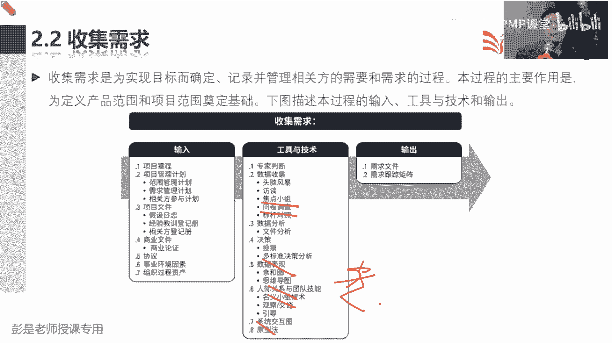
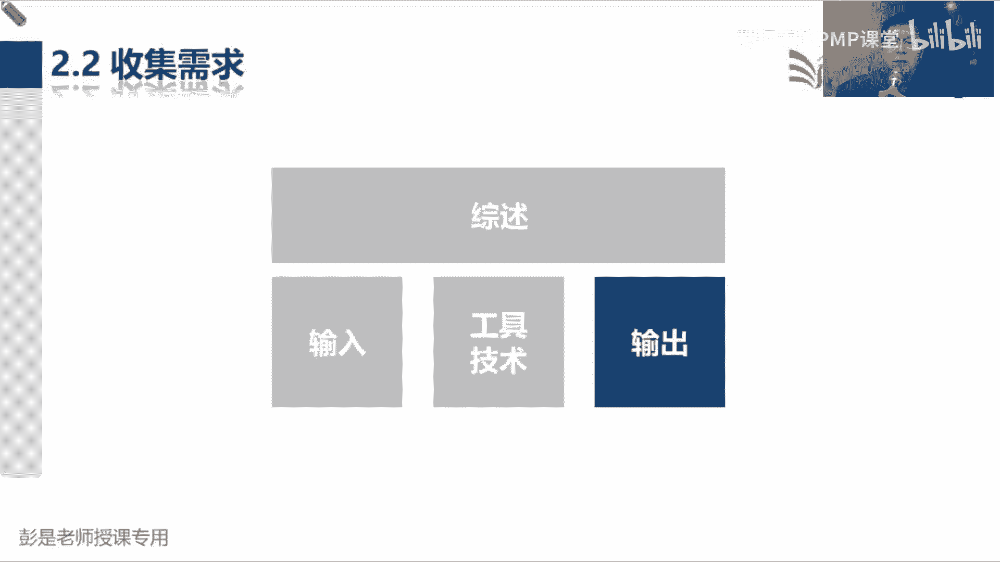
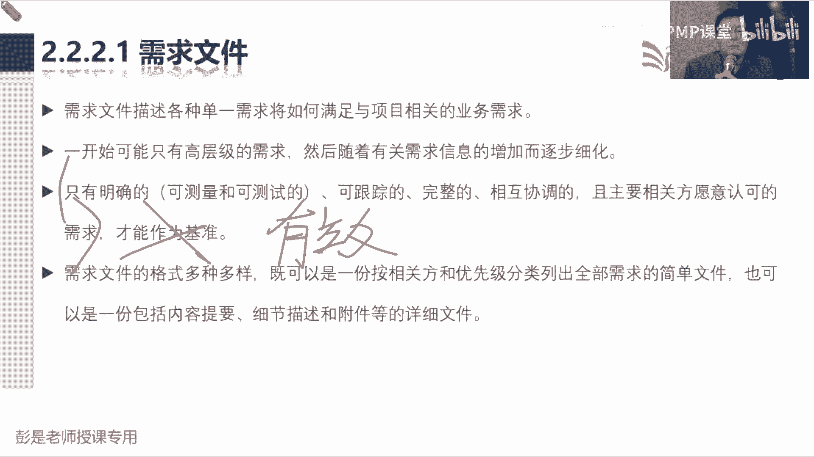
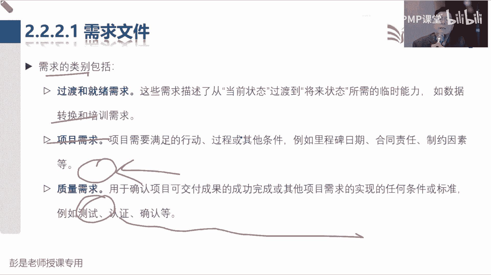
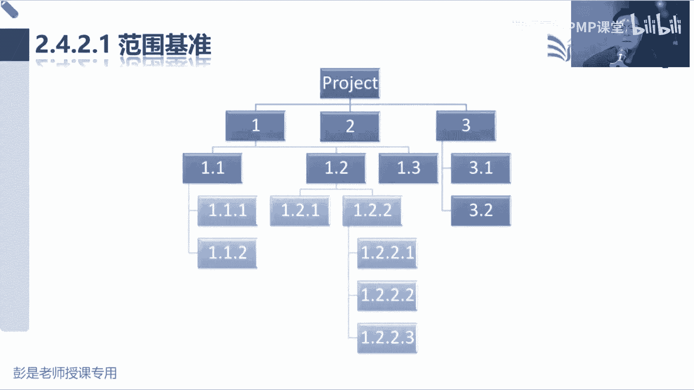

# PMP考试培训课程第1-13章节免费完整版 - P7：第五章：项目范围管理 - 慧翔天地PMP课堂 - BV18y421e7ut

再看看这一章六个管理过程做什么事情啊，帮助大家再重新的梳理一下，第一个2。1规划范围管理，负责范围的同事，现在我们是九个大成了啊，负责范围的同事啊，根据项目经理给出的总体指导。

什么生命周期阶段划分开发方法，我们要思考范围到底到底如何管理呢，到底如何定义范围，到底如何创建WS到底如何确认范围，到底如何控制范围，需要写一个范围的管理计划，除此之外呀，还要写一个需求的管理计划。

告诉我们如何收集需求，到底怎么去收集需求对吧，怎么记录需求啊，怎么开收集需求啊，需求收集需求能用什么方法呀，用什么用什么技术啊，开什么会呀，诶把收集需求这个事情怎么开展，给他写清楚，这是2。1做的事情。

那在思考，为什么要单独写一个需求的管理计划呢，说出一个范围的管理计划，你把收集需求的事写一写不就完事了吗，为什么单独写一个需求的管理计划，确认一致性版本，这是想一个大道理啊。

这个东西会不会决定了这个东西呢，嗯需求就决定了范围，需求决定的范围，那未来我们根据定义好，根据我们确定的范围能能决定什么呢，时间成本质量资源沟通采购，以此类推吧，诶我们是根据收集到的需求来分析啊。

我们到底要做什么东西啊，需求不一样，完成的工作，产出的成果完全不同，对不对，中午吃饭想自己做，这是需求啊，根据这个需求，我们可能就需要买菜对吧，洗菜切菜炒菜蒸米饭，然后吃还要刷碗呢。

要完成的工作是不一样的，如果提出的需求是叫外卖，那就必须要打开什么美团，饿了么选餐厅，选菜品，下订单收餐，它需要开展的工作，需要交付的成果是不一样的，因为我们要去了解用户需求背后的动机，对不对。

根据他的需求，根据他的动机来决定我们要做什么事，情，要完成什么工作，交付什么成果，所以需求决定了范围，范围呢又决定了我们的时间啊，成本啊，质量啊，资源啊一大堆东西，所以通常称之为称之为需求，叫万恶之源。

这个东西就决定了我们所有的事情，那既然这个东西这么重要，这么重要，所以通常现在关于需求的管理，就形成了这么一套话术啊，需求管理这个事儿超复杂超复杂，牵一发动全身，所以它是我整个整个项目管理的基础。

那这个东西越来越倾向于第一叫专业化发展，这是需要有一定的专业知识了吧，你做游戏呀，做互联网产品啊，做快消息呀，做汽车呀，对不对，不管是你做什么，不管是你做什么，在你的行业做这个产品服务成果的规划设计。

这需要储备一定的专业知识，需要见多识广，才能够更好的去规划这个产品啊，所以第一需要有专业知识，第二这个事情吧不可能一天两天就搞定了，它需要有方法有套路，所以就叫工程化，他需要有章法，有套路。

有方法有技巧，所以呢专业的事交给专业的人，我们需要针对这个事情，单独出一个需求的管理计划，这是这个大道理，听一听，知道这个印象就可以了好，所以规划范围管理有两个输出，一个叫范围的管理计划。

一个叫需求的管理计划，那2。2收集需求，收集需求，它的输出敢不敢猜呢，好记性不如烂笔头，发现啥嫉妒啥，发现啥嫉妒啥，说到啥，基督查，那收集到的需求，我们需要统一的找一个地方把它记下来，这叫需求文件件。

这个名字看完了之后，基本上也不大会误会了啊，它的输出就叫需求文件，用来记录我们所收集到的需求，那需求文件记录需求之后，定义范围，这个管理过程做什么事呢，项目的概念还记得还记得吗。

项目是创造独特的产品服务和成果，而开展的临时性工作产品，那我们就要把产品拥有的功能属性，特征给他说清楚吧，诶这是定义范围要做的第一个事情，把产品到底是个什么样子的东西给他说清楚，产品有什么功能。

有什么属性，有什么特征对吧，比如用户要一个什么电商软件，那个软件都有啥功能要解释清楚，用户要一个小程序，这个小程序里面有啥功能都要解释清楚啊，这是定义范围，要把我们这个产品的范围说清楚，产品范围说清楚。

那服务指的是啥呢，外卖看病讲课，这都是工作，把这些工作完成来提供服务啊，所以服务指的是项目范围，把我们需要完成的工作，也就是讲项目范围把它说清楚，另外我们都要交付什么成果，把这个成果也要说清楚。

这就是范围说明书，它核心的内容叫产品范围，项目范围，可交付成果，所以只要项目的概念，你只要记住啊，创造独特的产品服务或成果范围，说明书的内容就能对应出来，指的是产品范围，项目范围和可交付成果。

把这仨东西写清楚，产品范围，产品有啥功能，手机可以打电话，可以拍照，手机手机可以可以拍视频，手机手机可以还可以干嘛，装微信，装app，装app诶，产品范围说清楚，那项目范围呢指的是工作对吧。

给你手机我们可能需要帮你啊，做数据的什么初始化，我可能更需要给你培训的，给你发快递啊，给你物流啊，这都是被交付产品需要开展的工作，称之为项目范围，另外呢可交付成果都要说清楚对吧，手机包括什么。

用用户手册，安装手册，维修手册，各种各样的成果呀，包括你的计划呀，都有啥都要说清楚，这就是范围说明书，它的主要内容，那有了范围说明书，创建WBS，这个管理过程它的主要工作是啥呢。

刚才大家说分解分解分解分解的目的是啥呢，女王比如真的我们要研发一款手机，真的要研发一款手机，一下就把这题做出来，这也不现实啊，那怎么做呢，一个零件一个零件的搞呗，对不对，需要弄一个屏幕，需要弄一个电池。

需要弄一个存储对吧，弄一个主板，再弄一个什么摄像头，这还只是硬件，还要弄软件吧，手机里面弄什么操作系统，弄一个什么拍照，美美的，弄一个软件呢，诶还要有很多工作吧，可能需要给客户啊安装啊，培训啊。

以此类推吧，所以就是通过这样的形式，通过这样的分解的结构，便于我们更更合理的安排我们的人财物，便于管理和控制，便于管理和控制，所以就是通过这样的层级结构，通过这样的层级结构说清楚，我们的大成果变小成果。

大工作变小工作，这就是创建WBS这个管理过程的，最重要的作用，便于管理和控制，据分析，我们把大钩缩变成小工作，来降低事物的复杂程度，包括我们那个牛肉面馆，牛肉面馆啊，要装修装修这个事儿啊，太大了太大了。

那怎么分解呢，装地面装墙对吧，弄锅桌椅板凳，弄什么柜子，弄什么厨具上下水，以此类推啊，就是通过这样的分解结构来体现，来体现复杂的事物简单化这样一个思路，哎这就是创建WBS这个管理过程做分解，那2。

5没啥解释的，确认范围就是做验收，控制范围呢叫绩效和变更，拿到原始的工作绩效数据，得到范围的绩效信息，另外管理好范围的变更，所以大概这一章大概这几这几个管理过程，大家可能需要花时间看的就是2。3，2。

4，因为2。2其实他虽然工具基础多，但是它这个道理很好猜好再往下了啊。

所以这一章一简化，大家需要记住的输入输出，看看PPT啊，就变成了这一堆规划范围管理输出，范围管理计划和需求管理计划，这咱已经知道了，让他去死，收集需求，把需求记下来，就有了需求文件，让他去死。

这个我们已经知道了，定义范围，输出范围说明书这个单词一一冒出来啊，就想到范围说明书里面写了产品范围，项目范围和可交付成果，把产品有什么功能说清楚，把我们要完成的工作说清楚，把需要交付什么样的成果说清楚。

这是范围说明书的内容，那创建WBS，它的输出直接写了范围批准，实际上它有个过程，根据我们定义好的范围，说明书就得到了做分解，做分解就可以得到WBSWPS啊，还要配套配上一个配上一个文档，这个文档是啥呢。

再看PPT这个文档的作用吧，也可以粗暴的这样去理解啊，我们牛肉面馆装修这个事儿啊，装修这个事儿啊太复杂了，我们为了便于分工，为了便于管理和控制，我们把它把它做了分解，地面啊，墙面啊，软装啊。

软装又可以细分的对吧，桌子呀，椅子呀，什么窗帘啊，以此类推呀，包括灯泡啊，然后地面墙面呢，我们可以继续继续把它做进一步的拆解，这就是WBS，有了这个WBS之后啊，有了这个WBS。

就是这张图能够体现工作和成果的结构，有了这张图，接下来接下来啊，如果装修这个事儿啊，你的工期是一个月，预算是10万块钱，那这个小方块你打算花多少时间，花多少钱，通过现在这种层级结构看得出来吗，看不出来。

需要写个文档去把它说清楚吧对吧，这个小方块儿大概多少预算，大概多少工期，谁负责这个事情他有什么限制条件诶，他需要完成什么工作，所以关于每一个小方块，它的范围，进度成本质量资源，甚至什么沟通。

采购相关方都需要有一个文档去给他解释清楚，这个解释每个小方块的文档就称之为WBS，既然叫解释，所以就叫词，对吧，所以就是大目标变小目标大范围变小范围，大工作变小工作，那分解了之后呢。

我们对每个小方块都要做解释啊，对不对，地面装修地面这个事儿打算工期多少，大概多少，预算是多少，墙面装修工期是多少，预算是多少。

都要解释清楚，这就有了WBS词典好，那根据这个逻辑啊，定义范围，出了范围说明书之后，对范围说明书的产品服务成果，我们做了进一步的分解，就可以得到这种层级结构，称之为WBS，只有WBS别人看不懂了。

在需要配套一个文档叫WBS词典，那现在有了范围说明书，有了WBS，有了WBS词典，我们把这三个文档打包到一起，找关键相关方干啥，就这个单词无处不在啊，审批审批通过，我们就认为这三个中。

这三个文件变成了范围的基准，所以创建WBS这个管理过程输出了范围基准，它实际上就包括这三个文档范围说明书，WBS以及WPS词典，它其实是有个过程的，但是这个过程写起来太啰嗦，所以他直接为了省事。

就直接创建WBS输出范围基准，范围说明书，w vs和词典这三个文件找老板就这样粗暴理想，找老板一批准就变成了范围的基准，好这个玩意儿也搞定范围，基准范围说明书，两个管理计划，那控制范围呢有绩效数据。

绩效信息变更请求标准的三件套，这咱知道了，确认范围，确认范围，这个管理过程是对我们的可交付成果，做成实地验收，就会得到验收的可交付成果，那这个收入就需要再说道说道了何时的成果，这又是个什么鬼。

那个需求跟踪矩阵一会再说啊。

核实的可交付成果啊，再看PPT，讲大道理，第一个小问题，指导与管理项目工作，按照计划去干活，就会得到可交付成果吧，这个可交付成果呀，能不能直接让客户来进行正式的验收呢，按照计划去干活，得到的可交付成果。

能不能让客户直接来进行验收呢，线上的同学好像基本上睡着了嗯，还说不能的同学就要反思了啊，是能的，不犯法吧，不犯法吧，按照计划完成工作得到的成果直接去验收，可以的可以的啊，所以能不能呢是可以的，是能的。

但第二个小问题啊，这么做好不好呢，哎不好，为什么呢，按照计划去工作，去干活，得到的可交付成果，直接让客户去验收，好不好呢，不好为啥呢，就参考历史上著名的鸭脖子事件，参考历史上著名的鸭脖子事件。

菜里边有鸭脖子，然后呢大家吃饭的时候发现了这个玩意儿，就会导致导致客户满意度的下降吧，唉这叫外部失败，成本就会导致客户满意度的下降，所以为了安全，为了稳妥起见，我们需要自己上菜之前。

先检查检查一下菜里面有没有老鼠头，有没有烟头，有没有头发，自己检查这个过程是哪个管理过程呢，所以啊看这个数这个数据流啊，指导与管理项目工作产出的可交付成果，最好最好不要直接去验收。

最好最好我们自己检查一下，自己测试一下，它就作为控制质量的输入，控制质量这个管理过程变成大白话场场景啊，就是告诉我们牛肉面馆的服务员上菜之前，你要先做指控行吧，把菜端到客户，客户菜桌上之前。

你要先检查一下里面有没有异物，有没有烟头啊，有没有老鼠头啊这种东西啊，这就是我们自己内部做指控，自己内部做指控，检查完了，他会会得到一个什么东西呢，你叫验收的肯定不合适啊。

所以我们内部的就叫核实的可交付成果，经过我们内部确认的核实的可交付成果，再让客户来进行正式的验收，所以确认范围这个管理过程输入输入啊，这叫核实的可交付成果，它是控制质量这个管理过程的输出。

那确认范围我们拿到了核实的可交付成果，让客户来进行正式的验收，验收通过呢就会得到验收的可交付成果，这个玩意儿在作为杰出项目或阶段的输入项目，经理拿到验收的成果，再把它变成最终产品服务成果的移交。

这就是非常非常非常关键的，可交付成果的数据流，一定要记住，一定要记住非常非常重要的理念，按照计划完成工作，得到的成果最好最好我们先内部，由团队内部进行检查，进行测试，来检查这个东西的正确性，完整性。

检查完测试完就会得到核实的成果，核实的可交付成果，再让客户去进行正式的验收，验收通过就会得到验收的成果，验收的成果采取解除事项，目合阶段做最终产品服务成果的移交。

好知道了这个大道理之后。

确认范围这个管理过程输入输入搞定了，合适的成果，来自于QC控制质量输出呢验收的可交付成果，他去了去了，结束项目或阶段，要能够把这个数据流给他，从前到后这些管理沟通的逻辑关系，给他记住好，需求跟踪矩阵。

最后讲这个玩意儿啊，需求跟踪矩阵存在的意义是什么呢，需求跟踪矩阵为什么要跟踪需求呢，完美偏差。

你知道刚才也说过吧，看讲这段的时候说需求啊叫什么万恶资源，需求一旦跑偏了，那是不是范围说明书可能写的就有问题，范围说明书易跑偏，我们创建的WBS就不对路，WBS1旦有问题啊。

未来我们根据WBS估算的时间成本，资源就可能在错误的道路上越走越远，所以这个玩意儿叫万恶之源，那为了稳妥起见，我们是不是要确认一下收集到的需求的什么呢，看看收集到的需求都正确不正确。

看看收集到的需求是不是一个有价值的，有效的需求，因为一个无效的需求，就可能导致我们后面做无用功，所以我们要追溯追溯追溯追溯这些需求的价值。

追溯这些需求的意义，再回到这张结构图上再看啊，那怎么追呢，现在我们知道的知识啊，我们把收集到的需求啊，都记录到需求文件里面去了，那这些需求有没有价值呢，要让它和什么东西保持什么性。

和我们那个smart原则那个R1个道理，而是说和我们的主要目标具有一致性，具有相关性吧，我们才认为他是一个有效的需求，比如说比如说现在大家在听课对吧，那我提出这样一个需求啊，我在上课的时候啊。

希望这个屏幕右下角啊能够自选股票，看看这个股票的走势，这样上课的时候我就知道我赔钱赔了还是赚了，这个东西和我们这个授课这个业务有相关性吗，没有没有，那它就是一个无效的无价值的需求，就这个道理吧。

所以一定要分析用户的动机啊，主要给大家讲讲怎么炒股，主要主要业务是给大家交交炒股的，那这个功能这个需求它是不是有价值的呢，指示了吧，哎所以他要和我们整个的业务目标保持一致性，对不对啊。

怎么这样收集到的需求，我们要看一看他和章程里面的目的，目标是不是相一致，就是为什么要做这个项目啊，你是为了炒股啊，还是还是为了教学啊，如果相一致，就说明他是个有效的需求，还可以再往前追，项目启动之前。

这个东西是不是也涉及到业务需求啊，商业论证效益计划，商业论证里面会写清楚用户的业务需求，业务诉求啊，哎我们在做商业论证的时候对吧，业务需要分析形式提出建议，然后说清楚为什么呀。

商业论证里面也涉及到业务需求，所以就是往前追，往前追，我们要确保收集到的每个需求都是有笑的，有价值的需求，它要符合我们的总体的业务业务目标，它要符合总体的业务目标啊，好听完这段之后再看PPT，收集需求。

输出了需求文件，还有他的好朋友叫需求跟踪矩阵，需求跟踪矩阵呢要去分析我们这个需求对目标，对目标来确保收集到的每个需求有价值，那未来呢我们根据收集到的需求就写了范围，说明书里面就说清楚了，诶。

上课的时候啊，教大家炒股啊，就需要在这个界面上，有一个能体现这个股票走势的这么一块区域，那就是不是涉及到了产品范围，产品里需要有一个功能看股票走势，产品范围啊，诶那这个产品范围对吧。

我们交付这个产品需要开展的工作，在电脑上对吧，升级一下软件，发布一下呀，部署一下呀，为交付产品需要开展的工作项目范围，还有可交付成果，这个需求往后追，往后追就去分析它对应我们什么工作，对应我们什么成果。

然后有了范围说明书，接下来我们对大工作变小，工作大成果变小，成果就有了WOBS，就有了工作分解结构，那现在我们是不是可以把这些需求，对应到WBS里面某一个小方块了，可以吧，可以吧，想想想对吧。

如果想不清场景，想不清场景啊，就大家就先看看你现在这个上课的这个软件，它里面大概有这么几个功能啊，播放PPT的地方，大家聊天的地方对吧，看股票走势的地方，以此类推了吧，它就对应WBS里面的某一个。

某一个具体的小方块，这个小方块我们继续往后追，因为每个小方块对应工作对应成果，我们要去分析这个成果未来的状态，那都有什么状态呢，都有啥状态啊，现在我们掌握了可交付成果的数据流了，这说明啥。

是不是就是完成了，这说明啥，是不是就说明测试通过了，这又说明什么呢，确认范围对成果进行正式的验收，这又说明什么呢，我们把它做了移交诶，所以WBSWBS找到了WBS，每一个每一个小成果。

我们去跟踪这个小成果，未来的状态，有没有人通过指导与管理项目工作，把它完成完成的可交付成果，有没有人对他做测试做检查，得到核实的可交付成果，核实的可交付成果，有没有客户对他进行正式的验收。

就得到了一个验收的可交付成果，最后呢验收的成果有没有移交给客户，往后追，往后追这么追的目的，最终一总结就这么三个单词了，需求，对成果成果对移交，我们分析每个需求的价值，我们最终移交给用户的成果都对需求。

就说明我们做到什么了，价值交付，觉得乱的同学可以休息了，可以下课了，可以休息，可以下课了啊，好这就是需求跟踪矩阵最重要的作用，把需求的来龙去脉给他搞清楚，收集到的每个需求，我们要确保它有价值。

它是有效的需求，然后往后追，往后追，我们却把这个有效的需求能够对应到一个成果，以及这个成果，最终我们把它完成做完，把它测试，通过把它验收，把它移交，这样移交到用户手里的最终的成果。

对用户来说都是有价值的成果，这就是标准的价值交付，先听听，不懂的同学跳过这一段，跳过这一段啊，好听懂的同学听懂的同学就记住它就可以了，听不懂的同学怎么办呢，不着急，等一会你听完了，收集需求，定义范围。

创建WBS这个这几个管理过程，再来复听这一段就讲给未来的你们，你就就就能就能听懂了啊。

好接下来看这个这一章，大概就这么几个东西了，所以再回顾一下规划范围管理，出两个计划范围管理计划，需求管理计划收集需求，把我们收集到的每个需求记录到需求文件里，定义范围是根据我们收集到的需求来说。

清楚产品范围成果都是什么东西，有了这些东西之后呢，把大成果变小成果，大工作变小工作就有了WBS，体现了整个工作和成果的构成，有了WBS之后呢，最后2。5就是做验收，2。6呢就是绩效和变更。

那其其中最复杂的知识点，就这个需求跟踪矩阵，就把我们收集到的需求往前追，都能对标到我们的业务需求，说说清楚，说说明这个需求是有价值的东西，往后追，确保每个需求对应一个成果或者是多个成果。

并且呢去追溯这些成果，未来的状态就是完成了测试了，移交了，验收了，移交了，确保最终最终移交到用户手里的东西，都符合人家最初的业务需要，对用户来说有价值，这就是需求跟踪矩阵最重要的作用。

如果还听不懂的同学，你就粗暴理解你叫的外卖，下订单的时候写要餐具，人家给你送过来的外卖，这里面带餐具，这就是价值交付，如果你叫叫外卖的时候，说不要餐具，人家送过来的外卖里面包括了餐具。

这就是没价值的交互，对你来说没有价值，没有意义，这个道理能听懂吧，能听懂，能听懂就可以了啊，复杂的知识点，那一定一定再去反复听，反复听这段这段这段逻辑嗯，所以大家听完了这一段有没有体现。

有没有体会到预习的重要性了呢，嗯后面还会有更复杂的场景，现在先不讲。

讲完了你们又蒙了，好知道了这一章的中心思想，之后刚才这段话说，如果听不懂的同学，听完后面这段课程再来复习吧，接下来看看这项目范围管理的概述啊，第一个重要的知识点，项目范围管理。

确保项目做且只做所需的全部工作，那我们就应该定义和控制哪些工作，包括在项目内，哪些不应该包括在项目内，两个知识点，第一个知识点做题只做，要防止什么来着，做铁只做做铁只做，为什么用了一个纸字。

哎不好的那个现象，不好的那个现象叫什么，什么范围蔓延，还有一个不好的现象，后面会学到啊，教范围的镀金啊，总之啊画蛇添足，画蛇添足，是不是做了范围之外的事情了，哎所以呢我们要说清楚，不叫定义吗。

说清楚什么东西包括在范围内，说清楚什么东西不包括在范围内对吧，让大家画个小蛇，不要画那个，不要画那个角，不要画那个角啊，未来呢通过控制范围，确保大家只画蛇不画角，那定义什么东西，包括在范围内。

什么东西不包括在范围内，这对标到一个术语，这个术语啊，四个字，四个字看PPT说项目范围说明书，项目范围说明书，这个管理这个管理过程，它输出的范围说明书啊，说清楚产品有什么样的功能属性特征。

说清楚我们要交付产品，需要开展哪些工作，就叫项目范围，产品范围，另外还要说清楚，我们都要交付什么样的可交付成果，这些东西都是范围，那那怎么把不在范围内的给他写清楚呢，哎就带出来一个专业术语叫除外责任。

就带出来一个专业术语叫除外责任，说清楚，除外责任里的东西啊，都是项目范围之外的事情，这样呢咱就把项目范围的边界给他捯饬清楚了，避免扯皮，在讲p mp的过程中，不教数学，不教语文，不教英语。

哎这就是除外责任的，所以经典的除外责任，大家想场景啊，你买保险是所有的东西人家都赔吗，唉有些东西是不赔的吧对吧，不管你的医保啊，社保啊，有些东西是不赔的吧，这不都是除外责任吗，只要说清楚啊。

好然后再往下就是描述了六个管理过程，规划范围，管理关键词，一标下班了，这叫如何如何定义范围，确认范围，控制范围，他要抽出两个计划收集需求呢，纯粹的字面意思就是了解大家的大家的需要。

然后变成我们的一个需求文件，定义范围，就是说清楚说清楚，我们要这两个玩意儿到底是什么鬼，项目范围和产品范围，项目范围是工作，产品范围是产品的功能，创建WBS就是做分解，这是刚才说了。

分解的目的呢就是更好管，分解的目的就是更好管，所以关于WBS到关于WBS再粗暴理解啊，前面其实说过这个大道理啊，我们公司啊有这么多人呐，全都直接归老板一个人管，这管得过来吗，小公司小，三五个人。

老板还管得过来吧，三五十人咬咬牙还能顶得住，三五百人，三五千人，35万人肯定搞不定了，那就需要干嘛呢，层级就出来了吧，需要需要需要需要设定企业的组织架构了，WBS就是这个逻辑，你的范围如果太大了对吧。

我们不好管，那就需要分解大工作变小工作，大成果变小成果诶，就有这样的层级结构了啊，就叫2。4，2。5，不念了，就叫验收，2。6呢控制范围两个词，一个叫绩效监督项目和产品范围的状态。

看看大家是不是做且只做，有没有人画蛇添足，另外呢管理变更。

好再往下翻翻翻翻，翻到这一章的核心概念说在项目环境之中范围，这个数据有两种含义，第一个叫产品范围，第二个叫项目范围，产品范围指的是产品服务成果，所具有的特征和功能，这东西不太需要解释了吧，手机能打电话。

手机能拍照，这是功能啊特征，我这手机待机时间长，我这个手机防水对吧，我这个手机就是便宜，这都是特点啊，这是产品范围，项目范围是为交付这些东西而要开展的工作，这是要干什么活对吧，帮你打包，帮你发快递。

帮你发快递啊，帮你帮你初始化手机，这都是为交付产品需要开展的工作，包括培训哪安装啊，调试啊，以此类推啊，嗯这两个术语一定要记住，然后再往下确认范围是正式验收，已完成项目的可交付成果的过程。

这段文字呢就在说那个可交付成果的数据流，再看PPT回顾一下指导与管理项目工作，得到可交付成果，这个玩意儿都需要通过控制质量过程，我们自己做检查，自己做测试就会得到一个叫核实的可交付成果。

核实的可交付成果，再通过确认范围，这个管理过程让客户进行正式的验收，验收通过就会得到验收的可交付成果，有了验收的可交付成果再甩给项目经理，我们通过结束项目或阶段，把它变成最终产品服务成果的移交。

这也是可，这也是需求跟踪矩阵最重要的后半段的作用，去跟踪这些成果在未来的状态。

好再往下范围管理发展趋势和新兴实践，这段文字啊，大家其实后面看一遍，想看就看，不想看就可以了，就可以不看了啊，看一遍主要是记这个单词啊，就是刚才在强调这个东西的趋势，就是需求。

换个职员的需求是万恶之源呐，这玩意儿决定了范围，范围，又决定了时间资源和成本，所以呢专业的事找专业的人，需要有这样一个专业人士，去帮助我们做这个事情啊，那就需要有一个单独的计划，也就是需求的管理计划。

告诉我们这事应该怎么管，就知道这个结论就够了，需求专业人士单独有计划呀。

因为到了敏捷环境之中，我们要记住谁管需求呢，哎产品负责人PO，后面学敏捷的时候再说了啊。

好2。1规划范围管理，这个管理课程基本上大家复习的时候一遍过。

第二遍，第三遍，希望大家不要再看了，这个管理过程输入没啥东西，工具没啥东西输出就两个计划，这两个计划关键词都是同一个呀，就叫如何告诉你怎么管范围，告诉你怎么管需求，学到这个程度其实就可以了。

因为他的计划里面没有什么太多实质性的内容，都是假大空好，所以他的收入没啥东西啊，输出2121范围管理计划，是项目计划的组成部分，描述将如何定义范围，创建WBS，如何控制范围，如何确认范围。

所以他对这堆事情作出规定，告诉我们怎么能范围说明书告诉我们如何分解，告诉我们怎么维护这个基准，告诉我们怎么验收，以此类推，它的内容不需要大家记住，就记关键词叫如何如何如何就可以了啊。

那以此类推，需求管理计划，还是这两个字，怎么收集需求，收集到的需求怎么记录，需求怎么排序啊，以此类推，还告诉我们如何如何如何管理项目的需求。

所以2。1后面大家复习的时候，基本上就听一遍，知道什么意思就可以了，它的输出，他的输出其实不太需要刻意的去背，那2。2收集需求。

收集需求这个管理过程学习的重心在哪呢，拿眼睛一扫，啥东西比较多呀，工具吧，诶那他的收入他的收入啊，项目章程什么范围，管理计划，需求管理计划这些东西啊都用得上啊，但先找一个最关键的最关键的是啥呢。

为什么呢，因为这玩意儿没有，你都不知道找谁说去需求吧对吧，你的项目到底是to c的，to b还是to g的呢，对不对，哎如果是to b to g的，对方的什么领导是谁呀，相关的业务部门是谁呀。

哎管理者是谁呀，以此类推，至少至少至少需要有一个相关方登记册，好让我们知道去找哪些人群，找哪些群体去收集需求，这是这是这一大堆输入唯一需要记住的东西，其他的东西啊，看到那看到那能猜出来就可以了啊。

比如协议里面有强制性的要求，项目章程，我们要去分析下这个需求有没有效啊，是不是符合项目的目的和目标，对不对，所以后面的其他收入基本上也不大会考，那接下来啊重头戏就是中间的工具，技术输出，不用解释了吧。

徐州文件需求跟踪矩阵，这肯定要记住的，中间的工具有几个工具需要大家记住的啊，有几个专用的工具需要记住，其他的工具基本上都是通用的，专家判断不解释头脑风暴，不解释访谈不解释，焦点小组不解释好。

这个猜问卷调查适用于什么场景，是，分店调查适用于什么场景，to c啊，不一定啊，万一就一个C呢，晚上我想问问我老婆想吃啥，说等一等啊，我给你设计个问卷，等一等给你设计个问卷。

是他有好多小问题需要你回答一下，这不神经病嘛，对不对，有这时间直接沟通不就完事了吗，所以人一定会多，沟通不过来了，哎人多，第二个场景是什么呢，受众多受众多，第二个就是大家不在同一个地方比较分散啊，对吧。

我们想了解北京的，上海的，天津的，广州的，深圳的各地方各地方的人诶，大家还有什么需求，有什么偏好，所以它通常适用于这样的场景，人多不在同一个地理位置，那我们还想获得获得相关的反馈。

就用问卷调查这样的方式，效率高，效果好，所以它也是通用的工具啊，后面很多管理过程都会用，后面很多管理过程都会用啊，它是通用的工具，不太需要去记它是不是属于收集需求，但是它适用的场景要记住，那以此类推。

标杆对照也很多，管理过程都可以用，它不是收集需求专用的工具，但标杆对照是干嘛用的，什么是标杆，什么是标杆，同类型的，然后做的好的诶，什么样板榜样对吧，竞品竞品超，这是传说中的传说中的这玩意。

大家其实生活里面都在用，从小到大我娘最擅长的说就是你看看张三，你看看小明，你看看小红，你看看人家学习成绩为什么那么好，是不是给我们立了一个标杆啊，需要我们去参考去借鉴，看看人家什么地方做得好。

什么地方做得不好，诶，就是标杆对照，所以呢它适用的范围非常非常非常广，制定项目章程的时候，能不能标杆对照一下，可以吧，不犯法呀，哎所以这个这个这个工具的关键词，一个字的话就叫抄高大上一点呢就叫参考借鉴。

借鉴参考人家的最佳实践，它没有任何的局限性，可以同行业做参考，可不可以跨行业做参考呢，可以吧，可以的啊，完全没有约束啊，好这个工具也是通用的工具，那文件分析不解释了，刚才我们结束项目或阶段。

通过文件分析就是为了总结，那现在收集需求，文件分析就是为了挖掘需求啊，这不太需要刻意的去背好，再往下投票，知道了多标准局的分析，知道了，来了个新的单词，这个单词不太好猜清，和土干嘛用的，清河图。

干嘛用的呢，你就想啊什么淘宝京东客服，为什么人家跟你一口一个亲，他说这个字的目的是什么呢，拉近关系，拉近关系，建立信任吧，唉所以亲和亲和，我们需要把相似的需求给它拉近一点，放到一起。

所以它是对我们收集的需求做分组，对我们收集到的需求做分组，这个工具其实其他管理过程也可以用，但它高频的考点主要集中在收集需求，这个管理过程，因为接下来再听场景啊，收集到的需求做分组。

比如说啊张三打算去我们牛肉面馆吃饭，然后问问李四王五赵六，你们有什么需求，李四说呀，我想吃牛肉面，王五说我想吃早饭，赵六说我想喝啤酒，然后张三又说我想喝，我想喝可乐，李四又说我想吃个拍黄瓜。

这些需求乱不乱，有凉菜热菜的，酒水饮料的诶，这话一说出来是不是有条理了，是不是更有条理，所以我们需要把收集到的需求，根据根据他的条理，根据他的逻辑关系去分组，因为因为因为需求需求，要做一个什么事儿呢。

我们不可能所有的需求都满足，那就一定要排序，对不对，十分轻重缓急啊，那一定要排序，是先分组还是先排序再，把这个道理想明白，先分组还是先排序呢，最后排完序发现都是凉菜，没有热菜，没有酒水，没有饮料。

没有主食，这好像不行吧，所以通常来说我们是先把收集到的需求做分组，这一堆需求属于凉菜，这堆需求属于热菜，这对需求属于主食，在同一分组之内的需求更有可比性，再来做排序诶。

所以这个道理就像比如说开什么奥运会，亚运会做运动会比赛是不是先分组啊，青年组，老年组，什么少年组，幼儿组，分完组再去做比赛，比赛不就排名啊，123吧，所以通常来说是先分组后排序。

那就需要把清河图和另外一个工具绑定，后面这一堆在这一堆单词看起来，哪个东西像排序呢，这不好猜呀，名义小组思维导图，观察交谈，引导交互图原型法，不对，所以这个需要单独记了，因为这个名字不太容易记。

不太容易理解啊，名义小组是对我们收集到的需求做排序，只有这种看起来不好理解的单词就吞吐记，一定要记住它，因为容易误会，星河图是对我们收集到的需求做分组，名义小组是投票表决做排序哎。

所以现在开始这两个工具把它绑定锁死，并且这两个工具需要记住，它是收集需求的方法专用的啊，好然后观察和交谈，这也是收集需求，这一段非常非常高频的一个考点，收集需求，观察。

什么情况下需要通过观察去收集需求呢，为什么不直接交谈，这就好猜了吧，什么情况下需要通过观察去收集需求，无法描述暗藏玄机啊，这这想复杂了没有没有没有那么复杂，还是我们听过的场景啊对吧，收集需求。

张三晚上想吃啥，现在最现在最头疼的就是一个问题啊，晚上想吃啥，可能会得到这样的答案，随便都行都可以，随便都行都可以，这种情况下这个需求明确吗，不缺那张三有没有可能把它说清楚到不一定吧，对在某些情况下。

人家可能没时间说，不愿意说，不想说，或者是真的说不清楚，这种情况下，通过观察观察观察的目的是什么呢，挖掘需求，通过观察去挖掘需求，所以它也被称为工作跟随，好再带场景，就像马上要什么圣诞节，元旦节了。

你想给你男朋友，女朋友，男女朋友送送礼物，那人家通常可能说啊，随便都行，你看着办吧，这种情况下需求明确吗，不明确，那怎么办呢，观察对不对，看看他平常喜欢啥啊，看看是不是需要买个什么手机啊，包包啊。

什么什么各种东西啊，衣服啊，帽子围脖啊，缺什么买什么呀，就是以此类推吧，通过观察，通过观察，了解对方的偏好，了解对方的需求，挖掘需求，那挖掘出来的需求，交谈的目的是什么呢，为什么还要交谈呢。

直接买了不就行了吗，我发现我媳妇儿背的包不太好了，咔十几万买了个包包，结果人家可能说这不是我想要的，这就有风险，所以观察观察，通过观察来挖掘需求，通过交谈来进行需求的确认，一定要交谈啊。

嗯这就是这个工具最重要的考点，当对方可能难以说难以说清楚对吧，或者是不愿意说呀，不想说呀，或者是真的说不清楚，在这样的模式，这样的场景之下，我们就通过工作跟随了解对方的需求，唉这就是观察。

观察挖掘到需求之后，再通过交谈来进行确认，确保这个需求对对方有价值，确保这个需求是有效的需求，这个搞定引导技术，引导技术其实到了定义范围，到了后面讲工具的时候会展开讲，现在看到引导这个单词啊。

先跳过先跳过啊，因为它适用于任何一个管理过程好，第七个工具系统交互图，这玩意儿其实不用记，其实不用急，为啥呢，它有行业的局限性，还有行业的局限性，它通常用在软件行业，软件行业干什么事呢。

这是大家你在在某东上买东西，然后用某宝付款，支付宝付钱，京东要不要告诉支付宝他需要交多少钱，支付宝要不要告诉京东他有没有交钱，哎这就是系统交互图，来体现这些系统系统之间的这种交互关系，关联关系。

这个单词停一停就可以了，这么多年基本上不考，那接下来啊原型法，这一定考一定考啊，大概率会考到原型法的目的是什么，什么是原型，先搞定这个单词，什么是圆形，画个假的哈，我们牛肉面馆要装修。

我们说装修的简洁一点，施工队咔咔咔上来就把墙凿了，这么做会不会有风险呢，为了稳妥起见，人家先要先做一个什么事儿呢，画个图吧对吧，画个图啊，拿什么软件给你做个什么效果图，示意图告诉你这个房间的布局呀。

风格呀，哎让你来确认需求，让你来确认需求啊，它是指实际开展工作之前做个demo，做个假的，做个模型来确认需求，所以它最重要的作用就是确认需求，确认需求通过对原型的不断修改，不断优化。

不断调整来确认是不是符合您的需求了，它适用于太多场景的嗯，适用于抬头上角啊，这是一定要记住的工具，它的主要作用是确认需求好，所以关于周期需求这一大堆工具，给大概花大花一些时间给大家解释一下。

需要大家掌握的清河图名义小组观察，交谈原心法，就这四个，这四个东西需要单独记，它通常通常考点就在收集需求这个管理过程，其他的工具呢像问卷调查呀，标杆对照啊，这也需要理解，需要理解它的应用场景。

但是这两个工具是不是属于2。2，收集需求根本就不重要，因为它是通用的通用的啊，下面四个是专用的，这么去区分的。

好所以再往下说收集需求，巴拉巴拉，这段文字基本上大家想看就看，不想看可以不看了，就告诉你需求这个玩意儿是什么东西，这玩意儿是我们的万恶之源，因为未来根据收集到的需求定义范围。

根据定义的范围创建了W有了WPS之后，我们去规划需要的资源，时间成本质量，以此类推，所以需求万恶之源。

嗯这个管理过程输入没中没东西啊，就稍稍标一标相关方登记册，至少至少要有这个文档。

以便于我们知道找谁收集需求好。

2221需求文件，其实文件其实现在来说，考试来说，趋势来说也不太需要大家去背，它里面到底写啥，看看这句话哈，说一开始可能只有高层级的需求，而且随着有关需求的信息增加而逐步细化。

这就体现了项目渐进明细的特点，这咱知道了，后面那句话需要大家调整一下，先听说只有明确的可测量，可测试的，可跟踪的，完整的，相互协调的，并且主要相关方愿意认可的需求才能作为基准，范围基准进度基准成本基准。

范围基准包括范围说明书，WBS和WPS词典，哎没没收到过需求基准，那咋整，第一个小问题，需求基准化好不好呢，这场景就是你们写好的需求文件，双方签字盖章作为基准，这么做好不好，挺好的吧，避免扯皮啊。

但第二个小问题啊，从考试来说了对吧，我们至少至少在范围，进度成本这三个知识领域有基准，范围基准的包括范围说明书，WBS和词典没有提到需求基准的，所以这么多年考试基本上也不考需求的，基准不考啊。

所以这段话呀我们需要改一改，把才能作为基准，忘掉它，只有明确的可跟踪的，完整的相互协调的，并且人家愿意认可的需求，他才是一个有笑的，这就解释通了哈，这些条件都具备的需求才是一个有效的需求。

好知道这个知识点有一点点印象就可以了，再往下后边这段内容呢大家基本上听一遍，不太需要去背了，所以它具体的内容啊，包括说许多组织把需求分为不同的种类，比如业务解决方案和技术解决方案。

业务解决方案呢就是人家的需要记住，解决方案呢就是纯粹的这么一下，怎么怎么实现这些需要对吧，这是人家的业务需求和技术技术方案的需求，然后呢为什么把需求分成这么多类呢，就是便于便于我们让这个事情啊有条理。

便于我们对收集到的需求啊。

去整理它到底都是什么样的需求，所以他列出了一大堆一大堆常见的需求的分类，这些需求的分类不需要大家去背，不需要把它背下来，就是看一遍，知道是什么了，知道什么意思就可以了，业务需求纯粹的字面意思对吧。

我们上课开发一个小额通，目的是干啥，帮助大家提高上课的效率，效质量效果，以此类推，他是为了满足什么样的业务诉求，然后相关方需求呢，这是相关方和相关方群体的需要，为什么呢，员工领导大家的需求应该不太一样。

客户用户大家的需求不一样，管理层供应商，大家的需求不一样，不同人群的需求是不同的，然后解决方案需求传承功能需求，非功能需求，手机需要能拍照，能打电话，能录像，这是功能需求，拍照需要拍的美美的。

有美颜功能对吧，什么摄像头要一打开三秒钟，手机要10分钟给它充满电，手机要防水防尘诶，就是各种各样的质量要求，以此类推了，这都了解就可以了啊。

再往下过渡和就绪需求相关方是谁呀，由谁去确认呢，爱谁谁啊，取决于你到底要做什么项目呀，这能听懂吧，取决于你到底做什么项目啊，我给甲方装修牛肉面馆，我的相关方群体就是甲方，他的老板，他的厨师。

他的是他的服务员，他的收银员，他的员工，我要做一个互联网的产品，我要做一个小游戏，那我的相关方可能就包括了包括什么呢，用户对吧，客户甚至包括政府啊，人家因为上游戏，上游戏要审批的，以此类推啊。

所以不同项目你涉及到的相关，涉及到的群体是不一样的，他到底是谁，我哪知道哪，再往下过渡和就绪需求过度需求啊，这是什么临时能力啊，就是比如说这个好理解数据转换，你帮我把旧手机的通讯录导到新手机里面去。

这就是一个数据转换，一个过渡需求，就需需求指的是什么呢，这是准备好了没有啊，这是培训对吧，新手机怎么用，我不会用啊，你要教我使用啊，要给我培训呢，唉这两个单词都是能听懂就可以，项目需求。

这是对我们工作的要求，时间啊，什么什么进度啊，质量啊，成本啊都可以往里写，质量呢也可以单独列出来好，所以其实最后啊这段文字虽然内容多。

没什么需要记住的，都是听完一遍有印象就够了，总之这个事情啊，这个事情最后一总结三个关键词，第一呢有条理，第二呢讲究方法对吧，有条理就是我们要需求分类，需求要分类啊，这叫有条理对吧。

了解大家的什么功能需求，非功能需求，质量需求对吧，沟通的需求都可以了解啊，有条理，第二个呢就是讲方法，因为那些工具对吧，先分组后排序，说不清楚就观察，然后圆心法来确认需求啊，需要根据我们的项目场景。

采用一些科学的方法来收集需求，人多问卷调查，还可以参考竞品找标杆诶，这都是方法，第三个试定是什么呢，就是一定一定要确认对吧，因为不确认的需求，你可能干了半天白干了，做无用功。

这是非常非常关键的这么三个点。

好所以这结论啊，需求文件的内容不需要大家去背的那四个二。

讲完这段就重大利好了，需求跟踪矩阵最重要的两件事情，第一个叫来龙，把每个需求和业务目标和项目目标联系到一起，这样确保每个需求都是有商业价值的需求，有商业价值的需求，最后你还还要把成果做出来交付给人家养。

所以第二个内容就是去卖，在这个项目生命周期中跟踪需求的一种方法，有助于确保需求文件中被批准的每一项需求，在结束结束的时候都能够交付，所以最后啊就是需求对成果，成果对交付，那如果需求有价值。

最后交付的成果就有价值，如果每个需求都有价值，这个需求我们又能关联到成果，那最终交付的成果都有价值，那成果怎么交付呢，就是那个可交付成果的数据流指导与管理，项目工作，把它做完，然后呢控制质量把它测试。

通过确认范围把它验收，最后结束项目或阶段，把它做移交，这是贯穿可交付成功的数据流，那四个非常非常关键的步骤，好关于二四个二这段这段文字啊，只要画这么两句话，能想清楚这个大道理就可以。

它后边具体的内容大家其实都可以不记了，你记不住的太多了，什么目标，什么产品设计开发产品设计开发呀，就是这个需求对应成果，它未来的状态设计好了吗，开发好了吗，测试好了吗，到最终的移交。

所以后边这些内容这些内容啊，大家基本上你想看就看。

不想看，可以不看了，太细了，这种细节性的东西现在基本上不考，不需要大家去背啊，但是这个来龙去脉，这个结论是一定要记住的。

好各位同学，接下来好，那2。3定义范围，就是根据我们收集到的需求来决定啊，到底做什么产品，这个产品有什么功能来决定，我们都要完成什么工作，来决定我们都要交付哪些可交付成果。

那对应到咱这个教学平台产品有什么功能呢，有管PPT的功能，有什么上传PPT的功能，大家能看视频，能看PPT，能聊天，能聊天啊，这都是产品范围，项目范围就是这个东西到底怎么交付呢。

需要给我们安装做数据的初始化，给老师讲，给大家培训，给大家培训，这都是为交付产品需要开展的工作，那可交付成果就包括更广义了，我们的计划，我们的软件，我们的各种手册呀，都是可交付成果。

这三个东西一定要说清楚，所以这个管理过程，主要作用是描述产品服务成果的边界，边界这个词一旦抛出来，就想到产品范围，项目范围，可交付成果，这是边界内的东西，边界外的东西就叫除外责任。

然后刚才我们见过一道题啊，说验收标准不在项目章程里，他在范围说明书里，关于我们的成果的验收标准，在范围说明书里，这也是纯粹的什么意思啊，好所以这个管理过程它的收入不需要去记了，输入没什么需要背的东西啊。

输出范围说明书以及范围说明书的内容，五个单词，产品范围，项目范围，可交付成果，验收标准和除外责任，这是一定要记住的，他中间的工具专家判断备选方案都标准，决策引导，这都知道了，这多了一个新朋友。

叫产品分析，产品分析啊，现在基本上也不大会考它的作用是什么呢，把动词放到前面，就是分析我们这个产品到底是个什么鬼，就是分析我们这个产品到底有什么样的功能，属性和特征，所以在再大白话边做产品设计。

做产品的规划和设计，就这东西好，所以这个管理过程输入说，由于收集袋收集需求过程中，识别所有未必包含在项目之中，所以呢定义范围要从需求文件里面选取，最终的项目需求，然后说清楚我们的产品范围。

项目范围可不成果，这知道了这个管理过程，它的收入不太需要大家去看了，输出2321。

就把刚才说过的五个单词一标就可以了吧，产品范围，说清楚产品有什么样的功能属性和特征，特征就是这个产品的特点对吧，产品的特点，产品的卖点呢，项目范围是为交互产品需要开展的工作，必须完成的工作。

可交付成果咱也知道了，验收标准咱也知道了，除外责任咱也知道了嗯，所以2321范围说明书，就把我们范围内的东西给他说清楚，把范围外的东西说清楚，划清项目范围的边界，这样的我们更能够更好的去控制项目的范围。

确保大家做起紧做。

确保大家没有人画蛇添足，让他文件的更新啊，就可看可不看了，2。4，创建WBS这个管理过程。

看PPT先直接翻输出，因为这个东西需要废话好。

现在给出了一个飞机系统的WPS的示例，飞机系统看看啊，项目管理是为了交付产品需要开展的工作工作，就需要分解，培训是为了交付飞机系统需要开展的工作，工作需要分解，然后呢设施支持设备，航空器数据。

这都是这个大成果所对应的小成果，那测试和评估是为了交付产品需要开展的工作，唉这工作也需要分解，所以就是工作要分解产品对吧，成果也要做，也要做分解，不断的不断的根据这些工作的规模复杂程度。

然后往下逐层逐层逐层去细化，这就是W那这张图什么系统工程啊，设备培训啊，他的工期要求啊，他的预算是多少啊，谁负责这个事儿啊，都看不出来，所以需要配套一个文档，就叫w vs词典去解释里面的每个小方块诶。

这就是这个完过程输出WBSWBS词典，然后呢再加上范围说明书，这三个文件打包到一起就叫范围基准。

先有一个想先对WPS有这样一个认知啊。

那这个管理过程再看它的输入输出，这段文字说，创建WPS的目的是把我们的成果和工作，分解成较小更易于管理的组建的过程，就是总之分解的目的是降低事物的复杂程度，大工作变小，工作大，成果变小。

成果便于我们管理管理他什么呢，进度成本质量资源沟通，以此类推，能够更好的去完成我们的这些，其他知识领域的管理工作，所以这个管理过程输入范围说明书，这咱知道了，它的主要工具就叫分解，这一定要记住对吧。

分解分解好记啊，它的输出叫范围基准，但我能够想反应过来啊，法媒说明书，WBS和词典，这三个文件经过关键相关方的批准，才能称之为基准，所以这个管理过程纯看输入输出工具啊。

没什么东西，但是细节性的知识点会有的啊，好再往下看这段综述啊，WBS是对是对，项目团队为实现目标巴拉巴拉层级结构，它组织并定义了项目的总范围，每次讲到这段话都要解释一下啊，他用了两个单词去形容W颜色。

WBS组织并定义了项目的总范围范围说明书，它的用词是什么呢，他已经把项目的总范围给定义清楚了，他已经把项目的范围定义清楚了，WBS用了组织并定义它更侧重于什么呢，强调这个单词组织组织这个单词啊。

就是体现项目范围的组织构成，体现了整个项目范围的组织构成，哎所以它叫组织，并定义好，接下来来了新的单词WBS最低层的组成部分，通常称之为工作包，这个单词先标一下，看PPT看PPT啊，再想个大道理。

这个大道理是什么呢，这是我们的牛肉面馆，然后呢，我们下面有三有这么几个部门啊，这是厨师，这是我们的服务员，这是我们的那个库管吧，管柴米油盐酱醋茶好，这是我们的，随便说了，保安，现在我们就这四个核心部门。

厨师服务员，库管保安，厨师下边我们现在已经招到了张三，李四王五赵六服务员，下面有张三服务员，李四服务员王五招服务员，招六服务员，以此类推，库管呢我们现在有张三，有李四，保安呢，现在下面还没有人。

现在下面没有人啊，接下来听听听问题最底层的这些人，大家在工作里边把它称之为什么呢，员工吧对吧，他们是执行执行层面的人干活的人啊，就是员工他没有下属了吧，没有下级了啊，没有下级的就称之为员工。

那有下级的人，他的主要工作是什么呢，有下级的人，有下级的人，不管是什么组长啊，主管啊，经理啊，总监呢，这些人的主要工作就是管理和控制，对不对，就是管理和控制唉，所以有下级的人，我们就把它称之为管理者。

他来管一堆人呐，他管理一堆啊，好保安，未来会有下级，但是呢现在我们没招到人，这个部门这个部门目前的状态是不是这个意思，规划好的部门，但是现在还没有人，还没有人在规划中的部门，可以这样理解吧。

嗯好这三个单词我们把它变成WBS，变成WBS就起了这样一个术语，WBS最底层的我们把它叫啥呢，工作包员工嘛就是干活啊，所以叫工作包，他没有下属了，他没有下属了啊，那有工作包这种下属的，我们把它叫什么呢。

管理控制管理控制，所以叫ca控制账户，叫控制账户啊，最右边，保安这个玩意儿，是我们规划中的一个一个大方块，它未来下边会有工作包，但是现在还没有，我们给它起个名字叫什么呢，就叫规划包诶。

他其实这种层级结构，就参考了我们企业的组织架构，这个逻辑一模一样的，所以有下属的，有下属的就集结了呗。

最底层的没有下属的就称之为工作包，有下属的统称为控制账户对吧，主管啊，经理啊，总监哪可能一个总监带八个经理，一个经理下面四个主管，每个主管下面五个小队长，不管他在什么层级，他都是有下手的人。

都称之为控制账户，然后呢还有的大方块啊，说啊以后再分解，现在呢先不分解，这是规划中的一个大方块，所以呢我们就把它称之为规划宝，哎能分解，但是现在先不分先不分啊，就叫规划包。

知道这个意思啊，再看继续往下找，WPS最底层的称之为工作包。

这单词一标搞定，然后这个管理过程输入没什么需要记的。

输出的范围基准是经过批准的三个文件，范围说明书，WBS以及相应的WBS词典，这三个文档加到一起就称之为范围基准，这三个文档经过批准之后成为范围基准了，一旦有了基准再想改就一定要走流程，这咱也知道了啊。

好范围说明书搞定了，WBS搞定了，再往下这张示意图。

见过了再往下工作包这段文字三个单词，一标工作包控制账户规划包，说WBS最低层的带有独特标识号的工作包，最底层最底层就说明他没有下季了，然后每个工作包都是控制账户的一部分，因为每个员工上面都有管理者。

对不对，每个员工上面都有管理者呀，管理者的工作是什么呢，管理控制哎，所以通常每个工作包都是控制账户的一部分，那控制账户我们做管理控制控制什么呢，范围进度成本质量资源看绩效的。

那后边这句话大家在想这个大道理应该也还好，控制账户拥有两个或更多的工作包，这是领导下面领导下面哈，领导下面最好最好最好员工至少大于一，这还行吧，然后每个工作包只有一个控制账户关联。

每个员工上面只有一个直接领导者，这还好啊，最后呢，规划包是说一个控制账户，可以包含一个或多个规划包，然后呢它是一种什么，低于控制账户，高于工作包的，低于控制账户高于工作包，意思是什么呢。

它下边以后肯定有工作包，但是现在还没有，所以它叫工作内容，已知这个大方块是啥，咱知道了，但是呢详细的进度活动位置，进度活动又涉及到进度这一章的知识点，现在还没讲到，所以后面这句话大家可以听不懂。

可以听不懂啊，好接下来再随便举个例子。

便于大家更好的理解这三个术语，咱把它变成正儿八经的WPS，我找一个空白的地方啊。

就这了，还是我们这个牛肉面馆啊，我们这个牛肉面馆大概就这么几个事情了，设计施工装修设计工作近期要完成的事情，我们需要把它往下做分解，分解到合适的颗粒度，施工工作近期要完成的事情。

我们需要把它向下逐层逐层做分解，分解到合适的颗粒度，装修这个事儿啊，不着急啊，以后再说，这种方法叫啥呢，这种方法叫什么呢，近期要完成的工作，我们需要把它弄到，详细点，远期要完成的工作可能，粗略一点。

到时候再分解就可以了，这种规划方法就叫滚动式规划，近期要完成的工作详细规划，远期的工作粗略规划，这种方法就叫滚动式规划，所以大家可以参考，对不对，近一两年两三年的工作要细化。

然后45年以后粗略规划就亏了，这种这种思路啊，那近期要完成的工作详细规划，我们就需要把它分解到科工作包，这样一个颗粒度，远期要完成的工作粗略规划，虽然它能够被分解为工作包，但是我们现在先不分解。

这是WBS这几个术语工作包，控制账户规划包。

所以再看PPT这张示意图，再看PPT这张示意图啊，需要先科普一个知识点，一个工作包，一个工作包啊，需要分解到合适的颗粒度，颗粒度又是啥，颗粒度可以体现这个工作包的是什么呢，对纯粹的字面意思啊。

就是大家吃中药，有的药丸怒大个儿一个有的药，有的药就比较小，小颗粒啊，它体现这个东西的规模就是大小，所以工作包工作包的它合适的颗粒度，有一个原则叫什么呢，8~80小时原则，8~80小时原则。

那如果八小时，意味着这个活儿基本上可以一天搞定它，80小时，那就意味着十个工作日两周左右诶，我们去根据项目的实际情况去分析这个工作包，这个小方块它大概大概大小是多少，大小是多少，所以根据这个项目的规模。

根据这些东西的规模和复杂程度，然后我们来决定我们所需的控制程度，再先听一听啊，现在考试这种细节性的信息基本上不考，太细了好，所以这张示意图啊，这是能分解的，尽量就把它分解到合适的颗粒度。

有的东西呀现在先不分解以后再分解，你就把它标记为规划包，通常规划包它的规模肯定大于80小时，对不对，太大了太大了以后再拆，那已经分解的这些东西呢，通常它就应该小于80小时，要保持合适的规模。

这都是听一听就可以了。

好再往下WBS词典，WBS词典的内容，看PPT能不能这么总结，啥意思，九意味着啥范围，进度成本质量资源沟通，采购相关方，九个知识领域，九个知识领域可不可以多给他描述一遍呢，可以吧，不犯法啊。

因为因为因为再想个大道理啊，这是我们项目的主要可交付成果，大成果变了一大堆小成果，这个成果如果打算如果打算卖包啊，关于这个成果的总体要求，范围的进度的成本的质量的。

资源的沟通的风险呢是不是都可以写清楚啊，唉所以WBS词典的内容就这样粗暴的去记。

九个知识领域相关的要求，相关的描述都给他写清楚，都可以往里写的啊，所以像什么工作描述，这不是范围吗，假条条件制约因素咱都知道，负责的组织，这不是资源吗，进度啊，什么是进度啊，以此类推。

它具体的内容不太需要大家去背，不要去背啊。

就知道这个意思就够了好，这就是2。4创建的WS，所以这个完整过程啊就是说起来啰嗦，最后一总结再看PPT，就牢牢记住这个简单粗暴的场景就可以了，就是啊根据这个项目的规模和复杂程度啊，能分解的尽量分解呀。

分解到合适的颗粒度，那有些事情呢可能太遥远了太遥远，现在有没有必要花这么多的时间精力去分解呢，不一定，咱就把它标记为规划包以后再说，最底层的没有下级的就称之为公主包，有下级的就是控制账户管理控制点。

对不对，能拆以后再拆的就叫规划，不哎就记住这个结论就OK了，到底怎么分解呢，分解到什么合适的颗粒用呢，这种实操层面的知识点现在基本上不考太细了，像什么一般未来大家还不知道啊，什么百分之百原则。

然后不追求对称，分解到合适的层级，通常呢4~6层，5~7层基本上就差不多了，然后呢每个工作包从上往下做分解，从下往下凑合时要保持百分之百原则，这种细节性的知识点现在基本上不大考，所以只要知道结论。

