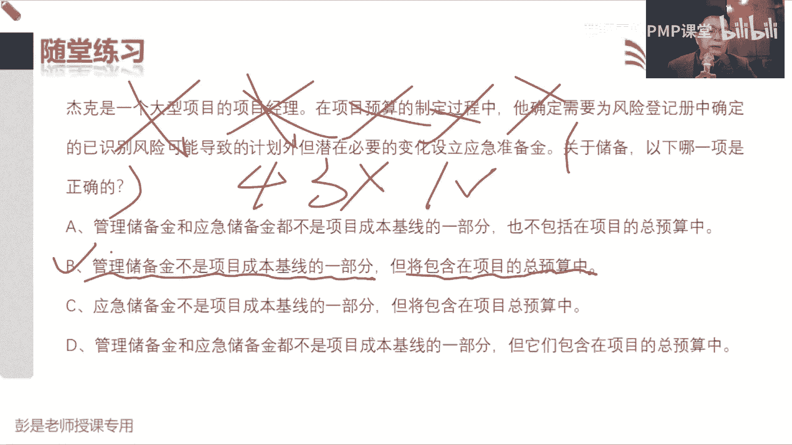
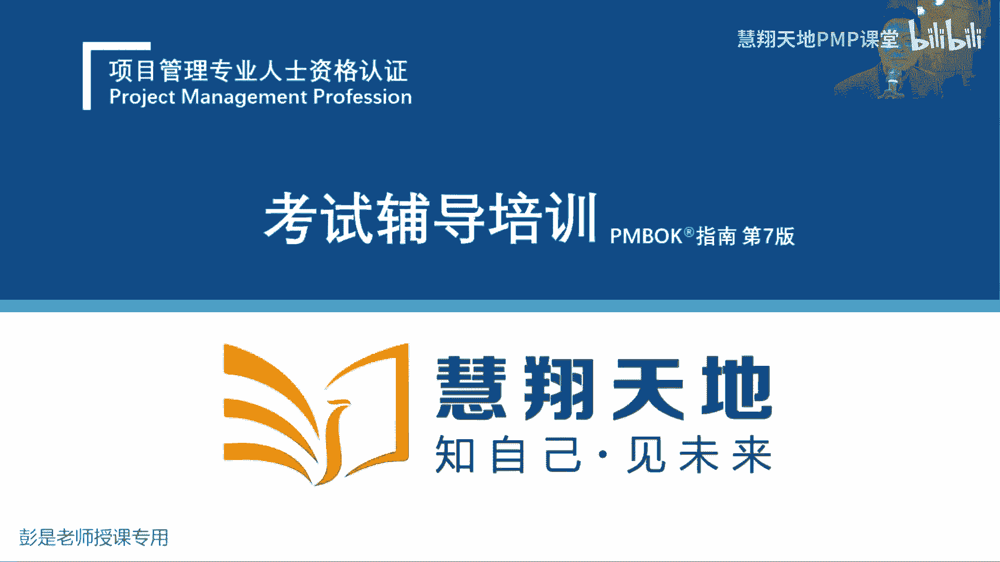
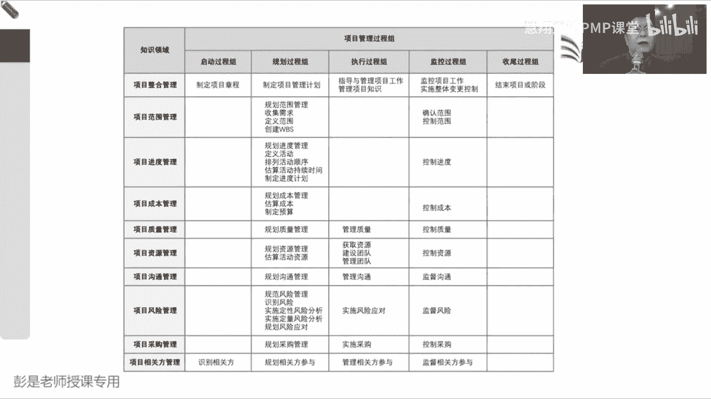

# PMP考试培训课程第1-13章节免费完整版 - P9：第七章：项目成本管理 - 慧翔天地PMP课堂 - BV18y421e7ut

规划成本管理，想一想成本怎么管，出成本的管理计划，然后就像什么计量单位啊，准确度啊，精确度啊，就这些东西啊，什么控制零电池，还把这些规则给他约定清楚，估算成本，估算活动成本啊。

这个管理过程的前置条件能猜到吗，什么玩意儿会影响成本，三个人五个人成本不一样，所以它会达到估算活动资源的输出，资源需求，对三个人五个人成本不一样，那同样是三个人工作一周和两周成本一样吗，也不同。

所以还要拿到刚才我们做好的进度表，项目进度计划，所以他的这两个收入稍稍有一点点印象就够了，拿到资源需求，拿到项目的进度计划去分析啊对吧，这几个人到底干几天活，然后算成本，它的输出不需要去记。

这叫成本估算，这叫成本，估算活动成本，然后再配上一个估算依据，制定预算，这个管理过程呢就是把你算好的成本啊，一级一级一级的往上汇总，那这四个层级关系一定要记住这四个层级关系，听最底层的就叫活动。

活动上一集是什么呢，活动上一集就叫工作包，工作包的上级是谁呢，控制账户，控制账户再往上倒就可以找，找到最根就叫项目哎，这四个层级关系一定要掌握，它就是逐级汇总，从活动汇总到工作包，工作包汇总到控制账户。

控制账户汇总到这个项目唉，这就是制定预算这个管理过程，这个管理过程组成组成逐级的汇总，然后控制成本和控制进度基本上差不多，技巧数据集到信息变更，请求出一个成本的预测，所以这一章这一章啊。

它的输出输入基本上大家都不用去背，不用去背啊，成本管理计划，但知道了估算成本的输出，也不需要具备控制成本呢，单独出一个成本的预测，有一点点印象，看到这个词能反应过来诶，它是什么东西就够了。

制定预算这个管理过程出成本基准，然后第二个出资金需求，那关于成本基准和资金需求，这两个玩意儿到底是啥呢，再看PPT听一听大道理就差不多了啊，关于算钱，关于算钱有这么三个单词啊。

第一个单词是我们实打实算出来的成本，这第二个单词是啥呢，应对已知风险准备的啥，应急储备吧，还有未知风险准备的管理储备，其实他和那个进度啊一模一样啊对吧，成本应急储备管理储备。

进度呢只不过是时间应急储备管理储备，所以实际上是和大家日常工作生活里边买东西，道理一样啊，对不对，你要买个电脑，预算大概是1000块钱，还要考虑一些已知风险准备，一些应急储备，考虑未知风险准备。

一些管理储备，那接下来什么是成本基准，什么是成本基准啊，它就有这样一个逻辑关系，第一算出来的成本，它对我们来说是不是也是一个已知的信息，是吧，第二考虑到一些已知风险准备的应急储备，这也是已知的信息。

那管理储备那是未知的信息，已知的东西，我们要不要对他负责任呢，需要它对不对，所以画个圈圈，这两个已知的东西就是我们的成本基准，这两玩意儿就是我们的成本基准，那基准有了之后还要准备一些额外的管理储备。

所以我们需要把基准再加上管理储备，这两玩意就构成这两玩意加到一起，就就构成共同共同构成了整个项目的资金需求，也就是你一共需要准备多少钱，就是项目的预算好，所以知道这个大道理啊，你把它变成数字就记住了。

比如说如果成本是10万块钱，应急储备是5万块钱，管理储备3万块钱，第一个小问题，成本基准是多少，15吧，这两这两笔钱我对他负责，用来评价我记成本的绩效，所以它称之为基准，那一共需要准备多少钱呢。

18对不对，一共需要准备18万，其中3万用来应对意外的诶，这就是我项目的预算，项目的资金需求需要准备多少钱，不就是资金需求吗，知道这个逻辑关系，资金预算这个管理过程，它的输出就是成本基准加上资金需求。

成本基准是15万，其中包括10万的成本，5万的应急储备，资金需求一共准备18万，因为我们要考虑一些未知风险，可能准备一些3万块钱的管理储备，把这个逻辑关系给他想明白，哎，这两个玩意儿就搞定了。

所以这一章学习的重点，其实就是那个政治分析工具基础，后面再说了，好知道这个大道理啊，再看这一章的管理过程规划成本管理，告诉我们怎么管成本，把这事儿给他想明白，估算成本纯粹的字面意思。

估算活动所需货币资源进行近似估算的过程，制定预算呢就是汇总控制成本呢绩效和变更，这样可以看得非常快，然后概述这段文字，这个大道理我们见过太多了，这是在小型项目之中，某些过程可以合并对吧。

有一个人找短时间内把它完成，听一遍就可以了哈，好再看PPT，要真这么简单就好了，所以呢我们需要掌握一些额外的知识，这些额外的知识大部分基本上现在也不考，但是我们需要掌握，需要看到这个这个单词啊。

能够反应过来它是啥，所以第一对好朋友叫固定成本和可变成本，固定成本和变动成本是什么意思呢，这是啥意思，什么叫固定，什么叫可变，教材上没有啊，专心看PPT，固定成本和可变成本，看PPT讲大道理啊。

他指的是从项目开始到项目结束，相对来说不太容易变的，就称之为固定成本，相对来说容易出现变动的，容易出现变化的就称之为可变成本，那比如说咱现在在在教室里边讲课，这个教室的租金是不是相对来说固定对吧。

咱一共六节课，一节课三次模考，一共九次课，诶，这个租金相对来说是固定的，那什么东西是变化的呢，比如说来一个人准备一瓶水，来两个人准备两瓶水，来三个人准备三瓶水，诶，他是不是和房租的租金相对来说。

它就变化就就有变化了吧，这就叫可变成本，所以它指的是看工作量，看工作量通常不随工作量变化的叫固定成本，随工作量变化的就称之为可变成本诶，这是一对好朋友，听一听，了解就可以了，那如果我们想有效的降低成本。

这两个玩意儿哪个相对来说比较容易下手，是固定还是可变，可变可变吧，既然可变，相对来说它就容易调整了，了解就可以了啊，那第二对好朋友就一定需要记住了，前面一段了解就可以了，停一停。

第二段那叫直接成本和间接成本，直接成本和间接成本，直接成本是说可以直接归因于特定项目的成本，比如劳动力什么租赁成本，间接成本呢是不能直接归因于特定项目的成本，间接成本是指多个项目受益的活。

动或服务的成本，哪能想到啥，间接成本是多个项目受益，大家生活中生活中说一起组团吃个饭，可能结账的时候才用什么样的方式呢，就这样吧，AA制是不是在多个人之间把这笔钱做分摊了，这就叫间接成本。

所以帮助大家带场景啊，说我有一个A项目，还有一个B项目，A项目就说我要需要租一个会议室，B项目组说我也需要个会议室，那这个会议室的租金，是不是可以在两个项目之间去分摊了，诶，他就称之为我项目的间接成本。

如果A项目组说我还需要买辆车，B项目总说这车我不用，那买车的钱就作为A项目组的直接成本，就是这个道理，所以就是在提醒我们呀，如果想有效地降低项目的成本，是不是可以考虑把一些直接成本能分摊的。

尽量分摊出去呢，这样也可以有效地降低项目的成本，哎这需要大家掌握这一对词，所以通常对对项目组来说啊，直接成本那就是走项目组的账，项目组出钱的间接成本，谁出钱呢，公司出公司出完了之后收项目组管理费。

作为项目的间接成本，这一段需要大家掌握的，公路车算是公共公共车啊，他是不是在多个项目组里面去分摊了对吧，包括一些公共公共职能部门的工资对吧，行政部门什么hr啊，财务啊。

哎就这些钱他都会分摊到各个项目组里面的，项目都需要资支付的嗯，项目总用车不需要付钱是吗，对啊他会但他会他会直接，如果他直接记记你项目组的账户，就是你的直接成本，能明白吧，我项目组今天需要一辆车。

公司说我收你100块钱，这是你的成本的，这直接成本对不对，如果说这个车呀到底谁用了多长时间，不一定不一定清楚啊，这是买买车什么，像车的养护养护费用，保养啊，维修啊，之前在各个项目组之间去分摊。

他就作为间接成本，它取决于你，你怎么分决定这个钱，你怎么决定这个钱谁出，能明白吧，如果说这个钱啊，就算到项目的头上说这是你项目组的钱，那就是我项目组的直接成本，如果说他把这个钱可以算到各个项目组里面去。

做分摊，那就作为各个项目组的直接成本，在间接成本，所以就在提醒你能分摊的尽量分摊出去，这样的项目的成本就下来了，项目的成本下来了，什么上去了，利润吧，收益上去了，收益上去了，奖金就多了，这样理解啊。

嗯好这是第二对好朋友，第三对好朋友啊，叫机会成本和沉没成本这两个词也挺好玩儿，机会成本是这么说的啊，被定义为做出决策时，放弃的下一个最佳替代方案的价值，换句话说是我们选择选择向时错过的东西。

说什么巴拉乱七八糟的，废话好带场景，现在现在各位同学啊，如果你面临着两个工作机会，A公司说我给你年薪10万块钱，B公司说我给你年薪8万块钱，如果我选择去了A公司，选择去了A公司，现在的机会成本是多少。

现在我做了决策，放弃的下一个最佳替代方案的价值，那我放弃了多少钱呢，放弃了8万块钱，所以如果我选择去了A公司，做出这个决策时候的机会成本就是8万，那反过来如果我最终选择去了B公司。

现在机会成本就是50万，咱把这个场景再复杂一下啊，A公司说呀，我给你年薪10万，B公司说我给你年薪12万，C公司说我给你年薪8万，如果现在我选择去了A公司，机会成本是多少啊，这千万别迷糊。

是12还是20还是八，12吧放弃了下一个最佳替代方案的价值，那换句话说，我放弃了B放弃了C哪一个是最佳呢，B因为因为他赚的多呀，哎所以如果选择去了A公司，现在我放弃的最佳替代方案的价值。

也就是B和C里面的最大值就是12，做出做出这个决策时候的机会成本就是12万，那如果选择去了B公司，现在的机会成本就是10万，选择去了C公司，机会成本还是12万，所以其实啊机会成本和你打算赚多少钱。

他就是反过来理解的东西赚钱很好理解啊，ABC3个工作机会，哪个工作机会最赚钱呢对吧，因为赚的多呀，那如果机会成本意味着放弃放弃的价值，那放弃的价值自然就是越小越好，越小越好。

它就反过来告诉你这么一个道理，所以就在提醒你做出任何决策的时候，都是有代价的，这个代价越小越好，哎所以这个单词其实很好理解啊，然后下面这个单词叫沉没成本，是说呀已经花费且无法收回的资金。

沉没成本不同于企业可能面临的未来成本，巴拉巴拉，他被排被排除在什么业务决策之外，因为无论解锁结果如何，他们都将保持不变，把这个东西变成场景，变成了T2，已经，已经花费无法收回的资金变成人话。

简单理解就是泼出去的水还收的回来吗，收不回来，所以在提醒我们要做决策，做决策的时候，要不要考虑沉没成本，把它弄回来呢，不要不要，你要展望未来，所以告诉我们做决策的时候要理性，那就做决策的时候要理性。

就需要代偿你，帮助大家理解什么叫不理性的决策，比如说大家工作中生活中都会遇到的场景啊，说什么黄黄金周五一十一元旦春节，我打算出去玩，然后啊出去玩出去玩，黄金周最容易出现什么问题呢，堵人太多了。

我花了四个小时，好不容易开到了景区门口，原计划原计划应该一个小时就到了，结果路上太堵了，现在花了四个小时才到啊，到了公园门口要做决策了，要不要继续进去玩呢，这个时候通常通常不理性的决策是什么。

中国式的四大宽恕啊对吧，第一大过年的，第二他还是个孩子，第三就是来都来了，那就是我们考虑了沉没成本，我好不容易花了这么多的时间到这到这啊，高低进去看一看吧，做这个决策的时候就不理性了，不理性了吧。

那怎么做理性的决策呢，忘掉过去，展望未来，你要去思考了，进去以后人多不多呀，吃饭还是上厕所都要不要排队啊，人人挤人人挨人的，玩的开心不开心呢，返程的时候会不会更堵呢，诶他就提醒我们。

做决策的时候要去分析未来的趋势，要去分析未来的趋势啊，不要吃免于过去，不要沉湎于过去好，所以这两段话加到一起，加到一起，最后就形成这样一个结论，机会成本越第一，我们人类做决策的时候越容易理性。

比如说还是11出去玩，刚一出门，刚一出门拜读提经理，这一个小时的车程，可能真正开过去需要四个小时，你现在在在在在决策的时候，是不是很容易理性了，对不对，那算了，换个地儿或者是不去了，但是对吧。

就是有一种爱叫放手啊，你俩人恋爱的时间越长，你越容易不理性，对不对，难以断舍离啊，他就在提醒咱啊，要趁着成本低的时候，然后去思考，去思考，尽量的尽量的做一些理性的决策，理性的决策。

所以这两个单词听明白之后带到考点里面，带到我们掌握的知识点是什么呢，项目周期这么长，未来到了项目后期变更的代价会越来越大，对不对，到了项目后期变更的代价越来越大，这种情况下让你断舍离。

断舍离有这么容易吗，没这么容易的吧对吧，这样赌徒心理啊，对不对，我花了这么多的时间，投了这么多钱，我一定要想办法把他捞回来呀，就越来越不理性了，那怎么理性呢，把这个成本想办法降下来，就有了阶段划分。

对不对，因为这个阶段这个阶段诶，这个成本相对来说就低了，就更容易理性了吧，然后阶段之间我们要做决策，就有了阶段关口，在每个阶段关口，我们要判断项目的可行性，项目的价值继续走下去，还有没有可行性。

继续玩下去，还有没有可行性继续玩下去，还有没有价值做出这样的关键决策来分析，要不要继续往后走，展望未来，展望未来，已经花出去的钱诶，他就沉默掉，不要沉湎于过去，这个钱越少越容易做理性的决策。

就变成了这样一个知识点，好这两个单词听一听，知道什么怎么回事就可以了啊，所以最关键的就是需要大家记住的啊，就这这一段直接成本，间接成本，好这就去点你们的，不合适就赶早赶，赶紧分，赶紧散对吧，越熬越难受。

一定是这样的啊，越熬越难受，因为你投入的成本太多了，就不容易断舍离，变成大家生活中的场景，不值钱的东西是不是就舍得扔了，值钱的东西就不舍得扔，人，正常的心理啊都这样，所以做决策的时候一定要展望未来。

得把破烂越攒越多，越攒越攒越多，真的是这样，我们家每年定期可能34年就要大收拾一遍，就会发现好多东西啊都在那堆着，常年不用的，好再往下了啊啊成本这一章这一章的核心概念，基本上基本上第一段超重要。

需要大家记住说，项目成本管理，重点关注完成项目活动所需资源的成本，但同时我们也要考虑考虑项目决策，对产品服务成果的使用，维护支持成本的影响，例如，运营成本，那第一个小问题，项目成本包不包括运营成本。

不不包括吧，这是两回事啊，项目是项目，运营是运营，第二个小问题，那我们要不要考虑对运营的影响呢，考虑吧就是这个道理啊，因为如果我们为了有效地降低项目的成本，比如说少检查检查少审查审查诶，成本就下去了。

但是未来可能会运营的过程中，出现各种各样的问题，导致人家运营成本的上升，所以这句话就这段话就在提醒我们呀，作为一个项目的管理者呀，我们需要有大局观，对不对，考虑周全，不能为了降低项目的成本而不管不顾。

所以这个叫最好理解的场景啊，就大家骑的那个什么小蓝车，小黄车，那我研发一个自行车共享单车，为了降低研发成本，我把这个东西去掉，GPS成本噌就下来了，那人家运营基本上就嘎了吧，这运营就要找多少人啊。

需要雇多少人去满大街找车呀，哎运营成本非常高啊，所以一定要有大局观，我们要给我们的发起人，给我们的管理者提出我们合理化的建议和见解，对吧，从售前到项目中到售后，唉我们要把这个事情目目光放长远了。

这段文字超重要啊，就在提醒我们要有这个意识，好后面这段文字不念了，大家看一看就可以了，没什么需要解释的，这几个单词还记得吗，这几个单词还记得吗，投资回收期是啥，多长时间收回成本，赚钱不赚钱不知道。

所以这个周期越短越好，然后剩下那一大堆你记不住的指标，有一个指标和别人不一样，叫BCR，效益成本比这个玩意儿需要大于多少才赚钱呢，1BCR他就是拿收入除以成本除以支出，对不对，收入大于成本唉。

收益大于成本才赚钱的，它需要大于一，并且呢越大越好，剩下记不住的名指标啊，什么NPV净现值，IRRRY效益成本比这些东西啊，它都需要大于零才说明有钱赚，这需要我们掌握这些财务指标，好接下来4。

1规划成本管理，大家看抬头看PPT，因为这一段过得超快，你会发现它和进度这章真的差不多，规划成本管理，一看输入输出工具没有什么东西，然后再看它的输入，没有什么重要的新的知识点输出呢。

这玩意见过了见过了见过了见过了，基本上就这么快啊，都见过了，控制临界值，什么绩效测量规则，绩效测量规则，这是太细了，现在基本上也不考，然后什么成本管理计划，它的内容词过去了，然后4。2估算活动成本。

估算活动成本啊，看看输入输出满盈一扫诶，都见过了，这俩玩意一标资源数量的多少会直接影响成本，同样资源的情况下，工作时间长短也会影响成本，一周两周一个月，两个月成本不一样，所以我们需要得到资源需求。

得到项目的定投计划，输出呢不需要具备了，就叫成本估算和估算依据，再看工具，见过见过见过见过见过见过见过见过见过见过，来了个新朋友，质量成本，质量成本又是什么意思呢，能不能猜出来，它在提醒我们啥。

大家有没有听过这样的新闻啊，说这个饭菜坏了变质了，为了不浪费，咱就把它吃了，哎省了十块钱，结果呢住院花了2万多，这是不是质量成本是吧，还在提醒我们呀，不对吧，我们要考虑降低项目的成本，降低项目的成本。

但是呢质量一旦出了问题，你解决这个问题啊，可能还有更多的其他的成本，就叫失败成本，失败成本啊，唉也不要无休止的无休止的降低项目的成本，因为万一出了问题，上半一产生了失败成本，反而走你成成本啊，更多呀。

这个单词到了质量这一章，你就会看到它里面分四块叫预防评估，内部失败，外部失败，这个听一听就完事了啊，所以估算活动成本，这个管理过程它其实没有，大家需要仔细认真看的，因为前面大部分东西都见过了。

然后质量成本达到了质量这一章再说好，然后再往下看PPT说什么什么对资源，然后要考虑进度，还要考虑什么，像这样这样这种东西需要讲吗，比如说比较资质成本和外购成本，购买成本和租赁成本，这需要展开讲了。

不需要吧对吧，就像自制成本，外购成本是什么东西呢，自己做饭便宜还是叫外卖便宜，购买和租赁成本，你为什么租共享单车不去买共享单车呢，想一想对吧，一天骑共享单车一天多少钱呢，买个年卡。

买个月卡和购买自行车哪个更省钱，买一辆二手自行车可能需要50块钱，骑一年共享单车可能需要100块钱诶，那你为什么还骑自行骑共享单车呢，放在正方诶，方便不怕丢对吧，骑到哪就扔到哪，想提就提。

想骑哪辆骑哪辆诶，它方便它省事，这叫啥，多标准决策分析，不要只考虑成本效益，还要考虑一些其他因素，这就是多标准确的分析，哎，所以自制外购算钱，算钱这种东西现在基本上也不考，因为很容易计算，很容易计算啊。

但话又说回来，大家在工作中，在生活中一定是做复杂分析，考虑周全多巴准确的分析，考虑更多其他的因素，但考试来说，考试来说呀，说买一辆共享单车，50块钱，租一辆共享单车需要100块钱，你是买还是租，买没错。

考试来说就是简单决策，对不对，因为场景不会写得超复杂的，不会写得超复杂的，考试来说呀，最后关于钱，关于钱这一章就这么两个重要的原则，第一如果是考赚钱什么思路，越大越好，如果是考花钱考成本。

那就是越小越好，就这个大方向一定要记住这个原则啊，赚钱就是刚才我们见过这些财务指标，立马什么回收期净现值，效益成本比诶，那我们找最大的，因为赚赚得越多越好，那如果是靠成本，比如说是简单的成本计算。

自制啊，外购啊，购买啊，租赁啊，那成本越低越好，花的钱越少越好，最后结论就是大家一定要一定要考试来说，钻钱眼，钻钱眼儿，就这个道理啊，好再往下估算成本来了，一对新朋友。

这对单词需要大家掌握的一个叫粗略两级估算，一个叫确定性的估算，这个单词我们根据现在大家储备的知识，给大家大概这样总结一下，看PPT听一遍应该就差不多了，看PPT啊，听一遍，在项目早期。

我们得到的信息通常来说层级比较高，这叫概括性的粗略的信息，这种情况下你算出来的成本他准不准呢，有可能就不太准了吧，哎就称之为叫粗略量级估算，也就是规划过程组之前给出的预算，通常可能有较大的出入对。

因为信息不多呀，那粗略到什么程度呢，它允许偏差的范围，负的25%到正的75%，所以一个100万预算的项目，现在现在还没开始做计划呢，它允许浮动的区间就比较大，可以从75万到正的175万。

但是随着项目渐渐明晰的特点，到了规划阶段，后期我们收集需求，定义活动，定义范围得到了WB，有了WPS定义活动，根据活动估算资源时间和成本，这种情况下给出来的估算结果，是不是应该准确度有所提升了，对不对。

就不能再不准了，所以随着项目渐渐明晰的特点，到了规划阶段，后期这种信息呀越来越丰富，越来越细化，那我们给出的预算，给出的工期它就不能有，不能有太大的太大的偏差了啊，它就叫确定性的估算。

它允许浮动的区间就是负的5%，到正的10%了，所以还是我们这个100万的项目，到了规划阶段，后期它允许浮动的区间就是95~110，不需要不能有较大的出入了，要不然就不科学了，就这个思路好。

这是关于粗略量级估算和确定性估算，这两个术语，然后再往下进行成本估算，巴拉巴拉，就是所有涉及到的钱都把它算进去，这也没啥说的啊，那这个管理过程输入，这个管理过程输入，然后李九同学说，粗略量级量级过。

粗略的粗粗量级的预算，是项目章程里面的资金吗，有可能啊，只能这么说啊，有可能，因为有没有可能，实际上项目章程里面的高层级的，总体的预算是准的，什么情况下他会准，什么情况下他会准，什么情况下都会准。

和刚才我们听过的一个大道理一样，这事儿咱熟对吧，两个项目本质上是一样的，这个事情我们很熟悉很熟悉，那给出的给出的这种这种总体的预算，可能就是准的呀，这也好理解吧，之前做过类似的项目，就这个道理啊对吧。

这个小区盖完了一个楼，花了一个亿六，其他公司再找找你，再找你盖一个相同的楼，诶这种情况下，两个楼本质上一模一样，我们有这个专业知识，给出的这种总体的预算，它可能就准，好再回到知识点啊，回到教材上。

然后这个管理过程什么输入啊，没什么需要大家去记得，输出呢也没有什么东西，非常非常快乐，那4。3制定预算，这个管理过程关键词一标，基本上就下班了，就叫汇总，从活动到工作包到控制账户，到整个项目。

然后得出来三笔钱，成本加上应急储备，就等于成本基准，成本基准加上管理储备，就等于资金需求，就等于整个项目的预算，所以这两个输出一定要搞定他的这个管理过程，输入没有什么需要去记的工具呢，成本汇总不用看了。

储备分析，还是那那一对那一对单词啊，我们在整个项目层面要考虑应急储备，管理储备，第四个工具其实也不大会考，但是看名字啊，需要大概能猜出来历史信息审核，咱做项目预算的时候审核历史信息，这么做的目的是啥呢。

你能想明白，能猜到就不用学了，不用记了，现在我这个做做我做我这个A项目的预算，为什么还要看一看之前之前类似项目呢，唉陈同学说参考就这事儿啊，做完本项目的预算之后，参考历史上找找几个差不多的项目啊。

看看咱的预算和人家的预算有没有较大的出入，对不对，有没有较大的偏差呀，万一有较大的偏差，要去分析了，为什么，对不对，是什么房，房租涨价了还是什么，工资涨了还是物价涨了，以此类推吧，要去分析原因。

要去分析原因啊，唉所以叫审核历史信息，只能听懂就可以啊，那第五个工具就需要大家掌握了，什么叫资金限制平衡，什么叫资金限制平衡不看平衡两个字，什么叫资金限制，这个应该好猜吧，啥叫资金限制啊。

变成人话就是穷，没钱没钱，刚过完双12，我现在没钱了，没钱了，元旦什么圣诞再送礼物就没钱了，就没钱了，想给自己换个新手机，没钱了怎么办呢，这周用超支了怎么办，还想买个新手机咋整，记住这一个字不就完事了。

等等下个月发工资了，唉所以就是对项目来说，我们可能会受到资金的限制，受到资金的限制，对企业来说对吧，你可能财务跟你说呀，账上没钱的对吧，年底再审计啊，我们封账了，封账了，这两天账户不能动啊。

由于受到各种各样的因素，可能导致我们受到资金的限制，资金的限制就是没钱，那怎么办呢，要平衡资金的支出，所以它可能会导致什么玩意儿发生变化呢，进度计划对不对，这个月没有钱，等下个月再支出，等下个月再指出。

它可能导致进度计划发生变更，发生变更调整，大家实际上在工作中，通常通常就有这样的场景啊，这个月没钱，下个月再给你付款了等等等，所以这个玩意儿带一个输出，只要能理解这个意思啊，由于受到资金的资金的限制。

所以要平衡资金的支出，平衡资金的支出，就可能导致我们进度计划做调整，这个月钱花的差不多了，有一些付款可能拖到下个月，就这意思好，第六个工具，这玩意儿不用背吧，啥叫融资啊，找钱啊，这高利贷你粗暴理解对吧。

借款借钱唉，这叫融资，所以融资基本上也不考啊，所以这个管理过程啊看一看就可以，这堆单词你能够看到它知道它是啥就够，也不要去背它是不是属于4。3了，能看懂就可以，一定要记住的就是这两个输出啊。

记住刚才那三笔钱，它的逻辑关系，成本，应急储备，管理储备，好所以这个管理过程巴拉巴拉不念了，说预算包括这一定要记住啊，预算包括所有钱，成本基准，包括应急储备，不包括管理储备，这个界限一定要分清楚。

再往下翻输入没有什么需要讲的知识点了，输出成本基准，只要你刚才记住那个逻辑就完事了，然后书上这张示意图，大家千万千万不要误会啊，千万不要误会说在活动这个层面，可不可以有管理储备呢，在活动这个层面上。

可不可以准备一些管理储备，可以，只不过相对来说对吧，相对来说可能性比较小，仅此而已啊，所以右半部分你不要去看它，但是左半部分这个结构一定要记住它，成本基准不包括管理储备。

成本基准加上管理储备等于项目的预算，也就是我们的资金需求好，所以说上这段文字又带着强调这个东西啊，然后再往下再往下说，这条S曲线需要解释吗，因为随着时间的推移，每天都在有成本的，对对，房租啊，公司啊。

水电啊，交通啊，吃饭啊，都是钱的，所以它通常不一定是直线，通常不一定是直线，就会弯弯曲曲，所以呢这张图也称之为S曲线，这些能知道这个为什么叫S曲线就可以了啊，好成本基准，包括规划包吗。

包括呀所有需要的钱都要往上加呀，都要往上加呀，哎呀好，再往下4322，资金需求纯粹的一句话，就这意思啊，这也不念了，然后4。4控制成本，这个管理过程输入输出turn就过去了，政治分析超重要。

但基本上现在政治分析啊，这个复杂的计算也不大，会考不大会好，所以后面讲工具的时候再单独说，纯看输入输啊，输入输出的话，这个管理过程没什么东西，没什么东西啊，看到成本预测这个单词。

能知道它是什么东西就可以了，成本预测是我们在监控的时候，根据目前目前对吧，花了多少钱去分段啊，未来还需要多少钱呢，就是趋势分析有一点点印象就够了，然后4。4综述这段文字看PPT啊，关于政治分析啊。

需要大家现在有个大概印象，大概印象是啥呢，第一个小问题，第一个小问题啊，我中午叫外卖，让麦当劳给我送四个汉堡送过来，我给你到付，结果呢麦当劳只送过来两个，你给人家多少钱，给四个的，还是给两个的。

很简单吧，干多少活给多少钱，干多少活给多少钱呢，好那第二个小问题，我们把这个场景复杂一下，复杂一下，今天让麦当劳给我送四个，明天让麦当劳给我送四个诶，那今天我应该花四个的钱，明天应该花四个的钱。

我把它实实例化啊，今天我打算花40块钱，明天也打算花40块钱吃饭，结果啊今天麦当劳有优惠，你下订下订单买八个，买八个只收你70，买八个汉堡只收你70块钱，那第一个小问题，第一个小问题，截止到今天。

账面上我应该支出40块钱，实际上支出了70块钱，你能说我超支吗，你能说我超支吗，我媳妇儿一查账，今天你应该花40，结果实际上花了70，你怎么乱花钱呢，这么说科学吗，不科学，为什么呢。

我提前把明天的东西也卖出来了，你要看看我完成了多少工作吧，唉你要看看我完成了多少工作呀，对不对，我现在实际上唉黄河同学说的非常到位啊，实际上就是花了更少的钱，干了更多的火，对不对。

所以实际上实际上从成本上来讲，我们在控制成本的过程中，这个场景不叫超支，这是反而是省钱了，对不对，我花了更少的钱，干了更多的活儿了，知道这个大道理啊，所以今天应该花40块钱，实际上我花出去70块钱。

这叫什么呢，指监督资金的支出，没有考虑这些支出所完成工作的价值，这么做没意义，这叫跟踪资金流，这叫管钱不管事儿，那如果我综合考虑啊，说今天应该买花40块钱，提前把明天的也买回来了，诶这才叫管钱又管事。

我们要考虑已完成的工作，它的价值先不考虑质量啊，一考虑质量场景又复杂了吧，并且冬天现在不容易变质好，其实这段文字未来讲到政治分析，讲完政治分析，你再来复盘，就根据刚才那个场景就理解了。

所以我们要重点监监督，资金支出和相应完成工作之间的关系，因为我实际上表面上看实际的支出比计划多，实际的支出比计划要多，但整体上来看反而是少花钱多办事了，好这段搞定，然后这段文字不念了，大家看就可以了。

就是绩效变更车轱辘话来回说了，那这个管理过程输入没有新的知识点输出，基本上想看就看，不想看可以先跳过啊，没有什么太多新的东西好，各位同学呢，咱做一做这章的练习题，哪一个管理过程出成本基准，就是A吧。

没有D这个术语啊，我们这个管理过程叫制定预算，制定预算，算出来三笔钱的成本，应急储备，管理储备成本加上应急储备等于基准基准，再加上管理储备，等于整个项目的预算，好这道题呢，简单吧，什么准确度啊。

精确度啊，要不要什么四舍五入啊，小数点后几位啊，允许偏差多少啊，这都叫成本管理计划对吧，和他相像的就叫进度管理计划，公司考勤要精确到秒分钟还是小时就可以了，然后需要大家准准准时到公司，允许偏差多少。

以此类推，他都是把准确度，精确度，临界值，把这些规则说清楚，这个呢，项目A400000，项目B38。8万，最后选择项目B，放弃了项目A，做出这个决策时候的机会成本就是40，对不对，所以答案是B。

好这个你公司要求你提供一个成本估算，要求只要使用产品，就要包括维护安装保养成本，这种估算叫什么呢，这肯定不对，这个肯定不对，是B还是D，是B还是D，什么是折旧啊，什么是折旧啊，你花10万块钱买一辆车买。

买完了之后一个一个残酷的现实啊，买完了之后，你还能10万块钱卖出去吗，卖不了吧对吧，你可能才能卖8万，再用一年还能卖8万吗，再用一年还能卖6万吗，以此类推吧，嘿他就是这东西不值钱，越来越不值钱的。

那你损失的这个价值就称之为折旧，折旧额可能每年这玩意儿贬值2万块钱，每一年贬值2万块钱，这就称之为折旧，所以以前和以前还会考到折旧的计算，什么直线折旧法，加速折旧法，双倍余额递减联合法。

现在基本上也不考，那考试看到这个单词能反应过来，它是什么东西就可以了啊，折旧对企业对项目来说它意味着啥，是收益还是成本，哎能想到这OK了，这对我们来说是损失，对不对，就是成本他也算到成本里面啊。

那通常小东西需要搞这么复杂吗，对吧，一个破纸杯算折旧几厘钱，几厘钱没必要，所以通常啊比较值钱的东西，才会考虑这个折旧的什么设备设施，大型固定资产诶，这个单词听懂知道什么东西就可以了啊，那回到这道题。

说我们提供一个成本估算，要使用产品，还要考虑这个产品的维护安装保养，那还是买这个车，有的车卖的很便宜，但是呢，这些钱就比较多，有的车卖的贵，但是呢这些玩意儿都比较少，但不容易出问题啊。

就是说我们要考虑啊全生命周期，考虑全生命周期从购买呀到使用啊，安装啊，运输啊，维护维修啊，保养啊，甚至包括最终的处置，把它光都考虑周全，这就是产品的全生命周期成本，这个单词要有印象就可以了。

好看这道题呢，这个简单，黄河同学再想想是不是打错字了，答案是第二个吧，说有一个程序员发现一个设计缺陷，可能要求团队反攻，做出一个重大变更，哎那处理这个情况怎么样呢，先确定带来什么影响，A肯定不能选啊。

让他去问张三，问李四，这肯定不科学，没道理啊，C肯定不能选，停止项目工作和发行开会莫名其妙，D直接更新来反映这个变更，直接对变更做了批准的签妥，所以比较合适的就是第二个，这个题呢，NPV就是净现值。

给了项目A项目B项目C为啥选C啊，不是应该选D吗，这判断不出来啊，项目A给了净现值，给了内部收益率，给了启动资金，项目B呢给了净现值，给了BCR项目C呢给了机会成本，这没办法比啊。

这么多这么多东西没法比啊，信息不足，那不是应该选D吗，为啥答案是C，答案就是C，想一想刚才说啊瞻钱瞻前这个大原则，赚钱赚得越多越好，赚的越多越好，这些指标什么内部收益率，启动资金BCR机会成本。

其他项目没有这样的指标，所以它没有可比性，但是作为考试来说对吧，但考试来说哎，这三个项目都有净现值，净现值越大说明赚的钱越多，那咱推荐项目C代表着我们知道这个知识点，所以做简单决策就可以了。

实际工作中那一定是D，实际工作中一定要你要考虑投资回收期，还要考虑投资回报率对吧，就是回回报率回报率，比如说这个项目让你赚1%，那我就不做这个项目了，还不如把钱存银行的，对不对，银行利息还比这个高的。

还要考虑投资回报率，还要考虑初始投入资金，没钱，你这活也干不了啊，对不对，说我要开个开个开个环球影城，投资20个亿，你干嘛你不干，因为没有钱呐，还要考虑体重资金，对不对，实际工作中一定是复杂决策。

你要考虑很多因素来决定这个事儿到底干不干，但考试来说就简单粗暴，直接就可以了，考试来说就选C，因为这个项目赚钱赚的多，掌握到这个程度OK了，好那这道题送分题了，粗略两题估算的范围是多少呢，就这个了吧。

允许偏差的范围比较大，负的25%到70%，A呢叫确定性的估算，好我做这道题，有同学选B，有人选C，有人选D，有人选A，选啥，说干型需要做出一个变更，这会影响到预算以下哪一项定义。

为了实现这个变更所需要遵循的过程，哪一个选项是49个管理过程之一，并且这个管理过程管预算的变更，所以答案就是A纯粹的文字游戏啊，纯粹的文字游戏监控过程组不是管理过程，涉及到基准的变更。

通常需要CCB做决策，但是呢CCB它也不是我们要遵循的过程，可能涉及到预算，涉及到预算要更新成本基准，这是我们这个过程的输出，所以也不能选，只能选A了啊，就这么阴险啊，这道题简单了，选啥呢对吧。

答题小技巧啊，你看完这个问题去想一想，还有必要看场景吗，说关于储备以下哪一项是正确的，换句话说四个选项里有三个是错的，只有一个是对的诶，它跟场景没关系了，就不要去读题了，对不对。

所以管理储备不是项目成本基准的一部分，这是对的，但是呢这个钱我们需要准备好，它包括在项目的总预算之中，属于项目的总体的资金需求之中，所以B是对的，就选B好。

这就关于成本这一章，大家需要掌握到这个程度，基本上过程啊，输入啊，输出啊都是听懂，知道它是啥就可以了，唯一需要想一想的逻辑就是那个汇总对吧，活动工作包括控制账户到整个项目，然后想一想什么是成本。

什么是应急储备，什么是管理储备，把那个逻辑关系对吧，是什么是基准，把这套逻辑关系给他想明白，那接下来讲完成本，讲完成本啊，没下班了，不要不要着急走啊，还有还有好几分钟呢。

范围进度成本都搞定，咱需要花几分钟时间给大家先预热一下质量，这一章说了啥啊，还记得前面给大家铺垫过，说我们指导与管理项目工，指导与管理项目工作，按照计划去干活，产出可交付成果。

这个玩意儿直接让客户去验收，好不好呢不好，万一发现有问题，可能导致客户满意度在下降，所以为了稳妥起见，我们需要需要先干嘛呢，先做内部的，指控需要先做内部的指控，对不对，我们牛肉面做好了之后。

服务员上菜之前，你要检查一下，检查一下啊，面对不对，肉对不对，汤对不对，里面有没有什么头发，烟头老鼠，以此类推，做内部的指控，指控之后就会得到一个叫核实的可交付成果，这个玩意儿你再端到客户桌子上去。

让客户去确认范围，做验收，验收通过我们就可以诶，结束项目或阶段，对不对，这叫最终产品服务成果的移交，变成场景，就是亲，您看看牛肉面是您的吗，是那移交给您了，您吃吧，跟我没关系了吧，你去吃你去吃啊。

哎就这么一个简单的事情啊，好那质量这一章他在说啥啊，说我们干活干活，在质量这个维度来说，通常有五个水平，五种水平就叫五个等级，最low的是干完活直接让客户去验收，做好牛肉面，直接让客户去验收。

万一客户发现里面有头发，可能导致客户的投诉，导致客户满意度的下降，这是最low的，好一点的做法是我们先内部做指控，我们内部做检查，做测试，检查完了，测试完了，核实无误了，核实无误无误了。

然后再让客户去验收，这么做好一点，但是呢做检查做错是做指控，这叫事前事中还是事后事后吧，你把牛肉面做出来，然后我们做检查，牛肉面做出来做检查，检查发现有头发你就返工检查，发现有头发你就返工。

那咱能不能在做菜的过程中，想办法保证这个头发不掉到菜里，这是不是就是适中了诶，就有了管理质量，这个管理过程，如果说控制质量，他关注的叫结果的质量，那管理质量关注的是什么的质量呢，它就称之为AB错。

这叫过程的质量，他告诉我们厨师啊，你们在做菜的过程中，该戴帽子戴帽子，什么该戴口罩戴口罩，张厨师这个菜掉到了，掉到地上以后啊，不要直接放回锅里，你把它洗一洗，你厨师啊不要用嘴直接去尝这个菜品。

你的你的口水会掉到菜里的，影响大家吃饭了，王厨师做菜的时候，炒菜之前你看一看菜里有没有老鼠，有没有老鼠啊，以此类推，他们更关注的叫过程的质量，让我们的所有的员工对吧，从洗菜切菜炒菜。

还在菜品制作的过程中，时刻关注，时刻关注，我们需要达到什么样的质量标准和要求，来确保过程的质量符合要求，确保过程的质量符合要求的目的，是为了更好地得到结果，所以大家工作中像什么规章制度啊，流程啊。

政策啊，程序啊，只有这些标准化规范化的东西，他为了弥补大家能力的不足啊，张厨师做菜不重视，不关注卫生，那我们需要出标准，出政策，出出程序，尽量的尽量的弥补他能力的不足，让他做出来的东西啊合规好。

这就是质量的第三个境界，管理质量，管理质量啊适中，确保我们过程的合规，让厨师做菜的时候都戴帽子，这样头发不就掉不进去了吗，让厨师洗菜的时候也戴帽子，然后反复洗，反复洗，洗个两到三遍的，提到两个三遍啊。

把这些异物给它清理干净了，以此类推，这就是管理质量，这个管理过程存在的价值，在提醒我们要关注过程的质量，看看啊，这是五，这是四，这是三，那再往上提高一个水平，就带出来第一个管理过程，第一个管理过程。

说好的质量是怎么出来的，事前做好规划设计，事前规划好设计各种各样的预防措施吧，诶事前去分析了对吧，我们洗菜切菜，甚至买菜进菜，做菜上菜各个环节，我们怎么过程中保证质量，我们怎么确保得到一个一个。

符合质量要求的结果，所以好的质量是规划和设计出来的，对不对，规划设计出来，给我们厨师提前买好帽子，然后来了戴帽子，然后没事没事定期巡查巡查大家是不是合规呀，保证过程的质量，保证结果的质量。

所以好的质量是规划和设计出来的，就到了第二个境界，最高的境界是什么呢，最高的境界是啥，最高的境界就是把这套话术变成企业的文化，让大家都有这个意识，对不对，全员以客户为中心，T q m，全员以客户为中心。

我们上到领导，下到员工，供应商合作伙伴，我们关注方法，关注过程，关注结果全面达到质量标准和要求，诶这是TM这玩意儿，大家完全可以参考胖东来听过吧对吧，大家对你看到网上这些言论，对胖胖胖胖东来的感受是啥。

就一个字对吧，真好真好，确实好看，这是不是变成了企业文化，所有人都是这个这个以啥以顾客为中心，对不对，我们不仅仅关注结果，还有关注过程让大家满意，让大家开心，考虑到更周全，这都是需要精心的规划和设计诶。

就变成了文化对吧，有规划，有设计，有执行，有落实，事前事中事后都给他考虑进度，知道质量，这张他这个来龙去脉，咱就可以下课了，然后下午在大家吃完饭，再带着你回顾一下这套恶心的东西啊，好各位同学上午听课。

辛苦了，咱下午01：30准时准时开始啊，下午见，下午见，各位同学拜拜，吃外卖的时候不要想了，眼不见为净了哦，对帮我按一下那个开关就可以了，各位同学下午好，下午好，还有40秒，即将开始今天下午的课程了。

还有十秒钟，即将开始下午的课程，大家下午好，下午好，看一看声音是否正常，各界能否正常显示，脑子里想一想啊。

