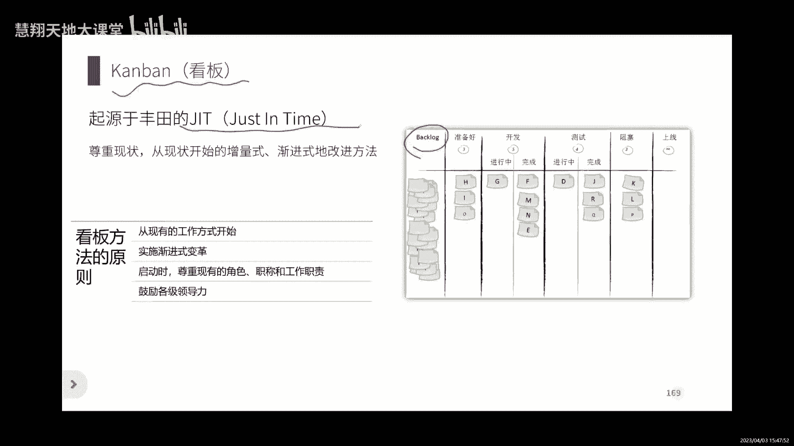
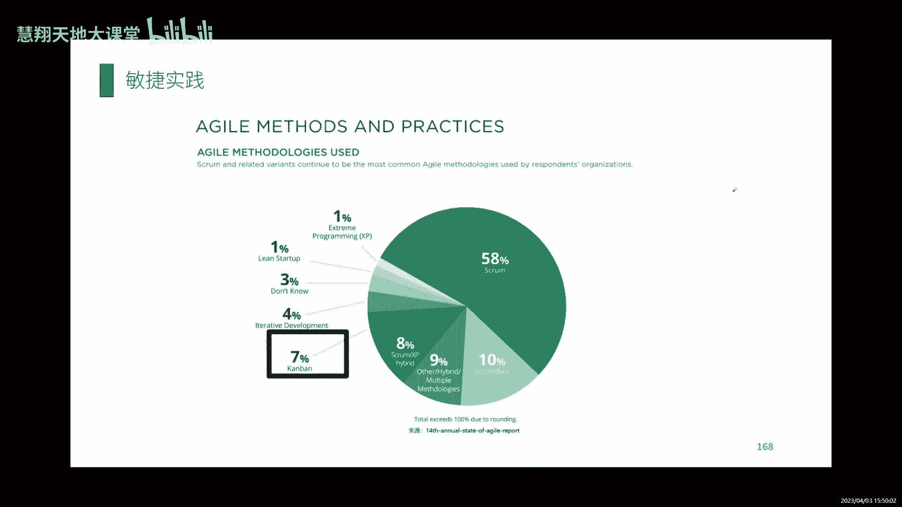
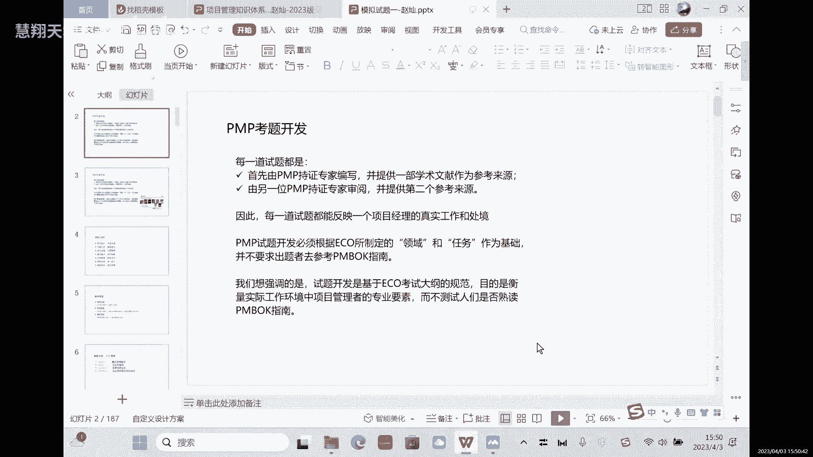
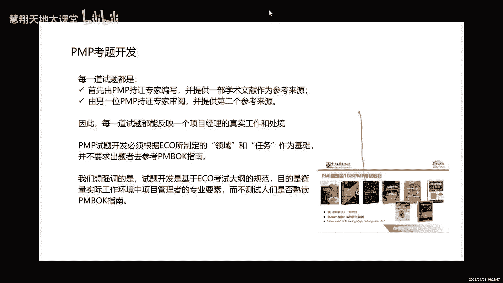

# PMP考试备考解题技巧与原则／PMP考生必学，建议收藏 - P1 - 慧翔天地软考 - BV18u4y1U7Ry

哦这是我们今天啊，我们今天去给大家梳理的，整个的这个这个体系啊，包括预测和瀑布啊，预测和这个敏捷，但是我觉得可能对于大家来说还是量比较大的，虽然我也过得比较快，就是你要熟悉整个的这个管理逻。

辑和管理方法的思路，就可以，还有一些重点啊，重点的哪些啊，涉及到的工具，但是考试的时候其实还是要通过啊，就基本上从今天开始，特别是从明天开始，你就进入到一个正式的这个备考阶段啊。

就是进入到正式的备考阶段，但这个备考阶段需要大家完成的或者做的啊，就是通过做题去了解这些概念它怎么应用，以及这个概念他怎么样，你能够正确的选出正确的选项，能够把这个正确率提升，所以这是考试要达到的目的。

就是正确率啊，但是这个里边呢就是问题比较大的，就是量比较大，就量比较大，量比较多，就是需要大家可能这个花点时间，但是呢就是根据你的时间安排啊，还有你的这个学习习惯呃，我是我是不太建议大家。

就是说你就是花大量的时间在看书上，我觉得你这块时间上你可以稍微减一点，因为你后期通过做题，你可以再回到书里面去翻书，当工具去用的话去理解，这样的话效率会更高一点。

我觉得这样就是整个的这个学习效率会高一些，然后另外就是我上次跟大家说的方式，因为咱们都是同事，我觉得也应该没有什么不好意思的吧，就是我们要沟通多讲一讲，互相讲一讲啊。

互相讲一讲就会理解到理解的比较快一点，也是节约时间啊，我觉得应该也是对大家来说效率是比较高的，你自己看一遍书啊，花花花费的这个时间远远的要大于，就是我们讨论一下这个时间肯定是会的，但是你每次讨论的时候。

最好是提前约定一下，比如说就一个小时我们讨论什么内容对吧，这个大家怎么理解的，这个肯定会比你自己看书要好很多好，这是我们来做今天的这个梳理和串讲哈。

那我们明天要考试啊，因为这个试题啊一共是180道题，咱们要下午的时间把180道题都讲完，所以时间还是因为是第一次啊，第一次，所以我想给大家讲的细一点，那这个时间上可能会比较紧张。

我们先把明天我要跟大家提前说的，了解了考试的一些规则，以及我们考试的时候要注意的啊，就是偏僻考试它有什么样的特点和解题技巧啊，原则先跟大家说一下，我们需要休息吗啊。

刚才是比较困的，现在都比较精神，好我先说一下，就是PMI刚公布的他的考题是如何去开发的啊，对于偏僻的考试，这个也是他第一次公布啊，就是刚在两个两个周之前吧，我参加他们的那个就是在给咱们上课。

第一次上课之前参加他们的年会，那他第一次公布了他的试题，开发是按照这个这个思路啊，就按照这种方式来开发的，他的每一个考试，每一道试题啊，对于对于偏僻的这个考生来说，不是先有偏book才有试题的。

是先有考纲，就他的考纲是先出来的，就是我因为这次考试我要先给一个考试大纲，考试大纲呢是每4年去做更新，所以他是先基于考纲，考纲里面考哪些考点，就是他就是我们在今天上午的时候，给大家看到的那些任务。

就是域里面的那些任务，就是它的考点是基于这个考点，我们要考察这些知识点啊，然后去考察大家的应用能力，所以它是这个逻辑，不是因为像我们原来上学的时候，更多的是啊，我们上大学可能老师先给我们讲教材对吧。

我们先讲一本书，这是我们的学习教材，然后基于这个学习教材，我们再去在这个教材里边给大家划重点啊，哪些是重点，然后基于这个重点我们去考试，它不是它是基于我先去有题，先去研发试题，有了考纲去研发试题。

有了试题以后再去看参考书，就是我们有可以给你提供，或者是告诉你有多少参考书，你可以去参考，偏book只是他其中的一本参考书，它是这样的一个逻辑啊，所以它是他为什么是这样的逻辑呢，是因为对于这个pm来说。

他们认为考试就应该是特别是管理类的，这个偏僻的考试，它是应用型的考试，他考察的是你实际的应用能力，这种实际的应用能力，是基于你对于这个考点和知识点的理解来的，不是去背啊，不是说我把这个概念记住了。

备注了，然后我在考试的时候我就能选对，不是的，是基于我对于这种应用场景之下，我是不是能用这个工具，我对这个工具的理解上，在这个基础之上来考察你的思维和你的理解，应用的能力，所以它是这样的一个考察。

那对于他的每一道试题，他是怎么开发的呢，他都是先由一个偏僻的持证人员啊，就是持证的专家先去编一道题，就是根据自己的工作实践，所以在大家看到的所有的试题的这个场景，就根据我的工作实践。

我在我的工作里面遇到了这样的一个场景，那在这个场景下呢，我就先编一个这个场景里边，涉及到的一个这个知识点考点啊，在四个选项里边呢，有一个相对来说比较符合于，解决这个实际问题的这样一个选项。

那出了这道题以后，他对于出的这道题的要求是你必须啊，对于你出的这道题考察，考察的这个考点，是必须在参考文献里面能够找到出处的，因为他指定了有十本参考文献啊，就是所有的这个参考文献里边，你能找到一个出处。

说你出的这道题，你这个场景是对应的这个文献里边一个点啊，又又是有理论支撑，那同时呢，这个时候再由另外一个偏僻的持证人员，再去审阅啊，就看你的这个提出的是不是合理对吧，有没有问题。

那同时呢你这个第二个审阅的人，还能够在另外一本参考书里面，再找到这个这个考点的一个理论的一个支撑，就是他每一道试题，你必须是有两个理论支撑啊，他才能够去用啊这道题，所以这是他试题开发的时候。

他就这么来做的，所以他每一道试题，它反映的确实就是你实际的一个工作场景，所以对于大家来说比较难受的是什么呢，就是我们做题的难受点，就在于你做了180道题，但是你时间很短对吧。

你我们只有一分多钟一道题的这个时间，你要解决180个问题，它其实是他根本就不是说，我记住180个概念，就每一个题都是在解决问题，问题怎么办怎么办对吧，每一道题都在看怎么办，就是很难受，就是这种感受啊。

所以它就是应用型的考试的一个特点，那所有所以呢他强调的就是就是PMI，他最后想强调的是试题的开发呢，它都是基于这些考纲的规范来的，所以目的是考察我们的专业素养，就是你对这个知识点的理解和应用的这种能力。

而不是去背书啊，所以这是也不需要去背偏book，所以我希望大家我们去看书的时候，说用这个这个找一些重点啊，或者是当然这是我们的学习习惯和方式，你觉得这样效率高也可以没有问题，但是我们更多的是。

如果能把它当成一些工具去查询，更多的是理解啊，理解这个工具的一个应用啊，这是它考题开发啊，它也有这个特点啊，好那对于他的这个考题开发呢，它这里边也涉及到了有几本书啊，就是我给大家列出来的。

不知道大家能不能看到，也是这个有这十本书，这十本书呢是也是p mi刚刚公布的，就是PMP考试试用的参考文献啊，就是这是所有的考点，就是所有的大家做的这个考题，都可以从这十本书里边找到出处啊。

这也是他指定的一个参考书，所以我们不可能说我们就考，一个是三个月的时间，把十本书全部都学了，对相对来说我们也是把核心的一些管理思路，管理思维，一些工具方法，在这个学科里面给大家去进行一些梳理和讲解。

然后更多的是需要我们在试题的这个，工作场景里面去理解啊，去应用啊，所以是这个内容啊，所以不要背背题是没有用的，就考试的时候，你说我就原来做过的题，我可能会碰到一模一样的吗，有可能但是很少啊，有可能。

但是很少会，因为它的题库是不断更新的，就是他的题库的每次更新是他也不对外公布，它是不对外公布他的题库的，它不像这个很多国内的考试，我就是这么多题，你刷就完了，他不是他不对外公布的。

而且每次更新更新的幅度是多少，都没有公布过，那所有的机构拿到的这些题啊，基本上都是呃基于原来考过的这个考生啊，就包括考试考过的这个考试啊，所了解到的这些试题，那所有的答案呢。

都基本上都是做这个试题研发的，这些老师给出的答案，所以都是参考答案啊，所以大家在做题的时候，你不要纠结，就不要纠结，所以为什么让大家去讨论呢，因为这个集体的智慧相对来说正确率就更高啊，如果是个人。

可能对于这个理解上可能会有一点点问题，就正确率偏低，所以也是这样啊，就所有的试题，也是老师根据他的多年的这个教研的经验，去做出来的，这个试题的这个选择的选项，它不是PMI的选项。

就它不是PMI公布的正确答案，是我们每个机构的这些教研的老师去做出来的，这个选项只是说正确率更高一点，大家不要去纠结，说唉这道题就是我就觉得这个A对嗯，就是D不太合适对吧。

我就特别觉得这个D肯定是不对的，那也没问题，你就选A对吧，所以不要纠结，就一定不要纠结这个问题，就是我们就要理解这个知识点就可以了，思路只要偏差不太大，是问题不大的，而且上午的时候跟大家说了。

正确率只要求我们对吧，110道题你就除以111÷180，就这个正确率的要求，所以70%是稳过的，就100分，你考70分就稳过了啊，不要太纠结，很多特别纠结的问题啊，但是还是要基于理解。

所以这是我在我们先理解一下这个考试啊，那对于解题来说有这七个原则，希望先跟大家说一下啊，第一个原则就是抓大放小，不要纠结，因为首先我们从时间上你考虑一下啊，大家做题也有这个体会了，现在啊180道题。

230分钟时间对吧，只有200分钟答题时间，200分钟的答题时间，一分多一点就要做一道题，你首先你要阅读速度，你要提升上去，然后呢在一道题上为什么要抓大放小，不要纠结呢。

是因为在一道题上你没有那么多时间纠结，这是第一个，你做不完，根本就做不完这么多题，然后第二个呢是有可能啊，我们在前面做的这些题，你想想180道题，他不可能考你180个考点，它有一些考点是重复的。

就是它会重复的考一个概念，所以既然他能够去考重复的一些概念的时候啊，所以你在后面去做题的时候，你可能前面的思路就打开了，也有可能是这种情况，所以你不用在一道题上去纠结，时间特别长，如果你特别纠结这道题。

你就画个圈再去做，后面用这种方法先切完成，后面的你觉得不纠结的，还有一种情况是什么呢，就原来我们有一些这个同事啊，去考试的时候就是也很久，比如说也有确实有很长时间没有考过试了，然后猛一下就考试了。

不太适应考试的这个节奏，所以呢在一开始考试的时候有点懵，就是比如说先拿到题以后，一看一个一个本子里边全是中英文的，然后这个一开始做的时候呢，就觉得前前十个一看就懵了。

就很就是觉得这个心理上一下这个心态就崩了，就觉得很难受了，所以那这种情况下你再去完成后面的题的时候，你的其实你的心里是受到一定影响的，其实你是完全可以通过，没有问题的，但是前面你过于紧张。

就造成了你后面可能正确率会下降，所以开大家开始的时候，也不要就有这个畏惧的情绪啊，就是心态上你要保持平稳一点啊，没关系，因为前面有一些题，有可能哎你在后面能找到答案，都有可能你就这么想，没关系的。

就是不就一分多钟一到嘛，做70分就行了对吧，所以相对来说就是大家还是要抓住一些关键点，不要去纠结太久，这是第一点，第二个呢就是问题先行，你能够定位好这个问题，什么是问题先行的问题先行，就是我先看这道题。

就是在我们精讲的时候，我先跟大家说的，我们先看问题问的是什么，然后基于这个去在题干里面去找关键词，然后再在选项里边，哪个跟这个关键词的解决方法更更吻合，或更适合，相对来说比较好，我们就可以选出来。

就按照这个思路啊，那这个问题在这个里边也有几种对吧，这个之前跟大家也说了，有几种问题是先做什么，下一步做什么，或者是怎么解决对吧，解决方案还是问你什么角色对吧，这个团队应该怎么解决，PO应该怎么解决。

他是哪个角色，这些把这个角色定位好，职责去考虑怎么样去解决这个问题，所以这是问题先行啊，而且相对来说，如果你在读这个题的时候，题干的这个时候你能把关键词定位清楚了，基本上我觉得正确选项啊。

你就能达到80%以上，就关键词你知道能定位好，定位好，就意味着你通过题干的描述，你可以判断出他想考哪个管理过程啊对吧，他想考哪个知识领域啊，他想考我那个考点呀对吧，如果你能先把这个想明白。

就他想考我什么工具，哪个考点，基本上基本上那你这个正确率是非常高的啊，是没有太大问题的，所以这是第二个就是问题先行，要精准的去定位这个关键词，这个也考验我们的阅读能力啊，第三个是理论支撑，不要联想。

既然他所有的试题对吧，在在参考文献里边有理论支撑，所以基本上这些题啊，他你不要去联想过多的自己的工作场景，你就基于题干的场景去理解，因为不同的行业呀，你想偏僻这个考试，它是适用于很多行业的不同的行业下。

怎么样去思考问题的一个思路和方法，所以它不仅仅适用于一个行业，所以这个时候他既然是一个普适性的，那我们就不能基于我们的工作去想，他跟我们的工作不一样对吧，跟我们大部分的可能工作场景都不太一样。

所以这也是很多啊，你有非常多精这个非常多年的工作经验的，这些同事，你比较纠结的地方，就你经验越多啊，你的项目的经验越多，有可能你考p mp你就特别难受，就是我们在课间的时候讨论。

也也有也有咱们同事提到这个问题啊，就是你因为跟我们实际做项目的，一些做法不太一致，因为这个企业组织它的文化管理的能力对吧，这些都不太一样啊，所以而且还基于东西方文化的一个差异。

是它这里边带有很多西方的这种管理思路，跟我们东方的这种人情社会，这种管理思路它是不同的，它存在很大的一个区别，所以这就是我们不要去联系，我们在工作里面是怎么干的，你就想理论上他可能需要怎么干比较好。

得从这个角度去思考啊，基于理论去想啊，不要去联想太多自己的工作，第四个就是就看题干的描述去判断去分析啊，就是还是不不联想啊，就是这个问题，第五个就是特别纠结的，你就排除看看能不能用排除法。

排除法就是我们惯用的一种排除方式啊，我们做题四个，反正选一个，你总是在排除三个或者是多选多选题，他会告诉你几个队啊，五个是两个队的，三个队的，那你就看看能不能把其他的排除掉，排除方法啊。

第六个就是前后对应啊，因为在试题里面，我刚才也提到哈，他不可能考你180个考点，对考点肯定是有重复性的，那前后如果是不是有一些试题会出现啊，就是场景不一样，但是考点考察的是一样的这种情况。

所以前后呢你就在做前面设计的时候，后面试的时候它可能会有对应，有可能这个还会出现，你做后面试题的时候发现诶，这前面试题的选项在后边儿里边儿，这题干里面就描述的就有啊，也有这种可能性的。

所以要前后去对应啊，能够去我们在学这个一个知识点的时候呢，能去举一反三，其实这也是我们学管理的一个思路，这就是跟技术的思维是非常不一样的，因为我们学自然科学，学的更多的就是1+1=2的问题对吧。

公式是非常明确的，但是学社会科学它就是这一点他很灵活，就需要我们针对不同的场景，你去试用啊，去改，那不同的人说不同的话对吧，语气语调不一样，这个这个情况就变了，就是需要我们有这个举一反三的能力。

就是社会学社会科学啊，确实有这个问题，就是跟我们学自然科学的这个思路它不一样，所以这个我们自己在学习的时候也注意一下啊，特别是考试的时候也能够去举一反三的去对应，最后一个就是劳逸结合，怎么劳逸结合呢。

是因为我们考试的时候呢，你算一下，特别是我们自己在前期练习的时候，我建议你你去做题，不要每天做十个啊，当然你这段时间你为了巩固知识点，你可以每天做十个题去看一看。

但是你如果想考察自己在这个星期学的怎么样，你就完整的做100个或者做200个，就是搁一块儿做，放在一起，就像我们模考一样啊，规定一个限定性的时间，一下做180道题，就是这套题都做完啊。

给自己这个200分钟时间就看着表，200分钟时间去做180道题，用这种做前期的练习至少要有三次，至少要有三次这种练习啊，才能保证你最后的这个阅读速度和效率啊，能够去提升，我希望你能做到这一点啊。

因为你我每天做十个题，或者是我今天做20个，明天做30个，跟你比如说周六，这我就一个上午的时间做着，我就做180道题，那个感受是完全不一样的啊，完全不同，就是这个效率也是不一样的。

因为你基本上啊就考试的时候你做完，你明天上午就会有感受，你做完100道题以后，再往后做你的正确率会下降，你这个头脑他就会有点晕啊，就会有点发晕的这种状态，所以我们怎么样去劳逸结合，你需要自己去安排一下。

就通过这个考试前期的模拟，你要去安排一下自己的这个时间分配，你比如说你按你的习惯，我是喜欢做50道题，我就涂个卡吧，涂卡涂2分钟，3分钟也是一个5分钟，也是一个休息时间嘛，而而且考试的时候允许上厕所啊。

就是你也可以去上个厕所，这个缓一下，就是如果比较紧张啊，或者你觉得特别累也可以啊，就是按你的这个习惯来，还有就是如果我涂100，这个做100道题，我再涂卡也可以，就是保证最后怎么样能够在你完成了试题。

又把卡涂完的情况下，把这个考试完成，因为确实有一些这个小伙伴啊，在考试的时候做不完，有做不完的情况，而且到时间肯定是收卷了，那对于p mp考试来说，它是由专业的考试机构啊。

就是叫ATA的这个机构来组织考试的，所以它的考试的组织方啊，和这个考试前期的这个安排的这个谁来工作的，这个考试他不是他不是都由外专局来做好，谢谢，所以对于这个pm来说啊，他出的题是他来出。

那考试呢是由专门的考试的专业机构来负责，组织大家考试啊，那关专局呢只是通过这个平台呢，去让大家更好的去这个参加考试，所以这是三方，他谁也跟谁不关联啊，所以相对来说这个考试还有它的公平。

公正性也是比较强的，而且你考试的时候，你你的卷子跟别人也不一样啊，所以就是他们物理上也规避了很多，这个作弊的行为，就是大家的试题是一样的，顺序完全不同，你前后左右都不一样，所以也没有什么可参考的。

也没有那个时间去参考，就是让你带着书进去，你可能也没有时间翻书啊，就是这样的啊，所以大家要提前去适应这个考试，就是像咱们明天上午的这种考试啊，我希望你未来在做二模三模或者综合题的时候。

自己也安排完整的时间啊，完整的时间去做会更好一点，就是要啊提前有这个练习，好这是解题的时候啊，我们注意的啊，七个比较大的原则，就是我们可以从这些角度去考虑哈，那还有一些假设条件啊。

既然我们是参加啊这样的一个考试啊，那我们在做题的时候，你尽量的把自己现在我们就是西方的啊，专业的项目经理人的这个视角上去解题，就按照这个视角啊，不是东方，不是中国的项目经理。

就是西方的美国的一个项目经理去解题啊，站在这个视角上，所以你要给自己前期有一些限制性的，或者有一些假设条件，特别是你做预测性的题啊，敏捷的题也也一样啊，就是你要在这样的有这样的组织的。

敏捷的文化的基础之上啊，去做敏捷的这个实践作吧，那如果我们是这个相对来说，第一个假设就是在组织层面啊，有企业的层面，我们应该认为公司是正规的，什么是正规的呢，就是咱们其实咱们是有这个文化的。

咱们是央企啊，公司是有一个非常好的这种氛围啊，或者是完善的管理体系的，那对于很多小的公司，他没有对很多来参加pp考试的这个学生，都是在一些小的公司里面对吧，可能团队人数也不多。

所以他很多的这个试题的出发点，去理解这道题的时候，他是理解不了这个场景的，他就觉得这个A就不对，那这个C我们就是这么干的啊，所以相对来说它就有一个组织的假设，就是我们这个组织是一个比较大型的组织啊。

我们这个组织里面有非常完善的，项目管理的体系文件啊，有规范的项目管理的流程啊，有特别好的项目管理的文化是吧，领导对于项目管理来说也特别重视，所以在这样的文化的环境背景之下。

我们再来去想这个题应该怎么解啊，就这种情况下我们怎么办，所以你要基于这个环境去想啊，就是公司它是正规的，就是各个方面管理体系很完善，就项目管理的流程制度都很规范啊，我们都有啊，管理办法都是很全的是吧。

所有的过程文档都有的，原来做过项目都原则上都积累过的，不能什么都没有，都是零啊，第二个是战略正确的，就是我们做的项目都是符合公司对吧，他前期的一些战略目标要求的，包括我们做的项目，它的战略啊。

总是公司经过一个非常规范的决策流程，去选出来的，我能去完成这个项目，所以你要基于这个视角去，我们做的项目都是战略正确的，不能说我这个项目做了半天都是违规项目对吧，都是不符合国家法律法规的。

这种项目不能是这种视角啊，就是要符合战略正确的这种项目，这是在企业的这个层面，第二个是项目层面，项目层面相对来说我们的项目都是大项目，我觉得这个跟咱们的背景也很符合，就是都是相对来说这个预算很高啊。

这个人员团队的人员规模很大啊，这种项目啊，所以就是如果软件行业的这些小伙伴啊，这个团队他人不多啊，比如说这个十个人左右，那十个人左右的团队，他去理解这个预测性的项目是怎么管理，他就不太好理解啊。

但他对于瀑布这个敏捷的项目怎么去管，它相对来比较好理解，但内容铺不行的，他就不太好理解啊，那公司它能够去做这个项目，它的大项目就基于对于预算管控，第二个就是对于团队规模的一个管控。

就是团队我能管很大的一个团队，那你管的这个团队至少得上100个人以上吧，就这种规模的啊，你预算至少得有个5000万以上吧，就是这种体量，你管这类型的项目，从这个角度上去想预测型的管理方法，怎么管。

你管这么大资金额和这么多团队成员，去管理一个项目的时候，你想你的那个需求范围能天天去改吗，那你肯定是不能的，你根本就没法干啊，所以项目应该是基于大项目的层面去考虑，第二个就是对于整个组织来说。

是应该是矩阵的啊，就是相对来说，因为特别是强矩阵，强矩阵它就特别有利于我们作相，就是相对来说项目经理很重视嘛，对组织对项目经理很重视，那我们组织的结构也应该偏强矩阵，那那种强女症是有利于我们做项目。

是相对来说是这样的一个视角啊，第三个是项目经理是正式任命的，就是不是组织直接就是跟你说了，这个项目你管一下是吧，他不是临时的啊，他必须有授权，他是政治任命的这种项目经理啊，非常规范啊。

我们所有的管理体系流程很规范的，这种情况下我们去管理，所以这有一个项目的视角啊，第三个是操作层面，操作层面就是项目管理是正规的，正规的，就是基于我们有完善的制度对吧，体系文件流程啊。

有这个公司对于项目经理人特别重视，所以我们管项目的时候，我们有既定的很多规范的流程去做啊，项目管理它是正规的啊，就它不是说我们完全靠经验来管理，我们不能完全靠经验来管理，我们更多的是应该去啊。

这个按照一些制度流程啊去进行管理，所以他是这样的一个视角啊，最后一个很重要，这跟我们选选择选项是非常相关的，就是我们原则上你作为pm这个管理者，你和团队都是积极主动地去解决问题的啊。

就所有的问题不要去找领导，就第一反应不是找领导，而是自己先想怎么解决，我的解决方案是什么，在这个基础之上，我们可以找领导对，就其实我们的工作也一样，就是在这个基础之上。

我们在想我们自己得先有一个解决方案了，有一个方法，然后再去找领导啊，或者是超出你权限的事儿啊，基本上在考试的时候，就是超过你权限的事情才会去找领导，基本上都是要靠你和团队去解决问题啊，都是这样的啊。

所以这是一些基本的假设，就是我们在去理解偏僻的很多的试题的时候，那特别是预测型的题的时候啊，就是瀑布型的试题的时候，就要基于这些假设条件，那对于敏捷来说也一样，就是你对于组织他也要有一个敏捷的文化对吧。

你要遵从敏捷的价值观，你说你一个企业，如果你一个这个项目，你是项目经理，一言堂或者企业，它就是一言堂的那种环境，那你怎么去推动敏捷呢，你根本就做不了，所以相对来说就是得有遵循敏捷的原则，价值观啊。

在这种环境之下，这种文化的这个基础之上，我们才能够去想啊，这个敏捷实践怎么样去落地的一些流程，所以他是你是要有这些假设在，所以这些假设就是要抛开你的工作场景，就是你现在你在项目上的一些工作场景。

你可能就要抛开，你要把自己带入到这个场景里面去解题啊，就是这样的一个思路哈，就是你一定要有这个视角才行，最后解题的步骤啊，解题的步骤就是这四个，其实说起来很简单，但其实做起来不简单啊。

就是我们真正的先把题读懂，这需要我们去提升我们的阅读的速度啊，阅读的效率就是通过咱们后期大量的去做题，你去提升，就是咱们得有体感，特别是考试的时候得有点体感才行，然后这个定位关键词啊。

就是我通过题干的理解，我能够把关键词定位定位准确，那有一些这个小伙伴这个同事啊，读完题以后觉得诶，我觉得这个事儿他应该说的是关注点是沟通啊，怎么关注点就在相关方身上了呢，啊那可能就是基于这个还是理解上。

关键词没有定位清楚，那选项选的就有一点偏离啊，那当然啊也不是说你那个沟通不对啊，可能相对来说相关方更好一些啊，就是这个意思，第三个就是准确找到出处，因为刚才我也提到啊，偏偏他所有的出题都是有理论支撑的。

所以你的选择选项啊，你选择这个选项，你是有理论依据的，你不说我在工作里边，我就这么干，我就这么选，那基本上大概率有可能就是错，所以要基于理论上，它可能是什么样的一种管理思路和方法。

然后你再去找找去准确定位啊，找到出处，最后一个就是选积极主动的选项，就是比如说在试题，很多试题里边出现什么等待啊，等着下一次解决，或者是上报给发起人去解决，那这种相对来说不够积极主动。

就是他还是要自己积极主动的去解决很多问题，所以这是解题啊，解题有这几个大的步骤啊，就这几个大的步骤，我们在考试的时候呢也要遵循啊，遵循几个步骤去去理解，对我在我们明天啊。

明天考试之前先给大家就强调这几点，你理解一下理解一下，或者说你也对这个考试呢了解一下，了解更多一些，这样的话有利于我们明天去做题啊，我们明天是八点钟开始对吧，八点钟到12点钟，嗯有答题卡，好像是是吧。

你就规定好这个答题图卡的时间啊，12点钟，我们基本上就是所有的大家就不要再做了，要对答案，看看你做对了多少，然后嗯八点来了前的，如果提前到的同学呢，我们会给大家先发一个白纸。

你或者自己带自己带一张也行啊，默写一下15至尊图，把这个体系先默写一遍，你把这个大的逻辑先理解了，就是这张就我只要求大家，就是这个15至尊图这个知识体系的这个表，我要求你记住。

记住是对你去定位管理过程和知识领域，是有好处的，嗯其他的没有什么，大家有什么问题吗，就对于这个考试本身来说还有什么问题吗，啊没有，明天考试有信心吧，没有，你们看了吗，那提在你们手里边儿啊，看什么看啊。

明天考试的题在你们自己手里边，不是模考一样对，模考一，诶，应该是有一本模考题，啊其他的都不用带单位，其他的都不用带，只带模考题就可以啊，就只拿了咱们明天考试的模考题就可以了，检测一下这段时间理解到如何。

墨绿啊，通过率偏偏通过率其实挺高的，不低就是国内对国内有80以上啊，国外没有那么高，国外很低的，国外通过率也就是三十四十%，因为国外他没有机构去培训，就是自己考对，都是自学，然后自己考试。

而且国外考试是机考，就随时都能考，只要约了他是约考，然后机考只有中国大陆是笔试，电脑上呀，他电脑上它会规定你就是我们有国外的考生，他是比如说你的，你应该怎么做坐姿，然后呃你那个眼神应该看哪里。

就是中间休息，比如说20分钟，你休息的时候，你可能这个需要你怎么做，他就有规定。

