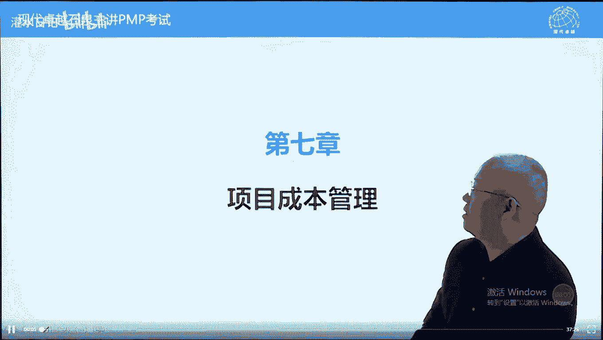
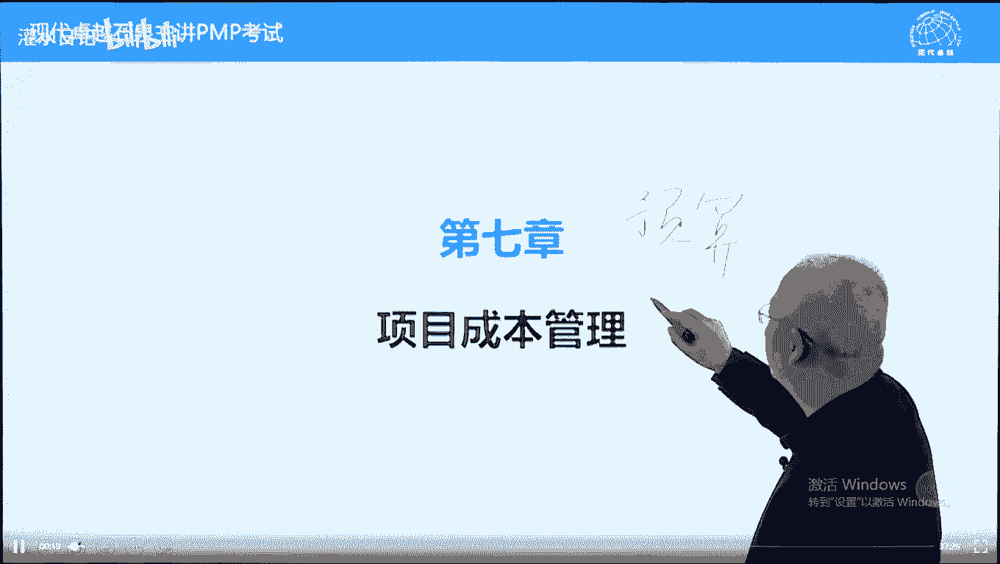

# PMP考试精讲 - P13：13 - 灌水日记 - BV1VN411w7cC

我们呢现在讲第七章叫成本管理啊。

跟第六章一样。

成本管理呢也解决两个问题，哪两个问题呢，制定预算也叫制定成本基准吧。

和控制成本的过程。

控制成本，制定成本基准和控制成本，下面呢我们先看一下呃，前言书上讲的内容啊，确保在预算内完工，这个不安全，它包括另外一件事情，叫制定预算和确保在批准的预算下完成工作。

另外呢成本估算跟成本预算之间联系紧密，可以视为一个过程，7。27。3的关系，先说一下，7。2呢是估算成本，估算成本跟制定预算，它的关系呢不是我们想象的说，估算成本粗略一些，制定预算精确一些。

不是这个意思啊，成本估算强调自下而上，通过对，工作包和活动的成本进行估算，然后呢汇总得到预算的过程，它本身就是一个过程，自下而上制定预算的过程，但是呢为了强调项目经理制定的预算，是自下而上来的。

所以呢他把这个过程一分为二，让你呢先估算成本，估算每一个活动，每个活动和工作包的成本，然后呢估算完之后把估算结果进行汇总，得到一个预算的过程，为什么要这样做，因为呢在项目章程中有一个总体预算。

就是总体批给项目的资金，这个呢是自上而下p的领导拍脑袋，自上而下p的领导判断能拍出来的，他有可能不够用，有可能是计划失败，钱不够的项目，你必须要自下而上，根据范围算一下需要多少钱。

然后呢再对比一下领导在章程里面给的钱，对还够还是不够，不够的话，伸手要或削减范围，想办法解决，够的话呢就不说了，一般来说都是不够的，因此的话呢，因此成本管理应该是在范围确定之后，范围基准批准之后。

我们再去估算成本和制定预算好，另外概念要考虑全生命周期成本，什么叫全生命周期，我们叫产品，产品的全生命周期，什么意思呢，项目做完之后要进入产品生命周期，产品生命周期呢，结果我们买车是个项目车。

买回来之后开始用车，你开始上班下班，这叫运营了，包括呢出现故障之后，你去维修，这些呢都是产品生命周期的一个成本，我们在买车的时候，买车花的钱，可能会影响将来用车或修车的一个成本。

所以呢要考虑全生命周期成本，不是项目全生命周期，而是产品全生命周期，不要为了节省项目成本，而增加了产品的生命周期成本，买车的时候呢，考虑到耗油量，考虑到维修成本。

这样的话呢再去决定项目的成本会更好一些啊，包括什么呢，维护运营和支持成本也包括什么呢，使用运营维护啊，包括叫呃叫消亡的一个成本，就是比如说车要去报废，报废的话呢要可能要花钱的，包括呢盖一个冷凝塔。

要拆除的时候可能也需要花钱，这些呢都要考虑到考虑进去，另外一个呢敏捷环境下应该考虑的因素两条，第一条敏捷它是一个变化的环境，范围变来变去，当范围变来变去的时候，预算意义不大，你范围不确定。

预算无法确定的，所以呢我们说正常情况下范围批准之后，再开始制定预算好，另外一条原则，如果敏捷环境下的成本也是固定的，不能改变的，就只能够通过调整范围来去适应成本，这叫什么呢，看菜下饭量体裁艺。

那这个意思呢也告诉我们，当钱不够的时候，我们呢一般来说是削减范围，通过削减范围来解决钱不够的问题啊，怎么样通过削减范围解决钱不够的问题呢，啊也举个例子啊，我们在这两种有个原理叫帕雷托原理。

也叫20 80法则，什么意思，80%的财富掌握在20%的手里面，可以以此类推的，80%的时间干了20%的工作，80%的工作，在20%之间干完的都对的那一个产品，也可以这样说。

80%的组成部分只起到20%左右，而20%的组成部分，起到了80%的作用，有一些是辅助的范围，不重要的，就是80%的范围起到20%作用的，这种情况下呢，我们可以削减范围，削减次要范围来解决钱不够的问题。

比如说你买一个汽车，你有30万，如果买帕萨特的话，能买顶配，帕萨特，现在可能20几万也能买顶配的了，如果你只有十几万，18万，能不能把买帕萨特呢也可以买，我们可以消除一些次要的范围，比如说真皮座椅。

天窗，自动挡和t都可以把它删除掉，这样的话呢18万也能买一个帕萨特汽车，这叫什么呢，钱不够的时候削减次要范围，因为根据20 80法则，有80/800的范围呢不起核心作用，只起到百分之二十二十的作用。

可以削减的好，另外一个概念叫成本陷阱，什么意思呢，就是在在计量成本的时候，或者说呢在管理成本的时候，项目经理要亲自的记账，这样的话呢保证你的成本花费是真实的，自己记账。

而且的话呢是在订单发出之后就要记账，或任务委派之后，任务委派之后就要把这个钱扣除掉，如果项命令不亲自记账的话，他看出纳和财务的账会出现一个时间差，这个时期时间差呢会导致成本陷阱。

比如说他看财务的财务记账，根据什么记账呢，财务记账根据发票记账，从订单发出到收到发票，有时间差，没有收到发票，财务呢不计这笔支出的，所以呢看财务的账好像钱总是多一些的，如果你看出纳的账。

它是按照现金流记账的，从订单发出现金支付周期更长，你要看他的这样的话呢，钱挣得更多一些，如果你认为钱还剩很多，花钱大手大脚的话呢，可能导致最后钱不够，这叫成本陷阱，告诉我们项目必须要亲自去上。

而且他在订单发出任务委派之后，就要把这笔钱支付出去好，另外呢如何估算啊，预算管理和监控成本，这个呢是呃叫成本管理计划的一个作用，我们呢马上就要讲了，下面呢我们看第一过程叫规划成本管理，它解决什么呢。

就是这句话，如何估算制定预算，如何管理和监控成本，其中监控成本这一块属于管理成本变更的过程，只不过呢这个过程里面多了一个正直技术，所以呢花的时间要稍微多一些，也是第七章的核心内容啊，第七章的7。

1制定呃，它的作用呢制定成本管理计划，也要规划成本管理，它的过程和内容，跟5。16。1基本上没有区别，只不过呢前面两个是范围和进度，而这个呢是成本而已，输入工具几乎是一样的，我们呢重点看一下输出。

输出内容呢成本管理计划内容要多一些，我们需要讲的稍微详细一下，它包括什么呢，计量单位好，考试的时候一般来说有一个基本的计量单位，美元，如果不用美元，他会说用其他货币会存在一个什么呢。

通货膨胀影响或者说汇率的影响，这个呢是一般来说是用钱用美元的，当然如果不用钱也可以用别的，用人天用土石方啊，用重量也可以的，比如说2000担戴夫2000弹，2000袋，这是汉朝的时候官员的级别。

用俸禄来表示也是可以的，用人天人中软件行业用的比较多一些，土石方呢工程行业用的比较多一些，当我们不用钱用其他单位来计量的时候呢，有个好处，能抵消能减少通货膨胀影响啊，前几年呢还有一种今天单位叫什么呢。

青岛大虾也是个计量单位啊，你一个月能能能挣多少只青岛大虾，你这边的房价一平米多少只青岛大虾，它能抵消通货膨胀影响，开个玩笑啊，好另外呢精确跟准确要注意一下，精确指的是刻度。

比如说最低单位是1cm还是1mm，那这个呢精确程度就不一样了，就是单位我们用的刻度单位，你像这个地图上，而是市内地图，可能1cm代表啊5百米，那这个这个呢呃叫比例尺比较大一些，那到世界地图上呢。

呃1cm代表500km，那这个呢精确度呢就稍微小一些了，就是这个叫它就是叫叫什么来着，就是比例尺呢太小了，太小之后呢，精确度的话那就不是特别的清楚啊，当然我们用刻度的话，那就不一样了，毫米厘米。

那单位越小，精确度是越高的，准确度，指的是实际测量值和真实值之间的一个偏差，比我身高一米七四，到底1米74多一点还是少一点，多一点多多少，那这个呢有一个准确度的问题，这个呢知道就可以了。

好我们再看组织程序链接跟控制账户一回事，我们再讲第五章，第六章都讲过，指的是什么呢，就是w v s中间这一层分配预算，这一层呢也计量呃，就是计算正值的这一层，也是公司财务系统。

对我们项目成本的一个控制级别，控制账户呢由项目设置在哪一层，哪一层控制临界值，我们将在第六章也讲过了，指的是现实跟计划总不可能完全一致，有偏差，在一定范围内忽略，不用管的，超出一定范围。

我们认为事物的本质状态发生改变了，我们需要采取措施，这个呢就是我们采取措施的上限，下限由项目根据经验，根据行业数据库来去设置好，到第九，第八章，我们讲控制图的时候呢，会专门说一下。

我们前面举个一个例子啊，百只股票十块钱止盈线，止损线正-5毛钱，这是呢11 十块零五毛，这个呢是九块五，好股价在这个范围波动的时候，不用管它，不采取措施啊，低于九块五了，超过十块五了。

要考虑采取措施或者卖出或者补仓都可以的，好绩效测量规则，这里面要讲一下，我们在定制章提到了没有展开啊，我们在这儿展开一下e a c e t c计算方法，e a c e t c叫完工。

完工时估算和完工尚需估算，这是预测的，预测整个项目完工大概需要多少钱呢，好这三个难是不同类型的活动，活动类型，不同类型活动它的正值计算方法，加权领证没法是均匀的，按时间计算的。

固定公式法是跟主体活动配套，主体活动完成多少，这个配套活动呢相应完成多少，完成百分比法是针对实体活动，那什么叫实体活动，什么叫配套活动，什么叫人工投入，这是对人工投入的一个人工投入量。

也叫行政投入的一个计算方法，我们呢有一道例子讲完之后呢，就明白了，不难的报告格式，我们成本这块情况需要向客户向领导汇报的，应该怎么汇报，另外一个呢细节问题就是根成本相关的风险，包括汇率。

包括这个叫通货膨胀，当然周期很长，有通货膨胀的问题啊，这些都要考虑好，下面呢我们看7。2，估算成本，刚才讲过了，估算成本跟制定预算本来是一件事，只不过呢被p m i强行的一分为二，目的呢。

确保项目理制定的预算呢是自下而上制定的，所以呢估算成本针对活动，针对工作包的成本进行估算比较准确，因为细化是量化的前提，有细化之后量化准确啊，然后呢估算完结果，然后呢制定预算。

这个呢有个概念叫渐进明细好在项目管理中，所有的量化工作都存在一个渐进明细的过程，因此的话呢要重新进行，随着时间推进，量化越来越准确，在早期的时候得到的估算结果叫粗略量级，估算，它的偏差范围。

-25%到正75%之间，偏差范围比较大，这叫粗略量级估算，它不是估算方法，它是一种估算结果，它跟一种估算方法对应的叫什么呢，叫类比估算，类比估算也是在早期详细信息不足的时候，得到一种比较粗略的估算啊。

不叫类类似啊，类比估算好，这个呢是粗略量级估算，这种估算结果对应的类比估算这种方法，而随着随着时间推进，估算结果呢可以越来越准确，后面一种呢叫确定性估算，确定性估算呢它的范围呢可以不用记啊。

-5%到正10%，知道也行，不知道也行，因为这个数据呢老是在变确定性，估算哪个呃，知道名称就可以了，考试呢只考过这个确定性，没有考过啊，范围的话呢也是变来变去的，知道更好一些，不知道问题也不是很大。

好我们看一下过程的输入工具和输出，由于呢估算对象是活动或工作包，所以呢有范围基准有什么呢，应该有活动清单，但是呢没有活动清单，用什么替代的呢，用进度计划来替代的，看一看京东计划来替代。

正常输入中应该有一个活动清单才对的啊，为什么没有解释不了啊，因为呢我们估算，制定呃估算成本，它强调的是活动啊，当然它也有人说我们估算活动这一块的话呢，主要根据这个资源资源需求。

资源日历也可以拿着这个呢也能替代吧，就是活动决定资源，资源的话呢决定成本这样理解也可以，但是呢写上去应该不多的世界环境因素呃，这里面有个汇率，通货膨胀率，这世界环境因素啊，也叫不确定因素。

也叫假释条件吧，可以叫风险，其他的就不多说了，我们看一下工具，这个功率呢跟前面的叫6。4，里面的功率呢几乎一样啊，都有类比估算参数估算包括三点，估算前五个好再重复一下，回顾一下专家班的特点是有经验。

没有具体依据，有经验靠直觉进行估算的类比，估算是在早期根据相似性同类变量之间推导，他有些关键词要记住的，我们在秘籍里面，密集里面写的也有哪些关键词呢，早期详细信息不足相似的，另一个粗略的之类的参数。

估算呢是不同变量推导它呢有关键词，哪些关键词呢，有数据库，有模型，有统计分析，它利用统计关系的，还有一个呢乘法除法也都是参数估算，朝霞不出门，晚霞行千里也是参数，估算不同变量云彩颜色跟下雨之间两个变量。

自家上估算它的什么时候使用，书上说没有合理可信度，估算的时候什么意思呢，整体估算不了，没法下手的时候，另外呢自下而上估算还有一个前提，就是可以分解，没有w vs我们不好用，自下而上估算不能分解。

不好用直线上估算啊，三点估算在估算成本的时候有两个公式，三角分布直接平均贝塔分布的话呢，是用加权平均，把最悲观乘以四之后，底底下的分母是6÷6，大好，三点估算的前提是存在风险和不确定性的时候。

使用三点估算呢能提高估算的准确性，好数据分析，这里面呢又提到一个储备分析，储备分析呢我们这样理解啊，两个方面，第一方面为已知的未知风险预留应急储备，7。2，主要是这个已知未知预留应急储备。

因为它是可以识别的，交应急储备，而未知未知风险我们叫莫须有的风险，也可以叫行业风险，预留的预留的储备呢叫管理储备，其实呢管理储备主要不在7。2中预留，在7。3中预留7。2，主要讲项目的真实成本，7。

3要制定一个什么呢，预算，书上讲预算怎么来的，b a c加管理储备，而自下而上制定bc管理储备，那什么意思，b a c是我们项目的内部成本，我们自己内部的预算，也是批准项目里用于执行项目的所有成本。

全部成本，而管理储备项目你不能使用，但是呢我们要算不能用，为什么还要算呢，因为是对外报价的一部分，我们对外报价怎么报的，b a c加管理储备，因此呢从财务角度来说，管理储备就是公司利润。

就是公司利润项目不能使用，除非特殊情况出现特殊情况使用的管理储备，这个项目不赚钱了或赚钱赚少了，正常情况管理储备都不应该使用的项目呢，都应该有正常利润，除非出现意外情况，未知未知风险。

而管理储备跟什么有关系，跟行业有关系，它也叫莫须有的风险，就是根本不知道将来可能会有的风险，只跟行业有关系，也可以叫行业风险，因此的话呢不同的行业风险不同，它的利润也不一样。

比如开超市利润呢就比较低一些，你挖矿的话呢，那利润就高多了，但是风险也大很多，那利润呢要高得多了，所以呢管理储备很好的解释了利润怎么来的，利润呢，从风险中来的，比如说同样一个呃石油管道项目。

你在伊拉克做跟在泰国做利润一样不一样呢，那肯定不一样，伊拉克的利润要高得多，为什么呢，风险更大一些，风险来自于利润，来自于风险，富贵险中求，所以呢管理储备理解为公司利润，它跟行业有关系，正常不应该使用。

一旦使用利润会减少，注意这个概念啊，好下面呢我们再看另外一个工具叫项目管理，信息系统作用是什么呢，利用计算计算机来帮我们去估算，能提高估算效率的决策，就是拍板技术，到底这个活动花多少钱。

要让团队人员参与两个好处，第一个好处能提高准确性，另外考出呢能提高责任感，亚里士多德在2500年前就说过，如果一件事情是出于自愿，大家回答，你这个人会对他负责任的，如果是被迫的，他不会负责任的。

所以呢尽量的让团队员参与，能提高他们的承诺和责任感，下面呢我们看一下过程的输出，输出呢就是成本估算，这个成本估算估算每个工作包和活动的成本，它本身包括了应急储备，应急储备呢属于bc部分。

也属于估算的一部分，应急储备怎么来的，我们这样先说一下，风险里面我们会讲针对已经识别的风险，我们怎么样预留引起储备呢，按照e mv来预留隐形储备，11章会讲的e mv叫预期货币价值，比如说举个例子啊。

保险公司全这样的，你这个车可能出现划痕，1年中车出现华人概率10%，10%的100辆，100辆，同样型号汽车，十辆汽车中可能会出现划痕，那对你一辆汽车而言呢，出现这1年之内出现划痕概率10%。

10年肯定要出现一次，大概这样的意思吧，好一旦出现划痕，你需要花2000块钱来去修补，来去重新做漆，那这个呢是已知未知风险，为这个风险预留多少钱呢，2000块钱乘以11%吨200。

这个风险就完全被覆盖了，这叫什么呢，这叫应急储备，它呢是用概率成影响来预留的这个风险，我们识别之后，知道它对预期货币价值，只要留这个钱，留，把这个钱留下来就够了，那就是说一旦出现划痕就要花2000。

你留200够吗，不是一个风险，所有风险都这样，预留的时候，钱肯定够的，风险的风险的使用，风险储备金的储备金的使用，就应急储备的使用的话呢，它是拆东墙补西墙，共享的，好不多说了，估算依据相当于活动属性。

对于活动清单的描述，w bs词典，对于w bs描述怎么估算的，考虑哪些内容了，准确不准确，文件更新就不多说了，都可以，有的好，这个呢是7。2估算成本，强调的呢强调的是对单个活动或工作包成本估，算。

为制定预算打基础的，下面呢我们看7。3制定预算，好制定预算呢啊刚才也讲过了，汇总所有的成本，建立成本基准，什么叫成本基准，就是b a c，这个bc呢是内部的成本批准，用于项目的全部成本。

我们呢这是内部批批准项目，这个钱呢项目可以使用，为什么呢，已经批准了，对外报价是bc加管理储备，我写个管主，这是对外报价，这两个加在一起可以交预算，但是这本书中预算并不都是这个意思。

绝大部分情况下预算这两个字不是这个意思，是什么意思，在这本书中，预算大多数的时候就等于b a c我们这样说啊，大家可以记一下预算两个层次，第一个层次预算我们这样写啊，先写预算，预算有两层含义。

第一层含义预算等于就是等于等于bc，第二层含义等于bc加管理储备，大多数情况下，我们呢看到的预算是第一个意思，不是第二个意思，尤其在我们计算正值的时候，它更是这个意思啊，什么时候我们理解为这个意思呢。

当题目中专门问你预算怎么构成的时候，预算由什么构成的时候，我们呢按照第二个意思，大家可以看一下书，我们看一个例子啊，大家翻译一下书呃，在248页，248页的第二段，第一行叫预算。

包括批准用于执行项目的全部资金，问你一下，这句话的预算是第一层次意思还是第二层次，意思就是它包括不包括管理储备，答案是不包括，为什么呢，批准用于项目的资金，管理储备没有批准用于项目，它是公司利润。

如果使用管理储备要额外申请才可以的，这是公司利润啊，所以呢这本书中我们看到的预算这两个字，大多数是第一层含义，尤其是在我们讲正值计算正值的时候，更是这样一个意思啊，好b a c叫管理准备。

一个词叫总资金需求，也叫对外报价，对外报价，我们竞标报价的时候怎么报内部成本加上利润，对外报价好，这个呢是预算的过程，它可以跟7。21步到位，但是呢pm为为了强调预算必须自下而上制定好。

把这个过程呢一分为二了，有个7。2，7。3，下面呢我们看一下过程输入，主要输入呢叫活动成本估算，7。2的输出，我们把它汇总在一起得到预算了，其他内容呢大概看一下就可以了，不是很核心的。

下面呢我们看一下工具，工具里面有一个重点内容，什么内容呢，就是数据分析了，先把前面讲一下，专家判断不说了，靠直觉判断的好，成本汇总就是把前面7。2估算结果，7。2输出汇总在一起。

自下而上汇总得到一个比较准确的预算的过程，另外一个呢我们要建立管理储备，来应对未知未知风险，大家翻译一下书，我们呢看一下书上的描述，然后呢问一个问题，在252页数据分析，250页，最后一段数据分析呢。

我们看一下第一行最后一个字，开始，管理储备，是为了管理控制的目的而特别预留的项目预算，用来应对项目范围中不可预见的工作，就划到这儿，项目范围中不可预的工作，我们呢可以把它叫做未知未知风险啊，问一问题。

除了可以把范围中不可预见的工作，当成未知未知风险之外，还可以理解为什么你熟悉的你能知道的，还能理解为什么呢，两个字变更好，我们这样说，范围变更都属于未知未知风险，范围变更用什么钱，用管理储备。

要用管理储备啊，它属于未知未知风险，怎么理解，所有变更事先都不知道，当你发现的时候不变不行了，所以呢都叫未知未知风险，我们可以推而广之，那所有的变更不光是范围变更，所有变更都可以理解为未知未知风险。

当需要变的时候已经是事实事实了，不可能提前发现的，提前发现就不死，在变更了，这个呢是管理储备好，这段呢还有一句话要注意一下，就倒数第二行，当动用管理储备资助不可预见工作时。

就需要把动用的管理储备纳入b a c，从而导致b a c增加管理储备跟bc并列关系，井水不犯河水的，但是一旦动用管理储备的时候，必须要加到b c里面去，导致bc增加，这个呢叫成本基准发生改变了。

要走变更流程，为什么是这句话，我们讲完正直再解释这句话的意思啊，好下面呢我们再看历史信息评估这句话，这段呢主要讲的是类比估算跟参数估算，什么情况下更加可靠一些，类比估算一般来说不可靠，比较粗略。

可靠性准确性不高，但是呢如果两个对比对象本质相似，而且呢估算的人很专业，可以很准确的参数估算的话呢，就是数据库是否足够庞大，模型是否可以缩放，什么叫模型可以是否缩放呢。

指的是这种参数估算的使用范围有多大，举个例子，在中国中原地区有这样的说法，叫朝霞不出门，晚霞行千里，这叫参数估算，为什么呢，下雨跟云彩之间的关系啊，好这个模型到了海南岛可能不适用了，到了英国。

到了美国也不适用，为什么呢，它的模型缩放程度比较小，它只适合于中原地区，属于中原这块啊，北温带什么气候啊，中国的话呢呃东边是海，海水的话会带来湿气的，其他地方呢不是这样一个情况好。

另外一个参数估算叫处女座的人都很认真，那这个呢放之四海而皆准，无论什么国家，无论什么人种都是说得过去的，甚至呢我们可有兴趣的话呢，可以可以试一试，大猩猩类跟人类差不多的灵长类动物，如果是处女座的。

是不是也是这种情况，它的可缩放程度呢就大多了，它的准确性也大多了，这个呢是参数估算类比估算什么时候可耗，知道就可以了，另外一个叫资金限制平衡跟资源平衡类似，什么意思呢，我们希望资源的使用。

资源的使用曲线不要忽高忽低，应该怎么样呢，平滑一些，光滑一些，怎么样做到通过设置强制日期，什么意思，在某一个强制日期之前不能超过多少钱，也不能低于多少钱，尽量的让呃这个资金的使用呢也平滑一些，举个例子。

我大学刚毕业的时候，工资还不错，因为当时找了个外企，当时的话呢一个月4000多块钱，其实生活费用不了多少，我当时给自己定了个目标，每个月只有800块钱，90年代中期的时候呢，800块钱过的日子就不错了。

剩下的钱留下来买房子，那800块钱怎么样够一个月使用呢，我这样设定的每个礼拜不超过200块钱，通过设置里程碑来去保证资金的使用呢，是平滑的，每个礼拜不超过200块钱，无论干什么，这个这个礼拜超了。

下个礼拜呢要稍微省一点，这个呢是通过强制日期来确，确保资金的一个使用呢是平滑的，也叫资金限制，平衡跟资源平衡差不多，融资这个内容呢就不多说了，像bot之类的这种呢就是如何获得资金。

有些时候呢项目方还需要亲自获得资金，才有这样一个项目机会，没有资金，这个项目呢你们有机会的啊，书上讲了很多内容，大概看一下，跟政府投资是有关系的，跟政府政府项目有关系，政府的话呢没有钱。

希望你垫垫一下钱，你想办法呢把钱融过来就可以了，好过程，输出成本基准，看一下定义，经批准的按时间段分配的预算，什么价是精彩，分别的意思就是出资不是均匀的，是按照阶段出资的，比如说甲方给我们付款。

可以分三笔，可以分五笔，按照阶段来付款，我们给供应商付款也是按照时间来的，这个呢呃很容易理解啊，另外一个呢我们显示成本用s曲线，什么叫s曲线画一下，比如说pv也叫bac，一般来说的话是这样一个情况啊。

不是这样一个情况，这个不叫s曲线了，s曲线的话那就是两头比较平缓啊，这样一个叫s曲线，这个呢反映了项目生命周期的特点，什么特点呢，慢快慢，早期比较慢，后期呢也比较慢，所以呢两头花钱要稍微少一些。

平缓一些，中间比较快，花钱比较多，这叫s曲线，pv ac都可以画出s曲线呢，这个呢是叫s曲线，知道就可以了，两头平缓一些，中间比较陡一些好，另外一个呢动用管理储备要加到b a c，先记住结论。

我们讲完正直呢，再跟大家说一下什么原理，资金的使用阶梯状投入，按阶段投入的总资金需求，对外报价等于b a c加管理收费文件更新，不多说了好，下面呢我们进入7。4，控制成本，控制成本呢我们可以先说一下。

跟5。66。6过程的作用一模一样，干什么管理成本变更，但是呢5。6变更比较多，范围的所有变动都叫基准变更，需要走变更流程，6。6变更比较少，当完工日期改变的时候，我们叫进度基准改变需要必须走变更流程。

变更比较少，只有当bac改变的时候，需要走变更流程，c c b批准，什么情况下bb c改变，考试中出现的就是使用管理储备，未知未知风险发生，使用管理储备，这个时候呢要把使用的管理储备纳入b a c。

要走变更流程，除此之外的话呢，成本变更比较少，6。6呢我们讲的很少，但是呢7。4讲的要多一些，为什么呢，这里面涉及到一个工具，叫正值技术，政治技术是什么意思呢，这是管理变更的资金支出。

与完成相应工作对比起来什么意思呢，1v跟ac对比来判断成本使用情况好不好，什么叫e v，什么叫ac，我们呢等会讲一下，先看一下过程的输入，项目管理计划，主要是成本管理计划，指导我们如何控制成本。

包括成本变更，其他几个呢自己看一下就可以了，数据分析，这是重点，政治分析，趋势分析，准备分析，政治分析技术，我们呢要详细讲一下趋势分析，讲过的预测，储备分析，我们在第六章也有在任何时间分析剩余。

剩余储备跟生育风险是否对应，包括呢我们随着项目进展可以使用，可以减少，可以取消项目的应急储备，管理储备的话，那另当别论了，好下面呢我们看一下政治技术，政治技术呢先说一下原理，它呢起源于美国。

据说美国在1967年的时候，联邦政府就已经立法，所有政府改所有政府采购给供应商付钱，按照供应商的正值来付钱，按照供应商以完成的货币价值来付钱，这样的话呢比较准确一些，包括呢对供应商的一个绩效考核。

用正直来去考核比较更好一些，在政治技术出现之前，我们呢判断一个项目在执行中的项目做得好坏，无外乎按照工期，按照成本方成本花费，但是呢当你不知道实际完成工作有多少的时候。

你这个工期和成本发货花花费呢没有意义，我们经常讲工期过半，工期过半代表不代表工作已经完成一半了呢，不代表的我们经常说投资过半，也不代表实际完成工作有多少有有多少，所以呢那种判断的话呢可能会失真。

或者说呢不太容易不太容易控制，出现政治技术之后，我们可以科学地进行预测，并且呢衡量项目的绩效好坏了，这个原理是什么呢，范围进度成本标准本来不一样，不能够横向对比的，但是呢政治技术很巧妙。

它呢通过给每一项工作分配一个预算，让每项工作呢有了一个叫货币价值，有了货币价值之后，我们就可以把范围进度成本，把它们放在一起进行横向比较了，这样的话呢进度成本成本的值呢都很客观了，那到底是什么原理呢。

