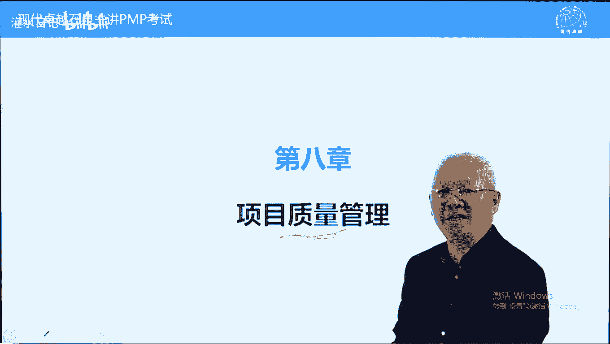
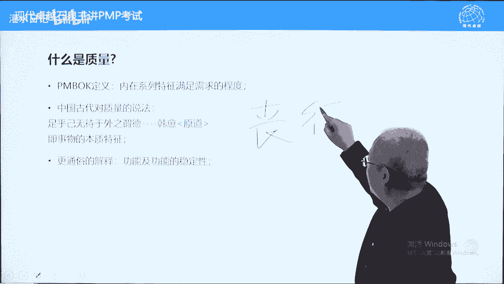
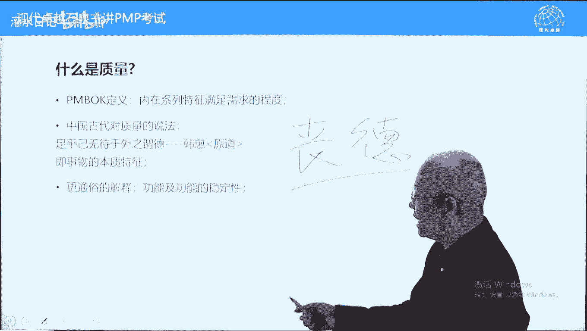

# PMP考试精讲 - P15：15 - 灌水日记 - BV1VN411w7cC

现在呢我们讲第八章质量管理。

简单说一下呃，pmbok的567。

其实从第四章4567开始，都应该是项目管理所特有的一些特色。

或者说像4567里面。

都有一些项目管理所特有的一些内容，或者说呃讲知识。

而第八章开始就是拿来主义了。

什么叫拿来主义，就是别的学科在这些方面已经很健全了。

成立比较早，项目管理的话呢，直接借用，没有另起炉灶。

像质量管理，包括后面的人力资源管理呃，沟通管理，风险管理，采购管理都是如此，但是呢，第13章，又是项目管理所特有的一个章节内容了，质量这个内容呢在考试中考量比较大。

而且的话呢质量本身这个概念也比较抽象一些，我们呢先要搞清楚质量它是干什么的。

并且呢质量的三个过程有什么区别，现在呢我们看一下偏不可中关于质量的定义，它这样定义的，他说内在特征满足需求的程度叫质量。

这个概念的话呢更加抽象一些了，呃他不说的话呢，我们对质量还有一些概念，比如说稳定性，功能可靠性之类的，我们那管这些叫质量，这样一定义的话呢，我们干脆不知道质量到底是什么了。

我们看一下中国古代对质量的说法。

质量这个词呢呃是从日本传来的，明治维新之后。

中国呢洋务运动之后开始呢，西引入了西方的一些词汇，叫中学为体。

西学为用，质量呢从日本引进过来的这个词的话呢，是呃引进过来的，但是呢这个意思中国本来是有的。

中国人以前管质量不叫质量，叫什么呢，叫德老子道德经两个字，一个是道。

一个是德，这个德的话呢就是质量的一个概念。

要简单说道呢指的是万事万物，它有统一规律，普遍规律，而德的话呢指的是万事万物，它各自有各自的特征，我们呢要进行一个区分，道是统一的，德呢是区分的。

那质量本身也是一种区分，好韩语呢在原道中有这样的说法，他说足乎己，无待于外之谓德，什么意思呢，跟这个概念呢差不多，但是呢比这个概念要稍微容易理解一些。

自身所具备的，跟外界没有关系的这样一些特征呢，我们叫做德就可以理解为事物的本质特征，任何一个事物它都有本质特征，比如说苹果之所以叫苹果，它具备苹果的特征，那橘子的话呢具备橘子的特征，具备这个特征。

我们能叫它这个东西，不具备的话呢不叫这个东西，比如说中国北方有个说法叫缺德。

南方呢叫丧德，缺德丧德都指的是一个人缺少了人的特征。

这个时候呢叫丧德，也叫缺德。

这个人呢就不是一个人了，没有人性了，人性的话呢是一个人的一个本质特征，好具备这个本质特征，我们能叫这个事物，不具备这个特征呢，不叫这个事物得的话呢就是本质特征好。

这个跟跟项目管理有什么关系。

在范围中有可交付成果，可交付成果是否正确，我们要根据它是否具备了这种物质，所应该具有的特征，我们来判断这个可交付成果正确与否，所以呢质量离不开可交付成果，质量呢属于范围的一部分，就像皮跟毛的一个关系。

要确定可交付成果是合格的，要根据质量来去检查，所以的话呢我们可以这样说。

通俗一点说就是功能和功能的稳定性，我们确定这个可加粉成果是否正确。

根据质量来确定的，有一些比较容易确定，有一些的话呢可能它的特征比较细微一些，需要一些高科技手段来去测量，我们呢举一个例子，简单例子啊，桌在中国的传统家具中。

桌和案是两码事。

怎么区别，看它各自特征，具备桌的特征叫桌具备案的特征。

教案答案，这是简单一些的，什么叫桌八仙桌是桌。

我们画截面图啊，什么意思，桌面没有超过左腿，这叫桌，什么叫暗，桌面超过桌腿了。

哪怕超过五公分，也叫按按时出头的桌是不出头的，所以呢要区分桌和暗，要看特征，这个特征就叫质量，也可以这样说，桌有桌的质量，暗有暗的质量，事物的特征，我们叫质量，再看一下内在特征，满足需求的程度。

逐户给无待于外事物的本质特征，功能以及功能的稳定性，它跟范围不可分割的，它属于可交付成果的特征，或者说它跟可交付成果是一体的，可交付成果是否正确，根据质量特征来去判断好。

下面呢我们看一下质量管理的三个过程，质量的难点就在于，三个过程到底怎么区别质量呢，这三个过程分别是规划，质量管理管理质量也叫我们待会可以写一下，也叫q a啥意思呢，也叫质量保证。

书上说质量保证跟管理质量不太一样，但是呢我们在学习过程中，包括在考试过程中，这两个词呢可以当成一回事，也叫质量保证啊，控制质量这三个过程，我们先区别一下质量的三个过程，分别是干什么的，我们来举一个例子。

身体健康也是一种质量，我们用身体健健康呢来比喻一下，来说明一下呢，更容易一些规划质量，它围绕两个核心的目标，一个叫标准，一个叫指标，好注意标准跟指标稍有不同，标准是宏观的，指标是微观的，比如说身体健康。

有些人达到非常健康，达到运动员级别的这种健康，这个呢属于标准，那这个标准的实现有具体指标来支持的，比如心肺功能的一个情况，这些呢叫具体指标，包括质量啊，包括工程建筑质量也是有有什么呢。

有普通标准叫合格标准，也有什么呢，优质标准，那这个标准的话呢是宏观的，我们叫宏观的叫标准，包括国优部优省省优都可以叫标准，标准呢跟我们后面讲的等级有一定的联系，或者说呢可能比较接近，但不是一个概念啊。

指标比较具体一些高度尺寸，包括频率之类的，比较微观的，比如身体的心肝肺的功能之类的，这个呢叫具体的指标规划质量管理，它是一个纸上谈兵的过程，它围绕这个标准指标来去开展，它呢包括识别质量指标以及质量标准。

并且确定如何实现质量指标和质量标准，我们拿身体锻炼来说好，我们希望呢40岁的人身体健康一些，那我们要规划一下，比如说我希望心肺功能都很正常，没有脂肪肝，没有高血糖，高血压，高血脂，高血糖，没有心脏早搏。

或者说心动过速之类的，这些的话呢属于具体的质量指标了，达到一个健康或者说非常健康的标准，这个呢叫识别指标，确定标准好，这些标准我们识别完，确定完之后怎么样实现，是不是呢每天把这个目标抄一下。

祷告一下就能实现的，实现不了，我们需要有一个时间路径，我们呢继续要规划如何实现标准和指标，怎么样实现呢，我们给自己规定要健康的作息，生活早睡早起，不熬夜，另外呢健康的饮食习惯，不吸烟，不喝酒。

不吃麦当劳，肯德基，必胜客，油腻食品，不吃油炸食品，不吃腌腊食品，另外一个呢要锻炼，每天走路1万步以上或跑步呃，30分钟达到3km或4km以上，达到出汗的标准，这些的话呢叫如何实现质量指标。

它还是一个纸上谈兵的过程，所以呢规划质量管理他呢比较务虚一些，他只上谈兵呃，识别质量指标和质量标准，质量指标是微观的，质量标准是整体宏观的，另外一个呢确定如何实现质量指标和质量标准，我们规划一个路径。

路径呢告诉我们如何实现我们跳过管理质量，我们呢先说控制质量，控制质量，针对可交付成果两个字检查，检查可交付成果是否合格，从本质上来说，8。3控制质量过程，更接近一个执行过程组的过程。

但是呢被放在了监控过程组，它更像一个执执行过程组，执行什么呢，执行检查工作，它不光包括检查，还包括什么呢，修复可交付成果的缺陷，检查过程中如果发现可交付生物有缺陷，除了检查还要修复一下。

这叫控制质量控制量，叫可交付成果，我们叫检查可交付成果和修复可交付成果缺陷，比如说到医院定期做体检，1年检查一次，体检过程就是一个质量控制过程啊，体检过程呢可能发明发现一些小毛病。

比如说这个做肠镜的时候啊，发现呢有有这个叫息肉，那直接呢把这个息肉呢，可以场景可以给它摘掉的啊，这个过程呢修复过程也叫质量控制，质量控制呢比较单纯一些，比较简单一些，围绕可交付成果检查。

可交付成果和修复可交付成果，缺陷相当于我们的体检，定期的体检好，那我们再回过来讲，8。2叫管理质量，管理质量呢它包括两方面的内容，一方面呢教预防，在质量管理中，所有预防工作都属于管理。

质量也可以叫q a吧，叫质量保证，还有什么呢，叫审计好，简单说一下，预防是事先的，比如说锻炼身体，早睡早起，不吸烟不喝酒，然后呢不吃麦当劳，肯德基，必胜客，健康的生活作息及饮食习惯，这都属于预防。

那审计是什么呢，预防事先的审计是事后的，审计一定是在质量控制之后，我们呢体检报告出来之后，我们面对体检报告来反省，为什么年轻轻的各种身体指标都很差，好像呢感觉活不过50岁一样的，这叫什么呢，这叫反省。

我们看是我们的计划做得不对，还是没有执行好，导致身体状况一塌糊涂，好审计呢是事后的，根据质量控制结果，而且审计对象是什么呢，是除可交付成果之外的过程方针政策，程序工具方法主要呢是过程，预防也是一样的。

针对可交付成果之外的影响可交付成果的因素，比如说人员设备，原材料，工艺流程等等，这些呢可能会影响可笑不成果的这两呃，呃，这俩结果，我们呢围绕这些过程方针政策来进行预防，什么意思，我们前面讲过一句话。

叫功夫在室外，你要想可交付成果质量好，你不能光盯着可交付成果，你应该盯着影响可交付成果的因素，比如说操作人员的水平问题，设备的呃，这个有没有缺陷，稳定不稳定，包括呢原材料合格不合格。

包括工艺流程是否是可靠的，或者说是否是科学严谨的，这些的话呢会影响这两个结果，就像你要想获得高收入，高工资也是工资在10万，你光想着怎么涨工资，这个呢不起作用的，你要考个偏僻，考一个n p p p。

你这样的话呢工资会提高的，为什么呢，功夫在室外管理阶段，针对什么呢，针对过程两个事情，一个叫预防，一个呢叫审计预防是事先的，审计呢是在质量控制之后，所以呢8。2这个过程从作用来说，作用上来说。

它更像一个监控过程，为什么呢，它进行一个反省，而且是根据质量控制结果进行反省，但是呢书上把它列为叫执行过程的过程，它本质上更像一个监控过程的过程，我们可以这样说，管理阶段工作围绕过程预防加审计。

他强调上纲上线，他超越可笑复生果，就是不针对可消防成果，针对影响可交付成本的因素上纲上线，来杜绝防止出现问题，包括审计也是杜绝防止以后出现问题，这个呢是管理质量，也叫质量保证。

我们下面呢把管理质量跟控制质量，这两个过程呢再进行一个区别好，我们先说控制质量比较简单。

就事论事，它呢对象就是可交付成果两件事，检查可交付成果以及修复可交付成果的缺陷，而管理质量的话呢，它比较务虚一些，比较抽象一些，它呢包括预防加审计，针对对象是除可交付成果之外的过程方针，政策，程序。

工具方法等等，就是不包括可交付成果，下面呢举两个例子来区分一下，比如家里面都有冰箱，冰箱里面呢一般都是放得很满，蔬菜饮料呃，肉蛋奶，蔬菜饮料水果都有，某一天你打开冰箱门。

发现里面有一罐牛奶或一袋牛奶坏掉了，变质了，味道不对了，你把牛奶拿出来倒掉或做成酸奶，这个过程叫什么呢，叫控制质量，发现可交复制否缺陷，并且修复缺陷好，某一天你打开冰箱门，发现冰箱里面的所有东西都坏了。

没有停电，电没有停电是有的。

冰箱里所有东西都坏掉了，你把东西扔掉之后，开始修冰箱，修冰箱是什么过程，修冰箱属于管理质量，也叫质量保证，很可以划等号，因为呢在iso体系中主要是q v p m呢，为了有自己的特色。

他呢改成了一个管理质量好，待会我们再讲，管理质量跟q a在书上它的一个区别是什么，这个呢刚才说的修复家属于管理质量，它针对的是生产线，针对的是设备，而对于冰箱这样一个东西。

它的可交付成果是冰箱里面的蔬菜饮料，水果肉蛋奶之类的东西啊，好这个呢是两个的区别，质量控制针对可交付成果，管理质量呢针对过程方针，政策程序工具方法，除可交付成果之外的影响可交付成果的因素好。

下面呢再举个例子，我们经常说做人要做质量控制性的人，叫就事论事，不要上纲上线，不要整蛊作乱，麻一起提，就不要做质量保证型或管理质量型的人，那什么叫质量控制型的人，什么叫管理质量，管理质量型的人呢。

我们也举个例子，比如说某一天老婆出差回家，老婆出差时间比较长，一个礼拜回到家里面，一进厨房，看到洗碗池开始发飙，为什么呢，洗碗池里全是碗，并且有些晚，她第一次看到老公买新碗了，宁可买新碗也不刷碗。

老婆开始发飙，开始骂人，不刷碗也不刷，锅，地也不扫衣服也不洗，然后呢床也不叠，家里搞得跟猪一样，不光你俩孩子也跟你学，看孩子的屋子能进人吗，将来孩子怎么怎怎么样，资历怎么样找老婆成家呢。

啊你爹妈从小没有教育过你，你应该勤勤劳吗，应该自己搞好自己的这个这个卫生工作吗，啊你爹妈来上会怎么样怎么样，你哥哥姐姐来上会怎么样，你们家怎么都这样呢，你们这个这个这个这么省。

你们这个哪里哪里人地域黑了，是不是都这样啊，你这个这个哪里哪里哪里哪里，或者你们这个姓的人是不是都这样啊，你怎么长长这么大呢，我怎么这么倒霉，这这个嫁给你了，我这辈子该怎么过啊，上纲上线了，这叫什么呢。

这叫管理质量型，也叫质量保证性，他强调上纲上线好，什么叫质量控制型的老婆呢，很温馨了，默默的把碗刷了，为什么呢，不就没没刷完吗，刷了不就行了吗，发现缺陷，修复缺陷，所以做做人要做这两个控制型的人。

那找老婆的话呢，也要找质量控制型老婆，先跟大家泼瓢冷水啊，没结婚的人先说一下，这个世界上根本不存在质量控制型的，老婆，都是质量保证型的，叫管理质量型的，所以呢好男人都是结过婚的。

结婚结完婚之后有了一个质量管理型的老婆，管理局产生的老婆，人生开始开始开挂，发飙了啊，开始发开始开挂了，不叫发飙了，好这个呢是管理质量跟控制质量的区别，控制量很具体，针对可交付成果检查修复。

管理质量呢强调上纲上线，身体锻炼也是一样的，锻炼身体属于管理质量，检查身体的指标属于控制质量，下面呢我们这三个过程了解完之后，那第八章而言就是一些术语了，我们把术语呢搞清楚啊。

包括三个过程里面主要讲的是工具，这些术语我们先说质量跟等级，书上呢说质量跟等级是不一样的，什么叫质量内在特征，满足需求的程度就是本身的一个特征，什么叫等级用途相同。

但技术参数不同的系列产品质量不能低等级，可以低，低等级不代表低质量，而呃这个高等级也不代表高质量，举个例子，等级的例子，帕萨特好叫顶级配置，也有经济型配置，这叫什么呢，质量都没问题，等级不一样。

包括叫迈腾，这也是大众的车，跟捷达质量都很好，大众的车质量都很好，但是呢等级差别比较大，那这个直达的话呢比较基础的啊，几万块钱就可以了，那这个迈腾的话呢可能需要呃十几万，20万，配置呢比较高端一些。

质量都没问题，大众车质量都很好，但是呢等级有区别，等级指的是用途相同，但技术参数不同的系列产品质量不能低，但是呢等级是可以低的，预防和检查，一个时间一个时候，一个呢戊戌一个务实好预防属于管理质量。

而检查呢属于控制质量，再说一下，严格来说，规划质量管理也属于管理质量的一部分，为什么呢，他也是预防，它也是事先的工作，时上谈兵的工作，本质上也属于q a叫质量保证，也可以叫管理质量预防，针对的是什么呢。

过程方针政策影响可交付成果的检查，只针对可交付成果，属性抽样和变量抽样跟检查对应的，判断结果的情况的判断，可交付这种情况的属性只判断合格不合格，变量抽样呢不光判断合格不合格。

还要判断合格的程度和不合格的程度，它有一个程度问题，比如说考p b考过没考过，这叫属性的属性啊，属性判断而考过了几个a那这叫变量判断，变量抽样理解就可以了，公差跟控制线，公差说一下，也叫允差。

也叫规格线，就是判断一个可交付成果是否合格的一个界限，叫公差，允差由什么呢，合同来确定，或者说由客户来确定，判断可交付成果是否合格的，那什么叫控制界限呢，也叫控制上限下限。

它呢是帮助我们判断过程是否稳定，是否具有可预期绩效的，超出控制上限下限，我们叫过程失控，但是呢未必是产品是次品，超出控制界限只表明过程失控，不表明是次品，为什么呢，一般规格线在控制线外侧在出现。

需要在出现次品之前先发现过程出问题了，这个时候呢防止出现次品，待会儿呢我们讲控制图的时候，我们再详细讲，另外呢现代质量管理及其推崇的原则，项目管理呢在质量方面拿来主义，现代计量管理有一个分水岭。

分水岭呢是三个人的代表人物啊，一个叫代明代名啊，一个叫朱兰，一个叫克劳斯比，这三个人的理论出现，标志着现代质量管理的出现，还有一个克劳斯里好，他们的原则预防剩余检查，另外呢质量可以零缺陷，克劳斯比啊。

这三个人的出现，他们的理论理论理论理论的出现，奠定了现代质量管理的一个叫基础，现在质量管理强调什么呢，强调管理质量就是预防质量保证，而传统质量呢强调控制质量，就是检查现在质量的话呢。

认为质量是可以预防的，而且的话呢可以零缺陷，他们呢在质量方面有一些原则，比如说第一条叫客户满意，客户满意呢有两条具体标准了，一个叫适合使用克劳斯比，提出的适合使用什么意思呢。

达到客户最低限度满意就可以了，过犹不及，防止镀金镀金，知道吧，我们前面讲过镀金和范围蔓延的区别，镀金用唱歌来说，调起高了，超出了质量需求，发育蔓延呢就唱跑调了，这个不说了啊，好适合使用克劳斯比的。

就是达到客户最低限度满意就可以了，另外一个呢叫符合要求，这个呢是朱然提出的，符合什么呢，符合计划就可以了，不要过符合要求啊，这个呢是比较低碳环保的，比较低基础的一个要求，低碳环保的啊，这个叫客户满意。

不要闭门造车，也叫倾听客户的声音，持续改进指的是即使结果还可以，但是呢只要有改进机会，我们呢必须要持续改进，持续改进呢主要针对过程啊，两方法比较多，主要有两个多一些，一个叫什么呢，一个叫p d c循环。

b d c a循环，这个也叫代名循环，p呢叫plan，d呢叫do，然后呢c呢叫check a呢叫action，不断的这样循环，精益求精，持续改进啊，当然了，这个pd c循环还有一个现在的说法啊。

叫什么呢，计划延误取消道歉啊，这个现实中可能更多一些，bt体循环是持续改进的一个基础，另外呢还有一个叫六西格玛，六西格玛属于质量保证的工具了，管理质量的工具，它呢其实就是叫零缺陷西格玛。

零缺陷缺陷率少于低于3。4%，这是六西格玛的一个目标，实现什么呢，零缺陷的一个概念，然缺陷力，缺陷的等于零，可以做到的好，管理层责任说一下，在质量管理中，如果车出现缺陷失误，出现质量问题。

具体操作人员只需要-15%的责任，犯错误的人-15%的责任，另外85%的责任谁来承担呢，由管理层来承担，质量管理认为所有的质量问题，包括质量责任事故之类的，都是领导不重视导致的，如果领导重视。

不会出现质量问题，可以零缺陷的呃，缺陷呢是可以避免的，所以呢任何的问题出现问题之后，质量问题啊，不叫不叫任何问题啊，质量问题出现之后，包括责任问题，安全问题出现之后，犯错误的人只付85%。

只付15%的责任，而管理者需要-85%的责任，有人说，那又不是他自己操作的，别人操作的那些操作农民工的手，或者说临时工的手，他能管住吗，他能天天跟着吗，啊不是的，我们防止质量出现缺陷，有很多制度。

有很多流程可以防止的，凡是出现质量缺陷，质量问题全都是由于什么呢，领导不重视导致的，这里面呢有一个血淋淋的叫例子来说明，为什么管理层要负主要责任，这个例子呢是个故事啊，发生在1944年诺曼底登陆之后。

当时呢美国在欧欧洲战场上有一个第三集团军，司令呢叫巴顿，巴顿呢接到一次接到一个叫报告，他手下一个82空降师，空降师师长写了一份报告，说最近一次伞降行动中，伞没有打开，摔死的人超过了战斗中阵亡的人数。

巴顿一看怒不可当，怒不可遏啊，这些士兵从北非一路打来，都是身经百战的宝贵财富，打仗没打死，跳伞摔跳伞，跳伞摔死了，很可惜啊，军方的话呢就是采购降落伞的人，负有不可推卸的责任，当时的开伞率97%不到啊。

97%多吧，97%左右啊，啊平均100个人跳下来，可能有三把伞打不开，但不至于都摔死啊，如果没有风，就近抱一下之后，两个人一起摔一下，不会摔死的，如果风很大，一跳下伞自由落体了，那这个呢会摔死人的。

当时开采率不高，97%，巴顿呢就写了一封措辞很严厉的信给大本营，要求采购降落伞的部门提高伞的开伞率，达到百分之百，不能用伞打不开啊，把士兵呢摔死，牺牲士兵的生命，大本营呢也很重视。

赶紧召集所有的降落伞厂家来开会，要求呢提高伞的开伞率达到百分之百，否则要承担责任的，另外呢可以把伞的价格提高，但是呢所有的生产厂家都拒绝这个条要求，认为是霸王条款，不可能保证白白打开的，宁可不生产。

也不能答应这个条件，陷入僵局，然后呢，军方有人聪明想了一个折中的办法，不要求把麦打开了，只要求什么呢，每一批伞生产完之后，由军方去抽呀，抽三把伞到五把伞，二把手，你们跳完之后没事儿，这个散钱照付。

一分钱不会少，你的好，从此以后，据说据说啊从此以后所有的伞都能打开了，开伞率达到百分之百或接近百分之百，这叫什么呢，管理层的责任，我们从叫机会成本来说，那领导的命更加值钱一些，他呢会更加重视一些。

因此的话呢凡是出现质量问题，责任问题，包括安全事故啊，都是领导不负责任，不重视导致的，他应该-85%的责任啊，这个呢要记住另外一个原则，跟供应商是双赢的，不是说你死我活，你死我活的。

这里面的一个词叫灵狐，游戏跟供应商不是灵狐，是双赢的，这个字念胡啊，胡牌的胡啊，双赢的游戏怎么理解什么叫灵狐游戏，四个人打麻将，一个人带1000块钱，这四个人呢打了一天一夜，打完之后。

四个人的身上的钱加在一起还是4000，这叫什么呢，灵狐游戏就是我赚的，就是你赔的，跟供应商之间，不是说我们压低价价格，我们就占便宜了，供应商就吃亏了，不是这样一个情况，而应该是什么呢，双赢什么叫双赢。

我们给供应商让一些利它的质量会更好一些，你如果压低供应商的利润，它会牺牲质量，到最后是双输的恶性循环的，所以呢要以质量为主，或者说呢以质量为本，我们呢不是说一味的压低价格，压低价格的话呢。

对方只能够牺牲质量，所以呢呃叫质量决定成本，成本决定价格，你高价未必买到好东西，但是你低价买的东西一般来说很难是好的，为什么呢，因为成本决定的，所以呢跟供应商是双赢的，要考虑供应商的利益，要可持续发展。

这个意思啊，敏捷环境下需要考虑的因素啊，大概有两条，第一条在瀑布式管理中，我们叫正常的项目管理中，质量的责任是分开的，尤其是质量控制，它呢是由专门的质量控制人员，质量控制团队成员来去进行。

或者说公司的质量控制部门来实施质量控制，但是呢在敏捷环境下，质量控制工作人人有份，每个团队成员的职责不是说分给谁的啊，好另外一个概念在呃瀑布式，我们叫传统的项目管理中，这质量审计总结经验教训。

专门的质量审计啊，总结经验经验教学，他叫这个名称，而在敏捷环境下，他的经验教训总结叫什么呢，叫循环回顾，等同于质量审计，循环回顾啊，等同于质量审计一样，意思名称不一样而已，知道这个词啥意思啊。

好这个呢知道就可以了，下面呢我们进入第一过程叫规划质量管理，刚才讲过了8。1，围绕两个词，一个是质量要求，一个是标准，这个呢是具体的具体指标啊，好这个呢质量标准呢是宏观的，比如说达到国优不优啊。

或者说省优之类的宏观标准，整整整个的标准，当然整个标准的话呢它有具体指标来去支持的，并且描述如何实现质量要求和质量标准，我们要给个路径，这个路径呢其实就是q a的路径，也叫管理质量的入境管理。

质量怎么做才能保证结果的实现，所以它本身来说的话，跟q a关系更大一些，可以当成管理质量或q a的一部分，q a指的是质量保证啊，好下面呢我们看一下过程的输入，主要输入呢注意，因为它需要识别质量标准。

质量要求好，主要输入什么呢，是范围说明书，也叫范围基准，范围基准中包含范围说明书，这里面有什么呢，有验收标准，我们刚才讲过了，质量附着于可交付成果之上，跟可交付成果不能区分，它属于范围的一部分。

那一个可交付成果是否合格，要看它的质量指标，所以呢可交付成果本身具有验收标准，我们为什么要识别，因为呢并不是所有范围说明书中的页数标准，我们都要去实现，都要去检查我们的目的，保证可交付成果是合格的。

所以呢我们找一些比较核心的指标，来去实现就可以了，来去实现，来去检查，以确保可交付成果合格就可以了，好再说一下，并不是所有的质量指标都要去检，质量标准的指标，质量指标都要去检查的，而是什么呢。

核心的指标，比如桌子，它具备哪些核心指标就可以了，它本身的指标比较多，我们呢找核心指标来确认一下就可以了，还是举个例子，身体健康的体检，我们体检的话呢可能俩小时搞定。

无论你是1000块钱检查一次还是600多块钱，检查一次，两个小时到两个半小时搞定，检查的指标多吗，啊可能不是很多，但是某些富豪检查身体的时候，他们呢可能需要住院一个礼拜，才能检查完所有指标。

他检查指标比我们指标多得多了，那都是为了确保身体健康，为什么他们的指标要多一些呢，他们的身体消耗可能比我们更多一些，命呢可能更值钱一些，好再换一个例子，比如说一个70岁老头和一个七岁的小孩子，要去体检。

确认一下身体健健康不健康，哪个人检查指标要多一些呢，肯定70岁老头检查指标要多一些，身体消耗比较多一些，目的都是什么呢，确认健康就可以了，所以呢确认可交付成果符合要求，我们需要检查的指标并不是全都检查。

而是挑一些核心指标，因此呢要识别质量指标，质量标准好，主要是范围基准，其他内容的话呢都是一个补充，包括需求文件，需求跟踪矩阵之类的，都是对他的一个补充，这里面呢还有一个词要注意一下，叫什么呢。

叫质量政策，也叫质量原则，以前那是一个考点啊，现在最近12年时间没怎么考过，先说一下质量政策，质量原则指的是公司或组织在质量方面的追求，一般来说是一句话是一个口号啊，是一句话是一句口号啊。

这个质量政策质量原则应该写入质量管理计划，它不是强制的，它呢是一个可以参考的，应该写入质量管理计划，表明我们在质量方面是有追求的，能提高相关方信息，让相关方了解一下，考试中考过这样的题目。

如果公司中没有质量政策，也叫质量原则，没有质量政策，没有质量原则怎么办，然后呢写入质量管理计划就可以了，下面呢我们看一下8。1的工具，专家判断指的是靠直觉，靠经验不说了啊，数据收集技术。

这三个呢也都讲过了，标格内障可能会多一些，比如说我们如何实现质量指标，我们可以比葫芦画瓢，头脑风暴的话呢是集思广益，找创意的，访谈的话呢，找老司机无人道，好小的时候呢呃我们学过一篇课文叫小马过河。

那就是个访谈啊，通过访谈来去识别风险的，我们到第11章再讲了啊，下面呢我们再看数据分析，这里面呢有一个概念跟质量成本相关的，叫成本效益分析，什么意思，讲一下，在质量管理中，现在质量管理中有个说法。

克劳斯比提出的叫什么呢，质量是免费的，这里面呢就跟质量成本分析啊有关系啦，质量是免费的，啥意思，我们在质量中的任何投入都应该获得更高回报，当质量投入跟回报相等的时候，质量达到最优状态，不要再提高质量了。

不要再投入了，再投入叫镀金，得不偿失了，所以呢我们要确保在质量中的投入，我们叫质量成本，它都能获得更高收益，成本效益分析，哪来分析我们在哪些地方投入质量，成本收益更高一些，结论是什么呢。

预防的收益更高一些，什么意思，我们去健身房很贵，但是呢医院更贵，我们宁可把钱花在健身房，不要花到医院，医院的话呢，那医生都比较专业啊，一边一般三个词要你多少钱，你都给很严重，可以治，但很贵。

这样一来的话呢，你恐吓你，你就害怕了，就给钱了，而身体健康的时候，我们可能经常是不见棺材不落泪，我们呢就忽略了叫叫这个锻炼身体，这种健身工健身的这样一些活动，其实呢这种活动花钱少，它的效益更高一些。

成本效益分析，就是分析我们在哪些地方投入质量，成本能收益更高一些，另外一个呢通过成本效益分析还要保证什么呢，保证这个词质量是免费的，要获得更高收益，下面呢大家翻译一下书283页，我们看一下质量成本。

质量成本呢分为两大块，一块呢叫一致性成本，就是确保结果符合要求的成本，另外一类呢叫非移植成本，也叫失败成本，失败成本的话呢指的是质量有问题，我们呢花钱了来去解决问题。

来去造成的成本较非遗制成本也叫失败成本，我们先说一下预防成本啊，这叫一致性成本，它包括预防加评估，也叫检查，预防呢是确保结果一致好，所有的预防一致性成本确保一致，而所有的预防成本呢都属于一致性成本。

确保结果一致的，而评估也叫检查成本，为什么也叫一致性成本呢，解释一下，很多人说检查之后，如果发现可加分成果有不合格的，那这个也叫一致性成本吗，注意检查本身都是一致性成本，修复缺陷才叫非遗成本。

检查发现缺陷也是一致性成本，修复缺陷才叫非日成本，这样来划分的，因此的话呢，检查也是确确认一下结果是符合符合要求的，所以呢它也是一致性，成本好，预防呢有四个小黑点评估，有三个小黑点都要背下来。

考试中呢都考过的啊，下面呢我们再讲非营成本也叫失败成本，什么叫失败成本，质量不合格，花钱了，分为内部失败跟外部失败，它俩的区别在于谁发现的内部失败出厂之前，公司内部的人，比如说团队成员发现的更多。

团队成员发现的外部失败，指的是客户或用户发现的，外部失败它的成本要比内部失败高很多，比如说我们内部检查，发现有一个啤酒瓶子质量不合格，没有达到b这个没有这个b标志啊，我们把它扔掉就可以了。

一批p9 只表多少钱，成本快把钱几毛钱而已，但是呢如果不是内部发现的，而是有人过生日，这个皮买到这个啤酒了，结果呢开啤酒的时候嘭炸了，把眼睛炸瞎一只，这个时候呢不光要赔酒瓶子，啤酒的钱还要赔什么呢。

别人炸瞎眼睛的钱可能就贵多了，而且这个一旦上报，一旦登上媒体，对于品牌有很大影响，这段时间你东西不好卖，就跟三星手机爆炸那段时间，那不好非常不好卖，为什么呢，因为它的品牌受到影响了，品牌损失。

名誉损失也属于外部是百胜可能很高的，所以呢外部失败我们是需要杜绝的，尽量越少越好，怎么样能减少防止外部是失败成本呢，注意检查评估，能够减少外部失败成本，而内部失败怎么减少呢。

只有预防能同时减少内部失败和外部失败，慢慢体会一下，外部失败更加严重一些，内部失败呢可以通过检查发现之后，我们呢来去消除就可以了，好外部外部是增加检查，能够减少外部示范，下面呢我们举两个例子来判断一下。

比如说有很多生产热水器的厂家，无论是燃气的还是电的，他呢都会宣称他在某保险公司保保，投保多少多少钱，保了一个亿或几千万，来防止人身伤害，好这个保险费用呢每年需要花100万或50万。

这个50万或100万属于什么成本，大家判断一下，就是为了防止产品这个电死人，或者说呢呃燃气呃，导致一氧化碳中毒啊，防止造成人身伤害，然后呢他在保险公司买保险了，这属于什么成本，答案是外部失败成本。

如果没有外部失败，他不需要交这笔钱，交这笔钱就是因为存在外部失败，有人说这不是预防吗，预防不了，不是说交保险费了之后，你就不会这个热水器就不会电死人了，就不会说是让人一氧化碳中毒了，这个是保证不了的。

所以它属于外部失败，生的好，我们再问一个问题，开工之前检查生产线属于什么成本，开工之前检查生产线属于预防成本，它针对的是什么呢，针对的是过程预防啊，防止过程有问题而检查，针对可消防生果生产线。

不是可消防成果生产线生产的产品，才叫可笑仿生果，这个呢要知道呃，聊了83页，八杠五，这张图非常重要，需要背答案，而决策就是我们要排列在这两中，哪些指标更加重要一些，要确保并且呢优先检查或重点检查的。

因为呢并不是所有指标都需要检查，找一些重要的就可以了，数据表现技术，我们呢大概看一下流程图，流程图的话呢强调的是我们通过，过程的一个分析，来发现哪些环节可能会出现质量问题，好这个呢是通通过一个过程分析。

比如说一个因素经过过程传导放大之后，可能导致别的因素啊，流程图的话呢，我们可以举个例子叫什么呢，蝴蝶效应就是一个流程图，亚马逊森林中一只蝴蝶振动一下翅膀，导致加勒比海一场飓风，这是一个流程图。

我们对于流程的分析，能够识别在流程的各个环节中，哪些环节比较薄弱，有可能发生变异，会发生一个分化，导致出现灾难性后果，所以呢流程图能帮助我们识别，在哪些地方容易吃，容易出现质量问题啊。

我们呢需要加强对这个环节的一个监控，这个呢是流程图，逻辑数据模型就是大数据分析，大数据分析啊，大数据分析现在的话呢就比较时髦了，比较流行了，其实呢大数据分析老早就有了，比如说解放战争时期。

四野林彪的部队打仗呢打的比较好，林彪呢特别擅长于这种大数据分析，他呢一般来说是通过呃前方缴获的一些装备，比如说缴获多少只手枪，多冲锋枪，重机枪，大炮之类的，来判断对方是什么规模的一个建制。

什么部队是个军还是个军团啊，兵团还是一个师，还是一个铝之类的，这个呢叫数据模型分析，能够总结出很多规律的，那比如说呃有一个电视连续叫离婚律师啊，波叔跟那个姚晨演的吧，这里面呢就有个大数据分析。

分析什么呢，中国人离婚两个时间最多，一个呢是春节后小两口闹着离婚，这是一个高峰期，另外一个呢就是高考之后，高考之后呢是中年男女离婚率，离婚是个高峰期，好这个大数据，这两个数据的话呢告诉我们。

中国人为什么离婚和为什么不离婚，小两口离婚就是独生子女过年到谁家过年，争执不下，导致呢直接离婚了，一气之下离婚了，而中年人为什么不离婚，因为孩子要考大学，等孩子考上大学之后，考完大学之后。

两个人也不需要为孩子再去装了，所以呢离就离吧，人生苦短，离婚吧，这个呢叫数据模型分析好，另外一个呢叫矩阵图，说一下什么叫矩阵图，就是我们说的excel表格，书上说有l型，其实呢这个l型一般叫倒l型啊。

不不是正l型，这个l型这样的啊，这样画，纵列比如说是人横列呢1月月份啊，月份1月2月3月2月3月4月5月，像一个l一样的道写的l，这个呢能够进行一些统计分析的，比如说个人销量的差距呃。

这个叫不同时间的差距，或者说我们这地区地区地区一地区二地区三，这方面能纵杠能看出地区差距，横杠能看出不同季节的一个差距，一个区别，这样的话呢能够进行一个分析的，这个叫矩阵图，除了l型还有什么呢啊。

书上说还有这个y型，x型，y型x型就比较复杂一些了，我们现实中可能用的并不是很多，那x型的话呢是g6 啊，g6 搞个数据，这六呢搞个数据，来看一下交叉的一个影响有多少，外形的话呢就是这样的啊。

这样的三三个因素，x型的话呢是两个因素和四个因素都可以的，这个呢比较复杂一些，类似于l型的l型，这种表格我们是比较嗯是熟悉的，知道就可以了，思维导图它的作用是创新发散思维来产生创新，产生创意的。

如何实现质量，结果如何呢，满足质量要求，可以创意一下测试与检查规划，这是为8。3，做了一个安排，8。3需要检查，需要测试，我们呢怎么样检查，怎么样测试，我们可以规划一下，测试跟检查有大概的区别。

比如说测试比较整体一些，检查的话呢可能比较微观一些，也就是说测试呢可能不那么正式，检查的话呢比较正式一些，这些呢都可以，这样都可以理解的，不多说了，会议强调开会来确定质量指标，质量标准，开会的目的。

