# PMP考试精讲 - P17：17 - 灌水日记 - BV1VN411w7cC

卓越pb网络课程。

我们现在呢讲第九章项目资源管理。

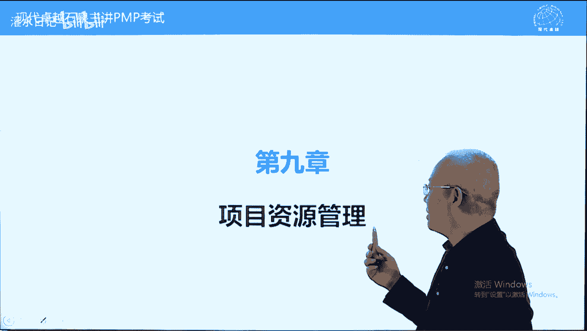

首先说一下资源指的是什么，资源，包括人和材料设备。

人和物资吧。

都叫资源，但是呢我们第九章主要讲的还是人呃。

德鲁克号称大师中的大师中的大师。

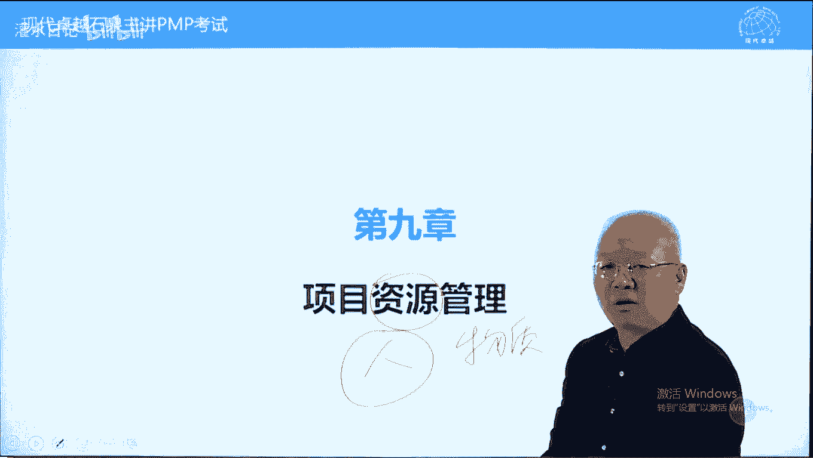

他认为一个组织，一个企业最核心的资源就是人力资源。

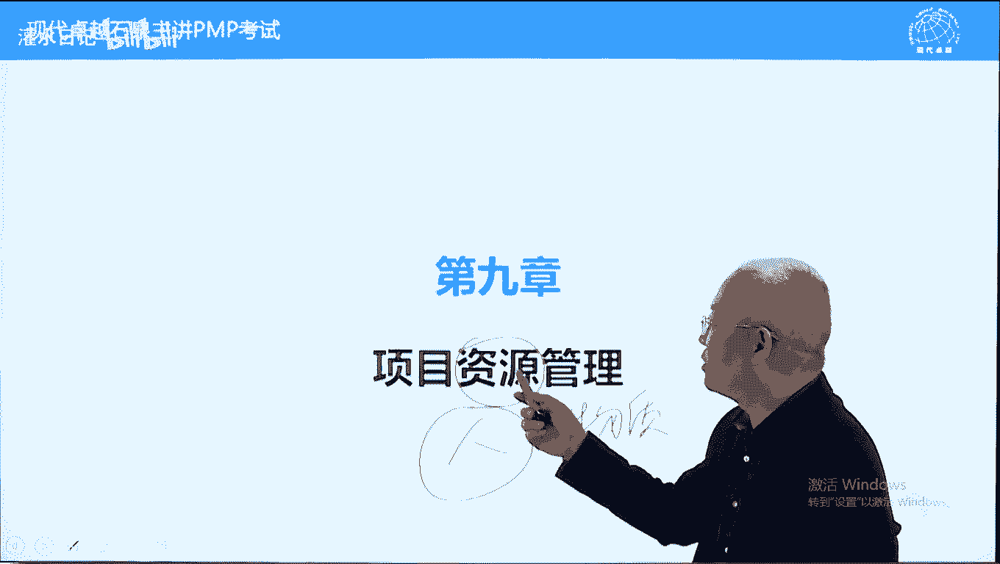

所以呢以前人力部门都叫人事部。

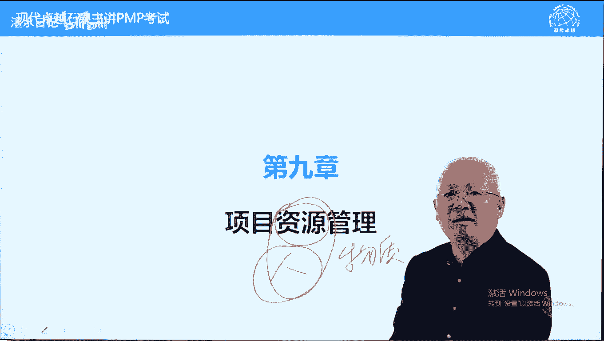

而现在的话呢都叫人力资源部，人是最核心的资源。

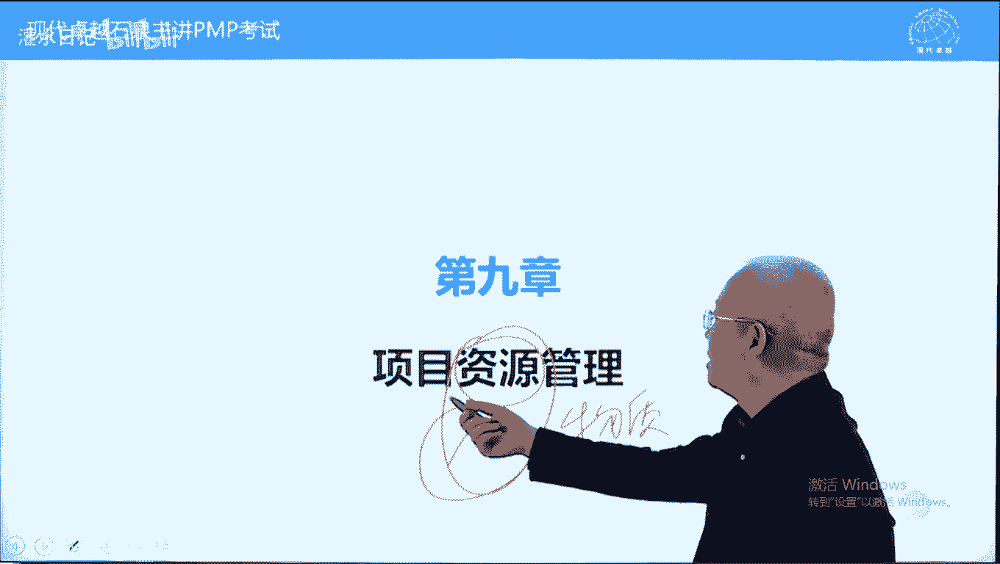

当然地站里面呢不光讲人，还要讲物质。

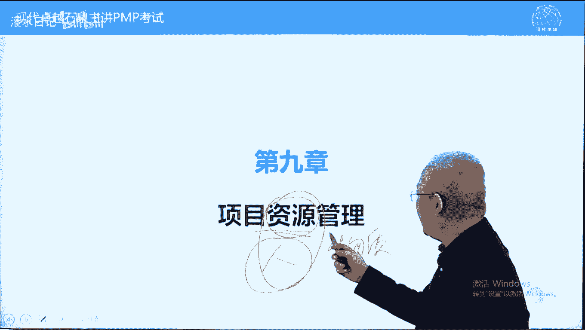

物物物物不叫物质啊，物资物资，这两个呢都是项目中的资源。

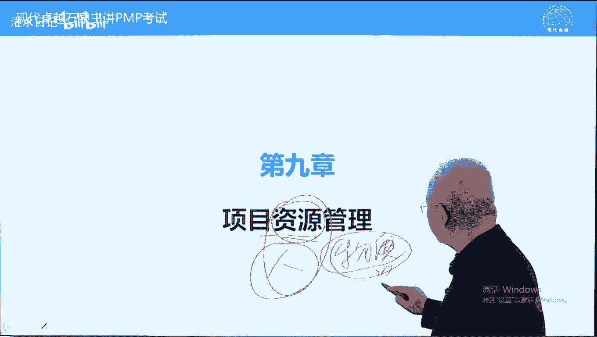

我们先看书上的一些说法，关于资源的一个介绍啊，好我们看一下识别获取管理所需资源，已成功完成项目，我们执行进度计划的时候，必须有资源，人力他的支持，没有资源的话呢，进度无法实现资源。

包括实物资源以及团队人力资源，第九第九章主要讲这个内容，实物资源点到为止，而且他从考试的角度来说，实物资源基本上没怎么考过，考得很少啊，另外一个原则，让团队成员尽早参与规划，两个好处。

第一个贡献专业技能，另外一个呢提高责任感，提高承诺好管理团队呢是校命令的责任，第九章，我们叫人力资源，也可以叫管理团队啊，管理团队这个团队管理呢我们也叫内部的管理，内部团队啊，指的是参与项目的人。

参与项目的团队成员，而团队成员呢包括公司内的，也可以包括公司外的，是不是团队成员，看他是否直接听命于下命令，如果他直接归项目，命你管，那他就是项目团队人员，如果呢他在供应商那儿工作，是供应商的人。

可能呢可以叫供应商的人员，不叫团队成员，那项目的责任包括什么呢，包括建立高效团队，包括培养团队技能，另外一个呢要以人为本，提高团队的满意度和积极性，为什么呢，因为管理的时候呢，不能光靠权力。

也要以人为本，要考虑他们的一个满意度呃，稻盛和夫呢曾经讲过，企业家和企业的责任，就是提高员工的物质和叫精神的满满足感，所以呢要以人为本，我们呢要以德服人更好一些，人呢是愿意劳动的，要很好的管理。

这个呢不是说把人当成设备，当成机器，要以人为本，另外一个呢要关注职业道德行为，如果违反职业道德行为，可能需要上报，另外呢效命题本身要以身作则，那职业道德包括什么呢，包括尊重公平公平。

然后呢这个成呃诚信和这个政治之类的，这样一些职业道德，另外一个呢自己要遵守，帮助团队人员也要遵遵守，还有一个点到为止，叫有效的和高效的分配使用事务资源，一句话不要浪费，下面呢我们看一下呃新兴的管理趋势。

在资源管理中，这里面提到了一些资源管理方法，点到为止啊，呃精益管理也叫精益，生产管理，也可以叫精细化，生产管理指的是从流程，从操作工艺呃，从各种动作方面来说，都要精益求精，没有一点浪费。

就是我们要做到一个高效，因为呢从生产动作来说，流程设计来说，包括呢原材料的提供之类的，这些呢都有一个最佳时间，找到最佳时间来，不浪费任何的时间和精力和动作，准时制这个指的是材料，从材料提供来说。

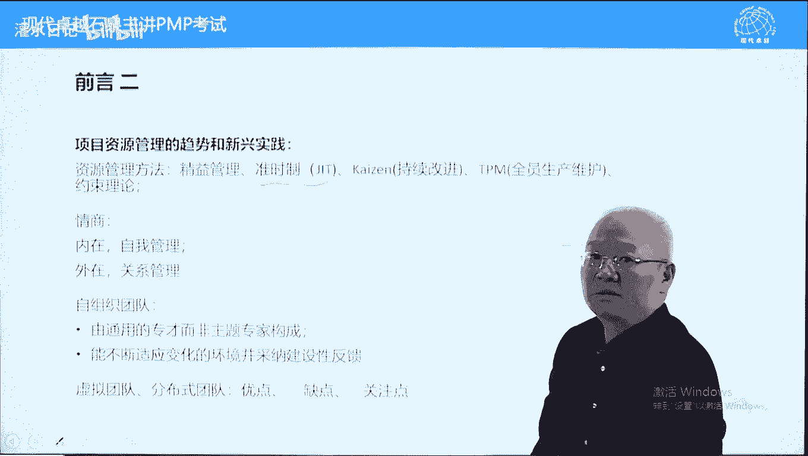

要justin time，也叫零库存，就是让生产啊，就是供应商直接把厂开在我们公司旁边，我们的零库存直接呢我们随时要他随时给，就像举个例子，就像嗯牛羊在牧场上放牧，他随时想吃就可以吃，凯森也叫持续改进。

我们前面讲过，pdc循环和六西格玛都是持续改进的，具体方法，t t m全员生产维护，就是全员参与来提高生产维护水平，这个词呢其实是新出现的词啊，以前不知道，以前我们只知道什么呢。

在这两中有一个t q m叫全面质量管理，日本丰田汽车提出的什么意思，上到董事长，下到员工都要在本职岗位上进行提高，提高质量水平，每个环节都提高了，整个质量水平就能提高了。

这叫t q m tpm的话呢跟他应该是类似的，每个人都提高自己的生产维护维护水平，这样的话呢整个生产水平能够提高，大概是这样一个意思吧，继续再看情商，情商包括内在和外在两方面的一个管理。

内在的话呢就是控制住自己的叫性格脾气，不要动不动就发飙，对自己呢要有一个高度约束力，或者说呢要有一个自制力，要高度自知呃，呃高度自控，自控能力高度呢自给自我约束，外在的话呢就是考虑别人不要自私啊。

要考虑别人的感受，这样的话呢人际关系就比较好了，我们前面也讲过，情商决定我们的发展上限，智商呢只决定我们的一个起点，而情商呢跟我们的思维方式有关系，要有时间思维，要眼光放长远一些，没有时间思维的话呢。

情商就变得低了，就是要看长远，一些人无远虑必有近忧，自组织团队指的是敏捷环境下，也叫敏捷开发情况下呢对于团队成员的要求，敏捷项目要求团队成员自我管理，每个人都是多面手，都是很专业的，多面手，一专多能的。

另外一个呢团队成员之间，他呢必须是能够自我协调的，大家呢很很团结，像一家人一样，一方有难，八方支援，而不需要领导发号施令来实现一个配合，这个呢叫自组织，自组织团队啊，他能够拥抱变更，能够快速反应。

在自组织团队中，项目你就相当于一个后勤部长提供支持，营造氛围，就可以了，另外呢书上提到一个虚拟团队，大家翻一下书，311页，第一段，首先说一下什么叫虚拟团队，定义是这样定义的，为同一个项目工作。

而彼此不见面或很少见面的一群人叫虚拟团队，大多数都跟跨国项目有关，跨国项目团队成员分布在多个国家，这个呢就是典型的虚拟团队了，好虚拟团队呢它的出现也是近些年来出现的，由于互联网由于通信技术的发达和提升。

让远程配合成为现实，虚拟团队就是一个远程配合的团队，为同一个项目，大家不在一起，它也叫分布式团队，优点很多了，节约差旅费，支持一个专家，同时允许一个专家同时支持多个项目。

以前的话呢可能一个专家只能服务一个项目，现在的话呢虚拟团队存在之后，一个专家可以在远程服务很多项目，另外一个呢可以把残疾人纳入项目团队中，行动不便的人，另外一个呢也支持员工在家办公。

这个呢是虚拟团队的优点很多啊，他也有致命缺点，致命缺点是什么呢，我们中国人经常说，远亲不如近邻，见面太少，界面太少，容易产生孤立感，另外一个呢不呃不利于建立信任，见面少，信任感就会少很多啊。

没有信任的话呢，容易引起误解，小的误解会引发大的冲突，原因是缺乏信任，没有信任的话呢，大家配合起来之后容易出现冲突，因此的话呢对于虚拟团队项目，应该关注关注沟通规划，要通过沟通来去减少误解的可能性。

减少误解啊，因为缺少信任的情况下减少误解，缺少信任的情况下，如果出现误解，会导致严重的冲突，原因是没有信任，除此之外，还有一个除了沟通之外，还有什么呢，团队建设，虚拟团队更需要团队建设来加强信任。

团建啊，我们写团建，加强信任，有了团队建设之后呃，这种呢有了信任感之后也能够减少误解，但主要的是沟通，所以你能看到虚拟团队，我们一般要找沟通管理计划，大多数跟沟通有关，看到误解也是跟沟通有关系的。

好这个呢是关于前沿的介绍，下面呢我们进入第一个过程叫规划。

资源管理，它的主要作用是制定一个资源管理计划，资源管理计划它是一个计划了，我们叫综合计划。

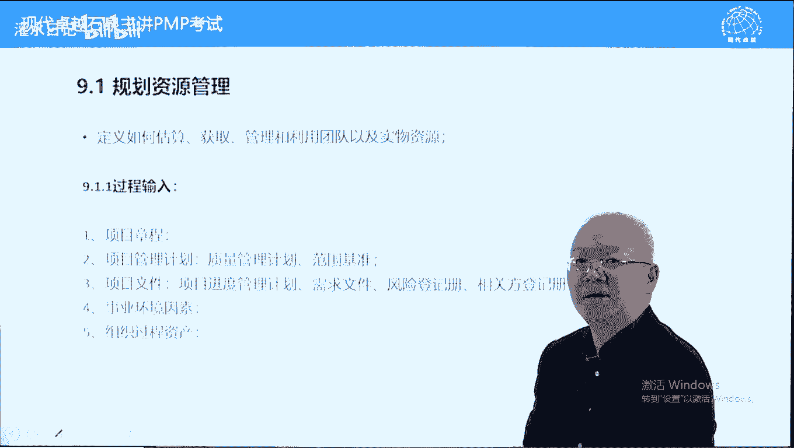

既包括做什么，也包括怎么做。

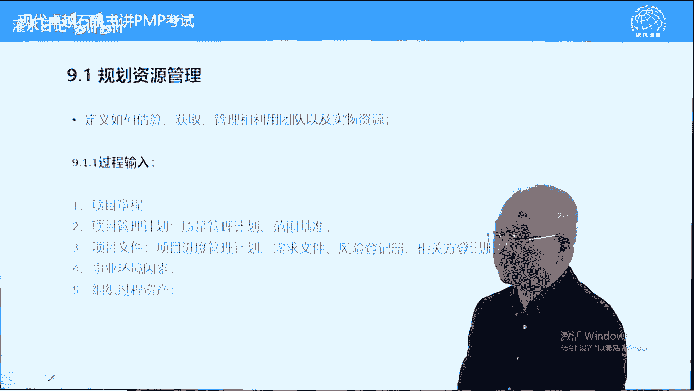

这里面包括团队资源以及实物资源，如何估算获取。

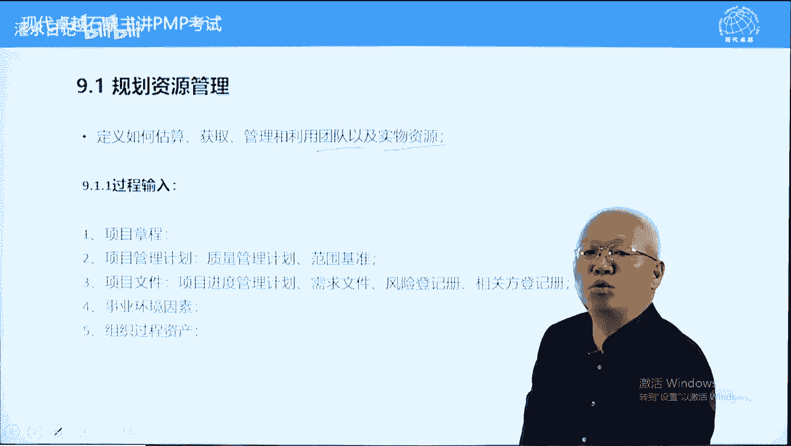

包括管理控制，我们看一下过程的输入，这个输入呢主要是根据范围基准，范围基准告诉我们需要哪些人力资源。

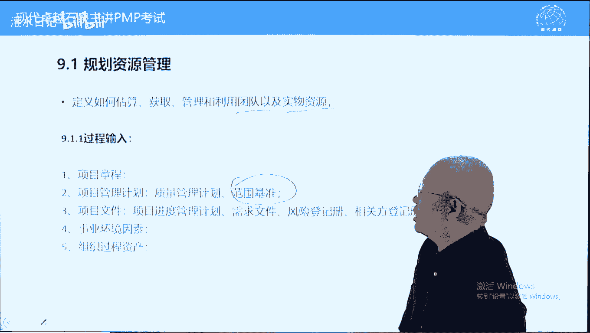

需要哪些食物资源，我们呢根据范围基准来去进行一个规划好，他的输出呢，其他内容不多说了，它的输出主要是一个叫资源管理计划，在规划的时候呢。

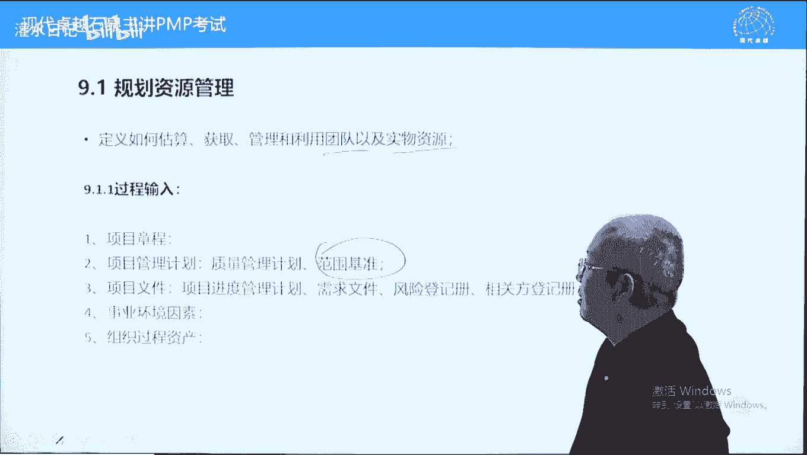

我们用到一个重要工具，专家判断我们说了，有一个数据表现技术，数据表现技术是干什么的呢，它要显示人和工作对应关系，这个呢是一个核心技术了，它能包含在资源管理计划里面，主要是人和工作对应关系。

书上说有三种表示方法，第一种叫层级型，层级型怎么理解，层积型指的是从宏观角度，w b s跟o b s有对应的地方，我们呢把wbs跟oobs进行对应，什么意思，w bs的高层我们说第一层吧，第二层啊。

第二第二层开始叫可交付成果，这一层可能跟ob s的第二层部门有对应关系，比如说汽车研发，有些期有些汽车研发工呃，汽车研发，汽车公司的这个汽车研发单位呢，他呢以布来划分，比如整个汽车研发院，它叫发动机部。

底盘部，变速箱部，这是部门，而发动机的w，而这个汽车研发的wb s，它的第二层可以是发动机，底盘，变速箱，内饰外饰，电子系统之类的，这样的话呢就是w vs红第二层啊。

w bs跟o b s第二层它有宏观的对应关系，就是可交付成果跟部门之间可以有对应关系，它呢是从宏观角度显示，部门和可交付成果的对应关系，比较宏观一些好这个呢我们不多说了，另外一个考试重点叫责任分配矩阵。

什么叫责任分配矩阵，它是一个表格，这个表格我们形象一些叫一个萝卜，一个坑，任何一个人，这是人啊，甲乙丙吧，甲乙丙啊啊这个呢是工作，只是任务吧，任务任务啊，人物啊，这个这个画的不是特别合适啊。

跟书上不太一致，书上的是反过来的，书上呢这边写的是任务啊，上面写的是人啊，这个是人啊，这个是任务任务任务一任务二一样呢都可以的，这是一个习惯问题了，好强调什么呢，一个萝卜一个坑。

通过r a m i a c i来确保，来显示人和供应和人和工作对应关系，确保每一项任务都有人再去做，也确保每个人的这个工作的话呢，在这张表中都显示出来，好这张表的话呢，大家翻一下书。

我们呢看一下这张表在哪里呢，在317页，317页呢，我们首先要确认一下就是什么呢，它显示人和工作对应关系，也也显示什么呢，项目中的角色与职责，他属于资源管理计划的一部分，做完之后要纳入资源管理计划。

人和工作对应关系，这个呢是第一个作用，防止出现撞车，就是两个人任务重叠了，工作重叠了，或者都没人做，防止出现这种情况，另外一个呢确保每一项工作都有责任人在负责，这张表有一个说法，这个r指的是执行。

responsible是负责执行的意思，而a的话呢，account account它呢是负责的意思，这张表要确保任何一个任务有且只有一个a，不能有两个a，也不能没有a，这个呢是责任分配矩阵。

它的两个考点，一个是人和工作对应关系，另外一个呢就是任何一项任务，有且只有一个人负责，这叫单点责任概念，而负责用a来代表，另外一个呢rm跟i c i的区别在于，i am它能反应的角色有限。

就是a跟a2 呢是执行a呢是负责，i si呢多了一个c，多了一个i c呢叫consult咨询and infirm叫通知，他支持更多的人员参与，书上说，他支持有内部外部人员参与的项目的责任分配。

这个呢是i c i i m它比较复杂一些，它比较简单一些好这个呢是责任分配矩阵啊，另外一个呢叫文本型，文本型呢就是文字描述，文字描述，我们用文字写实际情况就可以了，另外一个工具叫组织理论。

组织理论呢也叫组织行为学，它反映了什么呢，人在组织中的一些表现，一些特征项目里呢了解的越多越好，比如说人越多，在人群中，人的胆子越大，人越多胆子越大，还是人越多，胆子越小，一般来说人多胆子越大。

人少的时候呢胆子会小一些，人多的时候胆子会大一些，比如说看足球比赛，你一个人呢面对足球运动员身高体壮的，你也不敢骂他，但是呢几千人一起的时候，你敢骂了，为什么呢，人越多，胆子越大的，包括人越多。

荣誉感越强越弱呢，人越多，荣誉感是越强的，一个小孩子在家里面无法无天，爷爷奶奶爸爸妈都管不了，小霸王一样的，但是到学校之后，他听老师的乖乖得不得了，原因是什么呢，人多了，他又容易感了。

而老师呢特别注意维护孩子的荣誉感，通过小红旗来去激发孩子的荣誉感，疗养他来听话，包括，关关起门来，老婆怎么打怎么骂都无所谓，但是呢当着外人面，老婆必须要给面子，人越多，人的这个叫呃叫叫叫这个，人越多。

人的这个荣誉感是越强的，包括责任心，人越多，责任心越弱，人越少，责任心越强，呃有人做过一个实验，就是在一个大厅里面，酒店大厅里面让一个女的装作病倒倒下来，突然倒下来，如果只有一两个人，立马就过去。

看了就去扶了，如果人来人往的话呢，这个时间要长好几倍，要比如说一两分钟，两三分钟，可能五分钟都不会有人去服务一下，为什么呢，人越多，人的责任感是越弱的，因此呢项目要了解主力学会学。

还有一个呢我们前面讲过的组织行为学，有两个基本原则，也是职能组织下的一个原则，有两个原则，第一个呢一个人只有一个领导，这是个原则，第二个呢每个人的权利跟责任必须要对等。

但是呢矩阵型组织这两条原则是违背的，这个情况下呢，这种情况下，项目也要发挥个人能力来解决很多具体问题，下面呢我们看一下过程的输入叫资源管理计划，资源管理计划是一个综合计划，既包含做什么，又包含怎么做。

程序内容都有啊啊，第一个识别资源就是如何识别资源，这是个程序内容，如何获取资源，也是个程序内容，但是呢决策和职责他不是程序内容，以我们一般用rm ra 3 i来去表示，它不是一步到位的，随着团队的组建。

他一步一步的把它显示出来，好这里面的角色与职责，除了角色职责，我们用i si来表示之外，还有什么呢，权利和能力，那权利呢是命令别人，要求别人做事的，这样一种叫叫势能或者是一种能力吧。

而能力的话呢是基本素质，比如说打扫卫生，我需要会用吸尘器，我需要会叠的叠被子，刷杯子之类的，那权利的话呢啊比如说我打扫卫生，我打扫某一个酒店的三楼客房卫生，三楼呢20个客房，我必须有一个权利。

这个权利跟责任对等的，什么权利，每个房间都得能够进入才可以，否则的话呢我无法行使职责，权利和职责应该对等吧，好注意这个能力，考试中，这是个重点，能力是后天的，他不是先天的，我们可能只有吃奶是先天会的。

其他能力都是后天学会的，当出现能力不够的时候，项目里有个责任要帮助团队人员提高能力，就是你要帮助团队成员对他是有责任的，另外呢你也有责任对公司的责任，提高团队成员的水平，培养人员也是你的一个责任。

所以能力不够，首先要考虑培训，如果培训来不及，那怎么办呢，给这个人调整一个力所能及的岗位，这不叫换人，我们呢还是以人为本考虑他，他能力不够，给他换一个他能做的事情，我们换一个什么呢。

就是换一个能力强的人来坐他的位置，给他安排一个他力所能及的，要保持他的信息，甚至为这个人调整计划，延长进度来满足他的能力要求，这个呢能力不够，要培训，能力不够呢，跟他类似的还有什么呢，包括不了解呃。

不了解流程，不了解规矩，不懂规矩，比如说一个从其他公司刚刚进入的新人，他的不知道公司流程，按照原公司的流程来操作，这个呢也需要进行一个培训，包括脑子里面有错误观念，认为质量保证不重要啊。

质量审计不重要之类的，这些呢也是需要培训的，团队成员能力不够，要培训，对于项目经理而言，不存在能力不够，为什么呢，诸葛亮不需要会打仗，不需要练武功，诸葛亮呢他懂计策，总懂兵法就可以了，他不需要战斗力的。

对于项目而言，我们一般都叫什么呢，经验不足，项目里靠专家判断，靠经验的，当项目里经验不足的时候，我们有两个选项可以选的，那两个知道吗，做题做多了就知道了，第一个叫祖国做出过融资产，查看组织观察。

第二个sm也s r v什么意思呢，找真正的主题专家来帮忙，好不多说了，团队实验能力不够，要培训的另外一个内容也是实体内容，叫项目组织图，它包括两个内容，项目组织图也叫树状图啊，一个项目上面项目啊。

下面呢有哪些人，他们下面呢又带哪些人之类的树状图，像一个家族树一样的啊，这样这样一个情况，这个呢是项目组织图，项目组织图反映两个内容，第一个项目中有哪些人员，第二个呢他们的汇报关系，什么叫汇报关系。

也叫上下级关系，下级向上级汇报，那下级呢上级呢管理下级，这将会报关系，2004年那1年正好是猴年，中国农历猴年啊，当时没有微信，也没有微博红眼啊，当时流行短信拜年那1年有一条短信特别火，我印象深刻。

短信这样说的，他说在单位中的每个人，在单位里的每个人都像树上的一只猴子，往上看全是屁股，往下看全是笑脸啊，这个呢明确的反映了，很生动地反映了汇报关系，上下级关系往上看全是领导，往下看都是下属啊。

好另外我们再看项目资源管理，这个呢是一些程序性内容，都是如何如何的，如何定义资源配备，资源管理资源啊，如何定义团队配备团队，管理团队和最终解散团队，以前的遣散团队有个计划叫前三计划。

前三计划就是人怎么来怎么走，当然这个说的是怎么走啊啊这个怎么走，在刚开始规划人力资源的时候，就要考虑到为什么呢，要根据遣散方式来确定获取方式，有一些我们需要长期使用的项目，做完要使用的就可以雇用。

有些的话呢项目做完没用了，那我们只能够去这个叫外包，找供应商来去来去做就可以了，这样的话呢不存在一个叫解约的问题啊，这个呢是一个他的指南程序性内容，另外一个就是关于培训团体建设。

资源控制和奖励方面的内容，这个内容的话呢应该来说是实体内容，培训培训什么内容，团队建设怎么安排资源控制，当然这个可能是程序内容啊，当然这个也可以结合具体资源当成实体内容，奖励奖励这块呢我们先说一下。

它的目的是提高士气的，提高士气，提高团队成员的对项目的一个支持的好，奖励呢应该全生命周期，另外的奖励可以包括物质的，可以包括精神的，认可呢是表扬的意思，这个奖励呢是比较正式的，要全生命周期进行奖励。

而且呢要按计划来，不能拖延的跟发工资一样，一旦拖延影响士气的另外一个内容叫团队章程，也叫团的基本规则，旁边写一下，考试的时候呢也叫基本规则，讲一下规则的特点，规则是强制的，既利己又利人，绿人绿己的。

可以要求自己，也可以要求别人，这是什么呢，这个是底线要求规则只能设定设置底线要求，而且是人人做到的，它是强制的，必须人人做到更高端的，我们叫道德，道德只能律己，不能律人，为什么呢，因为道德它不是底线。

要求道德可能很多人做不到，很多人做不到的才叫道德，人人能做到的就是规则跟规则的话呢，底线要求必须要做到的，比如说不能迟到，不能早退，要按时向项目里提交报表，要按时完成项目的任务，这些呢都是底线要求。

可以强制要求的，对于团队人员，我们呢可以设置规则，我们自己内部的人，自己家的孩子可以打，可以骂，规则就是用来打骂的，他违反的就可以用规则加法从事的，而对于这个道德的话呢，因为要求比较高。

比如说希望大家相亲相爱，希望大家分享知识，互相帮助，这些呢不能叫规则要求，不能强制，只能通过团队建设，通过激励来去实现，道德呢是更高的一个要求，规则的话呢是一个基本要求，规则的制定有好处，什么好处呢。

决策的原则和依据，按照规则来，然后呢冲突处理可以按规则来会议指南，看到会议也找规则啊，好这个后面的不说了，这三个比较重要重要一些，好规则呢制定的时候要大家参与了解，彼此认为重要的价值观。

这样的话呢大家了解深入之后能够长期的呃，便于我们长期的相处，好规则一旦制定，人人都要遵守，规则呢是强制的，而且呢利润率底，它利润率底是个底线要求，胡适说，有了规则才可能有道德，道德是规则的产物啊。

我们只讲规则，道德会自然会有的，我们如果只讲道德，不讲规则的话呢，那道德也会沦丧，规则就没有了一个好的社会，一旦失去规则，会变成一个肮脏的社会，建立规则之后，肮脏社会会变成好的社会，因为呢规则很重要。

我们只有建立规则之后，每个人的话呢知道底线了，知道呢哪些能做，哪些不能做了，好人会得到保护，没有规则的话呢，坏人会大行其道，因为好人得不到保保护了，所以规则很重要，项目你要制定规则，它能提高生产力。

能够减少这个减少冲突的，这是规则的好处啊，我们讲一个规则的故事，规则是很重要的，胡适认为，好的社会就首先要建立规则，讲个笑话了，9月份电影学院开学，一帮小鲜肉小美女，然后呢进入电影学院，有小报记者无聊。

记者想知道新闻，找到一帮新入学的女生，就问他们，你们知道不知道电影学院有潜规则呢，你这么说，知道呃，小报记者问你们担心不担心潜规则呢，呃这个学生们说不担心诶，小宝其实很奇怪诶，为什么女生们说有规则就好。

规则很重要啊，这个规则的话呢是在项目中叫团队章程，冲突处理和会议指南，考的更多一些，决策虽然也也是用的，但是呢没有考过，注意一下跟章程跟规则对应的叫道德，道德呢要只能只能通过团队建设。

通过激励来去实现更高要求的文件更新，不多说了，下面呢我们再进入第二个过程叫什么呢，估算活动资源，前面讲过成本，资源和进度，三者构成一个三角制约，因此的话呢估算资源的时候要根据什么呢，要根据这个活动清单。

另另外一个呢还有一个成本的一个估算，然后呢来确定一下我们能用多少资源，或者说呢能需要使用多少资源，这里面还有一个内容叫资源，人力资源人力我们前面讲过叫资源，可供项目使用的时间叫资源利。

而这个资源里由于还在估算资源，资源没有到位，所以这个呢是公司的资源人力，我们根据公司还有多少资源可用，来去估算项目中能有多少资源，这是公司的资源日历啊，这里面呢又有一个风险登记册，我们前面在第六章。

第七章，而估算时间，估算成本的时候呢，都提到过风险能力测，它里面记录的是已知未知风险，为什么在估算活动资源的时候，要考虑风险登记册呢，答案也说一下，原因是为风险预留三种储备，还记得吗。

时间成本和资源在军事领域中叫预备队，打仗呢需要有预备队，答案好，另外一个呢就是我们资源和时间和成本，我们的估算顺序是什么，这一点呢也要先说一下，在中国我们一般都是根据进度进度确定之后。

我们呢按照进度来去估算资源，为什么呢，在中国可能资源的成本比较低一些，我们都是先进度，然后呢在资源在西方这一块的话呢，可能不一定是这样一个情况，更多的是根据资源来去来去设定一个进度，情况啊。

大家呢可以看一下，我们第六章估算活动持续时间的时候，也有资源人力，另外一个呢第六版有点混淆了，它是它里面有它，它里面有它，第五版比较清楚，我们是先估算资源，再估算持续时间，这叫什么呢。

看菜下饭要根据我有多少资源来确定一下，我们呢呃持续时间要估算多久，因为一条渠四个人挖一天，挖完一个人挖呢是一个人挖，四个人挖一天，挖完一个人挖呢需要挖四天，我们在中国先确定一天玩完再估。

估算一下需要四个人，那国外的话呢，西方国家，发达国家可能是先估算一下我有几个人，再根据人数呢再确定一下这个时间，好在考试中，目前这个内容呢考的不多，我们呢大概了解知道就可以了。

好他说呢跟估算成本过程紧密相关呃，因为钱的话呢决定资源呐啊不光要估算团队，还要估算材料设备两个词类型和数量，下面呢我们看一下工具，工具的话呢跟估算持续时间，估算成本很类似，但少了一个什么呢。

三点估算没有，这个不好解释啊，为什么估算活动时期之前估算活动资源没有，三点估算应该可以有的，但是目前只有第六章，第七章，他有第九章呢没有，这个呢也是一个问题，其他没有什么多说的。

我们在这讲一下备选方案分析，什么意思，就是我们使用资源的时候，首先考虑使用什么资源，大家翻译一下书，书上呢应该有一个暗示，我们看一下，备选方案分析在325页，备选方案分析考虑什么呢，考虑考虑能力高的。

能力低的呃，考虑呢自己做还是外包啊，自己做还是外包，根据这个成本可能考虑的多一些，而能力高的，能力低的，根据什么呢，能力高低，跟成本的多少是有关系的，一般来说能力越高，成本越高，能力越低，成本也越低。

那我们在能力跟成本之间优先考虑什么呢，这是个问题啊，答案是优先考虑能力，在第九章，我们从内部从其他执政部门获得资源的时候，有个工具叫谈判，谈判什么意思，找能力强的人，为什么能力弱的人，你不需要谈判。

值得你自然会给你的，让你调教调教，摊低一下成本，分摊一下成本，我们不愿意要这样的人，我们谈判的话呢，就是要能力强的人，能力强，成本肯定是高的，为什么，因为项目管理是一种基于进度的做事方法。

我们希望呢越快越好啊，在项目管理中，成本为进度服务，我们这样来理解就可以了，项目管理信息系统它可以复制，通过软件来复制啊，会议强调让团队人员参与规划，人员参与来去估算活动资源，这样的话呢更加准确一些好。

下面呢我们看一下输出活动资源。

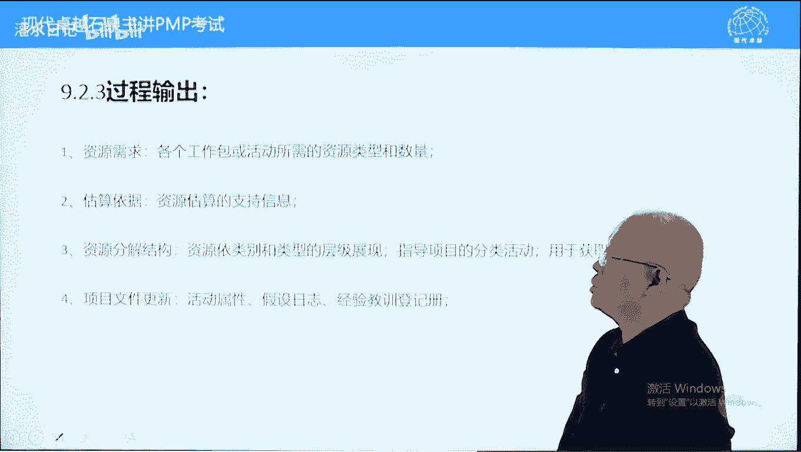

需求所需的资源，包括实物和呃人呢它的类型以及数量这两个词，关键词稍微注意一下，估算依据相当于wb词典对w bs的解释，文字解释我们怎么估算的好，第三个内容叫资源分解结构，简称rp s。

我们在这本书中有两个ibs啊，一个叫资源分解结构，叫resources breakdown structure，另外一个呢叫风险分析结构。

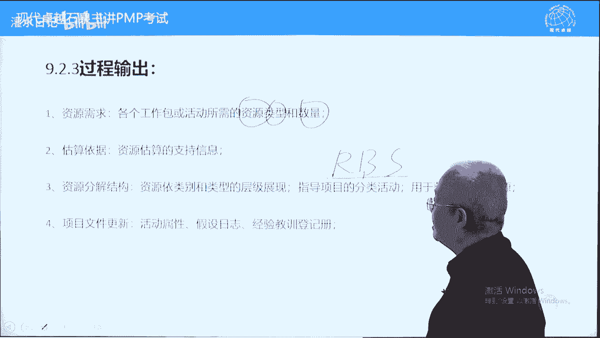

risk break down structure，这个资源分解结构它是按照资源的类型和技能，不是按数量，按照资源的类型和技能细分的一种树状结构，它呢是按照资源的啊，我们这样画多画一些资源的。

叫类型和技能划分那种树状结构，比如说软件的硬件的啊，包括这是什么呢，呃这个叫叫叫软件硬件，还有文文字设计的文字之类的，这样一些人员来自然吧，我们划划划分一下软件的话呢，包括这个语言。

那个语言的硬件的话呢，包括水泥工，钢筋工之类的这样的来划分的一个r b s，这个ibs的话呢，它本身来说是根据工作包和活动来去估算的，估做完之后，按照资源本身的类型和技能进行一个分类。

把同一类的合并在一起有什么好处，两个好处，第一个便于组建团队，第二个呢便于估算成本，我们举个例子，类似的rbs的例子啊，比如说我们有个培训啊，是一个在一个度假村，这个度假村呢是在一个岛上荒无人烟的。

旁边都没有人烟，就是一个度假修行的岛上，然后呢距离最近的超市大概有40km，旁边没有超市，我们需要在这个岛上度假村里面封闭一个礼拜，来去学习，比如考pmp，这个时候呢我们有100号人，每个人的呢。

每个人在这个一个礼拜中都需要买一些东西，由于距离超市比较远，我们的专门找四个人开辆皮卡，然后呢到40km之外的这个城里面呢，超市去购买东西，每个人写一张清单，交给这四个人，100张清单。

每个人清单的话呢包括四类东西啊，有食品，有饮料，有水果，有文具，这四类食品不同类型的，每个人写的都不一样好，这四个人拿到100张这种采购单清单之后，怎么样购买最合理呢，应该是区分一下。

划分一下面包一共多少，蛋糕一共多少，饼干一共多少，那水果呢呃饮料，可口可乐多少呃，果粒橙多少呃，叫加多宝，王老吉多少，包括啤酒多少，然后分开了水呃，这个饮料水果香蕉苹果橘子各一共要多少，汇总在一起。

这样的话呢不需要每个人拿着一个单子跑一趟，跑四个地方啊，我们的一个地方一次买够便于组建团队，也便于估算成本，我们汇总之后大概看一共需要多少钱，这样的话呢这个估算成本，它能够帮助我们去估算成本。

监督获取资源，好不多说了，文件更新这个呢是规划的工作，做完的工作呢都需要记录一下，有个文字描述的好，关于9。2的话呢，估算活动资源的话呢，没有什么特殊需要讲的主要是工具，而这个工具的话呢。

嗯跟前面的第六章体系上的估算工具差不多，还少一些，输出呢就注意一个r b s r bs这个考的很少，另外一个呢资源需求这两个词稍微注意一下好，下面呢我们看9。3获取资源，获取资源是根据资源管理计划。

我们设定的我们需要的资源类型和数量，来去获取资源，注意呢在估算的时候，只有类型和数量，没有具体哪个人，具体哪个人的话呢，要跟职能部门去谈判，去要的，看能不能要到了，最后呢是有些时候是叫什么呢，尽人事。

尽人事听天命，我们呢尽到努力，但能不能要到这个人，那是不一定的，获取所需的人员设备材料等等，从内部呢我们是从职能部门，从职能经理那块去获取资源，外部呢是从供应商那获取资源，包括呢实物资源。

外部是采购了另外一个矩阵型组织，指的是矩阵矩阵型组织存在一个双重领导，我们前面讲过项目，你在项目中三个权利范围，进度成本做什么，什么时候做好，花多少钱做好，而真正经理的话呢，他两个权利一个是谁来做。

一个是怎么做，就是对于资源和技术，他的权利的话呢是由职能定理来控制的，至少是项命令和职责心理分享，对资源的控制权，一般来说职能经理权力可能会大一些，因此的话呢在矩阵性组织中，项目里，大多数情况下。

通过搞定职能经理来去管理团队成员，这样的话呢效果比较好，为什么呢，团队成员跟项目里之间是一种一锤子买卖，也叫单次博弈，跟他的职能经理之间呢是重复博弈，他们是长期的单词博弈这个两个字啊。

博弈博弈论的这个我博弈这个意字是这样写的，博弈重复博弈，单次博弈，博弈论里面这样说的，单次博弈就意味着背叛，重复博弈的话呢，大家遵守规则，所以呢团队人员更愿意听部门经理的，那是他的长期领导。

他得罪不起部门经理的话呢，有机会给他小鞋穿，项目里没有机会给他小鞋穿小鞋穿，这两个人呢一锤子1锤子买卖，比如说你在街上看到卖樱桃的，卖车厘子的比较便宜，你呢称了二斤回家，一称一斤八两，一斤六两。

这些都很正常，根据亚当斯密国富在国富论中对人的假设，他认为每个人都是经济学的人，有三个特点，贪婪的，懒惰的和追求利益最大化的，小时候想法他会追求例子的话，他呢通过完成扣你的称来去占你的便宜。

实现利益的最大化，他指望不指望做你第二次生意呢，他不指望呢，为什么呢，见人海茫茫见不到的，所以呢他会背叛你，单词博弈意味着背叛，但是呢你到家乐福沃尔玛，你买车厘子，他不会这样做。

他也符合经济学人的一个假设，他也希望利益最大化，那对于加乐福沃尔玛，什么叫利益最大化呢，你一辈子买他东西，他骗骗你不值得，所以他不会骗的，他会遵守约定的，所以团队人员对于职能定理它会比较尊重，不敢欺骗。

对于项目里的话呢，他可能会欺骗，有人说你说的这个都是小商小贩，学历都很低，那我们公司都是本科，都是研究生，至少是个本科的，那素质都很高的啊，问一个问题，人品跟学历有关系吗哈张文英说，如果有。

那是成反比啊，啊未必有关系的，比如说呃很多软件外包企业，他的人员的话呢呃工资相对来说比较低一些，在大城市住的比较远，上班呢可能需要一个半小时，甚至大家要时时间，像北京上海这样的，因为他住的地方比较远。

为什么住得远，工资收入低，房子好多房子租不起，只能很远，上班一个半小时，下班一个半小时啊，这个叫叫软件行业的话呢，都是996比较多一些，要加班，九点钟之前下班都不叫加班，一加班回到家里面，11二点了。

睡到床上呢，将近一点了，六点钟爬起来赶早班车，好在是叫公交车，起点站上车就有座，有做的话呢大家只睡了五个多小时，睡眠不足需要睡一会儿的，这样养养精神会做做的，你做两三站之后呢，会出现一个墨菲定律。

墨菲定律呢我们在人力资源中会补充一个，就是有一个头发跟我一样的老太太站你旁边，你呢要不要让座，你内心会很纠结，让吧，对不起自己不让的吗，内心又纠结，良心上过不去，如坐针毡一样的坐坐不住。

这完全取决于头一天正能正能量负能量啊，头一天老婆骂你了，老板也骂你了，负能量很充足，眼睛一闭，假装睡着就不做了，那就不让了，头一天的话呢，如果正能量很充足，老婆说怀孕了，老老板说给你加工资。

然后呢正能量很充足，立马就让了，让我们让两可之间，因为什么呢，陌生老太太，你跟他之间单次博弈啊，如果是老太太不是别人，是你丈母娘，敢不敢不让你不赶不上，为什么呢，除非不想跟她闺女过了，这叫重复博弈。

重复博弈，大家遵守规则，单次博弈信息占优的地方，他会背叛的，谁占优，他对这些信息占优，他掌握技术的，他是专业人士啊，另外一个他不需要对结果负责，你需要对结果负责，因此的话呢在这种情况下。

项目需要有更多的手腕，或者说能力，也叫技术吧，来去管理好团队，这个呢人力资源中，我们有很多的工具需要注意的，包括权利，包括基地之类的，下面呢我们看一下过程的输入，获取团队资源，团队获取资源的话呢。

主要根据资源管理计划，另外一个呢这个资源日历理解为公司的资源，日历，要看菜下饭的其他内容呢就不多说了，我们看一下，看一下工具，这里面有一个多标准决策分析，指的是获取资源。

可能要考虑各方面的因素来去获取资源，首先一个就是要可用性，不能使用再好，成本再低，不能使用的话呢，意义不大，而在成本和能力之间，我们首先考虑什么呢，首先考虑能力，经验跟知识之间什么重要呢。

经验更加重要一些，在经验面前，知识就是浮云，不知道我们讲过没讲过，就是到韩国拉双眼皮儿，有一个韩国欧巴，40几岁小初中毕业，但是呢干了20年了，每每年拿2000多例。

另外一个呢斯坦福大学神经外科博士后毕业，从来没在人身上动过刀子，你敢不敢让他拿，你一般会找经验丰富的好，技能和态度哪个重要呢，态度更加重要一些，为什么呢，因为技能可以能力啊，可以后天提高。

可以后天培养的好，这几个内容呢大概了解一下就可以了，目前呢没让你对比过，国际因素指的是跨国项目，跨国团队有三个因素需要考虑，一个呢叫地理位置，地理位置，另外一个呢叫时差，也叫时区时差。

第三个呢就是语言考试中考过一道题，这三个因素对于项目而言，要开会，哪一个最难克服，钱能解决的都容易克服，地理位置，视频会议语言，找同声翻译，找翻译软件也可以的，你说时差连钱都不需要，半夜起床不就行了吗。

你让别人半夜起床，别人可以拒绝的，可以告诉你的啊，所以呢这三个因素最难克服的就是时差问题，他呃这个是大问题，导致我们不能够同时开会，会有这样的问题啊，好另外呢谈判指的是，无论从内部还是从外部获取资源。

都要谈判，我们希望什么呢，能力又强，态度又好的，又听话又能干活了，这这样的人对于职能经理而言都是宝贝，他轻易不愿意不愿意放出去的，所以呢要通过谈判，从职能经理或供应商那获得这样的人，能力又强。

态度又好的，又听话又干活的人，谈判的本质是一种等价的利益交换，我会给你一个无法拒绝的理由，所以呢效力要平时广结善缘，要让别人欠你的，这样的话呢，我们能获得需要的资源，能够让项目呢石板工位做得更好一些。

第三条工具叫预分派，预分派指的是在章程制定的时候，制定章程的时候不叫张弛指令，制定章程任命消费的时候会有一些人员，然后呢进入项尤其一，一般来说在规划开始之前啊，这些的主要作用，参与规划第一波人。

第一波进入项目的项目的组件，大的项目是分两波的，第一波制定计划，制定完计划之后，计划批准了，按照计划再获得人员召开k q meeting，分两拨的好，在章程制定的制定的时候会发布章程的时候。

我们在规划之前会有一拨人进入，这拨人呢有三种情况，第一种竞标承诺，我们呢在投标的时候，甲方在标书上有要求，比如说资质要求你必须有几个意见呃，工程师你必须有几个pp，如果公司就一个意见，就就那一两个偏僻。

那这些人呢只要在竞标中承承诺了，他们已经是项目团队成员了，另外一个呢叫特定人员的专有技能，比如说项目中需要美工，公司只有一个美工，那他肯定是团队成员，项目中需要弱电工程师，公司只有一个弱电工程师。

他也是团队成员，第三个章程指定指的是项目里有权利挑人，领导安排项目里做这个项目啊，你做这个项目行不行，项目你可以提条件，要让我做这个项目，你得让我带谁谁谁一起做，领导一般会同意的。

这个呢跟项目里一起任命的叫章程指定，这三种情况知道就可以了，好另外一个呢虚拟团队的优点缺点，关注点再画一下，这里面呢关于优点讲的比较详细一些，大家看一下，在333页第三段下面。

小黑点小黑点都是虚拟团队的好处，大家可以看一下，好最后一段，最后一段呢告诉我们在虚拟团队中，项目应该关注什么，缺点不说了，关注什么呢，关注的是花更多时间来进行沟通，沟通规划设定期望促进沟通，解决冲突啊。

并共享成功企业之类的，就是要关注沟通规划，要关注团队建设，要关注别人的一个体验感受，因为在虚拟团队中会有孤立感，会有不信任感，这个呢是关于这个虚拟团队的一个内容，下面呢我们看一下输出实物资源分配单。

就是我们已经获得的，可以直接使用的，归我们使用的，在我们手里的实物资源有哪些，包括设备材料，另外一个呢团队成员派工单，这个翻译不好，应该叫团队成员名录，写成名录更好一些，花名册。

我们项目中哪些人是我们的人了，我们已经有哪些人了，这个呢是获取资源，就是人员到位了，人员到位之后有一个通讯录，有一个清单，这些人是我们的团队成员，有可能是兼职的，也应该有啊，派工单呢有点像工作委派书。

那个呢是安排任务的，这个翻译不好，应该翻译成团队时间名录或团队时间清单，更好一些，显示了他们电话号码，联系方式，角色就是团队名录啊，姓名角色联系方式好，资源人力这个资源利是真实的，不是规定了。

应该就显示了显示了哪些资源可以用，并且呢从什么时候可以用到什么时候，比如说弱电工程师项目中需要使用啊，但是呢弱电工程师工程师比较忙，每个月每周四下午有时间，你只能每周四下午。

而且的话呢只能供你这个项目呢用，两个月，两个月之后他要调到外地去了，老公别的项目支持支持别的项目去了，这个叫什么呢，叫资源人力，资源人力相对于资源直方图是客观存在。

而资源直方图相对于资源人力是一种主观要求，获取资源之后可能会更新资源管理计划，为什么呢，有些资源被替代了，有些资源我们没有要到，我们找了一个备用资源，这样的话呢资源管理计划都会相应的更新，主要是这个。

还有如果获取的资源能力很强，成本很高，成本很低，有可能会改变，成本基本有可能改变，但我们主要是资源管理计划，可能会发生一些改变，书上讲的是经验教训，其实呢就是我们既定的人员没有要到啊。

要到了一个替代资源，这个时候要更新一下的文件，更新不多说了，事业环境因素这就不多说了，这个呢是9。3获取资源，获取完资源之后，按理来说就应该干活就是了，但是呢在书上多了一个过程叫团队建设。

为什么要进行团队建设，怎么样进行团队建设，我们9。4呢都要说一下，首先说一下为什么要进行团队建设，因为一个团队他的战斗力建设和不建设，或者说配合好倒不好，有多少差距呢，一到12位的差距。

如果是没有见识过大家互相不信任，然后呢配合也不行，从来没有磨合过，没有信任感，战斗力是一的话，经过很好的建设，最高能提高12倍，这个呢是团队建设的一个好处，因为我们要发挥1+1大于二的有机作用。

组织作用就发挥1+1大于二，发挥乘方这样一个作用，因此的话呢需要建立凝聚力团队，这项目呢是一个团队工作，我们叫提莫，就像踢足球打篮球一样的，他的战斗力不是简单的球星能力相加，而什么呢，1+1大于二。

关键呢就是一个信任，有信任之后大家配合能更好一些，有默契，所以呢，这个信任是我们团队建设的一个一个目的，为什么信任对于团队建设很重要呢，我们讲一个原理叫什么呢，囚徒困境，囚徒困境啊，告诉我们信任不信任。

然后呢大家的团队利益能不能最大化，差距很大呢，什么叫囚徒困境，这是博弈论中的一个模型，叫囚徒困境，他指的是有两个小偷，a和b两人合伙偷东西，偷的价值比较高，但是呢被抓了，抓了之后呢，只有物证，没有人证。

没有监控录像，这这是找到赃物了，这样的话呢公安机关只能拘留，不能判刑的，在拘留期间必须要有人证，没有人证的话，那得释放的这两个人呢，一般来说分别关押，然后呢去审他们，让他们互相咬啊。

如果这两个人打死都不认，这个叫什么呢，抗拒从严回家过年，两个人无罪释放，如果这两个人都认了，坦白从宽牢底坐穿，一个人呢判5年，如果一个人认一个认不认，不认的人承担全部责任，10年任的人呢监工不做。

不过判1年一样的啊，啊这四种结局对于双方最好的结局是这种，但是呢有前提，双方必须非常信任，因为公安机关办法很多的，能让你互相咬的，如果不信任的话呢，立马就咬出来了，团伙犯罪很容易扩大，对于自己而言。

能够把握的最好的结果就这种情况了，我就认任的话呢，最多判5年，最少的话可能就判1年，对我来说，我能控制这种呢是利益最大化，但是控制不了，所以呢如果互相不信任，那就是大家就认了啊，一般来说就这种结果。

所以呢团队建设能够克服囚徒困境，这个呢是博弈论的一个模型，告诉我们要有信任，没有信任呢不能实现团队利益最大化，足球篮球都是一样的，要实现团队利益最大化，有些时候呢要互相信任，要牺牲一些的。

这个呢是团队建设的一个目的，我们下面来看一下书上的一个说法，目的是提高呃改善，提高团队互动，改善整体气氛啊，整个目的提高项目绩效，提高个人能力，提高团队配合，进而提高整体项目绩效，团队协作英文叫提莫。

翻译成什么呢，翻就翻译成团队工作，也就是团队协作吧，团队协作，大家很配合，互相之间很支持啊，很信任的这样一个状态，跟他对应的叫对抗啊，好高校团队的责任人是谁呢，是项目里，对于项目里而言，应该有些原则。

开放予学校的沟通，指的是在跟员工沟通的时候，不要有太多的禁区，这也不能说，那也不能说不叫开放的沟通，开放什么都可以叫开放啊，开放的沟通没有敏感词，关于工资，加班费都可以说的，这样的话呢大家畅所欲言。

能提高信任的，提高效率的，另外呢建设性的方式解决冲突，团队内部的矛盾都是人民内部的矛盾，这种冲突的话，那不是得有矛盾啊，这种冲突不要抓凶手，不抓凶手啊，我们的目的以什么为目的呢，以大家继续合作为目的。

不抓凶手，这个呢是一个原则。