# PMP考试精讲 - P22：22 - 灌水日记 - BV1VN411w7cC

12章项目采购管理。

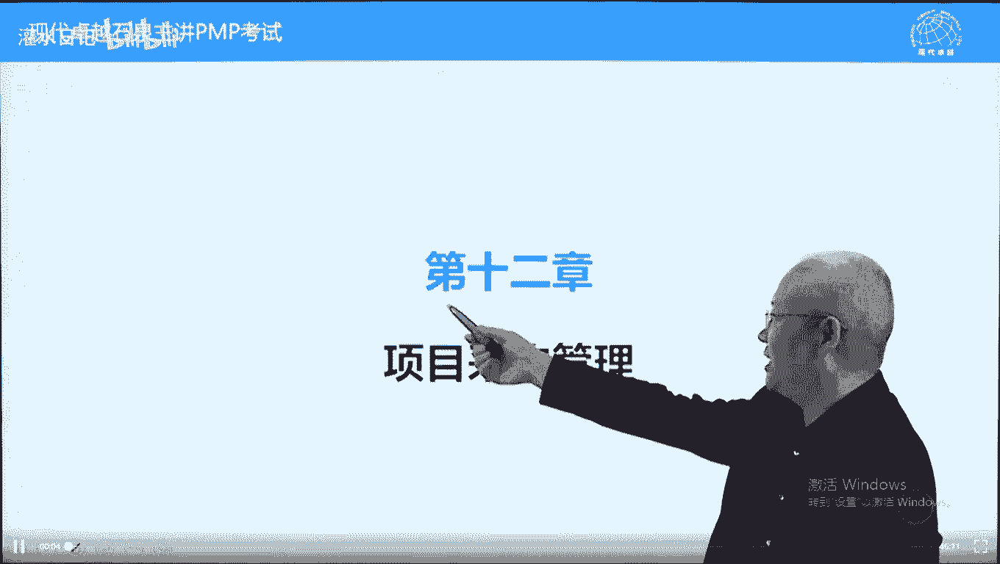

这个主题呢大家都不陌生，因为那都买过东西，而且很多人呢参加过投标，也有人呢招标招标过标的人少一些，大部分人可能参加过投票，那采购呢按照pbook的内容，招投标评标和这个叫呃签订合同的过程。

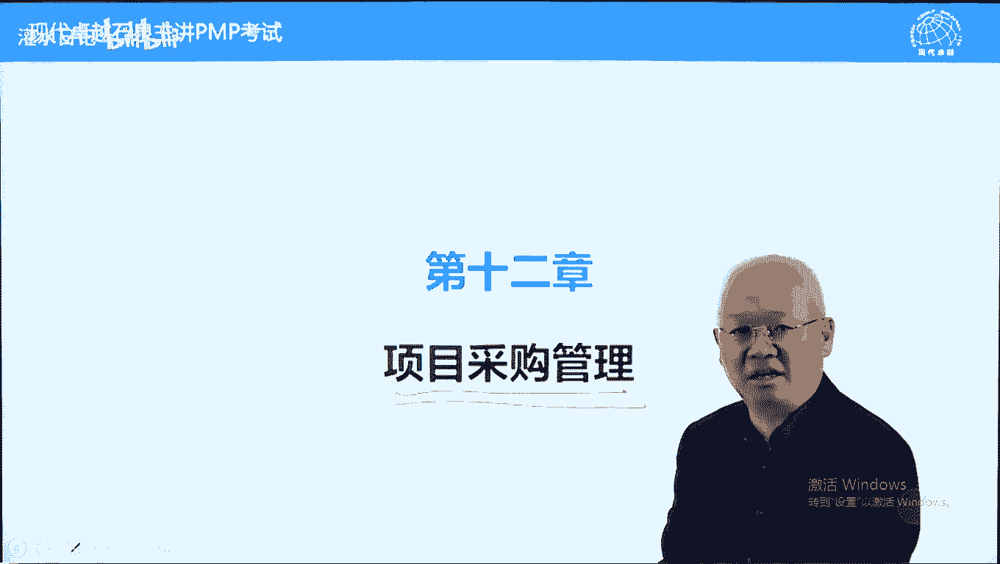

包括了履行合同，但是呢采购呢这个概念呢在偏不中范围呢，比我们想象要大一些，他强调从外部获得可交付成果，从外部获得产品服务或成果，包括买的，包括不花钱的，只要从外部获得都叫采购，包括我们到工商局。

税务局获得一些资质证书，许可证之类的，都属于采购，但是呢比较标准的是从供应商，招投标的方式来去采购，结果好，另外呢我们再说一下采购的发生，它在什么时候发生，采购的发生绝大部分是在计划批准之后。

至少是范围基准批准之后，为什么呢，因为我们从外部获得可交付成果，产品服务或成果，对于我们而言，我们叫可交付成果，对于供应商而言，叫产品服务成果，道理是一样的好，另外一个呢采购这块必须要满足项目的需求。

什么需求呢，就是项目计划中对于范围进度成本的需求，我们采购的话呢只是自己不做，而不是说为了从另起炉灶啊，我们把某些工作呢，项目做某些工作交给供应商来做，他们应该是我们的采购，必须要满足项目计划的要求。

哪些计划呢范围进度，成本和质量，即使不是自己做的，也要满足这样这样一些要求好，另外一句话，项目生命周期包含在啊叫叫采购生命周期啊，我们叫合同生命周期啊，合同生命周期包含在项目生命周期之内。

好就像孙悟空一个跟斗108000里，但是呢翻不过如来佛的手心道理一样的，项目生命周期包含合同生命周期，合同生命周期包含在项目生命周期之内，还可以这样说，合同没完成，项目不能算完成。

这个合同指的是采购项目中有采购工作，没有完成，这个项目呢没有完成，就是项目生命周期包含合同生命周期，合作生生命周期呢不能超越项目生命周期，另外的两个概念，分散式采购跟集中式采购，小型企业初创企业。

分散式采购指的是采购人员，专门为这个项目服务，它的好处灵活快速，而集中采购呢，就是公司所有的项目，采购呢都提交给这个叫采购部门，采购部门呢统一采购，然后呢再分给各个项目，他不专门为项目服务。

他可能的灵活性要要小一些，各有利弊，分散分散，分散式采购灵活一些，但是呢它的成本可能会高一些啊，集中采购它的目的是减少腐败并且降低价格的，它的坏处就是不那么灵活，周期可能会长一些好，另外一个呢合同编制。

这个是合同编制十这个字改一下，改成时间的事啊，错字将风险分配给最有能力应对该风险的一方，风险呃，这个风险呢我们前面讲过，让专业的人做专业的事情，而外包采购就是外包，本身就是风险转移的一种方式。

然而呢不同的合作类型，对风险转移的程度稍有不同，这也是我们在第12章，需要研究的重点内容之一，好另外一个呢可以采用公认的合同范本，来减少争议，减少扯皮事件，有哪些合同范本呢。

我们后面后面会讲有总价类合同，包括很多小的，有成本普查合同，也包括三种类型，还有什么呢，还有公料类合同，这都属于相对来说比较标准的，那其次呢比如说在外贸行业，也有一些比较标准的合合同啊。

f o b离岸价cf到案件，这些呢都属于标准的合同，他有些规定能减少彼此的争议或减少扯皮，包括abc总承包合同，国外的国际工程，e p c刚才写过的e p c总承包合同，他呢有一个条款叫菲迪克条款。

非迪克非大概是这样写的吧，菲迪克条款他呢也是国际公认的，能减少误解，减少扯皮，下面呢我们看一下第一过程叫规划采购管理，它呢解决三个问题，重点前两个第一个买什么，第二个怎么买，第三个找谁买。

我们这样概括一下，买什么怎么买，找谁来买，谁可以可以找谁来买，识别钱财，买房这个其实作用作用要少一些，重点是买什么跟怎么买，偏僻考试呢考过一道题，买什么跟怎么买，哪个先决定先决定什么，要先决定买什么。

再决定怎么买，因为买的东西不一样，买的方法是不一样的，买房子跟买手机这个差别呢就比较大一些了啊，这个每一个采购都要经过采购的三个过程，规划实施和控制采购，每一项采购都可以都要这样做的。

如果同一时间有一批采购，那也可以把这一批采购，用三个过程一起来做一下，也是可以的，针对每个采购原则上都要经过12。1，12。22。33个过程，那如果凑巧整个呢同一个时间有多种采购。

那可以放在一起来去做也是可以的，采购的典型步骤，这里面说的是什么呢，正式招投标方式来进行采购，还有一些不是这样正式的，比如说到工商税务去领执照之类的，也属于严格来说也属于采购，但是呢没有那么复杂。

还有呢有些公司采取利润中心的方式，部门之间的合作算钱的，内部算钱的，这叫什么呢，虚拟合同，虚拟合同也叫采购啊，内部的虚拟合同，拟合同，利润中心的方式来彼此之间部门结算好，它也属于采购，但是没有这么复杂。

我们呢讲最经典最复杂的就是什么呢，标准呢招投标的方式来进行采购，首先制定sow什么意思呢，买什么东西，sow要解决的问题，在采购中我们买的东西是什么，另外一个呢估算一下我们买的话呢。

这种东西大概值多少钱，大概需要多少钱，还有一个呢发布招标广告，什么意思呢，我要买东西要对外招标，大家呢有兴趣的，有资格符合资格的可以来投标，确定合格买房清单，不是阿猫阿狗都都可以来投票的。

我们要进行一个门槛设定门槛要筛选一下的好，另外一个呢筛选完的给他发空白标书，这是发空白标书啊，标书发给他之后，他填写标书，填写标书之前，因投标之前应该还有一个工作叫召开投标会议，也叫投标大会。

就是什么呢，进行一个投标问答呃，投标人呢可以提出问题，然后呢以便对我们的标标的呢更清晰的，对我们的招标有更清楚的了解，然后呢更好的去填写标书，好投标之后我们呢评标评标呢有评标技术了。

评标的目的选出最合适的供应商，技术解决方案非常好，价格又不是最高的，另外一个呢估算减一是成本，前面估算过这个估算呢就是根据乙方啊，根据潜在供应商，他提交的技术解决方案，我们来帮他估算一下它的成本。

报价合理不合理，防止上当受骗，一般来说更多的是防止报价过低，因为招投标是价低者得，价高的报价高的我们根本不理的，价格低的它有可能是有重要的功能遗漏了，比如说家里装修80平米，有人报价100万。

我们直接pass掉的，根本不管他的，有人报价5万，5万的话呢，价格最低你比较感兴趣，但是你要注意，这5万块钱报价有可能有重大遗漏，比如说卫生间厨房遗漏了，遗漏了5万块钱能解决，你呢要选他的话呢。

你可能会吃大亏，所以呢要根据供应商的建议书，来对供应商的成本进行一个评价，估价，看他的报价准确不准确，合理不合理啊，好另外一个呢选出供应商最好的供应商，选完之后呢，要跟他谈判，就跟谈恋爱一样的。

不是说条件合适，门当户对就能结婚的，要先谈恋爱，谈恋爱的跟谈判一样的，就是建立信任，获得合理价格，建立信任就是帮对方消除一些不存在的风险，来压低价格，并且的话呢来确认一下对方提供的承诺，怎么样保障呢。

我们呢建立信任，最后呢签署合同，签署完之后呢，还要执行合同，然后呢监控合同这里面没有写，这个只写了一个叫签订合同，到此为止了，进度计划对采购策略制定有重要影响，什么意思呢。

就是合同他的履行必须要符合项目的进度计划，不能因为采购影响整个项目的进度，那采购为进度服务，而不是说进度为采购服务，这一点呢要注意一下，下面呢我们看一下过程的输入，这个输入呢主要的输入是范围基准。

因为呢采购是从外部获得可交付成果，那其次的话呢还要考虑一个叫资源问题，到我们内部资源不够的时候，我们可能要考虑从外部来去获得内部资源不够，做不做不做做不及，另外呢还应该考虑什么呢。

呃就是这个成本方面的情况，如果价格比较低的话，我们呢自己做价格比较低啊，不是自己做价格比较低，不要不要踩过来，外面的采购价格比较低的时候，我们呢可以采购就是一个事业环境因素吧，市场行情之类的东西啊。

这里面那个资源需求还有一个呢风险，因为有些采购是因为这是个风险比较重要，我们决定转移才采购的，这个呢也是一个知道就可以了啊，这里面里程碑清单要满足里程碑的，下面呢我们看一下重要内容叫什么呢。

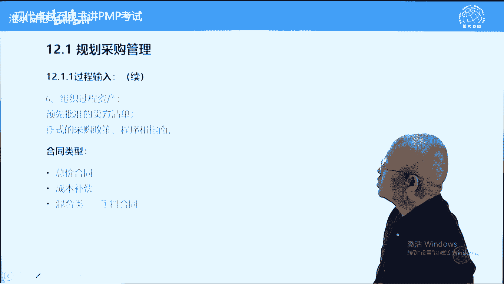

叫组织过程资产，我们先讲组织过程资产中不重要的，一般的这个下面最重要，预先批准的合格卖方清单，这个呢属于组织工程产，就是跟我们公司合作过的。

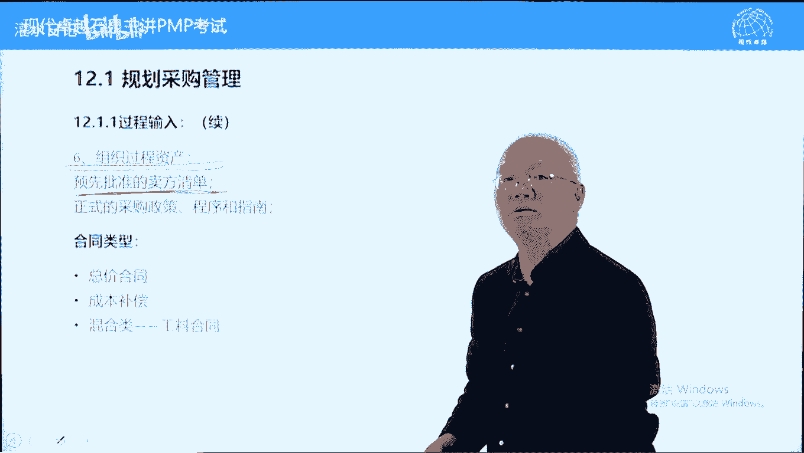

我们呢也验证过比较靠谱的合格卖方，比较靠谱的卖方，在一般企业这种清单呢属于事业环境因素，它是强制的，如果你没有进入合格卖方清单，你根本没有资格去投标的，但是呢在偏不可，这里面呢。

在pm里面这个预先批准卖方清单，它属于组织过程资产，他不是说只能这些供应商才能选，除了这些供应商项目，也可以另起炉灶打广告来找其他供应商的，它不是强制的好，另外一个呢公司有一些政策指南也不是强制的。

可以作为借鉴参考的，重点讲合同类型，前面讲有标准合同能减少分歧，减少误解的好，在项目管理中有三种比较常用的和合同，分别是总价类。

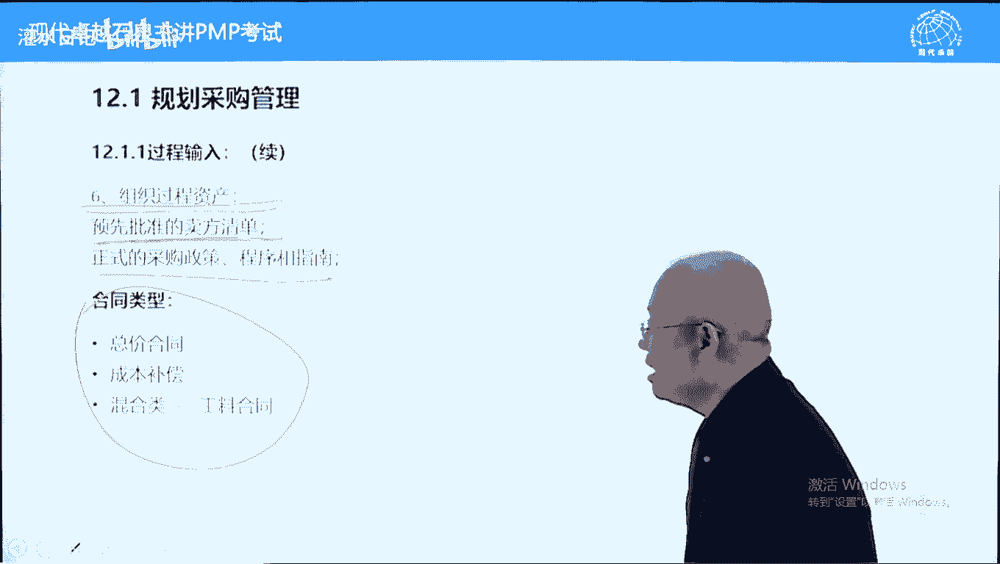

成本补偿类和公链类合同，我们先翻一下书，书上呢关于这三类合同的说法很有趣，我们呢注意一下，在第471页，471页的第三个小黑点，第三个小黑点第一行念一下啊，所有法律合同关系。

通常可以分为总价和成本补偿两大类，他没有直接说三大类，后面又说，此外还有第三种常用的混合类合同及工量合同，他为什么不三个一起说，而分开来，这样说有点分，我们很熟悉这种说法，鲁迅用过的。

鲁迅呢在一篇文章里面说，院子里有两棵树，一棵是枣树，另外一棵还是枣树好，这个呢阅读理解里面经常有这样的题目啊，这反映了什么，作者为什么要这样写，这反映了作者的苦闷心情，难道写偏不可的人也很苦闷。

需要这样写吗，不是这个意思啊，这种写法指的是前两类合同是主流合同常用的，第三类合同，不得已情况下才使用的，它不叫主流合同，为什么说前两类是主流合同呢，前两类合同对于买方都有保障，什么保障买方验货付款。

你结果没有实现，买方可以不用付款的，但是第三种对于买方没有保障。

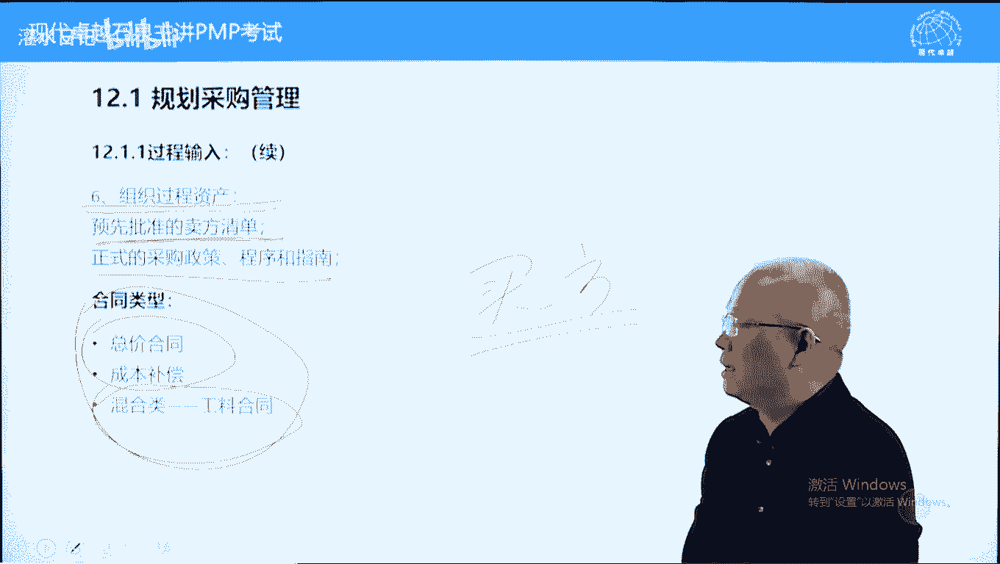

第三种的话呢，卖方旱涝保收，它是按时间收费的，按材料收费的，卖方的责任几乎没有没有，卖方不是不承担什么责任的，比如说医院里面病人病没治好，死掉了，医药费用能不能不结，不能不结，必须要结的，为什么呢。

我们跟医院都是公立合同，打官司，官司打输了，律师费用能不能不给，不能不给，因为那律师费用也属于工量合同，有人说，为什么这么不合理的合同我们还要用呢，因为有些工作卖方的作用非常有限。

你要签订成本补偿或总价类合同，它的结果的话呢不是由卖方决定的，所以卖方无法保证验货付款，保证买方验货付付款的这种情况下呢，卖方的作用非常有限，为了让卖方加入，否则卖方不加入了，我们呢要使用一种工量合同。

比如说介绍对象，我们是按照次数介绍一次给一次钱，介绍一次给一次钱，你不能说按照结果谈成了再给钱，那婚介公司都要倒闭了，包括一些咨询项，跟治病一样的公司，能不能能不能把姑送体解决，很多情况下跟治病一样对。

能不能治好，取决于病人本身，取决于公司公司本身的问题严重不严重，而跟咨询公司的关系的话呢，非常有公司，咨询公司的作用很有限，这种情况下呢，咨询公司一般都是签工量合同，我给你服务，你要做让我做什么做什么。

然后呢我按时间来收费，能不能治好，那是你公司的问题，咨询公司相当于给公司看病，跟给病人看病类似的，这种情况下，用工量合同，供量合同的话呢，一般是迫不得已的时候才使用的，具体什么时候使用。

我们呢一会再说一下，总价类合同指的是有总价不能超过超过部分，卖方承担成本补偿的话呢，对于卖方而言就好很多了，总价类合同对于卖方非常不利的，卖方承担所有风险，超过这个价格，你自己承担，买方汉满发什么呢。

验货付款结果来了，我给你这个签合同的签订风险都是卖房的，而成本补偿合同的话呢，卖方的风险小多了，只要成本是合理的，买方必须要支付，叫成本必须支付，而卖方利润呢，大家双方协商。

我们有不同的标准来给卖方支付利润，但是呢从成本角度来说，卖方不承担成本风险，而总价来合同呢，卖方什么风险都要承担的，最后一种供量合同，卖方几乎不承担任何风险的，按照时间，按照材料收费的，有多少算多少。

为什么它叫混合类合同，我们先说一下总价类合同，它这种封口合同风口的有限有限制的成本，本查合同是一种开口合同，没有限制的成本，必须要报销好，混合类合同，结合两者的这个特点了，首先单价确定好的单价封口的。

比如说一天多少钱，咨询公司这个人给你派过去一天多少钱，我一个月10万块钱，你随便用单价封口的，而利用多长时间，不一定时间的话呢，决定总价，所以呢从这个角度来说，又是一种开口的合同，这三种合同的大致对比。

我们这样对比啊，下面呢我们看一下详细对比，首先说总价，联合同这类合同对买买方的保护最好，买方呢最喜欢用这种合同对买方保护最好，尽量的使用总价类合同，但是呢使用总价类合同有重要前提，有一个重要前提。

什么前提呢，就是范围定义非常清楚，防止买方上当受骗的，如果范围不清楚，使用总价总价类合同，买方有可能上当受骗，因为从南京到北京买的没有卖的精，买方卖方信息不对等的，卖方专业，一些买方不专业。

比如说买古董，所有的古董交易都是总价类合同，一个盘子有可能值呃，明明朝的明宣德年间的值50万，也有可能只值500块钱，现在做的你能不能看清楚，对你来说范围清楚不清楚，取决于你的专业能力，你专业能力强。

比如说你是马未都，你一眼就能看出来真的假的，是不是勾不勾带，对你来说发挥清楚，那这个应用总价来合同能保证你的利益，如果你水平不够，你根本不懂古董，根本鉴定不了，那你对你来说范围就不清楚，你用总价来合同。

你可能吃亏上当，那这时候怎么办呢，成本补偿合同好一些，你当成新的东西来买，当成一个一般的盘子，高端高端一点的，300块钱，500块钱，你买一下这个呢是可以的，如果是5万块钱标价，你不要碰它，为什么呢。

因为你不专业，不专业的时候，我们呢按照成本价来去买，按照成本补偿可能会好一些，总价来合同有范围定义很清楚，在某些情况下范围定义清楚，其实也说的什么呢，买方很专业，买方不专业的时候，范围呢很难说清楚。

不清楚啊，买房很专业，这种合同对于买方而言风险最小，大家注意一下，风险最小，考试中经常说风险最小的合同，总价类合同好，总结下来，合同又分为三种，最安全的是完全固定总价叫firm fixed press。

press，firm，pig firm fixed price，完全固定总价，一旦签订之后，价格不能改变的，这叫固定总价合同，买方最喜欢的最对的，有利于买方，条件是范围清楚，效果的好处是风险最小。

对于买方而言风险最小，再强调一条，商业社会所有交易规则都保护买方，因为买方处于一个弱势地位，或者说买方他呢不专业，另外一个呢商业社会的繁荣主要靠买房拉动，没有买方，没有卖方的，但是只要有买方。

肯定有卖方的，所以呢合同的选定，包括合同条款的提供，都是买方买方选合同类型，买方提供合同条款，买方提供合同，这是一个基本原则，买方提供合同的，对于mac而言，只能接受他没有条件。

这个选择合同的总价类合同对于买方而言最好，其次呢叫总价加激励费用，它呢有一个浮动空间，在这个空间之内可以浮动的，它有一个天花板，天放价格上限价格它的目的是什么呢，它设定上限了。

它的目的是让买卖双方的利益一致化，来促进卖方来满足买方的需求，卖买方需要价格低，你帮我价格成本做低了，我呢给你奖励，买方希望质量好，你质量好了，我给你奖励，买方希望速度快，你提前完成了，我给你奖励。

就是我们可以有一定奖励，但是有价格上限不得超过上限，超过上限都是由卖方来承担的，第三种呢叫总价加经济价格调整合同，这种合同呢有一个特点叫周期很长，而且的话呢可能涉及到不同货币支付，什么叫不同货币支付。

在偏僻考试中有一种默认货币，什么货币，美元dollar啊，北美人出的题目啊，美元的话几乎是所有货币的，叫比价基础或者说计量基础，美元我们前一般来说当成它是不变的，相对于美元，其他货币都在变，汇率在变化。

所以呢当使用不同货币使用美元的时候呢，要考虑一个周期长的时候，它有一个价格波动，通货膨胀因素，另外一个呢周期很长的时候，某些原材料价格它会波动比较大，比如说刚才的价格，水泥的价格，包括呢铜的价格。

石油的价格波动会比较大，如果我们把原材料价格波动很大的，也牵成固定总价不能变的，随着项目的开展，价格如果发生重大波动的时候，对于买卖双方都不利，在这种情况下呢，我们呢采取一种方式。

原材料价格或波动比较大的，这个这个叫叫物质的价格，资源的价格，我们呢给他设定一个空间，比如说刚才我们这个项目中，项目需要3年时间，3年时间都需要钢材，而且不是一次采购采购，其他需要不断的采购的。

我们约定一个价格预定多少呢，比如说4500美元，4500元人民币啊1吨，这是一个标准价格，好我们设定一个上下浮动空间，300元上下浮动300元好，300是多少呢，4200~4800，如果在我们3年期间。

钢材价格的波动范围在4200~4800之间，我们呢都按照4500来去结算，这个呢不变，如果价格超过了4800或低于了4200，合同里面有规定，我们呢按照合同约定来去看这个价格怎么算。

并不是都是卖方承担或买方来承担的，那这个呢看合同里面怎么约定的，这个叫总价加经济价格调整合同，目前考的比较多的就是跨越几年，跨年的，这样的话呢价格波动会比较大一些，对于这种价格波动比较大的材料呢。

我们呢要进行一个约定，大概是这样约定的，知道就可以了，这个呢是总价类合同，它都有一个总价，第三个的话呢只是个别材料它会波动的，下面呢我们再看成本补偿合同，成本补偿合同一个原则，成本必须报销。

卖房成本必须报销，不能推诿的，而买方有权利，但是呢只要是卖方提供的真实成本，买方必须要报销，从这个角度来说，卖方的风险要稍微小一些，什么时候使用呢，合同执行期间会有重大变更，什么意思，范围有风险。

有不确定性，范围有风险，有不确定性才会出现有重大变更，就范围不是那么清楚，前面范围定义清楚啊，范围不清楚的情况下，那这个价格波动就比较大了，比如说我做一个网站，网站这块的话呢，我现在的想法不完全成熟。

要根据你开发的过程中，或者说市场的一个变化，市场的一个需求，我来提出新的要求，这个范围呢并不是说非常清晰的，再后来呢可能会变化，这种情况下，用固定价合同是不利的，对双方都不利，买房也可能吃亏。

买方也可能吃亏，买房根本不接受，这种情况下呢，用成本补偿合同比较好一些，成本实报实销，你帮我开发的文案工作量先给你付成本好，付完成本之后呢，利润另外支付，而成本补偿合同它的变化有三种类型啊。

它的变化主要是根据卖方利润怎么样支付，来来设定的，这里面说的费用指的是卖方利润，专指卖方利润，卖方不能白干，要有利润拿，其实呢成本抹茶合同有四类，有成本加固定费用，有成本加百分比，也成本加成。

合同成本加版本没有写，大会呢我们一个例子例子计算题里面有的好，先说一下成本加固定费用什么意思，成本实报实销，卖方的利润是一个固定数值，无论成本多高，卖方的利润就这么多，这叫成本加固定费用。

另外一个呢叫成本加激励费用，成本实报实销，卖方利润的话呢是一个固定值，再加一定波动范围，而这个波动范围呢跟卖方的绩效挂钩，比如说跟卖方的成本，你成本帮我节约了，我给你另外奖励额外奖励的，这有额外奖励的。

卖方的利润有额外奖励，根据卖方绩效绩效呢可以基于成本，可以基于时间，也可以基于质量，你提前完成了，你质量比较好，我给你额外的激励，还有额外的激励啊，第三种叫成本加奖励，这个奖励呢是主观的。

像给小费一样的，而且卖方不能申辩，给多少，你得收多少就可以了，这种情况呢我们考试中选的很少啊，除非只能选成本补偿合同，而成本补偿合同呢就这一个成本加奖励啊，这个呢选它一下，一般情况下什么补偿合同呢。

我们成本补偿加奖励费用的，我们一般不选的主观笼统绩效标准给卖方利润，什么意思呢，像给小费一样，想给多少给多少，看心情了好，另外呢我们在讲工料类合同，工量呢也叫工时材料合同。

tnm tab and materials tnm，成本和时间，工时和成本，按照时间收费，按照原材料收费，举个例子，比如说铺地板，我可以一口价，就是这种地板这种规格的，包括铺连铺带材料。

600块钱一平米，这就是公式材料合同，你呢铺多少，买了600块钱一平米，你铺多少给你算多少，铺多少算多少，铺完之后呢，我们算面积之后，然后呢你给钱就可以了，这也是供量合同，购量合同呢叫混合类合同。

它同时具有总价加成本补偿的两个特点，另外一个呢工量合同什么时候使用，注意一下，没有发文说明书的时候，没有工作说明书，就是没有i sow的时候，i s w呢在采购中，就是我们采购什么这个范围没有它的时候。

我们呢可以采用工量合同，咨询类的项目更多是这样一个情况，比如说公司呢要上一个大项，这个大项目的话呢范围不是很清楚，或者说呃国家可能有新的政策，这个政策的话呢也有可能很快批下来，也有可能拖的时间长一些。

我们呢要先着手开始准备，我们自己的管理能力比较差，我们说ibm或者从爱立信找一个这个专家，既懂管理又懂技术的人来参与主持这个项目，那这个人的话呢，我们跟爱立信签的什么呢，签的是买卖人的合同。

这个人一个月10万块钱，我给爱立信或者给ibm，然后呢具体干什么我们来说了算，那因为现在的话范围没有范围，不知道国家最后批的结果是什么样一个结果，我们呢只能与时俱进，跟跟着政策的一个发展。

我们的决定要做什么事情，做什么事情，但是呢这个人我按照工量合同来去付款，就可以了，做什么我说了算，他呢对结果不用负责任，我们呢呃安排他的工作，这是没有sw的时候要采用工量合同，那还有呢考试中有特点。

单价确定了总数量不确定，单价定了啊，总数量没有确定的情况下，也是使用工量合同，还有一个考试中考过的可行性研究，可行性研究的时候也用工量合同，为什么呢，他有可能随时叫停，也有可能呢可行性可以。

我们继续跟着做一个项目了，这个时候呢我们外包的时候呢，用工量合同比较好一些，为什么呢，范围不是很清楚，我们到底要做多少工作，走一步说一步的范围不清楚，没有范围，我们呢用工量合同这个呢要注意一下。

它是一种补充合同，这种情况下卖方不对，结果负责好，下面呢我们结合三种合同的优缺点，我们来对比一下，站在卖方角度，我们来对比三种合同的一个特点，这个对于考试来说是比较有帮助的，加深我们的理解。

首先一个对于范围和变更的关注，卖方哪种合同，卖方根本不考虑范围，也根本不考虑变更的呢，供量合同tnm啊，因为你让我干什么，我干什么，我呢按时间收费的，这个范围变更对我来说无所谓，那什么合同。

卖方对范围变更特别特别敏感呢，总价类合同如果范围变更了，你没有要到钱，增加成本了，谁来承担，卖方自己承担，所以呢他对于范围变更很敏感，任何变更他都要问你索赔，要钱的，他都要钱的，任何变更任何范围变化。

他都会要钱的，所以他对范围很敏感，另外一个对时间的关注，哪种合同卖方希望时间越长越好呢，那肯定是供量合同了，供量合同时间越长呃，卖方呢越有保证，他希望一辈子干不完才是好的，什么合同，卖方希望尽快完成呢。

还是总价类合同，因为早完成也这么多钱，网完成也这么多钱，他希望越早越好，能做下一个项目了，对成本关注，哪种合同成本跟他没关系呢，还是供量合同，成本都是你的，我都不贴钱的。

哪种合同对成本最关注的还是总价类合同，在总价类合同中，卖方每节约的一分钱成本都是卖方利润，你挣的钱未必是利润，你节约的钱肯定都是利润，所以呢它的成本很关注，总价类的前期准备时间，哪个不需要准备时间。

公告类合同不需要准备时间，范围没没确定，没关系的，我把人的单价搞定就可以了，干什么，那我们边想边做就是了，哪种合同需要时间很长的总价类合同，它需要范围明确，事无巨细都要很清楚，每个价格都有依据的。

否则呢总价报不出来，他希望范围越清楚越好，所以呢准备时间比较长，像e p c总承包合同etc啊，他的合同签订时间一般来说比较长一些，因为什么呢，比如说一个火电厂的600000千瓦火电厂的。

它的一个总包合同会有多少页呢，a4 至600页以上，有可能这种情况啊，为什么呢，他要事无巨细都要写得很清楚一些，2014年2015年15年啊，中铁在墨西哥中标了一个项目，叫墨西哥的一个高铁项目。

标的呢290亿美元，290亿美元啊，好了这个项目呢被叫停，后来呢直接取消了，因为国内的的美墨西哥，他的这个国内的政治不稳定啊，这个项目呢太大了，被取消掉了，取消了之后呢，中铁集团索赔，因为什么呢。

因为中标了，人家中标之后，你取消人家有资格索赔索赔的，为什么呢，买方虽然可以没有原因终止项目，但是呢要补偿卖方的损失，卖方在这个过程中有没有损失呢，有他们做标书做了很厚，花了很多时间。

那你在补偿间做标书的一个钱，标书做多后呢，那个中铁呢是索赔1亿多人民币，一个亿啊，1亿多人民币啊，1亿多美元，1亿多美元，最后呢墨西哥赔了1亿多人民币，那中铁呢还是亏一些了。

为什么中铁要索赔1亿多人民币，墨西哥还赔了1亿多呃，中铁要索赔1亿多美元，墨西哥还赔了1亿多人民币，因为标书知道多少吗，有1吨多，光标书的重量有1吨多那么重，不要说多厚了，用重量说1吨多，为什么呢。

这个标的太大了，而且是总承包项目要求范文很清楚，所以呢这个标书这块要做的很详细，这个呢总总价廉合同需要时间最长，好利润，哪种合同有可能获得最高利润，卖方有可能获得最高利润呢，要跟风险成正比，风险越大。

利润是越高的，那哪种合同卖方风险最大的，总价类总价类合同卖方的风险最大，利润呢也最高，为什么呢，总价类合同的利润是不透明的，虽然卖方跟你说这个成本这个成本，但是呢真实的有有没有这个成本，那不一定。

比如说满微软的windows软件啊，买正版的话呢，最早的时候将近2000块钱，一个一个一个一个一个一个一个一个叫授权，一个账号，现在可能得400多，但是呢对于微软而言。

现在它这个软件windows软件有没有成本呢，可能是零成本，为什么呢，因为成本早就分摊掉了，该赚的钱都赚完了，所以呢他能获得这个最高利润，它的可能全都是利润了，包括卖菜的，到了下午的时候。

菜价比批发价还便宜，为什么呢，零成本总价类合同的话呢，它的成本不透明，他有可能获得最高的这个叫利润，包括外贸的尾单也都是给钱就卖，那那个呢低于成本价的，低于成本价呢，因为什么呢。

总价类的对他来说可能没有成本了，成本是零给钱就就是就是赚钱的，总价类合同，卖方风险最大，有可能获得最高的利润，下面呢我们继续再看几种合同的计算，这个内容呢属于考点内容啊，但是呢大概1年多考一次。

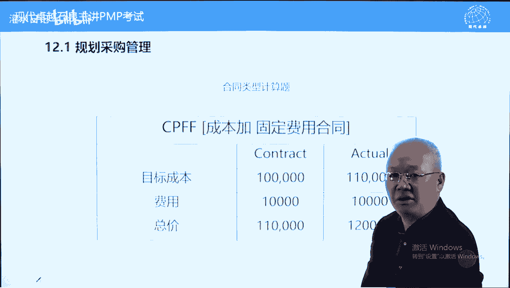

最近呢116版上来之后呢，第六版上来之后呢，呃这种计算呢考得很少，几乎还没有啊，但是呢这属于考点知识，我们必须要了解的，第一种叫成本补偿加固定费用合同，再说一下这个费用专指卖方利润。

卖方利润设定好的成本必须要报销，只要是卖方证明成本是真实的，你必须要报销的好，我们来约定一个目标，成本意义不大。

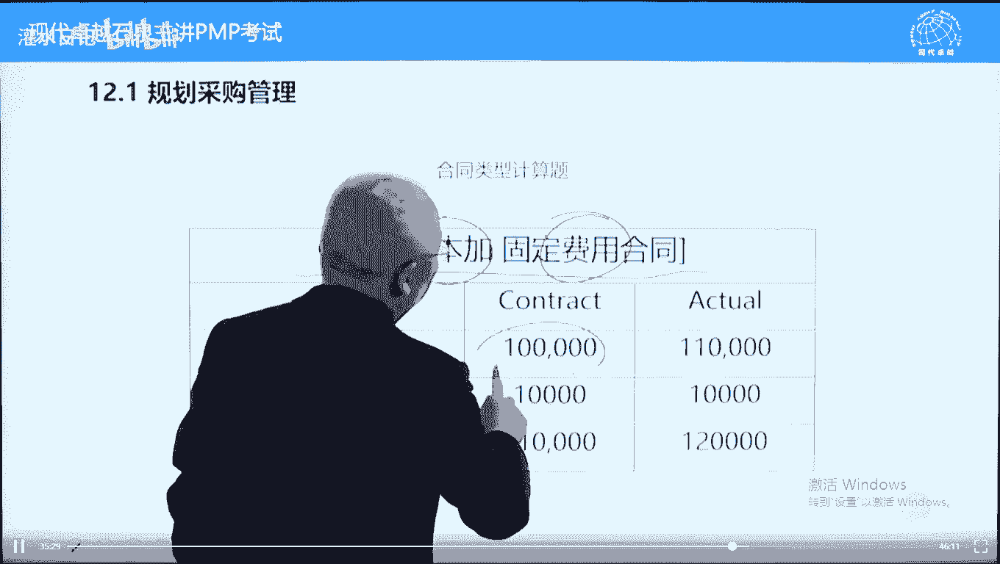

这个没有意义的，约定一个目标利润，卖房卖这个理，这个很有意义的，这个很很很重要的一个数值好，当实际成本是11万的时候，11万要给利润呢，卖方利润1万块钱也要给，那我们给卖方多少钱呢。

实际成本加利润等于12万，能理解吧，给卖方的钱等于实际的成本加卖方应得的利润，就等于12万，这种比较简单了，我们下面再看一种叫成本加百分比，也叫成本加成合同，这个成就百分比。

第三成本加成合同好约定一个目标，成本意义不大，约定一个利润的百分比，就是这个利润百分比，用它来去乘以实际成本作为卖房利润，这种方法对于卖方是有好处的，为什么呢，卖方的利润水涨船高，所以卖方在这种合同下。

他有积极性，他愿意多做，做得越多，它的利润越高，当实际成本是11万的时候，用110000x10%，卖方利润11000，给卖方多少钱呢，实际成本加卖方利润等于121000，比刚才多1000块钱，为什么呢。

因为它是按照百分比来算钱的，这种合同注意在北美政府禁止采购，而禁止政府采购。

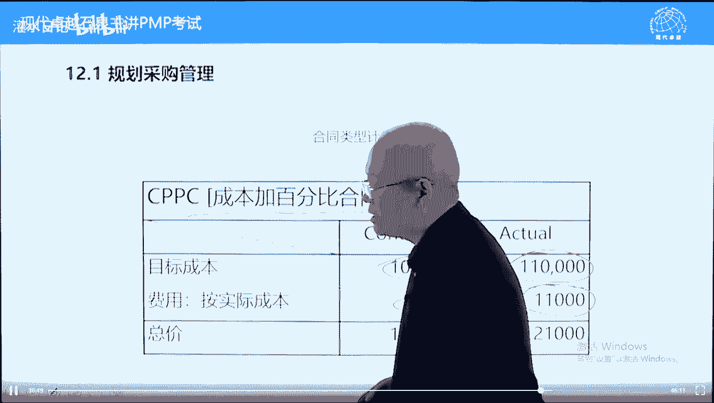

禁止使用政府采购，禁止使用成本加百分之合同，为什么呢。

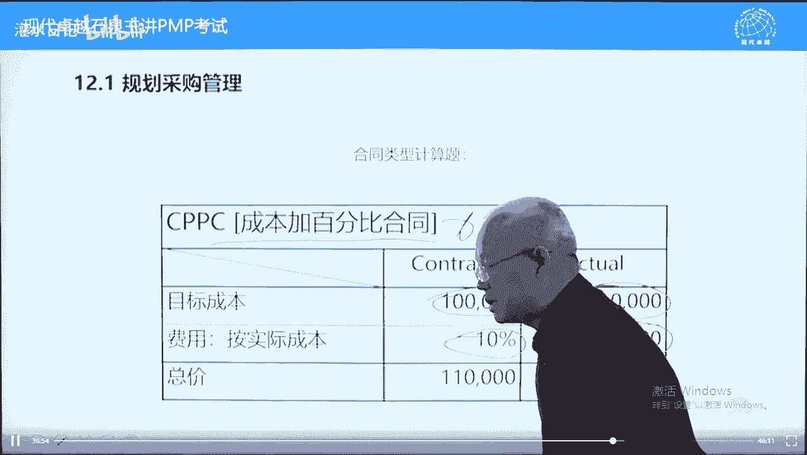

它会导致卖方恶意增加成本来获得高额利润，民间可以考虑的，政府采购明文规定禁止这种合同类合同的使用，好也了解一下，下面我们再看技术含量比较高的叫什么呢，成本补偿加激励费用，刚才讲过基地费用呢。

它的目的是要让买卖双方的利益一致，来提高卖方在满足买方需求方面的一个积极性，好一般来说呢通过成本，通过质量，还有一个进度来进行进行一个激励，和绩效指标有关系啊，约定一个目标成本，这个目标成本有意义的。

很重要，对比的依据，预定一个目标利润也有也很重要，也很也很重要的，不是随便，不是说没有意义的，再预定一个分成公式，什么叫分成公式，如果是低成本超过了目标成本超出部分，双方按这个比例来分摊。

如果实际成本低于目标成本节约部分，双方按这个比例论坛问一个问题，这种比例呢永远是一大一小，不可能是50 50啊，一般80 20 70 30都比较多的，一大一小谁占大头，谁占小头，猜一下好，我们呢这样想。

我们想超额超支了，如果成本超支了，这个成本花在谁谁身上了，谁应该占大头呢，花在买方身上了，买方应该占大头，比如说最后12万超值2万，超值2万呢，双方要分摊谁应该承担多的呢。

买方承担多的这2万块钱花在买方身上了，结果还在还是买方掌握的，所以一个默认条件，大头是买方的，小头是卖房的，小比例是卖方的，这是个约定，考试中如果出现这样的题目，不会有特殊提醒的。

这是一个约定标准的合同类型，我们看实际成本，当实际成本是8万块钱的时候，80000-100000，集约2万，结余这2万怎么办呢，双方85 30来分分给卖方多少钱呢，分给卖方3000。

要多给卖方3000块钱，那卖方的1万块钱利润要不要给呢，也要给，所以呢八八万加10000+3000给卖方多少钱呢，93000块钱，93000啊，这是第一种情况，第二种情况，超支2000块，两。

两两万块钱，12万，超值2万，双方呢按80 55来分摊，要从卖方利润中扣扣多少钱呢，扣2万块钱的15%，在这儿要减3000，然后这1万块钱也得给人家完成工作了，就得给啊，12万啊，不是1001万。

120000+10000-3000等于多少呢，127000，127000能理解吗，就这样一个意思啊，啊这个呢是超支节约了，这是超支了，按照公式来算，公式呢大家可以总结一下，给卖方的付款，我们叫付款吧。

出卖方等于实际成本就是8万或实际成本，我们写这个成本加目标利润，目标利润我直接写个目标利润，再加括号，实际啊，目标减实际啊，目标成本减实际成本，木成减十成啊，然后呢乘以小的百分比百分之小。

我们刚才90030 27000都这样算的，给卖方的钱永远等于实际成本加目标利润，再将目标成本减实际成本乘以小调mb，如果节约一减是正的，要给卖方奖励，如果是超支一减是负的，应该从卖方利润里面扣好。

这个内容呢，知道这个公式就可以了，也比较简单，即使不知道公式能算出来结果也可以了，下面呢问一个问题，如果卖方的实际成本不是8万，也不是12万，是100万，我们给卖方付多少钱，卖方是一什么。

100万付多少钱，有人在算了啊，这个呢没有必要算，如果这100万成本是实际的，就给卖方付100万，因为到16万多的时候，卖方利润扣完这种合同呢，卖方只承担利润的风险，利润渴望为止，成本必须报销。

这个呢就是它的收益跟风险是相当的，他能够享受这么多收益的话呢，他承担的风险也就这么多，成本实报实销，卖方的利润扣完为止，所以当实际成本是100万的时候。

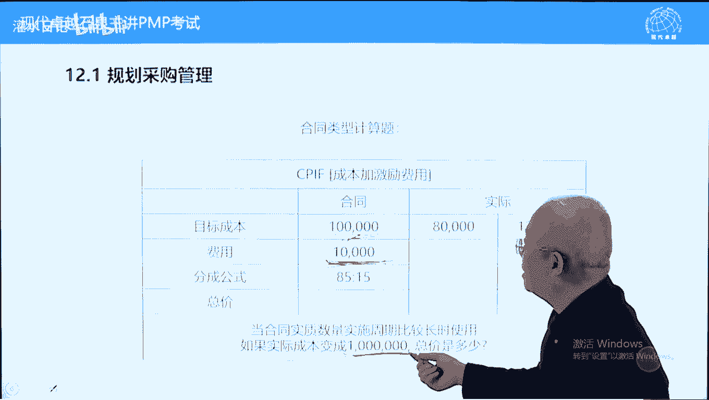

买方付给买，买方付给卖方就付100万，但是呢这种情况对于买方而言非常的危险，或者说非常的不合适，风险很大，那怎么样防止这种情况发生呢，有另外一种合同叫什么呢，总价加激励费用合同。

这个合同呢跟前面的成本补偿加激励费用合同，非常接近，只不过多了一条，为了防止出现100万的这种情况，它多了一个天花板价格，他预定一个天花板价格，什么意思呢，我们按照刚才公式算。

如果算到最后我们付给卖方的钱，如果超过了天花板价格，就只按天花板价格向卖方付款，超出部分卖方自己承担，这样的话呢，买方的风险被减到减，减小了买方的这个风险呢，呃得到了一个应对。

或者说呢买方的利益呢得到了一个基本保障，就是买方最多付天花板价格，超出部分由卖方自己来承担，其他公式都一样啊，我们先看一下这个例子，改了一下，这个前面不变啊，分摊比例70 30了，小的由卖方承担。

大的由买方承担，实际成本是8万的时候要加奖励卖方6000块钱，这1万也得给他8万，加10000+60096000，没问题吧，105000的时候多出5000块钱，要从卖方利润中扣扣1500，105000。

加上1万再减5000，113500，这两个值都没有超出12万算多少，给多少，第三种情况好，实际成本是13万，超了3万应该扣9000，扣完9000之后，130000+10000再减9000，等于十呃。

等于13啊哈等于131000是吧，等于131000啊，等于131000，13。1万，按照成本补偿加gdp合同应该付给卖方13万，131000，但是呢由于131000超出了12万，所以呢按照最高限价来付。

只付12万就可以了，这个呢叫固定价加gdp合同，多了一个天花板价格，这几个例子呢要能够掌握，下面呢我们做一道练习题，这个题目呢首先说是成本补偿加激励费用。

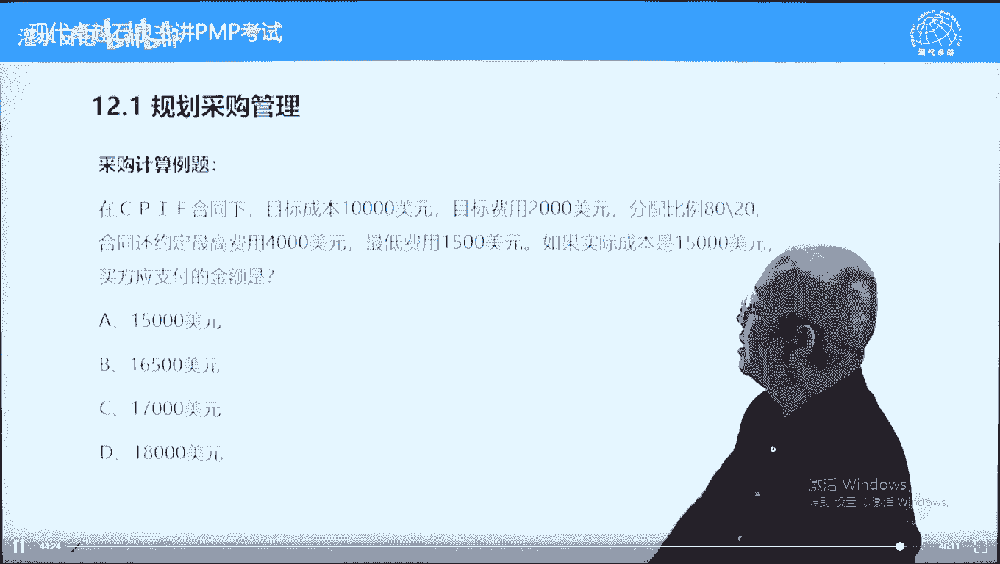

合同条件的，刚才跟成本补偿那个差不多的，有目标成本，有目标利润，有实际成本，但是呢多了一条，多了一个什么呢，有一个最高的费用约定和最低费用约定，什么意思呢，卖方的利润最高不得高于4000。

最低不得低于1500，在合同中特殊约定要高于一般条款，当一般条款，这是一般条款跟特殊约定矛盾的时候，我们按特殊约定，不按一般条款，大家算一下，结果算出来了吗，应该选第二个，16500。

跟大家说一下怎么算啊，先用基本公式，实际成本是15000加目标利润2000，再加括号啊，目标成本10000减，实际成本15000x20%，20%，20%，这样写的等于多少，等于16000。

186选项里面没有，如果选项里有16000，估计很多人做错了，这个原料能不能给，不能给，为什么呢，它低于了合同中的一个特殊约定，特殊约定，如果给卖方16000，他的实际成本是15000。

给卖方零万六的话呢，卖方利润只有1000美元，低于1500，那怎么办，按照最低利润给卖方支付利润，那就是15000，再加1500，等于16500，好在计算题呢，现在考的越来越少了。

