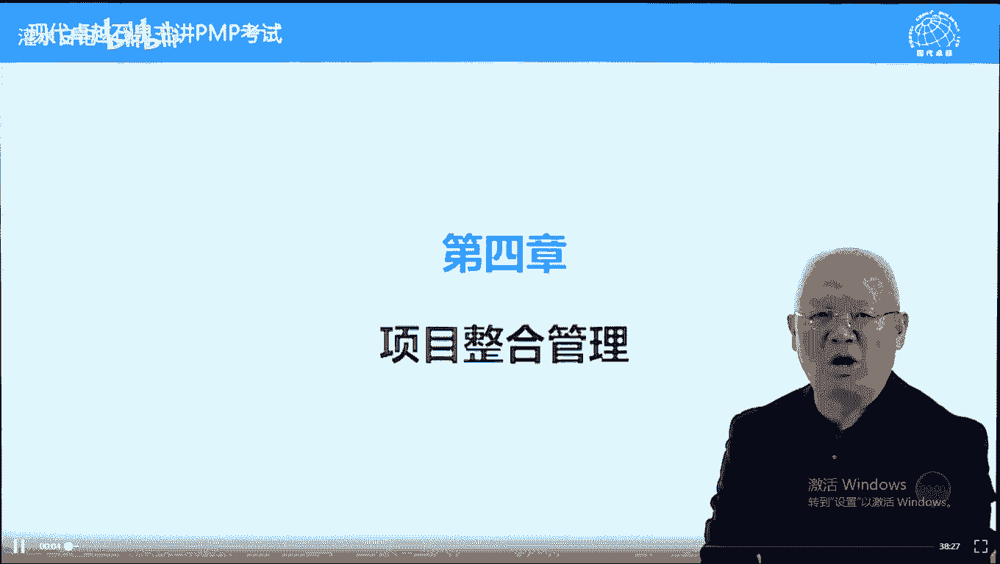
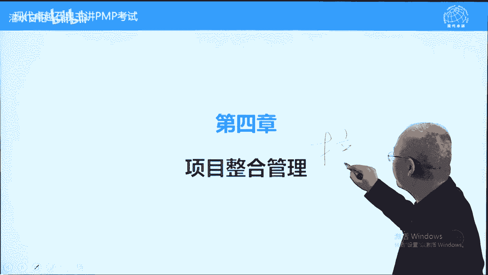
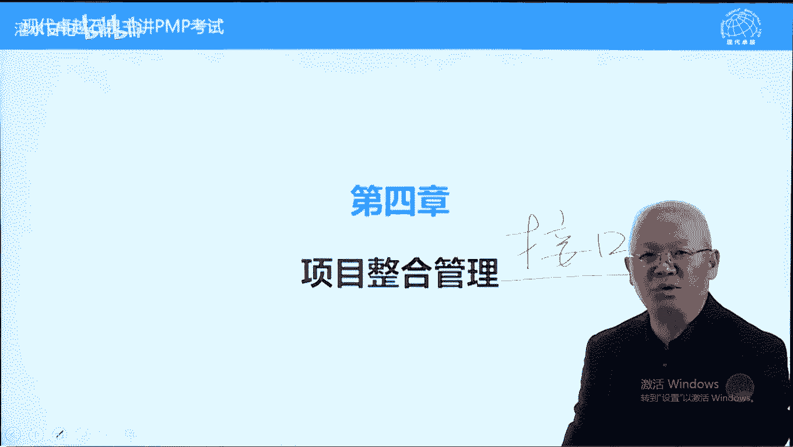

# PMP考试精讲 - P6：6 - 灌水日记 - BV1VN411w7cC

网络培训课程。

我们现在呢讲第四章项目整合管理，整合呢我们在第三章讲过了，整合接口，也叫界面。

第四章一共有七个过程，这七个过程呢有些跟整合关系比较紧密。

有些的话呢关系并不那么紧密，只是说这些过程没有办法放到别的章节里面，就放在了第四章，我们这样理解啊，首先我们看前言里面说项目你负责整合，不能授权别人，在我们这本书中有很多工作项目，你是可以授权的。

比如说问题的解决，包括跟相关方问题问题，包括团队成员之间的问题，都可以不由项目出面解决，委托给别人解决，包括风险管理的问题啊，但是呢第七章内容原则上都应该由项目亲自做，不能授权给别人，比如说制定章程。

比如说制定项目管理计划，比如说变更管理，比如说项目收尾，这些都不能授权，必须由项目里亲自来做，这一点呢很重要，跟考试有关系，注意一下好，整合内容包括什么，包括什么呢，五大过程组，49 49个过程。

包括产品技术人的接口，这些呢都是要整合的，整合通过沟通来去实现所有的共同工作，我们都可以把它当成整合的范畴，而整合的发展趋势，使用一些专业的工具，比如说进度软件。

比如说一些专业的沟通软件之类的可视化工具，一些图表，一些报表，这些的话呢都是新的发展发展这个方式了，另外一个呢传递知识，更新知识，这个是在4。5中有出现的，我们呢4。4中有出现的，我们到时候再讲。

另外呢项目接触更多工作，这个前面讲过的啊，往前往后他都可以接入往前商业分析，商业论证，参与一些最初的运营工作，另外呢混合型方法的使用，尤其是什么呢，敏捷方法，敏捷方法呢跟项目管理方法是稍有不同的。

我们前面讲过，如果我们用正步走来代表项目管理的话，以时间为导向的管理方法，那敏捷呢他更激进一些，它是快步跑的一种项目管理方法，以进行进度为导向的方法，快步跑，他呢强调拥抱变更，他呢不那么重视流程。

尤其是变更流程，我叫拥抱变更好，继续再看裁剪的概念，裁剪的话呢什么意思呢，前面讲过五大过程组私有过程在项目中，实际项目中用多少，用到什么程度，由项目经理根据实际情况来决定，裁剪的时候呢，要考虑现实情况。

这些都属于现实情况，我们就不具体展开分析了，另外一个敏捷环境下需要考虑的因素，敏捷环境它强调的是拥抱变更，另外一个呢我们讲迭代增量都是敏捷啊，随时交付，而不是说一开始规划完之后，我们呢在开始时去实行。

它是走一步说一步的，这种情况呢更加符合商业需求，尤其是在互联网产业中，它呢是要与时俱进，变化比较快，适合于变化比较快的项目，需求变化比较快的，有什么需求随时可以满足的，在敏捷环境中，项目我们前面讲过。

他更多的决策像一个服务型的领导方式，它呢起一个后勤服务的作用，负责营造环境，确保团队成员有相关的能力，而具体的规划包括执行，由团队成员来进行，这个呢我们后面还会再讲的，就是适应性考虑的因素好。

下面呢我们看第一过程叫制定项目章程，制定章程是项目经理他的责任之一，有人说章程应该是由发起人制定的对吧，不是的，章程的发布一定由发起人发布，但是呢章程的制定可以是发钱，更多的是项命令。

我们说私有过程原则上都应该由项命令来去管，理，来去控制，首先呢我们先说一下什么叫项目章程，章程在项目中有三个作用，只要具备这三个作用的文件都可以叫项目章程，有些企业呢是一个文件，有这三个作用叫项目章程。

有些企业呢是两三个文件一起拼在一起，起到章程的作用，我们呢把它放在一起，也叫章程，第一个叫正式的批准项目，它是项目的身份证，第二个呢他正式任命项命令，这里面没有写啊，一个是批准项目。

这个内容书上的内容啊，我们呢把它概括一下，第一个批准项目，第二个任命项命令，这个没有写，第三个呢叫授权，我们再写一下授权，就第二这这这个这第三个地方授权授权什么呢。

授权项目经理使用组织资源来完成项目工作，项目一旦拿到章程之后，章程在批准之后，他可以凭着章程向各个部门要人，要技术，要资源来解决项目的问题，会满足项目的需求，好这个呢是相对来说。

第三个它起到一个承诺的作用，有章程，你的资源，你的技术或者说公司对比的配合就有承诺了，好另外一个呢建立项目和战略组织，战略的联系，什么意思呢，任何一个项目都是为了实现战略目标的，那我们确定一下。

这个项目跟战略目标有什么关系，通过章程来去确认的，另外一个呢项目中需要运营部门的支持，所有的资源都来自于职能部门，运营部门的，而章程的话呢是获得他们支持的一个正式文件，另外一个呢如果我们是对外的项目。

那章程呢也是我们跟需求组织，指的是我们的业主之间的一个联系，或者说一个书面的联系，当然这个联系由于更加强大的联系，一般不用章程叫什么呢，叫合同签订合同，在签订合同基础上也有可能有章程，但是呢如果有合同。

一般来说呢就不再强调章程了，那这个时候呢合同可以起章程的一个作用，但是呢合同和章程是两码事啊，章程没有法律强制力，合同呢有法律强制力的啊，这个呢是章程的作用，章程批准之后，项目呢才能正式的开始。

或者说呢可以可以开始名正言顺的做了，这里面能有几个问题，第一个项目里的任命时间，书上说越早越好，在章程批准的时候就认命，在制定章程的时候就认命，最晚也要在规划开始之前，什么意思。

p m i美国项目管理协会特别强调，在项目管理中，所有的计划工作，所有的计划由项目亲自来做，自己做的计划，自己执行，它是有承诺的，或者说呢有保障的，有责任感的，如果别人做的规划工作。

别人做的计划由项目来做，会出现扯皮的问题，所以呢项命令它要实施项目，必须由他亲自来制定计划，最晚也要在规划开始之前，什么意思呢，他必须要亲自做计划，另外章程的编制，这个章程编制呢刚才也说了。

未必都是发行编制的，很多情况下，项命令亲自编制章程，举个例子，皇帝有圣旨，皇帝的圣旨都是以皇帝的名义，皇帝的名义发布的，奉天承运皇帝诏曰，但是皇帝很忙，没有，有人说太监，那你是明朝的剧看的比较多。

你看明朝那些事，明朝的明朝的圣旨都是由太监叫秉笔太监，这个丙比太监启禀的，在清朝不是的，清朝是翰林院的学学士，他们计算完之后，皇帝呢盖个章，以皇帝的名义名义呢来去发布出去，在项目管理中，发钱批准发布。

大部分情况这种情况这里面呢就有人提问题，既然项目章程任命项目里，那项目你怎么能用，那到底是先有项目命令还是先有项目章程呢，啊这个问题问得很好，我呢也回过来问一个问题啊，你也思考一下，我问一个问题。

先有两口子还是先有结婚证，这个问题好回答吧，一定是先有两口子，再有结婚证，否则结婚证上贴谁的照片，写谁的名字呢，章程也是一样的，项目里先内定先有项命令，那有人问了，能不能叫项目零。

的确它不是一个正式任命的项命令，但是呢可以叫项命令，就跟没有结婚证，能不能喊老公老婆一样的，答案是可以卡，只不过呢名不正，言不顺，为什么要强调这一点，这一点因为在考试中有个套路叫什么呢。

新任项命令答案选章程，只要新设项目答案中首选章程呢，为什么呢，因为有些项目命令只是领导认为已经认命了，但是呢没有章程，而我们说的这类题目，发布章程，说明在题干中章程没有发布。

而项目的话呢只是我们内地的项目，你领导认为已经认命了，但是呢并不是事实，没有名正言生任命啊，所以呢即使内定的项目，你一定要名正言顺的通过章程来去发布一下，那这个呢是章程的这个编制者。

批准发布者一定是发情，什么叫发情，在这说一下，发钱定义是为项目提供资金的人，要发起公司内部项目，是高管，当发钱，他来提供资金，客户的项目，那一般是客户来承担发钱提供资金，谁提供资金，谁是发情好。

在考试中我们有个约定，发钱强调这个词的时候，一般来说是项目里的领导，公司的高管，说到客户的时候，那是客户，客户跟发钱一般来说是有区别的，客户呢一般来说不叫发钱，发钱都指内部的公司高层的一个领导。

这样来理解啊，好下面呢我们看一下过程的输入工具和输出，这是什么概念呢，这是一个i t t o的概念，任何一个过程都有明确的输入和明确的输出，以及专业的工具来确定，防止什么问题呢。

防止你做这个事情事情的时候不专业，按照这个的话呢不会出错，比如说每一次我们在制定章程的时候，制定章程的时候呢，这些内容都考虑了，那章程的话呢一般不会有大的问题，这叫规范啊，这是一些就像当门炮马来跳。

像一个口诀一样的，我们呢严格的按照这个流程来，将来结果不会有大的问题，而且必须要输出这样的结果，要使用这些工具，但是呢到底用不用，是不是全部都用用到什么工具，你根据实际情况来决定。

但是呢你考虑的时候要全全面都要考虑啊，这些都要考虑用还是不用，首先第一个叫商业文件，题目中说呢，杀人认证不光如此啊，在山的论证之前还有个概念叫s o w，这个叫什么呢，叫项目工作说明书，写一下。

叫statements of work，项目工作说明书，项目工作说明书谁给的，客户给的，什么叫项目工作说明书，就是客户想解决的问题，任何一个项目都是要解决一个问题，这个问题一般来说客户提出。

客户提出问题之后，我们呢通过项目来帮他解决好这个问题，我们要论证一下是否可行，另外一个呢是否值得投资，一个是值得投资，另外一个呢合理性就是可行性是有没有必要，能不能做，还有一个呢是否值得投资。

论证对象都是sw，这个呢我们也可以叫问题，项目需要解决的问题啊，山认证项目你可以做，但是呢s o w一定是客户提出来的，因为那有个顺序啊，先有s w才有项目经理。

没有s w s w一般来说不会任命项目里的，这有个先后顺序，因此的话呢我们叫项目里并不起3s w，他直接接受的，举个例子，水浒传里面有一个优秀的项目里叫王婆，王婆的职业是什么呢，卖茶水的老太太。

她的正常的职业运营工作是运营工作，卖茶水，西门庆看到潘金莲之后有了想法，她才找到王婆，王婆开始兼职担任项命令，帮西门庆做这个项目，那西门庆出钱人，他是发钱，王婆呢就是一个项命令需求由发钱提出。

由客户提出项目，根据这个需求来论证一下是否值得投资，另外呢是否具有可行性，待会我们再讲可行性跟是否值得投资，的一个具体的例子了，好另外一个呢商业论证是高管们决策的依据，要不要提前终止。

都是根据杀人证来的，前面也讲过，商业论证需要重复进行，为什么呢，它受事业环境因素影响，外部环境会改变，比如说价格突然上涨，突然下跌，原材料价格上涨下跌，或者说不需要这个东西了，那这个呢根据实验证结果。

要随时重新进行决策的好，商业需求和成本效益分析，商业需求就是我们这个项目sow解决什么问题，成本效益分析考试考的比较多啊，它对应的是这个啊叫是否值得投资，是否值得投资，我们根据投入产出比，成本效益分析。

一般是减的效益，减成本看是否大于零，大于零的情况下，越大越好，除此之外还有一个呢项目的边界，就是我们这个项目做到什么程度，包括什么，不包括什么啊，天下无贼里面有一个呃，有个说法啊，天师天下无贼吧。

就是那个打劫的说这个偷东西不是他们的强项，还是打劫，不是他们的强项啊，这个呢是有边界的，要确定一下我们这个项目做到什么程度，哪些程都不做，其实也是目标，也是一个制止的过程，知道在哪里停止，知道边界。

否则的话呢这个项目做不完的好，这个呢是12月论证一个主要依据，这里面呢我们提到一个概念叫sow，第12章还会出现i s o w，但是呢不再叫项目工作说明书，叫采购工作说明书，它的本质上是一样的。

只不过站的角度不一样，我们是乙方的时候，我们的业主给我们发sw，我们呢论证一下，当我们采购的时候，我们是甲方，我们给供应商发我们的s w，让他去认证一下，对我们而言，我们是我们是业主的时候。

我们发给供应商的叫采购工作说明书，如果我们是乙方业主发给我们的，叫项目工作说明书，内容一样，但是呢角度不一样，名称不一样啊，协议就是合同，有些项目呢是投标投来的，合同是做项目的一个充分条件。

有合同必须要履行，否则要承担法律责任的，所以呢合同是上项目的一个绝对的理由，或者充分的理由必须要做的，这个呢也是呃制定章程，或批准一个项目的一个重要理由，视野环境因素指的是项目所在的环境。

包括内部外部的，比如员工情况，公司的资金情况，时间情况之类的，时间够不够，场地怎么样，天气怎么样好，这些要考虑，否则呢我们做这个项目呢，论证的时候呢可能不完整，如果说是比如伊拉克的项目啊。

那边呢战乱比较多呃，不社会是不是很不是很稳定啊，或者说不是很安全，这种项目要不要做，有一个什么呢合理性值得投资的问题了，这个也是章程的一个依据，组织过程资产是对我们项目成功有力的。

包括我们分析项目的一些经济经济学模型，也包括制定章程的模板，可以直接拿着以前的模板直接套用就可以了，能节约我们的，节约我们的时间，还有一个重要内容叫经验教训知识库，什么意思呢，前事不忘后市。

支持后事之师啊，或者说前车之覆，后车之鉴，我们呢要借鉴之前项目的经验教训，什么叫经验教学，之前项目成功和失败的经验教训，问一个问题，成功和失败经验教学哪个哪个更加有意义呢，失败的更加有意义。

成功有可能是偶然的，但失败呢都是能力不行，所以呢失败乃成功之母，要借鉴之前项目的经验教训来改善当前项目好，下面呢我们看一下工具，第一条叫专家判断，问一个问题，我们在讲到第六章，第七章的时候呢。

还会出现一个词叫什么呢，自下而上估算跟专家判断是放在一起并列的啊，哪一个专业呢，哪个工具专业，答案是专家判断比较专业，什么叫专家判断，就是有经验的人靠直觉做判断，这叫专家判断，有人说这不是很儿戏吗。

怎么能靠直觉呢，管理应该是科学啊，不对，管理中有很多是艺术方面的东西啊，艺术一类管理这一块更多的是艺术啊，管理艺术啊，行为学靠什么呢，靠实践，那专家判断指的是有经验的人，靠直觉来去做判断，下结论。

前提条件是有经验，没有经验不能做专家判断，老司机开车靠直觉，他可以边开车边听歌，边可以边跟别人聊天，甚至呢边回微信打电话都不影响，为什么呢，他靠直觉在开车，他又直觉了，而新手开车靠理智，你不能跟他说话。

你跟他说话，他就可能撞到别人车上了，他更不要说我回回回回那个微信或者打电话了，更不行了，为什么呢，他是靠理智的啊，理智呢是有限的，而这种直觉的话呢，它的强大性要更高一些，弗洛伊德说过，大事要靠直觉。

小事要理智，大势影响影响因素太多，人类分析分析不过来的各种因素都有的，小事情影响影响因素比较少，我们可以通过因果分析分析的，这样的话呢可以分析一下好，这个专家判断呢指的是有经验的人靠直觉。

注意真正的专业都是有直觉，比如说贝克汉姆踢任意球，包括张作霖，张宗昌，陆荣廷这样一些土匪出身的军阀，他们呢这个打枪的时候从来不瞄准，都是甩手一枪，为什么呢，他们都是靠直觉的，你真正瞄准不一定打打打重难。

比如说张作霖，你在张作霖传里面能看到这样一个细节，张作霖跟别人比枪法，当然这是专家权利啊，你枪法高，能当老大，枪法不行的话呢，你不能当老大，你准头不行不行的，东北话叫枪管直，当作霖枪管特别直。

他们怎么打呢，晚上半夜的时候伸手不见五指，100步之外打香头，点三根香啊，并排放打三枪，张作霖能一枪一个全部打掉，把这个枪打掉，他靠什么呢，没法瞄准，是靠直觉的，还有一个电影叫三进山城里面有个双枪。

李向阳，他有两把枪，一把枪放在盒子里面的那个带准星的，另外一把枪也是博客枪，别在腰上的，没有准星，为什么没有准星，有准星拔出来的时候不方便拔，没有准星，直接那个8000块拔出来之后直接打枪。

他开枪的话呢也不瞄准，靠什么呢，靠直觉，这叫专家判断，专家判断的专业程度要高很多，比如说某一个呃演出的大厅，装的装修的富丽堂皇的，问你一下，这个大厅装修到这个程度需要花多少钱，如果你是搞工业装修。

搞了30年的，你可能报出来大概2000万或1000万，为什么呢，你有专家判断，你可以自上而下整体判断的，但是如果你是一个做软件的，搞i t的，你从来没有搞过装修，你就报不出来，那怎么办呢。

让你自下而上拉去来去算，怎么自下而上呢，我们拆分一下地板什么材质的多少平米，座椅什么材质的多少平米啊，吊顶什么情况呢，然后呢墙壁什么情况呢，包括各种各样的灯，演出舞台什么情况呢，我们化整为零之后。

自下而上是可以算出来的，专家判断指的是靠直觉，直觉怎么来的，靠经验，我们再举一个例子啊，姜文有一部电影叫一步之遥，民国三部曲之一吧，一步之遥里面的一个片段，什么片段呢。

就是军阀的夫人跟军阀的闺女一个对话，军阀的闺女周韵演那个角色，跟军阀的老婆跟他妈说，我遇到真爱了，想嫁给一个男人，叫马走日，他老妈洪晃演的角色很不屑一顾哈，真爱你知道什么叫真爱吗，你了解男人吗。

告诉你对男人的了解是需要量的积累的，你没有积累够多少个男人不要跟我谈恋爱，多少个呢，40个，这叫什么呢，专家判断有经验，有积累，能够有专家判断情圣怎么来的，撩妹撩出来的，老司机怎么来的，开车开出来的。

这叫专家判断，没有经验，不要选专家判断，专家判断是对于项目以及团队成员的经验要求，好数据收集就是我们如何获得信息工具呢，有头脑风暴，头脑风暴呢也叫集思广益，指的是群体的力量，中国呢以前有个说法啊。

集思广益e是哪个意，这个e吧集思广益议论的意嘛，不知道这个字写的对不对啊，中国以前有个说法叫什么呢，诸葛亮会叫三个臭皮匠顶一个诸葛亮，也叫诸葛亮会，就是解放战争的时候，每一次攻坚都要开个诸葛亮会。

在以班为单位班里面开诸葛亮会啊，就什么呢，找解决方案，它能够帮助我们寻找创意，寻找解决方案的这个字叫什么呢，叫诸葛亮会，指的是我们很多人在一起在一起的话呢，大家都是可以奇思妙想，可以呢脑洞大开。

想的可以离奇一些，我们的想解决方案可以不走正道的，每个人都只能够按照别人的思路来去发挥，不能够否定批评别人的思路，这样的话呢能得到大量创意，它的关键词叫大量创意啊，他是找创意的，大量创意书上也有的好。

从大量创业中找能够解决的问题，能够解决能够解决的方案，这个呢叫头脑风暴，举个例子，80年代有一个美国的压牙膏厂，他们呢很努力各种方式促销来提高销量，但是呢到了地时间之后出现瓶颈，再怎么促销。

销量提不高了，怎么样能提高牙膏销量，有个人说，那让我们用让用我们牙膏的人每天多挤一点，那牙膏就能销量提高了，那别人挤牙膏，你怎么能控制呢，有方法看似很离奇，但是呢找到解决方案了。

大家都知道把牙膏口开大一些，每次一挤能挤得多一些，这叫头脑风暴看似很离奇，但是呢能找到解决方案的不能，某宝强调开会强调叫诸葛亮，会不叫诸葛会啊，叫诸葛亮会啊，集思广益好，我们再看另外工具叫焦点小组。

什么叫焦点小组，指的是有一个训练有素的主持人来主持，让大家激烈讨论，这个呢叫焦点小组，就是呢让大家把自己的想法都说出来，并且呢可以互相启发的，因为呢有一个人的话不一定能讲得那么深刻，那么精彩。

当有别人质疑，当有别人反对的时候，能讲得更加深刻一些，像对话栏目，中央电视台以前有个对话栏目啊，这个栏目的话呢，他故意找一些嘉宾意见不一致的，然后呢展开了讨论，主持人来去逗逗大家，本来可能意见还差不多。

但是呢主持人故事故意来逗，让他俩互相之间有一个争执，这样的话呢能讨论的更加深刻一些，焦点小组会议强调一个叫训练有素，主持人，他的讨论更加热烈一些，访谈强调，一对一可以是事先预预设问题。

事先可以写出来问题，然后呢，提到时候提问也可以即兴的提出问题来去访谈，他强调的一对一，这个知道就可以了，这个考的少，这两个考的多，另外人际关系跟团队技能指的是解决冲突，有冲突之后我们需要解决，解决冲突。

有一个原则要达成一致意见，为什么呢，人民内部的矛盾，所以有冲突要面对，要面对面的沟通，当面锣对面鼓，把事情说清楚，这样的话呢没有隐患，没有一类问题能达成一致意见，大家继续继续合作。

引导这个要说一下这个技术含量比较高一些，比比冲突管理呢高很多了，也叫引导式引导会，引导是研讨会啊，这样写一下，引导是研讨会，引导式研讨会，好直接用用这个了，引导时间讨会什么意思，如果他得它有三个特点。

先说一下特点啊，引导是引导会，也叫引导，也叫另外一个词叫推动啊，什么意思，说一下，就是多部门意见不一致的时候，跨部门意见不一致的时候，我们需要统一思想，比如说需求意见不一致，所以这个计划计划意见不一致。

那没法落实，没法敲定，就需要统一思想，当各部门意见不一致，需要统一思想的时候，由于部门比较多，我们用这种方式呢效率比较高，怎么样呢，引导人导会把所有部门人喊在一起，现场拍板，现场讨论。

这个叫引导实验大会最终达成一致意见，为什么这种效果好呢，因为解决这样的问题，我们还有另一种另外一种方法，比如说一个问题跟abcd 4个部门都有关系啊，重新写一下abcd，跟四个部门都有关系。

这四个部门呢意见不一致，我们需要找这四个部门要解决问题的，你可以怎么样呢，一个一个找，先找a部门解决内部问题，解决了我们再找b部门去解决他的问题，当你解决b问题的时候，会重新给a部门带来新的问题。

这叫什么呢，摁下葫芦起了瓢，这样的效率就低了，到最后很大的推倒重来，那怎么办呢，把这四个部门的人领导含在一起，现场拍板，现场解决各部门的利益，他们的问题都考虑到了，能够快速达成一致意见。

引导人领导会有三个特点，跨部门意见不一致，快速达成一致意见，他需要开会的好，会议管理指的是如何提高会议效率，记住两个字，凡是会议开得不好，缺少规则，有规则，会议厅都开好了，有哪些规则。

比如说会议必须事先要通知，让大家准备谁参加，谁不参加，确定好时间，按时召开，由主持人安排好流程，按流程来，不能拖延，也不能够跑题的主持人来负责，不能拖延，不能跑题，另外的会议要达成结论。

结论达成之后要写会议纪要发给所有的人，如果这个会议在会议上还要安排大家去执行，每个人都要有个承诺，我确定我答应这个条条件，答应这个要求去执行会议呢，一切看规则，会议呢不是说开得越长越好。

也不是说人越多越好，是相反，会议时间越短越好，人参加的越少越好，能不参加的尽量不要参加，这样的话呢能提高会议效率，考试的时候呢比较简单，看到会议找规则就可以了，所有婚姻问题都是去找规则导致的。

会议混乱啊，好这个内容呢就不展开说了啊，下面呢我们看一下这个这个浅滩，说一下这个会议啥意思呢，开会让团队成员参与来制定章程，这个意思啊，好下面呢我们继续再看看一下过程的输出。

并且呢发起签字批准之后发布出去，让所有人要知道的好章程，由于它具有三个主要作用，因此的话呢章程考的内容也比较多一些，另外一个呢涉及到的管理方面，问题呢也比较多一些，我们先看一下章程里面包含什么内容。

这个呢是高层级信息，我们待会再讲了，首先包括项目的目的，另外一个呢项目的目标，好目的，商业目的，解决问题的目标，实现的结果是什么啊，考试中目标重要目的没有考过，还有一个成功标准也很重要，都来自于什么呢。

这两个都应该来自于商业认证，高层级需求，高层级说一下什么叫高层级，英文叫high level，high level，不能翻译成高级，翻译成高层级可以，但是呢翻译成高层级容易引起误解。

很多人认为就是高级的，不是高级的，应该翻译成什么呢，初步的粗略的都可以啊，这个粗啊，我就在这儿写一下，初步的和粗略的，在早期不可能有详细的主要的需求，高层级也是个考点好，另外一个呢两个层级啊。

还有一个呢边界定义，我们前面讲过这个在商业认证里面有项目边界，除此之外呢，主要可交付成果，就是我们最终的结果应该是什么，交付什么结果，这个呢可以具体可以不具体，具体来说，发挥说明书才是具体的。

章程里面可能大致描述一下整体风险，也可以叫高层级风险，当然了，整体风险跟高层级风险严格来说是不一样的，整体风险是整个项目的风险，但是我们在这理解为高层级的，在项目中刚开始识别的主要风险更好一些。

总体成本进度计划，这是领导给的一个网工日期，在批准项目的时候，领导一般会先设定一个日期，你这个项目在什么时候完成，合理不合理项目呢，要通过制定进度计划来去对比一下，大预先批准的财务资源。

可以理解为总体预算，这个项目花多少钱完成，领导时间也是给你的，有可能不现实，怎么办呢，要自下而上做一个预算对比一下，如果钱不够，伸手要钱或削减范围都可以的，好关键，相关方面名单也叫初步识别的。

在章程制定章程的时候，就已经识别到的相关方名单，主要的详细的在后面才会有另外一个呢，审批要求，审必要就是谁签字确认hp的，一般来说是发钱，除了发行kp准项目之外，公司的p o包括项目组合治理委员会。

他们呢高层也可以提出这样相应的要求呢，好推出标准项目什么时候就完成，我们可以结束任务了，也是一个什么呢叫完工的标准，这个内容的话呢，我们到收尾的时候呢再讲一下，好重要的，另外一个重要的我们讲和写难题。

蓝色字部分呢都是很重要的，项目给的权利和职责，这是考试中必考内容，项目里他有哪些权利，他负哪些责任，更多讲的是权利，比如说他有什么权利，沟通方面的，人力资源资源方面的，包括呢这个叫批准方面的。

这个权利是放在章程里面的，章程应该发布给所有的相关方，让所有相关方了解在这个项目中，项目有什么权利，比如说索要资源，索要技术，决定发动机的成本之类的，这样的话呢能得到配合或者说减少冲突。

其他的话呢知道就可以了，谁批准它的植物是什么，另外一个重要内容叫假设日志，它呢应该纳入项目章程之中，什么叫假设日志，就是我们在批准项目的时候，考虑到的影响项目成败的一些因素，这些因素的话呢必须要考虑。

不考虑的话呢，想当然这个项目会出现问题的，假设日志都理解为影响项目的一些叫事业，环境因素或者叫客观因素制约因素吧，它包括假设条件跟质因素，简单说一下，什么叫假设条件，什么叫质因素。

解压成条件是这样定义的，项目成功所依赖的，而项目里又无能为力的不确定因素，比如说明天我们要开运动会，室外运动会，我们一个假设明天不能下暴雨，也不能刮大风，但是呢刮不刮下，刮不刮大风，下不下暴雨。

不是我们决定的，它是不确定事件，这个叫假假条件，当假设不成立的时候，我们呢叫假设失败，这个项目呢就属于风险发生了，什么叫制约因素，限制项目，你选择因素就是有哪些地方是南墙，你不能碰的。

哪些地方是红线禁区，你不能碰的，必须要知道，否则会碰上的，好那个举个例子，比如说这个项目预算很有限，包括抗美援朝的时候，美国总统给那个艾森豪威尔，艾森豪威尔画一条红线，你不能打过鸭绿江，炮。

火不能飞过鸭绿江，那这个呢也是一个质因素，你如果不了解，你违反了就可能出现大的灾难，所以这个呢当成风险是可以的，也可以当成一些事业环境因素，影响项目成功的一些条件限制条件，我们举个例子。

还举王婆这个事啊，水浒传里面西门庆找到王婆之后，王婆很专业，首先呢给这个项目起了个响亮名称，哪个项目呢应该有个响亮名称啊，叫什么呢，它叫十面i光镜，十面i光节啊，这个i光啥意思，可能当时这个说法。

10米还光机项目的名称，好基地这地方这个这个计策之后呢，他大概给了一个解决方案，什么解决方案呢，他去买兽医，买那个白布，请小娘子呢，请潘金莲过来给她帮她做兽医，眼睛花了，他看不见，请别人来帮忙好。

这样的话呢西门庆跟他就有见面的机会了，但是呢王婆说这个事情的话呢，能不能做成是有条件的，不是说arm狗都能做的，做这样的项目呢需要五个因素，五个条件，用现代话说叫高富帅，你有没有有没有这个群资格。

或者有没有这个条件，其实叫这个因素啊，西门庆一条条证实我既高又富且帅，至于因素都不受都都不影响，这个呢没有这方面的情况，我们说那这样这个项目就可以做了，但是呢丑话说在前面能不能做成光跟你高富帅。

这个呢只是一个叫必要的一个条件，不是充分条件，还要看什么呢，对方是什么情况，我们必须假设潘金莲是一个水性杨行的女子，如果这个假设不成立，那这个项目呢做不成王婆呢，假设了七八条。

比如说我先请小娘子来去帮我做兽医，他如果来了这个项目做，他如果来都不来，大门不出，二门不迈，很少辅导这个项目不要做了，他来了，我喊你来，你只要一来他就走了，那这个项目也不要做了，好你来了还没走。

我就张罗请你俩吃饭，我一说请你俩吃饭，他就走了，不跟你吃饭，向美不要做了，我请你吃饭，他不走，那这个项目的继续做，我就吃饭的时候找理由出去啊，我只要一出去他就走了，这个项目不要做了。

他不想和你单独待在一起的，我出去之后他没走，你试探一下，试探一下之后，他也没有反没有反对啊，没有反，没有很很很这个激烈的，这个没有什么很不很不满意吧，没有很愤怒，那这个项目呢继续做，他假设了大概六七条。

这叫什么呢，假设条件老司机都会有各种各样的假设，要考虑很全面的，而新手往往想当然，这个呢也就是为什么能解释一下，为什么电工干的时间越长，胆子越小，为什么呢，他假设的多了，而无知者为什么无畏。

他根本没有考虑到这些假设根本都不想呢，这些内容要纳入章程，我们在考试中也有，当项目早期识别了假设条件，知因素的时候纳入章程，因为那书上也说要纳入章程好，后面呢再识别之后还要整个记录在哪里，记住呢。

在假设之中记住要不要纳入章程，那就另外另外再说了，可能是不需要的，为什么呢，章程一旦确定完之后，发布完之后，一般来说是不改变的，也不需改善的，关于章程这一块。

