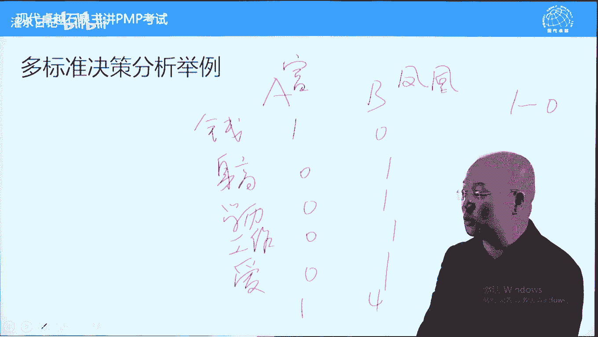
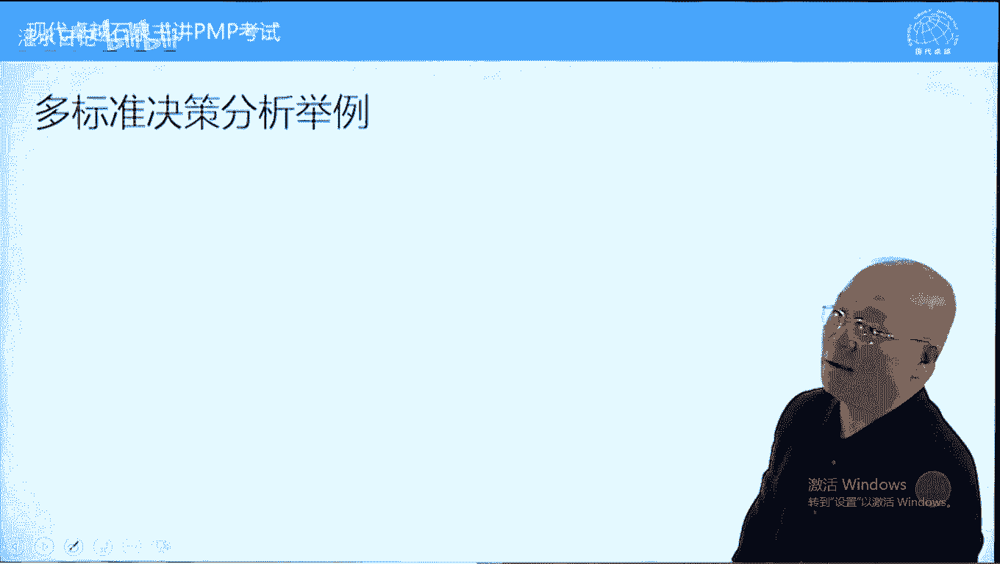
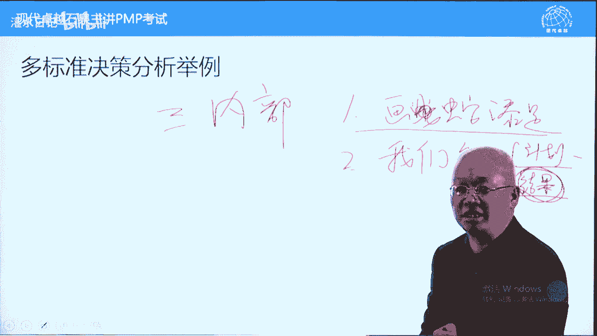
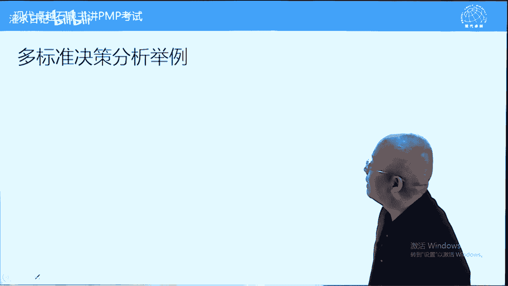
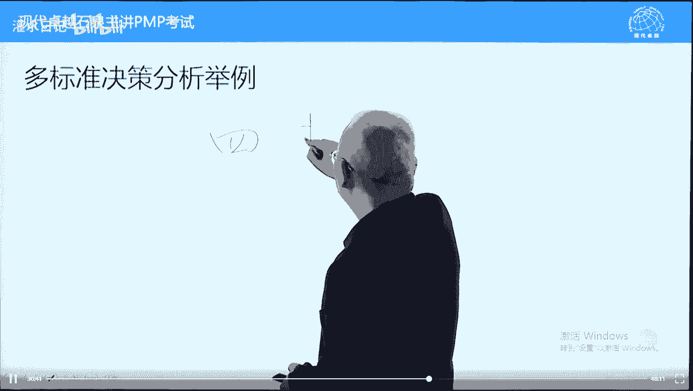

# PMP考试精讲 - P8：8 - 灌水日记 - BV1VN411w7cC

我们讲第四章的一个最核心内容，叫实施整体变更控制，为什么重要，因为项目中变更会导致失败，变更的控制呢是比较难管理的一个事情，p m p m p考试的话呢，在变更的题目中也是下了很大的分量的啊。

或者下了很大的力气的，每一次pp考试大概有50道左右的题目呢，是跟变更相关的，属于变更方面的题目啊，好这个变更的话呢理解理解起来也是有难度的，我们呢详细讲一下，首先什么叫整体。

这个整体的话呢理解为整体管理也是可以的，整合管理也是可以的，但是在这里面更多理解为变更属于牵一发动，全身不能头头鱼头脚疼医脚，再说一下控制，什么叫控制，为什么强调控制，变更不是考试，所以呢要控制。

但是呢拒绝变更也是不对的，要进行一个控制，能不变尽量不变，要减少变更，怎么减少变更两个原则，第一个叫影响引起变更的因素，什么叫影响引起变更的因素呢，比如说我们在收集需求的时候，认真一些，详细一些。

反复多次，这样的话呢来减少变更发生的可能性，这叫影响引起变更的因素，另外一个呢，我们要在变更发生的时候进行一个控制，通过控制也能减少变更，怎么样控制呢，说一下就是要设置严格的流程，流程越严格。

出现变更的可能性就越少一些了，门槛越高，呃这个机会呢是越少的，门槛低了就变更就会很多，门槛高的话呢，变更就少一些，我们这样举个例子，在西方人眼中，变更跟离婚是一样的，我们按照传统观点观点的话呢。

离婚它不是中性词，它是一个贬义词，变更的话呢也一样，是一个贬义词，它不是中性词，40年前197几年啊，197 10年代末，80年代初的时候，包括六几年的时候，中国的离婚率是很低的。

而现在的话呢大城市离婚率很高啊，可能将近一比一了，有一半一半了，有这种可能性了，40年前为什么离婚率是很低呢，原因是40年前的离婚，他门槛很高，他需要双方的单位出证明，双方领导签字同意才能离婚。

所以呢离婚率很低，门槛太高了，而现在的话呢呃九块五就能离婚，到民政局就能离婚了，偷偷摸摸也能离，别人都不知道了，为了买房子，随便就可以离个婚，离婚的门槛低了，所以呢离婚率很高。

这个呢跟我们控制变更是有关系的，设置门槛，而这个门槛呢在项目管理中叫整体变更，控制系统，也叫整体变更，控制过程，通过它来去管控变更好，我们看一下4。6管理变更的过程。

而对于变更注意一定要强调记录记录在案的，错了应该是这个啊记录在案的变更进行评审，什么意思，变更执行的角度来说，跟财务报销一模一样，财务报销怎么做，变更就应该怎么做，财务报销必须书面提交报销单。

变更必须书面提交变更请求，这是个依据，否则我们不予理睬，变更需要花钱，这个钱花的原则是谁提出变更，谁来花钱，所以呢必须要书面记录，另外任何相关方都可以提出变更请求。

而不是说只有项目里或发钱权利大人才能提出，任何人都能提出的变更，要走流程，而变更的管理者责任人是项目领，变更属于整合管理，我们前面在第四章开始的时候讲过，整合管理能不能授权，不能授权。

变更的工作必须是项目项目，你不能绕开项目，你呢什么时候有变更计划，批准之后，任何计划改变原则上都应该走变更流程好，另外一个呢变更它的这个流程呢跟报销一样，报销需要书面提交，书面提交之后要审查的。

这个审查就是合理不合理啊，我们就要分析一下变更，也要分析一下，分析完影响之后，比如出纳帮你审核一下数据，对不对，有没有超过超出标准之类的，好出纳签字之后要递交给领导，由领导来批准或否决。

而且不同的报销金额批准的人是不一样的，报销金额越大，这个批准的级别是越高的，而在项目管理中有两个批准层次，一个就是pm项目里可以批准变更，批准什么呢，非基准变更下面就可以p了，什么叫非基准变更。

三大基准的变更，我们叫基准变更啊，只要不是三大基准的，都叫非基准变更好，另外一个呢就是技术变更谁来批，涉及到三大基准的，必须由c c b来去，p c c b呢叫变更控制委员会。

在变更管理计划中由项目设置，变更控制委员会怎么组成，一般来说双方领导加专家构成变更控制委员会，它的主要作用就是批准或否决变更，这样一个作用，那基准的话呢，我们刚才讲了三大基准范围进度成本。

还有一个包含基准的计划，也是当成基准来取批准，哪一个呢，哪个计划包括三大基准呢，就是项目管理计划，它包括三大基准，所以呢项目管理计划加三大基准，它的变更必须经过c c d批准之后才能够更新。

计划才能够变更，这个呢是关于变更的一个批准，由项目在放在变管理计划中来去设置，待会呢我们再看一下，下面呢，我们看一下过程的输入工具和输出，项目管理计划两个作用，第一个呢他指导我们如何变更。

另外一个呢它对比三大基准，这里面有人说为什么不写其他计划，在考试中我们呢需要变更的计划，或者需要走变更流程的计划，一般这道题不会按照变更题目来考来考，考考大家的，不会不会按照编不会上升的变更高度。

就是三大基准的变更，考试的时候需要走变更流程，上升到变更高度的，有变更选项的，一般也都是跟三大基准相关的，好变更管理计划，它知道变更，除此之外呢，配置管理计划做一个辅助作用，什么叫配置管理。

我们待会再讲文件的文件的输入，这里面的话呢呃跟风险有关系，这个其实问题不是很大，为什么呢，影响变更的因素中有他的啊啊吸血跟踪矩阵，它主要针对范围，我们变更呢也主要是这个变更可能多一些啊。

我们看一看是不是变更有没有问题，根据这个呢可以分析一下，作用不大啊，有一个有作用的叫工作绩效报告，工作绩效报告指的是项目情况好还是不好啊，这里面问一个问题，工作绩效报告反映项目情况。

它跟变更批准与否是有关系的，项目情况好，变更容易批准，还是项目情况不好，变更容易批准呢，思考一下，答案是项目情况好的时候，变更容易批准，情况不好的时候不容易批准，就跟你要涨工资，公司业绩好的时候。

你要求涨工资容易批准，还是公司快倒闭了，你要求涨工资呃，容易批准的答案一样的，因为变更首先来说是一个负面的事情，所以呢绩效好，项目情况好，变一下不影响，如果项目面临崩溃了，你还要再变。

那可能就是压倒骆驼的最后一根稻草了，好变更，请求，我们在4。6中更多说的是，更新前三个大部分情况下不上升到变更高度的，直接采取措施啊，基准变更，改变基准的我们都叫更新它，改变计划，改变基准。

这个呢我们走变更流程，cc b来批准，其他的直接实施就可以了，直接实施什么意思，其实就是项目在批准了，因为每道题都是问项目里下一步应该怎么办，他如果直接能够批准的话，那就不需要再说批准的事情了。

直接实施就可以了，只有非就只有禁止变更，所以呢上升到变更的高度，这个呢我们呃待会讲套路的时候呢，我们再讲一下，下面呢我们看一下过程的工具，专家判断不说了，根据经验变更控制工具，这里面重点讲一个什么呢。

讲一个配置管理，什么叫配置管理，配置管理概念比较大，它呢包括变更控制，严格来说不是说变更控制，包括配置管理啊，配置管理是大的概念，配置等于什么呢，配置等于命名加变更，病名加变更啊，所以变更控制系统。

属于配置管理系统的一个子系统，我们这样写，这个叫配置啊，它等于命名加变更，什么叫命名，命名就起名字，什么叫变更名字状态发生改变的时候，也是配置管理，配置管理主要作用是区分，通过命名来进行区分的。

命名之后就能区别了，区别的目的是防止出现混乱，在项目管理中有大量可交付成果，有大量文件，这些文件可交付成果要防止出现混淆，而变更的话呢，就是有些可笑，普通果状态指数参数发生改变了，或者说名称发生改变了。

这个改变呢要严格的执行变更流程，包括计划发生改变，也要严格地执行变更流程，严格呃，它都属于配置的一部分啊，好配置管理，我们说一下什么叫命名，配置管理主要解决什么问题，它的目的是区别啊。

识别配置项技术配置状态合适，配置与审计分别是规划执行和监控过程，配置识别识别配置下是如何起名字，我们设定一个起名规则，起名字的规则，比如说车牌号，那南江苏省的车牌号都是苏开头的，南京苏a这是配置管理啊。

徐州呢是是苏c无锡好像是苏b啊，常州苏d苏州是苏e，这叫什么呢，配置规划，你在这个地方买车，你上的车牌号应该都是按照这个来的，这叫识别配置项，另外一个呢我们买了车之后，上车牌都是按这个名名字来。

这个呢叫记录并报告配置状态，那如果一辆车who开头的沪a，无论是沪a还是沪d，它呢都是上海的车，但上海有个特例啊，上海有沪c，这个coc呢在上海人都知道它不能上高架的，它不能进内环的。

那这个呢是这个它只能在普通里面开一开啊，这也是配置管理，通过配置呢来去进行区别，好比如说人名字也都是配置管理，举个人名的，刘伯承刘伯承啊，请问刘伯承在家里排行老几呢，赵飞，你知道不知道刘伯承排行老几啊。

你不懂配置管理，懂配置管理呢，刘伯承排行老大，为什么呢，中国人起名字强调伯仲书记，伯老大叫伯啊，包括博弈，舒淇听过没有，采薇啊，这两个人都是商朝的人啊，那博弈是老大舒淇呢，伯仲舒淇，淑怡应该是舒淇啊。

应该是老三了，那还有一个人叫孔仲尼，重视老几，张飞，知道吗，老二伯仲书记，这叫什么呢，这叫配置管理，通过名字就能了解对方的很多信息，包括我们看车牌也是一样的，这加配置管理，它的主要作用是区别，举个例子。

有一个人叫松下太郎，松下太郎哪里人，那肯定是日本人，叫松下太郎，日本人名字啊，那他在家里面他是男孩，女孩呢肯定男男生叫狼嘛啊，如果叫子，那就是女生啦，那在家里排行老几呢，太郎肯定排行是老大的。

这叫什么呢，这也叫配置管理，你包括上海，上海外滩呢，还有很多路，有南京路，那经过九江路，然后呢，汉口路还有福州路，呃在在在外面呢还有北京路，天津路这些路都有一个特点，什么特点呢，它都是东西向的。

东西向的路啊，啊当时1865年英国站在画了呃，就是中国给给英国呢画了一块租界，英国呢管理单管理机构叫英国的公布局吧，有租界的公布局啊，他们呢就确定在呢在这个租界，英租界给修的路的话呢，起名字的时候。

所有东西向的路都用中国的事来去命名，而所有南北向的路有什么命名呢，用中国的省来命名的，比如说西藏路，四川路都是以中国的省来命名的，这些区域呢都属于英租界，以前的英租界也属于公共租界，这是什么呢。

这也叫配置管理，配置管理的目的是防止出现混乱，进行区分，防止出现混乱的，那包括现在也有像南京的河西，它所有东西向的街都以江来来命名的，南溪江，富春江，这个包括呃白龙江，新安江，牡丹江。

所有南北向的路呢都是以山来命名的，黄山路，嵩山路，庐山路，燕山路啊，包括什么这个叫乐山路之类的，都是以山来命名的，这也是配置管理目的呢进行一个区别好，为什么还包括变更，因为呢有些情况下名字会发生改变。

不要因为名字方式改变了，我们就找不到这个东西是谁了，不知道这个东西是谁了，比如说以前有个人叫刘德荣，后来呢进入娱乐圈改了个名字叫什么，你也不知道叫刘德华，刘德荣，刘德华同一个人换个名字，换个马甲。

我也知道你是谁，这叫什么呢，这叫配置管理中的变更管理，所以变更的话呢是配置的一部分，配置的概念呢更大一些，中国人以前配置的时候不用阿拉伯数字，1234不用的，中国人不习惯用1234，用什么呢，天地玄黄。

因为呢这是千字文，天地玄黄，宇宙洪荒，千字文的话呢，它正好1000个字有个特点，这1000个字什么特点，没有一个重复的，所以它非常适合于配置，那中国人中国人经常说天字第1号，说明重中之重叫天字第1号。

因为呢配天子文，天子文来配置的时候，第一个字就是天天地循环，天字第1号说明是重中之重，这也叫配置管理，有时间你到江南贡院，南京有江南贡院，他的考棚好朋友编号全是按照千字文来编号的，有时间可以看一下。

如果你会背千字文，就能发现了好，关于配置这块呢不多说了，下面呢我们再看变更控制，它呢就是配置完之后，当计划名称状态参数发生改变的时候呢，要严格的执行变更流程，跟我们刚才说的财务报销一样的书面申请分析。

影响审批啊，好后面呢是备选方案分析，成本效益分析指的是变更的方法也很多，我们找一个性价比最高的，找最好的方案啊，他们如何确定变不变也有方法投票啊，还有呢多标准决策分析指的是考核考量。

多个标准来决定变还是不变，这个呢是呃叫呃叫什么来着，叫变更批准或否决决策的一个依据工具，而这个会议呢叫变更控制会议，这个会议注意一下，这个会议呢是因变更而召开，不是说定期召开，召开次数才能变更。

不是这样一个情况，而是有变更就开这个会，没有变更，不用开，这个会议呢完全未变更服务，而不是说我们在这个会议上才能提变更，不是这样意思啊，有变更在这个会议上来去召开，来去提出答案，好批准变更请求。

这个呢是批准的，批准之后要更新到计划里面去，要在4。3中去实施，文件更新就不多说了，在变更日中去记录变更好，这个呢是关于这个变更的书上的内容，我们呢再补充一些其他内容，其他内容的话呢。

我们呃先看一下多标准决策分析，先说一下多标准原子分析呢。

它一般用平分法，我们叫平分法。

而评分法又有三种，分别是呢呃大概两种吧，加权和非加权的，非加权的话呢也可以再细分一下，我们举个例子，加权非加权的评分，多标准决策分析就都明白了，好指的什么意思呢。

我们在决策的时候有可能考虑的不是一个因素，而是考虑多个因素。

当考虑多个因素的时候，可以用打分的方式来进行一个评估，比如说找对象。

就可以用多标准决策分析来分析一下，一家有女。

百家求，有一个美女长得很漂亮，追求者很多，她呢先筛选。

筛选完之后呢，剩下两个a和b各有特点啊。

a呢叫富二代，非常复杂。

b呢凤凰难，什么叫凤凰男，自身特别优秀。

家里农村的很穷，自己又是老大，负担很重的。

但是呢这个人无论学历还是长相都非常好，但是呢家里面穷得不得了啊。

这两个人呢美女取舍不下。

找到我说让我能不能帮着来做个决策呢，我说可以啊，我们有多标准决策分析来试一下，你考虑哪些因素呢，美女列出五条因素考虑因素，一个呢有没有钱，另外一个呢身高，学历，呃工作体面不体面。

还有爱不爱我五个方面，我说可以啊，你呢这样的这两个人，你分析一下呃，我们呢先用一种简单的叫一零标准。

也叫零一标准，每一项内容中只有一个人得分，另外一个人不得分，不得分就是零啊，美女打一下分。

一分零分零分一分零分一分零分一分。

零分一分，相对答案加一下之后。

富二代得一分加在一起啊，凤凰难得四分，按照这个标准，应该找这个凤凰男。

不应该找富二代美女呢，觉着这个标准太简单了，终身大事怎么能这么草率呢，有没有更加复杂一些的模型，我说有我们呢不要用一零分打分啊。

我用多少呢，用一五打分。

什么叫一五打分呢，这两个人的差距不应该是天壤之别，而应该是有一些量化的标准的，我们相对量化一下好，这个人有钱五分，我们这样打五分，这个呢一分家里确实穷啊，身高两分，这个呢五分很标准的，1米78。

1米8，学历两分，学历四分，研究生毕业的啊，工作这个家里面开游戏机室的，开赌场呢只要有钱不体面呃，三分吧，这个呢世界500强，这个五分爱不爱我，这个呢三分这个呢五分好加在一起看一下。

五分加这个是20分是吧啊，15分15分加在一起，15分加15分啊，这个呢十分15分，19分，那一个19，一个15哪个高呢，按照这个模型还是应该选复方难，美女呢还不甘心，那你说有没有更加科学的方法。

我说有什么科学方法呢，叫加权评分，什么叫加权评分呢，我这样跟美女说，我给你100%，你把百分之百分成五份，这五份呢你随便分，你觉得哪个重要分多一些，不重要分少一些，不分都可以的啊，美女想一想。

这个分80%吧，5%，5%，5%，5%加搜完之后呢，我们乘用这个分数，这个分数啊，圈里面分数乘以乘以80%，圈里分数是5%，乘完之后再相加，看谁高，美女呢，拿计算器嗯，嗯啪啪啪摁，摁完之后诶，有预算。

富二代高了，那你说诶这个方法真的很科学哈啊，专家就是专家，这叫什么呢，加权的多标准评分模型，很多工作可以这样做的，尤其是在采购的时候，我们这个用的更多一些啊，除了这个内容之外，我们呢再补充一个重要内容。

就是面对变更，我们有哪些选择，前面讲过变更有50道题目啊。

这50道题目决定你平a考试通过不通过。

而我们呢把这个变更的套路呢破解了。

我们通过率支持最高就是变更，破解了得变更者得天下，面对变更的题目呢。

我们有些很多情况下只需要看选项，不要研究题目，研究题目会选错的，看选项反而不会错了，我们呢区分出这样一些情况。

大家呢注意一下，就是第一种情况，我们选一啊叫正常情况。

什么叫正常情况，指的是非收尾期间外部变更。

不是收尾期间外部变更。

外部提出变更，我们内部外部先说一下，内部禁止项目命令加团队成员。

我们在这本书中，所有内部都这样一个情况啊，包括相关方内部的外部的也是一样的，好外部呢指的是项目命令和团队成员之外的人，包括发钱客户职责经理，包括一些外部专家，都叫外部的外部正常变更。

什么叫正面正常变更呢，就是非生理期间提出的变更。

正常外部啊，再加一个吧。

什么叫正常非收尾期间的变更，它有四个选项可以选，第一个正式的变更请求，也叫书面的变更请求，也叫正式提出变更申请或提交变更申求，这个提交呢英文叫issue，但是呢考试的时候呢，这个词呢总是翻译成签发签发。

很多人就说那签发不对啊，项目怎么能签发呢，啊第一个呢正式提交变更性求，这个提交是书面的，就跟财务报销一样的，第二个选项呢叫分析影响，也叫全面分析，影响要记下来，分析影响全面分析影响分析什么呢。

什么叫全面，也叫整体分析，只要分析对进度对成本的影响，分析了就叫全面分析，当然你可以加上对资源的影响更全面一些。

这个一定是提交cc b c cb呢教别跟破产员会，他呢没有能力去分析影响，没有精力分析一下项目，分析完影响之后，项目一般是召集团队人员分析一下，分析完之后呢交给他，他们按照影响来去决定变还是不变。

这个呢是123，有顺序，先是它再是他，再是他，注意一和三是完全不一样的，中间隔了一个分析影响，还有第四个选项叫通知选项，什么叫通知选项，就是4。5的名称实施整体变更控制过程。

或者叫按照变更管理计划的要求，来实施这个变更，或者呢是按照变更管理流程程序，来实施这个变更，这叫通知选项，它包括了123，碰到一二，碰到4123都不要选了，都没有，第四个全面它全面的通知的。

大家自己写一下，就是4。5的名称，实施整体变更控制过程，或者说按照变更管理流程来实施这个变更，都对的，这是第一种情况，叫正常的外部变更好。

第二种情况呢密集里面写的有叫什么呢，叫收尾期间的外部变更。

收尾先写啊，重新来一下吧，收尾期间的外部变更。

有一个优先选项。

什么优先选项呢，建议客户或变更提出者另立项目。

另立项目，这是优先选项，另立项目来去完成这个变更。

或当成下一阶段任务来完成这个变更，另外注意先把当前的项目完成，先落袋为安，防止出现这个项目没完成，后面变更也没完成，比如说啊我有一个朋友，他小舅子呢读的是硕博连读，就是从本科一直呢本科毕业之后。

博士硕士一起读，读了7年之后，跟导师关系闹僵了，博士证书啊，博士论文没通过，博士学位没有拿到，连个硕士也没有。

还花了7年时间，要先落袋为安，好一些，这个社会期间提出变更另立项目。

或当成新的阶段来去完成，密集里边有，如果没有这个选项。

按照刚才四个选项来去选好，第三种情况在这写一下叫什么呢，内部变更。

什么叫内部变更，团队成员提出的变更请求叫内部变更。

好分好分好几种情况，第一种叫什么呢，第一种叫，叫画蛇添足的，画蛇添足的这种情况呢，啊这个在这写重新写一下，画蛇添足。

这个变更呢要拒绝，因为题目中会这样说，团队人员提出可变更，说对进度成本没有影响。

但是呢没有说对我们有什么好处，这种情况呢都属于团队职员手痒，他呢想体验一把新技术，他提出变更能不变尽量不变啊。

这种情况拒绝啊，为什么呢，他手痒导致的第二种呢叫我们错了，我们错了，包括两种情况啊，一个是我们计划做错了。

计划有失误，要走流程来变更，走整体变更控制过程来更新计划，比如肉馅了，有个范围设计的不对啊，或者说设计错了。

走变更，还有一种结果呢是结果错了，结果不符合要求，要怎么样呢，要缺陷修复，缺陷修复，由于它由于它不改变呃，计划可以走遍流程，也可以不走，这个呢是结果错了，第二种情况，我们错了，计划错了。

走变更流程更新计划，结果错了呢，缺陷修复就可以了，走变更流程也行。

不走也可以，它不强制的好，第三种情况叫增值变更。

什么叫增值变更，就是变一下，对双方都有好处，对我们是有好处的，对客户有好处，这个变更尽量让客户来提，让甲方来提，我们不要提，但是我们是专业的，我们怎么样呢，先分析影响，确保对我们有利。

也分析一下对对方有什么好处，然后呢再告诉对方，其次是告诉对方啊，言外之意让对方提交变请求。

谁提交谁来买单。

就像家里装修一样的，你本来80平米装修一下，准备花15万装修一下，结果呢到最后装修完之后花了30万，这些增加内容，这些变更都是包工头提出的，他只说对你有什么好处，他不说对他自己有什么好处，原理一样的。

让你买单买单，让甲方买单，这个呢是第三种情况，内部变更，考试中还有第四种情况叫什么呢。

非法变更，我们今天把它讲透一下什么叫非法变更。

就是没有经过变更流程批准。

你也没有经过项目里，没有跟项目里说。

团队人员私自变更，客户呢跟团队人员说了，团队人员就私自同意这个变更了，这叫非法变更，非法变更的话呢，原则上重则流程，重则流程啊。

从整什么流程呢，刚才讲的四条书面申请分析。

影响提交cc批准重组流程，个别情况下有特殊情况，比如说已经既成事实了，我们先问一下客户需要不需要，需要的话，补个流程让他买单，不需要的话可以取消，应该是取消掉的好，这个呢非法变更。

更多情况下创作流程更多一些，这个呢是非法变更。

第四种情况，还有第五种情况，这样的话呢全覆盖了，第五种是什么呢，叫变更批准或否决之后。

变更批准或否决之后啊，密集里面是有的。

批准否决之后，批准之后有四部曲要记录并更新。

在哪里记录变更日志中记录什么。

偶教学辩日志啊。

什么叫变更日志，日志就是流水账，它跟踪记录变更的一个情况呢，到哪一步了，到到哪种情况了，另外一个呢要更新项目管理计划，我直接写相机啊，要更新项目管理计划啊，这第二步呢通知相关方先记录再通知，防止遗忘啊。

第三步要实施，在4。3中实施这个点更啊。

第四步往史诗还不行，还要干什么呢，要跟踪效果也可以叫什么呢，总结经验教训，判断呢这个变更有没有起到预期效果，这个呢是变更批准之后，四部曲，如果变更被否决，只有两部叫记录记录在变更日啊和更新啊。

不是和通知没有更新了，通知相关方，让相关方知道啊，知道这个变更被否决了就可以了。

关于变更这块的话呢，这五条几乎全覆盖了啊，这个呢要记住，考试的时候呢，只有这个选项可以选，要仔细吸收，要消化的题目做多了，你自然会有专家判断能够选对的好，关于4。6，我们讲到这儿，下面呢我们进入4。

7就结束项目或计算，先说一下4。7什么时候进行，他跟项目完成有什么关系，很多人在这一点搞不清楚，搞不清楚的话呢，社会工作你就理解不了了，好先说一下什么情况下进入4。7制过程，项目完成或被终止，进入4。

7，有人说项目完成不就收尾了吗，或阶段也一样的，这个在这里面项目跟阶段一个意思啊，阶段完成阶段也一样的，一个是完成，一个是被终止，都要进入10。7，或者说项目完成了或被终止之后，才能进入4。7。

项目完成跟项目收尾，这个可以等于这样的，我们这样等于就等于收尾，项目收尾，而且是项目收尾啊，项目完成进入项目社会，项目没完成，不要进入项目社会，项目完成跟项目收尾两码事，怎么两码事，说一下。

项目完成指的是进度计划中的所有活动，完成了范围说明书，包括wb s中的所有可交付成果，工作包完成了，这叫项目完成，项目完成不代表社会工作就做了，项目完成了才可以进入项目社会，而社会指的是在项目完成之后。

需要做的一些例行工作，哪些理性工作呢，简单说一下，先强调一下，第一个是对外的，对外干什么呢，对外移交产品或成果，注意这里面呢我不再说可交付成果了，项目管理是一个合分合的过程，目标是整体啊。

交给客户的也是整体，就中间做的时候我们分类一下，交给客户的是产品服务成果，不再是可交付成果，可交付成果是局部的，产品服务成果是整体的好，已交完之后，客户验收了，通过了或者接受了，还要发一个什么呢。

最终报告也叫最终绩效报告，最终报告也叫最终绩效报告是发布给客户，告诉他这个项目的一个整体情况，介绍一下这个情况呢，这个呢叫对外的工作两件事，移交产品服务成果，另外一个呢对外发布绩效报告。

当然对外的包括发钱要发布的好，另外工作对内的对内干什么呢，就是更新组织过程，资产包括文件归档，包括总结经验教训，包括更新模板，除此之外还有什么呢，调查客户满意度，严格来说。

调查客户满意度也属于经验教训的一部分了，最后一条叫前三，把相关方把这个团体成员不叫相关，把相关方把把团队成员前三各回各家，各找各妈，最后一个呢是项目里离开团队，离开这个项目。

这个项目呢最终就是团队解散了，这是最后一步，这个呢是收尾的内容，我们大概记一下一个对应对外两件事，移交结果发布最终报告，对内的话呢更新组织生产，后面还包括调查满意度，包括前散团队成员，这是他队内的工作。

这是收尾的内容，再强调一下，项目完成阶段完成或项目终止阶段终止，才能进入项目的这个社会工作，这个呢等同于项目社会好，我们看一下书上的说法呃，首先确定所有活动完成了，另外一个呢队内更新啊，更新这个信息。

然后呢释放资源完成计划活动，这是前提啊，跟前面对应的好，另外一个呢确保所有工作完成，这是前提，不是收尾的工作，收尾的前提，如果提前终止，还需要制定流程来记录原因，这叫总结经验教训。

失败的经验教训更加重要一些，因为成功有可能是运气，有可能是误打误撞而失败，确实是管理的问题，失败乃成功成功之母，这个经验教训更加重要，考试中考得更多一些啊，这个呢是项目收尾的大概的一个内容。

我们下面呢看一下过程的输入工具和输出，项目章程这里面包含了成功标准，要验证项目没完成，可以呢以章程作为一个对比的，另外一个呢项目管理计划，这里面告诉我们如何收尾，前面讲过项目管理计划。

指导项目的执行监控和社会工作，好这个呢是对的，项目文件，这是参考的，看工作是否都已完成，重要一点的是可交付成果，而且是验收的，可交付成果，先说一下4。3产生可交付成果，执行计划产生可交付成果，局部答案。

可交付成果内部产生之后要进入8。3，8。3不是8。8，8。3，8。3干什么呢，8。3内部验收叫内部检查，内部检查合格，进入5。5确认范围，也叫外部检查，外部检查过程啊，外部的验收交易而不收。

一只是检查一下局部检查通过之后，因为客户要的不是局部啊，这是局部检查，要到4。7收尾的时候，把所有5。5中已验收过的可消复成果，我们叫液而不受法直液，它不要收的，在4。7中这样过来啊。

组装打包变成产品服务成果移交给客户，输入叫夜市的可笑复成果，而输出不叫这个输出叫什么呢，最终产品服务成果的移交，项目管理是一个合分合的过程，这个过程呢要注意一下验收的可交付成果，这是局部的，来自于5。

5，5。5呢接一而不收，把所有验收过的可销分成果组装打包，变成产品服务成果之后，交给客户或交给发钱指定的人员，这个呢是呃项目的这个验收的可销分成果，另外一个呢前面讲过商业论证，效益管理计划。

在收尾的时候，要验证一下我们预期的商业价值是否可以实现，这个呢是运营的时候才确定的，商业论证的话呢，就是呃我们对比一下这个项目呢，能不能产生商业效益，商业价值之类的。

更多也都是在运营的时候验证一下好协议，这个协议呢更多指的是我们对外签订协议，我们跟承包商现在签订协议，而不是我们跟业主签订协议，采购n的跟这个一样的，我们呢对外采购的时候呃。

合同呢必须要完成之后才能进入项目收尾，项目收尾的话呢是终结者所有工作必须完成，这个工作呢，包括我们对外签的合同书上有这样的说法，叫采购结束，采购工作，支持结束项目或阶段啊。

项目项目生命周期中包含了合同生命周期，在这个合同没完成之前，项目是不能收尾的，这个合同指的是跟供应商签订的合同，组织过程资产，这里面有个内容就是什么呢，告诉我们如何呃总结经验教训，如何收尾的叫收尾指南。

大家翻译一下书，应该在126 126页看一下，126页，第一个小黑点，这个内容呢比较重要，有一个收尾指南，它属于组织生态，可以借鉴，可以参考的，下面呢我们看一下工具，专家班，咱不说了。

这里面这些工具都理解为总结经验教训的工具，因为在收尾的时候，首先一个前提条件，所有工作都已完成了，这些的话呢跟经验教训关系更大一些，那文件分析直接就说经验教训了，好会议，这里面的会议呢注意更重要的是。

这个叫经验教训会议，他强调团队时间参与，团队之间一起参与，总结经验教训，而不是向你单打独斗的，应该大家一起参与的客户总结会，就是客户这块呢他们也有这个甲方，也有项目，他们也会站在他的角度来评估一下。

这个项目做的好不好，这也是我们总结经验教训的一个机会，也可以用的啊，我们呢要呃绩效报告定期发布的，要在项目完成之后，我们在最后一次呢发布绩效报告，召集大家整体的把项目的绩效说一下。

这个内容呢知道干什么就可以了，没有考过庆功会，可开可不开，也叫散伙会，看完之后呢就散伙了，当然了，也有些公公司，他们的青春清融会是在项目完成一段时间，运营一段时间之后，然后评估完之后再把大家喊过来。

再重新表彰的，那这个呢跟书上呢可能不太一致了，这是我们现实的做法，好过程的输出，所有文件都要标记为最终版本之后要干什么呢，纳入组织过程，资产要保管一下，公以后借鉴本项目不再使用了，第二个刚才讲过了。

我们要把局部的可交付成果组装打包之后，变成产品，服务成果移交给客户或发起指定的部门，指定的人员，最终报告也叫最终的绩效报告，最终的绩效报告，最终医学报告指的是我们在项目完成之后，整体把范围。

进度成本这样一些核心技巧总结一下，总结一下这个项目完成的一个情况，项目的一些特点吧，啊然后呢让别人了解一下这个项目的整体情况，最终报告表明完成了好，这个报告的话呢，一定是在客户接受结果之后。

我们才能够去发布这个报告的，如果没有接受，我们发布这个报告是有问题的，就早了，组织工程量更新，这里面呢有两个内容要注意一下，大家翻一下书，128页，倒数第二个小黑点。

这个小黑点呢注意它叫项目或阶段收尾文件，它不叫报告，它叫文件，这个文件呢跟最终报告是两码事，不要搞混淆啊，最终报告呢叫绩效报告，而这个文件是正式的验收文件，就是我们在移交产品服务成果的时候。

客户只要接受了，他必须在我们的移交报告上移交文件上，不交报告，移交文件上签字确认，表明他正式签收这个项目了，我们的责任正式移交了，正式完成了，这个呢叫这个叫什么呢，叫项目和阶段社会文件，也叫签收的。

完工不叫完工报告，签收的一个移交移交文件，这个文件一旦签收，我们的责任就尽到了，而签收这个文件是有前提的，客户的话呢要先确认是否所有工作都完成，为了证明这一点，我们需要书上有啊。

我们需要呢把前面局部验收的验收报告，在5。5中产生的，把这个报告呢提交出来，让客户看局部工作，你都验收过的，我们现在只是把局部工作整合在一起了，你呢确认一下每个局部都验收了，整体也好，验证了这个内容呢。

大家翻译一下书，163页，这两个地方呢是有关系的，163页的第二行，同时通过确认每个可交付成果，来提高最终产品服务成果获得验收的可能性，在移交的时候，客户要验收一下，这个验收呢叫整体验收，而5。

5的验收叫局部验收，局部验收支持整体验收，验收完之后，客户呢要在这个文件上签字，表明我们的责任彻底，这里已经尽到了，没有我们的责任了，好128页，还有最后一个小黑点也画一下，叫经验教训知识库。

供以后借鉴，提高以后项目的绩效，这个呢是在收尾的时候，我们把它呢要更新到或者记录到已交已交到呃，转移到经验教育知识库供别人分享的，另外呢在120呃，123页，有些内容我们大概看一下，123页。

有方的小黑菱形小黑框，我们菱形小方大的，先看菱形小黑框，第一个第二个菱形小黑框，下面都有很多方形小黑框啊，第一个第二个菱形小黑小黑框呢，他说的是叫前提收尾的前提，这些做到了之后，我们呢进入收尾。

第三个灵犀小黑框和后面的才是真正的收尾，需要做的工作，包括对内和对外的工作，好问一个问题，收尾有对内对外的工作，先对内还是先对外，考试中呢也会出现这样一种选择的，是先对那条线，对外呢答案是先外后内。

先外后内什么意思呢，你移交结果要先进行总结，经验教训更新，组织观察内部的事情，不要因为这个事情呢耽误客户的事情，所以先外后内，这是一个一般原则，也是正常可以理解的，再一个4。7的前提一定是项目完成了。

阶段完成了或项目终止了，阶段终止了啊，有人说项目完成了，我们叫项目收尾，阶段完成能不能叫项目设备，也可以叫，因为项目社会或阶段社会，一个意思就是指的一些工作了，阶段完成也要进入项目收尾。

这句话一点问题都没有，考试中呢也要注意一下好，关于第四章呢我们就讲完了，简单回顾一下第四章的重点，4。1，4。6，4。7，题目最多的4。6，其次4。1，另外呢4。7好，这个呢是第四章的重点，4。

6是需要吸收消化的，我们讲了很多，讲了五条，4。1是需要死记硬背的，4。7也是死记硬背的好，关于第四章我们讲到这。

