# PMP考试精讲 - P1：1 - 灌水日记 - BV1VN411w7cC

pmp考试这个话题啊，偏僻考试呢它是一个认证，是美国人对职业项目里，或对专业项目里的一个认证，这个认证呢是由美国一个协会叫pmi推出的，2000年进入中国已经20多年了。

好这个认证呢我们学习首先是一个提高过程，我们学习一个学科最有效的方式，最快的方式呢就是参加考试，比如说你要学英语，你如果不考托福雅思，你也不考四六级，你说你在学英语，那是在耍流氓，你很难保证效果的。

另外一个呢偏偏认证，它是一个可以量化的学习标准，你如果获得了这张证书，考试的证书是一张证证书啊，就代表你已经具备了职业项目里或，专业项目里的最低要求，那最高要求的话呢，那是无限的，最低要求是有的。

另外一个呢这是一个国际通用的证明，当你年轻的时候需要证明自己的时候呢，很多时候要靠学历，靠证书来证明你自己，一个企业，当在市场上或者在行业内名气不够大的时候，也需要用证书，用一些资质来证明你自己。

当然偏僻证书呢就是这样一个证明啊，这个呢是偏偏认证的一个好处了，另外呢偏偏认证的形式，它是一个比较美国式的考试，四选一单选题200道题，这200道题中呢有25道题是不算分的，作为参考题目。

因为有些题目呢可能不一定特别的科学严谨，它呢扣除了剩下的175道题中，做对106题就能通过了，那加在一起的话，那相当于200题道题中，你对131题百分之呃，65点多一点点就能通过了。

好这种形式的话呢还是比较简单的，中英文对照，你不懂英文也没问题，光看中文就可以了，有人说这种题目是不是很难偏僻，考试是不是很难不难的，为什么呢，四选一的题目，我们举个例子，你找对象，在14亿中。

14亿人中，你找到了一个比较合适的，比较正确的伴侣，我们呢跟他结婚了，好这个呢14亿人中能选择一个正确的，你四个选项中选不到一个正确的啊，这是道德的沦丧还是人性的泯灭，你的良心难道不会痛吗。

好开个玩笑啊，难度并不是很大，题目类型这个划分的话呢比较多，我们大体上可以这样划分，有过程题，什么叫过程题呢，就是书上直接有原画的，包括考输入输出，考概念，考定义的，书上直接有的。

这个题目呢相对来说少一些，可能30%左右吧，剩下的题目都是情景题，什么叫情景题，告诉你一个真实的情景，比如说项目中出现什么情况了，进度延误了或供应商延迟了，有人辞职了之类的，问你下一步应该怎么办。

这个呢叫情景题，情景题是考核我们考考核我们的判断能力的，我们呢在这种情况下能不能做出正确选择，而pmbok呢这里面的知识体系，它告诉我们在不同情况下应该怎么样做，是最好的，根据这样一些原则依据。

我们呢面对这些情景的时候，尽量做出正确的选择，这种情景题的话呢，书上虽然没有没有原话，但是呢在书上我们能找到判断依据，好在书上呢有很多一些原则，这些原则的话呢掌握之后情景题你能选对的，另外一个呢。

它是按照五大过程组来去划分这个成绩的，所以呢最高分是5a5 个，五个过程的题目呢都非常的好，都没有问题，这个呢分数比较高，但是呢我们在做题的时候，我们不用不需要知道这道题到底考什么的。

我们呢把答案做对就可以了，他呢改改卷子的时候，按这个改，我们呢不用管它，有直接的，有间接的过程题的话呢相对来说直接一些，那情景题的话呢相对来说间接一些，另外呢还有部分题目书上没有，这些题目呢。

一方面是常识题，一方面呢是非常冷僻的题目，常识题对分数有影响，冷僻的题目对分数影响不是很大，你不会，别人也不会啊，这个呢水涨船高，大家呢标准是一样的，我们呢只需要把大家都会的题目能保证对，就可以了。

另外一个呢这个通过率目前来说还是比较高的，呃，平均通过率20年来在多少呢，在2/3左右，每次考试能通过66。7%，68%或者70%左右，这个呢是每次通过率的一个情况，这个认证的话呢相对来说并不是很难。

在高端的认证考试中算是比较简单的，从形式到内容都不是很难好，考试大纲就这本书，这本书比较厚，2kg多，对于女生来说，女生来说的话呢很不公平，他们背这本书就很就是一个很困难的事情，很痛苦的事情。

但是呢我们花时间把这本书学好之后，效果会比较好，能给能给我们很大的收益，下面呢我们看一下如何准备评批考试，考试的话呢内容不是很难。

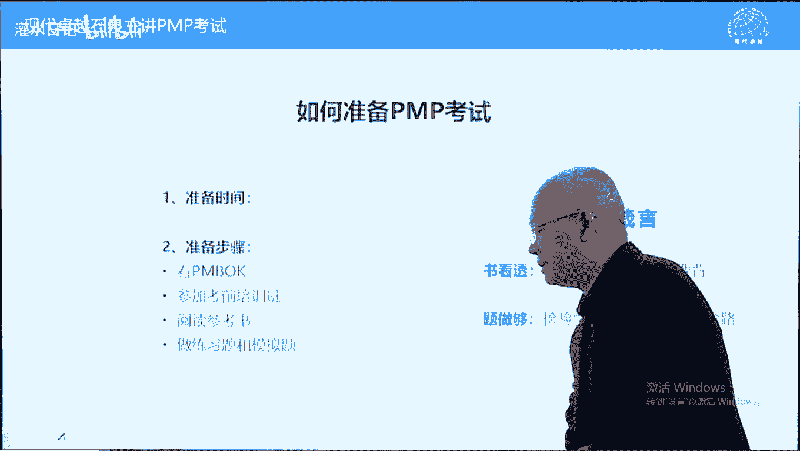

但是呢准备的资料需要比较多，那我们的时间呢也比较多一些。

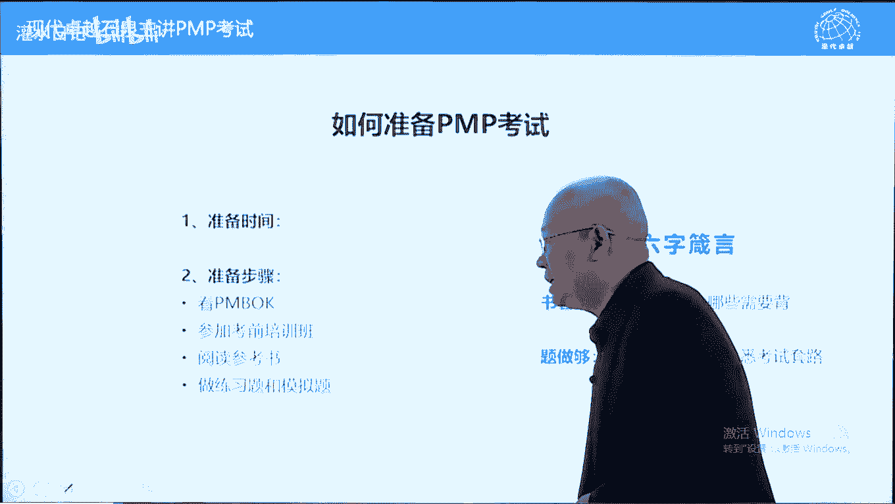

需要量，不好意思啊，二至三个月。

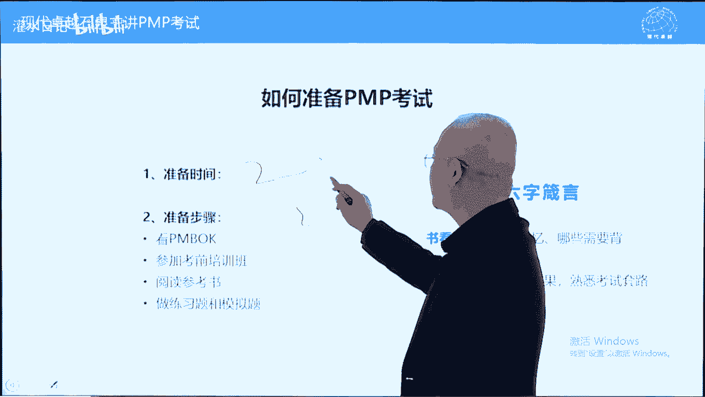

这个呢是准备的时间，两个月到三个月，时间短一些的。

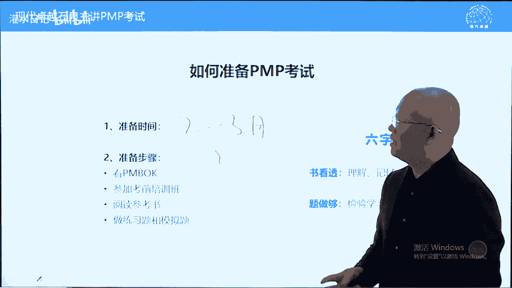

两个月，长一些的三个月，这个呢每一季度他每季度考一次啊。

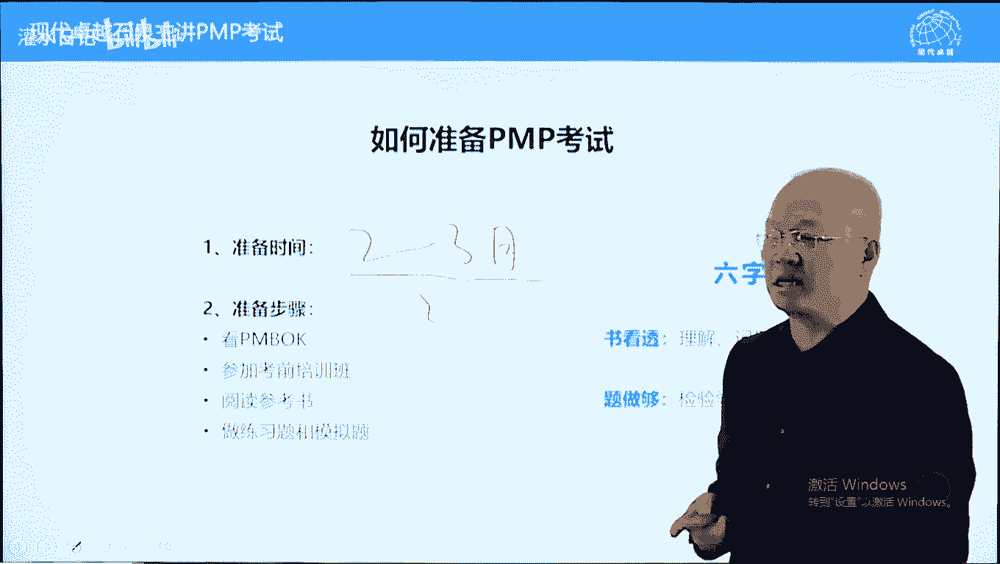

每一季度pmp考试的准备时间稍有不同，是像3月份6月份准备时间呢。

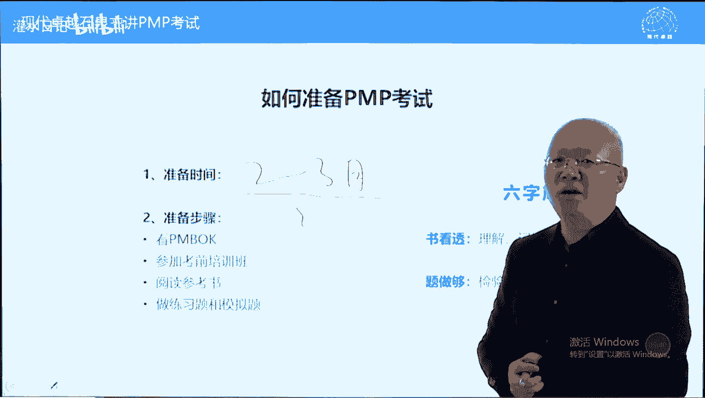

一般来说时间长一些，跟你有三个月时间，但是呢9月份和12月份考试呢。

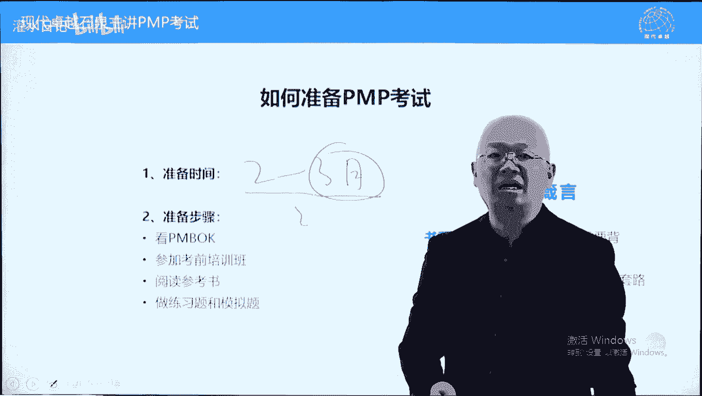

由于这个考试的时间他安排的稍微比较早一些，所以呢大多数人呢只有两个月时间能够准备，但是呢都不影响通过。

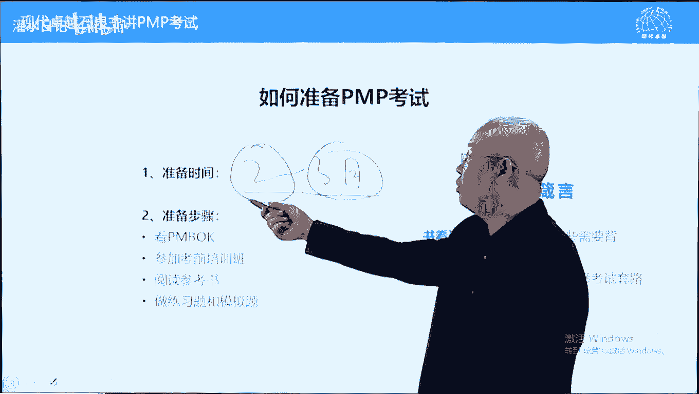

因为呢整个通过率还是有保证的，66%左右。

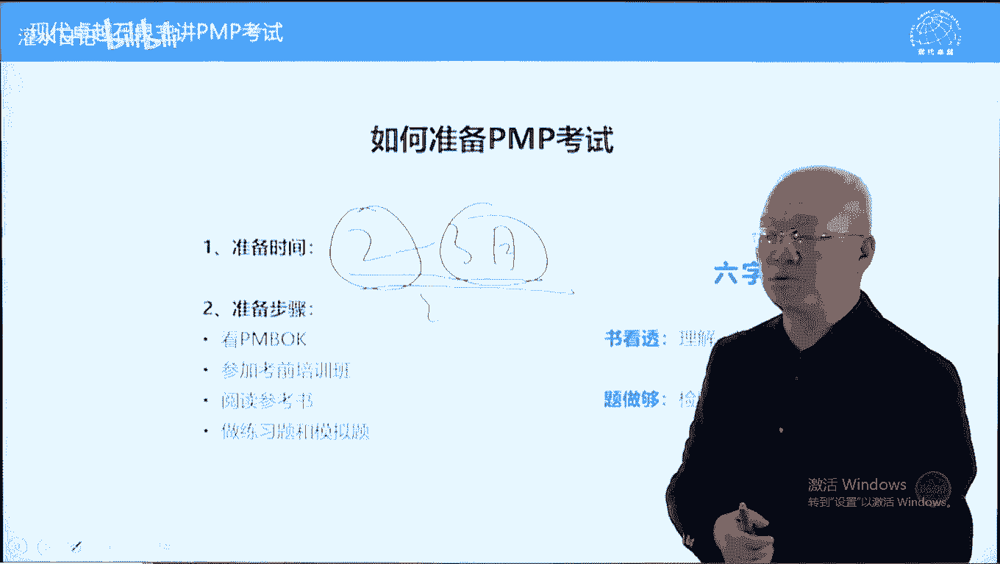

通过率呢大体上来说是不变的，准备的步骤，包括can pm不可。

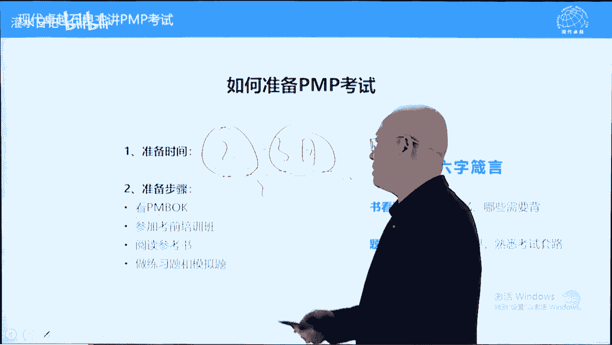

这是最核心的这本书啊，要花多少时间，60%的时间和精力来看这本书，我们叫书读百遍。

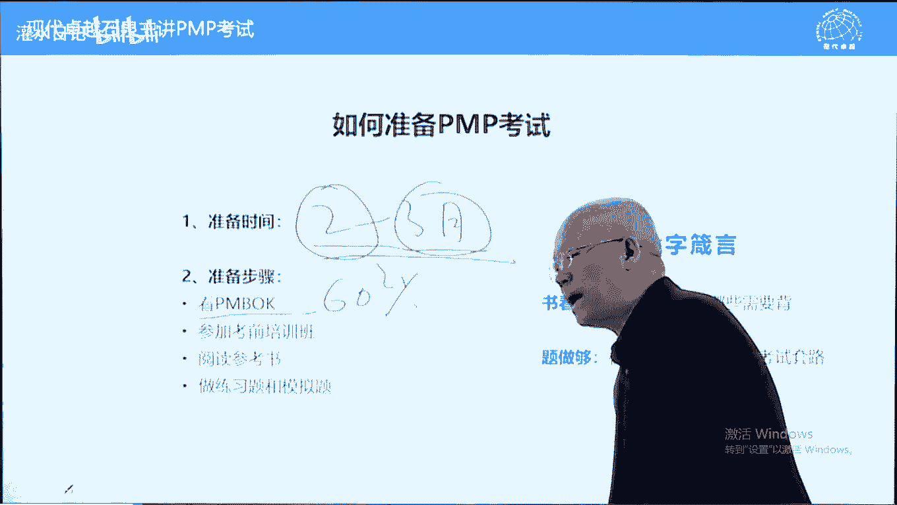

其义自现，这本书的话呢，在你读的过程中，你结合你的工作经验，你会有思考，你会有新的体验的，读的越多，你的企业越深刻，这里面的知识体系或工具技巧。

你能应用的就越多一些，因为领会之后是能应用的，参加培训班作用20%，但是呢这个作用虽然只有20%，它必不可少，为什么呢，这本书内容我可以这样说，你第一遍看的时候，绝大部分你是看不懂的。

或者说80%以上你看不懂，另外呢有些难的内容，你再怎么看，看不懂，可能看23年，34年，甚至一辈子，老师不点播的话呢，你不理解是什么意思好，这20%的时间是留给老师来点拨你的，好重要内容。

或者说很难的内容，老师一说你就会了。

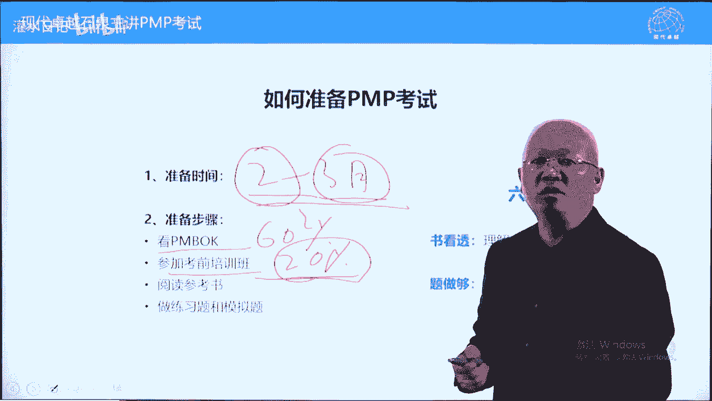

这叫什么呢，相当于站在巨人肩膀上，我们没有必要从头来去了解，去学习，别人的话呢，把他的理解告诉你一下，之后你呢就能够事半功倍了好。

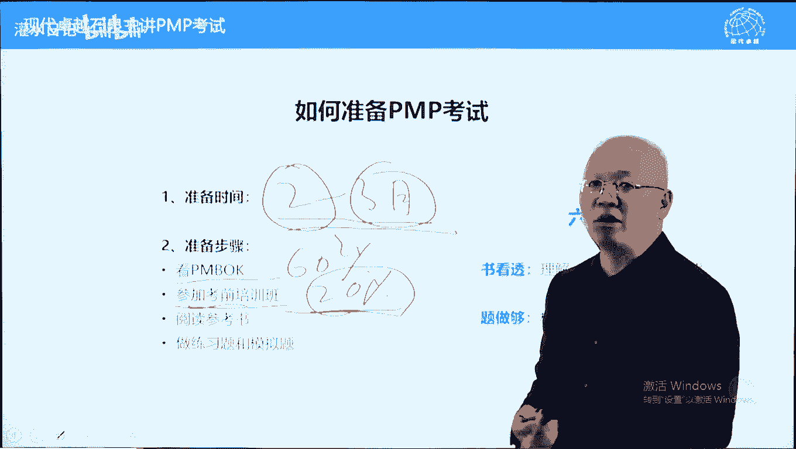

因此呢要选好培训班，选好老师，如果老师水平不够，他呢解释不了，那就是庸医，庸医呢会把病给治坏掉的，本来没有什么问题。

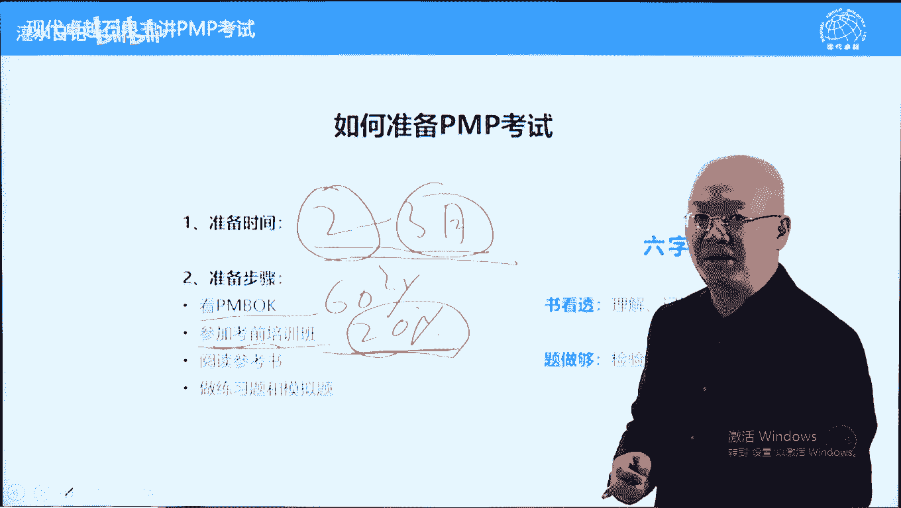

越治越坏，会走火入魔的，所以很多时候选择比努力要重要，阅读参考书，偏僻的考试的参考书还比较多，我们现在卓越的话呢会发一个学员手册，那个学员手册呢相当于我们的参考书，另外一个呢。

我们还会给大家在qq里面发一些相关内容，比如说关于敏捷的一些内容之类的，大家都可以来看啊，这个作用的话呢百分之包括我们的呃讲义，讲义的话呢也是相当于参考书啊，这些参考书的目的都是帮助我们去理解。

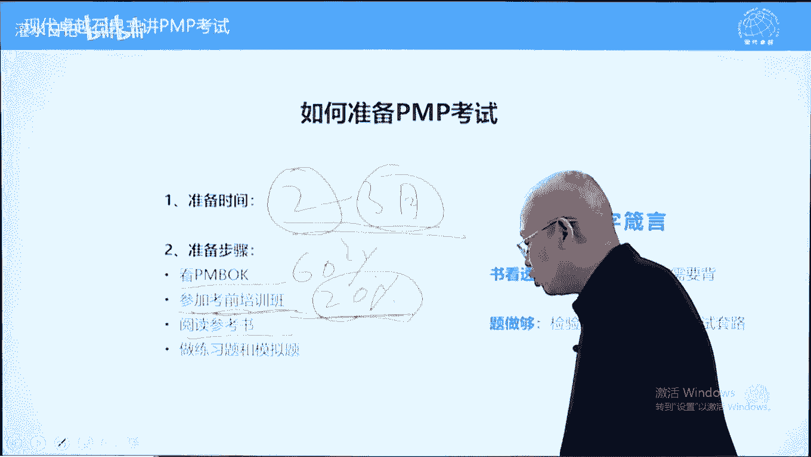

偏不可的作用，写一下10%，另外呢做练习题和模拟题，偏僻考试它毕竟是一个考试，这个准考试的话呢，我们把这个课程呢也可以叫应试教育，应试教育少不了刷题，要做多少题呢，要做1000道以上的题目。

做的题目呢一定一定要注意要跟考试能对应的，跟考试是一致的，如果你做的题目跟考试没有关系，做的是第五版，第四版，第三版的题目，并且呢答案不是很靠谱的话呢，这个风险也是很大的，所以呢我们要做够题目。

并且的话呢要做我们发的题目，现在卓越的题目呢在业内还是比较有名的，都是别人在用我们的题目啊，我们的题目呢都保证跟考试比较贴近，而且的话呢更重要的是，我们的答案是比较准确的。

有很多机构的话呢题目可能差不多，但是呢这个答案是需要经验，是需要积累的，就跟中医都会号脉，但是呢你号的准不准，这个差距就很大了，跟我们下药，跟我们这个开处方关系很大了。

所以呢题目的话呢不要做网上自己找的，只做我们给大家发的，我们发的题目呢肯定会超过1000道题目，这些题目呢如果你做完了可以反复做好，另外呢六字箴言叫书看透题，做够书看透。

指的是这本篇不可要看三遍到四遍以上，看第一遍，第二遍只是大概了解第三遍，第四遍的时候开始记忆，记忆的基础上能理解更多的要理解，当然了，有人说考过偏不可的人，考过偏批考试的人，能理解的内容50%左右。

其他内容的话呢只能靠记忆了，所以呢理解不了的时候先记忆，我们在工作的时候呢，可能经历的时候，经历到类似情况的时候，你会突然醒悟啊，这个这句话什么意思，这个方法应该怎么做题，做够我们发的题目呢要反复做。

可以做两遍，甚至他做三遍，做题的目的提高你的体感，也提高你的阅读速度，刚才讲了200道题，多长时间，考试呢，四个小时，有人说这个时间很长啊，我们一分钟一道题，200 200分钟。

那四个小时呢是240分钟，好像绰绰有余，但是不是这样的，因为呢个人的理解能力是有区别的，偏僻考试我也经常说跟语文水平有很大关系，语文好，你读题读得快，而且呢能抓住重点，语文不好，这个题目的话呢。

你根本不知道他要考的是什么，我们做题的目的是提高题感，提高我们对题目的理解，并且的话呢了解不同类型的题目，我们一般选择答案，选择什么答案，这一点是很重要的，这个呢叫题做够好，关于这个如何准备p考试呢。

我们大致讲到这儿，下面呢我们再了解一下项目管理这个学科，它到底是干什么的，在我们讲正文之前呢，了解一下项目管理。

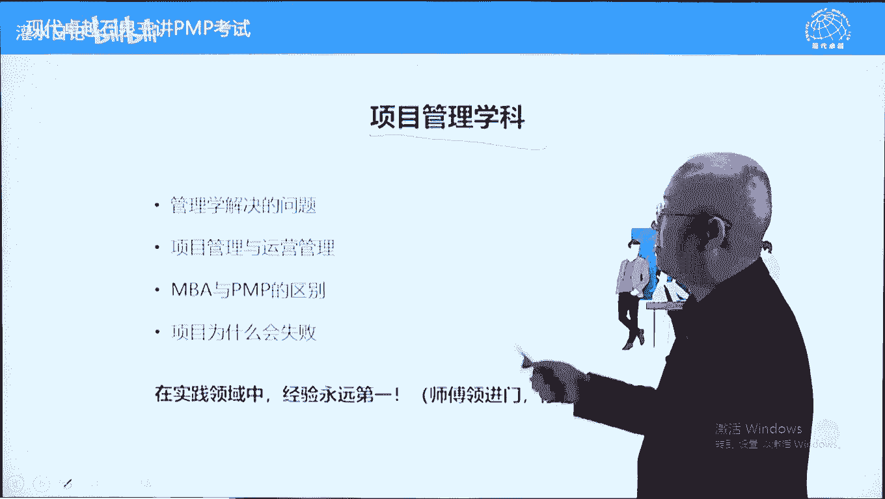

首先呢项目管理，我们说它属于管理学的一个分支，而管理学这个范畴呢比较大。

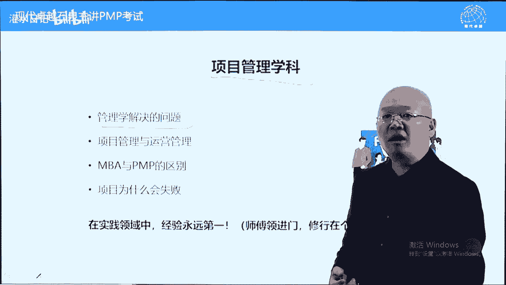

有人说管理学管人管事，有人说管理学是计划控制，这些说法都没问题，都是对的，从我们理解项目管理来说，我们可以这样说，管理学解决两个大问题，哪两个大问题呢，一个叫做什么做什么啊，一个呢叫怎么做。

怎么做两个问题啊，做什么属于什么呢，战略管理公司高高层他来决定做什么，而怎么做，属于执行层面的工作，职能经理以及项命令来解决怎么做的问题，而项目管理就是一种怎么做的一种方式，怎么做的方式。

除了项目管理之外，还有一种方式呢叫运营管理，所以呢运营管理跟项目管理一样，都属于具体的做事方法，我们出来工作呢都是需要做事情的，无外乎项目管理或运营管理好，就像excel软件，word软件一样的。

只要你办公需要需要用到计算机的话，你必须掌握word或excel软件，可以和excel软件，我们出来工作呢都需要做事情，那做事情的话呢需要掌握这两种做事方法，而这两种做事方法是有区别的。

首先出现比较早的是运营管理，运营管理什么时候出现的运营管理呢，在18世在19世纪的后期，1870年以后。

它出现的，它的出现强调两个字，哪两个字呢，叫分工，分工能带来一个好处，什么好处呢，在管理学中叫学习曲线，什么叫学习曲线，就是我们做一件事情做得越多。

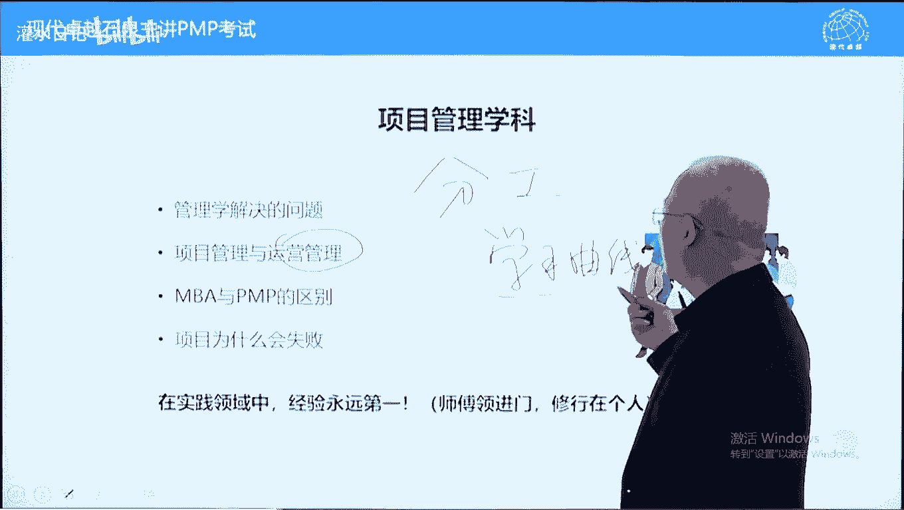

效率越高，效率越高呢，成本越低，比如说福特汽车，他们最早实实现流水线的生产方式，流水线生产方式呢，它极大提高了汽车的生产效率，把一辆汽车的生产从29小时生产一辆汽车，29小时啊，压缩为93分钟。

生产一辆汽车，好人缘人，孩子还是那么多人，时间还是那么多时间，工资可能增加有限，但是呢汽车的产量增加很多，所以呢它实现了一个美国梦，家家有一辆汽车，因为它大幅降低了汽车的生产成本。

也大大降低了汽车的价格，所以我们这样说，学习曲线能降低成本，那运营管理它是一种基于成本的做事方法，我们如果希望成本低的话，我们呢用运营管理好，项目管理出现比较晚，他呢是在上世纪40年代开始出现雏形。

到上世纪的60年代末，大概已经形成了项目管理，强调另外两个字。

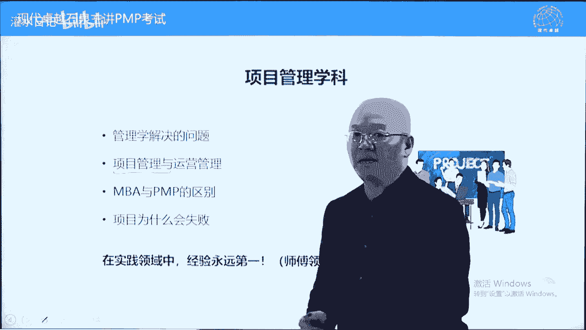

哪两个字呢，就是协同，什么叫协同。

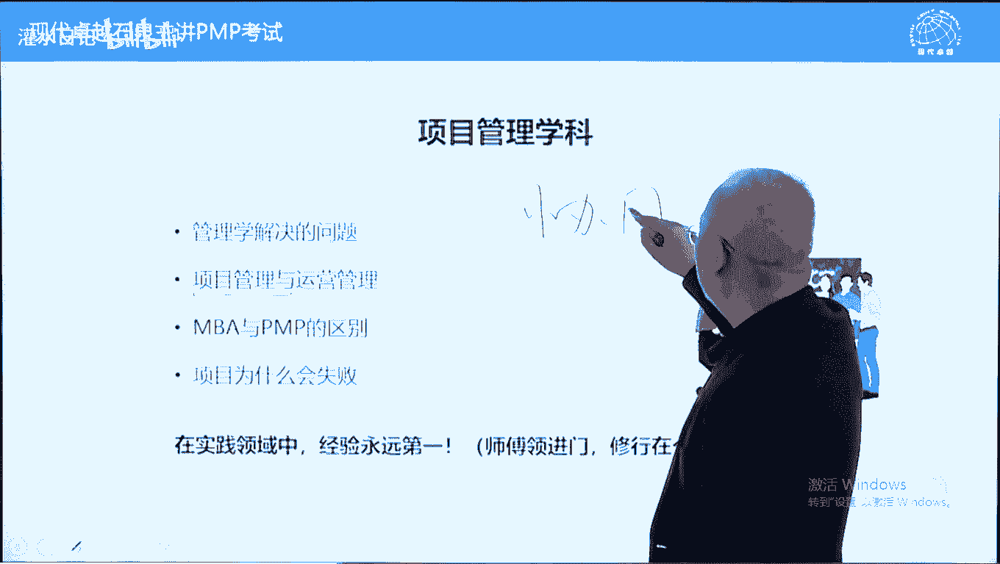

就是陆海空联合作战，大家呢横向配合，打破已经界线，横向配合，这个呢叫协同，它能带来什么好处啊，它的好处呢我们举个例子，比如说王健林要想抱一个孙子。

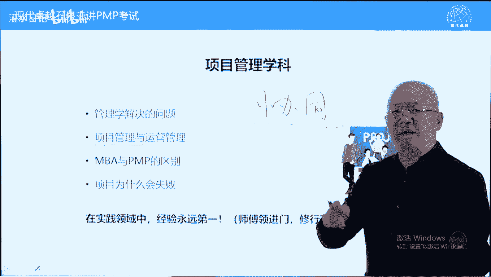

至少需要十个月，那王健林要想报十个孙子，至少需要多长时间呢，答案还是十个月，这是协同带来的好处，也叫并行带来的好处。

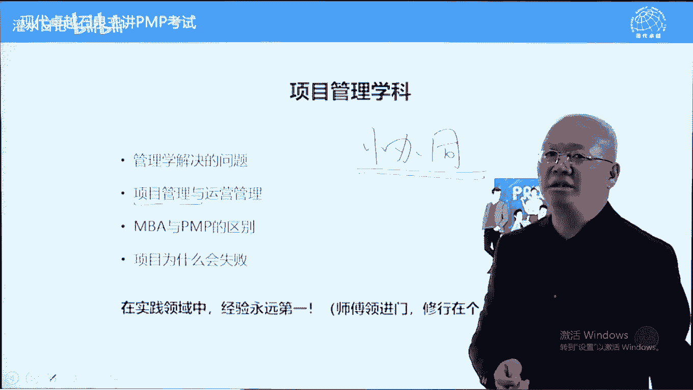

项目管理，它呢能够节约一个，另外一个一个一个一个目标了，节约什么呢，它能节约时间，使用项目管理，我们能极大的节约时间，刚才讲运营管理是一种基于成本的做事方法，那项目管理的话呢。

就是一种基于进度的做事方法，如果我们希望快的话，用项目管理项目里这个学科呢，它的复杂程度也是更高一些的，191984年的时候，美国人推出了pmi。

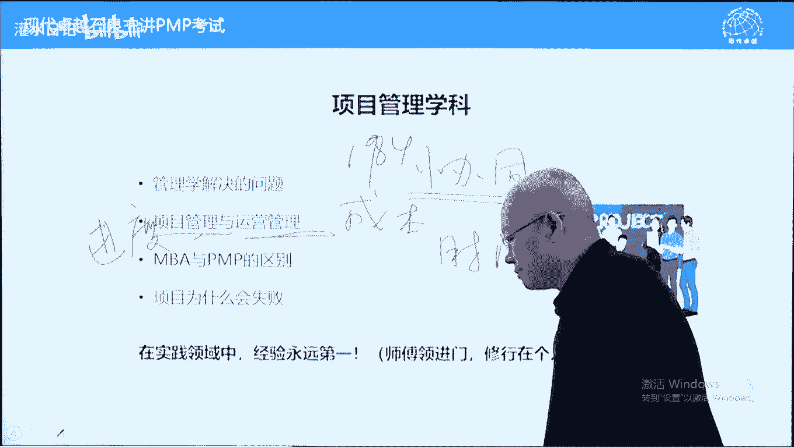

推出了这个这本书的雏形，第一版叫草案，项目管理知识体系草案草案这本书出现之后，在全世界管理学界引起轰动，全世界的管理学家一直惊呼，这本书的出现，颠覆了我们100年来对于管理的认识，100年来。

我们认为管理都是一种基于成本的做事方法，但是呢这本书告诉我们，一种全新的基于进度的做事方法，好再回过头来，项目管理跟运营管理都是做事方法，一种基于成本，一种基于精度，两种方法，每个人都应该掌握。

如果你是一个职业的项目，你或者一个专业的项目，你专门做项目的人，你有必要系统学习一下怎么系统学习，那就考p mp了，好ba解决的是做什么，培养ceo的，做什么的，这个不多说了。

偏偏的话呢它培养的是怎么做，培养项目里的，我们呢在执行层面上，如何多快好省的把工作完成好，这个呢是项目管理跟管理学的关系，跟运营管理的区别，好项目管理作为一个学科，能够有一席一席之地。

而且的话呢广受欢迎，风靡全球，它呢是有它的存在，是有它的原因的，因为呢它能解决他能提出一个主要问题，并且能够解释什么问题呢，项目为什么会失败，任何一个学科，它比它的价值都在于能够提出问题。

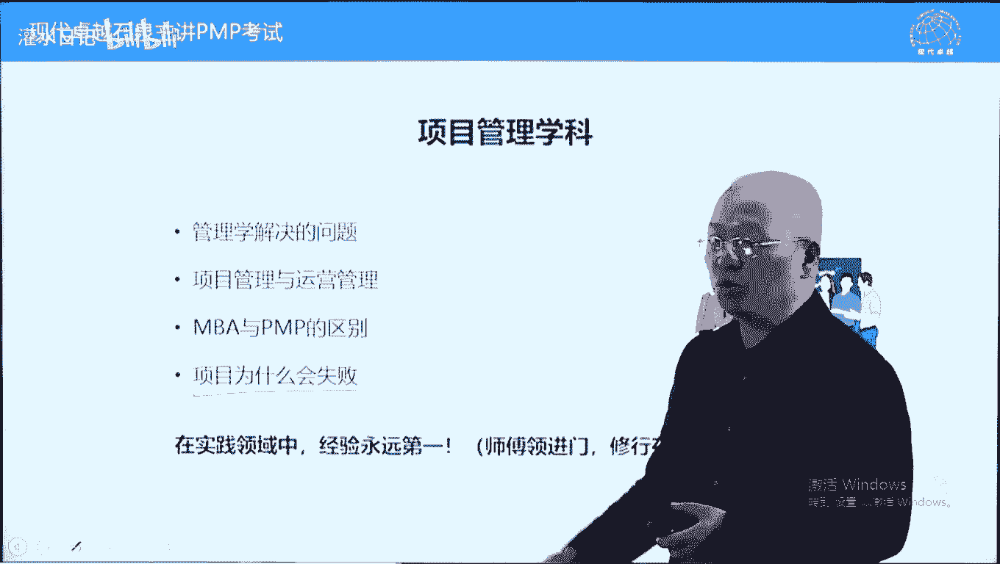

并且能够试尝试解决问题，项目管理能提出一个问题，项目为什么会失败，我们呢从项目失败来说一下，跟项目管理相关的一些发展。

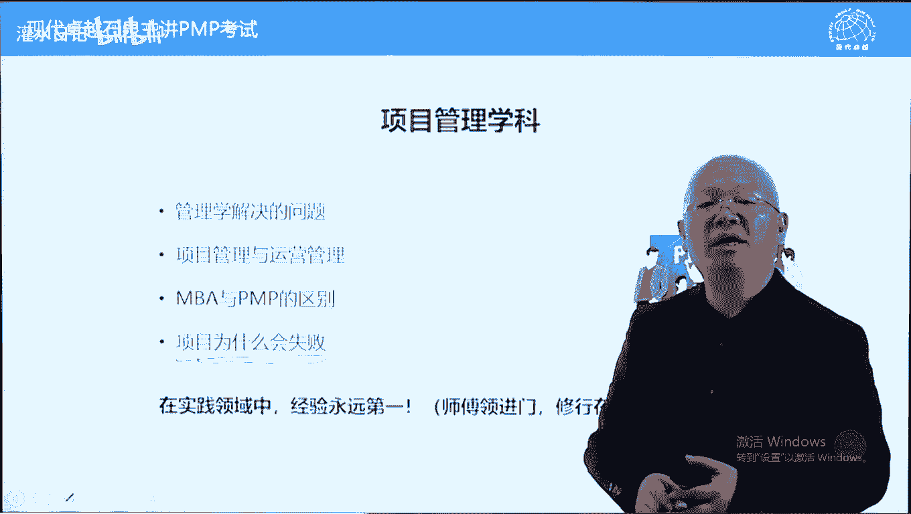

或者说怎么样能做好项目项目的失败，美国人认为分为两种。

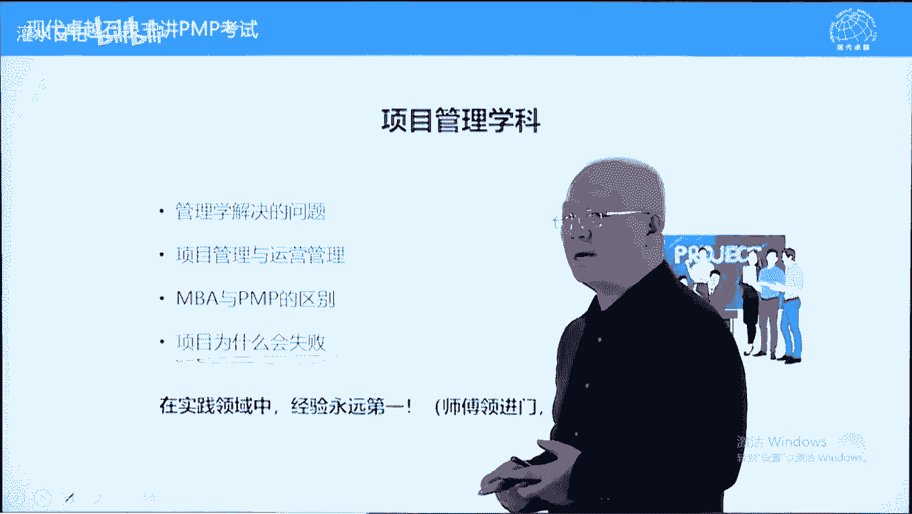

一种呢叫计划失败，什么叫计划失败，指的是目标不现实，癞蛤蟆想吃天鹅肉。

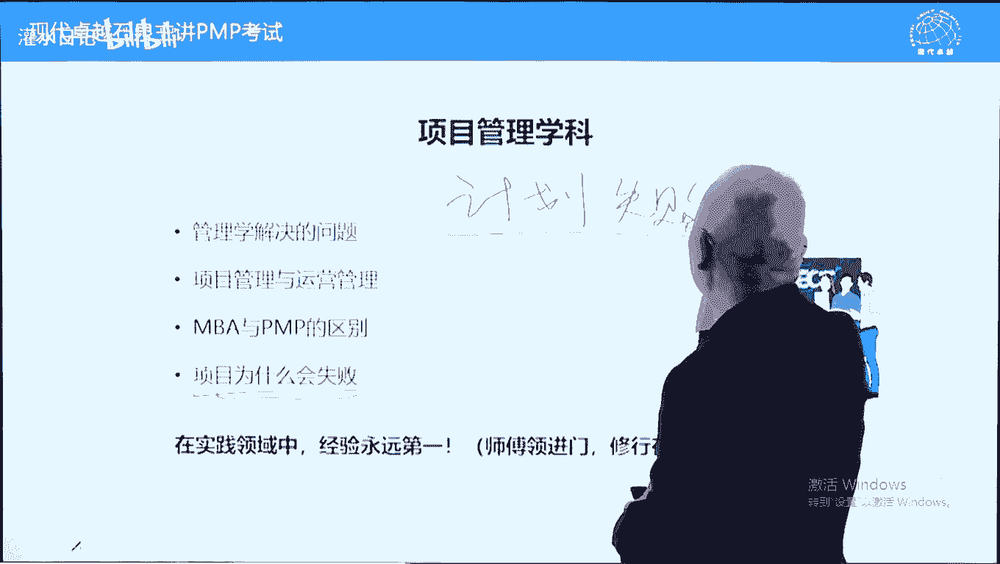

这叫计划失败，比如说啊你是个美女，你要想嫁给杨洋，想嫁给李易峰，这个呢一般来说是不现实的，你是个男生，你想娶娜扎，想娶热巴，这个呢也是我们叫癞蛤蟆想吃天鹅肉，这叫计划失败，在项目中首先要防止计划失败。

那计划失败顾名思义跟计划有关，要根据计划来去识别和防止计划失败，在项目中，我们一般要强调做三个核心计划，哪三个计划呢，我们分别叫范围scope，进度time，成本cost，这三个计划。

这三个计划我们把它列成三角形的三条边，这也叫三角之约，也叫三重制约，三角形三条边啊，为什么用三角形三条边来表示，因为三角形具有稳定性，什么稳定性我们可以写个函数，在这写一下三角形。

任何一条边都等于另外两条边的函数t啊，当范围和进度确定之后，成本就确定了，这个呢是三角形的特点，那这个跟项目的计划失败有什么关系呢，好在现实中，一般来说领导在安排项目的时候，在布置项目任务的时候呢。

他都会提出做什么，什么时候做好，我给你多少钱，做好领导给的这三个指标都是拍脑袋拍出来的，我们叫自上而下决定的，它是否符合三角形vb，为什么呢，因为根据三角形稳定性，两条边决定第三条边。

那领导的话呢只能布置好范围和进度，他不能再安排成本了，因为当他安排好进度和和这个范围之后，成本就由进度和和这个范围呢确定了，它不能在安排这个成本，所以呢领导的要求，有可能我们用用三角形来表示一下之后。

它不是一个三角形，为什么呢，因为它不是说两条边决定第三条边的，它是两条边，三条边它都确定的，因此的话呢项目必须接到任务之后，必须自下而上，根据范围制定进度计划，成本计划，看需要多少钱，多少时间。

然后呢再跟领导给的时间前对比一下，看够不够，如果发现不够，要解决这个问题啊，首先伸手要要不到的话呢，我们可能要想办法，比如说钱不够，削减范围，时间不够的话呢，要压缩进度，那这个呢来防这样的。

来防止项目的计划失败，计划失败呢在现实中其实不多，为什么呢，大多数情况下，我们都知道自己能吃几碗饭，喝几碗汤，我们呢也很少有人去实际执行这个嫁给杨洋，李易峰去取娜扎热巴，如果有这样的人。

我们一般都会说脑子有问题，比如说n多年前有一个姓杨的女性，他呢要嫁给刘德华，他把刘德华搞得抑郁了2年，这个叫什么呢，叫计划失败，我们怎么样看待他呢，脑子有点不正常，正常人一般不出现计划失败。

但是呢计划失败，他对项目的损失是很大的，因此呢做项目首先防止计划失败怎么办，项命令必须要自下而上做计划，来论证一下领导给的时间，钱够还是不够，在中国呢，以前管项目都不叫项目，中国的项目都在哪里呢。

在浴室，在理发店，比如说洗染烫这些项目，而在中国真正的项目都叫什么呢，都叫计划，比如说曼哈顿计划，阿波罗登月计划啊，沙漠风暴计划，星火计划之类的，这个呢都在强调说的其实就是项目，计划对于项目是很重要的。

这个呢我们是讲的计划失败，好计划失败呢在现实中并不是很多，在现实中主要的失败，项目的失败是实际失败。

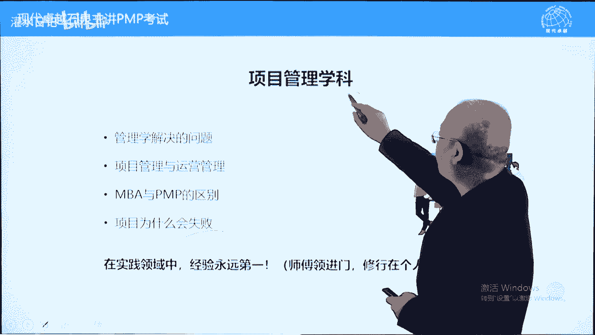

那什么叫实际失败呢，实际失败指的是项目的目标，没问题，是可以实现的，但是没有实现，比如说一把好牌，明明一家能通吃三家的，结果呢他点炮了，一直单边上涨的股票，只要你拿着呃呃就是等他不动啊。

拿着不动他就能赚钱的，但是呢有人可能折腾来折腾去，结果呢被套了，这叫什么，这叫实际失败，那实际失败跟什么有关系呢，实际失败它的主要问题就是执行者有问题，比如说一把好牌点炮了，谁的问题呢，打牌人的问题。

那一个项目很稀松，平常的正常情况都能完成的，项目结果呢没有完成，跟什么有关系，跟项目经理有关系啊，举个例子，比如说我现实说法啊，举个例子啊，我大学快毕业的时候，当时呢心气比较高，有一次喝酒。

喝完酒之后在宿舍发个誓，这辈子我不娶刘嘉玲就去，李嘉欣，当时呢呃叫我们当时主要看港台片，刘嘉玲，李嘉欣是我们的梦中情人，结果呢大学一毕业，用南京话说的了，连个搞通行证你都搞不到。

你更更不要说机票能不能买得起来，工作之后棱角磨平，男大当婚，女大当嫁，那找谁呢，找同桌，注意啊，大学没有同桌，找高中同桌，大家都是本乡本土的，家里都比较穷，门当户对，长得都比较安全，只能理解，不能欣赏。

两个人呢互相也谁也不嫌弃谁，恋爱谈得很成功，但是呢婚没有结成，因为第一次到丈母娘家走亲戚的时候，东西拎的不够，丈母娘呢专家判断过来人啊，我们后面后面会讲什么叫专家判断，凭经验来判断的，他的经验比较丰富。

直接就说了，这个男孩子不能找，他，太自私了，男人不怕穷，就怕自私，男人自私的话呢，他将来即使发迹了，他会把你甩掉的，所以这种男人呢不可靠，结果呢婚没有结成同班女同学，嫁给了同呃，这个女同学啊，女朋友啊。

嫁给了同班，另外一个长得需要深刻理解的男同学了，这叫什么，这叫实际失败，谁的问题。

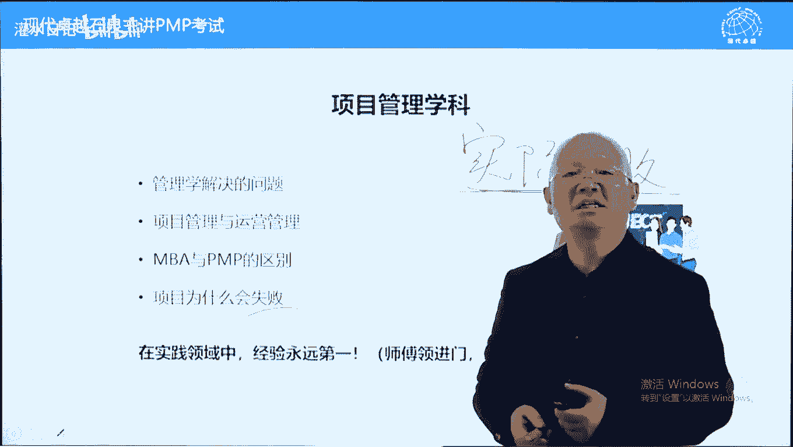

项目经理的问题，兵熊熊一个将熊熊一窝，而实际失败怎么解决，换人你不行，让别人来，包括打这把牌，你看着你要点炮，那怎么办呢，换个人立马改变绩效，当然了，对于一个组织而言，对于项目而言，项目绩效不好。

肯定是项目经理的问题，有人说换将如换刀，那这个团队领导一换，那这个绩效呢立马改观，所以呢我们要解决实际失败是要怎么样弄呢，是要换项命令，那如果要防止实际失败怎么办呢，防止实际失败。

我们要培养专业的项命令，那专业的项目里怎么培养呢，注意专业的项目你不是学出来的，而是练出来的，就跟老司机，老司机不是说被交规背出来的，而是开车开出来的好，在实践领域中，经验是第一位，为什么呢。

管理是一门艺术，艺术都属于叫实践实践啊，实践领域的在实践领域中，我们叫百闻不如一见，或者说百读不如一练，我们读100遍不如练一次的，真正的专业的小米怎么来呢，靠这个叫多做项目才可以啊，项目做多了。

我们呢有经验之后才可以，就像专业的足球运动员，篮球运动员，包括乒乓球网，网球运动员，他的高难度动作都是下意识做出来的，这种下意识的话呢，我们叫平时练多了，练出来了，你要真正的靠思考，脑子去想。

你想不出来的，所以呢经验是靠实践的，呃，我们经常讲经验和知识的区别，比如说社会经验，比如说生活经验，比如说家庭啊，生活经验，或者说结婚的呃，就是婚姻生活的经验跟知识是两码事的，经验呢来自于实践。

你被100度的水烫一下，这叫经验，你知道100度的水不能摸，会烫烫起泡，这叫知识，在经验面前，知识是浮云，而经验怎么来的，练出来的，练到什么程度，练到叫手中有剑，心中无剑，这叫专业。

就像老司机开车是靠下意识靠直觉在开车，贝克汉姆踢任意球，踢哪打哪指哪打哪，怎么来的呢，练出来的包括以前有一个老虎伍兹，泰格伍兹打高尔夫的，一直保持排名第一，几十年怎么来的，他每天挥杆超过3000次。

练出来的，在实践中，只有靠练才能真正的成为专业人士，当你有直觉之后，你是专业人士，你没有直觉，靠理智的时候，靠书本上的知识的时候，你是小白，你根本不专业，我们讲一个专业的故事啊，尼采讲过一个故事。

尼采是一个哲学家，德国的哲学家，他讲过一个寓言故事，告诉我们什么叫专业，专业怎么来的，他讲呢，在森林中有一只蜈蚣腿特别多，百足之虫特别会跳舞，都要让蜈蚣先跳一段音乐响起，蜈蚣翩翩起舞，非常好看。

有很多动物很羡慕，其中有一只铁粉是一只蜘蛛，看了很多次之后非常羡慕啊，终于鼓起勇气，再一次蜈蚣跳完舞之后，鼓起勇气呢跟蜈蚣说，武功先生，你的舞跳的那么好，能不能教教我怎么跳的，我说我也不知道怎么跳的。

反正音乐111起，跟着音乐跟着感觉就跳起来了，蜘蛛说我观察很多次，我发现你怎么跳的了，你每次都是在举起左边，第15~26条腿的时候，放向右边，第30~18条腿，然后再举起右边多少条腿，放下左边多少条腿。

诶蜈蚣一下，果然如此，从此以后无工不会跳舞了，这叫专业，专业是有直觉，直觉怎么来的呢，有经验，这叫呃，这叫这个专业有知觉，我们举举个例子，比如炒股票，股票里面呢有些术语m a c d知道是什么吗。

叫余地移动平均线，当然还有其他指标，比如说k d j这些呢都是一些股票的上涨，下跌指标，这叫什么，这叫知识，什么叫经验，珍惜生命，远离股市，这叫经验，关于那这个管理学的一个内容。

项目管理内容呢我们大概介绍到这儿，我们这个课程的话呢，只是告诉你项目管理有哪些知识，这些知识呢都是书本上的，要真正真正的想成为专业的项目，你靠什么呢，靠多做项目才可以的好。

我们现在呢进入下一个话题叫p m i主义，什么叫p mi主义，任何一个学科它都可以分为三个层次，我们叫思想层次，方法层次和工具层次，最高端是思想，思想决定高度掌握思想之后，甚至可以开发方法和工具。

我们了解思想之后呢，对于方法和工具的认识也会更加深刻一些，不会说只知知其所以知其然，不知其所以然，因此的话呢我们要首先讲一下pmi主义，其实呢大家书读上三遍，四遍之后，就能从书中体会到这些意思。

就像我们在学英语的时候，学的是呃叫单词句型和语法，但是呢在本质上我们在了解英美人的文化学，项目管理也是一样的，这本书呢告诉我们大量的过程工具和方法，但是呢在这些过程工具方法背后。

它所体现的是pm i的思想思想决定高度，像马云啊，像这个叫乔布斯之类的，他们之所以能成功，是因为他们的思想强大，而不是说技术很强大，有强大思想之后才会有方法和工具，答案好，项目管理是一个管理者。

这是个正确定位啊，管理者主要作用是协调关系，他尽量不做事，能安排下去的事情尽量安排下去，他呢就是负责协调协调各种关系，他一旦叫投入于具体事物中，忙于具体事物的话呢，就会出现叫不识庐山真面目。

只缘身在此山中，能安排下去的尽量安排下去，除非呢有些工作你安排不下去了，当然这个跟你的资源多少有关系，跟你的能力也有关系啊，自己要做自己做的事情越少越好，否则的话呢会影响我们对整体的管理。

他是一个管理者主要作用，协调关系的好，另外一个呢象命都属于小人物，做大事不要对外部因素要求过高，好在偏僻考试中，我们一般也都默认弱矩阵型组织，就是项目处在一个弱矩阵型组织，什么叫弱矩阵。

项目的地位相对来说比较低，低于谁呢，低于部门经理，我们这样想，遇弱矩阵好，这个呢是全世界普遍行为，不是说很多项目你说的我们公司不不不规范啊，做项目呢项目你根本不是项目，你负责啊，都是项目里地位很低。

然后呢这个也能欺负那个也能欺负项目，项目经理，全世界都是如此，不信呢，我们看一下007碟中谍这样的谍战片，做的项目都是拯救地球，拯救人类的大项目，这叫小人物做大事，为什么这种情况我们讲组织结构的时候呢。

再说一下好项目地位不够，地位比较低，权利呢比较小，但是呢需要对结果负责，这个时候就需要发挥个人的主动性啊，要主动才能够把事情做好，所以呢紧跟着凡事要主动，求人不如求己，天下事有难易乎，为之则难者亦矣。

不为则易者亦难矣，在项目管理中，我们叫事在人为，那独特性就体现这样一个情况，它没有规则，我们待会讲独特性啊，很多事情不同的人效果是完全不一样的，具体同样一个情况，具体达到什么效果，看项目里本身的水平了。

所以呢要主动，因此我们看007碟中谍男主角，那都是首先颜值爆表，另外一个呢各种能力都有，会飙车，会格斗，会拆炸弹，会破解密码啊，甚至还会撩妹，这样的话呢才能把项目做成，它呢无时无刻不在发挥主动性。

那有人觉得麻烦了，那我颜值不够怎么办，颜值不够是不是就做好项目，不能做，小时候做大事呢，不是的，还有别的因素都能解决小人物做大事的问题啊，全世界范围内的一个情况，另外呢程序争议优先于结果的争议pmi。

或者说偏偏不可这种这本书它强调什么呢，两个字，流程要有，要按照正确的流程来去做，只要有流程，尽量按流程来，如果没有流程以后还要做这样的事情，我们尽量的给它规范一个流程，尤其在变更过程中。

包括呢我们在执行过程中要执行计划，计划中没有的不要去执行，另外呢任何变更都要按流程来，包括收尾的时候也有相应的流程，我们不要只追求正确的结果，正确结果的话呢可遇不可求。

正确流程才能保证我们无无限的接近正确结果，那这个呢是流程的正义，程序的正义，所以呢他强调计划计划本身来说就是一个流程，另外一个呢它还有一些叫系统，比如说变更控制系统，配置管理系统，目的是什么呢。

让我们少犯错误，按照正确流程，离失败就会远一些，离成功更近一些，相当于规范动作，比如打乒乓球标准打法应该怎么打，应该是只动小臂，不动大臂，这样来打刘国梁那种打法比较专业的好。

这样的话呢能让我们立于不败之地，这叫专业，我们按照专业的程序来去做，按照专业动作来去做，包括中国一些比较实战的拳术，咏春拳，少林拳这些拳术的话呢都有个特点，全伸进胳膊，伸出去不能伸直。

腿踢出去也不能够伸直，为什么呢，这是他的一个要求，按照这种要求，他能把防守放在第一位，让你立于不败之地，那这本书中有很多规范做法，我们呢尽量按规范做法，不要光想着我们能实现结果就可以了。

那往往呢欲速则不达好，另外的计划很重要，项目里要制定计划，在项目管理中，我们以前把项目呢叫做计划，凡事预则立，不预则废，项目具有独特性，也具有风险，我们应该制定一个计划，来去规划一下应该怎么做。

计划呢是一个找路的过程，找路啊，计划还是一个预先发现问题的过程，我们预先发现问题，然后呢可以从容的去想着怎么解决，另外一个呢计划也是一个叫一个叫叫什么呢，叫叫制度，秩序能够帮我们建立秩序啊。

秩序这样写的，计划它也是一种规则秩序秩序规则告诉我们，今天做什么，明天做什么，先做什么再做什么，那我们在复杂的情况下忙而不乱，建立一个秩序，它的作用呢，这个作用相当于红绿灯，如果交通很繁忙，很复杂。

没有红绿灯会乱成一锅粥的，再烂的红绿灯比没有红绿灯是要好的，那计划呢它还是一个标杆，我们叫基准，也叫标杆，有了标杆，我们能对照我们现在做的好还是不好，我们要不要改进，我们呢能判断我们到哪一步了。

将来什么时候能完成，所以计划很重要，另外呢pmi强调美国西岸模拟学会强调谁执行谁，谁计划，项目里亲自要做计划，所有规划工作都是项目里的责任，他非常反感py，非常反感什么呢，别的部门做计划。

比如说战略规划部做计划，然后呢交给项目里执行，他认为这是导致项目失败的一个重要原因，为什么呢，不是他做的计划，他有各种各样的理由来去挑毛病，来去推卸责任，或者说不是他做的计划，他呢会认为这个计划不现实。

另外一个呢做计划的人，也可能不会考虑现实情况，只有自己做计划，自己执行的时候，计划呢比较可靠，而且的话呢本身来说他做的计划，他自己得有承诺的，你自己呢要把它完成才可以的，另外呢以为本承认普世价值。

我们强调对员工也好，对客户也好，要诚信，另外一个呢把别人当成目标，不要把别人当成这个手段，或当成一个工具，我们把别人跟自己当成是一样的，别人的这个需求都要考虑，尤其是员工，包括供应商这些需求。

他们的需求的话呢都要认真对待，不能说这个需求不对，没有对错而已啊，我们呢要将心比心，己所不欲勿施于人，那承认普世价值，比如说人有休息的权利，人呢希望参与决策人需要提高，人也需要得到尊重。

这些原则在我们做计划的时候，处理冲突的时候，发现能力不够的时候呢，都是一些基本原则，这个原则掌握之后，我们在处理这些具体跟人相关问题的时候，能做出正确判断，好崇尚友善人际关系，追求团队协作。

这个指的什么呢，项目具有独特性，这个独特性呢告诉我们很多事情缺少规则的，我们一切靠制度可能走不通，另外呢项目mini又处在一个权力比较低的情况下，靠权利也解决不了问题，权利有限。

制度的话呢有些地方是空白，那怎么解决问题，靠友善的人际关系，我们叫就喜欢你，不需要理由，不喜欢你，什么都是理由，通过友善人际关系来解决工作中的问题，有人说，那我们工作就是工作。

私人感情就是私人感情不能带进去，这是不可能的事情啊，他违反普世价值，为什么呢，人是有感情的，有七情六欲的，我要帮你解决，不喜欢你就是有条件解决，再简单的事情，我能推三阻阻四，我找各种理由去不配合你。

这个呢就是人性，管理离不开人性的，为什么呢，管理属于社会学科，而所有社会学科研究到最后就是两个字，人性啊，人性不能违背的好，解决问题呢，在项目中横向沟通比较多，或者说具有独特性，权利制度都不好用。

或者说有限，要靠友善人际关系，靠感情来解决很多问题，待会呢我们会讲一下的，低头拉车更要抬头看路，指的什么呢，项目里他呢对项目结果负责，这个项目结果什么叫项目成功，好的结果是什么情况呢。

说一下一方面目标要实现，什么叫目标实现指的是范围，进度成本，符合国标要求，这个呢只是一个什么呢，低头拉车的过程把事情做好，那什么叫抬头看路呢，还有一个重要内容跟项目成功相关的叫什么呢，叫客户满意。

也可以叫相关方满意，而这个客户满意呢需要靠沟通来去解决，靠公关来去解决，所以呢汇报呃，沟通汇报加公关，有人说我把结果做好了，他他不就满意吗，不对的，因为什么呢，满意不满意是一个主观的概念。

有可能结果很好，但是呢别人不喜欢你这个人他会横挑鼻子，竖挑眼，然后呢找你的不是反过来说，如果你关系处的比较好，即使目标结果稍微有些问题，尽量不要有啊，对方的话呢也可能是很满意的。

那这个呢就是一个抬头看路的过程了，而很多项目命令他可能是职能出身哦，技术出身，他只考虑我们把结果做好就可以了，对别人硬气的不得了不得了，该巴结的一个不巴结，不该得罪的全部得罪完，即使你结果做的很好。

客户呢还是不满意，从商业角度来说，这个项目是不成功的，为什么呢，客户对你是有意见的，因此的话呢，在项目管理中有两个章节解决这个问题了，一个叫汇报，一个叫公关，公关什么呢，公关是改善跟别人关系。

我们叫得道多助，失道寡助，要让别人支持项目，这样的话呢能让项目呢得到一个好的结果好，另外呢唯物主义思维方式，在第六版中有一个具体方法叫什么呢，叫问题解决，在第八章开始出现的问题解决。

这个呢就可以理解为万能公式法则，什么意思，西方唯物主义思维思维方式啊，遇见问题我们呢先不要下结论，先不要诛心之问，你到底想干什么，遇到问题，首先呢要定义问题，我们叫收集需求，定义问题啊。

啊不加收集收集信息，定义问题，然后呢去分析影响，紧跟着分析影响啊，要全面分析影响，不能头痛医头，脚痛医脚，然后呢制定方案，制定解决方案，确定完之后可以审批一下，审批就不写了，我们这写一个p。

然后呢实施解决方案，实施完之后还不拉倒，还有一件事情叫什么呢，要跟踪效果，我写到这吧，跟踪效果这个呢叫万能公式法则，比较客观不主观的啊，唯心主义呢就不这样了，唯心主义一般都会说你想干什么。

你的目的是什么，这叫诛心之问，而别人想干什么，我们了解不了，我们呢只能了解事实，然后呢根据事实，按照正确的流程来去追求最好的一个结果，这个呢叫万能公式法则，万能公式法则呢在解决问题的时候。

包括在处理变更的时候都是如此，要尽量的客观一些啊，减少什么呢，个人的偏见，个人的情绪对我们决策的一个影响好，关于这个前言序呢。

