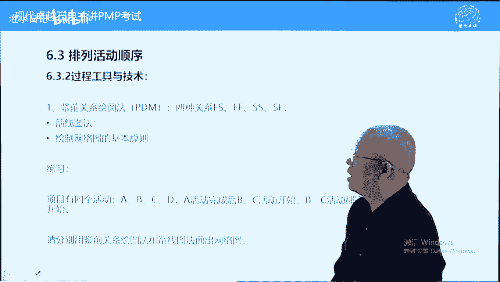
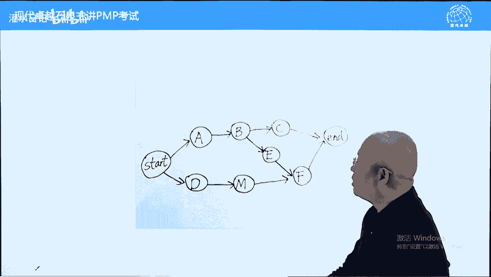

# PMP考试精讲 - P11：11 - 灌水日记 - BV1VN411w7cC

我们现在呢讲第六章叫进度管理，进度管理干什么呢。

两件事，制定进度计划批准之后，叫进度基准和控制进度的过程。

我们呢再回过头来回回顾一下第五章。

第五章呢其实解决了三个问题，一个是呢确定范围基准。

一个呢是确认范围外部接收啊，一个呢叫控制范围。

管理范围变更，而进度管理的话呢，两件事。

第一个制定进度基准，我们就制定进度计划，批准之后变成基准。

另外一个呢控制进度，而控制进度理解为管理进度变更的过程。

这个呢从意义上来说，跟范围控制呢跟控制范围是一样的。

好我们先看一下进度计划，告诉我们如何按照什么样的顺序，一步一步的去实现可交付成果，它呢给我们一个路径，另外一个呢我们在制定进度计划的时候，我们有一条，因为那项目管理是一种基于进度的做事方法。

我们希望快一些，因此的话呢，我们尽量找到一条最短时间完成项目的路径，那这个呢是传统项目管理的一种方法了啊，好这种方法呢跟敏捷有什么区别，待会再讲一下，好，小型项目中定义活动排列顺序。

估算持续时间以及进制定进度计划，这四个过程可以移步到位，当你很熟悉的时候，可以一步到位的好，下面呢我们讲一下敏捷型跟我们项目管理型的，或者说瀑布型的呃，进度计划的制定方法有什么不同，我们先说一下好。

瀑布型的，首先范围全部确定，定义好之后批准叫什么呢，范围基准帮我记者，然后呢把范围基准中所有需要完成的工作，我们呢把它细分到工作包，工作方呢在七分钟活动，12341条一条活动啊，可能上百条活动。

然后呢为上百条活动确定开始时间，完成时间，它呢范围是一开始就确定的，进度计划也是一下子就确定了，这个呢是瀑布型的，因为呢他知道一开始知道结果，所以呢可以计划相对而而言，我们可以确定范围。

我们可以先确定一下做哪些工作，一旦确定是不变的，进度也确定，一旦确定呢也不变，如果要改变，要走变更流程，那敏捷型也叫适应性，他怎么样的安排进度呢，他是这样的，它的范围没有那么严谨，叫什么呢，带完成项。

他先确定带完成项，带完成项中有很多工作了很多项了，而且这个待完成项可以随时添加的，然后呢代入真相确定完之后，它呢敏捷开发，它是分布分分迭代周期来的，第一个周期，第二周期，第三周期好。

每个周期从大完成项中选择任务，从这里面从这里面选啊，选任务，下一个阶段周期再选任务，下一周期再选任务，它的进度跟范围，按照迭代周期每一次确定一小波，每一次确定一小波，分批量的交付，分批量的完成好。

这个呢是敏捷型，它的一个叫进度的一个指定方法，我们呢待会儿书上呢有个有一张图，我们可以看一下的好，另外一个呢我们再看一个叫按需进度计划，制约理论，精益生产理论什么呢，我们叫精细化生长。

或者说呢见缝插针式的工作安排，比如说云计算，就相当于一种见缝插针式的工作安排，也可以叫什么呢，跟职业理论有一点关系，这个呢大概了解一下，知道就可以了，好下面呢我们进入第一个过程叫规划，进度管理。

这个过程有一个主要作用，就是制定一个计划，叫什么呢，叫进度管理，计划，就是它的主要输出啊，进度管理计划，这个计划呢是一个程序型计划，注意进度管理计划跟进度计划是两码事，进度计划是什么呢，显示在项目中。

每一项工作他的计划开始和计划完成日期，以及显示整个项目的计划开始和计划完成日期，这样一个计划叫进度计划，批准之后叫进进度基准，而进度管理计划呢是告诉我们如何定义范围，如何给活动排序，如何创建呃。

估算持持持续时间，如何创建进度计划，如何控制进度计划，它的作用呢类似于范围管理计划，它是一种程序性计划指导，第六章后续所有工作啊，这个呢是6。1，制定进度计划的一个主要的内容，包括它的一个结果输入。

跟前面的制定方案管理计划类似啊，工具也差不多就不多讲了啊，进度管理计划的内容包括什么呢，大概说一下，一个是进度模型，指的是我们的进度计划如何制定，注意呃，在现实中有三种进度模型，我们考试的话呢。

上课呢只讲一种哪三种呢，第一种叫确定性模型，我在这写一下，写上面了，确定性模型，什么叫确定性模型，就是关键路径法，我们会讲到关键路径法，这个叫确定性模型，为什么叫关键路径，为什么叫确定性模型好。

我们使用确定性模型，使用关键路径法制定进度计划的时候，进度计划中每一项工作，它的持续时间，都按照概率为百分之百来去估算的，百分之百就要确定，这个呢这种方法制定的进度计划叫确定性精确。

定性精度模型也叫关键路径法，它指的是在进度计划中，每一项活动它的持续时间，我们在估算的时候都是按百分之百，百分之百是保守还是激进呢，非常保守啊，很保守的一种估算方法，因为版本完成好。

另外一种呢叫概率型模型，概率性模型，概率型模型它对应的是什么呢，pet技术p12 t大写的也叫什么呢，中文叫计划评审技术，也叫计划评审技术，什么叫概率型，在概率型进度模型中，每一项活动。

它的工期都是按照正态分布的方式来去估算的，正态分布啊，比如说a活动工期八天加减两天，一定是这样一个模式来去估算的，它不是确定的好，八天呢是平均值加减两天呢是标准差，不同概率对应的工期是不一样的。

今天呢我们会提到一下答案，第三种叫混合型模型，什么叫混合型模型，指的是既使用确定性，又使用概率型，先使用确定再使用概率，它对应的是什么呢，对应的是关键链法，关键链呢在第六章已经不再出现了。

我们呢也不需要了解太多啊，这个技术含量应该来说比较高的，概率型模型和混合型模型技术含量都比较高，目前呢第六版p m让我们学习的就是，最简单的一种叫确定性模型，这是一个基础，知道这个之后呢。

概率型混合型呢我们才知道应该怎么样用好，这个呢是进度模型，另外一个词叫组织程序链接，在进度管理计划中也有，那什么叫组织程序链接呢，我们上回讲过的讲w b s的时候，简称ca。

这一层它呢是跟公司财务系统对接的层次，另外一个呢也是分配预算的层次，而公司的财务系统对我们项目的财务控制，预算控制就控制到这一层，所以呢它叫组织程序链接，它也叫控制账户，我们在第五章讲过控制账户。

接下来理解好控制临界值是什么呢，这是监控头监控的时候使用的，因为我们对于进度管理是需要监控的，怎么监控，拿事实实际情况跟计划对比，发现偏差，然后呢判断程度再提出错呃，改变更或者采取措施的一个过程。

这个控制临界值指的是偏差，超过多少范围的时候，我们认为出问题了，需要对进度采取措施，在这个范围之内，我们可能不需要采取措施啊，这个呢控制临界值对于进度，对于成本都是一样的，跟控制图有关系。

我们举一个例子啊，我们不举印度的例子，举一个成本的例子，一样意思的，比如说你买一只股票，招商银行吧，十元钱买的，买完之后呢，这只股票的价格，这是10月啊，它不可能永远在十元上面，它可能上下波动。

在一定范围内波动的时候，我们认为正常情况不需要采取措施，超出一定范围才需要采取措施，比如说我们设定的上下控制接线多少呢，5% 5%啊，上涨超过10。5的10。5元的时候，下跌超过9。5元的时候。

我们呢应该考虑采取措施，无外乎补仓还是斩仓割肉好，这个呢是采取措施的一个叫范围值，我们呢要人为的设定，设定完之后的话呢，我们用这个值来去监控实际进度，跟进跟计划进度的偏差，当偏差高过临界值的时候。

我们呢要采取措施，不高过的时候正常波动情况啊，监控就可以了啊，因为那是这个世界是物质的，物质是波动的，这个波动的话呢，在一定范围内，它正常情况超过一定范围才需要采取措施，绩效测量规则规则也叫正职规则。

我们到第七章会专门讲绩效测量规则，政治规则呢大概我们包括e a c e t c，它有不同的计算方式，对于同一对于不对于活动不同类型的活动，它的计算方式正值计算方式也不一样，这个关有这个按照百分比的。

有按照固定公式的，有按照加权里程碑的，这个呢我们到第七章再讲一下，进度管理计划中都包含这些内容，这些内容的话呢大概知道一下就可以了，好下面呢我们看第二个过程叫定义活动，什么叫定义活动，再讲一下。

因为我们排进度计划是要排顺序的，谁先谁后，能并行的，尽量并行，我们在排之前呢只有一个w bs wbs，最底层我们叫工作包，前面讲过分解wbs的时候，是针对可交付成果的分解，可交付成果是名词。

我们分解的结果呢也都是名词，包括工作包也是名词，比如说螺丝钉，螺帽都可以是工作包，名词本身来说没有先后顺序，也没有持续时间，所以呢理论上对于名词我们不好排序的，制定运动计划需要排序的。

因此呢我没有必要把这个工作包变成，实现工作包所需要实施的，采取的一系列工作或步骤，这些工作步骤是动词，比如说我们要研发一个螺丝钉，那研发螺丝钉，首先呢要设计设计这个活动。

其次呢要铸造铸造铸造呢也是个活动，然后呢再打磨打磨也是一个活动，然后呢在测试测试完之后呢，我们可能还要再重新设计再修改，然后呢再铸造再打磨之类的，然后呢7~8道程序之后，七八道程序之后呢。

这个螺丝钉产生了，那什么叫定义活动，就是把工作包转换成这个实现工作包，所需要实施的一系列活动，工作包，比如螺丝钉刚才说过的，怎么样实现通过祷告，通过写计划不起作用的，我们必须要采取一系列行动。

而这一系列行动就是活动，那定义活动呢，就是把w bs中每一个工作包，转化成实现该工作包结果所需要的一系列活动，这样一个过程，而这些活动都是动词，比如说设计铸造，打磨测试之类的活动是有顺序的。

而且呢有持续时间，它可以排在进度计划里面，理论上进度计划呢都应该排活动，但是呢现实中我们经常把工作包也排进去，按理来说不应该的，但是呢有些工作帮我们很熟悉，知道他怎么做，根本不需要再写更详细一些。

当我们很熟练的时候是可以这样的，但是呢理论上排在进度计划里面的，都应该是活动这样一个意思好，下面呢我们看一下识别记录，未完成可交付成果而必须采取的具体行动，什么意思呢，把工作包转化成实现工作包。

所需要执行的一系列动作或活动，好过程的输入主要是这个范围基准，这里面包含了w bs，我们主要把w bs最底层工作包分解成活动，当然呢根据滚动式规划，我们在定义活动的时候呢，也有可能有些这个定义的对象呢。

还不是工作包是什么呢，是规划包或者控制账户，因为还没有细分，这种情况下呢，可能对象的话呢也可以是针对规划包或工作包，规划包或者是控制账户，如果这个时候呢我们还是不熟悉怎么办呢，也存在一个滚动式规划。

不好细分的时候，暂时不要细分，等我们了解情况很熟悉之后呢，再细分，这个呢是滚动式规划了，好输入呢主要是它了工具，我们看一下分解，分解呢是把呃工作包分解成活动，活动呢是它不是可交付成果。

它不是w bs一部分工作包是w b s最底层了，它是名词，w b s从上到下都是名词啊，而活动是动词，它虽然也是工作包的分解，但是呢它跟wb s分解是两码事，w bs分解都是名词分解成名词。

而定义活动呢是把名词，工作包变成动词的这样一个过程，活动代表我们完成工作包所需要的任务，或者说经历工呃，我们需要做的工吧，做的工作滚动式规划再说一下，由于我们在分解的时候呢，有可能面对一些工作包。

我们暂时不了解，或者说规划包暂时不了解，这个时候呢等待它等到信息了，等等到我们了解之后，信息全了之后呢，我们再进行一个分解，这是可以的，这叫滚动式规划，好问一个问题。

我们前面呢还提到了一个滚动式规划在哪里呢，在5。4创建w bs中也有滚动式规划，大家可以翻一下书啊，我们看一下5。4它的滚动式规划，这个说法呢跟这个6。2的滚轮式规划，是一模一样的，解释是一模一样的。

好这两个滚子是规划考试中呢考过一道题，也跟大家说一下，大家先翻书，我们看一下创建w bs的滚动式规划，在160页，160页，最后一段，然后呢定义活动的国内规划在哪里呢，在书上应该是185页。

看一下185页呃，第二个工具就是第三段滚动数据化都是滚子，中考考试中，偏偏考试中考过一道题，也跟大家讲一个偏b考试技巧了，这道题这样说的说，滚动式规划是下列哪一个过程的工具，选项里面有5。

4创建w bs，也有6。2叫定义活动，这两个都对，但是呢偏b考试四选一只能选一个，你选哪一个，严格来说这两个选项都对的，但是呢考试的时候，老师会告诉你，四个选项未必都错或未必都正确，选最好的就可以了。

那6。2的滚动式规划跟5。4的滚动式化，选哪一个呢，答案是选6。2的规律是什么，在6。2过程中，滚动式规划有标号，6。2。2。3，5。4中没有标号，它属于分解下面的一个工作内容，另外一个呢6。

2中有黑体字，5。4中没有黑体字，就这么神奇，大家要注意书上显示的位置重要性不一样，它的选择顺序就不一样，这一点呢要注意一下，好会议呢是开会，让团队人员参与来进行一个活动，定义就是把工作包变成活动。

下面呢我们看一下输出输出有一个活动清单，这个活动清单跟工作包之间是一个关系，什么关系呢，叫o and only，第二次再讲了，我们在讲定义范围的时候，我们会这样说的，oi only什么呢。

全部和仅仅每一个工作包都应该分，分解成对应的活动，这些活动完成工作包，就实现了他们之间对应关系啊，每个活动呢应该有个标号，对于活动的话呢还应该有一些正式的说明啊，这个呢是活动清单，活动清单的话呢。

呃显示的都是活动，我们再说一下活动它有什么特点，它有开始时间，有完成时间，另外一个呢它有先后顺序，它都是动词啊，有持续时间有先后顺序的，另外一个内容呢我们讲一下叫活动属性，什么叫活动属性。

类似于w bs词典，w v s点是对w vs每一个组成部分的详细描述，有各种内容的描述啊，它不是一步到位的，是滚动式到位的，活动属性也一样，它是对活动清单中每一个活动进行的文字描述。

详细描述包括什么内容呢，大家翻译一下书，我们呢看一下这些内容，也不是说一步到位的，而是渐进明细不断的呢来去完善的，大家翻译一下书，第186页，186页，第一段，第二行，在初始阶段刚刚定义活动的时候。

活动属性包括唯一的活动标志，就是名称了，当然你也可以加代码，我们进行一个这个区分，这是个配置管理，w v s标志和活动标签名称，这个前面的标志i d我们叫代码名称，那就是活动本身的名称，活动属活动属性。

在编制完成时，还包括这是后来添加的，随着项目的规划工作的开展，比如说呃资源已经识别了，排序也排好了，成呃预算也也给分配了，包括活动描述，紧前活动几何，活动逻辑关系，提前量，滞后量。

资源需求强制一期质因素跟假释条件好，我们这样理解活动属性，是对活动清单中每一项活动的详细描述，目的呢是帮助我们执行活动的人，清楚了解这个活动应该怎么实施，防止出现问题的，另外一个输出叫里程碑清单。

什么叫里程碑，说一下重要活动的开始或结束点叫里程碑，我们一般呢是用重要可交付成果或，主要可交付成果的开始或完成时间点，作为里程碑的，里程碑，一般作为就是重要活动的开始或完成点，来设置的，好。

在定义活动的时候，里程碑呢有两类强制性的和选择性的，这个强制性的都是外部强制的，比如说天气强制的国家强制的，包括呢呃客户强制的法律，强制的这些呢是强制的选择性，主要是项目里人为选择的，为什么要选择。

如果强制性里程碑不够，为了更好的管理这个项目，我们的人为的设置出一些里程碑，这里程碑呢，我们一般来说是作为阶段完成的标志的，阶段完成的标志，相当于当强制性里程碑不够的时候，我们人为的也要设置一些里程碑。

意思呢就是为项目划分析阶段，为什么要划分阶段，我们前面讲过，划分阶段有很多好处，复杂问题简单化支持滚动式规划，另外一个呢能有它是一个天然的检查关口，防止呢前面的工作呃，前面的事物影响。

后面它呢还能够防止项目的延误，我们在前面都讲过了，因为那阶段划分有好处，所以呢当阶段划分不够的时候，项目里呢可能人为的会选择一些呃里程碑划分，把它划分成阶段，目的是更好的管理和这个控制好。

里程碑呢它都是时间点，它没有持续时间跟活动是不一样的，另外一个呢里程碑既可以是开始时间点，也可以是完成时间点，那为什么在定义活动的时候会有里程碑清单呢，我们简单说一下，我们定义活动是把工作包变成活动。

而工作包呢来自于wb s w vs呢，是对可交付成果的细分，总有一些这个活动，他呢他的完成，标志着某些主要可加分生物的完成，所以呢这些活动的完成点我们叫里程碑，再说一下，可交付成果被转化成分解成活动。

分解成工作包，工作包被分解为活动，总有一些活动，它完成时标志着某一个可交付成果的完成，主要可交付成完成，那这个活动的完成点我们把它叫做里程碑点，当然呢开始点也可以叫里程碑点杯点。

现实中我们主要把完成点当成里程碑点，里程碑它是个时间点，没有持续时间，它代表重要的时点或时间，好继续再看变更请求，在细分过程中有可能发现一些忽略的细节，前面讲过了，再讲w b s分解的时候讲过啊。

细化是量化的前提，魔鬼都在细节之中，当你细化之后，会发现一些以前没有发到发现的东西，这个时候呢提出变更请求，更新计划，有人说这个进度计划还没有制定，为什么要更新计划，我们在定义范围的时候。

我们在这个制定呃，制定进度计划的时候，定义活动的时候，范围肯定是有的，范围基准应该是批准的，一旦批准再修改，应该走变更流程的主要是什么呢，呃范围基准的一个变更范围基准，然后呢可能会影响到其他的。

当然呢这里面说那这个进度计划还没有制定，那怎么会有进度基准呢，这个理解为滚动式规划，正常来说的话呢，可能会发现一些范围的工作，添加范围，这个内容呢知道就可以了，考试中这个不是重点，重点是什么呢。

里程碑活动属性，活动清单，当然呢都不是很很难理解，下面呢我们看第三个过程叫排列活动顺序，我们把活动分解完之后，我们呢按照顺序来不就行了吗，为什么要给活动排序呢，啊这个问题呢又回到项目管理本质上来了。

项目管理它是一种基于进度的做事方法，我们希望快还是慢呢，希望快，怎么样才能快并行才能快并行，越多时间越短，那排序就是尽量的找出可以并行的工作，把必须的工作都并行看一看，最短我们完成这个项目需要多长时间。

什么意思呢，就这句话了，在既定的所有职业因素下，什么叫质因素，就是活动之间的依赖关系啊，来获得最高效率，对于进度而言，最高效率就是最短的时间来完成所有的工作，好排序的核呃，呃核心做和核心的这个这个工作。

或者说核心的目的是什么呢，记录逻辑关系啊，我们通过记录逻辑关系，来找到有效的或者最高效的一个呃进度，或者说最高效的一个进度安排，时间安排，这个呢是排序的意义，我们是通过找到必须工作找最短时间的，书上说。

除了首尾两项，任何一个活动，都至少有一个紧前活动和一个紧后活动，这要解释一下什么叫紧前活动，比如说b活动前面的话是a，后面呢是c，如果b活动它不是一个开始活动或结束活动。

它的前后都应该有一个活动能理解吧，好另外一个概念呢叫提前量和滞后量，也说一下什么叫提前量，提前量指的是两个活动之间，他不是说前一个完成后就开始，而什么呢，而是中间有一个叫重叠的重叠的时间。

这个重叠时间叫提前量，比如说a设计工作，设计工作呢是五周，b呢施工工作也是五周，并不是说设计完成施工才能开始，而是这样一种关系，在设计完成前三周啊，完成前两周吧，在设计完成前两周施工就可以开始了。

它们之间有两周的提前量，提前量怎么理解，我们在这儿呢，减啊应该不叫加了，减两周表示提前量开始完成关系，a开始到b完成一共多少周，五周减两周，再加五周是八周，为什么呢，他们中间有两周的提前量。

提前量指的是两个活动之间重叠的时间，后面一个活动提前开始的时间，这叫提前量，他呢处处于两个活动之间，它的持续时间如果当成一个活动的话，它的持续时间是负的，这个呢叫提前量，那什么叫滞后量呢。

比如说b活动是铺设水泥，水泥铺完之后需要干干燥两天才可以施工啊，那从b完成到c开始，c呢是铺地板，铺地板，水泥铺完之后要等待两天，这里面呢要加两天，应该单位一样啊，我们水泥呢不可能两周加两天。

两天之后才能铺地板，那b和c b和c之间有两天的滞后量，滞后量指的是两个活动之间有间隔，这个间隔呢是等待时间后，一个活动需要等待一段一段时间之后才能开始，要等前一个活动完成，或开始一段时间之后才能开始。

一般都是等它完成之后一段时间才开始，那如果b是两天，c呢也是两天，从b开始到c完成，加在一起呢应该是六天时间，为什么呢，它中间有一个两天的滞后量，滞后量呢理解为两个温度之间间隔的时间，这两个提前量也好。

滞后量也好，都是客观存在在制定在编制进度呃，叫进度网络的时候呢，必须要考虑，否则的话呢这个网络图是不确切的，不准确的，要考虑提前量之后量客观存在，让进度计划变得更加切实可行啊，继续我们看一下输出啊。

输不少，不好意思啊，看一下输入活动排序，主要是对活动清单里的活动排序的，所以呢核心输入是他进度管理计划，是一个指导计划，还有一个补充内容叫什么呢，叫活动属性，活动属性中包含了活动之间的逻辑关系。

谁在前谁在后，他们之间有没有一个强制性关系，或者说选择性关系，或者说能不能并行，通过这个活动属性给活动排序，尽可能地找出可以并行的活动，这个呢是这个主要的输入啊，设计环境因素，组织生产就不多说了。

里程碑清单是特别需要注意的，需要加强啊，就是加强管理的吧，特别要提醒的，所以单独列出来，因为那里程碑清单是必须要完成的，这个时间点的话呢很重要，下面呢我们看一下工具，工具呢有一个紧前关系绘图法。

这个是我们主要讲的，其次我们还要提一个叫界线图法，第六版里面没有提，我们呢点到为止，另外呢我们会讲一下绘制网络图的基本原则，下面呢我们先说紧前关系绘图法以及接线图法，怎么画的好。

画网络图只是主要是显示活动之间的依赖关系，举个例子有四个活动，a b c d他们的关系，这样的关系a完成b开始，c也开始，b c都完成d活动开始，大家讲义上有啊，好，这个活动呢。

我们先用最简单的叫紧前关系绘图法，来画一下什么叫紧前关系绘图法，它也叫单代号网络图，单代号网络图，单代号为什么叫单单号，他用一个圆圈或一个方块表示一个活动，用箭头表示活动的逻辑关系或依赖关系。

比如说a完成b开始这样画的，从左向右啊，a完成c也开始，这样画的每一个圆圈或方块代表一个活动，箭头表示逻辑关系好，为什么叫紧前关系绘图法，它通过显示每一个活动前面是什么活动，来显示该活动的位置。

b活动呢一般这样显示b活动前面是a c活动，前面也是a a a前面什么都没有，a就是起始活动，通过显示每个活动前面紧前什么活，是什么活动来显示这个活动在网络图中的位置，它呢能显示四种逻辑关系，依赖关系。

分别叫f s f f s s和s f s表示star，f表示finish，fs呢是比较主流的，叫完成开始，比如说1年级上完了，开始上2年级，这是一个完成开始关系，那完成完成关系呢比较复杂一些。

稍微复杂一些，比如说呃论文呃，论文答辩通过了，完成了，然后呢呃这个大学毕业了，我本科毕业了，研究生毕业了，这个呢叫完成完成关系，那开始开始关系的话呢也差不多啊，比如说小学第一天开始小学生涯，开始了。

小学第一天上学，小学生涯开始了，那sf的话呢比较另类一些，需要烧脑烧一下脑子，sf呢指的是后一个开始了，前一个才能算完成，那你说不是不就是前一个完成了，后一个开始吗，不是这样一个意思啊，我们呢举个例子。

比如说站岗是这种情况，就是士兵军队里面的站岗，他有这样一个要求，下一班岗开始了，上一班岗才能算完成，下一班岗开始了，下一班岗才算完成，注这个呢是这样的关系，它有一个勾住的这样一个一个关系啊。

他比如说前一个完成后，一开始那个没有勾住啊，这是构筑的关系，有一个这个这样一个意思啊，好在呢这个内容几乎不考，这个会提到一些考试，一般只考fs比较简单的，就像我们刚才说的这个例子啊，好a活动完成。

bc开始，bc都完成，d开始，画完之后是这样的，从左向右画，不要从上往下画，a开始，a完成之后，bc开始，bc完成之后d开始，这个呢叫界限除法啊，不是紧前关系绘图法也叫单代号网络图。

一个圆圈表示一个活动，那界线图方案方法呢我们点到为止说一下，大家呢也也要理解一下，也要理解一下界限读法，它呢也叫双代号网络图，考试中因为出现过啊，不是让你画，他给你画好双代号网络图，什么叫双代号网络图。

它是用箭头表示活动，用圆圈表示逻辑关系，两个圆圈之间表示一个活动，a活动，这样表示的箭头表示a两个圆圈之间表示一个，一活动，为什么叫双代号，两个圆圈之间有一个活动，这叫双代号，a完成之后，b开始。

这是b活动，c也开始，这是c活动，活动呢写在界限上面，而bc都完成，d开始复杂了，他呢需要画虚线，表示需活动，然后呢这个画一个d开始界线读法比较复杂，不太符合我们一般的思维习惯，它需要使用虚线和虚活动。

大家也可以简单一些啊，直接在bc之间连一个线，这边呢写d也是可以的，软考现在呢还考双代号，但是呢偏偏考试的话呢，双代号肯定是如果用的话给你画一下而已，也很简单的看一下就可以了啊。

这个呢是网络图的绘制方法，绘制原则，待会我们再说啊，啊这个练习的话呢，呃大家呢就是我们刚才带大家一起画了一下，用颈肩关系和用接线图法都画了一下，注意呢他俩的一个区别好，下面呢我们看一个例子啊。

这个例子呢需要大家自己做一个练习了，紧前关系绘图法的绘绘图原则，节点圆圈或方块表示活动，箭头界限表示依赖关系，只有一个起点和一个终点，不允许有回路，也不允许出现中断，从左向右，而不是从上向下。

为什么叫紧前关系绘图法，它的活动逻辑关系显示是这样显示的，它通过强调每个活动前面是什么活动，来显示该活动在网络当中什么位置，比如a活动前面没有说明，a活动是一个起始活动，d活动也是一样的。

他前面没有活动，ad都是起始活动，而b前面是a那b在a之后，c前面是b c在b之后，m前面是d m在d之后，e前面是b b在b之后，f前面em f呢在em之后，好大家呢按照我刚才说的单代号网络图。

把这个逻辑关系呢画一下，试着画一下，试着画一下，大家可以暂停一下，就是看这个看这个视频暂停一下，画完之后呢再继续播放，我们下面看一下结果，结果呢应该是这样一张图。

很多人呢这个没有画，这个没有画，要注意一下网络图它是封闭的，不允许开口，而这个刚才画的逻辑关系呢有两个开口啊，a和d都是起始时间，那怎么办呢，加一个开始时间，st这个没有不占用时间呢。

他只是把逻辑关系把这张图呢给他封闭一下，c和d都是收尾的，结束的活动，那怎么办呢，加一个and把它封封起来好，这张网络图有三条路线，哪三条路线呢。

a b c a b e f和d m f有三条这样一个路线，这三条路线的话呢，我们现在不知道大概需要多长时间，为什么呢，因为没有活动时间，这个呢只能叫网络图，它不能叫进度计划，为什么呢。

进度计划一定是显示每个活动的计划，开始和计划完成日期，他都没有啊，也显示整个项目的计划开始和计划完成时期，这个网络图呢它只表示一种叫什么呢，逻辑关系或依赖关系，它只显示了活动之间的逻辑关系和依赖关系。

好我们关于绘制网络图活动排序的话呢，还有一个工具需要说一下的，还有另外一个要确定和整合，活动之间的依赖关系，活动之间有四种依赖关系，我们在刚才讲的f s f f s s和s f。

这个呢是网络图中可以显示的依赖关系啊，活动之间本身它也有依赖关系有多少呢，有四种，第一种呢叫强制性依赖关系，什么叫强制性来关系不能改变的，它与客观限制有关，比如说先开花再结果，先有老子，再有儿子。

无法改变的，这叫强势的上帝决定的，另外一种呢叫选择性依赖关系，这个依赖关系我们一般不太好理解，要强调一下他说是什么，基于具体应用领域的最佳实践，什么意思，它本身不是强制的。

但是呢它属于最佳实践本身不是强制的，但是它属于最佳实践，考试中考过一道题，为什么呢，先设计再施工，属于什么依赖关系，答案不是强制性的关系，而是选择性依赖关系，为什么呢，不设计可不可以施工。

可以没有人强制你的，除非公司政策，那个呢是选择了，那那个是外部来去要求的，或者说领导要求的好，不设计可不可以施工，这个是可以的，比如说盖个鸡窝，给孩子搭个积木，不设计，先盖，盖好了，满意为止不行。

推倒重来，包括在工程项目中，有一种叫三边项目，叫边设计，边施工边修改，不是说非要设计完成才能施工的，任性一些可以不这样做，但是呢先设计再施工属于最佳实践，包括打靶先瞄准，还去跟先扣扳机呢。

应该是先瞄准再扣扳机，这不是强制性的，它叫选择性的，这叫最佳实践，考偏b也是一样的，要先培训再考偏b，比如说我很有钱，我任性，我先考个pb，考过了我就不学了，考不过我再学行不行，也可以，最佳实践。

你有钱呢，你折腾就是了，你没按最佳实践啊，好选择依赖关系，它指的是具体的行业，它有最佳实践，按照最佳实践来去做最好，这个叫选择性的关系，包括小的时候我们上学需要值日，放学之后值日啊，值日呢包括两件事情。

扫地跟抹桌子，老师一般都会要求我们先扫地再抹桌子，为什么呢，这是最佳时间，因为地很脏，水泥地一扫狼烟动力的很多灰尘，你要先把桌子的话呢，扫完地还要再骂一遍，那你要先扫地再挖桌子呢，效率比较高一些。

比较呃比较这个叫经济实用一些，这个呢是选择性依赖关系，知道就可以了，外部依赖关系是由别人决定的，比如说我们领取一些营业执照，卫生许可证，包括你是一家房地产公司，你呢要开发房地产的时候呢。

一个前提就是地要平整好，拆迁这块工作和d的平整工作呢，正常来说不是开发商的事情，而是政府的事情，那这个政府什么时候把拆迁完成，或者说把地平好了，你可以进场，这个呢取决于政府，这叫外部依赖关系。

它强调的是什么呢，不在项目团队的控制范围之内，而内部依赖关系呢在团队的控制之内，比如说下雨天打孩子，闲着也是闲着，老大老二多少年很恼火，先打老大还是先打老二，还是一起打，随便为什么呢。

内部依赖关系想怎么样就可以怎么样的，另外一个提前量滞后量，书上有定义，画一下，刚才已经讲了，提前量之后，量一定是存在于两个活动之间的，加或者减呢可以当成一个小活动，他呢有工期，提前量，工期是负的。

滞后量工期是正的，待会儿呢我们会做一道练习题，要利用这个的项目管理信息系统，指的是可以利用计算机来帮助排序，就这个意思啊，下面呢我们看一下过程的输出，输出呢叫进度网络图，它主要显示依赖关系。

它没有持续时间，这里面呢要注意一条叫路径汇聚和路径分支，什么意思呢，多条路线汇聚到一个活动上，这个叫汇聚a活动分分呃，路径分支的话呢，某一个活动分出了多条路径，这个叫路径分支，这些点都属于重要节点。

需要重点监控的，它一旦出现问题，影响会比较多一些，这张图呢是书上出现的，我们呢呃，这里面显示了一些比较复杂的依赖关系了，ss什么意思呢，b和c同时开始，ss加十指的是h开始后十天i才能开始提前量。

之后量都存在于两个孔洞之间，包括逻辑关系也是一样的，好这个呢fs加十什么意思呢，f完成15天之后，既活动才能开始，他们中间有15天的滞后量，有15天的等待时间，这样一个意思啊，从左向右画。

不要从上往下画，另外一个呢单方向的有开始有结束，它是一个封闭的一个逻辑图，网络图文件更新不多说了，就是活动属性可能有添加，添加什么添加紧前紧后关系了啊，活动清单有可能发现一些新的活动之类的。

假设是以什么心态，这些都不多说了，这个呢是6。3排列活动顺序，它的结果叫网络图，没有持续时间，只有逻辑关系和依赖关系，另外呢要记住颈前关系绘图法，金钱是什么意思，下面呢我们进入6。4叫估算活动持续时间。

有人说为什么要估算活动持续时间呢，因为我们进度计划要求显示每一项活动的计划，开始和计划完成时间，而刚才我们画的网络图呢只显示逻辑关系，它没有持续时间，所以呢也无法确定每个活动什么时候开始。

什么时候结束或整个项目什么时候开始，什么时候活动啊，什么时候结束啊，6。4呢估算活动持续时间，也叫估算活动历时，每个活动大概多长时间，针对每个活动都要估算一下，估算每个单项活动需要的时间。

比如说天或周这样一个情况啊，谁来估算，不是团队时间估算，团队人员只是提供输入，那问你谁来估算，pm来估算，规划工作都是向命令来估算，在实际过程中最熟悉具体活动的人，他给的数据项目你一般来说不会调整的。

为什么呢，他最专业，那为什么强调不是让他估算，而是按项目里估算呢，因为书上有原则，所有规划工作项目你亲自来做，所以呢团队时间参与提供输入，估算持续时间的时候呢，要考虑新因素。

这个因素呢跟管理学是有关系的，第一个渐进明细项目的特点就是什么呢，我们估算的时候越接近时间，越往后推，估算的越准确，考试中考过一道题，当然说的是成本的，我们估算一个活动成本，第一次估算20万。

第二次估算十几万，第三次估算18万，我们最后按哪一次的做依据呢，按最后一次的18万，为什么呢，这叫渐进明细，越往后越准确，另外一个呢收益递减规律，这个呢跟资源有关系，我们先画一张图啊。

资源进度跟成本构成一个三角制约，资源进度，成本构成三角制约，理论上来说的话呢，理论上来说资源越多，时间越短，越越越长呢，时间是越短的，理论是这样的，比如挖一条渠啊，我们这样的资源成本时间构成三角之约的。

我们这里面的先不说成本，资源跟时间有关系的一条渠，一个人挖需要挖四天，四个人挖呢，四个人挖一天就可以了，理论上是这样一个情况，这是理想情况，做算术题的时候这样做，但是呢在实际中，四个人挖一天未必能挖完。

可能需要两天甚至三天时间，为什么呢，资源效益会递减，也叫资源效益递减法则，指的是我们增加资源数量，会降低单个资源的效率，在管理学中有一个定律叫什么呢，拉绳定律，拉啊拉绳子拔河那个意思啊。

拉绳定律就是一个人拉一根绳子的话，如果拉的那样是50kg，两个拉力为50kg的人一起拉着跟绳的话，理论上应该能拉100kg，但实际上只能拉89kg啊，如果五个这样的人一起拉着跟绳的话。

理论上应该能拉350kg，但是呢五个人一起拉的时候啊，五个人不是五人，应该250kg啊，五个人洗拉的时候呢，可能效率会下降到一半左右，只能拉多少呢，125，130kg左右的，这叫资源效益递减法则。

资源增加，单个资源的效率会下降，人多出这个叫效率会低一些，因为他们之间可能会有一些叫磨合，或者说呢可能会有一些内耗，另外一个呢叫学生综合症，也叫小学生定律，那我们前面呢应该提到过。

机动划分能够减少这个问题的，小学生做功课呃，不不爱写作业，不认真啊，贪玩，周一到周四家庭作业呢都是在睡觉前写完，周五周六周日家庭作业呢是在周日睡觉前写完，如果放暑假，寒假到了呃。

开学前一天晚上再怎么样写作业，写不完了，一夜不睡觉都写不完了，为什么呢，积压太多了，这个呢是要防止的，通过划分阶段能够防止，那什么叫帕金森定律呢，跟他有点类似，帕金森定律指的是延误的时间总会积累。

不可能够把它消除掉的，而节约的时间保留不住，你提前了这个时间呢会被随意消耗掉，但是呢延误的时间永远会积累，一旦延误永远延误，人呢是有这样一个拖延心理的，这个呢大概知道就可以了，好，下面呢我们看一下。

估算活动时期持续时间的输入，主要呢根据什么呢，根据活动清单，除了活动清单，我们刚才也讲成本和资源都会影响持续时间，所以呢这里面有资源日历，有资源需求，成本这块呢没有显示。

成本呢是在进度之后我们考虑的一个内容，按理来说根据滚动式规划，成本这块呢也要考虑到，但是呢成本可能更多跟资源有关系，我们呢只考虑资源就可以了，好这个呢是主要的输入进度管理，计划呢是一个指导计划。

好适应环境因素和组织生产，大概提一下，这里面有一个公开的商业信息，也叫行业信息或者叫行业数据库，根据行业数据库，我们呢可以进行估算，而行业数据库它属于事业环境因素，它不属于组织工程产，为什么呢。

它不是组织内部的，所以他虽然对项目是有用的，也可以选择，但是呢它不是组织生产，它是外部的，下面呢我们看一下过程的工具，工具呢在6。4中工具比较重要，也比较多一些，我们需要进行区分。

最主要的是专家判断类比估算参数，估算三点估算自下而上，估算到这儿到这儿前五个比较重要，再说一下专家判断是靠直觉，专业不专业，非常专业，有经验的人才能做专家搬砖，比如说一个大楼盖成这个样子，需要花多少钱。

装修一下要花多少钱，有经验的人干装修干呃，房地产工程一辈子的人一口能爆出来的，但是呢如果你不是专业人士，你报不出来好专家班的没有具体依据，类比估算参数估算都是使用什么呢，使用历史数据啊。

大概三点估算也使用历史数据，这三个呢都要使用历史数据，有依据具体依据啊，历史数据它有具体的一个数据或依据栏，好类比估算强调的是相似的，另一个来进行估算的，参数估算的话呢是利用统计学关系。

他呢利用数据库归纳的一个结果来去估算的好，先说一下类比估算跟参数估算的区别，大家看书的时候呢，可能看到这个内容，书上其实写的很明白，但是呢你未必能看出来他到底说的是什么，大家翻一下书，我们呢也出一道题。

大家试一下，看一下定义，看一下参数估算，类比估算的定义啊，呃在200 200页，200页的，类比估算的第一段，类比估算，第一段呢画前三行划到参数或指标划到这儿，这个呢是类比估算的一个定义，定义呢很重要。

包括了类比估算跟参数估算的区别，看你能不能找到了啊，啊最后一段参数估算这一段就三行都画一下，这是参数估算的意义，它跟类比估算的区别在定义中也有，我们呢举个例子啊，什么例子呢，我平时是戴帽子的。

我把帽子戴上之后，人年轻了很多，我不戴帽子的话呢，我到哪别人喊我大爷，喊我爷爷呢，一戴帽子没有人喊我爷爷了啊，我平时出门都戴帽子，为什么呢，我这个人不喜欢开车，我都是坐公交车，坐地铁多一些。

我如果不戴帽子的话呢，会有人给我让座，很尴尬的事情啊，有人给你让座，你还尴尬什么呢，做就是了，就跟一个女的没有怀孕，经常被人让座，她心里什么感受，我心里什么感受的好。

别人根据我头发颜色判断我的年龄没有80，也有70了，这叫什么估算啊，这是一个问题啊，第二个问题啊，王宝强的儿子长得像王宝强，这叫什么估算，我某某个人家的儿子长得不像他爹，像隔壁老王，这叫什么估算。

还有网上卖家最害怕什么星座的买家呢，最害怕的是处女座的买家，他们最喜欢给差评啊，这又是什么估算，大家根据书上的定义来判断一下，好判断完之后，我来说一下答案，看你能判断的正确不正确啊。

别人根据我头发颜色判断我的年龄，这叫参数估算，王宝强的儿子，无论像王宝强还是像别人，都是类比骨子，处女座的人都很矫情，这叫参数估算，大家再看一下定义，看能不能找到规律，关键词是什么，书上都有。

看你能不能找到了，找到了吗，说一下答案，类比估算关键词在第三行叫同类参数或指标，类比不算什么呢，同类参数之间的估算，比如说王宝强长相跟他儿子长相，我的长相跟我儿子的长相都是长相，叫同一类参数。

同样的参数推的它叫类比估算，它不需要很多数据库，一个就够了啊，我儿子只要长得像我就可以了，好它呢是根据相似性来判断的，不需要很多例子啊，一个就够了，参数估算呢关键词在第二行叫其他变量。

它指的是不同变量之间的推导，叫参数估算，不同变量之间的推导啊，参数估算呢它是一种统计学的归纳的一个结果，他要排除偶然性，要排除巧合，所以呢他需要有数据库，要有模型，要有统计分析。

比如说今天早晨哎一打喷嚏诶，捡捡了个钱包，那以后我晚上不盖被子，天天打喷嚏，捡钱包行吗，要有数据库支持支持才可以的，没有数据库支持的话呢，这是一个特例，这是一个巧合而已，它不是一个正常规律。

但是呢处女座的人都很认真，放之四海而皆准，无论什么什么这个种族的，什么国家的人，这个呢是经得起验证的，他呢有数据库的支持，它的模型是可以缩放的，准确程度比较高，所以呢参数估算是不同变量之间的推导。

它的关键词有数据库，有模型，另外一个呢看到乘法除法都是参数估算，为什么呢，乘完除完之后，变量必然发生改变，不同变量之间推导叫参数估算好，另外呢我们再讲一下三点估算，三点估算的技术含量比较高了。

它源自正态分布，正态分布呢也叫高斯分布，我们呢待会儿可能会专门讲一下的，他把这个带分布呢简化了一下什么时候使用，当存在风险和不确定性的时候，估算存在风险不确定性的时候，那不确定跟风险一个意思啊。

存在风险不确定性的时候，使用三点估算，风险不确定呢可以当成一回事啊，三点估算呢它利用三个比较极端的值，它利用历史数据的哪三个值呢，最悲观，最悲观时间长一短，长的最悲观，最乐观，和最可能三个值。

来去估算时间，比如说从家到公司最微观需要70分钟，最乐观需要30分钟，最可能需要50分钟，那我们估算一下从家到公司平均是多少呢，好这个呢有一个估算方法叫三角分布，就是把这三个值平均相加。

将相加之后平均就可以了，就是70分钟加50，加30÷3等于多少呢，还是等于50分钟，正好等于50分钟啊，这叫什么呢，这叫三点估算中的三角分布在估算时间的时候，只有三条分母，在估算成本的时候呢。

有另外一种分布，除了三角分布，还有贝塔分布，贝塔分布我们叫贝塔分布，贝塔分布呢它是把最可能乘以四，怎么算呢，70+50x4，再加38，最可能四倍，然后呢再去除以六，当然这个除方还是50啊。

因为这个70+30除以下还是这个50，这个正好还是50啊，这个呢叫贝塔分布，没有在估算成本的时候呢，是有的，这个三点估算呢要知道它的使用环境，目前考试的话呢没有考过计算都是考什么呢。

它的一个使用环境就是风险和不确定情况下，要使用的好，另外一个工具呢叫什么呢，叫自下而上估算，自下而上估算什么时候使用，先说一下小白使用，没有不专业的人，没有经验的人，他的使用呢很简单。

只要你会加法就可以了，只要你会算数就可以了，当你整体无法估算的时候，无法下手的时候，你是个小白，不专业，我们可以化整为零，比如说某一个呃，礼堂装修到这个程度需要多少钱，我呢不是做装修的，我也不是不懂。

没有这样这方面的经验，不能够专家判断好，那时候怎么办呢，我们可以自下而上看一看这个礼堂的结构啊，装修呃，地面什么什么情况，什么材质，多少平米墙，什么材质的顶什么材质的，包括里面那些设施。

包括灯大概什么价钱，有多少数量，自下而上加一下之后，能得到一个比较准确的估算结果，这叫自小而上估算什么时候使用，一个是你是小白，不专业，无法整理下手的时候，还有一个呢估算对象本身是可以分解的。

我们通过把估算对象分解分解完之后呢，自下而上汇聚累积一下，得到一个估算结果啊，这个呢是自下而上估算呃，再加上估算呢有个前提就是什么呢，有分解，有wb或者可以分解，如果不能这样的话呢。

可能自下而上估算也不是很好用的，或者不能用，另外呢我们再看一下备选方案分析，备选方案分析指的是，我们采取不同的方式来去做，比如让供应商来做时间，可能不会不会会不会省一些储备分析，这个要说一下。

我们在前面输入中有个内容，看一下什么内容呢，叫风险登记册，就要讲一讲一下子，为什么估算持续时间的时候，要考虑风险登记册呢，先说一下在估算持续时间的时候，风险登记册里面是什么，它会记录一些风险。

这个风险呢我们有个说法叫已知的未知风险，已知的未知风险，我们也叫已知未知风险啊，什么叫已知未知风险，就是已经识别的风险，那以及识别的风险记录下来，为什么叫已知未知呢，风险管理围绕三要素展开。

哪三个要素呢，风险名称有什么风险，另外一个呢风险的概率我们叫p啊，第三个风险影响我们叫i这呢是风险三要素，什么叫已知未知风险，风险名称知道了，但是呢风险发生是有概率的，也有影响啊，没有必然发生。

也不是必然不发生，这种情况我们叫已知的未知风险名称，风险是什么，知道了，发生不发生未知的，所以叫已知的未知风险，在识别在估算程序之间的时候，风险能力在里面已经记录，记录了很多已知未知风险。

在估算持续时间的时候呢，要为已知未知风险预留储备好，为风险预留什么储备呢，时间储备，当然呢面对风险，我们正常应该预留三种储备，除了时间之外，还要预预留什么呢，还要预留这个叫不好意思啊，除了时间之外。

我往后翻一下，除了时间储备之外，还要预留成本储备，还有预留资源储备，面对风险预留三种储备，时间储备，成本储备和资源储备，以以什么呢，应对风险，这个呢是为什么会有应急储备一准备呢，针对的是已知未知风险。

而管理储备呢，我们到第七章再讲一下，它呢应对的是未知未知风险，什么叫未知未知风险，就是莫须有的风险，也可以叫行业风险，没有识别，但可能会有管理储备的应用的话呢，我们到第七章再详细说一下，这现在的话呢。

只需要知道应应急储备是什么就可以了，它是为以之为知风险预留的储备储备，可以包括三种，时间储备，成本储备和资源储备，资源储备相当于打仗的时候有预备队，这是一种资源储备，决策是排版技术。

我们确定一下时间到底用采取哪个时间，会议指的是开会来让团队成员参与，提供输入。