# PMP考试精讲 - P12：12 - 灌水日记 - BV1VN411w7cC

只是活动持续时间，就是每个活动需要多长时间，但是呢表示方法有两种。

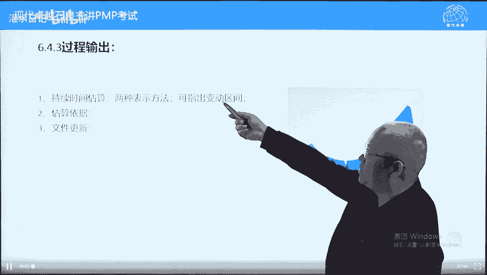

一种呢叫确定性的表示方法，一种呢叫概率性表示方法。

确定性能表示a活动啊。

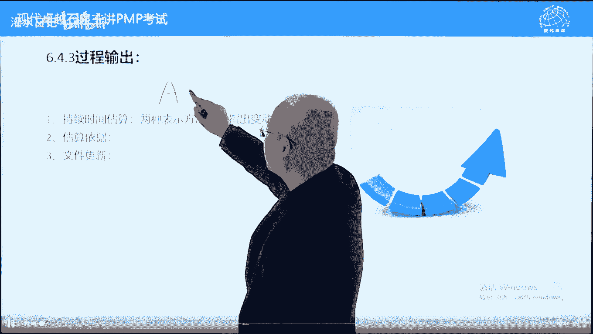

a活动重新写一下，a活动八天，这叫确定型，什么意思呢，a活动八天完成概率百分之百，这叫确定性，另外一种呢叫概率型，概率型的话呢，它会表示出叫变动时间，或者说呢它的一个叫呃不同概率的一个区域。

我们理解写成什么呢，八天加减两天，这是概率型的，啥意思呢，就是a活动50%的概率，八天完成标准差是两天时间，怎么理解，先说一下结论，待会再解释一下，为什么这种情况，就是a活动八天完成概率50%。

50%啊，十天完成的概率84。13%，为什么是这个数，正态分布决定了它六天也能完成，概率呢是15。87%，概率型的表示方法要先确定概率，然后呢再确定不同的工期，这个呢是概率性的，为什么这种情况什么原理。

我们马上讲一下正态分布，在讲之前呢，我们把这两个再说一下，估算依据相当于活动属性，对于活动清单的描述，我们需要对每一个估算结果来进行一个文字描，述，怎么估算出来的，用什么方法可靠不可靠，考虑什么因素了。

文件更新就是把结果记录一下，这就不多说了，下面呢我们看一个内容，补充内容叫正态分布原理，我们刚才讲的八天加减两天，那为什么是十天，80。136%天呢，是15。87%，怎么来的，我们呢来说一下。

这个是正态分布原理需要掌握一下的，因为呢很多经济型模型都要用到的，这个呢也不是很难，先说一下什么叫正态分布，它也叫高斯分布，谁发现的高斯，有人说高斯是不是数学家，高斯呢是科学家，他在数学，在天文。

在物理方面都有很伟大的贡献，但是呢全世界公认的它对于人类最大的贡献呢，不是别的，就是正态分布，高斯呢在天文学方面，他们呢创造一个方法啊，只只需要知道呃，叫行星的三个三个点就能算出行星的轨道呃。

在数学方面呢也很很多东西啊，像那个叫等差数列，1+2+3加到100怎么算的，他得出一个结论就是用乘法来计算，七岁的时候就发现了，17岁的时候呢又解决问题，正17边形怎么画，用直尺圆规画正17边。

17边形啊，一晚上解决了一个1000年的一个难题，这个呢数学方面也是天才，物理物理学方面有一个单位叫高斯，高斯指的是磁场吧，而另外一个呢在电学方面有个定律，高斯定律也叫右手定律，发电的一个定律啊。

它的贡献很大，但是呢人类最大的贡献，对人类最大的贡献，公认的是这张图，这张图呢也叫中型曲线，也叫高斯曲线，为什么说这个正态分布是他最大贡献的，因为德国有一个一种钞票，在欧元出现之前叫马克十马克的钞票。

上印了一张遮态分布的曲线和一个高斯头像，说明呢高斯对人类最大的贡献是生态分布曲线，什么原理，大概说一下高斯呢发现对于随机数列，什么叫随机数列，有一本书叫黑天鹅，这里面提到了一个概念，叫什么呢。

叫平均斯坦，和极端斯坦也叫平均王国，和极端王国在平均王国，这叫随机数列，随机数列指的是平均斯坦，平均王国，什么叫平均王国，它的变化不是极端变化的，比如说人的年龄体重身高，包括你从家到公司距离这些的话呢。

都属于随机数列，它的偏差没那么大，但是呢财富这块就不一样了，财富的话，那1%的人掌握了全世界，99%的财富，它不符合随机数列，包括股票期货的上涨下跌，它会突然波动，这个突然波动的话呢也不符合随机数列。

尽管如此，符合随机数列的还是比较多的年龄，身高体重，从家到你公司的距离之类的，好面对随机数列，我们可以处理一下，比如说我们某一个把某一家公司的人的年龄，我们把每个年龄呢相加相加之后呢。

除以一个人数叫平均啊，这个30 35之类的，把每个人年龄相加相加之后呢，平均得到一个值叫平均值，比如说平均值33岁，好我们呢再处理一下怎么处理呢，把每个人的年龄减平均值减完之后，平方平方之后再相加相。

减完之后再去平均除以二，平均一下除以这个人数平均一下之后呢，再开方，把这个开根号啊，开完根号之后叫西格玛，叫方呃，叫标准差呃，标准差的平方我们叫方差，平均值我们叫n平均，跟标准差之间存在统计学关系。

什么同性关系，平均值加减一个西格玛，这都是西格玛，它的覆盖范围68。26%，平均值加减两个，西格玛覆盖范围95。45%，以此类推，直到六西格玛，六西格玛风格m a一减3。4%啊，3。4%，只有3。4个。

百万3。4%个，不在这个区域内，相当于零缺陷，怎么理解这个数值，我们简单说一下，还举这个例子，比如说平均年龄33岁，标准差如果是五岁的话，如果算出来是五岁啊，比西格玛等于五岁的话，平均值加减一个标准差。

就是33岁加五岁减五岁，年龄在38~28岁之间的人多少呢，68。26%，平均值加减两个西格玛，就是43岁到23岁之间的人有多少呢，95。45%，它肯定正确，往下类推，还是一样的，这叫什么呢。

这叫正态分布原理，对于随机数列，我们处理一下，把所有的年龄身高体重也一样的，所有的数值先去相加平均，平均完之后得到平均值，再用每个实际数值减平均值平方，目的是消除正负号，然后呢再相加再平均。

再开发得到一个值叫标准差，平均值加一个标准差，覆盖范围68。26%，平均值加进两个标准差，覆盖范围呢95。445%，加减三个标准差，95。73，放之四海而皆准，只要这两个数据是正确的。

对于年龄身高体重都可以这样算的，这样的话呢，我这个方法让人类的人类的预测成为可能，在高斯分布正态分布原理出现之前，人类呢对很多事物的预测，都是跳大神的方式来去预测的，占卜的方式跳大神预测的。

但是呢正态分布让人预测成为可能，包括保险公司收保险费，算赔率，也必须按正态分布，这个区域的人的年龄平均年龄多少，活到70的概率有多少，活到80岁的概率有多少，我们来算一下60岁的人人寿保险交多少钱。

每年七岁的人，他要想办人寿保险，要不要给他，要不要收藏，要不要接受这个业务，这个呢用正大公布呢就能够去解决这个问题了，在中国以前再举个例子啊，以前的话呢解放前人的平均年龄比较低，比如说45岁左右吧。

平均是45岁，标准差呢可能是五岁，我们可以倒推倒推什么呢，某一个人活了70了，根据正态分布表，这个呢只是一个列举的，有跟对数表一样的正态分布表，零点一个0。2的都能算的。

我们可以倒推这个70 70岁的人，按照这样一个标准差和标准差和平均值的话，他再活一天概率有多少，算完之后可能不高，80%几，80多，什么意思呢，10%几的概率，第二天可能会挂掉。

所以呢中国有句俗话叫70不留宿，70岁的人不想在你家住，不要强留，中国人强调落叶归根，为什么呢，正态分布能解释的，80岁的人，我们可以倒推一下，他再活俩小时的概率有多少，算一下呢。

可能百分之八十九十左右，有10%以上的概率，两小时之后可能挂掉，当时的平均年龄比较低呀，寿命比较低，那中国有句俗话叫什么呢，80不留坐，不想在你家做，不要强留，也就是说80不留饭。

80岁的人不想在家吃饭，不要强留，这个呢中国有这样的俗话，但是呢没有理论支持，正态分布呢，可以支持一下这个理论，大家呢需要掌握一下什么呢，平均值加减一个标准差，平均值加减两个标准差大概的范围是多少。

包括三个，六个的话呢，六西格玛是个噱头啊，质量管理的一个概念叫质量保证的一个原理了，或者说质量保证持续改进的一个目标，零零缺陷好，下面呢我们回到这张图，这张图的话呢，我们可以看一下这张图呢平均值100。

比如说大家考p mp模拟的分数。

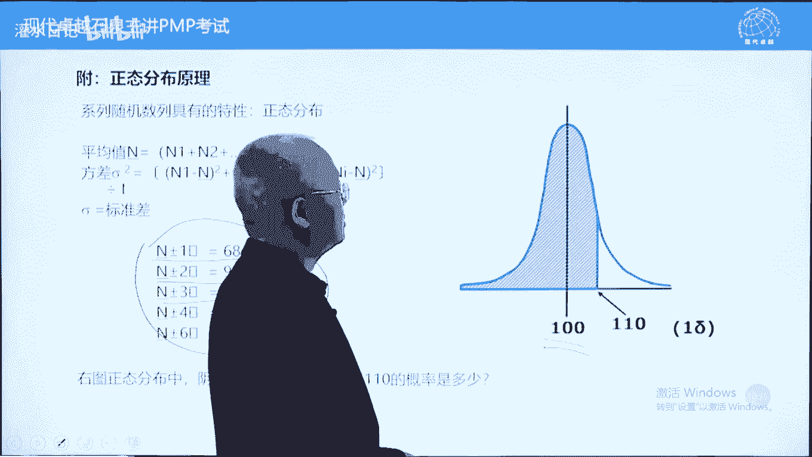

第一次模拟平均分100，标准差呢标准差是十分，因为110是100加一个标准差的位置，标准差一个标准差正好是十好，现在呢问你一道题，有一个大龄女青年多次相亲失败。

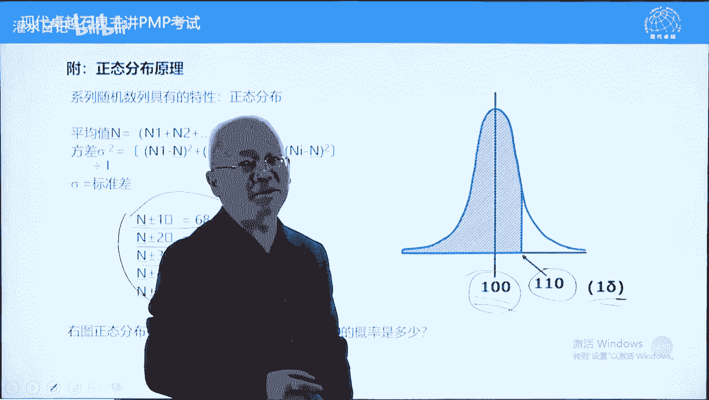

内心留下了阴影，求阴影部分面积算一下他们会不会算啊。

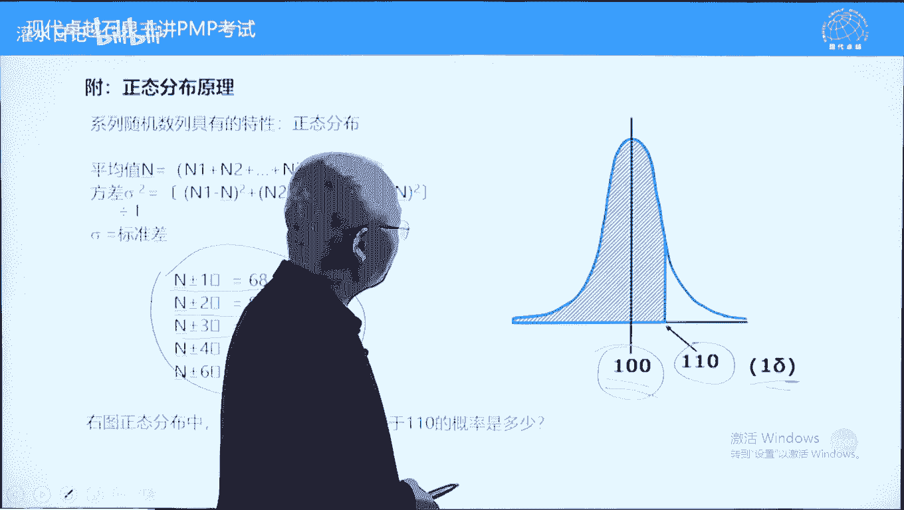

我先不提示很多的，大家自己算一下，根据什么呢，就根据这一个平均值加减一个姓马，68。26%算出来了吗，结果呢就是分数小于110分的人有多少呢，84。13%怎么算的，先说一下平均值的位置是50%的位置。

50%的人分数呢在100分以下，50%在一本100分以上，这一块50%了啊，现在呢只需要求这一片儿的大小就可以了，而这片呢我们不知道多大，它是平均值加一个西格玛，但是我知道平均值加减一个西格玛就是90。

90到，怎么弄，90~110斤的范围多少呢，68。26%，这个大屏幕对称的那90~100亿之间，68。26%，那100~110之间有多少呢，68。26的一半，34。13%，那这个怎么来的。

百分之50 50%啊，加34。13%，等于84。13%，分数在100以下的84。13%，当然我再问分数高于110等于多少呢，50%减这一块就可以了，15。87%好，这个呢是正态分布原理。

这个原理的话呢能了解更好，不能了解的话呢，只需要掌握三点，估算三角分布，贝塔分布就可以了，好关于三角分布，三角分布呢我们看一下三角分布，直接这样算，平均值，直接平均的除以三平均的。

而贝塔分布的话是加权之后平均的。

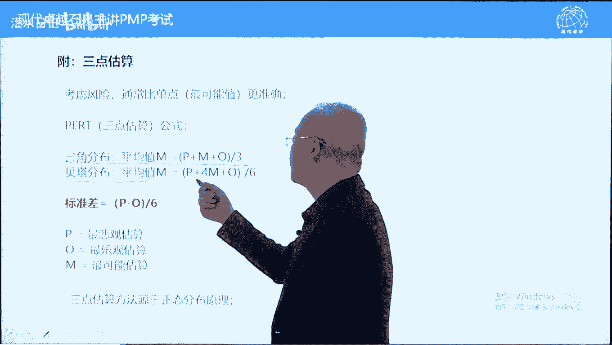

最悲观加最乐观加四倍，最可能再除以六，最悲观加最乐观再加最可能再除以三就可以了，这两个都属于正态分布原理的变形，为什么呢，这态分布计算量太大太复杂，50年代的时候呢，没有计算机或计算机不流行，不普遍。

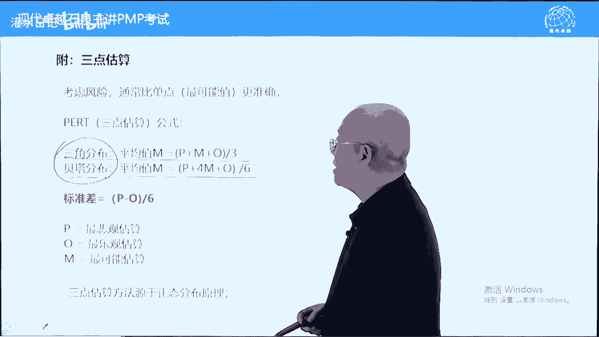

计算起来很麻烦，美国军方发明了一种方法，就是什么呢，用三个点来去替代找平均值，找标准差，那标准差呢最悲观点最多3÷6，这个考试中目前不考，考试中这两个呢属于考点，但是呢第六版已经考了1年多了。

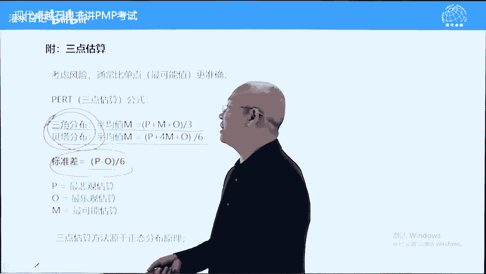

还没有考过，还没有考过这样这样一个题目，但是呢原理是需要知道的，考试的时候呢用的不多，就这两个公式知道就可以了。

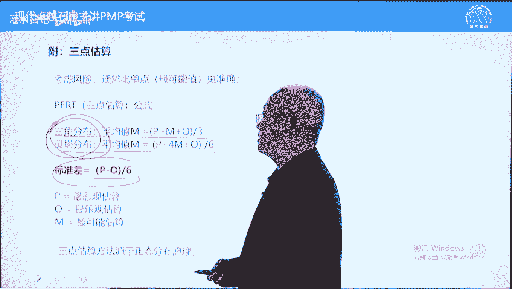

对于进度的成本，进度的估算，持续时间估算只有这个公式，对于成本的估算呢，两个公式都有，如果算计算计算考计算题的话呢。

题目中应该会直接告诉你，是三角分布还是贝塔分布，如果不告诉你的话呢，两者都算一算，看答案呢跟哪个比较接近一些啊，这个呢是我们讲的三点估算的一个概念，好下面呢我们进入6。5叫制定进度计划，制定性。

这句话呢前面我们说过了，网络图，有了逻辑关系，有了现在的持续时间，也有了，我们呢把时间填到网络图里面去，生成一个进度计划，当然了，这个进度计划呢还需要进一步的进行一个编排。

因为呢它需要有每一项活动的开始和完成日期，否则的话呢不叫进度计划，好具有计划日期的进度模型，精度模型也可以叫进度计划，它除了表示进度计划，它也也是强调进度计划的编制方法，有概率型，混合型和确定性的。

下面呢讲三个词汇，项目日历，资源日历和自然日历，什么叫项目认领，项目里这样解释的，项目计划开展工作的时间叫项目日历，其实呢就是进度计划，进度计划告诉我们这个活动什么时候做，那个活动，什么时候做。

跟进度计划可以划等号啊，项目日历其实就是进度计划，但是呢项目日历一般来说有一个约定，什么约定呢，不包括工作，不包括双休日，节假日，为什么项目这里不包括节假日和双休日呢，啊原理很简单，劳动者是需要休息的。

一张一弛，文武之道，该休息要休息的好，另外一个概念呢叫资源人力，什么叫资源利，这个概念要重要一些，资源可供项目使用的事件，项目干活需要资源的就是人员，我们在项目管理中讲资源包括实物的。

但主要讲的是团队成员，资源人力啊，资源人力的话呢，它显示项目资源可供项目使用的时间，就是这个资源，比如说有一个美工，它哪一天可供项目使用，它哪一段时间之内都可以，比如说美工这两个月时间有空。

但是呢不是说每天都有空啊，没这两个月的每一周的周二和周四下午，他有时间供项目使用，那每一周的两个月之内，每一周的周二周四下午，这个时间呢叫该资源，对于我们这个项目的资源日理资源运力呢。

针对某个项目可供项目使用的时间，什么叫自然日历呢，就是天文日历，天文日历呢叫自然日历，它包括节假日，双休日，这两个人之间有关系，什么关系呢，资源人力支持项目日历，项目力要想实现。

必须得到资源利日历的支持，那这个呢也很容易理解，很容易理解了，下面呢我们讲一道题，来区分一下项目日历，自然力和自然人力，大家呢注意一下这道题这样说的，以前考过这道题，说项目中有一项工作是铺设水泥。

水泥铺完之后需要干燥两天，才能够进行后续工作，项目里特别有经验，他正好把水泥干燥，这两天安排在了双休日，就礼拜五下班前铺完，礼拜六礼拜天让水泥干燥，请问该项命令节省了什么日历。

这三个选一个节省什么日历了，好答案呢，是节省了自然日历，这两个未必啊，自然人理必然节上两天，项目里有没有节省，项目里有没有节省，这样理解啊，就是水泥肝脏这个工作能不能不做，不行的，虽然不是人在做。

但是呢上帝在做，所以呢项目里没有节省资，源，里没有资源做这个事情，更更更无所谓资源人力了，自然人力必然减少两天，不信你排一下，肯定减少两天的，所以呢最可靠的答案最靠谱，答案是自然人力减少两天好。

下面呢我们看一下过程的输入工具和输出，前面呢已经有了叫网络图，进度，网络图现在呢需要在进入网络中填上什么呢，填上一个持续时间，也叫活动，持续时间贴上之后呢，就可以排除进度计划或进度表了。

进度计划也可以叫进度表，好这个协议说一下，指的是我们跟供应商签的协议，供应商的合同必须要满足，或支持进度计划才可以，这个呢也要注意一下的好，其他内容呢像风险能一册强调的是什么呢。

强调的是要为风险预留储备，管理储备，包括应急储备，我们呢前面提到过了，不多说了啊，下面呢我们看一下过程的工具啊，这个过程工具呢首先一个叫进度网络分析，注意这个进度网络分析是一个概括。

他把下面的所有工具呢，都当成进度网络分析的一个方法，但是这里面的话呢，我们还专门讲一个内容叫什么呢，正推法倒推法不属于其他工具，就属于系统网络分析啊，正推倒推目的是什么呢，确定关键路径，确定关键路径呢。

我们用正推倒推法后面的关键中心法，资源优化建模技术，在后面的一个一个讲，这概念比较大，除了这些技术之外，还有一个专门的正推倒推，没有单独提出来啊，好正推倒推的话呢，我们马上讲一下，好看一下关键路径法。

关键路径法呢它也叫确定性模型，刚才讲过了啊，确定性模型什么意思，它的工期估算都是按概率为百分之百来估算，每个活动的持续时间，百分之百来去估算持续时间的，他呢是在什么呢，呃在理想情况下的理论工期。

它估算项目的最短时间，最早完成时间，问一个问题，项目有没有最长完成时间，答案是没有的，所以呢我们只能找项目的最短完成时间，最快多长时间完成，这个时间我们叫关键路径，关键路径就是整个项目完成的最短时间。

但是呢它是整个项目的啊，在网络图中的最长路线，说法好像有点矛盾，其实不矛盾的一点都不矛盾，我们呢讲一下关键路径之后，我们再回过头来看一下关键路径怎么推算的，我们呢还是看这张图。

这张图呢前面的这个内容跟这边内容都没有变。

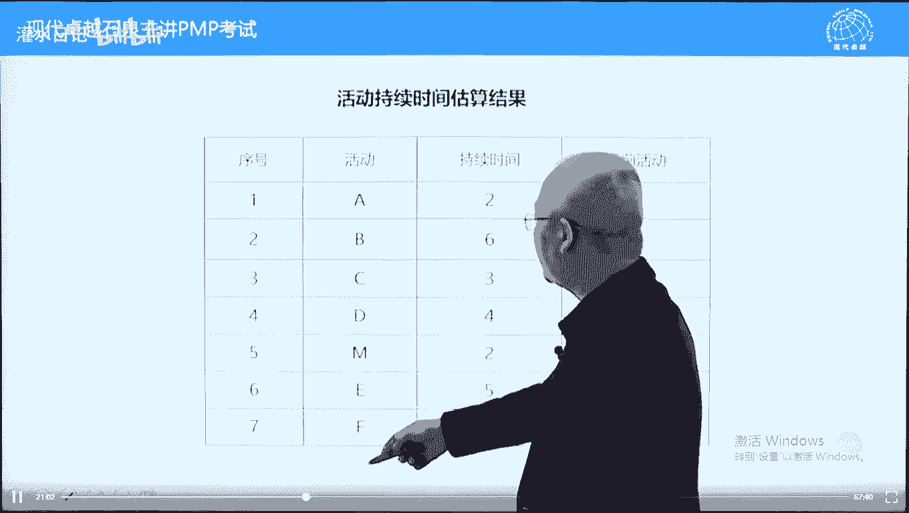

中间多了一个，我们呢刚才有一个估算持续时间。

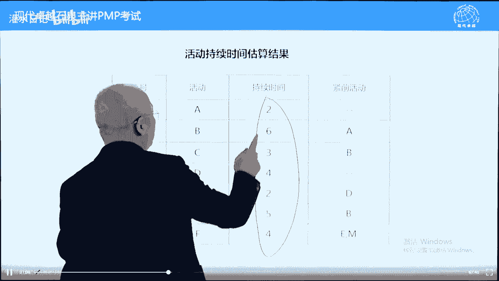

把持续时间估算了，我们都按天来算了，理解为天啊。

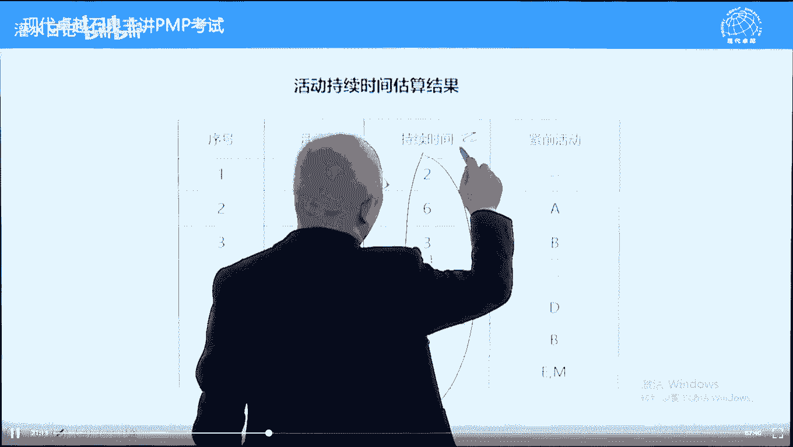

a活动两天，b活动六天，c活动三天，d活动四天。

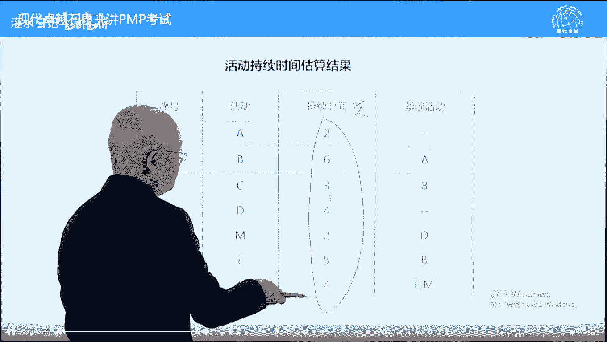

以此类推，这个呢我们叫确定性模型，为什么呢，他后面没有加减号，什么叫确定性的估算，关键路径，确定性估算a活动两天完成概率多少呢。

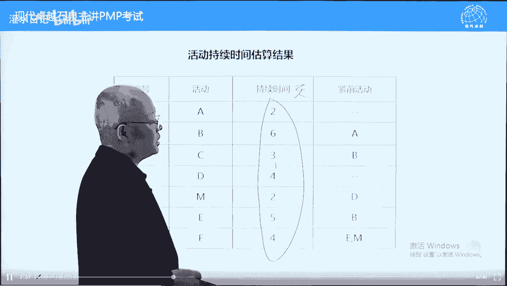

百分之百c啊。

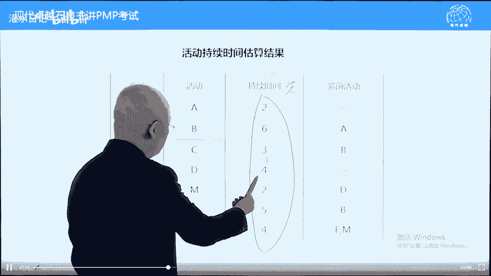

c啊，d啊之类的都是如此，这个叫确定性，每个活动持续时间都是百分之百，现在呢，大家把这个时间，在我们刚才画的网络图中填一下，如果你刚才网络图没有画很好，你呢重新画一下，把美国活动工期填在哪里呢。

填在圆圈里面，每个圆圈代表一个活动啊，填在圆圈里面，填完之后应该是这样一个情况，自己先填一下，停下之后呢，再看我的内容，调完之后呢，这种情况啊，三条路线，每个活动都有持续时间了。

好那这个项目最短需要多长多长时间完成呢，我们算这条路线，这条路线几天呢，11天，这条路线呢几天呢，这条路线十天，这条路线多少天呢，17天啊，最短最短多长时间能完成呢。

完成这个项目需要把所有活动活动都完成，所有活动都完成，最短需要多长时间呢，17天，这个17天ab ef叫关键路径，它决定整个项目的最短工期，整个项目没有最长工期，没有最长空气啊，17天以上都可以完成。

但是呢最短最短实习天完成，这个呢叫关键路径，考试的时候呢，关键路径就这样算，把逻辑关系画好之后，把工期填进去，然后呢算哪条路线最长，它是关键中心，关键路径是网络图中用时最长的路径。

它代表着整个项目的最短工期，这个项目最短十天11天都完不成啊，最短最短17天才能完成，自己慢慢体会刚才那那两句话不矛盾的，关键路径，网络图中用时最长的路径，决定整个项目的最短工期，好图形简单一些。

我们可以直接这样推送，但是呢如果图复杂一些的话呢，我们这样心算算不出来的，另外呢这张表不叫进度计划，它只有持续时间，我们能推出这个项目多长时间能完成，但是呢他没有显示每一项工作最短，什么时候开始。

什么时候完成啊，不是不交，最短每一项工作什么时候开始，什么时候完成，整个项目什么时候开始，什么时完成，它没有标，这个叫起始时间，我们需要呢给这个网络图，有了持续持续时间的网络图标。

一个计划开始和计划完成时间，那怎么标呢，我们下面呢开始练习一下怎么标，大家呢我们这样来说，按理来说，这边呢应该是标具体日期，比如说今天6月6号，6月6号开始，每个活动最早什么时候开始。

最晚最早什么时候结束，这叫什么呢，这叫正推法，啥意思，我们在一天都不耽误的情况下，我们呢给每个活动标一下开始时间，完成时间，为了学习方面，我们简单一些不标具体日期了，我们标零零什么意思呢。

第零天开始的时候，我们开始这个项目啊，叫第一天结束吧，不叫第六天开始，第零天结束的时候，第六天开始跟第六天结束没有区别的，我们都用结束时间，第零天结束的时候，我们开始这个项目。

那a活动呢最短最早应该在第零天开始，最早呢在第二天完成，这个能理解吧，这叫最早开始，最早完成写在左上方，每个活动的左上方，我们写一个最早开始，写一个最早完成好，以此类推，b活动最早第二天结束的时候开始。

第八天结束的时候完成，这也能理解吧，当然了，也有人不这样标，怎么标呢，这边标一，这边标二，这个意思呢就复杂一些了，这个一表示第一天开始的时候开始，二表示第二天结束的时候结束，那这边呢标三和八。

第三天开始的时候开始，第八天结束的时候结束，这种办法呢有一个不好，什么不好呢，它容易乱，另外一个呢2-1跟里面数字对应不了，这个8-3根连数字对应不了，还得加一才可以，所以呢为了学习方面，我们简单一点。

按照第六天完成的时候开始，然后呢零天完成的时候，a活动第零天刚完成的时候完成，第二天完成的时候，a活动结束了啊，b活动也是一样的，这叫正推法，这个地方呢在左上角，右上角。

给每个胡同标一个最早开始和最早完成时间呃，正常应该让大家自己标的，我们自己我们先标一下啊，标完之后呢，我们会发现有一个概念叫路径汇聚和m，同时呢会遇到f，那f的最早开始是取13还是取六呢。

e呢是13天完成，第13天结束的时完成，m呢是第六天结束才完成，那f取13还是取16呢，取13，为什么呢，因为e和m都完成f才能开始，如果取六的话呢，一没完成，f不能开始，这叫正推法，取大值取大值啊。

两个逻辑汇聚在一起，取大值，包括and也是一样的，这是11，这17去哪一个取17，因为这两个都完成它才能开始的，这样的话呢，每个活动有了一个最早开始和最早完成时间，关键路径呢我们只是推了一半。

还没有确定哪一条是关键中心，其实呢也是说那这条是关键中心，好关键路径怎么确定的，我们在这说一下，他呢是利用总时差，总时差呢也叫进度，网络的灵活余地，总时差为零或为负的路线叫总时差，什么叫总时差呢。

每一个活动最早开始，最早完成，最早开始，最早完成，他们之间呢有一个浮动时间，那总时差呢是正推倒推推出来的，现在我们只正推，知道每个活动最早什么时候开始，最早什么时候结束，不知道哪个活动最晚什么时候结束。

最晚什么时候开始，我们呢还要倒退一下，什么叫倒推，假定17天不变的情况下，然后呢每个活动最晚什么时候结束，什么时候开始，比如说c最晚17天结束，最晚的话呢第17-3，第14天必须要开始，这样一来的话呢。

c活动的最早开始跟最早开始时间有一个时差，这个时差呢我们叫总时差，也叫总浮动时间，几天呢，六天这样算的14-8=6，这个呢叫总复读时间，什么意思，c活动在不影响整个项目工期的情况下，他第八天开始也行。

第14天开始也行，他有六天的幅度时间，这六天给这个网络图带来了灵灵活余地，他有六天的灵活余地好，我们再算一下f 1773最早开始，最早开始完全一样，这个是f活动的工期是死的，不能有任何的耽误它的总时差。

13-13，17-17=0，好这个呢是总时差的概念，总时差是通过正推倒推确定每个活动的计划。

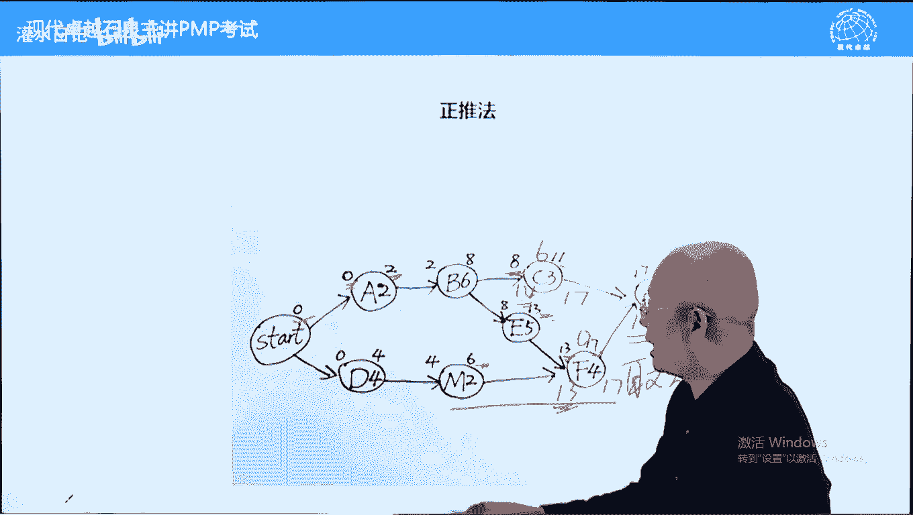

开始计划生日期，然后呢用最早开始减，最早开始，最早完成减，最早完成，我们来看一下图，这个图呢其实画好的倒推，每个活动在不影响17天完成的情况下，我们倒推一下他最晚什么时候结束，最晚什么时候必须开始。

写在左左下角，右下角，做完之后呢，这里面有个情况啊，就是b活动是取这个八还是取14，应该取小的，不应该取大的，为什么呢，如果他取14会影响e活动的，因为他没完成e活动呢是不能够呃，开始的倒推法取小值。

知道就可以了，倒推完之后，美国动呢都有四个数值，最早开始，最早结束，最晚开始，最早结束，总时差怎么算的，跟大家说一下概念啊，也叫总浮动，时间等于开始解，开始完成点完成，再加一句。

最完全最早下面点上面讲完之后呢，我们写在它的正上方，a活动总时差为零，b活动也是零，e活动也是零，f活动也是零，c6 天，第七天，m7 天，每个活动的总时差有了，我们也要强调一下，总时差。

禁止活动路线上总时差也来自于活动路线上，本身没有总时差的，只有活动有总时差好，什么叫关键路径，关键路径不是说我们肉眼看哪条最长，就是关键路径啊，它有科学定义什么，科学定义。

路线上所有活动总时差为零或为负的路线，叫关键路径，叫关键路线，这个呢是关键中心的一个定义啊，再说一下网络图中，就是每一项活动总时差为零或为负的路线，叫关键路线，我路径叫关键路径。

就是路线上所有活动总时差为零或负的路径，叫关键路径，这里面的a b e f总时差都为零，所以呢它是关键路径，而abc里面这条路线上有一个不是零，它就不是关键中心，这条呢有两个不等于零，它也不是关键中心。

有人会问关键路径总时差怎么可能是负的呢，在规划过程中，总时差最小等于零，但是在执行过程中有可能是负的，比如说a活动延误了下暴雨，延误了第四天才完成，那b活动最早第四天才能开始。

但是呢在不影响17天工期的情况下，b活动最晚必须第二天开始，他这个不受影响的，你要想实际点完成，它是倒退过来的，二不受影响，2-4等于-2，当关键路径出现负的走势差的时候，表明进度延误了。

不采取措施必将延误，只要延误至少延误两天的，这个呢是为什么会总是差是负的，如果是负的话呢，它也是关键路径，这个呢是关键路径正推倒推倒推来之后呢，算总时差，根据总时差为零。

回复的路线来去确定关键路径和关键路线，好，关键路径确定完之后，我们呢一个原理叫向关键路径要时间，向非关键路径要资源，这个原理也很重要啊，什么叫像关键路径要时间，这个项目最短17天完成。

你要想压缩16天或15天完成，必须压缩a b e f压缩cd m不起作用的啊，这叫向关键路径要时间，什么叫像非关键路径要资源呢，就是如果比如说第五天，第呃，第四天吧，d活动也需要资源。

b活动也需要也需要资源，资源不够优先紧着b活动来去使用资源，这叫向非关键路径要资源，保障关键路径它更加重要一些，这两个原理呢是需要知道的，正推的倒推算出总时总幅度，时间就能算关键中心了，再说一下。

考试的时候不用那么麻烦，关键路径的题目可能会有两道题，考试的时候呢直接写逻辑关系，写工期，一般来说考试的时候不会出现八个活动，我们呢用心算算一下哪条路线最长，它就是关键路径，但是呢我们讲原理的时候呢。

要讲的细一性，刚才呢我们还讲了一个总时差计算方法，跟大家讲了一个比较简洁的简介，简简单的计算方法，开始请开始完成检完成这个要注意啊，下面呢还有一个内容叫自由市场，点到为止。

这个内容呢我们简单说一下什么叫自由时差，每一项活动在不影响整个项目，不影响整个项目完成的前前提下，也不影响结合活动按时完成的，最早完成的情况下，它可以延误的时间是多少，再说一遍啊。

总时差是不影响整个项目工期，而自由时差不光不影响项目工期，它连紧后活动的时间都不会影响，它能够浮动的时间有多少，这叫自由市场，怎么算的呢，这样算的c活动自由时差等于本活动紧后，活动最早开始17减。

本活动最早完成减11=6，好，再说一遍啊，在不影响结婚活动最早开始的情况下，本活动可以延误的实现，这个呢叫自由市场，c的话呢，17-11，因为end呢最早17天开始，他呢17天就完成了。

在不影响不影响解封活动，最早开始的情况下，c活动可以延误六天，好我们再看m活动，这不影响结合活动14天完成的情况下，m的是最晚第六天完成啊，他可以精准的时间，13-6=7。

就是结婚活动最早开始减本活动最早完成，这个呢是本活动的自由市场，我们再看d4 减4=0，d活动有总时差，简单说一下结论啊，有总时差才可能有自由市场，但是呢有总时差未必必然有自由时差，自由时差的话呢。

像这个有这个就没有好，总时差是共享的，自由时差的话呢，它是产生总时差的原因，由于呢m活动需要等f活动，等e活动完成，f活动现在开始，它呢有有自由时差，有七天自由时差，这七天自由时差会转换成总时差。

而总时差呢在路线上是共享，是传导的，这两个这两个活动共享七天的总时差好，关于自由时差的概念呢比较难一些，考试中呢也不是一个考试范围，我们呢呃能理解更好，不能理解问题不大，只要记住总时差怎么计算就可以了。

总时差的计算开始减，开始完成，已完成，有正-0是大于负数的，越大越好，总时差越大，说明呢项目的进度越安全，越不影响我们的这个按时完成，下面呢我们回到刚才的内容，看一下关键路径，搜完之后。

我们再回到这个内容里面啊，关键路径法找到完成项目的最短时间，但是呢它是一种理想情况下的理论工期，他假定资源是无限的，它假定资源无限，他不考虑资源限制的，另外一个呢根据总时差来确定总差怎么确定呢。

正推倒推算出每个活动最早开始，最早开始，最早完成，最好完成开始减开始完成点完成，得到总时差，路线上，所有活动总时差为零或为负的路线，叫关键路线或关键路径，好，关键路线。

关键路径它决定了整个项目的最短工期，它也是整个项目中用时最长的路径，用时最长跟最短工期不矛盾的，好开始请开始完成检，完成公式需要记住啊，90差为负，刚才解释了一下，在执行过程中才可能是负的。

在这个呃规划过程中，最小是零，好像关键路径要实现向非关键路径要资源好，关于呢关键路径呢我们就讲到这，下面呢我们看一下制定进度计划的其他工具，有一个资源优化技术，什么叫资源优化技术，我们讲过啊。

关键路径法，它假定资源无限，他先是理论理想情况下的理论空期，但是呢一定一一旦这地方关键路径，我们就要考虑资源限制了，资源优化呢是在资源限制情况下，我们进行调整的一个技术啊，包括解决两方面的问题。

一方面呢资源不足，当资源不足的时候，我们一般都是通过延长资源的使用时间，来解决资源不足问题，比如说挖一条渠，我计划呢一天花完，我需要四个人，但是一看没有四个人，只有两个人，怎么办呢，把工期延长为两天。

这叫什么呢，这叫资源平衡，资源平衡解决的是叫资源不够，我们呢通过延长资源时间解决资源不够的问题，它的结果是改变关键路径，一般是延长好，我们还有另外一种技术叫资源平滑，什么叫资源平滑呢。

就是当某些时间时间段，资源的使用忽高忽低的时候，有波峰波谷的时候，我们呢尽量削峰填谷，让资源的使用呢更加平滑一些，防止出现什么呢，防止出现资源超负荷，比如说某一个时间段，某一个资源。

他需要工作16小时才能完成给他的所有工作，或者某个设备必须工作24小时才能啊，才能满足给他安排的所有工作，给他的工作安排的很多，那怎么办呢，我们通过让一些非关键路径的工作，往后排或往前排，往前调整。

往后调整来解决资源超负荷的问题，超过负荷线的问题，让资源的使用曲线尽量的平滑一些，这叫资源平滑，它的结果不改变关键路径，它呢是削峰填谷，这两个呢都解决资源问题，资源超负荷，资源不够的问题。

但是呢有个区别，它呢改变关键路径一般是延长他呢，另外一个呢不好意思，他是削峰填谷，在不改不改变关键路径的情况下，解决一个资源超负荷的问题啊，这个呢是都是解决资源问题的好。

另外呢我们再看数据分析中的假设进行分析，假设经济分析再说一下，任何的计划都建立在大量假设基础上的，比如说我们炒股票有两个假设，第一个呢股这支股票会涨，另外一个假设呢我能在高点卖出，一旦假设不成立。

就是风险就会出现问题，我们就需要应对了，而季度计划呢也是建立在大量假设基础上的，比如说人员能按时到位，供应商的能及时把结果交付出来，包括的客户不会要求提前，不会突然要求提前完成。

或者说呢政府不会出台新的政策之类的，这些情况下我们才能够实现进度计划，而这些假设条件一旦不成立，我们就需要应对了，所以呢假设进行分析是考虑各种假设条件，来为假设条件呢制定应对计划。

它也叫what if分析，如果怎么样，if what if分析，如果怎么样，我们应该怎么应对他呢，假设各种情况，然后呢制定相应的应对计划，比如说有人辞职了怎么办，供应商延误了怎么办，突然出现天气灾害了。

我们应该怎么办，尽量减少对进度影响，这个呢叫假设性分析，另外一个呢叫模拟模拟，其实呢严格来说也属于，假设经济分析的分析中的一项技术，只不过呢这个技术呢比较专业一些，它具体用什么呢。

蒙特卡洛模拟或蒙特卡洛分析，书上叫蒙特卡洛分析啊，它指的是模拟真实情景，然后呢来判断这个结果到底可能会是什么情况，或者说我们不同情况下，完成进度的可能性有多少，这个呢叫蒙特卡罗模拟。

它呢是模拟真实经历来进行一个判断预测的，比如说在很多城市红绿灯都有倒读秒，你会发现不同时间段红绿灯时间是不一样的，白天交通高峰期红灯时间，绿灯时间都很长，到了晚上夜里面的时候，红灯绿灯时间都很短。

目的是什么呢，最大限度地提高通过率，尤其是在上下班高峰期，而这个红绿灯怎么样设置，能够实现同样的段道路车流量最大化呢，这个在现实中模拟很难，在计算机中是可以模拟的啊，它可以抓取一些数据。

比如说高峰期高峰高峰路段呃，我们呢有哪些车辆多少车辆车辆的数量，然后呢抓取完车辆的数据之后放在计算机中，我们呢把某一片区域内的红绿灯，让它有机组合在一起，或某一条路，每一条路路线设计红绿灯。

看这十几个红绿灯怎么样的设计，有机的组合让通过率最高，它通过成百上千次的不断的一个变化，组合变化来找到一个最佳的组合，这叫蒙特卡罗模拟，我们呢对于进度这一块也可以模拟一下，我们再举一个例子啊。

比如说有个项目有三个活动，关键路径上三个活动我们叫a bc，注意是关键路径的三个活动工期都是十天，创新工作，那问一下a活动实地完成工期是多少呢，百分之百，因为是确定性模型。

关键路径法b活动时间完成概率多少呢，也是百分百c活动时间换的概率也是百分百，为什么呢，确定性模型，关节中心法，确定性模型，每一个活动工期都按百分百完成来去估算的。

现在的话呢我认为啊这个现在项目工期多少呢，30天能理解吧，串行的30天可以完成，问一个问题，30天完成这个项目的概率是多少呢，还是百分百怎么来的，三个百分百相乘得来的，这概率论告诉我们。

独立变量共同发生概率，各自概率相乘啊，现在我认为工期估算过于保守，我希望激进一些，我要调整完成概率或怎么调整呢，我按照80%的美国活动完成概率，重新为美国活动设置工期。

现在呢美国活动完成的概率是百分之百十天，太保守了，我呢重新调整概率，按每个活动80%概率完成，来设定每个活动工期，美国诺的工期都变成九天了，比如说应该是八天呢，那未必啊，因为它不一定是线性的。

好实地方真概率百分百，就地方生概率80%是可以理解的，现在这个项目的工期变成27天了，好问一个问题，27天完成这个项目的概率是多少呢，是三个80%相乘，乘完之后27天完成该项目概率多少呢，51。

2%概率下降很多，这叫什么呢，这叫蒙特卡罗模拟，这种模拟的话呢，呃最早在战争中用的比较多，据说二战期间有一个战役叫中途岛海战，当时呢就模拟过，当时没有计算机，很多概率是用骰子来去掷骰子来模拟的。

比如说飞机扔扔炸弹，能够投到甲板上，或者说呢能对航母造成重创的概率是多少，有高有低，掷骰子的方式来确定高低的，中途岛海战海战之前呢，日本的一个上尉，他呢参谋不打，他就模拟当时中途岛有四艘航母。

日本日四艘航母去夺取中途岛，美国呢当时中途岛上有这种叫陆地起飞的飞机，也有两艘航母，然后这个上位呢就模拟模拟呢，美国的飞机都飞过来来去轰炸航母，有多少架飞机能突破封锁封锁线，能投下炸弹。

有多少枚炸弹能击中航母，有多少枚炸弹呢能击中航母的要害地区，要害区域，导致航母呢受重伤或者沉没，当时呢没有计算机，那怎么办呢，概率高低，掷骰子看运气的，治完之后呢，模拟的结果是。

四艘航母将受到九枚炸弹或鱼雷的严重攻击，导致什么呢，两艘沉没，两艘重创，失去战斗战斗力好，这个结果呢报给南云中医之后，南云中医当时总指挥啊，南云中医不屑一顾，说大日本帝国的红军不可战胜。

怎么可能是这样一个悲惨结果呢，你这个掷骰子不靠谱的，但是呢战争结果一模一样，九枚炸弹命中四艘航母，两艘当场沉没，两艘重创，后来有人去评论说，上帝掷的骰子是不容置疑的。

这就是一个蒙特卡洛模拟战争中是可以模拟的，在交通信号灯上也可以模拟，在进度成本中也可以模拟，不多说了，下面呢我们再看另外一个内容，提前量之后量，这个提前量之后量呢是客观存在必须要考虑的，当然了。

我们可以通过调整或使用提前量，日后量呢来对进度计划进行一个调整，或进行一个叫改进，进度压缩，说一下，当时间不够的时候，我们排完进度计划，客户认为时间不够，时间太长了，我们呢希望缩短的时候。

我们使用进度压缩，进度压缩呢目的是缩短项目的供给，而进度压缩呢它的前提注意一下，书上强调不改变范围，范围不变的情况下，我们压缩进度叫进度压缩，而压缩进度呢两种主要方式，一种叫赶工，一种叫快速分裂。

这两种都针对关键路径，关键路径啊，但是呢措施不太一样，赶工是在关键路径的活动中增加资源，人越多，时间越短，比如一条渠计划一人挖完需要四天，我现在呢杀四个人，一天能挖完，通过增加资源。

而且在关键路径上来缩短关键路径的活动，持续时间，从而缩短项目工期，赶工增加资源要增加成本，它虽然也有风险，但是它更多的是增加成本，快速进呢，它不是这样一个情况，它是通过把关键路径的活动本来串行的。

变成并行来缩短时间，缩短关键路径时间，从而实现进度压缩，快速跟进呢它更多的是增加风险，成本呢可能不增加，因为它本来定型的变成串行而已，都是要做，只不过呢提前做一下而已，它不增加资源。

所以呢它不增加成本的，赶工呢主要增加成本，书上说呢赶工对成本对风险都有影响，快速跟进的话呢对风险对成本也都有影响，但是呢我们具体判断的时候，赶工主要增加成本，快速跟进的话呢，主要是增加风险啊。

哪一个合理呢，p m i认为赶工更好一些，为什么p m i认为赶工好一些呢，我们分析一下，在一开始我们讲到为一个三角制约，也叫三重制约，tc范围进度成本进度压缩有个重要前提，s不变。

放一边不变的压缩进度，边根据三角形稳定性，三角形任何一条边发生改变，必然导致另外一条边或两条边发生改变，既然s边不变，哪条边要变呢，c边必须要变，所以呢破财消灾合情合理，赶工是合理的。

破财消灾快速跟进呢非常不合理，为什么呢，他减少工期了，但是呢却不增加成本，代价是什么呢，代价是冒险，它增加了很多风险，所以呢p m i认为赶工应该是合理的，它是首选的，快速跟进呢有点不合理。

那我们再回到现实中，工程行业压缩精度，绝大部分使用快速跟进就是并行，比如说边设计边施工边修改，it行业呢都使用赶工加班，延长时，这个叫时间不够的一个问题，区别在于哪里呢，跟人的素质有关系。

工程行业干活的都是农民工，素质比较低呃，让他赶工要给钱才行的，不给钱，人家不加班的，不赶工的，而问领导要钱很难，一般领导不批的，所以呢工程行业都是快速规定它不增加钱，但是呢它极大的增加成本了。

很多工程事故就是把本来必须要并行的工作，必须要创新的工作强行并行，会导致灾难性事故，比如说呃大型的人员伤亡伤亡事故呢，跟很多都跟什么呢，跟这个叫本来应该串行的强行定性有关系，举个例子，脚手架。

脚手架的拆除跟水泥干干燥之间，应该是一个叫串行关系，而且是强制性依赖关系，水泥干燥，脚手架拆除跟水泥干燥，水泥不干，不能拆脚手架，但是呢有些项目为了赶工期，水泥没有完全干透，先拆脚手架了，这叫什么呢。

这叫并行，强行并行，会导致人员伤亡的，会导致出现塌方这些事故的好，工程行业呢用快速跟进多一些，it行业人员素质比较高，都是本科啊，至少大专以上的，不给钱加班行不行，996没问题，007都可以接受。

不要说996了啊，所以呢赶工在it行业多一些，赶工需要增加钱的it行业，加班不给钱，那不加白不加，就这样一个情况啊，这个呢是进度压缩，我们呢待会儿还要做一个练习，就是赶工斜率练习。

其他内容呢大概看一下项目信息系统，并帮助我们制定进度计划，有一种软件啊，不说这个软件，包括pd软件都是专门制定进度计划的软件，因为进度计划有些很复杂，我们能用软件的话呢，编辑起来会快一些，敏捷发布规则。

大家翻一下书，书上有一张图，看一下在哪里呢，在216页，我们前面也画过了，敏捷呢先是一个大范围，叫什么呢，带完成下，从每一次迭代的话呢，从代完成项中去找找这个急需完成的活动，然后呢比如范围确定一个时间。

这个点也是一样的，找找完之后呢确定一个时间，它是这样分迭代周期来去开发的，每个迭代周期也叫冲刺周期，也叫时间和一个意思啊，它的执行不叫执行，它叫冲刺，每个周期叫一个时间和也叫一个冲刺周期。

也可以叫一个迭代周期，书上的意思呢画的比较明确，大家看一下就知道了，好另外一个呢我们再看一下叫进度压缩，赶工一个练习赶工斜率表，什么叫赶工斜率表，好赶工强调在关键路径上去赶，要赶关键路径的活动。

而关键路径上的活动呢，有些赶工成本低，有一些赶工成本是高的，我们呢要尽量赶赶工成本低的活动，这是什么呢，既要在关键路径上，也要考虑成本，哪个成本赶工成本最低，我们干哪一个啊，好先看一下赶工协力表怎么看。

a活动正常工期三天，赶工的话，两天可以完成，正常工期需要40块钱，赶工的话呢，两天完成需要80块钱，赶工需要增加成本，对答案，什么叫赶工斜率，用80-40，赶工成本减，实际减正常成本除以一个赶工时间减。

正常时间2-3，除完之后是负的，什么意思，a活动每改一天工需要多花40块钱，同理b活动每改一天工80-20，除以一个1-2，多花60块钱，c活动没法改，都一样的，d活动120-30除以一个1-4。

等于负的30块钱，就是d活动每赶一天需要多花30块钱，一活动也一样的，每赶一天需要多花35块钱，减完之后去除的每赶一天多少多少钱，那是不是又赶帝活的最好呢，那不一定要确定是关键路径上的工才好赶的。

直接看一下网络图，画出来了，有三条路径，ab ac和ad。

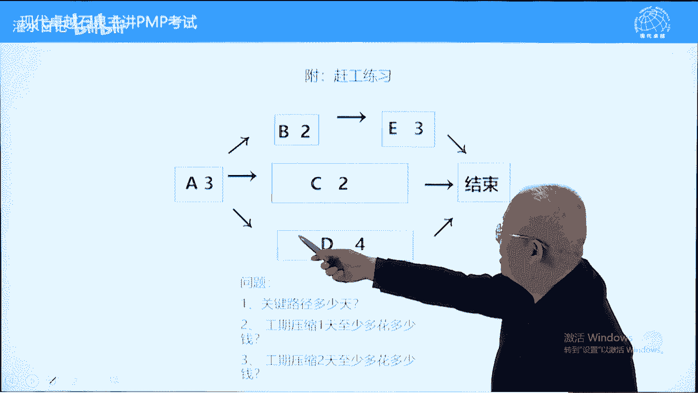

这个呢a b e是八天，ac呢五天，第七天说一下八天，关键周期用时最长七天，我们叫次关键路径，第二场呢，四关键路径我后面不写了，要压缩这个项目，比如说把这个项目从七天压缩到二，从八天压缩到七天。

压缩什么呢，应该压缩a b e这三个活动，压缩哪个活动成本最低呢，我们回头看一下ab a压缩一天多花40，b多花60，e呢多花30，那肯定压缩e是最合适的，所以呢我们要压缩一天最少多花多少钱呢。

压缩一就可以了，多花35块钱好，大家算一道题，难一点的，我们要把这个工期从八天压缩到六天，至少需要多少多少钱，八天压缩到六天，至少需要多少多少钱，大家算一下，做完之后呢再看我的结论啊。

大家可以先暂停一下，做完之后再接着发答案呢，八天要四六天。

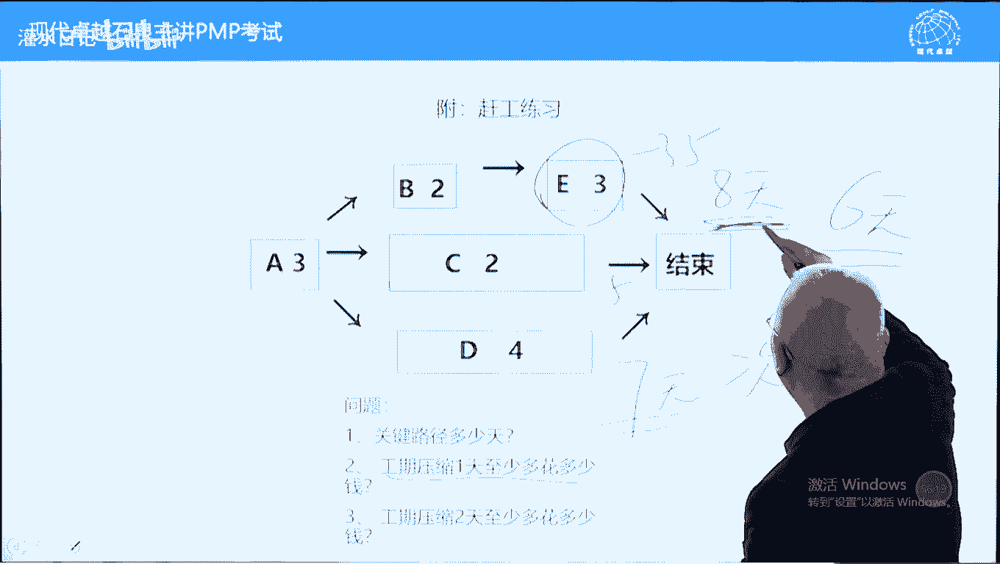

最少多花75块钱，不是100，很多人说100不是啦，75怎么压缩，a压一天，一箭双雕，一压一天，然后呢40+35，75块钱，有人能把e压缩两天不就行了吗，e压缩两金两天，不就是这个呃不呃e压不少。

不好意思啊，e e是多少，e是35天，一压缩成不就70吗，70不比75还少吗，不对的，我们刚才把八天压缩到七天的时候，压缩到七天的时候啊，呃不是七七十五天啊，75元压缩到七天的时候，多了一条关键路径。

a b e变成七天，a d也是七天好，先说一个结论，进度压缩会增加关键路径会改变关键路径，两条关键路径了，你要把这工期从八天压缩到六天的话，a b e要压缩两天，a d要压缩一天，怎么样压缩最划算。

a压一天，一压一天，这样的话呢最省事，最简单答案呢是75元啊，a r一天1r一天，没理解的再仔细看一看，好关于静态压缩，我们讲到这儿，下面呢我们做一道练习，这道练习呢考的是提前量和滞后量的概念。

画网络图画完之后呢，要把答案呢告诉我一下，先做一下，做完之后告诉我答案可以先做啊，停下来，好答案算出来了吗，答案是46，不是44，这张图怎么画，很多人画的有问题啊，我们前面讲过提前量之后呢。

它存在于两个活动之间，提前量工期是负的，滞后量工期是正的，它不影响第三个活动啊，这样话的a 10天b24 天，第24天，然后呢c c 19天，c d第12天，但是这个我们看一下啊，ac之间有五天的之后。

bd之间有两天提前，这样来算的，算一下，注意啊，提前量两个空头之间，你不能把d减成十，d减成十就算错了，算不对了，c呢是19天上一条路线，a加b再加d 10+24-2再加12，上面那条路线44天。

下面一条路线呢10+5+19，再加12，46天，我们讲过最长路线是关键路线，这道题呢选46，不要选44，做成44的人呢，就这个他直接变成十天了，不是十天，d跟b之间有两天提前，d跟c之间没有提前量。

你如果减时的话呢，dd c也有提前量了，好这道题的话呢，以前考过的也不是很难，关键是呢提前量之后量的改的叫理解，要搞清楚啊，好下面呢我们看一下过程的输出，输出呢主要是进度计划，什么叫进度计划。

每一项活动的计划开始计划政时期，这个每项活动啊，整个项目的计划开始计划生日期，这叫进度计划，一旦批准之后就变成进度基准，就变成标杆了，进度基准的话呢，改变的时候要走变更流程，那什么叫进度趋势改变呢。

我们说一下，只有改变完工日期的进度变更，我们将进度基准变更需要走变更流程，除此之外，只要不改变，完成日期进度的变更，不需要上升到变更高度，比如说项目延误了，我需要恢复进度没有改变，我国日期啊，选什么呢。

赶工快速跟进，进度压缩都是可以打的，另外一个呢进度计划的表示方法有三种，横道图，里程碑图，进度网络图，最简单的横道图它只显示重要节点里程碑，节点横道图呢它显示进展情况，这个活动什么时候开始。

什么时候完成，另外一个呢横道图一个说法叫二维横道图，什么叫二维横道图，有计划工期，有计划进展情况，有实际进展情况可以对比的，多用于向领导汇报工作，比较直接，比较简单，比较一看，一目了然吧。

好进度网络图既包含了呃逻辑关系，也包含了持续时间比较详细，它呢是用于操作团队成员看的好，大家可以看一下书上的图，六杠21有三张图啊，讲这个的另外一个呢叫进度数据，进度数据说的什么呢。

对进度计划的一个文字描述，相当于w bs对wbs点的一个描述，这里面有概念说一下叫资源直方图，什么叫资源直方图，定义这样这样说的单位时间，我们需要的资源数量叫资源直方图，它用柱状图来显示的。

第一个月需要多少，第二个月需要多少，这叫资源直方图，比如说我们挖一条渠，计划一天玩完，我这一天需要四个人，计划两天玩完，我第一天需要两个人，计划四天玩完，我第一天只需要一个人，不同时间。

单位时间需要的资源数量叫资源直方图，资源直方图跟资源人力要有一个区别，要对比的，相对而言，自然资源直方图是需要的数量，它主观一些，而资源日历的话呢是客观存在的，考试中考过一道题，我们也练习一下。

练习一下之后，我们再讲别的考试中这样说的，项目中，项目执行中有两个资源突然辞职，项目应该更新哪个哪个文件，有资源直方图，有资源日历，答案是更新资源日历不更新资源直方图，为什么呢，资源的可用性发生改变了。

资源人力发生改变，这个资源不能再用了，离开项目了，资源直方图只受进度影响，当进度不变的时候，资源直方图不变，比如说我计划一条一条渠一条挖完，我这一天无论有没有四个人，我就需要四个人。

除非我把工期改成两天了，我第一天只需要两个人，所以呢进度或工期影响资源直方图，而资源的客观存在，比如资源辞职了，请假了，它会改变资源日历的备选的进度计划，这个呢是什么呢，我们前面讲一个假设进行分析。

叫what if，分析这个结果，我们呢为各种假设情况来制定了一个备用计划，比如客户要求提前完成怎么办，供应商延迟交付了怎么办，员工辞职了怎么办，呃包括呢出现了自然灾害怎么办。

要有备用备用备用计划的跟风险类似啊，资源日历进度计划，其实呢就是资源日历可以当成一回事啊，他呢需要得到啊，不不叫资源的项目理进度计划其实就是项目理，他需要得到资源人力的一个支持，好变更请求。

我们在制定进度计划的时候，可能由于自由安排各种各方面的问题，需要对方为基准进行一个调整，特殊情况特殊考虑了具体情况具体考虑，我们呢就不多讲了，这个计划更新有可能而已，但是那不是必然的。

因为它毕竟是一个规划过程，那这个进度进度计划的时候，范围已经批准了，对方为基准可能会有一些影响，有时间不够，时间不够，一般不调节不调整，这个叫范围的box，调整范围基准的那指的是什么呢。

在制定计划的时候，我们发现了新的法律工作跟定义活动，发现新的法律工作一样啊，这个不解释了，文件更新也不说了，6。5制定进度计划，我们就讲到这儿，下面呢我们看最后一个过程叫控制进度，说一下控制力度干什么。

跟控制范围类似，67567，最后一个过程都一样，什么过程呢，管理变更的过程，那控制进度呢是管理进度变动，进度变更大多数不上升到变更高度，不需要走变更流程，走也行，不走也可以的，只有一种情况走变更流程。

就是什么呢，进度基准改变的时候，什么叫进度基准改变呢，就是完工日期发生改变的时候。

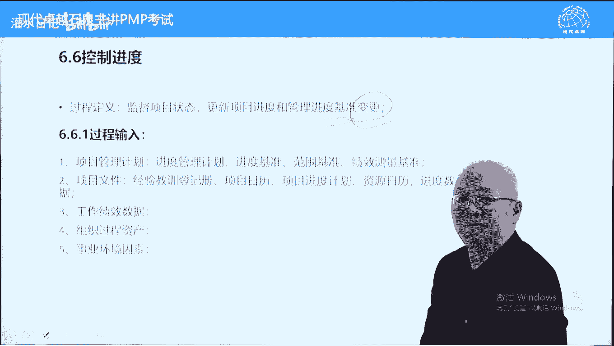

客户要求提前完成项目申请，能不能晚几天完成，改变完控制器要走变更流程，要c c b批准，除此之外，比如说进度延误了，夏目理呢想办法恢复精度，一般选赶工快速跟进就可以了，不需要上升到变更高度。

选项中呢也不出现变革选项的，好过了的输入，这个呢主要是工作绩效数据跟计划对比，得到什么呢，工作绩效信息，而工具里面我们注意一下对于进度技巧的监控，除了正值分析，我们主要是sd spi。

我们到后面讲这个正直的人会讲，除了这个之外还要考虑什么呢，关键路径的偏差，你光政治分析进度情况好还是不行的，为什么呢，关键路径如果有偏差，即使s v s p i都很好，这个项目呢不能按时完成，为什么呢。

关键路径决定项目的最短工期，所以呢两条线都要看哪个更加重要一些呢，关键路径的偏差更加重要一些，关键路径偏差指的是关键路径上的总时差，是不是负的，应该是零或正的更好一些，如果是负的话呢。

表明这个项目不能按时完成了，那其他的工具呢都不多说了，都是刚才讲过的，不多说了，我们看一下输出，输出呢有变更请求，有计划更新这个变更刚才说的，当进度基准改变的时候，我们需要走变更流程。

然后呢cccp批准之后更新到计划里面去，那其他的没有什么特别需要这个强调的，还有一个内容也说一下，当你识别发现进度延误的时候，有必要预测一下，看一看当前的情况，对加拿完工有什么影响，大概呢要说一下。

这是目前考试的一个特点了，其他内容不多说了，我们再回顾一下第六章的内容，讲两个制定进度基准和控制进度，其中控制精度呢内容比较少，因为呢进度变更，上市特变更高度的其实不多的，大部分都是进度压缩。

赶工快速跟进就解决了，而重点内容呢包括一个进度计划的制定工具，有很多关键路径法，资源平衡，包括呢假设进行分析，进度压缩这些啊，另外一个就是活动持续时间的估算方法，类比估算参数，估算三点估算等等。

这些呢是需要掌握的，第六章的内容虽然比较多，但是呢难度并不是很大。

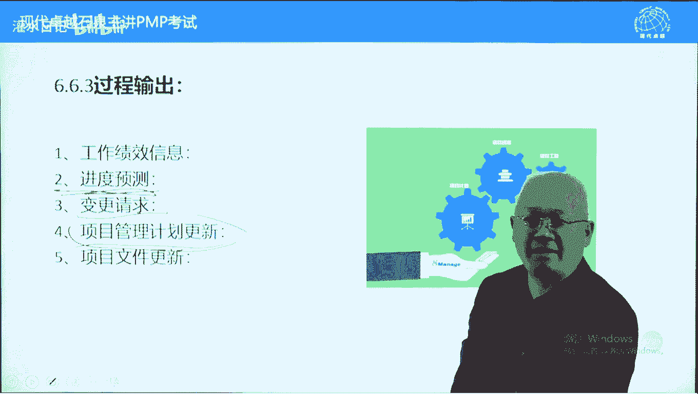

定住上我们就讲到这儿。