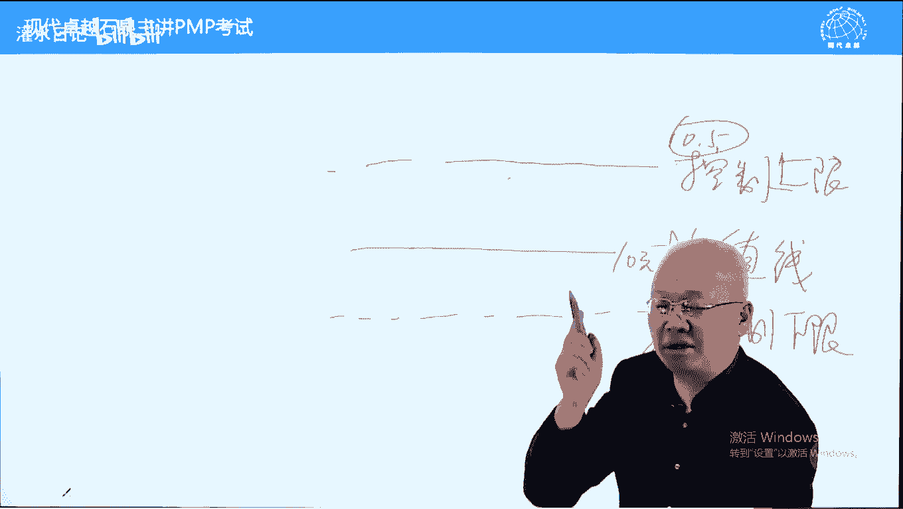
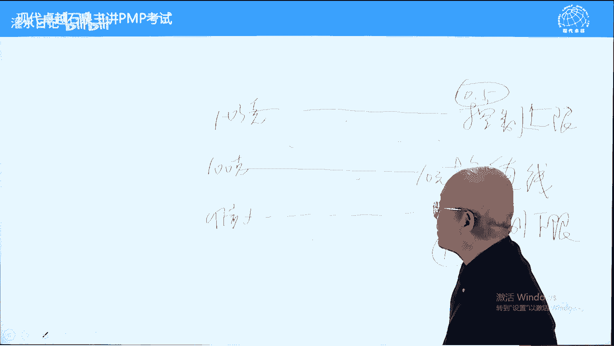

# PMP考试精讲 - P16：16 - 灌水日记 - BV1VN411w7cC

好我们下面呢看一下过程的输出，输出质量管理计划，它解决解决呃，叫识别质量指标。

并且呢如何实现质量指标，注意这里面呢有个内容叫什么呢，质量指不不不叫质量指标啊，我们家质量标准质量管理计划中有标准，没有指标啊，标准是宏观的宏观标准，写在质量管理计划里面，我们实现的目标。

实现的标准具体指标在哪里呢，在这具体指标在这宏观的国优部优省优，在这写一下，好质量管理计划更多的是一个路径，如何如何如何，啥意思，我们前面讲过规划质量管理解决两个问题，第一个识别质量指标。

第二个如何实现质量指标，它解决的是如何实现质量质量指标，比如说每天早睡早起不鲜，不喝酒，不吃麦当劳，肯德基，必胜客，每天跑步走路啊，1万步，11000。5万步，这些的话呢叫如何实现质量指标。

我们的规划一个路径，在8。2中去执行这个路径，当然了，这俩管理计划不光规划路径，还规划如何进行一个检查，包括如何进行审计，为什么呢，因为8。3的输入我们要检查，也要根据质量管理计划。

来进行一个测试和和检查答案好，后面呢第二个输入叫质量测量指标，它指的是具体测量哪些指标，或必须要实现哪些指标，前面讲过了，并不是所有指标都要检查的，就像体检有六六百块钱标准的，也有1000块钱标准的。

那还有呢住院一个礼拜，那可能几万块钱标准的检查的指标是不一样的，质量测量指标呢指的是具体指标了啊，重量尺寸之类的好，不光包括测量哪些指标，它还包括什么呢，如何测量就如何测量的一个概念，就什么意思呢。

测量方法，测量方法要写一下，比如说重量的测量小一些的，可以用电子秤买珠宝的话呢，有那种更小的秤精确到0。01克的，那这个买这个大米白面的话呢，有这种磅秤再高一些，再大一些的，买煤炭焦炭的。

有那种叫地磅能撑20吨，40吨的，60吨的，再大一些，我学过叫水池集中，水尺即中啊，这个尺啊，水池集中啥意思呢，就是朝曹冲称象的方法来去计量这个一一个船，散装货，煤炭焦炭，或者说玉米小麦有多少重量。

或者说呢有有多少重量，通过排水量来去测多少重量呢，我在天津呢还实习过两个月，天天爬船去测这个东西好，这个呢是质量测量指标，它包括测量哪些指标，并且如何进行测量好，我们在规划质量过程中可能会修改范围基准。

发现新的范围，这些不是特别重要，为什么呢，他没有提出变更请求，他理解为什么呢，计划还没有批准啊，没有批准的话，范围基准怎么能变呢，这个有时候又是个矛盾问题啊，这个内容我们不管它了，考试也没有考过啊。

文件更新做的事情都要记录下来，不多说了好，下面呢我们看8。2叫管理质量过程，管理质量的话呢，刚才讲过了两件事，它也可以也可以直接叫q a叫质量保证啊，质量保证一个意思啊，等于什么呢，预防加审计。

预防加审计，所有的质量预防工作都属于8。2，另外一个呢除了预防工作之外，它还有审计，审计是事后的，根据8。3质量控制结果来进行反省，反省什么呢，反省哪些地方做得好，哪些地方做得不好，我们看一下。

首先它是实施和执行质量管理计划的一个过程，质量管理计划里面我们有一个内容，如何实现质量指标和质量标准，每天早睡早起，不吸烟，不喝酒，不吃麦当劳，必胜客之类的，这些在8。2中去落实落实工作都是预防工作。

另外一个呢审计工作找出有效的和无效的过程，找出好的和不好的，注意这个原因叫根本原因，也叫根除原因，严格来说，在质量管理中纠正跟纠正措施是不一样的，纠正措施强调把根源去掉啊，把根去掉不会再发生。

防止以后再发生，这叫纠正措施，质量中的纠正措施强调的是根治原因，彻底消除原因好，8。2中就包括无效过程，消除原因，另外一个呢有大批量的问题，重复出现问题都属于管理质量问题，也叫q问题，要找到根本原因。

然后呢消除这个根本原因好，另外呢书上讲管理质量跟质量保证的一个区别，书上这样说的，管理质量呢包括所有的质量保证合同，除此之外还有什么呢，产品设计和过程改进，注意质量保证，在iso体系中有包括过程改进。

产品设计是否包括不是特别清楚啊，它本身包括的我们在考试中，8。2跟质量保证画等号，可以当成一回事，不用管它好，所有的8。2的工作都属于一致性成本，一个叫预防，一个叫审计，都是防止以后出现问题的。

另外一个，我们说，8。3是由专门的质量控制团队来去实施的，而8。2呢它超越了项目范畴概念，超越了超越了项目团队的范畴，人人有责，上到董事长，下到门卫清洁工，都需要参与管理质量人人有责的。

在这一点上跟敏捷有点像，敏捷强调人人有责，但他说的是项目团队成员，而管理质量的话呢，上到董事长，下到盟友信息工，都有责任提高本职工作管理质量，可以说是持续改进和预防的一个工作。

好另外一个呢管理计量它跟信息有关，好在考试中有这样几个词，看到之后肯定是管理质量，哪些职能，哪些词呢，防止确保，避免这些词只要一出现避免啊，都是管理质量，那还有什么呢，大量缺陷，重复缺陷，重复发生缺陷。

反复发生缺陷，这些只有通过管理质量才能解决，都属于什么呢，系统出问题了，过程出问题了，才会出现大量缺陷和重复出现呃，这个叫缺陷，肯定是系统出问题了啊，这个防止确保避免也是管理质量的关键词。

而管理质量的答案哪些对呢，待会儿我们看一下工具啊，下面呢我们继续看过程的输入，工具和输出，主要的输入是这个，为什么呢，它是实施质量管理计划的过程，质量管理计划中告诉我们一些路径，进行一个质量保证和管理。

质量实现质量结果，确保实现质量结果的好，另外一个输入呢要注意一下，叫质量控制，测量结果相当于体检结果，体检报告中的体检结果一样的，这个呢是来自于8。3，8。3的输出，作为8。2的输入，目的是什么呢。

用来反省，要根据体检报告来反省，你在质量管理中哪些地方没有做好，它是一种审计工作，所以呢从本质意义上来说，8。2更像一个监控过程组的过程，8。3更像一个执行过程组的过程。

跟它本身所属的过程稍微不太一样啊，质量测量指标对比的一个依据啊，风险报告，这个风险报告呢来自于风险管理过程，跟质量可能有关系，因为在8。2中，我们需要制定另外一个报告，叫什么呢，叫质量报告。

质量报告呢只要以报告结尾的词，前面讲过都是向相关方汇报情况的，让他了解情况的，都应该属于机械报告的一部分，好组织工程产不多说了，我们看一下工具，工具里面有一个核对单。

核对单是确保质量管理计划中我们规定的，比如说早睡早起，不吸烟，不喝酒，锻炼身体，有没有做到，它是提醒我们防止遗忘的，相当于清单一样，我们前面讲过的数据分析指的是过程有问题，我们需要改进过程有很多方法。

哪些哪个方法更好，可以对比一下文件分析，那就是分析这个叫绩效报告，我们看有没有出问题啊，这个呢是不多说了，过程分析讲一下，这个呢是比较核心的一个工具，质量管理中管理质量过程中我们也叫质量保证。

我们会发现大量缺陷重复出现缺陷，这个时候呢一定是过程出问题了，而过程出问题就要对过程进行改进，否则的话呢会重复出现次品，会继续出现次品的，而对于过程的改进，首先要分析过程的哪一个环节出问题了。

这个呢叫过程分析，过程好还是不好好的发扬光大，不好的，我们要改进哪些地方不好，而过程分析中要找到导致过程失控，导致过程而不稳定的一个根本原因，所以呢他还要进行一个根本原因分析，这两个是递进的，过程。

分析中一定用到根本原因，分析，根本原因指的是导致缺陷或问题的根本原因，找到根本原因之后，我们才能够彻底消除，刚才讲过一个纠正措施，纠正措施也强调要找根本原因，找不到根本原因的话呢，错是两个字。

强调根除的，我们无法杜绝这个问题，像割韭菜一样，割完之后又涨了，割完之后又找了，为什么呢，没有找到根本原因好，根本原因分析不光要强调找根本原因，还强调一个制定解决方法，这找到根本原因之后。

根据根本原因来制定解决方案，刚才讲过管理质量或质量保证，这类题目的答案有哪些，有过程分析，有根本原因分析，还有什么呢，持续改进持续改进啊，还有什么选项呢可以选呢，还有一个叫质量审计也是可以选的好。

下面呢我们继续来看决策，多标准决策分析就是我们改进过程，选择方案的时候，我们呢可以进行一个决策或找解决方案的时候，用的数据分析技术，我们呢看一下这里面出现的比较多啊，这些的话呢都理解为针对过程的。

我们要解决根本原因呢，第一个叫清河图，清河图呢它也叫关系图，它呢是按照亲属关系分类的啊，我们看不同的不同的缺陷，哪些是一类的，我们把一类的放在同一类的放在一起，然后呢进一步分析能提高效率的。

这个是新河图，另外一个呢叫因果图，因果图用的比较多，也叫石川图，注意这个词啊，石川图一个意思啊，也叫鱼骨图，鱼刺图，一个意思啊，他呢强调从五个方面，人机料法环五个方面来找问题的根本原因。

但是呢第六版偏不可加了一条，不是五条了，要通从六个方面来找原因，多了一个管理因素，大家翻书294页，人机料法环和管理人指的是操作人，员，机指的是设备料，指原材料法指的是工艺流程，环指的是环境因素管理。

那就是管理管理者的一些安排和管理安排吧，人机料法环从六个方面来找根本原因，因果图的原理是存在的，都是合理的，世界不跳跃，因此的话呢我们出现问题之后，都能找到根本原因，简单的好找。

复杂的话呢复杂的可能找起来比较麻烦一些，有些时候太复杂了，我们叫这都是命，我们用命来去总结一下因果图，一般指比较简单的，比较直观的一些因素啊，我们举一个例子，因果图中从环境来，从环境角度来找根本原因的。

或者说来找原因的呃，据说呢90年代的时候呢，日本有一家生产芯片的工厂，生产芯片的芯片，生产高精高精高精啊，叫高精度的高精高精密的一个工作，它的合格率，注意啊，芯片的正常合格率在当时70%。

这是平均合格率，但是呢这家工厂的合格率只有40%，怎么样也提高不了，达不到平均水平，芯片的回购率相对来说比较低一些的好，有一个新来的女工骑自行车上下班，每天早晨呢要穿过一个平交道口，什么叫平交道口。

知道吗，跟平交对应的叫立交，主要指的是火车道，有火车道的话呢，可以平交，可以立交，立交的话呢不影响平交的话呢，过火车的时候有一个大栏杆，要是要生下来拦住，然后呢火车走了之后，汽车行驶才能过好。

他每天都要过一个平交道口，有一天呢正好有火车在等火车过程中，他突然在想，诶，这个铁路离我们工厂那么近，芯片合格率低，是不是因为火车过的时候引起震动导致的呢，他把这个想法告诉主管，主管一想有道理。

因为呢有些震动人感受不了，但是呢精密的设备能感受出来的，他呢就立即在工厂跟铁道之间挖了一条渠，灌上水，水呢具有一个组织减震的功能呢，唉结果芯片生产率合格率提高了，高于40%了，好。

那主管就认为过火车是导致芯片生产不合格的，合格率低的一个主要原因，所以呢把所有设备换成减震设备，芯片合格率达到70%了，这叫什么呢，这叫因果图，存在的都是合理的，世事洞明皆学问。

比如说牛奶一般都用方式的包装盒，方方的方形包装盒，那可乐呢雪碧呢一般都是圆形的包装盒，为什么呢，啊这个呢凡事处处留心皆学问的啊，包括呢明清呃比较明显啊，明末啊，清啊民初清末明初的时候，清朝末年。

中国人流行吸鸦片，鸦片，鸦片烟大行其道，那为什么那么多人吸吸鸦片呢，有一本书叫20年目睹之怪现状，里面讲过原因，这个原因让人很震撼，简简单讲一下，让大家开一下脑洞啊，当时中国80%农村人口富人。

在农村也都有宅子，一般富人的话呢，他都是这个这个叫农村的组长，中国以前呢叫什么呢，叫士绅阶层来主导整个国家的文化，是指的是有功名的，人，身呢指的是大地主之类的好，他们的习俗根据什么学什么的人呢。

学什么人呢，学他们圈子里面更富的人，比如说方圆几个县，number one啊，这样一个大富翁家叫良田万顷，良田千顷的，这样的富翁的话呢，一般都是几代人积累的家业，在清朝末年的时候，这些人他们都吸鸦片。

为什么是曾邪成吸鸦片呢，因为方圆几百里几个县，number one大地主，number one，大地主的话呢，他就吸鸦片，他们为什么吸鸦片，他们吸鸦片是被动的，从小就吸鸦片，谁教他的。

他还没有懂事的时候，大概半岁左右，只要是男孩子好，吃完奶之后，家里面呢都会请一个鸦片保姆来给孩子喂鸦片，就是保姆吸一口，往孩子脸上喷一口，一般都是孩子吃完奶之后给给他这样喷，让他染上鸦片。

有人说这是亲爹亲娘干的事吗，是亲爹亲娘干的事情啊，为什么这样干呢，难道孩子不是亲的吗，是亲的，这叫白天不懂夜的黑，我们呢啊贫困限制我们想象力，我们不知道富人担忧什么，像这种number one。

方圆几个县number one的守护，他们最担心的是什么呢，败家，因为甲乙跟男跟男男孩子，男孩子好好读书还好不好读书会败家的，好，败家的途径哪些呢，男孩子如果染上不良习惯，那就是五个啊。

有钱人家坑蒙拐骗，没有的，就是吃喝嫖赌抽，吃喝嫖赌抽，有一样是败家的，只有一样败家，对大户人家就是什么呢，就是这个赌啊，赌呢属于无极限运动，一晚上赌一块钱也可以，赌十个亿，也可以一晚上能把家里输光的。

大户人家的孩子，就怕孩子染上赌博的游戏，而吸鸦片的人不赌博，吸鸦片的孩子不赌博，为什么呢，因为这个赌博的话呢，一般都要很很长时间的啊，赌上一晚上什么之类的啊，一般叫久赌必输啊，九赌之后才必输的。

西夏篇的人就这样的做，做不了一个小时，做20分钟左右，它的后颈腔骨就跟蚂蚁在爬一样，它需要歪着躺着，中国有以前有一种床叫罗汉塔，也叫烟塔，它要歪在那，大部分时间都歪在哪了，坐直了之后，这个脊柱不舒服的。

另外一个呢就是它隔一个小时到两个小时，必须要过一次瘾，不过瘾的话呢，他承受不住，比起哈欠，比起眼泪一起下来，哈欠连天，比起眼鼻涕，眼泪一起下来，好赌博的人呢不跟这样的人玩，为什么呢。

因为赌博需要专心致志的啊，我有同学在江西，他们打麻将就比较极端啊，上桌之前先检查尿不湿，不带尿，不是不让上上桌的，你天天不一会儿去趟厕所，一会去趟厕所，别人受不了，等不了，所以呢打麻将赌博的人。

他呢不跟那种吸鸦片烟的人玩，为什么呢，因为他们呢坐不住时间，影响别人的一个性质啊，啊这样的话，那就能解释为什么中国人当时西鸦片人比较多，因为存在都是合理的，好这个呢不多说了，因果图很多啊。

世事洞明皆学问的都能找到，比如说在泰国，泰国的电线杆没有圆的，全都是三角的或四方的，我见过四方的，没有见过三角的，原因是什么，是叫泰国的蛇比较多，如果是圆的舌头爬上去导致短路。

引起这个供电供电问题的好方的和三角的，它爬不上去，因为会拉它的皮啊，包括买汽车会是要买保险的，你要在北美买游艇，要不要买保险，不要买保险，因为游艇在海上开没有路，发生碰撞的可能性要小很多了。

存在都是合理的，不多说了，下面呢我们再看流程图，流程图跟因果图是一个相逆的过程，相逆的过程，因果图强调根据结果倒推原因，流畅度，强调根据原因正推结果，比如说我们看到外面下雨了，我们判断街上的人都在打伞。

闹市区的人都在打伞，这叫什么呢，这叫流程图，根据因原因推导结果，反过来说，我们看看你外面的人，男男女女都在打伞，我们判断下雨了，这叫什么呢，这叫因果图，根据结果倒推原因，好，知道就可以了。

直方图也叫柱状图，画一下它呢是用一个一个柱子来反映什么呢，来反映缺陷以及缺陷发生的频率，每个柱子代表一种缺陷，柱子高度代表缺陷发生的频率，成因和数量进行一个排序啊，进行一个展示啊。

好直方图有一个变形叫帕雷托，这个要注意一下常识，帕雷托也叫二八法则，20 80法则排序后的直方图叫帕累托图，帕累托图是一个排序工具，我们用帕里图图呢，把缺陷从发生频率最高往最低来去排。

直到最后以其他代表呢非常小的缺陷，这样的话呢我们知道哪些缺陷发生频率最高，哪些发生频率很低，在修复缺陷的时候，先修复发生频率最高的缺陷，这叫擒贼先擒王，利用二八法则也叫帕雷托原理。

巴黎所指的是80%的财富，掌握在20%人手里面，意大利一个叫帕雷托的人，他发现的这个理论可以推推而广之，80%的销售人员啊，完成了20%的销量，20%的销售人员，完成了百分之八十八十的销量。

80%的时间只干了20%的活，20%的时间干了80%的活，要找主要原因，抓住主要原因，帕雷托对缺陷排序，按照发生频率，它是一种客观的排序，另外一种排序工具叫民意组技术，我们也学过的民意组呢叫投票排序。

它是一种主观排序，我们区分一下考试中考过的，比如说我们跟我们给一个班里面的男生，女生按照体重排序用什么呢，用帕雷托啊，刚才写的，给再给这个班级里面男生女生的颜值排序，用什么呢，只能用民意组，为什么呢。

主观的和客观的区别知道就可以了，矩阵图刚才讲过了，l型y型x型都可以，有的好，这个呢就是一个表格的意思，下面呢再讲另外一个重要内容叫散点图，散点图来显示什么呢，相关性以及注意这个词啊，叫共同原因的。

能发现相关性和是否有共同原因，因此的话呢一定是两个变量，一个变量没有共同的一个概念的，两个变量之间有没有相关性，是否有共同原因，用散点图来去识别，发现好，举个例子，比如说我怀疑考偏僻偏僻的成绩。

模拟考试的成绩跟书的颜色，侧面的颜色有关系，我们呢可以画一个散点图，坐标图啊，这样画的，横轴竖的颜色，中轴偏僻的分数写分啊啊这边呢是100分，120分，140分，160分，分四个档次。

书的颜色呢可以分为全新八成新半径破书，所以这四个档次我们呢进行一次模拟考试，看一下成绩，唉我们发现有一个人考了160分，看一下他的书，诶，这个书新书坐标取这儿了哈，另外一个人140分。

看一下他的书颜色八成新坐标取，这，不好意思啊，另外一个人呢他的书和他的分数120分，他的书呢半径坐标点就这啊，另外一个人破书考了100分，坐标曲差连在一起，接近对角线，说明两个变量有相关性，呈反相关。

越新分数越高，书越破分数越低啊，这个就告诉我们书要供起来，拿个玻璃罩罩上不要碰啊，千万不要碰，一过年过节的时候拿出来晒一下就可以了啊，这个呢是错误的，开玩笑的，正常情况应该是什么呢，不学也能考100分。

好八只新的人120分，半，旧的人140分，破书160分连在一起，对角线两个变量之间呈正相关，书月破成绩越好，这两个变量有共同原因，什么叫共同原因，就相关性了，都是书翻得越多越破，书翻得越多，成绩越好。

这是正确的，这是科学的，这个呢叫散点图，发现相关性有没有共同原因的，再举个例子，美国很多大数据的书都会举这样一个例子，美国快速消费品消费品协会，他们呢发现一个规律，什么规律呢，到了夏天，冰激凌销量。

每个礼拜的销量跟这个礼拜，儿童溺水死亡人数成正比，这个礼拜冰激凌销量越高，儿童你对死亡的人越多，反过来也是一样的，不是说孩子吃冰激凌会导致溺水死亡，而是因为这两个变量有共同原因，什么原因呢，就是天气热。

天越热，孩子下水的人多，溺水的人就多了，天越热呢，冰激凌销量越多，要解暑的，这个呢叫散点图，注意一下好，下面呢我们再看第五条，工具叫审计，也叫质量审计啊，质量审计书上有定义，它强调审计什么呢。

它不是审计质量啊，他是审计所有项目活动，是否遵循了公司的政策程序，包括计划，大家翻一下书，看一下定义，所以呢这类审计跟项目审计可以划等号，当成一回事，为什么呢，从定义角度来说，它是这样一个情况。

大家翻一下书呃，在200，94页，294页，第一行，第一段，第一行，审计是用于确定项目活动是否遵循了，组织和项目的政策过程，程序的结构化，独立的过程总结经验教训，另外一个呢它是格式化的重要经验教训。

总结被升级为质量审计，这一页下面还有五个小黑点，重点前四个前四个的话呢是这样说的，发现好的过程，发现不好的过程，好的过程发扬光大报的过程加以改进，就是过程改进，这四条要注意一下，另外呢在295页。

还有第二段，295页，第二段他有一句话什么呢，确定一下批准过的变更请求有没有实施，这也是个过程，批准过的变更应该实施，只判断有没有实施，不判断实施的好不好，我们只判断该实施的变更有没有实施。

从过程角度来确定是否遵循了我们的过程，过程要求好，另外一个工具呢叫面向x设计，什么意思，哪壶不开，提哪壶，哪方面不好，我们要针对这方面要加强，比如高考语文不好，我们怎么样提高语文水平，数学不好。

如何提高数学水平啊，这个呢知道就可以了，它跟产品设计有关系，前面提到了提到了管理质量，不光包括质量保证，还包括产品设计，面向x设计，理解为哪壶不开提哪壶，它的好处在书上也有，在295页第二段。

第二段第三行，使用df x可以降低成本，改进质量怎么样，怎么样提高满意度了，知道就可以了，这个内容考的很少啊，选项中出现过，但还没有选过问题解决，这个要注意一下啊，我们在前面讲这个叫pmi主义的时候。

我们应该提到过叫万能公式法则，指的是遇见问题先不要急着下结论，先不要急着诛心之问，到底想干什么的，我们呢先了解事实，收集信息，了解事实，然后呢全面分析一下，制定解决方案。

然后呢在众多解决方案中选一个最好的批准，批准完之后实施解决方案，实施完之后再跟踪效果，相当于总结经验教训，这是唯物主义思维的一种正确的，科学的做事方法，我们叫万能公式法则好，这个呢是问题解决。

在295页有六个小黑点，大概注意一下，跟我刚才讲的万能公式法则套路一模一样，这是一种比较科学的做事方法，做事的步骤好，质量改进方法，刚才讲过了，pdc循环是持续改进的技术，另外一个呢六西格玛也叫零缺陷。

那还有什么呢，金银六西格玛，就是六西格玛这样一个原则，跟精益生产结合在一起，我们呢开创一种生产方式，来做到一个不光要要这个结果要完美零缺陷，而且的话呢不要浪费，效率越高越好好。

下面我们看一下输出质量报告，刚才讲过8。2，它更像一个监控过程，监控过程产生一个绩效报告，绩效报告呢是对我们质量管理的一个说明，总结目的呢是让相关方放心我们的质量的，通过质量报告让他放心。

让他了解情况了，好测试与评估文件，这个文件位置放哪有问题，我们在8。1中有工具叫什么呢，测试与检查分析，按理来说8。1的输出应该有测试与评估，文件评估就检查的一个意思啊，怎么样测试，怎么样检查的。

但是呢8。1周没有放在了8。2里面，我认为有问题啊，因为什么呢，这个内容还是用于8。3的，用于8。3质量控制的输入啊，这个呢有一个bug，稍微注意一下，不符合逻辑的，应该放在8。1的输出更好一些。

好八第三个过程啊，第三个输出呢叫变更请求，这个变更对象跟他一样，对象什么呢，就是过程主要针对过程不好的过程，进行一个升级，我们叫改进过程需要提交变更请求，它属于变更，当然了，不提交配给请求。

能不能更新过程也可以的，它并不像基准，我们强调基准的变更必须要走流程，不叫基础啊，必须要走流程，像过程之类的走流程也行，不走问题也不大，看题目的选项了，如果有就走一下好计划更新，在管理质量过程中。

发行过程有问题，或者或者说嗯批量有问题的话呢，对程序计划可能有影响，另外一个呢对实体计划也可能有影响，注意啊，这个变更主要针对的是过程变更，当然也可以针对程序型计划或实体，内容呢进行一个变更。

相对而言对于过程变更更多一些，我们在8。2中看到的变更呢，几乎都是这种，对于这个变更的话呢，大多数在8。3里面有另外一个呢再说一下，在质量中，所有的缺陷都可以叫问题，我们呢用问题日志可以记录一下。

为什么呢，因为质量本来可以零缺陷，因此呢出现缺陷都是人的责任问题，所以呢不要当成风险，都要当成问题，我们发现问题的时候可以去修复缺陷，然后呢在敏捷项目中，如果发现可交付这么有缺陷，我们呢不走变更流程。

敏捷强调不走变更流程的，那对于敏捷过程中发现的质量缺陷怎么办，记录在问题日志进行修复啊，这个呢是敏捷项项目下，对于问题值的一个使用啊，而对于正常的项目，如果发现这两缺陷不在8。2中处理，在8。3中处理。

可以走变更流程，也可以不走走变更流程，不不多的也可以的，但是呢在敏捷项目中发现可交分成果，具体问题用问题制记录，以确保解决就可以了，他不需要走不走变更流程，而在传统项目管理中，要可以走变更流程。

也可以不走，但是呢跟问题一致关系并不并不那么大，我们直接说的什么呢，叫缺陷修复啊，这个讲的稍微有点早啊，按理来说的话呢，不应该8。2，应该8。3的内容，因为发现可交付成果缺陷跟8。2关系不大。

只不过呢这里面提到了一个问题日志，我们呢提到了敏捷的做法，我们8。3里面呢再讲一下就可以了，下面呢我们进入8。3，叫控制质量控制量，刚才讲过，解决两个问题，围绕一个主题，哪两个问题。

检查可交付成果缺陷和修复可交付成果缺陷，一个主题叫可交付成果，围绕可交付成果展开的敏捷项目中，人人有责，在传统的项目管理中，由质量控制部门或质量控制团队成员来负责，质量控制工作，工作是有分工的。

特定成员特定时间，什么叫特定成员时间，内部检查随时进行好，8。3是一个内部检查，再梳理一下4。3过程产生可期成果，可期成果产生之后，8。3先检查，随时的8。3检查完之后，哪里检查，5。5检查叫验收。

第二不收，5。5之后呢，4。7组装打包移交这个过程，注意一下，8。3指的是内部检查可交付成果的过程啊，好下面呢我们继续再看，这边有个词叫合规性，也叫一致性，检查结果跟我们的质量指标一致不一致。

一样不一样，这个意思啊，好这个呢刚才讲过不说了，下面呢我们看一下过程的输入，有两个比较主要的输入哪两个呢，一个是可交付成果，一个呢是质量测量指标，这个啊8。3就是这两个进行对比，对比之后呢。

发现缺陷或者说判断合格不合格，不合格的要进行修复，另外呢再说一个这个第四条跟第三条划等号，在这本书中，他这样这样说的，这样理解的，不是这样说的，这样理解的就是我们在4。3执行的时候，4。

3的输入有两个输入，大家翻一下书，我们看一下4。3有两条主要输入，一个叫什么呢，一个叫计划，一个叫批准的变呃，一个叫批准的变更，请求大家翻一下书啊，在90 92页，92页，93页，92页。

第一条输入叫项目管理计划，执行计划，执行计划产生可交付成果，好在93页呢，第三条输出叫批准的变更请求就变更啊，变更批准的也要执行的，在8。3中，4。3里面有两个依据，在8。3中呢被区分了。

根据计划产生的可交付成果叫可交付成果，而根据批准批准管理变更产生的可笑反成果，它叫批准的变更请求，这样理解啊，这两个都是可效仿中国，只不过呢来源有所不同，工作绩效数据来自于执行的执行过程的输出。

八点第八章的执行过程就是8。2在执行啊，这个呢其实有问题的，我们按理来说应该是检查的结果更好一些，只不过检查结果它不叫工作绩效数据了，它叫什么呢，质量测量结果啊，这里面的工作绩效数据我们这样理解。

书上的讲质量管理不光包括产品质量，有产品质量啊，还包括什么质量啊，还包括项目管理质量，那什么叫项目管理，质量指的是三大基准的情况加项目管理质量，因此的话呢我们控制质量过程中。

工作绩效数据指的是三大基本的情况，我们通过这个工作绩效数据，来判断一下项目管理质量好不好，根据三大基准的实际数据完成多少，花了多少钱，进了哪一步了啊，这个呢是判断项目管理质量好坏的。

这两个呢是判断产品质量好坏的，下面呢我们看一下工具，数据收集有两个内容，核对单，刚才讲过了，防止遗忘的8。2周，使用8。3中也可以使用，我们需要检查哪些列个清单，核对表是在核对端基础上。

我们呢把它内容丰富了，相当于体检表，它不光有清单，它还有表格，你可以去填的检查，一项填一项检查，一项填一项好，注意我们在体检的时候呢，用到体检表，体检表就是一个核核查表，它的主要作用不是为了记录结果的。

它的主要作用是提醒我们不要遗忘的，因为那医院对于医院而言，可以完全无纸化操作啊，直接按指纹看瞳孔，它就能解决问题了，为什么到现在还给你一张纸质的提前表，他是怕你不知道要检查哪些项目好检查一下，盖个章。

画个勾，填个数据，你知道检查完了空白的继续检查，它的主要作用还是提醒遗忘的，但是呢它有个桌子作用，它能记录结果，书上说核查表对于统计缺陷数量特别有用，它可以用于统计缺陷数量，在现实中就是统计表。

用于质量控制检查的就是统计表，好，统计抽样指的是不要百分百检查，而是抽样检查，车辆检查有好处，节约时间，节约成本，但是呢它有前提，就是我们抽取的样本，必须能够代表所有的检查整体，否则不能抽样检查。

统计抽样就是抽样检查的意思，有一些不能抽样的，比如说安检必须百分百检查，这个呢是统计抽样问卷调查，这个呢是收集信息用的这个调查调查意见用的，他呢在这里面其实用的不多，我们在第五章用的多一些，它有关键词。

关键词是什么呢，受众多，当需要问到很多人的意见的时候，我们用这个方法好，数据分析，这个指的是绩效审查，指的是项目管理的一个数据了，项目管理的质量好坏，我们来分析一下根本原因，分析理解为有缺陷。

发现缺陷之后要修复缺陷的时候，要找根本原因，修复缺陷，不找根本原因呢，这个修复可能也是治标不治本的，因此的话呢8。2，8。3中都用到根本原因分析，在考试中都可以选，包括石传图跟它可以划等号好。

这个是检查，检查可能比较具体一些，而测试评估可能比较宏观一些，我们说测试呢可能放在一起检查的话呢，可以是局部的，另外有一些图注意一下，叫数据表现技术，这里面的因果图讲过的找根本原因。

通过人机料法环以及管理找根本原因，直方图排列缺陷数量的，我们排序之后变成帕雷托，直到我们先解决什么缺陷，后解决什么缺陷，散点图找相关性，找共同原因的一定是两个变量，因果图是只知其一不知其二。

控制图是判断过程是否失控，是否具有具有可预期效果的过程，是否稳定的好，我们把这个会议讲完之后，我们呢专门讲一下控制图，会议呢指的是开会来进行一个审计，包括循环回顾，总结经验教学，包括审计哪些好。

哪些不好，好好的过程发扬光大，不好的呢要进行改进，下面呢我们讲一下控制图，控制图它的主要作用，判断一个过程是否稳定，是否具有可预期的迹象，比如说体温计就是一个控制图，家家都有答案，判断孩子是否发烧。

不发烧表明孩子很健康，如果发烧的话呢，那有可能烧得更高，可能会身体出问题不稳定啊，它有五条线，这五条线呢我们在这画一下，中间一条叫均直线，也叫平均线，也叫均值线，不叫中线啊。

均直线或平均线在均直线两侧各有一条虚线。

我们叫什么呢，叫空虚线啊，虚线不是实线啊，叫控制上限和控制下限，控制下线这个线啊。

控制上限，这是控制线。

控制线来判断过程是否稳定。

是否具有逾期绩效的好，我们判断股票就可以了。

比如说买一只股票，招商银行，十元上下波动定在9。5元和10。5元，不超出这个界限。

表明过程稳定，继续监控就可以了，一旦超出这个界限，我们要考虑是卖掉还是补仓的问题了，这个呢叫控制上限，下限，只要不超过控制上线，下线过程是稳定的。

继续监控就可以了，不需要采取任何措施，不失控，不采取任何措施的。

这个点的话呢，我们取测量点，比如说每每一分钟的呃。

这个叫股票的价格，包括我们生产巧克力。

巧克力的话呢，这边100克一块，这个呢97克。

下限上限呢103克。

不超出这个范围，过程都是稳定的，超出这个范围过程不稳定。

需要停工检修了，好这个呢是过程的一般状态。

一般状态是它本质特征决定的，它不会发生大的变化的。

如果超出了它的一般状态，就说明什么呢，受到外力影响了，受到特殊原因影响了，这个特殊原因也叫根本原因要去找到的，一旦受到外力影响，它可能会失控而失控。

有两种情况，一个叫一个呢叫一点法则，有一个点超出了控制上限或下限。

叫失控，还有一个呢叫七点法则。

指的是连续七个测量点在均直线同一侧，上次或瑕疵，即使不超过不超过控制上限下限。

我们也认为过程失控怎么来的。

统计来的，统计来的，我们记住结论就可以了，一旦出现失控，就要停工。

找根本原因，就跟孩子一旦发现孩子发烧了，就要去医院找根本原因，控制度本身只能发现失控状态，它不能找根本原因。

根本原因要通过化验，通过体检来找根本原因是什么，找到根本原因之后。

我们呢采取措施，让过程恢复稳定，比如说给孩子打针吃药，让孩子体温正常起来，表明了问题，找到了根本原因，消除了孩子呢身体又健恢复健康了，这个呢是控制图图的一个主要作用，针对过程它除了针对过程之外啊。

可以针对某一些呃特殊变量，也可以比如说变更的频率。

比如说这个进度成本的偏差，也都可以通过控制图来去管理它。

这是控制图的基本作用，利用控制上限下限来去判断一个过程是否稳定。

是否具有预期的绩效。

除此之外，控制图呢在控制线外侧，一般来说还有两条线叫什么呢。

叫公差，允差，也叫规格线，什么意思判断，产品是否是次品的规格性这样一个标志，公差我再写一下公差，判断产品是否是次品的一个界限，好这个呢是判断过程过程，时空不代表产品是次品。

但是呢一旦测量点超出了公差或饮茶，表明产品也是次品了，因此的话呢一般来说控制线要严格一些，在内侧规格线要宽松一些，在外侧外侧目的呢是在出现次品之前。

首先要发现这个过程不稳定，有可能出现次品，体温表也是一样的，就说让我们在第一时间发，发现发烧生病来去采取措施，不要耽误了病情，道理一模一样难，因此控制图也能够检查，当需要检查没有检查这个工具的时候。

可以使用控制图来检查，因为它有规格线，能帮助我们判断这个产品是否合格。

是否合格，是否超出了预期的这样一个界限，好问一个问题，体温计也叫体温表了，体温计呢它的刻度34~42。

体温计，体温表34度到42度摄氏啊，这个是控制线还是规格线，控制线还是规格线，按照质量的原理应该是控制键啊。

发现过程是否失控，它不是规格线。

因为如果测量一个人的体温42度。

这个人是活人，不是死人，如果一侧跟室外温度一模一样，17 8度，那这个呢是超出了规格线。

好这个呢还属于控制线，它没有超出规格线呢，这个呢要注意一下。

好我们下面呢继续再看看一下过程的输出。

输出呢主要是两个啊，一个呢是质量控制，测量结果相当于体检结果，体检之后体检报告里面会有各种各样的结果，各种各样的指标，它呢是一个对比跟结果跟计划对比啊，好另外一个呢和合适的可可交付成果。

指的是内部验收通过合格了。

将进入什么呢，进入5。5是5。5的，输入这个质量控制测量结果它还是8。2的，输入8。2要根据质量检查结果来进行反省，来进行质量审计的工作，绩效信息指的是项目管理的质量好坏，考试中不考的，知道就可以了。

项目管理的质量好坏变更请求注意，这个变更请求主要是缺陷修复，就是内部检查，我们发现不合格，要进行缺陷修复啊，缺陷修复可以提变更，也可以不提，礼多人不怪题也问题不大，计划更新其实不多，更多的是缺陷修复。

不需要更新计划的好，这里面呢也有问题一致，怎么理解，敏捷问敏捷开发的时候发现的质量问题，发现质量缺陷不叫质量缺陷，记住大问题是来设置人员，设置期限来解决就可以了，而在项目管理中，如果发现质量有缺陷。

直接呢缺陷修复就可以了，一般来说是我们的一个责任，还有一个呢事后总结经验教训，什么意思，偏差纠正了缺陷，修复了啊，包括过程改进了，都要总结经验教训，这个内容呢不多说了，其他文件需要记录一下，好8。

3我们就讲完了，简单回顾一下第八章的内容，第八章呢我们强调三个过程的区分，三个过程呢分别是8。1，我们呢找两个词，一个叫标准宏观的，一个叫指标，微观的，具体的质量指标，附作为可交付成果之上的8。2。

关键词呢就是过程，它呢是针对这个过程进行一个审计，针对过程进行一个预防，主要对象就是过程预防加审计，8。3呢就是针对可交复生果检查，以及修复可交复生果的缺陷，另外呢在八第八章中，有一些工具比较重要。

比如说因果图，散点图，包括控制图，这些图呢相对而言都比较重要，要注意一下它们的一个区别啊，第八章的话呢题目会比较多一些，另外一个呢就是很多题目需要先判断，属于8。2还是8。3，也给大家提醒一下。

第八章题目中主要集中在8。2，8。3的题目相对比较少，8。1的话呢一般来说不考过程，只考一些基本的概念啊，比如说质量成本，这是必考内容，质量成本的话呢要记清楚一致性，非一致性预防评估呃。

外内部失败和外部失败，另外一个呢在这辆管理中经常用到一个工具，叫什么呢，成本效益分析，成本效益分析跟什么有关系，跟增加不增加检查点有关系，是否要增加检查，检查不是越多越好，恰到好处就可以了，要什么呢。

过犹不及，我们呢要保证检查能获得更高的收益，要根据什么呢，根据成本效益分析，如果得不偿失，那就没有必要了，这些呢都是质量的工具，在偏偏考试中这两题目相对比较多，另外一个呢有一定的难度，为什么呢。

它本身来说比较抽象一些，也比较深一些，ok关于第八章我们讲到这。