# PMP考试精讲 - P19：19 - 灌水日记 - BV1VN411w7cC

课程现在呢我们讲第十章项目沟通管理。

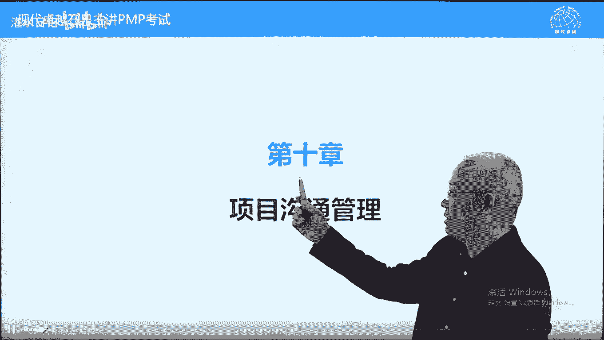

先说一下沟通啊，沟通有两层意思，一层意思是宏观的宏观沟通，包括在项目中各种协调。

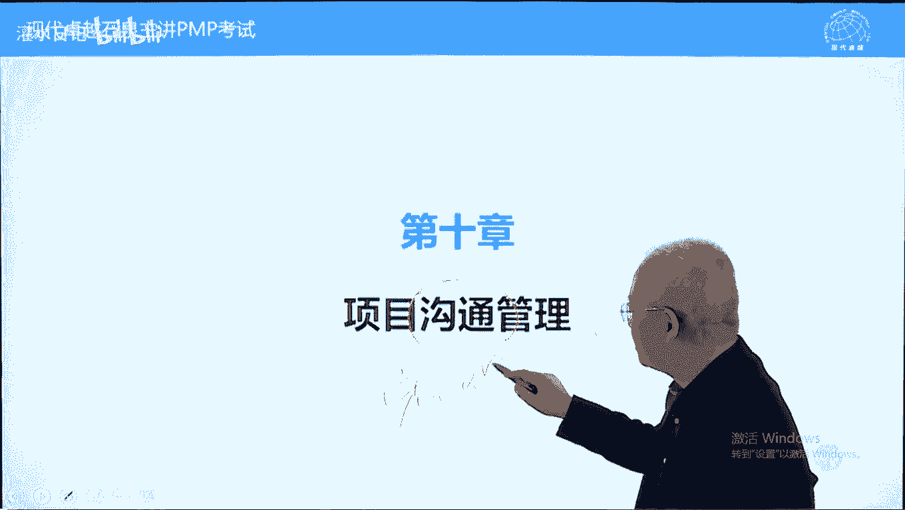

也包括发布信息，我们曾经说过，在项目管理中，所有问题都是沟通问题，所有问题通过沟通解决，这是宏观的沟通好，那在项目管理中呢，还有微观的沟通，微观的沟通，第十章讲的就是微观沟通，我们看一下他强调什么呢。

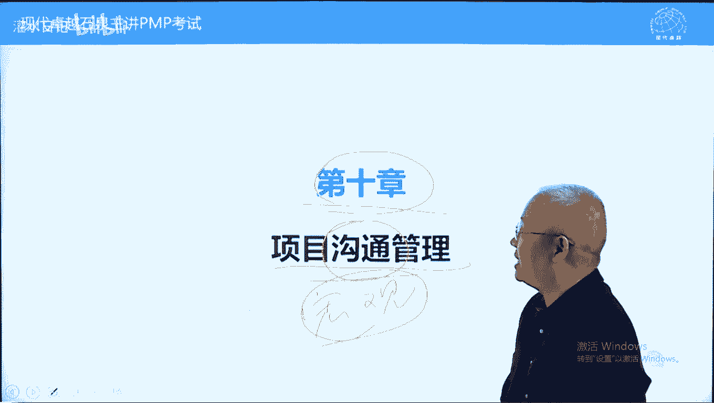

生成信息让相关方了解项目信息，就是发布信息，让别人了解情况，这是微观的沟通，第十章讲的是微观沟通，它跟管理相关方是有关系的，为什么说第十章的沟通跟管理相关方有关系，简单说一下，我们为什么要发布信息呢。

发布信息的目的是让相关方了解项目情况，当然也可以包括对团队成员发布信息，让他们了解项目情况，但主要是对外部相关方客户发起人，让他们了解项目情况，因为了解项目情况能提高相关方对项目的支持。

降低相关方对项目的阻碍，有人说，为什么有这样一个情况好，因为人对于信息的渴望与生俱来，当没有信息的时候，我们会感觉到不安全感，比如说现在呃，最最残酷的惩罚就是断网，把你的wifi断掉。

让你跟王一阶无法联系，你会感觉到很无助，感觉到很很害怕，或者感觉到很绝望，原因什么呢，我们对于信息是渴望的，我们希望了解外面的情况啊，这个呢从孩子一开始就会有，孩子生下来，半岁之后，当他醒的时候。

他腰杆硬了，他不喜欢躺着，他要抱好，半岁的孩子，抱的时候横着抱，竖着抱，一定是竖着包，不是横着包，为什么呢，因为横着包他只能看到天花板，天花板上有什么呢，什么都没有，他有不安全感，不了解情况，竖直棒呢。

它转转腰，扭扭脖子，360度可以全观察，因为了解，所以放心，一人之心，千万人之心，也包括领导也是如此，我们再举个例子，比如说你参加一个电视节目，带着孩子参加一个爸爸去哪儿或妈妈去哪儿。

让你呢带个孩子在两个农家小院中选一个，住一晚上，两个院子让你选一个，告诉你两个院子的区别，一个院子里面刷了一只狗，金毛拉布拉多啊，另外一个院子里面告诉你刷了一只鬼，什么鬼不知道啊。

让你选你选有狗的还是选有鬼的呢，我们肯定选有狗的，不选有鬼的，为什么，因为对鬼不了解，对狗很了解，因为了解，所以放心，因为不了解，所以很担心，有人说爱情就像鬼见的人多啊，不是信的人多，见的人少，没见过。

所以呢害怕，因此呢通过发布信息，让相关方了解情况，能提高支持，降低阻碍，所以沟通我们这样理解，让相关方了解项目情况，提高支持，降低阻碍，那有人说好消息，我们要发布，让领导呢了解之后，提高支持，降低阻碍。

如果项目中有负面消息，坏消息怎么办，负面消息也必须要回报，因为坏消息就像喜欢一个人是无法隐藏的，隐藏不了的，你不说别人会添油加醋的，说，签添油加醋的说，让领导更加担心好，坏消息也要也要汇报的。

但是呢我们汇报坏消息，目的还是一样，让领导放心，那你汇报坏消息怎么样让领导放心呢，有一个说法叫建设性的汇报坏消息，什么叫建设性汇报坏消息，有个例子啊，曾国藩出山组建湘军去打太平军，刚一出山。

他在江西打一场输一场，打一场输一场，他很诚实，在给咸丰皇帝写奏折的时候，他这样写，臣屡战屡败，李鸿章的时候不要这样写，他的弟子李鸿章说不要这样写，这样写的话呢，影响领导的叫心情，也影响我们的士气。

要建设性的，当然他没有说建设性的，他改了两个字，他改成陈屡败屡战，要建设性，什么叫建设性，有解决方案，坏消息不能单独汇报，单独汇报坏消息，那是在下领导，你缺少职业道德，有问题不怕，问题在于你得能解决。

不能不能解决，对领导不负责任的，好建设性指的是坏消息，一定要有解决方案，没有解决方案不要汇报，汇报的时候一定有解决方案，要积极解决，主动解决好，这个呢是关于沟通的一个作用，它的主要作用提高相关方支持。

降低相关方阻碍的，而这呢正是第13章管理相关方的目的，原则或终止，现在我们继续再看，项目里，大部分时间用于跟团队成员和其他看情沟通，沟通上，这一句不是狭义沟通，他是广义的，宏观的。

广义的沟通就是沟通协调，但是呢这里面第十章还是讲的，狭义的沟通就是发布信息，沟通的目的，刚才讲过了，让相关方了解情况，因为了解，所以放心，因为不了解，所以很担心好信息交换的方式只是沟通的方式。

第十章也是拿来主义啊，第九章第十章都拿来主义，书面的口头的正式的非正式的啊，随便随口一说之类的，包括社交媒体媒体qq之类的，一般不算数的手势动作指的是非语言的呃，非非非语言的这样一个沟通啊，手势动作。

表情的沟通，察言观色的媒体形式，图片，或者说呃这个叫互联网之类的，这些呢图片，还有呢银屏之类的，这这都可以的，前字造句表达意思的话呢要表达清楚啊，比如说网络，现在很多网络语言，网络语言的话呢要注意用词。

比如说n跟n的一样不一样不一样，n是一种敷衍，n呐呢很开心的意思，代码跟在干嘛一样不一样呢是不一样的，那在干嘛呢，关系就比较近一些了，在吗，可能有事要找的，这个呢就是前词造句，它是有区别的。

另外呢我们继续再看沟通的维度，包括内部外部内部的关系，未来很多话是可以说的，很多敏感信息也是可以说的，我们呢会有所侧重，有所选择，正式的是可以作为依据的，可以作为参考的。

另外一个呢是这个能够大家都能够能够公开的，比较正式的，非正式的可能只能作为一个叫参考，我们也叫什么呢，这都属于非正式的，那正式的话那叫官宣啊，官宣呢是正式的，比如说今天官宣跟张张继科分手了，那这是官宣。

以前的话呢会有传言，这个传言呢叫非正式的好沟通，层级向上向下横向，这里面呢说一个概念，前面也讲过的叫沟通漏斗，什么叫沟通漏斗，上下级之间的沟通，无论从上往下，从下往上都存在信息过滤问题，过滤多少。

每一层会过滤70%以上的真实信息，所以呢沟通层级越多，真实信息含量越少，官方沟通年报什么什么之类的，这个呢是作为正式依据的，可以比如说你这个年报，上市公司年报作假，是可以到法院起诉他的。

你要承担法律责任的，非官方私下的，比如说谣言，小道消息之类的，口头与书面的，书面的写下来了，有据可查，口头的话呢说过就没有了，口说无凭，可能有这样一个情况，好沟通的5c原则，大概了解一下。

这个呢没有听过，以前呢有这个什么目标的smart原则之类的，这个5c原则的话呢是比较新的，正确的语法和拼音写，防止误解的，另外一个呢越简洁越好，反就是越简洁越好，不要有多余的字，新古文运动就这种情况啊。

他反对偏体，就是在唐朝的时候有一个新古文运动，他们认为这个越简洁越好，不是说越华丽越好的，举个例子，唐朝有一个写篇文写得非常好的人，叫王勃，王勃有一个代表作，知道吧，叫滕王阁序。

但是王勃呢大概20岁就渡海淹死了，它往南多，要就在留着半岛往越南去的时候，渡海的时候呢淹死了，那这个你死得比较年轻，而且特别有才华，在北部湾里面呢，海上就闹鬼，每当每天到晚上，王勃呢就水里从水里出来了。

出来之后呢，念两句最得意的两句话，落霞与孤鹜齐飞，秋水共长天一色，很吓人的，闹了很多年，有一个这个有一个有学问的人吧，过去要治这个鬼，怎么治呢，啊他呢坐着船到了，王勃经常出现在海面上，王勃又出来了。

面两句是落霞与孤鹜齐飞，秋水共长天，一色，冲体秋水共长天一色啊，这个人说你这个诗写的还不行，你这个文章写的还不行啊，啊还不够简洁，我我觉得应该这样写，怎么写呢，落霞孤鹜齐飞，秋水长天一色。

从此以后王勃不再出现了，这叫什么呢，没有多余文字，清晰的目的和表述啊，不要写成很隐晦的，像李商隐的无题诗啊，叫呃叫什么来着，锦瑟无锦瑟无端，50弦，一花一弦一柱思华年，到底说政治呢还是说爱情的呢。

啊搞不太清楚啊，春蚕到死，丝方尽，蜡炬成灰泪始干，到底说的是什么呢，谁都能解读，包括叫扎扎诺呃呃扎诺丹马斯是吧，那个叫什么诺诺查丹马斯，法国的一个预言，怎么解读都可以，那这个呢就不是清晰了，连贯的思维。

受控的语句和想法啊，连贯的思维指的是不要跳跃，有些文章是需要跳跃的，比如写诗要跳跃，小景时你在天边想你时，你在眼前诶，很有意境啊，但是呢文字表达的时候，正常的继续的时候，要别人跟别人沟通的时候呢。

尽量的要清楚一些，要连贯一些，这些的不多说了，下面呢继续再看沟通技巧。

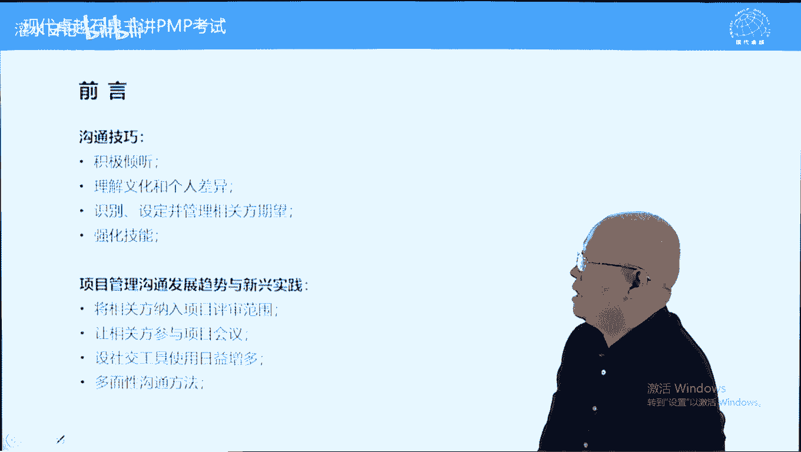

首先一个积极心听我们说，说话是金，沉默是因，因为沟通的本质是交换利益，交换利益交换对等了，沟通能够有效能够实现，所以呢一定要了解对方的需求是什么，不要光自己讲，自己讲的话呢，不知道对方需求。

沟通很难去实现的，要考虑对方的需求的，那怎么样呢，你不说话，别人才能够有机会说话，另外一个呢了解无文化和个人差异，有些人呢比较外向一些，有些人比较内向一些，外向型的人呢，他的话可能很重要的话。

不一定太当回事，内向型的人呢可能看似很谦虚的一句话，有可能要当真，或者说它效率更好一些，包括文化，那日本人的话呢从来不当人面说，不不当人面拒绝他都是嗨嗨嗨。

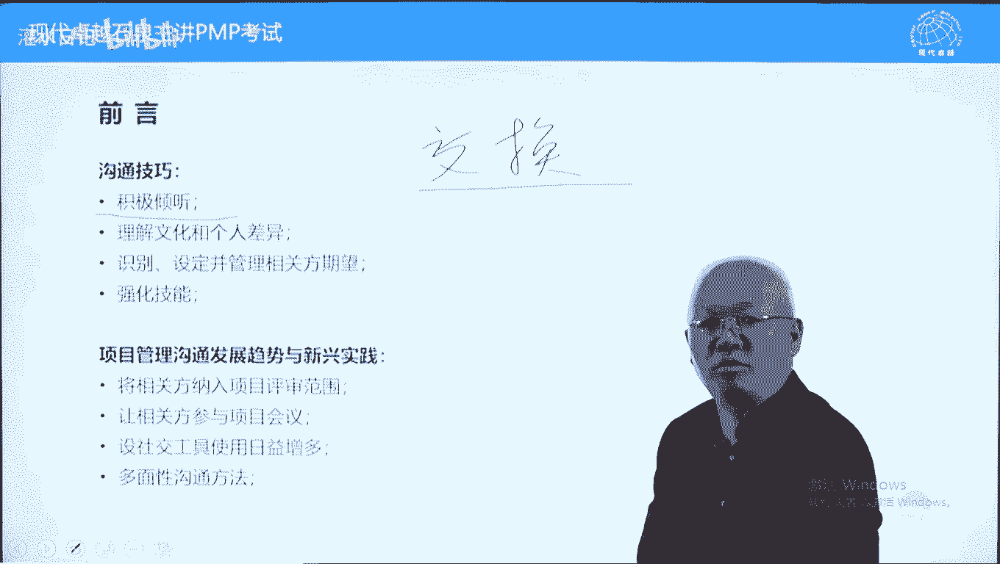

不表示是不表示认同，只表示我在听，你只管说就是了，这叫文化差异，好设定识别设定和管理期望，什么意思，先当导演，在当演员，这样的话呢容易实现沟通的效果，很多沟通都要这样，要先策划一下，不是偶然的。

举个例子，有一个孙子20几岁，这孙子呢没有对象，有一天呢跟爷爷在公园散步，诶，旁边走过一个美女，身材特别好，颜值特别好，特别特别高，然后呢气质也特别好，孙子忍不住多看两眼，爷爷看着心里，爷爷们喜欢吗。

知识点点头，喜欢，爷爷问想不想要电话号码，孙子点点头，要想要啊，爷爷呢说瞧我的吧啊，拄拐棍儿，大步流星，走了十分钟后，孙子手机响起一个甜美的声音传来，你是谁谁谁吗，爷爷走丢了，现在在公园门口呢。

你赶紧过来吧，你们要的电话号码要到了，能不能请对方吃饭，可以请对方吃饭的，好一样的，强化技能指的是沟通中有很多技巧，这些技巧的话呢很多了，各方面都有的，我们举几个例子，比如说跟别人聊天聊什么。

那跟陌生人聊天聊这个天气是比较容易入手的，但是呢聊天气问题聊不了几句就会冷场，那如果说是跟相亲见面聊什么呢，前两天看一篇文章，聊工作是最好的，吐槽公司，吐槽领导能够得到彼此认同。

而且的话呢这个话题能扯得很远，这个呢是这个叫沟通的一个技能，你要知道这个聊什么兴趣爱好要不要聊呢，点到为止，不要纠缠不休，为什么呢，大部分人的兴趣爱好都是说说而已，并不是真爱好，如果真的爱好这个东西。

你根本插不上话的，为什么呢，太深了，这个呢也是一个技巧，包括听话听音，有些事情呢有些时候呢，很多人都表达他不直截了当的，他可能会比较含蓄一些，比如女生找对象说什么呢，对男生的要求希望男生大方一些。

什么叫大方音的男生就喜欢大方音的男生，就是富二代，不好意思，直接说啊，好有女生说喜欢长得比较干净的男生，那什么叫长得干净的男生呢，就是很帅很帅的男生叫长得干净的，看起来干净的男生，那男生呢也会说啊。

说什么呢，呃喜欢比较清纯的女生，什么叫清纯的女生呢，就是不化妆也很漂亮的女生叫清纯的女生，那男生还说不太喜欢太瘦，不喜欢太瘦的女生，什么叫不喜欢太瘦的女生呢，啊他喜欢的是一项柳岩，像杨幂那样的女生。

这都属于什么呢，沟通技能掌握的越多，沟通起来是越好的，包括察言观色，看别人的表情动作，也能掌握很多真实信息的，有一本书呃，有时间看一下，叫fbi，教你破解身体语言，不是很厚，很保暖，有图片的。

有图有真相，学起来不是那么难的，好管理沟通，管理的发展，新兴趋势或新兴实践，相关方纳入项目评审范围，什么意思，让相关方尽早参与，包括参与规划工作，包括参与项目的审查工作，能够提高项目成功的可能性。

也能提高相关方满意度，参与项目会议也是了解项目情况，属于监控工作，另外一个呢，各种社交工具都可以使用来加强沟通，比如说微信qq之类的，尤其是微信这个呢，现在很多很多项目中就直接使用了拉个微信群。

拉个qq群之类的多面性沟通方法，包括口头的，书面的，开开会的啊，包括呢呃叫这个叫叫呃文字的和表情动作的，这些呢都要使用全方位的沟通来满足沟通需求，或者说呢掌握更多信息好，下面呢我们看第一过程叫规划。

沟通管理，第十章最重要的就是这个过程了，规划沟通管理干什么呢，制定一个沟通管理计划，前面我们讲过沟通管理计划，综合计划，它既包含做什么，也包含怎么做，他做什么的内容是什么呢，跟谁沟通，沟通什么内容。

什么频率，谁来负责等等，这是实体内容做什么的，那程序性内容怎么做的呢，比如说沟通的形式，开会会议的规则，发email email的规则，包括呢使用公司网站，网站的更新发布规则，软件的功能使用规则等等呢。

这些规则我们叫程序性内容，沟通管理计划要与时俱进，当相关方对沟通内容，形式频率之类的不满意的时候，要根据相关方需求来调整沟通管理计划，注意沟通管理计划的调整，更新直接更新就可以了，不需要走变更流程的好。

下面呢我们继续再看10。1的主要输入，主要输入就这就这一个叫相关方登记册，为什么呢，对症下药，看菜下饭，我们要针对相关方他的需求，这个来自于13。1识别相关方好，不同相关方在信息方面的需求。

内容格式是不一样的，我们要投其所好，满足他的需求，这叫什么呢，这叫对症下药，或者说呢看菜下饭，另外一个输入呢在这叫相关方参与计划，这个书呢也稍微讲一下，因为相关方参与计划在这写一下，就是公关计划。

转变相关方对项目立场的这样一个计划，公关计划的实施很多时候要通过沟通来去实现，所以呢规划沟通的时候，沟通管理计划要把实施相关方，公关计划的内容呢要包括进去，在沟通中去实施公关计划。

有些公关计划通过沟通来实现的，另外一个资源管理计划，这指的是队内的沟通，队内沟通也是有的，但是呢在考试中我们主要讲对外的沟通，发布信息的好，下面呢我们看一下工具工具的专家班怎么说了。

沟通需求分析分析疑问词的哪些疑问词呢，很多w啊，what然后when where how how often whom等等这样一些疑问词，实体内容好，这个呢是我们针对相关方，来确定他的沟通方式是什么。

沟通技术跟沟通相关的方法，工具都可以叫沟通技术，这里面呢有个内容叫敏感性和保密性，要注意通过制定沟通管理计划来确保，防止呢沟通泛滥或沟通出现灾难性问题，因为有些机密信息不要轻易不要被泄露出去，该说的说。

不该说的不说，举个例子，沟通管理计划没有做好的一个例子啊，2014年有一个人叫邓文迪离婚了，为什么离婚，因为沟通方面的问题啊，他呢跟英国前首相布莱尔关系比较好啊，关系非凡，关系很关系不一般吧。

他俩呢经常在默多克，在加利福尼亚等农场约会，莫斯科属下的人都知道，但是呢没有人敢跟莫斯科说，因为窦文姬这个人呢跟王熙凤一样的，很厉害的一个角色，2014年的时候呢，他又想跟布莱尔见面。

他给布莱尔呢写了封邮件，他用的是默多克公司的邮箱系统，写完邮件之后呢，他敲地址敲了个什么呢，tony t o n y，因为莫德尔不是布莱尔的，英文名字叫tony托尼，布莱尔敲完之后呢。

自动生成了一个网址，这个网址不是布莱尔的网址，邮箱地址啊，这个邮箱地址不是布莱尔的，是谁呢，是默多克手下一个高管也叫tony，说他的邮箱地址，我布莱尔呢也没不是这个叫邓文迪也没有检查。

直接一点发送发送出去了，这封邮件没有发给布莱尔，发给了默多克手下一个高管，高管收到老板娘约会约会开房的呃，电子邮件之后，纠结了两天，他知道怎么回事了，纠结两天之后，他决定告诉老板。

结果呢这个默多克勃然大怒，跟邓文迪立马离婚，邓文迪相当于净身出户，只给他在北京留了一套四合院啊，对于这样的家族相当于净身出户了，这什么呢，沟通没有管理好机密信息，敏感信息被泄露了，好沟通模型。

这里面告诉我们，这个模型告诉我们沟通是怎么样实现的，这个或者说思想怎么传递的，思想本身来说不能传递，要变成变成什么呢，变成信息才能够传递，而思想变成信息的过程叫编码啊，我很喜欢你，那我怎么说呢。

我说句讨厌，这是个编码过程啊，啊讨厌代表喜欢，尤其如果是女生说的话，尤其是这个呃，尤其尤其尤其如此啊，思想不能直接传递，除非像阿凡啊啊阿凡达，阿凡达里面有几根头发，四想宽带连接了，直接传递了。

编码过程是把思想变成信息的过程，好信息可以传递，通过媒介进行传递，媒介，比如说空气，比如说电子，就是互联网之类的，这些媒介能传递信息，信息传递传递完之后呢，传递给发送方。

发送方呢需要把信息解码变成自己的理解，也就是变成思想了，变成自己的理解，解码过程，编码过程都有可能失真，是这是什么意思呢，失去了本身的一个意义，它本身不是这个意思，结果呢失去被别人误解了，讨厌之类的。

这些的话呢就有可能好，这个呢是编码和解码需要小心的，为了防止信息失真，解码之后接受方有责任反馈一下怎么反馈，把自己的理解再编码，编码完之后呢，发给发送方，让发送方确认一下我的理解正确与否。

所以反馈呢是沟通质量的保证，我们举一个反馈的例子，一个老头儿耳朵被叫老王喜欢钓鱼，有一天大青岛拎个水桶扛着一杆准备出门，钓鱼的，一出门碰见邻居老张，老张耳朵也不好，也背老张呢就赶紧跟老王打招呼。

老张说老王啊，你要去钓鱼吗，老师说不，我去钓鱼去，老张说哦，我以为你是钓鱼去呢，双方都没听懂啊，通过反馈，我们旁边是能能知道反馈是沟通质量的保证，除此之外，还有一个做法叫确认收到，确认收到呢叫收器。

英文叫receive，不代表认同，但是呢表示收到了，比如说ems挂号信，顺丰邮邮件之类的，都属于这种情况，确认你能去发送，方能确认一下对方有没有收到，以确保这个信息到对方手里面，有没有理解。

要靠要靠反馈来去解决了，另外呢书上提到三种沟通方法，这是重要考点，交互式也叫互动式，交互式啊，互动式推式和拉式交互式什么时候使用答案，有问有答的，开会电话聊天，包括呢qq聊天。

微信聊天都属于交互式互动式，什么情况下使用交互式互动式呢，需要达成一致的，需要达成一致的沟通，需要达成一致的沟通呢，要用交互式互动式的沟通方法，那哪些沟通需要达成一致呢，简单列举一下章程的批准。

计划的批准，合同的批准，包括变更的批准，都要达成一致意见，另外还包括有冲突，需要达成一致意见，需求意见不一致，也需要达成一致意见，这些呢都要交互式，交互式怎么办呢，开会是比较典型的，所以呢有冲突要面对。

包括呢需求意见不一致，我们要召开引导这些导会现场会来去统一思想，统一意见，这叫交互式的，注意一下推式也叫定点轰炸，它的关键词叫特定接收方，主要两种形式，一种呢叫短信，一种呢叫email，比如说垃圾短信。

垃圾邮件都属于退市，沟通书上呢把博客也写为推迟沟通，这是错误的啊，对博客不了解，博客跟我们发朋友圈是一样的，别人可以看可以不看的，有人说他都会看的，别人可以这个叫叫什么来着，呃。

把你这个屏蔽的一屏蔽的话呢，你发的什么他都看不到的，所以呢这个应该是拉式的，博客也好，朋友圈也好，都应该是拉屎沟通书上这点应该不对的，大家注意一下，特定接收方两种方式，一种呢叫呃email。

一种呢叫短信，特定接收方的好，拉式沟通有三个特点，哪三个呢，信息量大，受众多，还有呢接收方自主访问这三种情况，用拉屎沟通，由于拉式沟通它的特点特别明显，也比较多，考试考的比较多一些，尤其是什么时候呢。

叫虚拟团队，跨国团队，拉式沟通可能会多一些，为什么呢，他们有时差不能够同一时间开会，可能需要自主访问，访问什么呢，访问网站，看朋友圈之类的拉扯沟通，叫愿者上钩，发朋友圈，贴海报，挂帖子。

挂网站都属于拉式沟通，特点比较明显一些好，下面呢我们继续再看人际关系跟团队技能。

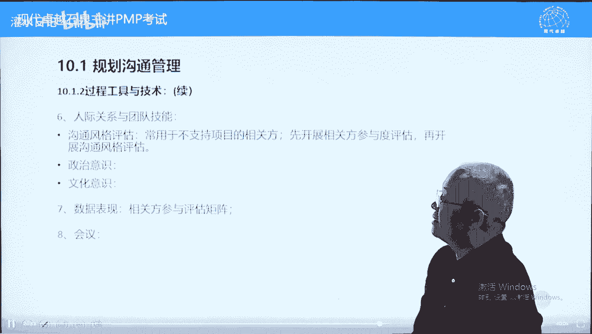

这里面呢有一个重要的概念叫沟通风格评估，什么意思。

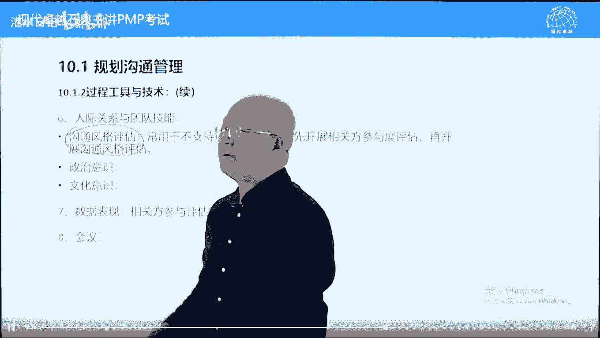

对于负面相关方，不支持项目的人。

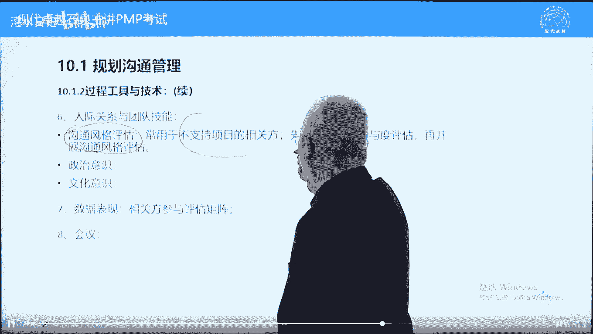

要特别的专门评估一下他的沟通风格，他的需求，我们呢要慎重的来去确定跟他怎么沟通，他本身对项目不支持，要防止呢把它沟通没满足他，或者沟通把他给惹毛了，导致呢它的一个更多的反弹。

更多的这个叫不支持或者更多的抵制吧，这个呢稍微注意一下，曾经考过了，针对不支持，向官方要进行沟通风格评估，在沟通需求评估的基础上，再进一步的分析，分析的更加详细一些呃，慎重一些，好政治意识跟文化意识。

政治文化应该是一回事，一般我们放在一起的，但是这里面分开了，简单区别一下政治跟什么有关系，跟这两个字有关系啊，政治都是利益问题，什么叫利益问题，屁股决定脑袋，比如说996互联网公司的996好不好。

有人说好，有人说不好，那都有理由跟什么有关系呢，还有人说这是一种福报，要且行且珍惜，这都属于政治跟利益有关系，他的利益决定他怎么说，就是什么呢。

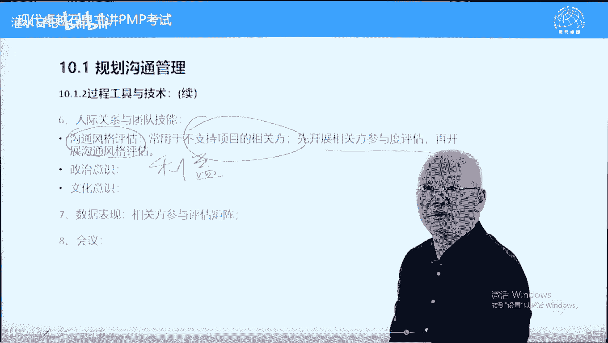

屁股决定大脑，什么叫文化，文化更多的跟习惯有关系，这个呢跟主观关系不大，这是个习惯问题，比如说北方人喜欢吃面食，南方人喜欢吃大米，北方人吃大米吃不饱，像我是北方人，我吃大米，刚上大学的时候。

吃大米永远吃不饱，吃太多都吃不饱，而南方人的话呢，吃米吃米饭，他吃大，吃白面的时候，吃面粉的时候吃馒头，他吃不饱，吃多少都吃不饱，为什么呢，这个胃习惯大米还是习惯于馒头的问题。

那包括妈妈的妈妈在北方叫姥姥，在南方呢叫外婆，这什么问题呢，文化问题跟习惯有关系啊，知道就可以了，数据表现，这里面有一个相关方参与评估矩阵，什么意思呢，大家翻译一下书，我们先看一下，在第13章。

我们提前看一下，相关方参与评估矩阵13。2里面的内容，在pmbok 522页，522页，相关方参与评估矩阵，它把相关方立场显示出来，显示五种不知小抵制，中立支持和领导管理相关方。

就是把相关方立场从左边变到右边，这里面呢有个c一个d，c指的是该相关方当前立场，当下立场英文叫current，d呢是desire，我们期望的立场，c跟d不在一起，就需要使用公关策略。

也叫相关方参与计划来去转变了。

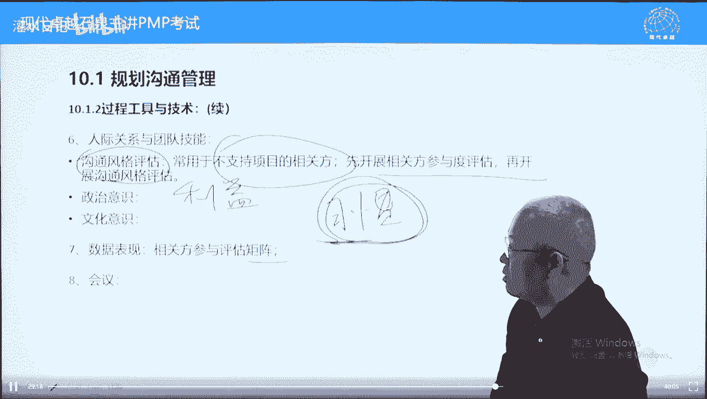

所以呢沟通中我们要参与相关方评评估矩阵，来决定这个相关方到底是正面的还是负面的，是不是不支持项目的，然后呢需要不需要特殊对待，第八个会议很简单，开会让团队生参与来制定沟通管理计划，下面看一下输出。

输出呢就叫沟通管理计划，它包括程序内容，也包括实体内容，那实体内容是什么呢，这些是实体实体内容，what when where how how often之类的，这这个各种规则，包括会议规则。

这叫程序性内容，所以呢沟通管理计划综合计划，它的更新不需要走变更流程，走也可以也不多的，但是呢可以不用走好规划，沟通之后可能会修改向官方参与计划，但是计划没有批准，也不存在变更，这个内容呢可以不用管。

它互相之间都有影响，前面呢它是输入，后面呢它又是输出，输出里面又更新了，理解为滚动式规划就可以了，包括识别性的相关方也要更新一下，好下面呢我们看10。2，10。2管理沟通，我们前面在在这个呃，4。

5的时候讲过这个内容，它跟4。5有关系，4。5干什么呢，监控项目工作生成一个重要的文件叫绩效报告，当时我们问了绩效报告什么时候发布，什么时候发布呢，在10。2中发布，根据沟通管理计划发布绩效报告。

所以呢10。2不是干别的管理沟通，就是发布绩效报告的过程，发布绩效报告，它不包括生成在4。5中生成绩效报告，定期生成的，在10。2中，根据沟通管理计划来去发布绩效报告就可以了。

另外一个呢他们可以对沟通管理计划提出要求，可以进行一个修改的过程的输入，我们看一下，主要是沟通管理计划，以及这边有一个绩效报告在这儿，第三个绩效报告，根据沟通管理计划发布绩效报告，这是10。

2的核心内容，其他的都是一些补充，都是一些补充内容啊，不多说了，我们看一下工具，工具呢沟通技术，沟通方法前面都提到了，没有什么特别的沟通能力，指的是项目你的沟通能力，我们呢如何发布绩效报告。

发布及绩效报告的手段，包括你的能力怎么样，比如说项目里应该有也是ppt的能力，能够想做ppt，并且演示的很生动，这是要求另外一个呢，很多绩效报告通过信息系统发布的，什么叫绩效报告，以书面方式发布。

发布给团队成员的，发布给项目相关方的呃，文件能反映项目情况的文件都叫绩效报告，书面方式向相关方汇报项目情况的文件，都叫绩效报告，我们可以通过项目管理系统啊，比如说电子邮件系统之类的，我们呢去传递。

向相关方传递绩效绩效信息。

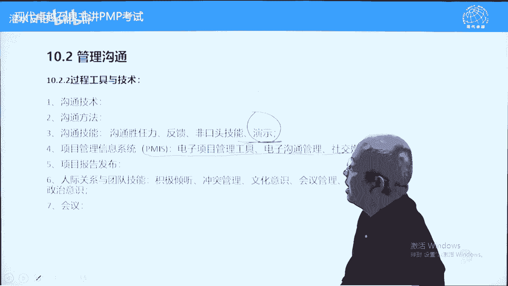

第五条工具叫项目报告发布，以前的叫绩效报告发布叫performance reporting。

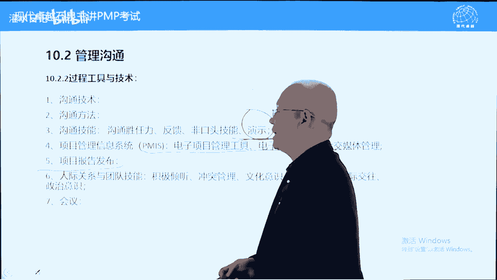

performance reporting，他强调什么呢，他强调动词我们的汇报，比如说开会ppt方式去演示，包括那发email发邮件去演示人际关系和团队技能，这些呢没有什么需要特别知道的。

沟通中冲突管理其实很少的，就是别人不满意我们的调整就可以了，但是呢文化意识，政治意识这个很重要，另外呢会议管理，会议管理就是两个字了，规则看到会议有问题都是规则问题，规则问题啊，这些呢不多讲了啊。

这个会议呢指的是开会去发布绩效报告，也可以叫绩效报告，会议汇报绩效的一个会议好，另外我们再看一下输出项目沟通记录，就讲这一个其他的都不是很重要。

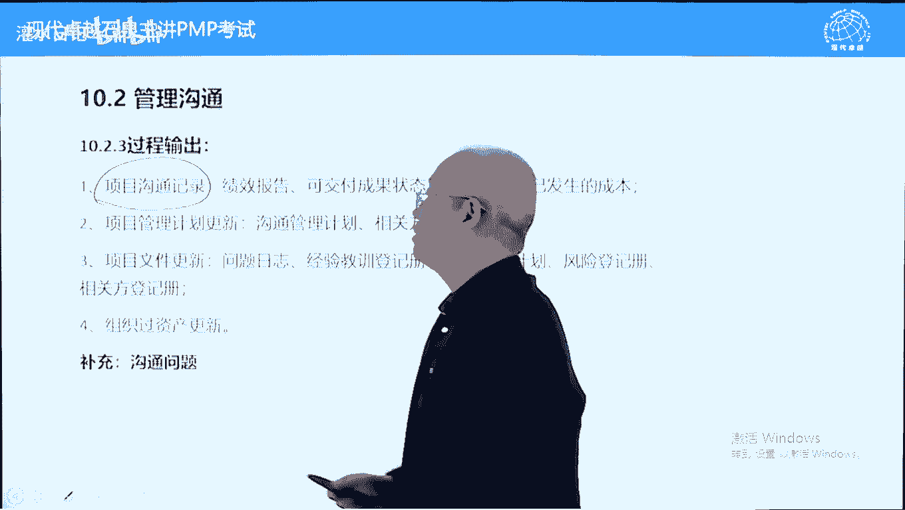

项目沟通记录，我们绩效报告中主要绩效报告强调什么，强调三大基准的情况，这也叫状态报告可教，不是补偿单，进度进展可以发生的成本，这个呢是三大基准，绩效报告，围绕三大基础展开，包括偏差分析，绩效分析。

包括政治分析，也都针对三大基本的一个情况啊，计划更新我们前面讲过了，就是在发布绩效报告的时候，在实时沟通的时候，相关方会提出不同意见，比如说你这个时间太晚了，你这个形式我看不懂。

或者说呢你不要用这种方式，你要用呃，微信，不要用qq，我不用qq，或者说不要用电子邮件，电子邮件我从来不开了，不打开了，这个呢都要更新沟通管理计划，而沟通管理计划可以走变更流程，也可以不用走。

这里面没有提变更变更流程，相关方参与计划，就是在管理沟通的时候，我们呢有些参与计划，可能需要通过沟通来实施的，实施不好，实施的不好或实施不了，这个时候呢也相应调整，另外一个呢跟人有关的问题。

比如说向官方提出沟通的，问沟通的方式不对，必须要改，怎么样呢，确保问题解决呢，请写在问题日志里面，写在问题日志里面，设定责任人，设定期限来去解决好，其他内容呢就不多说了。

这里面呢我们讲一个问题叫沟通问题，在10。30。20。3中都会出现，我们呢一般当成10。2就可以了，10。3的话呢，其实在我们看来几乎不考的，你把这个沟通问题都当成10。3，也可以在管理沟通中出现问题。

我们呢要对沟通管理计划进行调整，什么叫沟通问题，沟通问题是一个技术问题，他跟主观态度关系不大，就是个技术问题啊，什么叫沟通问题，相关方对信息对沟通担心怀疑不满，这叫沟通问题。

比如说客户说重要信息没有给我，这个呢是一个沟通问题，或者说这个信息给我的太晚了，时间不够，或者说我需要英文的，你给我的中文的，或者我需要中文的，你给我的英文的，这些都叫沟通问题，相关方对信息。

对沟通担心怀疑不满，都叫沟通问题，而沟通问题答案呢比较确定什么呢，沟通管理计划，这个考试中非常好用的沟通管理计划，这是呢沟通问题的标准答案，当然了，如果没有沟通管理计划。

还可以选规划沟通沟通需求分析也可以，但是基本上就是沟通管理计划可以什么呢，查看可以更新，可以修改都可以的，不需要走变更流程，这个呢叫沟通问题，他在主观上看不出来什么意愿的，看不出来什么倾向的。

就是一个技术问题，别人抱怨这个重要信息没有收到，或者说呢要求提供新的信息，说明你前面给的信息不不对，为什么先找沟通管理计划，先看一看是计划做得不好，还是我们没有严格的执行计划，首先查看沟通管理计划。

修改也是可以的，当然创建也是可以的，说明你没有沟通管理计划，所以呢导致了沟通问题，这个呢叫沟通问题，答案呢找沟通管理计划好，下面呢我们看10。3监督沟通，它的内容呢跟10。2差不多。

只不过呢它是修改10。2中发现的问题，10。2中发现的问题，我们也叫沟通问题，在10。2中可以直接更新沟通管理计划，10。3跟他的不同，就是他提出了变更请求，10。2中呢没有变更请求啊，这个呢是修改。

根据新的沟通需求来去修改呃，沟通管理计划，10。3呢更加正式一些，10。2也可以直接用，所以呢第十章其实呢两个过程就差不多了，第三个过程呢稍微有一些多余，大家看一下调查满意度，整理经验教训等等啊。

沟通管理计划可以随时更新的过程的输入，这里面有个沟通记录需要保管的，作为经验教训，或者说呢作为历史信息保管的，其他的这里面有一个观察与交谈来去了解对方，相关方对于沟通满意不满意，需要不需要调整沟通方式。

沟通管理计划好，后面呢有一个这个叫变更请求，变更请求呢相对来说比较正式一些啊，消除变更问题的哦，消除沟通问题的沟通问题我们也讲了，都是叫技术性问题，跟人的主观意愿关系不大，相对来说客观一些啊。

这个是计划更新，其他的文件更新有经验教训，我们事后总结经验教训，包括呢不同相关方喜欢用什么方式啊，包括呢它的这个格式啊，什么信息之类的，我们都可以记录一下，公以后接见的，第十章，沟通问题呢比较少。

我们呢再总结一下，第十章属于狭义的沟通，狭义沟通是什么呢，发布绩效报告，广义沟通包括协调协调各种关系了，发布机器报告要根据沟通管理计划，所以呢沟通管理计划比较重要，10。1的一个内容。

沟通管理计划里面包括了沟通模型，以及沟通方法，这些呢都是考试中的重点，尤其沟通方法有三种方法有不同的特点呢，好沟通内容的话呢，目前的考试量还还可以，而且呢有增加的趋势，但是呢难度并不是很大。

注意一个沟通问题，但是呢很多人将来会把沟通问题，跟另外一个问题混淆，叫相关方问题，先打个预防针吧，相关方问题都是主观的，相关方对项目不满意不重视，或者说呢这个叫反对项目，至少呢对项目不重视。

对项目命令不尊重，这个呢我们叫相关方问题，而沟通问题跟尊重重视没有关系，就是一个技术问题，别人抱怨信息，抱怨沟通，更多的原因是项目在沟通方面没有做好，沟通管理计划没有做好或执行没有做好。

或者说在收集相关方对于信息需求的时候，没有做好，导致的话呢，相关方对于沟通不满意，ok关于第十章，我们就讲到这。

