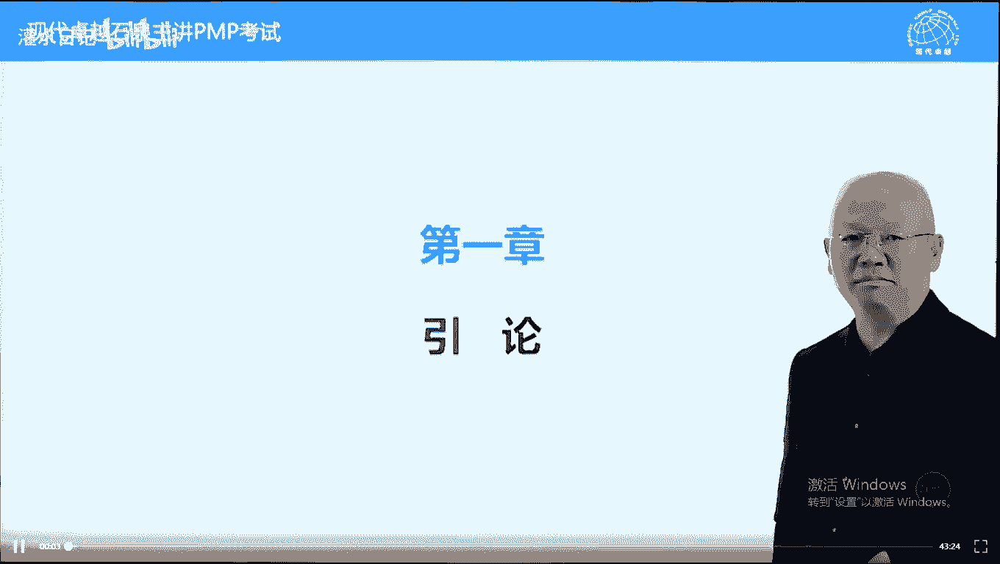
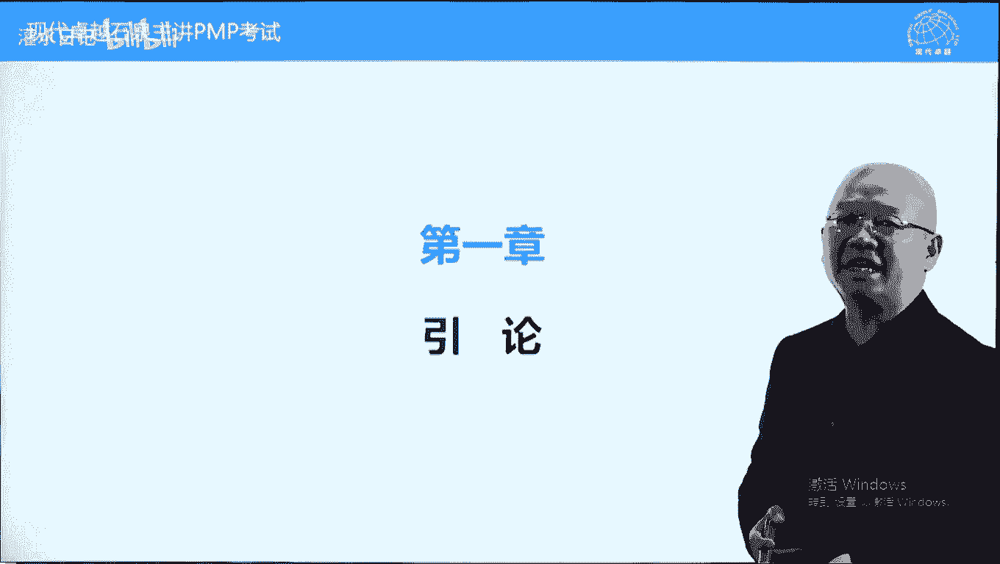
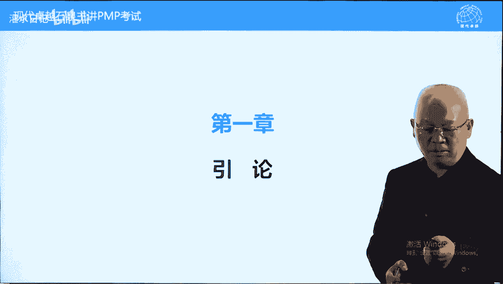

# PMP考试精讲 - P2：2 - 灌水日记 - BV1VN411w7cC

但是呢跟pmp考试相关的有直接关系呢有限呃，大多数内容呢是一个铺垫，让我们了解跟项目相关的一些概念，这些概念的话呢是我们了解项目管理。

或深入学习项目管理的一个基础，所以呢我们都要讲一下的。

首先我们看一下pmbok指南的目的，这本书呢它是一个叫标准项目管理的标准，全世界公认的标准啊，这个文明标准有两个字，两个词，注意一下，叫普遍公认和良好实践，也叫良好做法，普遍认可良好做法，什么意思。

这本书它不分行业的，它是把所有行业的共同特点提炼出来，比如说像质量管理体系，它可以针对所有行业的那项目管理的话呢，也有一些共性的东西，任何行业都要用的，做项目都要这样做的，因为项目呢都一样。

基于进度的做事方法，无论你什么行业特殊性，不管他把共性提炼出来了，这叫普遍认可，良好实践指的是最好的做法，按照这样的做法能减少失败的，这个世界上没有成功学，能减少失败就可以了。

失败的话呢就是区分专业不专业的一个标准了，什么叫专业人士，他不会轻易犯错误，不会轻易失败，这叫专业人士，比如说我们看足球场上，英超英超西甲赛场上，我们永远看不到一个球员踢着球，结果呢踩球上滑倒。

摔个四脚朝天，但是我们在业余队，业余比赛中，有一些人喜欢踢足球啊，小伙伴们礼拜六礼拜天踢一场，我们在这种比赛中，经常能看到自己把自己绊倒了，一脚踩球上摔个四脚朝天，这叫什么呢，这叫不专业。

好良好实践指的是比较好的做法，这些做法的话呢不能保证我们成功，但能最大限度的防止我们失败，比如说下象棋，有专业人士，也有臭棋篓子，什么叫专业人士，什么叫臭棋篓子，臭棋篓子不是说下不出好招的。

偶尔可能下出好招，但是呢他经常下一些很烂的招或者很臭的棋，很轻易的就能失败，而专业人士的话呢，他是滴水不漏，他不会犯低级错误，比如说在下象棋中有这样的说法，叫当门炮，那下一句大家都知道马来跳。

那还有一些原则，比如说强狙不过河，你的这个车的话呢，在开局阶段不要攻过去，否则你防守会有问题啊，那还有更高一些的，叫对方的马过来了，过河了，你应该怎么办，撑起羊角士，不怕马来将这些专业做法。

这属于不是说特别高深的答案，有些更高深的需要供需要实践中去领悟，才能知道的，高手才能知道的，这些都叫良好实践，也叫最佳做法，按照这样的做法，我们零失败会越来越远，当你离失败越来越远越远的时候。

你离成功就越来越近了，这本书就是这样一个特点，它呢告诉我们在所有行业的项目管理中，最好的方法应该是哪些，它有一些共性的东西，比如说有人辞职了，供应商说有东西要延误，客户说要增加内容。

领导说钱不够了啊之类的，要求提高速度之类的，这些情况都有一些最佳实践，最佳时间，你学会之后碰到这样的情况，按照最佳时间来去做，我们离失败比较远，不会轻易的15，不会轻易的失败，另外呢这本书不是方法论。

这本书呢跟棋谱很像，很接近的，无论象棋棋谱还是围棋棋谱都有这个特点，什么特点呢，它都是讲某些情景，碰到这种情况情况应该怎么做，碰到这种情况应该怎么做，他没有讲一盘棋从头到尾怎么下，这个是这个意思啊。

它不是方法论好，为什么所有的棋谱都不讲一盘棋，从头到尾应该怎么下呢，因为中国有句俗话叫千古无同局，听过没有，就是有史以来没有一盘棋是完全一样的，那管理学中也有一个说法叫管理无定式，没有定没有定的方式。

没有确定的方式，管理无定式，没有说任何管理可以放之四海而皆准的，要具体情况具体分析，什么叫方法论，我简单说一下这本书它不是方法论啊，方法论指的是有具体操作步骤的，这样一个文件或计划叫方法论。

宋丹丹曾经给我们讲过，一个经典的方法论的例子，如何把大象关进冰箱，分三步，第一步打开冰箱门，第二步把大象推进去，第三步关上冰箱门，这是一个标准的方法论，它有123应该怎么做，有标准的这个操作流程。

有一个具体操作步骤，这本书不是的，我说一开始我们是干什么干什么的，没有这样一个说法的，要具体情况具体分析，而有人说，那如果是这个这样一个情况，那我们做项目应该怎么做呢，怎么样叫专业的做项目呢。

好很多人呢拿到这本书之前期望很高，以前做项目稀里糊涂的希望学完这本书之后，做项目的话呢，能有把鹰眼一一招一式都很专业，但是呢看完这本书好像很失望，这本书没有告诉我们从头到尾应该怎么做，那应该怎么做呢。

跟大家说一下，有点让大家失望，原来怎么做，继续怎么做，只不过加一条，这本书中所介绍的所出现的好的工具，方法和过程，能用多少，尽量用多少，而用多少用到什么程度，由项目经理根据实际情况来决定。

这个过程叫裁剪，所以呢它本身不是方法论，但是呢这本书是我们为具体项目制定解决方案，或制定项目管理计划的一个依据，根据这本书，我们能为具体的项目呢做出一个项目管理计划，或项目管理解决方案。

具体项目的项目管理计划和解决方案，就是一个方法论，好这个呢是我们管理的一个依据，或者说制定项目管理计划，管理项目的一个依据，项目团队和项目管理团队，包括项目mini在考试的时候呢。

这个团队跟项目mini划等号一回事，小的项目只有一个项目命令，大的项目人数超过十个了，一个人管不了那么多人，他需要有帮手来帮他管，叫项目管理团队作用跟项目一模一样啊，他决定这本书中用多少用到什么程度。

这个过程叫裁剪，把所有裁剪加在一起，有个词叫项目治理，我们在后面会提到的项目，这里也是稀松平常的，不是那么高大上，很丑不是很那么抽象啊，就是我们把具体的把这个结合具体项目。

把这本书的内容落地的过程叫裁剪，把所有裁剪加在一起叫项目治理，另外呢这本书是单个项目的管理标准，除了单个项目，还有项目集和项目组合，在第一章都会提到的，但是呢是帮助我们理解项目的。

它本身不涉及项目及项目组合管理，但这本书中在第一章提到了项目及项目管理，跟项目的一个特点，项目及项目组合跟项目的特点，另外一个呢标准不要求执行任何特定的程序，过程和程序，这本书中有五大过程组。

有49个过程在现实现实项目中，你用多少，用到什么程度，完全由项目经理根据实际需要来决定，没有哪一个过程是必须要用或必须不能用的，一切呢根据实际情况需要我们就用啊。

另外一个呢这是推广项目管理的一个通用词汇，一个学科它必须有共同语言，通用语言，否则无法沟通和交流，比如说pv 1 v计划失败，实际失败到底什么意思，这本书呢告诉我们一套标准的词汇。

这样的话呢我们能够跨行业沟通，我们能在行业内沟通，能在公司内沟通，这个呢是沟通语言，在共同语言背后，他有些理念的，比如说这本书告诉我们，在项目中，项目负责，他有三个权利，负责三件事情。

范围进度成本项目你说了算，但是呢资源跟技术由职能经理说了算，这个权利呢不归项目里，这些原则我们知道之后呢，在工作中能减少很多的扯皮，减少很多的冲突好，另外呢在这个pi的项目管理的标准中呢。

还有一个职业道德规范考试中，会提到有四个要求啊，叫责任，尊重公正和诚实，知道就可以了，有些是强制的强制要求，也叫底线要求，比如说不能违法，不能违反职业道德，有些呢是期望的，希望你能做得更好一些。

比如说你能够把下部管理知识发扬光大，你能够呢不光把自己工作管理好，你能够帮助别人，或者说呢防止别人来去，这个呃影响别人，不要去做违反职业道德，违反法律的事情，这个呢都属于职业道德的内容了，好责任。

对雇主的责任，尊重以人为本，尊重员工，尊重供应商，包括客户啊，公正呢也是对待领导，包括对待这个呃员工，包括对待供应商，都要呢叫己所不欲勿施于人，诚实就是不欺骗，即使现实让你脸红。

但是呢我们呃让你很难很难过，但是呢我们不能欺骗别人，这个呢是一些基本要求，在考试中题目中会体现的，我们呢讲到具体题目的时候再说，这种情况呢要具体情况具体分析，我们呢假定自己是一个什么呢。

是一个非常好的人，像雷锋一样的人，然后呢面对绝大的题目呢，我们能够选择更加好一些好，下面我们继续，讲一下项目，什么叫像，这是项目的定义，大概看一下为创造独特产品，服务或成果进行的临时性工作，解释一下。

首先项目的结果有三种状态，产品是看得见摸得着的，比如说电脑，手机，这都叫产品，一个一个大楼建筑物都叫产品啊，服务呢可能是一种仪式，看得见，但未必摸得着，比如说婚庆仪式，开一个周年大会。

公司成立多少周年的一个庆庆祝大会，而成果的话呢，有可能既看不见也摸不着，但是它是存在的，比如说经过项目管理的系统学习，我们呢了解了什么叫计划失败，什么叫实际失败，掌握了项目管理的一些具体的方法。

工具和语言，这个呢叫成果好，这些呢都是项目的结果，我们在学习的时候，为了学习方面，我们呢把这个项目结果都假想为产品，更容易理解一些，但它可以是别的，另外的项目有两个核心特点，一个叫临时性。

一个叫独特性啊，这个是独特，这个呢是临时，这两个特性呢是区别项目和运营的核心特征，我们呢讲讲一下什么叫临时性，临时性指的是项目有明确的结束日期，或者说有明确的截止时间，不一定是某个日期。

但是呢可以是一个具体的时间，比如说有一个电视剧美剧叫越狱，越狱啊，这个电视剧就是一个项目管理，他的第一季里面就有一个目标，有一个项目啊，就是主人公的哥哥被判死刑了，第一呢想把他哥哥救出来。

那这个项目呢它有一个截止日期，什么截止日期必须在哥哥被处死刑之前，要把哥哥救出来，否则这个项目一点意义都没有，项目呢有明确的截止日期，这个起点呢有些时候有，有些时候没有的。

大多数项目都是一个叫它的起点都是模糊的，叫模糊的项目，前期比如说谈恋爱什么时候开始好的，朦朦胧胧开始好了，什么时候分手了或结婚了，可以记一辈子，这个呢是临时性，临时性意味着我们要快，时间可能要短。

如果是我们主动要做的，另外一个呢临时性要求我们可能专业性强一些，之后才能快，你不专业是不能快的，临时性有两个两个误解，我们先说一下两个误解啊，第一误解，临时性不代表时间的，临时性可能是很长时间的。

就是临时性不代表短期啊，比如说中国男足获得世界杯冠军，即使时间很长，它也是一个项目，它具有临时性，另外一个项目的结果未必具有临时性，项目具有临时性，项目的结果有可能永远存在。

我们在很多工地上能看到这样的标语，叫功在当代，利在千秋，项目的结果会永远存在，有可能的项目什么时候结束，正常项目完成，项目可以结束，另外呢项目不需要做了，被提前终止，或者说项目做不下去了。

没法实现目标了，也会提前终止，这个呢都是项目终止或结束的一个情况，有可能是正常完成，也有可能呢是提前终止，临时性带来的问题还相对有限，它告诉我们以时间为导向，这是一种比较先进的啊，比较主动的做事方法。

而独特性呢指的是前无古人，后来者，不管前无古人，以前没有做过类似的事情，没有做过，意味着风险，首先这是个风险，这个风险呢对于项目而言，不是一个很重要的，不是说核心的问题，不是说不重要，重要啊。

不是核心问题，而给项目带来核心问题的项目管理，之所以难比这个运营管理要难的，原因就在于独特性，为独特性呢还意味着另外一个问题叫什么呢，缺少惯例或规则，一件事情有规则，我们按规则来，没有规则怎么样做。

这个呢是一个挑战，比如说这个很多城市开放户口允许呢，本科毕业的40岁以下，几十岁以下的人呢可以直接入户，比如说你符合某一个二线城市的入户标准，入户标准，你呢老家在在某某外外地一个三线四线城市。

你呢需要把户口迁到这个二线城市，你符合条件，你到老家办手续的时候，有规则，政府有规定啊，派出所多长时间之内必须给你办完，他有一个承诺的，你不需要请客送礼找关系，你把户口拿来之后。

到本地二线城市当地派出所，你去办手续落户，派出所呢它有规则，它会规定符合情况的多少，神经之内必须给你办好，这叫什么呢，有规则，我们按规则来，没有什么麻烦的，也不需要请客送礼，找关系，按规则就行了。

前有车后有车，别人怎么做，我怎么做，但是呢当一件事情没有规则的时候，应该怎么做呢，这个就麻烦来了，举个例子，孩子要跨区上学，你所在的这个你住的地方，你的小房子所在的地方，他的学习不好。

你想呢跨区上一个本地最好的小学，国家有没有规定你的孩子可以跨区上学呢，没有，但不代表办不到，这个时候呢考验跌的项目管理能力了，如果这个爹很能干，是一个优秀的项目，他能搞定，那如果一个跌啊。

总是说我们不能搞特殊化，我们要遵守国家的规章制度什么之类的，那这个项目呢可能就搞不定了，那这种跨区孩子考去上学的项目怎么做呢，他是缺少规则情况下，我们做的要请客送礼找关系，我们呢光这样讲比较俗气了。

我们上纲上线一些一个事情，有规则，按规则来，没有规则的时候呢，我们解决问题有三个层次，叫什么呢，叫情理法，情大于理，理大于法，当理合法对你不利的时候，或者说你不占理不占法的时候，没有理，没有法的时候。

必须讲感情，那孩子快去上学，不占理不占法，靠什么呢，靠感情来去解决好，在现实生活中我们都懂，但是在工作中我们可能往往的记不住啊，举个例子，你开车打电话，开车打电话呢是违反交规的。

但是呢他不像酒驾那么恶劣，那么严重，交警有可能抓到现行，他有权利扣你分，罚你款，但是呢也未必都是这样一个情况，好比如说某一天你是个美女，你开车打电话被交警抓现行，交警的说呃。

你违反交规多少多少多少多少条，你扣你几分，罚多少款，把驾照拿出来，你会乖乖的把驾照递给他，让他扣扣除罚款吗，一般不会的，我们呢垂死都要挣扎一下，如果你是个女生，你会怎么样呢，撒个娇，发个嗲。

如果你能立马哭出来，你几两滴眼泪出来，这样的话呢，对方可能不好意思了，就放你一马，为什么呢，本身这个问题并不是很严重，什么意思呢，当理合法对你不利的时候，必须讲感情，那如果你是个男生，怎么办呢。

低音说好话拉关系，我同学谁谁谁也在，交警多少招罪，你们是不是认识啊，啊这个事情我真的第一次犯啊，放我一马就是了，你要求情，这个呢是面对独特性效命，你很多问题要靠感情来解决。

也就是为什么007碟中谍那需要研制报表，那需要呢呃情商很高才能解决这个问题，项目的难点就在于独特性带来的这个问题，那反过来我们可以再说一下一件事情，你不占理不占法的时候，靠感情好，战略战法的时候呢。

你可能就根本不愿意再讲这个事情了，不愿意讲感情，比如说在项目中有可能需要做一件事情，这件事情的话呢可以找公司其他部门来做，也可以找供应商来做，你一般来说选择找供应商来做，还是自己找自己部门。

自己公司其他部门来做呢，老司机都会这样说，当然找供应商来做，供应商来做有什么好处，合同一旦签订，叫爹爷跟孙子就划分好了，谁是谁是爷，甲方是爷，乙方是孙子，那我就占理战法了，我不需要求爷告奶奶。

那如果我们要找公司其他部门来做的话呢，那我们要靠感情，为什么呢，因为别人是帮你的忙，帮你也行，不帮你也行，你得低三下四的跟别人求情好，这个呢就是情理法的一个区别，那现实生活中绝大部分的项目里是乙方。

乙方呢在面对甲方的时候，它具有独特性，难很多问题你跟别人不能讲合同，也不能够讲道理，合同对你不利，道理的话呢，都是甲方的，那怎么办呢，要讲感情，怎么讲感情，这本书里面告诉我们，感情是需要培养的。

非正式沟通和活动能培养感情，另外呢项目经理的认证叫pmp，在中国呢直接叫拍马屁，我们叫夸你孩子，跨年狗有了感情之后，问题呢就好解决了，也有比较专业的项目，他这样说，有问题，喝酒去，为什么呢。

喝酒是非正式沟通，他能培养感情，有了感情之后，我们呢可能在这方面我们就不那么计较了，或者靠感情解决问题的效率要高很多，这个呢是项目独特性带来的问题，当你不占理不占法的时候，或者说你是一个乙方的时候。

我们呢跟甲方这一块儿不要讲道理，也不要讲合同，讲不过人家的讲什么讲感情，所以呢得道多助，失道寡助，做事先做人，要把这个人做好，就是提高你的情商了，好我们再看项目的一些其他特性，项目呢还具有目标性。

什么叫目标性，项目以成败论英雄，以结果为导向，项目成功了才叫好项目，项目如果结果失败了，无论谁的原因，无论中间你再怎么辛苦，你都是只有过没有功的，你呢都要负这个责任的，板子只能打你，不会打别人的。

有人问，那公司的状况不好，条件也不好，各种配合都不好，结果呢项目都是一塌糊涂，我们能不能不背这个锅，我说我回答说项命令必须要背这个锅，为什么呢，项目命令是项目成败的唯一责任人，项目只要失败了。

板子肯定是你身上的，这叫什么呢，以目标为导向，项目还具有系统性，系统性呢，我们待会详细讲一下，系统是个整体，牵一发动，全身是一团乱麻，没有因素是孤立的，系统是动态的，系统中最活跃的因素。

决定系统的发展方向，系统是动态的，在项目管理中，项目里应该是这个系统中最活跃的因素，他能主导项目的发展方向，能带着项目往目标去迈进，如果项目不专业，项目中有其他因素更加活跃的话。

这个时候呢项目里叫救火队员，他会被项目呢拖着走，项目呢就失控了，渐进明细指的是我们对项目结果的了解，是与时俱进的，随着时间推进，对项目结果了解越来越多，越来越深刻，这叫渐进明细，阶级明细告诉我们。

计划是滚动的，我们叫滚动式规划，另外一个计划是分层的，不同的层次，我们管的计划是不一样的，从高层到低层，另外一个呢就是计划不能一步到位，远期的工作我们叫里程碑计划，也叫控制计划，有里程碑点啊。

控制计划大点，声杯告诉我们大的方向，马上要做的阶段，我们呢制定操作计划，也叫详细计划，告诉我们今天做什么，明天做什么，这样一个计划，计划是分层的，最多分到六层到七层，两种计划都很重要。

很多项目只专注于操作计划，为什么呢，能提高效率，忽略控制计划，控制计划告诉我们大的目标，告诉我们我们的目标是什么，控制计划有个好处，能防止我们忘记初心，我们叫不忘初心，方有始终。

控制计划告诉我们目标是什么，因为呢在现实中有个说法叫，出发久了会忘记要去哪里，你呢埋头于具体事物之中，你会迷失方向的，就像开车，在高速公路上开车，你光看眼前三四十米，车头不会正的。

你的时速80km以上的时候，教练会告诉你，你必须要看2百米才能保持车头正直，所以呢控制计划能告诉我们方向，防止项目跑偏，什么叫项目跑偏，也可以叫项目蔓延，用网络语言来说，炒股炒成股东，泡妞泡成老公。

这都是什么呢，这都是忘记初心了，因此的话呢要及时的定期的检查我们的里程碑，计划呃，项目这本书告诉我们，每个阶段都要重新启动一下项目，目的呢是确认一下目标，防止出现出发久了忘记要去哪里好，项目驱动变更。

项目跟它对应的叫运营，运营工作是持续的重复的，项目呢是临时的，独特的变更，指的是我们要做一个新的东西，以前运营中没有的，必须用项目来去做，项目驱动变更，所有的变更都是项目才能实现的，运营是持续的稳定的。

它不改变的，它是一个静态的，它是一个常态的项目创造商商业价值，我们可以这样说，项目和运营都是实现战略计划的具体方式，具体手段，我们公司要发展，或者说公司要成长，有运营工作，有项目工作。

运营工作只能是以前的持续重复的一些工作，要想开拓新的市场，要想有新的产品，要有新的方向，我们必须通过项目的方式来去进行，包括呢原有的市场要提升，也都是项目的方式好，他能创造价值。

价值呢我们叫商业价值分为两种，有形的和无形的，什么叫有形的，比如说呃股价呃，市值包括呢公司的一些资产，公司的利润，这些呢都是有形的，包括我们的产品啊，还有市场份额，什么叫无形的呢，品牌商业信誉，信誉度。

别人对你的好感，美誉度，这些呢叫无形的，比如说某些这个可口可乐，它的品牌值多少多少钱，这个呢就是一个商商誉啊，商商业价值，这个就是无形的一个效益项目，项目呢这两个都能创造商业价值的特点，要注意一下。

在书上第九页，大家稍微看一下，有形的和无形的都要注意一下，啊不是第九页，第七页，不好意思啊，第七页好，另外一个内容呢叫项目启动的背景，指的是我们为什么要做一个项目，除了因为变更之外，还有很多其他因素。

我们看一下第九页，第九页的一张表，这张表呢告诉我们其中一个项目很多原因，注意第九页的这张表里面有打叉的，这个打叉是跟前面内容有关联的，不打插空白是没有关联，那这个呢表述方法有点奇怪啊。

打叉表示跟前面的描述有关联，不打岔呢没有关联，考试中考过两个例子，一个呢叫客户需求，就是为一个工业园区建一个变电站，在第九页，有的另外一个内容呢就是叫商业法律需求，法律需求啊，法律要求也是法律。

法律要求也是法律需求吧，就是编写一个有毒物质处理指南，这也是个项目，其他需求的话呢自己看一下，就是要解决一个问题，才会有一个项目，项目呢就是要解决问题的这样来理解，这是项目启动的背景好。

下面呢我们大概看一下哪些是项目，哪些不是像根据项目的两个特性来，两个特性呢，一个叫临时性，一个叫独特性，再讲一下这两个特性是相对的，不是绝对的，因为在时间面前，任何一件事情都是独特的。

同样一件事情的话呢，站在不同角度也会有不同的概念，比如说我们到韩国拉双眼皮儿，对我们来说是项目人，这一辈子顶多拉两次双眼皮，两次拉拉不好，第三次没地方下刀了，因为脸皮太薄，眼皮是很薄的。

很薄的很薄的一个器官，不好再下刀了，对你来说是像，但是呢给你做双眼皮手术的人，比如说是一个韩国欧巴，40几岁，他呢每天做八例手术，拿八个人的双眼皮，每年做2000多例双眼皮手术，对他来说。

给你拉双眼皮跟给别人拉双眼皮没有区别，对他而言叫运营，运营呢，另外两个特性我们叫什么呢，叫持续性，持续啊，重复性，这是相对的啊，持续性和重复性，这样来理解，再比如说我们的车管所上牌照。

对我们来说肯定是像，但是呢对于车管所的工作人员而言，给你上牌照跟给别人上牌位牌照没有区别，对他而言就是一工作，但是呢对于项目运营的区别有一个普遍认识的，普遍公认的一个普遍普遍公认的一个观念吧。

我们呢按照大众的一个观念来去区分一下，第一个项目是运营呢，它是相对而言是持续重复的，它属于运营工作啊，第二个会计记账，学生写作业，括号里面全是学生的事情啊，这个呢相对而言也是持续和重复的。

第三个这就是项目了呃，追讨欠款且检查都具有独特性，它不是重复的，第四个考试作弊有风险，有独特性了，这个呢也是像到人才市场招聘新员工，他的临时性特别明显，他肯定是项目啊，这个酒仙大桥被撞踢球受伤。

是不是项目呢，这个既不是项目，也不是运营，项目和运营都是人为的主动行为，它不是人为的，它是事故啊，911是不是项目，是的，它是人为的，从项目管理角度来说，这个呢是一个成功的项目，炒股票是不是项目是的。

炒股票的这个项目呢在我看来属于计划失败，项目在在中国散户炒股票啊，计划失败项目，所以呢珍惜生命，远离股市，跟你要嫁刘德华，嫁杨洋，李李杨洋和李李易峰也一样的，李什么风，李易峰啊，找对象是不是项目呢。

是的，而且的话呢，我们在这个课程中会讲一个专业的项命令，媒婆谁呢，就是水浒传里面的王婆，媒婆媒婆呢就属于专业的项目里，买房子是不是项目呢，是的，它具有独特性，那这个呢哪些是项目，哪些不是项目。

我们呢了解到这，下面呢我们再讲另外一个内容，项目管理，项目管理的定义，定义呢就比较多一些了，我们先看p mi的定义，pmi定义呢相对来说比较简单，很很接地气，他说呢项目管理就是一系列的知识技能。

工具和技术，当你学会了能用了，就是一个专业的项目，他认为人人都能成为佛，项目管理跟word excel软件一样的，你只要会用了，就是学会了，能用了就是专业项目，而且人人都能学都能用的。

考试的时候呢也是按这个定义来考的，偏偏考试按照这个定义来考的，每道题考一个知识或技能或工具或技术，必须要判断这道题考的是哪一个知识点，或者说技能和工具或技术，这样的话呢才能做出正确判断好，除此之外。

其他定义呢我们也简单说一下，这里面的p m的定义呢，它具体来说就是要整合49个过程，五大过程组，我们回头呢讲这个呃，第四章开始讲正文的时候呢，按照模块来讲，这49个过程到底是什么啊。

它分别属于五大过程组，我们呢这个先不讲了，我们下面讲一下关于项目管理的一些其他定义，有一个人叫哈罗德克，哈罗德克斯纳，号称项目管理第一人，他的一本书叫项目管理破折号，计划进度与控制的系统方法。

在这本书中，他呢给项目管理下了个定义，他认为项目管理是在项目管理，是在纵向的职能型组织结构下，纵向的职能型组织结构下，通过建立横向联系，什么叫核心联系，设定一个pm，然后呢在每个部门抓壮丁。

建立横向联系，形成一个临时团队，来完成一个临时的和独特的工作，他从组织结构角度，他讲矩阵型组织做项目才叫项目管理，这样一个意思啊，矩阵型组织做项目叫项目管理，哈罗德科斯特好，另外一个人呢叫詹姆斯雷利斯。

大概是项目管理第二人，他呢也有一本代表作叫项目计划进度与控制，这本书的话呢，他在这里面讲到了项目管理定义，他怎么说呢，他说projects are people，项目是人。

projects are people这三个单词，这本书第五版，正好我翻译的这本书最难翻译的，我认为就这句话不能翻译成项目是人，那这个意思呢不是很贴切的。

就像iphone 6 iphone iphone 6，一个叫plus，iphone 5 plus，iphone 6 plus，广告词英文叫bigger than bigger，呃。

有些地方翻译成比大还大，那有些地方翻译成岂止于大，那就不一样了，应该翻的好一些，projects of people应该怎么理解，理解为事在人为，事情的话呢，完全是来决定的啊。

他在这本书中也解释了一下什么叫projects are people，他说在项目管理中，项目里，如果不是百分百的时间，在处理项目中的政治问题，他至少有90%的时间，在处理项目中的政治问题。

什么叫政治问题啊，跟政治对应的叫制度，制度呢，我们叫明规则，政治呢可以叫文化，也可以叫潜规则，好举个例子，坐高铁要对号入座，这叫制度，不叫政治，但是呢你上了高铁坐下来之后，有个中年妇女找你换一下座位。

25岁之后，按照联合规定，都叫中年妇女了，他要给你换个座位，为什么带着孩子四岁左右，然后呢孩子不敢自己做，没有座位没买没买在一起，你要不要换，你必须要换，你如果不换，就是禽兽，为什么呢，你没有人性。

这叫什么呢，这叫政治，他可能违背制度了，但是呢它符合人性，那项目中，为什么90%的时间在处理政治问题呢，百分之百和90%现在处理政治问题呢，因为项目具有独特性，独特性意味着缺少制度，缺少规则。

因此的话呢大多数时间在处理政治问题，那政治的话呢就是靠感情再解决问题，跟感情有关系的啊，这是哈勒克科斯纳它的一个定义，中国在20年前，i t界人士项目管理刚刚进入中国的时候。

i t界人士我叫软件软件行业人士吧，就给项目管理下过一个定义，他说什么叫项目管理，项目里一半人一半时间跟自己人斗，另外是一半时间跟客户斗，这叫项目管理，他的意思呢跟哈罗德科斯塔差不多。

都是在处理政治问题，个人都属于政治问题啊，好问一个问题，跟自己人斗和跟客户斗哪个难一些呢，跟自己人都要难得多，为什么呢，大家太了解了，而且呢有更多的利害关系，处理起来比较难一些。

好这个呢是关于项目管理的定义，那项目管理的作用呢就是我们要实现项目标，它是一种做事方法，而且是一种以时间为导向的做事方法，责任人是谁呢，责任人就是项目经理，他需要怎么样呢，平衡制约因素，什么叫职业因素。

我们前面讲过三角制约范围，进度成本，当然也可以叫多重制约，可以加上呃这个资源加上质量，加上这个叫采购，或者说沟通方面的都可以考虑的，包括利益啊，利益相关方，另外呢要管理变更这些呢。

我们在后面的内容中都会详细讲，关于项目管理的一个说法，一些定义呢我们讲到这儿，下面呢我们讲几个跟项目管理相关的一些概念，我们这一页呢讲项目集，项目组合跟项目管理的关系，我们其实呢就是讲一下项目集。

项目管理组合的特点好，先看什么叫项目集，项目级呢指的是一系列有依赖关系的项目，被放在一起管理，这个呢叫项目级，那管理项目集的话呢，也叫项目集管理，它有个好处，因为项目之间有依赖关系。

我们呢能利用依赖关系来获得，单独管这些项目无法获得的好处，也叫提高我们的管理效率，比如说城市的道路建设不光要铺路，还要什么呢，路下面有各种管道，比如说煤气管道，光缆电缆，下水道，雨污分流管道之类的。

上面呢还要有路灯，好我们单独做任何一个管道，包括铺道路或修路灯都属于一个项目，但是呢这些项目之间有依赖关系，都跟这个路有关系，都在路面上或路面下，都可能会对路有影响的。

我们这个时候呢把这些项目放在一起管理，能提高管理效率，否则那城市道路呢就跟拉链一样的，拉链马路这个铺设管道来挖一遍，铺另外管道挖一遍，那这样的话呢效率就低了，成本就高了，好它呢也是一种正确的做事方法。

项目级的话呢跟战略关系不是特别大，跟项目呢更加接近一些好，什么叫项目组合，项目组合指的是一系列不干不相干的项目，或项目集放在一起，我们呢来提高管理效率，我们来提高资源利用效率，来提高资源利用效率啊。

项目之间和项目一之间没有依赖关系，但是呢我们是同一个部门，同一个组织来去做的，他的资源是共享的，我们呢希望同一个组织资源能达到利益，叫效率最大化，比如说一个公司它呢资源比较多，可以开展很多项目。

我们可以利用不同项目之间的互补性来去，同时做的项目越多越好，因为呢项目是实现战略计划的手段，也是实现商业价值的一种手段或方法，因此的话呢我们希望在同样资源情况下，做的项目越多越好。

我们把一些不相关的项目呢放在一起，组合在一起来去管理，来提高资源的利用率，对于项目组合而言，他的目的呢是实现组织的价值最大化，它强调什么呢，选择正确的项目，它跟选择关系更大一些。

另外一个呢在由于它的目的，实际上资源利用率最大化，所以呢在短时间内它可能出现一个问题，什么问题呢叫资源冲突，资源冲突就是多个项目在同一时间资源撞车，都需要用某个资源，资源不够用，叫资源冲突啊。

好碰到资源冲突，当然这种资源冲突呢是项目组合的一个特点了，碰到资源冲突怎么办，要设定优先级，谁来设定优先级，就是谁先谁后的问题啊，优先级由公司高层，高层根据战略计划来设定优先级，哪个项目优先。

哪个项目靠后，资源不够的时候要考虑优先级好，下面呢我们继续再看，我们讲一下项目跟运营的一个呃叫共同点区别，还有一个联系，项目和运营的关系啊，首先我们讲一下项目和运营的区别，前面讲过项目具有临时性独特性。

而运营呢具有持续性和重复性，当然这是相对的，我们呢从区别来说，这样区别的他们呢也有共同点，我们也讲过，他们都是人为的，都是人的主动行为，另外一个呢都能够实现战略计划，项目和运营都能实现商业价值。

能实现战略计划是第二个特点，第三个特点，项目和运营都需要计划执行监控，第四个特点，项目和运营都需要使用资源，这是他们的四个共性，它们之间还有联系，什么联系呢，举个例子，学校医院他们的工作运营工作呢。

学校的工作是叫教书育人，医院的工作呢叫救死扶伤，对他们而言都是相对来说运营的工作，但是呢某一天学校要盖大楼，医院要盖大楼，盖大楼都属于项目，那学校和医院为什么要盖大楼呢，因为教室不够了。

因为门诊病房不够了，这些呢都是运营的需求，我们可以这样说，所有的项目都来自于运营的需求，好大楼改完之后怎么办呢，交给学校去运营，交给医院去运营，项目做完又回到运营中去，这是项目和运营的关系。

项目来自运营需要又回到运营中去好，另外一个概念叫组织级，项目管理，也叫o p m，什么意思，指的是，我们把公司的所有工作放在一个项目组合之下，来去管理，把公司所有工作放在一个项目组合之下来管理。

而项目组合可以包括什么呢，在项目组合之下，包括项目及项目，也包括运营，大家翻一下书第12页，12页的一张表图，一杠四就反映这样一个情况，把公司所有工作放在一个项目级制下来去管理，有什么好处呢。

首先他呢能够把所有的工作整合在一起，然后呢让所有的工作我们呢就形成一个整体，形成一个闭环，互相之间你中有我，我中有你，你支持我，我支持你，这样的话呢能够更好地充分地利用资源，另外一个呢能更好的管理啊。

还有一个呢就是确保各个层级都能了解，这个组织愿景，跟第一个差不多吧，就是我们做任何工作都要考虑公司的一个整体，或者说我们运营工作也好，项目工作也好，跟公司的整个利益战略计划有什么关系。

大家呢不是说各自为战，而是什么呢，放在一个整体啊，这个呢叫组织级项目管理，这个不是考点内容，不是考试范围之内的了解就可以了，我们重要了解的是什么呢，项目组合下面包含了项目集，包含项目，也包含运营工作。

这一点要注意啊。