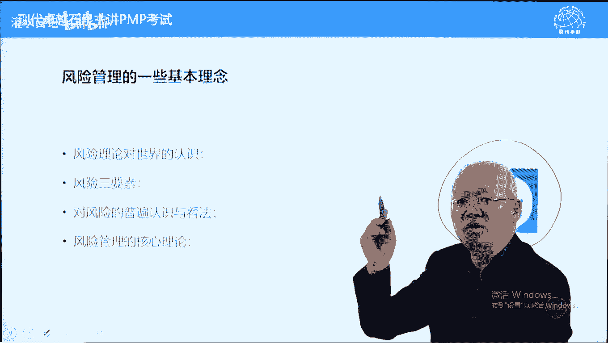
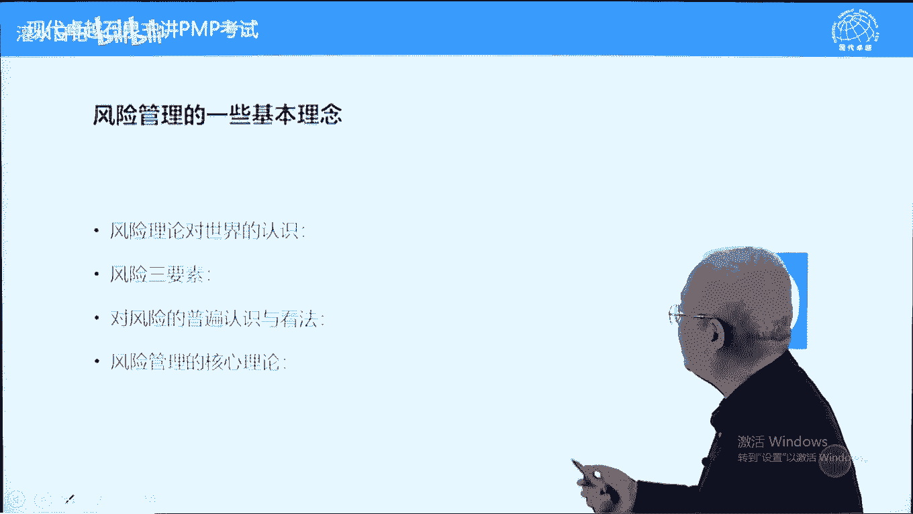
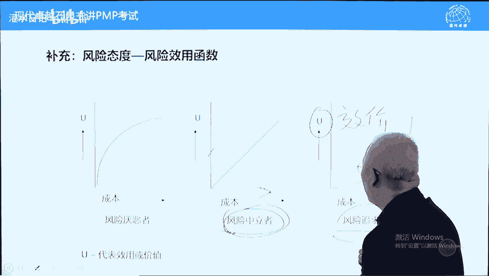

# PMP考试精讲 - P20：20 - 灌水日记 - BV1VN411w7cC

网络课程，现在呢我们讲第11章项目风险管理，风险管理呢也是拿来主义这个学科呢很健全了，然后呢项目管理呢直接引入了这个内容呢。

这个章节的内容比较多，考试题量呢也算是数一数二的章节了。

我们呢先从风险理论的角度来了解一下，风险理论对于世界的认识。

风险到底是什么，风险学科呢它是一个全息学科。

能解释世界的万事万物。

这叫全息学科，在风险理论看来，在风险学科角度看来。

世界上的事情分为三种，第一种呢就要确定事件就是概率为一的事件，比如说这是个电脑屏幕。

这是一支笔啊，这个呢确定事件概率为一。

容易做判断，地上有一个钱包，一个砖头捡哪一个，要看干什么的，如果不打架捡钱包，如果打架捡砖头。

那这个呢确定时间容易判断啊，第二类叫不确定，不确定什么呢。

不确定对应的就是项目管理中的。

我们叫未未知，未知风险，完全不知道的。

也可以叫莫须有的，等发生之后我们才能知道的。

第三类介于确定和不确定之间，什么意思呢。

概率大于零小于一的事件，比如说明天会不会下雨，明天会不会刮大风，会不会有雾霾，这些呢都属于概率大于零，但是呢小于一的事情，这这类呃在项目管理中叫已知的未知风险，在风险理论中，这叫风险。

就是可能发生的事情，有可能发生，也有可能不发生，概率大于零小于一，风险理论呢他这样认为，风险管理围绕风险三要素展开，风险有三个要素。

哪三个要素呢，第一要素叫事件，也叫风险名称。

其次呢风险概率和风险影响。

风险的管理从识别风险到定性分析，定量分析和制定应对计划。

都围绕这三个要素来展开的，这是风险三要素，当我们知道风险事件是什么的时候，这类风险叫已知未知风险，当我们连世界都不知道什么时候，这类风险呢我们叫未知的未知风险，也叫莫须有的风险，等发生才知道的。

另外一个呢风险理论认为风险无处不在，而且风险与时俱进。

他呢是不断重新出现的一个事情，它呢是一个叫普遍存在的，而且呢不断的重新出现的呃，它与时俱进，随着随着环境的变化，风险呢可能会出现新的风险啊。

另外一个呢风险需要管理，而且风险可以被管理，如果不管理风险将造成伤害，当然了，有些正面的，有些是负面的，这个呢是对风险的普遍认识，风险是需要管理的，而且风险可以管理。

另外一个呢对于风险管理的原则，有两大核心原则。

管理风险两个核心运转，第一个叫识别风险。

不好意思啊，写的重新写一下，一识别风险。

当你识别风险之后，风险也是这样。

当你识别风险之后，该风险将不会给你带来伤害，或者至少不会带来大的伤害。

凡是被风险伤害都是你忽略风险导致的，比如说淹死的都是会游泳的。

不会游泳的人不敢往河里面跳，不敢往湖里面跳，为什么呢，他不会游泳，知道自己不行，只有那些会游泳的，觉得自己水平很高，其实呢他忽略这个风险了，导致受到风险伤害。

包括电工干的时间越长，胆子越小，也是真正的认识到风险了。

人的年龄越大，胆子也越小，也是真正的识别到风险了，无知者才无畏无知，什么呢，他根本没有识别风险，有人说不对啊，我知道股票有风险还是被套进去了，这个识别应该是知行合一，什么叫知行合一，你做到了才叫知道。

你没有做到不叫指导，那你没有做到，你的认知是有问题的，比如说股票明明有风险，你为什么还买，因为你呢你在买的时候。

你得到消息了，这支股票肯定会涨，基于这样一个错误认识，你呢买买股票了，你的行为能代表你的认知。

所以呢做到才叫真正的知道，没有做到不叫指导，因此呢这辈子我们能懂很多道理，但是呢还是过不好这一生，做到了才叫知行合一啊，第一种呃，第一个原则叫当你识别风险之后，风险将不会带来伤害或不会带来大的伤害。

凡是被风险伤害都是你忽略风险导致的，因为呢因此呢识别风险是风险管理的重中之重，有很多工具，第二条原则就是量化风险具有不确定性，我们量化之后才知道应该怎么应对，把不确定变成确定之后，我们呢便于应对。

怎么量化，根据风险三要素的另外两个要素，一个叫概率值，一个叫影响值，把这两个值量化，概率影响变化之后呢，用概率值成影响值得到一个乘积，叫预期货币价值，也叫风险暴露值，也可以叫风险敞口，一个意思啊。

好乘完之后得到一个风险暴露值，预期货币价值，这个值呢就是一个确定的钱，我们应对风险的时候，拿这个量化结果来去决定应该怎么应对，包括预留储备，也是按照预期货币价值来去预留储备，我们呢举个例子。

这张图呢是一个筛子。

在赌场里面经常用的风险的很多知识，包括理论来自于赌场。

为了赚钱，我们呢要去研究它的，比如说有一个人跟你玩一个游戏。

赌博游戏他呢有个纸箱子，纸箱子里面放了100只乒乓球，每个乒乓球上呢都写了一个编号。

从1~100正好100只，这个箱子的纸箱子看不见里面的。

让你从里面伸手抓一个乒乓球来，就能够随意抓了，好看一下。

抓出来之后呢，看一下乒乓球编码，如果编码是1~70，你赚四块钱，他输你四块钱。

如果编码是71~100，你输十块钱。

他赢你十块钱，好这个游戏要不要做。

大家都会算吧，高二的时候学过概率论，用概率论的方法来算一下就可以了，就知道我们每摸一次球是赚钱还是亏钱。

怎么算呢，用四块钱乘以70%，有你每摸一次呢有70%的概率赚四块钱，再加括号负的十块钱，你亏是亏的钱，用负的乘以30%，你每摸一次的话呢，有30%的概率，你会亏十块钱，这两个一家每摸一次平均要亏0。

2元，亏两毛钱，每周一次亏两毛钱，平均的不代表不能玩，玩一次两次可以的，为什么呢，小概率事件发生的可能性要小一些，一两次的话呢大概率会发生，但是你玩1000次，平均每一次亏两毛钱。

这是肯定的概率会发生发挥作用，这叫什么呢，九赌必输，当我们量化之后，我们知道应该如何做决策了。

变化之后呢，有一个值刚才说的风险暴露值也叫em呃。

e呃e mv预期货币价值emv啊。

这个emv呢，我们应对这个风险花的钱不应该超过这个钱。

包括为这个风险预留储备，我们预留的钱按照这个钱来预留，这个钱等于什么呢，概率我们用p表示乘以该风险的影响，这是一个量化的工具，量化的过程啊，这个呢是风险管理的一些理论核心理论，刚才讲了两个核心的原则了。

第一个识别风险，第二个把风险量化量化之后呢，再做选择会容易一些，这也是我们在考试中经常用的套路，叫先量化再决策，下面呢我们继续再看风险管理的一些说法，风险管理的终止这一条呢这样说的。

提高机会的概率及其影响，降低威胁的概率及其影响，什么意思，风险就是不确定性，有可能发生，有可能不发生，有可能有好的结果，也有可能有坏的结果，好的结果我们叫机会，坏的结果我们叫威胁。

同一件事情它就会存在的，比如说我们买一只股票，这只股票也有可能上涨，让你赚钱，这叫机会，也有可能下跌，让你赔钱，这叫威胁啊，提高机会的概率及其影响，降低威胁的概率及其影响，风险分正负面好。

另外一个呢单个风险，什么叫单个风险，就是我们刚才说的风险三要素啊，一个世界有概率有影响，这叫单个项目风险，跟它对应的叫整体项目风险，整体项目风险可以理解为单个项目风险的累计，当然了，整体项目风险的话呢。

单个风险他可能会互动，比如说弹药库，每个弹药的话呢都可能爆炸，一旦爆炸的话，整体会爆炸，那这个危害就更大一些了，整体风险它包括单个风险，所有的不确定性甚至还大于它这样理解啊，管理整体风险就是销。

就是减少整个项目的全部的负面影响，尽量减少，把整个项目的负面影响，负面的风险尽量减少，然后呢提高正面影响，这个呢是整体风险管理，整体风险管理的话呢，我们其实呢还是针对针对每个风险，来实现整体风险管理。

另外一个呢整体风险更多的时候，可能由发钱高层他们呢来作为参考，决定这个项目做还是不做，如果整体风险很大，这个项目呢有可能就不做了，另外一个呢风险临界值也可以叫风险态度，叫风险偏好程度，它能反映这个啊。

我们用风险态度呢来去设定风险临界值，什么叫风险临界值，超过什么界限，这个风险我们不能接受，比如说买基金有一个底线，必须要保本，不保本的基金，我不能买，这个是什么呢，风险临界值反映了风险的偏好。

也有人投资的时候呢说必须要赚钱，哪怕赚的少一些也要赚钱，所以呢他去存定期，他不买股票，也不买基金，股票有可能赔钱，基金有可能只保底，甚至连底都不管，这个呢是风险的偏好度，也叫风险态度。

项目呢可接受的变异程度，这个呢风险态度我们大概看一下，有三种风险态度，我们用坐标图表示。

横轴表示成本，成本是什么意思，风险的收益跟损失是成正比的。

同时增加损失在增加，收益也在增加。

而这个u指的是效价，什么叫笑价。

喜好程度，接受程度，喜欢不喜欢，这个叫笑价。

分为三种，风险厌恶型，风险中立型和风险追求追求型，也叫风险追逐型。

什么意思，风险厌恶型在他眼中只有损失。

他根据损失去做决策，损失越大。

他越不开心，这个呢叫风险厌恶型，主要根据损失来做选择的。

所以呢有人有钱之后只存定期，为什么呢。

因为存定期没有损失，收益虽然少一些，但没有损失啊，在风险厌恶者中眼中只有损失。

没有收益，他很保守的，他不看收益。

只看损失学损失最小的风险中立型，要同时兼顾收益跟损失，当然这个是效益啊，收益损失成正比的收益和损失相等。

这个风险可以接受，收益大于损失。

风险可以接受呃，损失大于收益的话呢，那这个风险就不能接受，要回避了，这叫风险中立型，它同时参考或考虑收益和损失。

而风险追逐型在他眼中只有收益。

没有风险，没有损失啊，不叫没有损失，没有没有没有风险，只看收益，不看损失，他追求收益最高的。

前仆后继，他不管杀头，这叫风险追逐性。

那对于项目而言，应该采取哪一种风险态度呢，应该采取风险中立者，他既要考虑是损失，又要考虑收益。

这个是比较中庸的，当收益的损失相等，收益大于损失，这个风险可以接受，可以承受，这个呢是正确的风险态度，大概知道一下就可以了，厌恶型只看损失，选损失最小的支柱型，只看收益，选收益最大的这个叫风险中立型。

两边都看，要求呢收益要大于损失才可以的，另外呢我们再看几个词，第一类叫非风险事件，什么叫非风，非风险事件还没有变成风险，还不是风险的，但是呢有可能转化的这样一种情况，我们大概看一下第一种叫变异类。

变异性风险，什么叫变异性风险，就是自身的不稳定因素，叫自身的不稳定因素，比如说某些人免疫能力比较差，到了夏天吃点凉的东西，比如说吃甜瓜啊，吃凉皮就有可能拉肚子，别人没事，他呢可能会拉肚子，为什么呢。

它本身的免疫能力比较差一些好，同样一个事情对别人来说可能问题不大，对他来说就是隐患，包括到了冬天，到了冬天的话呢，我们曾经看过一篇文章，叫流感下的什么中年中年男人吧。

那篇文章那篇文章呢就说的是他的预付呃，他岳父的话呢本来身体很好，结果呢遭受流感了没几天之后呢，转化成肺炎，后来的话呢人就死掉了十几天时间啊，这个人的话呢他这个文章里面没有写一个背景。

背景里面有人说这个岳父呢本身是有乙肝的，那这个本身来说乙肝的话呢只是一个携带者啊，他本身来说不是病，但是呢一旦遇到外界发生改变的时候，这种变异性风险它可能会比较活跃一些，对别人来说没事。

对他来说是有事的，那什么叫模糊性风险呢，理解为外界的不确定因素就是导火索，外界会有一些导火索，比如说出突然出现寒流，突然出现流感，包括本身就是某些食品加工的行业，它的熟食不胜回升，这些呢叫模糊性风险。

外界因素这两个呢会相互互相作用的好，要想减少这两个问题，那怎么办呢，要抵提高项目韧性，什么叫项目任性，就是免疫能力，打铁还得自身硬，比如说你每天我们常年坚持冬泳，那一般来说的话呢。

流感对你来说不会是问题，或者说呢你很难染上流感，为什么呢，自身的免疫能力很强，因为天天冬泳的冬泳的人据说很少得感冒的，他们很难感染上，这叫增强项目韧性，来应对变异性以及模糊性风险。

那变异性本身就是跟韧性差有关系啊，模糊性当你韧性强了之后，模糊性风险影响会小一些，另外一个呢叫整合式风险管理，什么叫整合式风险管理管理，我们说过是分层的，高层管，高层的低层管，低层的，在风险管理中。

风险管理也是分层的，高层管整体风险，基层员工，咳具体分析具体风险，整合式风险管理指的是打破原有界限，高层可以帮助基层管具体风险，基层呢也可以协助高层，协助高高层管整体风险，就这个意思啊，最大就可以了。

下面呢我们看第一过程叫规划，风险管理，这个过程呢制定一个计划。

叫风险管理计划，而风险管理计划的作用是定义，如何实施风险管理活动，什么意思，第11章有七个过程，从11。2开始到11。7，每个过程都瘦风险管理计划指导，都属于风险管理活动，风险管理计划指导。

每一个过程应该怎么做好，另外一个呢风险规划工作在早期完成，我们在项目管理中有一个原则叫什么呢，风险先行，包括识别风险，什么时候开始识别风险，制定章程的时候就开始识别风险，包括在假设日志中记录假设条件。

也属于识别风险的好过程的输入有章程，有计划，有人说，那制定风险管理计划，为什么输入是项目管理计划，项目管理计划至少是一个壳，告诉我们应该制定哪些计划，并且如何制定相关方的计策，是要考虑相关方的风险态度。

事业化经因素，风险态度我们不叫风险临界值，叫风险态度好一些，要考考虑相关方的风险态度，风险态度为什么是事业环境因素，因为胆儿大，胆儿小，暂时无法改变，它是客观的，另外一个内容呢注意一下叫风险类别。

一般用r bs表示，我们前面讲过一个rbs叫资源分解结构，这个rp呢叫风险分解结构好，他是他是把历史上同类项目发生过的风险，按照发生原因，我们呢做出一种树状结构，wb就不叫wb。

类似w bs的b s的结构，我们呢把十把以前识别过的风险，以前项目不是识别以前项目发生过的风险，把它按照原因归类做成一个树状结构，叫r b s啊，这个r b s叫风险呃，类别这个类别的话呢。

它有助于我们根据风险类别识别当前项目风险，为什么呢，前车支付，后车之鉴，我们叫前事不忘后事之师，也是一样的，前面的项目类似的项目发生过这样的风险，你的项目呢也可能发生这样的风险，比如说孩子到了初二。

初一也有可能早恋，那这个呢是过来人都这样的，那你的孩子到了初一初二的时候呢，你要注意，有可能早恋影响学习，这叫什么呢，这叫我们根据历史上发生过的风险，来识别当前项目可能出现的风险。

它是作为一个风险识别依据的，下面呢我们再看工具专家判断不说了，数据分析分析风险偏好，其实呢就是风险态度是厌恶型还是追逐型，还是中立型好，会议开会让员工参与编制风险管理计划，这个呢不多说了。

重点看一下11。1的输出，按理来说呢，程序型计划它的输出并不是很重要，但是呢11。1的输出比较重要，为什么呢，风险管理计划中有一些比较重要的内容，首先定义如何实施风险管理活动，这就不多说了。

这里面呢包括风险管理战略，我们是藐视还是重视之类的大的方向好，这里面有一个方法论，方法论说一下，我们前面在讲第一章的时候说过，偏不可不是方法论，那什么是方法论呢，有具体操作步骤的，先怎么样再怎么样。

再怎么样的这样一个文件计划叫方法论呃，宋丹丹举过一个经典的方法论的例子，如何把大象关进冰箱，认识个方法论啊，我们也说过，这本书不是方法论，但是呢具体项目管理计划是方法论，而风险管理计划它也是一个方法论。

它告诉我们风险应该怎么管理，而风险管理分为两个套路啊，两条线啊，这个呢是具体方法论，要根据情况，第一种是风险识别，风险识别了方法论有具体的步骤答，紧跟着定性分析，再接着定量分析，然后呢制定应对计划。

在实施应对计划，在监控都可以的，这个呢是风险识别的叫方法论，按照书上的顺序，从11。2~11。7，这个呢是风险识别之后的好，第二个呢叫风险发生，这是两种情况，风险发生不再分析，影响定性，定量分析。

都不要再分析了，为什么呢，来不及要采取措施来应对，比如说看到油瓶子倒了，正在往外咕嘟咕嘟冒油，怎么办，先不要分析影响，先浮起来，看见火烧起来了，也不要分析影响，先救火再说，这叫什么呢，这叫风险发生之后。

我们的方法论步骤是什么，好在考试中，风险情景题按照这两个体系来去判断，看风险是发生了还是风险识别了，风险发生识别，我们呢有个词叫什么呢，可能这是识别啊，姜呢一般来说是当成发生的，姜或者说已经之类的。

这个呢是当场发生的，而可能只是有可能而已，这个呢是风险，是识别而已，另外一个呢员工辞职，有资源辞职，有员工辞职请假之类的，大多数情况下当成风险识别，供应商延迟交付，大多数也当成风险识别不当成风险发生。

极个别情况当成风险发生，为什么呢，因为还没有对项目直接造成影响，只是有可能对项目造成影响而已，所以呢这些情况当成风险识别不当成风险发生，项目已经延误了，那风险发生了，可交付成果出现缺陷已经出现了。

发现了这个叫风险发生，风险识别更多一些好，另外呢我们再看角色与职责，这个连接里面的，说一个说一下，这个角色与职责指的是风险责任人，在风险管理中，项目应该设定风险责任人，针对什么风险设定责任人呢。

重要风险定性分析中识别的重要风险，并且进入定量分析的重要风险相对少一些，进入定量分析，定量分析的风险也是少一些的，这些风险要为每个风险设定一个风险责任人，从定性分析之后就可以设定了，为什么呢。

定性分析就知道哪些风险重要了，为每一个重要风险设定一个责任人，应该是唯一的这个责任人，他负责两件事，第一件事情叫制定风险应对计划，也叫风险应对措施，为他所负责的风险制定应对计划，应对措施，第二个作用。

负责实施该风险应对计划和风险应对措施，什么时候实施，需要的时候有可能风险发生了，也有可能风险还没有发生，但是呢只要需要的时候都要实施的，这个人呢叫风险责任人，有人问风险定量分析是不是这个人做。

有可能是这个人做，当然呢也有可能是项目在做，书上呢没有交代很明确，因为书上交代的是定性分析之后，就要设定责任了，定性分析之后呢，定量分析也有可能他参与定量分析，另外一个呢风险应对计划是他来做的。

资金安排，时间安排，这个呢说的是为已知未知风险预留三种储备，哪三种，前面讲过的时间，钱和资源三种储备好风险类别，我们刚才在输入里面，组织工程站里面有风险类别，作为输出里面呢也放在风险管理计划里面。

作为当识别当前项目的一个风险来源，或者说呢当成识别当前项目的一个依据，另外呢相关方风险偏好，这个呢也要记录一下风险态度啊，另外一个内容，这两个说一下，叫风险概率影响定义以及风险概率影响矩阵。

这两个都是为了风险定量和定性分析而做的，一个前提工作，什么意思，我们先说一下定性分析和定量分析的区别，定性分析是给风险排序排序，不需要知道每一个风险的真实的概率和影响，只需要知道什么呢。

相对之间相对重要不重要就可以了，比如说这两个人谁高谁低，不需要知道他俩到底1米8还是1米75，之类的，只需要比较比较一下他俩谁比谁高就可以了，不需要量化结果，定期分析就是排序。

它不需要具体的概率值和影响值，而我们计算具体概率值影响值的时候呢，可能比较繁琐，花的时间要多一些，排序的话呢不需要，所以呢我们给风险呢概率和影响打分就可以了，我们也叫打分排序吧，写到这儿。

给每个风险打一个概率分，打一个影响分，而风险概率和影响利益就说的打分规则怎么打，我们是从0。1~0。9，还是从1~5，还是从10~100，这都可以作为打分，作为打分规则的概率分，影响分都可以。

这样打也可以怎么样呢，用a b c d来去打打一下，比如说像银行里面有什么呢，aaa加啊，a两个a加之类的，这个呢属于定性分析打分的一个原则，概率影响定义呢，我们在风险管理计划制定的时候呢。

设定好定性分析的时候，概率分影响分怎么打，这叫打分规则，好打分规则制定完之后就可以画出一张矩阵了，叫概率影响矩阵，大家翻一下书，我们看一下概率和影响矩阵，在第11章11。11。1的输出啊。

大家翻译一下书，概率影响矩阵在408页，408页，这张表呢说一下，最左边0。01~0。050啊，不不要不好意思啊，最左边0。1~0。9，0。1~0。9，表格外面的呃，这个呢是风险的概率分，它从0。

1达到0。9，0。9表面很高，0。1表明很低，最下面表外面的一行呃，从0。05~0。80，这个呢是影响分，这个呢他打打分规则，打分规则一旦确定完之后，就可以画一张矩阵，这张矩阵是什么意思呢。

我们呃横轴和纵轴都有对应的框的，对应的格子，对应的格子，它分别对应有相应的概率和相应的影响，而格子里面写的是它所对应的概率，乘以对应的影响，比如说我们举个例子啊，0。72左边这个0。72，0。

72对应的是概率0。9，影响呢0。82者乘积0。72，我们给风险排序呢，要要给每个风险打一个概率分，打个响，分打完之后呢，把这个风险的概率分成影响分，乘完之后得到一个值，这个值的话呢零点几的啊。

我们在这张表中去找位置，看它处于什么区间呃，这个区间呢是我们划分的这张图里面，他这样划分的概率和影响值乘积高于0。2，作为重要风险，低于0。2作为一般风险，一般风险观察就可以了，等它发生不采取措施。

重要风险才进一步的进入定量分析，这个呢是概率影响矩阵的应用，它呢主要用于定性分析，就用于定义分析啊，但是呢它是11。1规划风险管理的输出，在考试中有这样一种乌龙，出现过两次以上的什么乌龙，就是出题的人。

他误以为概率影响矩阵是11。3的输出，它不是11。3的输出，是11。3的工具，它题目这样说的呃，风险识别完之后，准备给风险排序项目应该创建下面哪个内容，或者说应该做的什么东西，答案是创建概率影响矩阵嗯。

两两次以上是这样说的，这种题目呢要注意一下出题的人，他有误解，当然这道题也可以这样说，选项里面有的说明题目中还没有做，那选项里有创建概率影响矩阵，说明呢概率影响取证还没有创建，我们呢再创建也是可以的。

这样理解报告格式，在风险管理中，有一种报告叫风险报告，向相关方汇报风险情况，也应该是绩效报告的一种，不多说了，另外一个呢跟踪跟踪指指的就是风险审计，什么叫风险审计，总结风险管理的经验教训。

事实上呢讲的比较具体，就是风险管理过程的叫呃风险管，风险管理过程的有效性有效性就好不好，这个意思啊，好不多说了，下面呢我们进入11。2叫识别风险，前面讲过，当你识别风险之后。

这个风险将不会给你带来大的伤害，当你没有识别的时候呢，这个风险会带来伤害，我们举个例子，比如说，在这个中国活的鱼吃的时候要小心一些，吃活鱼要小心一些，如果你是在菜场里面买的鱼。

在超市买的活鱼都会都可能会检测出一些物质，比如说检测出什么呢，孔雀石绿，一般呢加的可能性比较大，这个孔雀石绿呢，是在鱼的运输过程中添加的东西，它的作用呢是防止鱼钓离，保持鱼的活性，防止鱼钓离啊。

鱼鳞一定影响卖相了，保持鱼的活性，减少鱼的死亡率，运输的时候都要加，养的时候会比加运输的时候一般要加的，所以呢你买的活鱼大多数可能有这个东西，这个东西的话呢对孩子的智力是有影响的。

也是属于致癌物质比重金属的，当你不知道的时候，你吃活鱼很开心，但是呢当你知道之后的话呢，这个活鱼买的时候你要掂量一下了，你买冰鲜的，冻的，一般不会的，为什么呢，他不需要活着运输，它就不需要加这个东西啊。

这什么意思呢，当你知道这个风险之后，这个风险不会达到伤害，当你不知道的时候呢，这个风险可能会给你带来伤害，当然了，别的还有啊，抗生素也一般，养鱼的过程中可能会加抗生素啊，这个呢都是你不知道的时候。

你可能觉得很开心，但是呢一旦当你知道之后呢，你就开始慎重了，吃的时候就没有那么开心了，为什么呢，因为你知道有危害，当你识别风险之后，这个风险呢很难给你带来伤害，我很难给你带来大的伤害，关键要知行合一。

下面呢我们看一下风险识别有哪些要求，第一个识别全部的单个风险，单个项目风险也就是单个的风险，另外一个呢整体项目风险，整体项目风险由单个风险去来构成的，这个不多说了，记录相关特征，什么特征就是正面的。

负面的，当然了，有没有可能发生啊，这个影响会会会是什么情况，大概能知道的说一下，还有一个呢风险识别强调参与，所有人都参与团队时间参与，然后呢让相关方也可以参与，还有一个呢在识别风险过程中。

可以预先设定风险责任人，我们前面讲过定性分析之后，再给每个风险重要风险设定责任人，但是呢有些风险我们非常熟悉，当我们识别之后，认为这个风险很重要，我们可以直接设定责任人，为什么呢，因为很了解了好。

另外一个呢就是有些风险我们当识别之后，就可以直接我们给他呃，呃给他写出应对措施，或者给出应对措施，因为什么呢，还是比较熟悉，有些风险不需要定性定量分析，就可以直接制定出应对策略，举个例子，当门炮。

对方当门炮下象棋，你怎么办呢，无论你思考还是不思考，都得马来跳，这个呢叫有些风险直接可以跳过，定性定量分析，书上也说识别风险，定性分析，定量分析到制定对计划，这四步可以一步到位，相当于跳跃啊，跳开的好。

看一下过程的输入输入比较多，首先呢各种做事方法可能带来风险，所以程序性计划它是风险的输入做事方法，比如说这个人做事很高调，他就有可能惹事生非，有些人的话呢做事很低调，他呢在外面惹是生非的可能性就低很多。

这个呢跟我们如何做事情有关系，另外一个呢从三大基准中也能够识别风险，我们在范围基准中有wb，在wb s划分的时候，就有个原则叫信息透明原则，要可以识别出风险，另外一个呢在规划进度，规划成本的时候。

我们在估算进度，估算持续时间的时候呢，呃估算成本，估算持续时间的时候，都要有一个储备分析，为什么呢，为已知的未知风险预留储备，在制定进度基准，成本基准的时候，已经也识别了，也已经识别了些风险。

这些风险也是我们识别风险的一个依据，一个来源，其他的还有一些文件，比如说问题意志里面记录的问题和这个因素，都可以当成风险，那这个因素就是南墙，你不要撞上去，是红线不能碰的。

而假设条件的话呢都是潜在的风险，假设条件，比如说我们假设明天不下雨，我们正常召开运动会，什么叫假设失败，明天下雨了，这叫假释失败，风险就发生了，运动会就不能开了，这个呢是假设条件都属于潜在风险。

刚才说过了，成本估算持续时间估算这里面呢也都有风险，问题是这问题解决不好，也有可能蔓延，导致连锁反应，但是呢问题和风险本身之间是有界限的，问题一致，里面的问题强调跟人跟人的责任有关系。

他强调设定时间去解决，而风险增益测呢里面的风险，大多数来说是客观的，跟人的责任关系不是很大，另外一个呢风险等级测，它并不强调去叫叫解决问题了，建议叫运动计测，历史上的这个呢跟选择有关系的。

其他内容不多说了，我们再看另外一个叫合同，合同类型，本身它就是一个风险分摊的方式，总价类合同风险主要是让承包商，承包商承担了成本补偿类合同，那买方承担风险更多一些，供应链合同风险几乎都由买方承担。

所以不同类型的合同，风险承担的情况是不一样的，其他内容呢大概看一下，跟风险有关系，采购文档这个是对协议的一个补充说明，事业环境因素，其实这里面的风险比较多，天气的政治的啊，这个叫外部环境的。

包括呢呃相关相关方的这个相关方指的是社区，比如说公众的包啊，包括一些像绿色和平组织之类的，他可能给项目带来风险，这都属于肾化因素所带来的风险，那组织观看我们呢有一个风险类别。

r b s可以帮助我们去识别风险的，下面呢我们看一下过程的工具，专家判断指的是有经验的人，靠直觉来做判断来去识别风险的数据收集，这个呢就是收集信息的一些这个叫方法了，头脑风暴，前面呢在第五章。

我们讲过的头脑风暴也叫集思广益，再写一下叫集思广益啊，他呢是利用大家的智慧智慧来去呢，呃考虑识别有可能发生的风险，他要求相互启发的要求的话呢，大家要脑洞开大一些，不要否定，不要批评别人的意见。

举一个举一个例子，2001年2001年啊，美国出现91191之后呢，美国的中情局很担心，美国本土的袭击肯定不止这一个，还有别的袭击，那会是什么呢，他找了一帮人，什么人呢，找了一帮人头脑风暴。

找了一帮好莱坞的导演来头脑风暴，哪些环节比较薄弱，有可能变成袭击对象，这帮人头脑风暴之后得出两个结论，第一个呢是大型炼油厂，大型炼油厂，我直接这样写的，大炼油厂，容易造成轰动性的事件啊。

还有一个呢特大城市的高压输电电线路，特大城市高压输电线路，容易破坏，而且呢容易造成很严重的影响啊，当你识别风险之后，风险将不会带来伤害，这两个风险后来没有发生，包括美国的飞机到现在为止没有再被劫持过。

为什么呢，吃一堑长一智，全世界飞往美国的飞机安检最严格，包括东南亚，包括非洲游击，非洲安检并非常严格，但是呢往美国飞的危机，美国人亲自再加一道安检来确保飞行的安全，这叫什么呢，当你识别风险之后。

这个风险将不会带来大的大的伤害，或不会带来伤害，另外一个工具呢叫核对单，也是一张清单，利用清单来去对比识别当前风险，那这个清单有什么呢，用rbs来做依据是可以的，访谈找老司机。

找过来人问问道前面的路怎么样啊，好走不好走，有什么风险，应该怎么办，这叫访谈，讲一个访谈的例子，我们在前面提到过，小的时候，我们学过一个课文，叫小马过河跟风险有关系的啊，小马想过一条河。

他不知道河水深浅，不敢过，他呢问老牛，老牛说很浅到膝盖过吧，他有个小小松鼠，小松鼠说啊，这个不能过的啊，能淹死好几好几回的，那个那个前前几天她什么姨姨姨妈过去，什么什么之类的，就被淹死了，小马迷茫了。

到底该听谁的呢，啊他问妈妈，妈妈告诉她要勇敢的尝试，妈妈很不靠谱啊，按照风险管理理论，应该先量化，老牛说到膝盖量化一下是多深，松鼠说能淹死好几回，那好几好几好几个松鼠那么高，那又是多高，量化之后再决策。

这个呢是风险管理的原则之一，这个叫访谈了，好，下面呢我们再看数据分析，数据分析呢大概了解一下，有一个重要的讲一下根本原因分析，根据根本原因来识别风险，比如说这个呃粮食价格上涨。

或者说呢呃就是银行里面的钱，可能印的比较多了之后，这是个原因，会导致什么呢，也导致了股票上涨，这些呢都是一个因素导致的一个结果，根据一个原因，我们来分析这个原因会带来哪些风险，这叫一叶知秋啊。

另外一个呢假设条件跟知因素分析，就是假设条件是否依然存在，至于因素我们是否考虑到了。

会撞南墙呢，加这条件随时考虑，假设条件是否依然成立，当假设不成立的时候，风险发生，比如说买股票两个基本假设，第一个这只股票会涨，这个价是一般成立的，第二个假设我会在高点卖出，这个假设一般不成立。

越高你也舍不得卖，你低的时候才会舍得卖的，当假设不成立的时候，我们叫假释，失败风险就发生了，好另外一个工具呢叫所有的分析，也叫态势分析这两个字啊，这是一个战略分析模型啊，一个叫战。

一个战略学家应该叫波特，他提出的战略分析模型指的是，一个企业要确定战略的话。

根据什么呢，根据自身的强弱和外部的机会威胁自身强弱，s自身很强，w自身很弱，t外部有威胁，o外部是机会，opportunity，四个区间，第一区间自身很强大，外部机会有很多的时候。

比如说电商电商就属于这种情况呢，阿里巴巴就在电商中是老大阿里啊，阿里什么政策应该扩张，业内老大有责任把蛋糕做大，扩张战略啊，把蛋糕做大，别人会占便宜，但你占占的便宜最多，业内的老大的责任。

而且是高速发展的一个市场啊，第二象限自身很强，但是呢市场环境不好，已经白热化竞争了，比如说格力，格力呢在白色家电，包括空调，洗衣机啊，主要空调方面它是很强的，但是他遇到很多竞争，比如说奥克斯跟他竞争。

竞争比较激烈，这个是属于竞争比较激烈的这种情况怎么办呢，创新你要做别人没有的，要制造蓝海，蓝海是什么呢，蓝海就是利润很高，竞争没有那么竞争没有那么激烈的，利润很高的制造蓝海之后，创来去获得高额利润啊。

第三个象限，外部机位非常的好，但是呢自身不咋地，比如说n多年前阿里在物流领域，物流是一个高速发展的一个领域，跟互联网一起发展的速度很快，现在也是一样，物流行业还是比较好的，而阿里呢在物流方面是个菜鸟。

没有这样能力不行啊，没有什么基础，那怎么办呢，要培提升内功，我们要提升内功啊，所以阿里呢投资了很多物流公司啊，提升快递公司啊，提升内功是它的战略，第四象限，屋漏偏逢田连夜雨，这个时候怎么办呢。

收缩就是市场机会不行，自身呢又很弱，奄奄一息，那怎么办呢，先活下来再说，比如说2008年通用汽车就变成这个情况，通用汽车由于呢这个车的成本比较高，品牌太多了，成本比较高啊，跟丰田竞争竞争。

不过另外一个呢，2008年又遇到美国的金融危机，通用汽车面临倒闭，那怎么办呢，收缩战略，这个呢是所有的分析，所有的分析是一个战略分析模型，跟风险识别有什么关系，说一下，它能帮助我们从宏观层面。

识别来自组织内部和外部的机会和威胁，自身的强弱，外部的机会威胁，所有的分析都显示了，所以呢能了解来自内部外部的机会和威胁。

文件分析，那我们查行业数据库，包括呢查绩效报告，绩效报告呢也属于我们前面的输入啊，来去判断什么呢，判断风险有没有出现，或者风险有没有发生之类的，人际关系跟团队技能，有些时候需要统一思想，那统一思想的话。

那到底这个风险严重不严重，要不要考虑统一思想，可以用引导时间讨回提示清单，跟前面核对单一样了，又把它重复了，单独列出来了，这个不多说了，另外一个呢会议会议呢强调的是。

让相关方和团队人员参与开会来识别风险，下面呢我们看一下输出，输出呢主要是风险登记册，注意风险登记册的创建始于识别风险过程，在11。2生成风险能力测，而这个风险能力测它会记录已识别的风险清单，很容易理解。

识别的风险列出来列个清单，而后面两个具有超前性，什么意思，刚才讲过了，像风潜在风险责任人是我们对这个风险很了解，一旦识别就知道这个事情谁来负责，最合适，可以先设定好到定期分析的时候呢，再确认一下。

另外一个呢有些风险应对措施，不需要经过定性分析，定量分析，在制定有些风险很熟悉它的盈利措施，现成的，比如说兵来将挡，水来土掩，或者说当门炮马来跳，直接可以一步到位的跳过定性分析，定量分析。

因此呢在风险能力测里面，还有两个潜在的也要注意一下风险报告，注意他应该是随时向相关方汇报项目情况的，在识别的时候也可以汇报一下，当然更多的时候呢我们是在执行过程中，我们呢啊风险应对什么之类的管理。

这个情况让相关方放心的，文件更新不多说了，好，下面呢我们进入11。3。