# PMP考试精讲 - P24：24 - 灌水日记 - BV1VN411w7cC

不课程，现在呢我们讲第13章叫相关方管理好，先介绍一下相关方管理干什么，要想了解相关方管管理干什么。

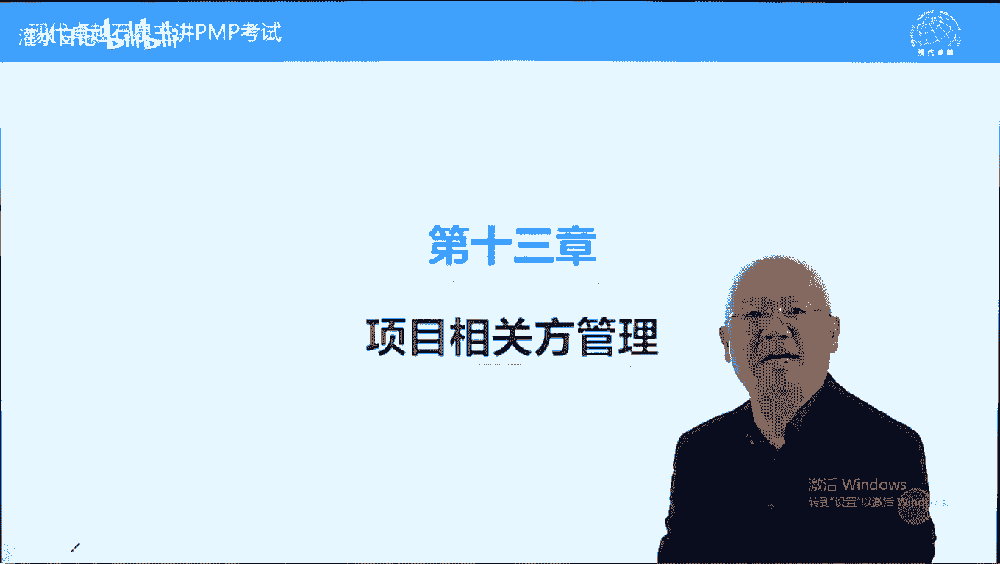

我们呢先要了解一张图，这张图呢我们这样说。

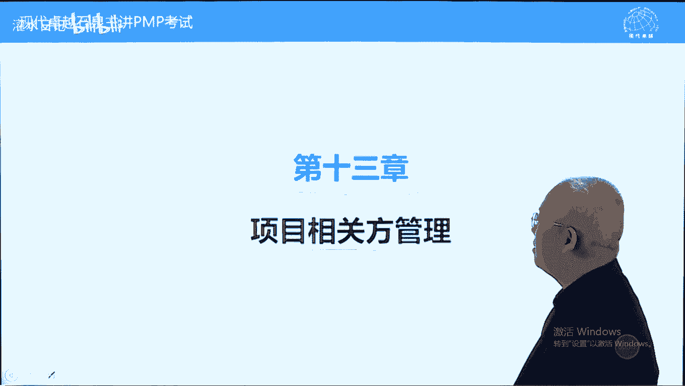

在很多书上都有管理。

书上都有啊，叫什么呢，在这写一下。

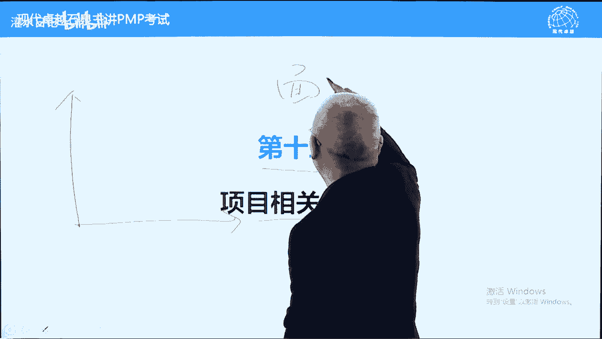

哪五种态度呢，我们画一个正态分布曲线，中型曲线啊。

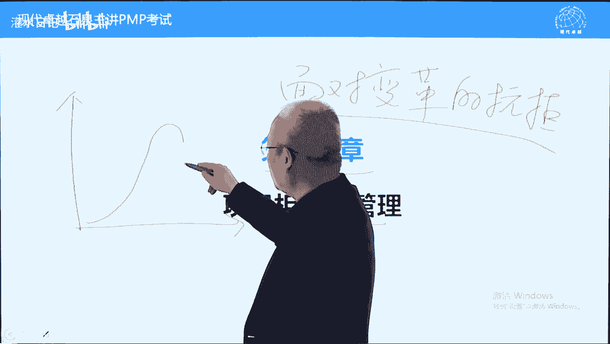

5%的人在这推动着他很积极，比如像改革有推动者啊，好20%的人叫支持者，有人支持，50%的人中立，无可无不可，大多数啊20%的人不支持，好还有5%的人抵制，对于一个新的项目而言，面对一个新项目相关方。

或者说跟项目有关的人，也是这五种态度，那管理相关方是干什么呢，我们用两个字来概括一下，就是公关公关是干什么，把谢官方立场从右边变到左边，这叫管理相关方，就这个意思啊。

所以呢两个字公关的过程我们叫得道多助，失道寡助公关是很重要的，要获得大多数人的支持，另外一个呢中国有句俗话叫成也萧何，败也萧何，这说的不是萧何，说的是另外一个人叫韩信，韩信一辈子能够发迹。

源于萧何推荐萧何月下追韩信，韩信被杀，谁给他出的，谁给吕后出的主意呢，萧何给吕后出的主意，把韩信骗到这个叫未央宫嘛啊，把它呢给叫累死了，这个韩信的一辈子取决于萧何，在项目中也有这样的人。

他会影响项目成败，因此因此呢要管理，首先呢我们了解相关方有三类，哪三类呢，参与项目的指的是项目团队成员，被项目影响的和可以影响项目的，这三类人都是相关方，而管理相关方一个基本原则叫。

降低相关方对项目的负面阻碍，这是管理原则，而具体管理的时候呢，有三部曲，哪三部曲呢，大家可以记一下，第一条叫全面识别，全部识别吧，全部识别，第二条呢，叫按重要性排序，全部识别是防止遗漏。

重要的按重要性排序，为什么要按重要性排序呢，因为有些不重要，有些重要，比如说我们去投标，业主方有一个常务副总坚决抵制我们中标，对方呢还有一个门卫也坚决抵制我们中标，我们只需要搞定副总副总就可以了。

对于门卫可以不用管它，第三条呢三部曲啊，一二第三部曲叫重点管理，精力有限，要重点管理重要性，官方比如说刚才说的副总常务副总啊，这个呢是相关方管理的三部曲，我们看一下书上的一些说法，好要识别。

并且的话呢要分析期望，另外呢制定策略来去公关，来去管理，包括识别，包括就是分析，也包括制定应对策略，这个呢是当然包括实施了，不光制定，还要实施，另外一个呢相关方管理项目经理起核心作用。

他呢管理相关方的能力决定项目成败，另外一个呢叫尽早管理相关方，尽早啊章程批准之后就要开始考虑相关方了，所以呢识别相关方，它属于启动过程的过程，另外呢相关方满意应该作为项目标，也可以叫项目成功标准之一。

我们前面在第一章讲过项目成功两个方面，第一方面叫目标实现范围，进度成本质量符合要求，第二个呢叫客户满意，也可以叫相关方满意，很重要，还有一个呢要经常开展相关方管理，然后呢来管理引导。

因为呢相关方可能会与时俱进，随着时间推进，会有新的相关方出现，原来有些也有相关方不在与项目有联系，我们呢要动态管理，还有一个呢要关注相关方，关注与相关方参与有关的正面和负面价值，什么意思呢，尽早识别。

并且呢让相关方尽量的参与项目，正面的价值指的是对相关方有好好处的地方，我们要了解，用好处来说服相关方，而对线官方有负面价值的东西呢，我们要尽早识别，来防止来找做动作，找找做动作。

防止这些负面价值影响相关方，我们呢要尽早的去干预一下，防止呢负面价值影响相关方对项目的支持，下面呢我们看第一个过程叫识别相关方，这个13。1虽然叫识别相关方，但是呢它其实解决两个问题啊。

哪两个问题识别加分析，这个分析呢相当于按重要性排序，我们讲相关部管理三部曲，第一过程解决两部曲识别，并且按重要性排序的，它是需要排序的，好识别相关方，并记录其利益参与度，相互依赖影响和对项目成功的影响。

这里面呢稍微讲一下利益参与度，那这个呢我们都能直接了解啊，有什么好处，另外一个呢参与的积极性高不高，相互依赖什么意思呢，相互依赖指的是相关方之间可能会有关系，另外呢有些相关方我们在找他的时候。

不能直接直接找到，要根据已知的相关方来找未知的相关方，比如说孩子想跨区上学，不代表你找不到，我们可以人托人脸托脸，同已知的人中找他们认识的，这叫利用依赖关系啊，影响力跟对项目的前景影响，权力大小。

以及呢对项目可能会有哪些正面负面影响，另外一个呢这句话的意思是要重点管理重要性，官方我们重点管理一般线官方监控就可以了，在这个相关方分析中，在这个这个过程，相关方分析中有一个工具叫权利利益方格。

通过这个呢来确定不同线官方，我们应该采取什么样一种关注程度好，另外一个呢相关方识别相关方，它属于启动过程，组织过程正常，应该在章程编批准之后，章程编制批准之后，另外一个呢，由于每个阶段原则上呢。

都要经过五大过程组和49过程，每个阶段开始的时候呢，要重新识别相关方，好看一下过程，输入项目章程里面告诉项目的目标呃，在81页，我们还能看到主要相关方，在章程中也有列举商业文件。

包括商业论证跟收益管理计划，从这里面呢我们能识别跟项目有利害关系的人，有哪些，会影响哪些人，哪些人呢可能会参与这个项目，或被这个项目影响到，商业认证指的是我们为什么要做这个项目，对谁有好处。

如何实现效益之类的，这个呢能帮助我们识别这个相关方个人和群体，另外呢，我们再看沟通管理计划和向相关方参与计划，这两个计划，注意啊，在第一次识别相关方的时候是没有的，我们在每个阶段在识别的时候呢是有的。

这叫什么呢，滚动式规划，这里面呢我们先讲一个先有鸡，还有先有蛋的故事啊，识别相关方主要是根据章程，有了相关方登记册之后，就是识别相关方的输出，有了相关方登记册，我们根据相关登记册来制定高度管理计划。

来制定相关方参与计划，这个呢是正常顺序，为什么在13。1中输入里面也有，它理解为滚动式规划，否则无法理解啊，其他内容也理解为滚的数字化就可以了，因为呢识别相关方它的过程比较早。

那因为在每个阶段还要重新识别，问题不是很大了，包括协议也是一样的啊，好组织工程塔就不多说了，这里面呢有一个概念什么呢，可能有一些非n g o组织，n g o组织，他对项目可能会有影响，你不惹他。

他可能会主动来找你的，这一点呢稍微注意一下，我们再看工具专家判断，根据经验来的数据收集技术，就是我们要了解哪些人可能有关系，或者说要项目会影响到哪些人，哪些人呢会被项目影响。

或者说哪些人会影响项目之类的，都可以通过数据收集技术来去找，包括我们刚才说的人托人脸，托脸找关系也是一样的，问卷调查它的特点强调什么呢，强调受众多大规模收入收集信息啊，这里面的一对一有问题啊。

焦点小组会议跟问卷调查应该是并列的，一对一呢讲的更多的更像访谈，稍微有些问题啊，头脑风暴，大家集思广益来找这个相关方来收集相关方，这里面呢有一个变形叫头脑写作，头脑写作的话呢就是头脑风暴。

我们强调说大家讲你一句我一句，开诸葛亮会议，相互启发，头脑风暴的话，那就强调写头脑写作，强调写我们的创意，不说写出来，写完之后利用即时贴贴到墙上，大家呢都都互相看，考完之后呢再产生新的创意，差不多吧。

没有考过，知道就可以了，数据分析技术，数据分析呢，就是分析相关方在项目中有什么权利，有什么利益，可能会造成什么影响等等，当然了这个分析的话呢，呃也包括我们呢通过一些现有的文件的分析，来找到一些相关方。

当然更多分析的话呢，分析的是权利利益，包括影响等等，也包括他的一些其他的其他方面的，主观的一些文化背景啊，在对他的价值观之类的，可能对项目可能会有影响的好，数据分析呢并不是很重要，重要的是什么呢。

这个数据表现技术，这里面呢有一个相关方分类技术，相关方干型人一个意思啊，在目前考试中，干型依然出现，跟相关方都出现了，这个就不改了，这里面呢有一个重要的分析技术，叫权利利益方格，后面两个方格跟它类似。

换汤不换药，但是呢这两个方格我们就不展开了，用这一个就可以了，而且考试中会考得比较深，书上呢只起到只说了一个名字，没有说权利利益方格怎么用，而怎么用，属于考点，我们能在这画一下权利立方格。

它是一个坐标图，我们根据权力大小，利益高低，我们家这边写利啊，利高上面呢全大，好根据权力权力大吧，根据权力大小，立方格可以分为四个区间，a区间叫权利很大，但利益很低，怎么办，令其满意，揭晓一下。

令其满意，针对这个格子里面的相关方，这种情况的要令其满意，让他满意，比较简单，他在项目中没有利益，我们呢表示足够的尊重就可以了，请教他拜访他，尊重就可以了，好第二区间闭区间权力大，力也高，重点管理。

什么叫重点管理，我们呢要对他高度关注，他的一言一行，我们呢都要很注意，而且呢可能要贴身管理之类的，重点管理好c区间利益很高，但是权力很小，叫随时告知他利益比较高一些，但是呢权力权力比较小，这个随错了。

随时告知，随时告诉他项目的情况，因为了解他呢会放心一些，随时告知为什么是这样一个，为什么是这样一个情况，这个呢呃书上就这么说的吧，或者大家都约定俗成这样来确定的，第四个权利，权利也也小，利益也小。

这种人呢跟项目关系不是很大，书上说叫监督，监督，相当于不管我们，那就等等有问题再解决好，权利利益方格这四个区间必须要记住，考试中呢属于考点啊，虽然书上没有画，但是呢需要需要了解的影响，影响的话呢。

就是改变这个项目的一个一个，一个一个那个改变项目的一个能力吧，作用的话呢指的是效果知道就可以了啊，好我们再看相关方立方体，这是个平面，能画出四个区间，如果再加一个维度，我们在这加一个维度啊。

这样一画的话呢应该画八个八个方向了啊，那不是八个区间了，有八个区间，这样的话呢更多一些三维模型，更多一些没有考过，不管它了，凸显模型是一个排序工具，按照相关方的重要性，我们呢给相关方排序。

重要相关方放在前面来凸显凸显凸显起来，那这个呢就是凸显模型好影响方向，这也是分析相关方它的向上向下横向影响，这个影响呢可以不用管，为什么呢，我们分析相关方影响就是看他立场。

它是支持还是抵制还是中立还是怎么的，这个更加重要一些，好优先级排序大量相关方我们要重点管理，重点管理根据根据什么呢，根据凸显模型来重点管理，会议指的是开会，召集团队生开会来识别相关方。

并且的话呢这个其实引导学生党会呃，虚拟小组会议之类的话呢，都是解决问题的，识别相关方，我们就让团队人员开会来识别相关方就可以了，而相关方有问题的时候，我们管理相关方可能大量引导引导时间长。

会包括其他的一个会议，目的是达成一致一线的，在13。3中更多一些，13。1的话呢识别而已，分析而已，下面呢我们看一下过程的输出，输出呢主要输出就这个叫相关方登记册，计划更新，我们理解为滚动式规划。

而且计划没有批准的，他随意更新了，他有两两类信息，主要前两类，第三个可以不用管，第一类也叫客观信息，也叫身份信息，客观答案跟主观没关系，年龄啊，职位啊，性别之类的啊，好评估信息就是主观的。

他在项目中有什么需求，有什么期望，然后呢有什么利益能造成什么影响，在什么时间去影响评估信息，客观信息都要写上去，这个呢也叫主观信息，也叫评估信息，相关方登记测，它有一个特点，它包括所有以及识别的相关方。

无论重要不重要，它都有我们叫全部识别，但是呢这里面呢也应该有相关方重要性排序了，虽然包括全部的，但是呢我们可以通过凸显模型，通过优先级排序，把重要相关方也可以列举一下，当然这里面的话呢没有写。

应该是列举一下，按重要不重要，可以呢有一个相关方的一个排序计划更新，他有时候影响工作管理计划，影响相关方参与计划，这就是一个基石蛋蛋生鸡的问题了，这个理解为滚动式规划，这样理解好，下面呢我们看13。

2叫规划，相关方参与它解决什么问题呢，重点管理，当然它只只解决重点管理的一部分，什么部分呢，为重要相关方制定公关计划，来转变相关方对项目的一个立场，这个内容呢其实并不是很难。

只针对主要相关方制定相关方参与计划，这个参与计划也可以叫公关计划，目的呢是改变相关方对于项目的不利立场，不好立场变成正面的立场，这叫公关计划，并不是所有相关方都要制定的，只针对重要性。

官方我们制定这样一个计划，当然这个计划呢跟沟通管理计划一样，要与时俱进，就像作战计划在遇到敌人之前，作战计划是有效的，遇到敌人之后，作战计划不断调整，沟通管理计划跟相关文参与计划都是如此，需要调整的。

下面呢我们看一下过程的输入，主要输入相关方登记册在这儿的，因为我们针对相关方，登记登记册中的重要相关方，来进行一个制定义的计划，来转变他的一个立场，其他内容呢都是一个补充，我们下面呢看一下工具，好。

专家判断不说了，数据收集表格对照，我们可以比葫芦画瓢，看别人怎么做的，我们可以模仿一下，这里面呢放在这有点牵强了，这个呢不要提到任何事情都可以这样做了，这个有一有点凑凑数凑数的感觉，作用不是特别大吧。

好假设条件跟就业因素分析，根本原因分析，这个呢都是理解为我们制定公关计划的时候，需要考虑的因素，现实不现实，另外一个呢这个人是什么人，比如说这个叫王婆，在做西门庆这个项目的时候。

当然这个也属于相关方管理了，管理潘金莲怎么管理呢，假定潘金莲就是一个叫水性杨花的女人，当时王婆打这个运哥打他打他的时候呢，他也假设运哥翻不起什么浪，但是呢当假设不成立的时候，风险就发生了。

管理情况方会出现问题啊，决策判断优先顺序指的是公关计划，我们选哪一个有备用的，有主主的，或者说多个公关计划，我们哪一种效果比较好一些，数据表现技术作用也不是很大啊，这个不是说作用不大，第一个作用不大。

思维导图发散思维创新的重要的是什么呢，相关方参与评估矩阵，整个13。2最重要的就是他了，这个相关方参与评估矩阵呢，我们在第十章讲过的，大家呢翻一下书，我们呢再看一下相关方参与评估矩阵，在522页这张表。

这张表的话有c有d，我们讲过的c指的是相关方当前立场，因为叫current，d呢是期望立场，desire和desire，我们期望的立场，如果重要相关方的c跟d不在一个区间，我们需要对相关方的。

对于相关方采取公关计划了，那相关方的立场有哪些呢，在522页这张表中，有一个变了，第一个不了解，他就不知道这个项目的存在，也不知道潜在影响好，其次呢抵制就是反对项目，再其次中立，然后呢支持。

然后呢领导比较正面的是，这两个领导呢可遇不可求，我们呢对于大多数相关方达到支持就可以了，因此呢我们利用相关方参与评估矩阵，如果相关方不是在支持的这个位置，重要相关方一般相关方不用管它。

我们呢就需要通过公关策略来转变他的立场啊，这个呢是这个相关方参与评估矩阵的作用，我们呢呃也大概这个说一下，相关方参与评估矩阵，公关计划怎么样的制定，相关参与计划怎么制定，根据马斯洛需求层次理论。

看这个相关方它处于什么层次，我们呢用这个层次的需求来去满足它，来去满来去转变相关方的立场，要根据马斯洛需求层次理论，要投其所好的，好像公共参与计划也叫公关计划，注意不能够违法，也不能够影响职业道德。

公关计划呢很多时候是要保密的，为什么呢，跟沟通管理计划一样，虽然是针对外外部相关方的，但是呢这个计划不能让外部外部相关方知道的，就跟作战计划一样，作战计划是对敌的，但是不能让敌人知道，这个呢不矛盾的。

下面呢我们看一下输出相关方参与计划，就是公关计划好，大部分的公关计划用利益来去满足利益呢，包括实物的，也包括名义的容易的来去满足来解决问题啊，当然啦其他的比如说共同的兴趣爱好啊之类的，包括拉关系。

包括用权利大压小，也可以转变相关方的立场，在现实中比较多，我们呢就不展开了，输出叫公关计划好，我们再举一个例子，说一下相关方参与评估矩阵的一个作用，在522页，再看这张表啊，问一个问题。

在王婆心在水浒传里面做的项目中，有一个这个项目的，后来转刚开始很顺利的，我们很成功的项目命令，优秀项目命令，但是后来项目做砸了，爱情故事变成凶杀案了，项目也被杀掉了，在这个项目中，为什么项目失败。

有一个不起眼的相关方没有管理好，这个人叫什么呢，叫运哥，13 四岁卖梨的小伙子啊，运哥好，问大家一下，这个运哥，在发现潘潘金莲跟西门庆和王婆做的事情的时，候，他处于什么位置，他处于什么立场啊。

他处于中立立场，他不是个好人，如果他是个好人，他第一时间应该找武大郎，不应该找王婆，为什么不找武大郎，找武大郎没好处，武大郎肯定很生气，也不会给他好处的，自己老婆呃，这个叫出出轨了。

很伤心的一个很很很丢人的事情，他也不会给他好处的，找王婆呢就不一样了，王婆干亏心事了，我呢发现了，知道了，你得堵我的嘴，所以呢她找王婆去是为了敲诈，因此呢虽然他跟吴大郎距离更近一些，物理距离啊。

都在市场上卖卖卖卖东西，但他跑很远，跑到跑回家里面去找王婆去了，王婆呢也是老司机，一见到云哥说这个话，韵哥说，老婆你干的好事，语气上非常不好啊，呃这个缺少教养，这个说话不文明啊，王婆立马知道干什么了。

就是什么呢，这小屁孩来敲诈我了，王婆仗着背后有西门大官人啊，阳谷县首富上去耳光，把这个韵歌从中立到哪里呢，达到了抵制，结果呢，这个项目范围蔓延，而且的话呢失控崩溃了，项目命令被杀了。

这个故事呢教训也很深刻，告诉我们一个深刻教训，深刻道理啊，就是不能打孩子好，这个呢是关于相关方参与计划的一个内容，考试中呢也是一个考点，知道就可以了，下面呢我们看13。3叫管理相关方，参与这个管理。

相关方参与呢在考试中是个重头戏，我们给它对应一个问题，叫什么问题呢，叫相关方问题，相关方问题我们呢都用相关方啊，方子有的相关方问题我们呢都用什么呢，都用13。3来去解决，管理情况方问题。

要管理相关方参与，当然了，管理相关方参与，包括尽早识别，也包括让相关方尽早参与，也包括一些具体的公关手段，比如说谈判，比如说说服相关方，用利益说服相关方等等啊，这些呢都属于管理相关方参与的范畴。

就是解决相关问题的，那我们呢说一下什么叫相关方问题，回到第十章，我们讲过一个问题叫沟通问题，沟通问题是什么呢，当时讲过的沟通问题，相关方对信息，对沟通担心怀疑不满，这叫沟通问题。

沟通问题他呢都是技术性问题，它不是主观的，那什么叫相关方问题，也讲讲一下相关方阻碍项目了，相关方阻碍项目了，为什么阻碍项目主观上不支持或反对，至少对这个项目不重视，对项目命令不重视。

它呢起到了阻碍项目的作用，这种情况呢都叫相关方问题，比如说职责经理不肯给项目经理的派资源，这叫相关方问题，包括呃这个叫团队成员，因为吵架导致项目无法推进，我们可以当成冲突问题，也可以当成相关方问题。

包括发钱不肯批章程，不肯批项目管理计划，包括公司里面有职责经理坚决反对什么，包括客户不肯验收，拒绝验收之类的，都可以教相关问题，当然也可以用别的套路来解决，它，也属于别的问题啊，相关方问题。

那答案呢有四个，哪四个答案呢，我们在秘籍里面写的有啊，前两个回答一个问题，下一步怎么办，第一个答案就是13。3的名称，管理学官方参与，第二个答案呢叫相关方参与计划查看也行，实施也行，更新也行。

另外两个答案都是问早干嘛去了，答案两个，一个呢尽早识别相关方，一个呢让相关方尽早尽早参与，尽早识别和让相关方尽早参与，密集里面有的当然也可以包括识别相关相关方，分析相关分析呢可以再加一条。

分析相关方也是可以的，密集里面呢应该是有的管理相关方的原则，我们大概看一下，我们看一下提高支持，降低抵制，这是个基本原则，另外一个呢就是获获得承诺，获得对项目成功的持续承诺。

这个内容呢要注意一下这个原画都考过的，另外一个呢获得承诺的具体方法，我们在考试中也出现了哪些，对项目施工有承诺呢，一个呢k q meeting，一个叫项目章程，都是承诺，当然了。

直接公关管理权官方也可以的，还有谈通过谈判沟通管理权，官方希望当有人反对不支持的时候，我们呢要面对要说服用利益说服，考试中包括这种情况啊，就是相关方对这个项目有没有价值，对于项目的价值产生怀疑了。

那怎么办呢，用商业论证来去说服相关方，确保支持，另外一个呢，第四这一条说的叫什么呢，未雨绸缪，防患于未然，还没有出现的时候呢，我们也要防患未然，要提前的好不多说了，下面看一下过程的输入工具和这个输出。

主要的输入相关方参与计划和相关方登记册，我们可以这样说，13。3是实施相关方参与计划的实施，落实公关计划的这样一个过程，这个呢反而是一个补充了，这两个的区别在于，这里面只包含重要相关方。

但是呢包含所有信息，客观的主观的，还有公关计划，而这个呢包括所有相关方客观主观信息，这是他俩的一个区别，下面呢我们看一下工具工具专家班班怎么说了，这里面有个沟通技能，就是我们很多的公关计划，也叫管理性。

关方参与要通过沟通来去实现，所以呢要利用沟通管理计划，来落实跟相关方的一个管理，或者对相关方的一个参与好，还有一个呢反馈，这个反馈呢来判断一下，我们呢相关方管理到位不到位，这个呢也是可以的。

了解相关方对项目的一个反应，人际关系技能，在管理相关方中用的比较多的两个，一个呢叫冲突，一个呢叫谈冲突，管理又叫谈判好，相关方阻碍项目，反对项目都可以交冲突管理，而解决的话呢。

首先要面对或者用利益来说服他，然后呢转变他的立场，都可以叫谈判，其他内容点到为止不多说了，这里面第四条有一个内容叫基本规则，说一下基本规则，在第九章叫团队章程，为什么在这又叫基本规则了，搞不清楚啊。

团队章程这个章程我们也可以叫它基本规则啊，啊我们说过规则对内对外对内的，他是约束团队成员的要求，我们在团队成员面对相关方的时候，你应该采取什么立场，必须怎么表现，我们举个例子啊。

在很多服务型企业中有一个规矩叫什么呢，首问责任制，听过没有，无论什么人，只要遇到客户了，别人问你一个问题，遇到消费者了，即使不是你的问题，你要负责到底，直到帮他解决，这叫首问责任制。

这是对公司内部员工的要求，面对客户应该怎么做，我们呢在管理团队成员的时候，也可以设立设立基本规则，面对相关方的时候，你不能怎么样，比如说不能跟相关方发生矛盾，不能直接吵架啊。

不能够给别人不好的脸色或语言之类的，这些可以叫基本规则啊，包括呢跟相关方这一块公司计划什么之类的，能不能说也可以约束一下的，或者说对线官方要比较客气一些啊，不能够见人见人见面。

或者说人家人家问题不理的会议不多说了，这个会议呢更多的是管理冲突，谈判来去解决问题的，那这里面呢提到了一个什么呢，经验教训总结会议，其实呢跟管理相关方关系不是很大，那可以理解为管理相关方过程中。

事后总结经验教训也是可以的，这个开工会议呢它具有团队建设的作用，它的主要作用呢是分配任务的，跟相关方管理有没有关系，能让相关方了解情况，可能有一些管理，有一些有一些关系吧，而在敏捷中的迭代规划。

强调相关方参与，因为那敏捷强调信息透明，所有的工作包括计划预约透明越好，状态更新就是我们跟相关方的话呢，汇报项目情况，让他了解越多越好，这个呢不多说了，下面呢我们看一下这个输出。

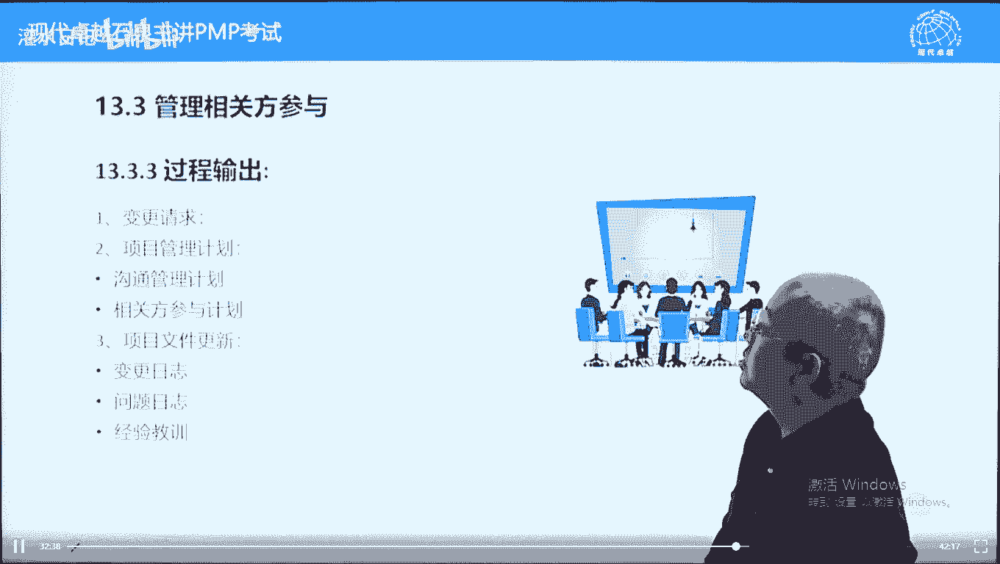

输出里面有变更请求，有项目管理计划说一下，13。3跟13。4在输出中差不多，所以呢我个人认为从内容上来，内容上来说，这两个过程没有什么区别，呃，只不过呢它属于执行过程组，这个呢属于监控过程组。

仅此而已啊，其他内容几乎都一样，而变更，这里面的话呢，是指的是相关方管理的时候出现问题了，或者原来计划不管用，沟通计划不管用之类的，这个时候呢可以走变更流程，可以不走在考试中都不需要走变更流程的。

所以呢这个作用不大，融资的耳朵一样的，这两个计划都可以直接更新，有三个计划直接更新的，还记得不记得那三个计划直接更新，除了这两个，还有一个跟人相关的计划叫资源管理计划，这些计划都是可以直接更新的好。

另外呢文件更新里面有一个内容，这个内容呢没有写上去，叫什么呢，叫相关方登记册，登记册吧，这个登记册可以随着新的相关方被识别，以及原有相关方跟项目不再有任何联系，而定期更新更新相关方登记册。

这个呢属于考试考点，每一次考试呢都有一两道题，尤其是那说到公司重组，现在应该怎么办，公司重组之后呢，相关方发生改变，要更新相关方更新测的好，13。3的话呢，我们记住一个问题，叫什么问题呢，叫沟通问题。

13。4的话呢，我们这样理解管理相关方变更的过程，13。3呢是执行相关方呃，参与计划的一个过程，但是呢从内容上来说，几乎没有区别，因为13。3里面也有变更，那这个呢主要是变更，但是呢这个变更13。

3中完全可以处理了，不需要到13。4，所以从那上来内容上来说没有什么大的区别了，我们可以忽略记住一个问题，叫相关方问题就可以了啊，这里面呢看看啊，有没有需要没有需要特别强调的会议差不多了，好文件更新。

这里面有一个内容，相关文登记册更新，1333。3里面你找一下也一样的，有的好，这里面呢变更请求也是这两个计划，它多了一个计划而已啊，这个也不好解释的意义不是很大，相关方问题刚才解解释过了。

再简单说一下相关方问题跟沟通问题的区别，相关方问题我们这样理解理解为阻碍项目了，相关方阻碍项目了，无论是主观客观的，它呢都有一定的人为因素，至少呢对项目不重视不重视，比如说一个会议喊一些空方来，他不开。

他不来开，不是说没时间不来开，这是不重视啊，有主观意也没有有的，而沟通问题呢大多数都是技术问题，跟主观的意愿关系不是很大，比如说重要信息没有收到，这是个事实，重要信息看不懂，包括呢收的太晚了。

给的太迟了，这些都叫沟通问题，包括呢项目里担心某些重要信息不能及时收到，都叫沟通问题，跟技术有关系啊，相关方问题都跟态度有关系，不支持项目，反对项目是或者是或者是什么呢，对于项目不重视。

对于项目命令不重视，这个呢我们叫相关方问题，答案呢每天四个注意要记住就可以了，目前来说跟大家说一下，相关方题目呢考的债越来越多，不断在增加，对于团队内部呢，也可以按照相关方管理套路来去管理，也是可以的。

责任人是项目里另外一个呢相关方的问题，轻易也不要麻烦发钱，除非反复多次，你努力了没有结果，这个时候呢不得不汇报发情好，关于第13章我们就讲到这儿，谢谢各位，下面呢我们紧跟着要讲几个法则啊。

这几个法则的话呢大概看一下。

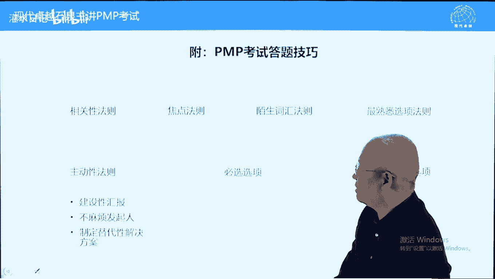

偏偏考试四选一的题目就有些规律了，首先一个每道题考一个考点，每道题一个考点，这个考点的话呢，我们在讲第一章项目管理定义的时候也说过，项目管理是将工具技术，技能和知识用于项目活动，满足项目需求。

每一个考点考一个工具技术呃，叫知识或者说技能，因此的话呢相关性法则指的是题目中考点，你要能看出来找什么呢。

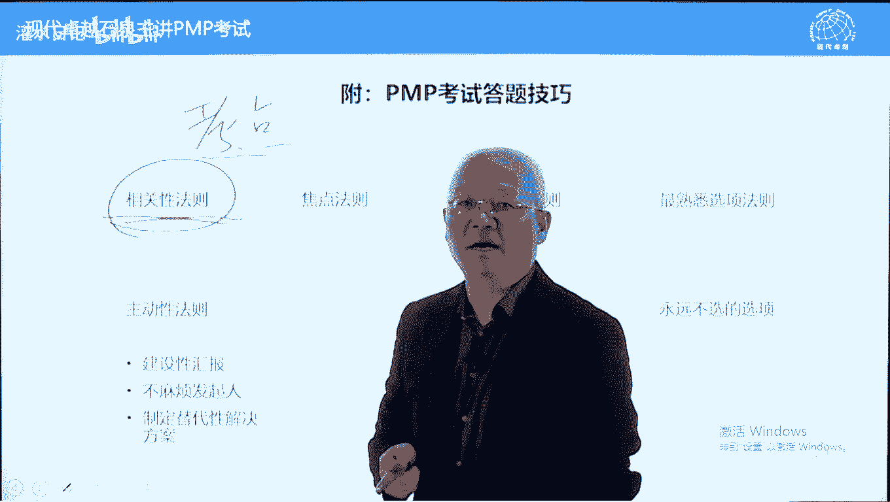

找跟考点对应的选项，一般来说是一个，那如果有多个的话呢，会有一个最好的，这叫相关性法则，就是我们根据考点来去找答案，答案呢要跟题目的考题目中，题干中描述的考点一致才可以，这叫相关性法则。

而有些相关性呢它很直接就是直接就能看出来，比如说范围很清楚，找找什么呢，找固定价合同，新项目找什么呢，找这个项目章程啊。

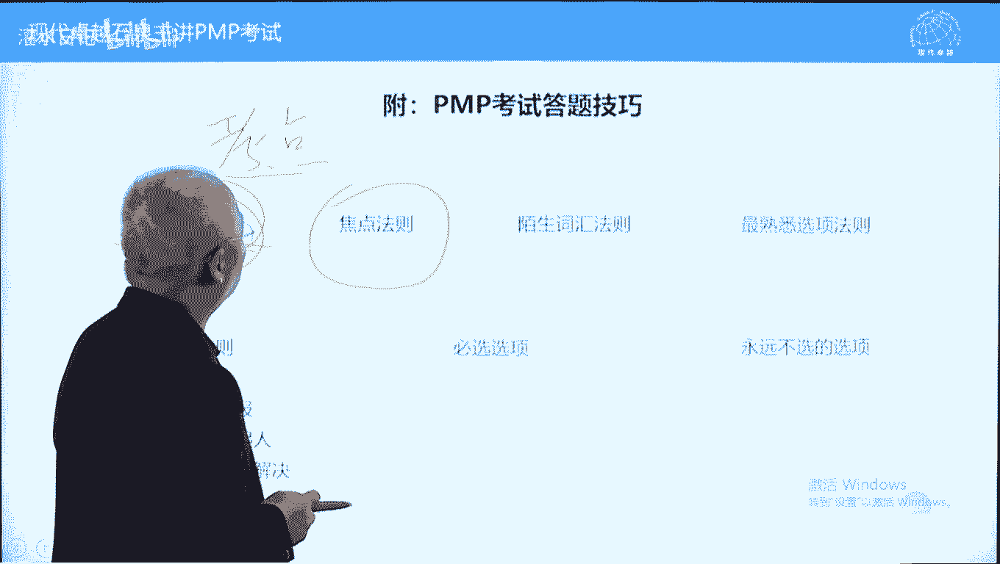

包括呢项目完成了，找项目收尾或总结经验教训。

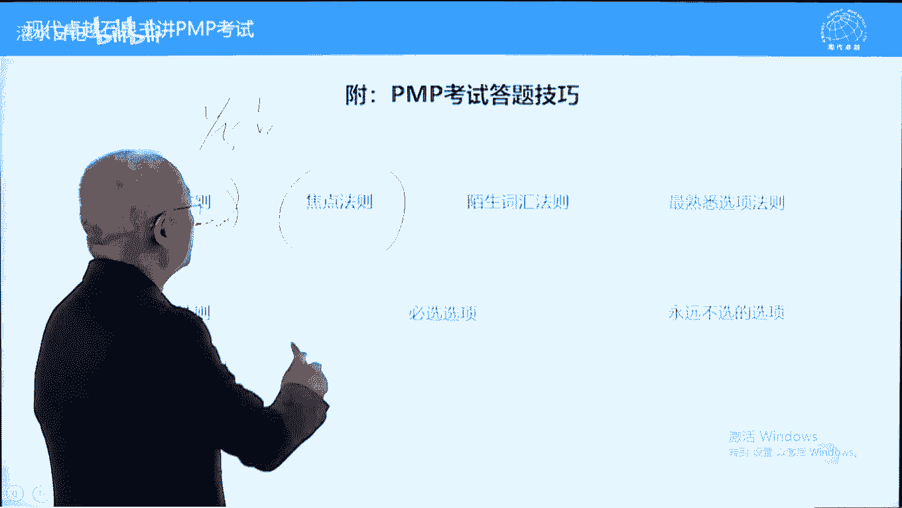

这叫什么呢，焦点法则我们呢有呃关键词，关键词用于交点法则。

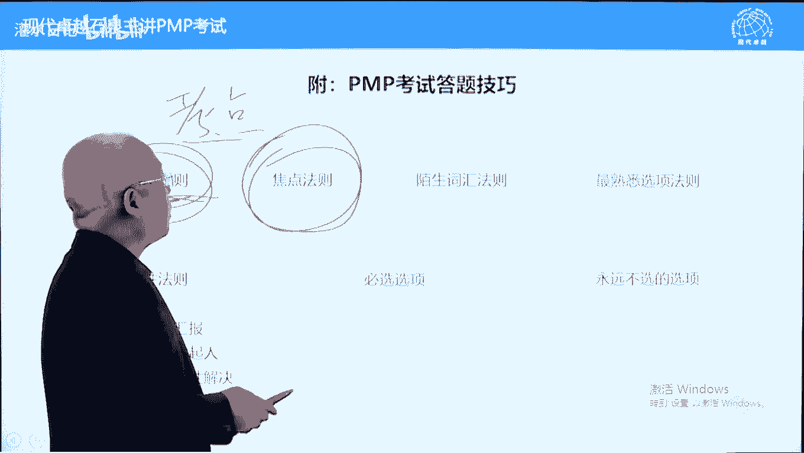

有些关键词一出现答案就确定了，直接找就可以了。

比如说根本原因找什么呢，找实穿图很多了啊，陌生词汇法则指的是陌生词汇不要写，看到陌生词汇不要考虑的，为什么呢，偏僻考点就那么多，我们做的题目呢有1000多道考点，几乎全覆盖的，每一个考点。

它的出题方式会变变来变去，但是呢答案来说很难变。

因为呢正确选项就这一个每一个情景，错误情景的话呢，要解决的时候，正确答案应该是一样的，所以呢越陌生越不要请，首先pbook里面没有出现的词不要选。

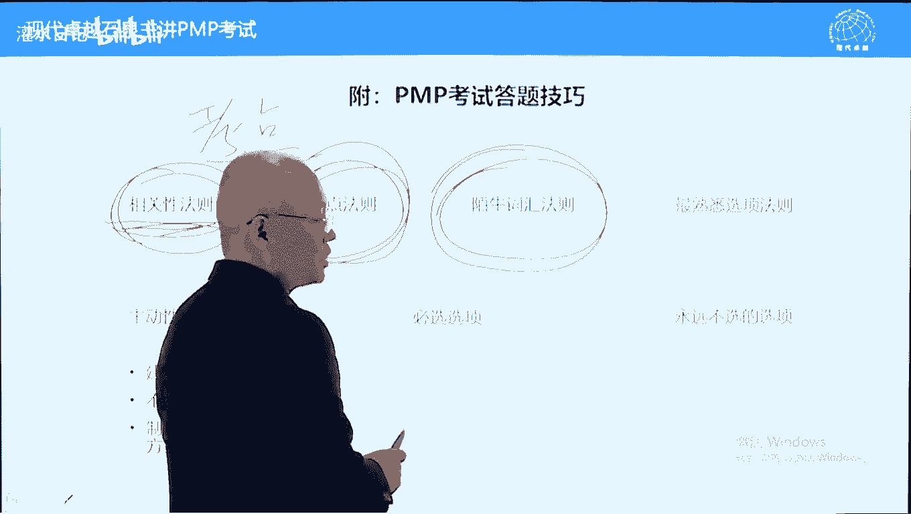

其次呢我们在考试中很少选的词也不要选，这都叫陌生词汇法则，跟它对应的叫选最熟悉的选项，有些选项我们会反复选择，比如说更新风险能力测查，看沟通管理计划，包括实施整体变更控制过程呃，就总结经验教训之类的。

包括发布章程这些呢都是非常熟悉的，经常出现的，经常出现的就是考点，所以呢我们选的时候越熟悉，选的时候呢可能是越安全的，另外主动性法则指的是能体现项目的主动性的，否则的话呢不要选，比如说推迟，比如说暂停。

比如说以后再说，下次再说，都不符合主动性法则，什么叫主主动性法则呢，想办法解决，找方法解决另一方案去解决，这叫主动性法则，他的比较体现项目主动性非常好的好，有一些必选选项，哪些呢，我们刚才讲过了。

实施整体变更控制过程，发布项目章程，总结经验教训，更新风险登记册等等，这些呢考试中选的会比较多的，有一些永远不要选的选项，比如说刚才说的推迟暂停，下次再说之类的，包括那些不专业的说法，你要经常怎么样。

要要要劝说员工怎么样怎么样呢，或者说要告诫员工，提醒员工怎么样怎么样的，这些词都不专业，不要选的，那还有一些的话呢，比如说这个找发群汇报，发钱只汇报问题，没有解决方案，这种的话呢一般也是不要选的。

永远不选的选项，我们在密集里面呢也会说一下的，还有一个呢建设性汇报，这个呢是小的问题了，有坏消息，情况不好，也要让领导知道，但是呢汇报坏消息，坏消息的时候一定有解决方案，没有解决方案。

不要跟领导汇报坏消息，不要跟客户汇报坏消息啊，有人说要如实汇报，那是职业道德问题，如果是自己的责任，一定有解决方案的，没有解决方案，这个汇报坏消息是在下领导很很少的，不要选汇报发情的选项。

除了极个别的像风险题目中有上报情况的，极个别的超出效率能力范围，汇报发情好替代解决方案就属于主动性法则了，找替代性解决方案，它能体现主动性法则的，当然了，这个木马发起人也是这个叫主动性法则。

建设性汇报也差不多的，这个呢是我们讲的关于一些考试的一个技巧，当然也有什么呢，重复选项不要选，有些时候呢，我们看四个答案中有一个跟其他不一样，其他三个都重复的，那我们也就选择唯一的就可以了。

那有人说我看都不一样，字都不一样，怎么叫重复呢，那需要对题目呢要多了解，需要对概念多了解，我能发现重复选项，你看多的话呢也会有这种情况，为什么呢，因为重复选项四选一呢，它不符合这个原则。

因此的话呢重复选项一般不选，还有其他技巧不多说了，在考试在做练习的时候，大家呢多总结呃，多呃多总结，多思考，然后呢把同一类题目，比如说沟通问题呃，相关方问题，采购问题放在一起找规律，让自己体会。

知道呢自己悟出来，看到就知道怎么选，ok关于呃偏僻网络课程的基础课程，我们讲到这。