# PMP考试精讲 - P3：3 - 灌水日记 - BV1VN411w7cC

项目生命周期和开发生命周期，首先说一下什么叫项目生命周期，一个项目从启动到完成的过程叫项目生命周期，而一个项目生命周期，通常是由多个阶段来构成的，可以是一个，也可以是多个。

比如说工程项目的阶段一般是这样划分的，第一阶段叫可行性研究，第二阶段叫设计，第三阶段叫采购，第四阶段叫施工，第五阶段叫移交验收，这个呢是阶段划分，可以是一个，也可以是多个阶段。

而阶段之间的关系可以是顺序的，企业阶段完成后，阶段开始也可以是迭代的，什么叫迭代呢，也是顺序，但这个顺序呢是强制的，比如说先有老子，再有儿子，先开花，再结果，上一阶段决定下下一段应该怎么做。

走一步看一步的交叠，指的是并行，我边怎么样边怎么样，边设计边施工，这个呢是交叠关系都可以的，好这个呢是项目生命周期，项目生命周期呢有一些特点，我们呢大概说一下，画一张坐标图，项目生命周期指的是一个项目。

从开始到完成的过程，它呢我们把这个理解为什么呢，这个叫钱吧，成本啊，这个呢是时间，嗯这个也可以说是数量嘛，也不一定是成本的，这个是时间，横轴是时间确定的，好项目生命周期，无论什么项目。

一般都具备这一特一些特点，哪些特点呢，我们要画几条线，第一条线正态分布曲线指的什么呢，在项目中人力资源和成本投入成两头低，中间高这样一个特征，这个呢也告诉我们，项目管理符合一个快慢快的节奏特点。

两头比较慢比较慢啊，呃呃不好意思啊，写错了，应该是慢快慢啊，我把这个先擦掉啊，重新画一下，这个是时间，这个呢叫数量嘛，不要写成本了，写成本不好，数量三条线，我们画一下第一条线，这样一条线啊。

正态分布曲线，当然这条竖画画也行，不画也行啊，人力资源和成本投入两头比较少，中间比较多，这个呢告诉我们项目生命周期一个特点，节奏特点叫慢快慢，什么意思，两头速度都比较慢，中间比较快，那问题来了。

我们要压缩进度的话，要加快进度的话，压缩两头还是压缩，充电呢，肯定压缩两头，慢的时候好压缩，快的时候不好压缩，那问题又来了，我们压缩前面好，压缩后面好呢，我们再看另外一条线，这条线呢从上往下来的。

从下往上来的这条线叫什么呢，变更代价，不好意思啊，变更的代价这个多了一个多了一撇啊，没有这一撇了，变更代价越早，变更代价越小，越往后变更代价越大，成本越高，这也告诉我们在早期压缩比较好好。

另外一条线呢从上往下叫什么呢，相关方的影响力，肝血对项目的影响越早，肝型影响越大，越往后呢肝型响越小，比如说养孩子也是个项目，家长对孩子的影响越早越大，越往后的话呢，孩孩子成年了，儿大不由娘儿大。

不由爷，影响力就变小了，这个呢是生命周期的一些特点，这个呢在第二部分里面有考试中呢，这个不是考试内容，我们来了解一下就可以了，好另外呢我们再看在项目的生命周期阶段中，还存在一个概念叫什么呢。

开发生命周期指的是某一阶段是研发，这阶段属于研发，在it行业，在制造业中都有某个阶段是研发，而研发的生命周期又有五种，这理解的有点难度，我呢跟大家讲一个简单方法，我们可以不用把这个项目生命周期跟研发。

开发生命周期区分，我们当成一回事，某些项目啊，他就是整个项目生命周期就是一个研发，那研发生命周期也分为五种情况，第一版到第五版都是这样理解的，我们把研发生命周期跟项目生命周期，当成一回事。

我们不要区别了，把整个项目就当成也有这五种生命周期类型，就可以了啊，当然你把它当成一个阶段研发阶段也是可以的，把这个生命周期呢就当成项目，生命周期也是可以的，那五种情况呢我们看一下。

第一种叫预测型生命周期，什么意思，一开始就知道结局工程行业比较多一些，一开始我们呢就能够把效果图画出来，而当项目完成之后之后呢，项目的结果跟效果图是一模一样的，它呢变化很少，一开始就知道结局。

我们拍电视剧，也有一些电视剧呢属于预测型生命周期，比如说你拍三国演义，结局必须是叫三家归晋，晋呢统一了魏蜀吴，你拍红楼梦，贾宝玉结果一定出家，林黛玉一定是死了，这个呢叫预测型生命周期，你不能胡编乱造的。

一开始就知道结局的好，迭代性生命周期，走一步说一步，比如说有个电视剧叫来自星星的你，来自星星的你，韩剧啊，每两周拍一集，为什么每两周拍一局，这叫迭代型啊，要根据上一集的反馈，决定下一集剧情发展方向。

比如杜教授要不要让他献出初吻，什么时候先出初吻最合适，要根据女观众的反馈来决定下一集应该怎么拍，这叫走一步，说一步，这叫迭代的每一个迭代周期，重复前面的工作，迭代型生命周期，前一阶段决定下一段。

根据前一段阶段结果决定了前一个迭代周期，结果决定下一段我们怎么做好，增量型生命周期指的是先有主干，然后呢再逐渐的增加细节，不是一步到位的，最后一步才全部完成，比如说小的时候。

我们写作文有一种比较机械的写法，先把这个中心思想写一下，题目呢一般老师给你布置的，把中心思想写好之后，再分段落分成几段，每一段要写什么内容，然后呢再把每一段内容写出来。

写完之后再给每一段内容中加入一些好词好句，这样的话呢一篇作文完成这叫什么呢，增量型生命周期它不是一步到位的，他一点一点来的，就跟预期打磨一样的，最后一项叫抛光，抛光完之后一个完整的预期出现了。

就是逐步逐步增加的啊，我们讲作文这个例子还比较好一些，比较容易理解好，适应性生命周期高速迭代叫适应性，也可以这样说，适应型包括迭代，也包括增量，可跟另外一个划等号，敏捷也可以叫敏捷。

我们在目前的话呢讲迭代，讲增量都是为了讲敏捷的，讲适应性也是一样，适应性跟敏捷是划等号的，考试的时候呢，这两种都归于敏捷，当成一回事就可以了，混合类指的是这预测迭代增量可以混合，这个呢比较抽象。

我们的比比较复杂，我们一般不管目前考试单独来考，预测型跟什么呢，跟敏捷对比，我们把预测型当成常规的项目管理，它是正步在走，而敏捷性项目管理的话呢，敏捷性开发也叫敏捷环境下的开发，我们就要跑。

他呢打破常规，他不强等规则了，这个预测性非常强调规则，它强调按流程来，尤其变更管理，而这个包括范围和进度都是按规则来的，而敏捷型或适应性的话呢，他强调打破规则，拥抱变更，我们呢尽量满足客户的需求。

在这里面呢变更，我们不会不把它当成一个很严重的事情，我们呢正常的不需要走流程就可以增加范围的，这个我们讲第五章的时候，我们再讲一下好，生命周期也好，开发生命周期也好，都是由项目经理来去设定来去划分的。

另外一个呢还有个概念叫产品生命周期，什么叫产品生命生命周期，一个产品从出现到消亡的过程叫产品生命周期，后面呢在这个还会提到的产品生命周期，它的一个构成，产品生命周期和项目生命周期的关系，书上这样说。

前者完成，后者开始，它们之间是一个递进关系，项目生命周期结束之后，产品生命周期开始，因此的话呢他们互相之间是独立的，为什么要强调这一句，因为呢之前的第一版到第五版是这样说的，也跟大家说一下。

他说产品生命周期包含了项目生命周期，产品要研发，那研发呢一般属于项目生命周期，生产运营，这都属于运营了，产品生命周期有运营和项目构成，它包含了项目生命周期，现在简单了，现在呢就是产品生命。

项目生命周期结束，它产生产品，产品生命周期开始就简单一些了，好下面呢我们再看阶段，阶段的划分的特点，包括阶段怎么划分，包括呢阶段划分有什么意义，前面讲项目生命周期由阶段构成，可以是一个，也可以是多个。

而阶段划分呢，一般以重要可交付成果的开始点或完成点，作为阶段阶段标志的，我们一般呢都用完成点作为阶段阶段标志，比如说呃可行性研究报告批了设计完成了，采购东西都采购权了，施工完成了。

这呢我们把它叫做阶段的结束点，或者以以重要可交换之后的结束点，作为阶段标志，这是阶段划分的一个方法，时代划分项目，根据管理需要来划分，那为什么要划分阶段呢，有一些好处，简单说一下，首先复杂问题简单化。

从管理角度来说，复杂问题不好下手，我们呢要划分阶段之后，简单一些管理事情是这样一个原则，叫复杂问题简单化好，另外一个呢支持滚动式规划，因为呢项目具有渐进明细性，我们的目我们的计划不是一步到位的。

而是滚动式规划，根据什么滚动，根据阶段滚动，远期的阶段不要做详细计划，做成里程碑计划，控制计划就可以了，马上要开始计算，我们给他制定成操作计划，详细计划能提高效率的，这个呢是阶段划分的另外一个好处。

阶段划分还要考出叫阶段关口，指的是阶段完整点，是一个天然的检查关口，检查什么呢，上一段工作有没有完成，缺陷有没有修复，防止上一段工作呢影响下一段有缺陷，没有修复，有问题没有解决。

另外一个呢在每个阶段结束的时候，要分析一下下一段有没有必要开始，如果要开始再确认一下目标是什么，这叫阶段门概念，阶段关口的概念好，另外呢阶段划分还有一个好处，它能够防止延误，阶段划分能防止延误啊。

那阶段划分跟延误有什么关系呢，我们在这儿要讲一个定律叫什么呢，叫小学生定律，书上呢叫学生综合症，学生综合症啊，小学生定理书上叫学生综合症，跟他有关系的，还有一个呢叫帕金森定律，帕金森。

帕金森定律通过划分阶段都能解决，那什么叫小学生定律呢，讲一下小学生不爱学习，不自觉不喜欢做家庭作业，比较贪玩，所以呢周一到周四家庭作业都是在周四，每天晚上睡觉前写完。

周五周六周日家庭作业呢在周日睡觉前写完，如果放暑假，寒假在开学一天前一天晚上会出现悲剧，再怎么样的努力，这个这暑假作业，寒假作业都写不完了，为什么呢，积压太多了，通过划分阶段能够减少积压。

防止积压就分成分成这个小的阶段，如果发现没完成，加个班就完成了，不要等，最后我们没有划分阶段，到最后再去加班，完不成的这个呢叫小学生定律，有拖延症，帕金森定律呢也简单说一下，它指的是在项目中。

你节约的时间会被随意浪费掉，不可能累积的，不可能持续的，而你浪费的时间会延续，或者你延误的时间一定一定延续，一旦项目延误，只会延误更多，不可能不延误的，不可能把它赶回来的，这个呢叫帕金森定律。

阶段划分也能解决这样一个问题，这个呢在考试中不是重点，我们呢提到一下了解规律就可以了，好另外呢我们再看一下49个过程，五大过程组大概了解一下，首先呢五大过程组这个是有顺序的。

在项目中我们大体上是有这样一个顺序，启动规划执行监控收尾，但是呢根据滚动社会化，根据呢渐进明细性，这些过程组在每个阶段内可能重复，或者说至少每个阶段要重复一次的，注意过程组跟阶段不是同一概念。

很多人这样理解，比如说项目的可研阶段属于启动过程组，这是错误的概念啊，项目的可研阶段它是一个阶段，每个阶段理论上都要用，五大过程组和47过程，比如可研阶段，它需要用原则上需要使用启动过程组。

规划工程组执行监控，社会过程组47，49过程而用多少用到什么程度，由项目决定，而工程行业最后一个阶段叫呃十呃，叫移交验收，这个阶段呢也应该分为五大过程组，需要使用启动规划，执行监控收尾。

五大过程组以及49过程，而用多少用到什么程度，由项目决定，注意啊，阶段过程组不是同一个概念，每个阶段可以包含五大过程组以及49过程，每个阶段都可以有啊，两个概念，阶段概念要大一些。

过程组呢是在阶段之之之内的，有一些开展比较多，有一个呢是贯穿始终，这个呢是针对阶段而言的，不要理解为项目针对阶段而言的，理论上，每一个阶段都要使用五大工程组跟思维的过程，这样来理解啊。

书上写的不是这样一个情况，书上呢讲的更加抽象一些，我们先按这样理解，在这个基础上再考虑抽象的内容吧，我们当成每个阶段都可能会开始，有些是开始一次，有些是定期开开展，反复开展的好。

下面呢我们再看十大知识领域，这个十大知识领域，注意根实际的项目工作没有直接关系。

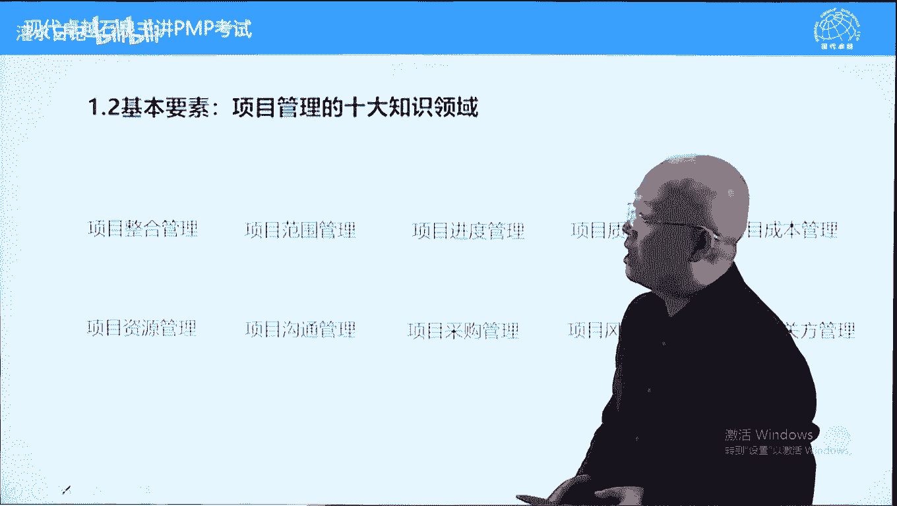

完全为了学习方面而划分的模块，他把为了学习方面，他把49个过程划分到了十大模块里面，那这十大模块的话呢跟功能有关系，跟解决的问题有关系，学习起来比较容易一些，跟实际工作没有直接联系的。

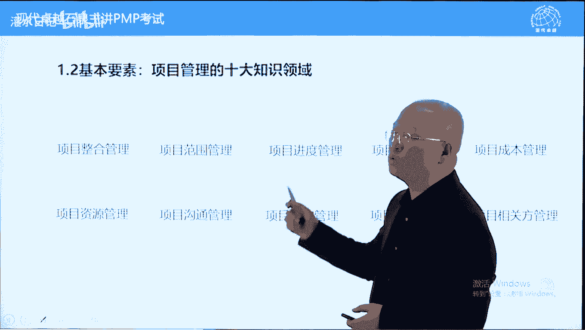

而整合工作指的是整合接口。

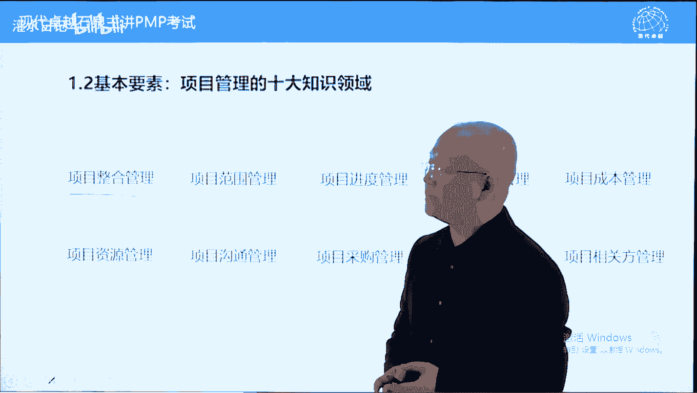

在项目管理中，由于我们过的快要拆分，拆分之后会产生很多接口项，命令的话呢，要整合项目的接口或界面，也叫界面，界面啊面子怎么样，界面接口或节点，由于我们为了快把项目拆分了，拆分之后才能快啊。

会产生四类接口，哪四类接口呢，这样说一下产品技术，然后呢过程和人的接口四类接口，简单说一下，产品由不同部分组成，我们拆完之后，它需要衔接呃，项目管理呢我们这样说是一个合分合的过程，和分和什么意思。

项目标是个整体，但是为了快我们拆分了，交给客户的还是个整体，所以呢接口必须要衔接，谁来负责项目来负责，这叫整合管理，四类接口，产品接口，技术接口指的是任何一个独立的产品，都不是一个单一的技术能实现的。

需要多个技术结合车前喜报之类的啊，过程接口谁先谁后，也就是四个过程，它们它们之间有先后顺序的，需要衔接的另外一个呢，这些工作都需要由人来配，人来配合的，人之间有配合，也有接口，人的具有主动性。

这个呢是整合管理范围，管理指的是确定我们交付是什么，最终交付什么结果，并且呢要细化，因为呢范围是规划进度，规划成本的基础，进度就是找一条最短路线来去完成，最快完成成本啊，不好意思啊，这个应该是成本啊。

质量应该放后面的，成本跟进度关系比较大，因为呢成本和资源他们呢支持进度，工作进度需要得到成本和资源的支持，也可以这样说，资源进度成本三者构成一个三角制约，哪个最重要，项目管理以进度为导向。

所以进度呢更加重要一些，资源和成本为进度服务，因为我们项目管理是基于进度的，做事方法好，质量光快是没有意义的，有前提，结果要保证快的话，那才有意义，质量是对范围的一个确认，就是我们的结果对不对。

要看质量，如果质量不达标，那是不对的，达不到质量范围就没有无从可无，从无从说起了，所以呢质量跟范围的关系更近一些，可以这样说，质量属于范围的一部分，我们要确保结果是对的，是合格的，要根据质量检查。

一个人健康不健康要看什么呢，呃是不是一个健康的人，要看具体的身体指标，这样的话呢范围的确认跟质量是有关系的，首先东西我们要确定是什么，比如说我们坐桌子，坐椅子，这叫范围，而桌桌子跟椅子有它的具体指标。

达不到这个指标，不能叫桌子，也不能叫椅子，那怎么办呢，通过质量来去进一步的确认啊，沟通管理这个呢沟通有广义的，有狭义的，在书上呢是狭义的沟通，发布绩效信息，发布绩效报告。

但是呢广义和广义的沟通范围要大多了，我们可以这样说，在项目中，项命令的主要作用就是沟通，因为在项目中几乎所有问题都是沟通问题，也几乎所有问题都是需要靠沟通来去解决的，这是广义的沟通。

但是呢在书上第十章那个沟通呢是狭义的，发布绩效信息，发布绩效报告，让相关方了解情况好，采购管理指的是可交付成果，在范围中并不是都由我们自己来去生产的，当前社会分工比较细，我们呢能买尽量来买来买。

为什么呢，买的东西质量好，然后呢价格又低，这个呢是一般的一个结果，分工的一个结果，所以呢原则上能买尽量买，只有最核心的，我们最专业的地方，我们自己做，因此的话呢很多工作需要采购，从外部获得可交付成果。

大多数呢是通过正常的招收，招投标的方式来获得结果，这个呢我们要了解一下招投标怎么进行的，包括合同怎么管理好风险，管理风险无处不在，我们在做任何计划的时候，都能冒着很多风险，因为都建立在大量假设情况下的。

风险是需要管理的，而且风险可以管理，一旦风险失控，会导致项目失败，或者说项目失败的主要原因都是风险，失控导致的风险可以管理，而且呢应该管理在pp考试中，风险管理还是个大，还是个重头题目比较多。

相关方管理，这个呢属于呃最近十来年，pmi呢，非常推崇的，就是这个叫重视程度比较高的一个模块，什么叫相关方，相关方指的是跟项目有利害关系的这些人，我们叫成也萧何，败也萧何，影响项目的因素呢。

包括人人的因素呢要处理好，这叫管理性官方，这是一方面，还有一方面，项目成功标准包括一个内容叫什么呢，叫客户满意，如何实现客户满意，我们刚才讲了，不光靠质量结果，或者说项目的结果是合格的，目标实现了。

还有一个什么呢，要做好沟通，做好公关，让他满意，所以相关方的话呢管理包括维护客户的满意，或者我们可以这样说，相关方的话呢要转变相关方立场，从支持项目角度来说，把不支持的变成支持的，那从客户满意来说。

尽量的实现客户满意，要考虑客户的情绪，这个呢是相关方管理，这个呢是以人为本的，或者说考虑人的问题更多一些，不光是一个结果要好，我们呢还要把这个叫话人要做好，话要说对才可以的，这样的话呢让客户更满意。

我们呢能够拿到一个订单，再继续拿到一个订单，因为客户满意了，这个呢是十大模块，好，下面呢我们再讲三个概念，在项目中出现这个概念，这个呢属于考考试中需要考的啦，好工作绩效数据，工作绩效信息和工作绩效报告。

这三个内容跟我们项目的绩效考核和汇报，都有关系，我们要考核项目，要跟踪项目，判断项目好坏，要根据这些内容来去判断的，这个呢都属于对项目的一个监控工作，一个审查工作，什么叫工作绩效数据。

数据指的是在执行过程中所产生的，以三大基准为主，主要的数据范围，进度成本的数据，它有两个关键词特点，原始的和基础的什么意思，无法做判断，无法下结论，为什么呢，它没有比较，没有对比啊，没有比较就没有伤害。

所以呢它无法做判断，这个呢原始的基础信息执行过程中，所产生的以三大基准为主的范围，技术成本的一个信息数据啊，比如说工作哪些完成了，哪些没完成，然后呢时间持续多长时间了，花了多少钱之类的，而工作绩效信息。

它是把工作绩效数据跟计划对比，也跟其他的同类指标来对比，对比之后得到的结果有对比就有伤害，工作绩效信息是可以判断好坏的，我们呢通过工作绩效信息来判断项目的好坏，包括偏差情况。

他可以下结论做判断的这两个区别，简单说一下，举个例子，我儿子从小不喜欢数学，数学呢一成绩的一支笔不是特特别好，他小学4年级的时候，有一天呢很开心的跟我说，说爸爸我数学考了96分，我一听很开心。

但是呢96分只是工作需要数据，因为我老婆在旁边说了一句，说在他们班排名倒数第二，因为班里面呢啊最低分95分，100分一大半100分的题目比较简单，我老婆说的叫工作绩效信息，为什么呢，有对比有伤害。

我被伤害了啊，好，这个呢，是工作绩效数据跟工作绩效信息的一个区别，再举个例子，我儿子说他上初一，有一天跟我说，说爸爸我数学考了100，考了99分，我一听哪怕是倒数第二名，那也是正数第二名啊。

因为最高分是100分了吗，我老婆在旁边说了一句，这次总分不是100分，是120分，那这个呢我老婆说的还叫工作绩效信息，我儿子说的是工作绩效数据，他能判断这个不能判断的好，另外一个内容叫工作绩效报告。

强调一下，这个跟前两个区别就大了，工作绩效报告不强调原始基础，也不强调对比，他只强调书面的，反而是以书面形式向相关方汇报的文件，汇报项目情况文件都叫绩效报告，大家也注意一下，在我们pp考试中。

在pmp课中以报告结尾的词都是发给相关方的，工作绩效报告，强调书面方式发给相关方，汇报项目情况的文件都叫绩效报告，绩效报告只强调书面格式，内容可以包括数据，可以包括信息，还可以包括其他内容。

比如说变更的一些事情，风险问题都可以放在工作机械报告中去汇报，目的呢让相关方了解情况，还可以包括质量报告啊，包括呢这个风险报告之类的，都是汇报情况的，它的概念比较大，是一个大框的。

什么都可以往里装的裁剪，刚才讲过了五大过程组私有过程，原则上每个阶段都要使用，而使用多少，使用到什么程度，完全根据项目，完全由下命令，根据实际情况来进行一个取舍，那这个呢是工作绩效数据。

工作绩效信息裁剪放在这儿的话呢，对前面的一个总结啊，大概说一下，不多说了，下面呢我们讲下一个要素，这个要素呢叫商业文件，商用文件呢包括两个内容，一个呢叫商业论证，一个呢叫效益管理计划。

我们先说一下商业论证，商业论证呢它其实是项目章程的一个主要输入，也是pm考试的一个要点啊，相商业论证它主要论证两方面，一个叫可行性，一个叫是否值得投资，这是两个概念，可行性指的是这个项目我们有能力做。

可以做，而是否值得投资，这里面有没有写啊，是否值得投资，是从商业角度，商业利益来说，我们的投入跟产出比是不是很好，这个呢用到一个工具叫什么呢，叫呃成本效益分析，我们根据成本和效益情况来决定。

这个项目呢啊值得投资，首先一个呢要可行，另外一个呢要值得投资，值得投资的项目是很多的，比如说娶娜扎取热巴，但是呢可行性也是另外一个问题，不可行，也是不能投资的，好分析的话呢，包括我们为什么要做这个项目。

另外一个呢我们的事业环境因素，或者跟我们的战略有什么关系，我们的外部环境怎么样，跟跟这个啊可行性有关系啊，好另外一个呢就是决策的依据是必须的，还是可选的，有些的话呢是必须要做的，没有选择的。

就是比如说呃我们要建一个叫围墙，来防止什么呢，防止偷盗之类的好，另外一个呢可选方案就是实现同一个目标，解决同一个问题，这可以也可以叫解决的商业问题啊，有很多种方案，条条道路通罗马，我们呢选择哪一条。

另外一个呢把推荐的方案呢要写一下，包括该方案的这个因素，假设条件，风险成功标准，里程碑依赖关系这个角色职责的话呢，这个关系不是很重要，重要的是前几个这些都属于章程里面的要素，而章程里面这些要素呢。

都来自于商业论证的一个结果，所以商业论证的内容呢，将来论证完之后要纳入章程，还有一个商业论证是决策依据，在这儿的啊，领导决定做这个项目还是终止这个项目，还不做，这个项目要根据商业论证。

另外一个呢商业论证，由于受到事业环境因素影响，因此的话呢这个商业论证要与时俱进的，如果外部环境发生改变了，我们呢要重新进行商业论证，来论证一下这个项目是否继续做下去，12月份证呢。

正常来说公司安排战略部门和公司高层来制定，但是呢在目前新型的项目管理方式下呢，项目你要参与商业论证，尤其是项目执行过程中的商业论证，项目里的话呢，更要参与好另外一个内容呢。

衡量交付效益的这个衡量交付效益的话呢，主要不在商业论证里面，在哪里呢，在下一个内容叫效益管理计划，什么叫效益管理计划，指的是这个项目一旦做完之后，它如何产生效应好我们大部分的项目都是投资。

通过项目产生的一个结果，我们呢来去运营它，比如说我们盖个大楼，把大楼租出去，或者说呢我们自己来运营来去获得效益，将来这个项目如何产生效益，也可以叫也可以这样说，叫什么呢，叫商业模式。

将来这个项目做完之后，它如何产生效益，这个呢存在一个商业模式的问题，比如说摩拜单车，他的投资很多，他将来怎么产生效益，像滴滴滴滴打车啊，它怎么产生效应，它的效益管理计划或商业模型呢是稍有不同的。

但是呢这个计划都来证明项目做完之后，它如何产生效果，或者如何产生效益，我们投资呢都是为了获得效益的，它的效益如何产生，这个呢是效益管理计划，注意前面讲的商业认证需要有管理计划，项目章程。

项目管理计划和项目成功的标准，应该是一脉相承的，应该是一致的，如果有不一致性，那这个项目呢可能是有问题的，所以呢要保证身份证，效益管理计划，项目章程，项目管理计划以及项目成功标准的一致性。

效益管理计划更多地用于项目完成之后，项目完成之后呢，我们在运营过程中来对照效益管理计划，来验证这个项目呢有没有取得预期的效果，这个内容的话呢是跟项目做完之后，关系更大一些，了解一下就可以了，项目章程。

项目管理计划，我们马上到第四章会详细讲，这里面就不多说了，好项目成功标准，我们呢看一下书上内容啊，在书上呢d你看我们画过画过一次的，在书上，不好意思啊，在书上第13页，13页。

这张表格的左下角有一个项目成功标准，这个标准呢比较完善一些，这里面写的标准呢只是项目成功标准的一部分，哪一部分呢叫目标实现，目标实现在13页这样说的啊，成功的通过项目和产品的质量，时间呃，时间表。

预算的依从性，从这个依从性以及客户满意，这里面没有写客户满意，再加一条加什么呢，叫客户满意加在一起，项目成功，这个呢是项目成功的标准，注意啊，项目成功有主观内容，什么主观内容呢，就是客户满意。

时间成本范围，质量达到要求，符合目标，符合计划，这个呢只是一个叫一方面，或者只是一个呢从技术方面，从实体方面来呃，反映项目成功的一个标准，另外一个呢这个是主观的，客户要满意，客户满意呢跟这个有关系的。

跟结果实现是有关系的，但是呢跟公关跟沟通也有关系，所以呢在项目中也需要沟通，也需要公关，这个呢是项目成功标准，我们呢以书上偏不可，第13页左下角的内容呢为主，这个标准是对的，这里面呢只写了一部分好。

下面呢我们看一下商业论证中的一些财务指标，就是我们要论证项目是否值得投资，有一些经济型的模型，这些经济的模型的话呢，能告诉我们这个项目值得不值得投资，哪些模型呢，书上列举了五条，这五条呢我们都讲一下。

有些比较简单，有一些比较难一些，我们呢先继续看啊，第一个回收期，什么叫回收期，项目是需要投资的，投资的金额多久能够收回，回收期呢是以时间表示的。

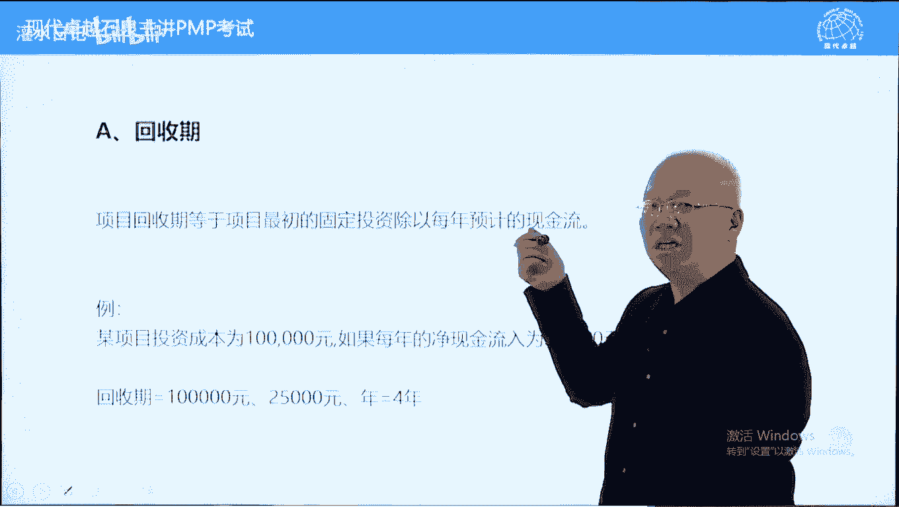

越短越好，比如说某一个项目投资10万块钱，每年的现金流入，注意这个现金流入呢我们叫benefit。

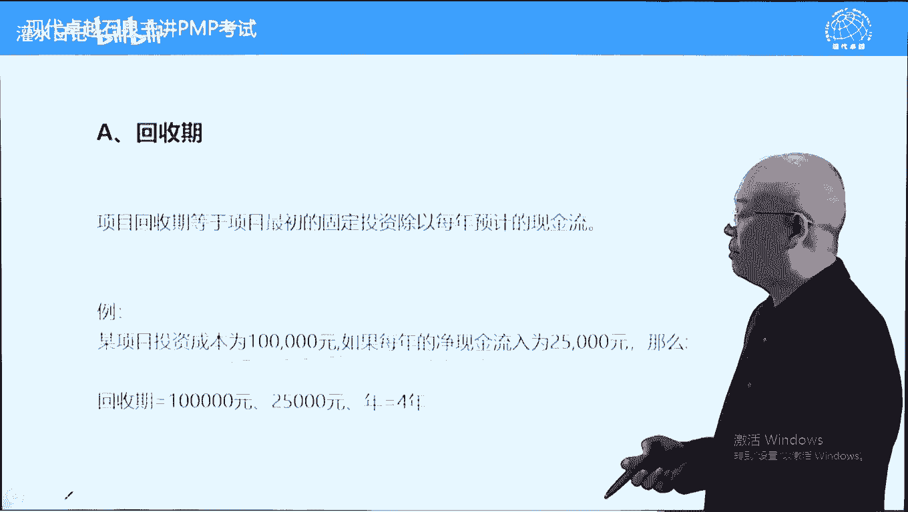

不叫profit，我们计算回收期，以现金流入叫收益benefit来计算的。

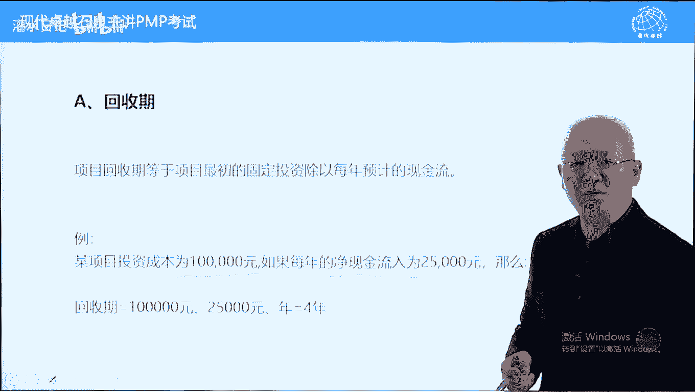

不是以利润来计算的，每年收益25000。

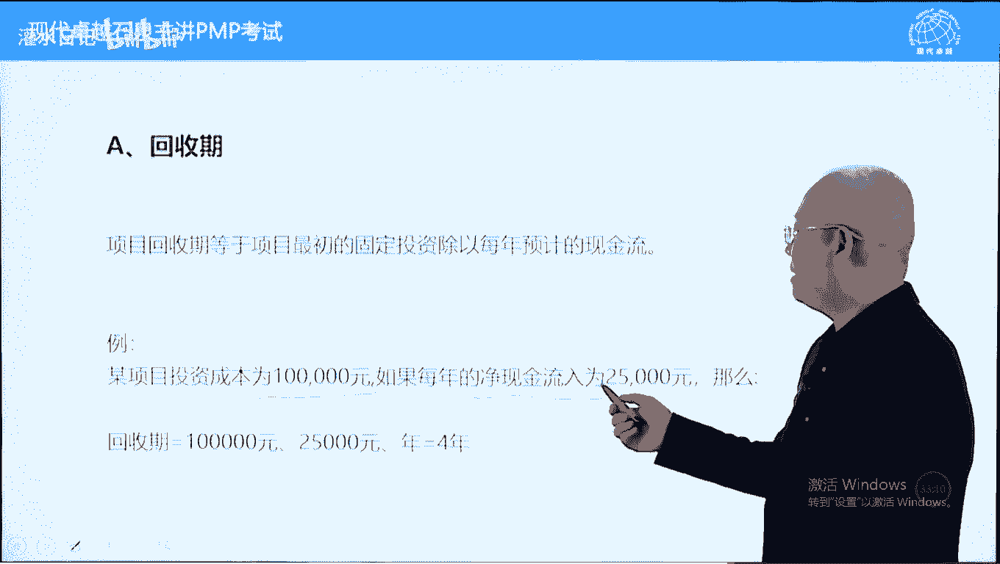

每年的收回25000，几年能把这10万块钱收回。

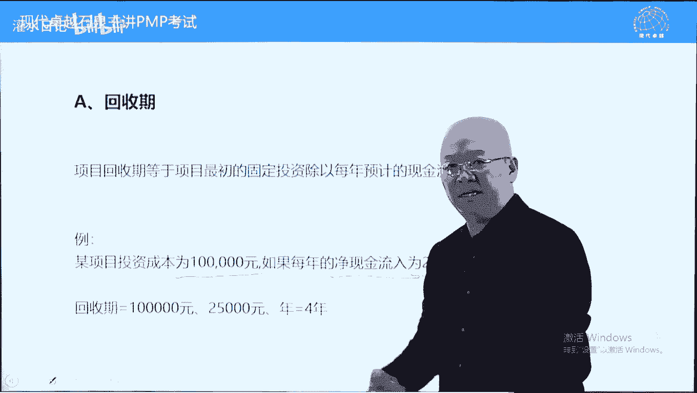

10万块钱除以25000，等于4年时间，等于4年时间。

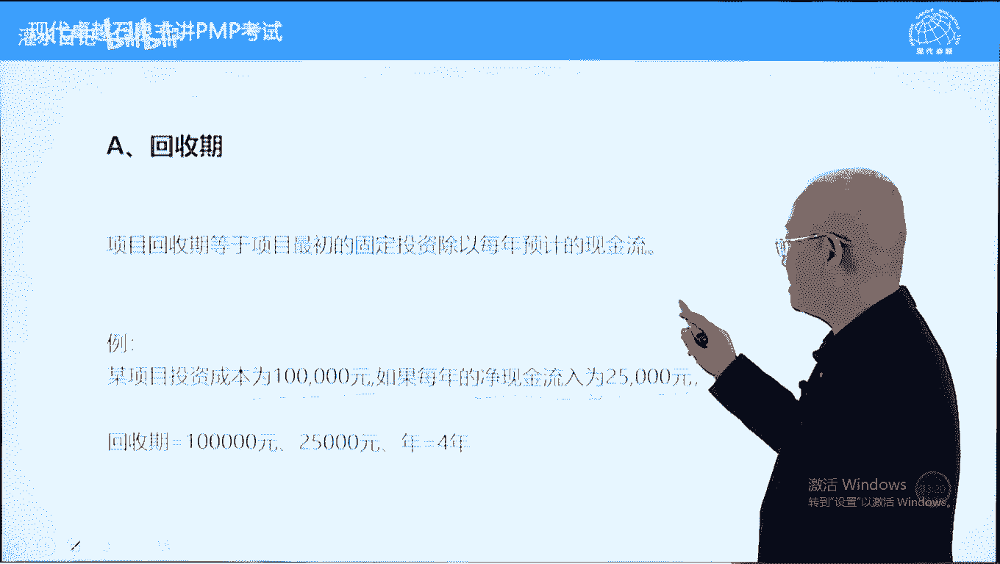

等于4年时间，这个呢回收期是4年，注意回收期模型比较简单，他没有考虑资金的时间成本，资金其实是有时间成本的，就是今年的1万块钱，跟10年前的是完全不一样的，10年前的1万块钱比现在值钱多，值钱的多。

现在1万块钱，跟将来5年之后的1万块钱也不一样，现在的1万块钱比5年之后要值钱很多，为什么呢，两方面原因，一方面钱本身具有增增值的作用，另外一方面呃，所有的货币几乎都存在一个，通货膨胀的一个效应。

因此的话呢钱是有时间成本的，但是呢回收期模型它是一种静态模型，它没有考虑时间资金的时间成本，他把未来的钱跟现在的钱一视同仁，其实呢3年之后，2年之后的25000块钱，跟现在25000块钱是不一样的。

但是呢这种模型它不考虑这个模型比较简单，我们算一下年就可以了，有个练习，看一下两个项目投资都是25000呃，a项目呢第1年收益2万，第2年收益1万，第3年收益1万，收益1万，这都是benefit。

不是不叫profit，就是收益不叫利润啊，好a的回收期是几年呢，25000-20000，剩余剩5000，第2年的话呢，第二第2年只需要半年就能收回了，所以呢1。5年可以有小数点啊，项目a的回收期1。

5年，项目b25000 减1万不够啊，再减1万，还剩这个5000，这5000的话呢，第3年收益是1/24000就可以了，他是2。25年可以有小数点，回收期越短越好，从回收期角度，a项目比较好，为什么呢。

它回收期只有1。5年，这个回收期呢时间长，回收期只看时间多少，时间越短越好，好这个比较简单一些，下面呢我们再看一个叫投资回报率，也叫r o i，这种模型呢也是一种静态模型。

同样不考虑资金的时间成本，他假定现在的钱跟将来的钱跟过去的钱都一样，这个是一种简单的模型啊，好它是用什么呢，平均年利润，注意这个不叫收益了，这叫年利润，利润怎么来收益减成本，这叫利润啊。

好平均年利润除以一个投资额，然后呢算的是百分比，这个百分比越大越好，举个例子，某项目投资额10万块钱，每年平均利润，注意他用利润啊，是呃15000，用15000除以一个100000=15%。

它的投资回报率15%，投资回报率呢我们怎么样去选择呢，越大越好，首先要大于利率，大于这个平均利率，或者说呢大于行业的平均回报率，另外呢在大于利率利率的前提下，越大越好，好回报率呢也是一种比较简单的模型。

我们呢做个练习，看一下一样的项目，投资25000，项目币投资也25000，一样的第1年收益，这个不叫利润，这叫收益啊，2万，第2年收益1万，第三天收益1万，跟刚才一样啊，那利润是多少，收益减成本。

这叫利润啊，20000+10000+10000，4万块钱减去25000，它的利润是15000，注意这是3年的利润，不是1年的利润，那平均每年利润多少呢，平均每年每年利润要除以三，就是5000啊。

每年利润5000，用5000去除一个25000，a项目的平均投资回报率25%啊，5000÷2万20%啊，好我们再看b项目，b项目的话呢，投资额25000好，第1年第2年，第3年。

3年的收益一共是4万净利润，而不是要经济总总利润也叫净利润吧，总利润呢是15000，这是3年的利润，还要除以三，他每年的平均利润也是5000啊，用5000除以投资额，25000，也是20%。

所以呢从投资回报率角度来说，这两个项目一样，但是呢从回收期角度来说，a的回收期要短一些，因此呢不同标准我们选择的项目可能不一样，这个呢是标准不同啊，回收期的回报率要回算就可以了。

注意用平均利润除以投资好，下面呢我们再讲一个计算量稍微高一些的，叫什么呢，叫净现值，什么叫净现值，财务中大量使用啊，前面两个模型都没有考虑资金的时间成本，而这个模型考虑了资金的时间成本。

今年的钱跟明年的钱跟去年的钱是不一样的，不能直接对比，要怎么样呢，要折现贴现之后对比，有一个折线或贴现公式，pv等于fa，这个叫应该是除以pv等于f一除以一个。

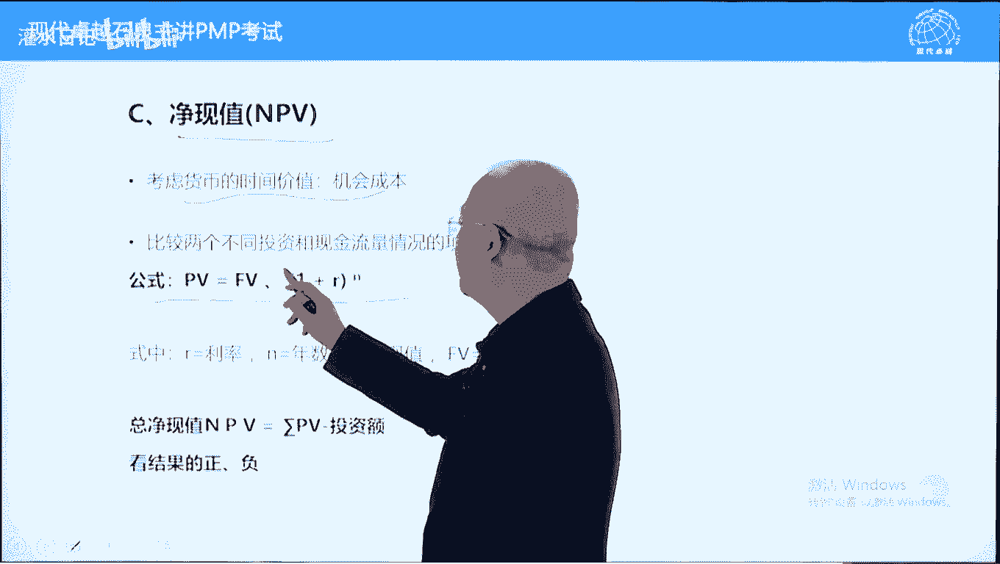

不好意思啊，这个这个号有错误，除以一个1+2的n次方，什么意思，pv指的是当前的值，现在值叫present value，f v指的是future value，好一就是一了，二是利率。

按照利率也可以按照行业呃，回报率一般我们按利率来就可以了，n是年限，什么原理，简单说一下，我们呢讲一个存钱的例子，讲一下资金的时间成本，比如说1万块钱，我们在银行里面存3年，3年之后，1万块钱是多少。

1+22是利率啊，三次方，这个呢是算利率的，就是1万块钱，3年之后变成多少钱，具体多少钱，这个up不一样，结果不一样，我们就不写了。

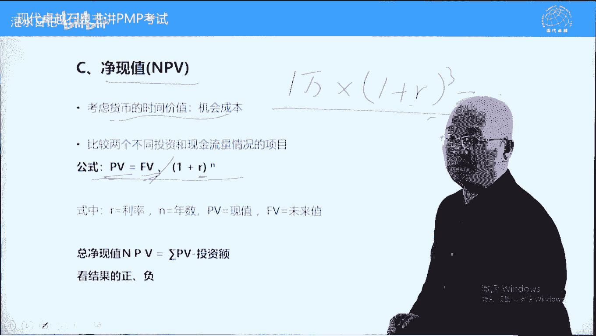

好那现在的话呢净现值是吧，将来的收益这叫非流血value投资是现在的第1年，1年之后收益多少钱，2年之后收益多少钱，把将来的收益去贴现，贴现的话呢是计算利息的一个相反的过程。

比如说3年之后的1万块钱变成现在多少钱，我们这样算的，1万去除以一个一加二二十利率啊，三次方，这就是3年之后的1万块钱变成现在是多少钱，我们把未来的收益都是将来的future value啊。

都这样的算一下，用这个公式算一下，算完之后呢，把它西格买一下，叫西格玛皮，第1年的自由其value第1年之后的算一下，第2年之后的算一下，第3年之后的算一下，我们呢得到n个。

每1年每年的收益都会得到一个pv，好我们把每年的pv加在一起，比如说这个项目一共会有5年收益，从第1年之后开始，第1年，第2年，第3年，第4年，第5年都有收益，我们把每1年的收益去除。

以一个1+2的n次方，就这样变成一个现在的钱，把所有的收益变成现在钱之后相加，汇总减去当前的投资额，这个呢结果叫npv，npv必须大于零，如果npv不大于零，我们这个钱不要投资，直接存银行吃利息。

就比他好好，在大于零前提前提下越大越好，注意n p p大于零，而且越大越好，另外一个npp，它本身已经考虑了资金的时间价值，考虑时间了，所以呢我们在按n p v选项目的时候，不再考虑时间，举个例子。

两个项目a项目5年的mp v50000 ，b项目10年代pv 100000，选哪一个，选10万的n p p只看大小，它本身已经考虑了资金的时间成本啊，这个呢是n p p难度稍微大一些。

考试的时候一般来说不会让你计算的，我们呢看结论大于零，越大越好就可以了，好另外一个呢我们看一个例子，这个例子的话呢是帮大家提现之后的，比如说第一个项目投资2万 25000啊，第1年1年之后收益是1万。

当前利率13%，贴现率吧，利率有提现率啊，我们呢把这1万块钱除以一个一，加13的一次方，得到一个值，就是1年之后的1万块钱，相当于现在的8850，2年之后的1万块钱除以一个就是1万块钱。

除以一个一加13%的二次方，然后得到一个钱，2年之后的1万块钱，现在相当于现在7831块钱啊，同理的，然后呢相加相加之后呢，加完之后这三个相加之后减25000，减完之后呢，这个是5500。

当然这不同的利率贴现率20%的时候，这个pp呢只有这个1100 1800了，都大于零都可以考虑啊，所以呢当提前率等于13的时候，等于20的时候，这两个项目都值得去做的，为什么呢，n p p都是大于零的。

这个呢能理解就可以了，考试的时候不需要你计算，你只要会看大小比较就可以了，下面呢我们再讲一个男的，这个呢是在npp基础上，我们呢倒推出来一个叫回报率。

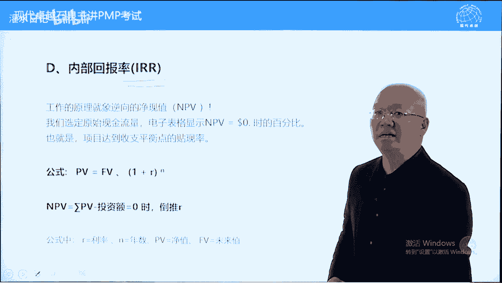

什么意思呢，我们根据这个公式，pp等于f v除以除以一个1+2的n次方，这是这是这个贴现率的，然后呢我们假定npv等于零的时候，我们把这个r当成未知数，假定n p p等于零，我们求二。

这是那i r r的计算方法，它将内部回报率，我们算一算这个r是多少啊，他们建立在npc基础上的，假定n p p等于零，我们刚才说了，n p必须大于零的，它假定n p b等于零的时候。

倒推出来这个r是多少，他把这个r当成未知数，他把这个npp假定为零，推二的好，推出来的是个百分比，越大越好啊，二越大越好，首先要大于利率，最好也要大于行业的平均回报率，我们这个二呢一般来说跟利率相比。

跟平均回报率相比越大越好，这个呢是呃i r记住结论，它是个百分比，也是越大越好，计算起来比较难，刚才的n p p是可以算的，这个呢基本上不能算，一般都是用试错法，如果n大于二大于三的话。

试错法来去倒推20多少，我们先用20%，大了15%，小了16%又小了，18%又大了17%，小了17。5%，诶，正好倒推出来的，这叫试错法，倒推的他正常情况下可能不一定能解出来。

需要用试错法一点一点试的难度比较大，记住结论啊啊啊，大于这个越大越好，首先要大于利率，大于行业的平均回报率，比如说某一个行业，汽车行业平均的收益率15%，那汽车行业在投资的时候，这个二必须要大于15%。

否则的话呢不如投入本行业中，这个呢是呃i r的一个意思啊，例子啊，下面呢我们再讲效益，成本比例其实也叫性价比，性价比也叫投资投入产出比，它呢是用除法，用收益除以一个成本，收益叫benefit。

不是利润啊，收益除以成本要大于一，大于一的基础上，越大越好，这个呢呃除以一个现金流入，除以一个现金流出，然后呢当然这个是个动态的，可能每年都有，这也是每年都有，总的加在一起的话呢。

除一下大于情况下越大越好，这些图的话呢其实都是示意图啊，跟这个关系不是很大，这个例子呢我们就不举了，呃这个内容呢目前没有考过，也可以叫成本效益分析啊，成本效益分析呢我们一般用减法。

但是呢这个里面告诉我们的是用除法，用效益去除，以一个成本必须要大于一才可以的，好，关于呢经济模型我们讲到这儿好，第一章呢我们就讲完了。

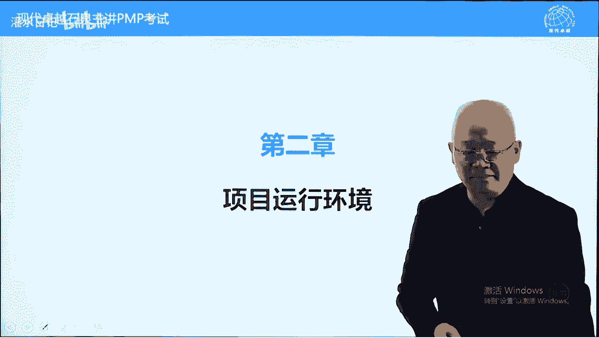

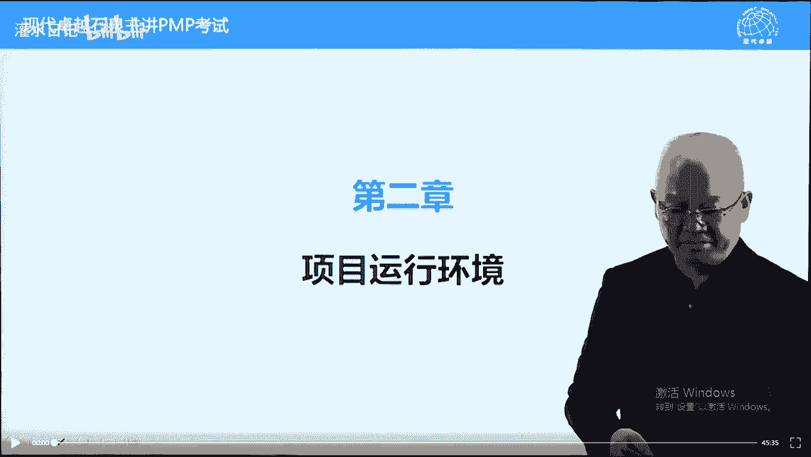