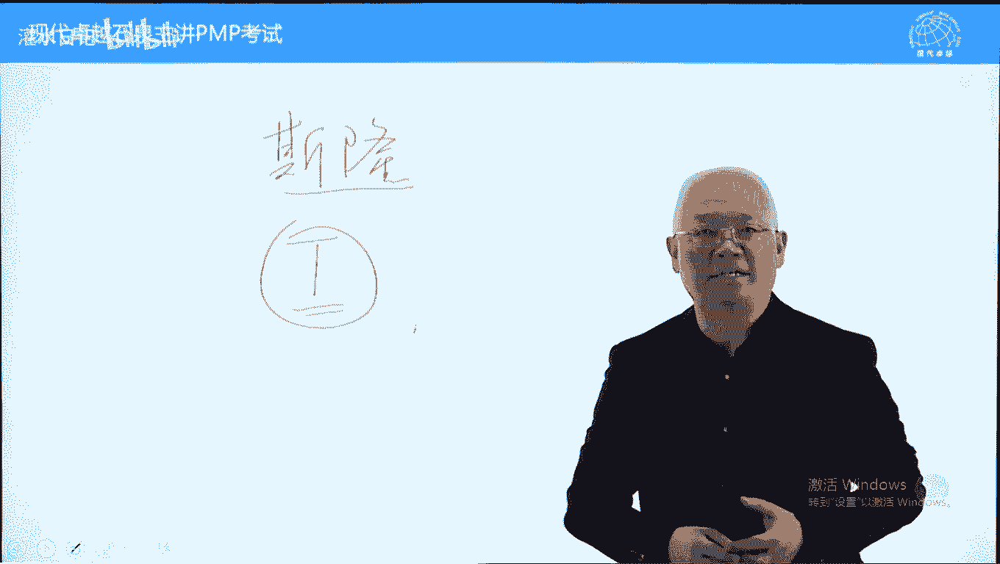
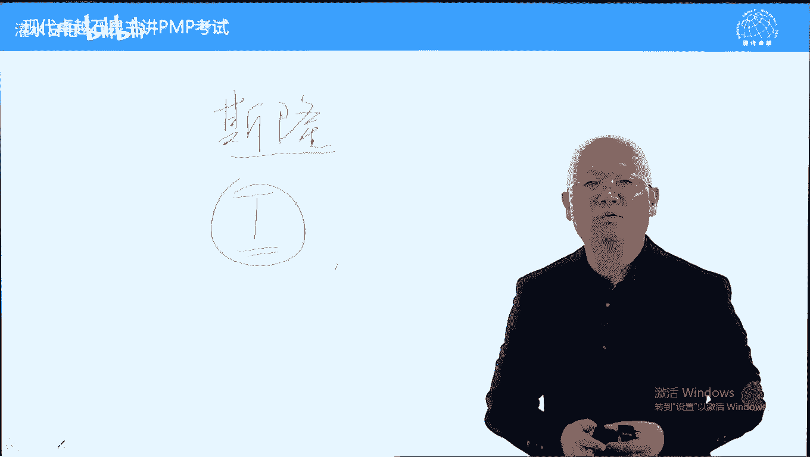
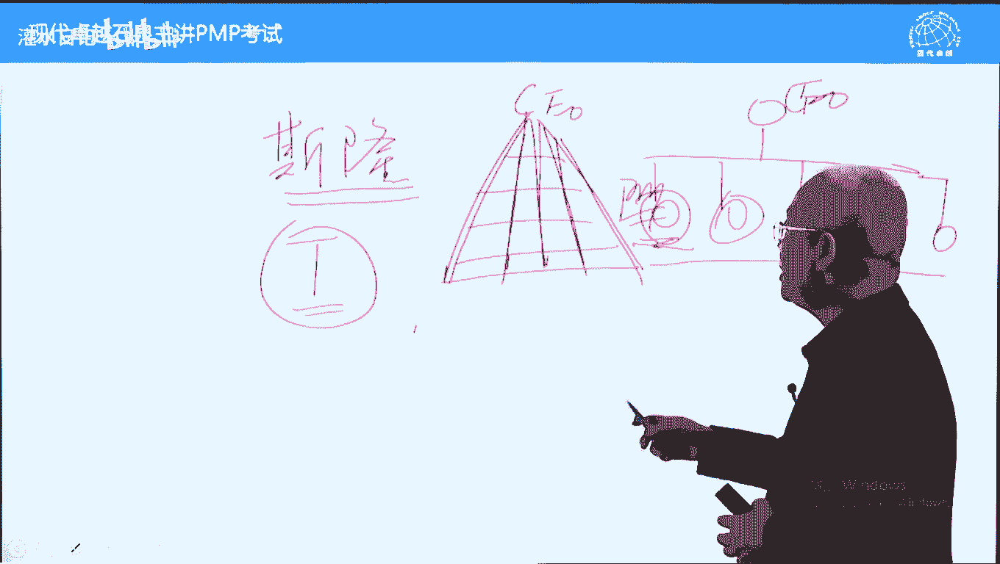
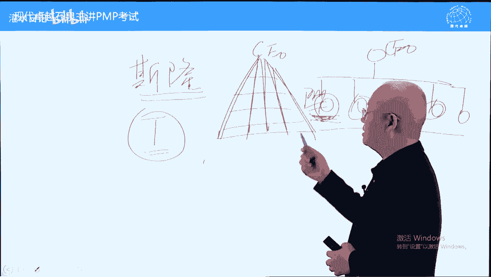
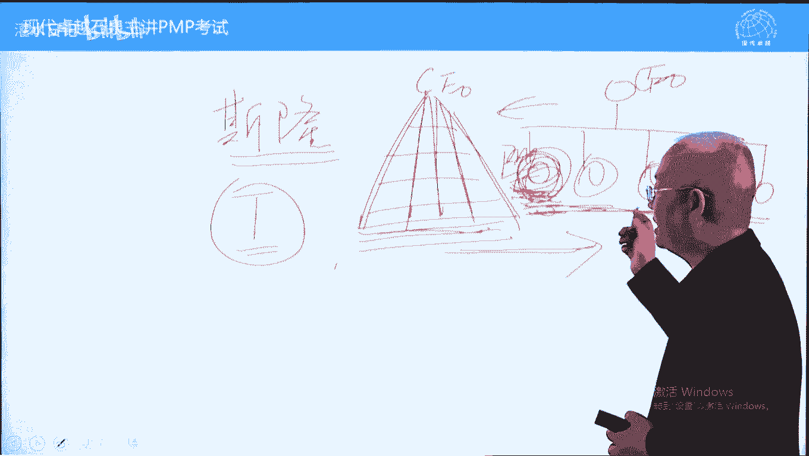
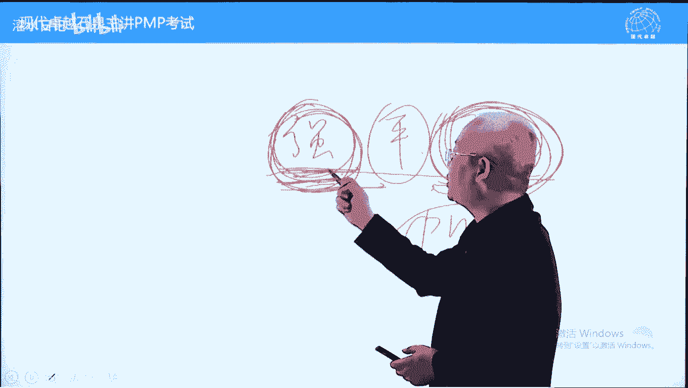
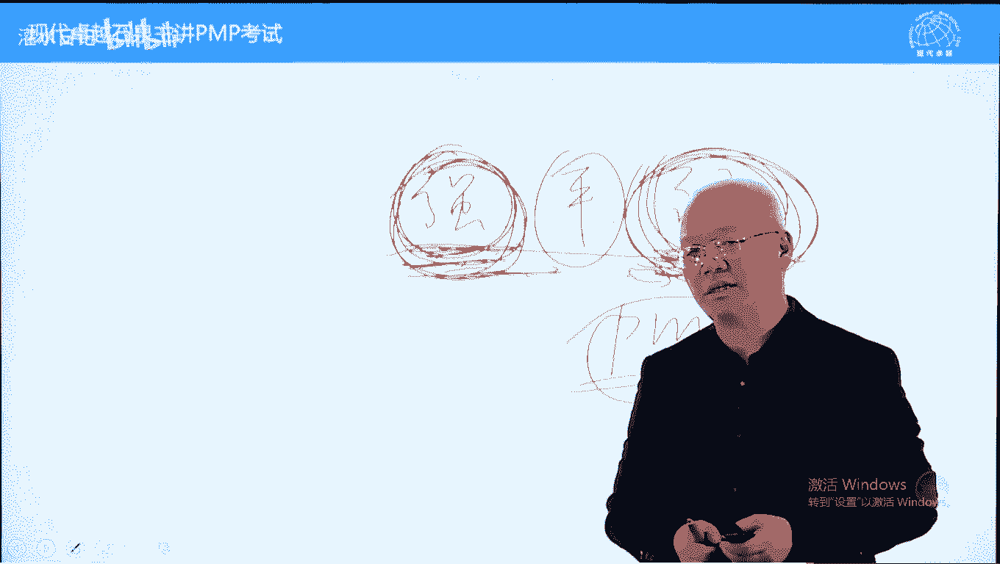
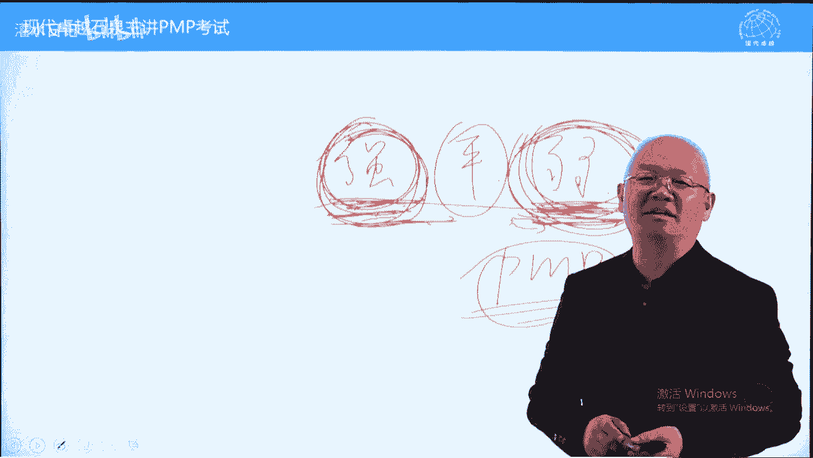
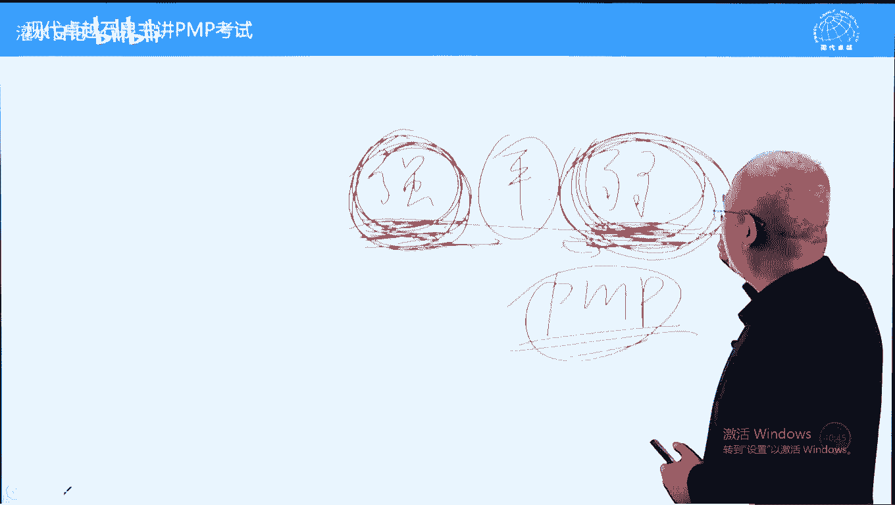
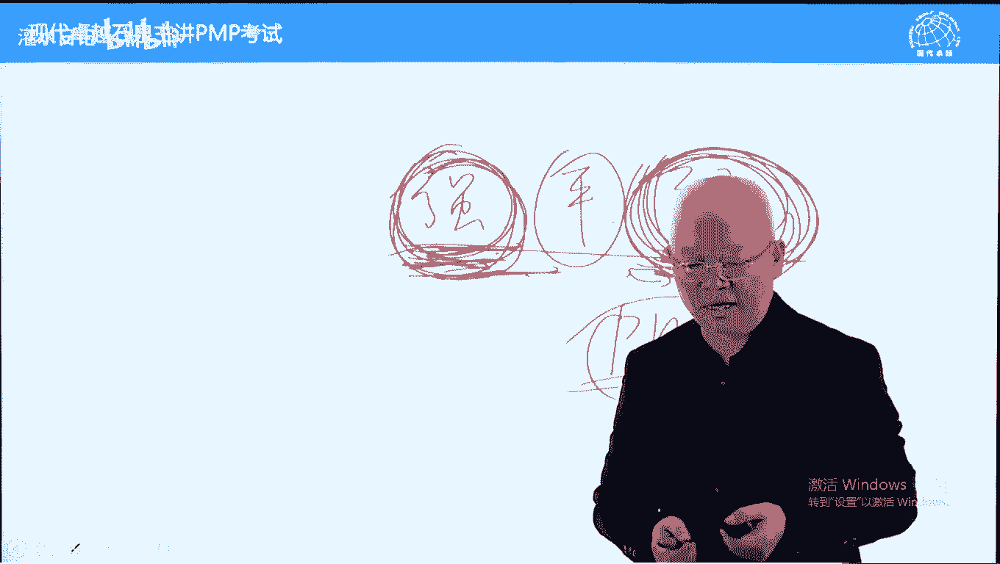

# PMP考试精讲 - P4：4 - 灌水日记 - BV1VN411w7cC

我们呢现在讲第二章项目的运营环境，项目的运营环境的话呢。

它包括主要讲了四个内容，事业环境因素，组织过程，资产组织结构以及p o。

我们呢下面呢一条一条看一下啊，首先说一下视环境因素跟组织过程资产，这两个呢是项目管理中比较重要的概念，我们私有过程，任何一个过程我们在执行的时候，我在制定的时候呢，都要考虑事业环境因素和组织过程资产。

那为什么呢，我们先说一下它的定义，知道定义之后呢，就知道为什么几乎每个过程都要考虑，原则上都应该有的，有一些个别过程中输入数呢，没有社会环境因素或没有组织工程产，或都没有解释不了的，应该都有的啊。

什么叫适应环境因素，也就是客观存在，项目呢都存在一个客观环境，这种客观环境的话呢都可以叫事业环境因素，它大体上呢有三个特点，只要符合这三个特点的，都可以叫适应环境因素，哪三个特点呢，简单说一下。

首先是客观存在，客观存在的啊，比如说气候文化语言，包括啊能力学历都是客观存在，第二个呢叫无法改变，至少是暂时无法改变的，无法改变，比如说你的出身，你的性别至少暂时无法改变，第三个呢叫不能选择，不能选择。

就是你必须接受只能接受的啊，没有选择余地，我们可以这样说，这都是命，就像命运，命运呢就属于一个适应环境因素，客观存在无法改变，你也不能选择的，笛卡尔曾经说过，哲学家笛卡尔他说过什么呢，什么叫智慧。

知道哪些能改变，哪些不能改变，这叫智慧，事业化因素都是不能改变的，包括外部的，内部的，包括硬件的，软件的，只要符合这三个特点，都可以叫事业环境因素，而且事业环境因素比较多，我们一睁眼几乎都是事业和因素。

比如说交通比较拥堵啊，比如说这个上班时间比较长，还有呢老板比较抠门，老婆比较强悍，孩子呢又不是很正干，不不爱学习，这些呢都可以叫事业环境因素，正确态度是什么呢，要适应，要接受。

孟子引用诗经的一句话说叫什么呢，永言配命，自求多福，简单说一下，永言配命就是我们要适应世界化因素，要接受命运的安排，要要承认命运的存在吧，不要接受命运的安排，承认命运的存在，自求多福。

就是只能自己改变自己啊，自求指的是自我反省，多自我反省，这样的话呢你的福气越来越多，人有福气和没有福气，有有有区别的，自己不断的自我反省，不要指责别人，这样的话呢服务器越来越多。

你只是抱怨你抱怨的对象都是社会环境因素，抱怨这个抱怨那个抱怨天气，抱怨什么呢，这样的话呢你的服务器呢可能会越来越少的，这个呢叫事业环境因素，面对事业环境因素，我们要承认它的存在，要去适应它。

我们呢短时间内是无法改变的，只能够接受这种情况了，好下面呢我们再讲组织过程资产，什么叫组织过程产，它有三个特点，只要符合这三个特点的，都叫组织过程资产，这个特点的话呢，注意第一个内部的指的是组织内部的。

什么叫组织内部的，我们可以这样说，项目经理所在组织内部的第一个特点，内部组织内部的第二个特点呢有好处的，有好处指的是对项目成功有利的，有一些不利是虽然内部的没有利益，没有没有好处的，比如说中国有国粹。

国粹呢有昆曲京剧，这都是国粹，那芭蕾舞剧话剧呃，包括呢这个叫呃芭蕾舞剧话剧，还有呢像小提琴之类的，这些呢中国不能申请世界文化遗产，但是呢中国的昆曲京剧可以申请世界文化遗产，为什么呢，它属于中国的。

属于我们自己的内部的，第二个呢对项目成功有好处，像京剧昆曲陶冶情操，能培养你的艺术感的啊，能够净化你的心灵，他呢对对这个社会是有好处的，所以呢我们申请实行文化遗产了，中国的内部的东西不光有国粹。

还有国骂，不同地方骂人方法都不一样，如果两个人骂人方法差不多，这两个人应该是老乡，国漫到目前为止还没有申请过世界文化遗产，为什么呢，因为他目前来看没有什么好处，当他怀灭绝的时候，可能会申请一下。

现在目前还不可能的，第三个特点就可以选择，什么叫可以选择，无论你用或不用，组织过程资产就在那里，不多也不少啊，这个呢是组织过程资产，它的三个核心特点，那组织工程产具体包括什么呢。

书上说包括呃模板方针政策之类的，也包括什么呢，叫知识库，知识库和模板分为两大类，什么叫模板，比如说项目章程的模板，我们呢就是一个框架，可以直接往里面填，照葫芦画瓢的w p s模板。

网络图模板进度计划的模板，资源管理计划的模板都是模板，之前项目中使用过的，现在项目呢可以借鉴的，这个呢属于模板，政策方针，可以可以直接借用的，当然都是可以选择用或不用的好，第二类呢叫共享知识库。

也叫知识库，什么叫知识库呢，它包括之前项目的各种文件，这是保留下来的，可以参考借鉴的也包括数据库，什么叫数据库，进度成本质量，人力资源风险，采购之类的，都会有一些量化指标，这些量化指标叫数据库。

我们也可以借鉴的，都是客观的，好共享知识库中还有一项主观内容叫什么呢，叫经验教训，有人说经验教训跟数据库不一样吗，不一样的数据库是客观的，而经验教训它不是客观的，经验教训呢都是主观总结的。

主观总结的才叫经验教训，因为经验教训都跟选择有关，跟选择无关的不叫经验教训，比如说出生在农村呃，长得比较丑，这能不能叫经验教训，这不能叫经验教训，因为这个跟我选择无关，不是我选择这样的。

但是呢曾经有一段真挚的爱情摆在我面前，我没有珍惜，直到失去才后悔莫及，如果上天再给我一次机会，我会对那个女孩说，我爱你，非要给他加一段期限，我希望是1万年，这叫什么，这叫经验教训，跟选择有关。

好跟选择有关的叫经验教训，我们可以大体这样分，有模板，有数据库，有经验教训，还有一些文件，当然了，这个数据库和文件我们放在一起也差不太多，或者说把这些文件呢跟模板放在一起，也是可以的。

好组织工程产具备三个特点，内部的有好处和可以选择的，在项目中非常有限，由于有好处，所以呢要尽量的使用组织生产，而对于世界环境因素的话呢，要承认不要改变，要适应，要承认世界环境，要适应，适应环境因素。

不要明知是南墙硬往上撞，那这样的话呢是自取灭亡的，这个呢叫社会环境因素跟组织观察它俩的区别，强调一下两个特点来区别，组织观察跟事业环境因素，第一个它是强制的，而组装生产是可以选择的，如果是可以选择的。

都不叫事业环境因素，比如说我们那叫合格供应商，在有限公司是强制的，只能用呃筛选过的，但是呢在偏不可中，合格的供应商，预审合格的供应商属于组织工程塔，你可以用，你也可以不用，另外一个。

比如说公司的安全政策必须要遵守的，不能违反，它属于什么呢，虽然叫政策，它也属于事业环境因素，所以我们不要看名称，要看作用是不是强制的，另外一个呢就是内部，如果是外部的，他一定不是组织过程资产。

比如说行业数据库，行业数据库的话呢，应该是对项目成功有利的，它不是内部的，它是行业的，它呢叫事业环境因素，大家呢我们在看书的时候就能发现了，再比如说身边的人，哪些是血液环境因素，哪些是组织生产。

那血液环境素多了，比如说父母命苦，不要怨父母，父母是你的事业环境因素啊，包括呢我们工作中可能遇到很多挫折，有些人的出现就是为了给你上一课，让你证明你一下你很傻，这个人呢也是我们的事业环境因素。

这一点呢很慎重的，很重要的，一定要把老婆孩子当成事业环境因素，不要企图改变，改变不了的，否则你的人生会很不幸的，把老婆孩子当成事业环境因素，夫妻是缘，儿女是债，不要想着你没有完成的工作。

让你儿子帮你完成，你没有住别墅，让你儿子帮你买买别墅，那这个呢对孩子来说是不公平的，因为它呢不是你的组织文采，它是你的事业环境因素，那有人说了，那我身边的人是不是都是肾化因素，没有组织和生产呢。

那也未必，比如说好的老师朋友可以选呃，可以困难的时候可以找他，也可以不找它，属于组织的态，再包括那亲跌是肾化因素，干爹可以是组织过程，资产好，我们呢根据特点来去区分，到底是社会环境因素还是组织和生产呃。

考试中的经常考，比如说硬件设施，基础设施它都属于社会化因素啊，因为暂时不能改变的好，关于这个内容呢，我们还有一句话需要注意一下，在哪里呢，在大家翻译一下书组织过程资产的内容里面，有一句话。

我们呢需要画一下的，这句话呢相对来说比较重要，在39页，39页不算小黑点的最后一段，倒数第二行，倒数第二行，在整个项目期间，项目团队成员可对组织过程上进行必要的更，新和增补，这句话告诉我们组织过程。

资产的更新和增补应该是全过程的，另外一个呢是人人有份，不光是项目经理的责任，包括总结经验教训，包括面归档之类的，这个内容呢需要记住一下好，下面呢我们看另外一个内容叫什么呢。

叫组织系统，组织系统也可以叫组织结构。

首先说一下什么是组织，组织呢它有一个特点，组织点是什么呢。

就是遵守共同规则的一群人叫组织，也可以把它当成组织定义，遵守共同规则的行人教组织，比如说你的公司有公司的章程。

公司的所有人员都遵守公司的主呃，叫公司的叫制度，或者说公司的纪律，比如公司规定996。

那你必须要尊重996上班时间，那这个呢属于遵守共同规则的一群人，我们叫组织，那黑社会呢它也是组织，它有班规，班规呢也是他们的纪律，都可以叫组织，好问题，我们问一个问题，为什么要把人组织在一起呢。

它有一个好处，组织在一起能发挥1+1大于二的作用，人多力量大，但是呢组织组织在一起之后，力量更大一些，能发挥1+1大于二，发挥乘法甚至乘方的作用，因此的话呢有必要组织起来。

还有一个呢，不同的组织结构对于效率的影响是不一样的啊，待会我们再讲另外一个呢组织是一个系统，系统呢有一些特性，哪些特性呢，简单说一下，首先系统是一个整体，其次系统由各个因素构成，因素之间是相互作用的。

而一第三个特点，因素因素之间的相互作用，它们呢构成了系统的动态发展，就第三个特点，系统是动态的，而系统的发展方向有系统的根因素中，最活跃的因素来决定哪个因素最活跃，他决定系统发展方向，一个好的组织。

它最活跃的因素应该是组织的领导领导，如果比较得力的话，这个组织呢能朝健康方向发展，否则的话呢，这个组织的话呢，可能会推着领导往某一个方向来去发展，系统会失控，而改变组织绩效的最好方式。

把这个组织领导换一下之后，组织绩效立马会得到很大的改观，我们举个例子，亮剑电视剧亮剑啊，很火的一个电视剧，几年前的里面有一个李云龙，他是个团长，哪个团呢，呃八路军129师386旅。

陈赓那个旅独立团团长好，这个386旅有很多团，应该有十几个20个团，每个团它的规章制度应该是一样的，制度是一样的，但是呢效率不一样，为什么呢，因为影响组织效率的除了组织制度之外，还有一个叫文化。

而文化是谁来决定，由组织领导决定组织动画，所以呢李云龙在哪个团内核三战斗力陡然提升，李云龙一走战斗力呢就陡然下降了，所以呢，组织的效率跟组织的领导是有直接关系的，我们前面也讲过。

如果如果一个项目的绩效不好，最好最有效的方式改变项命令和替换，向命令换将如换刀，这个呢影响组织效率的除了制度之外，还有组织文化，两个呢都影响，比如说公司规定啊五点钟下班，但是呢呃领导不走，你不能走。

领导都是九点走，那你必须要九点走，那这是什么呢，文化起作用了，组织治理框架理解为组织的各项规章制度，我们的组织是怎么样运作的，怎么样运运行的，这个就是制度理解为制度组织的核心特点。

好项目治理也可以叫项目管理，什么叫项目治理，我们前面也讲过了，我们把所有的裁剪过程加在一起，可以叫项目治理，裁剪过程呢只是制定一个项目的解决方案，实施解决方案也属于项目治理。

那就是我们用专业方法来去实现一个项目，这个过程叫做项目治，理好职能部门一般的管理原则，这个呢是呃讲这个组织组织效率的时候，或组织特点的时候呢，我们要讲一下有三种组织类型，哪三种呢，职能型组织。

项目型组织和矩阵型组织职能型不写了，另外一个呢叫项目型，还有一种呢叫矩阵型，矩阵型啊，一共一共有三种组织结构，注意组织行为学，包括组织无组织原则，组织行为学吧，大多数的管理理论都建立在职能部门。

职能型组织的管理及组织上的有哪些原则呢，我们也可以叫组织行为学啊，一个人只有一个领导好，另外一个呢领导的权利跟责任是对等的，包括每个人的责任跟权利也应该是对等的，这些原则的话呢能够支持组织的正常运作。

如果这些原则不存在，组织不能正常正常运作，这个呢我们只是讲了两个原则，很多我们待会呢再说一下，包括他有纪律，必须要都遵守的组织类型有三种组织结构，刚才讲了项目型，矩阵型和智能型。

这三种组织结构它的效率是不一样的，不同特殊结构效率是不一样的，有的是集权，有的呢是分权，有的呢是金字塔型，有的呢是扁平化，我们下面呢把这三种组织结构，大概跟大家介绍一下，介绍完之后呢，我们再看47张表。

最先出现的组织结构。

军队里面先出现的，当然那是借用军队的，有一个德国人叫。

有个德国人叫韦伯，他呢通过研究军队的组织形式，它呢得出一个组织结构理论。

也叫组织理论吧，他这种组织理论呢在生产运行中。

在商业管理中呢大量的使用，比较早出现的叫什么呢，职能型组织也叫金字塔型组织。

我们叫职能型啊，这叫职能型。

这也是最先出现的组织结构，什么组织结构呢。

以分工为导向的组织结构，纵向按专业分工。

比如生产部，销售部，财务，财务部，人力资源部，行政部，横向呢按级别划分。

总监ceo，最上面ceo。

然后呢总监级，部门经理级，主管级啊，主管级包括呢小组长。

包括团队生源，这叫金字塔型的组织结构。

他强调什么呢，各司其职，每一个职能部门各管一块。

每个部门都是什么呢，局部的权利跟局部的责任，但是呢它符合组织行为学的原则。

权利跟责任是成是不是成正比是相等的。

这样的话呢责任能运行使起来，这种组织结构最初是为运营设计的。

它符合运营特点。

运营是持续的重复的，它没有特殊特殊情况，比较少出现特殊情况。

部门之间横向无法沟通，比如说这个部门有一个问题。

需要这个部门配合，他们之间没有横向沟通渠道。

平起平坐的，那怎么办呢，需要层层汇报。

汇报到总经理，到这儿有交集了，总经理在层层的下达。

然后呢转给他，让他来去配合他俩之间的交集在这儿。

这个呢就是它的横向沟通，必须要通过纵向才能实现好。

在职能型组织，它为运营服务的，它建立在运营基础上呢，运营工作大部分工作都是正常情况，没有特殊情况。

当出现特殊情况的时候，才需要领导出面，不出现特殊情况。

领导不需要出面，大家各安其感呃，各司其职，各安其位就可以了啊。

这种组织结构它适合运营工作，为什么呢，通过分工能提高效率。

专业人做专业的事情，产生学习曲线，能提高效率的。

它能够节约成本，但是呢它非常不适合做项目，为什么呢。

项目具有独特性，而且项目的话呢它强调一个协同。

什么叫协同，就是横向配合，横向配合很多。

它的绝对性组织横向配合不能直接发生，必须要先通过上呃。

叫纵向沟通才能实现，在这种沟通过程中。

首先一个时间比较慢，花的时间很长啊，他可能不一定有时间来去。

随时来来反映，来来来应对来反映的另外一个呢。

在这种沟通过程中会出现一个问题，叫什么呢，沟通漏斗，漏斗啊。

沟通漏斗，沟通漏斗，什么叫沟通漏斗指的是上下级之间的沟通。

每沟通一层次，无论是从上往下，从下往上，每一层沟通，都会过滤到70%左右的真实信息。

如果一个组织的层级比较多，从这儿到这儿好多层，每一层都过滤70%的话。

那层层过滤呢就会出现下面的情况，领导根本不了解下面水深火火热，领导认为形势一片大好，会有这样的一个错误判断，这叫什么呢，一个是行动慢，行动缓慢，另外一个呢会有一些误错觉啊。

我们把这种组织呢当很庞大的时候，比如说有些组织像摩托罗拉，据说啊最多的时候28层，32层，这种情况呢我们叫大象大象，大象型组织反应很慢，很迟钝，他不适合做项目，我们也说过。

项目管理是一种基于进度的做事方法，我们希望快答，这种不适合做项目啊，这个呢是上呃叫18世纪后期啊，不是不是18世纪19世纪后期，187几年之后就出现了组织结构，它强调分工，它为运营而存在。

好这种组织呢不适合做项目。

到了1923年出现了一种新的组织结构，叫什么呢。

叫项目型组织，也叫事业步行组织，为了应对什么呢。

应对这个效率比较低。

大象有这种情况呢，1923年出一件事，什么事呢，美国的通用汽车被杜邦公司收购了。

杜邦公司呢是一家做化学的公司。

他们呢没有做过汽车的，他们聘请了一个职业经理人来管理通用汽车。

叫这个人叫什么呢，叫斯隆，后来呢也成为管理大师了。

四龙他接手通用汽车的时候呢。

通用汽车面临这样一个情况，就面临倒闭了，当时呢福特汽车一枝独秀。

在美国市场上占据了70%的市场份额。

福特汽车当时其它的特点就是成本特别低，通用汽车跟他无法竞争。

成本成本上无法竞争，所以呢面临倒闭，四龙接手之后呢。

他开始思考怎么样能够跟通用机，跟这个跟这个叫福特汽车平分秋色。

跟它能够分庭抗礼，怕呢就分析福特汽车特点特点。

福特提汽车的特点就是成本特别低。

而它成本低的话呢，也给他带来一个漏洞，什么漏洞呢，它为了降低成本。

它所有生产线只生产一种型号，一种颜色的汽车，叫什么呢。

黑色t型轿车，由于它只是讲这种汽车，它的零部件都为这种汽车来存在的。

所以呢量很大，量越大，成本越低。

这叫学习曲线，你只做一件事情，做的越多，效率越高，成本越低。

斯洛认为这是个破绽，为什么呢，在上世纪20年年代的时候。

美国的年轻人思想都很独立，他不愿意跟别人一样，他希望希望呢特立独行，但是呢福特的t型轿车没给他特立独行的机会。

四龙这时候呢提出一个口号，什么口号呢，叫每人有一个钱包。

什么意思，每个人的需求是不一样的，以这个为战略方向。

他提出什么呢，品牌化，他要多品牌去跟福特竞争，这种品牌品牌策略呢在上世纪末的时候。

有一家中国有一家叫奇瑞。

奇瑞的这个老板领头药吧。

他呢提出一个口号叫什么呢，多生孩子打群架，也是受斯隆这个思想的影响一样的。

多生孩子打群架，我投放各种各样型号的汽车，我跟你去竞争。

所以呢四龙就提出各种品牌来去抢占市场。

尤其是雪佛兰这款车，每年推出款新型汽车，当然了，当时通用汽车品牌比较多。

然后像吉普，像什么呃，叫叫吉普呃。

别克别克之类的，这些呢可能都是通用的一个品牌。

当一个公司有很多品牌的时候，它也有品牌要扩张的时候呢，我们再采用职能型组织来去运作。

这样一个业务的话呢。

就比较复杂了，当你有十几个品牌的时，候，几十个品牌的时候都是同一个部门来设计。

同一个部门来生产，同一个部门来销售，市场维护。

包括人力资源行政之类的，他们的横向沟通会很多。

它的效率会很低，ceo会忙不过来，这样的话呢时间效率下降。

所以四龙采取一种新的组织结构，什么呢，扁平化组织也叫事业不行组织，什么叫事业步行组织呢，他这样的上面ceo在ceo下面分为各个事业部。

小的厂吧，有雪佛兰的，有别克的，有吉普的，好，每一个部门也叫小厂，麻雀虽小，五脏俱全，它有它自己的设计，生产销售售后，人力资源行政，包括物流之类的都包括的，每一个都是如此，这样的话呢独立生产汽车。

独立销售，独立的去客服维护之类的好，这个呢叫扁平化组织。

它特别适合于项目工作，为什么呢，每一件事情有一个项目命令。

相当于比如说这个部门负责雪佛兰的，他对雪佛兰的汽车从研发到销售他都负责的。

而下面的每个人员无论销售，而研发人员都归他来管，需要配合的时候，需要协同的时候，他直接协同，他们效率比较高，都是如此啊，它能够极大极大的节约时间。

能够提高时间的效率，所以呢能快速的把是把这个产品推出去，这叫扁平化组织好，四中这一招的话呢立即起了效果啊。

没有几年跟福特可以平分秋色了。

可以平分天下了，这个呢是品牌战略，它呢使用教事业不行组织。

那就是说事业运行组织非常适合，像非常有利于项目成功，为什么我们不用事业步行组织呢，而且要用矩阵型组织呢，原因是事业不行。

组织组织呢有它的缺陷，什么缺陷，它的成本很高。

他资源会很浪费，比如说设计人员有些设置音设计人员的话呢。

可能一个不设计部门，支持多个厂家的多个品牌的。

但是呢我们为了提高效率，时间效率啊，我们不跟别人分享资源，所以呢设计人员都是自己养的，包括弱电工程师或美工，每一个认定工程师或美工都能够支持多个项目，但是呢事业不行，组织他为了保证我的人员随时我可以用。

他呢宁可浪费他，也要养一些人，供他随时使用的，不跟别人分享任何资源，所以呢这时候组织它的特点是成本比较高。

当市场利润很高的时候，市场机会很多，我们需要抢占市场的时候。

可以用这种情况，但是呢如果市场已经饱和了。

利润很低，大家呢以成本在竞争，这种组织结构会比较好一些，另外呢这种项目型组织到项目后期，面临项目完成的时候，面临解散团队学，没地方去，没地方去的话呢，面临失业。

这个呢也是一个问题，解雇别人呢可能要花很多钱，就这种组织的话呢，大部分企业是不用的，只有一些初创企业或效益特别好的企业，利润特别高的行业，他用这种情况啊，天下大事合久必分，分久必合。

我们讲一下叫公司的组织重建或公司重组。

公司重组无外乎从右往左来或从左往右来，当市场的机会很多的时候，我们需要抢占市场的时候，利润很高，我们呢把职能型往事业步行发展，如果市场竞争很激烈了，那就存在兼并了。

兼并的结果就是事业不行的往职能型去发展，比如说某一行业不景气，很多企业倒闭了，倒闭之后呢，会被大的企业兼并，一旦兼并之后，效率就提高了，为什么效率极高呢，本来每个公司都独立养了一套人马。

但是它合并完之后不需要那么多人了，那成本效率呢就能提高了，变成这个成本效率提高啊，所以呢一旦企业重组。

组织重组重建的话呢，从卵从建完之后就是财人财。

商人的话呢，效率提高，我们可以再举个例子啊，以前呢很多家呃，解放前有我们强调孝道要强调呢四世同堂，五世同堂，什么叫四世同堂，五世同堂同堂就是一个锅吃饭不分锅不分家，比如说一个大家族有100口人。

没有分家，100口人一个一个锅吃饭，每天吃饭需要多少人做饭呢，可能6~7个人就差不多了，相当一个炊事班供这100多号人，100号人吃饭，如果这100号人分家了，五口人，一家要分成20家，20家的话。

每天做饭至少需要多少人呢，至少需要20个人，所以呢它的成本浪费比较严重，他呢适合于项目，但成本浪费比较严重，大部分企业都是不用的。

于是呢出现第三种组织结构叫什么呢，矩阵型组织，矩阵型组织，它强调有一个专门任命的项目里，这种组织没有项目里的谁来负责ceo负责，每个人呢都只负责一块，负责局部，不负责整体，ceo负责整体。

而ceo呢权利呃级别太高。

精力有限，他不可能去盯着每个项目的，所以呢这样情况下项目相当于没人管，事业不行，项目是有人管的，矩阵型，我们的模仿事业不行，项目行啊，我们专门设一个项目命令，可以是兼职，可以专职。

但是呢他是对项目结果唯一负责的人，负责的，对项目就有负责的，唯一的责任人，然后呢我们从职能部门中抓壮丁，让各个部门的成员兼职为项目工作，这个呢就是矩阵型了，我们也叫二次矩阵，重新划分一下。

这些人呢都是兼职，也有可能是专职的好，这样的话呢组织效率能提高很多，为什么呢，比如说美工能身兼多个项目，它就不需它就不会浪费了，身兼多个项目呢，能提高组织效率，资源效率啊，同样资源情况下。

矩阵型组织能做的项目会更多一些，另外一个他解决了横向沟通问题，比如说这两个成员需要沟通，那怎么办呢，向命召集他俩直接沟通就可以了，他俩的除了直接领导之外，还有一个领导是项命令。

或者说我们需要这个部门和这个部门配合的时，候，由项目来直接跟这个部门和这个部门的领导，来去直接沟通，来寻找得到配合，他解决了一个横向沟通的问题，横向沟通不需要再通过纵向了。

另外一个呢就是团队人员做完项目之后，即使没有工作，这个项目不再做了，她有娘家可以回到娘家去，她呢不浪费资源，也不需要面临解雇的问题啊，这种组织非常适合于项目啊，大部分企业都在使用矩阵型组织做项目。

但是呢他有他的致命问题，他违反了两个组织行为学的原则，刚才讲过的任何一个人有且只能有一个领导，但是呢在举行组织中，项目中的团队人员都有两个领导，一个是他一个他自己的领导。

另外一个呢每一个人的领导的权利和责任对等，在职能型组织中是有的啊，每个人的权利责任对等，各绑一块的，但是呢在矩阵型组织中，项目里有全部的责任和局部的权利，为什么呢，对于资源而言，他的权利有限。

他跟部门经理共享对资源的控制权，他的权利是有限的，很多时候呢，他不得不依靠个人的权利来去解决问题，就是你的个人魅力，人格魅力，包括呢你能给别人带来好处，这是这是你的职位之外的工作之外的东西。

然后呢来获得别人的配合，因为那组织行为，组织行为学强调权利跟责任必须对等，这样的话呢才能够行使你的职责，完成你的工作，而项目命令的话呢，它是全部的责任，但是他职位权利是局部的，他的责任能能够实现。

所以呢有些项目里能成功，有些不能成功，源于什么呢，个人的能力不够，个人的权利不够啊，没有补充进来导致的一个结果好，另外一个呢在矩阵型组织中，又分为强弱和平衡矩阵，强强矩阵。

平衡矩阵，弱矩阵根据什么划分的。

根据项目经理跟职能经理的这个级别高低。

如果项目里的地位级别比职能经理高，他对资源的控制权利呢高于职能经理的时候。

这叫强迫症，反之叫弱矩阵。

强迫症呢效率权力比较大，权力越大，效率越高的。

或者时间效率越高，它可以直接发号施令命令的，但是呢大多数企业没有采用弱举行。

强取的性组织，大部分企业都采用弱智执行组织。

而且他在pm考试中，如果题目中没有告诉你什么组织结构，我们都默认为弱矩阵型组织。

为什么呢，这种组织情况下能够做的项目更多一些。

就是不需要大领导，当项目里一个主管，一个技术骨干就能够担任项目的话呢，能做的项目更多一些。

而这种的话呢在同样资源情况下，做的项目是有限的，比较少一些好。

另外一个呢就是弱矩阵型组织呃，它呢有利于形成一个协作的文化。

当项目地位比较低的时候，他需要得到部门经理配合的时候。

他只能去哄，只能去跟别人说好话，这样的话呢有利于形成良好的企业文化。

而项目你天天发号施令的话呢。

可能导致关系破裂，因为项目是临时的，部门经理的权利呢是永久的。

他权利更大一些，如果跟部门经理如果关系破裂的话。

会导致对抗，一旦对抗的话呢，你权力再大，可能在履行项目职责的时候。

执行项目的时候呢也可能不是很顺利，如果个人关系比较好。

我们强调讲感情，或者说呢讲有友善的关系，人际关系，这种情况下的，即使项目地位不高，也能够完成很多的项目。

会完成大的项目，这样的话呢对于组织文化建设比较好一些，很多人会说。

那我们这个项目既然对公司很重要，为什么领导不给我全部的权利。

只给我一部分权利，很多事情我要求部门经理呢，而且很多项目你会抱怨领导那耍流氓。

每次呢在布置项目任务的时候，都拍我肩膀说哎这个项目很重要，然后呢所有的部门都会支持你的，有什么可以找我，我来帮你解决，当你真正有问题的时候。

找到领导，领导会说哎你跟你好好协商呗，大家都讲道理的，你好好说。

好好说，不要我出面，我出面就不好说了，好领导都会这样做，为什么这样做。

领导为什么不愿意给你更多权利呢，因为公司的组织结构。

大部分的都按职能性划分的，职能型是永久的，项目呢是临时的。

为一个临时的项目重新动别人的奶酪，会导致内斗。

导致公司呢一片混乱，所以呢为了公司的稳定，为了职能型组织结构的一个稳定。

或者说为了一个权力的稳定，不要那么多内斗，公司呢在在面对临时的项目的时候。

他一般都是牺牲项命令。

让项目呢处在一个比较弱势的地位，你跟部门经理好好协商，他不会说伤害部门经理的，他只能说要求项目你要努力，你要好好解决问题。

你要跟别人好好说，来解决项目的问题，这个呢是历史必然，为什么呢，所有企业都面临这样一个情况。

因为长期组织结构肯定是只能全能型的，因为这种情况呢动别人奶酪为一个临时的项目，动别人奶酪的话呢，会导致严重的内斗。

为了防止这种情况，一般来说会牺牲性命令，所以项目里是被牺牲的。

你处在一个比较弱势的地位，同样为公司工作，你得去求别人的。

所以呢必须要了解这个情况，我们呢要接受这样一个现实，这事业环境因素。

要想做好项目，必须接受这个这个现实啊，我们哪怕自己内心不去当演员都可以的。

你呢跟别人搞好关系，你得去去求别人的。

你想跟别人一样的衣食，七指或者跟别人啊发号施令的话呢，可能性不大。

因为什么呢，你的权力有限，你需要对结果负责，而且公司的话呢弱矩阵型组织好。

我们说当一天乌龟拖一天试飞，你认识到这种情况的话。

你能定好，能能能够把握好自己的一个位置，另外一个呢能够把项目做好，你知道跟别人怎么样相处，如果你不了解的话呢，你可能会很憋屈。

天天抱怨，而且项目做不好，因此的话呢项目里需要洗脑，弱矩阵型组织是一个历史必然好。

我们呢要主动跟别人联系。

要讨好别人，我们叫拍马屁啊，这个呢也是我们的命运使然。

我们要接受它，比如说呢既然这么憋屈，我干嘛还要做项目里呢。

好当乙方很辛苦，但是呢当乙方能提高能力，孟子说。

生于忧患，死于安乐，我们这样的能力会越来越强的，天将降大任于斯人。

也，必先劳其筋骨，饿其体肤，苦其心志，空，乏其身行，拂乱其所为。

所以动心忍性，增益其所不能，年轻人要对自己有要求，要自己主动去吃苦，你在一个权力很低的情况下能完成一件大事，这个世界上没有你办不成的事情了，不叫提炼，我们呢要且行且珍惜。

项目是一种福报，前世修来的，你呢因为当项里会有远大前途的。

我们这样激励一下，这个呢是强弱平衡矩阵。

平衡理论出现比较少或者强或者弱，但是呢强你这不利于公司的资源利用率最大化。

因为领导可能会发号施令，领导这种法势力呢会伤害部门经理。

部门经理属于地头蛇，我们叫强龙难压地头蛇。

如果项目经理地位比较高，跟部门经理不讲道理的话，他伤害到部门经理的话，部门经理会报复的，因为你不跟我讲道理，你是妖。

你是以你是压人，那我心里不服气啊，这种不服气的话呢。

我们叫君子报仇十天不晚，而小人报仇呢，大部分人不是君子啊。

想报仇一天到晚，他会想尽一切办法，在自己的一亩三分地来报复一下。

把新州把胸中这口恶气除掉，这样的话呢身心才会健康。

否则身心不健康的，所以呢效命的话呢，即使你权利很高。

你不要伤害部门经理，部门经理呢他那是地头蛇，他掌握技术。

掌握资源，在他的一亩三分地，他找一些理由对付你是很简单的。

他会找一些冠冕堂皇的技术理由来对付你，我们也经常说，在项目中没有技术问题。

都是人际关系问题，人际关系没有处理好，表现为技术上有问题。

别人说这个实现不了，没有时间，没有做过这样的事情。

我们完不完成不了，臣妾做不到，表面上这种情况本质上是什么呢。

本质上是互相之间没有信任了，喜欢你没有没有理由而不喜欢你。

什么都是理由，比如说举个例子，一个美女在上海啊。

找了一个小伙子啊，这个长得很帅吧。

这个美女呢就跟小伙子说，余生请您指教。

您把我娶了吧，我想嫁给你，男生呢不太喜欢这个女生。

为什么呢，矫情任性，作寂寞，空虚冷。

娶妻不贤，遗祸三代，但是呢男生直接拒绝呢，很伤女生面子的。

男生呢会这样说，哎呀你这么好一个女生，你这么好，这么优秀一个人，我觉得我对不起你。

我现在连个房子都没有，那这样吧，等我在陆家嘴有了一套300平米大平层的时候。

我再娶你，那陆家嘴300平米大平大平层，需要将近一个亿了，这叫什么，这叫赤裸裸的拒绝，这家是乐乐拒绝啊，还有人说。

那我这个打股票，我我这个买股票，我这个中石油，10年前中石油上市的时候。

我打的新股啊，中中了1万多股，当时48。

现在的话呢可能就十几块钱啊，这样吧，等我中石油解套了，我再娶你。

这叫什么，这也叫施罗德的拒绝，因为关系不好，即使你权力很大。

你可能呃也可能不能不能不能如意的。

为什么呢，专业人士他会用专业方法来对付你的，所以呢大部分企业选择弱女神经组织。

他把项目也牺牲了，我们呢必须要知道自己的一个地位，或者说知道这样一个历史使命，知道之后呢，我们能做的更好一些好。

关于强弱平衡矩阵呢，我们讲到这儿，下面呢我们看一个内容啊。

看一下什么呢，看一下这个这张图，47页，翻译一下，47页呢讲的比较复杂，我们呢大致讲了五种组织结构，职能型，项目型和强弱平衡矩阵物种组织结构，比如说你的矩阵型呢有三种啊，书上呢除了这五种之外又加了五种。

一共呢他讲了十种，这十种的话呢有些是主要的，有些呢是虚的，比如说我们刚才讲的职能型，矩阵型三种，还有呢项目型，这都是实的，而其他一些的话呢在现实中很少，点到为止，我们也看一下47页。

第一个叫有畸形的简约有机型或简约型，什么意思呢，单打独斗这种呢是单打独斗的项目，没有项命令，另外呢也没有部门参与，这个呢是叫有机型，这种在现实中很少的，我们知道就可以了好另外呢第二种叫职能型。

指的是单个部门在做一个项目，某一个部门在做一个项目，不涉及其他部分，这种组织结构也没有下命令，第三种多部门型就是我们说的职能型，不同职能部门一起来做一个项目，他也没有项目前三种共同特点没有项目好。

中间三种弱矩阵，强矩阵，平衡矩阵它都是同时有效命令，也同时有职能经理都会出现的，考试中也是如此，当然这个内容呢一六版到现在还没有考过，将来不知道什么情况啊，有可能会考的这个内容，应该来说还比较重要一些。

好，这个强弱平衡矩阵的话呢，都是同时出现项目里跟直线定理，这两个人呢在项目中有不同的分工，在项目中我们前面也讲到过的，项目负责决定范围，进度和成本三大基本的情况，职能经理负责决定资源和技术问题，谁来做。

如何做，这是有分工的啊，所以呢在矩阵型组织中，同时会出现像命令跟智能定理好，第七种，第七种呢叫项目导向型，就是我们刚才说的项目型项目里全权负责，不需要任何职能部门的配合，他呢自己有人有枪。

有权利可以独立开展工作，这个呢叫项目型组织好，后面的三种虚拟型组织呢，这个跟组织结构关系不大，它更多的跟团队建设关系更大一些，这种单独不会考的，另外一个呢叫混合型，比如说呃项目型，职能型和矩阵型。

这三种都可以混合在一起的，先是一个大项目项目型，然后在项目群中可以分职能部门，不完职能部门再举对性配合，这个呢一般叫呃，这个叫联合化，一体一体一体的管理方式，大特大型的项目或者这种情况。

几百人来管一个项目，几百人的项目团队必须要分工的啊，这个呢不就不多说了，另外一种呢叫po，这个跟前面讲的叫项目型组织是一样的，只不过呢项目型组织，我们强调事业部或项目管理部来去管理。

而p o的话呢指的是在有些组织，p o叫项目管理办公室，它的作用被升级，除了提高公司项目管理水平，支持项目之外，他还直接管理控制所有的项目，这个呢叫p o我我们我们可以这样说，po型呢就是项目型。

它的领导都是p o，项目里的发型都是p o来去主管的，由p o管理公司所有的项目型组织的项目，这样来理解啊，好关于这张图呢，大概了解一下，重点呢是刚才说过的职能型弱矩阵，平衡矩阵，强矩阵和项目型啊。

我们再总结一下，职能型没有相应力，项目型不出现职能经理矩阵型，二者都出现，而区分强弱强弱矩阵，根据项目里跟职能力地位高低，权力大小来区分，这两个是一回事，好下面呢我们组织结构呢我们就讲到这儿。

下面呢我们再讲p o p o呢是一个职能部门。

一个常设职能部门，在公司中是用于像人力资源不一样长期存在的，它不是临时的，跟项目不一样，它的基本作用为公司提高项目管理水平来服务，他的目的是提高公司的项目管理水平，那包括什么工作呢，包括梳理流程。

升级流程，包括建立流程，还有呢更新啊，积累组织工程，产积累模板，包括培训项目里，包括公司上项目类软件，都是pmo的责任，这是一个值得性组织职能职能部门长期存在的，它原则上不需要对具体结果负责。

po跟项目的区别之一就是，项命令是对具体项目结果负责的人，而po呢不对具体项目结果负责，他对整个公司的项目管理水平负责的好，刚才作用呢也说过了，但是呢有些公司p o作用可以升级，升级到什么呢。

起到一个项目组合管理委员会的作用。

管理公司的所有项目，相当于事业部的经理，除了提供支持之外，它可以直接监管项目，因此的话呢po有三种类型，第一种叫支持性，基本基本作用，基本功能什么呢，梳理流程，积累数据库，积累模板，更新模板。

然后呢叫夏文理，困难的时候可以找他，他帮你支持一下，第二种叫控制型，也叫监控型，它可以代表公司来监督，来审计这个项目做的好不好，他不对项目直接发号施令，但是呢可以审计项目执行的好不好，在项目执行过程中。

包括项目结束之后，他来判断代表公司来审计一下，这个项目做得好不好，然后呢跟领导汇报一下，第三种叫指令型，就是全空了，它呢直接发起项目，项目直接向他汇报，他直接决定项目继续做还是终止，他直接发号施令。

这个权利是最大的啊，这个呢是pmo的三种类型，知道就可以了，另外一个呢书上提到p o还负责项目审计，这个指的是这个概念了，控制型的他呢帮着公司来总结项目管理的好坏，项目的所有决策，所有行为对不对。

包括项目中的活动是否符合公司的政策程序哦，包括计划包括一些要求是否符合，这个呢就是审计了，审计呢就是总结经验教训，发现问题，我们可以这样说，重要的经验教训总结叫审计，审计是一种格式化，套路化的经验教训。

总结这个呢注意一下是项目审计的一个内容，到后面呢我们还会讲到质量审计呃，风险审计和采购审计，它都属于总结经验教训，事后总结经验教学，而总结经验教训的话呢，需要供以后项目借鉴。

提高以后绩效的重要经验教训总结，我们被升级为审计，它是一种格式化套路化的经验教学锁定，ok第二章呢我们讲到这。

